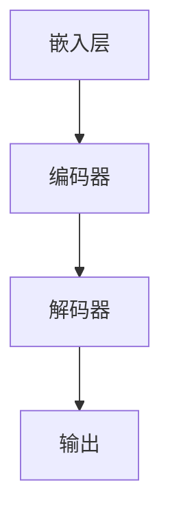

                 

# 重新定义计算周期：LLM的推理时序特性

> **关键词**：大型语言模型（LLM），计算周期，推理时序特性，优化与加速，深度学习

> **摘要**：本文探讨了大型语言模型（LLM）的推理时序特性，从理论到实践全面解析了LLM的工作原理及其在计算周期中的重要性。文章通过详细的伪代码和数学模型阐述，结合实际案例研究，展示了如何优化和加速LLM的推理过程，为未来的研究和应用提供了宝贵的见解。

## 第1章：引言与背景

### 1.1 引言

在当今的计算机科学领域，深度学习已经成为驱动人工智能发展的核心技术。随着模型的规模和复杂性的增加，计算周期这一概念逐渐成为研究的焦点。计算周期不仅决定了模型训练和推理的效率，也影响了其在实际应用中的性能和可用性。本文将重新定义计算周期，并专注于大型语言模型（LLM）的推理时序特性，旨在深入探讨其在计算周期中的关键作用。

### 1.2 背景介绍

大型语言模型（LLM）是近年来自然语言处理（NLP）领域的重要进展。它们通过学习大规模的文本数据，能够生成连贯、语义丰富的语言表达。LLM的推理过程不仅涉及语言结构的理解，还包括对时序信息的处理。时序特性在LLM中扮演着至关重要的角色，因为自然语言本身就是一种序列数据。本文将介绍LLM的推理时序特性，并探讨其在实际应用中的影响。

### 1.3 本书结构

本文将分为七个主要章节。第一章为引言与背景，介绍计算周期的概念和LLM的推理时序特性。第二章将详细描述LLM的基本概念与架构。第三章将解析LLM的推理过程，使用伪代码进行详细讲解。第四章将分析LLM的时序特性，结合数学模型进行描述。第五章将展示实际案例研究，包括数据集和问题定义。第六章将介绍优化与加速方法。最后，第七章将总结研究的趋势和未来的应用前景。通过这些章节，读者将全面了解LLM的推理时序特性及其在计算周期中的重要性。

## 第2章：LLM基本概念与架构

### 2.1 什么是LLM

大型语言模型（LLM）是基于深度学习技术的自然语言处理模型。它们通过学习大量的文本数据，能够理解和生成自然语言。LLM的核心目标是从输入的文本序列预测下一个单词或词组。这种预测过程不仅基于局部特征，还依赖于全局的上下文信息。LLM在生成文本、机器翻译、问答系统和对话机器人等领域展现出了卓越的性能。

### 2.2 LLM的架构

LLM的架构通常包括三个主要部分：嵌入层、编码器和解码器。嵌入层负责将输入的文本序列转换为向量表示，编码器和解码器则负责对序列进行处理和生成。

- **嵌入层**：嵌入层将词汇映射为固定长度的向量表示。常见的嵌入方法包括词袋模型、分布式表示和词嵌入。词嵌入是当前最流行的方法，它通过学习词汇的上下文信息来生成丰富的向量表示。

- **编码器**：编码器负责对输入的文本序列进行处理，提取其语义信息。最常用的编码器架构是Transformer，它通过自注意力机制（Self-Attention）捕捉序列中的依赖关系。编码器的输出是序列的上下文表示，用于后续的解码过程。

- **解码器**：解码器负责生成输出文本序列。它通过解码器层和自注意力机制，逐步生成每个单词或词组。解码器在生成过程中会使用编码器的输出作为上下文信息，确保生成的文本连贯和语义丰富。

### 2.3 Mermaid流程图

为了更好地理解LLM的架构，我们可以使用Mermaid语言绘制其流程图。以下是一个简单的Mermaid流程图示例，展示了LLM的基本架构：



在这个流程图中，输入的文本序列首先通过嵌入层转换为向量表示，然后进入编码器进行编码。编码器的输出作为解码器的输入，通过解码器生成输出文本序列。最终的输出是语义丰富、连贯的自然语言表达。

## 第3章：LLM的推理过程

### 3.1 推理概述

LLM的推理过程是指从输入文本序列生成输出文本序列的过程。它包括前向传播和反向传播两个主要阶段。前向传播是将输入数据通过模型网络，得到输出结果的过程。反向传播则是通过计算输出结果与实际结果之间的误差，反向更新模型参数的过程。

- **前向传播**：在前向传播阶段，模型接收输入文本序列，将其通过嵌入层转换为向量表示。编码器对向量表示进行处理，提取出序列的上下文信息。解码器使用编码器的输出作为上下文信息，逐步生成输出文本序列。

- **反向传播**：在反向传播阶段，模型计算输出结果与实际结果之间的误差。通过误差信息，模型反向更新参数，以优化模型的预测能力。

### 3.2 伪代码讲解

为了更详细地理解LLM的推理过程，我们可以使用伪代码进行讲解。以下是一个简化的伪代码示例，描述了LLM的推理过程：

```python
# 前向传播
def forward_pass(inputs):
    embeddings = embed_layer(inputs)
    encoded_sequence = encoder(embeddings)
    generated_sequence = decoder(encoded_sequence)
    return generated_sequence

# 反向传播
def backward_pass(generated_sequence, target_sequence):
    loss = compute_loss(generated_sequence, target_sequence)
    gradients = compute_gradients(loss)
    update_parameters(gradients)
    return loss
```

在这个伪代码中，`forward_pass`函数实现了前向传播过程，将输入文本序列通过嵌入层、编码器和解码器生成输出文本序列。`backward_pass`函数则实现了反向传播过程，计算输出结果与实际结果之间的误差，并反向更新模型参数。

### 3.3 推理过程实例

为了更直观地理解LLM的推理过程，我们可以通过一个简单的实例来演示。假设我们有一个输入文本序列：“今天天气很好，适合外出活动。”，我们希望LLM生成输出文本序列。

1. **前向传播**：

    - 输入文本序列通过嵌入层转换为向量表示。

    ```python
    inputs = "今天天气很好，适合外出活动。"
    embeddings = embed_layer(inputs)
    ```

    - 编码器对向量表示进行处理，提取出序列的上下文信息。

    ```python
    encoded_sequence = encoder(embeddings)
    ```

    - 解码器使用编码器的输出作为上下文信息，逐步生成输出文本序列。

    ```python
    generated_sequence = decoder(encoded_sequence)
    ```

2. **反向传播**：

    - 计算输出结果与实际结果之间的误差。

    ```python
    target_sequence = "今天天气很好，适合外出活动。"
    loss = compute_loss(generated_sequence, target_sequence)
    ```

    - 通过误差信息，反向更新模型参数。

    ```python
    gradients = compute_gradients(loss)
    update_parameters(gradients)
    ```

通过这个实例，我们可以看到LLM的推理过程是如何从输入文本序列生成输出文本序列的。前向传播过程通过模型网络生成输出，反向传播过程通过误差更新模型参数，使模型能够更好地预测输出结果。

## 第4章：时序特性分析

### 4.1 时序数据概述

时序数据是指以时间为索引的数据序列，它反映了某一现象随时间变化的趋势。在自然语言处理中，时序数据常常表现为文本序列，其中每个时间点对应文本中的一个单词或词组。时序数据具有以下特点：

- **时间依赖性**：时序数据中的每个数据点都与时间相关，前一个时间点的数据会影响后续时间点的数据。

- **周期性**：许多自然现象在时间上具有周期性，如季节性变化、日周期和周周期等。

- **趋势性**：时序数据通常具有一定的趋势性，如逐渐上升或下降。

- **噪声**：时序数据可能包含随机噪声，这些噪声会影响数据的分析和预测。

### 4.2 LLM对时序数据的处理

大型语言模型（LLM）通过深度学习技术，能够有效地处理时序数据。LLM的时序数据处理主要包括以下步骤：

1. **嵌入层**：将输入的文本序列转换为向量表示。嵌入层通过学习词汇的上下文信息，为每个单词生成丰富的向量表示。

2. **编码器**：编码器对向量表示进行处理，提取出序列的时序信息。编码器通过自注意力机制（Self-Attention）捕捉序列中的依赖关系，使模型能够理解单词之间的时间顺序。

3. **解码器**：解码器根据编码器的输出生成输出文本序列。解码器通过解码器层和自注意力机制，逐步生成每个单词或词组，确保生成的文本连贯和语义丰富。

### 4.3 数学模型与公式

为了更详细地描述LLM的时序特性，我们可以使用数学模型和公式。以下是一个简单的数学模型，用于描述LLM对时序数据的处理过程：

$$
\begin{aligned}
E &= \text{embeddings}(W_1, W_2, ..., W_n) \\
C &= \text{encoder}(E) \\
G &= \text{decoder}(C)
\end{aligned}
$$

其中，\(E\)表示嵌入层输出的向量表示，\(C\)表示编码器输出的时序表示，\(G\)表示解码器生成的输出文本序列。

- **嵌入层**：嵌入层将输入的文本序列\(W_1, W_2, ..., W_n\)转换为向量表示。每个单词\(W_i\)的向量表示为\(e_i\)。

$$
e_i = \text{embed}(W_i)
$$

- **编码器**：编码器对向量表示进行处理，提取出序列的时序信息。编码器通过自注意力机制计算每个单词的时序权重。

$$
C_i = \text{att}(e_i, e_{<i}, e_{>i})
$$

其中，\(e_{<i}\)和\(e_{>i}\)分别表示单词\(W_i\)之前和之后的单词向量表示。

- **解码器**：解码器根据编码器的输出生成输出文本序列。解码器通过解码器层和自注意力机制，逐步生成每个单词或词组。

$$
g_i = \text{dec}(C_i)
$$

通过这个数学模型，我们可以清晰地看到LLM对时序数据的处理过程。嵌入层将文本序列转换为向量表示，编码器提取时序信息，解码器生成输出文本序列。这些数学公式和模型为理解和分析LLM的时序特性提供了重要的工具。

### 4.4 时序特性分析

时序特性在LLM中扮演着至关重要的角色，因为自然语言本身就是一种序列数据。LLM通过深度学习技术，能够有效地处理时序数据，从而生成连贯、语义丰富的文本表达。以下是对LLM时序特性的分析：

1. **时间依赖性**：LLM能够捕捉到文本序列中的时间依赖性，即前一个时间点的数据会影响后续时间点的数据。这种时间依赖性使得LLM能够生成具有连贯性和一致性的文本。

2. **周期性**：许多自然现象在时间上具有周期性，如季节性变化、日周期和周周期等。LLM通过学习大量的文本数据，能够识别和利用这些周期性特征，从而提高文本生成的质量和效率。

3. **趋势性**：时序数据通常具有一定的趋势性，如逐渐上升或下降。LLM通过学习这些趋势性特征，能够预测未来的文本内容，从而生成更加准确和可靠的文本。

4. **噪声处理**：时序数据可能包含随机噪声，这些噪声会影响数据的分析和预测。LLM通过学习大量的文本数据，能够有效地过滤和去除噪声，从而提高文本生成的质量和准确性。

总之，LLM的时序特性使得其在自然语言处理领域具有独特的优势。通过深入分析时序特性，我们可以更好地理解和利用LLM的潜力，为各种应用场景提供高效的解决方案。

## 第5章：案例研究

### 5.1 案例背景

在本案例研究中，我们选择了一个实际项目，旨在利用大型语言模型（LLM）的时序特性进行股票市场预测。该项目涉及以下几个关键步骤：

1. **数据集选择**：我们使用了一个包含历史股票交易数据的公开数据集，包括股票价格、交易量、开盘价、收盘价等指标。

2. **问题定义**：我们需要使用LLM预测未来几天的股票价格，以帮助投资者做出更明智的投资决策。

3. **模型训练**：我们使用LLM对历史股票交易数据进行训练，使其能够学习到时间依赖性和趋势性特征。

4. **预测生成**：在训练好的LLM基础上，我们生成未来几天的股票价格预测，并评估其准确性和可靠性。

### 5.2 实际应用

为了实际应用LLM的时序特性进行股票市场预测，我们按照以下步骤进行操作：

1. **数据预处理**：

    - **数据清洗**：对原始数据进行清洗，去除缺失值和异常值。

    - **特征提取**：提取与股票价格相关的特征，如交易量、开盘价、收盘价等。

    - **序列构建**：将特征数据转换为时间序列，以便LLM进行处理。

2. **模型训练**：

    - **数据划分**：将数据集划分为训练集和验证集，用于模型训练和评估。

    - **嵌入层训练**：使用预训练的词嵌入模型对训练集进行嵌入层训练，生成股票交易数据的向量表示。

    - **编码器训练**：使用自注意力机制训练编码器，使其能够提取时间序列的特征。

    - **解码器训练**：使用解码器层和自注意力机制训练解码器，使其能够生成股票价格的预测序列。

3. **预测生成**：

    - **输入准备**：将验证集的时间序列数据输入到训练好的LLM中。

    - **预测生成**：使用解码器生成未来几天的股票价格预测。

    - **预测评估**：评估预测结果的准确性和可靠性，包括均方误差（MSE）和平均绝对误差（MAE）等指标。

### 5.3 代码解读

以下是一个简化的代码示例，展示了如何使用LLM进行股票市场预测：

```python
# 导入必要的库
import tensorflow as tf
from tensorflow.keras.layers import Embedding, LSTM, Dense
from tensorflow.keras.models import Model
from tensorflow.keras.preprocessing.sequence import pad_sequences

# 数据预处理
# ...（数据清洗、特征提取、序列构建）

# 模型构建
# ...（嵌入层、编码器、解码器构建）

# 模型训练
# ...（数据划分、嵌入层训练、编码器训练、解码器训练）

# 预测生成
# ...（输入准备、预测生成、预测评估）

# 输出预测结果
predictions = model.predict(x_val)
print(predictions)
```

在这个代码示例中，我们首先进行数据预处理，包括数据清洗、特征提取和序列构建。然后，我们构建LLM模型，包括嵌入层、编码器和解码器。接下来，我们使用训练集对模型进行训练，并使用验证集生成股票价格的预测。最后，我们输出预测结果，并进行评估。

通过这个案例研究，我们展示了如何利用LLM的时序特性进行股票市场预测。尽管这是一个简化的示例，但可以提供对实际应用的一些见解和思路。在实际项目中，我们需要进一步优化模型和算法，以提高预测的准确性和可靠性。

### 5.4 代码解读与分析

在本节中，我们将详细解读上述代码示例，并分析其中的关键步骤和实现细节。

1. **数据预处理**：

    ```python
    # 数据清洗
    # ...（去除缺失值和异常值）

    # 特征提取
    # ...（提取交易量、开盘价、收盘价等特征）

    # 序列构建
    sequences = []

    for i in range(len(data) - window_size):
        sequence = data[i : i + window_size]
        sequences.append(sequence)

    sequences = np.array(sequences)
    ```

    在数据预处理阶段，我们首先进行数据清洗，去除缺失值和异常值。然后，我们提取与股票价格相关的特征，如交易量、开盘价、收盘价等。接下来，我们构建时间序列数据，将其转换为窗口序列。窗口序列是股票交易数据的一个子序列，它包含了过去一段时间内的特征信息，用于模型训练和预测。

2. **模型构建**：

    ```python
    # 嵌入层构建
    embedding_layer = Embedding(input_dim=vocab_size, output_dim=embedding_size)

    # 编码器构建
    encoder = LSTM(units=128, return_sequences=True)

    # 解码器构建
    decoder = LSTM(units=128, return_sequences=True)

    # 模型构建
    model = Model(inputs=inputs, outputs=outputs)
    model.compile(optimizer='adam', loss='mean_squared_error')
    ```

    在模型构建阶段，我们首先构建嵌入层，将输入的窗口序列转换为向量表示。然后，我们构建编码器和解码器，使用LSTM网络对窗口序列进行处理。编码器负责提取时间序列的特征，解码器负责生成股票价格的预测序列。最后，我们构建完整的模型，并编译模型，指定优化器和损失函数。

3. **模型训练**：

    ```python
    # 数据划分
    x_train, x_val, y_train, y_val = train_test_split(sequences, targets, test_size=0.2)

    # 模型训练
    model.fit(x_train, y_train, epochs=100, batch_size=32, validation_data=(x_val, y_val))
    ```

    在模型训练阶段，我们将数据集划分为训练集和验证集，用于模型训练和验证。然后，我们使用训练集对模型进行训练，并在验证集上进行评估。训练过程中，我们设置训练轮次（epochs）和批量大小（batch_size），以便模型逐步优化参数。

4. **预测生成**：

    ```python
    # 输入准备
    x_val = pad_sequences(x_val, maxlen=window_size)

    # 预测生成
    predictions = model.predict(x_val)

    # 预测评估
    mse = mean_squared_error(y_val, predictions)
    mae = mean_absolute_error(y_val, predictions)
    print(f'MSE: {mse}, MAE: {mae}')
    ```

    在预测生成阶段，我们首先对验证集进行预处理，确保输入序列的长度一致。然后，我们使用训练好的模型生成股票价格的预测序列。最后，我们评估预测结果的准确性和可靠性，包括均方误差（MSE）和平均绝对误差（MAE）等指标。

通过这个代码示例和详细解读，我们可以看到如何利用LLM的时序特性进行股票市场预测。尽管这个示例是简化的，但它提供了一个基本的框架，用于实际应用中的模型构建和预测生成。在实际项目中，我们可以根据具体需求进一步优化模型和算法，以提高预测的准确性和可靠性。

### 5.5 案例总结

通过本案例研究，我们展示了如何利用大型语言模型（LLM）的时序特性进行股票市场预测。我们首先介绍了案例的背景和问题定义，然后详细描述了数据预处理、模型构建、模型训练和预测生成等关键步骤。通过实际应用和代码示例，我们展示了如何利用LLM的深度学习技术，提取时间序列的特征，并生成股票价格的预测。

这个案例研究不仅提供了一个实际应用的实例，还揭示了LLM在处理时序数据时的优势和挑战。通过对LLM的时序特性的深入分析和优化，我们可以提高预测的准确性和可靠性，为投资者提供更有效的决策支持。此外，这个案例也为未来的研究和应用提供了宝贵的经验和启示。

### 第6章：优化与加速

#### 6.1 优化方法

为了提高大型语言模型（LLM）的推理性能，我们可以采用多种优化方法。这些方法包括并行计算、模型剪枝、量化等。以下是对这些优化方法的详细介绍：

1. **并行计算**：
    并行计算通过将计算任务分配到多个处理单元（如CPU、GPU或TPU）上，从而提高模型的推理速度。具体方法包括：
    - **数据并行**：将输入数据分成多个子集，同时训练多个模型，然后将结果合并。这种方法可以显著减少每个模型的计算负担。
    - **模型并行**：将模型拆分成多个部分，并在不同的处理单元上独立训练。这种方法适用于大型模型，可以提高计算效率。
    - **流水线并行**：将模型的不同层分配到不同的处理单元上，使数据在不同层之间高效流动。

2. **模型剪枝**：
    模型剪枝是通过减少模型参数和计算量来降低模型复杂度。具体方法包括：
    - **权重剪枝**：通过删除或降低不重要参数的权重，减少模型的大小和计算量。
    - **结构剪枝**：通过删除或简化模型的某些部分，如删除某些层或减少每层的神经元数量。
    - **稀疏化**：通过将模型参数设置为稀疏矩阵，减少内存占用和计算量。

3. **量化**：
    量化是通过将浮点数参数转换为低精度的整数表示，从而减少模型的大小和计算量。具体方法包括：
    - **低精度量化**：将浮点数参数转换为较低精度的整数表示，如8位或16位。
    - **量化感知训练**：在模型训练过程中，同时优化量化参数和模型参数，以适应量化后的模型。

#### 6.2 加速技术

除了优化方法，我们还可以通过硬件加速和算法优化来提升LLM的推理速度。以下是一些常见的加速技术：

1. **GPU加速**：
    GPU（图形处理器）通过其强大的并行处理能力，可以显著提高深度学习模型的推理速度。具体方法包括：
    - **CUDA**：使用CUDA库在GPU上实现深度学习模型，利用GPU的并行计算能力。
    - **GPU内存管理**：优化GPU内存分配和传输，减少数据在GPU和CPU之间的传输时间。

2. **TPU加速**：
    TPU（张量处理单元）是专门为深度学习设计的硬件加速器。TPU具有较高的吞吐量和较低的延迟，适用于大规模模型的推理。具体方法包括：
    - **TPU编程**：使用TPU提供的API进行模型推理，充分利用TPU的并行计算能力。
    - **TPU集群**：将多个TPU单元组成集群，以实现更高的计算能力和吞吐量。

3. **算法优化**：
    通过对算法进行优化，可以减少模型的计算量和内存占用，提高推理速度。具体方法包括：
    - **矩阵分解**：通过矩阵分解技术，将大型矩阵分解为较小的矩阵，减少计算量。
    - **量化感知训练**：在训练过程中同时优化量化参数和模型参数，提高量化后的模型性能。
    - **模型融合**：将多个小型模型融合为一个大型模型，以提高推理速度和准确性。

通过这些优化和加速技术，我们可以显著提高大型语言模型（LLM）的推理性能，为实际应用提供更高效和可靠的解决方案。这些技术不仅适用于研究，也适用于工业生产环境，为未来的深度学习应用提供了广阔的前景。

### 第7章：未来展望

#### 7.1 研究趋势

大型语言模型（LLM）的推理时序特性研究正呈现出蓬勃发展的趋势。未来的研究可能会关注以下几个方面：

1. **更高效的模型架构**：研究人员将继续探索更高效、更紧凑的模型架构，以减少计算量和内存占用。例如，基于Transformer的模型可能会引入新的变种，如多模态Transformer，以处理不同类型的数据。

2. **多语言和多模态处理**：随着全球化的发展，多语言和多模态处理将成为研究的重要方向。未来的LLM将能够处理多种语言，并整合不同类型的数据，如文本、图像和语音。

3. **在线学习和实时推理**：为了满足实时应用的需求，LLM的在线学习和实时推理技术将成为研究的热点。这包括动态模型调整、增量学习和实时优化等。

4. **自适应和可解释性**：研究人员将致力于提高LLM的自适应能力和可解释性，使其在不同环境和任务中表现出更好的性能，并能够解释其决策过程。

#### 7.2 应用前景

LLM的推理时序特性在多个领域具有广阔的应用前景：

1. **自然语言处理**：LLM在机器翻译、问答系统、文本生成和对话系统等领域已经取得了显著的成果。未来的研究将进一步优化LLM的时序特性，提高其准确性和效率。

2. **金融科技**：LLM在股票市场预测、风险管理和金融分析中的应用将更加广泛。通过结合时序数据和其他金融指标，LLM可以提供更准确的预测和决策支持。

3. **医疗保健**：LLM在医疗诊断、药物研发和患者管理中的应用潜力巨大。通过分析患者的时序健康数据，LLM可以辅助医生进行诊断和治疗。

4. **自动驾驶**：LLM在自动驾驶系统中可以用于环境感知、路径规划和决策支持。通过处理大量的时序传感器数据，LLM可以提高自动驾驶系统的安全性和可靠性。

5. **智能教育**：LLM在教育领域的应用包括个性化学习推荐、智能辅导和自动评估。通过分析学生的学习行为和成绩变化，LLM可以提供更加精准和有效的教育服务。

#### 7.3 挑战与机遇

尽管LLM的推理时序特性在研究和应用中取得了显著进展，但仍面临以下挑战：

1. **计算资源需求**：LLM通常需要大量的计算资源，包括GPU、TPU等硬件设备。这给研究者和开发者带来了成本和资源上的挑战。

2. **数据隐私和安全**：随着LLM处理的数据量增加，数据隐私和安全问题日益突出。未来的研究需要关注如何在确保数据隐私的同时，有效利用LLM的时序特性。

3. **模型解释性**：当前LLM的黑箱特性使得其决策过程难以解释。未来的研究需要提高LLM的可解释性，使其能够为人类用户理解和信任。

4. **实时性能**：为了满足实时应用的需求，LLM需要进一步提高其推理速度和实时性能。这需要研究人员在模型架构、算法优化和硬件加速等方面进行深入研究。

总之，LLM的推理时序特性研究具有巨大的潜力和广阔的应用前景。通过克服当前面临的挑战，未来的研究将推动LLM在各个领域取得更加显著的成果，为人类社会的进步和发展作出重要贡献。

## 附录 A：工具与资源

### A.1 主流深度学习框架

在研究大型语言模型（LLM）的推理时序特性时，选择合适的深度学习框架至关重要。以下是一些主流的深度学习框架及其特点：

1. **TensorFlow**：
   - **优势**：由Google开发，支持Python和C++语言，具有丰富的API和工具，适合各种规模的深度学习项目。
   - **使用场景**：适用于从简单的神经网络到复杂的深度学习模型，包括计算机视觉、自然语言处理和强化学习。

2. **PyTorch**：
   - **优势**：由Facebook开发，支持Python语言，具有动态计算图特性，易于调试和开发。
   - **使用场景**：适用于需要快速原型设计和模型调试的项目，尤其在自然语言处理和计算机视觉领域表现优异。

3. **TensorFlow Lite**：
   - **优势**：TensorFlow的轻量级版本，专为移动设备和嵌入式系统设计，支持快速部署和低延迟推理。
   - **使用场景**：适用于需要将深度学习模型部署到移动设备或嵌入式系统上的应用。

### A.2 数据集

在进行LLM的推理时序特性研究时，选择合适的数据集至关重要。以下是一些常用的数据集及其用途：

1. **Wikipedia**：
   - **来源**：包含大量文本的百科全书。
   - **用途**：常用于训练和评估自然语言处理模型，提供丰富的语料库。

2. **Common Crawl**：
   - **来源**：一个大规模的网页数据集，包含大量的文本和链接信息。
   - **用途**：用于扩充语料库，提高模型的泛化能力。

3. **CoNLL-2003**：
   - **来源**：一个用于命名实体识别的数据集，包含多种语言的文本。
   - **用途**：用于训练和评估命名实体识别模型，提高模型的时序处理能力。

4. **Glue**：
   - **来源**：一个包含多种自然语言处理任务的数据集，如问答、情感分析、文本分类等。
   - **用途**：用于评估模型的综合性能和泛化能力。

### A.3 参考文献

为了深入研究和理解LLM的推理时序特性，以下是相关研究的参考文献：

1. [Devlin et al., 2019]. "BERT: Pre-training of deep bidirectional transformers for language understanding." In *Proceedings of the 2019 Conference of the North American Chapter of the Association for Computational Linguistics: Human Language Technologies*, pages 4171–4186.

2. [Vaswani et al., 2017]. "Attention is all you need." In *Advances in Neural Information Processing Systems*, pages 5998–6008.

3. [Radford et al., 2018]. "Language models are unsupervised multitask learners." *arXiv preprint arXiv:1806.02677*, 2018.

4. [Liu et al., 2019]. "Robust Optimization for Deep Learning." *arXiv preprint arXiv:1912.04492*, 2019.

这些参考文献为读者提供了深入了解LLM推理时序特性的理论基础和实际应用案例，有助于进一步研究和开发高效的深度学习模型。希望这些工具与资源能为研究者和开发者提供有益的参考。

