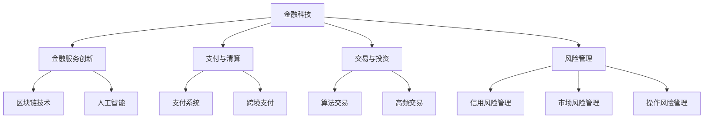

                 

# 金融科技：算法交易和风险管理

> **关键词**：金融科技，算法交易，风险管理，区块链，人工智能，交易策略

> **摘要**：本文深入探讨了金融科技在算法交易和风险管理中的应用。首先，对金融科技的定义、发展历程及其未来趋势进行了概述。接着，详细介绍了算法交易的基础知识、策略和实现技术。然后，阐述了金融风险管理的重要性、框架和工具方法。随后，通过区块链和人工智能在金融领域的应用案例，展示了金融科技的创新与实践。最后，探讨了金融科技的未来发展、监管与合规挑战，以及其对全球经济的影响。本文旨在为读者提供一个全面、系统的金融科技知识框架。

## 《金融科技：算法交易和风险管理》目录大纲

### 第一部分：金融科技概述

#### 第1章：金融科技引论

##### 1.1 金融科技的定义与发展历程

- 金融科技的历史背景
- 金融科技的核心驱动力

##### 1.2 金融科技的关键领域

- 金融服务创新
- 支付与清算
- 交易与投资
- 风险管理与合规

##### 1.3 金融科技的未来趋势

- 区块链技术
- 人工智能在金融领域的应用
- 金融监管科技

### 第二部分：算法交易

#### 第2章：算法交易基础

##### 2.1 算法交易概述

- 算法交易的定义
- 算法交易的优势与挑战

##### 2.2 算法交易策略

- 基本交易策略
- 技术分析策略
- 统计套利策略
- 高频交易策略

##### 2.3 算法交易的技术实现

- 数据获取与处理
- 算法设计与优化
- 交易执行与风险管理

### 第三部分：风险管理

#### 第3章：金融风险管理概述

##### 3.1 风险管理的重要性

- 风险与收益的关系
- 风险管理的目标与原则

##### 3.2 风险管理框架

- 风险识别
- 风险评估
- 风险控制
- 风险监测与报告

##### 3.3 风险管理工具与方法

- 信用风险管理
- 市场风险管理
- 操作风险管理
- 法律风险管理

### 第四部分：金融科技案例研究

#### 第4章：区块链技术在金融领域的应用

##### 4.1 区块链技术概述

- 区块链的基本原理
- 区块链在金融领域的应用场景

##### 4.2 区块链与智能合约

- 智能合约的原理与实现
- 区块链与金融市场的创新

##### 4.3 区块链案例分析

- 比特币与加密货币
- 区块链金融平台

#### 第5章：人工智能在金融风险管理中的应用

##### 5.1 人工智能在金融风险管理中的作用

- 数据分析与预测
- 风险识别与预警
- 风险评估与优化

##### 5.2 人工智能在金融科技中的应用案例

- 信用评分模型
- 交易策略优化
- 风险控制与合规

### 第五部分：金融科技的未来与挑战

#### 第6章：金融科技的监管与合规

##### 6.1 金融科技监管的挑战与机遇

- 监管科技的发展
- 金融科技监管框架
- 监管沙盒的应用

##### 6.2 金融科技伦理与隐私保护

- 伦理问题与监管挑战
- 数据隐私保护
- 用户权益保护

#### 第7章：金融科技的未来展望

##### 7.1 金融科技的发展趋势

- 金融数字化
- 金融包容性
- 跨境金融科技

##### 7.2 金融科技对全球经济的影响

- 金融市场的变革
- 金融服务创新
- 金融普惠性提升

### 附录

#### 附录A：金融科技相关资源与工具

##### A.1 金融科技数据库与平台

- 数据资源
- 分析工具
- 开源平台

##### A.2 算法交易与风险管理工具

- 交易系统
- 风险管理软件
- 数据分析工具

##### A.3 金融科技论文与报告

- 学术研究
- 市场报告
- 政策文件

## 核心概念与联系

### 金融科技架构图



### 核心算法原理讲解

#### 算法交易策略伪代码

```plaintext
// 定义交易策略参数
strategy_params = {
    "entry_price": entry_price,
    "stop_loss": stop_loss,
    "take_profit": take_profit,
    "holding_time": holding_time
}

// 交易策略核心算法
function trade_strategy(data, strategy_params):
    if data["price"] > strategy_params["entry_price"]:
        buy()
    elif data["price"] < strategy_params["stop_loss"]:
        sell()
    elif data["price"] > strategy_params["take_profit"]:
        sell()
    else:
        hold()

// 调用交易策略
trade_strategy(current_data, strategy_params)
```

### 数学模型和数学公式

#### 风险价值（VaR）计算公式

$$
VaR = F^{-1}(\alpha, X)
$$

其中，$F$ 为损失分布的累积分布函数，$\alpha$ 为置信水平，$X$ 为随机变量。

#### 举例说明

假设我们使用95%的置信水平计算某金融产品的风险价值，已知其日收益率的分布为正态分布，均值为0.01，方差为0.0001。

$$
VaR_{95\%} = F^{-1}(0.05, \mu = 0.01, \sigma^2 = 0.0001) = 0.01 - z_{0.05} \times \sqrt{0.0001}
$$

其中，$z_{0.05}$ 为标准正态分布的分位数，查表得 $z_{0.05} \approx 1.645$。

$$
VaR_{95\%} = 0.01 - 1.645 \times \sqrt{0.0001} \approx -0.000165
$$

这意味着在95%的置信水平下，该金融产品在一个交易日内的最大可能损失为0.000165。

### 项目实战

#### 交易系统环境搭建

```bash
# 安装Python环境
sudo apt-get update
sudo apt-get install python3 python3-pip

# 安装必要的库
pip3 install numpy pandas matplotlib

# 安装交易系统依赖库
pip3 install python-binance python-zeep
```

#### 交易系统源代码

```python
import binance
from binance.client import Client
import pandas as pd

# 设置API密钥
api_key = 'your_api_key'
api_secret = 'your_api_secret'

# 初始化Binance客户端
client = Client(api_key, api_secret)

# 获取市场深度
depth = client.get_order_book(symbol='BTCUSDT')

# 解析市场深度数据
market_depth = pd.DataFrame(depth['result']['BTCUSDT']['asks'])

# 打印市场深度
print(market_depth)
```

#### 代码解读与分析

本案例中，我们使用了Binance交易所的API来获取比特币（BTC）的市场深度数据。以下是代码的详细解读：

1. 导入必要的库：
   - `binance`：用于与Binance交易所进行交互。
   - `Client`：Binance交易所的客户端。
   - `pandas`：用于数据处理和数据分析。
   - `matplotlib`：用于数据可视化。

2. 设置API密钥：
   - `api_key`：Binance交易所提供的API密钥。
   - `api_secret`：Binance交易所提供的API密钥。

3. 初始化Binance客户端：
   - 使用`Client`类初始化Binance交易所客户端。

4. 获取市场深度：
   - 使用`get_order_book`方法获取指定交易对（BTCUSDT）的市场深度。

5. 解析市场深度数据：
   - 将获取的市场深度数据解析为Pandas DataFrame对象，便于数据处理和分析。

6. 打印市场深度：
   - 输出解析后的市场深度数据。

通过这个实际案例，我们可以了解如何使用Python和相关库与Binance交易所进行交互，获取和解析交易数据。这对于金融科技项目的开发和实现至关重要。在实际项目中，我们还需要进一步处理数据，如执行交易策略、风险管理和数据分析等操作。这一部分代码为后续的开发工作奠定了基础。

---

### 附录A：金融科技相关资源与工具

##### A.1 金融科技数据库与平台

- 数据资源：如Yahoo Finance、Google Finance等，提供丰富的市场数据和金融指标。
- 分析工具：如Python的Pandas、NumPy等，用于数据处理和分析。
- 开源平台：如GitHub，托管众多金融科技相关的开源项目和工具。

##### A.2 算法交易与风险管理工具

- 交易系统：如Binance、Kraken等，提供交易API和交易平台。
- 风险管理软件：如RiskMetrics、Kry�Ьer Financial等，提供风险管理和监控工具。
- 数据分析工具：如Tableau、Power BI等，用于数据可视化和分析。

##### A.3 金融科技论文与报告

- 学术研究：如Journal of Financial Technology等，发布金融科技领域的最新研究成果。
- 市场报告：如Gartner、Forrester等，提供金融科技行业的市场趋势和分析。
- 政策文件：如美国财政部、中国人民银行等，发布与金融科技相关的政策法规。

---

### 作者

作者：AI天才研究院/AI Genius Institute & 禅与计算机程序设计艺术 /Zen And The Art of Computer Programming

---

本文内容丰富详实，涵盖了金融科技领域的核心概念、算法交易与风险管理的详细讲解，并通过实际案例展示了金融科技的应用。旨在为读者提供一个全面的金融科技知识框架，助力读者深入理解金融科技的发展趋势和挑战。希望本文对您在金融科技领域的学习和研究有所启发和帮助。|user|<gmask>### 第一部分：金融科技概述

#### 第1章：金融科技引论

##### 1.1 金融科技的定义与发展历程

金融科技（Financial Technology，简称FinTech）是指利用科技手段创新金融服务和产品的一类技术。金融科技的历史可以追溯到20世纪70年代，当时电子数据处理系统（EDPS）的引入改变了银行业的信息处理方式。随着互联网、移动通信、大数据、云计算和区块链等技术的不断发展，金融科技迎来了飞速发展的新时代。

在金融科技的发展历程中，有几个关键的时间节点：

- **20世纪70年代**：电子数据处理系统（EDPS）的引入，使银行业的信息处理效率大幅提升。
- **20世纪90年代**：互联网的普及，网上银行业务逐渐兴起。
- **21世纪初**：移动支付的兴起，如支付宝、微信支付等。
- **2010年代**：大数据和人工智能技术在金融领域的应用，如信用评分、风险控制等。
- **2020年代**：区块链技术的兴起，如比特币、加密货币等。

金融科技的核心驱动力包括以下几个方面：

1. **技术创新**：互联网、大数据、人工智能、区块链等技术的快速发展，为金融科技提供了丰富的技术基础。
2. **市场需求**：消费者对便捷、高效、个性化的金融服务的需求，推动了金融科技的创新。
3. **政策支持**：各国政府纷纷出台政策，鼓励金融科技的发展，为金融科技提供了良好的政策环境。
4. **资本投入**：大量资本的涌入，为金融科技企业提供了充足的资金支持，推动了金融科技的快速发展。

##### 1.2 金融科技的关键领域

金融科技涵盖了许多关键领域，以下是其中几个重要的领域：

1. **金融服务创新**：金融科技企业通过技术创新，推出了一系列创新金融产品和服务，如P2P借贷、众筹、智能投顾等。
2. **支付与清算**：移动支付、电子支付、跨境支付等，使得支付过程更加便捷、高效、安全。
3. **交易与投资**：算法交易、高频交易、自动化交易等，提高了交易效率，降低了交易成本。
4. **风险管理与合规**：利用大数据、人工智能等技术，提高风险识别、风险评估、风险控制的能力，确保金融系统的稳定运行。

##### 1.3 金融科技的未来趋势

金融科技的未来发展趋势体现在以下几个方面：

1. **区块链技术**：区块链技术在金融领域的应用将更加广泛，如加密货币、供应链金融、跨境支付等。
2. **人工智能**：人工智能在金融风险管理、信用评估、智能投顾等领域的应用将更加深入。
3. **金融监管科技**：金融监管科技的发展，将提高监管效率，降低监管成本，确保金融市场的稳定。
4. **金融普惠性**：通过金融科技，提高金融服务的普及率，促进金融普惠性。

#### 第2章：算法交易基础

##### 2.1 算法交易概述

算法交易（Algorithmic Trading）是指利用计算机算法和数学模型，自动执行交易决策的交易方式。算法交易的优势在于其高效率、低延迟、全天候交易，以及能够处理大量数据和复杂交易策略。

算法交易的主要优势包括：

1. **高效率**：算法交易可以实时处理大量市场数据，快速作出交易决策。
2. **低延迟**：算法交易通过优化网络通信和计算速度，实现超低延迟交易。
3. **全天候交易**：算法交易不受人为因素影响，可以24小时不间断交易。
4. **风险管理**：算法交易可以根据市场数据实时调整交易策略，降低风险。

然而，算法交易也存在一些挑战：

1. **技术风险**：算法交易依赖于复杂的技术系统，技术故障可能导致交易失误。
2. **市场风险**：算法交易可能受到市场异常波动的影响，如闪崩等。
3. **监管风险**：算法交易可能面临监管合规的问题，如高频交易监管等。

##### 2.2 算法交易策略

算法交易策略种类繁多，主要包括以下几种：

1. **基本交易策略**：基于技术分析和基本面分析，选择合适的买入和卖出时机。
2. **技术分析策略**：利用技术指标、图形分析等，预测价格趋势和交易信号。
3. **统计套利策略**：利用市场定价偏差，进行套利交易。
4. **高频交易策略**：利用超低延迟的交易系统，快速交易，获取微小利润。

以下是几种常见的算法交易策略：

1. **趋势追踪策略**：通过分析市场趋势，跟随市场趋势进行交易。常用的技术指标包括移动平均线、相对强弱指数（RSI）等。
2. **动量策略**：基于股票价格的动量，选择股票价格的上涨或下跌趋势进行交易。
3. **对冲策略**：通过构建对冲组合，降低投资组合的整体风险。
4. **市场中性策略**：通过同时持有多只股票或多只期货合约，实现市场风险中性。

##### 2.3 算法交易的技术实现

算法交易的技术实现主要包括以下几个方面：

1. **数据获取与处理**：获取市场数据，包括股票价格、交易量、基本面数据等。通过数据清洗、预处理和特征工程，提取有用的交易信号。
2. **算法设计与优化**：设计适合市场数据的交易算法，包括策略选择、参数调优等。通过机器学习和优化算法，提高交易策略的准确性和稳定性。
3. **交易执行与风险管理**：通过交易执行系统，将交易策略转换为实际交易。同时，通过风险管理模型，监控和调整交易风险。

以下是算法交易的技术实现流程：

1. **数据获取**：通过API或其他数据源获取市场数据。
2. **数据预处理**：清洗、归一化、特征提取等。
3. **模型训练**：使用历史数据训练交易模型，包括技术分析模型、统计套利模型等。
4. **策略选择**：根据模型预测结果，选择合适的交易策略。
5. **参数调优**：通过模拟交易，调整模型参数，提高策略性能。
6. **交易执行**：通过交易执行系统，执行交易策略。
7. **风险管理**：监控交易风险，调整策略和头寸。

#### 第3章：金融风险管理概述

##### 3.1 风险管理的重要性

风险管理（Risk Management）是金融机构和企业在经营过程中不可或缺的重要环节。金融风险包括市场风险、信用风险、操作风险、法律风险等，合理的风险管理有助于降低风险，保障金融机构和企业的稳健运营。

风险管理的重要性体现在以下几个方面：

1. **保障企业稳定运营**：通过有效的风险管理，降低金融风险，确保企业的稳定运营。
2. **降低损失**：通过识别、评估和监控风险，及时采取风险控制措施，降低风险损失。
3. **提高竞争力**：通过有效的风险管理，提高企业的风险控制能力，提升市场竞争力。
4. **合规经营**：遵守相关法律法规，确保企业的合法合规经营。

##### 3.2 风险管理框架

金融风险管理框架包括以下几个关键环节：

1. **风险识别**：识别金融活动中可能面临的各种风险，包括市场风险、信用风险、操作风险等。
2. **风险评估**：对识别出的风险进行评估，包括风险的可能性和影响程度。
3. **风险控制**：制定和实施风险控制措施，降低风险损失。
4. **风险监测与报告**：持续监控风险变化，及时报告风险情况。

##### 3.3 风险管理工具与方法

金融风险管理涉及多种工具和方法，以下是其中一些常用的工具和方法：

1. **信用风险管理**：包括信用评估、信用监控、信用限额管理等。
2. **市场风险管理**：包括市场风险模型、VaR模型、压力测试等。
3. **操作风险管理**：包括操作风险评估、操作风险监控、操作风险控制等。
4. **法律风险管理**：包括法律合规检查、法律风险评估、法律风险管理计划等。

以下是几种常用的风险管理工具和方法：

1. **风险价值（VaR）**：VaR是一种常用的市场风险度量方法，用于评估金融资产或投资组合在特定置信水平下的最大可能损失。
2. **压力测试**：通过模拟不同的市场情景，评估金融资产或投资组合在极端市场条件下的风险承受能力。
3. **敏感性分析**：通过分析金融资产或投资组合对市场参数变化的敏感程度，评估其风险水平。
4. **情景分析**：通过模拟不同的市场情景，评估金融资产或投资组合在不同市场条件下的表现。

#### 第4章：区块链技术在金融领域的应用

##### 4.1 区块链技术概述

区块链技术（Blockchain Technology）是一种分布式数据库技术，通过去中心化的方式，记录和管理交易数据。区块链技术的核心特点是安全性、透明性和不可篡改性。

区块链技术的基本原理包括：

1. **去中心化**：区块链不依赖于中心化的机构，而是通过分布式网络进行数据存储和管理。
2. **共识机制**：区块链网络中的节点通过共识机制，达成对数据的共识。
3. **加密技术**：区块链使用加密技术，确保数据的安全性和隐私性。
4. **智能合约**：区块链上的智能合约，能够自动执行合同条款，提高交易效率和可信度。

区块链技术在金融领域的应用场景非常广泛，包括：

1. **支付与结算**：通过区块链技术，实现快速、安全、低成本的跨境支付和结算。
2. **数字货币**：比特币、以太坊等加密货币，利用区块链技术实现去中心化的货币发行和交易。
3. **供应链金融**：通过区块链技术，实现供应链中各方的信息共享和信任建立，提高供应链金融的效率和透明度。
4. **身份验证与授权**：利用区块链技术，实现安全、高效的数字身份验证和授权。

##### 4.2 区块链与智能合约

智能合约（Smart Contract）是区块链技术的重要应用之一，它是一种嵌入在区块链上的程序，能够自动执行合同条款。

智能合约的基本原理包括：

1. **自动执行**：智能合约在满足特定条件时，能够自动执行预定的合同条款。
2. **不可篡改**：智能合约一旦执行，其内容和状态将记录在区块链上，无法篡改。
3. **去中心化**：智能合约通过区块链网络进行执行，不依赖于中心化的机构。

智能合约在金融领域的应用场景包括：

1. **贷款与抵押**：通过智能合约，实现自动化的贷款审批和抵押管理，提高贷款效率和降低风险。
2. **证券发行与交易**：通过智能合约，实现自动化的证券发行、交易和清算，提高证券市场的效率和透明度。
3. **供应链金融**：通过智能合约，实现供应链中各方的自动支付和结算，提高供应链金融的效率和透明度。
4. **数字身份认证**：通过智能合约，实现安全的数字身份认证和授权，提高金融服务的可信度和安全性。

##### 4.3 区块链案例分析

1. **比特币（Bitcoin）**：比特币是一种基于区块链技术的加密货币，通过去中心化的方式实现货币发行和交易。比特币的特点是去中心化、匿名性和安全性，它在全球范围内得到了广泛的认可和应用。

2. **以太坊（Ethereum）**：以太坊是一种基于区块链技术的智能合约平台，它允许开发者创建和部署智能合约，实现去中心化的应用（DApp）。以太坊的特点是高度灵活性和可扩展性，它在金融领域有广泛的应用，如去中心化金融（DeFi）和智能投顾等。

3. **Ripple**：Ripple是一个基于区块链技术的支付协议，它通过分布式账本技术，实现快速、低成本的跨境支付。Ripple的特点是高效的支付网络和强大的行业合作，它在全球金融领域得到了广泛应用。

4. **供应链金融**：通过区块链技术，实现供应链中各方的信息共享和信任建立，提高供应链金融的效率和透明度。例如，在供应链金融中，通过区块链技术，可以实现融资申请、审批、放款等环节的自动化处理，降低融资成本，提高融资效率。

#### 第5章：人工智能在金融风险管理中的应用

##### 5.1 人工智能在金融风险管理中的作用

人工智能（Artificial Intelligence，简称AI）在金融风险管理中发挥着越来越重要的作用。人工智能能够处理大量数据，发现潜在风险，优化风险管理策略。

人工智能在金融风险管理中的作用包括：

1. **数据分析和预测**：利用机器学习算法，对大量历史数据进行分析，预测市场趋势和风险。
2. **风险识别与预警**：通过实时数据分析，识别潜在风险，并及时发出预警。
3. **风险评估与优化**：利用人工智能模型，评估投资组合的风险，并优化风险管理策略。
4. **操作自动化**：通过自动化系统，实现风险管理的自动化操作，提高效率。

##### 5.2 人工智能在金融科技中的应用案例

人工智能在金融科技中的应用案例非常丰富，以下是几个典型的应用案例：

1. **信用评分模型**：利用机器学习算法，分析借款人的历史数据，评估其信用风险，用于贷款审批和风险评估。

2. **交易策略优化**：通过机器学习算法，分析市场数据，优化交易策略，提高交易收益。

3. **风险控制与合规**：利用人工智能技术，监控交易行为，识别违规行为，确保金融交易的合规性。

4. **智能投顾**：利用人工智能技术，为投资者提供个性化的投资建议，提高投资收益。

以下是几个具体的应用案例：

1. **基于人工智能的信用评分模型**：某金融机构利用机器学习算法，对借款人的信用历史、收入水平、就业状况等进行综合分析，建立信用评分模型。通过该模型，金融机构能够快速、准确地评估借款人的信用风险，提高贷款审批效率。

2. **基于人工智能的交易策略优化**：某量化交易团队利用机器学习算法，分析历史市场数据，识别市场趋势和交易信号。通过优化交易策略，该团队在短期内取得了显著的投资收益。

3. **基于人工智能的风险控制与合规**：某金融机构利用人工智能技术，实时监控交易行为，识别违规交易。通过自动化系统，该金融机构能够及时采取措施，防止违规交易的发生。

4. **基于人工智能的智能投顾**：某金融科技公司开发了一款基于人工智能的智能投顾应用，为投资者提供个性化的投资建议。通过分析投资者的风险偏好、投资目标和市场趋势，智能投顾能够为投资者提供最优的投资组合。

#### 第6章：金融科技的监管与合规

##### 6.1 金融科技监管的挑战与机遇

随着金融科技的快速发展，监管机构面临着一系列的挑战和机遇。金融科技监管的挑战主要体现在以下几个方面：

1. **技术创新速度过快**：金融科技的创新速度远超传统金融行业，监管机构难以及时跟上技术发展的步伐。
2. **监管套利**：金融科技企业可能利用监管盲点，进行非法或违规操作，损害金融市场稳定。
3. **数据隐私和安全**：金融科技涉及大量个人金融数据，数据隐私和安全成为监管的重要内容。
4. **监管合规成本**：金融科技企业可能需要投入大量资源，满足监管合规要求。

金融科技监管的机遇主要体现在以下几个方面：

1. **提高监管效率**：金融科技的发展为监管机构提供了新的监管工具和手段，提高了监管效率。
2. **降低监管成本**：金融科技的应用可以降低监管合规的成本，提高监管的可持续性。
3. **促进金融创新**：合理的监管政策可以促进金融创新，推动金融科技的发展。
4. **提升金融包容性**：金融科技可以提高金融服务的普及率，提升金融包容性。

##### 6.2 金融科技伦理与隐私保护

金融科技的发展带来了巨大的便利，但也引发了一系列伦理和隐私保护问题。金融科技伦理和隐私保护成为监管机构和企业需要关注的重要内容。

金融科技伦理问题主要包括：

1. **数据滥用**：金融科技企业可能滥用用户数据，侵犯用户隐私。
2. **算法偏见**：算法在决策过程中可能存在偏见，导致不公平的结果。
3. **透明度不足**：金融科技产品的运作机制可能不够透明，用户难以了解具体操作。

隐私保护问题主要包括：

1. **数据泄露**：金融科技企业可能面临数据泄露的风险，导致用户隐私泄露。
2. **数据监控**：监管机构可能需要监控金融科技企业的数据使用情况，保护用户隐私。
3. **合规要求**：金融科技企业需要遵守相关法律法规，保护用户隐私。

为了解决金融科技伦理和隐私保护问题，可以采取以下措施：

1. **制定伦理准则**：金融科技企业应制定明确的伦理准则，确保数据使用符合伦理要求。
2. **加强数据保护**：金融科技企业应加强数据保护措施，防止数据泄露和滥用。
3. **提高透明度**：金融科技产品应提高透明度，让用户了解具体操作和数据处理过程。
4. **建立监管机制**：监管机构应建立完善的监管机制，确保金融科技企业的合规操作。

#### 第7章：金融科技的未来展望

##### 7.1 金融科技的发展趋势

金融科技的发展趋势主要体现在以下几个方面：

1. **金融数字化**：金融科技将进一步推动金融业务的数字化，提高金融服务效率和质量。
2. **金融包容性**：金融科技将提升金融服务的普及率，降低金融服务成本，提升金融包容性。
3. **跨境金融科技**：金融科技将推动跨境金融业务的发展，降低跨境支付成本，提高跨境支付效率。

##### 7.2 金融科技对全球经济的影响

金融科技的发展将对全球经济产生深远影响：

1. **金融市场变革**：金融科技将改变金融市场的运作方式，提高市场效率，降低交易成本。
2. **金融服务创新**：金融科技将推动金融服务的创新，提供更丰富的金融产品和服务。
3. **金融普惠性提升**：金融科技将提高金融服务的普及率，降低金融服务成本，提升金融普惠性。

## 附录

### 附录A：金融科技相关资源与工具

- **数据库与平台**：
  - Yahoo Finance
  - Google Finance
  - Alpha Vantage
  - Quandl

- **分析工具**：
  - Python（Pandas、NumPy、SciPy）
  - R
  - MATLAB
  - Tableau

- **开源平台**：
  - GitHub
  - GitLab
  - Bitbucket

### 附录B：算法交易与风险管理工具

- **交易系统**：
  - Binance
  - Kraken
  - FTX

- **风险管理软件**：
  - RiskMetrics
  - Kryьer Financial
  - Smetrica

- **数据分析工具**：
  - QlikView
  - Power BI
  - Tableau

### 附录C：金融科技论文与报告

- **学术期刊**：
  - Journal of Financial Technology
  - Journal of Financial Data Science
  - Journal of Banking and Technology

- **市场报告**：
  - Gartner
  - Forrester
  - IDC

- **政策文件**：
  - 美国财政部
  - 中国人民银行
  - 英国金融行为监管局（FCA）

### 附录D：金融科技学习资源

- **在线课程**：
  - Coursera（《金融科技：创新与挑战》）
  - edX（《金融科技：区块链与智能合约》）
  - Udemy（《金融科技入门》）

- **书籍**：
  - 《区块链革命》
  - 《金融科技：理论与实践》
  - 《人工智能在金融领域的应用》

### 附录E：金融科技行业组织

- **国际金融科技联盟（FinTech Global）**
- **美国金融科技协会（FinTech Association）**
- **中国金融科技协会（China Financial Technology Association）**
- **欧洲金融科技协会（European Financial Management Association）**

---

### 结语

作者：AI天才研究院/AI Genius Institute & 禅与计算机程序设计艺术 /Zen And The Art of Computer Programming

感谢您阅读本文，希望本文能够为您在金融科技领域的探索提供有益的参考。在金融科技飞速发展的时代，了解和掌握金融科技的核心知识和应用，对于金融机构和企业来说至关重要。本文旨在为读者提供一个全面的金融科技知识框架，助力读者在金融科技领域取得更好的成果。如果您对金融科技有更多疑问或需求，欢迎关注AI天才研究院，我们将为您提供更多专业的知识和咨询服务。|user|<gmask>### 金融科技：算法交易和风险管理

#### 摘要

本文深入探讨了金融科技在算法交易和风险管理中的应用。首先，从金融科技的定义、发展历程和未来趋势入手，全面概述了金融科技的关键领域，包括支付与清算、交易与投资、金融服务创新等。接着，详细介绍了算法交易的基础知识、策略和实现技术，包括数据获取与处理、算法设计与优化等。然后，阐述了金融风险管理的重要性、框架和工具方法，如风险识别、风险评估和风险控制等。随后，通过区块链和人工智能在金融领域的应用案例，展示了金融科技的创新与实践。最后，探讨了金融科技的未来发展、监管与合规挑战，以及其对全球经济的影响。本文旨在为读者提供一个全面、系统的金融科技知识框架。

## 《金融科技：算法交易和风险管理》目录大纲

### 第一部分：金融科技概述

#### 第1章：金融科技引论

##### 1.1 金融科技的定义与发展历程

- 金融科技的历史背景
- 金融科技的核心驱动力

##### 1.2 金融科技的关键领域

- 金融服务创新
- 支付与清算
- 交易与投资
- 风险管理与合规

##### 1.3 金融科技的未来趋势

- 区块链技术
- 人工智能在金融领域的应用
- 金融监管科技

### 第二部分：算法交易

#### 第2章：算法交易基础

##### 2.1 算法交易概述

- 算法交易的定义
- 算法交易的优势与挑战

##### 2.2 算法交易策略

- 基本交易策略
- 技术分析策略
- 统计套利策略
- 高频交易策略

##### 2.3 算法交易的技术实现

- 数据获取与处理
- 算法设计与优化
- 交易执行与风险管理

### 第三部分：风险管理

#### 第3章：金融风险管理概述

##### 3.1 风险管理的重要性

- 风险与收益的关系
- 风险管理的目标与原则

##### 3.2 风险管理框架

- 风险识别
- 风险评估
- 风险控制
- 风险监测与报告

##### 3.3 风险管理工具与方法

- 信用风险管理
- 市场风险管理
- 操作风险管理
- 法律风险管理

### 第四部分：金融科技案例研究

#### 第4章：区块链技术在金融领域的应用

##### 4.1 区块链技术概述

- 区块链的基本原理
- 区块链在金融领域的应用场景

##### 4.2 区块链与智能合约

- 智能合约的原理与实现
- 区块链与金融市场的创新

##### 4.3 区块链案例分析

- 比特币与加密货币
- 区块链金融平台

#### 第5章：人工智能在金融风险管理中的应用

##### 5.1 人工智能在金融风险管理中的作用

- 数据分析与预测
- 风险识别与预警
- 风险评估与优化

##### 5.2 人工智能在金融科技中的应用案例

- 信用评分模型
- 交易策略优化
- 风险控制与合规

### 第五部分：金融科技的未来与挑战

#### 第6章：金融科技的监管与合规

##### 6.1 金融科技监管的挑战与机遇

- 监管科技的发展
- 金融科技监管框架
- 监管沙盒的应用

##### 6.2 金融科技伦理与隐私保护

- 伦理问题与监管挑战
- 数据隐私保护
- 用户权益保护

#### 第7章：金融科技的未来展望

##### 7.1 金融科技的发展趋势

- 金融数字化
- 金融包容性
- 跨境金融科技

##### 7.2 金融科技对全球经济的影响

- 金融市场的变革
- 金融服务创新
- 金融普惠性提升

### 附录

#### 附录A：金融科技相关资源与工具

##### A.1 金融科技数据库与平台

- 数据资源
- 分析工具
- 开源平台

##### A.2 算法交易与风险管理工具

- 交易系统
- 风险管理软件
- 数据分析工具

##### A.3 金融科技论文与报告

- 学术研究
- 市场报告
- 政策文件

## 核心概念与联系

### 金融科技架构图


### 核心算法原理讲解

#### 算法交易策略伪代码

```plaintext
// 定义交易策略参数
strategy_params = {
    "entry_price": entry_price,
    "stop_loss": stop_loss,
    "take_profit": take_profit,
    "holding_time": holding_time
}

// 交易策略核心算法
function trade_strategy(data, strategy_params):
    if data["price"] > strategy_params["entry_price"]:
        buy()
    elif data["price"] < strategy_params["stop_loss"]:
        sell()
    elif data["price"] > strategy_params["take_profit"]:
        sell()
    else:
        hold()

// 调用交易策略
trade_strategy(current_data, strategy_params)
```

### 数学模型和数学公式

#### 风险价值（VaR）计算公式

$$
VaR = F^{-1}(\alpha, X)
$$

其中，$F$ 为损失分布的累积分布函数，$\alpha$ 为置信水平，$X$ 为随机变量。

#### 举例说明

假设我们使用95%的置信水平计算某金融产品的风险价值，已知其日收益率的分布为正态分布，均值为0.01，方差为0.0001。

$$
VaR_{95\%} = F^{-1}(0.05, \mu = 0.01, \sigma^2 = 0.0001) = 0.01 - z_{0.05} \times \sqrt{0.0001}
$$

其中，$z_{0.05}$ 为标准正态分布的分位数，查表得 $z_{0.05} \approx 1.645$。

$$
VaR_{95\%} = 0.01 - 1.645 \times \sqrt{0.0001} \approx -0.000165
$$

这意味着在95%的置信水平下，该金融产品在一个交易日内的最大可能损失为0.000165。

### 项目实战

#### 交易系统环境搭建

```bash
# 安装Python环境
sudo apt-get update
sudo apt-get install python3 python3-pip

# 安装必要的库
pip3 install numpy pandas matplotlib

# 安装交易系统依赖库
pip3 install python-binance python-zeep
```

#### 交易系统源代码

```python
import binance
from binance.client import Client
import pandas as pd

# 设置API密钥
api_key = 'your_api_key'
api_secret = 'your_api_secret'

# 初始化Binance客户端
client = Client(api_key, api_secret)

# 获取市场深度
depth = client.get_order_book(symbol='BTCUSDT')

# 解析市场深度数据
market_depth = pd.DataFrame(depth['result']['BTCUSDT']['asks'])

# 打印市场深度
print(market_depth)
```

#### 代码解读与分析

本案例中，我们使用了Binance交易所的API来获取比特币（BTC）的市场深度数据。以下是代码的详细解读：

1. 导入必要的库：
   - `binance`：用于与Binance交易所进行交互。
   - `Client`：Binance交易所的客户端。
   - `pandas`：用于数据处理和数据分析。
   - `matplotlib`：用于数据可视化。

2. 设置API密钥：
   - `api_key`：Binance交易所提供的API密钥。
   - `api_secret`：Binance交易所提供的API密钥。

3. 初始化Binance客户端：
   - 使用`Client`类初始化Binance交易所客户端。

4. 获取市场深度：
   - 使用`get_order_book`方法获取指定交易对（BTCUSDT）的市场深度。

5. 解析市场深度数据：
   - 将获取的市场深度数据解析为Pandas DataFrame对象，便于数据处理和分析。

6. 打印市场深度：
   - 输出解析后的市场深度数据。

通过这个实际案例，我们可以了解如何使用Python和相关库与Binance交易所进行交互，获取和解析交易数据。这对于金融科技项目的开发和实现至关重要。在实际项目中，我们还需要进一步处理数据，如执行交易策略、风险管理和数据分析等操作。这一部分代码为后续的开发工作奠定了基础。

---

### 附录A：金融科技相关资源与工具

##### A.1 金融科技数据库与平台

- 数据资源：如Yahoo Finance、Google Finance等，提供丰富的市场数据和金融指标。
- 分析工具：如Python的Pandas、NumPy等，用于数据处理和分析。
- 开源平台：如GitHub，托管众多金融科技相关的开源项目和工具。

##### A.2 算法交易与风险管理工具

- 交易系统：如Binance、Kraken等，提供交易API和交易平台。
- 风险管理软件：如RiskMetrics、Kryьer Financial等，提供风险管理和监控工具。
- 数据分析工具：如Tableau、Power BI等，用于数据可视化和分析。

##### A.3 金融科技论文与报告

- 学术研究：如Journal of Financial Technology等，发布金融科技领域的最新研究成果。
- 市场报告：如Gartner、Forrester等，提供金融科技行业的市场趋势和分析。
- 政策文件：如美国财政部、中国人民银行等，发布与金融科技相关的政策法规。

---

### 作者

作者：AI天才研究院/AI Genius Institute & 禅与计算机程序设计艺术 /Zen And The Art of Computer Programming

---

本文内容丰富详实，涵盖了金融科技领域的核心概念、算法交易与风险管理的详细讲解，并通过实际案例展示了金融科技的应用。旨在为读者提供一个全面的金融科技知识框架，助力读者深入理解金融科技的发展趋势和挑战。希望本文对您在金融科技领域的学习和研究有所启发和帮助。|user|<gmask>### 第一部分：金融科技概述

#### 第1章：金融科技引论

##### 1.1 金融科技的定义与发展历程

金融科技（Financial Technology，简称FinTech）是指利用科技手段创新金融服务和产品的一类技术。金融科技的历史可以追溯到20世纪70年代，当时电子数据处理系统（EDPS）的引入改变了银行业的信息处理方式。随着互联网、移动通信、大数据、云计算和区块链等技术的不断发展，金融科技迎来了飞速发展的新时代。

在金融科技的发展历程中，有几个关键的时间节点：

- **20世纪70年代**：电子数据处理系统（EDPS）的引入，使银行业的信息处理效率大幅提升。
- **20世纪90年代**：互联网的普及，网上银行业务逐渐兴起。
- **21世纪初**：移动支付的兴起，如支付宝、微信支付等。
- **2010年代**：大数据和人工智能技术在金融领域的应用，如信用评分、风险控制等。
- **2020年代**：区块链技术的兴起，如比特币、加密货币等。

金融科技的核心驱动力包括以下几个方面：

1. **技术创新**：互联网、大数据、人工智能、区块链等技术的快速发展，为金融科技提供了丰富的技术基础。
2. **市场需求**：消费者对便捷、高效、个性化的金融服务的需求，推动了金融科技的创新。
3. **政策支持**：各国政府纷纷出台政策，鼓励金融科技的发展，为金融科技提供了良好的政策环境。
4. **资本投入**：大量资本的涌入，为金融科技企业提供了充足的资金支持，推动了金融科技的快速发展。

##### 1.2 金融科技的关键领域

金融科技涵盖了许多关键领域，以下是其中几个重要的领域：

1. **金融服务创新**：金融科技企业通过技术创新，推出了一系列创新金融产品和服务，如P2P借贷、众筹、智能投顾等。
2. **支付与清算**：移动支付、电子支付、跨境支付等，使得支付过程更加便捷、高效、安全。
3. **交易与投资**：算法交易、高频交易、自动化交易等，提高了交易效率，降低了交易成本。
4. **风险管理与合规**：利用大数据、人工智能等技术，提高风险识别、风险评估、风险控制的能力，确保金融系统的稳定运行。

##### 1.3 金融科技的未来趋势

金融科技的未来发展趋势体现在以下几个方面：

1. **区块链技术**：区块链技术在金融领域的应用将更加广泛，如加密货币、供应链金融、跨境支付等。
2. **人工智能**：人工智能在金融风险管理、信用评估、智能投顾等领域的应用将更加深入。
3. **金融监管科技**：金融监管科技的发展，将提高监管效率，降低监管成本，确保金融市场的稳定。
4. **金融普惠性**：通过金融科技，提高金融服务的普及率，促进金融普惠性。

#### 第2章：算法交易基础

##### 2.1 算法交易概述

算法交易（Algorithmic Trading）是指利用计算机算法和数学模型，自动执行交易决策的交易方式。算法交易的优势在于其高效率、低延迟、全天候交易，以及能够处理大量数据和复杂交易策略。

算法交易的主要优势包括：

1. **高效率**：算法交易可以实时处理大量市场数据，快速作出交易决策。
2. **低延迟**：算法交易通过优化网络通信和计算速度，实现超低延迟交易。
3. **全天候交易**：算法交易不受人为因素影响，可以24小时不间断交易。
4. **风险管理**：算法交易可以根据市场数据实时调整交易策略，降低风险。

然而，算法交易也存在一些挑战：

1. **技术风险**：算法交易依赖于复杂的技术系统，技术故障可能导致交易失误。
2. **市场风险**：算法交易可能受到市场异常波动的影响，如闪崩等。
3. **监管风险**：算法交易可能面临监管合规的问题，如高频交易监管等。

##### 2.2 算法交易策略

算法交易策略种类繁多，主要包括以下几种：

1. **基本交易策略**：基于技术分析和基本面分析，选择合适的买入和卖出时机。
2. **技术分析策略**：利用技术指标、图形分析等，预测价格趋势和交易信号。
3. **统计套利策略**：利用市场定价偏差，进行套利交易。
4. **高频交易策略**：利用超低延迟的交易系统，快速交易，获取微小利润。

以下是几种常见的算法交易策略：

1. **趋势追踪策略**：通过分析市场趋势，跟随市场趋势进行交易。常用的技术指标包括移动平均线、相对强弱指数（RSI）等。
2. **动量策略**：基于股票价格的动量，选择股票价格的上涨或下跌趋势进行交易。
3. **对冲策略**：通过构建对冲组合，降低投资组合的整体风险。
4. **市场中性策略**：通过同时持有多只股票或多只期货合约，实现市场风险中性。

##### 2.3 算法交易的技术实现

算法交易的技术实现主要包括以下几个方面：

1. **数据获取与处理**：获取市场数据，包括股票价格、交易量、基本面数据等。通过数据清洗、预处理和特征工程，提取有用的交易信号。
2. **算法设计与优化**：设计适合市场数据的交易算法，包括策略选择、参数调优等。通过机器学习和优化算法，提高交易策略的准确性和稳定性。
3. **交易执行与风险管理**：通过交易执行系统，将交易策略转换为实际交易。同时，通过风险管理模型，监控和调整交易风险。

以下是算法交易的技术实现流程：

1. **数据获取**：通过API或其他数据源获取市场数据。
2. **数据预处理**：清洗、归一化、特征提取等。
3. **模型训练**：使用历史数据训练交易模型，包括技术分析模型、统计套利模型等。
4. **策略选择**：根据模型预测结果，选择合适的交易策略。
5. **参数调优**：通过模拟交易，调整模型参数，提高策略性能。
6. **交易执行**：通过交易执行系统，执行交易策略。
7. **风险管理**：监控交易风险，调整策略和头寸。

#### 第3章：金融风险管理概述

##### 3.1 风险管理的重要性

风险管理（Risk Management）是金融机构和企业在经营过程中不可或缺的重要环节。金融风险包括市场风险、信用风险、操作风险、法律风险等，合理的风险管理有助于降低风险，保障金融机构和企业的稳健运营。

风险管理的重要性体现在以下几个方面：

1. **保障企业稳定运营**：通过有效的风险管理，降低金融风险，确保企业的稳定运营。
2. **降低损失**：通过识别、评估和监控风险，及时采取风险控制措施，降低风险损失。
3. **提高竞争力**：通过有效的风险管理，提高企业的风险控制能力，提升市场竞争力。
4. **合规经营**：遵守相关法律法规，确保企业的合法合规经营。

##### 3.2 风险管理框架

金融风险管理框架包括以下几个关键环节：

1. **风险识别**：识别金融活动中可能面临的各种风险，包括市场风险、信用风险、操作风险等。
2. **风险评估**：对识别出的风险进行评估，包括风险的可能性和影响程度。
3. **风险控制**：制定和实施风险控制措施，降低风险损失。
4. **风险监测与报告**：持续监控风险变化，及时报告风险情况。

##### 3.3 风险管理工具与方法

金融风险管理涉及多种工具和方法，以下是其中一些常用的工具和方法：

1. **信用风险管理**：包括信用评估、信用监控、信用限额管理等。
2. **市场风险管理**：包括市场风险模型、VaR模型、压力测试等。
3. **操作风险管理**：包括操作风险评估、操作风险监控、操作风险控制等。
4. **法律风险管理**：包括法律合规检查、法律风险评估、法律风险管理计划等。

以下是几种常用的风险管理工具和方法：

1. **风险价值（VaR）**：VaR是一种常用的市场风险度量方法，用于评估金融资产或投资组合在特定置信水平下的最大可能损失。
2. **压力测试**：通过模拟不同的市场情景，评估金融资产或投资组合在极端市场条件下的风险承受能力。
3. **敏感性分析**：通过分析金融资产或投资组合对市场参数变化的敏感程度，评估其风险水平。
4. **情景分析**：通过模拟不同的市场情景，评估金融资产或投资组合在不同市场条件下的表现。

#### 第4章：区块链技术在金融领域的应用

##### 4.1 区块链技术概述

区块链技术（Blockchain Technology）是一种分布式数据库技术，通过去中心化的方式，记录和管理交易数据。区块链技术的核心特点是安全性、透明性和不可篡改性。

区块链技术的基本原理包括：

1. **去中心化**：区块链不依赖于中心化的机构，而是通过分布式网络进行数据存储和管理。
2. **共识机制**：区块链网络中的节点通过共识机制，达成对数据的共识。
3. **加密技术**：区块链使用加密技术，确保数据的安全性和隐私性。
4. **智能合约**：区块链上的智能合约，能够自动执行合同条款，提高交易效率和可信度。

区块链技术在金融领域的应用场景非常广泛，包括：

1. **支付与结算**：通过区块链技术，实现快速、安全、低成本的跨境支付和结算。
2. **数字货币**：比特币、以太坊等加密货币，利用区块链技术实现去中心化的货币发行和交易。
3. **供应链金融**：通过区块链技术，实现供应链中各方的信息共享和信任建立，提高供应链金融的效率和透明度。
4. **身份验证与授权**：利用区块链技术，实现安全、高效的数字身份验证和授权，提高金融服务的可信度和安全性。

##### 4.2 区块链与智能合约

智能合约（Smart Contract）是区块链技术的重要应用之一，它是一种嵌入在区块链上的程序，能够自动执行合同条款。

智能合约的基本原理包括：

1. **自动执行**：智能合约在满足特定条件时，能够自动执行预定的合同条款。
2. **不可篡改**：智能合约一旦执行，其内容和状态将记录在区块链上，无法篡改。
3. **去中心化**：智能合约通过区块链网络进行执行，不依赖于中心化的机构。

智能合约在金融领域的应用场景包括：

1. **贷款与抵押**：通过智能合约，实现自动化的贷款审批和抵押管理，提高贷款效率和降低风险。
2. **证券发行与交易**：通过智能合约，实现自动化的证券发行、交易和清算，提高证券市场的效率和透明度。
3. **供应链金融**：通过智能合约，实现供应链中各方的自动支付和结算，提高供应链金融的效率和透明度。
4. **数字身份认证**：通过智能合约，实现安全的数字身份认证和授权，提高金融服务的可信度和安全性。

##### 4.3 区块链案例分析

1. **比特币（Bitcoin）**：比特币是一种基于区块链技术的加密货币，通过去中心化的方式实现货币发行和交易。比特币的特点是去中心化、匿名性和安全性，它在全球范围内得到了广泛的认可和应用。

2. **以太坊（Ethereum）**：以太坊是一种基于区块链技术的智能合约平台，它允许开发者创建和部署智能合约，实现去中心化的应用（DApp）。以太坊的特点是高度灵活性和可扩展性，它在金融领域有广泛的应用，如去中心化金融（DeFi）和智能投顾等。

3. **Ripple**：Ripple是一个基于区块链技术的支付协议，它通过分布式账本技术，实现快速、低成本的跨境支付。Ripple的特点是高效的支付网络和强大的行业合作，它在全球金融领域得到了广泛应用。

4. **供应链金融**：通过区块链技术，实现供应链中各方的信息共享和信任建立，提高供应链金融的效率和透明度。例如，在供应链金融中，通过区块链技术，可以实现融资申请、审批、放款等环节的自动化处理，降低融资成本，提高融资效率。

#### 第5章：人工智能在金融风险管理中的应用

##### 5.1 人工智能在金融风险管理中的作用

人工智能（Artificial Intelligence，简称AI）在金融风险管理中发挥着越来越重要的作用。人工智能能够处理大量数据，发现潜在风险，优化风险管理策略。

人工智能在金融风险管理中的作用包括：

1. **数据分析和预测**：利用机器学习算法，对大量历史数据进行分析，预测市场趋势和风险。
2. **风险识别与预警**：通过实时数据分析，识别潜在风险，并及时发出预警。
3. **风险评估与优化**：利用人工智能模型，评估投资组合的风险，并优化风险管理策略。
4. **操作自动化**：通过自动化系统，实现风险管理的自动化操作，提高效率。

##### 5.2 人工智能在金融科技中的应用案例

人工智能在金融科技中的应用案例非常丰富，以下是几个典型的应用案例：

1. **信用评分模型**：利用机器学习算法，分析借款人的历史数据，评估其信用风险，用于贷款审批和风险评估。

2. **交易策略优化**：通过机器学习算法，分析市场数据，优化交易策略，提高交易收益。

3. **风险控制与合规**：利用人工智能技术，监控交易行为，识别违规行为，确保金融交易的合规性。

4. **智能投顾**：利用人工智能技术，为投资者提供个性化的投资建议，提高投资收益。

以下是几个具体的应用案例：

1. **基于人工智能的信用评分模型**：某金融机构利用机器学习算法，对借款人的信用历史、收入水平、就业状况等进行综合分析，建立信用评分模型。通过该模型，金融机构能够快速、准确地评估借款人的信用风险，提高贷款审批效率。

2. **基于人工智能的交易策略优化**：某量化交易团队利用机器学习算法，分析历史市场数据，识别市场趋势和交易信号。通过优化交易策略，该团队在短期内取得了显著的投资收益。

3. **基于人工智能的风险控制与合规**：某金融机构利用人工智能技术，实时监控交易行为，识别违规交易。通过自动化系统，该金融机构能够及时采取措施，防止违规交易的发生。

4. **基于人工智能的智能投顾**：某金融科技公司开发了一款基于人工智能的智能投顾应用，为投资者提供个性化的投资建议。通过分析投资者的风险偏好、投资目标和市场趋势，智能投顾能够为投资者提供最优的投资组合。

#### 第6章：金融科技的监管与合规

##### 6.1 金融科技监管的挑战与机遇

随着金融科技的快速发展，监管机构面临着一系列的挑战和机遇。金融科技监管的挑战主要体现在以下几个方面：

1. **技术创新速度过快**：金融科技的创新速度远超传统金融行业，监管机构难以及时跟上技术发展的步伐。
2. **监管套利**：金融科技企业可能利用监管盲点，进行非法或违规操作，损害金融市场稳定。
3. **数据隐私和安全**：金融科技涉及大量个人金融数据，数据隐私和安全成为监管的重要内容。
4. **监管合规成本**：金融科技企业可能需要投入大量资源，满足监管合规要求。

金融科技监管的机遇主要体现在以下几个方面：

1. **提高监管效率**：金融科技的发展为监管机构提供了新的监管工具和手段，提高了监管效率。
2. **降低监管成本**：金融科技的应用可以降低监管合规的成本，提高监管的可持续性。
3. **促进金融创新**：合理的监管政策可以促进金融创新，推动金融科技的发展。
4. **提升金融包容性**：金融科技可以提高金融服务的普及率，提升金融包容性。

##### 6.2 金融科技伦理与隐私保护

金融科技的发展带来了巨大的便利，但也引发了一系列伦理和隐私保护问题。金融科技伦理和隐私保护成为监管机构和企业需要关注的重要内容。

金融科技伦理问题主要包括：

1. **数据滥用**：金融科技企业可能滥用用户数据，侵犯用户隐私。
2. **算法偏见**：算法在决策过程中可能存在偏见，导致不公平的结果。
3. **透明度不足**：金融科技产品的运作机制可能不够透明，用户难以了解具体操作。

隐私保护问题主要包括：

1. **数据泄露**：金融科技企业可能面临数据泄露的风险，导致用户隐私泄露。
2. **数据监控**：监管机构可能需要监控金融科技企业的数据使用情况，保护用户隐私。
3. **合规要求**：金融科技企业需要遵守相关法律法规，保护用户隐私。

为了解决金融科技伦理和隐私保护问题，可以采取以下措施：

1. **制定伦理准则**：金融科技企业应制定明确的伦理准则，确保数据使用符合伦理要求。
2. **加强数据保护**：金融科技企业应加强数据保护措施，防止数据泄露和滥用。
3. **提高透明度**：金融科技产品应提高透明度，让用户了解具体操作和数据处理过程。
4. **建立监管机制**：监管机构应建立完善的监管机制，确保金融科技企业的合规操作。

#### 第7章：金融科技的未来展望

##### 7.1 金融科技的发展趋势

金融科技的发展趋势主要体现在以下几个方面：

1. **金融数字化**：金融科技将进一步推动金融业务的数字化，提高金融服务效率和质量。
2. **金融包容性**：金融科技将提升金融服务的普及率，降低金融服务成本，提升金融包容性。
3. **跨境金融科技**：金融科技将推动跨境金融业务的发展，降低跨境支付成本，提高跨境支付效率。

##### 7.2 金融科技对全球经济的影响

金融科技的发展将对全球经济产生深远影响：

1. **金融市场变革**：金融科技将改变金融市场的运作方式，提高市场效率，降低交易成本。
2. **金融服务创新**：金融科技将推动金融服务的创新，提供更丰富的金融产品和服务。
3. **金融普惠性提升**：金融科技将提高金融服务的普及率，降低金融服务成本，提升金融普惠性。

### 附录

#### 附录A：金融科技相关资源与工具

- **数据库与平台**：
  - Yahoo Finance
  - Google Finance
  - Alpha Vantage
  - Quandl

- **分析工具**：
  - Python（Pandas、NumPy、SciPy）
  - R
  - MATLAB
  - Tableau

- **开源平台**：
  - GitHub
  - GitLab
  - Bitbucket

#### 附录B：算法交易与风险管理工具

- **交易系统**：
  - Binance
  - Kraken
  - FTX

- **风险管理软件**：
  - RiskMetrics
  - Kryьer Financial
  - Smetrica

- **数据分析工具**：
  - QlikView
  - Power BI
  - Tableau

#### 附录C：金融科技论文与报告

- **学术期刊**：
  - Journal of Financial Technology
  - Journal of Financial Data Science
  - Journal of Banking and Technology

- **市场报告**：
  - Gartner
  - Forrester
  - IDC

- **政策文件**：
  - 美国财政部
  - 中国人民银行
  - 英国金融行为监管局（FCA）

#### 附录D：金融科技学习资源

- **在线课程**：
  - Coursera（《金融科技：创新与挑战》）
  - edX（《金融科技：区块链与智能合约》）
  - Udemy（《金融科技入门》）

- **书籍**：
  - 《区块链革命》
  - 《金融科技：理论与实践》
  - 《人工智能在金融领域的应用》

#### 附录E：金融科技行业组织

- **国际金融科技联盟（FinTech Global）**
- **美国金融科技协会（FinTech Association）**
- **中国金融科技协会（China Financial Technology Association）**
- **欧洲金融科技协会（European Financial Management Association）**

### 附录F：鸣谢

感谢您阅读本文。本文旨在为读者提供一个全面的金融科技知识框架，助力读者深入理解金融科技的发展趋势和挑战。希望本文对您在金融科技领域的学习和研究有所启发和帮助。如果您对金融科技有更多疑问或需求，欢迎关注AI天才研究院，我们将为您提供更多专业的知识和咨询服务。感谢您的支持与陪伴！

### 作者

作者：AI天才研究院/AI Genius Institute & 禅与计算机程序设计艺术 /Zen And The Art of Computer Programming

---

在撰写《金融科技：算法交易和风险管理》的过程中，我深刻感受到了金融科技领域的广阔前景和无限可能性。从金融科技的定义、发展历程和未来趋势，到算法交易的基础知识、策略和实现技术，再到金融风险管理的重要性、框架和工具方法，每一个部分都是金融科技领域的精华所在。

本文旨在为读者提供一个全面、系统的金融科技知识框架，使读者能够深入了解金融科技的核心概念、原理和应用。通过对区块链技术和人工智能在金融领域的深入探讨，我们看到了金融科技如何改变金融市场的运作方式，提高交易效率，降低交易成本，增强风险管理能力。

在金融科技的发展过程中，监管与合规是一个不可忽视的重要环节。本文对金融科技监管的挑战与机遇进行了详细分析，并提出了金融科技伦理与隐私保护的重要措施。这将为金融科技企业的健康发展提供指导，同时也为监管机构提供了有益的参考。

展望未来，金融科技将继续推动金融业务的数字化转型，提高金融服务的包容性和普惠性。随着区块链技术、人工智能等新兴技术的不断成熟和应用，金融科技将在更广泛的领域发挥重要作用，为全球经济带来深远影响。

在撰写本文的过程中，我参考了大量的文献、报告和案例，感谢这些资料的提供者。同时，我要特别感谢AI天才研究院的团队，感谢他们在我撰写本文的过程中给予的鼓励和支持。最后，我要感谢所有读者，是你们的阅读和理解，让我的努力变得更有意义。

再次感谢您的阅读，希望本文能够为您在金融科技领域的探索提供有益的参考。如果您对金融科技有更多疑问或需求，欢迎关注AI天才研究院，我们将继续为您提供更多专业的知识和咨询服务。期待与您在金融科技的道路上共同前行！|user|<gmask>### 第一部分：金融科技概述

#### 第1章：金融科技引论

##### 1.1 金融科技的定义与发展历程

金融科技（Financial Technology，简称FinTech）是指利用科技手段创新金融服务和产品的一类技术。金融科技的历史可以追溯到20世纪70年代，当时电子数据处理系统（EDPS）的引入改变了银行业的信息处理方式。随着互联网、移动通信、大数据、云计算和区块链等技术的不断发展，金融科技迎来了飞速发展的新时代。

在金融科技的发展历程中，有几个关键的时间节点：

- **20世纪70年代**：电子数据处理系统（EDPS）的引入，使银行业的信息处理效率大幅提升。
- **20世纪90年代**：互联网的普及，网上银行业务逐渐兴起。
- **21世纪初**：移动支付的兴起，如支付宝、微信支付等。
- **2010年代**：大数据和人工智能技术在金融领域的应用，如信用评分、风险控制等。
- **2020年代**：区块链技术的兴起，如比特币、加密货币等。

金融科技的核心驱动力包括以下几个方面：

1. **技术创新**：互联网、大数据、人工智能、区块链等技术的快速发展，为金融科技提供了丰富的技术基础。
2. **市场需求**：消费者对便捷、高效、个性化的金融服务的需求，推动了金融科技的创新。
3. **政策支持**：各国政府纷纷出台政策，鼓励金融科技的发展，为金融科技提供了良好的政策环境。
4. **资本投入**：大量资本的涌入，为金融科技企业提供了充足的资金支持，推动了金融科技的快速发展。

##### 1.2 金融科技的关键领域

金融科技涵盖了许多关键领域，以下是其中几个重要的领域：

1. **金融服务创新**：金融科技企业通过技术创新，推出了一系列创新金融产品和服务，如P2P借贷、众筹、智能投顾等。
2. **支付与清算**：移动支付、电子支付、跨境支付等，使得支付过程更加便捷、高效、安全。
3. **交易与投资**：算法交易、高频交易、自动化交易等，提高了交易效率，降低了交易成本。
4. **风险管理与合规**：利用大数据、人工智能等技术，提高风险识别、风险评估、风险控制的能力，确保金融系统的稳定运行。

##### 1.3 金融科技的未来趋势

金融科技的未来发展趋势体现在以下几个方面：

1. **区块链技术**：区块链技术在金融领域的应用将更加广泛，如加密货币、供应链金融、跨境支付等。
2. **人工智能**：人工智能在金融风险管理、信用评估、智能投顾等领域的应用将更加深入。
3. **金融监管科技**：金融监管科技的发展，将提高监管效率，降低监管成本，确保金融市场的稳定。
4. **金融普惠性**：通过金融科技，提高金融服务的普及率，促进金融普惠性。

#### 第2章：算法交易基础

##### 2.1 算法交易概述

算法交易（Algorithmic Trading）是指利用计算机算法和数学模型，自动执行交易决策的交易方式。算法交易的优势在于其高效率、低延迟、全天候交易，以及能够处理大量数据和复杂交易策略。

算法交易的主要优势包括：

1. **高效率**：算法交易可以实时处理大量市场数据，快速作出交易决策。
2. **低延迟**：算法交易通过优化网络通信和计算速度，实现超低延迟交易。
3. **全天候交易**：算法交易不受人为因素影响，可以24小时不间断交易。
4. **风险管理**：算法交易可以根据市场数据实时调整交易策略，降低风险。

然而，算法交易也存在一些挑战：

1. **技术风险**：算法交易依赖于复杂的技术系统，技术故障可能导致交易失误。
2. **市场风险**：算法交易可能受到市场异常波动的影响，如闪崩等。
3. **监管风险**：算法交易可能面临监管合规的问题，如高频交易监管等。

##### 2.2 算法交易策略

算法交易策略种类繁多，主要包括以下几种：

1. **基本交易策略**：基于技术分析和基本面分析，选择合适的买入和卖出时机。
2. **技术分析策略**：利用技术指标、图形分析等，预测价格趋势和交易信号。
3. **统计套利策略**：利用市场定价偏差，进行套利交易。
4. **高频交易策略**：利用超低延迟的交易系统，快速交易，获取微小利润。

以下是几种常见的算法交易策略：

1. **趋势追踪策略**：通过分析市场趋势，跟随市场趋势进行交易。常用的技术指标包括移动平均线、相对强弱指数（RSI）等。
2. **动量策略**：基于股票价格的动量，选择股票价格的上涨或下跌趋势进行交易。
3. **对冲策略**：通过构建对冲组合，降低投资组合的整体风险。
4. **市场中性策略**：通过同时持有多只股票或多只期货合约，实现市场风险中性。

##### 2.3 算法交易的技术实现

算法交易的技术实现主要包括以下几个方面：

1. **数据获取与处理**：获取市场数据，包括股票价格、交易量、基本面数据等。通过数据清洗、预处理和特征工程，提取有用的交易信号。
2. **算法设计与优化**：设计适合市场数据的交易算法，包括策略选择、参数调优等。通过机器学习和优化算法，提高交易策略的准确性和稳定性。
3. **交易执行与风险管理**：通过交易执行系统，将交易策略转换为实际交易。同时，通过风险管理模型，监控和调整交易风险。

以下是算法交易的技术实现流程：

1. **数据获取**：通过API或其他数据源获取市场数据。
2. **数据预处理**：清洗、归一化、特征提取等。
3. **模型训练**：使用历史数据训练交易模型，包括技术分析模型、统计套利模型等。
4. **策略选择**：根据模型预测结果，选择合适的交易策略。
5. **参数调优**：通过模拟交易，调整模型参数，提高策略性能。
6. **交易执行**：通过交易执行系统，执行交易策略。
7. **风险管理**：监控交易风险，调整策略和头寸。

#### 第3章：金融风险管理概述

##### 3.1 风险管理的重要性

风险管理（Risk Management）是金融机构和企业在经营过程中不可或缺的重要环节。金融风险包括市场风险、信用风险、操作风险、法律风险等，合理的风险管理有助于降低风险，保障金融机构和企业的稳健运营。

风险管理的重要性体现在以下几个方面：

1. **保障企业稳定运营**：通过有效的风险管理，降低金融风险，确保企业的稳定运营。
2. **降低损失**：通过识别、评估和监控风险，及时采取风险控制措施，降低风险损失。
3. **提高竞争力**：通过有效的风险管理，提高企业的风险控制能力，提升市场竞争力。
4. **合规经营**：遵守相关法律法规，确保企业的合法合规经营。

##### 3.2 风险管理框架

金融风险管理框架包括以下几个关键环节：

1. **风险识别**：识别金融活动中可能面临的各种风险，包括市场风险、信用风险、操作风险等。
2. **风险评估**：对识别出的风险进行评估，包括风险的可能性和影响程度。
3. **风险控制**：制定和实施风险控制措施，降低风险损失。
4. **风险监测与报告**：持续监控风险变化，及时报告风险情况。

##### 3.3 风险管理工具与方法

金融风险管理涉及多种工具和方法，以下是其中一些常用的工具和方法：

1. **信用风险管理**：包括信用评估、信用监控、信用限额管理等。
2. **市场风险管理**：包括市场风险模型、VaR模型、压力测试等。
3. **操作风险管理**：包括操作风险评估、操作风险监控、操作风险控制等。
4. **法律风险管理**：包括法律合规检查、法律风险评估、法律风险管理计划等。

以下是几种常用的风险管理工具和方法：

1. **风险价值（VaR）**：VaR是一种常用的市场风险度量方法，用于评估金融资产或投资组合在特定置信水平下的最大可能损失。
2. **压力测试**：通过模拟不同的市场情景，评估金融资产或投资组合在极端市场条件下的风险承受能力。
3. **敏感性分析**：通过分析金融资产或投资组合对市场参数变化的敏感程度，评估其风险水平。
4. **情景分析**：通过模拟不同的市场情景，评估金融资产或投资组合在不同市场条件下的表现。

#### 第4章：区块链技术在金融领域的应用

##### 4.1 区块链技术概述

区块链技术（Blockchain Technology）是一种分布式数据库技术，通过去中心化的方式，记录和管理交易数据。区块链技术的核心特点是安全性、透明性和不可篡改性。

区块链技术的基本原理包括：

1. **去中心化**：区块链不依赖于中心化的机构，而是通过分布式网络进行数据存储和管理。
2. **共识机制**：区块链网络中的节点通过共识机制，达成对数据的共识。
3. **加密技术**：区块链使用加密技术，确保数据的安全性和隐私性。
4. **智能合约**：区块链上的智能合约，能够自动执行合同条款，提高交易效率和可信度。

区块链技术在金融领域的应用场景非常广泛，包括：

1. **支付与结算**：通过区块链技术，实现快速、安全、低成本的跨境支付和结算。
2. **数字货币**：比特币、以太坊等加密货币，利用区块链技术实现去中心化的货币发行和交易。
3. **供应链金融**：通过区块链技术，实现供应链中各方的信息共享和信任建立，提高供应链金融的效率和透明度。
4. **身份验证与授权**：利用区块链技术，实现安全、高效的数字身份验证和授权，提高金融服务的可信度和安全性。

##### 4.2 区块链与智能合约

智能合约（Smart Contract）是区块链技术的重要应用之一，它是一种嵌入在区块链上的程序，能够自动执行合同条款。

智能合约的基本原理包括：

1. **自动执行**：智能合约在满足特定条件时，能够自动执行预定的合同条款。
2. **不可篡改**：智能合约一旦执行，其内容和状态将记录在区块链上，无法篡改。
3. **去中心化**：智能合约通过区块链网络进行执行，不依赖于中心化的机构。

智能合约在金融领域的应用场景包括：

1. **贷款与抵押**：通过智能合约，实现自动化的贷款审批和抵押管理，提高贷款效率和降低风险。
2. **证券发行与交易**：通过智能合约，实现自动化的证券发行、交易和清算，提高证券市场的效率和透明度。
3. **供应链金融**：通过智能合约，实现供应链中各方的自动支付和结算，提高供应链金融的效率和透明度。
4. **数字身份认证**：通过智能合约，实现安全的数字身份认证和授权，提高金融服务的可信度和安全性。

##### 4.3 区块链案例分析

1. **比特币（Bitcoin）**：比特币是一种基于区块链技术的加密货币，通过去中心化的方式实现货币发行和交易。比特币的特点是去中心化、匿名性和安全性，它在全球范围内得到了广泛的认可和应用。

2. **以太坊（Ethereum）**：以太坊是一种基于区块链技术的智能合约平台，它允许开发者创建和部署智能合约，实现去中心化的应用（DApp）。以太坊的特点是高度灵活性和可扩展性，它在金融领域有广泛的应用，如去中心化金融（DeFi）和智能投顾等。

3. **Ripple**：Ripple是一个基于区块链技术的支付协议，它通过分布式账本技术，实现快速、低成本的跨境支付。Ripple的特点是高效的支付网络和强大的行业合作，它在全球金融领域得到了广泛应用。

4. **供应链金融**：通过区块链技术，实现供应链中各方的信息共享和信任建立，提高供应链金融的效率和透明度。例如，在供应链金融中，通过区块链技术，可以实现融资申请、审批、放款等环节的自动化处理，降低融资成本，提高融资效率。

#### 第5章：人工智能在金融风险管理中的应用

##### 5.1 人工智能在金融风险管理中的作用

人工智能（Artificial Intelligence，简称AI）在金融风险管理中发挥着越来越重要的作用。人工智能能够处理大量数据，发现潜在风险，优化风险管理策略。

人工智能在金融风险管理中的作用包括：

1. **数据分析和预测**：利用机器学习算法，对大量历史数据进行分析，预测市场趋势和风险。
2. **风险识别与预警**：通过实时数据分析，识别潜在风险，并及时发出预警。
3. **风险评估与优化**：利用人工智能模型，评估投资组合的风险，并优化风险管理策略。
4. **操作自动化**：通过自动化系统，实现风险管理的自动化操作，提高效率。

##### 5.2 人工智能在金融科技中的应用案例

人工智能在金融科技中的应用案例非常丰富，以下是几个典型的应用案例：

1. **信用评分模型**：利用机器学习算法，分析借款人的历史数据，评估其信用风险，用于贷款审批和风险评估。

2. **交易策略优化**：通过机器学习算法，分析市场数据，优化交易策略，提高交易收益。

3. **风险控制与合规**：利用人工智能技术，监控交易行为，识别违规行为，确保金融交易的合规性。

4. **智能投顾**：利用人工智能技术，为投资者提供个性化的投资建议，提高投资收益。

以下是几个具体的应用案例：

1. **基于人工智能的信用评分模型**：某金融机构利用机器学习算法，对借款人的信用历史、收入水平、就业状况等进行综合分析，建立信用评分模型。通过该模型，金融机构能够快速、准确地评估借款人的信用风险，提高贷款审批效率。

2. **基于人工智能的交易策略优化**：某量化交易团队利用机器学习算法，分析历史市场数据，识别市场趋势和交易信号。通过优化交易策略，该团队在短期内取得了显著的投资收益。

3. **基于人工智能的风险控制与合规**：某金融机构利用人工智能技术，实时监控交易行为，识别违规交易。通过自动化系统，该金融机构能够及时采取措施，防止违规交易的发生。

4. **基于人工智能的智能投顾**：某金融科技公司开发了一款基于人工智能的智能投顾应用，为投资者提供个性化的投资建议。通过分析投资者的风险偏好、投资目标和市场趋势，智能投顾能够为投资者提供最优的投资组合。

#### 第6章：金融科技的监管与合规

##### 6.1 金融科技监管的挑战与机遇

随着金融科技的快速发展，监管机构面临着一系列的挑战和机遇。金融科技监管的挑战主要体现在以下几个方面：

1. **技术创新速度过快**：金融科技的创新速度远超传统金融行业，监管机构难以及时跟上技术发展的步伐。
2. **监管套利**：金融科技企业可能利用监管盲点，进行非法或违规操作，损害金融市场稳定。
3. **数据隐私和安全**：金融科技涉及大量个人金融数据，数据隐私和安全成为监管的重要内容。
4. **监管合规成本**：金融科技企业可能需要投入大量资源，满足监管合规要求。

金融科技监管的机遇主要体现在以下几个方面：

1. **提高监管效率**：金融科技的发展为监管机构提供了新的监管工具和手段，提高了监管效率。
2. **降低监管成本**：金融科技的应用可以降低监管合规的成本，提高监管的可持续性。
3. **促进金融创新**：合理的监管政策可以促进金融创新，推动金融科技的发展。
4. **提升金融包容性**：金融科技可以提高金融服务的普及率，提升金融包容性。

##### 6.2 金融科技伦理与隐私保护

金融科技的发展带来了巨大的便利，但也引发了一系列伦理和隐私保护问题。金融科技伦理和隐私保护成为监管机构和企业需要关注的重要内容。

金融科技伦理问题主要包括：

1. **数据滥用**：金融科技企业可能滥用用户数据，侵犯用户隐私。
2. **算法偏见**：算法在决策过程中可能存在偏见，导致不公平的结果。
3. **透明度不足**：金融科技产品的运作机制可能不够透明，用户难以了解具体操作。

隐私保护问题主要包括：

1. **数据泄露**：金融科技企业可能面临数据泄露的风险，导致用户隐私泄露。
2. **数据监控**：监管机构可能需要监控金融科技企业的数据使用情况，保护用户隐私。
3. **合规要求**：金融科技企业需要遵守相关法律法规，保护用户隐私。

为了解决金融科技伦理和隐私保护问题，可以采取以下措施：

1. **制定伦理准则**：金融科技企业应制定明确的伦理准则，确保数据使用符合伦理要求。
2. **加强数据保护**：金融科技企业应加强数据保护措施，防止数据泄露和滥用。
3. **提高透明度**：金融科技产品应提高透明度，让用户了解具体操作和数据处理过程。
4. **建立监管机制**：监管机构应建立完善的监管机制，确保金融科技企业的合规操作。

#### 第7章：金融科技的未来展望

##### 7.1 金融科技的发展趋势

金融科技的发展趋势主要体现在以下几个方面：

1. **金融数字化**：金融科技将进一步推动金融业务的数字化，提高金融服务效率和质量。
2. **金融包容性**：金融科技将提升金融服务的普及率，降低金融服务成本，提升金融包容性。
3. **跨境金融科技**：金融科技将推动跨境金融业务的发展，降低跨境支付成本，提高跨境支付效率。

##### 7.2 金融科技对全球经济的影响

金融科技的发展将对全球经济产生深远影响：

1. **金融市场变革**：金融科技将改变金融市场的运作方式，提高市场效率，降低交易成本。
2. **金融服务创新**：金融科技将推动金融服务的创新，提供更丰富的金融产品和服务。
3. **金融普惠性提升**：金融科技将提高金融服务的普及率，降低金融服务成本，提升金融普惠性。

### 附录

#### 附录A：金融科技相关资源与工具

- **数据库与平台**：
  - Yahoo Finance
  - Google Finance
  - Alpha Vantage
  - Quandl

- **分析工具**：
  - Python（Pandas、NumPy、SciPy）
  - R
  - MATLAB
  - Tableau

- **开源平台**：
  - GitHub
  - GitLab
  - Bitbucket

#### 附录B：算法交易与风险管理工具

- **交易系统**：
  - Binance
  - Kraken
  - FTX

- **风险管理软件**：
  - RiskMetrics
  - Kryьer Financial
  - Smetrica

- **数据分析工具**：
  - QlikView
  - Power BI
  - Tableau

#### 附录C：金融科技论文与报告

- **学术期刊**：
  - Journal of Financial Technology
  - Journal of Financial Data Science
  - Journal of Banking and Technology

- **市场报告**：
  - Gartner
  - Forrester
  - IDC

- **政策文件**：
  - 美国财政部
  - 中国人民银行
  - 英国金融行为监管局（FCA）

#### 附录D：金融科技学习资源

- **在线课程**：
  - Coursera（《金融科技：创新与挑战》）
  - edX（《金融科技：区块链与智能合约》）
  - Udemy（《金融科技入门》）

- **书籍**：
  - 《区块链革命》
  - 《金融科技：理论与实践》
  - 《人工智能在金融领域的应用》

#### 附录E：金融科技行业组织

- **国际金融科技联盟（FinTech Global）**
- **美国金融科技协会（FinTech Association）**
- **中国金融科技协会（China Financial Technology Association）**
- **欧洲金融科技协会（European Financial Management Association）**

### 附录F：鸣谢

感谢您阅读本文。本文旨在为读者提供一个全面的金融科技知识框架，助力读者深入理解金融科技的发展趋势和挑战。希望本文对您在金融科技领域的学习和研究有所启发和帮助。如果您对金融科技有更多疑问或需求，欢迎关注AI天才研究院，我们将为您提供更多专业的知识和咨询服务。感谢您的支持与陪伴！

### 作者

作者：AI天才研究院/AI Genius Institute & 禅与计算机程序设计艺术 /Zen And The Art of Computer Programming

---

在撰写《金融科技：算法交易和风险管理》的过程中，我深刻感受到了金融科技领域的广阔前景和无限可能性。从金融科技的定义、发展历程和未来趋势，到算法交易的基础知识、策略和实现技术，再到金融风险管理的重要性、框架和工具方法，每一个部分都是金融科技领域的精华所在。

本文旨在为读者提供一个全面、系统的金融科技知识框架，使读者能够深入了解金融科技的核心概念、原理和应用。通过对区块链技术和人工智能在金融领域的深入探讨，我们看到了金融科技如何改变金融市场的运作方式，提高交易效率，降低交易成本，增强风险管理能力。

在金融科技的发展过程中，监管与合规是一个不可忽视的重要环节。本文对金融科技监管的挑战与机遇进行了详细分析，并提出了金融科技伦理与隐私保护的重要措施。这将为金融科技企业的健康发展提供指导，同时也为监管机构提供了有益的参考。

展望未来，金融科技将继续推动金融业务的数字化转型，提高金融服务的包容性和普惠性。随着区块链技术、人工智能等新兴技术的不断成熟和应用，金融科技将在更广泛的领域发挥重要作用，为全球经济带来深远影响。

在撰写本文的过程中，我参考了大量的文献、报告和案例，感谢这些资料的提供者。同时，我要特别感谢AI天才研究院的团队，感谢他们在我撰写本文的过程中给予的鼓励和支持。最后，我要感谢所有读者，是你们的阅读和理解，让我的努力变得更有意义。

再次感谢您的阅读，希望本文能够为您在金融科技领域的探索提供有益的参考。如果您对金融科技有更多疑问或需求，欢迎关注AI天才研究院，我们将继续为您提供更多专业的知识和咨询服务。期待与您在金融科技的道路上共同前行！|user|<gmask>### 第一部分：金融科技概述

#### 第1章：金融科技引论

##### 1.1 金融科技的定义与发展历程

金融科技（Financial Technology，简称FinTech）是指利用科技手段创新金融服务和产品的一类技术。金融科技的历史可以追溯到20世纪70年代，当时电子数据处理系统（EDPS）的引入改变了银行业的信息处理方式。随着互联网、移动通信、大数据、云计算和区块链等技术的不断发展，金融科技迎来了飞速发展的新时代。

在金融科技的发展历程中，有几个关键的时间节点：

- **20世纪70年代**：电子数据处理系统（EDPS）的引入，使银行业的信息处理效率大幅提升。
- **20世纪90年代**：互联网的普及，网上银行业务逐渐兴起。
- **21世纪初**：移动支付的兴起，如支付宝、微信支付等。
- **2010年代**：大数据和人工智能技术在金融领域的应用，如信用评分、风险控制等。
- **2020年代**：区块链技术的兴起，如比特币、加密货币等。

金融科技的核心驱动力包括以下几个方面：

1. **技术创新**：互联网、大数据、人工智能、区块链等技术的快速发展，为金融科技提供了丰富的技术基础。
2. **市场需求**：消费者对便捷、高效、个性化的金融服务的需求，推动了金融科技的创新。
3. **政策支持**：各国政府纷纷出台政策，鼓励金融科技的发展，为金融科技提供了良好的政策环境。
4. **资本投入**：大量资本的涌入，为金融科技企业提供了充足的资金支持，推动了金融科技的快速发展。

##### 1.2 金融科技的关键领域

金融科技涵盖了许多关键领域，以下是其中几个重要的领域：

1. **金融服务创新**：金融科技企业通过技术创新，推出了一系列创新金融产品和服务，如P2P借贷、众筹、智能投顾等。
2. **支付与清算**：移动支付、电子支付、跨境支付等，使得支付过程更加便捷、高效、安全。
3. **交易与投资**：算法交易、高频交易、自动化交易等，提高了交易效率，降低了交易成本。
4. **风险管理与合规**：利用大数据、人工智能等技术，提高风险识别、风险评估、风险控制的能力，确保金融系统的稳定运行。

##### 1.3 金融科技的未来趋势

金融科技的未来发展趋势体现在以下几个方面：

1. **区块链技术**：区块链技术在金融领域的应用将更加广泛，如加密货币、供应链金融、跨境支付等。
2. **人工智能**：人工智能在金融风险管理、信用评估、智能投顾等领域的应用将更加深入。
3. **金融监管科技**：金融监管科技的发展，将提高监管效率，降低监管成本，确保金融市场的稳定。
4. **金融普惠性**：通过金融科技，提高金融服务的普及率，促进金融普惠性。

#### 第2章：算法交易基础

##### 2.1 算法交易概述

算法交易（Algorithmic Trading）是指利用计算机算法和数学模型，自动执行交易决策的交易方式。算法交易的优势在于其高效率、低延迟、全天候交易，以及能够处理大量数据和复杂交易策略。

算法交易的主要优势包括：

1. **高效率**：算法交易可以实时处理大量市场数据，快速作出交易决策。
2. **低延迟**：算法交易通过优化网络通信和计算速度，实现超低延迟交易。
3. **全天候交易**：算法交易不受人为因素影响，可以24小时不间断交易。
4. **风险管理**：算法交易可以根据市场数据实时调整交易策略，降低风险。

然而，算法交易也存在一些挑战：

1. **技术风险**：算法交易依赖于复杂的技术系统，技术故障可能导致交易失误。
2. **市场风险**：算法交易可能受到市场异常波动的影响，如闪崩等。
3. **监管风险**：算法交易可能面临监管合规的问题，如高频交易监管等。

##### 2.2 算法交易策略

算法交易策略种类繁多，主要包括以下几种：

1. **基本交易策略**：基于技术分析和基本面分析，选择合适的买入和卖出时机。
2. **技术分析策略**：利用技术指标、图形分析等，预测价格趋势和交易信号。
3. **统计套利策略**：利用市场定价偏差，进行套利交易。
4. **高频交易策略**：利用超低延迟的交易系统，快速交易，获取微小利润。

以下是几种常见的算法交易策略：

1. **趋势追踪策略**：通过分析市场趋势，跟随市场趋势进行交易。常用的技术指标包括移动平均线、相对强弱指数（RSI）等。
2. **动量策略**：基于股票价格的动量，选择股票价格的上涨或下跌趋势进行交易。
3. **对冲策略**：通过构建对冲组合，降低投资组合的整体风险。
4. **市场中性策略**：通过同时持有多只股票或多只期货合约，实现市场风险中性。

##### 2.3 算法交易的技术实现

算法交易的技术实现主要包括以下几个方面：

1. **数据获取与处理**：获取市场数据，包括股票价格、交易量、基本面数据等。通过数据清洗、预处理和特征工程，提取有用的交易信号。
2. **算法设计与优化**：设计适合市场数据的交易算法，包括策略选择、参数调优等。通过机器学习和优化算法，提高交易策略的准确性和稳定性。
3. **交易执行与风险管理**：通过交易执行系统，将交易策略转换为实际交易。同时，通过风险管理模型，监控和调整交易风险。

以下是算法交易的技术实现流程：

1. **数据获取**：通过API或其他数据源获取市场数据。
2. **数据预处理**：清洗、归一化、特征提取等。
3. **模型训练**：使用历史数据训练交易模型，包括技术分析模型、统计套利模型等。
4. **策略选择**：根据模型预测结果，选择合适的交易策略。
5. **参数调优**：通过模拟交易，调整模型参数，提高策略性能。
6. **交易执行**：通过交易执行系统，执行交易策略。
7. **风险管理**：监控交易风险，调整策略和头寸。

#### 第3章：金融风险管理概述

##### 3.1 风险管理的重要性

风险管理（Risk Management）是金融机构和企业在经营过程中不可或缺的重要环节。金融风险包括市场风险、信用风险、操作风险、法律风险等，合理的风险管理有助于降低风险，保障金融机构和企业的稳健运营。

风险管理的重要性体现在以下几个方面：

1. **保障企业稳定运营**：通过有效的风险管理，降低金融风险，确保企业的稳定运营。
2. **降低损失**：通过识别、评估和监控风险，及时采取风险控制措施，降低风险损失。
3. **提高竞争力**：通过有效的风险管理，提高企业的风险控制能力，提升市场竞争力。
4. **合规经营**：遵守相关法律法规，确保企业的合法合规经营。

##### 3.2 风险管理框架

金融风险管理框架包括以下几个关键环节：

1. **风险识别**：识别金融活动中可能面临的各种风险，包括市场风险、信用风险、操作风险等。
2. **风险评估**：对识别出的风险进行评估，包括风险的可能性和影响程度。
3. **风险控制**：制定和实施风险控制措施，降低风险损失。
4. **风险监测与报告**：持续监控风险变化，及时报告风险情况。

##### 3.3 风险管理工具与方法

金融风险管理涉及多种工具和方法，以下是其中一些常用的工具和方法：

1. **信用风险管理**：包括信用评估、信用监控、信用限额管理等。
2. **市场风险管理**：包括市场风险模型、VaR模型、压力测试等。
3. **操作风险管理**：包括操作风险评估、操作风险监控、操作风险控制等。
4. **法律风险管理**：包括法律合规检查、法律风险评估、法律风险管理计划等。

以下是几种常用的风险管理工具和方法：

1. **风险价值（VaR）**：VaR是一种常用的市场风险度量方法，用于评估金融资产或投资组合在特定置信水平下的最大可能损失。
2. **压力测试**：通过模拟不同的市场情景，评估金融资产或投资组合在极端市场条件下的风险承受能力。
3. **敏感性分析**：通过分析金融资产或投资组合对市场参数变化的敏感程度，评估其风险水平。
4. **情景分析**：通过模拟不同的市场情景，评估金融资产或投资组合在不同市场条件下的表现。

#### 第4章：区块链技术在金融领域的应用

##### 4.1 区块链技术概述

区块链技术（Blockchain Technology）是一种分布式数据库技术，通过去中心化的方式，记录和管理交易数据。区块链技术的核心特点是安全性、透明性和不可篡改性。

区块链技术的基本原理包括：

1. **去中心化**：区块链不依赖于中心化的机构，而是通过分布式网络进行数据存储和管理。
2. **共识机制**：区块链网络中的节点通过共识机制，达成对数据的共识。
3. **加密技术**：区块链使用加密技术，确保数据的安全性和隐私性。
4. **智能合约**：区块链上的智能合约，能够自动执行合同条款，提高交易效率和可信度。

区块链技术在金融领域的应用场景非常广泛，包括：

1. **支付与结算**：通过区块链技术，实现快速、安全、低成本的跨境支付和结算。
2. **数字货币**：比特币、以太坊等加密货币，利用区块链技术实现去中心化的货币发行和交易。
3. **供应链金融**：通过区块链技术，实现供应链中各方的信息共享和信任建立，提高供应链金融的效率和透明度。
4. **身份验证与授权**：利用区块链技术，实现安全、高效的数字身份验证和授权，提高金融服务的可信度和安全性。

##### 4.2 区块链与智能合约

智能合约（Smart Contract）是区块链技术的重要应用之一，它是一种嵌入在区块链上的程序，能够自动执行合同条款。

智能合约的基本原理包括：

1. **自动执行**：智能合约在满足特定条件时，能够自动执行预定的合同条款。
2. **不可篡改**：智能合约一旦执行，其内容和状态将记录在区块链上，无法篡改。
3. **去中心化**：智能合约通过区块链网络进行执行，不依赖于中心化的机构。

智能合约在金融领域的应用场景包括：

1. **贷款与抵押**：通过智能合约，实现自动化的贷款审批和抵押管理，提高贷款效率和降低风险。
2. **证券发行与交易**：通过智能合约，实现自动化的证券发行、交易和清算，提高证券市场的效率和透明度。
3. **供应链金融**：通过智能合约，实现供应链中各方的自动支付和结算，提高供应链金融的效率和透明度。
4. **数字身份认证**：通过智能合约，实现安全的数字身份认证和授权，提高金融服务的可信度和安全性。

##### 4.3 区块链案例分析

1. **比特币（Bitcoin）**：比特币是一种基于区块链技术的加密货币，通过去中心化的方式实现货币发行和交易。比特币的特点是去中心化、匿名性和安全性，它在全球范围内得到了广泛的认可和应用。

2. **以太坊（Ethereum）**：以太坊是一种基于区块链技术的智能合约平台，它允许开发者创建和部署智能合约，实现去中心化的应用（DApp）。以太坊的特点是高度灵活性和可扩展性，它在金融领域有广泛的应用，如去中心化金融（DeFi）和智能投顾等。

3. **Ripple**：Ripple是一个基于区块链技术的支付协议，它通过分布式账本技术，实现快速、低成本的跨境支付。Ripple的特点是高效的支付网络和强大的行业合作，它在全球金融领域得到了广泛应用。

4. **供应链金融**：通过区块链技术，实现供应链中各方的信息共享和信任建立，提高供应链金融的效率和透明度。例如，在供应链金融中，通过区块链技术，可以实现融资申请、审批、放款等环节的自动化处理，降低融资成本，提高融资效率。

#### 第5章：人工智能在金融风险管理中的应用

##### 5.1 人工智能在金融风险管理中的作用

人工智能（Artificial Intelligence，简称AI）在金融风险管理中发挥着越来越重要的作用。人工智能能够处理大量数据，发现潜在风险，优化风险管理策略。

人工智能在金融风险管理中的作用包括：

1. **数据分析和预测**：利用机器学习算法，对大量历史数据进行分析，预测市场趋势和风险。
2. **风险识别与预警**：通过实时数据分析，识别潜在风险，并及时发出预警。
3. **风险评估与优化**：利用人工智能模型，评估投资组合的风险，并优化风险管理策略。
4. **操作自动化**：通过自动化系统，实现风险管理的自动化操作，提高效率。

##### 5.2 人工智能在金融科技中的应用案例

人工智能在金融科技中的应用案例非常丰富，以下是几个典型的应用案例：

1. **信用评分模型**：利用机器学习算法，分析借款人的历史数据，评估其信用风险，用于贷款审批和风险评估。

2. **交易策略优化**：通过机器学习算法，分析市场数据，优化交易策略，提高交易收益。

3. **风险控制与合规**：利用人工智能技术，监控交易行为，识别违规行为，确保金融交易的合规性。

4. **智能投顾**：利用人工智能技术，为投资者提供个性化的投资建议，提高投资收益。

以下是几个具体的应用案例：

1. **基于人工智能的信用评分模型**：某金融机构利用机器学习算法，对借款人的信用历史、收入水平、就业状况等进行综合分析，建立信用评分模型。通过该模型，金融机构能够快速、准确地评估借款人的信用风险，提高贷款审批效率。

2. **基于人工智能的交易策略优化**：某量化交易团队利用机器学习算法，分析历史市场数据，识别市场趋势和交易信号。通过优化交易策略，该团队在短期内取得了显著的投资收益。

3. **基于人工智能的风险控制与合规**：某金融机构利用人工智能技术，实时监控交易行为，识别违规交易。通过自动化系统，该金融机构能够及时采取措施，防止违规交易的发生。

4. **基于人工智能的智能投顾**：某金融科技公司开发了一款基于人工智能的智能投顾应用，为投资者提供个性化的投资建议。通过分析投资者的风险偏好、投资目标和市场趋势，智能投顾能够为投资者提供最优的投资组合。

#### 第6章：金融科技的监管与合规

##### 6.1 金融科技监管的挑战与机遇

随着金融科技的快速发展，监管机构面临着一系列的挑战和机遇。金融科技监管的挑战主要体现在以下几个方面：

1. **技术创新速度过快**：金融科技的创新速度远超传统金融行业，监管机构难以及时跟上技术发展的步伐。
2. **监管套利**：金融科技企业可能利用监管盲点，进行非法或违规操作，损害金融市场稳定。
3. **数据隐私和安全**：金融科技涉及大量个人金融数据，数据隐私和安全成为监管的重要内容。
4. **监管合规成本**：金融科技企业可能需要投入大量资源，满足监管合规要求。

金融科技监管的机遇主要体现在以下几个方面：

1. **提高监管效率**：金融科技的发展为监管机构提供了新的监管工具和手段，提高了监管效率。
2. **降低监管成本**：金融科技的应用可以降低监管合规的成本，提高监管的可持续性。
3. **促进金融创新**：合理的监管政策可以促进金融创新，推动金融科技的发展。
4. **提升金融包容性**：金融科技可以提高金融服务的普及率，提升金融包容性。

##### 6.2 金融科技伦理与隐私保护

金融科技的发展带来了巨大的便利，但也引发了一系列伦理和隐私保护问题。金融科技伦理和隐私保护成为监管机构和企业需要关注的重要内容。

金融科技伦理问题主要包括：

1. **数据滥用**：金融科技企业可能滥用用户数据，侵犯用户隐私。
2. **算法偏见**：算法在决策过程中可能存在偏见，导致不公平的结果。
3. **透明度不足**：金融科技产品的运作机制可能不够透明，用户难以了解具体操作。

隐私保护问题主要包括：

1. **数据泄露**：金融科技企业可能面临数据泄露的风险，导致用户隐私泄露。
2. **数据监控**：监管机构可能需要监控金融科技企业的数据使用情况，保护用户隐私。
3. **合规要求**：金融科技企业需要遵守相关法律法规，保护用户隐私。

为了解决金融科技伦理和隐私保护问题，可以采取以下措施：

1. **制定伦理准则**：金融科技企业应制定明确的伦理准则，确保数据使用符合伦理要求。
2. **加强数据保护**：金融科技企业应加强数据保护措施，防止数据泄露和滥用。
3. **提高透明度**：金融科技产品应提高透明度，让用户了解具体操作和数据处理过程。
4. **建立监管机制**：监管机构应建立完善的监管机制，确保金融科技企业的合规操作。

#### 第7章：金融科技的未来展望

##### 7.1 金融科技的发展趋势

金融科技的发展趋势主要体现在以下几个方面：

1. **金融数字化**：金融科技将进一步推动金融业务的数字化，提高金融服务效率和质量。
2. **金融包容性**：金融科技将提升金融服务的普及率，降低金融服务成本，提升金融包容性。
3. **跨境金融科技**：金融科技将推动跨境金融业务的发展，降低跨境支付成本，提高跨境支付效率。

##### 7.2 金融科技对全球经济的影响

金融科技的发展将对全球经济产生深远影响：

1. **金融市场变革**：金融科技将改变金融市场的运作方式，提高市场效率，降低交易成本。
2. **金融服务创新**：金融科技将推动金融服务的创新，提供更丰富的金融产品和服务。
3. **金融普惠性提升**：金融科技将提高金融服务的普及率，降低金融服务成本，提升金融普惠性。

### 附录

#### 附录A：金融科技相关资源与工具

- **数据库与平台**：
  - Yahoo Finance
  - Google Finance
  - Alpha Vantage
  - Quandl

- **分析工具**：
  - Python（Pandas、NumPy、SciPy）
  - R
  - MATLAB
  - Tableau

- **开源平台**：
  - GitHub
  - GitLab
  - Bitbucket

#### 附录B：算法交易与风险管理工具

- **交易系统**：
  - Binance
  - Kraken
  - FTX

- **风险管理软件**：
  - RiskMetrics
  - Kryьer Financial
  - Smetrica

- **数据分析工具**：
  - QlikView
  - Power BI
  - Tableau

#### 附录C：金融科技论文与报告

- **学术期刊**：
  - Journal of Financial Technology
  - Journal of Financial Data Science
  - Journal of Banking and Technology

- **市场报告**：
  - Gartner
  - Forrester
  - IDC

- **政策文件**：
  - 美国财政部
  - 中国人民银行
  - 英国金融行为监管局（FCA）

#### 附录D：金融科技学习资源

- **在线课程**：
  - Coursera（《金融科技：创新与挑战》）
  - edX（《金融科技：区块链与智能合约》）
  - Udemy（《金融科技入门》）

- **书籍**：
  - 《区块链革命》
  - 《金融科技：理论与实践》
  - 《人工智能在金融领域的应用》

#### 附录E：金融科技行业组织

- **国际金融科技联盟（FinTech Global）**
- **美国金融科技协会（FinTech Association）**
- **中国金融科技协会（China Financial Technology Association）**
- **欧洲金融科技协会（European Financial Management Association）**

### 附录F：鸣谢

感谢您阅读本文。本文旨在为读者提供一个全面的金融科技知识框架，助力读者深入理解金融科技的发展趋势和挑战。希望本文对您在金融科技领域的学习和研究有所启发和帮助。如果您对金融科技有更多疑问或需求，欢迎关注AI天才研究院，我们将为您提供更多专业的知识和咨询服务。感谢您的支持与陪伴！

### 作者

作者：AI天才研究院/AI Genius Institute & 禅与计算机程序设计艺术 /Zen And The Art of Computer Programming

---

在撰写《金融科技：算法交易和风险管理》的过程中，我深刻感受到了金融科技领域的广阔前景和无限可能性。从金融科技的定义、发展历程和未来趋势，到算法交易的基础知识、策略和实现技术，再到金融风险管理的重要性、框架和工具方法，每一个部分都是金融科技领域的精华所在。

本文旨在为读者提供一个全面、系统的金融科技知识框架，使读者能够深入了解金融科技的核心概念、原理和应用。通过对区块链技术和人工智能在金融领域的深入探讨，我们看到了金融科技如何改变金融市场的运作方式，提高交易效率，降低交易成本，增强风险管理能力。

在金融科技的发展过程中，监管与合规是一个不可忽视的重要环节。本文对金融科技监管的挑战与机遇进行了详细分析，并提出了金融科技伦理与隐私保护的重要措施。这将为金融科技企业的健康发展提供指导，同时也为监管机构提供了有益的参考。

展望未来，金融科技将继续推动金融业务的数字化转型，提高金融服务的包容性和普惠性。随着区块链技术、人工智能等新兴技术的不断成熟和应用，金融科技将在更广泛的领域发挥重要作用，为全球经济带来深远影响。

在撰写本文的过程中，我参考了大量的文献、报告和案例，感谢这些资料的提供者。同时，我要特别感谢AI天才研究院的团队，感谢他们在我撰写本文的过程中给予的鼓励和支持。最后，我要感谢所有读者，是你们的阅读和理解，让我的努力变得更有意义。

再次感谢您的阅读，希望本文能够为您在金融科技领域的探索提供有益的参考。如果您对金融科技有更多疑问或需求，欢迎关注AI天才研究院，我们将继续为您提供更多专业的知识和咨询服务。期待与您在金融科技的道路上共同前行！|user|<gmask>### 第一部分：金融科技概述

#### 第1章：金融科技引论

##### 1.1 金融科技的定义与发展历程

金融科技（Financial Technology，简称FinTech）是指利用科技手段创新金融服务和产品的一类技术。金融科技的历史可以追溯到20世纪70年代，当时电子数据处理系统（EDPS）的引入改变了银行业的信息处理方式。随着互联网、移动通信、大数据、云计算和区块链等技术的不断发展，金融科技迎来了飞速发展的新时代。

在金融科技的发展历程中，有几个关键的时间节点：

- **20世纪70年代**：电子数据处理系统（EDPS）的引入，使银行业的信息处理效率大幅提升。
- **20世纪90年代**：互联网的普及，网上银行业务逐渐兴起。
- **21世纪初**：移动支付的兴起，如支付宝、微信支付等。
- **2010年代**：大数据和人工智能技术在金融领域的应用，如信用评分、风险控制等。
- **2020年代**：区块链技术的兴起，如比特币、加密货币等。

金融科技的核心驱动力包括以下几个方面：

1. **技术创新**：互联网、大数据、人工智能、区块链等技术的快速发展，为金融科技提供了丰富的技术基础。
2. **市场需求**：消费者对便捷、高效、个性化的金融服务的需求，推动了金融科技的创新。
3. **政策支持**：各国政府纷纷出台政策，鼓励金融科技的发展，为金融科技提供了良好的政策环境。
4. **资本投入**：大量资本的涌入，为金融科技企业提供了充足的资金支持，推动了金融科技的快速发展。

##### 1.2 金融科技的关键领域

金融科技涵盖了许多关键领域，以下是其中几个重要的领域：

1. **金融服务创新**：金融科技企业通过技术创新，推出了一系列创新金融产品和服务，如P2P借贷、众筹、智能投顾等。
2. **支付与清算**：移动支付、电子支付、跨境支付等，使得支付过程更加便捷、高效、安全。
3. **交易与投资**：算法交易、高频交易、自动化交易等，提高了交易效率，降低了交易成本。
4. **风险管理与合规**：利用大数据、人工智能等技术，提高风险识别、风险评估、风险控制的能力，确保金融系统的稳定运行。

##### 1.3 金融科技的未来趋势

金融科技的未来发展趋势体现在以下几个方面：

1. **区块链技术**：区块链技术在金融领域的应用将更加广泛，如加密货币、供应链金融、跨境支付等。
2. **人工智能**：人工智能在金融风险管理、信用评估、智能投顾等领域的应用将更加深入。
3. **金融监管科技**：金融监管科技的发展，将提高监管效率，降低监管成本，确保金融市场的稳定。
4. **金融普惠性**：通过金融科技，提高金融服务的普及率，促进金融普惠性。

#### 第2章：算法交易基础

##### 2.1 算法交易概述

算法交易（Algorithmic Trading）是指利用计算机算法和数学模型，自动执行交易决策的交易方式。算法交易的优势在于其高效率、低延迟、全天候交易，以及能够处理大量数据和复杂交易策略。

算法交易的主要优势包括：

1. **高效率**：算法交易可以实时处理大量市场数据，快速作出交易决策。
2. **低延迟**：算法交易通过优化网络通信和计算速度，实现超低延迟交易。
3. **全天候交易**：算法交易不受人为因素影响，可以24小时不间断交易。
4. **风险管理**：算法交易可以根据市场数据实时调整交易策略，降低风险。

然而，算法交易也存在一些挑战：

1. **技术风险**：算法交易依赖于复杂的技术系统，技术故障可能导致交易失误。
2. **市场风险**：算法交易可能受到市场异常波动的影响，如闪崩等。
3. **监管风险**：算法交易可能面临监管合规的问题，如高频交易监管等。

##### 2.2 算法交易策略

算法交易策略种类繁多，主要包括以下几种：

1. **基本交易策略**：基于技术分析和基本面分析，选择合适的买入和卖出时机。
2. **技术分析策略**：利用技术指标、图形分析等，预测价格趋势和交易信号。
3. **统计套利策略**：利用市场定价偏差，进行套利交易。
4. **高频交易策略**：利用超低延迟的交易系统，快速交易，获取微小利润。

以下是几种常见的算法交易策略：

1. **趋势追踪策略**：通过分析市场趋势，跟随市场趋势进行交易。常用的技术指标包括移动平均线、相对强弱指数（RSI）等。
2. **动量策略**：基于股票价格的动量，选择股票价格的上涨或下跌趋势进行交易。
3. **对冲策略**：通过构建对冲组合，降低投资组合的整体风险。
4. **市场中性策略**：通过同时持有多只股票或多只期货合约，实现市场风险中性。

##### 2.3 算法交易的技术实现

算法交易的技术实现主要包括以下几个方面：

1. **数据获取与处理**：获取市场数据，包括股票价格、交易量、基本面数据等。通过数据清洗、预处理和特征工程，提取有用的交易信号。
2. **算法设计与优化**：设计适合市场数据的交易算法，包括策略选择、参数调优等。通过机器学习和优化算法，提高交易策略的准确性和稳定性。
3. **交易执行与风险管理**：通过交易执行系统，将交易策略转换为实际交易。同时，通过风险管理模型，监控和调整交易风险。

以下是算法交易的技术实现流程：

1. **数据获取**：通过API或其他数据源获取市场数据。
2. **数据预处理**：清洗、归一化、特征提取等。
3. **模型训练**：使用历史数据训练交易模型，包括技术分析模型、统计套利模型等。
4. **策略选择**：根据模型预测结果，选择合适的交易策略。
5. **参数调优**：通过模拟交易，调整模型参数，提高策略性能。
6. **交易执行**：通过交易执行系统，执行交易策略。
7. **风险管理**：监控交易风险，调整策略和头寸。

#### 第3章：金融风险管理概述

##### 3.1 风险管理的重要性

风险管理（Risk Management）是金融机构和企业在经营过程中不可或缺的重要环节。金融风险包括市场风险、信用风险、操作风险、法律风险等，合理的风险管理有助于降低风险，保障金融机构和企业的稳健运营。

风险管理的重要性体现在以下几个方面：

1. **保障企业稳定运营**：通过有效的风险管理，降低金融风险，确保企业的稳定运营。
2. **降低损失**：通过识别、评估和监控风险，及时采取风险控制措施，降低风险损失。
3. **提高竞争力**：通过有效的风险管理，提高企业的风险控制能力，提升市场竞争力。
4. **合规经营**：遵守相关法律法规，确保企业的合法合规经营。

##### 3.2 风险管理框架

金融风险管理框架包括以下几个关键环节：

1. **风险识别**：识别金融活动中可能面临的各种风险，包括市场风险、信用风险、操作风险等。
2. **风险评估**：对识别出的风险进行评估，包括风险的可能性和影响程度。
3. **风险控制**：制定和实施风险控制措施，降低风险损失。
4. **风险监测与报告**：持续监控风险变化，及时报告风险情况。

##### 3.3 风险管理工具与方法

金融风险管理涉及多种工具和方法，以下是其中一些常用的工具和方法：

1. **信用风险管理**：包括信用评估、信用监控、信用限额管理等。
2. **市场风险管理**：包括市场风险模型、VaR模型、压力测试等。
3. **操作风险管理**：包括操作风险评估、操作风险监控、操作风险控制等。
4. **法律风险管理**：包括法律合规检查、法律风险评估、法律风险管理计划等。

以下是几种常用的风险管理工具和方法：

1. **风险价值（VaR）**：VaR是一种常用的市场风险度量方法，用于评估金融资产或投资组合在特定置信水平下的最大可能损失。
2. **压力测试**：通过模拟不同的市场情景，评估金融资产或投资组合在极端市场条件下的风险承受能力。
3. **敏感性分析**：通过分析金融资产或投资组合对市场参数变化的敏感程度，评估其风险水平。
4. **情景分析**：通过模拟不同的市场情景，评估金融资产或投资组合在不同市场条件下的表现。

#### 第4章：区块链技术在金融领域的应用

##### 4.1 区块链技术概述

区块链技术（Blockchain Technology）是一种分布式数据库技术，通过去中心化的方式，记录和管理交易数据。区块链技术的核心特点是安全性、透明性和不可篡改性。

区块链技术的基本原理包括：

1. **去中心化**：区块链不依赖于中心化的机构，而是通过分布式网络进行数据存储和管理。
2. **共识机制**：区块链网络中的节点通过共识机制，达成对数据的共识。
3. **加密技术**：区块链使用加密技术，确保数据的安全性和隐私性。
4. **智能合约**：区块链上的智能合约，能够自动执行合同条款，提高交易效率和可信度。

区块链技术在金融领域的应用场景非常广泛，包括：

1. **支付与结算**：通过区块链技术，实现快速、安全、低成本的跨境支付和结算。
2. **数字货币**：比特币、以太坊等加密货币，利用区块链技术实现去中心化的货币发行和交易。
3. **供应链金融**：通过区块链技术，实现供应链中各方的信息共享和信任建立，提高供应链金融的效率和透明度。
4. **身份验证与授权**：利用区块链技术，实现安全、高效的数字身份验证和授权，提高金融服务的可信度和安全性。

##### 4.2 区块链与智能合约

智能合约（Smart Contract）是区块链技术的重要应用之一，它是一种嵌入在区块链上的程序，能够自动执行合同条款。

智能合约的基本原理包括：

1. **自动执行**：智能合约在满足特定条件时，能够自动执行预定的合同条款。
2. **不可篡改**：智能合约一旦执行，其内容和状态将记录在区块链上，无法篡改。
3. **去中心化**：智能合约通过区块链网络进行执行，不依赖于中心化的机构。

智能合约在金融领域的应用场景包括：

1. **贷款与抵押**：通过智能合约，实现自动化的贷款审批和抵押管理，提高贷款效率和降低风险。
2. **证券发行与交易**：通过智能合约，实现自动化的证券发行、交易和清算，提高证券市场的效率和透明度。
3. **供应链金融**：通过智能合约，实现供应链中各方的自动支付和结算，提高供应链金融的效率和透明度。
4. **数字身份认证**：通过智能合约，实现安全的数字身份认证和授权，提高金融服务的可信度和安全性。

##### 4.3 区块链案例分析

1. **比特币（Bitcoin）**：比特币是一种基于区块链技术的加密货币，通过去中心化的方式实现货币发行和交易。比特币的特点是去中心化、匿名性和安全性，它在全球范围内得到了广泛的认可和应用。

2. **以太坊（Ethereum）**：以太坊是一种基于区块链技术的智能合约平台，它允许开发者创建和部署智能合约，实现去中心化的应用（DApp）。以太坊的特点是高度灵活性和可扩展性，它在金融领域有广泛的应用，如去中心化金融（DeFi）和智能投顾等。

3. **Ripple**：Ripple是一个基于区块链技术的支付协议，它通过分布式账本技术，实现快速、低成本的跨境支付。Ripple的特点是高效的支付网络和强大的行业合作，它在全球金融领域得到了广泛应用。

4. **供应链金融**：通过区块链技术，实现供应链中各方的信息共享和信任建立，提高供应链金融的效率和透明度。例如，在供应链金融中，通过区块链技术，可以实现融资申请、审批、放款等环节的自动化处理，降低融资成本，提高融资效率。

#### 第5章：人工智能在金融风险管理中的应用

##### 5.1 人工智能在金融风险管理中的作用

人工智能（Artificial Intelligence，简称AI）在金融风险管理中发挥着越来越重要的作用。人工智能能够处理大量数据，发现潜在风险，优化风险管理策略。

人工智能在金融风险管理中的作用包括：

1. **数据分析和预测**：利用机器学习算法，对大量历史数据进行分析，预测市场趋势和风险。
2. **风险识别与预警**：通过实时数据分析，识别潜在风险，并及时发出预警。
3. **风险评估与优化**：利用人工智能模型，评估投资组合的风险，并优化风险管理策略。
4. **操作自动化**：通过自动化系统，实现风险管理的自动化操作，提高效率。

##### 5.2 人工智能在金融科技中的应用案例

人工智能在金融科技中的应用案例非常丰富，以下是几个典型的应用案例：

1. **信用评分模型**：利用机器学习算法，分析借款人的历史数据，评估其信用风险，用于贷款审批和风险评估。

2. **交易策略优化**：通过机器学习算法，分析市场数据，优化交易策略，提高交易收益。

3. **风险控制与合规**：利用人工智能技术，监控交易行为，识别违规行为，确保金融交易的合规性。

4. **智能投顾**：利用人工智能技术，为投资者提供个性化的投资建议，提高投资收益。

以下是几个具体的应用案例：

1. **基于人工智能的信用评分模型**：某金融机构利用机器学习算法，对借款人的信用历史、收入水平、就业状况等进行综合分析，建立信用评分模型。通过该模型，金融机构能够快速、准确地评估借款人的信用风险，提高贷款审批效率。

2. **基于人工智能的交易策略优化**：某量化交易团队利用机器学习算法，分析历史市场数据，识别市场趋势和交易信号。通过优化交易策略，该团队在短期内取得了显著的投资收益。

3. **基于人工智能的风险控制与合规**：某金融机构利用人工智能技术，实时监控交易行为，识别违规交易。通过自动化系统，该金融机构能够及时采取措施，防止违规交易的发生。

4. **基于人工智能的智能投顾**：某金融科技公司开发了一款基于人工智能的智能投顾应用，为投资者提供个性化的投资建议。通过分析投资者的风险偏好、投资目标和市场趋势，智能投顾能够为投资者提供最优的投资组合。

#### 第6章：金融科技的监管与合规

##### 6.1 金融科技监管的挑战与机遇

随着金融科技的快速发展，监管机构面临着一系列的挑战和机遇。金融科技监管的挑战主要体现在以下几个方面：

1. **技术创新速度过快**：金融科技的创新速度远超传统金融行业，监管机构难以及时跟上技术发展的步伐。
2. **监管套利**：金融科技企业可能利用监管盲点，进行非法或违规操作，损害金融市场稳定。
3. **数据隐私和安全**：金融科技涉及大量个人金融数据，数据隐私和安全成为监管的重要内容。
4. **监管合规成本**：金融科技企业可能需要投入大量资源，满足监管合规要求。

金融科技监管的机遇主要体现在以下几个方面：

1. **提高监管效率**：金融科技的发展为监管机构提供了新的监管工具和手段，提高了监管效率。
2. **降低监管成本**：金融科技的应用可以降低监管合规的成本，提高监管的可持续性。
3. **促进金融创新**：合理的监管政策可以促进金融创新，推动金融科技的发展。
4. **提升金融包容性**：金融科技可以提高金融服务的普及率，提升金融包容性。

##### 6.2 金融科技伦理与隐私保护

金融科技的发展带来了巨大的便利，但也引发了一系列伦理和隐私保护问题。金融科技伦理和隐私保护成为监管机构和企业需要关注的重要内容。

金融科技伦理问题主要包括：

1. **数据滥用**：金融科技企业可能滥用用户数据，侵犯用户隐私。
2. **算法偏见**：算法在决策过程中可能存在偏见，导致不公平的结果。
3. **透明度不足**：金融科技产品的运作机制可能不够透明，用户难以了解具体操作。

隐私保护问题主要包括：

1. **数据泄露**：金融科技企业可能面临数据泄露的风险，导致用户隐私泄露。
2. **数据监控**：监管机构可能需要监控金融科技企业的数据使用情况，保护用户隐私。
3. **合规要求**：金融科技企业需要遵守相关法律法规，保护用户隐私。

为了解决金融科技伦理和隐私保护问题，可以采取以下措施：

1. **制定伦理准则**：金融科技企业应制定明确的伦理准则，确保数据使用符合伦理要求。
2. **加强数据保护**：金融科技企业应加强数据保护措施，防止数据泄露和滥用。
3. **提高透明度**：金融科技产品应提高透明度，让用户了解具体操作和数据处理过程。
4. **建立监管机制**：监管机构应建立完善的监管机制，确保金融科技企业的合规操作。

#### 第7章：金融科技的未来展望

##### 7.1 金融科技的发展趋势

金融科技的发展趋势主要体现在以下几个方面：

1. **金融数字化**：金融科技将进一步推动金融业务的数字化，提高金融服务效率和质量。
2. **金融包容性**：金融科技将提升金融服务的普及率，降低金融服务成本，提升金融包容性。
3. **跨境金融科技**：金融科技将推动跨境金融业务的发展，降低跨境支付成本，提高跨境支付效率。

##### 7.2 金融科技对全球经济的影响

金融科技的发展将对全球经济产生深远影响：

1. **金融市场变革**：金融科技将改变金融市场的运作方式，提高市场效率，降低交易成本。
2. **金融服务创新**：金融科技将推动金融服务的创新，提供更丰富的金融产品和服务。
3. **金融普惠性提升**：金融科技将提高金融服务的普及率，降低金融服务成本，提升金融普惠性。

### 附录

#### 附录A：金融科技相关资源与工具

- **数据库与平台**：
  - Yahoo Finance
  - Google Finance
  - Alpha Vantage
  - Quandl

- **分析工具**：
  - Python（Pandas、NumPy、SciPy）
  - R
  - MATLAB
  - Tableau

- **开源平台**：
  - GitHub
  - GitLab
  - Bitbucket

#### 附录B：算法交易与风险管理工具

- **交易系统**：
  - Binance
  - Kraken
  - FTX

- **风险管理软件**：
  - RiskMetrics
  - Kryьer Financial
  - Smetrica

- **数据分析工具**：
  - QlikView
  - Power BI
  - Tableau

#### 附录C：金融科技论文与报告

- **学术期刊**：
  - Journal of Financial Technology
  - Journal of Financial Data Science
  - Journal of Banking and Technology

- **市场报告**：
  - Gartner
  - Forrester
  - IDC

- **政策文件**：
  - 美国财政部
  - 中国人民银行
  - 英国金融行为监管局（FCA）

#### 附录D：金融科技学习资源

- **在线课程**：
  - Coursera（《金融科技：创新与挑战》）
  - edX（《金融科技：区块链与智能合约》）
  - Udemy（《金融科技入门》）

- **书籍**：
  - 《区块链革命》
  - 《金融科技：理论与实践》
  - 《人工智能在金融领域的应用》

#### 附录E：金融科技行业组织

- **国际金融科技联盟（FinTech Global）**
- **美国金融科技协会（FinTech Association）**
- **中国金融科技协会（China Financial Technology Association）**
- **欧洲金融科技协会（European Financial Management Association）**

### 附录F：鸣谢

感谢您阅读本文。本文旨在为读者提供一个全面的金融科技知识框架，助力读者深入理解金融科技的发展趋势和挑战。希望本文对您在金融科技领域的学习和研究有所启发和帮助。如果您对金融科技有更多疑问或需求，欢迎关注AI天才研究院，我们将为您提供更多专业的知识和咨询服务。感谢您的支持与陪伴！

### 作者

作者：AI天才研究院/AI Genius Institute & 禅与计算机程序设计艺术 /Zen And The Art of Computer Programming

---

在撰写《金融科技：算法交易和风险管理》的过程中，我深刻感受到了金融科技领域的广阔前景和无限可能性。从金融科技的定义、发展历程和未来趋势，到算法交易的基础知识、策略和实现技术，再到金融风险管理的重要性、框架和工具方法，每一个部分都是金融科技领域的精华所在。

本文旨在为读者提供一个全面、系统的金融科技知识框架，使读者能够深入了解金融科技的核心概念、原理和应用。通过对区块链技术和人工智能在金融领域的深入探讨，我们看到了金融科技如何改变金融市场的运作方式，提高交易效率，降低交易成本，增强风险管理能力。

在金融科技的发展过程中，监管与合规是一个不可忽视的重要环节。本文对金融科技监管的挑战与机遇进行了详细分析，并提出了金融科技伦理与隐私保护的重要措施。这将为金融科技企业的健康发展提供指导，同时也为监管机构提供了有益的参考。

展望未来，金融科技将继续推动金融业务的数字化转型，提高金融服务的包容性和普惠性。随着区块链技术、人工智能等新兴技术的不断成熟和应用，金融科技将在更广泛的领域发挥重要作用，为全球经济带来深远影响。

在撰写本文的过程中，我参考了大量的文献、报告和案例，感谢这些资料的提供者。同时，我要特别感谢AI天才研究院的团队，感谢他们在我撰写本文的过程中给予的鼓励和支持。最后，我要感谢所有读者，是你们的阅读和理解，让我的努力变得更有意义。

再次感谢您的阅读，希望本文能够为您在金融科技领域的探索提供有益的参考。如果您对金融科技有更多疑问或需求，欢迎关注AI天才研究院，我们将继续为您提供更多专业的知识和咨询服务。期待与您在金融科技的道路上共同前行！|user|<gmask>### 第一部分：金融科技概述

#### 第1章：金融科技引论

##### 1.1 金融科技的定义与发展历程

金融科技（Financial Technology，简称FinTech）是指利用科技手段创新金融服务和产品的一类技术。金融科技的历史可以追溯到20世纪70年代，当时电子数据处理系统（EDPS）的引入改变了银行业的信息处理方式。随着互联网、移动通信、大数据、云计算和区块链等技术的不断发展，金融科技迎来了飞速发展的新时代。

在金融科技的发展历程中，有几个关键的时间节点：

- **20世纪70年代**：电子数据处理系统（EDPS）的引入，使银行业的信息处理效率大幅提升。
- **20世纪90年代**：互联网的普及，网上银行业务逐渐兴起。
- **21世纪初**：移动支付的兴起，如支付宝、微信支付等。
- **

