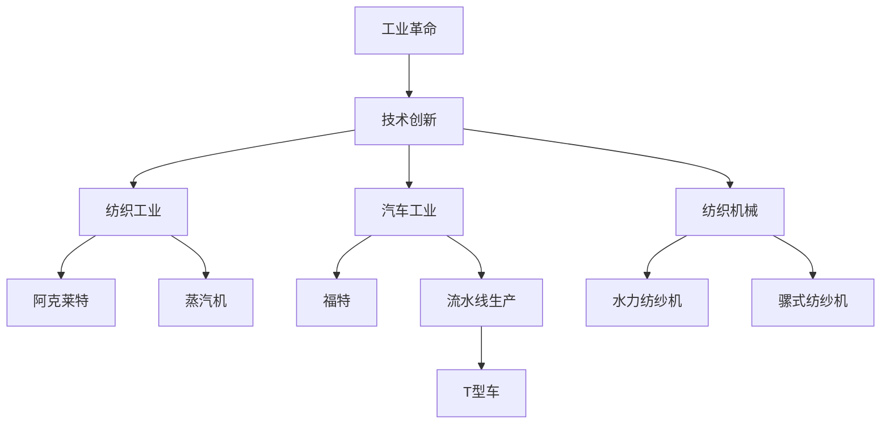
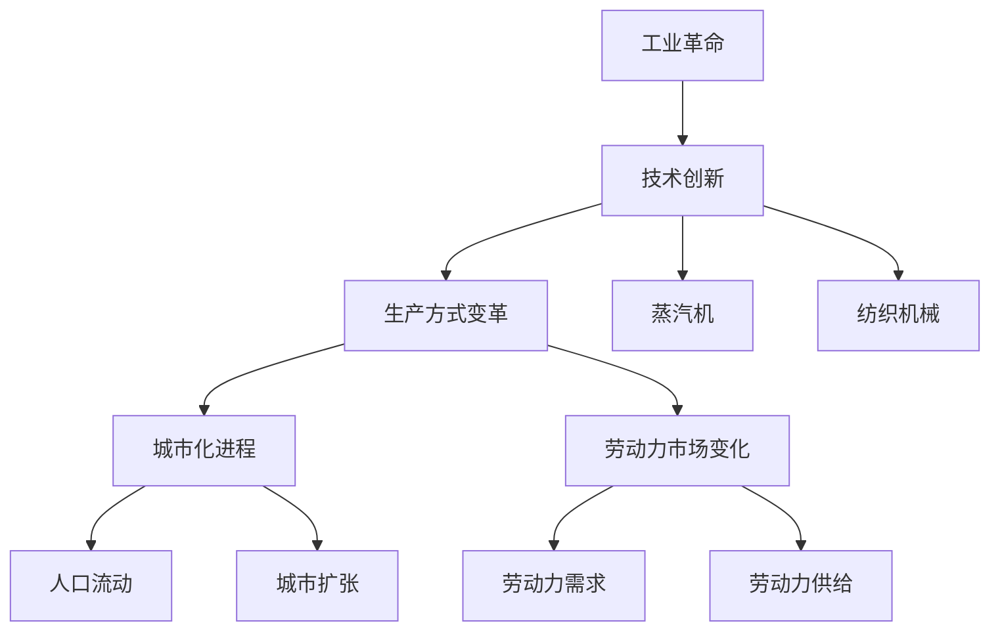

                 

## 文章标题

**阿克莱特与福特的工业革命贡献**

---

**关键词：**工业革命、纺织工业、汽车工业、技术创新、生产方式变革、阿克莱特、福特、经济增长、城市化进程。

---

**摘要：**本文通过详细探讨理查德·阿克莱特和亨利·福特在工业革命中的贡献，揭示了他们在纺织和汽车工业中的技术创新和生产方式变革，以及这些变革对经济和社会的深远影响。文章不仅分析了阿克莱特的水力纺纱机和福特的大规模生产模式，还探讨了工业革命对城市化进程、劳动力市场、全球经济和社会文化的影响，最后总结了工业革命对现代工业的启示。通过对这两位工业革命先驱的贡献的深入研究，本文旨在为读者提供对工业革命及其对现代社会的意义的全面理解。

---

## 目录大纲：阿克莱特与福特的工业革命贡献

1. **第一部分：工业革命的背景与影响**

    - **第1章：工业革命的起源与发展**
        - **1.1 工业革命的早期阶段**
            - **1.1.1 阿克莱特：纺织工业的先驱**
            - **1.1.2 福特：汽车工业的奠基者**
        - **1.2 工业革命的技术创新**
            - **1.2.1 蒸汽机的发明与改进**
            - **1.2.2 纺织机械的创新**

    - **第2章：工业革命的经济影响**
        - **2.1 工业革命与城市化进程**
            - **2.1.1 人口流动与城市扩张**
            - **2.1.2 市场经济的崛起**
        - **2.2 工业革命与生产方式变革**
            - **2.2.1 大规模生产与标准化**
            - **2.2.2 劳动力市场的变化**

2. **第二部分：阿克莱特与福特的工业革命贡献**

    - **第3章：阿克莱特与纺织工业**
        - **3.1 阿克莱特的纺织工厂**
            - **3.1.1 阿克莱特的纺织技术革新**
            - **3.1.2 阿克莱特工厂的管理模式**
        - **3.2 阿克莱特的影响**
            - **3.2.1 阿克莱特对英国纺织业的影响**
            - **3.2.2 阿克莱特在国际上的影响**

    - **第4章：福特与汽车工业**
        - **4.1 福特的汽车制造公司**
            - **4.1.1 福特的汽车制造技术**
            - **4.1.2 福特的生产流水线**
        - **4.2 福特的影响**
            - **4.2.1 福特对美国汽车业的影响**
            - **4.2.2 福特对全球汽车业的影响**

3. **第三部分：工业革命的后续影响**

    - **第5章：工业革命的社会影响**
        - **5.1 工业革命与工人阶级**
            - **5.1.1 工人阶级的生活状况**
            - **5.1.2 工人运动的兴起**
        - **5.2 工业革命与全球影响**
            - **5.2.1 工业革命对其他地区的影响**
            - **5.2.2 工业革命对全球经济的推动作用**

    - **第6章：工业革命的遗产**
        - **6.1 工业革命的文化遗产**
            - **6.1.1 工业革命与艺术**
            - **6.1.2 工业革命与文学**
        - **6.2 工业革命对现代工业的启示**
            - **6.2.1 现代化进程的加速**
            - **6.2.2 工业革命与可持续发展**

4. **附录**

    - **附录 A：工业革命大事年表**
    - **附录 B：相关人物简介**
    - **附录 C：工业革命对现代工业的启示**

---

# 第一部分：工业革命的背景与影响

## 第1章：工业革命的起源与发展

### 第1.1节：工业革命的早期阶段

**阿克莱特：纺织工业的先驱**

工业革命的起源可以追溯到18世纪末和19世纪初，其中纺织工业的革新起到了至关重要的作用。在这一背景下，理查德·阿克莱特（Richard Arkwright）成为了纺织工业的先驱。

阿克莱特出生于1740年，他的创新主要集中在一个关键的领域——纺纱。当时，纺纱过程主要依赖于手工操作，效率低下且质量不稳定。阿克莱特意识到，通过机械化的方式可以大大提高生产效率和质量。

他的第一个重大创新是发明了水力纺纱机。这一机器利用水力驱动，使得纺纱过程自动化，大大提高了生产效率。这一发明在当时引起了巨大的反响，为纺织工业的机械化奠定了基础。

**福特：汽车工业的奠基者**

在纺织工业蓬勃发展的同时，汽车工业也开始崛起。亨利·福特（Henry Ford）是这一领域的奠基者之一。福特出生于1863年，他在汽车制造方面的创新彻底改变了工业生产的方式。

福特的创新主要在于大规模生产模式，即流水线生产。他意识到，通过将生产过程分解为多个简单步骤，并在每个步骤上实现高度专业化和自动化，可以大幅降低生产成本，提高生产效率。

他的首个重大创新是T型车，这款车型采用了流水线生产模式，使得汽车的生产速度大幅提升。这一创新不仅使得汽车更加普及，也为福特公司带来了巨大的经济利益。

### 第1.2节：工业革命的技术创新

**蒸汽机的发明与改进**

工业革命的核心是技术的创新和改进。其中，蒸汽机的发明和改进可以说是最重要的创新之一。最早的蒸汽机是由托马斯·纽科门（Thomas Newcomen）在1712年发明的。然而，纽科门的蒸汽机效率较低，且应用范围有限。

詹姆斯·瓦特（James Watt）在1760年对蒸汽机进行了重大改进。他引入了分离冷凝器，使得蒸汽机的效率大幅提升。瓦特的改进使得蒸汽机能够用于更广泛的工业应用，从而为工业革命提供了强大的动力。

**纺织机械的创新**

除了蒸汽机，纺织机械的创新也是工业革命中的重要组成部分。阿克莱特的水力纺纱机只是其中的一部分。其他重要的纺织机械创新包括约翰·凯伊（John Kay）的飞梭和塞缪尔·克朗普顿（Samuel Crompton）的骡式纺纱机。

飞梭由约翰·凯伊在1733年发明，它使得织布速度大幅提升。骡式纺纱机则由塞缪尔·克朗普顿在1779年发明，它结合了精纺和粗纺的优点，提高了纺纱的效率和质量。

### 第1.3节：阿克莱特与福特的工业革命贡献比较

**技术创新的核心概念与联系**

为了更好地理解阿克莱特和福特在工业革命中的贡献，我们可以通过Mermaid流程图来展示核心概念与联系。

**贡献的相似之处**

阿克莱特和福特在工业革命中的贡献有许多相似之处。首先，他们都通过技术创新大大提高了生产效率。阿克莱特的水力纺纱机和福特的大规模生产模式都是这一方面的典型例子。

此外，他们都通过创新的商业模式改变了传统的生产方式。阿克莱特的纺织工厂采用了集中化管理，而福特则通过流水线生产实现了高效的批量生产。

**贡献的不同之处**

尽管阿克莱特和福特在许多方面都有相似之处，但他们的贡献也存在一些不同之处。首先，他们的领域不同。阿克莱特专注于纺织工业，而福特则专注于汽车工业。

其次，他们的时间不同。阿克莱特的活动主要发生在18世纪末到19世纪初，而福特的活动主要在19世纪末到20世纪初。这使得他们的贡献在不同的历史时期产生了不同的影响。

### 第1.3.1节：工业革命的核心概念与联系

为了更好地理解工业革命的核心概念和联系，我们可以通过Mermaid流程图来展示这些概念和它们之间的关系。

这张图展示了工业革命的核心概念，包括技术创新、生产方式变革、城市化进程和劳动力市场变化。这些概念相互关联，共同推动了工业革命的进程。

### 第1.3.2节：蒸汽机的发明与改进

蒸汽机的发明和改进是工业革命中最为关键的创新之一。最早的蒸汽机是由托马斯·纽科门（Thomas Newcomen）在1712年发明的。纽科门的蒸汽机被称为“大气引擎”，它通过将水蒸汽引入一个称为“冷凝器”的容器中，使得水蒸汽凝结，产生负压，从而将水泵上。

然而，纽科门的蒸汽机效率较低，且应用范围有限。詹姆斯·瓦特（James Watt）在1760年对蒸汽机进行了重大改进。瓦特引入了分离冷凝器，使得蒸汽机的工作效率大大提高。此外，他还改进了蒸汽机的结构，使得它能够更稳定地运行。

瓦特的改进使得蒸汽机能够用于更广泛的工业应用，从而为工业革命提供了强大的动力。蒸汽机的应用不仅改变了纺织工业，还促进了铁路运输和矿业的发展。蒸汽机成为了第一次工业革命的标志性发明，它不仅改变了生产方式，也推动了社会和经济的变革。

### 第1.3.3节：纺织机械的创新

纺织机械的创新是工业革命中最为显著的部分之一。在这些创新中，约翰·凯伊（John Kay）的飞梭和塞缪尔·克朗普顿（Samuel Crompton）的骡式纺纱机尤为重要。

约翰·凯伊的飞梭是在1733年发明的。飞梭的设计使得织布速度大大提高，因为它可以在织机上快速移动，使得经线与纬线交织的速度更快。这一创新不仅提高了织布的效率，还大大降低了织布的成本。

塞缪尔·克朗普顿的骡式纺纱机则是在1779年发明的。这一机器结合了精纺和粗纺的优点，使得纺纱的效率和质量都得到了大幅提升。骡式纺纱机使得纺织厂能够生产更多、更高质量的纱线，从而满足了不断增长的市场需求。

这些纺织机械的创新不仅提高了纺织工业的生产效率，还改变了纺织业的生产方式。传统的手工作坊逐渐被现代化的工厂所取代，从而推动了工业革命的进程。

### 第2章：工业革命的经济影响

### 第2.1节：工业革命与城市化进程

工业革命极大地推动了城市化进程，这是其经济影响中的一个重要方面。随着工厂的建立和工业生产的扩展，人们开始从农村向城市迁移，寻求更好的工作和生活条件。这种人口流动导致了城市的快速扩张和人口增长。

城市化进程带来了以下几个主要影响：

1. **人口流动与城市扩张**：大量农村人口涌入城市，寻找就业机会。这导致了城市人口的快速增长，同时也使得城市规模不断扩大。城市基础设施如道路、住房、学校和医院等也随之迅速发展，以满足日益增长的人口需求。

2. **城市基础设施的发展**：工业革命促进了城市基础设施的建设和发展。新的铁路、运河和港口等交通设施使得城市之间的联系更加紧密，货物和人员的流动更加便捷。这进一步推动了城市化进程，使得城市成为经济活动的重要中心。

3. **城市经济的多样化**：随着工业的兴起，城市经济逐渐从以农业为主转向以工业和服务业为主。工业生产提供了大量就业机会，服务业如零售、金融和娱乐等也蓬勃发展。这种经济多样化不仅提高了城市的经济活力，还提升了居民的生活质量。

### 第2.1.1节：人口流动与城市扩张

人口流动与城市扩张是工业革命期间的一个显著现象。随着工业生产的扩展和工厂的建立，农村人口开始大量涌入城市，寻求更好的工作和生活条件。这一现象对城市和农村地区都产生了深远的影响。

首先，人口流动导致了城市人口的快速增长。工厂的建立提供了大量就业机会，吸引了农村地区的劳动力。这导致了城市人口的快速增长，许多城市在短时间内人口数量翻了几番。例如，伦敦在19世纪初的人口从50万增长到200万。

其次，城市规模的扩大也是人口流动的结果。随着城市人口的快速增长，城市面积也不断扩大。新的住房、商业和工业区域不断涌现，城市边界逐渐向外扩展。这种城市扩张不仅改变了城市的面貌，也影响了城市的管理和发展策略。

### 第2.1.2节：工业革命与市场经济的崛起

工业革命不仅改变了生产方式，还推动了市场经济的发展。随着工业生产的扩展和商品的增多，市场经济的规模和范围都得到了极大的提升。

首先，工业革命促进了商品的生产和流通。工厂大规模生产的产品不仅满足了国内市场的需求，还远销国外。这种商品流通不仅增加了市场的规模，也提高了市场的效率。

其次，工业革命推动了货币经济的发展。传统的以物易物的交换方式逐渐被货币交易所取代。工厂主和商人开始使用货币进行交易，这提高了交易的速度和效率，也为后来的金融市场发展奠定了基础。

最后，工业革命还促进了市场经济的全球化。随着交通工具和通信技术的进步，国际间的贸易和投资活动日益频繁。市场经济开始从地区性向全球性扩展，为后来的全球经济一体化奠定了基础。

### 第2.2节：工业革命与生产方式变革

工业革命不仅带来了技术的创新，还彻底改变了生产方式。传统的手工作坊逐渐被机械化的大规模生产所取代，这标志着生产方式的重大变革。

首先，大规模生产模式的引入是生产方式变革的核心。亨利·福特的大规模生产流水线是这一变革的典范。通过将生产过程分解为多个简单、重复的步骤，并在每个步骤上实现专业化和自动化，大规模生产模式大幅提高了生产效率。这种方法使得福特公司的T型车能够在短短几年内从一款稀有的奢侈品变为普通家庭的消费品。

其次，标准化生产是大规模生产的基础。在工业革命之前，产品的生产往往是非标准化的，这导致了生产成本高、效率低。通过标准化，生产过程变得简单、重复，降低了错误率和生产成本。标准化的零部件和组件可以方便地进行替换和维护，提高了产品的可靠性和耐用性。

最后，工业化生产不仅改变了生产方式，还改变了劳动力市场。传统的手工作坊需要工人具备多种技能，而工业化生产则需要大量技能单一的工人。这导致了劳动力市场的分化，技能工人和非技能工人的薪资差距加大，也为后来的工会运动和工人阶级的崛起奠定了基础。

### 第2.2.1节：大规模生产与标准化

大规模生产与标准化是工业革命期间生产方式变革的两个核心概念。它们不仅改变了生产效率，也深刻影响了劳动力市场和全球经济。

首先，大规模生产通过流水线的方式将生产过程分解为多个简单、重复的步骤。这种生产方式大大提高了生产效率，使得产品可以以更快的速度、更低的成本生产出来。例如，亨利·福特在1913年引入的流水线生产模式使得T型车每月的产量从1908年的1860辆增加到了1918年的1000万辆。这种生产效率的提升不仅降低了产品价格，也推动了市场的快速扩张。

其次，标准化生产确保了产品的一致性和可靠性。在工业革命之前，产品的生产往往是非标准化的，这导致了生产成本高、效率低。通过标准化，生产过程变得简单、重复，降低了错误率和生产成本。例如，福特公司的零部件和组件都是标准化的，这方便了生产和维护，提高了产品的可靠性和耐用性。

此外，大规模生产与标准化也对劳动力市场产生了深远影响。传统的手工作坊需要工人具备多种技能，而工业化生产则需要大量技能单一的工人。这种劳动力市场的分化不仅影响了工人的薪资和就业机会，也为后来的工会运动和工人阶级的崛起提供了土壤。

最后，大规模生产与标准化还推动了全球经济的整合。随着产品价格的降低和生产效率的提高，全球范围内的贸易和投资活动日益频繁。标准化生产使得产品在国际市场上更容易被接受和流通，为全球经济的一体化奠定了基础。

### 第2.2.2节：劳动力市场的变化

工业革命对劳动力市场产生了深远的影响，这种变化可以从劳动力需求、劳动力供给以及工人阶级的生活状况三个方面来分析。

首先，工业革命导致了对劳动力需求的增加。随着工厂的大规模建立和生产方式的变革，对劳动力的需求急剧上升。特别是对那些技能单一的工人需求量大增，如纺织工人、机器操作员等。这种需求不仅推动了工业城市人口的快速增长，也促进了劳动力市场的形成。

其次，劳动力供给的变化也是工业革命的一个重要方面。大量的农村人口开始涌入城市，寻求就业机会，这极大地增加了劳动力的供给。然而，这种供给并非总是均衡的，特别是在某些地区和行业，劳动力供给过剩可能导致工资水平下降和工人权益的受损。

最后，工人阶级的生活状况在工业革命期间发生了显著变化。一方面，工人阶级的数量大幅增加，他们成为社会的重要组成部分。另一方面，由于工厂的工作条件和薪酬问题，工人阶级的生活状况往往并不理想。工作时间长、劳动强度大、安全条件差等问题使得工人阶级的生活质量相对较低。这种状况引发了工人运动和工会组织的兴起，争取更好的工作条件和生活待遇。

### 第3章：阿克莱特与纺织工业

#### 第3.1节：阿克莱特的纺织工厂

理查德·阿克莱特（Richard Arkwright）是工业革命期间纺织工业的重要人物，他的创新对纺织工业的发展产生了深远的影响。阿克莱特最著名的贡献是水力纺纱机的发明，这一发明彻底改变了纺织工业的生产方式。

**阿克莱特的纺织技术革新**

阿克莱特的水力纺纱机是工业革命中的一项重大技术突破。传统的纺纱过程依赖于手工操作，效率低下且质量不稳定。阿克莱特的水力纺纱机利用水力驱动，使得纺纱过程实现了自动化。这一机器通过水轮驱动，将纱线连续地、均匀地纺制出来，大大提高了生产效率和质量。

**阿克莱特工厂的管理模式**

除了技术创新，阿克莱特还在工厂的管理模式上进行了创新。他建立了集中的工厂管理体系，将生产、销售和管理集中在同一地点。这种集中化管理不仅提高了生产效率，还使得工厂能够更好地控制生产过程和质量。

此外，阿克莱特采用了分工明确的管理模式。他根据工人的技能和职责，将他们分配到不同的工作岗位上，使得每个人都能专注于自己的工作。这种分工模式不仅提高了工作效率，还降低了生产成本。

#### 第3.2节：阿克莱特的影响

阿克莱特在纺织工业中的创新和贡献不仅改变了英国纺织业，也对全球纺织工业产生了深远的影响。

**对英国纺织业的影响**

阿克莱特的水力纺纱机极大地提高了纺织工业的生产效率和质量。这种高效的生产方式使得英国的纺织品在国际市场上具有了竞争优势。阿克莱特的纺织工厂成为英国纺织工业现代化的象征，推动了英国成为“世界工厂”。

**对国际上的影响**

阿克莱特的创新和商业模式很快传播到其他国家。水力纺纱机的技术和工厂管理模式被其他国家采纳，推动了全球纺织工业的发展。阿克莱特的纺织技术革新成为工业革命的重要推动力量，为全球工业化进程奠定了基础。

#### 第3.2.1节：阿克莱特对英国纺织业的影响

理查德·阿克莱特对英国纺织业的影响是深远而显著的。首先，他的水力纺纱机的发明标志着纺织工业从手工生产向机械化生产的转变，这一变革极大地提高了纺织生产效率。传统手工纺纱依赖于个体工人的技能，生产效率低下且难以保证纱线的质量一致性。阿克莱特的水力纺纱机通过利用水力驱动，实现了纺纱过程的自动化，从而大幅提高了纱线的生产效率。

此外，阿克莱特的工厂管理模式也对英国纺织业产生了重大影响。他建立了集中的工厂管理体系，将生产、销售和管理集中在同一地点。这种集中化管理不仅提高了生产效率，还使得工厂能够更好地控制生产过程和质量。阿克莱特还采用了分工明确的管理模式，将工人分配到不同的工作岗位上，使每个人都能专注于自己的工作。这种分工模式不仅提高了工作效率，还降低了生产成本。

阿克莱特的创新不仅改变了英国纺织工业的生产方式，还提升了英国纺织品在国际市场上的竞争力。他的纺织工厂成为英国纺织工业现代化的象征，推动了英国成为“世界工厂”。阿克莱特的工厂管理模式和技术创新成为英国工业革命的重要组成部分，为英国经济提供了强大的动力。

#### 第3.2.2节：阿克莱特在国际上的影响

理查德·阿克莱特对国际纺织工业的影响同样深远。随着他的水力纺纱机技术和工厂管理模式在英国的成功，这些创新很快传播到其他国家。阿克莱特的纺织技术革新对全球纺织工业的发展产生了重要推动作用。

首先，阿克莱特的发明使得纺织生产效率大幅提高，这种高效的生产方式很快被其他国家的纺织业所采纳。许多国家开始引进水力纺纱机，从而提升了本国的纺织生产能力。这种技术传播不仅提高了全球纺织工业的效率，还促进了各国之间的经济交流和技术合作。

其次，阿克莱特的工厂管理模式也受到国际上的关注和模仿。他的集中化管理体系和分工明确的生产模式为其他国家提供了有效的管理模式范例。许多国家开始建立类似的工厂，采用集中化管理，提高了生产效率和质量控制。

阿克莱特的创新和商业模式成为工业革命的重要推动力量，为全球工业化进程奠定了基础。他的成功故事激励了世界各地的企业家和工程师，推动了全球纺织工业的现代化。阿克莱特对国际纺织工业的影响不仅限于技术层面，更在商业和管理模式上为全球工业革命提供了宝贵的经验和启示。

### 第4章：福特与汽车工业

#### 第4.1节：福特的汽车制造公司

亨利·福特（Henry Ford）是20世纪最具影响力的企业家之一，他创立的福特汽车公司（Ford Motor Company）对汽车工业的发展产生了深远的影响。福特的成功不仅在于他推出了革命性的T型车，还在于他引入了大规模生产流水线，彻底改变了工业生产的方式。

**福特的汽车制造技术**

亨利·福特在汽车制造技术方面的创新是革命性的。他的首个重大创新是T型车，这款车型不仅设计简单、成本低廉，而且采用了标准化的零部件。T型车的成功使得福特公司能够以极低的成本大规模生产汽车，从而将汽车价格降低到普通消费者能够承受的水平。

福特还在汽车制造过程中引入了流水线生产。流水线生产将汽车制造过程分解为多个简单、重复的步骤，每个步骤都由专门的工人执行。这种生产方式不仅提高了生产效率，还降低了生产成本。流水线生产使得福特公司能够在短时间内生产大量汽车，从而满足了市场的需求。

**福特的生产流水线**

福特的生产流水线是工业生产方式的重大突破。流水线生产的核心思想是将生产过程分解为多个简单、重复的步骤，每个步骤都由专门的工人执行。这种方法不仅提高了生产效率，还使得生产过程更加可控和稳定。

福特的流水线生产方式采用了标准化的零部件，这使得零部件可以方便地替换和维护。此外，流水线生产还实现了生产流程的自动化，大大减少了人工干预。这种生产方式不仅降低了生产成本，还提高了生产效率，使得福特公司能够在短时间内生产大量汽车。

**T型车对汽车工业的影响**

T型车的成功对汽车工业产生了深远的影响。首先，T型车的设计简单、成本低廉，使得汽车价格大幅下降。这大大增加了汽车的普及率，使得汽车从奢侈品变为大众消费品。

其次，T型车的标准化零部件为汽车工业的后续发展奠定了基础。标准化的零部件不仅提高了生产效率，还促进了零部件行业的专业化发展。这种标准化生产模式为后来的汽车工业提供了宝贵的经验和借鉴。

**流水线生产对汽车工业的影响**

流水线生产对汽车工业的影响同样深远。首先，流水线生产大幅提高了生产效率，使得福特公司能够在短时间内生产大量汽车。这种高效的生产方式使得福特公司成为汽车市场的领导者，为福特公司带来了巨大的经济利益。

其次，流水线生产改变了汽车制造的方式。流水线生产使得汽车制造过程更加简单、重复，降低了生产成本。这种生产方式不仅提高了生产效率，还使得汽车制造过程更加可控和稳定。

最后，流水线生产促进了汽车工业的全球化发展。随着福特公司在全球范围内建立生产工厂，流水线生产模式也被广泛应用于其他国家。这种全球化发展不仅促进了全球汽车市场的整合，也为全球经济发展提供了动力。

### 第4.2节：福特的影响

亨利·福特和他的福特汽车公司对汽车工业以及整个社会产生了深远的影响。福特不仅改变了汽车的生产方式，还推动了工业生产方式的变革，对经济、社会和文化产生了多方面的影响。

**对美国汽车业的影响**

首先，福特对美国汽车业的影响是革命性的。福特公司通过大规模生产流水线，使得汽车价格大幅下降，从而提高了汽车的普及率。T型车的成功使得福特公司迅速成为美国汽车市场的领导者，推动了美国汽车工业的快速发展。福特公司的成功也为美国经济提供了强大的动力，成为美国经济奇迹的一部分。

其次，福特的生产方式为美国汽车业树立了新的生产标准。流水线生产的高效、低成本生产方式被其他汽车制造商所效仿，推动了整个美国汽车工业的现代化。福特公司的成功经验也激励了其他行业的企业家，推动了美国工业生产的整体进步。

**对全球汽车业的影响**

福特的影响不仅局限于美国，还扩散到全球汽车业。福特公司的流水线生产模式被全球汽车制造商所采纳，成为全球汽车生产的标准。这种标准化生产方式不仅提高了生产效率，还降低了生产成本，使得汽车价格更加亲民。

此外，福特公司在全球范围内建立生产基地，推动了全球汽车市场的整合。福特汽车在全球市场上的成功也激发了其他汽车制造商的国际化发展，促进了全球汽车工业的全球化。

**对经济的影响**

福特对经济的影响是显著的。首先，福特公司通过大规模生产降低了汽车价格，提高了汽车的普及率，从而刺激了消费需求，推动了经济增长。其次，福特公司的成功吸引了大量投资，促进了资本积累和工业发展。

福特的生产方式还推动了产业链的扩展。汽车制造涉及到钢铁、橡胶、玻璃等多个行业，福特的成功带动了这些相关行业的发展，形成了完整的产业链。

**对社会的影响**

福特对社会的改变是深远的。首先，福特公司提供了大量的就业机会，改善了工人的工作条件和薪资待遇。流水线生产方式的出现使得生产过程更加高效，工人不需要具备复杂的技能，这降低了工人的门槛，使得更多的人有机会参与工业生产。

其次，福特的成功推动了城市化进程。随着工厂的建立和汽车制造业的发展，大量人口涌入城市，寻求更好的工作和生活条件。这导致了城市的快速扩张，改变了社会的结构。

**对文化的影响**

福特对文化的影响同样显著。首先，汽车成为现代社会的象征，改变了人们的生活方式。汽车使得人们的出行更加便捷，推动了城市化和郊区化的发展。

其次，福特的成功故事激励了无数创业者，成为美国梦的典范。福特公司通过技术创新和商业模式，实现了从农场工人到成功企业家的转变，成为无数美国人的梦想。

### 第5章：工业革命的社会影响

#### 第5.1节：工业革命与工人阶级

工业革命不仅带来了生产方式的变革，也对工人阶级的生活状况和社会地位产生了深远影响。在工业革命之前，工人阶级主要依靠手工艺或农业为生，工作条件艰苦，收入不稳定。工业革命的出现，虽然提供了大量就业机会，但也带来了新的挑战。

**工人阶级的生活状况**

首先，工业革命使得工人阶级的生活条件有所改善。工厂提供了稳定的工作机会，使得工人的收入相对稳定。此外，工厂内的机械化生产减少了工人的劳动强度，尽管工作时间较长，但劳动强度相对较低。

然而，工人阶级的生活状况仍然相对较差。工厂内的工作环境通常恶劣，通风不良，噪音大，工作条件艰苦。工人的工资虽然稳定，但收入水平较低，难以满足基本的生活需求。此外，工人的工作时间通常较长，经常需要加班。

**工人运动的兴起**

工业革命期间，工人阶级开始组织工会，争取更好的工作条件和权益。工会运动成为了工人阶级反抗不公正待遇的重要手段。工人阶级通过罢工、示威等方式，要求提高工资、缩短工作时间、改善工作条件。

工会运动不仅关注工人的经济利益，还关注工人的社会地位。工人阶级开始争取投票权、教育权等社会权利，试图改变自己在社会中的地位。工会运动成为了19世纪欧洲和北美重要的社会运动之一，对后来的社会改革产生了深远影响。

#### 第5.1.1节：工人阶级的生活状况

工业革命对工人阶级的生活状况产生了深远的影响。在工业革命之前，工人阶级主要依靠手工艺或农业为生，工作条件艰苦，收入不稳定。工业革命的出现，虽然提供了大量就业机会，但也带来了新的挑战。

**工作时间**

工业革命期间，工人的工作时间普遍较长。由于工厂生产需要连续不断，工人通常需要每天工作长达10到12小时，有时甚至更长。这种长时间的工作不仅使得工人的身体和精神压力增大，也影响了他们的生活质量。

**工作环境**

工厂的工作环境通常较为恶劣。工厂内通风不良，噪音大，机器运转时产生的灰尘和废气对人体健康有害。此外，工厂的安全措施通常不足，工人在工作中面临较高的工伤风险。

**工资水平**

虽然工业革命为工人提供了稳定的工作机会，但工资水平相对较低。工厂主为了降低生产成本，往往只支付给工人微薄的工资。工人的收入水平难以满足基本的生活需求，导致他们生活在贫困线附近。

**住房条件**

随着城市人口的快速增长，工人的住房条件也变得紧张。许多工人居住在拥挤的公寓或工人宿舍中，居住环境差，卫生条件不佳。这种住房条件进一步降低了工人的生活质量。

**家庭影响**

长时间的工作和恶劣的工作环境对工人的家庭生活产生了负面影响。工人常常没有足够的时间和精力照顾家庭，导致家庭关系紧张。此外，工人的健康状况可能因为长时间的工作和环境恶劣而恶化，影响了家庭的整体福祉。

**社会影响**

工人阶级的生活状况较差，对社会稳定产生了负面影响。工人的贫困和不满情绪可能导致社会动荡，甚至引发社会运动和革命。工人阶级的斗争和争取权益的运动，对后来的社会改革产生了深远影响。

#### 第5.1.2节：工人运动的兴起

工业革命期间，工人阶级开始组织工会，争取更好的工作条件和权益。工会运动成为了工人阶级反抗不公正待遇的重要手段。工人阶级通过罢工、示威等方式，要求提高工资、缩短工作时间、改善工作条件。

工会运动的兴起有几个主要原因：

1. **经济压力**：工业革命使得工人的工作时间延长，工资水平却相对较低，导致工人生活条件较差。工人希望通过组织工会来争取更好的经济待遇。

2. **社会不公**：工业革命期间，社会阶层分化加剧，工人阶级在社会地位上受到压迫。工会运动成为了工人阶级争取社会公正和权益的重要途径。

3. **政治觉醒**：随着教育和普及率的提高，工人的政治意识逐渐增强。他们认识到通过集体行动可以改变自己的命运，工会运动成为了他们争取权益的重要手段。

工会运动的形式多样，包括：

- **罢工**：工人集体停止工作，以向雇主施加压力，争取更好的待遇。罢工通常伴随着示威和抗议活动，以吸引社会关注。
  
- **示威**：工人在公共场所举行集会，展示他们的诉求和不满。示威活动通常伴有口号和旗帜，以表达他们的决心。

- **政治行动**：工会运动不仅关注经济利益，还关注政治权利。工人阶级通过参与选举、支持政治候选人等方式，争取更多的政治权利。

工会运动在工业革命期间取得了显著成果。工人的工资水平逐渐提高，工作时间有所缩短，工作条件得到改善。工会运动也为后来的劳动法和工会制度的建立奠定了基础。工人阶级通过集体行动，成功争取了自己的权益，对社会改革产生了深远影响。

### 第5.2节：工业革命与全球影响

工业革命不仅对英国本土产生了深远影响，还对全球范围内的经济、社会和文化产生了广泛影响。这种影响不仅限于工业化和技术创新，还涉及到全球贸易、人口流动、技术传播等方面。

#### 第5.2.1节：工业革命对其他地区的影响

首先，工业革命对其他地区的经济结构产生了深远影响。随着英国成为“世界工厂”，其工业化模式被其他国家模仿。欧洲大陆、北美和亚洲的一些国家开始引入英国的工业化模式，推动了本国工业的发展。这些国家通过引进英国的机械设备、技术和生产模式，加快了本国工业化的进程。

其次，工业革命导致了全球贸易格局的改变。英国成为工业生产的中心，其产品大量出口到其他国家。这导致了国际市场的扩大和全球贸易的增加。其他国家通过进口英国的商品和技术，推动了本国经济的发展。同时，英国的商品也进入了其他国家市场，促进了全球经济的整合。

#### 第5.2.2节：工业革命对全球经济的推动作用

工业革命对全球经济的推动作用是显著的。首先，工业革命大幅提高了生产效率，降低了生产成本。通过机械化生产，产品可以以更快的速度、更低的成本生产出来，这使得商品价格下降，提高了全球消费者的购买力。

其次，工业革命推动了全球经济的全球化。随着国际贸易的增加和资本流动的加速，全球经济逐渐形成一个紧密联系的整体。工业革命带来的技术创新和生产方式的变革，为全球经济的一体化奠定了基础。

此外，工业革命还促进了全球资本的积累。通过工业化生产，企业获得了更多的利润，这些利润又被再投资，推动了资本的积累。资本的积累不仅促进了工业化进程，也为全球经济提供了持续的发展动力。

### 第6章：工业革命的遗产

#### 第6.1节：工业革命的文化遗产

工业革命不仅改变了经济和社会结构，也在文化上留下了深刻的印记。工业革命期间，一系列艺术和文学作品反映了工业化社会的面貌，这些文化遗产至今仍具有重要的历史和文化价值。

首先，现实主义艺术在工业革命期间兴起，成为反映工业化社会的主要艺术形式。现实主义艺术家通过描绘工厂、矿工和工人阶级的日常生活，揭示了工业革命带来的社会变革和工人阶级的困境。乔治·修拉（Georges Seurat）的《大碗岛星期天的下午》和爱德华·马奈（Édouard Manet）的《草地上的午餐》等作品，以独特的视角展示了工业化城市的繁荣和混乱。

其次，工业革命也催生了工业文学。工业文学通过小说、诗歌和戏剧等形式，反映了工业化的社会现实。查尔斯·狄更斯（Charles Dickens）的《艰难时世》（Hard Times）和迈克尔·托马斯（Michael Thomas）的《金酒》（Gold）等作品，揭示了工业化对工人阶级生活的深远影响。

#### 第6.1.1节：工业革命与艺术

工业革命期间，艺术界也经历了巨大的变革。现实主义艺术在这一时期崭露头角，成为描绘工业化社会的主要形式。现实主义艺术家通过直接描绘工厂、工人和工业化城市的面貌，反映了工业革命带来的社会变迁和人们的生活状况。

首先，现实主义绘画在工业革命期间兴起。艺术家们开始关注社会现实，描绘工厂的繁忙场景、工人的艰苦生活和工业化城市的面貌。例如，让·弗朗索瓦·米勒（Jean-François Millet）的《拾麦穗者》（Gleaners）和雅克·路易·大卫（Jacques-Louis David）的《拿破仑穿越圣贝尔纳山口》（Napoleon Crossing the Alps）等作品，通过细腻的笔触和真实的表现力，展现了工业革命对社会和自然景观的影响。

其次，工业革命也对雕塑和建筑产生了影响。工业革命期间，新兴的工业城市需要新的建筑形式来满足快速发展的经济需求。钢铁和混凝土等新材料的广泛应用，使得建筑师们能够设计出更坚固、更高效的建筑。约翰·拉斯金（John Ruskin）和威廉·莫里斯（William Morris）等艺术家和设计师，通过结合实用性和美学，推动了工艺美术运动的发展。

#### 第6.1.2节：工业革命与文学

工业革命不仅影响了艺术，也对文学产生了深远的影响。工业革命期间，一系列文学作品反映了工业化社会的面貌，揭示了工业革命对工人阶级生活和工人运动的影响。

首先，工业文学成为这一时期的重要文学形式。查尔斯·狄更斯（Charles Dickens）的《艰难时世》（Hard Times）和米尔斯·凯恩斯（Arthur Kitson）的《工业区》（The Industrial Area）等作品，通过生动的故事和细腻的描写，展现了工业革命对工人阶级生活的深远影响。狄更斯在《艰难时世》中揭示了工业化城市中的贫困和社会不公，而凯恩斯则在《工业区》中描绘了工人的艰苦生活和斗争。

其次，工业革命还催生了工人文学。工人文学由工人阶级自己创作，反映了他们在工业化社会中的经验和感受。工人文学通过诗歌、短篇小说和戏剧等形式，传达了工人阶级的抗议和希望。例如，威廉·莫里斯（William Morris）的诗歌和亨利·哈特利（Henry Harty）的小说，都是工人文学的代表作品。

最后，工业革命对文学体裁和主题产生了影响。现实主义文学在工业革命期间兴起，成为描绘工业化社会的主要形式。作家们通过直接描绘工厂、工人和工业化城市的面貌，反映了工业革命带来的社会变迁和人们的生活状况。此外，工业革命还引发了关于技术进步和社会正义的广泛讨论，成为文学中的重要主题。

### 第6.2节：工业革命对现代工业的启示

工业革命不仅深刻改变了19世纪的英国和社会，也为现代工业的发展提供了宝贵的启示。以下是对工业革命对现代工业的几个关键启示：

#### 第6.2.1节：技术创新的重要性

工业革命证明了技术创新是推动工业发展和社会进步的关键因素。蒸汽机的发明和改进、纺织机械的创新以及流水线生产模式的出现，都极大地提高了生产效率和质量。现代工业在发展过程中，同样需要不断推动技术创新，通过研发新技术、新工艺和新产品，保持竞争力。

#### 第6.2.2节：工业化与可持续发展

工业革命带来了巨大的经济增长，但也带来了严重的环境问题。现代工业在追求经济增长的同时，需要更加注重环境保护和可持续发展。工业革命的经验提醒我们，必须在发展经济的同时，关注环境保护，推动绿色工业和循环经济的发展。

#### 第6.2.3节：劳动权益与工作条件

工业革命期间，工人阶级的生活状况相对较差，工作条件恶劣。现代工业需要关注工人的权益和工作条件，确保工人能够在安全、健康的环境中工作，享有合理的工资和福利待遇。工会运动和劳动法的建立，为现代工业提供了重要的参考。

#### 第6.2.4节：经济全球化

工业革命推动了全球贸易和资本的流动，促进了全球经济的一体化。现代工业同样面临着经济全球化的挑战和机遇。通过国际合作和贸易，现代工业可以共享资源、技术和市场，实现共同发展。

#### 第6.2.5节：教育的重要性

工业革命期间，教育水平的提升促进了工业化进程。现代工业同样需要高素质的劳动力，因此，重视教育和职业培训，提高劳动力的技能水平，是现代工业发展的重要保障。

### 附录A：工业革命大事年表

以下是一个简化的工业革命大事年表，列出了几个重要事件和发明：

- **1764年**：詹姆斯·哈格里夫斯发明珍妮纺纱机。
- **1769年**：詹姆斯·瓦特发明瓦特蒸汽机。
- **1771年**：理查德·阿克莱特建立第一座水力纺纱厂。
- **1779年**：塞缪尔·克朗普顿发明骡式纺纱机。
- **1807年**：罗伯特·斯蒂芬森发明蒸汽机车。
- **1860年**：亨利·福特开始生产T型车，流水线生产模式确立。
- **1870年**：爱迪生发明电灯，电力开始普及。
- **1885年**：卡尔·本茨发明汽车，现代汽车工业开始。

### 附录B：相关人物简介

以下是几位在工业革命中具有重要地位的人物及其简要介绍：

- **托马斯·纽科门**：1712年发明了第一台实用的蒸汽机，被称为“大气引擎”。
- **詹姆斯·瓦特**：1760年对蒸汽机进行改进，发明了分离冷凝器，使蒸汽机效率大幅提高。
- **詹姆斯·哈格里夫斯**：1764年发明珍妮纺纱机，标志着纺织工业机械化的开始。
- **理查德·阿克莱特**：发明水力纺纱机，并建立了集中化的纺织工厂，推动了英国纺织工业的现代化。
- **塞缪尔·克朗普顿**：1779年发明骡式纺纱机，提高了纺织生产效率。
- **乔治·斯蒂芬森**：发明蒸汽机车，推动了铁路运输的发展。
- **亨利·福特**：发明流水线生产模式，使大规模生产成为可能，推动了美国汽车工业的发展。

### 附录C：工业革命对现代工业的启示

工业革命的经验对现代工业的发展具有深刻的启示。以下是一些关键启示：

- **技术创新是推动工业发展的关键**：工业革命证明了技术创新是提高生产效率、降低成本、增强竞争力的关键因素。现代工业需要持续推动技术创新，通过研发新技术、新工艺和新产品，保持竞争力。
- **注重劳动权益和工作条件**：工业革命期间，工人阶级的生活状况较差，工作条件恶劣。现代工业需要重视工人的权益和工作条件，确保工人能够在安全、健康的环境中工作，享有合理的工资和福利待遇。
- **推动经济全球化**：工业革命推动了全球贸易和资本的流动，促进了全球经济的一体化。现代工业同样面临着经济全球化的挑战和机遇，通过国际合作和贸易，现代工业可以共享资源、技术和市场，实现共同发展。
- **可持续发展的重要性**：工业革命带来了巨大的经济增长，但也带来了严重的环境问题。现代工业在追求经济增长的同时，需要更加注重环境保护和可持续发展，推动绿色工业和循环经济的发展。
- **教育的重要性**：工业革命期间，教育水平的提升促进了工业化进程。现代工业同样需要高素质的劳动力，因此，重视教育和职业培训，提高劳动力的技能水平，是现代工业发展的重要保障。

