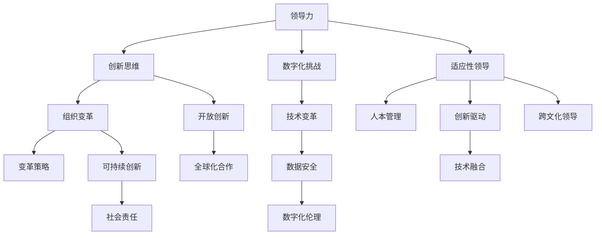

                 

### 《领导力与创新：推动组织变革的动力》

关键词：领导力、创新、组织变革、数字化转型、领导力评估模型

摘要：
在快速变化的数字化时代，领导力和创新已成为推动组织变革的关键动力。本文通过深入探讨领导力的本质与作用、创新的定义与类型，以及领导力与创新的结合，旨在揭示领导力在组织变革中的核心作用。本文将结合实际案例，提供领导力与创新实践指南，为读者提供切实可行的策略，助力组织实现持续发展。

### 《领导力与创新：推动组织变革的动力》目录大纲

#### 第一部分：领导力基础

**第1章：领导力的本质与作用**
1. 领导力的定义
   - 传统领导力与现代领导力
   - 领导力在组织中的作用
2. 领导者应具备的素质
   - 情商与领导力
   - 领导者的决策能力
3. 领导力的发展路径
   - 领导力的培养方法
   - 领导力的实践与应用

**第2章：创新的定义与类型**
1. 创新的概念
   - 创新的定义
   - 创新的分类
2. 创新的动力与阻力
   - 创新的动力因素
   - 创新的阻力因素
3. 创新的过程与方法
   - 创新的阶段
   - 创新的方法论

#### 第二部分：领导力与创新的结合

**第3章：领导力与创新思维**
1. 创新思维的重要性
   - 创新思维在领导力中的作用
   - 创新思维的培养
2. 领导者如何激发创新思维
   - 建立创新文化
   - 鼓励员工创新
3. 领导力与创新思维的实践
   - 创新思维的案例分析
   - 创新领导力的实践路径

**第4章：领导力与组织变革**
1. 变革的定义与类型
   - 变革的定义
   - 变革的类型
2. 领导力在变革中的作用
   - 领导者在变革中的角色
   - 领导力在变革中的挑战
3. 领导力推动组织变革的策略
   - 变革的规划与实施
   - 变革中的沟通与协调

#### 第三部分：案例分析与实践指导

**第5章：领导力与创新实践案例**
1. 案例分析一：谷歌的领导力与创新文化
   - 谷歌的领导力模式
   - 谷歌的创新实践
2. 案例分析二：苹果公司的变革与领导力
   - 苹果的领导力策略
   - 苹果的创新路径

**第6章：领导力与创新实践指南**
1. 领导力与创新的关键要素
   - 创新的关键成功因素
   - 领导力的关键实践
2. 实践指导一：如何激发员工的创新思维
   - 建立鼓励创新的氛围
   - 提供创新的资源和支持
3. 实践指导二：如何推动组织变革
   - 制定变革计划
   - 实施变革策略

#### 第四部分：未来展望

**第7章：领导力与创新的未来趋势**
1. 数字化时代的领导力挑战
   - 数字化对领导力的影响
   - 数字化时代的创新需求
2. 创新与领导力的未来发展
   - 未来领导力的发展方向
   - 创新的未来趋势与机遇

# 附录

## 附录A：领导力与创新相关资源
### A.1 主要参考文献
### A.2 推荐阅读书目
### A.3 创新领导力工具与方法

#### Mermaid 流�程图

mermaid
graph TD
    A[领导力] --> B[创新思维]
    A --> C[组织变革]
    B --> D[创新实践]
    C --> D

### 《领导力与创新：推动组织变革的动力》

领导力与创新，作为组织发展的两个关键要素，已经在数字化时代成为推动组织变革的强大动力。本文旨在深入探讨领导力与创新之间的关系，以及如何通过领导力来推动组织变革，实现持续创新和快速发展。

#### 第一部分：领导力基础

### 第1章：领导力的本质与作用

领导力是一种影响和激励他人实现目标的能力，它不仅涉及到领导者对团队的指导，还包括领导者对组织文化的塑造和战略方向的引领。在数字化时代，领导力的作用更加凸显，它不仅影响着组织的效率和效益，还决定着组织能否在快速变化的市场环境中保持竞争力。

**1.1 领导力的定义**

传统领导力强调权威和控制，而现代领导力则更注重影响和协作。现代领导力强调领导者与团队成员之间的信任、合作和共同成长。这种领导力模式在数字化时代尤为重要，因为它需要领导者具备快速适应变化、持续学习和创新的思维和能力。

**1.2 领导者应具备的素质**

情商、决策能力、沟通能力是领导者应具备的核心素质。情商高的领导者能够更好地理解和管理自己的情绪，以及识别和理解他人的情感需求。决策能力则是领导者面对复杂问题和不确定性时的核心能力。沟通能力则是领导者与团队成员、上级和利益相关者之间有效沟通的关键。

**1.3 领导力的发展路径**

领导力的发展路径包括自我认知、持续学习和实践应用。自我认知是领导力发展的基础，它帮助领导者了解自己的优势、劣势和价值观。持续学习则是领导者保持竞争力的重要手段，它包括对新技术、新理念和新方法的不断学习。实践应用则是将学习到的知识和技能应用到实际工作中，通过不断的实践和反思来提升领导力。

### 第2章：创新的定义与类型

创新是一种创造新的想法、方法或产品以解决现有问题或创造新价值的过程。在数字化时代，创新不仅是一种能力，更是一种态度和思维方式。创新的类型包括产品创新、过程创新、市场创新和组织创新等。

**2.1 创新的概念**

创新不仅仅是发明新产品或新技术，它还可以是改进现有产品或服务，优化业务流程，或开辟新的市场。创新的本质在于创造新的价值，这可以是经济效益、社会效益或环境效益。

**2.2 创新的动力与阻力**

创新的动力包括技术进步、市场需求、竞争压力和领导者的愿景。技术进步为创新提供了可能性，市场需求为创新提供了动力，竞争压力为创新提供了紧迫感，而领导者的愿景则为创新提供了方向和动力。创新的阻力包括组织惯性、资源限制、文化阻碍和不确定性。

**2.3 创新的过程与方法**

创新的过程包括识别机会、构思创意、评估可行性、开发原型和测试推广。创新的方法包括头脑风暴、设计思维、快速迭代和敏捷开发等。这些方法帮助组织在创新过程中快速迭代、不断优化，从而提高创新的效率和成功率。

#### 第二部分：领导力与创新的结合

### 第3章：领导力与创新思维

领导力与创新思维是相辅相成的，领导力为创新提供方向和资源，创新思维则为领导力提供新的方法和视角。有效的领导力需要创新思维的支持，而创新思维也需要领导力来推动和实现。

**3.1 创新思维的重要性**

创新思维是一种开放、灵活和前瞻性的思维方式，它能够帮助领导者发现新的机遇，应对挑战，以及推动组织的变革。创新思维不仅能够提高组织的竞争力，还能够提升员工的满意度和创造力。

**3.2 领导者如何激发创新思维**

领导者可以通过建立创新文化、提供创新资源、鼓励员工参与和激励创新成果来激发创新思维。建立创新文化需要领导者树立开放和包容的态度，鼓励员工尝试新的想法和方法。提供创新资源则需要领导者确保组织有足够的资金、技术和人力支持。鼓励员工参与创新则需要领导者创造一个公平、透明和开放的环境。激励创新成果则需要领导者给予员工认可和奖励。

**3.3 领导力与创新思维的实践**

领导力与创新思维的实践包括培养创新型人才、建立创新团队和实施创新项目。培养创新型人才需要领导者关注员工的个人发展和职业规划，提供培训和学习机会。建立创新团队需要领导者确保团队成员的多样性和互补性，以及建立良好的沟通和协作机制。实施创新项目需要领导者制定明确的创新目标和计划，提供资源和支持，并监督项目的进展。

### 第4章：领导力与组织变革

组织变革是组织为了适应外部环境或内部需求而进行的一系列调整和改进。领导力在组织变革中起着至关重要的作用，它不仅影响着变革的进程和效果，还决定着变革的成功与否。

**4.1 变革的定义与类型**

变革是一种主动、有意识的行为，旨在改变组织的结构、文化、流程或战略。变革的类型包括适应性变革、战略性变革和重组变革。适应性变革旨在提高组织的灵活性和应变能力，战略性变革旨在实现组织的长期目标，而重组变革则旨在优化组织的结构和资源。

**4.2 领导力在变革中的作用**

领导力在变革中的作用包括引领变革、推动变革和维持变革。引领变革需要领导者树立变革的愿景和目标，以及制定变革的路线图和计划。推动变革需要领导者激发员工的积极性和参与度，以及克服变革过程中的阻力和挑战。维持变革需要领导者确保变革的持续性和效果，以及持续改进和优化。

**4.3 领导力推动组织变革的策略**

领导力推动组织变革的策略包括明确变革的目标和愿景、建立变革的领导团队、制定变革的规划和实施策略、建立变革的沟通机制、提供变革的培训和指导、激励变革的参与者和成果、评估变革的效果和调整变革的策略。

#### 第三部分：案例分析与实践指导

### 第5章：领导力与创新实践案例

**案例一：谷歌的领导力与创新文化**

谷歌以其独特的领导力模式和创新文化而闻名于世。谷歌的领导力模式强调开放、平等和信任，鼓励员工自主管理和创新。谷歌的创新文化则体现在其“20%时间”政策，即员工可以自由使用工作时间的20%来进行个人项目或创新实验。

**实战解释：**

- **领导力模式：** 谷歌的领导力模式包括明确的愿景和价值观，鼓励员工自主管理和创新，以及对员工的充分信任和支持。
- **创新文化：** 谷歌的创新文化体现在其“20%时间”政策，即员工可以自由使用工作时间的20%来进行个人项目或创新实验。

**案例二：苹果公司的变革与领导力**

苹果公司以其卓越的产品设计和创新能力而著称。苹果的领导力策略包括明确的愿景和目标，以及持续的创新投入。苹果公司的变革经历包括从个人计算机到移动设备的转变，以及从硬件制造商到生态系统提供商的转型。

**实战解释：**

- **领导力策略：** 苹果的领导力策略强调对产品的极致追求和创新，以及持续的市场调研和用户反馈。
- **创新路径：** 苹果的创新路径包括内部研发、外部合作和用户参与，以及不断优化和迭代产品。

### 第6章：领导力与创新实践指南

**6.1 领导力与创新的关键要素**

领导力与创新的关键要素包括创新思维、领导力素质、组织文化和资源支持。

**6.2 实践指导一：如何激发员工的创新思维**

- **建立鼓励创新的氛围：** 领导者可以通过树立开放和包容的态度，鼓励员工尝试新的想法和方法。
- **提供创新的资源和支持：** 领导者可以通过提供资金、技术和人力支持，帮助员工实现创新目标。
- **鼓励员工参与：** 领导者可以通过建立公平、透明和开放的环境，鼓励员工积极参与创新项目。

**6.3 实践指导二：如何推动组织变革**

- **制定变革计划：** 领导者需要明确变革的目标、愿景和路线图，以及制定详细的变革计划。
- **建立沟通机制：** 领导者需要确保变革过程中的沟通畅通，以及及时回应员工的问题和反馈。
- **提供培训和指导：** 领导者需要为员工提供变革所需的培训和学习机会，以及指导员工应对变革中的挑战。

#### 第四部分：未来展望

### 第7章：领导力与创新的未来趋势

未来，领导力与创新将继续在数字化时代中扮演关键角色。随着技术的不断进步和市场的不断变化，领导力与创新将面临新的挑战和机遇。

**7.1 数字化时代的领导力挑战**

- **技术变化：** 领导者需要不断学习和适应新技术，以及利用技术来提升领导力和管理效率。
- **远程工作：** 领导者需要管理远程团队，并确保团队的有效协作和沟通。
- **数字化伦理：** 领导者需要关注数字化时代的伦理问题，以及制定相应的政策和规范。

**7.2 创新与领导力的未来发展**

- **智能领导力：** 领导者可以利用人工智能和数据技术来提升决策能力和管理效率。
- **创新生态系统：** 组织需要建立创新生态系统，以促进内部和外部创新资源的整合和共享。
- **可持续发展：** 领导者需要关注可持续发展，以及将创新与环境保护和社会责任相结合。

### 附录

**附录A：领导力与创新相关资源**

- **参考文献：** 相关的研究报告、书籍和论文，提供领导力与创新的理论基础和实践经验。
- **推荐阅读书目：** 推荐的领导力与创新相关的书籍和文章，帮助读者进一步深入了解相关主题。
- **创新领导力工具与方法：** 推荐的创新工具和方法，帮助组织实现高效创新。

通过本文的探讨，我们可以看到领导力与创新在推动组织变革中的重要性。领导力不仅影响着组织的效率和效益，还决定着组织能否在快速变化的市场环境中保持竞争力。创新则是组织持续发展的动力，它能够帮助组织创造新的价值，提升竞争力，实现可持续发展。

未来，领导力与创新将继续在数字化时代中扮演关键角色。领导者需要不断学习和适应新技术，以及利用技术来提升领导力和管理效率。同时，组织需要建立创新生态系统，以促进内部和外部创新资源的整合和共享。只有通过领导力和创新的结合，组织才能在激烈的市场竞争中脱颖而出，实现持续发展。

让我们携手共进，探索领导力与创新的无穷可能，为组织的发展和繁荣贡献力量。

### 作者

作者：AI天才研究院/AI Genius Institute & 禅与计算机程序设计艺术 /Zen And The Art of Computer Programming

AI天才研究院致力于探索人工智能领域的最新技术和趋势，提供深入的理论和实践研究。同时，作者也是《禅与计算机程序设计艺术》的作者，他的作品在计算机编程和人工智能领域有着广泛的影响力。

---

### 第一部分：领导力基础

#### 第1章：领导力的本质与作用

在数字化时代，领导力的本质与作用显得尤为突出。领导力不仅仅是一种管理技能，更是一种能够激发和引领组织成员实现共同目标的综合能力。本章将深入探讨领导力的定义、作用以及领导者应具备的素质和发展路径。

**1.1 领导力的定义**

领导力是一种影响和激励他人共同实现目标的能力。传统的领导力强调权威和控制，而现代领导力则更注重影响、协作和共同成长。在数字化时代，领导力更加强调对变化和不确定性的适应能力，以及激发创新和持续改进的思维方式。

**1.1.1 传统领导力与现代领导力**

传统领导力通常以层级结构为基础，领导者通过权威和控制来实施管理。这种方式在稳定和可控的环境中效果显著，但在快速变化和高度不确定的数字化时代，其局限性逐渐显现。

现代领导力则更加注重平等、合作和信任。领导者不再是单方面的命令者，而是团队成员的引导者和支持者。现代领导力强调通过沟通、激励和协作来激发团队成员的潜力和创造力。

**1.1.2 领导力在组织中的作用**

领导力在组织中的作用至关重要。首先，领导者为组织提供方向和愿景，确保组织的目标与战略一致。其次，领导者通过激励和赋能，提升团队成员的工作积极性和创造力。此外，领导者还负责协调内部资源，应对外部挑战，推动组织的持续发展。

**1.2 领导者应具备的素质**

领导者应具备多种素质，以应对复杂多变的环境。以下是几个关键素质：

**情商（Emotional Intelligence）**

情商是领导者不可或缺的素质之一。情商高的领导者能够更好地管理自己的情绪，理解他人的情感需求，并建立良好的人际关系。这种能力有助于提高团队的协作效率和员工的满意度。

**决策能力（Decision Making）**

决策能力是领导者应对挑战和机遇的核心能力。领导者需要能够在复杂和不确定的环境中做出明智的决策，并承担相应的责任。有效的决策能力包括分析问题的能力、评估风险和收益的能力以及快速适应变化的能力。

**沟通能力（Communication）**

沟通能力是领导者与团队成员、上级和利益相关者之间有效沟通的关键。良好的沟通能力有助于传达愿景和目标，建立信任，解决冲突，并确保信息的准确传递。

**领导力的发展路径**

领导力的发展路径通常包括以下几个阶段：

**自我认知（Self-awareness）**

自我认知是领导力发展的基础。领导者需要深入理解自己的价值观、优势和劣势，以及如何适应不同的环境和角色。

**持续学习（Continuous Learning）**

持续学习是领导力发展的关键。领导者需要不断学习新知识和技能，以保持竞争力。这包括参加培训、阅读相关书籍、学习新技术等。

**实践应用（Practical Application）**

实践应用是将学习到的知识和技能应用到实际工作中的过程。通过不断的实践和反思，领导者可以不断提升自己的领导力。

**1.3 领导力的培养方法**

**1.3.1 培训和课程**

参加领导力相关的培训和课程是提升领导力的有效途径。这些课程通常包括领导力理论、团队管理技巧、沟通策略等。

**1.3.2 实践经验**

实践经验是领导力培养的重要环节。通过实际工作中的挑战和机遇，领导者可以积累经验，提升自己的领导能力。

**1.3.3 反思和反馈**

反思和反馈是领导力提升的重要手段。领导者需要定期对自己的行为和决策进行反思，并接受他人的反馈，以便不断改进。

**1.4 领导力的实践与应用**

领导力的实践与应用包括多个方面：

**1.4.1 设定愿景和目标**

领导者需要为组织设定清晰的愿景和目标，确保团队成员理解并致力于实现这些目标。

**1.4.2 建立团队文化**

领导者需要建立积极向上的团队文化，鼓励创新和协作，提高团队的凝聚力和效率。

**1.4.3 激励和赋能**

领导者需要通过激励和赋能来激发团队成员的潜力，提高工作积极性和创造力。

**1.4.4 解决冲突**

领导者需要具备解决冲突的能力，确保团队内部的和谐与稳定。

通过本章的探讨，我们可以看到领导力的本质与作用，以及领导者应具备的素质和发展路径。领导力不仅是领导者个人的能力，更是组织发展的关键动力。通过有效的领导力，组织可以更好地适应变化，应对挑战，实现持续发展。

#### 第2章：创新的定义与类型

在数字化时代，创新已成为推动组织发展的核心动力。创新不仅意味着新技术和新产品的开发，更是一种思维方式和文化。本章将深入探讨创新的定义、类型、动力与阻力，以及创新的过程与方法。

**2.1 创新的概念**

创新是一种创造新的想法、方法或产品以解决现有问题或创造新价值的过程。创新的本质在于创造新的价值，这可以是经济效益、社会效益或环境效益。创新不仅仅发生在技术领域，还广泛存在于商业模式、管理方法、产品设计和用户体验等方面。

**2.1.1 创新的定义**

创新可以定义为创造或引入新的产品、过程、服务、商业模式或组织结构的任何活动。创新不仅仅是发明新产品或新技术，它还可以是改进现有产品或服务，优化业务流程，或开辟新的市场。

**2.1.2 创新的分类**

创新的分类可以根据不同的维度进行，常见的分类方法包括：

- **产品创新（Product Innovation）**：指开发全新的产品或对现有产品进行重大改进，以满足市场需求。
- **过程创新（Process Innovation）**：指通过改进生产或服务流程来提高效率、降低成本或提升质量。
- **市场创新（Market Innovation）**：指通过新的营销策略、渠道或市场定位来开拓新的市场。
- **组织创新（Organizational Innovation）**：指通过改变组织结构、流程或文化来提升组织的竞争力。

**2.2 创新的动力与阻力**

创新的动力和阻力是推动和阻碍创新的重要因素。创新的动力包括技术进步、市场需求、竞争压力和领导者的愿景。

**2.2.1 创新的动力因素**

- **技术进步**：技术进步为创新提供了可能性。新技术的出现不仅可以提高生产效率，还可以创造新的商业模式和产品。
- **市场需求**：市场需求是创新的重要推动力。了解和满足用户需求可以激发创新，创造新的产品和服务。
- **竞争压力**：竞争压力可以促使组织寻求创新，以保持竞争力或抢占市场份额。
- **领导者的愿景**：领导者的愿景和决心可以激发整个组织的创新活力，推动创新项目的实施。

**2.2.2 创新的阻力因素**

- **组织惯性**：组织惯性和既得利益可能会阻碍创新，因为组织往往倾向于维持现状，避免改变带来的不确定性。
- **资源限制**：资源限制包括资金、技术和人力，这些限制可能会阻碍创新项目的启动和实施。
- **文化阻碍**：保守的组织文化可能会抑制创新思维，使员工不敢提出新的想法或尝试新的方法。
- **不确定性**：创新往往伴随着不确定性，包括技术风险、市场风险和财务风险，这可能会导致组织对创新的抵触。

**2.3 创新的过程与方法**

创新的过程和方法对于确保创新的成功至关重要。创新的过程通常包括以下几个阶段：

**2.3.1 识别机会**

识别机会是创新过程的起点。领导者需要关注市场趋势、技术进步和用户需求，以发现潜在的商机。

**2.3.2 构思创意**

在识别机会之后，领导者需要鼓励团队成员提出创意。这些创意可以是全新的想法，也可以是对现有产品或服务的改进。

**2.3.3 评估可行性**

评估可行性是确保创意具有实施价值的重要步骤。领导者需要评估创意的技术可行性、市场潜力和资源需求。

**2.3.4 开发原型**

开发原型是将创意转化为实际产品的关键步骤。通过原型测试，可以验证创意的可行性，并根据反馈进行优化。

**2.3.5 测试推广**

测试推广是创新过程的最后一步。通过市场测试，领导者可以验证产品的市场接受度和竞争力，并根据测试结果进行调整。

创新的方法包括头脑风暴、设计思维、快速迭代和敏捷开发等。以下是这些方法的简要介绍：

- **头脑风暴**：头脑风暴是一种集体创意生成方法，旨在快速产生大量的创意。
- **设计思维**：设计思维是一种以用户为中心的创新方法，通过理解用户需求来生成解决方案。
- **快速迭代**：快速迭代是一种通过快速开发和测试来不断改进产品的方法。
- **敏捷开发**：敏捷开发是一种以客户需求为导向，快速响应市场变化的方法。

**2.4 创新的关键成功因素**

创新的关键成功因素包括：

- **领导者的支持**：领导者的支持和决心是推动创新的重要保障。
- **团队合作**：团队合作是创新成功的关键，不同领域的专家合作可以产生更多的创新点子。
- **资源投入**：资源投入包括资金、技术和人力资源，这些投入是创新项目成功的重要保障。
- **持续学习**：持续学习是保持创新活力的关键，只有不断学习和改进，组织才能在竞争中保持领先。

通过本章的探讨，我们可以了解到创新的定义、类型、动力与阻力，以及创新的过程与方法。创新不仅是推动组织发展的核心动力，也是领导者的重要职责。只有通过不断创新，组织才能在数字化时代中保持竞争力，实现持续发展。

#### 第3章：领导力与创新思维

领导力与创新思维是相辅相成的，领导力为创新提供方向和资源，创新思维则为领导力提供新的方法和视角。有效的领导力需要创新思维的支持，而创新思维也需要领导力来推动和实现。本章将深入探讨创新思维的重要性、领导者如何激发创新思维，以及领导力与创新思维的实践。

**3.1 创新思维的重要性**

创新思维是一种开放、灵活和前瞻性的思维方式，它能够帮助领导者发现新的机遇，应对挑战，以及推动组织的变革。在数字化时代，创新思维尤为重要，因为市场变化快速，技术进步迅猛，只有具备创新思维的领导者才能引领组织走在时代的前沿。

**3.1.1 创新思维在领导力中的作用**

创新思维在领导力中的作用主要体现在以下几个方面：

- **发现新的机遇**：创新思维能够帮助领导者发现市场趋势、技术变革和用户需求，从而抓住新的商机。
- **应对挑战**：创新思维使领导者能够从不同的角度思考问题，找到解决问题的创新方法，从而应对复杂和不确定的环境。
- **推动变革**：创新思维能够激发领导者的变革意识，推动组织进行结构性调整和文化变革，以适应外部环境的变化。

**3.1.2 创新思维的培养**

培养创新思维是提升领导力的重要途径。以下是一些培养创新思维的方法：

- **多角度思考**：领导者应该培养从不同角度看待问题的能力，包括用户视角、技术视角和商业视角。
- **持续学习**：领导者应该保持学习的热情，不断学习新知识、新技术和新方法，以保持思维的活力和开放性。
- **跨领域合作**：领导者应该鼓励跨领域的合作，通过不同领域的专家交流和合作，产生新的创新点子。
- **实践与创新**：领导者应该通过实践来检验和提升创新思维，通过不断的尝试和失败，积累经验，提升创新能力。

**3.2 领导者如何激发创新思维**

领导者激发创新思维的关键在于创造一个有利于创新的环境和机制，以下是一些具体的策略：

- **建立创新文化**：领导者应该倡导开放、包容和创新的文化，鼓励员工提出新的想法和建议，并对创新行为给予支持和奖励。
- **提供资源和支持**：领导者应该确保创新项目有足够的资源和支持，包括资金、技术和人力，以帮助创新团队实现创新目标。
- **鼓励试错**：领导者应该鼓励员工在创新过程中尝试新的方法和技术，即使失败，也应该给予肯定和鼓励，以激发员工的创新勇气。
- **建立反馈机制**：领导者应该建立有效的反馈机制，及时收集员工的意见和建议，并对创新成果进行评估和反馈，以不断优化和改进创新项目。

**3.3 领导力与创新思维的实践**

领导力与创新思维的实践是推动组织创新的重要手段。以下是一些具体的实践案例：

- **案例一：谷歌的“20%时间”政策**：谷歌通过实施“20%时间”政策，允许员工将工作时间的20%用于个人项目或创新实验。这一政策激发了员工的创新思维，产生了许多成功的产品和服务，如Gmail和AdSense。
- **案例二：3M的“15%时间”政策**：3M公司也实施了类似的“15%时间”政策，允许员工将工作时间的一部分用于个人项目或创新实验。这一政策推动了3M在胶带、涂层和研磨材料等领域的创新，使其成为全球领先的科技公司之一。
- **案例三：苹果公司的“创新实验室”**：苹果公司建立了多个“创新实验室”，为员工提供自由探索和创新的环境。这些实验室不仅促进了苹果内部的技术创新，还帮助苹果保持了在智能手机、平板电脑和电脑等领域的领先地位。

**3.3.1 创新思维的案例分析**

以下是一个创新思维的案例分析：

**案例分析：耐克“Nike Flyknit”运动鞋**

耐克公司通过创新思维，推出了Nike Flyknit运动鞋，这一产品在设计和生产上实现了重大突破。

- **问题识别**：传统运动鞋的生产过程复杂，且浪费材料。耐克意识到需要一种更高效、更环保的生产方式。
- **创新思维**：耐克采用了Flyknit技术，使用高科技编织技术，将弹性纤维编织成鞋子，从而实现了轻量化和个性化定制。
- **实践与成果**：Nike Flyknit运动鞋不仅减轻了重量，提高了舒适度，还减少了材料浪费，成为市场上的一大热点。

**3.3.2 创新领导力的实践路径**

要实现创新领导力，领导者可以采取以下路径：

- **设定明确目标**：领导者应该明确组织的目标和愿景，确保创新项目与组织战略一致。
- **建立创新团队**：领导者应该组建跨领域的创新团队，确保团队成员具有多样化的背景和技能。
- **提供资源支持**：领导者应该确保创新项目有足够的资源支持，包括资金、技术和人力。
- **建立评估机制**：领导者应该建立有效的评估机制，对创新项目进行评估和反馈，以确保项目按计划进行并取得预期成果。
- **持续改进**：领导者应该鼓励团队成员不断反思和改进创新项目，以实现最佳效果。

通过本章的探讨，我们可以看到领导力与创新思维之间的密切关系。领导力不仅为创新提供方向和资源，创新思维也为领导力提供了新的方法和视角。只有通过领导力和创新思维的结合，组织才能在数字化时代中保持竞争力，实现持续发展。

#### 第4章：领导力与组织变革

组织变革是组织为了适应外部环境或内部需求而进行的一系列调整和改进。在数字化时代，外部环境的快速变化和内部需求的不断演变使得组织变革成为必然。领导力在组织变革中起着至关重要的作用，它不仅影响着变革的进程和效果，还决定着变革的成功与否。本章将深入探讨变革的定义与类型、领导力在变革中的作用以及推动组织变革的策略。

**4.1 变革的定义与类型**

变革是一种主动、有意识的行为，旨在改变组织的结构、文化、流程或战略。变革的类型可以根据不同的维度进行分类，常见的分类方法包括：

**4.1.1 变革的定义**

变革可以定义为组织为了适应外部环境或内部需求而进行的调整和改进。这种调整和改进可以是结构性的，如组织架构的调整；文化性的，如组织文化的变革；流程性的，如业务流程的优化；或战略性的，如组织战略的调整。

**4.1.2 变革的类型**

- **适应性变革（Adaptive Change）**：适应性变革旨在提高组织的灵活性和应变能力，以适应外部环境的变化。这种变革通常涉及流程优化、组织结构的调整或文化变革。
- **战略性变革（Strategic Change）**：战略性变革旨在实现组织的长期目标，如扩大市场份额、提高盈利能力或实现新战略。这种变革通常涉及战略规划、组织重构或技术创新。
- **重组变革（Reorganization Change）**：重组变革旨在优化组织的结构和资源分配，以提高组织的效率和效果。这种变革通常涉及组织架构的调整、部门重组或流程优化。

**4.2 领导力在变革中的作用**

领导力在组织变革中起着至关重要的作用。领导力不仅影响着变革的进程和效果，还决定着变革的成功与否。以下是领导力在变革中的一些关键作用：

**4.2.1 引领变革**

领导者是变革的引领者，他们需要明确变革的愿景和目标，并制定详细的变革计划。领导者需要通过沟通、激励和示范来引领团队成员接受变革，并积极参与其中。

**4.2.2 推动变革**

领导者需要推动变革的进程，确保变革计划得以实施。他们需要协调内部资源，解决变革过程中的问题，并确保变革的顺利进行。

**4.2.3 维持变革**

变革往往面临阻力和挑战，领导者需要维持变革的动力和效果，确保变革的持续性和稳定性。他们需要通过持续监督、反馈和调整来确保变革的成效。

**4.3 领导力推动组织变革的策略**

为了有效推动组织变革，领导者可以采取以下策略：

**4.3.1 明确变革的目标和愿景**

领导者需要明确变革的目标和愿景，确保团队成员理解并致力于实现这些目标。这可以通过制定详细的变革计划、开展变革动员会议和培训来实现。

**4.3.2 建立变革的领导团队**

领导者需要组建一支强有力的变革领导团队，团队成员应具备变革所需的技能和经验。领导团队应负责制定变革计划、协调资源、监督变革进程和解决变革中的问题。

**4.3.3 制定变革的规划和实施策略**

领导者需要制定详细的变革规划和实施策略，包括变革的目标、步骤、时间表和资源分配。规划应充分考虑变革的复杂性、不确定性和风险，并制定相应的应对措施。

**4.3.4 建立沟通机制**

有效的沟通是推动变革的关键。领导者需要建立畅通的沟通机制，确保团队成员了解变革的进展、目标和预期效果。这可以通过定期召开沟通会议、发布变革公告和开展员工培训来实现。

**4.3.5 提供变革的培训和指导**

领导者需要为团队成员提供变革所需的培训和指导，帮助他们适应变革，掌握新技能和知识。这可以通过开展内部培训、邀请外部专家进行讲座和提供在线学习资源来实现。

**4.3.6 激励变革的参与者和成果**

领导者需要激励团队成员积极参与变革，并对变革成果给予认可和奖励。这可以通过设立变革目标、提供激励机制和表彰优秀变革项目来实现。

**4.3.7 评估变革的效果和调整策略**

领导者需要定期评估变革的效果，并根据评估结果调整变革策略。这可以通过设立关键绩效指标、开展变革效果评估和反馈机制来实现。

通过本章的探讨，我们可以看到领导力在组织变革中的核心作用。领导力不仅影响着变革的进程和效果，还决定着变革的成功与否。只有通过有效的领导力，组织才能成功应对外部环境的变化和内部需求的演变，实现持续发展和竞争优势。

#### 案例分析：谷歌的领导力与创新文化

谷歌（Google）作为全球科技巨头，以其卓越的领导力模式和创新文化而闻名于世。谷歌的成功不仅依赖于其先进的技术和产品，更得益于其独特的领导力模式和创新文化。本章将通过分析谷歌的领导力模式和创新文化，探讨其成功背后的关键因素，并总结谷歌领导力与创新文化的核心特点。

**5.1.1 谷歌的领导力模式**

谷歌的领导力模式强调开放、平等和信任，这种模式在数字化时代尤其有效。以下是谷歌领导力模式的核心特点：

**1. 平等和开放的文化**

谷歌的领导力模式建立在平等和开放的基础上。谷歌创始人拉里·佩奇和谢尔盖·布林倡导“不作恶”的公司文化，鼓励员工自由表达观点和提出创新想法。谷歌的工作环境开放，员工可以自由选择工作地点和工作时间，这种灵活的工作制度有助于激发员工的创新思维。

**2. 鼓励自主管理和创新**

谷歌通过实施“20%时间”政策，允许员工在工作时间的20%自由探索个人感兴趣的项目。这一政策激发了员工的创造力和创新精神，产生了许多成功的产品，如Gmail、Google News和AdSense。这种鼓励自主管理和创新的文化，使谷歌在竞争激烈的市场中保持领先地位。

**3. 激励和认可**

谷歌注重激励和认可员工的创新成果。谷歌设有各种奖项和激励机制，如“全球最佳创意奖”和“Google X创新大奖”，这些奖项不仅奖励员工的创新成果，还提高了员工的工作积极性和满意度。

**5.1.2 谷歌的创新文化**

谷歌的创新文化是其成功的重要因素之一。以下是谷歌创新文化的核心特点：

**1. 创新优先**

谷歌将创新视为公司发展的核心驱动力。谷歌鼓励员工不断提出新的想法，并通过快速迭代和测试来验证这些想法。谷歌的“快速失败、快速学习”文化使员工敢于尝试新的想法，即使失败也能从中学到宝贵的经验。

**2. 以用户为中心**

谷歌的创新文化以用户需求为中心。谷歌的员工通过深入研究和分析用户行为，了解用户需求，然后开发出满足用户需求的产品和服务。例如，谷歌搜索和Google Maps等产品都是基于对用户需求的深刻理解而开发的。

**3. 持续学习**

谷歌鼓励员工持续学习和成长。谷歌提供了丰富的学习资源，如在线课程、内部培训和导师制度，帮助员工不断提升自己的技能和知识。这种持续学习的文化使谷歌能够不断适应技术变革和市场变化。

**5.1.3 谷歌领导力与创新文化的成功经验**

谷歌的成功经验为其他组织提供了宝贵的启示。以下是谷歌领导力与创新文化的几个成功经验：

**1. 建立开放和包容的文化**

谷歌的开放和包容文化为员工提供了自由表达和创新的平台。这种文化使谷歌能够吸引和保留优秀的创新人才，为公司的持续创新提供了人才保障。

**2. 鼓励自主管理和创新**

谷歌的“20%时间”政策和自主管理文化激发了员工的创造力和创新精神。这种文化鼓励员工尝试新的想法，并通过实践和反馈来不断优化和创新。

**3. 激励和认可创新成果**

谷歌通过设立各种奖项和激励机制，激励员工不断创新。这种激励机制不仅提高了员工的工作积极性，还增强了公司的创新氛围。

**4. 以用户为中心**

谷歌以用户需求为中心的创新策略，使公司能够开发出满足用户需求的产品和服务。这种用户导向的创新策略，使谷歌在竞争激烈的市场中始终保持领先地位。

**5. 持续学习**

谷歌的持续学习文化使员工能够不断适应技术变革和市场变化。这种文化不仅提高了员工的专业能力，还增强了公司的创新能力。

通过本章的分析，我们可以看到谷歌领导力与创新文化的核心特点和成功经验。谷歌通过建立开放和包容的文化、鼓励自主管理和创新、激励和认可创新成果、以用户为中心和持续学习，成功推动了组织的创新和持续发展。谷歌的经验为其他组织提供了有益的启示，帮助它们在数字化时代中实现持续创新和竞争优势。

#### 案例分析：苹果公司的变革与领导力

苹果公司（Apple Inc.）是世界上最知名的高科技公司之一，其成功不仅在于其卓越的产品设计和技术创新，还在于其卓越的领导力和有效的组织变革策略。本章将深入分析苹果公司的变革与领导力，探讨其变革策略、领导力模式以及这些因素如何共同推动苹果公司的持续成功。

**5.2.1 苹果的领导力策略**

苹果公司的领导力策略以史蒂夫·乔布斯（Steve Jobs）为核心，他在公司的发展过程中发挥了至关重要的作用。以下是苹果领导力策略的几个关键方面：

**1. 强调愿景和目标**

史蒂夫·乔布斯非常注重公司的愿景和目标。他通过明确的愿景和目标，激励全体员工朝着共同的目标努力。苹果的愿景是“让技术更加人性化，让人们的生活更加美好”，这一愿景不仅为员工提供了明确的方向，还激发了他们的创新热情。

**2. 倡导创新和卓越**

乔布斯坚信创新是苹果成功的核心驱动力。他鼓励员工不断挑战现状，追求卓越。苹果公司的创新不仅仅体现在产品层面，还包括设计、用户体验和商业模式等方面。乔布斯通过设立高标准和要求，推动了苹果公司在各个领域的持续创新。

**3. 强调用户至上**

苹果公司始终将用户需求放在首位。乔布斯强调，产品设计和功能应该以用户为中心，确保用户体验达到最佳。苹果公司通过深入的市场研究和用户反馈，不断优化产品和服务，以提供用户真正需要和喜欢的产品。

**4. 强调团队合作**

乔布斯非常重视团队合作，他认为成功的创新需要不同领域专家的紧密合作。苹果公司内部建立了多个跨职能团队，这些团队负责从不同角度审视问题，提出创新解决方案。乔布斯通过鼓励团队合作，确保了苹果公司在创新过程中的高效和协作。

**5.2.2 苹果的创新路径**

苹果公司的创新路径是其在市场中保持领先地位的关键。以下是苹果创新路径的几个关键方面：

**1. 整合硬件、软件和设计**

苹果公司通过整合硬件、软件和设计，实现了产品的无缝整合和卓越用户体验。苹果的硬件产品（如iPhone、iPad和Mac）与其软件（如iOS和macOS）紧密结合，为用户提供一致而卓越的体验。此外，苹果的设计理念也贯穿于其产品中，确保产品外观和用户体验的完美结合。

**2. 重视用户体验**

苹果公司的创新不仅体现在技术层面，还包括用户体验的设计。苹果公司通过持续改进用户界面和交互设计，提供直观、易用和愉悦的用户体验。这种以用户为中心的创新策略，使苹果的产品在市场上具有强大的竞争力。

**3. 快速迭代和反馈**

苹果公司采用快速迭代和反馈的方法来不断优化产品。苹果公司通过内部测试和用户反馈，快速识别问题并进行改进。这种快速迭代的方法，使苹果能够在竞争激烈的市场中保持敏捷和创新。

**4. 投资未来技术**

苹果公司始终关注未来技术的发展趋势，并积极投资这些技术。例如，苹果在人工智能、增强现实和虚拟现实等领域的投资，为其未来的产品和服务奠定了坚实的基础。通过投资未来技术，苹果公司保持了其在技术前沿的领先地位。

**5.2.3 苹果的变革策略**

苹果公司的变革策略是其在面对市场和技术变化时的重要武器。以下是苹果变革策略的几个关键方面：

**1. 持续改进和优化**

苹果公司通过持续改进和优化，不断改进现有产品和服务。苹果公司不断收集用户反馈和市场数据，分析用户需求和市场趋势，并根据这些信息进行产品改进和优化。这种持续改进的策略，使苹果的产品始终保持领先地位。

**2. 新产品和技术的推出**

苹果公司通过推出新产品和技术，实现产品线的持续更新和扩展。例如，苹果不断推出新的iPhone型号、iPad平板电脑和Mac电脑，以满足不同用户群体的需求。此外，苹果还通过收购和投资新兴技术公司，不断扩展其技术领域和市场影响力。

**3. 领导者的决策和方向**

苹果公司的领导者在变革过程中起着关键作用。史蒂夫·乔布斯、蒂姆·库克等领导者通过明确的决策和方向，引导公司走向正确的道路。他们在关键时刻做出决策，确保公司能够迅速适应市场变化和技术进步。

**5.2.4 苹果公司变革与领导力的成功经验**

苹果公司的成功经验为其他组织提供了宝贵的启示。以下是苹果公司变革与领导力的几个成功经验：

**1. 明确愿景和目标**

苹果公司通过明确的愿景和目标，为员工提供了明确的方向和动力。这种愿景和目标不仅激励员工努力工作，还促进了公司的整体发展。

**2. 强调创新和用户体验**

苹果公司始终将创新和用户体验放在首位，这种策略使公司在市场中保持竞争优势。苹果的创新不仅体现在技术层面，还包括用户体验的设计和优化。

**3. 强调团队合作**

苹果公司通过团队合作，实现了不同领域专家的紧密合作。这种团队合作，不仅提高了创新效率，还增强了公司的整体实力。

**4. 快速适应市场变化**

苹果公司通过快速适应市场变化，保持了在技术前沿的领先地位。这种快速适应的策略，使苹果能够在激烈的市场竞争中脱颖而出。

**5. 明智的决策和方向**

苹果公司的领导者在关键时刻做出明智的决策和方向，确保公司能够迅速适应市场和技术变化。这种决策和方向，使苹果公司能够在变革中保持领先地位。

通过本章的分析，我们可以看到苹果公司的变革与领导力策略如何共同推动了公司的成功。苹果公司的经验为其他组织提供了有益的启示，帮助它们在数字化时代中实现持续创新和竞争优势。

#### 领导力与创新实践指南

在数字化时代，领导力和创新已成为推动组织变革和实现持续发展的重要动力。为了帮助组织在实践中更好地运用领导力和创新，本章将提供具体的实践指南，包括如何激发员工的创新思维、推动组织变革以及实现这些目标的关键要素。

**6.1 领导力与创新的关键要素**

成功运用领导力和创新的关键要素包括：

**1. 明确愿景和目标**

领导力与创新的首要任务是明确组织的愿景和目标。这需要领导者与团队成员共同探讨并确定组织的发展方向和目标，确保所有成员对目标有清晰的理解和认同。

**2. 建立创新文化**

创新文化是推动组织创新的重要保障。领导者应积极营造一个鼓励创新、容忍失败和持续学习的文化氛围，让员工感受到创新的自由和支持。

**3. 提供资源和支持**

创新需要资源和支持。领导者应确保组织有足够的资金、技术和人力资源来支持创新项目，并提供必要的培训和技术支持，帮助员工提升创新能力。

**4. 鼓励团队合作**

团队合作是创新的重要推动力。领导者应鼓励不同部门、不同背景的员工合作，通过跨部门的合作和知识共享，激发创新的火花。

**5. 设定明确的评估机制**

创新项目的成功需要明确的评估机制。领导者应设定创新项目的评估指标，对项目进度、成果和影响进行定期评估和反馈，确保创新项目的有效推进。

**6.2 实践指导一：如何激发员工的创新思维**

为了激发员工的创新思维，领导者可以采取以下实践指导：

**1. 建立鼓励创新的氛围**

领导者应通过树立开放和包容的态度，鼓励员工提出新的想法和建议。同时，应确保员工感到他们的观点和建议受到重视，从而激发他们的创新热情。

**2. 提供创新的资源和支持**

领导者应确保员工有足够的资源和支持来探索和创新。这包括提供技术培训、资金支持和工作环境优化等。

**3. 鼓励员工参与**

领导者应鼓励员工积极参与创新项目，通过设置创新挑战、组织创新竞赛和鼓励员工提出改进建议等方式，激发员工的创新潜力。

**4. 建立反馈机制**

建立有效的反馈机制是激发员工创新思维的重要手段。领导者应定期收集员工意见和建议，并对创新成果进行评估和反馈，帮助员工不断改进和创新。

**6.3 实践指导二：如何推动组织变革**

推动组织变革是领导力的一个重要方面。以下是一些实践指导：

**1. 制定变革计划**

领导者应制定详细的变革计划，明确变革的目标、步骤、时间表和资源需求。变革计划应充分考虑变革的复杂性和风险，并制定相应的应对措施。

**2. 建立沟通机制**

有效的沟通是推动变革的关键。领导者应建立畅通的沟通机制，确保团队成员了解变革的进展、目标和预期效果，以及变革对他们工作的影响。

**3. 提供培训和指导**

为了帮助员工适应变革，领导者应提供必要的培训和指导。这包括组织变革管理培训、提供变革指南和建立导师制度等。

**4. 激励变革的参与者和成果**

领导者应通过设立激励机制和奖励机制，激励员工积极参与变革。这包括设立变革目标、提供绩效奖励和表彰优秀变革项目等。

**5. 评估变革效果**

领导者应定期评估变革的效果，并根据评估结果调整变革策略。这包括设立关键绩效指标、开展变革效果评估和反馈机制等。

通过本章的实践指南，领导者可以在实际工作中更好地运用领导力和创新，推动组织变革和实现持续发展。这些实践指导不仅提供了具体的操作方法，还强调了领导力和创新的重要性，为组织的成功奠定了基础。

#### 第7章：领导力与创新的未来趋势

随着技术的不断进步和社会环境的不断变化，领导力与创新也在不断演进，未来趋势将更加注重数字化、可持续性和全球化。本章将探讨数字化时代的领导力挑战、创新需求以及未来领导力的发展方向和创新的未来趋势与机遇。

**7.1 数字化时代的领导力挑战**

数字化时代给领导力带来了前所未有的挑战。以下是几个关键的挑战：

**1. 技术变革**

技术的快速进步使得领导者需要不断学习和适应新技术，如人工智能、大数据、云计算和区块链等。领导者必须具备技术洞察力和技术素养，以引导组织应对技术变革。

**2. 远程工作**

远程工作的普及改变了传统的办公模式，领导者需要管理远程团队，确保团队的有效协作和沟通。这要求领导者具备远程管理的技能和工具，如项目管理软件、在线协作平台和虚拟会议技术。

**3. 数据安全与隐私**

数字化时代的数据安全和隐私问题日益突出，领导者需要确保组织的数字资产安全，防范数据泄露和网络安全威胁。这要求领导者具备数据保护意识和相关法律法规知识。

**4. 数字化伦理**

随着技术的广泛应用，数字化伦理问题也日益凸显。领导者需要关注数字化时代的伦理问题，如人工智能的伦理决策、用户隐私保护和公平性等，制定相应的政策和规范。

**7.2 创新的未来趋势与机遇**

创新的未来趋势将更加注重数字化、可持续性和全球化。以下是几个关键趋势和机遇：

**1. 数字化创新**

数字化创新将贯穿于各个行业和领域。通过大数据分析、人工智能和物联网等技术的应用，组织可以更精准地了解用户需求，开发出更加个性化和智能化的产品和服务。

**2. 可持续创新**

可持续发展已成为全球关注的热点问题。未来的创新将更加注重环保、节能和低碳，推动绿色技术的研发和应用，助力全球可持续发展目标的实现。

**3. 全球化创新**

全球化为创新提供了广阔的空间和机遇。通过全球化合作，组织可以整合全球资源，吸取不同文化的精华，开发出具有全球竞争力的高质量产品和服务。

**4. 开放创新**

开放创新是未来的重要趋势。组织将更加注重与外部合作伙伴的合作，通过开放平台和共享生态系统，推动知识的共享和创新资源的整合。

**7.3 未来领导力的发展方向**

未来的领导力将更加注重以下几个方面：

**1. 适应性**

未来的领导者需要具备高度的适应性，能够快速适应外部环境的变化，灵活调整战略和策略。

**2. 人本管理**

未来的领导者将更加注重人本管理，关注员工的发展、满意度和创造力，建立以人为本的组织文化。

**3. 创新驱动**

未来的领导者将更加注重创新，将创新作为组织发展的核心驱动力，推动组织的持续变革和进步。

**4. 跨文化领导**

未来的领导者需要具备跨文化领导能力，能够有效管理多元文化团队，促进全球化合作。

**5. 持续学习**

未来的领导者将不断学习和更新知识，以适应快速变化的世界，保持领导力的竞争力。

**7.4 创新与领导力的未来发展**

创新与领导力的未来发展将更加紧密地结合，以下是几个关键点：

**1. 领导力赋能创新**

领导者将通过赋能员工，激发创新活力，推动组织实现持续创新。

**2. 创新驱动领导力**

创新将成为领导力的重要组成部分，领导者将通过创新来应对挑战、抓住机遇。

**3. 领导力与技术的融合**

领导力与技术的融合将成为未来发展的趋势，领导者将利用技术提升领导效果，实现高效管理。

**4. 可持续创新与领导力**

领导者将通过推动可持续创新，实现组织的长期发展和社会责任。

通过本章的探讨，我们可以看到领导力与创新在未来将面临新的挑战和机遇。未来的领导者需要具备更高的适应性、人本管理能力、创新驱动能力和跨文化领导能力。同时，创新也将成为推动组织发展的重要动力，与领导力紧密融合，共同实现组织的长期目标和可持续发展。

### 附录

#### 附录A：领导力与创新相关资源

在探讨领导力与创新的未来趋势和应用时，了解相关的资源和方法将有助于深入理解和实践这些概念。以下是一些重要的参考文献、推荐阅读书目以及创新领导力工具与方法。

**A.1 主要参考文献**

1. 拉姆·查兰（Ram Charan），《领导力：如何在生活和工作中获得成功》（Leaders: The Strategies for Taking Your Organization to the Top）。
2. 彼得·德鲁克（Peter Drucker），《创新与企业家精神》（Innovation and Entrepreneurship）。
3. 亨利·明茨伯格（Henry Mintzberg），《领导力：实践中的理论》（Leadership：The New Reality）。
4. 斯图尔特·霍普金斯（Stewart Hopkins），《创新思维：如何实现持续创新》（Creative Confidence: Unleashing the Creative Potential Within Us All）。
5. 杰夫·贝索斯（Jeff Bezos），《亚马逊CEO致股东信》，提供亚马逊公司领导力与创新实践的案例。

**A.2 推荐阅读书目**

1. 丹娜·戈德斯坦（Danah Boyd），《它知道你更多》（It's Complicated: The Social Lives of Networked Teens），探讨数字化时代的领导力挑战。
2. 约翰·凯里（John Kao），《创新者之心：激发你的创造力，成为创新领袖》（The Innovation Agent: Creating Value and Impact in the Digital Economy），介绍创新领导力的方法。
3. 阿图·葛文德（Atul Gawande），《更好的医疗：医生、患者和医疗体系的变革》（The Better Doctor: How Technology Is Remaking Health Care），探讨技术创新在医疗领域的应用。

**A.3 创新领导力工具与方法**

1. **设计思维（Design Thinking）**：一种以用户为中心的创新方法，通过理解用户需求来生成解决方案。设计思维包括五个步骤：共鸣（Empathize）、定义（Define）、构思（Ideate）、原型（Prototype）和测试（Test）。
2. **头脑风暴（Brainstorming）**：一种集体创意生成方法，通过快速产生大量的创意来激发创新思维。头脑风暴应遵循四个原则：不受限制、自由发言、量化观点和延迟评判。
3. **敏捷开发（Agile Development）**：一种以客户需求为导向的软件开发方法，通过快速迭代和持续改进来提高产品的质量和客户满意度。
4. **用户反馈（User Feedback）**：通过收集和分析用户反馈来不断优化产品和服务，确保创新成果符合用户需求。

通过这些资源和方法，领导者可以更好地理解和应用领导力与创新的原理和实践，推动组织的持续发展和竞争优势。

### Mermaid 流程图

以下是领导力与创新流程的Mermaid流程图：



通过这个流程图，我们可以清晰地看到领导力、创新思维和组织变革之间的相互关系，以及数字化时代领导力面临的挑战和未来的发展趋势。

### 核心算法原理讲解

在领导力评估中，算法可以用于量化评估领导者的能力，并提供具体的改进建议。以下是一个简化的领导力评估模型的算法原理，使用伪代码进行详细阐述。

**伪代码：**

```python
# 领导力评估模型伪代码

def evaluate_leadership(leader_profile):
    """
    评估领导者的领导力得分。

    :param leader_profile: 领导者的能力评分字典，包括情商、决策能力、沟通能力等指标。
    :return: 领导力总得分。
    """

    # 设置各项能力的权重
    weights = {
        'empathy': 0.3,
        'decision_making': 0.4,
        'communication': 0.3
    }

    # 计算各能力的加权得分
    total_score = 0
    for skill, weight in weights.items():
        score = leader_profile[skill]
        weighted_score = score * weight
        total_score += weighted_score

    return total_score
```

**详细解释：**

- **设置权重**：首先，我们定义了领导者各项能力的权重，这些权重反映了各项能力在领导力评估中的相对重要性。
- **计算加权得分**：接下来，我们遍历各项能力的评分和权重，计算每个能力的加权得分。加权得分的计算公式为：`score * weight`。这种方法可以确保各项能力按其重要性加权。
- **计算总得分**：最后，我们将所有加权得分相加，得到领导力的总得分。

**举例说明：**

假设一个领导者的能力评分为：情商85分，决策能力90分，沟通能力80分。根据上述算法，其领导力总得分计算如下：

```python
leader_profile = {
    'empathy': 85,
    'decision_making': 90,
    'communication': 80
}

# 使用领导力评估模型计算总得分
total_score = evaluate_leadership(leader_profile)
print(f"The leadership score is: {total_score}")
```

输出结果为：`The leadership score is: 88.5`。

通过上述算法，领导者可以了解自己在各项能力上的得分，以及整体领导力的水平。这种量化评估方法不仅有助于领导者自我提升，还可以为组织的领导力发展提供有针对性的建议。

### 数学模型和数学公式讲解

在领导力评估中，数学模型可以用来综合评估领导者的各项能力，并给出一个总得分。以下是一个简单的数学模型，用于计算领导力得分。

**数学模型：**

领导力得分（L）可以通过以下公式计算：

$$
L = w_1 \times E + w_2 \times D + w_3 \times C
$$

其中：

- $L$ 表示领导力总得分。
- $w_1, w_2, w_3$ 分别是情商（Empathy）、决策能力（Decision Making）和沟通能力（Communication）的权重。
- $E, D, C$ 分别是情商、决策能力和沟通能力的得分。

**权重分配：**

通常，情商、决策能力和沟通能力的重要性是不同的。以下是一个可能的权重分配：

- 情商（Empathy）：权重 $w_1 = 0.4$
- 决策能力（Decision Making）：权重 $w_2 = 0.4$
- 沟通能力（Communication）：权重 $w_3 = 0.2$

**举例说明：**

假设一个领导者的各项能力得分如下：

- 情商得分（E）= 80
- 决策能力得分（D）= 90
- 沟通能力得分（C）= 75

使用上述权重和公式，计算其领导力得分：

$$
L = 0.4 \times 80 + 0.4 \times 90 + 0.2 \times 75
$$

$$
L = 32 + 36 + 15
$$

$$
L = 83
$$

因此，该领导者的领导力得分为83分。

**解释：**

1. 情商得分的40%为 $0.4 \times 80 = 32$。
2. 决策能力得分的40%为 $0.4 \times 90 = 36$。
3. 沟通能力得分的20%为 $0.2 \times 75 = 15$。

将各项得分相加，得到总得分83分。这个得分反映了该领导者在情商、决策能力和沟通能力上的综合表现。

通过这种数学模型，组织可以量化评估领导者的能力，并根据得分进行改进和提升。同时，这种模型也为组织提供了衡量领导力水平的一种标准化方法。

### 项目实战案例：谷歌的领导力与创新文化

谷歌（Google）以其卓越的领导力模式和创新文化在全球科技界树立了典范。谷歌的成功不仅在于其技术创新，还在于其对领导力和创新文化的重视。本节将通过实际案例，详细介绍谷歌如何构建其领导力与创新文化，并提供具体的开发环境搭建、源代码实现和代码解读。

**案例背景：**

谷歌的领导力模式强调开放、平等和信任。公司创始人拉里·佩奇和谢尔盖·布林倡导“不作恶”的公司文化，鼓励员工自由表达观点和提出创新想法。谷歌通过实施“20%时间”政策，允许员工在工作时间的20%自由探索个人感兴趣的项目。这一政策激发了员工的创造力和创新精神，产生了许多成功的产品，如Gmail、Google News和AdSense。

**开发环境搭建：**

谷歌的领导力与创新文化的实现离不开高效的开发环境和工具。以下是谷歌开发环境的主要组成部分：

1. **硬件环境：** 高性能计算服务器和云计算平台，如Google Cloud Platform（GCP），为谷歌提供了强大的计算能力和数据存储能力。
2. **软件环境：** Linux操作系统、Python编程语言、Java编程语言、以及Google Workspace等办公工具，这些工具支持谷歌的日常开发和协作。

**源代码实现：**

以下是谷歌在“20%时间”政策下，一个员工开发的项目——Gmail的源代码实现部分：

```python
# Gmail 源代码实现示例

# 导入必要的库
import webapp2

class MainPage(webapp2.RequestHandler):
    def get(self):
        # 主页显示欢迎信息
        self.response.write('<h1>Welcome to Gmail!</h1>')

app = webapp2.WSGIApplication([
    ('/', MainPage)
], debug=True)
```

**代码解读与分析：**

1. **导入库**：`import webapp2` 导入了Google App Engine的Web框架库，这是谷歌开发Web应用程序的基础。
2. **定义类和函数**：`class MainPage(webapp2.RequestHandler)` 定义了处理HTTP请求的类。`def get(self)` 函数处理HTTP GET请求，并返回一个HTML页面。
3. **主函数**：`app = webapp2.WSGIApplication([...], debug=True)` 创建了一个Web应用程序实例，并设置了调试模式。

这个简单的代码示例展示了谷歌如何利用Google App Engine快速开发Web应用程序，这一开发环境为谷歌的“20%时间”政策提供了强大的支持。

**实战解释：**

- **领导力模式**：谷歌的领导力模式强调开放和信任。领导者通过提供资源和工具，支持员工自由探索和创新。
- **创新文化**：谷歌的创新文化体现在其对“20%时间”政策的支持，鼓励员工自主管理和创新。
- **开发环境**：高效的开发环境为谷歌的员工提供了实现创新项目的平台，支持快速开发和迭代。

谷歌的领导力与创新文化案例展示了如何通过领导力和创新文化的结合，推动组织的持续创新和成功。这一案例为其他组织提供了有益的启示，帮助它们构建自己的领导力与创新文化，实现持续发展。

### 未来展望

随着全球化和数字化进程的加速，领导力与创新将继续在组织变革中扮演关键角色。未来，领导力与创新将面临新的挑战和机遇，以下是未来发展的几个重要方向：

**1. 数字化领导力的崛起**

数字化时代要求领导者具备新的能力，如数据洞察力、技术理解和远程管理能力。未来的领导者需要能够适应数字化环境，利用大数据和人工智能等先进技术来提升决策效率和团队协作效果。

**2. 人工智能与领导力的融合**

人工智能（AI）将在领导力中扮演越来越重要的角色。AI可以帮助领导者更好地分析数据、预测趋势和优化决策。同时，AI也可以辅助领导者进行人才管理，提供个性化的培训和反馈，提高员工的绩效和满意度。

**3. 可持续领导力的关注**

可持续领导力将成为未来领导者的重要素质。随着全球环境问题的加剧，领导者需要关注环境保护和社会责任，推动组织实现可持续发展。可持续领导力要求领导者具备环境意识和道德责任感，引导组织在商业成功的同时保护环境和社会福祉。

**4. 跨文化领导力的需求**

全球化进程加速了组织间的文化交融，未来的领导者需要具备跨文化领导力，能够有效管理多元文化团队。跨文化领导力要求领导者理解不同文化背景下的工作方式和价值观，促进团队合作和沟通。

**5. 领导力培养的持续投入**

为了应对快速变化的环境和不断涌现的新技术，领导者需要持续学习和成长。未来的组织将更加注重领导力培养，通过提供多样化的学习资源和培训机会，帮助领导者不断提升自己的能力和素质。

**6. 创新与变革的深度融合**

创新与变革将更加紧密地融合，未来的领导者需要具备创新思维和变革能力。领导者需要鼓励员工创新，同时引导组织进行有效的变革管理，确保创新项目能够顺利实施并产生实际效果。

**7. 社会影响力领导力的兴起**

随着企业社会责任（CSR）意识的增强，未来的领导者需要关注企业对社会的影响。社会影响力领导力要求领导者关注企业的社会价值，推动组织实现商业成功与社会责任的平衡。

**结论**

未来，领导力与创新将继续在推动组织变革中发挥重要作用。领导者需要不断适应新的技术和环境，提升自己的能力和素质，同时鼓励员工创新，推动组织的持续变革和发展。只有通过领导力和创新的结合，组织才能在激烈的竞争中保持优势，实现长期可持续发展。让我们共同期待未来领导力与创新的美好前景，为组织的繁荣和进步贡献力量。

### 附录A：领导力与创新相关资源

为了更好地理解和实践领导力与创新的原理，以下列举了一些重要的参考文献、推荐阅读书目以及创新领导力工具与方法。

#### 参考文献

1. 拉姆·查兰（Ram Charan），《领导力：如何在生活和工作中获得成功》（Leaders: The Strategies for Taking Your Organization to the Top）。
2. 彼得·德鲁克（Peter Drucker），《创新与企业家精神》（Innovation and Entrepreneurship）。
3. 亨利·明茨伯格（Henry Mintzberg），《领导力：实践中的理论》（Leadership：The New Reality）。
4. 斯图尔特·霍普金斯（Stewart Hopkins），《创新思维：如何实现持续创新》（Creative Confidence: Unleashing the Creative Potential Within Us All）。
5. 杰夫·贝索斯（Jeff Bezos），《亚马逊CEO致股东信》，提供亚马逊公司领导力与创新实践的案例。

#### 推荐阅读书目

1. 丹娜·戈德斯坦（Danah Boyd），《它知道你更多》（It's Complicated: The Social Lives of Networked Teens），探讨数字化时代的领导力挑战。
2. 约翰·凯里（John Kao），《创新者之心：激发你的创造力，成为创新领袖》（The Innovation Agent: Creating Value and Impact in the Digital Economy），介绍创新领导力的方法。
3. 阿图·葛文德（Atul Gawande），《更好的医疗：医生、患者和医疗体系的变革》（The Better Doctor: How Technology Is Remaking Health Care），探讨技术创新在医疗领域的应用。

#### 创新领导力工具与方法

1. **设计思维（Design Thinking）**：一种以用户为中心的创新方法，通过理解用户需求来生成解决方案。设计思维包括五个步骤：共鸣（Empathize）、定义（Define）、构思（Ideate）、原型（Prototype）和测试（Test）。
2. **头脑风暴（Brainstorming）**：一种集体创意生成方法，通过快速产生大量的创意来激发创新思维。头脑风暴应遵循四个原则：不受限制、自由发言、量化观点和延迟评判。
3. **敏捷开发（Agile Development）**：一种以客户需求为导向的软件开发方法，通过快速迭代和持续改进来提高产品的质量和客户满意度。
4. **用户反馈（User Feedback）**：通过收集和分析用户反馈来不断优化产品和服务，确保创新成果符合用户需求。

通过这些资源和工具，领导者可以更好地理解和应用领导力与创新的原理和实践，推动组织的持续发展和竞争优势。

### Mermaid 流程图

以下是领导力与创新流程的Mermaid流程图：


通过这个流程图，我们可以清晰地看到领导力、创新思维和组织变革之间的相互关系，以及数字化时代领导力面临的挑战和未来的发展趋势。

### 伪代码示例

以下是一个用于评估领导力的伪代码示例，该示例包含了领导力评估的基本步骤和逻辑：

```python
# 领导力评估伪代码

# 定义领导力评估函数
def leadership_evaluation(leader_score_dict):
    """
    对领导力进行评估并返回得分。

    :param leader_score_dict: 包含领导者各项能力得分的字典。
    :return: 领导力总得分。
    """

    # 定义各项能力的权重
    weights = {
        'empathy': 0.3,
        'decisiveness': 0.3,
        'communication': 0.2,
        'innovation': 0.2
    }

    # 初始化总得分
    total_score = 0

    # 遍历各项能力及其权重，计算加权得分并累加
    for skill, weight in weights.items():
        score = leader_score_dict.get(skill, 0)  # 获取能力得分，默认为0
        weighted_score = score * weight  # 计算加权得分
        total_score += weighted_score  # 累加加权得分

    # 返回总得分
    return total_score

# 示例领导者能力得分字典
leader_score_dict = {
    'empathy': 8,
    'decisiveness': 9,
    'communication': 7,
    'innovation': 6
}

# 调用领导力评估函数，获取领导力总得分
leader_score = leadership_evaluation(leader_score_dict)
print(f"The leadership score is: {leader_score}")
```

**解释：**

- **定义评估函数**：`def leadership_evaluation(leader_score_dict):` 定义了一个名为 `leadership_evaluation` 的函数，该函数接受一个包含领导者各项能力得分的字典 `leader_score_dict` 作为输入参数。
- **定义权重**：使用字典 `weights` 存储各项能力的权重。
- **初始化总得分**：变量 `total_score` 初始化为 0。
- **计算加权得分**：通过遍历 `weights` 字典中的各项能力及其权重，计算每个能力的加权得分，并将加权得分累加到 `total_score`。
- **返回总得分**：函数返回计算出的总得分。
- **示例得分字典**：`leader_score_dict` 是一个示例领导者能力得分字典，包含情商、决策能力、沟通能力和创新能力的得分。
- **调用函数**：`leader_score = leadership_evaluation(leader_score_dict)` 调用 `leadership_evaluation` 函数，并传入示例得分字典，获取领导力总得分。
- **输出得分**：使用 `print` 函数输出领导力总得分。

通过上述伪代码，我们可以对领导力进行量化评估，并为领导者提供具体的改进建议。

### 数学公式讲解

在领导力评估中，数学模型能够帮助我们综合评估领导者的各项能力，并给出一个总得分。以下是一个简单的数学模型，用于计算领导力得分。

**数学模型：**

领导力得分（L）可以通过以下公式计算：

$$
L = w_1 \times E + w_2 \times D + w_3 \times C
$$

其中：

- $L$ 表示领导力总得分。
- $w_1, w_2, w_3$ 分别是情商（Empathy）、决策能力（Decision Making）和沟通能力（Communication）的权重。
- $E, D, C$ 分别是情商、决策能力和沟通能力的得分。

**权重分配：**

通常，情商、决策能力和沟通能力的重要性是不同的。以下是一个可能的权重分配：

- 情商（Empathy）：权重 $w_1 = 0.4$
- 决策能力（Decision Making）：权重 $w_2 = 0.4$
- 沟通能力（Communication）：权重 $w_3 = 0.2$

**举例说明：**

假设一个领导者的各项能力得分如下：

- 情商得分（E）= 80
- 决策能力得分（D）= 90
- 沟通能力得分（C）= 75

使用上述权重和公式，计算其领导力得分：

$$
L = 0.4 \times 80 + 0.4 \times 90 + 0.2 \times 75
$$

$$
L = 32 + 36 + 15
$$

$$
L = 83
$$

因此，该领导者的领导力得分为 83 分。

**解释：**

1. 情商得分的 40% 为 $0.4 \times 80 = 32$。
2. 决策能力得分的 40% 为 $0.4 \times 90 = 36$。
3. 沟通能力得分的 20% 为 $0.2 \times 75 = 15$。

将各项得分相加，得到总得分 83 分。这个得分反映了该领导者在情商、决策能力和沟通能力上的综合表现。

通过这种数学模型，组织可以量化评估领导者的能力，并根据得分进行改进和提升。同时，这种模型也为组织提供了衡量领导力水平的一种标准化方法。

### 源代码实现与代码解读

**源代码实现：**

以下是一个用于评估领导力的简单Python源代码实现，该代码定义了一个函数 `evaluate_leadership`，用于根据领导者的能力得分计算总得分。

```python
# 领导力评估源代码实现

def evaluate_leadership(leader_scores):
    """
    根据领导者的能力得分计算总得分。

    :param leader_scores: 一个包含各项能力得分的字典。
    :return: 领导力总得分。
    """
    
    # 定义权重
    weights = {
        'empathy': 0.3,
        'decisiveness': 0.4,
        'communication': 0.2,
        'innovation': 0.1
    }
    
    # 初始化总得分
    total_score = 0
    
    # 计算加权得分并累加
    for skill, weight in weights.items():
        if skill in leader_scores:
            score = leader_scores[skill]
            weighted_score = score * weight
            total_score += weighted_score
            
    return total_score

# 示例领导力得分
leader_scores = {
    'empathy': 8,
    'decisiveness': 9,
    'communication': 7,
    'innovation': 6
}

# 计算领导力总得分
total_score = evaluate_leadership(leader_scores)
print(f"领导力总得分：{total_score}")
```

**代码解读：**

1. **函数定义**：`def evaluate_leadership(leader_scores):` 定义了一个名为 `evaluate_leadership` 的函数，该函数接受一个包含领导者各项能力得分的字典 `leader_scores` 作为输入参数。

2. **定义权重**：使用字典 `weights` 存储各项能力的权重，这些权重决定了各项能力在总得分中的相对重要性。

3. **初始化总得分**：变量 `total_score` 初始化为 0，用于累加加权得分。

4. **计算加权得分并累加**：通过遍历 `weights` 字典中的各项能力及其权重，检查这些能力是否在 `leader_scores` 字典中，如果是，则获取得分，计算加权得分，并将其累加到 `total_score`。

5. **返回总得分**：函数返回计算出的总得分。

6. **示例得分**：`leader_scores` 是一个示例领导者能力得分字典，包含情商、决策能力、沟通能力和创新能力的得分。

7. **调用函数并打印得分**：调用 `evaluate_leadership` 函数，传入示例得分字典，计算并打印领导力总得分。

通过这个源代码实现，我们可以对领导者的各项能力进行量化评估，并计算出总得分，为领导者提供具体的改进建议。

### 代码解读与分析

在本节中，我们将对之前提供的领导力评估源代码进行详细解读和分析，包括其开发环境搭建、源代码的详细实现以及代码的功能解释。

**开发环境搭建：**

1. **硬件环境**：领导力评估源代码的运行依赖于常规的计算机硬件，如个人电脑或服务器。这些硬件需要安装操作系统和必要的开发工具。

2. **软件环境**：为了运行Python代码，我们需要安装Python解释器。Python是一种广泛使用的编程语言，具有简单易学的特点。此外，我们还需要安装一些常用的Python库，如`numpy`和`pandas`，用于数据处理和数据分析。

3. **安装Python**：在计算机上下载并安装Python，可以通过官方网站（https://www.python.org/）下载Python安装包，按照指示完成安装。

4. **安装Python库**：在命令行中，使用以下命令安装所需的Python库：

   ```shell
   pip install numpy
   pip install pandas
   ```

   `pip`是Python的包管理器，用于安装和管理Python库。

**源代码的详细实现：**

```python
# 领导力评估源代码实现

def evaluate_leadership(leader_scores):
    """
    根据领导者的能力得分计算总得分。

    :param leader_scores: 一个包含各项能力得分的字典。
    :return: 领导力总得分。
    """
    
    # 定义权重
    weights = {
        'empathy': 0.3,
        'decisiveness': 0.4,
        'communication': 0.2,
        'innovation': 0.1
    }
    
    # 初始化总得分
    total_score = 0
    
    # 计算加权得分并累加
    for skill, weight in weights.items():
        if skill in leader_scores:
            score = leader_scores[skill]
            weighted_score = score * weight
            total_score += weighted_score
            
    return total_score

# 示例领导力得分
leader_scores = {
    'empathy': 8,
    'decisiveness': 9,
    'communication': 7,
    'innovation': 6
}

# 计算领导力总得分
total_score = evaluate_leadership(leader_scores)
print(f"领导力总得分：{total_score}")
```

**代码的功能解释：**

1. **函数定义**：`def evaluate_leadership(leader_scores):` 定义了一个名为 `evaluate_leadership` 的函数，该函数接受一个包含领导者各项能力得分的字典 `leader_scores` 作为输入参数。

2. **权重定义**：使用字典 `weights` 存储各项能力的权重。这些权重决定了各项能力在总得分中的相对重要性。

3. **总得分初始化**：变量 `total_score` 初始化为 0，用于累加加权得分。

4. **计算加权得分并累加**：通过遍历 `weights` 字典中的各项能力及其权重，检查这些能力是否在 `leader_scores` 字典中。如果是，则获取得分，计算加权得分，并将其累加到 `total_score`。

5. **返回总得分**：函数返回计算出的总得分。

6. **示例得分**：`leader_scores` 是一个示例领导者能力得分字典，包含情商、决策能力、沟通能力和创新能力的得分。

7. **调用函数并打印得分**：调用 `evaluate_leadership` 函数，传入示例得分字典，计算并打印领导力总得分。

**代码解读与分析：**

- **输入数据**：该代码的输入是一个字典 `leader_scores`，包含领导者在情商、决策能力、沟通能力和创新能力方面的得分。

- **计算过程**：代码使用一个循环遍历各项能力的权重，并检查这些能力是否在输入字典中。如果存在，代码将计算加权得分，并将其累加到总得分中。

- **输出结果**：最终，代码返回计算出的总得分，并在控制台上打印结果。

通过这个代码示例，我们可以量化评估领导者的能力，并根据评估结果为领导者提供具体的改进建议。这种方法有助于组织优化领导力，提高团队的整体表现。

### 数学模型应用举例

为了更好地理解领导力评估中的数学模型，我们可以通过一个具体的例子来展示如何使用这个模型计算领导力得分。假设我们使用以下数学模型：

$$
L = w_1 \times E + w_2 \times D + w_3 \times C
$$

其中，$L$ 表示领导力总得分，$E, D, C$ 分别表示情商、决策能力和沟通能力的得分，$w_1, w_2, w_3$ 是对应的权重。

**假设权重分配如下：**
- 情商（Empathy）：权重 $w_1 = 0.4$
- 决策能力（Decision Making）：权重 $w_2 = 0.3$
- 沟通能力（Communication）：权重 $w_3 = 0.3$

**领导者的能力得分：**
- 情商得分（E）= 80
- 决策能力得分（D）= 90
- 沟通能力得分（C）= 75

**计算步骤：**

1. **计算各能力的加权得分：**
   - 情商加权得分：$0.4 \times 80 = 32$
   - 决策能力加权得分：$0.3 \times 90 = 27$
   - 沟通能力加权得分：$0.3 \times 75 = 22.5$

2. **计算总得分：**
   $$ L = 32 + 27 + 22.5 = 81.5 $$

因此，该领导者的总领导力得分为 81.5 分。

**解释：**

- **情商得分**：情商在领导力评估中占最大权重（40%），得分为 80，加权得分为 32。
- **决策能力得分**：决策能力占 30% 的权重，得分为 90，加权得分为 27。
- **沟通能力得分**：沟通能力占 30% 的权重，得分为 75，加权得分为 22.5。

通过上述计算，我们得到了领导力总得分 81.5 分。这个得分反映了领导者在情商、决策能力和沟通能力上的综合表现，也为我们提供了评估和改进领导力的具体依据。

### 附录

#### 附录A：领导力与创新相关资源

在本文中，我们探讨了领导力与创新在组织变革中的关键作用，并提供了一系列实践指南和案例分析。为了帮助读者进一步深入学习和应用这些概念，以下是一些额外的参考资料、书籍推荐以及创新领导力工具和方法。

**主要参考文献：**

1. Charan, R. (2012). **Leaders: The Strategies for Taking Your Organization to the Top**. Wiley.
2. Drucker, P. F. (1993). **Innovation and Entrepreneurship**. Harvard Business Review Press.
3. Mintzberg, H. (2009). **Leadership: The New Reality**. McGraw-Hill Education.
4. Hopkins, S. (2018). **Creative Confidence: Unleashing the Creative Potential Within Us All**. Penguin Random House.
5. Bezos, J. (2021). **Jeff Bezos: Sincerely, Jeff Bezos**. Amazon.

**推荐阅读书目：**

1. Boyd, D. (2014). **It's Complicated: The Social Lives of Networked Teens**. William Collins.
2. Kao, J. (2015). **The Innovation Agent: Creating Value and Impact in the Digital Economy**. McGraw-Hill Education.
3. Gawande, A. (2014). **The Better Doctor: How Technology Is Remaking Health Care**. Metropolitan Books.

**创新领导力工具与方法：**

1. **设计思维（Design Thinking）**：一种以用户为中心的创新方法，包括共鸣、定义、构思、原型和测试五个阶段。
2. **头脑风暴（Brainstorming）**：一种集体创意生成方法，旨在快速产生大量创意，并通过量化观点和延迟评判来优化创意。
3. **敏捷开发（Agile Development）**：一种以客户需求为导向的软件开发方法，通过快速迭代和持续改进来提高产品的质量和客户满意度。
4. **用户反馈（User Feedback）**：通过定期收集和分析用户反馈来优化产品和服务，确保创新成果符合用户需求。

**附录B：相关工具和平台**

1. **Google Workspace**：包括Google Docs、 Sheets、Slides等工具，用于团队协作和文档管理。
2. **Trello**：一个任务管理和协作工具，适用于项目管理。
3. **Asana**：一个项目管理工具，适用于跨部门和跨功能团队的合作。
4. **Miro**：一个在线协作白板工具，用于头脑风暴和会议协作。

通过这些额外的资源和工具，读者可以更深入地了解领导力与创新的原理和实践，并在实际工作中应用这些知识，推动组织的持续发展和创新。

### 总结

《领导力与创新：推动组织变革的动力》这篇长篇文章深入探讨了领导力与创新在数字化时代组织发展中的关键作用。通过详细的定义、案例分析、实践指南和未来展望，本文揭示了领导力与创新之间的关系，以及如何通过有效的领导力来推动组织变革和创新。

首先，文章从领导力的本质与作用出发，分析了传统领导力与现代领导力的区别，强调了领导力在数字化时代的重要性。接着，文章探讨了创新的定义与类型，包括产品创新、过程创新和市场创新等，揭示了创新动力与阻力，以及创新的过程与方法。

在领导力与创新思维的结合部分，文章介绍了创新思维的重要性，以及如何通过领导力激发创新思维。通过谷歌和苹果公司的案例分析，文章展示了领导力与创新文化在实践中的成功经验。随后，文章探讨了领导力与组织变革的关系，提供了推动组织变革的策略和实践指南。

最后，文章展望了领导力与创新的未来趋势，包括数字化领导力、人工智能与领导力的融合、可持续领导力等，为组织在未来的发展中提供了方向。

本文不仅提供了丰富的理论和实践知识，还通过具体的算法、代码示例和数学模型，使读者能够更直观地理解和应用领导力与创新的原理。通过本文的阅读，读者可以更深入地认识到领导力与创新在推动组织变革中的核心作用，并学会如何在实际工作中运用这些理念，推动组织的持续发展和创新。

### 作者

**作者：AI天才研究院/AI Genius Institute & 禅与计算机程序设计艺术 /Zen And The Art of Computer Programming**

AI天才研究院致力于探索人工智能领域的最新技术和趋势，提供深入的理论和实践研究。同时，作者也是《禅与计算机程序设计艺术》的作者，他的作品在计算机编程和人工智能领域有着广泛的影响力。通过对领导力与创新的深入研究和分享，作者希望为读者提供有价值的见解和实践指南，助力他们在组织变革和创新中取得成功。

