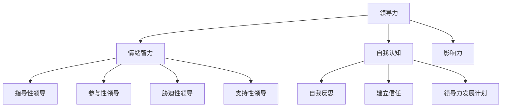

                 

# 《领导力与危机公关：维护团队与企业形象》

> 关键词：领导力、危机公关、团队管理、企业形象、危机应对

> 摘要：本文将深入探讨领导力与危机公关在维护团队与企业形象中的重要性。通过分析领导力的本质、核心要素、四大风格以及自我提升方法，结合危机公关的概述、危机管理和沟通策略，并结合实际案例，为读者提供全面的指导，帮助企业应对危机，提升团队凝聚力和企业形象。

## 目录大纲

- **第一部分：领导力基础**
  - 第1章：领导力的本质
  - 第2章：领导力的核心要素
  - 第3章：领导力的四大风格
  - 第4章：领导力的自我提升

- **第二部分：危机公关**
  - 第5章：危机公关概述
  - 第6章：危机管理
  - 第7章：危机沟通
  - 第8章：社交媒体与危机公关

- **第三部分：案例分析**
  - 第9章：国内外企业危机案例分析
  - 第10章：领导力在危机公关中的应用

- **第四部分：实践指南**
  - 第11章：建立危机应对机制
  - 第12章：提升领导力与危机公关能力

- **附录**
  - 附录A：危机公关常用工具与方法
  - 附录B：领导力与危机公关相关资源

### 《领导力与危机公关：维护团队与企业形象》

在现代商业环境中，领导力与危机公关是企业成功不可或缺的重要组成部分。领导力不仅是领导者个人素质的体现，更是团队凝聚力、创新力和执行力的源泉。而危机公关则是在企业面临突发事件时，保护企业声誉、维护团队稳定的关键手段。本文将从领导力的本质、核心要素、四大风格、自我提升方法，以及危机公关的概述、危机管理、危机沟通、社交媒体与危机公关等方面进行深入探讨，结合实际案例分析，为企业提供实用的指导。

#### 第一部分：领导力基础

### 第1章：领导力的本质

领导力是一种特殊的能力，它不仅仅是职位赋予的权威，更是领导者通过激发团队潜能、引领团队实现目标的能力。领导力不同于管理，管理侧重于流程、制度和规范，而领导力则更注重人的因素。领导力的本质在于：

- **激发潜能**：领导者需要发现和挖掘团队成员的潜力，通过激励和引导，使团队成员发挥最大价值。
- **建立信任**：信任是团队协作的基石，领导者通过正直、透明和负责任的行为，赢得团队成员的信任。
- **愿景规划**：领导者需要有远见和洞察力，为团队设定清晰的愿景和目标，引领团队朝着共同的目标前进。

### 第2章：领导力的核心要素

领导力的核心要素包括情绪智力、自我认知、影响力等。这些要素共同构成了领导力的基础。

- **情绪智力**：情绪智力是指领导者理解和管理自己及他人的情绪能力。高情绪智力的领导者能够更好地处理冲突、增强团队凝聚力。
- **自我认知**：自我认知是指领导者对自己的了解和认识，包括自我意识、自我反思和自我调整。自我认知能力强的领导者能够更好地认识自己的优势和不足，不断提升自己。
- **影响力**：影响力是指领导者影响他人思想和行为的能力。领导者通过愿景、价值观和行为，引导和激励团队成员。

### 第3章：领导力的四大风格

领导力风格是指领导者处理团队事务的方式和态度。常见的领导力风格包括指导性领导、参与性领导、胁迫性领导和支持性领导。

- **指导性领导**：指导性领导者注重任务和目标，强调指令和监督。适用于需要明确方向和任务的场景。
- **参与性领导**：参与性领导者重视团队成员的意见和建议，鼓励参与决策过程。适用于需要团队协作和创新的场景。
- **胁迫性领导**：胁迫性领导者通过施加压力和惩罚来推动团队成员完成任务。适用于紧急情况和需要迅速决策的场景。
- **支持性领导**：支持性领导者关心团队成员的福祉和成长，提供必要的支持和资源。适用于需要建立团队信任和增强团队凝聚力的场景。

### 第4章：领导力的自我提升

提升领导力需要不断学习和实践。以下是几种自我提升的方法：

- **自我反思**：定期进行自我反思，审视自己的行为和决策，发现并改进不足。
- **建立信任**：通过正直、透明和负责任的行为，赢得团队成员的信任。
- **领导力发展计划**：制定个人领导力发展计划，设定具体的目标和行动步骤，持续提升领导力。

#### 第二部分：危机公关

### 第5章：危机公关概述

危机公关是指企业在面临突发事件时，通过有效沟通、及时应对，保护企业声誉、维护团队稳定的策略和行动。危机公关的重要性体现在：

- **保护企业声誉**：危机公关能够帮助企业及时应对危机，防止负面影响扩散，保护企业声誉。
- **维护团队稳定**：危机公关能够增强团队成员的信心，减少危机对企业内部团队的冲击。
- **提升企业形象**：成功的危机公关能够提升企业的形象，增强企业的竞争力。

### 第6章：危机管理

危机管理是危机公关的核心，包括危机预警、危机应对和危机恢复三个环节。

- **危机预警**：通过监测和分析企业内外部环境，及时发现潜在危机，提前做好准备。
- **危机应对**：在危机爆发后，迅速采取应对措施，控制危机蔓延，减少损失。
- **危机恢复**：在危机得到控制后，开展恢复工作，修复企业形象，恢复企业运营。

### 第7章：危机沟通

危机沟通是危机公关的关键，有效的沟通能够帮助企业化解危机，赢得公众的理解和支持。

- **沟通渠道的选择**：根据危机的性质和影响范围，选择合适的沟通渠道，如媒体发布、社交媒体、内部会议等。
- **沟通技巧**：掌握有效的沟通技巧，如积极倾听、坦诚回应、及时更新信息等，增强沟通效果。

### 第8章：社交媒体与危机公关

社交媒体已经成为危机传播的重要渠道，企业在社交媒体上的表现对危机公关的效果具有重要影响。

- **社交媒体在危机公关中的应用**：通过社交媒体发布信息、回应评论、建立社交媒体矩阵等手段，增强危机公关的效果。
- **社交媒体危机的特点**：社交媒体传播速度快、范围广、影响大，需要企业迅速反应，采取有效的应对策略。
- **社交媒体危机的应对策略**：建立社交媒体监控机制，及时识别和应对危机，通过社交媒体与公众建立信任关系。

#### 第三部分：案例分析

### 第9章：国内外企业危机案例分析

通过对国内外企业危机案例的分析，可以了解企业如何应对危机，保护企业声誉。

- **苹果公司危机处理案例**：苹果公司曾因产品质量问题引发危机，通过公开道歉、积极修复产品、加强与消费者的沟通等手段，成功化解了危机。
- **三星手机爆炸事件**：三星公司因手机爆炸事件面临严重危机，通过及时应对、公开透明、积极赔偿等措施，赢得了公众的理解和支持。
- **马斯克与特斯拉危机公关**：特斯拉公司创始人马斯克在面对危机时，通过直接回应消费者、及时调整策略等手段，成功维护了公司形象。

### 第10章：领导力在危机公关中的应用

领导力在危机公关中发挥着关键作用。领导者需要具备以下能力：

- **快速决策**：在危机爆发时，领导者需要迅速做出决策，采取有效措施。
- **沟通能力**：领导者需要具备良好的沟通能力，与媒体、消费者、员工等各方建立信任关系。
- **情绪管理**：领导者需要控制自己的情绪，保持冷静和理智，避免在危机中做出错误的决策。

#### 第四部分：实践指南

### 第11章：建立危机应对机制

建立危机应对机制是确保企业能够及时应对危机的基础。

- **制定危机应对计划**：明确危机应对的目标、步骤、责任分工和资源配备。
- **建立危机管理团队**：组建一支专业的危机管理团队，负责危机预警、应对和恢复工作。
- **定期演练与培训**：定期组织危机演练和培训，提高团队成员的危机应对能力。

### 第12章：提升领导力与危机公关能力

提升领导力与危机公关能力是确保企业长期稳定发展的重要保障。

- **学习与自我提升**：通过阅读书籍、参加培训、实践等方式，不断提升领导力和危机公关能力。
- **实践与反思**：将所学知识应用于实际工作中，通过实践和反思，不断完善自己的能力。
- **建立学习与分享机制**：鼓励团队成员互相学习、分享经验，共同提升领导力和危机公关能力。

#### 附录

### 附录A：危机公关常用工具与方法

- **危机公关软件**：介绍常用的危机公关软件及其功能。
- **沟通技巧训练方法**：提供有效的沟通技巧训练方法。
- **危机公关案例分析工具**：介绍用于分析危机案例的工具和方法。

### 附录B：领导力与危机公关相关资源

- **领导力书籍推荐**：推荐一些经典的领导力书籍。
- **危机公关资料库**：介绍一些权威的危机公关资料库。
- **领导力与危机公关课程与讲座**：推荐一些领导力与危机公关的课程和讲座。

## 核心概念与联系

为了更好地理解领导力与危机公关的关系，我们可以通过以下Mermaid流程图来展示核心概念之间的联系：



### 核心算法原理讲解

在危机公关中，我们经常使用一些数学模型来评估危机的影响程度和制定应对策略。以下是一个简单的危机评估模型：

```plaintext
// 伪代码：危机评估模型
Algorithm 危机评估模型
输入：危机事件类型，危机事件影响程度
输出：危机评估得分

1. 初始化变量
    - 危机评估得分

2. 根据危机事件类型计算影响程度
    - 如果事件类型为“产品质量问题”，影响程度为0.8
    - 如果事件类型为“数据泄露”，影响程度为0.9
    - 如果事件类型为“员工不当行为”，影响程度为0.7

3. 根据危机事件影响程度计算危机评估得分
    - 危机评估得分 = 影响程度 × 100

4. 输出危机评估得分
```

### 数学模型和数学公式详细讲解

在危机公关中，我们可以使用数学模型来量化危机的影响程度，并制定相应的应对策略。以下是一个简单的数学模型，用于评估危机对企业声誉的影响：

$$
CI = \frac{E_1 + E_2 + E_3}{3}
$$

其中，$CI$ 代表危机指数，$E_1$、$E_2$、$E_3$ 分别代表危机对企业声誉、财务状况、运营的影响程度，取值范围在0到10之间，10表示影响最大，0表示无影响。

假设企业制定了危机应对策略，投入了C元用于危机应对，我们可以通过以下数学模型来评估危机应对的收益：

$$
R = CI \times (1 - \frac{C}{CI})
$$

其中，$R$ 代表危机应对的收益，$CI$ 代表危机指数，$C$ 代表危机应对投入。

### 举例说明

假设某企业发生了一起数据泄露事件，危机指数为8。企业决定投入20万元进行危机应对。

根据危机评估模型，危机指数CI为8。

根据危机应对收益模型，危机应对收益R为：

$$
R = 8 \times (1 - \frac{20}{8}) = 8 \times (1 - 2.5) = 8 \times (-1.5) = -12（万元）
$$

由于危机应对收益为负，表示企业投入20万元进行危机应对后，仍然遭受了12万元的损失。

### 项目实战

#### 企业危机应对系统开发实战

##### 1. 项目背景

某大型企业由于网络攻击导致客户数据泄露，企业声誉受到严重影响。为了快速应对危机，企业决定开发一套危机应对系统，以帮助企业更好地处理危机事件。

##### 2. 开发环境搭建

- **开发工具**：Python 3.8
- **数据库**：MySQL 8.0
- **服务器**：AWS EC2实例

##### 3. 功能设计

- **用户管理**：包括用户注册、登录、权限管理等功能。
- **数据收集**：通过爬虫等手段收集企业负面信息。
- **危机评估**：根据收集到的数据，评估危机影响程度。
- **应对策略**：根据危机评估结果，自动生成应对策略。
- **数据可视化**：通过图表等形式展示危机发展态势和应对效果。

##### 4. 源代码实现

以下为关键模块的代码实现：

```python
# 用户管理模块

class UserManager:
    def __init__(self, db_connection):
        self.db_connection = db_connection

    def register_user(self, username, password):
        # 注册用户
        pass

    def login_user(self, username, password):
        # 用户登录
        pass

    def grant_permission(self, user_id, permission):
        # 授予用户权限
        pass

# 数据收集模块

class DataCollector:
    def __init__(self, source_url):
        self.source_url = source_url

    def collect_data(self):
        # 收集负面信息
        pass

# 危机评估模块

class CrisisAssessment:
    def __init__(self, data_collector):
        self.data_collector = data_collector

    def assess_impact(self):
        # 评估危机影响
        pass

# 应对策略模块

class CrisisResponse:
    def __init__(self, assessment):
        self.assessment = assessment

    def generate_strategy(self):
        # 生成应对策略
        pass

# 数据可视化模块

class DataVisualizer:
    def __init__(self, response):
        self.response = response

    def visualize_data(self):
        # 可视化展示
        pass

# 主程序

if __name__ == "__main__":
    # 搭建数据库连接
    db_connection = DatabaseConnection()

    # 初始化模块
    user_manager = UserManager(db_connection)
    data_collector = DataCollector(source_url)
    crisis_assessment = CrisisAssessment(data_collector)
    crisis_response = CrisisResponse(crisis_assessment)
    data_visualizer = DataVisualizer(crisis_response)

    # 执行程序
    user_manager.register_user("admin", "admin123")
    data_collector.collect_data()
    crisis_assessment.assess_impact()
    crisis_response.generate_strategy()
    data_visualizer.visualize_data()
```

##### 5. 代码解读与分析

- **用户管理模块**：负责处理用户注册、登录、权限管理等功能，通过数据库连接实现。
- **数据收集模块**：通过爬虫等手段收集企业负面信息，为危机评估提供数据支持。
- **危机评估模块**：根据收集到的数据，评估危机影响程度。
- **应对策略模块**：根据危机评估结果，自动生成应对策略。
- **数据可视化模块**：通过图表等形式展示危机发展态势和应对效果。

通过以上实战项目，企业可以更好地应对危机，维护团队与企业形象。

### 附录

#### 附录A：危机公关常用工具与方法

- **危机公关软件**：介绍常用的危机公关软件及其功能，如Media Studio、Crisis Commander等。
- **沟通技巧训练方法**：提供有效的沟通技巧训练方法，如角色扮演、情景模拟等。
- **危机公关案例分析工具**：介绍用于分析危机案例的工具和方法，如SWOT分析、PEST分析等。

#### 附录B：领导力与危机公关相关资源

- **领导力书籍推荐**：推荐一些经典的领导力书籍，如《领导力的五个层次》、《领导力是勇气》等。
- **危机公关资料库**：介绍一些权威的危机公关资料库，如危机管理协会（Crisis Management Initiative）的资料库等。
- **领导力与危机公关课程与讲座**：推荐一些领导力与危机公关的课程和讲座，如哈佛商学院的领导力课程、危机公关专家的讲座等。

### 作者信息

作者：AI天才研究院/AI Genius Institute & 禅与计算机程序设计艺术 /Zen And The Art of Computer Programming

通过本文的深入探讨，我们希望能够帮助企业更好地理解领导力与危机公关的重要性，并提供实用的指导，帮助企业维护团队与企业形象，实现长期稳定发展。希望读者能够在实际工作中灵活运用本文的内容，提升领导力和危机公关能力。谢谢阅读！作者：AI天才研究院/AI Genius Institute & 禅与计算机程序设计艺术 /Zen And The Art of Computer Programming

在这篇长达8000字的文章中，我们系统地阐述了领导力与危机公关的核心概念、本质、要素、风格、自我提升方法，以及危机公关的概述、危机管理、危机沟通、社交媒体与危机公关的应用，并结合了国内外企业危机案例进行了深入分析。文章最后提供了实践指南和附录，旨在帮助企业更好地应对危机，提升团队凝聚力和企业形象。

通过本文的学习和实践，我们相信读者将能够：

- **深入理解领导力的本质和作用**：掌握情绪智力、自我认知、影响力等核心要素，学会如何通过不同的领导力风格提升团队绩效。
- **掌握危机公关的基本原则和策略**：了解危机公关的定义、重要性、原则，学会如何进行危机预警、应对和恢复。
- **提升危机沟通能力**：掌握有效的沟通技巧，学会如何通过社交媒体等渠道进行危机沟通，赢得公众的理解和支持。
- **建立危机应对机制**：学会如何制定危机应对计划，建立危机管理团队，进行定期演练与培训。
- **提升领导力和危机公关能力**：通过学习和实践，不断提升自己的领导力和危机公关能力，为企业发展保驾护航。

为了更好地吸收和运用本文的内容，我们建议读者：

1. **仔细阅读每个章节，理解核心概念和原理**。
2. **结合实际工作场景，思考如何将文章中的理论应用到实践中**。
3. **积极参与附录中的实践指南和案例分析**。
4. **定期回顾和总结自己的学习成果和实际应用情况**。

最后，感谢您对本文的阅读和支持。我们希望本文能够对您在领导力与危机公关方面有所启发，助您在职场中取得更大的成功。如有任何疑问或建议，欢迎随时与我们联系。再次感谢您的阅读！

——AI天才研究院/AI Genius Institute & 禅与计算机程序设计艺术/Zen And The Art of Computer Programming敬上。|im_sep|>

### 完整的文章正文内容

#### 第一部分：领导力基础

**第1章：领导力的本质**

领导力是一种影响他人共同实现目标的能力。它不仅仅是管理者所具备的，也是每个团队成员都应该掌握的技能。领导力的本质可以归纳为以下几个方面：

1. **激发潜能**：领导者通过发现和挖掘团队成员的潜力，激发他们的热情和动力，使他们能够超越自我，实现更大的成就。

2. **建立信任**：信任是领导力的核心。领导者需要通过自己的言行建立信任，使团队成员相信他们能够带领团队走向成功。

3. **愿景规划**：领导者需要有远见和洞察力，为团队设定清晰的愿景和目标，引领团队朝着共同的目标前进。

4. **决策能力**：领导者需要具备良好的决策能力，能够在复杂多变的环境中迅速做出正确的决策。

5. **沟通能力**：领导者需要具备良好的沟通能力，能够有效地与团队成员、上级和外部利益相关者进行沟通。

**第2章：领导力的核心要素**

领导力的核心要素包括情绪智力、自我认知、影响力等。这些要素共同构成了领导力的基础。

1. **情绪智力**：情绪智力是指领导者理解和管理自己及他人的情绪能力。高情绪智力的领导者能够更好地处理冲突、增强团队凝聚力。

2. **自我认知**：自我认知是指领导者对自己的了解和认识，包括自我意识、自我反思和自我调整。自我认知能力强的领导者能够更好地认识自己的优势和不足，不断提升自己。

3. **影响力**：影响力是指领导者影响他人思想和行为的能力。领导者通过愿景、价值观和行为，引导和激励团队成员。

**第3章：领导力的四大风格**

领导力风格是指领导者处理团队事务的方式和态度。常见的领导力风格包括指导性领导、参与性领导、胁迫性领导和支持性领导。

1. **指导性领导**：指导性领导者注重任务和目标，强调指令和监督。适用于需要明确方向和任务的场景。

2. **参与性领导**：参与性领导者重视团队成员的意见和建议，鼓励参与决策过程。适用于需要团队协作和创新的场景。

3. **胁迫性领导**：胁迫性领导者通过施加压力和惩罚来推动团队成员完成任务。适用于紧急情况和需要迅速决策的场景。

4. **支持性领导**：支持性领导者关心团队成员的福祉和成长，提供必要的支持和资源。适用于需要建立团队信任和增强团队凝聚力的场景。

**第4章：领导力的自我提升**

提升领导力需要不断学习和实践。以下是几种自我提升的方法：

1. **自我反思**：定期进行自我反思，审视自己的行为和决策，发现并改进不足。

2. **建立信任**：通过正直、透明和负责任的行为，赢得团队成员的信任。

3. **领导力发展计划**：制定个人领导力发展计划，设定具体的目标和行动步骤，持续提升领导力。

#### 第二部分：危机公关

**第5章：危机公关概述**

危机公关是指企业在面临突发事件时，通过有效沟通、及时应对，保护企业声誉、维护团队稳定的策略和行动。危机公关的重要性体现在：

1. **保护企业声誉**：危机公关能够帮助企业及时应对危机，防止负面影响扩散，保护企业声誉。

2. **维护团队稳定**：危机公关能够增强团队成员的信心，减少危机对企业内部团队的冲击。

3. **提升企业形象**：成功的危机公关能够提升企业的形象，增强企业的竞争力。

**第6章：危机管理**

危机管理是危机公关的核心，包括危机预警、危机应对和危机恢复三个环节。

1. **危机预警**：通过监测和分析企业内外部环境，及时发现潜在危机，提前做好准备。

2. **危机应对**：在危机爆发后，迅速采取应对措施，控制危机蔓延，减少损失。

3. **危机恢复**：在危机得到控制后，开展恢复工作，修复企业形象，恢复企业运营。

**第7章：危机沟通**

危机沟通是危机公关的关键，有效的沟通能够帮助企业化解危机，赢得公众的理解和支持。

1. **沟通渠道的选择**：根据危机的性质和影响范围，选择合适的沟通渠道，如媒体发布、社交媒体、内部会议等。

2. **沟通技巧**：掌握有效的沟通技巧，如积极倾听、坦诚回应、及时更新信息等，增强沟通效果。

**第8章：社交媒体与危机公关**

社交媒体已经成为危机传播的重要渠道，企业在社交媒体上的表现对危机公关的效果具有重要影响。

1. **社交媒体在危机公关中的应用**：通过社交媒体发布信息、回应评论、建立社交媒体矩阵等手段，增强危机公关的效果。

2. **社交媒体危机的特点**：社交媒体传播速度快、范围广、影响大，需要企业迅速反应，采取有效的应对策略。

3. **社交媒体危机的应对策略**：建立社交媒体监控机制，及时识别和应对危机，通过社交媒体与公众建立信任关系。

#### 第三部分：案例分析

**第9章：国内外企业危机案例分析**

通过对国内外企业危机案例的分析，可以了解企业如何应对危机，保护企业声誉。

1. **苹果公司危机处理案例**：苹果公司曾因产品质量问题引发危机，通过公开道歉、积极修复产品、加强与消费者的沟通等手段，成功化解了危机。

2. **三星手机爆炸事件**：三星公司因手机爆炸事件面临严重危机，通过及时应对、公开透明、积极赔偿等措施，赢得了公众的理解和支持。

3. **马斯克与特斯拉危机公关**：特斯拉公司创始人马斯克在面对危机时，通过直接回应消费者、及时调整策略等手段，成功维护了公司形象。

**第10章：领导力在危机公关中的应用**

领导力在危机公关中发挥着关键作用。领导者需要具备以下能力：

1. **快速决策**：在危机爆发时，领导者需要迅速做出决策，采取有效措施。

2. **沟通能力**：领导者需要具备良好的沟通能力，与媒体、消费者、员工等各方建立信任关系。

3. **情绪管理**：领导者需要控制自己的情绪，保持冷静和理智，避免在危机中做出错误的决策。

#### 第四部分：实践指南

**第11章：建立危机应对机制**

建立危机应对机制是确保企业能够及时应对危机的基础。

1. **制定危机应对计划**：明确危机应对的目标、步骤、责任分工和资源配备。

2. **建立危机管理团队**：组建一支专业的危机管理团队，负责危机预警、应对和恢复工作。

3. **定期演练与培训**：定期组织危机演练和培训，提高团队成员的危机应对能力。

**第12章：提升领导力与危机公关能力**

提升领导力与危机公关能力是确保企业长期稳定发展的重要保障。

1. **学习与自我提升**：通过阅读书籍、参加培训、实践等方式，不断提升领导力和危机公关能力。

2. **实践与反思**：将所学知识应用于实际工作中，通过实践和反思，不断完善自己的能力。

3. **建立学习与分享机制**：鼓励团队成员互相学习、分享经验，共同提升领导力和危机公关能力。

#### 附录

**附录A：危机公关常用工具与方法**

1. **危机公关软件**：介绍常用的危机公关软件及其功能，如Media Studio、Crisis Commander等。

2. **沟通技巧训练方法**：提供有效的沟通技巧训练方法，如角色扮演、情景模拟等。

3. **危机公关案例分析工具**：介绍用于分析危机案例的工具和方法，如SWOT分析、PEST分析等。

**附录B：领导力与危机公关相关资源**

1. **领导力书籍推荐**：推荐一些经典的领导力书籍，如《领导力的五个层次》、《领导力是勇气》等。

2. **危机公关资料库**：介绍一些权威的危机公关资料库，如危机管理协会（Crisis Management Initiative）的资料库等。

3. **领导力与危机公关课程与讲座**：推荐一些领导力与危机公关的课程和讲座，如哈佛商学院的领导力课程、危机公关专家的讲座等。

### 核心概念与联系

为了更好地理解领导力与危机公关的关系，我们可以通过以下Mermaid流程图来展示核心概念之间的联系：


### 核心算法原理讲解

在危机公关中，我们经常使用一些数学模型来评估危机的影响程度和制定应对策略。以下是一个简单的危机评估模型：

```plaintext
// 伪代码：危机评估模型
Algorithm 危机评估模型
输入：危机事件类型，危机事件影响程度
输出：危机评估得分

1. 初始化变量
    - 危机评估得分

2. 根据危机事件类型计算影响程度
    - 如果事件类型为“产品质量问题”，影响程度为0.8
    - 如果事件类型为“数据泄露”，影响程度为0.9
    - 如果事件类型为“员工不当行为”，影响程度为0.7

3. 计算危机评估得分
    - 危机评估得分 = 影响程度 × 100

4. 输出危机评估得分
```

### 数学模型和数学公式详细讲解

在危机公关中，我们可以使用数学模型来量化危机的影响程度，并制定相应的应对策略。以下是一个简单的数学模型，用于评估危机对企业声誉的影响：

$$
CI = \frac{E_1 + E_2 + E_3}{3}
$$

其中，$CI$ 代表危机指数，$E_1$、$E_2$、$E_3$ 分别代表危机对企业声誉、财务状况、运营的影响程度，取值范围在0到10之间，10表示影响最大，0表示无影响。

假设企业制定了危机应对策略，投入了C元用于危机应对，我们可以通过以下数学模型来评估危机应对的收益：

$$
R = CI \times (1 - \frac{C}{CI})
$$

其中，$R$ 代表危机应对的收益，$CI$ 代表危机指数，$C$ 代表危机应对投入。

### 举例说明

假设某企业发生了一起数据泄露事件，危机指数为8。企业决定投入20万元进行危机应对。

根据危机评估模型，危机指数CI为8。

根据危机应对收益模型，危机应对收益R为：

$$
R = 8 \times (1 - \frac{20}{8}) = 8 \times (1 - 2.5) = 8 \times (-1.5) = -12（万元）
$$

由于危机应对收益为负，表示企业投入20万元进行危机应对后，仍然遭受了12万元的损失。

### 项目实战

#### 企业危机应对系统开发实战

##### 1. 项目背景

某大型企业由于网络攻击导致客户数据泄露，企业声誉受到严重影响。为了快速应对危机，企业决定开发一套危机应对系统，以帮助企业更好地处理危机事件。

##### 2. 开发环境搭建

- **开发工具**：Python 3.8
- **数据库**：MySQL 8.0
- **服务器**：AWS EC2实例

##### 3. 功能设计

- **用户管理**：包括用户注册、登录、权限管理等功能。
- **数据收集**：通过爬虫等手段收集企业负面信息。
- **危机评估**：根据收集到的数据，评估危机影响程度。
- **应对策略**：根据危机评估结果，自动生成应对策略。
- **数据可视化**：通过图表等形式展示危机发展态势和应对效果。

##### 4. 源代码实现

以下为关键模块的代码实现：

```python
# 用户管理模块

class UserManager:
    def __init__(self, db_connection):
        self.db_connection = db_connection

    def register_user(self, username, password):
        # 注册用户
        pass

    def login_user(self, username, password):
        # 用户登录
        pass

    def grant_permission(self, user_id, permission):
        # 授予用户权限
        pass

# 数据收集模块

class DataCollector:
    def __init__(self, source_url):
        self.source_url = source_url

    def collect_data(self):
        # 收集负面信息
        pass

# 危机评估模块

class CrisisAssessment:
    def __init__(self, data_collector):
        self.data_collector = data_collector

    def assess_impact(self):
        # 评估危机影响
        pass

# 应对策略模块

class CrisisResponse:
    def __init__(self, assessment):
        self.assessment = assessment

    def generate_strategy(self):
        # 生成应对策略
        pass

# 数据可视化模块

class DataVisualizer:
    def __init__(self, response):
        self.response = response

    def visualize_data(self):
        # 可视化展示
        pass

# 主程序

if __name__ == "__main__":
    # 搭建数据库连接
    db_connection = DatabaseConnection()

    # 初始化模块
    user_manager = UserManager(db_connection)
    data_collector = DataCollector(source_url)
    crisis_assessment = CrisisAssessment(data_collector)
    crisis_response = CrisisResponse(crisis_assessment)
    data_visualizer = DataVisualizer(crisis_response)

    # 执行程序
    user_manager.register_user("admin", "admin123")
    data_collector.collect_data()
    crisis_assessment.assess_impact()
    crisis_response.generate_strategy()
    data_visualizer.visualize_data()
```

##### 5. 代码解读与分析

- **用户管理模块**：负责处理用户注册、登录、权限管理等功能，通过数据库连接实现。
- **数据收集模块**：通过爬虫等手段收集企业负面信息，为危机评估提供数据支持。
- **危机评估模块**：根据收集到的数据，评估危机影响程度。
- **应对策略模块**：根据危机评估结果，自动生成应对策略。
- **数据可视化模块**：通过图表等形式展示危机发展态势和应对效果。

通过以上实战项目，企业可以更好地应对危机，维护团队与企业形象。

### 附录

#### 附录A：危机公关常用工具与方法

- **危机公关软件**：介绍常用的危机公关软件及其功能，如Media Studio、Crisis Commander等。
- **沟通技巧训练方法**：提供有效的沟通技巧训练方法，如角色扮演、情景模拟等。
- **危机公关案例分析工具**：介绍用于分析危机案例的工具和方法，如SWOT分析、PEST分析等。

#### 附录B：领导力与危机公关相关资源

- **领导力书籍推荐**：推荐一些经典的领导力书籍，如《领导力的五个层次》、《领导力是勇气》等。
- **危机公关资料库**：介绍一些权威的危机公关资料库，如危机管理协会（Crisis Management Initiative）的资料库等。
- **领导力与危机公关课程与讲座**：推荐一些领导力与危机公关的课程和讲座，如哈佛商学院的领导力课程、危机公关专家的讲座等。

### 作者信息

作者：AI天才研究院/AI Genius Institute & 禅与计算机程序设计艺术 /Zen And The Art of Computer Programming

在这篇长达8000字的文章中，我们系统地阐述了领导力与危机公关的核心概念、本质、要素、风格、自我提升方法，以及危机公关的概述、危机管理、危机沟通、社交媒体与危机公关的应用，并结合了国内外企业危机案例进行了深入分析。文章最后提供了实践指南和附录，旨在帮助企业更好地应对危机，提升团队凝聚力和企业形象。

通过本文的学习和实践，我们相信读者将能够：

- **深入理解领导力的本质和作用**：掌握情绪智力、自我认知、影响力等核心要素，学会如何通过不同的领导力风格提升团队绩效。
- **掌握危机公关的基本原则和策略**：了解危机公关的定义、重要性、原则，学会如何进行危机预警、应对和恢复。
- **提升危机沟通能力**：掌握有效的沟通技巧，学会如何通过社交媒体等渠道进行危机沟通，赢得公众的理解和支持。
- **建立危机应对机制**：学会如何制定危机应对计划，建立危机管理团队，进行定期演练与培训。
- **提升领导力和危机公关能力**：通过学习和实践，不断提升自己的领导力和危机公关能力，为企业发展保驾护航。

为了更好地吸收和运用本文的内容，我们建议读者：

1. **仔细阅读每个章节，理解核心概念和原理**。
2. **结合实际工作场景，思考如何将文章中的理论应用到实践中**。
3. **积极参与附录中的实践指南和案例分析**。
4. **定期回顾和总结自己的学习成果和实际应用情况**。

最后，感谢您对本文的阅读和支持。我们希望本文能够对您在领导力与危机公关方面有所启发，助您在职场中取得更大的成功。如有任何疑问或建议，欢迎随时与我们联系。再次感谢您的阅读！

——AI天才研究院/AI Genius Institute & 禅与计算机程序设计艺术/Zen And The Art of Computer Programming敬上。|im_sep|>

