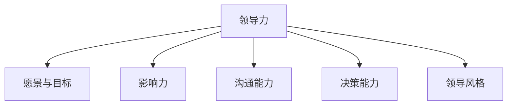
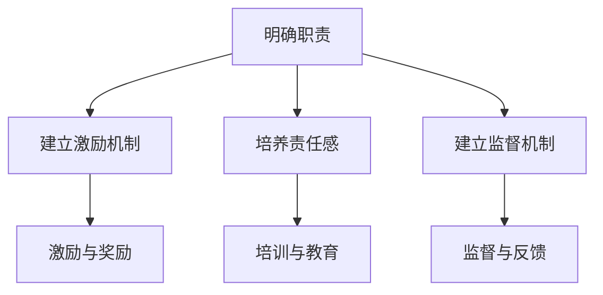

                 

# 《领导力与责任文化构建：从个人到团队的升华》

## 关键词：
- 领导力
- 责任文化
- 个人成长
- 团队建设
- 企业发展

> 摘要：
本文旨在探讨领导力与责任文化在个人成长和团队建设中的重要性，以及如何通过构建责任文化实现领导力的升华。文章首先明确了领导力的定义与核心要素，接着分析了领导力与责任文化的关联，随后探讨了个人领导力的提升策略，以及团队领导力的培养方法和实践案例。最后，本文提出了评估领导力与责任文化效果的策略和持续发展的建议。

---

## 引言

在信息技术飞速发展的今天，企业的竞争已不再仅仅局限于技术本身，而更多地体现在团队和组织的管理能力上。领导力作为一种关键的管理能力，对于个人和团队的成长起到了至关重要的作用。同时，责任文化的建设也是企业可持续发展的重要保障。本文将围绕这两个核心主题展开讨论，旨在为读者提供关于领导力与责任文化构建的全面而深入的理解。

领导力不仅仅关乎个人素质，更关系到团队的整体效能。一个优秀的领导者不仅能够激发团队成员的潜力，还能在困难面前凝聚团队，共同克服挑战。而责任文化则强调每一个成员都应该对自己的行为和结果承担责任，这种文化能够促进团队内部的信任与合作，从而提升整个团队的绩效。

本文将从以下几个方面进行探讨：

1. 领导力的基础：介绍领导力的定义与核心要素，以及领导力的重要性。
2. 领导力与责任文化：分析领导力与责任文化的概念及其关联。
3. 个人领导力提升：讨论个人领导力的培养方法，包括自我认知、沟通技巧、决策能力等。
4. 团队领导力：探讨团队领导力的培养策略，以及如何解决团队冲突。
5. 领导力与责任文化的实践：通过实际案例展示领导力与责任文化的应用和效果。
6. 领导力与责任文化的持续发展：提出评估和持续发展的策略。

通过本文的探讨，希望能够为读者提供关于领导力与责任文化构建的实用指导，帮助个人和团队在信息化时代取得更大的成功。

---

## 第一部分：领导力的基础

领导力是一种影响力和引导力，它不仅涉及到个人能力的展现，更是一种系统性的管理艺术。在组织管理中，领导力被视为提升团队效能、推动组织发展的关键因素。要深入理解领导力，首先需要明确其定义和核心要素。

### 第1章：领导力的定义与核心要素

#### 1.1 领导力的定义

领导力可以定义为一种能够引导、激励和影响他人，以实现共同目标的能力。它不仅包括对团队内部的管理，还涉及到对外部环境的适应和应对。领导力不仅仅是领导者的个人素质，更是组织文化的重要组成部分。

#### 1.2 领导力的核心要素

领导力的核心要素主要包括以下几个方面：

- **愿景和目标**：领导者需要拥有清晰的愿景和目标，并能够将这些愿景和目标传达给团队成员，激发他们的积极性。
- **影响力**：领导者需要具备影响他人行为和思维的能力，这种能力不仅来自于权威，更来自于个人魅力和专业能力。
- **沟通能力**：领导者需要具备良好的沟通能力，能够有效地与团队成员沟通，了解他们的需求和期望，同时也能够清晰地传达自己的意图。
- **决策能力**：领导者需要能够在复杂和不确定的情况下做出明智的决策，并能够承担相应的责任。
- **领导风格**：不同的领导风格适用于不同的情境和团队，领导者需要根据实际情况选择合适的领导风格。

#### 1.3 领导力的重要性

领导力的重要性体现在以下几个方面：

- **提升团队效能**：有效的领导力能够激发团队成员的潜力，提高团队的协作效率，从而实现组织目标。
- **促进个人成长**：领导力的发展有助于个人在职业生涯中获得更多的机会和挑战。
- **推动组织发展**：领导力是组织战略实施的核心，它能够推动组织的创新和变革，适应快速变化的市场环境。

---

### 第2章：领导力与责任文化

#### 2.1 责任文化的概念

责任文化是一种价值观和行为准则，强调每一个成员都应该对自己的行为和结果承担责任。责任文化的核心在于建立信任和责任感，使团队成员能够自觉履行自己的职责，共同实现组织目标。

#### 2.2 责任文化的构建

责任文化的构建需要以下几个方面的努力：

- **明确职责**：为每个团队成员明确其职责范围，确保每个人都清楚自己的工作内容和目标。
- **建立激励机制**：通过激励机制，鼓励团队成员承担更多的责任，提高工作积极性和主动性。
- **培养责任感**：通过培训和教育，提高团队成员的责任感，使其认识到责任的重要性，并在工作中积极履行。
- **建立监督机制**：建立有效的监督机制，对团队成员的工作进行监督和评估，确保责任得到落实。

#### 2.3 领导力与责任文化的关联

领导力与责任文化之间存在密切的关联。有效的领导力能够推动责任文化的建设，而责任文化的建立又能进一步强化领导力。具体来说：

- **领导力促进责任文化的建设**：领导者通过自身的示范作用，影响团队成员的责任意识，推动责任文化的形成。
- **责任文化强化领导力**：责任文化的建立有助于提高团队的凝聚力，增强领导者的权威和影响力，使其在团队管理中更加有效。

---

通过以上两章的讨论，我们可以看出，领导力与责任文化是相辅相成的。领导力是推动组织发展的关键，而责任文化则是确保组织目标实现的基础。在接下来的章节中，我们将进一步探讨个人领导力的提升策略，以及团队领导力的培养方法。

---

## 第二部分：个人领导力提升

个人领导力的提升是每个职业人士成长的重要一环。在信息时代，个人领导力的强弱不仅影响着个人的职业发展，也直接关系到团队和组织的效果。本部分将围绕个人领导力的培养方法展开讨论，主要包括自我认知与自我提升、沟通技巧与人际交往、决策能力与应变能力等方面。

### 第3章：个人领导力的培养

#### 3.1 自我认知与自我提升

自我认知是个人领导力培养的基础。只有了解自己的优势和劣势，才能有针对性地进行提升。自我提升则是一个持续的过程，包括以下几个方面：

- **自我反思**：定期进行自我反思，总结自己在工作中的优点和不足，找到提升的方向。
- **持续学习**：不断学习新知识、新技能，提升自己的专业能力，以适应不断变化的工作环境。
- **心态调整**：保持积极的心态，面对困难和挑战时，能够保持冷静和理性，做出明智的决策。

#### 3.2 沟通技巧与人际交往

沟通技巧和人际交往能力是领导力的核心要素之一。一个优秀的领导者不仅需要具备良好的沟通能力，还需要能够建立和维护良好的人际关系。

- **有效沟通**：学会倾听，理解他人的需求和期望；清晰表达自己的意图，确保信息的准确传达。
- **人际交往**：建立良好的人际关系，增强团队合作和协作效率；尊重他人，提升自己的影响力。

#### 3.3 决策能力与应变能力

决策能力和应变能力是领导者必须具备的重要能力。在面对复杂和不确定的情况时，领导者需要能够做出明智的决策，并迅速应对变化。

- **决策能力**：通过分析问题、评估风险、制定方案，做出合理的决策；勇于承担责任，不畏惧失败。
- **应变能力**：保持灵活的思维，快速适应变化；善于总结经验，从失败中吸取教训，不断优化决策过程。

---

### 第4章：领导风格与影响力

领导风格是领导者个人特质和价值观的体现，不同的领导风格适用于不同的情境和团队。领导风格与个人影响力密切相关，一个优秀的领导者能够通过自身的领导风格赢得团队的信任和支持。

#### 4.1 领导风格的分类与特点

常见的领导风格包括：

- **权威型**：领导者拥有高度的决策权，对团队成员的工作进行严格的管理和监督。
- **民主型**：领导者尊重团队成员的意见，鼓励参与决策，共同制定目标和计划。
- **放任型**：领导者给予团队成员高度的自主权，让他们自行决定工作内容和方式。

每种领导风格都有其优缺点和适用场景，领导者需要根据实际情况选择合适的领导风格。

#### 4.2 如何提升个人影响力

提升个人影响力是个人领导力提升的重要一环，以下是一些提升个人影响力的方法：

- **树立专业形象**：通过不断学习和实践，提升自己的专业能力和知识水平，树立专业权威形象。
- **建立良好的人际关系**：积极与他人建立和维护良好的人际关系，增强自己的社交网络。
- **培养领导力**：通过参与领导力和管理培训，提升自己的领导力和管理能力。
- **展现领导才能**：在工作和生活中，积极展现自己的领导才能，赢得他人的认可和支持。

#### 4.3 领导力与个人魅力

个人魅力是领导力的重要组成部分，一个有魅力的领导者能够吸引和激励团队成员，提高团队的凝聚力和执行力。

- **树立榜样**：通过自身的言行树立榜样，影响和激励团队成员。
- **培养自信**：保持自信，勇于面对挑战和困难，展示自己的实力和能力。
- **展现真诚**：真诚对待团队成员，关心他们的需求和成长，建立信任和尊重的关系。

---

通过以上讨论，我们可以看出，个人领导力的提升不仅需要自我认知和自我提升，还需要良好的沟通技巧、决策能力和应变能力。同时，领导风格和个人魅力也是提升个人影响力的关键。在接下来的章节中，我们将探讨团队领导力的培养方法和实践策略。

---

## 第三部分：团队领导力

团队领导力是领导力的一个重要分支，它不仅涉及领导者的个人素质，还涉及到对团队的整体管理和协调。团队领导力的强弱直接影响到团队的工作效率和团队绩效。本部分将围绕团队领导力的培养方法展开讨论，包括团队建设的核心要素、团队目标的设定与实现，以及团队冲突的解决等方面。

### 第5章：团队领导力的培养

#### 5.1 团队建设的核心要素

团队建设是团队领导力培养的基础，一个高效的团队需要具备以下几个核心要素：

- **共同目标**：团队需要明确共同的目标和愿景，使每个成员都明确自己的工作方向和目标，从而形成合力。
- **有效沟通**：团队成员之间需要建立有效的沟通机制，确保信息的准确传递和及时反馈，避免误解和冲突。
- **分工合作**：根据团队成员的能力和特长，合理分工，确保每个人都能发挥最大的作用，同时避免重复劳动和资源浪费。
- **团队协作**：鼓励团队成员之间的协作，形成良好的团队氛围，共同解决问题，提高团队的整体效能。

#### 5.2 团队目标的设定与实现

团队目标的设定是实现团队领导力的重要步骤。团队目标需要具备以下特点：

- **明确性**：目标需要明确具体，使每个成员都清楚自己的工作内容和责任。
- **可衡量性**：目标需要具备可衡量的标准，以便团队在实现目标的过程中进行监控和评估。
- **挑战性**：目标需要具备一定的挑战性，激发团队成员的积极性和创造力。
- **可实现性**：目标需要是可实现的，避免设定过于理想化的目标，导致团队失去信心。

团队目标的实现需要团队成员的共同努力，以下是一些实现团队目标的策略：

- **明确行动计划**：制定具体的行动计划，明确每个成员的任务和时间表，确保目标的实现。
- **有效沟通**：定期召开团队会议，了解团队成员的工作进展，及时解决问题和调整计划。
- **激励与奖励**：通过激励和奖励机制，鼓励团队成员为实现目标而努力。
- **监督与反馈**：建立监督机制，对团队成员的工作进行定期评估和反馈，确保目标的实现。

#### 5.3 团队冲突的解决

团队冲突是团队领导力面临的常见问题，有效的解决冲突策略对于维护团队稳定和提高团队效能至关重要。以下是一些解决团队冲突的方法：

- **积极沟通**：鼓励团队成员在遇到冲突时，通过积极沟通解决问题，避免情绪化和攻击性的行为。
- **中立调解**：在冲突无法通过沟通解决时，领导者需要扮演中立调解者的角色，引导双方达成共识。
- **明确规则**：制定明确的团队规则和行为准则，规范团队成员的行为，减少冲突的发生。
- **培训与教育**：通过培训和教育，提高团队成员的沟通技巧和团队合作能力，降低冲突的发生率。

---

通过以上讨论，我们可以看出，团队领导力的培养是一个系统性的过程，需要关注团队建设的核心要素、团队目标的设定与实现，以及团队冲突的解决。在接下来的章节中，我们将进一步探讨团队领导力提升的具体策略和方法。

---

### 第6章：团队领导力提升策略

#### 6.1 团队协作与沟通

团队协作与沟通是提升团队领导力的关键因素。有效的团队协作与沟通能够促进团队内部的相互理解和信任，提高团队的效率和绩效。以下是一些提升团队协作与沟通的方法：

- **建立团队文化**：塑造积极向上的团队文化，鼓励团队成员之间的相互支持和合作。
- **明确角色与职责**：为每个团队成员明确其角色和职责，确保每个人都清楚自己的工作内容和期望。
- **定期团队会议**：定期召开团队会议，分享信息和进度，解决存在的问题，确保团队目标的实现。
- **跨部门合作**：鼓励跨部门之间的合作，促进信息共享和资源整合，提高团队的协同效应。

#### 6.2 团队激励与奖励机制

激励与奖励机制是提升团队领导力的有效手段。合理的激励与奖励机制能够激发团队成员的积极性和创造力，提高团队的整体绩效。以下是一些团队激励与奖励的方法：

- **绩效奖励**：根据团队成员的工作绩效，给予相应的奖金或奖励，激励成员不断提高自己的工作水平。
- **晋升机会**：为团队成员提供晋升机会，激励他们不断提升自己的能力和素质。
- **培训与发展**：为团队成员提供培训和发展机会，帮助他们提升自己的专业能力和职业素养。
- **团队活动**：定期组织团队活动，增强团队成员之间的互动和联系，提高团队的凝聚力。

#### 6.3 领导者如何塑造团队文化

领导者在塑造团队文化中起着关键作用。以下是一些领导者塑造团队文化的方法：

- **树立榜样**：领导者通过自身的言行树立榜样，影响和引导团队成员的行为和价值观。
- **鼓励反馈**：领导者鼓励团队成员提供反馈，倾听他们的意见和想法，营造开放和包容的团队氛围。
- **关注团队成员的成长**：领导者关注团队成员的成长和发展，提供支持和帮助，帮助他们实现个人目标。
- **营造积极的工作环境**：领导者营造积极的工作环境，鼓励团队成员积极参与工作，提高工作效率和满意度。

---

通过以上讨论，我们可以看出，团队领导力的提升需要关注团队协作与沟通、团队激励与奖励机制，以及领导者如何塑造团队文化。有效的团队领导力不仅能够提高团队的工作效率和绩效，还能够促进团队成员的个人成长和发展。在接下来的章节中，我们将通过实际案例展示领导力与责任文化的应用和效果。

---

## 第四部分：领导力与责任文化的实践

通过前几章的探讨，我们已经了解了领导力和责任文化的基本概念、核心要素以及提升策略。在这一部分，我们将通过实际案例展示领导力与责任文化的应用和效果，进一步阐述如何将理论知识转化为实践行动。

### 第7章：领导力与责任文化的实践案例

#### 7.1 案例一：从个人领导力到团队领导力的转化

在某科技公司的项目开发过程中，项目负责人李明通过自身的领导力成功实现了从个人领导力到团队领导力的转化。

**背景**：
李明是一名经验丰富的软件开发工程师，在团队中具有较高的技术能力和威望。然而，随着项目的进展，他意识到单凭个人的力量难以应对项目的复杂性和挑战。于是，他开始思考如何提升团队的领导力，实现团队的共同进步。

**行动**：
1. **明确团队愿景和目标**：李明与团队成员共同制定了项目目标，明确了团队的愿景，使每个成员都清楚自己的工作方向和责任。
2. **培养团队成员的能力**：李明通过组织内部培训和外部学习机会，提升了团队成员的专业能力和技术水平，增强了团队的协作能力。
3. **建立有效的沟通机制**：李明建立了定期团队会议制度，确保团队成员之间的信息畅通，及时解决问题和调整计划。
4. **激励团队成员**：李明通过绩效奖励和晋升机会，激励团队成员积极投入工作，提高团队的士气和工作效率。

**效果**：
通过李明的努力，团队的整体效能得到了显著提升，项目按时完成，并取得了良好的市场反响。团队成员也在项目中获得了成长和进步，对团队的归属感和认同感增强。

#### 7.2 案例二：如何构建责任文化

在某互联网企业的快速扩张过程中，企业创始人张伟意识到构建责任文化对于企业的可持续发展至关重要。他采取了一系列措施来构建责任文化。

**背景**：
随着企业规模的扩大，内部管理和沟通逐渐变得复杂，员工的责任意识相对淡薄。张伟希望通过构建责任文化，提高员工的积极性和责任感，推动企业的持续发展。

**行动**：
1. **明确职责和目标**：张伟为每个员工明确了其职责和目标，确保每个人都能清楚自己的工作内容和期望。
2. **建立激励机制**：张伟制定了奖励机制，对在工作中表现突出的员工进行奖励，激励他们积极履行自己的职责。
3. **培养责任意识**：张伟通过培训和教育活动，提高员工的责任意识，使他们在工作中能够自觉履行职责。
4. **建立监督机制**：张伟建立了监督机制，对员工的工作进行定期评估和反馈，确保责任得到落实。

**效果**：
通过张伟的努力，企业的责任文化得到了有效构建，员工的责任意识明显提升，工作效率和满意度也有所提高。企业的管理变得更加规范和有序，为企业的可持续发展奠定了坚实的基础。

#### 7.3 案例三：领导力与责任文化在企业中的应用

在某制造业企业，领导层意识到领导力与责任文化对于企业竞争力的重要性，决定在企业内部进行全面推广。

**背景**：
企业面临着激烈的市场竞争，需要通过提升内部管理水平和团队效能来增强竞争力。领导层希望通过领导力与责任文化的建设，提高团队的整体素质和执行力。

**行动**：
1. **领导力培训**：企业组织了领导力培训，提高管理层的领导力和管理能力，使其能够更好地指导团队。
2. **责任文化宣导**：企业通过内部宣传和教育活动，向全体员工宣传责任文化的重要性，提高员工的责任意识。
3. **团队建设活动**：企业定期组织团队建设活动，增强团队成员之间的相互理解和信任，提高团队协作能力。
4. **绩效评估**：企业建立了绩效评估机制，对员工的工作进行评估和反馈，确保责任得到落实。

**效果**：
通过领导力与责任文化的建设，企业的管理水平和团队效能得到了显著提升，员工的工作积极性和责任感明显增强。企业在市场中的竞争力也得到了显著提升，取得了良好的经营业绩。

---

通过以上案例，我们可以看到，领导力与责任文化的实践对于个人和团队的成长，以及企业的可持续发展具有重要意义。有效的领导力和责任文化能够促进团队的协作和成长，提高企业的整体竞争力。在接下来的章节中，我们将进一步探讨如何评估领导力与责任文化的效果，以及如何实现持续发展。

---

### 第8章：领导力与责任文化的持续发展

#### 8.1 如何评估领导力与责任文化的效果

评估领导力与责任文化的效果是确保其持续发展的关键。以下是一些评估方法和工具：

- **员工满意度调查**：通过定期进行员工满意度调查，了解员工对领导力和责任文化的感受，识别改进的机会。
- **绩效评估**：通过绩效评估体系，评估员工的工作表现，特别是责任意识和团队协作能力的提升情况。
- **关键绩效指标（KPI）**：设定关键绩效指标，如团队完成率、客户满意度等，以量化领导力与责任文化的效果。
- **360度反馈**：通过360度反馈机制，收集来自不同层级的反馈，全面评估领导力和责任文化的实施效果。

#### 8.2 领导力与责任文化的持续发展策略

要实现领导力与责任文化的持续发展，需要采取一系列策略：

- **持续培训与教育**：定期组织领导力与责任文化的培训和教育活动，提高员工的能力和意识。
- **领导者的榜样作用**：领导者需要以身作则，通过自身的言行树立榜样，推动责任文化的落实。
- **激励机制**：建立有效的激励机制，鼓励员工积极参与领导力与责任文化的建设。
- **文化传承**：通过企业内部的传承和宣传，确保领导力与责任文化在企业中长期存在。
- **持续改进**：定期评估和反思领导力与责任文化的实施效果，不断改进和完善，以适应企业的发展需求。

#### 8.3 面对未来挑战的领导力与责任文化

未来，领导力与责任文化将面临一系列挑战，包括技术变革、市场竞争加剧等。以下是一些建议：

- **适应技术变革**：领导者需要具备前瞻性，适应技术变革，推动企业的数字化转型。
- **提高敏捷性**：领导者需要培养团队的敏捷性，快速响应市场变化和客户需求。
- **强化跨界合作**：领导者需要促进团队之间的跨界合作，实现资源和信息的共享。
- **持续创新**：领导者需要鼓励创新，推动企业在技术、产品和服务上的持续创新。
- **社会责任**：领导者需要关注企业的社会责任，推动企业可持续发展，为社会做出贡献。

---

通过以上讨论，我们可以看出，领导力与责任文化的持续发展是企业在信息化时代取得成功的关键。有效的领导力和责任文化能够促进团队的协作和成长，提高企业的整体竞争力。在未来的发展中，企业需要不断适应变化，持续改进和优化领导力与责任文化，以应对各种挑战。

---

## 第五部分：附录

### 附录A：领导力与责任文化相关资源

#### A.1 领导力与责任文化研究文献

- 《领导力：理论与实践》 - [作者：约翰·P·科特]
- 《责任领导力：如何在复杂环境中建立信任和责任感》 - [作者：安妮·杜克]
- 《企业责任文化：构建可持续发展组织》 - [作者：理查德·D·泰瑞]

#### A.2 领导力与责任文化实践案例

- 《谷歌如何运营：领导力与企业文化揭秘》 - [作者：埃里克·施密特]
- 《阿斯麦尔：如何打造高绩效团队》 - [作者：约翰·拉姆齐]
- 《马斯克传：硅谷钢铁侠的商业智慧与领导力》 - [作者：艾萨克·阿尔西恩]

#### A.3 领导力与责任文化相关书籍推荐

- 《高效能人士的七个习惯》 - [作者：史蒂芬·柯维]
- 《原则》 - [作者：雷·达里奥]
- 《德胜员工制度解读：一家私人企业的管理制度与文化建设》 - [作者：聂圣哲]

---

### 附录B：核心概念与架构Mermaid流程图

#### B.1 领导力核心概念图



#### B.2 责任文化构建流程图



---

### 附录C：核心算法原理讲解与伪代码

#### C.1 领导力提升算法原理

领导力提升算法旨在通过分析个人特质和工作表现，制定个性化的提升计划。

```plaintext
算法步骤：
1. 收集个人特质数据（如情绪稳定性、责任心、决策能力等）。
2. 收集工作表现数据（如完成率、绩效评分、团队合作情况等）。
3. 分析个人特质和工作表现数据，识别提升潜力。
4. 制定个性化的提升计划，包括培训、实践和反馈环节。
```

#### C.2 责任文化构建算法原理

责任文化构建算法旨在通过建立明确的职责、激励机制和监督机制，推动责任文化的落实。

```plaintext
算法步骤：
1. 明确团队成员的职责，制定详细的职责说明书。
2. 设计激励机制，根据职责履行情况设定奖励和惩罚机制。
3. 建立监督机制，对团队成员的工作进行定期评估和反馈。
4. 根据评估结果调整激励和监督机制，确保责任文化的持续落实。
```

---

### 附录D：数学模型与公式讲解

#### D.1 领导力评估模型

领导力评估模型通过定量方法评估领导力的各个方面，包括沟通能力、决策能力和团队影响力等。

```latex
L = w_1 \cdot C + w_2 \cdot D + w_3 \cdot F
```

其中，\(L\) 表示领导力总分，\(C\) 表示沟通能力得分，\(D\) 表示决策能力得分，\(F\) 表示团队影响力得分，\(w_1, w_2, w_3\) 分别为三个维度的权重。

#### D.2 责任文化评估模型

责任文化评估模型通过定量方法评估团队责任文化的实施效果。

```latex
R = w_1 \cdot E + w_2 \cdot G + w_3 \cdot H
```

其中，\(R\) 表示责任文化总分，\(E\) 表示激励机制得分，\(G\) 表示责任感培养得分，\(H\) 表示监督机制得分，\(w_1, w_2, w_3\) 分别为三个维度的权重。

---

### 附录E：项目实战

#### E.1 领导力提升项目实战

**开发环境搭建：** 
- 编程语言：Python
- 数据库：MySQL
- 数据分析工具：Pandas、Numpy

**源代码详细实现：** 

```python
# 伪代码：领导力提升算法实现
def leadership_improvement(personal_traits, work_performance):
    # 分析个人特质和工作表现数据
    analysis_result = analyze_data(personal_traits, work_performance)
    
    # 根据分析结果制定提升计划
    improvement_plan = create_improvement_plan(analysis_result)
    
    # 实施提升计划
    execute_plan(improvement_plan)
    
    return improvement_plan
```

**代码解读与分析：**

- `analyze_data` 函数用于分析个人特质和工作表现数据，识别提升潜力。
- `create_improvement_plan` 函数根据分析结果制定个性化的提升计划。
- `execute_plan` 函数用于实施提升计划，包括培训、实践和反馈环节。

#### E.2 责任文化建设项目实战

**开发环境搭建：** 
- 编程语言：Java
- 数据库：Oracle
- 框架：Spring Boot

**源代码详细实现：** 

```java
// 伪代码：责任文化构建算法实现
public class ResponsibilityCultureBuilder {
    public void buildResponsibilityCulture(List<Employee> employees) {
        // 明确团队成员的职责
        defineEmployeeResponsibilities(employees);
        
        // 设计激励机制
        designIncentiveMechanism(employees);
        
        // 建立监督机制
        setupMonitoringSystem(employees);
        
        // 实施责任文化
        implementResponsibilityCulture(employees);
    }
}
```

**代码解读与分析：**

- `defineEmployeeResponsibilities` 方法用于明确团队成员的职责。
- `designIncentiveMechanism` 方法用于设计激励机制。
- `setupMonitoringSystem` 方法用于建立监督机制。
- `implementResponsibilityCulture` 方法用于实施责任文化，包括激励和监督机制的落实。

---

通过附录中的实际项目和代码解读，读者可以更深入地了解领导力与责任文化的构建和评估方法。附录中的资源和案例为读者提供了丰富的参考和实践指导，有助于将理论知识应用于实际工作中。

---

## 结论

本文围绕领导力与责任文化构建进行了深入的探讨，从领导力的基础、个人领导力的提升、团队领导力的培养，到领导力与责任文化的实践与持续发展，系统性地阐述了这一关键管理领域的核心概念和实践方法。通过实际案例，读者可以清晰地看到领导力和责任文化在个人成长、团队建设和企业竞争中的重要作用。

领导力不仅是个人素质的体现，更是团队和组织效能的保障。责任文化则是构建高效团队的基础，它强调每一个成员都应该对自己的行为和结果承担责任。有效的领导力和责任文化的结合，能够促进团队协作，提升团队绩效，推动企业可持续发展。

未来，领导力和责任文化将面临更多的挑战，包括技术变革、市场竞争等。领导者需要具备前瞻性和适应性，不断学习和改进，以应对不断变化的环境。同时，企业也需要持续优化领导力和责任文化的建设，确保其在组织中的长期存在和有效实施。

通过本文的探讨，希望能够为读者提供关于领导力与责任文化构建的实用指导，帮助个人和团队在信息化时代取得更大的成功。

---

## 作者信息

作者：AI天才研究院/AI Genius Institute & 禅与计算机程序设计艺术 /Zen And The Art of Computer Programming

AI天才研究院致力于推动人工智能技术的发展和普及，为读者提供高质量的技术博客和研究成果。禅与计算机程序设计艺术则是一本深受程序员喜爱的经典书籍，阐述了计算机编程的艺术与哲学。希望通过本文，为读者带来关于领导力与责任文化的深入思考和实际指导。

