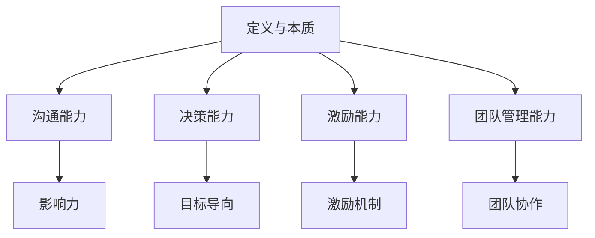
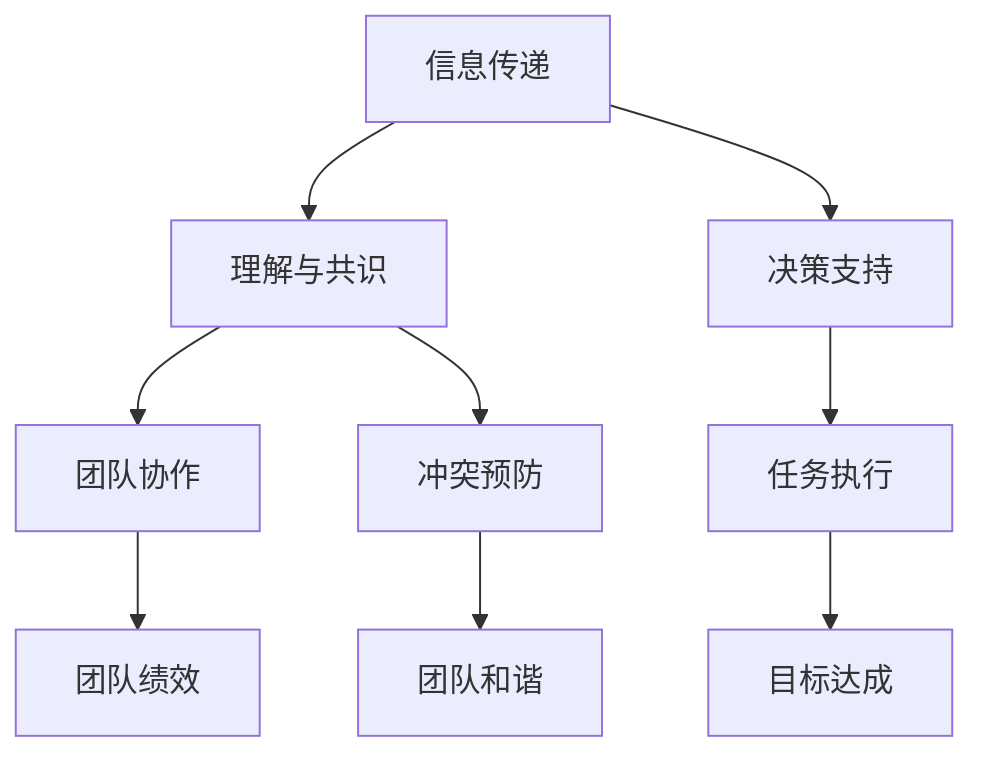
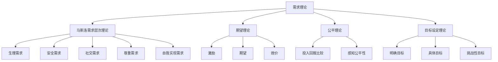
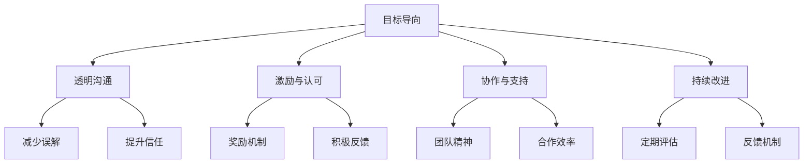
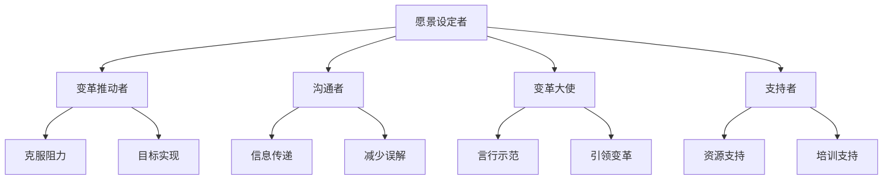
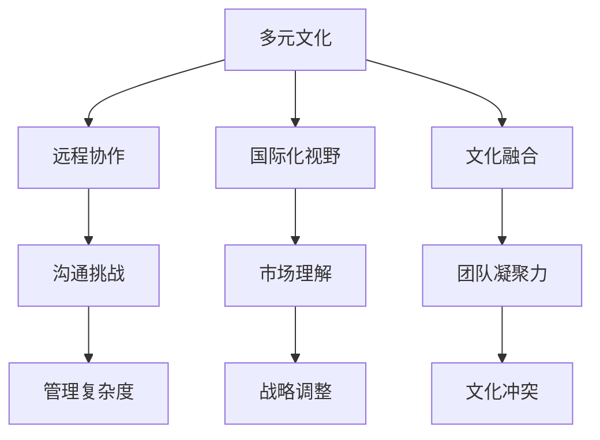
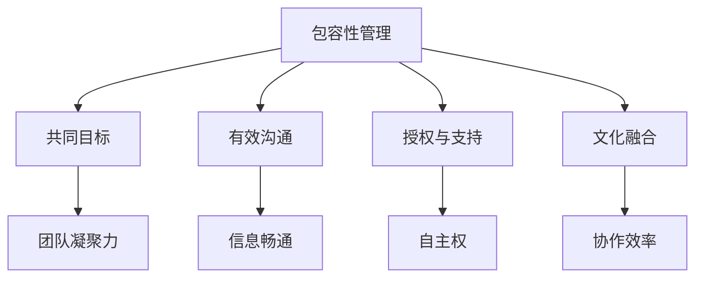

                 

# 《领导力训练：让你的团队天下无敌》

## 关键词
领导力、团队管理、沟通技巧、决策能力、激励策略

## 摘要
本文旨在探讨领导力的本质和重要性，通过分析领导力与团队关系的紧密联系，详细阐述提升领导力的各项关键技能。文章将从沟通能力、决策能力和激励能力三个方面深入剖析，结合实际案例，提供实用的领导力训练方法。通过本文的阅读，读者将能够掌握提升领导力的核心技巧，从而打造一支高效、协作、充满活力的团队。

### 《领导力训练：让你的团队天下无敌》目录大纲

#### 第一部分：领导力基础理论

##### 第1章：领导力的核心概念
- 1.1 领导力的定义与本质
- 1.2 领导力的重要性
- 1.3 领导力的分类

##### 第2章：领导力与团队关系
- 2.1 团队建设的重要性
- 2.2 团队成员的角色与互动
- 2.3 团队领导者的角色与责任

#### 第二部分：领导力技能提升

##### 第3章：沟通能力提升
- 3.1 沟通的重要性
- 3.2 有效沟通的技巧
- 3.3 沟通障碍及解决策略

##### 第4章：决策能力培养
- 4.1 决策的重要性
- 4.2 决策的过程
- 4.3 决策的误区与解决策略

##### 第5章：激励能力提升
- 5.1 激励的理论基础
- 5.2 激励的方法与策略
- 5.3 激励中的挑战与应对

##### 第6章：团队管理能力培养
- 6.1 团队管理的原则
- 6.2 团队绩效评估
- 6.3 团队冲突管理

#### 第三部分：领导力实践与应用

##### 第7章：领导力实践案例解析
- 7.1 成功的领导力实践案例
- 7.2 案例分析：如何建立高效的团队
- 7.3 案例分析：如何激发团队的潜能

##### 第8章：领导力在变革管理中的应用
- 8.1 变革管理的挑战
- 8.2 领导者在变革管理中的角色
- 8.3 变革管理策略与实践

##### 第9章：领导力发展的长期规划
- 9.1 领导力发展的自我评估
- 9.2 领导力发展计划制定
- 9.3 领导力发展的持续实践

##### 第10章：领导力在全球化背景下的挑战与应对
- 10.1 全球化对领导力的影响
- 10.2 多元化团队的领导力
- 10.3 全球化背景下的领导力发展策略

### 附录

- 附录A：领导力相关资源与工具
- 附录B：领导力测评工具
- 附录C：领导力培训计划范例

---

## 引言

领导力是一种关键能力，对于任何领域的成功都至关重要。在一个团队中，领导者不仅需要具备决策和指导能力，还需要能够有效沟通、激励团队成员，并在面对挑战时展现出强大的应变能力。领导力的本质是一种影响力，它能够激发团队成员的潜力，推动团队朝着共同的目标前进。

本文旨在为读者提供全面的领导力训练指南，帮助领导者提升自身的能力，打造一支高效的团队。文章将分为三个主要部分进行阐述。第一部分将介绍领导力基础理论，包括领导力的定义、重要性以及不同类型的领导力。第二部分将详细讨论领导力的各项关键技能，包括沟通能力、决策能力和激励能力。第三部分将结合实际案例，解析领导力在变革管理和全球化背景下的应用，并提供长期领导力发展策略。

通过本文的阅读，读者将能够：
1. 理解领导力的核心概念和重要性。
2. 掌握提升领导力的关键技能。
3. 学习如何在实际工作中应用领导力策略，提升团队绩效。
4. 预见并应对全球化背景下领导力发展的挑战。

### 第一部分：领导力基础理论

#### 第1章：领导力的核心概念

##### 1.1 领导力的定义与本质

领导力是一种影响力，它能够引导和激励他人，共同实现目标。领导力并非一种单一的能力，而是一个多维度的体系，它包含了多个方面，如沟通能力、决策能力、激励能力、团队管理能力等。领导力的本质在于通过影响力，影响和引导团队成员，使其产生积极的行为，达成团队目标。

我们可以用 Mermaid 流程图来展示领导力的核心概念：



从图1可以看出，领导力的核心概念包括定义与本质、沟通能力、决策能力、激励能力和团队管理能力。这些方面相互作用，共同构成一个完整的领导力体系。

##### 1.2 领导力的重要性

领导力是团队成功的关键因素。一个优秀的领导者能够激发团队成员的潜力，推动团队高效协作，实现共同目标。以下是领导力重要性的几个方面：

1. **提升团队绩效**：领导者的决策和指导能力能够直接影响团队的绩效。一个高效的领导者能够制定明确的目标，分配合理的任务，并确保团队成员能够按照计划执行。

2. **激发团队潜力**：领导者具备激励能力，能够激发团队成员的积极性，挖掘其潜力。这种激发不仅体现在完成任务上，更体现在团队创新能力和解决问题的能力上。

3. **建立团队文化**：领导者的行为和态度对团队文化有着深远的影响。一个具有领导力的领导者能够塑造积极向上的团队文化，促进团队成员之间的合作与信任。

4. **促进个人成长**：领导力不仅是一种对团队的影响，更是一种对个人的提升。通过领导力训练，个人能够提升自身的能力，增强自信心，为未来的职业发展打下坚实基础。

##### 1.3 领导力的分类

领导力可以分为多种类型，每种类型都有其独特的特点和应用场景。以下是几种常见的领导力类型：

1. **指挥型领导力**：指挥型领导者擅长制定明确的目标和计划，并对团队成员进行具体的指导。这种领导力适合在任务导向、时间紧迫的项目中应用。

2. **民主型领导力**：民主型领导者重视团队成员的意见和建议，鼓励参与决策过程。这种领导力有助于提升团队的凝聚力和创造力。

3. **教练型领导力**：教练型领导者注重团队成员的个人成长，通过指导和支持帮助其提升能力。这种领导力适合在需要长期发展和人才培养的领域应用。

4. **变革型领导力**：变革型领导者具有强烈的愿景和使命感，能够激发团队成员的变革意识和行动力。这种领导力适合在面临重大变革和挑战的时期应用。

5. **服务型领导力**：服务型领导者将团队成员的需求放在首位，通过服务和支持帮助其成功。这种领导力有助于建立积极向上的团队文化。

#### 第2章：领导力与团队关系

##### 2.1 团队建设的重要性

团队建设是领导力的重要组成部分，它关系到团队的整体绩效和成员的满意度。一个高效的团队需要具备以下特点：

1. **共同目标**：团队成员对共同目标有清晰的认识，并为此共同努力。
2. **有效沟通**：团队成员之间能够有效沟通，信息流通畅通，减少误解和冲突。
3. **协作精神**：团队成员愿意合作，共同解决问题，实现目标。
4. **相互信任**：团队成员之间相互信任，愿意分享信息和资源。

以下是团队建设的几个关键方面：

1. **明确目标**：领导者需要明确团队的目标，并与团队成员进行沟通，确保每个成员都理解并认同这些目标。
2. **角色分工**：根据团队成员的特长和兴趣，合理分配任务，确保每个成员都能发挥其最大的潜力。
3. **培养协作**：通过团队活动和培训，增强团队成员之间的协作精神，促进团队整体绩效的提升。
4. **建立信任**：领导者需要通过言行一致，诚实守信，赢得团队成员的信任，为团队的长期发展奠定基础。

##### 2.2 团队成员的角色与互动

团队成员在团队中扮演着不同的角色，这些角色相互作用，共同推动团队向前发展。以下是团队成员的常见角色：

1. **领导者**：领导者负责制定团队目标，分配任务，指导成员，并确保团队朝着目标前进。
2. **执行者**：执行者负责执行领导者的指示，完成任务，确保团队目标的实现。
3. **协调者**：协调者负责协调团队成员之间的工作，确保任务的顺利进行。
4. **反馈者**：反馈者负责向领导者提供团队工作的反馈，帮助领导者了解团队的实际状况，并做出相应的调整。

团队成员之间的互动是团队建设的关键，以下是几种常见的互动方式：

1. **沟通**：团队成员之间进行有效沟通，确保信息畅通，减少误解和冲突。
2. **协作**：团队成员相互协作，共同完成任务，实现团队目标。
3. **支持**：团队成员在需要时相互支持，帮助对方克服困难，提升团队的整体实力。
4. **反馈**：团队成员相互提供反馈，帮助对方了解自己的工作表现，并提出改进建议。

##### 2.3 团队领导者的角色与责任

团队领导者是团队的核心，其角色和责任对团队的整体表现有着重要的影响。以下是团队领导者的重要角色和责任：

1. **目标设定者**：领导者需要明确团队的目标，并确保团队成员理解并认同这些目标。
2. **计划制定者**：领导者需要制定详细的计划，确保团队目标的实现。
3. **资源协调者**：领导者需要协调团队内外部资源，确保团队工作的顺利进行。
4. **激励者**：领导者需要通过激励措施，激发团队成员的积极性和创造力。
5. **沟通者**：领导者需要与团队成员保持有效沟通，确保信息的畅通。
6. **反馈者**：领导者需要向团队成员提供反馈，帮助他们了解自己的工作表现，并提出改进建议。
7. **冲突解决者**：领导者需要解决团队成员之间的冲突，确保团队的和谐与稳定。

通过明确团队领导者的角色和责任，有助于领导者更好地履行职责，提升团队的整体表现。

### 第二部分：领导力技能提升

#### 第3章：沟通能力提升

##### 3.1 沟通的重要性

沟通是领导力的核心要素之一，它对于团队的协作和目标的实现至关重要。有效的沟通不仅能够确保信息的准确传达，还能够促进团队成员之间的理解和信任，从而提高团队的凝聚力和效率。

以下是一个简化的 Mermaid 流程图，展示了沟通在领导力中的作用：



从图2中可以看出，沟通在信息传递、理解与共识、决策支持、团队协作、冲突预防、任务执行、团队绩效和目标达成等方面起着关键作用。有效的沟通能够帮助领导者更好地指导团队，解决问题，提升团队的整体绩效。

##### 3.2 有效沟通的技巧

要提升沟通能力，领导者需要掌握一系列有效的沟通技巧。以下是一些关键技巧：

1. **倾听**：倾听是沟通的基础，领导者需要认真倾听团队成员的意见和反馈，确保理解其真实意图。

2. **清晰表达**：领导者需要清晰、明确地表达自己的观点和意图，避免歧义和误解。

3. **积极反馈**：领导者需要给予团队成员积极的反馈，鼓励其提出建议和意见，并对其贡献给予认可。

4. **非语言沟通**：领导者需要注重非语言沟通，如肢体语言、面部表情等，这些都能传递重要信息。

5. **情绪管理**：领导者需要学会控制自己的情绪，避免在沟通中情绪化，影响沟通效果。

6. **冲突管理**：领导者需要善于解决沟通中的冲突，确保沟通渠道的畅通。

以下是一个简化的伪代码示例，用于解释如何通过有效沟通来提升团队绩效：

```python
# 有效沟通的伪代码

# 定义沟通过程
def effective_communication(team_members, goal):
    # 倾听团队成员的意见
    for member in team_members:
        opinion = listen_to_member(member)
        print(f"{member}的意见：{opinion}")

    # 清晰表达目标
    express_goal(goal)
    
    # 收集反馈
    for member in team_members:
        feedback = collect_feedback(member)
        print(f"{member}的反馈：{feedback}")

    # 提供积极反馈
    for member in team_members:
        if member.contribution > threshold:
            print(f"给予{member}积极反馈：{member.contribution}的贡献值得认可。")

    # 管理冲突
    if conflict_detected():
        resolve_conflict()
        print("冲突已解决。")

    # 确保沟通畅通
    ensure_communication_channel_is_clear()

    # 提升团队绩效
    improve_team_performance()
    print("团队绩效提升。")
```

##### 3.3 沟通障碍及解决策略

尽管沟通对于团队的成功至关重要，但沟通中常常存在各种障碍。以下是一些常见的沟通障碍及解决策略：

1. **信息过载**：解决策略：设定沟通频率和时间，确保信息不过载。

2. **语言障碍**：解决策略：使用简单明了的语言，避免专业术语，必要时提供翻译支持。

3. **文化差异**：解决策略：了解团队成员的文化背景，尊重差异，促进文化融合。

4. **情绪干扰**：解决策略：领导者需要学会情绪管理，避免在沟通中情绪化，影响沟通效果。

5. **信息传递失误**：解决策略：建立反馈机制，确保信息的准确传达。

通过识别和解决这些沟通障碍，领导者能够提升团队的沟通效率，促进团队的协作与发展。

#### 第4章：决策能力培养

##### 4.1 决策的重要性

决策是领导力的重要组成部分，它直接关系到团队的绩效和成功。一个优秀的领导者需要具备出色的决策能力，能够在复杂多变的环境中做出明智的决策。以下是决策重要性的几个方面：

1. **指导团队行动**：决策是团队行动的指南，一个明确的决策能够帮助团队集中精力，有效行动。

2. **解决冲突**：决策能够解决团队内部的冲突和矛盾，确保团队的和谐与稳定。

3. **应对挑战**：领导者需要通过决策来应对各种挑战，确保团队在变化的环境中保持竞争力。

4. **提升绩效**：高效的决策能够提升团队的绩效，实现团队的长期目标。

##### 4.2 决策的过程

决策是一个复杂的过程，包括多个阶段。以下是一个简化的决策过程伪代码示例：

```python
# 决策过程的伪代码

# 初始化变量
options = []  # 备选方案列表
criteria = []  # 评估标准列表
weights = []  # 评估标准权重列表

# 收集备选方案
for option in options:
    print(f"备选方案：{option}")

# 确定评估标准
for criteria in criteria:
    print(f"评估标准：{criteria}")

# 分配评估标准权重
for weight in weights:
    print(f"评估标准权重：{weight}")

# 评估备选方案
for option in options:
    score = 0
    for criteria in criteria:
        score += evaluate_option(option, criteria) * weight[criteria]
    print(f"{option}的总分：{score}")

# 根据总分选择最佳方案
best_option = select_best_option(options, score)
print(f"最佳决策为：{best_option}")
```

该伪代码展示了决策过程的几个关键步骤：收集备选方案、确定评估标准、分配评估标准权重、评估备选方案和选择最佳方案。

##### 4.3 决策的误区与解决策略

在决策过程中，领导者常常会陷入一些误区，影响决策的质量。以下是一些常见的决策误区及解决策略：

1. **信息不全**：解决策略：在决策前充分收集和分析信息，确保决策基于全面的数据。

2. **群体思维**：解决策略：引入外部意见，避免团队成员过于一致，促进多元思维的碰撞。

3. **情绪化决策**：解决策略：领导者需要学会情绪管理，避免在情绪的影响下做出决策。

4. **过度乐观**：解决策略：进行情景分析和风险评估，避免过度乐观。

5. **决策拖延**：解决策略：设定明确的决策时间表，避免拖延。

通过识别和解决这些决策误区，领导者能够提升决策的质量，确保团队的长期成功。

#### 第5章：激励能力提升

##### 5.1 激励的理论基础

激励是领导力的重要组成部分，它能够激发团队成员的积极性和创造力，提升团队的整体绩效。激励的理论基础主要包括以下几个关键要素：

1. **需求理论**：需求理论认为，人的行为受到内在需求的驱动。马斯洛的需求层次理论将需求分为生理需求、安全需求、社交需求、尊重需求和自我实现需求，不同层次的需求会激励个体采取不同的行为。

2. **期望理论**：期望理论认为，个体的行为是由其期望和结果价值共同决定的。公式为：激励 = 期望 × 效价。期望是指个体对目标实现的可能性估计，效价是指个体对目标价值的评价。

3. **公平理论**：公平理论认为，个体的行为和满意度受到其感知的公平性影响。个体会将自己的投入和回报与参照对象进行比较，如果感知到不公平，会采取相应行动。

4. **目标设定理论**：目标设定理论认为，明确、具体和具有挑战性的目标能够激发个体的积极性和努力程度，从而提高绩效。

以下是一个简化的 Mermaid 流程图，展示了激励的理论基础：



从图3中可以看出，激励的理论基础涵盖了需求理论、期望理论、公平理论和目标设定理论，这些理论共同构成了激励的框架。

##### 5.2 激励的方法与策略

为了提升激励能力，领导者可以采用以下几种方法和策略：

1. **目标设定**：领导者可以帮助团队成员设定明确、具体和具有挑战性的目标，激发其积极性和努力程度。

2. **奖励机制**：领导者可以建立奖励机制，对表现优秀的团队成员给予奖励，如奖金、晋升机会等。

3. **认可与反馈**：领导者需要给予团队成员积极的认可和反馈，鼓励其持续努力。

4. **参与决策**：领导者可以鼓励团队成员参与决策过程，提高其参与感和归属感。

5. **培训与发展**：领导者可以为团队成员提供培训和发展机会，帮助其提升能力和职业发展。

以下是一个简化的伪代码示例，用于解释如何通过激励方法提升团队绩效：

```python
# 激励方法的伪代码

# 定义激励函数
def motivate_members(team_members, performance):
    for member in team_members:
        # 根据成员表现设定目标
        if member.performance > threshold:
            member.target = set_high_target()
        else:
            member.target = set_modest_target()
        
        # 提供奖励
        if member.performance > threshold:
            member.reward = provide_reward()
        
        # 给予认可
        if member.performance > threshold:
            print(f"给予{member}认可：{member.performance}的表现值得表扬。")

        # 提供培训机会
        offer_training_opportunities(member)
        
        # 提升团队绩效
        improve_team_performance()
        print("团队绩效提升。")
```

##### 5.3 激励中的挑战与应对

在激励过程中，领导者可能会面临一些挑战。以下是一些常见的挑战及应对策略：

1. **个体差异**：不同成员对激励的敏感度不同，领导者需要了解每个成员的个性和需求，制定个性化的激励策略。

2. **公平性问题**：领导者需要确保激励机制的公平性，避免造成成员之间的不公平感。

3. **持续激励**：领导者需要持续关注团队成员的激励需求，不断调整激励策略，保持团队的活力和动力。

4. **资源限制**：在资源有限的情况下，领导者需要合理分配资源，确保激励策略的有效性。

通过识别和应对这些挑战，领导者能够更好地提升激励能力，激发团队成员的潜力，实现团队的目标。

#### 第6章：团队管理能力培养

##### 6.1 团队管理的原则

团队管理是领导力的重要组成部分，它关系到团队的绩效和成员的满意度。有效的团队管理需要遵循以下原则：

1. **目标导向**：团队管理应以目标为导向，明确团队的目标和任务，确保团队成员清晰了解自己的职责和期望。

2. **透明沟通**：团队管理应建立透明沟通机制，确保团队成员之间信息畅通，减少误解和冲突。

3. **激励与认可**：团队管理应关注团队成员的激励和认可，通过奖励机制和积极的反馈，提升团队成员的积极性和满意度。

4. **协作与支持**：团队管理应促进团队成员之间的协作与支持，鼓励合作精神和团队精神，提升团队的整体绩效。

5. **持续改进**：团队管理应注重持续改进，通过定期的评估和反馈，不断优化团队的工作流程和绩效。

以下是一个简化的 Mermaid 流程图，展示了团队管理的原则：



从图4中可以看出，团队管理的原则涵盖了目标导向、透明沟通、激励与认可、协作与支持以及持续改进，这些原则共同构成了团队管理的框架。

##### 6.2 团队绩效评估

团队绩效评估是团队管理的重要环节，它能够帮助领导者了解团队的工作表现，发现问题和不足，制定改进措施。以下是团队绩效评估的关键步骤和注意事项：

1. **设定评估标准**：领导者需要与团队成员共同设定评估标准，确保评估的客观性和全面性。

2. **收集评估数据**：通过定期的绩效报告、工作记录和团队反馈，收集评估数据。

3. **分析评估数据**：领导者需要对评估数据进行分析，识别团队的强项和弱项。

4. **提供反馈**：领导者需要向团队成员提供详细的评估反馈，帮助他们了解自己的工作表现。

5. **制定改进计划**：基于评估结果，领导者需要与团队成员共同制定改进计划，提升团队绩效。

以下是一个简化的伪代码示例，用于解释团队绩效评估的过程：

```python
# 团队绩效评估的伪代码

# 初始化变量
evaluation_criteria = []  # 评估标准列表
performance_data = []  # 绩效数据列表

# 收集绩效数据
for data in performance_data:
    print(f"收集到的绩效数据：{data}")

# 分析绩效数据
for data in performance_data:
    score = analyze_performance(data, evaluation_criteria)
    print(f"{data}的绩效评分：{score}")

# 提供反馈
for data in performance_data:
    if score > threshold:
        print(f"对{data}提供积极反馈：{data}的表现值得表扬。")
    else:
        print(f"对{data}提供反馈：{data}在{evaluation_criteria}方面有待改进。")

# 制定改进计划
create_improvement_plan(evaluation_criteria, performance_data)
print("改进计划制定完成。")
```

##### 6.3 团队冲突管理

团队冲突是团队管理中常见的现象，它可能源于任务分配、角色冲突、个人利益等。有效的团队冲突管理能够帮助领导者减少冲突对团队绩效的负面影响，提升团队的整体效能。以下是团队冲突管理的几个关键步骤：

1. **识别冲突**：领导者需要及时发现和识别团队中的冲突，了解冲突的根源和影响。

2. **理解冲突**：领导者需要与冲突的各方进行沟通，了解他们的观点和感受，确保全面理解冲突的实质。

3. **解决冲突**：领导者需要采取有效的策略解决冲突，确保冲突得到妥善处理。

4. **预防冲突**：领导者需要制定预防冲突的措施，减少冲突的发生。

以下是一个简化的伪代码示例，用于解释团队冲突管理的策略：

```python
# 团队冲突管理的伪代码

# 初始化变量
conflicts = []  # 冲突列表
solutions = []  # 解决方案列表

# 识别冲突
for conflict in conflicts:
    print(f"识别到的冲突：{conflict}")

# 理解冲突
for conflict in conflicts:
    understand_conflict(conflict)

# 解决冲突
for conflict in conflicts:
    if conflict severity > threshold:
        apply_solution(conflict, solutions)
        print(f"解决冲突：{conflict}已妥善处理。")
    else:
        print(f"处理冲突：{conflict}无需进一步处理。")

# 预防冲突
prevent_conflicts()
print("预防冲突措施已执行。")
```

通过遵循团队管理的原则，进行有效的团队绩效评估和冲突管理，领导者能够提升团队的整体管理能力，促进团队的长期发展。

#### 第7章：领导力实践案例解析

##### 7.1 成功的领导力实践案例

成功的领导力实践案例能够为其他领导者提供宝贵的经验和启示。以下是一些成功的领导力实践案例：

1. **案例1：谷歌的领导力文化**

谷歌以其独特的领导力文化而闻名，注重员工的发展和幸福感。谷歌的领导者通过以下策略实现了成功：

- **激励与认可**：谷歌通过股票期权、奖金和晋升机会等多种激励手段，激励员工追求卓越。
- **员工福利**：谷歌提供免费的餐饮、健身房、按摩和休闲设施，提升员工的工作和生活质量。
- **创新文化**：谷歌鼓励员工提出新想法，并进行试验，推动公司不断创新。

2. **案例2：苹果的变革型领导**

史蒂夫·乔布斯是苹果公司的变革型领导者，他通过以下策略推动了苹果的崛起：

- **愿景和使命感**：乔布斯始终强调苹果的愿景和使命感，激发员工的热情和投入。
- **产品设计**：乔布斯亲自参与产品设计，确保产品的创新和高质量，赢得用户的喜爱。
- **团队协作**：乔布斯注重团队协作，通过有效的沟通和激励，推动团队共同实现目标。

3. **案例3：微软的转型领导**

萨提亚·纳德拉自2014年起担任微软首席执行官，他通过以下策略实现了公司的转型：

- **以人为本**：纳德拉强调员工的价值，鼓励员工追求个人和职业成长。
- **数字化转型**：纳德拉推动微软向云计算和人工智能等新兴技术转型，提升公司的竞争力。
- **开放沟通**：纳德拉倡导开放沟通，确保信息的透明和流通，促进团队协作。

这些成功的领导力实践案例展示了不同领导风格和策略在实践中的应用，为领导者提供了宝贵的经验和启示。

##### 7.2 案例分析：如何建立高效的团队

建立高效的团队是领导者的重要任务，以下是一个具体的案例分析，探讨如何通过领导力策略建立高效的团队：

1. **明确目标和角色**

领导者在团队建立初期，需要明确团队的目标和每个成员的角色。通过明确的职责分配，确保每个成员都了解自己的职责和期望，从而提高团队的协作效率。

2. **建立沟通机制**

领导者需要建立有效的沟通机制，确保团队成员之间的信息畅通。通过定期的团队会议、邮件通讯和即时通讯工具，保持团队成员之间的沟通，促进信息共享和问题解决。

3. **激励和认可**

领导者需要通过激励和认可，提升团队成员的积极性和满意度。通过奖励机制、表彰和公开认可，鼓励团队成员发挥潜力，推动团队绩效的提升。

4. **培养团队合作精神**

领导者需要注重团队合作精神的培养，通过团队活动和培训，增强团队成员之间的信任和合作。通过共同完成任务，提升团队的凝聚力和协作能力。

5. **定期评估和反馈**

领导者需要定期评估团队的工作表现，提供详细的反馈和建议。通过绩效评估，识别团队的优势和不足，制定改进计划，确保团队持续提升。

通过以上策略，领导者能够建立一支高效、协作和充满活力的团队，实现共同的目标。

##### 7.3 案例分析：如何激发团队的潜能

激发团队的潜能是领导者的重要任务，以下是一个具体的案例分析，探讨如何通过领导力策略激发团队的潜能：

1. **设定具有挑战性的目标**

领导者需要设定具有挑战性的目标，激发团队成员的潜力。通过设定明确、具体和具有挑战性的目标，鼓励团队成员努力超越自我，发挥最大的潜力。

2. **提供培训和发展机会**

领导者需要为团队成员提供培训和发展机会，提升其能力和职业素养。通过定期的培训、工作坊和在线学习，帮助团队成员不断成长，激发其潜能。

3. **鼓励创新和尝试**

领导者需要鼓励团队成员进行创新和尝试，打破常规，寻求新的解决方案。通过提供支持和资源，鼓励团队成员勇于尝试，不断创新。

4. **建立积极的工作氛围**

领导者需要建立积极的工作氛围，鼓励团队成员之间的合作和分享。通过公开认可和奖励，鼓励团队成员积极参与团队活动，提升团队的凝聚力。

5. **提供反馈和指导**

领导者需要提供及时的反馈和指导，帮助团队成员识别问题，找到改进的方向。通过一对一的辅导和团队讨论，激发团队成员的潜能，推动团队的整体提升。

通过以上策略，领导者能够激发团队的潜能，推动团队实现更高的绩效和成就。

#### 第8章：领导力在变革管理中的应用

##### 8.1 变革管理的挑战

在当今快速变化的环境中，变革管理成为领导力的一项关键任务。变革管理涉及引导组织从现有状态过渡到新的状态，以适应外部环境的变化。以下是变革管理面临的几个主要挑战：

1. **抵制变革**：组织成员可能对变革持怀疑态度或抵触情绪，担心变革会带来不确定性和风险。

2. **沟通障碍**：变革过程中，信息传递不畅可能导致误解和不确定性，影响变革的顺利进行。

3. **资源限制**：变革通常需要额外的资源投入，包括时间、资金和人力资源，而组织可能面临资源紧张的情况。

4. **文化冲突**：变革可能会触及组织的文化基础，引发文化冲突，影响组织的稳定性和凝聚力。

5. **领导者的角色**：在变革过程中，领导者的角色和影响力变得尤为重要，但领导者可能面临领导力不足或无法有效应对变革的挑战。

##### 8.2 领导者在变革管理中的角色

在变革管理中，领导者扮演着至关重要的角色。以下是领导者在这一过程中应承担的关键角色：

1. **愿景设定者**：领导者需要明确组织的变革愿景，并确保这一愿景能够激发员工的热情和参与。

2. **变革推动者**：领导者需要推动变革的进程，克服各种困难和阻力，确保变革目标的实现。

3. **沟通者**：领导者需要与组织成员保持有效沟通，确保他们理解变革的必要性和目标，减少误解和不确定性。

4. **变革大使**：领导者需要成为变革的倡导者，通过自己的言行示范，引领组织成员接受和参与变革。

5. **支持者**：领导者需要为变革提供支持和资源，确保变革的顺利实施，并为组织成员提供必要的培训和支持。

以下是一个简化的 Mermaid 流程图，展示了领导者在变革管理中的角色：



从图5中可以看出，领导者在变革管理中扮演着多个关键角色，这些角色相互关联，共同推动变革的进程。

##### 8.3 变革管理策略与实践

为了有效管理变革，领导者可以采用以下策略和实践：

1. **制定清晰的变革计划**：领导者需要制定详细的变革计划，明确变革的目标、时间表和步骤，确保变革的有序进行。

2. **建立变革团队**：领导者可以建立一个专门的变革团队，负责协调和推动变革的进程，确保各方利益的一致性。

3. **提供培训和沟通**：领导者需要为组织成员提供必要的培训和沟通，确保他们理解变革的必要性和目标，减少抵触情绪。

4. **鼓励参与和反馈**：领导者需要鼓励组织成员参与变革过程，提供反馈和建议，增强其归属感和责任感。

5. **持续监督和评估**：领导者需要持续监督和评估变革的进展，及时发现和解决问题，确保变革目标的实现。

通过以上策略和实践，领导者能够有效管理变革，推动组织持续发展。

#### 第9章：领导力发展的长期规划

##### 9.1 领导力发展的自我评估

领导力发展的长期规划首先需要领导者进行自我评估，了解自己的优势和不足，从而制定有针对性的发展计划。以下是一个简化的自我评估流程：

1. **反思过去的表现**：领导者需要回顾自己在过去的工作中取得的成就和面临的挑战，分析成功的原因和失败的经验。

2. **收集反馈**：领导者可以从上级、同事和下属那里收集反馈，了解他人对自己的评价和建议。

3. **分析个人能力**：领导者需要分析自己的能力，包括领导力技能、专业知识和人际沟通能力等。

4. **识别发展需求**：根据反思和反馈，领导者可以识别自己在领导力发展中的需求和目标。

以下是一个简化的伪代码示例，用于描述自我评估的过程：

```python
# 自我评估的伪代码

# 初始化变量
feedback_list = []  # 反馈列表
performance_list = []  # 绩效列表

# 收集反馈
for feedback in feedback_list:
    print(f"收集到的反馈：{feedback}")

# 分析绩效
for performance in performance_list:
    analyze_performance(performance)
    print(f"分析结果：{performance}")

# 识别发展需求
for feedback in feedback_list:
    identify_growth_needs(feedback)
    print(f"发展需求：{feedback}")

# 制定发展计划
create_growth_plan()
print("发展计划制定完成。")
```

##### 9.2 领导力发展计划制定

在完成自我评估后，领导者需要制定详细的领导力发展计划，包括短期和长期的目标、具体的行动步骤和资源需求。以下是一个简化的领导力发展计划制定流程：

1. **设定发展目标**：领导者需要明确自己在领导力发展中的短期和长期目标，如提升沟通能力、决策能力或团队管理能力。

2. **制定行动计划**：根据发展目标，领导者需要制定具体的行动计划，包括参加培训、阅读书籍、实践应用等。

3. **分配资源**：领导者需要为领导力发展计划分配必要的资源，如时间、资金和人力支持。

4. **设定评估机制**：领导者需要建立评估机制，定期评估发展计划的执行情况和效果。

以下是一个简化的伪代码示例，用于描述领导力发展计划的制定：

```python
# 领导力发展计划制定的伪代码

# 初始化变量
development_goals = []  # 发展目标列表
action_plans = []  # 行动计划列表
resources = []  # 资源列表

# 设定发展目标
for goal in development_goals:
    set_goal(goal)
    print(f"设定的目标：{goal}")

# 制定行动计划
for goal in development_goals:
    create_action_plan(goal)
    print(f"行动计划：{goal}")

# 分配资源
for action_plan in action_plans:
    allocate_resources(action_plan, resources)
    print(f"分配的资源：{action_plan}")

# 设定评估机制
set_evaluation_mechanism()
print("评估机制设定完成。")
```

##### 9.3 领导力发展的持续实践

领导力发展是一个持续的过程，需要领导者不断实践和反思。以下是一些建议，帮助领导者实现领导力发展的持续实践：

1. **定期反思**：领导者需要定期反思自己的领导行为和决策，分析成功和失败的原因，持续改进。

2. **学习新知识**：领导者需要不断学习新知识和技能，提升自己的专业素养和领导能力。

3. **实践应用**：领导者需要将学到的知识和技能应用到实际工作中，通过实践提升自己的领导力。

4. **寻求反馈**：领导者需要主动寻求反馈，从上级、同事和下属那里获取改进建议，不断提升自己的领导能力。

5. **参与培训**：领导者可以参加各种领导力培训和工作坊，学习最新的领导力理论和实践方法。

通过以上持续实践，领导者能够不断提升自己的领导力，为组织的长期发展做出贡献。

#### 第10章：领导力在全球化背景下的挑战与应对

##### 10.1 全球化对领导力的影响

全球化带来了前所未有的挑战和机遇，对领导力产生了深远的影响。以下是一些全球化对领导力的影响：

1. **多元文化**：全球化使组织面临多元文化的挑战，领导者需要理解并尊重不同文化背景下的价值观和行为方式。

2. **远程协作**：全球化带来了远程协作的需求，领导者需要掌握远程管理的技能，确保团队成员之间的沟通和协作。

3. **国际化视野**：全球化要求领导者具备国际化视野，能够理解和应对全球市场的变化和竞争。

4. **文化融合**：全球化促进了文化的融合，领导者需要促进不同文化之间的交流和理解，提升团队的凝聚力。

以下是一个简化的 Mermaid 流程图，展示了全球化对领导力的影响：



从图6中可以看出，全球化对领导力的影响涵盖了多元文化、远程协作、国际化视野和文化融合等方面，这些影响对领导者的能力和素质提出了更高的要求。

##### 10.2 多元化团队的领导力

多元化团队是全球化背景下的一种常见现象，领导者需要掌握多元化团队的领导力策略，以充分发挥团队的潜力。以下是多元化团队领导力的一些关键策略：

1. **包容性管理**：领导者需要建立包容性的管理环境，尊重团队成员的多样性和差异，促进团队成员的参与和贡献。

2. **共同目标**：领导者需要明确团队的目标，确保所有成员都认同并致力于实现这些目标，从而增强团队的凝聚力。

3. **有效沟通**：领导者需要掌握有效的沟通技巧，确保信息在多元文化团队中畅通无阻，减少误解和冲突。

4. **授权与支持**：领导者需要授权团队成员，给予他们足够的自主权，并提供必要的支持和资源，激发团队成员的潜力。

5. **文化融合**：领导者需要促进团队成员之间的文化交流和理解，建立积极的文化融合氛围，提升团队的协作效率。

以下是一个简化的 Mermaid 流程图，展示了多元化团队的领导力策略：



从图7中可以看出，多元化团队的领导力策略包括包容性管理、共同目标、有效沟通、授权与支持和文化融合等方面，这些策略有助于提升多元化团队的绩效和合作效率。

##### 10.3 全球化背景下的领导力发展策略

在全球化背景下，领导者需要不断更新自己的知识和技能，以应对新的挑战和机遇。以下是一些全球化背景下的领导力发展策略：

1. **持续学习**：领导者需要保持学习的态度，不断更新自己的知识和技能，跟上全球发展的步伐。

2. **跨文化培训**：领导者可以参加跨文化培训，提升自己在多元文化环境中的沟通和管理能力。

3. **国际化经验**：领导者可以通过国际交流和合作，积累国际化经验，提升自己的国际化视野和领导能力。

4. **创新能力**：领导者需要培养创新能力，推动组织在全球化背景下进行创新和变革，保持竞争力。

5. **团队合作**：领导者需要培养团队合作精神，促进团队成员之间的协作和信任，提升团队的整体绩效。

通过以上策略，领导者能够适应全球化背景下的新挑战，提升自己的领导力，为组织的长期发展做出贡献。

### 结论

领导力是团队成功的关键因素，它能够激发团队成员的潜力，推动团队实现共同目标。通过本文的讨论，我们了解了领导力的核心概念、领导力与团队关系的紧密联系，以及提升领导力的关键技能。同时，我们通过实际案例和实践策略，分析了领导力在全球化背景下的挑战与应对。

为了提升领导力，领导者需要不断进行自我评估，制定发展计划，并持续实践和反思。此外，领导者需要掌握有效的沟通技巧、决策能力和激励策略，建立高效的团队管理能力。通过不断学习和创新，领导者能够应对全球化背景下的新挑战，推动组织的长期发展。

让我们共同努力，提升自己的领导力，打造高效的团队，实现卓越的绩效和成就。

### 附录

#### 附录A：领导力相关资源与工具

- **书籍**：《领导力者的实践》（The Practice of Leadership）、《领导力的五个层次》（The Five Levels of Leadership）
- **在线课程**：Coursera上的《领导力和团队管理》、Udemy上的《领导力：成功领导者的技能和策略》
- **工具**：谷歌文档（Google Docs）、Slack、Trello（项目管理和任务分配工具）

#### 附录B：领导力测评工具

- **360度反馈**：用于评估领导者在不同领域的表现，包括自我评价、上级评价、同事评价和下属评价。
- **领导力评估问卷**：包括一系列针对不同领导力维度的评估问题，帮助领导者了解自己的优势和不足。
- **领导力能力测试**：通过在线测试或评估工具，评估领导者的技能和知识。

#### 附录C：领导力培训计划范例

1. **培训目标**：提升领导者的沟通技巧、决策能力和团队管理能力。
2. **培训内容**：
   - 沟通技巧：有效沟通、非语言沟通、冲突管理
   - 决策能力：决策过程、风险评估、情景分析
   - 团队管理能力：团队建设、绩效评估、激励策略
3. **培训方法**：讲座、案例讨论、角色扮演、互动交流
4. **培训时间**：为期两周的集中培训，每天4小时。
5. **培训资源**：邀请行业专家授课、提供相关书籍和资料。

### 作者

**作者：AI天才研究院/AI Genius Institute & 禅与计算机程序设计艺术 /Zen And The Art of Computer Programming**

