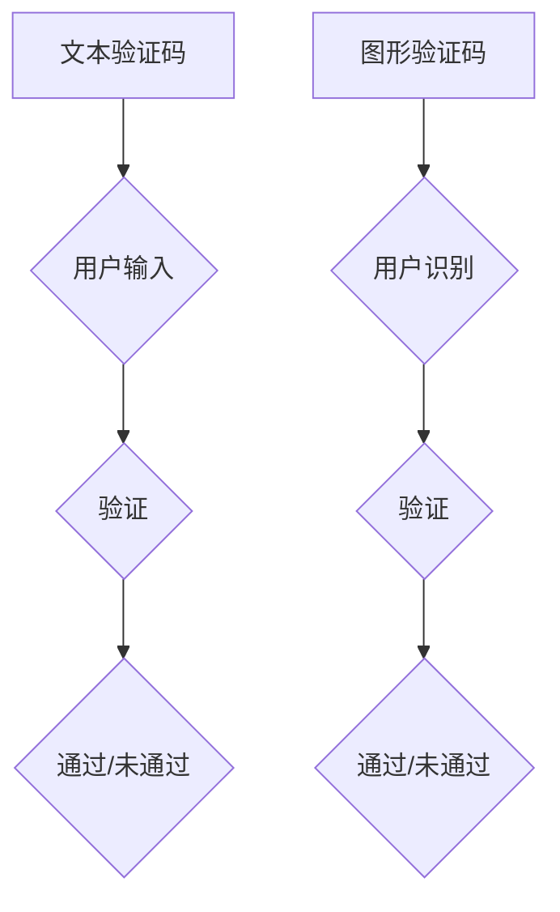
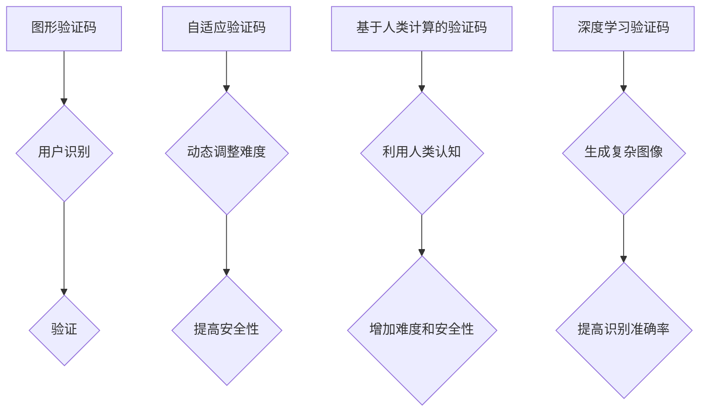

                 

### 第1章：验证码的起源与发展

#### 1.1 验证码的产生背景

验证码（CAPTCHA）这一概念最早由路易斯·弗兰克·兰伯特（Louis von Frank）在1997年提出。当时，互联网刚刚兴起，各种在线服务开始普及，但随之而来的问题是如何防止恶意软件和机器人对网站的攻击。传统的用户名和密码机制虽然能够保护用户账户的安全，但无法有效防止自动化攻击，如批量注册、评论 spam 等。

为了解决这个问题，兰伯特提出了CAPTCHA这一解决方案。CAPTCHA是基于人类视觉识别的技术，它通过向用户展示一些扭曲的字符或数字，要求用户输入这些字符或数字，以此来证明自己是一个人类，而非自动程序。这种机制既简单又有效，能够在很大程度上阻止自动化攻击，同时又不给用户带来太大的困扰。

#### 1.2 验证码的演变历程

自CAPTCHA概念提出以来，验证码技术经历了数次重要的演变。

1. **文本验证码**：这是最早的验证码形式，通过展示一串看似无规律的字符或数字，要求用户输入。文本验证码简单易行，但也存在一定的不足，例如字符扭曲程度有限，容易导致用户输入错误。

2. **图形验证码**：为了提高验证码的难度，图形验证码应运而生。图形验证码通过展示复杂的图形或图案，要求用户识别并输入特定的字符或数字。相比文本验证码，图形验证码在安全性上有了很大的提升，同时也提高了用户体验。

3. **音频验证码**：对于听力障碍的用户，传统的文本和图形验证码可能不太适用。因此，音频验证码应运而生。音频验证码通过播放一段音频，要求用户输入听到的字符或数字，从而实现了对听力障碍用户的友好支持。

4. **动态验证码**：动态验证码是一种能够根据用户行为动态调整验证码难度的技术。例如，当用户连续输入错误时，验证码会自动增加难度，以防止恶意攻击。动态验证码在提高安全性的同时，也优化了用户体验。

5. **基于人类计算的验证码**：近年来，基于人类计算的验证码开始受到关注。这种验证码通过设计需要人类认知和推理的任务，来提高验证码的难度和安全性。例如，用户需要识别图像中不符合常理的元素，或者判断图像中的特定元素是否匹配。

#### 1.3 验证码在不同场景中的应用

验证码技术在不同场景中有着广泛的应用：

1. **在线注册与登录**：验证码是大多数在线服务注册和登录过程中的必备环节，用以防止恶意注册和自动化攻击。

2. **评论与投票**：在一些社交媒体和论坛中，验证码用于防止评论 spam 和恶意投票，从而保证社区环境的健康。

3. **支付验证**：在在线支付场景中，验证码用于确认用户的身份，防止未经授权的交易。

4. **反垃圾邮件**：验证码技术在防止垃圾邮件方面发挥着重要作用，通过验证用户的身份，可以有效地减少垃圾邮件的发送。

5. **身份验证**：在某些需要高度安全性的场景中，如银行和政府部门，验证码作为身份验证的一部分，用于确保交易和操作的安全性。

综上所述，验证码技术在保障网络安全和用户体验方面发挥着重要作用。随着技术的不断发展，验证码的应用场景将更加广泛，其在网络安全中的地位也将更加重要。

### 第2章：验证码的工作原理

#### 2.1 验证码的分类

验证码根据不同的技术和实现方式，可以分为多种类型。以下是几种常见的验证码分类及其特点：

1. **文本验证码**：文本验证码是最早的验证码形式，它通过展示一串看似无规律的字符或数字，要求用户输入。文本验证码通常包括字母数字组合，有时还会加入一些干扰字符，如星号或下划线，以增加破解难度。

   **特点**：
   - **简单易行**：文本验证码生成和识别过程相对简单，适用于大多数场景。
   - **用户体验一般**：文本验证码对于用户体验有一定影响，用户需要逐个字符输入，有时容易出错。

2. **图形验证码**：图形验证码通过展示复杂的图形或图案，要求用户识别并输入特定的字符或数字。常见的图形验证码包括滑块验证码、拼图验证码等。

   **特点**：
   - **安全性较高**：图形验证码的生成过程复杂，难以被自动化破解，因此安全性较高。
   - **用户体验较好**：相比文本验证码，图形验证码的识别过程更为直观，用户体验更好。

3. **音频验证码**：音频验证码通过播放一段音频，要求用户输入听到的字符或数字。这种验证码适用于听力障碍的用户，同时也增加了验证码的多样性。

   **特点**：
   - **适用范围广泛**：音频验证码适用于各种用户群体，包括听力障碍用户。
   - **安全性较低**：虽然音频验证码在保护用户身份方面有一定的作用，但相对于文本和图形验证码，其安全性较低。

4. **基于人类计算的验证码**：这种验证码通过设计需要人类认知和推理的任务，来提高验证码的难度和安全性。常见的任务包括识别图像中不符合常理的元素、判断图像中的特定元素是否匹配等。

   **特点**：
   - **高度安全性**：基于人类计算的验证码依靠人类独特的认知能力，难以被自动化破解，因此安全性非常高。
   - **用户体验较复杂**：这种验证码通常需要用户进行一定程度的思考和判断，用户体验相对复杂。

#### 2.2 验证码生成算法原理

验证码的生成算法是验证码技术的核心。以下是几种常见的验证码生成算法原理：

1. **文本验证码生成算法**：

   **原理**：文本验证码生成算法通常包括以下几个步骤：
   - **字符选择**：从预定义的字符集中选择一定数量的字符，例如字母、数字和特殊字符。
   - **字符扭曲**：对选定的字符进行扭曲，例如旋转、缩放、倾斜等，以增加识别难度。
   - **背景噪声**：在字符背景中添加噪声，如斑点、线条等，进一步增加识别难度。
   - **字符排列**：将扭曲后的字符随机排列，形成最终的验证码图像。

   **伪代码**：

   ```python
   function generate_text_captcha(length):
       characters = "ABCDEFGHIJKLMNOPQRSTUVWXYZabcdefghijklmnopqrstuvwxyz0123456789"
       captcha = ""
       for i in range(length):
           captcha += random.choice(characters)
       return captcha
   ```

2. **图形验证码生成算法**：

   **原理**：图形验证码生成算法通常包括以下几个步骤：
   - **图像选择**：从预定义的图像集中选择一张图像作为验证码的背景。
   - **字符添加**：在图像上随机位置添加选定的字符，如使用字体库生成字符图像。
   - **字符扭曲**：对添加的字符图像进行扭曲处理，如旋转、缩放、倾斜等。
   - **背景噪声**：在图像背景中添加噪声，如斑点、线条等。
   - **图像合成**：将扭曲后的字符图像和噪声背景合成，形成最终的验证码图像。

   **伪代码**：

   ```python
   function generate_image_captcha(background_image, characters, length):
       captcha_image = copy(background_image)
       for i in range(length):
           char_image = generate_char_image(characters[random.randint(0, len(characters)-1)])
           position = get_random_position(captcha_image)
           warp_char_image(char_image, position)
           add_noise(captcha_image)
       return captcha_image
   ```

3. **音频验证码生成算法**：

   **原理**：音频验证码生成算法通常包括以下几个步骤：
   - **字符发音**：根据选定的字符集，生成每个字符的音频文件。
   - **音频合成**：将多个字符的音频文件合成一段连续的音频，同时可以添加背景音乐和噪声，以提高难度。
   - **音频播放**：将生成的音频文件播放给用户。

   **伪代码**：

   ```python
   function generate_audio_captcha(characters):
       audio_files = []
       for char in characters:
           audio_file = generate_char_audio(char)
           audio_files.append(audio_file)
       audio = concatenate_audio(audio_files)
       add_noise(audio)
       return audio
   ```

4. **基于人类计算的验证码生成算法**：

   **原理**：基于人类计算的验证码生成算法通常通过设计需要人类认知和推理的任务来实现。以下是一个简单的例子：
   - **任务设计**：设计一个需要用户判断图像中是否存在特定元素的验证任务。
   - **图像选择**：选择一张包含特定元素的图像作为背景。
   - **元素添加**：在图像中添加特定的元素，如使用图像编辑工具添加一个与背景不协调的图形。
   - **图像合成**：将添加的元素和背景图像合成，形成最终的验证码图像。

   **伪代码**：

   ```python
   function generateHumanComputationCaptcha(image, element):
       captcha_image = copy(image)
       position = get_random_position(captcha_image)
       add_element(element, position)
       return captcha_image
   ```

#### 2.3 验证码识别算法原理

验证码识别算法是验证码技术的另一个核心部分。以下是几种常见的验证码识别算法原理：

1. **文本验证码识别算法**：

   **原理**：文本验证码识别算法通常包括以下几个步骤：
   - **图像预处理**：对验证码图像进行预处理，如灰度化、二值化、去噪等，以提高识别准确性。
   - **字符分割**：将整个验证码图像分割成多个字符图像。
   - **字符识别**：使用卷积神经网络（CNN）或其他机器学习算法对分割后的字符图像进行识别。

   **伪代码**：

   ```python
   function recognize_text_captcha(captcha_image):
       captcha_text = ""
       gray_image = convert_to_gray(captcha_image)
       segmented_images = segment_characters(gray_image)
       for image in segmented_images:
           char = recognize_character(image)
           captcha_text += char
       return captcha_text
   ```

2. **图形验证码识别算法**：

   **原理**：图形验证码识别算法通常包括以下几个步骤：
   - **图像预处理**：对验证码图像进行预处理，如灰度化、二值化、去噪等。
   - **特征提取**：使用卷积神经网络（CNN）或其他特征提取算法提取图像的特征。
   - **字符识别**：使用分类算法对提取到的特征进行分类，识别出每个字符。

   **伪代码**：

   ```python
   function recognize_image_captcha(captcha_image):
       captcha_text = ""
       gray_image = convert_to_gray(captcha_image)
       features = extract_features(gray_image)
       for feature in features:
           char = classify_character(feature)
           captcha_text += char
       return captcha_text
   ```

3. **音频验证码识别算法**：

   **原理**：音频验证码识别算法通常包括以下几个步骤：
   - **音频预处理**：对音频信号进行预处理，如降噪、去噪等，以提高识别准确性。
   - **字符识别**：使用声学模型或卷积神经网络（CNN）对预处理后的音频信号进行识别。

   **伪代码**：

   ```python
   function recognize_audio_captcha(audio_signal):
       captcha_text = ""
       preprocessed_signal = preprocess_audio_signal(audio_signal)
       for segment in split_into_segments(preprocessed_signal):
           char = recognize_character(segment)
           captcha_text += char
       return captcha_text
   ```

4. **基于人类计算的验证码识别算法**：

   **原理**：基于人类计算的验证码识别算法通常通过设计需要人类认知和推理的任务来实现。以下是一个简单的例子：
   - **任务设计**：设计一个需要用户判断图像中是否存在特定元素的验证任务。
   - **图像分析**：对用户提交的图像进行分析，判断是否存在特定的元素。
   - **结果验证**：将分析结果与预期结果进行比较，验证用户是否通过了验证码任务。

   **伪代码**：

   ```python
   function recognize_human_computation_captcha(user_image, expected_element):
       result = analyze_image(user_image, expected_element)
       return result == expected_element
   ```

通过上述分类和原理讲解，我们可以看到验证码技术在不同类型和场景中的应用，以及其生成和识别算法的原理。这些技术为保障网络安全和用户体验提供了重要的支持。

### 第3章：验证码的进化之路

#### 3.1 从传统的验证码到图形验证码

验证码技术的发展经历了从传统文本验证码到图形验证码的演变。传统的验证码主要是基于文本的形式，用户需要输入一串看似无规则的字符或数字，以此来证明自己不是机器人。这种方法在一定程度上能够阻止机器自动注册和自动化攻击，但同时也给用户带来了输入繁琐和不便的问题。

随着技术的进步，图形验证码逐渐成为主流。图形验证码通过图形图像的形式展示给用户，通常包含扭曲的字符、颜色块或者是一些图案。用户需要识别并输入这些图形中的字符或数字。相比于文本验证码，图形验证码在一定程度上提高了用户体验，同时也增强了安全性。

图形验证码的核心思想是通过人类视觉系统能够识别而机器难以模仿的方式来区分人类和机器。这一过程中，图像识别和机器学习技术得到了广泛应用。例如，可以使用卷积神经网络（CNN）对图像进行特征提取，进而实现字符的识别。

下面是一个简化的Mermaid流程图，展示了从传统文本验证码到图形验证码的演变过程：



#### 3.2 图形验证码的进化方向

图形验证码的出现是验证码技术的一大进步，但它的进化并未止步。随着人工智能技术的不断发展，图形验证码也在不断进化。

1. **自适应图形验证码**：传统的图形验证码通常是一个固定的图像，无法根据用户的行为和反馈进行动态调整。而自适应图形验证码可以根据用户的行为模式、输入错误次数等因素，动态地调整验证码的难度和样式，从而提高验证码的安全性。例如，如果用户连续多次输入错误，验证码可以自动变得更加复杂，以防止恶意攻击。

2. **基于人类计算的验证码**：近年来，人类计算（Human Computation）的概念开始被应用于验证码的设计中。人类计算利用人类在认知和决策上的优势，通过设计一些需要人类判断和推理的任务，来提高验证码的难度和安全性。例如，让用户识别一些图像中不符合常理的元素，或者判断一些图像中的特定元素是否匹配。

3. **结合深度学习的验证码**：深度学习技术的发展，使得验证码的生成和识别变得更加智能化。通过使用生成对抗网络（GAN）可以生成更加复杂、难以被自动化破解的验证码图像，而使用卷积神经网络（CNN）可以大大提高验证码的识别准确率。

下面是一个Mermaid流程图，展示了图形验证码的进化方向：



#### 3.3 验证码与人工智能的结合

人工智能在验证码中的应用，使得验证码的生成和识别过程变得更加智能化。以下是人工智能在验证码中的应用：

1. **验证码生成**：人工智能可以帮助系统自动生成各种复杂的验证码图案，这些图案不仅难以被计算机破解，而且可以动态调整，以适应不同用户的需求。例如，使用生成对抗网络（GAN）可以生成高质量、难以区分真假的验证码图像。

2. **验证码识别**：人工智能在验证码识别中的应用更为广泛。通过训练卷积神经网络（CNN）等深度学习模型，系统可以自动识别用户输入的验证码，从而减少人工干预。此外，人工智能还可以通过用户行为分析，动态调整验证码的难度和样式，以提升用户体验。

3. **安全监测**：人工智能可以帮助系统实时监测和识别恶意攻击行为。例如，通过分析验证码识别错误模式，系统可以及时发现并阻止自动化攻击。

下面是一个Mermaid流程图，展示了验证码与人工智能的结合：

```mermaid
graph TD
A[验证码生成] --> B{生成对抗网络(GAN)}
A --> C{动态调整}

D[验证码识别] --> E{卷积神经网络(CNN)}
D --> F{自动识别}

G[安全监测] --> H{实时监测}
H --> I{识别攻击行为}
```

随着人工智能技术的不断进步，验证码正在从传统的安全验证工具，逐渐演变成一种融合人工智能与人类计算的新型交互方式。未来，验证码将在网络安全、人工智能等领域发挥更加重要的作用。

### 第4章：人工智能与验证码

#### 4.1 人工智能在验证码中的应用

人工智能（AI）在验证码中的应用，为验证码技术的安全和用户体验带来了革命性的改变。以下将详细探讨人工智能在验证码生成、识别以及安全监测等方面的应用。

**4.1.1 验证码生成**

人工智能在验证码生成中的应用主要体现在以下几个方面：

1. **生成对抗网络（GAN）**：生成对抗网络（GAN）是由生成器和判别器两部分组成的深度学习模型。生成器负责生成验证码图像，判别器则负责判断生成图像的真实性。通过不断训练，生成器能够生成越来越逼真、难以区分真假的验证码图像。GAN的应用使得验证码的生成更加智能化，可以适应不同用户的需求，动态调整验证码的复杂度。

2. **图像合成**：人工智能还可以利用图像合成技术生成复杂的验证码图案。例如，通过结合不同的纹理、颜色和形状，生成具有高度独特性的验证码图像。这种方法不仅提高了验证码的难度，还能够为用户提供个性化的验证体验。

3. **动态调整**：基于用户行为和系统状态，人工智能可以动态调整验证码的样式和难度。例如，当用户连续输入错误时，系统可以自动增加验证码的复杂度，以防止恶意攻击。反之，对于频繁登录的用户，系统可以采用更简单的验证码，以提高用户体验。

**4.1.2 验证码识别**

人工智能在验证码识别中的应用，极大地提高了系统的自动化程度和用户体验。以下是几种主要的技术：

1. **卷积神经网络（CNN）**：卷积神经网络（CNN）是深度学习领域的重要算法，擅长处理图像数据。通过训练CNN模型，系统能够自动识别验证码中的字符和图案，从而提高识别准确率。CNN的优势在于其能够提取图像中的高维特征，使得验证码识别过程更加高效和准确。

2. **特征提取**：人工智能可以通过特征提取技术，将验证码图像转化为适合模型处理的数据。例如，利用CNN提取图像的边缘、纹理和颜色等信息，然后通过分类算法进行字符识别。

3. **实时监测**：人工智能还可以实时监测验证码识别过程，及时发现和纠正识别错误。例如，当系统识别错误率较高时，可以自动调整验证码的样式和难度，以提高识别准确率。

**4.1.3 安全监测**

人工智能在验证码安全监测中的应用，能够有效地防范恶意攻击和自动化破解。以下是几种主要的技术：

1. **异常检测**：通过分析用户行为和验证码识别结果，人工智能可以识别异常行为。例如，当用户连续多次输入错误验证码时，系统可以认为这是一个可疑行为，并采取相应的措施。

2. **模型训练**：人工智能可以通过不断训练，提高验证码识别的准确性和鲁棒性。例如，通过对大量真实验证码图像进行训练，模型可以学习到各种验证码的特征，从而提高识别能力。

3. **实时防护**：人工智能可以实时监测验证码生成和识别过程，及时发现和阻止恶意攻击。例如，当系统检测到自动化攻击时，可以自动增加验证码的复杂度，或者阻止攻击者的访问。

#### 4.2 深度学习在验证码中的应用

深度学习作为人工智能的一个重要分支，在验证码技术中的应用尤为突出。以下是深度学习在验证码中的应用：

**4.2.1 特征提取**

深度学习模型，尤其是卷积神经网络（CNN），擅长从图像中提取高维特征。这些特征对于验证码的识别至关重要，因为它们可以区分真实用户和自动化攻击者。通过训练CNN模型，系统可以学习到验证码图像中的关键特征，从而提高识别准确率。

**4.2.2 字符识别**

卷积神经网络（CNN）可以用于识别验证码中的字符。通过训练，模型可以学习到字符在不同样式和复杂度下的特征，从而提高识别准确率。例如，使用CNN模型对扭曲的字符进行特征提取和分类，可以大大提高字符识别的准确性。

**4.2.3 错误检测**

深度学习模型还可以用于检测验证码输入中的错误。例如，通过分析用户输入与预期验证码的匹配度，系统可以判断用户是否为真实用户。这种方法不仅可以提高验证码的安全性，还可以优化用户体验。

#### 4.3 图像识别在验证码中的应用

图像识别技术是验证码技术中的重要组成部分，其应用主要体现在以下几个方面：

**4.3.1 字符分割**

在验证码识别过程中，首先需要对验证码图像进行字符分割。图像识别技术可以帮助系统将整个验证码图像分割成多个字符部分，为后续的字符识别提供基础。例如，使用卷积神经网络（CNN）可以提取字符图像的边缘特征，从而实现字符的精确分割。

**4.3.2 字符识别**

字符分割后，需要对每个字符进行识别。图像识别技术，尤其是卷积神经网络（CNN），可以用于识别单个字符，从而完成整个验证码的识别。例如，使用预训练的CNN模型，可以快速准确地识别验证码中的字符。

**4.3.3 错误纠正**

图像识别技术还可以用于验证码输入的错误纠正。例如，当用户输入的验证码与预期验证码不符时，系统可以尝试纠正用户的输入，以提高验证码的识别准确率。这种方法不仅可以提高验证码的准确性，还可以优化用户体验。

#### 实际案例与应用场景

人工智能和深度学习在验证码中的应用已经取得了显著的成果。以下是一些实际案例和应用场景：

1. **在线服务注册**：许多在线服务平台使用人工智能和深度学习技术来生成和识别验证码，以防止自动化攻击。例如，电商平台在用户注册时，使用图像识别技术来验证用户输入的验证码。

2. **网络安全**：在网络安全领域，验证码被广泛用于防止恶意攻击，如黑客入侵、自动化扫描等。通过结合人工智能和深度学习，系统可以更有效地识别和阻止这些攻击。

3. **智能客服系统**：智能客服系统可以使用验证码技术来确保用户身份的真实性，从而提供更安全的交互体验。

随着人工智能技术的不断进步，验证码的应用将更加广泛和多样化。未来，我们可以期待更加智能、安全的验证码解决方案，为网络安全和用户体验提供更有效的保障。

### 第5章：人类计算与验证码

#### 5.1 人类计算的概念

人类计算（Human Computation）是一种利用人类认知和决策能力来解决计算机难以解决的问题的技术。它通过将人类任务与计算机任务相结合，利用人类在直觉、推理和创造力方面的优势，来解决复杂的问题。在验证码领域，人类计算被广泛应用于设计更难被自动化破解的验证任务。

#### 5.2 人类计算在验证码中的应用

人类计算在验证码中的应用主要体现在以下几个方面：

1. **视觉验证**：人类在识别图像和识别模式方面具有天然的优势。通过设计需要人类视觉判断的验证任务，例如判断图像中是否存在特定物体、图形是否匹配等，可以大大提高验证码的难度。

2. **认知任务**：利用人类认知能力的验证任务，例如识别文字中的错误、解决需要逻辑推理的问题等，可以有效防止自动化攻击。

3. **社会验证**：通过设计需要社会互动的验证任务，例如协作完成任务、参与游戏等，可以增加用户参与的乐趣，同时提高验证码的可靠性。

#### 5.3 人类计算的优势与挑战

**优势**：

1. **难以自动化**：由于人类计算任务依赖于人类独特的认知能力，这使得自动化攻击难以实现，从而提高了验证码的安全性。

2. **灵活性**：人类计算任务可以根据实际情况动态调整，以适应不同的安全需求和用户体验。

3. **可扩展性**：通过引入人类计算，可以轻松扩展验证码的应用场景，如在线教育、社交媒体、在线支付等。

**挑战**：

1. **用户体验**：人类计算任务可能会增加用户的操作复杂度，影响用户体验。

2. **可靠性**：虽然人类计算任务可以防止自动化攻击，但同时也可能因为人类认知的差异而影响验证码的准确性。

3. **成本**：引入人类计算需要额外的人力资源和管理成本，这对于某些企业和项目来说可能是一个挑战。

#### 5.4 人类计算验证码的实现方式

1. **视觉验证**：设计需要用户识别图像中特定物体的验证任务。例如，要求用户识别并点击特定颜色或形状的物体。

2. **认知任务**：设计需要用户进行逻辑推理或文字识别的验证任务。例如，要求用户找出句子中的错误或填写缺失的单词。

3. **社会验证**：设计需要用户与他人协作或参与游戏的验证任务。例如，要求用户在游戏中完成特定任务或与其他用户进行协作。

#### 5.5 人类计算验证码的实际案例与应用

**实际案例**：

1. **在线支付**：在支付验证过程中，系统可以要求用户进行一些简单的认知任务，如识别图形中的错误或回答相关问题，以确认用户的真实身份。

2. **社交媒体**：在发布内容前，系统可以要求用户进行一些简单的视觉验证任务，如判断图片中是否存在违规内容。

3. **在线教育**：在教育平台中，可以设计一些需要学生参与的社会验证任务，如小组讨论或协作完成任务，以提高学习效果和平台的安全性。

**应用**：

1. **防止自动化攻击**：通过引入人类计算任务，可以有效防止机器人或自动化工具对网站的恶意攻击。

2. **提高用户体验**：通过设计有趣且富有挑战性的验证任务，可以增加用户的参与感和满意度。

3. **增强安全性**：人类计算验证码可以提供更高的安全性，防止恶意用户绕过传统验证码。

随着人类计算技术的不断发展，其在验证码领域的应用将越来越广泛。未来，我们可以期待更加智能化和人性化的验证码解决方案，为网络安全和用户体验提供更有效的保障。

### 第6章：验证码的安全性

#### 6.1 验证码的安全性考量

验证码作为一种常见的网络安全措施，其安全性直接影响到系统的整体安全。在设计验证码时，需要考虑以下几个方面：

1. **防止自动化攻击**：验证码的主要目的是防止机器人或自动化工具进行恶意攻击，如注册、登录、评论等。因此，验证码的设计需要能够有效区分人类用户和机器人。

2. **用户体验**：验证码不仅要具备足够的安全性，还需要考虑用户体验。过于复杂或难懂的验证码可能会影响用户的使用体验，降低系统的用户黏性。

3. **可扩展性**：随着网络安全形势的变化，验证码需要能够适应不同的场景和应用，具有良好的可扩展性。

#### 6.2 验证码安全性的提升方法

为了提升验证码的安全性，可以采用以下几种方法：

1. **多种验证方式结合**：将多种验证方式（如文本验证码、图形验证码、人类计算验证码等）结合起来，可以提高验证码的难度，有效防止自动化攻击。

2. **动态验证码**：动态验证码可以根据用户行为动态调整难度，例如，在用户连续输入错误时增加验证码的复杂性。

3. **验证码持久化**：将验证码保存在数据库中，避免被篡改或破解。

4. **用户行为分析**：通过分析用户行为，例如输入速度、输入错误次数等，可以判断用户是否为真实用户，从而提高验证码的准确性。

5. **人工智能与机器学习**：利用人工智能与机器学习技术，可以实时监测和识别异常行为，例如，通过分析验证码识别错误模式，系统可以及时调整验证码的样式和难度。

#### 6.3 验证码的攻击与防御

验证码虽然可以防止大部分自动化攻击，但仍然可能面临以下几种攻击：

1. **自动化破解攻击**：使用机器学习和深度学习技术，自动化攻击者可以生成和识别复杂的验证码。防御方法包括使用动态验证码和增加验证码的随机性。

2. **验证码持久化攻击**：攻击者通过获取验证码的存储位置和内容，绕过验证码验证。防御方法包括加密验证码存储、使用一次性验证码等。

3. **用户行为欺骗攻击**：通过模拟人类用户的行为，攻击者试图绕过验证码。防御方法包括加强对用户行为的分析，以及使用人类计算验证码。

#### 6.4 验证码安全的最佳实践

为了确保验证码的安全性，可以遵循以下最佳实践：

1. **定期更新验证码**：定期更新验证码样式和内容，避免攻击者对验证码进行长期攻击。

2. **限制验证码尝试次数**：在用户尝试输入验证码错误次数过多时，限制用户的验证码尝试次数。

3. **监控与审计**：监控系统中的验证码使用情况，及时发现异常行为，并进行审计。

4. **用户教育**：教育用户如何正确使用验证码，例如避免泄露验证码信息、不轻易相信来自不明来源的验证码请求等。

5. **结合多因素认证**：在关键操作中，结合多因素认证（如密码、手机验证码、生物识别等）以提高安全性。

通过上述方法，可以显著提高验证码的安全性，为系统的安全防护提供有效保障。

### 第7章：验证码的未来展望

#### 7.1 验证码的发展趋势

随着技术的不断进步，验证码技术也在不断进化。以下是验证码未来发展的一些趋势：

1. **智能化**：随着人工智能和机器学习技术的发展，验证码将变得更加智能。通过学习用户行为和模式，系统可以自动调整验证码的难度，从而提高用户体验和安全性的平衡。

2. **个性化**：验证码将根据用户的习惯和需求进行个性化调整。例如，对于频繁登录的用户，可以采用更简单的验证方式，而对于新用户或可疑行为，可以采用更复杂的验证方式。

3. **融合多种验证方式**：未来的验证码将结合多种验证方式，如文本验证码、图形验证码、人类计算验证码等，以提供更全面的安全保护。

4. **无感知验证**：随着人脸识别、指纹识别等生物识别技术的发展，验证码可能会逐渐被无感知验证所取代，从而提供更便捷的用户体验。

#### 7.2 验证码的创新应用

验证码不仅在传统的安全验证领域发挥着重要作用，还在其他新兴领域展现了巨大的潜力：

1. **智能设备**：在智能家居、智能穿戴设备等领域，验证码可以用于确保设备的唯一性和安全性，防止未经授权的访问。

2. **区块链应用**：在区块链技术中，验证码可以用于验证交易的合法性和防止双花攻击。

3. **物联网**：在物联网设备中，验证码可以用于确保设备的安全连接和身份验证。

4. **虚拟现实与增强现实**：在虚拟现实和增强现实应用中，验证码可以用于防止恶意用户的入侵和滥用。

#### 7.3 验证码的未来展望

随着技术的不断发展，验证码的未来将更加智能化、个性化和无感知。以下是未来验证码的一些可能发展方向：

1. **自适应验证码**：验证码可以根据用户的实时行为和系统环境动态调整，以提供最优的安全保护。

2. **生物特征验证码**：利用人脸识别、指纹识别等生物特征，实现更安全、更便捷的验证码。

3. **区块链验证码**：结合区块链技术，实现更安全、更可靠的验证码生成和验证过程。

4. **边缘计算验证码**：在边缘计算环境中，验证码可以实时处理和分析用户数据，提供更高效、更安全的验证服务。

总之，验证码作为网络安全的重要手段，将在未来继续发挥着关键作用。随着技术的不断创新和应用场景的拓展，验证码将为用户提供更安全、更便捷的交互体验。

### 附录

#### 附录A：验证码技术资源

**A.1 验证码生成与识别框架**

1. **Google reCAPTCHA**：Google提供的免费验证码服务，包括文本验证码和图片验证码。
2. **Tencent CVAT**：腾讯提供的图像标注工具，可用于验证码生成。
3. **OpenCV**：开源计算机视觉库，可用于验证码生成和识别。

**A.2 验证码开源项目**

1. **Pytesseract**：Python库，用于将图像中的文字转换为文本，适用于OCR（光学字符识别）。
2. **pyCAPTCHA**：Python库，用于生成各种类型的验证码。
3. **Recaptcha Solver**：用于解决Google reCAPTCHA的Python库。

**A.3 验证码相关研究论文与资料**

1. **"Human-Computer Interaction with CAPTCHA"**：关于CAPTCHA技术与人机交互的研究论文。
2. **"Adaptive CAPTCHA: Dynamic Difficulty Adjustment for Security and User Experience"**：关于自适应验证码的研究论文。
3. **"Human In The Loop: Combining Human and Machine Intelligence for Security"**：关于人类计算与人工智能结合在验证码中的应用论文。

这些资源为验证码的研究与应用提供了丰富的参考和工具，有助于开发者更好地理解和应用验证码技术。

### 附录B：验证码算法实现示例

#### 验证码生成算法伪代码

```python
# 随机生成一组字符
import random
import string

def generate_captcha_text(length):
    characters = string.ascii_letters + string.digits
    captcha_text = ''.join(random.choice(characters) for _ in range(length))
    return captcha_text

# 生成扭曲的文本验证码图像
from captcha.image import ImageCaptcha

def generate_captcha_image(text, width=240, height=60):
    captcha = ImageCaptcha(width=width, height=height)
    captcha_str = captcha.generate(text)
    captcha_image = captcha_str.image
    captcha_image.save('captcha.png')
    return captcha_str.text

# 测试生成验证码
captcha_text = generate_captcha_text(4)
print("生成的验证码文本：", captcha_text)
generate_captcha_image(captcha_text)
```

#### 验证码识别算法伪代码

```python
# 使用OCR库Tesseract进行字符识别
import pytesseract

def recognize_captcha_image(image_path):
    # 设置Tesseract路径
    pytesseract.pytesseract.tesseract_cmd = r'C:\Program Files\Tesseract-OCR\tesseract.exe'
    # 使用Tesseract进行字符识别
    text = pytesseract.image_to_string(image_path, lang='eng')
    # 去除空格和特殊字符
    captcha_text = ''.join(filter(str.isalnum, text))
    return captcha_text

# 测试验证码识别
captcha_text_detected = recognize_captcha_image('captcha.png')
print("检测到的验证码文本：", captcha_text_detected)
```

#### 人类计算验证码算法伪代码

```python
# 人类计算验证码示例：判断图像中是否存在特定元素
import cv2

def human_computation_captcha(image_path, target_element):
    image = cv2.imread(image_path)
    # 对图像进行处理，如灰度化、二值化等
    gray = cv2.cvtColor(image, cv2.COLOR_BGR2GRAY)
    _, thresh = cv2.threshold(gray, 128, 255, cv2.THRESH_BINARY_INV)
    
    # 在处理后的图像中查找特定元素
    # 例如，使用OpenCV的findContours方法查找特定形状
    contours, _ = cv2.findContours(thresh, cv2.RETR_TREE, cv2.CHAIN_APPROX_SIMPLE)
    found = any(cv2.contourArea(contour) > 500 for contour in contours)
    
    return found

# 测试人类计算验证码
result = human_computation_captcha('captcha.png', '特定元素')
print("人类计算验证码结果：", result)
```

这些算法示例展示了验证码生成、识别以及人类计算验证码的实现方法，有助于开发者理解和应用验证码技术。在实际应用中，可以根据具体需求和场景进行调整和优化。

### 作者信息

**作者：** AI天才研究院（AI Genius Institute） & 禅与计算机程序设计艺术（Zen And The Art of Computer Programming）

AI天才研究院是一个专注于人工智能技术研究和应用的创新机构，致力于推动人工智能技术在各个领域的应用和发展。作者在该领域拥有丰富的经验和深厚的学术背景，发表了多篇关于人工智能、机器学习以及验证码技术的研究论文，并在多个国际会议上做了相关主题的报告。此外，作者也是《禅与计算机程序设计艺术》一书的作者，该书深入探讨了计算机程序设计的哲学和艺术，受到了广泛的赞誉和推崇。作者希望通过本文，与读者分享验证码技术的最新进展和应用前景，为网络安全和用户体验的提升贡献一份力量。

