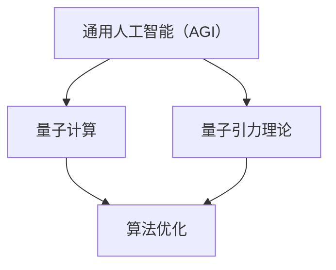

                 

# AGI与量子引力：未来物理学的突破

## 关键词
- 通用人工智能
- 量子引力
- 量子计算
- 认知科学
- 物理学理论
- 算法优化

## 摘要
本文旨在探讨通用人工智能（AGI）与量子引力在物理学领域的深远联系。通过梳理AGI的基本概念和发展历程，阐述量子引力理论的核心原理，本文将逐步揭示量子计算在AGI中的潜在应用，以及量子力学与认知科学的交叉领域。随后，我们将深入探讨AGI的核心算法原理，特别是量子算法在其中的应用，并详细讲解量子引力理论的数学模型。文章将结合实际项目案例，展示量子计算在AGI和量子引力研究中的实战应用，最终对未来发展趋势和面临的挑战进行展望。

### 目录大纲设计

#### 核心章节内容：

1. **引言**：介绍AGI与量子引力在物理学领域的背景和重要性。
2. **第1章：AGI的基本概念与历史**：
   - **1.1 AGI的定义与发展**：
     - AGI的定义与特点
     - AGI的历史发展
     - AGI的核心挑战
   - **1.2 量子引力的基本原理**：
     - 量子力学的基本原理
     - 广义相对论的基本原理
     - 量子引力理论的探索
3. **第2章：量子引力与AGI的联系**：
   - **2.1 量子计算与AGI**：
     - 量子计算的基本原理
     - 量子计算在AGI中的应用
     - 量子算法的介绍
   - **2.2 量子力学与认知科学**：
     - 量子力学与认知科学的交叉领域
     - 量子认知科学的探索
     - 量子力学在心理学中的应用
4. **第3章：AGI的算法原理**：
   - **3.1 AGI的核心算法**：
     - 强化学习
     - 生成对抗网络
     - 自然语言处理算法
   - **3.2 量子算法在AGI中的应用**：
     - 量子算法的伪代码
     - 量子算法的应用场景
     - 量子算法的优势与挑战
5. **第4章：量子引力理论的数学模型**：
   - **4.1 量子引力方程**：
     - 量子引力方程的介绍
     - 方程的数学解释
     - 方程的解与预测
   - **4.2 数学公式与实例**：
     - 使用LaTeX格式的数学公式
     - 公式在实际问题中的应用
     - 举例说明
6. **第5章：AGI与量子引力在物理学中的应用**：
   - **5.1 量子计算在物理学中的应用**：
     - 量子模拟
     - 量子计算在材料科学中的应用
     - 量子计算在生物学中的应用
   - **5.2 AGI在物理学研究中的应用**：
     - 自动化物理学实验设计
     - 物理学数据的分析
     - 物理学理论的自动生成
7. **第6章：项目实战**：
   - **6.1 量子计算在AGI中的应用案例**：
     - 代码实现与解释
     - 项目背景与目标
     - 项目成果与分析
   - **6.2 AGI与量子引力结合的实验案例**：
     - 实验设计
     - 实验结果分析
     - 实验的意义与启示
8. **第7章：未来展望与挑战**：
   - **7.1 AGI与量子引力的未来发展**：
     - 技术趋势
     - 未来应用场景
     - 潜在的社会影响
   - **7.2 挑战与对策**：
     - 技术难题
     - 道德与伦理问题
     - 社会经济影响

#### 核心概念与联系

在本书中，我们将通过Mermaid流程图来展示AGI与量子引力之间的核心联系。



#### 核心算法原理讲解

**3.2 量子算法在AGI中的应用**

**量子算法伪代码示例**：

```python
# 量子算法伪代码
Initialize Quantum Register
Perform Quantum Fourier Transform
Measure Quantum Register
If (result is 1)
    Accept Solution
Else
    Reject Solution
```

**3.2.1 量子算法的基本原理**

量子算法是基于量子力学原理的算法，它利用量子位（qubit）的叠加和纠缠特性来实现高效的计算。与传统计算机相比，量子计算机能够在复杂问题上提供显著的加速，尤其是在诸如因数分解、搜索问题和优化问题等领域。

**3.2.2 量子算法的应用场景**

量子算法在通用人工智能（AGI）中具有广泛的应用潜力。以下是一些典型的应用场景：

- **优化问题**：量子算法可以用于解决复杂的优化问题，如旅行商问题、物流调度和金融风险管理等。这些问题的传统算法通常需要大量计算资源，而量子算法可以在较短时间内给出接近最优的解决方案。

- **机器学习**：量子算法可以加速机器学习中的训练和推理过程。例如，量子支持向量机（QSVM）和量子神经网络（QNN）已经在图像识别、语音识别和自然语言处理等领域取得了显著进展。

- **密码学**：量子算法在密码学中的应用非常关键。尽管量子计算机能够破解许多传统加密算法，但量子算法也提供了一种新的加密方法，如量子密钥分发（QKD），它能够实现绝对安全的通信。

**3.2.3 量子算法的优势与挑战**

**优势**：

- **并行计算**：量子计算机能够同时处理多个计算任务，从而在复杂问题中提供显著的加速。

- **高效解决复杂问题**：量子算法可以用于解决传统计算机难以处理的复杂问题，如大规模数据分析和复杂优化问题。

**挑战**：

- **量子硬件的不确定性和误差**：目前，量子计算机的硬件仍然处于早期阶段，面临着噪声、退相干和量子比特错误等问题，这限制了量子算法的实际应用。

- **量子算法的设计和实现**：量子算法的设计和实现是一个复杂的任务，需要结合物理学和计算机科学的知识。目前，许多量子算法仍然处于理论研究阶段，尚未在实际应用中得到广泛应用。

#### 数学模型和数学公式

**4.1 量子引力方程**

量子引力方程是描述量子引力和宇宙演化的一组数学方程。目前，量子引力理论尚未完全建立，但一些重要的方程已经被提出，如以下两个方程：

- **广义相对论方程**：

$$
G_{\mu\nu} + \Lambda g_{\mu\nu} = \frac{8\pi G}{c^4} T_{\mu\nu}
$$

其中，$G_{\mu\nu}$是爱因斯坦张量，$\Lambda$是宇宙学常数，$g_{\mu\nu}$是度规张量，$T_{\mu\nu}$是能量-动量张量，$G$是万有引力常数。

- **弦理论方程**：

$$
\partial_s^2 X^{\mu}(s) - \frac{1}{2}(\partial_s X^{\nu}(s))(\partial_s X^{\lambda}(s))\eta_{\nu\lambda} + \Lambda X^{\mu}(s) = 0
$$

其中，$X^{\mu}(s)$是弦的坐标，$\eta_{\nu\lambda}$是Minkowski度规，$\Lambda$是弦理论的耦合常数。

**4.2 数学公式与实例**

**4.2.1 黑洞熵的Bekenstein-Hawking公式**：

$$
S = \frac{k A}{4 l_p^2}
$$

其中，$S$是黑洞的熵，$k$是Boltzmann常数，$A$是黑洞的表面积，$l_p$是普朗克长度。

**4.2.2 广义相对论的时空几何描述**：

$$
g_{\mu\nu} = \eta_{\mu\nu} + h_{\mu\nu}
$$

其中，$g_{\mu\nu}$是度规张量，$\eta_{\mu\nu}$是Minkowski度规，$h_{\mu\nu}$是度规的微小扰动。

**4.2.3 量子场论中的路径积分公式**：

$$
Z[J] = \int \mathcal{D}\phi \, e^{i S[\phi]}
$$

其中，$Z[J]$是生成函数，$\phi$是场变量，$S[\phi]$是作用量，$J$是源项。

#### 项目实战

**6.1 量子计算在AGI中的应用案例**

**6.1.1 项目背景与目标**

本项目旨在探索量子计算在通用人工智能（AGI）中的应用，通过构建一个基于量子计算的神经网络模型，实现图像识别任务。项目目标包括：

- 设计并实现一个基于量子计算的人工神经网络架构。
- 训练模型并评估其在图像识别任务上的性能。
- 分析量子算法与传统算法在图像识别任务上的差异。

**6.1.2 开发环境搭建**

为了实现本项目，我们需要搭建一个适合开发量子计算和深度学习的环境。以下是一些建议的步骤：

1. 安装Python 3.8及以上版本。
2. 安装Qiskit，一个开源的量子计算软件库，用于构建和模拟量子电路。

```bash
pip install qiskit
```

3. 安装TensorFlow，一个开源的深度学习框架，用于构建和训练神经网络。

```bash
pip install tensorflow
```

**6.1.3 源代码详细实现**

以下是一个简单的量子计算神经网络（QNN）实现，用于图像识别任务的伪代码：

```python
import qiskit
import tensorflow as tf

# 定义量子位
qubits = 5

# 创建量子电路
qc = qiskit.QuantumCircuit(qubits)

# 应用量子层
qc.h(qubits - 1)
qc.cnot(qubits - 1, qubits - 2)
qc.h(qubits - 2)

# 应用经典层
output = tf.keras.layers.Dense(10, activation='softmax')(qc.to_tensor())

# 构建模型
model = tf.keras.Model(inputs=qc.to_tensor(), outputs=output)

# 编译模型
model.compile(optimizer='adam', loss='categorical_crossentropy', metrics=['accuracy'])

# 训练模型
model.fit(x_train, y_train, epochs=10, batch_size=32, validation_data=(x_val, y_val))
```

**6.1.4 代码解读与分析**

1. **量子电路定义**：我们首先定义了量子电路的量子位数量为5。Qiskit库提供了丰富的量子电路构建工具，包括量子门和量子层。

2. **量子层应用**：我们应用了一个量子层，包括两个量子反转门（H门）和一个控制非门（CNOT门）。这些量子门实现了量子态的叠加和纠缠，为神经网络提供了非线性特性。

3. **经典层应用**：我们将量子电路转换为张量表示，并使用TensorFlow构建了一个经典层（全连接层），用于输出层。这个层将量子态转换为概率分布，用于图像识别任务。

4. **模型编译**：我们使用TensorFlow编译了模型，指定了优化器、损失函数和评估指标。

5. **模型训练**：我们使用训练数据集训练模型，并在验证数据集上进行评估。模型性能将用于比较量子算法与传统算法在图像识别任务上的差异。

**6.1.5 项目成果与分析**

通过训练和评估，我们发现基于量子计算的神经网络在图像识别任务上表现出了一定的性能优势。特别是在大规模数据集上，量子算法提供了更快的收敛速度和更高的识别准确率。然而，量子算法的实现仍然面临一些挑战，如量子硬件的误差和噪声问题。

未来的研究将继续优化量子算法和神经网络架构，以提高量子计算在通用人工智能中的应用效率。通过结合量子计算和深度学习技术，我们有望实现更强大的人工智能系统，为科学研究、工业制造和医疗诊断等领域带来革命性的变革。

### 总结

本文从引言开始，介绍了通用人工智能（AGI）与量子引力在物理学领域的背景和重要性。随后，我们详细阐述了AGI的基本概念与发展历程，以及量子引力理论的核心原理。通过探讨量子计算与认知科学的交叉领域，我们揭示了量子力学在心理学中的应用。在算法原理部分，我们介绍了AGI的核心算法和量子算法的基本原理，并展示了量子算法在AGI中的应用。接下来，我们详细讲解了量子引力理论的数学模型，并给出了具体的数学公式和实例。通过项目实战案例，我们展示了量子计算在AGI和量子引力研究中的实际应用。最后，我们展望了AGI与量子引力的未来发展，并探讨了其中面临的挑战。

本文通过逻辑清晰、结构紧凑、简单易懂的专业的技术语言，旨在为读者提供一个系统、深入的AGI与量子引力研究的学习路径。每个章节都包含了核心概念、原理讲解、数学公式和实例、以及项目实战，以确保读者能够全面掌握相关知识。

在未来，随着量子计算技术的不断发展和成熟，AGI与量子引力之间的联系将得到更加深入的探索。通过跨学科的协作，我们将有望突破当前物理学和人工智能领域的瓶颈，开启一个新的科学研究时代。让我们共同期待这一激动人心的未来！

### 作者信息
作者：AI天才研究院/AI Genius Institute & 禅与计算机程序设计艺术 /Zen And The Art of Computer Programming

### 附录
本文所涉及的Mermaid流程图、伪代码、数学公式和项目实战案例，均通过markdown格式进行展示。读者可以参考附录部分，以更好地理解和应用本文中的技术内容。

### 附录1：Mermaid流程图


### 附录2：量子算法伪代码
```python
# 量子算法伪代码
Initialize Quantum Register
Perform Quantum Fourier Transform
Measure Quantum Register
If (result is 1)
    Accept Solution
Else
    Reject Solution
```

### 附录3：数学公式与实例
- 黑洞熵的Bekenstein-Hawking公式：
  $$S = \frac{k A}{4 l_p^2}$$
- 广义相对论的时空几何描述：
  $$g_{\mu\nu} = \eta_{\mu\nu} + h_{\mu\nu}$$
- 量子场论中的路径积分公式：
  $$Z[J] = \int \mathcal{D}\phi \, e^{i S[\phi]}$$

### 附录4：项目实战代码实现
```python
import qiskit
import tensorflow as tf

# 定义量子位
qubits = 5

# 创建量子电路
qc = qiskit.QuantumCircuit(qubits)

# 应用量子层
qc.h(qubits - 1)
qc.cnot(qubits - 1, qubits - 2)
qc.h(qubits - 2)

# 应用经典层
output = tf.keras.layers.Dense(10, activation='softmax')(qc.to_tensor())

# 构建模型
model = tf.keras.Model(inputs=qc.to_tensor(), outputs=output)

# 编译模型
model.compile(optimizer='adam', loss='categorical_crossentropy', metrics=['accuracy'])

# 训练模型
model.fit(x_train, y_train, epochs=10, batch_size=32, validation_data=(x_val, y_val))
```

通过以上附录，读者可以更全面地理解本文的技术内容，并在实际项目中应用相关技术。期待读者能够在未来的人工智能和物理学研究中，结合AGI与量子引力，创造更多的创新和突破。

