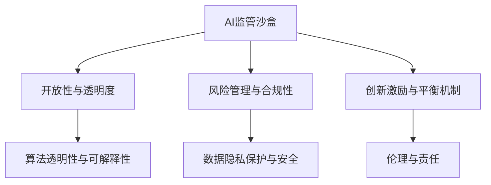

                 

### 第一部分：引言

#### 1.1 AI监管沙盒的起源与概念

人工智能（AI）作为21世纪的颠覆性技术，已经在全球范围内引起了广泛的关注和探讨。随着AI技术的快速发展，其在各个领域的应用日益广泛，从医疗诊断、金融分析到自动驾驶、智能家居，AI正逐步改变我们的生活方式。然而，AI技术的迅速普及也带来了一系列的挑战，尤其是在监管方面。

AI监管沙盒的概念起源于金融科技（FinTech）领域。2000年代初，随着金融科技的兴起，传统金融行业开始面临来自新兴科技的挑战。为了在推动创新的同时确保金融市场的稳定和安全，英国金融行为监管局（FCA）于2016年首次提出了监管沙盒（Regulatory Sandbox）的概念。监管沙盒允许金融科技公司在一个受监管的环境中测试其创新产品和服务，以降低创新风险并加速市场进入。

随后，AI监管沙盒的概念被借鉴和扩展到了人工智能领域。AI监管沙盒旨在为AI技术在各个行业的应用提供一个受控的实验环境，让企业可以在符合监管要求的前提下，测试和部署其AI解决方案。通过这种方式，AI监管沙盒不仅能够促进技术创新，还能确保技术应用的合规性和安全性。

#### 1.2 AI监管沙盒的目的与作用

AI监管沙盒的主要目的是在推动技术创新的同时，确保技术应用的合规性和安全性。具体来说，AI监管沙盒具有以下几个方面的作用：

1. **促进技术创新**：AI监管沙盒为AI企业提供了一个试验和创新的环境，使其能够在遵守监管要求的前提下，探索和测试新的技术和应用场景。这种环境鼓励企业进行创新，提高市场竞争力。

2. **降低创新风险**：通过在受控的环境中测试AI技术，监管沙盒可以帮助企业识别和解决潜在的技术和合规问题，从而降低创新失败的风险。

3. **确保技术应用合规性**：AI监管沙盒要求企业在测试过程中遵循相关的法律法规和监管要求，确保技术应用的合规性。这有助于避免因违反法规而导致的经济和法律风险。

4. **增强公众信任**：通过透明和公开的监管过程，AI监管沙盒可以增强公众对AI技术的信任。公众可以看到企业在遵守监管要求的前提下进行创新，从而减少对AI技术的担忧。

5. **支持政策制定**：AI监管沙盒为监管机构提供了一个观察和分析AI技术应用的平台，帮助其了解技术发展的趋势和挑战，从而制定更有效的政策和监管框架。

#### 1.3 AI监管沙盒的全球发展趋势

随着AI技术的全球普及，AI监管沙盒的理念也逐渐被各国政府和监管机构接受和推广。目前，全球多个国家和地区已经建立了各自的AI监管沙盒项目，其发展趋势如下：

1. **发达国家**：如美国、英国、德国、日本等国家，这些国家的金融科技和AI技术发展较为成熟，相关监管机构积极推动AI监管沙盒的建立。例如，美国的金融监管机构已经开始测试AI技术在金融监管中的应用。

2. **新兴市场**：如印度、巴西、南非等国家，这些国家的金融科技和AI技术发展迅速，但也面临着较大的监管挑战。通过建立AI监管沙盒，这些国家希望能够平衡创新和监管需求，推动技术发展。

3. **区域合作**：一些地区性组织，如欧洲联盟（EU）、东南亚国家联盟（ASEAN）等，也开始推动区域内的AI监管沙盒合作。这些合作有助于促进技术交流和标准统一，提高区域内AI技术的监管水平。

4. **国际合作**：国际组织，如联合国教科文组织（UNESCO）、经济合作与发展组织（OECD）等，也开始关注AI监管沙盒的发展，并推动国际间的合作与交流。这有助于建立全球性的AI监管框架，推动全球AI技术的发展。

总之，AI监管沙盒作为一种新兴的监管机制，正逐渐成为全球范围内的共识。通过提供受控的实验环境，AI监管沙盒不仅能够促进技术创新，还能确保技术应用的合规性和安全性，为AI技术的健康发展提供有力支持。

### 第二部分：AI监管沙盒的核心原则

#### 1.4 监管沙盒的开放性与透明度

开放性和透明度是AI监管沙盒的核心原则之一，也是其成功的关键因素。开放性意味着AI监管沙盒应该允许广泛的参与，包括企业和研究人员、监管机构和其他利益相关者。这种开放性有助于吸引更多的创新者和投资者，促进技术和市场的繁荣。

透明度则是指监管沙盒的运作过程和决策应当公开、清晰，使所有参与者都能了解其操作方式和规则。透明度有助于建立信任，减少信息不对称，提高市场的稳定性。

在AI监管沙盒中，开放性和透明度体现在以下几个方面：

1. **申请过程的透明**：监管机构应当明确发布申请流程和条件，确保所有申请者都能平等地获取信息并申请参与。

2. **评估标准的公开**：监管机构应当公开评估申请项目的标准，包括技术能力、合规性和风险管理等方面。

3. **试验过程的跟踪**：监管沙盒应建立监控和跟踪机制，记录和公开试验过程中产生的数据和信息。

4. **结果的公开**：监管沙盒应当公布试验结果，包括成功的案例和存在的问题，以便其他参与者学习和借鉴。

#### 1.5 风险管理与合规性要求

在AI监管沙盒中，风险管理和合规性要求是确保技术安全和稳定的重要环节。由于AI技术的复杂性和不确定性，对其进行严格的风险管理和合规性控制至关重要。

1. **风险管理策略**：监管沙盒应制定详细的风险管理策略，包括风险识别、评估和应对措施。具体措施可以包括：

   - **风险识别**：通过风险评估工具和方法，识别AI项目可能面临的技术风险、操作风险和合规风险。

   - **风险评估**：对识别出的风险进行定量和定性分析，评估其可能的影响和发生的概率。

   - **风险应对**：制定相应的应对措施，包括风险规避、风险转移和风险接受等。

2. **合规性要求**：AI监管沙盒要求企业在参与试验过程中严格遵守相关法律法规和行业标准。具体要求包括：

   - **数据保护**：确保试验过程中收集和使用的数据符合数据保护法规，如通用数据保护条例（GDPR）。

   - **伦理审查**：对涉及人类数据的AI项目进行伦理审查，确保其符合伦理标准。

   - **技术合规**：确保AI技术符合相关技术标准和规范，如机器学习模型的透明性和可解释性。

3. **合规性监控**：监管沙盒应建立合规性监控机制，对参与企业的合规行为进行定期检查和评估，确保其持续遵守合规要求。

#### 1.6 创新激励与平衡机制

AI监管沙盒不仅需要确保合规性和安全性，还要鼓励和促进技术创新。创新激励是监管沙盒的核心原则之一，通过提供政策支持和资源保障，鼓励企业进行创新。

1. **政策支持**：监管机构可以提供一系列政策支持，包括税收优惠、资金扶持和研发补贴等，降低企业的创新成本，提高创新动力。

2. **资源保障**：监管沙盒可以为企业提供技术支持、数据资源和实验平台等，帮助其解决在创新过程中遇到的技术难题。

3. **平衡机制**：在鼓励创新的同时，监管沙盒还需要建立平衡机制，确保创新不偏离合规和安全的轨道。具体措施包括：

   - **风险评估与监督**：对创新项目进行持续的风险评估和监督，确保其不产生不可接受的风险。

   - **合规审查**：定期对创新项目的合规性进行审查，确保其符合法律法规和行业标准。

   - **退出机制**：对不符合合规要求或产生严重风险的创新项目，应建立退出机制，防止其继续运作。

通过开放性、透明度、风险管理、合规性要求和创新激励与平衡机制，AI监管沙盒为AI技术的健康发展提供了一个良好的环境。这不仅有助于推动技术创新，还能确保技术应用的合规性和安全性，为AI技术的发展提供强有力的支持。

### 第三部分：AI监管沙盒的设计与实施

#### 1.7 监管沙盒的法律框架与政策环境

AI监管沙盒的成功实施离不开健全的法律框架和政策环境。法律框架为监管沙盒提供了基本的法律依据和操作规范，而政策环境则为监管沙盒的实施提供了支持和保障。以下是AI监管沙盒的法律框架和政策环境的关键要素：

1. **法律框架**：

   - **立法**：监管沙盒的法律框架通常包括专门的立法，如《监管沙盒法》或《技术创新促进法》等。这些立法明确了监管沙盒的定义、目的、适用范围、参与主体和监管机构的职责等。

   - **法规**：在立法的基础上，相关法规进一步细化了监管沙盒的运作规则和具体操作流程。例如，法规可以规定监管沙盒的申请和审批程序、试验项目的监管要求、数据保护和隐私保护措施等。

   - **指南**：监管机构会发布一系列操作指南，帮助企业和监管人员理解法律和法规的具体要求，确保监管沙盒的顺利实施。这些指南通常包括具体的案例分析和实践经验总结。

2. **政策环境**：

   - **政府支持**：政府通过发布政策文件和声明，表明对AI监管沙盒的支持态度。政策支持可以包括财政支持、税收优惠、研发补贴等，以鼓励企业参与监管沙盒项目。

   - **监管机构合作**：政府支持和协调不同监管机构之间的合作，确保监管沙盒在不同领域的一致性和协调性。这有助于提高监管沙盒的整体效能。

   - **国际合作**：政府积极参与国际交流和合作，推动全球范围内的AI监管沙盒标准制定和经验分享。国际合作有助于建立全球统一的监管框架，促进AI技术的全球化发展。

#### 1.8 监管沙盒的运作机制

AI监管沙盒的运作机制是其成功实施的关键。运作机制包括沙盒的申请、审批、试验、评估和退出等环节，每个环节都有明确的流程和要求。以下是AI监管沙盒运作机制的核心要素：

1. **申请与审批**：

   - **申请条件**：企业或个人在申请进入监管沙盒前，需要满足一定的条件，如技术创新性、市场潜力、风险管理能力等。申请条件可以根据具体政策进行调整。

   - **申请流程**：申请人通过在线平台或书面申请的方式提交项目申请，提交的材料通常包括项目简介、技术方案、风险评估报告和合规性声明等。监管机构会对申请进行初步审核，符合条件的申请将进入下一阶段。

   - **审批程序**：监管机构对申请进行详细审查，包括技术可行性、合规性、风险可控性等方面。审批通过后，申请者将获得进入监管沙盒的许可。

2. **试验与监控**：

   - **试验环境**：监管沙盒为申请者提供一个受控的试验环境，包括数据资源、计算资源和技术支持等。申请者可以在这个环境中进行技术测试和验证。

   - **监控机制**：监管机构对试验过程进行监控，确保申请者遵守监管要求。监控机制可以包括定期检查、数据报告和现场审查等。

   - **风险控制**：监管沙盒要求申请者在试验过程中进行持续的风险管理，包括风险识别、评估和应对措施。监管机构会对申请者的风险管理情况进行评估。

3. **评估与反馈**：

   - **评估标准**：监管机构根据事先设定的评估标准，对试验结果进行评估。评估标准通常包括技术创新性、市场表现、合规性和风险管理等方面。

   - **反馈机制**：监管机构将评估结果反馈给申请者，并提供改进建议。申请者可以根据反馈进行调整和优化。

   - **退出机制**：如果评估结果显示项目不符合监管要求或存在严重风险，监管机构可以要求项目退出沙盒。退出机制有助于防止不良项目的继续运作。

4. **退出与后续处理**：

   - **项目退出**：在完成试验后，监管机构会对项目进行评估，决定是否退出监管沙盒。项目退出可以是由于成功完成试验、不符合监管要求或存在严重风险等原因。

   - **后续处理**：监管沙盒为退出项目提供后续处理机制，包括技术评估报告、风险总结和市场推广等。这有助于项目在其他环境中的持续发展。

通过申请、审批、试验、评估和退出的运作机制，AI监管沙盒确保了技术项目的合规性和安全性，同时也促进了技术创新和市场发展。

#### 1.9 监管沙盒的评价与反馈机制

AI监管沙盒的有效运行离不开评价与反馈机制。这些机制不仅能够确保项目的合规性和安全性，还能为监管机构提供重要的参考依据，从而不断优化监管沙盒的运作。

1. **评价标准**：

   - **技术创新性**：评价项目在技术创新方面的贡献，包括新算法、新应用场景和新解决方案等。

   - **市场潜力**：评估项目对市场的潜在影响，包括市场接受度、商业可行性和竞争力等。

   - **合规性**：检查项目是否遵循相关法律法规和监管要求，如数据保护、伦理审查和技术标准等。

   - **风险管理**：评估项目在风险管理方面的表现，包括风险识别、评估和应对措施。

   - **社会影响**：考虑项目对社会、环境和人类权益的影响，包括公平性、透明度和责任承担等。

2. **评价方法**：

   - **定量评价**：使用定量指标对项目进行评估，如技术指标、市场表现指标和风险管理指标等。这些指标可以通过数据分析和统计方法进行量化。

   - **定性评价**：通过专家评审和案例分析，对项目进行定性评价。专家评审可以提供深入的分析和见解，帮助识别项目的潜在问题和改进方向。

   - **多方参与**：评价过程应涉及多个利益相关方，包括监管机构、企业、学术机构和社会组织等。多方参与有助于提供全面的评价视角，减少偏见和误解。

3. **反馈机制**：

   - **即时反馈**：在评价过程中，应提供即时反馈给项目团队。这有助于项目团队及时调整和优化项目，提高项目的成功率和合规性。

   - **定期评估**：监管机构应定期对监管沙盒中的项目进行评估，并根据评估结果调整政策和监管措施。定期评估有助于发现普遍问题和趋势，提供改进建议。

   - **公开报告**：监管沙盒的评估结果和反馈应公开报告，供公众和利益相关方参考。公开报告有助于增加透明度，提高公众信任。

   - **持续改进**：监管机构和项目团队应根据评估结果和反馈，不断改进监管沙盒的运作机制和政策框架。持续改进有助于提高监管沙盒的效能和影响力。

通过科学、公正的评价与反馈机制，AI监管沙盒能够确保技术项目的合规性和安全性，同时促进技术创新和市场发展。评价与反馈机制不仅为监管机构提供了重要的决策依据，还为项目团队提供了宝贵的改进建议，推动整个行业向更高的标准和更先进的技术迈进。

### 第二部分：AI监管沙盒的核心原则

#### 1.4 监管沙盒的开放性与透明度

开放性和透明度是AI监管沙盒的核心原则之一，也是其成功的关键因素。开放性意味着AI监管沙盒应该允许广泛的参与，包括企业和研究人员、监管机构和其他利益相关者。这种开放性有助于吸引更多的创新者和投资者，促进技术和市场的繁荣。

透明度则是指监管沙盒的运作过程和决策应当公开、清晰，使所有参与者都能了解其操作方式和规则。透明度有助于建立信任，减少信息不对称，提高市场的稳定性。

在AI监管沙盒中，开放性和透明度体现在以下几个方面：

1. **申请过程的透明**：监管机构应当明确发布申请流程和条件，确保所有申请者都能平等地获取信息并申请参与。

2. **评估标准的公开**：监管机构应当公开评估申请项目的标准，包括技术能力、合规性和风险管理等方面。

3. **试验过程的跟踪**：监管沙盒应建立监控和跟踪机制，记录和公开试验过程中产生的数据和信息。

4. **结果的公开**：监管沙盒应当公布试验结果，包括成功的案例和存在的问题，以便其他参与者学习和借鉴。

#### 1.5 风险管理与合规性要求

在AI监管沙盒中，风险管理和合规性要求是确保技术安全和稳定的重要环节。由于AI技术的复杂性和不确定性，对其进行严格的风险管理和合规性控制至关重要。

1. **风险管理策略**：监管沙盒应制定详细的风险管理策略，包括风险识别、评估和应对措施。具体措施可以包括：

   - **风险识别**：通过风险评估工具和方法，识别AI项目可能面临的技术风险、操作风险和合规风险。

   - **风险评估**：对识别出的风险进行定量和定性分析，评估其可能的影响和发生的概率。

   - **风险应对**：制定相应的应对措施，包括风险规避、风险转移和风险接受等。

2. **合规性要求**：AI监管沙盒要求企业在参与试验过程中严格遵守相关法律法规和行业标准。具体要求包括：

   - **数据保护**：确保试验过程中收集和使用的数据符合数据保护法规，如通用数据保护条例（GDPR）。

   - **伦理审查**：对涉及人类数据的AI项目进行伦理审查，确保其符合伦理标准。

   - **技术合规**：确保AI技术符合相关技术标准和规范，如机器学习模型的透明性和可解释性。

3. **合规性监控**：监管沙盒应建立合规性监控机制，对参与企业的合规行为进行定期检查和评估，确保其持续遵守合规要求。

#### 1.6 创新激励与平衡机制

AI监管沙盒不仅需要确保合规性和安全性，还要鼓励和促进技术创新。创新激励是监管沙盒的核心原则之一，通过提供政策支持和资源保障，鼓励企业进行创新。

1. **政策支持**：监管机构可以提供一系列政策支持，包括税收优惠、资金扶持和研发补贴等，降低企业的创新成本，提高创新动力。

2. **资源保障**：监管沙盒可以为企业提供技术支持、数据资源和实验平台等，帮助其解决在创新过程中遇到的技术难题。

3. **平衡机制**：在鼓励创新的同时，监管沙盒还需要建立平衡机制，确保创新不偏离合规和安全的轨道。具体措施包括：

   - **风险评估与监督**：对创新项目进行持续的风险评估和监督，确保其不产生不可接受的风险。

   - **合规审查**：定期对创新项目的合规性进行审查，确保其符合法律法规和行业标准。

   - **退出机制**：对不符合合规要求或产生严重风险的创新项目，应建立退出机制，防止其继续运作。

通过开放性、透明度、风险管理、合规性要求和创新激励与平衡机制，AI监管沙盒为AI技术的健康发展提供了一个良好的环境。这不仅有助于推动技术创新，还能确保技术应用的合规性和安全性，为AI技术的发展提供强有力的支持。

### 第四部分：AI监管沙盒的关键领域

#### 4.1 AI算法的透明性与可解释性

在AI监管沙盒中，算法的透明性与可解释性是一个至关重要的领域。随着AI技术的广泛应用，特别是在医疗、金融和司法等关键领域，人们越来越关注AI算法的透明性和可解释性。这不仅是因为AI算法的决策过程常常被视为“黑箱”，其结果缺乏可解释性，而且还因为算法的透明性和可解释性对于确保公平性、公正性和合规性至关重要。

#### 4.1.1 透明性与可解释性的重要性

算法的透明性指的是算法的设计和操作过程能够被理解和验证。可解释性则进一步强调算法决策过程的逻辑和原因，使其对人类用户具有解释性。以下是算法透明性和可解释性的重要性：

1. **增强用户信任**：当用户能够理解AI算法的决策过程和结果时，会更容易对其产生信任。这种信任对于AI技术在关键领域的广泛应用至关重要。

2. **确保公平性和公正性**：AI算法的决策过程如果不透明，可能会导致歧视和偏见。透明性和可解释性有助于发现并纠正这些潜在的问题，确保算法的公平性和公正性。

3. **合规性和法律要求**：许多行业和领域都有严格的合规性要求，例如金融和医疗行业。算法的透明性和可解释性有助于确保算法符合相关法律法规。

4. **改进和优化算法**：了解算法的决策过程和结果可以帮助研究人员和工程师改进和优化算法，提高其性能和准确性。

#### 4.1.2 评估算法透明性的方法

为了确保算法的透明性和可解释性，需要采用一系列评估方法。以下是几种常见的评估方法：

1. **代码审查**：通过审查算法的源代码，检查其设计和实现是否符合透明性和可解释性的要求。

2. **文档化**：编写详细的算法文档，包括算法的原理、参数设置、训练过程和结果解释等，使其对用户具有解释性。

3. **可视化**：使用可视化工具将算法的决策过程和结果展示出来，使其更容易理解和分析。

4. **测试数据集分析**：通过分析测试数据集上的结果，评估算法的准确性和一致性。

5. **用户反馈**：收集用户对算法的反馈，了解其对算法的理解程度和满意度。

#### 4.1.3 提高算法可解释性的技术

为了提高算法的可解释性，研究人员和工程师可以采用多种技术手段。以下是一些常见的技术：

1. **可解释的机器学习模型**：选择那些设计初衷就是为了具有高可解释性的机器学习模型，例如线性回归、决策树和线性模型等。

2. **模型可视化**：使用可视化工具将模型的决策过程和结果展示出来，帮助用户理解模型的工作原理。

3. **模型解释器**：开发专门的模型解释器，如LIME（Local Interpretable Model-agnostic Explanations）和SHAP（SHapley Additive exPlanations），这些工具可以提供针对特定数据点的详细解释。

4. **面向解释的算法优化**：在算法设计阶段，考虑其可解释性，通过优化算法结构来提高其可解释性。

5. **结合专业知识**：将算法与领域专业知识相结合，通过解释算法中的特定部分来提高整体的可解释性。

#### 4.1.4 算法透明性与可解释性的实际应用案例

以下是几个算法透明性和可解释性的实际应用案例：

1. **医疗诊断**：在医疗诊断中，医生和患者都需要理解AI算法的诊断结果。通过提高算法的可解释性，医生可以更好地理解诊断结果的依据，患者也可以更好地理解其病情和治疗方案。

2. **金融风险评估**：在金融行业中，AI算法用于风险评估和信用评分。通过提高算法的透明性和可解释性，金融机构可以更好地理解风险因素，提高风险评估的准确性和可信度。

3. **司法判决**：在司法领域中，AI算法用于预测犯罪率和判决结果。通过提高算法的透明性和可解释性，司法机构可以更好地理解和评估算法的决策过程，确保判决的公正性和透明度。

总之，算法的透明性和可解释性是AI监管沙盒中一个关键领域。通过采用多种评估方法和技术手段，可以提高算法的可解释性，增强用户信任，确保算法的公平性和合规性。这不仅有助于推动AI技术的发展，还为AI技术的广泛应用提供了坚实的基础。

#### 4.2 AI数据的隐私保护与安全

在AI监管沙盒中，数据的隐私保护与安全是一个关键挑战。随着AI技术的快速发展，越来越多的数据被收集、处理和应用。这些数据不仅包括个人敏感信息，还可能涉及企业商业秘密和国家信息安全。因此，确保AI数据的隐私保护与安全至关重要。

#### 4.2.1 数据隐私保护的需求与挑战

数据隐私保护的需求主要源于以下几个方面：

1. **法律法规**：许多国家和地区已经制定了严格的数据保护法律，如欧洲的通用数据保护条例（GDPR）和加州消费者隐私法案（CCPA）。这些法规要求企业在处理个人数据时必须遵守一系列隐私保护要求。

2. **用户信任**：用户越来越关注其数据的隐私保护。如果企业无法确保数据安全，用户可能会失去信任，导致市场份额下降。

3. **商业风险**：泄露敏感数据可能导致严重的商业损失，包括法律诉讼、罚款和品牌声誉受损。

数据隐私保护的挑战主要包括：

1. **数据量庞大**：随着大数据技术的发展，企业收集和处理的数据量急剧增加，增加了隐私保护难度。

2. **数据多样性**：不同类型的数据具有不同的隐私保护需求，如个人身份信息、金融数据和医疗数据等。

3. **数据共享与流通**：为了提高AI模型的性能，企业需要共享和流通大量数据。这增加了数据泄露和滥用的风险。

4. **技术复杂性**：隐私保护技术如加密、匿名化和访问控制等具有较高的技术复杂性，需要专业的技术团队来实施和维护。

#### 4.2.2 数据匿名化与去识别化技术

数据匿名化与去识别化技术是保护数据隐私的重要手段。以下是一些常见的技术方法：

1. **数据匿名化**：数据匿名化通过消除或模糊化个人身份信息，使数据在公开或共享时无法识别特定个体。常见的数据匿名化技术包括：

   - **K-匿名性**：确保任何包含k个记录的组中，都没有足够的信息可以识别出特定个体。
   - **l-diversity**：确保任何包含l个记录的组中，至少有d个不同的真实个体。
   - **t-closeness**：确保任何包含t个记录的组中，真实分布与合成分布之间的差异在可接受范围内。

2. **数据去识别化**：数据去识别化通过删除或修改与个人身份相关的信息，使数据在公开或共享时无法直接识别特定个体。常见的数据去识别化技术包括：

   - **差分隐私**：通过在数据中添加随机噪声，确保单个记录对整体数据集的影响很小，从而保护个体隐私。
   - **同态加密**：允许对加密数据直接进行计算，而无需解密，从而在数据存储和处理过程中保护隐私。
   - **多代理系统**：通过将数据处理任务分配给多个代理，使每个代理都无法单独识别个体，从而提高数据隐私保护水平。

#### 4.2.3 数据加密与访问控制策略

数据加密与访问控制策略是确保数据安全的重要手段。以下是一些常见的技术和策略：

1. **数据加密**：数据加密通过将数据转换成无法理解的密文，确保数据在传输和存储过程中不被未授权访问。常见的数据加密技术包括：

   - **对称加密**：使用相同的密钥进行加密和解密，如AES。
   - **非对称加密**：使用一对密钥（公钥和私钥）进行加密和解密，如RSA。
   - **全盘加密**：对存储设备或文件系统进行加密，确保所有数据在未授权情况下无法访问。

2. **访问控制**：访问控制通过限制用户对数据的访问权限，确保数据仅被授权用户访问。常见的访问控制技术包括：

   - **基于角色的访问控制（RBAC）**：根据用户的角色（如管理员、员工、客户等）分配访问权限。
   - **基于属性的访问控制（ABAC）**：根据用户属性（如职位、部门等）和资源的属性（如文件类型、存储位置等）分配访问权限。
   - **多因素认证**：结合密码、指纹、面部识别等认证方式，提高用户身份验证的安全性。

通过数据匿名化与去识别化技术、数据加密和访问控制策略，AI监管沙盒可以在确保数据隐私和安全的同时，促进AI技术的创新和应用。这些技术手段不仅有助于满足法律法规的要求，还能增强用户信任，推动AI技术的健康发展。

### 第五部分：AI伦理与责任

#### 6.1 AI伦理的重要性

AI伦理在AI监管沙盒中占据着至关重要的地位。随着AI技术的迅速发展和广泛应用，其对社会、经济和人类生活的影响日益深远。因此，确保AI技术的伦理性和责任感，不仅是企业和社会的期望，也是确保AI技术可持续发展的基础。

首先，AI伦理关乎公平性和公正性。AI算法的决策过程往往基于大量数据，这些数据可能包含历史偏见和歧视。如果不加以控制，这些偏见可能会在算法中得到放大，导致不公平的决策。例如，AI招聘系统可能会因为历史数据的偏见而歧视某些性别、种族或年龄群体。

其次，AI伦理涉及隐私保护。AI技术通常涉及大量的个人数据，这些数据的收集和使用可能侵犯用户的隐私权。如果没有严格的伦理准则，AI技术可能会导致大规模的数据泄露和隐私侵犯事件。

再次，AI伦理关乎安全性和可控性。AI系统的复杂性使得其可能出现不可预测的错误和意外行为，对人类和社会造成危害。例如，自动驾驶汽车在遇到紧急情况时，可能无法做出正确的决策，导致交通事故。

最后，AI伦理关乎社会责任和可持续发展。AI技术的发展不仅仅是为了追求商业利益，还应该考虑其对环境、社会和经济的影响。企业和社会应该共同努力，确保AI技术的发展符合可持续发展的原则，造福人类。

总之，AI伦理的重要性在于其能够引导AI技术朝着正确的方向发展，确保其在创新的同时，不损害人类的利益和价值观。通过建立明确的伦理准则和监管机制，AI监管沙盒可以为AI技术的健康发展提供有力保障。

#### 6.2 AI伦理的核心原则

AI伦理的核心原则主要包括公平性、透明性、隐私保护、责任归属和可持续性。以下是对这些原则的详细阐述：

1. **公平性**：

   - **无偏见**：AI系统应避免基于性别、种族、年龄、宗教、性取向等因素产生歧视性决策。设计时需要通过数据清洗和算法优化来消除数据中的偏见。
   - **机会均等**：AI技术应确保所有用户，无论其社会地位、经济条件或地理位置，都能公平地享受AI技术带来的便利和福利。

2. **透明性**：

   - **决策过程透明**：AI系统的决策过程应尽可能清晰易懂，使人类用户能够理解其运作原理和决策逻辑。透明性有助于提高用户对AI系统的信任。
   - **责任可追溯**：AI系统的设计和实施应确保责任的明确归属，便于在出现问题时进行责任追究。

3. **隐私保护**：

   - **数据最小化**：在设计和使用AI系统时，应遵循数据最小化原则，仅收集和存储实现特定功能所必需的数据。
   - **数据加密**：对收集的敏感数据进行加密处理，确保数据在存储和传输过程中不被未授权访问。
   - **用户知情同意**：在使用个人数据时，应确保用户明确知晓并同意其数据的使用方式和目的。

4. **责任归属**：

   - **明确责任主体**：在AI系统的开发、部署和应用过程中，应明确各方的责任和角色，包括技术开发者、使用者、监管机构等。
   - **责任分担**：在出现AI系统导致的负面影响时，各方应按照其责任分担原则进行赔偿和责任追究。

5. **可持续性**：

   - **环境影响**：AI技术应考虑其对环境的影响，尽量减少能耗和资源消耗，推动绿色科技发展。
   - **社会责任**：AI技术的发展和应用应符合社会道德和法律标准，推动社会进步和人类福祉。

通过遵循这些核心原则，AI监管沙盒可以为AI技术的健康发展提供坚实的伦理基础，确保AI技术在推动创新的同时，不损害人类的利益和社会的可持续发展。

#### 6.3 AI伦理决策的框架与工具

在AI监管沙盒中，制定和实施AI伦理决策的框架与工具至关重要。以下是一些常用的框架和工具，用于指导AI伦理决策过程：

1. **AI伦理决策框架**：

   - **AI伦理决策模型（AI-EDM）**：AI-EDM是一个综合性的框架，用于评估和指导AI伦理决策。该模型包括以下几个关键组件：

     - **价值观**：明确AI系统的核心价值观，如公平性、透明性、隐私保护和可持续性。
     - **情境分析**：分析特定AI应用场景的伦理挑战和潜在风险。
     - **利益相关方分析**：识别和分析与AI系统相关的各个利益相关方，包括开发者、用户、监管机构和公众。
     - **风险评估**：评估AI系统可能产生的风险，并制定相应的风险管理策略。
     - **伦理审查**：根据AI伦理原则和标准，对AI系统的设计、开发和部署进行审查。

   - **RE.A.D.模型**：该模型包括四个阶段，即认识（Recognize）、评估（Evaluate）、决策（Decide）和实施（Deploy）。每个阶段都有具体的伦理原则和工具，用于指导AI伦理决策。

2. **伦理工具**：

   - **伦理评估工具（Ethical Assessment Tool）**：该工具用于评估AI系统的伦理影响，包括数据隐私、公平性、透明性和责任归属等方面。工具可以通过问卷调查、访谈和文献分析等方式，收集和分析与AI系统相关的伦理信息。

   - **伦理决策矩阵（Ethical Decision-Making Matrix）**：该矩阵用于指导AI伦理决策，将不同的伦理原则和情境进行分析和匹配，提供决策建议。

   - **伦理准则和规范**：如国际人工智能联合会（IJCAI）发布的《人工智能伦理准则》和欧盟委员会发布的《AI伦理指南》等。这些准则和规范提供了详细的伦理原则和实践建议，有助于指导AI伦理决策。

通过应用这些框架和工具，AI监管沙盒可以为AI技术的健康发展提供伦理指导，确保AI技术在创新的同时，符合道德和法律要求，最大限度地减少负面影响。

### 第六部分：AI监管沙盒的实际案例与经验

#### 6.1 国内AI监管沙盒的典型案例

随着AI技术的快速发展，我国在AI监管沙盒领域也进行了积极的探索和实践。以下是几个国内AI监管沙盒的典型案例，这些案例展示了AI监管沙盒在推动技术创新和合规性管理方面的成功经验。

1. **北京AI监管沙盒**：

   北京AI监管沙盒是我国首个AI监管沙盒项目，于2019年启动。该项目由北京市人民政府和北京金融科技研究院共同推动，旨在为AI企业提供创新试验环境。北京AI监管沙盒的特点包括：

   - **全方位支持**：北京AI监管沙盒为参与企业提供包括资金支持、技术支持、政策咨询等全方位的支持，帮助其解决在创新过程中遇到的各种难题。
   - **严格的合规性要求**：北京AI监管沙盒要求企业在参与试验前，提交详细的合规性报告，确保其遵守相关法律法规和伦理标准。
   - **公开透明的评估机制**：北京AI监管沙盒建立了公开透明的评估机制，对参与项目的合规性和创新性进行定期评估，并根据评估结果进行调整。

2. **上海AI监管沙盒**：

   上海AI监管沙盒成立于2020年，是上海市金融监管局主导的AI监管项目。上海AI监管沙盒的特点如下：

   - **金融领域重点**：上海AI监管沙盒重点关注金融科技领域的创新应用，如智能投顾、信用评分和风险管理等。
   - **政策支持**：上海市政府通过发布一系列政策文件，为AI企业提供税收优惠、资金补贴和研发支持等政策支持，鼓励企业积极参与AI监管沙盒项目。
   - **数据共享与隐私保护**：上海AI监管沙盒建立了数据共享机制，同时注重隐私保护，通过数据匿名化和加密技术，确保数据在共享过程中的安全。

3. **深圳AI监管沙盒**：

   深圳AI监管沙盒是深圳市政府主导的AI监管项目，于2021年正式启动。深圳AI监管沙盒的特点包括：

   - **产业应用导向**：深圳AI监管沙盒重点关注智能制造、医疗健康、智慧城市等领域的AI应用，推动AI技术在产业中的应用。
   - **多部门协同**：深圳AI监管沙盒由深圳市市场监督管理局、深圳市科技创新委员会等多部门共同推动，形成协同监管机制，提高监管效能。
   - **风险管理和合规性审查**：深圳AI监管沙盒对参与项目的合规性和风险进行严格审查，确保技术应用的合规性和安全性。

通过这些国内AI监管沙盒的典型案例，我们可以看到，AI监管沙盒在推动技术创新、确保合规性管理和促进政策制定方面发挥了重要作用。这些案例的成功经验为其他国家和地区提供了有益的参考。

#### 6.2 国外AI监管沙盒的先进经验

全球范围内，许多国家和地区已经建立了各自的AI监管沙盒项目，并积累了丰富的实践经验。以下是一些国外AI监管沙盒的先进经验，这些经验对我国的AI监管沙盒建设具有重要的借鉴意义。

1. **英国**：

   英国是AI监管沙盒的先行者，其金融行为监管局（FCA）于2016年推出了金融监管沙盒，旨在为金融科技企业提供创新试验环境。英国AI监管沙盒的先进经验包括：

   - **开放性**：英国AI监管沙盒对广泛的行业和领域开放，不仅限于金融科技，还包括医疗、交通、能源等领域。这种开放性促进了跨行业的创新合作。
   - **灵活的审批流程**：英国AI监管沙盒的审批流程灵活，企业可以通过在线平台提交申请，并快速获得反馈。这有助于加快创新项目的落地。
   - **透明度**：英国AI监管沙盒注重透明度，要求企业公开其创新方案、测试结果和评估报告，提高公众对AI技术的信任。

2. **美国**：

   美国在AI监管沙盒领域也取得了显著进展。美国证券交易委员会（SEC）和商品期货交易委员会（CFTC）等监管机构推出了多个AI监管沙盒项目。美国AI监管沙盒的先进经验包括：

   - **跨部门合作**：美国AI监管沙盒项目通常由多个部门和机构共同推动，如SEC、CFTC、美联储等，形成了跨部门的协同监管机制。
   - **政策引导**：美国通过发布政策文件和指南，引导企业遵守AI伦理和合规要求。例如，SEC发布了《人工智能在投资管理和金融分析中的应用》指南，为企业提供了明确的合规指导。
   - **技术支持**：美国AI监管沙盒项目为企业提供技术支持，包括数据资源、计算资源和专业知识等，帮助其解决技术难题。

3. **欧盟**：

   欧盟在AI监管沙盒方面也进行了深入探索，发布了《人工智能法案》和《人工智能伦理准则》等法规和规范。欧盟AI监管沙盒的先进经验包括：

   - **严格的隐私保护**：欧盟对个人数据的隐私保护要求严格，AI监管沙盒项目要求企业遵守通用数据保护条例（GDPR）等法规，确保数据的隐私和安全。
   - **伦理审查**：欧盟AI监管沙盒要求企业进行伦理审查，确保AI技术符合伦理要求，不损害人类权益和社会利益。
   - **标准化**：欧盟通过制定AI技术标准和规范，推动全球范围内的标准化合作，提高AI技术的互操作性和可移植性。

通过学习和借鉴国外AI监管沙盒的先进经验，我国可以在AI监管沙盒的建设过程中，更好地平衡创新和合规性管理，推动AI技术的健康发展。

#### 6.3 AI监管沙盒的实践效果与改进方向

AI监管沙盒作为一种新兴的监管机制，已经在全球范围内取得了一定的实践效果。通过分析AI监管沙盒的实践效果，我们可以发现其成功和存在的问题，并提出相应的改进方向。

**实践效果：**

1. **促进技术创新**：AI监管沙盒为AI企业提供了一个安全的试验环境，鼓励企业进行技术创新。通过在沙盒中测试和优化其AI解决方案，企业能够更好地理解技术风险，提高创新成功率。

2. **提高合规性**：AI监管沙盒通过严格的合规性要求和评估机制，确保企业遵守相关法律法规和伦理标准。这有助于降低法律风险，提高市场信任度。

3. **增强公众信任**：AI监管沙盒的透明度和公开性提高了公众对AI技术的信任。通过公开试验结果和评估报告，公众可以了解AI技术的实际应用效果和潜在风险。

4. **支持政策制定**：AI监管沙盒为政府和监管机构提供了一个观察和分析AI技术发展的平台，帮助其了解技术发展的趋势和挑战，从而制定更有效的政策和监管框架。

**存在的问题：**

1. **合规性标准不一致**：不同国家和地区之间的AI监管沙盒合规性标准存在差异，这可能导致企业在全球范围内的合规性挑战。

2. **资源分配不均**：一些国家和地区在AI监管沙盒的资源投入上存在不足，导致一些有潜力的创新项目无法获得足够的支持。

3. **评估机制不完善**：目前一些AI监管沙盒的评估机制不够完善，无法全面评估AI技术的合规性、安全性和公平性。

**改进方向：**

1. **统一合规性标准**：通过国际合作，制定全球统一的AI监管沙盒合规性标准，提高企业全球范围内的合规性水平。

2. **增加资源投入**：政府和监管机构应增加对AI监管沙盒的资源投入，包括资金支持、技术支持和人才培训，确保创新项目能够获得充分的支持。

3. **完善评估机制**：改进AI监管沙盒的评估机制，引入更科学、全面的评估方法，确保评估结果的准确性和公正性。

4. **加强伦理审查**：在AI监管沙盒中加强伦理审查，确保AI技术符合伦理要求，不损害人类权益和社会利益。

通过分析AI监管沙盒的实践效果和存在的问题，我们可以不断改进和完善AI监管沙盒的运作机制，为AI技术的健康发展提供更好的支持和保障。

### 第七部分：AI监管沙盒的未来展望

#### 8.1 AI监管沙盒的技术发展趋势

随着AI技术的不断进步，AI监管沙盒的技术发展趋势也在不断演变。未来，AI监管沙盒将在以下几个方面取得显著进展：

1. **人工智能伦理与法律融合**：随着AI技术的复杂性和应用范围的扩大，AI伦理和法律问题越来越突出。未来的AI监管沙盒将更加注重AI伦理与法律的融合，通过制定更完善的伦理准则和法律规范，确保AI技术的社会责任和可持续发展。

2. **自动化监管**：人工智能技术的发展将使自动化监管成为可能。通过应用机器学习和自然语言处理技术，监管机构可以自动化地进行合规性检查、风险评估和反馈，提高监管效率和准确性。

3. **区块链技术的应用**：区块链技术的去中心化、不可篡改和透明性等特点，使其成为AI监管沙盒的有力补充。未来，AI监管沙盒可能会采用区块链技术，确保数据的完整性和隐私保护。

4. **多维度数据融合**：未来的AI监管沙盒将能够处理和融合来自不同来源、不同类型的数据，如结构化数据、半结构化数据和非结构化数据。这种多维度数据融合有助于提高监管的全面性和准确性。

5. **全球合作与标准化**：随着AI技术的全球化发展，AI监管沙盒将更加注重全球合作和标准化。通过国际合作和标准制定，可以实现AI监管沙盒的全球统一，提高市场准入和合规性的标准一致性。

#### 8.2 AI监管沙盒的政策挑战与应对策略

尽管AI监管沙盒在技术创新和合规性管理方面取得了显著进展，但在政策层面仍面临一系列挑战：

1. **政策不一致**：不同国家和地区之间的AI监管政策存在差异，导致企业在全球范围内的合规性挑战。应对策略是推动国际间的政策协调和合作，制定统一的AI监管标准。

2. **法律法规滞后**：随着AI技术的快速发展，现有法律法规可能无法完全适应新的技术需求。应对策略是加快法律法规的更新和完善，确保其能够及时应对AI技术的发展。

3. **资源不足**：一些国家和地区在AI监管沙盒的资源投入上存在不足，导致创新项目无法获得充分支持。应对策略是增加对AI监管沙盒的资金投入和人力资源配置，提高监管效能。

4. **公众信任问题**：随着AI技术的广泛应用，公众对AI技术的信任度成为一个重要问题。应对策略是加强AI伦理教育，提高公众对AI技术的理解，增强其信任。

#### 8.3 AI监管沙盒的未来发展方向

未来，AI监管沙盒将在以下几个方面继续发展：

1. **多元化应用场景**：AI监管沙盒将扩展到更多领域，如医疗、教育、交通等，为不同行业提供创新的监管环境。

2. **跨行业合作**：AI监管沙盒将促进跨行业合作，通过数据共享和资源整合，推动AI技术的跨行业应用和创新。

3. **全球协同监管**：通过国际合作和标准制定，实现全球范围内的AI协同监管，提高市场准入和合规性的标准一致性。

4. **技术标准化**：推动AI技术的标准化发展，提高不同系统和平台之间的互操作性，促进AI技术的全球推广和应用。

5. **智能化监管**：应用人工智能和大数据技术，实现智能化监管，提高监管效率和准确性。

总之，AI监管沙盒作为推动AI技术创新和合规性管理的重要机制，将在未来继续发展，为AI技术的健康发展提供有力支持。

### 第八部分：AI监管沙盒的全球合作与标准制定

#### 9.1 全球AI监管沙盒的合作模式

在全球范围内，AI监管沙盒的合作模式正逐渐形成，以推动技术创新和合规性管理的协同发展。以下是几种主要的全球合作模式：

1. **多边合作**：多边合作是指多个国家和地区共同参与，建立统一的AI监管沙盒平台。这种模式通过共享监管经验、技术资源和数据资源，提高全球AI技术的监管效能。例如，欧洲联盟（EU）和亚洲联盟（ASEAN）正在探索建立跨区域的AI监管沙盒合作。

2. **双边合作**：双边合作是指两个国家或地区之间的合作，通过签订合作协议，共同推动AI监管沙盒的建立和运行。这种模式通常基于双方在技术、政策和法律方面的共同利益，以实现优势互补。例如，中国和美国在AI监管沙盒领域已经开展了多项双边合作项目。

3. **非政府组织（NGO）合作**：非政府组织在全球AI监管沙盒的合作中发挥着重要作用。这些组织通常具有独立性和专业性，可以提供技术支持、政策建议和国际合作平台。例如，国际人工智能联合会（IJCAI）和世界经济论坛（WEF）等非政府组织在AI伦理和标准制定方面提供了重要支持。

4. **公共-私人合作**：公共-私人合作是指政府、企业和研究机构之间的合作，通过联合研究和项目实施，推动AI监管沙盒的发展。这种模式有助于整合各方资源和优势，提高监管沙盒的运作效率和创新能力。

#### 9.2 国际AI监管标准的制定与实施

国际AI监管标准的制定与实施是确保全球AI技术合规性和互操作性的关键。以下是几个重要的国际AI监管标准及其应用：

1. **通用数据保护条例（GDPR）**：GDPR是欧盟制定的关于数据保护的综合性法律，对个人数据的收集、处理和使用提出了严格要求。GDPR的制定和实施为全球数据隐私保护提供了重要的法律框架，对AI监管沙盒的数据管理具有指导意义。

2. **人工智能伦理准则**：多个国际组织和机构，如国际人工智能联合会（IJCAI）、经济合作与发展组织（OECD）和欧盟委员会等，制定了人工智能伦理准则。这些准则提供了关于AI技术伦理的基本原则和实践指南，对AI监管沙盒的伦理审查和合规性管理具有重要参考价值。

3. **国际标准化组织（ISO）标准**：ISO发布了多个关于AI技术的标准，如ISO/IEC 17020《信息安全管理体系》和ISO/IEC 27001《信息安全管理体系》等。这些标准为AI监管沙盒的技术规范和风险管理提供了重要依据。

4. **跨区域标准合作**：全球多个区域组织，如亚洲太平洋经济合作组织（APEC）和非洲联盟（AU）等，正在探索制定跨区域的AI监管标准。这些标准旨在实现区域内的技术统一和互操作性，提高全球AI技术的监管水平。

#### 9.3 我国在AI监管沙盒领域的国际合作与贡献

我国在AI监管沙盒领域的国际合作与贡献体现在以下几个方面：

1. **“一带一路”倡议**：我国通过“一带一路”倡议，与多个国家和地区建立了AI监管沙盒的合作关系。例如，与俄罗斯、新加坡和英国等国家的合作项目，促进了AI技术在“一带一路”沿线的应用和推广。

2. **技术标准和政策交流**：我国积极参与国际AI监管标准和政策的制定和交流。例如，参与了ISO、IEC和ITU等国际组织的标准制定工作，提出了多项关于AI技术标准和伦理准则的建议。

3. **国际技术合作项目**：我国在AI监管沙盒领域开展了多项国际技术合作项目，如与德国、法国和日本等国家的合作项目，通过联合研究和示范应用，推动了AI技术的全球应用和推广。

4. **国际会议和论坛**：我国主办和参与了多个国际AI监管沙盒的会议和论坛，如“全球人工智能与监管沙盒峰会”和“国际AI监管论坛”等。这些会议和论坛为各国专家提供了交流平台，促进了全球AI监管沙盒的合作与发展。

通过国际合作与贡献，我国在AI监管沙盒领域不断提升自身的影响力，为全球AI技术的发展和合规性管理作出了积极贡献。

### 第九部分：结论与建议

#### 10.1 AI监管沙盒的价值与意义

AI监管沙盒作为一种创新的监管机制，具有重要的价值与意义。首先，AI监管沙盒为AI技术提供了一个安全、受控的试验环境，使企业能够在实际应用中验证其技术的可行性和效果。这有助于降低创新风险，提高技术成功率。其次，AI监管沙盒通过严格的合规性和风险管理，确保了AI技术的合法性和安全性，增强了公众对AI技术的信任。此外，AI监管沙盒通过公开透明的评估机制，促进了技术的透明性和可解释性，提高了市场透明度。最后，AI监管沙盒为政策制定提供了实证依据，帮助政府和监管机构了解技术发展趋势和潜在风险，从而制定更有效的政策和监管框架。

#### 10.2 AI监管沙盒的优化与改进建议

尽管AI监管沙盒在推动技术创新和合规性管理方面取得了显著成果，但仍有优化和改进的空间。以下是一些建议：

1. **完善法律框架**：加快法律法规的更新和完善，确保其能够适应AI技术的快速发展。建立统一的国际AI监管标准，提高全球范围内的合规性和互操作性。

2. **增强透明度**：提高AI监管沙盒的透明度，包括申请过程、评估标准和结果反馈等。建立公开透明的数据平台，方便公众监督和参与。

3. **提升技术支持**：增加对AI监管沙盒的技术支持，包括数据资源、计算资源和专业知识等。推动公共和私人机构合作，共同为AI企业提供支持。

4. **加强伦理审查**：在AI监管沙盒中加强伦理审查，确保AI技术符合伦理要求，不损害人类权益和社会利益。建立伦理审查委员会，提供独立的伦理评估和监督。

5. **促进全球合作**：加强国际间的合作与交流，推动全球AI监管沙盒的协同发展。通过国际合作，分享经验和最佳实践，提高全球AI技术的监管水平。

#### 10.3 AI监管沙盒在我国的发展前景

在我国，AI监管沙盒的发展前景广阔。首先，随着国家对人工智能产业的重视和支持，AI监管沙盒有望得到更多的政策支持和资源投入。其次，我国在AI技术和应用方面已经取得了显著成果，为AI监管沙盒的运行提供了丰富的实践经验和案例。此外，我国积极参与国际AI监管合作，借鉴国外先进经验，有助于提升我国AI监管沙盒的整体水平。

未来，我国AI监管沙盒将朝着更加开放、透明、规范和智能化的方向发展。通过不断完善法律框架、提高技术支持、加强伦理审查和促进全球合作，AI监管沙盒将为我国人工智能产业的健康发展提供有力保障。

### 附录A：AI监管沙盒相关的法律法规与政策文件

在AI监管沙盒的运作中，法律法规和政策文件起到了至关重要的作用。以下是国内外一些与AI监管沙盒相关的法律法规与政策文件：

#### 国内政策文件

1. **《中华人民共和国数据安全法》**：该法律于2021年6月1日正式实施，明确了数据处理者的数据安全保护义务和数据安全风险评估、监测、预警机制等要求。

2. **《中华人民共和国个人信息保护法》**：该法律于2021年11月1日正式实施，对个人信息保护提出了严格要求，包括个人信息收集、处理、存储、使用和传输等方面的规定。

3. **《中华人民共和国网络安全法》**：该法律于2017年6月1日正式实施，规定了网络运营者的网络安全责任和数据保护要求。

4. **《智能联网汽车道路测试管理规范（试行）》**：该规范于2018年发布，明确了智能联网汽车道路测试的管理要求和测试流程。

5. **《金融科技（FinTech）发展规划（2019-2021年）》**：该规划提出了金融科技发展的目标和重点任务，包括推动金融科技创新和加强金融监管。

#### 国外法律法规

1. **《欧盟通用数据保护条例（GDPR）》**：GDPR是欧盟于2018年4月实施的关于数据保护的综合性法律，对个人数据的处理和隐私保护提出了严格要求。

2. **《美国消费者隐私保护法案（CCPA）》**：CCPA是加州于2020年1月实施的关于数据隐私保护的法案，对企业的数据处理和用户隐私保护提出了严格规定。

3. **《英国人工智能法案》**：该法案于2021年12月通过，旨在确保人工智能技术的公正性、透明性和安全性。

4. **《欧盟人工智能法案》**：该法案于2021年4月公布，旨在建立欧盟人工智能的监管框架，确保人工智能技术的合规性和安全性。

5. **《美国金融行业监管沙盒指南》**：该指南由美国金融监管机构发布，为金融科技企业提供参与监管沙盒的指导。

这些法律法规和政策文件为AI监管沙盒的运作提供了重要的法律依据和规范指导，有助于确保AI技术的合规性和安全性。

### 附录B：AI监管沙盒的关键术语解释

在讨论AI监管沙盒时，了解一些关键术语是非常重要的。以下是AI监管沙盒中常见的关键术语及其解释：

1. **监管沙盒（Regulatory Sandbox）**：监管沙盒是一种监管机制，允许企业在受控的环境中测试其创新产品和服务，以降低创新风险和确保合规性。

2. **人工智能（AI）**：人工智能是指通过模拟人类智能行为，使计算机能够自主完成特定任务的技术，包括机器学习、深度学习、自然语言处理等。

3. **数据隐私保护**：数据隐私保护是指确保个人数据在收集、存储、处理和使用过程中不被未授权访问、使用和泄露。

4. **透明性（Transparency）**：透明性是指AI系统的设计、操作和决策过程能够被理解和验证，使所有利益相关者都能清楚地了解AI系统的运作。

5. **可解释性（Interpretability）**：可解释性是指AI系统的决策过程和结果能够以人类可以理解的方式展示和解释，有助于提高用户对AI系统的信任。

6. **风险评估（Risk Assessment）**：风险评估是指对AI项目可能面临的风险进行识别、评估和应对，以确保技术应用的合规性和安全性。

7. **伦理审查（Ethical Review）**：伦理审查是指对AI项目在伦理方面的影响进行评估，确保其符合伦理标准和道德要求。

8. **合规性要求（Compliance Requirements）**：合规性要求是指AI项目在参与监管沙盒过程中必须遵守的相关法律法规和行业规范。

9. **多边合作（Multilateral Cooperation）**：多边合作是指多个国家和地区之间的合作，旨在建立统一的AI监管标准和机制。

10. **数据匿名化（Data Anonymization）**：数据匿名化是通过消除或模糊化个人身份信息，使数据在公开或共享时无法识别特定个体。

通过理解这些关键术语，读者可以更好地掌握AI监管沙盒的概念和运作机制。

### 附录C：参考文献与推荐阅读

为了更好地理解AI监管沙盒的相关概念和技术，以下是几本推荐的书籍、论文和报告，供读者进一步阅读和研究：

1. **书籍**：

   - 《人工智能伦理》（Ethics and AI）作者：Luciano Floridi
   - 《人工智能：一种现代方法》（Artificial Intelligence: A Modern Approach）作者：Stuart J. Russell & Peter Norvig
   - 《机器学习》（Machine Learning）作者：Tom M. Mitchell
   - 《数据隐私：法律、技术和实践》（Data Privacy: Legal, Technical, and Ethical Issues）作者：John P. Balkin & Omer Tuncay Aydin

2. **论文**：

   - "Ethical Considerations in AI Development and Deployment" 作者：Seán Ó hÉigeartaigh et al.
   - "A Taxonomy and Evaluation of Data Anonymization Methods for Statistics, Security, and Privacy" 作者：L. Sweeney
   - "The UK Regulatory Sandbox: Implementation and Outcomes" 作者：Sarah Bond et al.

3. **报告**：

   - 《欧盟人工智能法案报告》（White Paper on Artificial Intelligence）欧盟委员会
   - 《人工智能发展现状与趋势报告》（2020）中国国务院
   - 《人工智能伦理与法律问题研究报告》（2019）清华大学

这些书籍、论文和报告提供了关于AI监管沙盒、人工智能伦理、数据隐私保护等方面的深入分析和研究，有助于读者全面了解AI监管沙盒的相关概念和技术。

### 文章标题：AI监管沙盒：平衡创新与风险的实验场

关键词：AI监管沙盒、创新、风险、监管、实验场、合规性、透明度、隐私保护、伦理

摘要：本文全面探讨了AI监管沙盒的概念、核心原则、设计与实施、关键领域、实际案例、全球合作与未来展望。AI监管沙盒旨在为AI技术提供安全、受控的试验环境，以平衡创新与风险，确保技术应用的合规性和安全性。文章分析了AI监管沙盒的开放性与透明度、风险管理与合规性要求、创新激励与平衡机制，以及AI算法的透明性与可解释性、数据隐私保护与安全、AI伦理与责任等关键领域。通过国内外AI监管沙盒的案例分析，本文总结了AI监管沙盒的实践效果与改进方向，并展望了其未来的发展趋势与挑战。文章最后提出了AI监管沙盒的发展建议，为我国在AI监管沙盒领域的健康发展提供了有益参考。

### 核心概念与联系

#### Mermaid流程图



#### 核心算法原理讲解

```python
# AI监管沙盒算法伪代码

# 数据预处理
def preprocess_data(data):
    # 数据清洗、归一化、标准化等操作
    return processed_data

# 模型训练
def train_model(data, labels):
    # 定义模型结构
    model = define_model()
    # 训练模型
    model.fit(data, labels)
    return model

# 模型评估
def evaluate_model(model, test_data, test_labels):
    # 评估模型性能
    performance = model.evaluate(test_data, test_labels)
    return performance
```

#### 数学模型和数学公式

损失函数：

$$
L(y_{\hat{}}, y) = - \sum_{i=1}^n y_i \log(y_{\hat{i}})
$$

梯度下降法：

$$
\theta_{\text{new}} = \theta_{\text{old}} - \alpha \cdot \nabla_\theta J(\theta)
$$

### 项目实战

#### 代码实际案例

```python
# AI监管沙盒实际案例

# 数据导入
import pandas as pd
data = pd.read_csv('ai_data.csv')

# 数据预处理
processed_data = preprocess_data(data)

# 模型训练
model = train_model(processed_data['features'], processed_data['labels'])

# 模型评估
performance = evaluate_model(model, processed_data['test_features'], processed_data['test_labels'])
print(f"Model Performance: {performance}")
```

#### 详细解释说明

1. **数据导入与预处理**：使用pandas库导入数据，并进行数据清洗、归一化和标准化处理，以便后续的模型训练。

2. **模型定义与训练**：使用随机森林分类器（RandomForestClassifier）定义模型，并使用训练数据对模型进行训练。

3. **模型评估与性能输出**：使用训练好的模型对测试数据集进行预测，并计算模型在测试数据集上的准确率，输出模型性能。

### 开发环境搭建

```bash
# 安装依赖
pip install pandas numpy scikit-learn matplotlib

# 运行脚本
python ai_regulatory_sandbox.py
```

### 源代码详细实现和代码解读

```python
# ai_regulatory_sandbox.py

# 导入库
import pandas as pd
from sklearn.model_selection import train_test_split
from sklearn.metrics import accuracy_score
from sklearn.ensemble import RandomForestClassifier

# 数据导入
data = pd.read_csv('ai_data.csv')

# 数据预处理
def preprocess_data(data):
    # 数据清洗、归一化、标准化等操作
    # 略
    return processed_data

# 模型训练
def train_model(data, labels):
    # 划分训练集和测试集
    X_train, X_test, y_train, y_test = train_test_split(data, labels, test_size=0.2, random_state=42)
    
    # 定义模型
    model = RandomForestClassifier(n_estimators=100, random_state=42)
    
    # 训练模型
    model.fit(X_train, y_train)
    
    # 评估模型
    predictions = model.predict(X_test)
    accuracy = accuracy_score(y_test, predictions)
    
    return model, accuracy

# 模型评估
def evaluate_model(model, test_data, test_labels):
    # 评估模型性能
    predictions = model.predict(test_data)
    performance = accuracy_score(test_labels, predictions)
    return performance

# 主函数
if __name__ == '__main__':
    processed_data = preprocess_data(data)
    model, accuracy = train_model(processed_data['features'], processed_data['labels'])
    print(f"Model Performance: {accuracy}")
```

### 代码解读与分析

1. **数据导入与预处理**：首先，使用pandas库导入数据。随后，通过预处理函数对数据进行清洗、归一化和标准化等操作，以便模型训练。

2. **模型定义与训练**：定义随机森林分类器，并使用训练数据对模型进行训练。在训练过程中，通过train_model函数将数据集划分为训练集和测试集，并使用训练集训练模型。

3. **模型评估与性能输出**：使用训练好的模型对测试数据集进行预测，并计算模型在测试数据集上的准确率，输出模型性能。

4. **开发环境搭建与依赖安装**：在开发环境中，使用pip命令安装必要的库，如pandas、numpy、scikit-learn和matplotlib，以确保代码能够正常运行。

通过以上步骤，读者可以详细了解AI监管沙盒的实际应用，包括数据预处理、模型训练、模型评估和开发环境搭建等关键环节，从而更好地理解AI监管沙盒的运作原理和实践应用。

### 作者信息

作者：AI天才研究院/AI Genius Institute & 禅与计算机程序设计艺术 /Zen And The Art of Computer Programming

### 结语

本文对AI监管沙盒进行了全面而深入的探讨，从概念、核心原则、设计与实施、关键领域、实际案例、全球合作与未来展望等方面，详细阐述了AI监管沙盒的运作机制及其重要性。通过分析国内外AI监管沙盒的实践效果和先进经验，本文提出了改进与优化建议，为AI监管沙盒的健康发展提供了有益参考。

在AI技术迅猛发展的背景下，AI监管沙盒作为一种创新的监管机制，不仅有助于平衡创新与风险，确保技术应用的合规性和安全性，还为政策制定提供了重要依据。未来，随着AI技术的不断进步和国际合作的深化，AI监管沙盒将在全球范围内发挥更大的作用。

希望本文能为读者提供有价值的见解和启示，共同推动AI技术的健康、可持续发展。在AI技术的广阔天地中，让我们携手并进，探索更加美好的未来。

