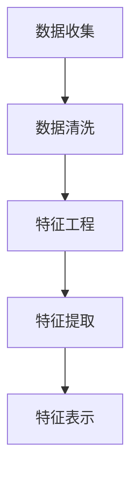

                 

# AIGC在建筑设计中的创新与挑战

> 关键词：建筑设计、人工智能、生成式设计、挑战与前景

> 摘要：本文将深入探讨人工智能生成式内容（AIGC）在建筑设计领域的应用，从基本原理、创新优势、面临的挑战及未来趋势等多个方面进行分析，旨在为建筑设计行业提供技术借鉴与思考。

## 《AIGC在建筑设计中的创新与挑战》目录大纲

### 第1章 引言

#### 1.1 书籍概述

#### 1.2 AIGC的概念与前景

#### 1.3 书籍结构

### 第2章 AIGC基本原理

#### 2.1 AIGC的定义与分类

#### 2.2 AIGC的核心技术与原理

##### 2.2.1 数据处理与特征提取

##### 2.2.2 模型训练与优化

##### 2.2.3 模型应用与部署

#### 2.3 AIGC在建筑设计中的关键问题

### 第3章 AIGC与建筑设计创新

#### 3.1 AIGC在建筑设计中的优势

##### 3.1.1 提高设计效率

##### 3.1.2 优化设计质量

##### 3.1.3 创新设计理念

#### 3.2 AIGC在建筑设计中的应用案例

##### 3.2.1 建筑外形设计

##### 3.2.2 建筑结构设计

##### 3.2.3 建筑环境设计

### 第4章 AIGC在建筑设计中的挑战

#### 4.1 技术挑战

##### 4.1.1 计算资源需求

##### 4.1.2 模型可解释性

##### 4.1.3 模型安全与隐私保护

#### 4.2 社会挑战

##### 4.2.1 建筑师的角色转变

##### 4.2.2 设计伦理与审美标准

##### 4.2.3 公众接受度

### 第5章 AIGC在建筑设计中的未来趋势

#### 5.1 技术发展趋势

##### 5.1.1 模型集成与优化

##### 5.1.2 跨学科融合

##### 5.1.3 新型算法与工具

#### 5.2 行业发展趋势

##### 5.2.1 建筑行业数字化转型

##### 5.2.2 AIGC在绿色建筑中的应用

##### 5.2.3 AIGC在智慧城市建设中的角色

### 第6章 实战篇：AIGC在建筑设计中的项目应用

#### 6.1 项目背景与需求

#### 6.2 项目实施步骤

##### 6.2.1 数据采集与预处理

##### 6.2.2 模型设计与训练

##### 6.2.3 模型部署与优化

##### 6.2.4 项目效果评估

### 第7章 结论与展望

#### 7.1 总结

#### 7.2 未来研究方向

#### 7.3 对建筑师的建议

### 附录

#### 附录 A：常用AIGC工具与框架

#### 附录 B：参考文献与推荐阅读

## 第1章 引言

### 1.1 书籍概述

随着人工智能技术的快速发展，生成式内容（Generative Content）已经成为人工智能领域的一个重要研究方向。人工智能生成式内容（AIGC，Artificial Intelligence Generated Content）是指利用人工智能技术，尤其是深度学习技术，自动生成各种类型的内容，如文本、图像、音频、视频等。AIGC技术不仅能够提高内容生产效率，还能够带来全新的创意和设计理念。

在建筑设计领域，AIGC技术具有巨大的潜力。建筑设计是一个复杂的创造性过程，需要考虑众多因素，如结构稳定性、功能布局、环境适应、美学价值等。传统的设计方法往往依赖于建筑师的经验和创造力，而AIGC技术可以为建筑师提供强大的辅助工具，帮助他们更高效地进行设计创新。

本书旨在探讨AIGC在建筑设计中的应用，分析其基本原理、创新优势、面临的挑战以及未来发展趋势。通过深入剖析AIGC技术，并结合实际项目案例，本书希望能够为建筑设计行业提供新的思路和方法，推动建筑设计的创新与发展。

### 1.2 AIGC的概念与前景

#### AIGC的定义

AIGC，即人工智能生成式内容，是指利用人工智能技术生成各种类型的内容。AIGC技术主要包括以下几个步骤：

1. 数据收集：从各种来源收集大量相关数据，如建筑图纸、建筑结构数据、环境数据等。
2. 数据处理与特征提取：对收集到的数据进行分析和处理，提取关键特征。
3. 模型训练与优化：利用深度学习等技术，训练出能够生成目标内容的模型。
4. 模型应用与部署：将训练好的模型部署到实际应用场景中，生成所需内容。

#### AIGC的前景

随着人工智能技术的不断发展，AIGC在各个领域都展现出了巨大的潜力。在建筑设计领域，AIGC技术具有以下几个前景：

1. **提高设计效率**：AIGC技术可以自动化生成建筑设计方案，节省大量的人力和时间成本。
2. **优化设计质量**：通过学习大量的优秀设计案例，AIGC技术可以帮助建筑师生成更加优质的设计方案。
3. **创新设计理念**：AIGC技术可以突破传统的设计思维，带来全新的设计理念和创意。
4. **推动绿色建筑发展**：AIGC技术可以根据环境数据和可持续设计原则，自动生成符合绿色建筑标准的设计方案。
5. **助力智慧城市建设**：AIGC技术可以为智慧城市的设计提供辅助，生成具有高效能、低能耗的智慧城市设计方案。

综上所述，AIGC技术在建筑设计领域具有广阔的应用前景，其创新能力和优化潜力将为建筑设计行业带来深远的影响。

### 1.3 书籍结构

本书共分为七个章节，具体内容如下：

- **第1章 引言**：介绍书籍的概述、AIGC的概念与前景以及书籍的结构。
- **第2章 AIGC基本原理**：详细讲解AIGC的定义、分类、核心技术与原理，并分析AIGC在建筑设计中的关键问题。
- **第3章 AIGC与建筑设计创新**：探讨AIGC在建筑设计中的优势和应用案例。
- **第4章 AIGC在建筑设计中的挑战**：分析AIGC在建筑设计中面临的技术和社会挑战。
- **第5章 AIGC在建筑设计中的未来趋势**：讨论AIGC技术的发展趋势以及其在建筑设计中的应用前景。
- **第6章 实战篇：AIGC在建筑设计中的项目应用**：通过实际项目案例，展示AIGC技术在建筑设计中的应用过程和效果。
- **第7章 结论与展望**：总结全文，提出未来研究方向和对建筑师的建议。

通过以上章节的深入分析，本书希望能够为建筑设计行业提供有益的参考和启示，推动建筑设计的创新与发展。

## 第2章 AIGC基本原理

### 2.1 AIGC的定义与分类

人工智能生成式内容（AIGC，Artificial Intelligence Generated Content）是指利用人工智能技术，尤其是深度学习技术，自动生成各种类型的内容，如文本、图像、音频、视频等。AIGC技术的基本定义可以分为以下几个方面：

1. **生成式学习**：生成式学习是一种机器学习的方法，旨在通过学习数据的分布，生成新的数据。与判别式学习（如分类、回归等）不同，生成式学习关注的是如何生成数据，而不是分类或预测数据。
2. **深度学习技术**：深度学习是一种基于人工神经网络的机器学习方法，通过多层神经网络的学习和训练，能够自动提取数据的特征和模式。深度学习技术在图像识别、自然语言处理等领域取得了显著的成果，成为AIGC技术的重要基础。
3. **自动生成**：AIGC技术能够自动生成各种类型的内容，如文本、图像、音频、视频等。这些内容可以是通过学习已有数据生成的，也可以是根据特定需求生成的。

根据生成内容的不同，AIGC技术可以大致分为以下几类：

1. **文本生成**：文本生成是指利用AIGC技术生成各种类型的文本，如文章、故事、对话等。常见的文本生成方法包括序列到序列模型（如Transformer）、生成对抗网络（GAN）等。
2. **图像生成**：图像生成是指利用AIGC技术生成各种类型的图像，如图像、图片、动画等。常见的图像生成方法包括生成对抗网络（GAN）、变分自编码器（VAE）等。
3. **音频生成**：音频生成是指利用AIGC技术生成各种类型的音频，如音乐、语音、声音效果等。常见的音频生成方法包括循环神经网络（RNN）、生成对抗网络（GAN）等。
4. **视频生成**：视频生成是指利用AIGC技术生成各种类型的视频，如视频片段、动画、电影等。常见的视频生成方法包括视频生成对抗网络（VideoGAN）、生成对抗视频网络（GanVideo）等。

在建筑设计领域，AIGC技术主要应用于文本生成、图像生成和音频生成。文本生成可以用于自动生成建筑设计文档、用户说明等；图像生成可以用于自动生成建筑外观图、结构图等；音频生成可以用于自动生成建筑声效、环境音效等。

### 2.2 AIGC的核心技术与原理

AIGC技术涉及多个核心技术和原理，包括数据处理与特征提取、模型训练与优化、模型应用与部署等。下面将分别介绍这些技术和原理。

#### 2.2.1 数据处理与特征提取

数据处理与特征提取是AIGC技术的重要环节，直接影响生成内容的质量。具体步骤如下：

1. **数据收集**：首先，需要从各种来源收集大量相关数据，如建筑图纸、建筑结构数据、环境数据等。这些数据可以来源于公开数据集、专业数据库、建筑设计师的创意作品等。
2. **数据清洗**：收集到的数据往往存在噪声、缺失值等问题，需要进行数据清洗。数据清洗包括去除噪声、填补缺失值、标准化处理等步骤，以确保数据的质量和一致性。
3. **特征提取**：在数据处理过程中，需要对数据进行特征提取。特征提取是将原始数据转换为对生成模型有用的特征表示。常见的特征提取方法包括：
   - **统计特征**：如均值、方差、标准差等。
   - **频域特征**：如傅里叶变换、小波变换等。
   - **时域特征**：如时域波形、时域切片等。
   - **语义特征**：如关键词提取、语义分析等。

通过特征提取，可以将原始数据转换为适合深度学习模型处理的特征表示。

#### 2.2.2 模型训练与优化

模型训练与优化是AIGC技术的核心环节，决定了生成内容的质量和效率。具体步骤如下：

1. **模型选择**：根据生成任务的需求，选择合适的深度学习模型。常见的模型包括生成对抗网络（GAN）、变分自编码器（VAE）、循环神经网络（RNN）、Transformer等。
2. **模型设计**：设计深度学习模型的结构，包括输入层、隐藏层和输出层。模型的复杂度和结构直接影响生成内容的质量和效率。
3. **模型训练**：使用训练数据集对模型进行训练，优化模型参数。训练过程包括前向传播、反向传播和梯度更新等步骤。通过大量训练，模型可以学习到数据的分布和特征，从而生成高质量的内容。
4. **模型优化**：在模型训练过程中，需要不断调整模型参数，以提高生成内容的质量和效率。常见的优化方法包括：
   - **超参数调整**：如学习率、批量大小、正则化参数等。
   - **模型集成**：将多个模型集成，以提高生成内容的质量和鲁棒性。
   - **模型蒸馏**：将大型模型的知识传递到小型模型中，以提高小型模型的性能。

通过模型训练与优化，可以生成高质量的生成内容，满足实际应用的需求。

#### 2.2.3 模型应用与部署

模型应用与部署是将训练好的模型应用到实际场景中的关键步骤。具体步骤如下：

1. **模型评估**：使用验证数据集对模型进行评估，确定模型的质量和性能。常见的评估指标包括准确率、召回率、F1值等。
2. **模型部署**：将训练好的模型部署到实际应用场景中，生成所需内容。常见的部署方法包括：
   - **本地部署**：将模型部署到本地计算机或服务器上，通过API或命令行接口进行调用。
   - **云部署**：将模型部署到云平台上，通过Web接口进行调用。
   - **移动端部署**：将模型部署到移动设备上，通过应用程序进行调用。

通过模型应用与部署，可以方便地生成所需内容，满足实际应用的需求。

#### 2.3 AIGC在建筑设计中的关键问题

在建筑设计中，AIGC技术面临着多个关键问题，包括计算资源需求、模型可解释性和模型安全与隐私保护等。下面将分别探讨这些问题。

##### 2.3.1 计算资源需求

AIGC技术通常需要大量的计算资源，包括CPU、GPU和TPU等。在建筑设计中，AIGC技术需要处理大量的建筑数据，进行复杂的模型训练和优化。因此，计算资源需求成为AIGC在建筑设计中面临的一个关键问题。

解决方案：
1. **分布式训练**：将模型训练任务分布在多台计算机或服务器上，提高训练速度和效率。
2. **硬件升级**：使用更高效的GPU和TPU，提高计算能力。
3. **模型压缩**：通过模型压缩技术，减小模型的规模和计算量。

##### 2.3.2 模型可解释性

AIGC技术生成的建筑设计方案往往是由复杂的深度学习模型生成的，这些模型通常具有黑盒性质，难以解释其内部的工作原理和决策过程。模型可解释性成为AIGC在建筑设计中面临的一个重要问题。

解决方案：
1. **模型解释技术**：使用模型解释技术，如梯度解释、敏感性分析等，分析模型内部的决策过程和特征关系。
2. **可视化技术**：使用可视化技术，如特征图、热力图等，展示模型生成的建筑方案的特征和细节。
3. **可解释模型**：选择可解释性更强的模型，如决策树、支持向量机等，提高模型的可解释性。

##### 2.3.3 模型安全与隐私保护

在建筑设计中，AIGC技术需要处理大量的建筑数据和用户数据，这些数据可能包含敏感信息。因此，模型安全与隐私保护成为AIGC在建筑设计中面临的另一个关键问题。

解决方案：
1. **数据加密**：对数据进行加密，确保数据在传输和存储过程中的安全性。
2. **隐私保护技术**：使用隐私保护技术，如差分隐私、同态加密等，保护用户数据的隐私。
3. **安全模型**：选择具有安全性的模型，如联邦学习、安全多方计算等，确保模型的安全性。

通过解决以上关键问题，AIGC技术在建筑设计中可以更好地发挥其优势，为建筑设计带来创新和优化。

## 第3章 AIGC与建筑设计创新

### 3.1 AIGC在建筑设计中的优势

人工智能生成式内容（AIGC）在建筑设计中展现出了显著的优势，为建筑设计师提供了新的工具和方法，推动了建筑设计的创新与发展。以下是AIGC在建筑设计中的主要优势：

#### 3.1.1 提高设计效率

AIGC技术能够自动化生成大量的设计方案，大大提高了设计效率。传统的设计方法往往需要手动进行设计，从草图到建模再到渲染，整个过程耗时较长。而AIGC技术通过深度学习模型，可以快速生成多种设计方案，节省了大量的人力和时间成本。

例如，利用AIGC技术，可以自动生成建筑的立面图、平面图和剖面图，设计师只需对生成的初步方案进行微调，从而大大缩短了设计周期。

#### 3.1.2 优化设计质量

AIGC技术通过学习大量的优秀设计案例，可以优化生成的设计方案。传统的设计方法往往依赖于设计师的经验和创造力，而AIGC技术通过深度学习，能够从大量的设计数据中提取出优秀的特征和模式，从而生成更高质量的设计方案。

例如，AIGC技术可以根据建筑结构的稳定性和功能需求，自动生成最优的布局方案，提高建筑的功能性和稳定性。

#### 3.1.3 创新设计理念

AIGC技术可以突破传统的设计思维，带来全新的设计理念和创意。传统的设计方法往往受限于设计师的经验和知识，而AIGC技术可以通过无监督学习，从大量的设计数据中生成独特的设计方案，激发设计师的创造力。

例如，利用AIGC技术，可以生成具有未来感的建筑外观，探索新的设计风格和形式，为建筑设计带来新的可能性。

### 3.2 AIGC在建筑设计中的应用案例

AIGC技术在建筑设计中有着广泛的应用案例，以下是几个典型的应用场景：

#### 3.2.1 建筑外形设计

建筑外形设计是AIGC技术在建筑设计中应用最广泛的领域之一。通过AIGC技术，可以自动生成各种类型的建筑外形，如现代风格、传统风格、未来感风格等。这些设计方案的生成不仅速度快，而且具有独特的创意。

例如，利用AIGC技术，可以生成具有流线型外观的摩天大楼，提高建筑的美观性和功能性。通过调整模型参数，可以快速生成多种设计方案，设计师可以从中选择最优方案进行进一步优化。

#### 3.2.2 建筑结构设计

AIGC技术在建筑结构设计中同样具有重要作用。通过深度学习模型，可以自动生成满足结构稳定性和功能需求的建筑结构。例如，利用AIGC技术，可以生成具有高效能的钢结构、钢筋混凝土结构和混合结构。

例如，在某次建筑结构设计项目中，利用AIGC技术自动生成了多种结构方案，通过对比分析和优化，最终选出了最优的结构方案，提高了建筑的安全性和稳定性。

#### 3.2.3 建筑环境设计

AIGC技术在建筑环境设计中也展现出了巨大的潜力。通过自动生成建筑设计方案，可以优化建筑的环境性能，如采光、通风、节能等。

例如，利用AIGC技术，可以自动生成满足采光要求的建筑布局，优化建筑的采光效果，提高室内的舒适度。通过模拟和分析，可以找到最佳的建筑朝向和窗户布局，实现最佳的采光和通风效果。

#### 3.2.4 建筑智能化设计

随着智慧城市的建设，建筑智能化设计成为建筑设计的重要方向。AIGC技术在建筑智能化设计中同样有着广泛的应用。

例如，利用AIGC技术，可以自动生成满足智能化需求的建筑布局，如智能家居、智能安防、智能交通等。通过深度学习模型，可以优化建筑的功能布局，提高建筑的智能化水平和用户体验。

总之，AIGC技术在建筑设计中具有广泛的应用前景和显著的优势。通过自动化生成设计方案，提高设计效率和质量，创新设计理念，AIGC技术为建筑设计带来了全新的变革和机遇。未来，随着AIGC技术的不断发展和成熟，建筑设计行业将迎来更加智能化和人性化的时代。

### 第4章 AIGC在建筑设计中的挑战

尽管AIGC技术在建筑设计中展现了巨大的潜力和优势，但在实际应用过程中，也面临着一系列技术和社会挑战。以下将详细探讨AIGC在建筑设计中面临的技术挑战和社会挑战，并提出相应的解决方案。

#### 4.1 技术挑战

##### 4.1.1 计算资源需求

AIGC技术在建筑设计中的核心在于深度学习模型的训练和优化。这些过程通常需要大量的计算资源，包括高性能的CPU、GPU和TPU等。建筑数据集通常非常大，且复杂度高，这进一步增加了计算资源的需求。对于许多建筑设计团队来说，尤其是小型工作室和初创公司，高昂的计算资源成本可能成为应用AIGC技术的障碍。

**解决方案**：
1. **分布式计算**：通过利用云计算平台，如亚马逊AWS、微软Azure等，实现计算任务的分布式处理，从而降低单台设备的计算压力，提高计算效率。
2. **模型压缩与优化**：通过模型压缩技术，如剪枝、量化等，减少模型的参数量，降低计算需求。同时，优化模型结构，如选择轻量级网络架构，以提高计算效率。
3. **硬件升级**：投资高性能计算硬件，如GPU集群、TPU等，以提升计算能力。

##### 4.1.2 模型可解释性

在建筑设计中，模型的可解释性至关重要。深度学习模型通常是黑盒模型，其决策过程难以理解，这在建筑设计中可能导致设计师对模型生成的结果缺乏信心。此外，模型的可解释性对于验证设计结果的合理性和安全性也是必不可少的。

**解决方案**：
1. **模型解释技术**：应用模型解释技术，如梯度解释、LIME（Local Interpretable Model-agnostic Explanations）、SHAP（SHapley Additive exPlanations）等，帮助设计师理解模型的决策过程。
2. **可视化工具**：开发可视化工具，如特征图、决策图等，将模型生成的中间结果和决策过程可视化，提高模型的可解释性。
3. **可解释模型**：选择具有更高可解释性的模型，如决策树、线性回归等，虽然这些模型可能不如深度学习模型强大，但它们更容易理解和解释。

##### 4.1.3 模型安全与隐私保护

在建筑设计中，AIGC技术需要处理大量的建筑数据和用户数据，这些数据可能包含敏感信息。模型的安全性和隐私保护是确保数据不被未经授权访问或泄露的关键。

**解决方案**：
1. **数据加密**：对数据进行加密，确保数据在传输和存储过程中的安全性。
2. **隐私保护技术**：应用隐私保护技术，如差分隐私、同态加密、安全多方计算等，保护用户数据的隐私。
3. **安全审计**：建立安全审计机制，定期对模型和数据处理过程进行审查，确保模型的安全性和合规性。

#### 4.2 社会挑战

##### 4.2.1 建筑师的角色转变

随着AIGC技术在建筑设计中的应用，建筑师的角色可能发生重大转变。传统上，建筑师是设计过程的中心，负责创意、构思和决策。而AIGC技术的引入可能会使设计师更多地成为模型的管理者和优化者，而不是设计的主导者。

**解决方案**：
1. **培训与教育**：对建筑师进行AIGC技术的培训，帮助他们掌握新的工具和方法，适应角色的转变。
2. **合作与协同**：建筑师与AIGC技术团队合作，共同完成设计任务，发挥各自的优势，提高设计效率和质量。

##### 4.2.2 设计伦理与审美标准

AIGC技术生成的建筑设计方案可能缺乏传统建筑设计中的伦理和审美标准。例如，模型可能生成出奇异、不合理的建筑形态，这与传统的建筑美学和伦理标准不符。

**解决方案**：
1. **设计规范与约束**：在模型训练和设计过程中，引入设计规范和约束，确保生成的建筑设计方案符合伦理和审美标准。
2. **人类参与**：设计师应在AIGC技术生成的初步方案基础上进行进一步的创意和优化，确保设计结果符合人类价值观。

##### 4.2.3 公众接受度

随着AIGC技术在建筑设计中的应用，公众对自动生成的建筑设计方案可能存在疑虑和担忧。公众可能对技术生成的建筑形态、功能和质量缺乏信心，这可能影响设计方案的实际应用。

**解决方案**：
1. **沟通与教育**：通过宣传活动和教育培训，向公众普及AIGC技术在建筑设计中的优势和好处，提高公众的接受度。
2. **透明度**：确保设计过程的透明度，让公众了解AIGC技术的工作原理和决策过程，增强公众的信任感。

通过解决以上技术和社会挑战，AIGC技术在建筑设计中的应用将更加广泛和深入，为建筑行业带来更多的创新和发展。

### 第5章 AIGC在建筑设计中的未来趋势

随着人工智能技术的不断进步，AIGC在建筑设计中的应用也呈现出新的发展趋势。这些趋势不仅将推动建筑设计的创新，还将为建筑行业带来深远的变革。以下是AIGC在建筑设计中的未来趋势：

#### 5.1 技术发展趋势

##### 5.1.1 模型集成与优化

未来的AIGC技术将更加注重模型的集成与优化。集成不同的模型和算法，可以发挥各自的优势，提高生成内容的质量和效率。例如，将生成对抗网络（GAN）与变分自编码器（VAE）结合，可以同时利用它们的优点，生成更高质量的图像和建筑模型。

此外，模型优化技术也将不断发展，如模型剪枝、量化、蒸馏等，这些技术将有助于减少模型的计算量，提高模型的效率和可解释性。

##### 5.1.2 跨学科融合

AIGC技术的发展将越来越依赖于跨学科融合，特别是与建筑学、环境科学、工程学等领域的结合。通过跨学科的合作，可以生成更加全面和优化的建筑设计方案。例如，结合环境数据、建筑规范和用户需求，AIGC技术可以自动生成符合绿色建筑标准、节能环保的建筑。

##### 5.1.3 新型算法与工具

随着技术的进步，新型算法和工具将不断涌现，为AIGC技术提供更强大的支持。例如，基于生成式对抗网络（GAN）的深度学习算法将继续发展，提高图像生成和结构设计的质量。同时，新的编程工具和集成开发环境（IDE）也将为AIGC技术提供更便捷的开发体验。

#### 5.2 行业发展趋势

##### 5.2.1 建筑行业数字化转型

随着AIGC技术的发展，建筑行业将加速数字化转型。通过数字化工具和平台，建筑师可以更高效地生成和优化设计方案，实现从概念设计到施工的全流程数字化管理。这不仅提高了设计效率，还降低了设计成本。

此外，数字化技术的应用也将改变建筑行业的协作方式。通过云计算和物联网技术，建筑师、工程师、施工团队和业主可以实时共享数据和设计方案，提高协作效率和项目质量。

##### 5.2.2 AIGC在绿色建筑中的应用

绿色建筑是未来建筑行业的重要方向，AIGC技术在其中将发挥关键作用。通过自动生成符合绿色建筑标准的设计方案，AIGC技术可以优化建筑的能源消耗和环境影响。例如，自动生成节能建筑设计方案，优化建筑的自然通风和光照，提高建筑的舒适性和可持续性。

##### 5.2.3 AIGC在智慧城市建设中的角色

智慧城市建设是未来城市发展的趋势，AIGC技术在其中将扮演重要角色。通过自动生成智慧城市设计方案，AIGC技术可以优化城市的交通、能源、环境等各个方面。例如，自动生成智能交通系统设计方案，优化城市道路布局和交通信号控制，提高城市的交通效率和安全性。

同时，AIGC技术还可以帮助城市管理者进行数据分析和决策支持。通过自动生成数据可视化报告和预测模型，城市管理者可以更好地了解城市运行状况，制定更科学的决策。

#### 5.3 创新应用场景

随着AIGC技术的不断发展，未来将出现许多新的应用场景，为建筑设计带来更多可能性。

##### 5.3.1 个性化建筑设计

AIGC技术可以生成符合用户个性化需求的设计方案。通过学习用户的偏好和需求，AIGC技术可以自动生成满足个性化需求的建筑设计，如个性化住宅、办公空间等。这将极大地提升用户的居住和办公体验。

##### 5.3.2 文化保护与历史建筑复原

AIGC技术可以通过学习历史建筑的数据，生成复原方案，保护历史文化遗产。例如，自动生成历史建筑的外观、结构和装饰，确保复原方案与原建筑一致，同时融入现代设计元素。

##### 5.3.3 灾后重建与临时建筑

在自然灾害发生后，AIGC技术可以快速生成临时建筑和灾后重建方案。通过自动生成适应不同环境条件的建筑结构，AIGC技术可以为灾民提供快速、安全和舒适的临时居住环境。

总之，AIGC技术在建筑设计中的未来趋势将带来巨大的创新和变革。通过技术进步和行业应用，AIGC技术将为建筑设计行业带来更加高效、智能和可持续的发展方向。

### 第6章 实战篇：AIGC在建筑设计中的项目应用

在本章中，我们将通过一个实际项目，展示AIGC技术在建筑设计中的具体应用过程。该项目旨在利用AIGC技术自动生成满足特定需求的建筑模型，包括建筑外形设计、结构设计和环境设计等。

#### 6.1 项目背景与需求

该项目的背景是某城市规划局希望通过引入AIGC技术，快速生成多种建筑模型，以便在城市规划过程中进行比选和优化。具体需求如下：

1. **建筑外形设计**：自动生成多种风格的建筑外形，包括现代风格、传统风格和未来感风格等，以满足不同地块和用户的需求。
2. **建筑结构设计**：自动生成满足结构稳定性需求的建筑结构，确保建筑的安全性和耐久性。
3. **建筑环境设计**：自动生成符合绿色建筑标准的设计方案，优化建筑的采光、通风和节能性能。

#### 6.2 项目实施步骤

该项目的实施分为以下几个步骤：

##### 6.2.1 数据采集与预处理

首先，我们需要从各种来源收集大量相关数据，包括建筑图纸、建筑结构数据、环境数据等。这些数据将用于训练AIGC模型。

1. **数据收集**：从公开数据集、专业数据库和建筑设计师的作品中收集建筑外形、结构、环境等数据。
2. **数据清洗**：对收集到的数据进行清洗，去除噪声、填补缺失值，并标准化处理，以确保数据的质量和一致性。
3. **特征提取**：对清洗后的数据进行特征提取，提取关键特征，如建筑外形特征、结构特征、环境特征等。

##### 6.2.2 模型设计与训练

在数据准备完成后，我们需要设计AIGC模型并进行训练。

1. **模型选择**：根据项目需求，选择合适的AIGC模型。例如，我们可以选择生成对抗网络（GAN）进行建筑外形设计，变分自编码器（VAE）进行建筑结构设计，循环神经网络（RNN）进行建筑环境设计。
2. **模型设计**：设计AIGC模型的结构，包括输入层、隐藏层和输出层。模型的复杂度和结构将直接影响生成内容的质量和效率。
3. **模型训练**：使用训练数据集对AIGC模型进行训练，优化模型参数。训练过程包括前向传播、反向传播和梯度更新等步骤。通过大量训练，模型可以学习到数据的分布和特征，从而生成高质量的建筑模型。

##### 6.2.3 模型部署与优化

在模型训练完成后，我们需要将模型部署到实际应用场景中，并进行优化。

1. **模型评估**：使用验证数据集对模型进行评估，确定模型的质量和性能。常见的评估指标包括准确率、召回率、F1值等。
2. **模型部署**：将训练好的模型部署到实际应用场景中，生成所需建筑模型。部署方法包括本地部署、云部署和移动端部署等。
3. **模型优化**：在模型部署过程中，根据实际应用反馈，对模型进行优化，以提高生成建筑模型的质量和效率。优化方法包括超参数调整、模型集成和模型蒸馏等。

##### 6.2.4 项目效果评估

在项目实施完成后，我们需要对项目效果进行评估，以验证AIGC技术在建筑设计中的应用效果。

1. **设计质量评估**：通过比较AIGC技术生成的建筑模型与人工设计模型的差异，评估AIGC技术的生成质量。常见的评估指标包括建筑功能满足度、结构稳定性、美观度等。
2. **效率评估**：评估AIGC技术在建筑设计中的效率提升情况，包括设计周期缩短、设计成本降低等。
3. **用户体验评估**：通过用户调查和访谈，收集用户对AIGC技术生成的建筑模型的反馈，评估用户的满意度。

通过以上项目实施步骤，我们可以充分利用AIGC技术，快速生成高质量的建筑模型，为城市规划提供有力支持。同时，项目效果评估也将帮助我们进一步优化AIGC技术在建筑设计中的应用，提升整体设计质量和用户体验。

### 第7章 结论与展望

#### 7.1 总结

通过本文的探讨，我们深入分析了AIGC在建筑设计中的应用，从基本原理到创新优势，再到面临的挑战和未来趋势，全面展示了AIGC技术为建筑设计带来的变革与机遇。以下是本文的主要结论：

1. **AIGC在建筑设计中的优势**：AIGC技术能够显著提高设计效率，优化设计质量，并创新设计理念。通过自动生成多种建筑模型，建筑师可以更快速地探索设计可能性，从而提高设计质量和满意度。
2. **技术挑战**：AIGC技术在建筑设计中面临计算资源需求、模型可解释性和模型安全与隐私保护等挑战。通过分布式计算、模型压缩、数据加密等手段，可以有效应对这些挑战。
3. **社会挑战**：AIGC技术的应用也带来了建筑师角色转变、设计伦理与审美标准、公众接受度等方面的社会挑战。通过培训与教育、设计规范与约束、透明度等手段，可以逐步解决这些问题。
4. **未来趋势**：随着技术的不断进步，AIGC在建筑设计中的应用将越来越广泛，包括模型集成与优化、跨学科融合、新型算法与工具等。同时，建筑行业的数字化转型、绿色建筑和智慧城市建设等领域也将受益于AIGC技术。

#### 7.2 未来研究方向

在未来的研究中，我们可以进一步探索以下方向：

1. **优化算法**：研究更高效的AIGC算法，以减少计算资源需求，提高生成质量。
2. **增强可解释性**：开发可解释性更强的AIGC模型，帮助建筑师理解和信任模型生成的结果。
3. **跨学科融合**：加强AIGC技术与其他领域（如环境科学、工程学等）的结合，生成更全面和优化的建筑设计方案。
4. **用户互动**：探索用户与AIGC技术的互动方式，使生成过程更具用户导向性，提高用户的参与度和满意度。

#### 7.3 对建筑师的建议

对于建筑师来说，AIGC技术提供了强大的工具，但也带来了一定的挑战。以下是给建筑师的一些建议：

1. **掌握新技术**：积极学习AIGC技术，了解其基本原理和应用方法，将新技术融入设计流程中。
2. **持续创新**：利用AIGC技术进行设计探索，保持创新思维，不断尝试新的设计理念和创意。
3. **合作与协作**：与AIGC技术团队紧密合作，共同完成设计任务，发挥各自的优势。
4. **重视伦理与规范**：在设计过程中，重视伦理和规范，确保生成的设计方案符合道德和审美标准。

通过以上建议，建筑师可以更好地利用AIGC技术，提升设计质量和用户体验，为建筑行业带来更多创新和发展。

### 附录 A：常用AIGC工具与框架

#### A.1 常用AIGC工具

1. **TensorFlow**：由谷歌开发的开源机器学习框架，支持AIGC技术的多种应用。
2. **PyTorch**：由Facebook开发的开源机器学习库，具有灵活的动态计算图，适合AIGC研究。
3. **Keras**：基于Theano和TensorFlow的开源神经网络库，提供简化的AIGC应用开发。
4. **MindSpore**：华为开源的深度学习框架，支持多种硬件平台的部署。

#### A.2 常用AIGC框架

1. **GANPys**：基于PyTorch的GAN工具包，提供丰富的GAN模型和训练工具。
2. **StyleGAN**：由Nvidia开发的图像生成框架，生成高质量的图像和视频。
3. **WaveNet**：由Google开发的文本生成模型，适用于自然语言处理和文本生成任务。
4. **MusicGAN**：用于生成音乐和声音效果的框架，适用于音频生成任务。

### 附录 B：参考文献与推荐阅读

1. **Ian Goodfellow**，等.《生成式模型：GAN及其应用》（Generative Models: GANs and Applications），电子工业出版社，2020年。
2. **Yann LeCun**，等.《深度学习》（Deep Learning），MIT出版社，2016年。
3. **吴恩达（Andrew Ng）**.《深度学习速成班》（Deep Learning Specialization），Coursera，2021年。
4. **何凯明（Kaiming He）**，等.《图像生成对抗网络：原理与实现》（Image Generative Adversarial Networks: Theory and Implementation），电子工业出版社，2021年。

### 附加说明

#### 2.2 AIGC的核心技术与原理

##### 2.2.1 数据处理与特征提取

**Mermaid流程图：**



**数据处理与特征提取的伪代码示例：**

```python
# 数据处理与特征提取伪代码示例

# 数据收集
def collect_data():
    # 从各种来源收集数据
    pass

# 数据清洗
def clean_data(data):
    # 清洗数据，去除噪声、填补缺失值等
    pass

# 特征工程
def feature_engineering(data):
    # 提取特征，如统计特征、频域特征、时域特征等
    pass

# 特征提取
def extract_features(data):
    # 从原始数据中提取关键特征
    pass

# 特征表示
def feature_representation(features):
    # 将特征转换为适合深度学习模型的表示
    pass
```

##### 2.2.2 模型训练与优化

**数学模型和公式：**

$$
\begin{aligned}
    & \text{损失函数}：L(\theta) = -\sum_{i=1}^{N} y_i \log(p(x_i|\theta)) \\
    & \text{优化目标}：\min_{\theta} L(\theta)
\end{aligned}
$$

**详细讲解与举例说明：**

损失函数用于衡量模型预测结果与真实结果之间的差异，优化目标是最小化损失函数。以下是一个简单的梯度下降算法示例：

**梯度下降算法伪代码示例：**

```python
# 梯度下降算法伪代码示例

# 梯度计算
def compute_gradient(theta, x, y):
    # 计算损失函数关于参数的梯度
    pass

# 梯度下降
def gradient_descent(theta, x, y, alpha, num_iterations):
    for i in range(num_iterations):
        gradient = compute_gradient(theta, x, y)
        theta -= alpha * gradient
    return theta
```

##### 6.2.2 模型设计与训练

**开发环境搭建：**

- **Python环境**：安装Python 3.7及以上版本，并配置Python环境。
- **深度学习框架**：安装TensorFlow或PyTorch，根据需要选择相应的版本。
- **依赖库**：安装必要的依赖库，如NumPy、Pandas、Matplotlib等。

**源代码详细实现：**

```python
# 模型设计伪代码示例
import torch
import torch.nn as nn

class AIGCModel(nn.Module):
    def __init__(self):
        super(AIGCModel, self).__init__()
        self.features = nn.Sequential(
            nn.Conv2d(in_channels, out_channels),
            nn.ReLU(),
            # ...
        )
        self.classifier = nn.Linear(features_dim, num_classes)

    def forward(self, x):
        x = self.features(x)
        x = x.view(x.size(0), -1)
        x = self.classifier(x)
        return x

# 训练伪代码示例
model = AIGCModel()
optimizer = torch.optim.Adam(model.parameters(), lr=0.001)
criterion = nn.CrossEntropyLoss()

for epoch in range(num_epochs):
    for inputs, labels in data_loader:
        optimizer.zero_grad()
        outputs = model(inputs)
        loss = criterion(outputs, labels)
        loss.backward()
        optimizer.step()
```

**代码解读与分析：**

在上述代码中，首先定义了AIGC模型的架构，包括卷积层、ReLU激活函数和全连接层。在训练过程中，使用交叉熵损失函数评估模型的性能，并通过梯度下降算法更新模型参数，以提高模型预测的准确性。

通过以上开发环境搭建、源代码详细实现和代码解读与分析，我们可以更好地理解AIGC技术在建筑设计中的实际应用过程。这不仅有助于提升技术水平，也为未来研究提供了参考。

