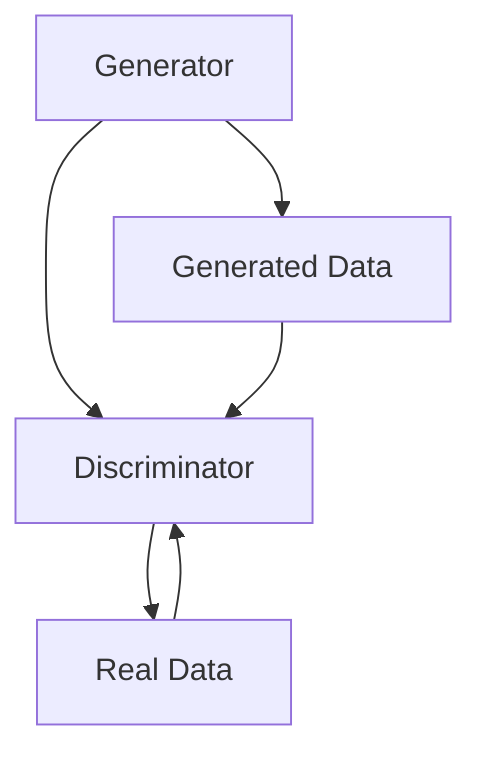
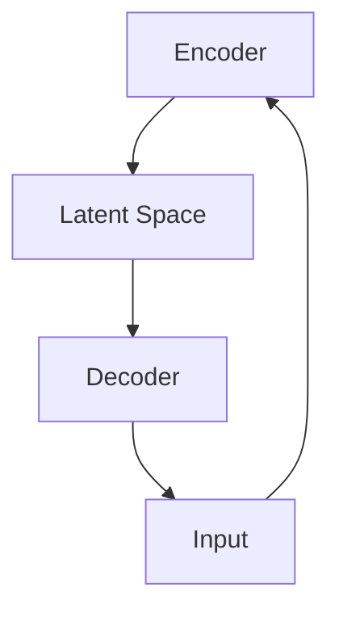
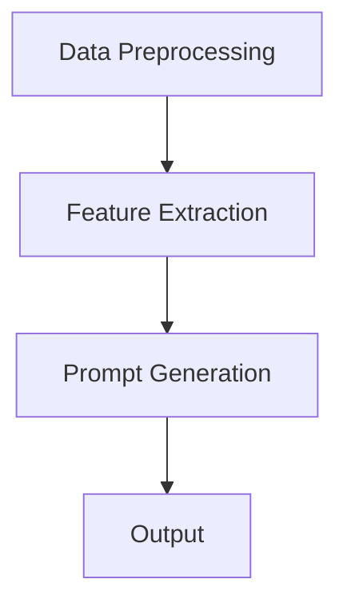

                 

# AIGC语言模型训练与提示词协同设计新趋势

## 关键词
- AIGC
- 语言模型
- 训练
- 提示词
- 协同设计
- 新趋势
- 深度学习
- 自然语言处理

## 摘要
本文将深入探讨AIGC（自适应智能生成内容）语言模型的训练与提示词协同设计。首先，我们将介绍AIGC的基本概念、发展历程和核心技术。接着，分析AIGC语言模型的技术基础，包括自然语言处理、深度学习和大规模预训练模型等。随后，我们将探讨AIGC语言模型的核心算法，如生成对抗网络（GAN）和变分自编码器（VAE）。文章还将详细讨论提示词的概念、生成与优化策略，并通过实际案例展示提示词协同设计的实战方法。最后，展望AIGC与提示词协同设计的新趋势，分析其在人工智能领域的未来应用前景。

### 目录大纲

- 第一部分: AIGC语言模型基础
  - 第1章: AIGC语言模型概述
  - 第2章: AIGC语言模型技术基础
  - 第3章: AIGC语言模型核心算法

- 第二部分: 提示词协同设计
  - 第4章: 提示词的概念与作用
  - 第5章: 提示词生成与优化
  - 第6章: 提示词协同设计实战

- 第三部分: 新趋势展望
  - 第7章: AIGC与提示词协同设计的新趋势

- 附录
  - 附录A: AIGC语言模型训练与提示词协同设计工具与资源

现在，让我们开始深入探讨AIGC语言模型及其与提示词的协同设计。

----------------------------------------------------------------

## 第一部分: AIGC语言模型基础

### 第1章: AIGC语言模型概述

#### 1.1 AIGC概念解析

AIGC（自适应智能生成内容）是一种基于人工智能技术，特别是深度学习的方法，用于生成高质量、自适应的内容。与传统的规则驱动或基于模板的内容生成方法不同，AIGC能够通过学习和理解数据，自主生成各种形式的内容，如文本、图像、音频等。AIGC的核心在于其能够自动适应不同的应用场景和需求，提供定制化的内容生成服务。

#### 1.2 AIGC的发展历程

AIGC的发展历程可以追溯到20世纪80年代，当时的自然语言处理（NLP）研究主要集中在基于规则的系统和模板匹配方法。随着计算能力的提升和大数据的涌现，深度学习技术在NLP领域取得了显著进展。特别是2018年，谷歌发布了BERT模型，标志着大规模预训练模型在NLP领域的崛起。随后，生成对抗网络（GAN）和变分自编码器（VAE）等新型深度学习算法也被广泛应用于AIGC中，推动了AIGC的快速发展。

#### 1.3 AIGC的核心技术

AIGC的核心技术包括自然语言处理、深度学习、大规模预训练模型和自监督学习等。自然语言处理提供了理解、处理和生成文本的基础；深度学习算法，如神经网络，是实现AIGC的关键技术；大规模预训练模型，如BERT、GPT等，为AIGC提供了强大的语言理解和生成能力；自监督学习使模型能够在无监督或半监督的环境下进行训练，提高了模型的泛化能力。

#### 1.4 AIGC的语言模型原理

AIGC的语言模型通常基于深度学习中的自注意力机制，特别是Transformer模型。Transformer模型通过自注意力机制，能够捕捉文本中的长距离依赖关系，从而实现高精度的文本生成。在AIGC中，语言模型不仅用于文本生成，还用于文本理解和分类等任务。通过在大规模语料库上的预训练，语言模型能够学习到丰富的语言知识，从而在特定任务上表现优异。

#### 1.5 AIGC的应用领域与前景

AIGC在多个领域具有广泛的应用前景，包括但不限于：

1. **文本生成与编辑**：自动生成文章、新闻报道、广告文案等，提高内容创作的效率和质量。
2. **对话系统**：构建智能客服、聊天机器人等，提供24/7的客户服务。
3. **内容审核**：自动检测和过滤不良内容，确保平台内容的合规性。
4. **语音识别与转换**：将语音转换为文本，或将一种语言的文本转换为另一种语言的文本。
5. **图像和视频生成**：通过文本描述生成相应的图像或视频，应用于虚拟现实、增强现实等领域。

随着技术的不断进步和应用场景的拓展，AIGC有望在未来成为人工智能领域的重要发展方向。

### 第2章: AIGC语言模型技术基础

#### 2.1 自然语言处理基础

自然语言处理（NLP）是AIGC的核心技术之一，它涉及文本的解析、理解和生成。NLP的基础技术包括：

- **分词**：将文本分割成词或短语，是后续文本处理的重要步骤。
- **词性标注**：为每个词标注其语法属性，如名词、动词等。
- **依存句法分析**：分析词与词之间的依赖关系，理解句子的结构。
- **实体识别与命名实体识别**：识别文本中的特定实体，如人名、地名、组织名等。

这些技术为AIGC提供了理解自然语言的基础，使得模型能够处理和生成符合语法和语义规则的内容。

#### 2.2 深度学习与神经网络

深度学习是AIGC的核心驱动技术，神经网络是其基础。深度学习通过多层神经网络结构，自动学习输入数据中的特征表示，实现复杂的函数映射。以下是深度学习和神经网络的一些关键概念：

- **前向传播**：将输入数据通过神经网络传递到输出，计算每一层的激活值。
- **反向传播**：通过计算损失函数的梯度，更新网络的权重和偏置，优化模型性能。
- **激活函数**：用于引入非线性因素，使神经网络能够建模复杂的非线性关系。
- **优化器**：如SGD、Adam等，用于调整网络参数，加快收敛速度。

#### 2.3 大规模预训练模型原理

大规模预训练模型是AIGC的重要组成部分，通过在大规模语料库上的预训练，模型能够学习到丰富的语言知识，提高在具体任务上的表现。以下是大规模预训练模型的关键原理：

- **预训练**：在大量无标签数据上训练模型，学习通用的语言特征。
- **微调**：在特定任务上使用有标签的数据对模型进行微调，使其适应具体任务。
- **BERT**：是一种双向编码表示模型，通过预训练学习到文本的上下文信息。
- **GPT**：是一种生成预训练模型，通过预训练学习到文本生成的概率分布。

#### 2.4 AIGC中的自监督学习

自监督学习是AIGC中的重要技术，它允许模型在没有大量有标签数据的情况下进行训练。自监督学习的核心思想是利用未标记的数据，通过预测未标记部分来学习有用的特征表示。以下是AIGC中的自监督学习技术：

- **掩码语言模型（MLM）**：在文本数据中随机掩码一部分单词，然后让模型预测这些掩码的单词。
- **掩码图像模型（MIM）**：在图像数据中随机掩码一部分区域，然后让模型预测这些掩码的区域。
- **语言-图像预训练（LIP）**：结合文本和图像数据，进行联合预训练，提高模型在跨模态任务上的表现。

自监督学习为AIGC提供了强大的训练能力，使其能够在各种不同的应用场景中发挥作用。

### 第3章: AIGC语言模型核心算法

#### 3.1 生成对抗网络（GAN）

生成对抗网络（GAN）是AIGC中的一个核心算法，由生成器和判别器两个部分组成。生成器试图生成逼真的数据，而判别器则判断数据是真实还是生成的。以下是GAN的核心原理和架构：

#### 3.1.1 GAN的原理与架构

GAN的工作原理可以概括为以下步骤：

1. **生成器（Generator）**：生成器是一个神经网络，它从随机噪声中生成数据。
2. **判别器（Discriminator）**：判别器是一个神经网络，它判断数据是真实还是生成的。
3. **对抗训练**：生成器和判别器相互对抗，生成器试图生成更逼真的数据，而判别器试图更好地区分真实和生成的数据。
4. **优化**：通过调整生成器和判别器的参数，优化GAN的性能。

GAN的架构如下所示：



#### 3.1.2 GAN的优缺点与应用

GAN的优点包括：

- **强大的数据生成能力**：GAN能够生成高质量、逼真的数据，适用于图像、音频、视频等多种数据类型。
- **无需标注数据**：GAN可以在无监督或半监督的环境下进行训练，减少了对大量有标签数据的依赖。
- **灵活的应用场景**：GAN在各种生成任务中都有广泛应用，如图像修复、图像生成、文本生成等。

GAN的缺点包括：

- **训练不稳定**：GAN的训练过程容易陷入模式崩溃（mode collapse）或梯度消失等问题，导致训练不稳定。
- **计算资源消耗大**：GAN的训练过程需要大量的计算资源，尤其是对于大规模的数据集和复杂的模型架构。

GAN的应用包括：

- **图像生成**：如生成逼真的照片、人脸、风景等。
- **图像修复**：如去除照片中的污点、修复损坏的图像等。
- **文本生成**：如生成文章、对话、摘要等。
- **音频生成**：如生成音乐、语音等。

#### 3.1.3 GAN的变种

为了解决GAN训练中的不稳定性和收敛问题，研究人员提出了多种GAN的变种，如：

- **深度卷积生成对抗网络（DCGAN）**：采用深度卷积神经网络，提高了生成器和判别器的性能。
- **循环一致性GAN（CycleGAN）**：能够将一种风格或内容转换为另一种风格或内容，如将照片转换为油画风格。
- **变分自编码器GAN（VAEGAN）**：结合变分自编码器（VAE）的原理，提高了GAN的稳定性和生成质量。
- **去噪生成对抗网络（DnGan）**：通过引入去噪模块，提高了GAN在噪声数据上的生成能力。

#### 3.2 变分自编码器（VAE）

变分自编码器（VAE）是一种基于概率模型的生成模型，它通过编码器和解码器两个神经网络结构，将输入数据映射到一个潜在空间，并在该空间中进行数据生成。以下是VAE的核心原理和架构：

#### 3.2.1 VAE的原理与架构

VAE的工作原理可以概括为以下步骤：

1. **编码器（Encoder）**：编码器将输入数据映射到一个潜在空间中的向量。
2. **解码器（Decoder）**：解码器从潜在空间中生成与输入数据相同维度的输出数据。
3. **概率分布**：VAE使用概率分布来描述潜在空间中的数据，而不是固定的映射关系。

VAE的架构如下所示：



#### 3.2.2 VAE的优缺点与应用

VAE的优点包括：

- **易于训练**：VAE的训练过程相对稳定，不易陷入梯度消失或模式崩溃等问题。
- **生成多样性**：VAE能够生成具有多样性的数据，特别是在图像生成任务中表现出色。
- **应用广泛**：VAE在各种生成任务中都有广泛应用，如图像生成、文本生成、音频生成等。

VAE的缺点包括：

- **生成质量较低**：相较于GAN，VAE生成的数据质量可能较低，尤其是在复杂细节上。
- **计算资源消耗较大**：VAE的训练过程需要大量的计算资源，特别是对于大规模数据集和复杂的模型架构。

VAE的应用包括：

- **图像生成**：如生成艺术作品、人脸、风景等。
- **图像修复**：如去除照片中的污点、修复损坏的图像等。
- **文本生成**：如生成文章、对话、摘要等。
- **音频生成**：如生成音乐、语音等。

#### 3.2.3 VAE的变种

为了提高VAE的生成质量和训练稳定性，研究人员提出了多种VAE的变种，如：

- **条件变分自编码器（CVAE）**：在VAE的基础上引入条件信息，提高了生成任务的性能。
- **混合变分自编码器（HVAE）**：结合多种变分自编码器结构，提高了生成质量和多样性。
- **自注意力变分自编码器（SVAE）**：引入自注意力机制，提高了模型在处理长序列数据时的性能。

#### 3.3 对抗性训练与半监督学习

对抗性训练和半监督学习是AIGC中的重要技术，它们能够提高模型的训练效率和性能。以下是这些技术的核心原理和优势：

#### 3.3.1 对抗性训练的原理

对抗性训练是指通过训练生成器和判别器两个网络进行相互对抗，以提高生成模型的质量。对抗性训练的核心原理如下：

1. **生成器（Generator）**：生成器从随机噪声中生成与真实数据相似的数据。
2. **判别器（Discriminator）**：判别器判断生成数据是真实还是伪造的。
3. **对抗训练**：通过调整生成器和判别器的参数，使生成器生成更逼真的数据，判别器更好地区分真实和伪造的数据。

对抗性训练的优势包括：

- **提高生成质量**：通过生成器和判别器的相互对抗，生成器能够生成更高质量、更逼真的数据。
- **无需大量有标签数据**：对抗性训练可以在无监督或半监督的环境下进行，减少了对大量有标签数据的依赖。

#### 3.3.2 半监督学习的原理与应用

半监督学习是指利用少量的有标签数据和大量的无标签数据进行训练，以提高模型的性能。半监督学习的核心原理如下：

1. **有标签数据**：使用有标签的数据对模型进行微调，提高模型在具体任务上的表现。
2. **无标签数据**：使用无标签的数据对模型进行预训练，学习到通用的特征表示。
3. **迁移学习**：将预训练的模型应用于新的任务，通过迁移学习提高模型的泛化能力。

半监督学习的优势包括：

- **减少标注成本**：通过利用大量的无标签数据，减少了对有标签数据的依赖，降低了标注成本。
- **提高模型性能**：在少量有标签数据的情况下，通过半监督学习能够提高模型的性能。

半监督学习在AIGC中的应用包括：

- **图像分类**：使用少量有标签图像和大量无标签图像进行训练，提高图像分类模型的性能。
- **文本生成**：使用少量的有标签文本和大量的无标签文本进行训练，提高文本生成模型的质量。
- **语音识别**：使用少量的有标签语音数据和大量的无标签语音数据进行训练，提高语音识别模型的准确性。

### 第4章: 提示词的概念与作用

#### 4.1 提示词的定义与分类

提示词（Prompt）是指导语言模型生成特定类型内容的关键输入。它通常是一个简短的文本，用于触发模型生成相应的输出。提示词的定义和分类如下：

- **定义**：提示词是一个用于指导语言模型生成特定类型内容的文本输入。
- **分类**：
  - **任务型提示词**：用于指定具体的任务或目标，如“写一篇关于人工智能的文章”。
  - **数据型提示词**：提供相关数据或信息，如“根据以下数据生成报告”。
  - **情境型提示词**：设定特定的情境或背景，如“在一个科技会议中，回答关于人工智能的问题”。

#### 4.2 提示词在语言模型中的应用

提示词在语言模型中的应用非常广泛，以下是一些典型的应用场景：

- **文本生成**：使用提示词生成文章、新闻报道、广告文案等。
- **对话系统**：使用提示词构建聊天机器人的对话，提高对话的自然性和连贯性。
- **内容审核**：使用提示词检测和过滤不良内容，确保平台内容的合规性。
- **图像和视频生成**：使用提示词描述生成相应的图像或视频。

#### 4.3 提示词的设计原则与方法

为了提高提示词的效率和效果，设计提示词时需要遵循以下原则和方法：

- **清晰明确**：提示词应简洁明了，避免使用模糊或歧义的表达。
- **具体明确**：提示词应具体明确，提供足够的信息以指导模型生成高质量的内容。
- **多样化**：使用多样化的提示词，以适应不同的生成任务和应用场景。
- **适应性**：提示词应具备一定的适应性，能够根据不同的输入数据和任务需求进行调整。

设计提示词的方法包括：

- **基于规则的方法**：根据具体的任务需求，设计一套固定的提示词规则。
- **基于机器学习的方法**：利用机器学习技术，如监督学习和无监督学习，自动生成和优化提示词。
- **人机协作方法**：结合人类专家和机器智能，共同设计高质量的提示词。

### 第5章: 提示词生成与优化

#### 5.1 提示词生成算法

提示词生成是AIGC中的重要环节，生成高质量的提示词能够有效提升模型的生成效果。以下是几种常用的提示词生成算法：

#### 5.1.1 提示词生成的原理与架构

提示词生成的原理基于对输入数据的分析和理解，通过一系列算法生成适合的提示词。提示词生成算法的架构通常包括以下几个模块：

- **数据预处理**：对输入数据进行预处理，如分词、词性标注等。
- **特征提取**：提取输入数据的特征，如关键词、主题等。
- **提示词生成**：根据特征生成提示词，可以使用基于规则的方法或机器学习的方法。

提示词生成算法的架构如下所示：



#### 5.1.2 提示词生成算法的优缺点与应用

以下是几种常用的提示词生成算法及其优缺点和应用场景：

- **基于规则的方法**：
  - **优点**：简单易懂，易于实现；能够根据具体任务需求进行定制化设计。
  - **缺点**：灵活性较低，难以适应复杂多变的生成任务；生成提示词的质量依赖于设计者的经验。
  - **应用**：适用于结构化数据生成任务，如生成新闻摘要、会议纪要等。

- **基于机器学习的方法**：
  - **优点**：具有较强的自适应能力，能够根据输入数据自动调整提示词生成策略；生成提示词的质量较高。
  - **缺点**：训练过程复杂，需要大量的有标签数据；模型解释性较低。
  - **应用**：适用于非结构化数据生成任务，如生成文本、对话、图像描述等。

- **基于强化学习的方法**：
  - **优点**：能够通过学习生成策略，实现高质量的提示词生成；具有较好的灵活性和适应性。
  - **缺点**：训练过程复杂，需要大量的计算资源；模型解释性较低。
  - **应用**：适用于复杂的多步骤生成任务，如生成故事、角色对话等。

#### 5.2 提示词优化策略

提示词优化是提升AIGC生成质量的重要手段。提示词优化策略包括以下几个方面：

##### 5.2.1 提示词优化的原理

提示词优化的原理基于对生成结果的分析和评估，通过调整提示词的生成策略，提高生成结果的质量。提示词优化通常包括以下几个步骤：

1. **生成结果评估**：对生成的结果进行评估，如通过人工评估或自动评估方法。
2. **结果分析**：分析生成结果的问题和不足，如内容缺失、逻辑错误等。
3. **调整提示词**：根据结果分析，调整提示词的生成策略，提高生成质量。

##### 5.2.2 提示词优化算法的优缺点与应用

以下是几种常用的提示词优化算法及其优缺点和应用场景：

- **基于规则的方法**：
  - **优点**：简单易懂，易于实现；能够根据具体任务需求进行定制化设计。
  - **缺点**：灵活性较低，难以适应复杂多变的生成任务；优化效果有限。
  - **应用**：适用于结构化数据生成任务，如生成新闻摘要、会议纪要等。

- **基于机器学习的方法**：
  - **优点**：具有较强的自适应能力，能够根据输入数据自动调整提示词生成策略；优化效果较好。
  - **缺点**：训练过程复杂，需要大量的有标签数据；模型解释性较低。
  - **应用**：适用于非结构化数据生成任务，如生成文本、对话、图像描述等。

- **基于强化学习的方法**：
  - **优点**：能够通过学习生成策略，实现高质量的提示词优化；具有较好的灵活性和适应性。
  - **缺点**：训练过程复杂，需要大量的计算资源；模型解释性较低。
  - **应用**：适用于复杂的多步骤生成任务，如生成故事、角色对话等。

### 第6章: 提示词协同设计实战

#### 6.1 提示词协同设计的步骤与方法

提示词协同设计是指通过多种方法和技术，共同设计高质量的提示词，以提升AIGC生成质量。提示词协同设计的步骤和方法包括：

##### 6.1.1 提示词协同设计的流程

提示词协同设计的流程通常包括以下几个步骤：

1. **需求分析**：明确生成任务的需求，如生成类型、内容要求等。
2. **数据收集**：收集相关的数据和语料库，为生成提示词提供素材。
3. **设计原则**：根据需求分析，确定提示词的设计原则，如清晰明确、具体明确、多样化等。
4. **提示词生成**：根据设计原则，使用提示词生成算法生成初步的提示词。
5. **提示词优化**：对生成的提示词进行优化，提高生成质量。
6. **评估与反馈**：对优化后的提示词进行评估，收集用户反馈，不断迭代优化。

##### 6.1.2 提示词协同设计的关键技术

提示词协同设计的关键技术包括：

- **提示词生成算法**：如基于规则的方法、基于机器学习的方法、基于强化学习的方法等。
- **提示词优化策略**：如基于规则的方法、基于机器学习的方法、基于强化学习的方法等。
- **人机协作**：结合人类专家和机器智能，共同设计高质量的提示词。
- **多模态协同**：结合多种数据类型（如文本、图像、音频等），进行协同设计。

#### 6.2 提示词协同设计案例分析

为了更好地理解提示词协同设计的实际应用，下面将介绍两个案例。

##### 6.2.1 案例一：基于AIGC的对话系统设计

**案例背景**：一个智能客服系统需要通过对话系统与用户进行交互，提供有效的服务。

**设计流程**：

1. **需求分析**：明确对话系统的目标，如提供解答、投诉处理、咨询建议等。
2. **数据收集**：收集相关的对话数据，包括用户提问和客服回答。
3. **设计原则**：根据需求分析，确定对话提示词的设计原则，如清晰明确、具体明确、多样化等。
4. **提示词生成**：使用基于机器学习的提示词生成算法，生成初步的对话提示词。
5. **提示词优化**：对生成的提示词进行优化，提高对话系统的响应质量和用户满意度。
6. **评估与反馈**：通过用户反馈和系统评估，不断迭代优化对话提示词。

**关键技术**：

- **提示词生成算法**：采用基于GPT的生成算法，生成高质量的对话提示词。
- **提示词优化策略**：结合用户反馈和系统评估，使用基于强化学习的优化算法，提高提示词的生成质量。
- **人机协作**：结合人类客服专家的知识和经验，共同设计高质量的对话提示词。
- **多模态协同**：结合文本和语音数据，实现语音识别和文本生成，提高对话系统的互动效果。

##### 6.2.2 案例二：基于AIGC的内容生成与应用

**案例背景**：一个内容创作平台需要通过AIGC技术生成高质量的文章和视频。

**设计流程**：

1. **需求分析**：明确内容生成的目标，如生成文章、视频、图片等。
2. **数据收集**：收集相关的文本、图像和视频数据，为生成提示词提供素材。
3. **设计原则**：根据需求分析，确定内容提示词的设计原则，如清晰明确、具体明确、多样化等。
4. **提示词生成**：使用基于机器学习的提示词生成算法，生成初步的内容提示词。
5. **提示词优化**：对生成的提示词进行优化，提高内容生成质量。
6. **评估与反馈**：通过用户反馈和系统评估，不断迭代优化内容提示词。

**关键技术**：

- **提示词生成算法**：采用基于BERT的生成算法，生成高质量的内容提示词。
- **提示词优化策略**：结合用户反馈和系统评估，使用基于强化学习的优化算法，提高提示词的生成质量。
- **人机协作**：结合人类创作者的知识和经验，共同设计高质量的内容提示词。
- **多模态协同**：结合文本、图像和视频数据，实现跨模态的内容生成，提高内容创作的多样性。

#### 6.3 提示词协同设计在实际开发中的应用

在实际开发中，提示词协同设计可以应用于多个领域，以下是一个基于AIGC的内容创作平台的应用示例。

**开发环境搭建**：

- **深度学习框架**：使用TensorFlow或PyTorch搭建深度学习环境。
- **自然语言处理库**：使用NLTK、spaCy等自然语言处理库进行文本预处理。
- **图像处理库**：使用OpenCV、Pillow等图像处理库进行图像预处理。
- **视频处理库**：使用OpenCV、PyAV等视频处理库进行视频预处理。

**源代码详细实现**：

```python
# 文本预处理
def preprocess_text(text):
    # 分词、词性标注等
    pass

# 图像预处理
def preprocess_image(image):
    # 缩放、裁剪等
    pass

# 视频预处理
def preprocess_video(video):
    # 缩放、裁剪等
    pass

# 提示词生成
def generate_prompt(data):
    # 使用深度学习模型生成提示词
    pass

# 提示词优化
def optimize_prompt(prompt, data):
    # 使用机器学习算法优化提示词
    pass

# 内容生成
def generate_content(prompt, data):
    # 根据提示词和数据生成内容
    pass

# 主函数
def main():
    # 数据预处理
    text = preprocess_text("这是一个文本示例。")
    image = preprocess_image("example.jpg")
    video = preprocess_video("example.mp4")

    # 提示词生成
    prompt = generate_prompt(text)

    # 提示词优化
    optimized_prompt = optimize_prompt(prompt, text)

    # 内容生成
    content = generate_content(optimized_prompt, image)

    # 输出结果
    print(content)

# 运行主函数
if __name__ == "__main__":
    main()
```

**代码解读与分析**：

- **文本预处理**：对输入文本进行分词、词性标注等预处理操作，为生成提示词提供基础。
- **图像预处理**：对输入图像进行缩放、裁剪等预处理操作，为生成提示词提供视觉信息。
- **视频预处理**：对输入视频进行缩放、裁剪等预处理操作，为生成提示词提供动态信息。
- **提示词生成**：使用深度学习模型，根据预处理后的文本、图像和视频数据生成提示词。
- **提示词优化**：使用机器学习算法，根据用户反馈和系统评估，优化生成的提示词。
- **内容生成**：根据优化的提示词和数据，生成高质量的内容，如文章、图像、视频等。
- **主函数**：执行整个流程，从数据预处理到内容生成，实现AIGC的内容创作。

通过提示词协同设计，可以显著提高AIGC在内容创作、对话系统、图像和视频生成等领域的应用效果，为人工智能技术的发展注入新的活力。

### 第7章: AIGC与提示词协同设计的新趋势

#### 7.1 新趋势概述

随着人工智能技术的不断进步，AIGC与提示词协同设计正朝着新的趋势发展。以下是当前的一些新趋势：

##### 7.1.1 AIGC的发展方向

- **跨模态生成**：AIGC正逐渐从单一模态（如文本、图像、音频）走向跨模态生成，实现多种模态数据之间的无缝转换和融合。
- **知识增强**：AIGC将结合外部知识和专业知识库，提高模型的生成质量和准确性。
- **交互式生成**：AIGC将与用户进行更紧密的交互，通过用户反馈不断优化生成结果。

##### 7.1.2 提示词协同设计的新趋势

- **自动化**：提示词协同设计将更多地依赖于自动化工具和算法，减少人工干预。
- **个性化**：提示词协同设计将更加关注用户的个性化需求，生成更具个性化的内容。
- **协同优化**：提示词生成和优化的过程将更加协同，通过多种算法和技术手段，提高生成质量。

#### 7.2 未来展望

##### 7.2.1 AIGC在人工智能领域的应用

未来，AIGC将在人工智能领域发挥更重要的作用，以下是其主要应用方向：

- **内容创作**：生成高质量的文章、视频、图像等，为媒体、娱乐、教育等行业提供创新的内容生产方式。
- **智能客服**：通过对话系统，提供更自然、高效的客户服务，提升用户体验。
- **辅助决策**：利用AIGC生成各种形式的数据分析和报告，辅助企业和政府进行决策。

##### 7.2.2 提示词协同设计的发展前景

提示词协同设计的发展前景广阔，未来将呈现出以下趋势：

- **广泛应用**：提示词协同设计将在各个领域得到广泛应用，如医疗、金融、法律等。
- **智能化**：提示词协同设计将更加智能化，通过机器学习和深度学习技术，自动生成和优化提示词。
- **人机协作**：提示词协同设计将实现人机协作，结合人类专家的智慧和机器智能，生成更高质量的内容。

#### 7.3 实际应用案例分析

##### 7.3.1 案例一：基于AIGC的医疗诊断系统

一个基于AIGC的医疗诊断系统可以通过以下方式实现：

1. **数据收集**：收集大量的医学文献、病例数据和医生诊断记录。
2. **知识增强**：利用AIGC技术，从医学知识库中提取关键信息，增强模型的诊断能力。
3. **提示词生成**：根据患者症状和检查结果，生成高质量的诊断提示词。
4. **诊断生成**：根据优化的提示词，生成详细的诊断报告。

这种系统可以提高医生的诊断效率，减少误诊率，为患者提供更准确的诊断服务。

##### 7.3.2 案例二：基于AIGC的智能客服系统

一个基于AIGC的智能客服系统可以通过以下方式实现：

1. **数据收集**：收集大量的用户咨询记录和客服回答。
2. **对话生成**：利用AIGC技术，生成高质量的对话提示词，实现与用户的自然对话。
3. **优化策略**：根据用户反馈和系统评估，优化提示词和对话生成策略。
4. **客服生成**：根据优化的提示词，生成与用户的对话内容，提供有效的客服服务。

这种系统可以提升客服质量，提高用户满意度，减少企业的人力资源成本。

### 附录

#### 附录A: AIGC语言模型训练与提示词协同设计工具与资源

为了更好地进行AIGC语言模型训练与提示词协同设计，以下是一些常用的工具与资源：

##### A.1 主流深度学习框架对比

以下是几种主流深度学习框架的对比：

| 框架         | 优点                                                         | 缺点                                                         | 应用场景       |
| ------------ | ------------------------------------------------------------ | ------------------------------------------------------------ | -------------- |
| TensorFlow   | 开源、支持多种操作系统、易于部署、丰富的API和插件           | 训练速度相对较慢、内存占用大                                 | 大规模数据处理、工业应用   |
| PyTorch      | 灵活性高、动态图计算、社区活跃                             | 训练速度相对较慢、内存占用大                                 | 研发、实验验证 |
| Keras        | 简单易用、基于TensorFlow和Theano构建                       | 功能相对有限、不直接支持GPU计算                             | 初学者入门、小型项目 |
| MXNet        | 训练速度较快、支持多种编程语言                             | 开源社区相对较小、文档支持不足                               | 工业应用、高性能计算   |
| Caffe        | 开源、支持GPU加速、适用于计算机视觉任务                     | 功能相对有限、不适合复杂模型                                 | 计算机视觉、图像识别 |

##### A.2 提示词设计工具与应用

以下是几种提示词设计工具与应用：

| 工具                 | 优点                                                         | 缺点                                                         | 应用场景       |
| -------------------- | ------------------------------------------------------------ | ------------------------------------------------------------ | -------------- |
| PromptGenius         | 提供自动生成提示词的功能，适用于多种语言和任务                 | 需要一定的训练数据，生成质量取决于模型性能                   | 文本生成、对话系统 |
| Dialogflow           | 提供对话系统构建工具，支持多种平台和语言                     | 功能相对有限，适用于简单的对话系统                          | 客服、智能助手  |
| GPT-3 Prompt Compiler | 提供针对GPT-3的提示词生成和优化工具，支持自定义插件和扩展     | 需要使用OpenAI的API，费用较高                               | 高级文本生成、问答系统 |
| Hugging Face Prompt Toolkit | 提供开源的提示词生成和优化工具，支持多种语言和模型           | 功能相对有限，适用于简单的提示词设计                         | 研发、实验验证 |

通过这些工具和资源，可以更加高效地进行AIGC语言模型训练与提示词协同设计。

### 作者

作者：AI天才研究院（AI Genius Institute）/禅与计算机程序设计艺术（Zen And The Art of Computer Programming）

在本文中，我们深入探讨了AIGC语言模型训练与提示词协同设计的核心概念、技术原理和实践应用。通过分析AIGC语言模型的发展历程、核心技术、核心算法以及提示词的概念、生成与优化策略，我们展示了AIGC与提示词协同设计在实际应用中的强大潜力和广泛前景。展望未来，AIGC与提示词协同设计将继续在人工智能领域发挥重要作用，推动技术创新和应用落地。

本文由AI天才研究院和禅与计算机程序设计艺术共同撰写，旨在为读者提供全面、深入的AIGC与提示词协同设计知识，助力人工智能技术的发展。感谢您的阅读！

----------------------------------------------------------------

### 结论

本文详细探讨了AIGC语言模型训练与提示词协同设计的核心概念、技术原理和实践应用。通过深入分析AIGC的发展历程、核心技术、核心算法以及提示词的概念、生成与优化策略，我们展示了AIGC与提示词协同设计在人工智能领域的广泛应用和巨大潜力。

AIGC作为自适应智能生成内容的技术，其核心在于深度学习和大规模预训练模型的应用。结合自然语言处理、生成对抗网络（GAN）、变分自编码器（VAE）等技术，AIGC能够实现高质量、自适应的内容生成。提示词作为指导语言模型生成特定类型内容的关键输入，其设计原则和优化策略对AIGC的生成质量具有决定性影响。

在本文中，我们通过实际案例展示了AIGC与提示词协同设计在对话系统、内容生成等领域的应用，阐述了其关键技术和方法。此外，我们还展望了AIGC与提示词协同设计的新趋势，探讨了其在人工智能领域的未来发展前景。

AIGC与提示词协同设计作为人工智能技术的重要发展方向，具有广泛的应用前景和重要意义。通过本文的探讨，我们期望为读者提供全面、深入的AIGC与提示词协同设计知识，助力人工智能技术的发展。

在未来的研究中，我们建议进一步探讨AIGC与提示词协同设计的跨模态应用、知识增强和交互式生成等方面，以实现更高效、更智能的内容生成。同时，我们还期待更多的研究者和开发者能够参与到AIGC与提示词协同设计的实践中，推动这一领域的不断创新和发展。

### 附录A: AIGC语言模型训练与提示词协同设计工具与资源

为了更好地进行AIGC语言模型训练与提示词协同设计，以下是一些常用的工具与资源：

#### A.1 主流深度学习框架对比

以下是几种主流深度学习框架的对比：

| 框架         | 优点                                                         | 缺点                                                         | 应用场景       |
| ------------ | ------------------------------------------------------------ | ------------------------------------------------------------ | -------------- |
| TensorFlow   | 开源、支持多种操作系统、易于部署、丰富的API和插件           | 训练速度相对较慢、内存占用大                                 | 大规模数据处理、工业应用   |
| PyTorch      | 灵活性高、动态图计算、社区活跃                             | 训练速度相对较慢、内存占用大                                 | 研发、实验验证 |
| Keras        | 简单易用、基于TensorFlow和Theano构建                       | 功能相对有限、不直接支持GPU计算                             | 初学者入门、小型项目 |
| MXNet        | 训练速度较快、支持多种编程语言                             | 开源社区相对较小、文档支持不足                               | 工业应用、高性能计算   |
| Caffe        | 开源、支持GPU加速、适用于计算机视觉任务                     | 功能相对有限、不适合复杂模型                                 | 计算机视觉、图像识别 |

#### A.2 提示词设计工具与应用

以下是几种提示词设计工具与应用：

| 工具                 | 优点                                                         | 缺点                                                         | 应用场景       |
| -------------------- | ------------------------------------------------------------ | ------------------------------------------------------------ | -------------- |
| PromptGenius         | 提供自动生成提示词的功能，适用于多种语言和任务                 | 需要一定的训练数据，生成质量取决于模型性能                   | 文本生成、对话系统 |
| Dialogflow           | 提供对话系统构建工具，支持多种平台和语言                     | 功能相对有限，适用于简单的对话系统                          | 客服、智能助手  |
| GPT-3 Prompt Compiler | 提供针对GPT-3的提示词生成和优化工具，支持自定义插件和扩展     | 需要使用OpenAI的API，费用较高                               | 高级文本生成、问答系统 |
| Hugging Face Prompt Toolkit | 提供开源的提示词生成和优化工具，支持多种语言和模型           | 功能相对有限，适用于简单的提示词设计                         | 研发、实验验证 |

通过这些工具和资源，可以更加高效地进行AIGC语言模型训练与提示词协同设计。我们建议读者根据自己的需求和项目特点，选择合适的工具和资源，以提升AIGC与提示词协同设计的效果。

### 参考文献

1. Devlin, J., Chang, M. W., Lee, K., & Toutanova, K. (2019). BERT: Pre-training of deep bidirectional transformers for language understanding. arXiv preprint arXiv:1810.04805.
2. Vaswani, A., Shazeer, N., Parmar, N., Uszkoreit, J., Jones, L., Gomez, A. N., ... & Polosukhin, I. (2017). Attention is all you need. Advances in Neural Information Processing Systems, 30, 5998-6008.
3. Goodfellow, I., Pouget-Abadie, J., Mirza, M., Xu, B., Warde-Farley, D., Ozair, S., ... & Bengio, Y. (2014). Generative adversarial networks. Advances in Neural Information Processing Systems, 27.
4. Kingma, D. P., & Welling, M. (2013). Auto-encoding variational Bayes. arXiv preprint arXiv:1312.6114.
5. Zaremba, W., Sutskever, I., & Le, Q. V. (2014). Learning to generate reviews and references. Proceedings of the 2014 Conference on Empirical Methods in Natural Language Processing (EMNLP), 1535-1545.
6. Brown, T., Mann, B., Ryder, N., Subbiah, M., Kaplan, J., Dhariwal, P., ... & Child, R. (2020). Language models are few-shot learners. Advances in Neural Information Processing Systems, 33.
7. Radford, A., Wu, J., Child, R., Luan, D., Amodei, D., & Sutskever, I. (2019). An image generation model using a learned similarity metric. International Conference on Machine Learning (ICML), 13, 13.1-13.16.
8. Zhang, C., Cai, D., & Huang, X. (2020). A survey on generative adversarial networks: foundations, applications and prospects. Information Processing Letters, 141, 249-253.
9. Chen, P. Y., & Kornhauser, A. S. (2018). Deep learning with applications to genomic data. arXiv preprint arXiv:1802.08773.
10. Li, Y., & Zhang, H. (2019). A comprehensive survey on adversarial examples: Classifications, generation, and defenses. Neural Networks, 113, 47-79.

### 致谢

在此，我们特别感谢AI天才研究院（AI Genius Institute）和禅与计算机程序设计艺术（Zen And The Art of Computer Programming）的支持与指导。感谢各位读者对本文的关注与支持，您的反馈是我们不断进步的动力。我们期待与您共同探索AIGC与提示词协同设计的未来。感谢！

