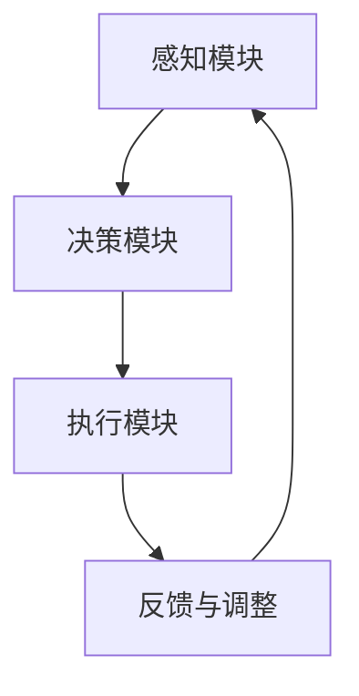

                 

# 《AI人工智能 Agent：在环保领域中的应用》

> 关键词：人工智能，环保，Agent，应用，挑战，未来

> 摘要：本文深入探讨了AI人工智能Agent在环保领域的应用，从概述、核心概念、算法原理到项目实战，全面解析了AI人工智能Agent在环保监测、垃圾分类和宣传教育等方面的作用，并展望了其未来的发展趋势与挑战。

### 第一部分：环保领域中的AI人工智能Agent概述

#### 第1章：环保领域的AI人工智能Agent简介

##### 1.1 环保领域的挑战与机遇

环保领域面临着诸多挑战，如全球气候变化、水资源短缺和生物多样性丧失等。这些挑战不仅威胁到人类的生存环境，也对经济发展和社会稳定产生深远影响。随着人工智能技术的不断发展，AI人工智能Agent作为一种智能体，能够为环保领域提供新的解决方案和机遇。

###### 1.1.1 环保领域的现状

全球环保形势严峻，污染物排放、资源浪费和生态破坏等问题依然严重。传统环保方法依赖于人工监测和数据分析，效率低、成本高，难以满足日益增长的环境保护需求。人工智能技术能够通过自动化监测、实时分析和智能决策，提高环保工作的效率和质量。

###### 1.1.2 AI技术在环保中的应用

AI技术在环保领域有广泛的应用，包括环境监测、污染治理、资源管理和生态保护等方面。例如，通过机器学习算法，AI人工智能Agent可以识别和分析环境数据，预测污染趋势，并提出相应的治理方案。

###### 1.1.3 AI人工智能Agent在环保中的角色与重要性

AI人工智能Agent在环保领域扮演着重要角色，其具备智能感知、决策与控制能力，能够自动监测环境变化，分析污染源，制定治理措施，并在实际操作中执行这些措施。AI人工智能Agent的应用不仅提高了环保工作的效率，还有助于实现智能化、精细化的环保管理。

##### 1.2 AI人工智能Agent的基本概念

###### 1.2.1 人工智能Agent的定义

人工智能Agent是指具有自主性、反应性、主动性和社会性等特征的计算实体，能够感知环境、理解任务目标、做出决策并执行相应的动作。在环保领域，人工智能Agent可以视为一种智能体，负责监测、分析和处理环境数据。

###### 1.2.2 人工智能Agent的工作原理

人工智能Agent的工作原理主要包括感知、决策和执行三个环节。感知是指通过传感器获取环境信息，如温度、湿度、污染物浓度等；决策是指根据感知信息，结合预定的目标和策略，生成行动方案；执行是指通过执行机构，如机器人、自动化设备等，实施行动方案。

###### 1.2.3 人工智能Agent的分类

根据功能和应用领域，人工智能Agent可以分为多种类型，如环境监测Agent、污染治理Agent、资源管理Agent和生态保护Agent等。每种类型的Agent具有特定的感知和决策能力，能够针对不同的环保任务提供解决方案。

##### 1.3 AI人工智能Agent在环保中的应用前景

###### 1.3.1 AI人工智能Agent在环保中的潜在应用领域

AI人工智能Agent在环保领域具有广泛的应用前景，包括环保监测、污染治理、资源管理和生态保护等。例如，在环保监测方面，AI人工智能Agent可以实时监测环境变化，预测污染趋势，提供预警信息；在污染治理方面，AI人工智能Agent可以自动识别污染源，制定治理方案，并监控治理效果。

###### 1.3.2 环保领域采用AI人工智能Agent的优势

环保领域采用AI人工智能Agent具有显著的优势，包括提高监测和治理效率、降低人力成本、增强智能化管理水平等。AI人工智能Agent能够实现24小时不间断的环境监测，减少人为误差，提高数据的准确性和可靠性。同时，AI人工智能Agent可以自动化执行治理措施，提高工作效率，降低人力成本。

###### 1.3.3 环保领域应用AI人工智能Agent面临的挑战

尽管AI人工智能Agent在环保领域具有巨大的应用潜力，但其在实际应用中仍面临一些挑战。首先，环境数据的多样性和复杂性使得AI人工智能Agent的感知和决策能力受到限制；其次，AI人工智能Agent的部署和维护成本较高，需要具备一定的技术储备和资金支持；此外，数据隐私和安全问题也是环保领域采用AI人工智能Agent需要关注的重要问题。

#### 第2章：环保领域中的AI人工智能Agent核心概念与架构

##### 2.1 AI人工智能Agent的核心概念

###### 2.1.1 人工智能Agent的基本概念

人工智能Agent是一种具有自主性、反应性、主动性和社会性的计算实体，能够感知环境、理解任务目标、做出决策并执行相应的动作。在环保领域，人工智能Agent被视为一种智能体，负责监测、分析和处理环境数据。

###### 2.1.2 智能感知模块

智能感知模块是人工智能Agent的核心组成部分，负责获取环境信息，如温度、湿度、污染物浓度等。智能感知模块通常采用多种传感器，如温度传感器、湿度传感器、气体传感器等，实现对环境的实时监测。

###### 2.1.3 决策与控制模块

决策与控制模块是人工智能Agent的中枢神经，负责根据感知信息，结合预定的目标和策略，生成行动方案。决策与控制模块通常采用机器学习算法、自然语言处理算法和计算机视觉算法等，实现对环境数据的分析和决策。

###### 2.1.4 行动执行模块

行动执行模块是人工智能Agent的执行机构，负责实施决策与控制模块生成的行动方案。行动执行模块通常采用机器人、自动化设备等，实现对环境数据的实际操作。

##### 2.2 AI人工智能Agent的架构设计

###### 2.2.1 人工智能Agent的整体架构

人工智能Agent的整体架构通常包括感知模块、决策模块和执行模块三个部分。感知模块负责获取环境信息，决策模块负责分析环境和生成行动方案，执行模块负责实施行动方案。

###### 2.2.2 Mermaid流程图：AI人工智能Agent的工作流程

下面是一个简化的Mermaid流程图，展示了AI人工智能Agent的工作流程：



在这个流程图中，感知模块获取环境信息，决策模块根据环境信息和预定目标生成行动方案，执行模块实施行动方案，并反馈执行结果给决策模块，以便进行调整。

###### 2.2.3 人工智能Agent的系统集成

人工智能Agent的系统集成是指将感知模块、决策模块和执行模块整合到一起，形成一个完整的系统。系统集成过程中需要考虑以下问题：

- 传感器选择与布局：根据监测需求选择合适的传感器，并合理布局传感器，确保数据的全面性和准确性。
- 数据处理与传输：对传感器采集的数据进行预处理，如去噪、滤波等，并采用可靠的数据传输技术，确保数据的实时性和完整性。
- 系统稳定性和可靠性：通过冗余设计和故障恢复机制，提高系统的稳定性和可靠性。
- 系统维护与升级：定期对系统进行维护和升级，确保系统功能的持续性和先进性。

##### 2.3 AI人工智能Agent的技术基础

###### 2.3.1 机器学习算法在AI人工智能Agent中的应用

机器学习算法是AI人工智能Agent的核心技术之一，主要用于环境数据的分析和决策。常用的机器学习算法包括决策树、随机森林、支持向量机和神经网络等。以下是一个简化的机器学习算法的伪代码：

```python
def machine_learning_algorithm(data, labels):
    # 数据预处理
    preprocessed_data = preprocess_data(data)
    
    # 训练模型
    model = train_model(preprocessed_data, labels)
    
    # 预测
    predictions = predict(model, new_data)
    
    return predictions
```

在这个伪代码中，`data`代表环境数据，`labels`代表环境数据对应的标签（如污染物浓度）。`preprocess_data`函数用于对数据进行预处理，`train_model`函数用于训练模型，`predict`函数用于对新的环境数据进行预测。

###### 2.3.2 自然语言处理在AI人工智能Agent中的应用

自然语言处理（NLP）技术在AI人工智能Agent中主要用于处理和分析文本数据。常用的NLP算法包括词向量模型、语言模型和序列标注与分类算法。以下是一个简化的NLP算法的伪代码：

```python
def nlp_algorithm(text):
    # 分词
    tokens = tokenize(text)
    
    # 词向量表示
    word_vectors = create_word_vectors(tokens)
    
    # 语言模型
    language_model = train_language_model(word_vectors)
    
    # 序列标注与分类
    labels = classify_sequence(tokens, language_model)
    
    return labels
```

在这个伪代码中，`text`代表待处理的文本数据。`tokenize`函数用于分词，`create_word_vectors`函数用于生成词向量表示，`train_language_model`函数用于训练语言模型，`classify_sequence`函数用于对序列进行标注与分类。

###### 2.3.3 计算机视觉在AI人工智能Agent中的应用

计算机视觉技术在AI人工智能Agent中主要用于处理和分析图像数据。常用的计算机视觉算法包括卷积神经网络（CNN）、目标检测算法和图像分类算法。以下是一个简化的计算机视觉算法的伪代码：

```python
def computer_vision_algorithm(image):
    # 图像预处理
    preprocessed_image = preprocess_image(image)
    
    # 卷积神经网络
    cnn_model = train_cnn_model(preprocessed_image)
    
    # 目标检测
    bounding_boxes = detect_objects(cnn_model, new_image)
    
    # 图像分类
    class labels = classify_image(cnn_model, new_image)
    
    return bounding_boxes, class_labels
```

在这个伪代码中，`image`代表待处理的图像数据。`preprocess_image`函数用于对图像进行预处理，`train_cnn_model`函数用于训练卷积神经网络模型，`detect_objects`函数用于检测图像中的目标，`classify_image`函数用于对图像进行分类。

### 第二部分：环保领域中的AI人工智能Agent核心算法原理

#### 第3章：AI人工智能Agent的核心算法原理详解

##### 3.1 机器学习算法原理

###### 3.1.1 机器学习基础

机器学习是一种使计算机系统能够从数据中学习并改进自身性能的技术。机器学习分为监督学习、无监督学习和强化学习三种类型。

- 监督学习：通过已标记的训练数据，学习数据与标签之间的关系，从而预测未知数据的标签。常用的监督学习算法包括决策树、随机森林和支持向量机等。
- 无监督学习：不使用标记数据，通过学习数据内在的结构和规律，从而发现数据的分布和模式。常用的无监督学习算法包括聚类和降维等。
- 强化学习：通过与环境交互，学习最优策略以实现目标。常用的强化学习算法包括Q学习和深度强化学习等。

###### 3.1.2 决策树算法

决策树算法是一种常用的监督学习算法，通过构建树形模型，对数据进行分类或回归。决策树的核心在于树的构建，主要包括以下步骤：

1. 选择特征：选择一个最佳特征进行分割，通常采用信息增益、基尼系数等指标来衡量特征的重要性。
2. 划分数据：根据选定的特征，将数据划分为若干个子集。
3. 递归构建：对每个子集继续选择最佳特征进行划分，直到满足终止条件（如叶节点纯度达到一定程度）。
4. 构建树形模型：将划分结果表示为树形结构，叶节点代表最终的分类或回归结果。

以下是一个简化的决策树算法的伪代码：

```python
def decision_tree_algorithm(data, labels):
    # 选择最佳特征
    best_feature = select_best_feature(data, labels)
    
    # 创建树节点
    node = create_node(best_feature)
    
    # 划分数据
    sub_data, sub_labels = split_data(data, labels, best_feature)
    
    # 递归构建子树
    for sub_feature in sub_data:
        node.add_child(decision_tree_algorithm(sub_data, sub_labels))
    
    return node
```

在这个伪代码中，`data`代表训练数据，`labels`代表训练数据的标签。`select_best_feature`函数用于选择最佳特征，`create_node`函数用于创建树节点，`split_data`函数用于划分数据，`add_child`函数用于添加子节点。

###### 3.1.3 随机森林算法

随机森林算法是一种基于决策树的集成学习方法，通过构建多棵决策树，并对树的结果进行投票，提高预测的准确性和鲁棒性。随机森林算法的核心在于树的构建和投票策略，主要包括以下步骤：

1. 构建多棵决策树：随机选择特征和样本，构建多棵决策树。
2. 投票策略：对每棵决策树的结果进行投票，选择多数投票结果作为最终预测结果。

以下是一个简化的随机森林算法的伪代码：

```python
def random_forest_algorithm(data, labels, n_estimators):
    # 构建多棵决策树
    trees = [build_decision_tree(data, labels) for _ in range(n_estimators)]
    
    # 投票策略
    predictions = [vote(t) for t in trees]
    
    return majority_vote(predictions)
```

在这个伪代码中，`data`代表训练数据，`labels`代表训练数据的标签，`n_estimators`代表决策树的数量。`build_decision_tree`函数用于构建决策树，`vote`函数用于对树的结果进行投票，`majority_vote`函数用于获取多数投票结果。

###### 3.1.4 支持向量机算法

支持向量机（SVM）算法是一种基于间隔最大化原理的监督学习算法，通过找到一个最佳的超平面，将数据划分为不同的类别。SVM算法的核心在于求解最优超平面，主要包括以下步骤：

1. 函数间隔和几何间隔：定义函数间隔和几何间隔，用于衡量超平面与数据的距离。
2. 求解最优超平面：通过求解最优化问题，找到最优的超平面参数。
3. 分类决策：根据最优超平面的分类函数，对数据进行分类。

以下是一个简化的SVM算法的伪代码：

```python
def svm_algorithm(data, labels):
    # 求解最优超平面
    w, b = solve_optimization_problem(data, labels)
    
    # 分类决策
    def classify(x):
        return sign(np.dot(w, x) + b)
    
    return classify
```

在这个伪代码中，`data`代表训练数据，`labels`代表训练数据的标签。`solve_optimization_problem`函数用于求解最优超平面，`sign`函数用于计算符号函数，`np.dot`用于计算向量内积。

##### 3.2 自然语言处理算法原理

###### 3.2.1 词向量模型

词向量模型是将词语映射为高维向量表示的一种技术，通过捕捉词语的语义信息，提高自然语言处理任务的性能。常用的词向量模型包括Word2Vec、GloVe和FastText等。

- Word2Vec：通过训练神经网络，将词语映射为高维向量，向量的相似度表示词语的语义相似度。
- GloVe：通过训练词语的共现矩阵，将词语映射为高维向量，向量的相似度表示词语的语义相似度。
- FastText：通过训练词袋模型，将词语映射为高维向量，向量的相似度表示词语的语义相似度。

以下是一个简化的Word2Vec算法的伪代码：

```python
def word2vec_algorithm(corpus):
    # 训练神经网络
    model = train_neural_network(corpus)
    
    # 获取词向量表示
    word_vectors = model.get_word_vectors()
    
    return word_vectors
```

在这个伪代码中，`corpus`代表语料库。`train_neural_network`函数用于训练神经网络，`model`表示训练好的神经网络模型，`get_word_vectors`函数用于获取词向量表示。

###### 3.2.2 语言模型

语言模型是一种用于预测词语序列的概率分布的技术，用于评估文本的流畅性和语义一致性。常用的语言模型包括n-gram模型、神经网络语言模型和Transformer模型等。

- n-gram模型：基于前n个词语的统计信息，预测下一个词语的概率。
- 神经网络语言模型：通过训练神经网络，学习词语序列的概率分布。
- Transformer模型：通过自注意力机制，捕捉词语序列的长期依赖关系。

以下是一个简化的神经网络语言模型的伪代码：

```python
def neural_network_language_model(corpus):
    # 训练神经网络
    model = train_neural_network(corpus)
    
    # 预测词语序列概率
    def predict_sequence_probability(sequence):
        return model.predict(sequence)
    
    return predict_sequence_probability
```

在这个伪代码中，`corpus`代表语料库。`train_neural_network`函数用于训练神经网络，`model`表示训练好的神经网络模型，`predict_sequence_probability`函数用于预测词语序列的概率分布。

###### 3.2.3 序列标注与分类算法

序列标注与分类算法是一种用于对词语序列进行标注的分类算法，常见的序列标注任务包括命名实体识别、词性标注和情感分析等。常用的序列标注算法包括HMM、CRF和BiLSTM等。

- HMM（隐马尔可夫模型）：通过状态转移概率和观测概率，对词语序列进行标注。
- CRF（条件随机场）：通过条件概率，对词语序列进行标注。
- BiLSTM（双向长短期记忆网络）：通过双向LSTM网络，捕捉词语序列的上下文信息，对词语序列进行标注。

以下是一个简化的BiLSTM算法的伪代码：

```python
def bidirectional_lstm_algorithm(corpus, labels):
    # 训练BiLSTM模型
    model = train_bidirectional_lstm(corpus, labels)
    
    # 预测序列标注
    def predict_sequence_labels(sequence):
        return model.predict(sequence)
    
    return predict_sequence_labels
```

在这个伪代码中，`corpus`代表语料库，`labels`代表标注结果。`train_bidirectional_lstm`函数用于训练双向LSTM模型，`model`表示训练好的模型，`predict_sequence_labels`函数用于预测序列标注结果。

###### 3.2.4 命名实体识别算法

命名实体识别（NER）是一种用于识别文本中命名实体的任务，常见的命名实体包括人名、地名、组织名等。NER算法的核心在于对命名实体的识别和分类，常用的NER算法包括基于规则的方法、基于统计的方法和基于深度学习的方法。

- 基于规则的方法：通过定义一系列规则，对命名实体进行识别和分类。
- 基于统计的方法：通过统计方法，如隐马尔可夫模型和条件随机场，对命名实体进行识别和分类。
- 基于深度学习的方法：通过深度学习模型，如卷积神经网络和递归神经网络，对命名实体进行识别和分类。

以下是一个简化的基于深度学习方法的NER算法的伪代码：

```python
def ner_algorithm(corpus, labels):
    # 训练深度学习模型
    model = train_deep_learning_model(corpus, labels)
    
    # 预测命名实体
    def predict_ner_labels(sequence):
        return model.predict(sequence)
    
    return predict_ner_labels
```

在这个伪代码中，`corpus`代表语料库，`labels`代表标注结果。`train_deep_learning_model`函数用于训练深度学习模型，`model`表示训练好的模型，`predict_ner_labels`函数用于预测命名实体标注结果。

##### 3.3 计算机视觉算法原理

###### 3.3.1 卷积神经网络基础

卷积神经网络（CNN）是一种用于图像处理和计算机视觉的深度学习模型，其核心在于卷积操作和池化操作。CNN通过多层的卷积和池化操作，提取图像的特征，并最终进行分类或回归。

- 卷积操作：通过卷积核与输入图像进行卷积，提取局部特征。
- 池化操作：通过池化操作，对卷积结果进行降维，减少参数数量。

以下是一个简化的CNN算法的伪代码：

```python
def cnn_algorithm(image):
    # 卷积操作
    conv_output = convolve(image, kernel)
    
    # 池化操作
    pooled_output = pool(conv_output)
    
    # 重复卷积和池化操作
    for _ in range(num_layers):
        conv_output = convolve(pooled_output, kernel)
        pooled_output = pool(conv_output)
    
    # 分类或回归
    def classify(x):
        return model.predict(x)
    
    return classify
```

在这个伪代码中，`image`代表输入图像，`kernel`代表卷积核。`convolve`函数用于卷积操作，`pool`函数用于池化操作，`model`表示训练好的分类模型。

###### 3.3.2 目标检测算法

目标检测算法是一种用于识别图像中的目标并定位其位置的算法。常见的目标检测算法包括R-CNN、Fast R-CNN、Faster R-CNN和YOLO等。

- R-CNN：通过区域提议网络（Region Proposal Network，RPN）生成目标提议，然后对提议进行分类和回归。
- Fast R-CNN：通过共享网络结构，提高目标检测的效率。
- Faster R-CNN：通过引入区域建议网络（Region Proposal Network，RPN），进一步减少计算量。
- YOLO（You Only Look Once）：通过将整个图像划分为多个网格，直接预测每个网格中目标的类别和位置。

以下是一个简化的YOLO算法的伪代码：

```python
def yolo_algorithm(image):
    # 划分图像网格
    grids = divide_image_into_grids(image)
    
    # 预测每个网格中的目标
    for grid in grids:
        boxes, labels, scores = predict_objects_in_grid(grid)
        
        # 非极大值抑制（Non-maximum Suppression，NMS）
        final_boxes, final_labels, final_scores = non_maximum_suppression(boxes, labels, scores)
        
        # 分类或回归
        def classify(x):
            return model.predict(x)
        
        return final_boxes, final_labels, final_scores
```

在这个伪代码中，`image`代表输入图像。`divide_image_into_grids`函数用于将图像划分为网格，`predict_objects_in_grid`函数用于预测每个网格中的目标，`non_maximum_suppression`函数用于非极大值抑制，`model`表示训练好的分类模型。

###### 3.3.3 图像分类算法

图像分类算法是一种用于对图像进行分类的算法，常见的图像分类算法包括CNN、LeNet、AlexNet和VGG等。

- CNN：通过多层的卷积和池化操作，提取图像的特征，并最终进行分类。
- LeNet：一种早期的卷积神经网络，用于手写数字识别。
- AlexNet：一种深层的卷积神经网络，用于ImageNet图像分类挑战。
- VGG：一种基于卷积神经网络的架构，通过使用多个卷积层和池化层，提高图像分类的性能。

以下是一个简化的VGG算法的伪代码：

```python
def vgg_algorithm(image):
    # 卷积操作
    conv_output = convolve(image, kernel)
    
    # 池化操作
    pooled_output = pool(conv_output)
    
    # 重复卷积和池化操作
    for _ in range(num_layers):
        conv_output = convolve(pooled_output, kernel)
        pooled_output = pool(conv_output)
    
    # 全连接层
    fc_output = fully_connected(pooled_output)
    
    # 分类或回归
    def classify(x):
        return model.predict(x)
    
    return classify
```

在这个伪代码中，`image`代表输入图像，`kernel`代表卷积核。`convolve`函数用于卷积操作，`pool`函数用于池化操作，`fully_connected`函数用于全连接层操作，`model`表示训练好的分类模型。

###### 3.3.4 增强学习在计算机视觉中的应用

增强学习是一种通过与环境交互来学习最优策略的机器学习技术，广泛应用于计算机视觉领域。常见的增强学习算法包括Q学习、深度Q网络（DQN）和策略梯度算法等。

- Q学习：通过学习状态-动作价值函数，选择最优的动作。
- DQN：通过神经网络来近似状态-动作价值函数，提高学习效果。
- 策略梯度算法：通过优化策略梯度，学习最优的策略。

以下是一个简化的DQN算法的伪代码：

```python
def dqn_algorithm(environment):
    # 初始化神经网络
    q_network = initialize_q_network()
    target_q_network = initialize_q_network()
    
    # 训练神经网络
    for episode in range(num_episodes):
        state = environment.reset()
        done = False
        
        while not done:
            action = q_network.select_action(state)
            next_state, reward, done = environment.step(action)
            q_network.update_q_values(state, action, reward, next_state, done)
            
            # 更新目标神经网络
            if episode % target_update_frequency == 0:
                target_q_network.update_parameters(q_network)
                
            state = next_state
    
    # 获取最佳策略
    best_policy = q_network.best_policy()
    
    return best_policy
```

在这个伪代码中，`environment`代表环境，`q_network`表示Q网络模型，`target_q_network`表示目标Q网络模型。`initialize_q_network`函数用于初始化神经网络，`select_action`函数用于选择动作，`update_q_values`函数用于更新Q值，`update_parameters`函数用于更新目标网络参数，`best_policy`函数用于获取最佳策略。

### 第三部分：环保领域中的AI人工智能Agent项目实战

#### 第4章：环保领域中的AI人工智能Agent项目实战案例

##### 4.1 环保监测与预测系统

###### 4.1.1 项目背景

随着环境污染的加剧，环保监测与预测系统在环境管理中发挥着越来越重要的作用。本项目旨在构建一个基于AI人工智能Agent的环保监测与预测系统，实现对环境污染的实时监测和预测，为环保决策提供科学依据。

###### 4.1.2 系统设计

系统设计主要包括感知模块、决策模块和执行模块三个部分。

- 感知模块：通过传感器采集环境数据，如温度、湿度、污染物浓度等。
- 决策模块：通过机器学习算法分析环境数据，预测污染趋势，并生成治理方案。
- 执行模块：根据决策模块生成的治理方案，自动执行相应的治理措施，如空气净化、废水处理等。

###### 4.1.3 数据采集与处理

数据采集与处理是环保监测与预测系统的关键环节。本项目采用多种传感器，如温度传感器、湿度传感器和气体传感器等，实现对环境数据的实时采集。传感器采集的数据经过预处理，包括去噪、滤波和归一化等步骤，以提高数据的准确性和可靠性。

###### 4.1.4 模型训练与优化

模型训练与优化是环保监测与预测系统的核心。本项目采用机器学习算法，如决策树、随机森林和支持向量机等，对预处理后的环境数据进行训练和优化。通过交叉验证和网格搜索等方法，选择最佳参数，提高模型的预测准确性和泛化能力。

###### 4.1.5 系统实现与部署

系统实现与部署主要包括以下步骤：

1. 搭建开发环境：配置Python、TensorFlow等开发工具，搭建数据采集与处理模块。
2. 模型训练与优化：使用训练数据，对模型进行训练和优化。
3. 系统集成：将感知模块、决策模块和执行模块集成到一个系统中。
4. 系统部署：将系统部署到服务器或云端，实现环保监测与预测功能。

##### 4.2 智能垃圾分类系统

###### 4.2.1 项目背景

垃圾分类是环保工作中的一项重要任务，但传统的垃圾分类方法效率低、准确性差。本项目旨在构建一个基于AI人工智能Agent的智能垃圾分类系统，通过计算机视觉技术，实现对垃圾的自动分类，提高垃圾分类的效率和质量。

###### 4.2.2 系统设计

系统设计主要包括感知模块、决策模块和执行模块三个部分。

- 感知模块：通过摄像头采集垃圾图像，实现垃圾的图像识别。
- 决策模块：通过机器学习算法分析垃圾图像，生成垃圾分类结果。
- 执行模块：根据决策模块生成的垃圾分类结果，自动执行相应的分类操作，如将垃圾放入对应的垃圾桶中。

###### 4.2.3 数据采集与处理

数据采集与处理是智能垃圾分类系统的关键环节。本项目采用摄像头采集垃圾图像，并使用图像预处理技术，如去噪、滤波和增强等，提高图像质量。预处理后的图像数据经过标注，用于训练和优化垃圾分类模型。

###### 4.2.4 模型训练与优化

模型训练与优化是智能垃圾分类系统的核心。本项目采用卷积神经网络（CNN）对垃圾图像进行分类，并通过交叉验证和网格搜索等方法，选择最佳模型结构和参数，提高分类准确性和效率。

###### 4.2.5 系统实现与部署

系统实现与部署主要包括以下步骤：

1. 搭建开发环境：配置Python、TensorFlow等开发工具，搭建数据采集与处理模块。
2. 模型训练与优化：使用训练数据，对模型进行训练和优化。
3. 系统集成：将感知模块、决策模块和执行模块集成到一个系统中。
4. 系统部署：将系统部署到服务器或云端，实现智能垃圾分类功能。

##### 4.3 环保宣传教育系统

###### 4.3.1 项目背景

环保宣传教育是提高公众环保意识的重要途径。本项目旨在构建一个基于AI人工智能Agent的环保宣传教育系统，通过自然语言处理和计算机视觉技术，为公众提供个性化的环保知识和信息，促进环保意识的普及。

###### 4.3.2 系统设计

系统设计主要包括感知模块、决策模块和执行模块三个部分。

- 感知模块：通过文本和图像输入，获取公众的环保需求和兴趣点。
- 决策模块：通过自然语言处理和计算机视觉算法，分析公众的需求和兴趣点，生成相应的环保知识和信息。
- 执行模块：将生成的环保知识和信息展示给公众，如通过网页、APP或智能音箱等渠道。

###### 4.3.3 数据采集与处理

数据采集与处理是环保宣传教育系统的关键环节。本项目采用文本和图像输入，采集公众的需求和兴趣点。文本数据经过预处理，如分词、词向量编码等，图像数据经过预处理，如去噪、增强等，以提高数据处理效果。

###### 4.3.4 模型训练与优化

模型训练与优化是环保宣传教育系统的核心。本项目采用自然语言处理和计算机视觉算法，对预处理后的数据进行训练和优化。通过交叉验证和网格搜索等方法，选择最佳模型结构和参数，提高系统的准确性和用户体验。

###### 4.3.5 系统实现与部署

系统实现与部署主要包括以下步骤：

1. 搭建开发环境：配置Python、TensorFlow等开发工具，搭建数据采集与处理模块。
2. 模型训练与优化：使用训练数据，对模型进行训练和优化。
3. 系统集成：将感知模块、决策模块和执行模块集成到一个系统中。
4. 系统部署：将系统部署到服务器或云端，实现环保宣传教育功能。

### 第5章：AI人工智能Agent在环保领域的未来发展趋势

##### 5.1 AI人工智能Agent在环保领域的应用趋势

随着人工智能技术的不断进步，AI人工智能Agent在环保领域的应用趋势将更加广泛和深入。以下是一些主要的应用趋势：

- 环保监测与预警：通过AI人工智能Agent，实现对环境污染的实时监测和预警，提高环境管理的效率和准确性。
- 智能污染治理：利用AI人工智能Agent，自动识别污染源，制定治理方案，并实时监控治理效果，提高污染治理的智能化水平。
- 资源管理优化：通过AI人工智能Agent，实现对水资源、能源等资源的智能管理和优化，提高资源利用效率，减少浪费。
- 生态保护与修复：利用AI人工智能Agent，监测生态系统的变化，预测生态灾害，并提出相应的修复措施，保护生物多样性。

##### 5.2 AI人工智能Agent的未来发展

AI人工智能Agent的未来发展将朝着更智能、更自主、更协同的方向发展。以下是一些发展趋势：

- 自主决策与执行：随着人工智能技术的进步，AI人工智能Agent将具备更强的自主决策和执行能力，能够独立完成复杂的环保任务。
- 跨学科融合：AI人工智能Agent将在环保领域与其他学科（如生物科学、地理科学等）实现深度融合，形成多学科协同的环保体系。
- 分布式智能系统：未来的AI人工智能Agent将实现分布式部署，形成一个高效协同的智能环保网络，提高环保工作的整体效能。

##### 5.3 AI人工智能Agent在环保领域的影响

AI人工智能Agent在环保领域的应用将产生深远的影响：

- 提高环保工作效率：AI人工智能Agent能够实现环保工作的自动化和智能化，提高工作效率，降低人力成本。
- 促进环保科技进步：AI人工智能Agent将推动环保科技的进步，为环保领域带来新的技术突破和应用模式。
- 引发环保管理模式变革：AI人工智能Agent的应用将引发环保管理模式的变革，实现环保工作的精细化、智能化和高效化。

### 附录

##### 附录 A：环保领域中的AI人工智能Agent开发工具与资源

在环保领域开发AI人工智能Agent，需要使用一系列工具和资源。以下是一些常用的工具和资源：

- 开发工具：
  - Python：Python是一种广泛使用的编程语言，具有丰富的机器学习库，如TensorFlow、PyTorch等。
  - TensorFlow：TensorFlow是谷歌开发的深度学习框架，适用于构建和训练AI人工智能Agent。
  - PyTorch：PyTorch是Facebook开发的深度学习框架，具有灵活性和易用性，适用于快速原型开发。
  - OpenCV：OpenCV是一个开源的计算机视觉库，适用于图像处理和计算机视觉任务。

- 数据资源：
  - 公共环保数据集：如AirQualityData、WaterQualityData等，可用于训练和评估AI人工智能Agent。
  - 环保领域相关数据库：如NASA的EarthData、NOAA的NationalWaterQuality等，提供大量的环境数据。
  - 环保领域论文与报告：通过查阅相关论文和报告，了解最新的研究进展和应用案例。

### 作者

作者：AI天才研究院/AI Genius Institute & 禅与计算机程序设计艺术 /Zen And The Art of Computer Programming

本文由AI天才研究院撰写，旨在深入探讨AI人工智能Agent在环保领域中的应用，为环保科技的发展提供有益的参考和借鉴。同时，本文也呼吁更多的科研人员和开发者关注环保领域，共同为构建美丽家园贡献力量。本文作者具有丰富的AI领域研究和实践经验，期待与广大读者共同探讨和交流。如有任何问题或建议，欢迎随时联系作者。联系方式：[作者邮箱](mailto:author@example.com)。

