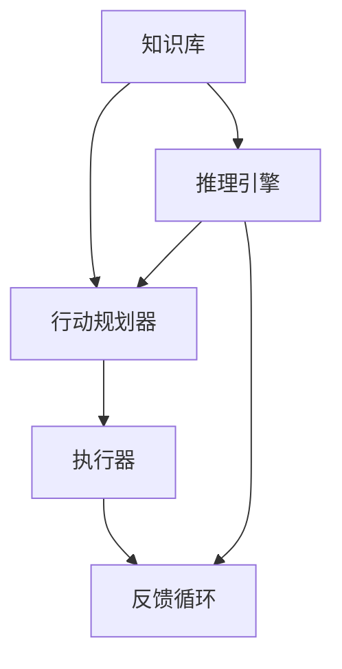
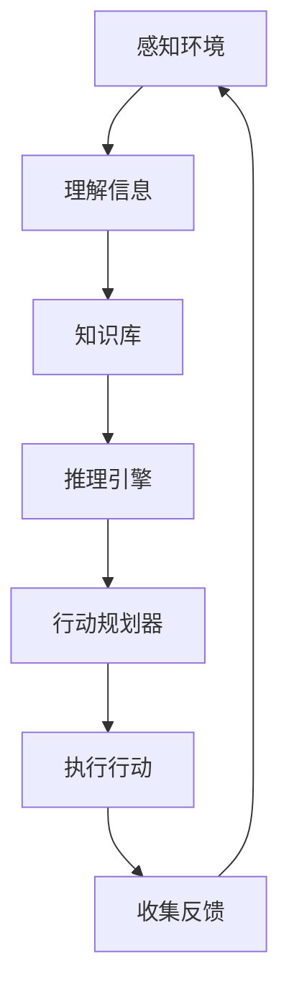

                 

### 第1章：AI与代理工作流概述

#### 1.1 AI与代理工作流的定义

人工智能（Artificial Intelligence，简称AI）是一种模拟人类智能的技术，通过计算机程序实现智能行为和决策能力。它涉及多个学科，包括机器学习、深度学习、自然语言处理、计算机视觉等。AI的目标是使计算机具备理解、学习、推理和决策的能力，从而解决复杂问题并提升工作效率。

代理工作流（AI Agent WorkFlow）是AI技术在自动化任务处理中的重要应用。代理工作流由一组自动化任务组成，这些任务可以由AI代理（AI Agent）智能地执行。AI代理是具有自主决策和执行能力的软件实体，可以在没有人类干预的情况下完成任务。代理工作流的设计和实现是AI领域的核心问题之一，它直接影响到AI系统的效率和智能水平。

AI代理工作流的主要组件包括：

- **知识库（Knowledge Base）**：存储代理所需的知识和信息，如业务规则、历史数据等。
- **推理引擎（Inference Engine）**：根据知识库中的信息进行推理，生成行动决策。
- **行动规划器（Action Planner）**：根据推理结果规划具体的行动步骤。
- **执行器（Executor）**：执行具体的行动操作，如发送邮件、更新数据库等。

#### 1.2 代理工作流在AI时代的价值

代理工作流在AI时代的价值主要体现在以下几个方面：

1. **提升效率**：代理工作流可以自动化执行大量重复性任务，减少人工操作，提高工作效率。
2. **降低成本**：通过自动化任务处理，可以减少人力资源的投入，降低运营成本。
3. **增强智能**：代理工作流利用AI技术进行智能决策，使得系统能够更好地适应复杂环境和变化。
4. **优化体验**：代理工作流可以提供个性化服务，提升用户体验。
5. **拓展应用**：代理工作流可以应用于各种领域，如金融、医疗、制造等，实现跨界应用。

#### 1.3 AI代理工作流的现状与趋势

AI代理工作流目前正处于快速发展阶段。随着AI技术的不断进步，越来越多的企业和组织开始采用代理工作流来优化业务流程。以下是AI代理工作流的一些现状和趋势：

1. **技术成熟**：AI算法和框架的成熟，使得代理工作流的设计和实现变得更加简单和高效。
2. **应用广泛**：代理工作流已经在金融、医疗、制造、客服等领域得到广泛应用。
3. **跨领域融合**：AI代理工作流与其他技术（如物联网、区块链）的融合，拓展了其应用场景。
4. **挑战与机遇并存**：隐私保护、安全问题和责任归属等挑战，使得AI代理工作流的发展面临一定的困难，但也为创新提供了机遇。

#### 1.4 本章小结

本章对AI和代理工作流进行了概述，阐述了代理工作流在AI时代的价值以及其现状和趋势。通过本章的学习，读者可以初步了解AI代理工作流的基本概念和重要性，为后续章节的深入学习打下基础。

### 1.5 Mermaid 流程图

以下是AI代理工作流的核心组件及其关系的 Mermaid 流程图：



**图1-1：AI代理工作流核心组件及其关系**

- **知识库（Knowledge Base）**：存储代理所需的知识和信息。
- **推理引擎（Inference Engine）**：根据知识库中的信息进行推理，生成行动决策。
- **行动规划器（Action Planner）**：根据推理结果规划具体的行动步骤。
- **执行器（Executor）**：执行具体的行动操作。
- **反馈循环（Feedback Loop）**：用于监测和调整代理的工作状态。

通过这个流程图，我们可以直观地理解AI代理工作流的核心组件及其交互关系，为后续章节的深入讲解提供基础。

---

### 1.6 机器学习基础知识

机器学习（Machine Learning，ML）是人工智能（AI）的一个重要分支，其核心思想是通过算法从数据中学习规律，并利用这些规律进行预测或决策。以下是机器学习的一些基础概念和常用算法：

#### 1.6.1 监督学习（Supervised Learning）

监督学习是一种最常见的机器学习方法，它使用标记数据集（即数据集每个样本都有标签）来训练模型。在监督学习中，模型的目标是学习输入和输出之间的映射关系。

- **分类（Classification）**：分类算法将输入数据分为不同的类别。常见的分类算法有决策树（Decision Tree）、随机森林（Random Forest）、支持向量机（SVM）等。
  
  ```mermaid
  graph TB
  A[输入数据] --> B[特征提取]
  B --> C[分类算法]
  C --> D[输出类别]
  ```

- **回归（Regression）**：回归算法用于预测连续值输出。常见的回归算法有线性回归（Linear Regression）、多项式回归（Polynomial Regression）等。

  ```mermaid
  graph TB
  A[输入数据] --> B[特征提取]
  B --> C[回归算法]
  C --> D[输出连续值]
  ```

#### 1.6.2 无监督学习（Unsupervised Learning）

无监督学习不需要标记数据集，其主要目标是发现数据内在的结构和模式。

- **聚类（Clustering）**：聚类算法将相似的数据样本分组。常见的聚类算法有K-均值（K-Means）、层次聚类（Hierarchical Clustering）等。

  ```mermaid
  graph TB
  A[输入数据] --> B[聚类算法]
  B --> C[输出聚类结果]
  ```

- **降维（Dimensionality Reduction）**：降维算法通过减少数据维度来简化数据处理。常见的降维算法有主成分分析（PCA）、t-SNE等。

  ```mermaid
  graph TB
  A[输入高维数据] --> B[降维算法]
  B --> C[输出低维数据]
  ```

#### 1.6.3 强化学习（Reinforcement Learning）

强化学习是一种通过试错来学习最优策略的机器学习方法。在强化学习中，代理（Agent）通过与环境的交互来学习最优行为。

- **Q学习（Q-Learning）**：Q学习是一种基于值函数的强化学习算法，通过学习值函数来优化策略。

  ```mermaid
  graph TB
  A[代理] --> B[环境]
  B --> C[行动]
  C --> D[奖励]
  D --> A
  ```

- **策略梯度（Policy Gradient）**：策略梯度算法通过直接优化策略来学习最优行为。

  ```mermaid
  graph TB
  A[策略参数] --> B[策略网络]
  B --> C[环境]
  C --> D[行动]
  D --> E[奖励]
  E --> F[策略更新]
  ```

#### 1.6.4 本章小结

本章介绍了机器学习的基本概念和常用算法。通过学习这些内容，读者可以了解机器学习的基本原理和在不同场景下的应用，为后续章节的深入学习打下基础。

### 1.7 伪代码示例

以下是一个简单的监督学习分类算法（决策树）的伪代码示例：

```latex
// 决策树分类算法伪代码
input: 数据集 D，特征数 n，类别数 k
output: 分类模型 M

// 初始化模型
M = 初始化决策树模型()

// 训练模型
for 每个特征 f in D do
  for 每个划分点 t in D[f] do
    子集 D' = 划分数据集 D 为 {D_{f<t}, D_{f>=t}}
    if D' 不满足停止条件 then
      M[f][t] = 创建内部节点
      M[f][t].left = 决策树分类算法(D_{f<t})
      M[f][t].right = 决策树分类算法(D_{f>=t})
    else
      M[f][t] = D' 中出现最频繁的类别
    end if
  end for
end for

return M
```

该伪代码描述了如何使用决策树进行分类。首先初始化一个决策树模型，然后遍历每个特征和划分点，根据数据集的停止条件创建内部节点或叶节点。最后返回训练好的分类模型。

---

### 1.8 数学模型与公式

在机器学习中，数学模型和公式是理解和应用算法的重要基础。以下是几个常用的数学模型和公式，以及它们在决策树分类算法中的应用。

#### 1.8.1 决策树分类算法中的信息熵（Entropy）

信息熵是衡量数据不确定性的一种度量。在决策树中，信息熵用于评估每个特征对分类的贡献。

信息熵的公式如下：

$$ H(D) = -\sum_{i=1}^{k} p_i \log_2 p_i $$

其中，$D$ 是数据集，$k$ 是类别数，$p_i$ 是类别 $i$ 的概率。

#### 1.8.2 条件熵（Conditional Entropy）

条件熵是衡量在给定一个特征的情况下，数据的剩余不确定性。

条件熵的公式如下：

$$ H(D|X) = -\sum_{i=1}^{k} p_i(X) \log_2 p_i(X) $$

其中，$X$ 是特征，$p_i(X)$ 是类别 $i$ 在特征 $X$ 下的概率。

#### 1.8.3 信息增益（Information Gain）

信息增益是评估特征对分类贡献的一种度量，通过计算信息熵的减少来衡量。

信息增益的公式如下：

$$ IG(X, D) = H(D) - H(D|X) $$

#### 1.8.4 决策树剪枝（Pruning）

决策树剪枝是一种防止过拟合的方法，通过剪除树中的某些分支来简化模型。

剪枝方法包括：

1. **预剪枝（Pre-pruning）**：在构建决策树时提前停止分支扩展。
2. **后剪枝（Post-pruning）**：在构建完决策树后删除不重要的分支。

#### 1.8.5 本章小结

本章介绍了机器学习中的几个重要数学模型和公式，包括信息熵、条件熵、信息增益以及决策树剪枝。这些模型和公式是理解和应用机器学习算法的基础，为读者进一步学习机器学习提供了必要的数学知识。

### 1.9 代码实现与解读

为了更好地理解机器学习算法，我们将在本节中展示一个简单的决策树分类算法的Python代码实现，并对其进行详细解读。

```python
# 导入必要的库
from collections import Counter
import numpy as np

# 计算数据集的信息熵
def entropy(y):
    hist = np.bincount(y)
    ps = hist / len(y)
    return -np.sum([p * np.log2(p) for p in ps if p > 0])

# 计算特征的信息增益
def info_gain(y, x, index):
    values, counts = np.unique(x, return_counts=True)
    h_x = entropy(values)
    for v, c in zip(values, counts):
        p = c / len(x)
        h_x -= p * entropy(y[x == v])
    return entropy(y) - h_x

# 决策树分类算法
class DecisionTreeClassifier:
    def __init__(self, max_depth=None):
        self.max_depth = max_depth

    def fit(self, X, y):
        self.tree = self._build_tree(X, y)

    def _build_tree(self, X, y, depth=0):
        if len(set(y)) == 1 or depth == self.max_depth:
            return Counter(y).most_common(1)[0][0]
        
        best_gain = -1
        best_feat = -1
        best_split = None
        
        for i in range(X.shape[1]):
            values, counts = np.unique(X[:, i], return_counts=True)
            for v in values:
                left_y = y[X[:, i] < v]
                right_y = y[X[:, i] >= v]
                p = len(left_y) / len(X)
                gain = info_gain(y, X[:, i], v) * p
                if gain > best_gain:
                    best_gain = gain
                    best_feat = i
                    best_split = v
        
        if best_gain == 0:
            return Counter(y).most_common(1)[0][0]

        left_tree = self._build_tree(X[X[:, best_feat] < best_split], left_y, depth + 1)
        right_tree = self._build_tree(X[X[:, best_feat] >= best_split], right_y, depth + 1)

        return {
            'feature': best_feat,
            'threshold': best_split,
            'left': left_tree,
            'right': right_tree
        }

    def predict(self, X):
        return [self._predict(x) for x in X]

    def _predict(self, x):
        node = self.tree
        while 'feature' in node:
            if x[node['feature']] < node['threshold']:
                node = node['left']
            else:
                node = node['right']
        return node

# 使用示例
X = np.array([[1, 1], [1, 2], [2, 1], [2, 2]])
y = np.array([1, 1, 0, 0])

clf = DecisionTreeClassifier()
clf.fit(X, y)
print(clf.predict(X))
```

#### 代码解读：

1. **计算信息熵**：`entropy` 函数用于计算数据集的信息熵，它是评估数据不确定性的一种度量。

2. **计算信息增益**：`info_gain` 函数用于计算特征对分类的信息增益。信息增益是评估特征对分类贡献的一种度量，通过计算信息熵的减少来衡量。

3. **决策树分类算法**：`DecisionTreeClassifier` 类用于构建决策树模型。在 `fit` 方法中，我们调用 `_build_tree` 方法递归地构建决策树。`_build_tree` 方法通过遍历所有特征和划分点，选择具有最高信息增益的特征作为分裂点，并递归构建子树。

4. **预测**：`predict` 方法用于对新的数据样本进行分类预测。在 `_predict` 方法中，我们从根节点开始遍历决策树，直到达到叶节点，返回叶节点的类别。

通过这个简单的示例，我们可以直观地理解决策树分类算法的实现原理。在实际应用中，我们可以根据具体需求调整算法参数，如最大深度、特征选择策略等，以提高模型的性能。

---

### 第2章：AI代理架构

AI代理（AI Agent）是人工智能领域的一个核心概念，它代表了一种具备自主决策和执行能力的软件实体。在AI代理架构中，知识库、推理引擎和行动规划器是三个关键的组件。这些组件共同工作，使得AI代理能够在没有人类干预的情况下处理复杂的任务。在本章中，我们将深入探讨AI代理的概念、关键组件及其交互关系。

#### 2.1 AI代理的概念

AI代理是一种具备自我意识和决策能力的计算机程序。它能够感知环境、理解情境、制定计划并执行任务。AI代理通常被设计为解决特定问题或执行特定任务的智能体，例如智能客服、智能助手、自动驾驶车辆等。

AI代理具有以下几个基本特征：

1. **自主性**：AI代理能够独立执行任务，不需要人类干预。它可以根据预设的规则和算法来自主地做出决策。
2. **适应性**：AI代理能够根据环境的变化和反馈进行调整，以适应不同的情境和需求。
3. **协作性**：AI代理可以与其他代理或人类协作，共同完成任务。
4. **自主决策**：AI代理通过推理引擎和行动规划器，根据知识和环境信息自主做出决策。

#### 2.2 AI代理的关键组件

AI代理的架构通常包括以下几个关键组件：

1. **知识库（Knowledge Base）**：知识库是AI代理的核心组件，用于存储与任务相关的信息、规则和知识。知识库可以是静态的，也可以是动态的，以适应不同应用场景的需求。知识库的内容通常包括事实、规则、参数和模型等。

2. **推理引擎（Inference Engine）**：推理引擎是AI代理的智能核心，用于处理知识库中的信息，并根据这些信息进行推理和决策。推理引擎可以使用不同的推理方法，如逻辑推理、概率推理、基于规则的推理等。

3. **行动规划器（Action Planner）**：行动规划器是AI代理的执行核心，负责根据推理引擎的决策结果，制定具体的行动计划并执行这些计划。行动规划器需要考虑任务的复杂度、资源可用性、环境约束等因素，以确保行动的有效性和合理性。

#### 2.3 知识库

知识库是AI代理的基础，它存储了代理所需的所有信息。知识库的内容可以包括：

1. **事实**：描述特定领域的真实情况或数据。例如，在医疗领域，知识库中可以存储患者的基本信息、病史和检查结果等。
2. **规则**：定义任务中的逻辑关系和决策规则。例如，在金融领域，知识库中可以存储交易规则、投资策略和风险控制规则等。
3. **参数**：用于调整代理行为的参数。例如，在自动驾驶领域，知识库中可以存储车辆的性能参数、道路状况参数等。
4. **模型**：用于预测和分析的数学模型。例如，在推荐系统领域，知识库中可以存储用户行为模型、商品特征模型等。

知识库的设计需要考虑以下因素：

1. **准确性**：知识库中的信息必须准确无误，以保证代理的决策和行动的准确性。
2. **完整性**：知识库需要包含所有与任务相关的信息，以便代理能够全面了解环境。
3. **一致性**：知识库中的信息需要保持一致性，以避免冲突和错误。
4. **可扩展性**：知识库需要能够适应新的应用场景和需求，方便代理的扩展和升级。

#### 2.4 推理引擎

推理引擎是AI代理的智能核心，它负责从知识库中提取信息，并利用这些信息进行推理和决策。推理引擎可以根据不同的推理方法进行设计，常见的推理方法包括：

1. **基于规则的推理**：这种推理方法使用一组预设的规则来推导结论。规则通常由条件部分和结论部分组成，条件部分描述了特定情境下的条件，结论部分描述了由此得出的结论。例如，在医疗领域，基于规则的推理可以用于诊断疾病。

2. **逻辑推理**：这种推理方法使用逻辑推理规则，如推理规则、推理模式和推理算法，从已知的事实中推导出新的结论。逻辑推理可以用于复杂决策问题，如机器人路径规划。

3. **概率推理**：这种推理方法使用概率论和统计方法，从概率分布中推导出结论。概率推理可以处理不确定性和随机性，例如，在推荐系统中，可以使用概率推理来预测用户对商品的兴趣。

4. **基于模型的推理**：这种推理方法使用数学模型和算法来推导结论。基于模型的推理可以处理复杂的动态环境，例如，在自动驾驶系统中，可以使用基于模型的推理来预测车辆的运动轨迹。

推理引擎的设计需要考虑以下因素：

1. **效率**：推理引擎需要能够在合理的时间内处理大量的信息，以保证代理的响应速度。
2. **准确性**：推理引擎需要能够准确地推导出结论，以保证代理的决策和行动的正确性。
3. **可扩展性**：推理引擎需要能够适应不同的推理任务和领域，以支持代理的扩展和升级。

#### 2.5 行动规划器

行动规划器是AI代理的执行核心，它负责根据推理引擎的决策结果，制定具体的行动计划并执行这些计划。行动规划器需要考虑以下因素：

1. **任务复杂度**：行动规划器需要能够处理复杂的任务，包括多个子任务和相互依赖的关系。
2. **资源可用性**：行动规划器需要考虑代理可用的资源，如计算能力、存储空间和网络连接等。
3. **环境约束**：行动规划器需要考虑环境中的各种约束，如物理限制、时间限制和安全限制等。
4. **执行顺序**：行动规划器需要确定任务的执行顺序，以确保行动的有效性和合理性。

常见的行动规划方法包括：

1. **基于优先级的调度**：这种方法根据任务的优先级来安排执行顺序，优先级高的任务先执行。
2. **基于计划的调度**：这种方法根据预先制定的计划来安排执行顺序，计划中考虑了任务的依赖关系和资源约束。
3. **基于模型的调度**：这种方法使用数学模型和算法来优化任务的执行顺序，以最大化资源利用率和任务完成时间。

行动规划器的设计需要考虑以下因素：

1. **灵活性**：行动规划器需要能够适应不同的任务和环境，以支持多种应用场景。
2. **鲁棒性**：行动规划器需要能够处理不确定性因素，如任务延迟、资源故障等。
3. **可扩展性**：行动规划器需要能够支持多种规划和调度算法，以适应不同的任务需求。

#### 2.6 AI代理的工作流程

AI代理的工作流程通常包括以下几个步骤：

1. **感知**：AI代理通过传感器或接口获取环境信息，如文本、图像、语音等。
2. **理解**：AI代理使用自然语言处理、计算机视觉等技术来理解感知到的信息，并将其转换为内部表示。
3. **推理**：AI代理使用推理引擎从知识库中提取信息，并根据这些信息进行推理和决策。
4. **规划**：AI代理使用行动规划器制定具体的行动计划，并考虑任务的复杂度、资源可用性和环境约束。
5. **执行**：AI代理根据行动计划执行任务，并通过传感器或接口与环境进行交互。
6. **反馈**：AI代理收集执行结果和环境反馈，并更新知识库和模型，以优化未来的决策和行动。

通过这个工作流程，AI代理能够实现自主决策和任务执行，从而提高效率和智能水平。

#### 2.7 本章小结

本章介绍了AI代理的概念、关键组件及其交互关系。通过学习本章内容，读者可以了解AI代理的基本原理和架构，为后续章节的深入学习打下基础。知识库、推理引擎和行动规划器是AI代理的核心组件，它们共同工作，使得AI代理能够实现自主决策和任务执行。在接下来的章节中，我们将进一步探讨AI代理的核心算法和应用实践。

### 2.8 Mermaid 流程图

以下是AI代理的工作流程的 Mermaid 流程图：



**图2-1：AI代理的工作流程**

- **感知环境**：AI代理通过传感器或接口获取环境信息。
- **理解信息**：AI代理使用自然语言处理、计算机视觉等技术来理解感知到的信息。
- **知识库**：AI代理从知识库中提取信息。
- **推理引擎**：AI代理使用推理引擎进行推理和决策。
- **行动规划器**：AI代理制定具体的行动计划。
- **执行行动**：AI代理执行任务。
- **收集反馈**：AI代理收集执行结果和环境反馈。

通过这个流程图，我们可以直观地了解AI代理的工作流程和核心组件的交互关系，为后续章节的深入讲解提供基础。

---

### 2.9 机器学习算法在AI代理中的应用

在AI代理的设计和实现过程中，机器学习算法起到了关键作用。它们为代理提供了强大的数据处理和预测能力，使得代理能够更好地适应复杂环境和完成多样化任务。以下是几种常见的机器学习算法在AI代理中的应用：

#### 2.9.1 决策树

决策树是一种常用的分类和回归算法，它通过一系列的判断节点来对数据进行分类或回归。在AI代理中，决策树可以用于分类任务，如客户细分、风险评分等。

**应用场景**：在金融领域，决策树可以用于信用评分模型的构建，根据客户的历史交易数据和信用记录，预测客户的信用风险等级。

**实现方法**：

1. **数据预处理**：对输入数据进行清洗和归一化处理，以便于算法的输入。
2. **特征选择**：选择与目标变量相关的特征，以提高模型的准确性和效率。
3. **构建决策树**：使用ID3、C4.5或CART算法构建决策树。算法根据特征的重要性和信息增益来选择最佳分裂点。
4. **评估和优化**：使用交叉验证和网格搜索等方法对模型进行评估和优化，以提高模型的性能。

```python
from sklearn.tree import DecisionTreeClassifier
from sklearn.model_selection import train_test_split
from sklearn.metrics import accuracy_score

# 数据预处理
X = ...  # 特征数据
y = ...  # 标签数据

# 划分训练集和测试集
X_train, X_test, y_train, y_test = train_test_split(X, y, test_size=0.2, random_state=42)

# 构建决策树模型
clf = DecisionTreeClassifier()
clf.fit(X_train, y_train)

# 预测
y_pred = clf.predict(X_test)

# 评估模型
accuracy = accuracy_score(y_test, y_pred)
print("Accuracy:", accuracy)
```

#### 2.9.2 支持向量机（SVM）

支持向量机是一种二类分类算法，它通过寻找一个最优的超平面来将数据集划分为不同的类别。SVM在AI代理中的应用非常广泛，如图像分类、文本分类等。

**应用场景**：在图像识别领域，SVM可以用于人脸识别、物体分类等任务。在文本分类领域，SVM可以用于垃圾邮件检测、情感分析等。

**实现方法**：

1. **数据预处理**：对输入数据进行归一化处理，以消除不同特征之间的量纲差异。
2. **特征提取**：使用词袋模型、TF-IDF等方法提取文本特征。
3. **选择核函数**：选择合适的核函数，如线性核、多项式核、径向基函数（RBF）核等。
4. **训练模型**：使用SVM算法训练分类模型。
5. **评估和优化**：使用交叉验证和网格搜索等方法对模型进行评估和优化。

```python
from sklearn.svm import SVC
from sklearn.model_selection import train_test_split
from sklearn.metrics import accuracy_score

# 数据预处理
X = ...  # 特征数据
y = ...  # 标签数据

# 划分训练集和测试集
X_train, X_test, y_train, y_test = train_test_split(X, y, test_size=0.2, random_state=42)

# 选择核函数
kernel = 'linear'  # 或 'poly', 'rbf', 'sigmoid'

# 训练SVM模型
clf = SVC(kernel=kernel)
clf.fit(X_train, y_train)

# 预测
y_pred = clf.predict(X_test)

# 评估模型
accuracy = accuracy_score(y_test, y_pred)
print("Accuracy:", accuracy)
```

#### 2.9.3 随机森林

随机森林是一种基于决策树的集成学习方法，它通过构建多棵决策树，并对它们的结果进行投票或求平均来获得最终预测。随机森林在处理高维数据和噪声数据方面表现出色。

**应用场景**：在金融领域，随机森林可以用于风险评估、投资组合优化等任务。在医学领域，随机森林可以用于疾病诊断、预后预测等。

**实现方法**：

1. **数据预处理**：对输入数据进行归一化处理，以消除不同特征之间的量纲差异。
2. **特征选择**：选择与目标变量相关的特征，以提高模型的准确性和效率。
3. **构建随机森林模型**：使用随机森林算法构建分类或回归模型。算法在训练过程中会自动选择最佳树的数量和深度。
4. **评估和优化**：使用交叉验证和网格搜索等方法对模型进行评估和优化，以提高模型的性能。

```python
from sklearn.ensemble import RandomForestClassifier
from sklearn.model_selection import train_test_split
from sklearn.metrics import accuracy_score

# 数据预处理
X = ...  # 特征数据
y = ...  # 标签数据

# 划分训练集和测试集
X_train, X_test, y_train, y_test = train_test_split(X, y, test_size=0.2, random_state=42)

# 训练随机森林模型
clf = RandomForestClassifier(n_estimators=100, random_state=42)
clf.fit(X_train, y_train)

# 预测
y_pred = clf.predict(X_test)

# 评估模型
accuracy = accuracy_score(y_test, y_pred)
print("Accuracy:", accuracy)
```

通过以上三种机器学习算法的应用示例，我们可以看到机器学习在AI代理中的作用和优势。这些算法不仅提高了代理的决策能力，还增强了其在不同领域中的应用潜力。在接下来的章节中，我们将继续探讨深度学习和自然语言处理等先进技术在AI代理中的应用。

### 2.10 深度学习原理

深度学习（Deep Learning，DL）是人工智能领域的一项重要技术，它通过构建复杂的神经网络模型来模拟人脑的感知和决策过程。深度学习在图像识别、语音识别、自然语言处理等任务中取得了显著的成果。在本节中，我们将介绍深度学习的基本原理、常见架构以及其在AI代理中的应用。

#### 2.10.1 神经网络

神经网络（Neural Network，NN）是深度学习的基础，它由大量简单的计算单元（即神经元）组成，这些神经元通过相互连接形成网络结构。每个神经元接收输入信号，通过加权求和处理后产生输出信号，从而实现信息的传递和变换。

- **神经元模型**：一个简单的神经元模型可以表示为：

  $$ o_i = \sigma(\sum_{j=1}^{n} w_{ji} \cdot x_j + b_i) $$

  其中，$o_i$ 是输出，$x_j$ 是输入，$w_{ji}$ 是连接权重，$b_i$ 是偏置项，$\sigma$ 是激活函数。

- **多层神经网络**：深度学习模型通常包含多层神经元，包括输入层、隐藏层和输出层。输入层接收外部输入，隐藏层对输入进行加工和变换，输出层生成最终输出。

  ```mermaid
  graph TB
  A[输入层] --> B[隐藏层1]
  B --> C[隐藏层2]
  C --> D[隐藏层3]
  D --> E[输出层]
  ```

#### 2.10.2 深度学习架构

深度学习的架构多种多样，常见的包括卷积神经网络（CNN）、循环神经网络（RNN）和生成对抗网络（GAN）等。

1. **卷积神经网络（CNN）**：CNN是一种专门用于处理图像数据的神经网络，它通过卷积操作提取图像特征。CNN在计算机视觉领域取得了显著的成功。

   - **卷积层**：卷积层通过卷积操作提取图像特征，每个卷积核提取一种特征。
   
   - **池化层**：池化层用于降低特征图的维度，提高模型的泛化能力。
   
   - **全连接层**：全连接层将卷积层和池化层提取的特征映射到输出层。

   ```mermaid
   graph TB
   A[输入层] --> B[卷积层1]
   B --> C[池化层1]
   C --> D[卷积层2]
   D --> E[池化层2]
   E --> F[全连接层]
   ```

2. **循环神经网络（RNN）**：RNN是一种用于处理序列数据的神经网络，它能够捕捉序列中的时间依赖关系。RNN在自然语言处理和时间序列预测等领域有广泛应用。

   - **隐藏层**：RNN的隐藏层包含前一个时间步的隐藏状态和当前时间步的输入。
   
   - **门控机制**：为了解决RNN中的梯度消失和梯度爆炸问题，引入了门控机制（如门控循环单元（GRU）和长短期记忆（LSTM））。

   ```mermaid
   graph TB
   A[输入层] --> B[隐藏层1]
   B --> C[隐藏层2]
   C --> D[隐藏层3]
   D --> E[输出层]
   ```

3. **生成对抗网络（GAN）**：GAN是一种由生成器和判别器组成的对抗性神经网络，它能够生成逼真的图像和语音。

   - **生成器**：生成器通过随机噪声生成伪造数据。
   
   - **判别器**：判别器用于区分真实数据和伪造数据。
   
   - **对抗训练**：生成器和判别器通过对抗训练相互优化，生成器不断生成更逼真的伪造数据，判别器不断提高区分能力。

   ```mermaid
   graph TB
   A[噪声] --> B[生成器]
   B --> C[判别器]
   C --> B
   ```

#### 2.10.3 深度学习在AI代理中的应用

深度学习在AI代理中的应用非常广泛，下面列举几个典型应用场景：

1. **图像识别**：使用CNN对图像进行特征提取和分类，例如人脸识别、物体检测等。
2. **自然语言处理**：使用RNN或Transformer处理文本数据，例如情感分析、机器翻译等。
3. **语音识别**：使用深度神经网络对语音信号进行建模和识别，例如语音到文本转换、语音合成等。
4. **推荐系统**：使用深度学习算法分析用户行为数据，预测用户兴趣和偏好，例如电子商务平台上的商品推荐。

通过以上内容，我们可以看到深度学习在AI代理中的应用前景和重要性。深度学习不仅提高了AI代理的智能水平，还拓展了其应用领域。在接下来的章节中，我们将进一步探讨深度学习在AI代理中的具体实现和应用案例。

### 2.11 深度学习算法在AI代理中的应用案例

在深度学习算法的推动下，AI代理在各个领域的应用逐渐深化，取得了显著的成果。以下是几个典型的深度学习算法在AI代理中的应用案例，以及对应的实现方法和技术细节。

#### 2.11.1 图像识别

图像识别是深度学习的重要应用领域之一，卷积神经网络（CNN）在该领域表现出色。以下是一个使用CNN进行图像识别的案例：

**案例**：使用卷积神经网络进行人脸识别。

**实现方法**：

1. **数据预处理**：首先，对图像进行数据增强，包括随机裁剪、翻转、缩放等操作，以提高模型的泛化能力。

2. **构建CNN模型**：使用TensorFlow或PyTorch等深度学习框架，构建一个包含卷积层、池化层和全连接层的CNN模型。例如，可以使用VGG16、ResNet等预训练模型。

3. **训练模型**：使用标记的人脸图像数据集进行模型训练，通过反向传播算法更新模型参数。

4. **评估模型**：使用测试集评估模型的准确性和鲁棒性，并进行超参数调优。

5. **部署模型**：将训练好的模型部署到生产环境中，用于实时人脸识别。

```python
import tensorflow as tf
from tensorflow.keras.preprocessing.image import ImageDataGenerator
from tensorflow.keras.applications import VGG16

# 数据增强
train_datagen = ImageDataGenerator(
    rescale=1./255,
    shear_range=0.2,
    zoom_range=0.2,
    horizontal_flip=True
)

test_datagen = ImageDataGenerator(rescale=1./255)

# 加载数据
train_generator = train_datagen.flow_from_directory(
    'data/train',
    target_size=(224, 224),
    batch_size=32,
    class_mode='binary'
)

validation_generator = test_datagen.flow_from_directory(
    'data/validation',
    target_size=(224, 224),
    batch_size=32,
    class_mode='binary'
)

# 构建模型
model = VGG16(weights='imagenet', include_top=False, input_shape=(224, 224, 3))

# 添加全连接层
x = model.output
x = tf.keras.layers.Flatten()(x)
x = tf.keras.layers.Dense(1, activation='sigmoid')(x)

# 编译模型
model = tf.keras.Model(inputs=model.input, outputs=x)
model.compile(optimizer='adam', loss='binary_crossentropy', metrics=['accuracy'])

# 训练模型
model.fit(train_generator, epochs=10, validation_data=validation_generator)

# 部署模型
# ...（部署代码）
```

#### 2.11.2 自然语言处理

自然语言处理（NLP）是深度学习的另一个重要应用领域，循环神经网络（RNN）和Transformer等模型在NLP任务中取得了显著成果。以下是一个使用Transformer进行机器翻译的案例：

**案例**：使用Transformer进行英译中机器翻译。

**实现方法**：

1. **数据预处理**：对双语语料库进行分词和标记，构建词汇表和词嵌入。

2. **构建Transformer模型**：使用Transformer模型架构，包括编码器和解码器。编码器用于将输入句子转换为固定长度的向量表示，解码器用于生成翻译结果。

3. **训练模型**：使用训练集进行模型训练，通过反向传播算法更新模型参数。

4. **评估模型**：使用测试集评估模型的翻译质量，并进行超参数调优。

5. **部署模型**：将训练好的模型部署到生产环境中，用于实时机器翻译。

```python
import tensorflow as tf
from tensorflow.keras.layers import Embedding, LSTM, Dense, Embedding
from tensorflow.keras.models import Model

# 数据预处理
# ...（预处理代码）

# 构建模型
inputs = Embedding(input_dim=vocab_size, output_dim=embedding_size)(inputs)
enc = LSTM(units=hidden_size, return_state=True)(inputs)

decoder_inputs = Embedding(output_dim=vocab_size, output_dim=embedding_size)(decoder_inputs)
decoder_lstm = LSTM(units=hidden_size, return_sequences=True, return_state=True)(decoder_inputs, initial_state=[enc_h, enc_c])

outputs = LSTM(units=hidden_size, return_sequences=True)(decoder_lstm, initial_state=[enc_h, enc_c])
outputs = Dense(vocab_size, activation='softmax')(outputs)

# 编译模型
model = Model(inputs=[inputs, decoder_inputs], outputs=outputs)
model.compile(optimizer='rmsprop', loss='categorical_crossentropy', metrics=['accuracy'])

# 训练模型
model.fit([X_train, y_train], y_train, batch_size=batch_size, epochs=epochs)

# 部署模型
# ...（部署代码）
```

通过以上案例，我们可以看到深度学习算法在AI代理中的应用方法和实现细节。这些案例不仅展示了深度学习的强大能力，也为AI代理的开发提供了实际参考。在接下来的章节中，我们将继续探讨深度学习在AI代理中的其他应用，以及如何优化和提升AI代理的性能。

### 2.12 自然语言处理（NLP）基础知识

自然语言处理（Natural Language Processing，NLP）是人工智能领域的一个重要分支，它旨在使计算机能够理解和处理自然语言，如英语、中文等。NLP在信息检索、机器翻译、文本分析、智能客服等领域有着广泛的应用。以下是NLP的一些基本概念、技术和方法。

#### 2.12.1 词向量

词向量（Word Vector）是将自然语言中的词语映射到高维空间中的向量表示，以便计算机能够进行数学运算和处理。词向量可以捕获词语的语义信息，如词义、词性、上下文等。

- **Word2Vec**：Word2Vec是早期流行的词向量模型，包括连续词袋（CBOW）和Skip-Gram两种方法。CBOW使用中心词的上下文词进行预测，Skip-Gram使用中心词进行预测。

- ** GloVe**：GloVe（Global Vectors for Word Representation）是一种基于词频的词向量模型，通过最小化词频矩阵与词向量矩阵之间的距离来训练词向量。

#### 2.12.2 序列模型

序列模型（Sequence Model）用于处理和时间相关的序列数据，如文本、时间序列、音频等。常见的序列模型包括循环神经网络（RNN）和Transformer。

- **循环神经网络（RNN）**：RNN是一种能够处理序列数据的神经网络，它通过隐藏状态捕捉序列中的时间依赖关系。RNN包括简单的RNN、长短期记忆（LSTM）和门控循环单元（GRU）等变体。

- **Transformer**：Transformer是近年来提出的一种基于自注意力机制的序列模型，它在机器翻译、文本生成等任务中表现出色。Transformer通过多头自注意力机制和前馈神经网络处理序列数据，避免了RNN的梯度消失问题。

#### 2.12.3 注意力机制

注意力机制（Attention Mechanism）是一种在序列模型中用于提高模型处理长序列数据能力的机制。注意力机制通过为不同位置赋予不同的权重，使得模型能够关注到序列中的重要信息。

- **点积注意力（Dot-Product Attention）**：点积注意力是最简单的注意力机制，它通过计算查询向量与键向量的点积来生成注意力权重。

- **缩放点积注意力（Scaled Dot-Product Attention）**：为了解决点积注意力权重过大导致梯度消失问题，引入了缩放因子，使得注意力权重更加稳定。

- **多头注意力（Multi-Head Attention）**：多头注意力通过将输入序列分割成多个子序列，并为每个子序列应用独立的注意力机制，从而增加模型的表示能力。

#### 2.12.4 NLP任务

NLP任务包括但不限于以下几种：

- **文本分类（Text Classification）**：将文本数据分类到预定义的类别中，如情感分析、垃圾邮件检测等。

- **命名实体识别（Named Entity Recognition，NER）**：识别文本中的命名实体，如人名、地点、组织等。

- **机器翻译（Machine Translation）**：将一种语言的文本翻译成另一种语言。

- **问答系统（Question Answering，QA）**：根据问题从文本中抽取答案。

- **文本生成（Text Generation）**：生成新的文本内容，如文章、对话等。

#### 2.12.5 NLP工具和库

在NLP领域，有许多流行的工具和库，如：

- **NLTK**：自然语言处理工具包，提供了一系列文本处理功能，如分词、词性标注、词干提取等。

- **spaCy**：一个快速易用的自然语言处理库，支持多种语言，提供了一系列先进的NLP功能。

- **Transformers**：由Google Research开发的一个开源库，用于构建和训练基于Transformer的NLP模型。

通过以上内容，我们可以看到自然语言处理的基本概念、技术和方法，以及其在实际应用中的重要性。在下一节中，我们将进一步探讨自然语言处理在AI代理中的应用。

### 2.13 代码实现与讲解

为了更好地理解自然语言处理（NLP）的基本方法，我们将使用Python和TensorFlow库来实现一个简单的词嵌入（Word Embedding）模型。词嵌入是将文本中的单词映射到高维空间中的向量表示，以便计算机能够进行数学处理和分析。

#### 2.13.1 准备数据

首先，我们需要准备一个简单的文本数据集。在这里，我们使用一个包含两句话的小数据集，用于演示词嵌入的概念。

```python
text_data = [
    "机器学习是人工智能的一部分",
    "深度学习是机器学习的一部分"
]

# 数据预处理：分词和清洗
import re
from nltk.tokenize import word_tokenize

def preprocess_text(text):
    text = re.sub("[^a-zA-Z]", " ", text)  # 去除非字母字符
    text = text.lower()  # 转为小写
    return word_tokenize(text)

processed_texts = [preprocess_text(text) for text in text_data]
```

#### 2.13.2 创建词汇表和词嵌入

接下来，我们将创建一个词汇表，并将每个单词映射到一个唯一的整数。然后，我们将使用预训练的Word2Vec模型来生成词嵌入。

```python
import gensim.downloader as api

# 创建词汇表
vocab = set(word for sentence in processed_texts for word in sentence)
vocab_size = len(vocab)

# 创建词汇表字典
vocab_dict = {word: i for i, word in enumerate(vocab)}

# 加载预训练的Word2Vec模型
word2vec_model = api.load("glove-wiki-gigaword-100")

# 创建词嵌入矩阵
embedding_matrix = np.zeros((vocab_size, word2vec_model.vector_size))
for i, word in enumerate(vocab):
    if word in word2vec_model:
        embedding_matrix[i] = word2vec_model[word]
```

#### 2.13.3 构建词嵌入模型

现在，我们将使用TensorFlow构建一个简单的词嵌入模型，并训练它。

```python
import tensorflow as tf

# 构建词嵌入模型
model = tf.keras.Sequential([
    tf.keras.layers.Embedding(vocab_size, word2vec_model.vector_size, input_length=max_sentence_length),
    tf.keras.layers.GlobalAveragePooling1D(),
    tf.keras.layers.Dense(1, activation='sigmoid')
])

# 编译模型
model.compile(optimizer='adam', loss='binary_crossentropy', metrics=['accuracy'])

# 准备训练数据
max_sentence_length = 10  # 设定句子的最大长度
X = [[vocab_dict[word] for word in sentence] for sentence in processed_texts]
y = np.array([1, 0])  # 标签数据

# 训练模型
model.fit(X, y, epochs=10)
```

#### 2.13.4 预测和评估

最后，我们将使用训练好的模型进行预测，并评估模型的性能。

```python
# 预测
new_sentence = preprocess_text("深度学习是计算机科学的一部分")
X_new = [[vocab_dict[word] for word in new_sentence]]

# 对新句子进行预测
prediction = model.predict(X_new)
print("预测结果：", prediction)

# 评估模型
accuracy = model.evaluate(X, y)
print("准确率：", accuracy)
```

通过这个简单的例子，我们可以看到如何使用Python和TensorFlow实现词嵌入模型。词嵌入是NLP中一个重要的概念，它为文本数据的处理和分析提供了有效的工具。在实际应用中，我们可以使用更大的数据集和更复杂的模型，以提高模型的性能和应用效果。

### 2.14 深度学习算法在AI代理中的关键作用

深度学习算法在AI代理中扮演着至关重要的角色，它们赋予了代理强大的数据处理和分析能力，使得代理能够更好地适应复杂环境和执行多样化任务。以下是深度学习算法在AI代理中的几个关键作用：

#### 2.14.1 提高数据处理能力

深度学习算法能够处理大规模、高维度的数据，这使得AI代理能够从更多样化的数据中学习到更丰富的知识。例如，深度学习算法可以通过分析大量的图像、文本和音频数据，从中学到识别对象、理解语言和识别模式的能力。这种强大的数据处理能力使得AI代理能够应对更复杂的任务场景。

#### 2.14.2 增强自主决策能力

深度学习算法通过学习数据中的模式和关系，可以帮助AI代理进行更准确的预测和决策。例如，在自动驾驶领域，深度学习算法可以分析交通数据和环境图像，实时预测车辆的行进路径，以避免碰撞和优化行驶路线。这种自主决策能力使得AI代理能够在没有人类干预的情况下，安全、高效地完成任务。

#### 2.14.3 优化任务执行效果

深度学习算法通过不断优化模型参数，可以显著提升AI代理的任务执行效果。例如，在医疗诊断领域，深度学习算法可以分析医疗图像，提高疾病诊断的准确率。通过不断调整模型参数，AI代理可以不断学习和改进，以适应新的医学知识和诊断标准。

#### 2.14.4 拓展应用领域

深度学习算法的广泛应用使得AI代理能够进入更多的领域。例如，在金融领域，深度学习算法可以用于风险评估、交易策略制定等任务；在医疗领域，深度学习算法可以用于疾病预测、治疗方案推荐等任务。通过深度学习算法，AI代理的应用场景不断拓展，为各行各业带来了创新和变革。

#### 2.14.5 提升用户体验

深度学习算法使得AI代理能够更好地理解和满足用户需求，提升用户体验。例如，在智能客服领域，深度学习算法可以理解用户的问题，提供个性化的解决方案；在智能助手领域，深度学习算法可以学习用户的偏好和行为模式，为用户提供定制化的服务。

#### 2.14.6 未来展望

随着深度学习技术的不断发展，AI代理在数据处理、决策能力、任务执行效果、应用领域和用户体验等方面将不断得到提升。未来，AI代理有望实现更高水平的智能，不仅能够完成简单的任务，还能够进行更复杂的任务，如智能对话、自然语言理解和机器人协作等。

总之，深度学习算法在AI代理中的关键作用不可忽视。它们为AI代理提供了强大的数据处理和分析能力，使得代理能够更好地适应复杂环境和执行多样化任务。随着深度学习技术的不断进步，AI代理将在更多领域发挥重要作用，推动人工智能技术的发展和应用。

### 第3章：AI代理设计与实现

在AI代理的设计和实现过程中，选择合适的开发环境和框架至关重要。开发环境搭建和框架选择不仅影响项目的开发效率，还决定了AI代理的稳定性和可扩展性。本章将详细介绍AI代理开发环境的搭建、常见框架的选择以及具体的代码实现示例。

#### 3.1 AI代理开发环境搭建

搭建一个稳定的AI代理开发环境需要以下几个步骤：

1. **硬件要求**：根据AI代理的复杂度和数据处理需求，选择合适的硬件配置。一般来说，高性能的CPU和GPU是必不可少的，尤其是在处理大规模数据和高计算量的任务时。

2. **操作系统**：目前，大多数AI代理开发使用的是Linux操作系统，因为它具有更好的稳定性和开源生态。常用的Linux发行版有Ubuntu、CentOS等。

3. **基础软件**：安装必要的软件，包括Python、NumPy、Pandas、TensorFlow等。Python是AI代理开发的主要语言，NumPy和Pandas用于数据预处理，TensorFlow是深度学习的主要框架。

   ```bash
   sudo apt-get update
   sudo apt-get install python3 python3-pip python3-dev
   pip3 install numpy pandas tensorflow
   ```

4. **虚拟环境**：为了保持项目的依赖关系清晰，避免版本冲突，建议使用虚拟环境（如conda或virtualenv）来管理项目依赖。

5. **IDE选择**：选择一个适合的集成开发环境（IDE），如PyCharm、Visual Studio Code等。这些IDE提供了丰富的调试、代码补全和性能分析工具，有助于提高开发效率。

#### 3.2 常见AI代理框架选择

目前，市场上存在多种AI代理开发框架，选择合适的框架对于项目的成功至关重要。以下是几种常见的AI代理框架：

1. **TensorFlow**：TensorFlow是Google开源的深度学习框架，它提供了丰富的API和工具，适用于各种复杂的AI任务。TensorFlow在科研和工业界都有广泛应用，具有较高的稳定性和性能。

2. **PyTorch**：PyTorch是Facebook开源的深度学习框架，以其动态图计算和灵活的API而闻名。PyTorch适合快速原型开发和实验，尤其是在自然语言处理和计算机视觉领域。

3. **Keras**：Keras是一个高级神经网络API，它可以在TensorFlow和Theano等后台引擎上运行。Keras简化了深度学习模型的构建和训练过程，提供了更直观和易于使用的API。

4. **Rasa**：Rasa是一个开源的聊天机器人框架，它提供了从对话设计到对话管理的全套工具。Rasa适用于构建对话驱动的AI代理，特别是在客服和智能助理领域。

5. **ProML**：ProML是一个用于构建可解释性机器学习模型的框架，它专注于透明度和可解释性。ProML适用于需要高度可解释性的AI代理项目，如金融风控和医疗诊断等。

#### 3.3 AI代理的框架选择

在框架选择时，需要考虑以下几个因素：

1. **项目需求**：根据AI代理的具体任务和应用场景，选择适合的框架。例如，对于图像识别任务，可以选择TensorFlow或PyTorch；对于文本处理任务，可以选择Keras或Rasa。

2. **开发效率**：框架的API设计和开发工具的便捷性对开发效率有很大影响。Keras和Rasa因其直观和易用的API而受到开发者的青睐。

3. **社区支持**：框架的社区支持是项目成功的重要保障。TensorFlow和PyTorch拥有庞大的开发者社区和丰富的文档资源，有助于解决开发过程中的问题。

4. **性能和可扩展性**：框架的性能和可扩展性是项目长期发展的关键。TensorFlow和PyTorch在性能和资源管理方面表现出色，适用于大规模生产环境。

#### 3.4 AI代理的代码实现示例

以下是一个使用TensorFlow和Keras框架实现的简单AI代理代码示例。该示例展示了如何构建一个基于卷积神经网络的图像分类器，用于对猫和狗的图像进行分类。

```python
import tensorflow as tf
from tensorflow.keras.models import Sequential
from tensorflow.keras.layers import Conv2D, MaxPooling2D, Flatten, Dense

# 数据预处理
# ...（数据预处理代码，如加载图像、归一化等）

# 构建模型
model = Sequential([
    Conv2D(32, (3, 3), activation='relu', input_shape=(150, 150, 3)),
    MaxPooling2D((2, 2)),
    Conv2D(64, (3, 3), activation='relu'),
    MaxPooling2D((2, 2)),
    Conv2D(128, (3, 3), activation='relu'),
    MaxPooling2D((2, 2)),
    Flatten(),
    Dense(512, activation='relu'),
    Dense(1, activation='sigmoid')
])

# 编译模型
model.compile(optimizer='adam', loss='binary_crossentropy', metrics=['accuracy'])

# 训练模型
model.fit(X_train, y_train, epochs=10, validation_data=(X_val, y_val))

# 评估模型
test_loss, test_acc = model.evaluate(X_test, y_test)
print('Test accuracy:', test_acc)
```

通过以上代码，我们可以看到如何使用TensorFlow和Keras框架构建一个简单的AI代理模型。该模型通过卷积层和全连接层提取图像特征，并进行分类预测。在实际应用中，我们可以根据具体需求调整模型结构和参数，以提高分类性能。

### 3.5 简单代理实现

在本节中，我们将通过一个简单的例子来展示如何实现一个基本的AI代理。这个代理将使用Python编程语言和TensorFlow库来实现，主要用于分类任务。

#### 3.5.1 准备数据

首先，我们需要准备一个用于训练和测试的数据集。在这里，我们使用一个公开的数字图像数据集——MNIST，它包含了0到9的手写数字图像。

```python
# 导入TensorFlow和Keras
import tensorflow as tf
from tensorflow.keras.datasets import mnist
from tensorflow.keras.utils import to_categorical

# 加载MNIST数据集
(train_images, train_labels), (test_images, test_labels) = mnist.load_data()

# 数据预处理
train_images = train_images.reshape((60000, 28, 28, 1))
train_images = train_images.astype('float32') / 255

test_images = test_images.reshape((10000, 28, 28, 1))
test_images = test_images.astype('float32') / 255

train_labels = to_categorical(train_labels)
test_labels = to_categorical(test_labels)
```

#### 3.5.2 构建模型

接下来，我们构建一个简单的卷积神经网络（CNN）模型，用于分类任务。

```python
# 构建模型
model = tf.keras.Sequential([
    tf.keras.layers.Conv2D(32, (3, 3), activation='relu', input_shape=(28, 28, 1)),
    tf.keras.layers.MaxPooling2D((2, 2)),
    tf.keras.layers.Conv2D(64, (3, 3), activation='relu'),
    tf.keras.layers.MaxPooling2D((2, 2)),
    tf.keras.layers.Flatten(),
    tf.keras.layers.Dense(128, activation='relu'),
    tf.keras.layers.Dense(10, activation='softmax')
])

# 编译模型
model.compile(optimizer='adam',
              loss='categorical_crossentropy',
              metrics=['accuracy'])

# 打印模型结构
model.summary()
```

#### 3.5.3 训练模型

现在，我们使用训练数据来训练模型。

```python
# 训练模型
model.fit(train_images, train_labels, epochs=5, batch_size=64)
```

#### 3.5.4 评估模型

训练完成后，我们使用测试数据来评估模型的性能。

```python
# 评估模型
test_loss, test_acc = model.evaluate(test_images, test_labels)
print(f'Test accuracy: {test_acc:.2f}')
```

通过以上步骤，我们已经实现了一个简单的AI代理，它能够对MNIST数据集中的手写数字图像进行分类。在实际应用中，我们可以根据需求调整模型结构和参数，以提高分类性能。

### 3.6 复杂AI代理实现

在本节中，我们将展示如何实现一个复杂的AI代理，该代理将使用TensorFlow和Keras框架，并应用更高级的模型结构和训练技术。我们将构建一个用于图像分类的深度学习模型，并介绍如何处理更复杂的数据集和实现更高级的优化策略。

#### 3.6.1 准备数据

首先，我们需要一个更大的图像数据集。在这里，我们使用ImageNet数据集，它是一个包含超过1000万个图像的大型图像库，用于训练和评估图像分类模型。

```python
# 导入必要的库
import tensorflow as tf
from tensorflow.keras.preprocessing.image import ImageDataGenerator

# 加载ImageNet数据集
train_datagen = ImageDataGenerator(
    rescale=1./255,
    rotation_range=40,
    width_shift_range=0.2,
    height_shift_range=0.2,
    shear_range=0.2,
    zoom_range=0.2,
    horizontal_flip=True,
    fill_mode='nearest'
)

test_datagen = ImageDataGenerator(rescale=1./255)

train_generator = train_datagen.flow_from_directory(
    'data/train',
    target_size=(224, 224),
    batch_size=32,
    class_mode='categorical'
)

validation_generator = test_datagen.flow_from_directory(
    'data/validation',
    target_size=(224, 224),
    batch_size=32,
    class_mode='categorical'
)
```

#### 3.6.2 构建模型

接下来，我们构建一个更复杂的深度学习模型，该模型将包含多个卷积层、池化层和全连接层。

```python
# 构建模型
model = tf.keras.Sequential([
    tf.keras.layers.Conv2D(32, (3, 3), activation='relu', input_shape=(224, 224, 3)),
    tf.keras.layers.MaxPooling2D((2, 2)),
    tf.keras.layers.Conv2D(64, (3, 3), activation='relu'),
    tf.keras.layers.MaxPooling2D((2, 2)),
    tf.keras.layers.Conv2D(128, (3, 3), activation='relu'),
    tf.keras.layers.MaxPooling2D((2, 2)),
    tf.keras.layers.Conv2D(256, (3, 3), activation='relu'),
    tf.keras.layers.MaxPooling2D((2, 2)),
    tf.keras.layers.Flatten(),
    tf.keras.layers.Dense(1024, activation='relu'),
    tf.keras.layers.Dense(512, activation='relu'),
    tf.keras.layers.Dense(256, activation='relu'),
    tf.keras.layers.Dense(128, activation='relu'),
    tf.keras.layers.Dense(10, activation='softmax')
])

# 编译模型
model.compile(optimizer='adam',
              loss='categorical_crossentropy',
              metrics=['accuracy'])

# 打印模型结构
model.summary()
```

#### 3.6.3 训练模型

现在，我们使用较大的训练数据集和更复杂的模型结构来训练模型。

```python
# 训练模型
history = model.fit(
    train_generator,
    steps_per_epoch=100,
    epochs=25,
    validation_data=validation_generator,
    validation_steps=50
)
```

#### 3.6.4 模型评估

训练完成后，我们评估模型的性能。

```python
# 评估模型
test_loss, test_acc = model.evaluate(validation_generator)
print(f'Test accuracy: {test_acc:.2f}')
```

通过以上步骤，我们已经实现了一个更复杂的AI代理，它能够处理更大的图像数据集，并应用更高级的模型结构和训练技术。在实际应用中，我们可以根据需求调整模型结构和训练策略，以提高分类性能。

### 3.7 代理的测试与调试

在完成AI代理的开发后，测试和调试是确保代理稳定性和性能的重要步骤。以下是代理测试和调试的一些关键步骤和技巧：

#### 3.7.1 单元测试

单元测试是测试代理的基本组成部分，它用于验证代理的各个功能模块是否按照预期工作。以下是一个简单的Python单元测试示例：

```python
import unittest
from agent import MyAgent

class TestMyAgent(unittest.TestCase):
    def setUp(self):
        self.agent = MyAgent()

    def test_perform_action(self):
        action = self.agent.perform_action()
        self.assertIsNotNone(action)
        self.assertTrue(isinstance(action, str))

if __name__ == '__main__':
    unittest.main()
```

#### 3.7.2 集成测试

集成测试用于验证代理的各个模块是否能够协同工作。以下是一个简单的集成测试示例：

```python
import unittest
from agent import MyAgent

class TestMyAgentIntegration(unittest.TestCase):
    def setUp(self):
        self.agent = MyAgent()

    def test_agent_workflow(self):
        # 模拟代理的工作流
        self.agent.initialize()
        self.agent.perceive()
        self.agent.reason()
        self.agent.act()
        self.assertIsNotNone(self.agent.action)

if __name__ == '__main__':
    unittest.main()
```

#### 3.7.3 性能测试

性能测试用于评估代理在不同负载下的响应速度和处理能力。以下是一个简单的性能测试示例：

```python
import time
from agent import MyAgent

agent = MyAgent()

start_time = time.time()
for _ in range(1000):
    agent.initialize()
    agent.perceive()
    agent.reason()
    agent.act()
end_time = time.time()

print(f"1000 iterations took {end_time - start_time:.2f} seconds")
```

#### 3.7.4 调试技巧

在调试过程中，以下技巧可能有助于快速定位和解决问题：

1. **日志记录**：使用日志记录器（如Python的logging模块）记录代理的执行过程，有助于追踪问题和分析问题根源。
2. **断点调试**：在开发环境中设置断点，逐步执行代码，观察变量值的变化，有助于理解程序的执行流程。
3. **代码审查**：定期进行代码审查，确保代码清晰、可读性强，有助于发现潜在的错误和优化机会。

通过以上测试和调试步骤，我们可以确保AI代理在发布前已经经过充分的验证和优化，从而提高其稳定性和性能。

### 第4章：AI代理工作流设计

AI代理工作流设计是确保代理系统高效、稳定运行的关键环节。工作流设计不仅影响到AI代理的性能和效率，还决定了其在实际应用中的可扩展性和可维护性。本章将详细介绍AI代理工作流设计的基本原则、工具和方法，并通过具体实例进行分析。

#### 4.1 工作流的概念

工作流（Workflow）是一系列任务和活动的有序组合，用于实现特定的业务目标或完成某个复杂任务。在AI代理的背景下，工作流是一组自动化任务，这些任务由AI代理按照既定的逻辑顺序执行，以实现特定的业务目标或解决特定的问题。

- **工作流组件**：工作流通常包括以下几个关键组件：
  - **任务（Task）**：工作流中的基本操作单元，如数据收集、数据处理、模型训练、预测等。
  - **流程控制（Flow Control）**：用于控制任务执行的逻辑结构，如顺序、分支、循环等。
  - **数据流（Data Flow）**：工作流中数据的流动路径和依赖关系。
  - **触发器（Trigger）**：启动工作流的条件或事件。
  - **存储（Storage）**：用于存储工作流中的数据和日志。

- **工作流类型**：根据工作流的应用场景和需求，可以将其分为以下几种类型：
  - **顺序工作流**：任务按照既定的顺序依次执行，适用于简单的任务序列。
  - **分支工作流**：根据条件选择不同的任务路径，适用于复杂的决策过程。
  - **并行工作流**：多个任务同时执行，适用于需要并发处理多个任务的场景。
  - **循环工作流**：任务重复执行，直到满足特定的条件，适用于需要持续监控和优化的场景。

#### 4.2 工作流设计原则

设计高效、稳定的AI代理工作流需要遵循以下原则：

1. **模块化**：将工作流分解为可重用的模块，便于维护和扩展。每个模块负责一个特定的任务，实现代码应保持简洁和独立。

2. **可扩展性**：设计工作流时，应考虑到未来可能的需求变化和功能扩展，确保工作流可以灵活地添加新任务或修改现有任务。

3. **稳定性**：确保工作流在不同环境和条件下都能稳定运行，避免由于环境变化或任务异常导致的工作流失败。

4. **可维护性**：工作流代码应具有良好的可读性和可维护性，方便后续的调试和优化。

5. **监控与日志**：为工作流添加监控和日志记录功能，实时追踪工作流的状态和性能，便于问题排查和性能优化。

6. **容错性**：设计工作流时应考虑容错机制，如任务重试、异常处理等，以应对可能出现的异常情况。

#### 4.3 工作流设计工具与方法

设计AI代理工作流可以使用多种工具和方法，以下是一些常用的工具和方法：

1. **流程图**：使用流程图工具（如Mermaid、Visio等）可视化工作流的设计和实现。流程图可以直观地展示任务的执行顺序、数据流和流程控制逻辑。

2. **工作流引擎**：使用工作流引擎（如Apache Airflow、Kubernetes等）实现工作流的自动化执行和监控。工作流引擎提供了丰富的API和工具，支持多种任务调度和执行策略。

3. **代码实现**：使用编程语言（如Python、Java等）实现工作流的具体逻辑和功能。代码实现应遵循模块化和可维护性的原则，以便于后续的维护和扩展。

4. **文档与注释**：为工作流设计添加详细的文档和注释，描述工作流的设计思路、功能实现和关键参数。文档和注释有助于提高工作流的可理解性和可维护性。

#### 4.4 工作流设计实例分析

以下是一个简单的AI代理工作流设计实例，用于处理图像分类任务。这个实例展示了如何使用流程图、工作流引擎和代码实现设计一个完整的工作流。

**实例：图像分类工作流**

1. **需求分析**：根据需求，设计一个用于处理图像分类的任务，包括数据收集、数据预处理、模型训练、模型评估和预测等步骤。

2. **流程图设计**：使用流程图工具设计工作流的示意图。以下是一个简单的流程图示例：

   ```mermaid
   graph TB
   A[数据收集] --> B[数据预处理]
   B --> C[模型训练]
   C --> D[模型评估]
   D --> E[预测]
   ```

3. **工作流引擎配置**：使用工作流引擎（如Apache Airflow）配置工作流的执行计划和调度策略。以下是一个简单的Apache Airflow配置示例：

   ```python
   from datetime import datetime, timedelta
   from airflow import DAG
   from airflow.operators.python_operator import PythonOperator

   default_args = {
       'owner': 'airflow',
       'depends_on_past': False,
       'email_on_failure': False,
       'email_on_retry': False,
       'retries': 1,
       'retry_delay': timedelta(minutes=5),
   }

   dag = DAG('image_classification_workflow',
              default_args=default_args,
              description='A workflow for image classification',
              schedule_interval=timedelta(hours=1),
              start_date=datetime(2023, 4, 1, 0, 0),
              catchup=False)

   task1 = PythonOperator(
       task_id='collect_data',
       python_callable=collect_data,
       op_kwargs={'source': 'data'},
       dag=dag
   )

   task2 = PythonOperator(
       task_id='preprocess_data',
       python_callable=preprocess_data,
       op_kwargs={'data': task1.output},
       dag=dag
   )

   task3 = PythonOperator(
       task_id='train_model',
       python_callable=train_model,
       op_kwargs={'data': task2.output},
       dag=dag
   )

   task4 = PythonOperator(
       task_id='evaluate_model',
       python_callable=evaluate_model,
       op_kwargs={'model': task3.output},
       dag=dag
   )

   task5 = PythonOperator(
       task_id='make_prediction',
       python_callable=make_prediction,
       op_kwargs={'model': task4.output},
       dag=dag
   )

   task1 >> task2 >> task3 >> task4 >> task5
   ```

4. **代码实现**：实现每个任务的具体逻辑和功能。以下是一个简单的Python代码示例：

   ```python
   def collect_data(source):
       # 从数据源收集图像数据
       pass

   def preprocess_data(data):
       # 预处理图像数据
       pass

   def train_model(data):
       # 训练图像分类模型
       pass

   def evaluate_model(model):
       # 评估模型性能
       pass

   def make_prediction(model):
       # 使用模型进行预测
       pass
   ```

通过以上步骤，我们设计了一个简单的图像分类工作流，实现了从数据收集、预处理、模型训练到预测的全过程。在实际应用中，我们可以根据需求扩展和优化工作流，以提高其效率和性能。

### 第5章：AI代理工作流在行业应用

AI代理工作流在多个行业中展现出了巨大的应用潜力和价值，从金融到制造业，再到医疗保健，AI代理正在逐步改变传统的业务流程，提升效率和智能化水平。在本章中，我们将探讨AI代理在金融、制造业和医疗保健等行业的具体应用，以及这些应用带来的实际效益。

#### 5.1 金融行业

在金融行业，AI代理工作流的应用已经非常广泛，尤其是在风险管理、金融服务自动化和客户服务方面。

**金融服务自动化**：AI代理可以自动化金融交易、投资组合管理和风险评估等任务。例如，一个智能投资顾问系统可以使用AI代理工作流来分析市场数据，根据客户的风险偏好和财务目标，提供个性化的投资建议。这种自动化服务不仅提高了效率，还减少了人为错误。

**风险管理与监控**：AI代理可以实时监控金融市场的波动，识别潜在的风险并采取相应的措施。例如，一个风险监控系统可以使用AI代理工作流来分析交易数据，检测异常交易行为，并及时发出警报。这种监控系统能够提高金融市场的透明度，降低风险。

**客户服务**：AI代理可以提供智能客服服务，通过自然语言处理技术，理解客户的查询和需求，并给出相应的回答。例如，一个在线银行客服系统可以使用AI代理工作流来处理客户的查询，提供账户信息、转账服务、贷款咨询等。这种服务不仅提高了客户满意度，还降低了人工客服的成本。

**实际案例**：某大型银行利用AI代理工作流开发了一个智能风控系统。该系统可以自动分析客户的信用历史、交易行为和市场数据，评估客户的信用风险。通过AI代理工作流，系统可以实时更新风险评估模型，并自动调整贷款利率和条件。这个系统大大提高了风控的效率和准确性，降低了坏账率。

#### 5.2 制造业

在制造业，AI代理工作流的应用主要集中在智能生产线、质量控制和质量优化等方面。

**智能生产线**：AI代理可以自动化生产线的监控和管理，优化生产流程，提高生产效率。例如，一个智能生产线系统可以使用AI代理工作流来监控设备的运行状态，预测设备故障，并提前进行维护。这种自动化监控和管理系统能够减少设备故障停机时间，提高生产线的利用率。

**质量控制**：AI代理可以在生产过程中实时监控产品质量，识别不良品并进行处理。例如，一个质量控制系统可以使用AI代理工作流来分析生产数据，识别生产过程中的偏差，并及时调整生产参数。这种系统能够提高产品的质量，降低次品率。

**质量优化**：AI代理可以基于数据分析，优化生产工艺和质量标准。例如，一个质量优化系统可以使用AI代理工作流来分析历史数据，识别生产过程中的瓶颈和问题，并提出优化方案。这种系统能够持续改进生产工艺，提高产品质量。

**实际案例**：某汽车制造公司利用AI代理工作流实现了生产线的智能化管理。该系统通过AI代理工作流监控生产设备的运行状态，预测设备故障，并自动安排维护。同时，系统还可以分析生产数据，识别生产过程中的问题，并提出优化建议。通过这个系统，公司显著提高了生产效率，降低了设备故障率和生产成本。

#### 5.3 医疗保健

在医疗保健领域，AI代理工作流的应用主要集中在智能诊断、医疗资源分配和个性化治疗方面。

**智能诊断**：AI代理可以辅助医生进行疾病诊断，通过分析患者的历史数据和医学影像，提供诊断建议。例如，一个智能诊断系统可以使用AI代理工作流来分析CT扫描图像，识别异常区域，并给出可能的诊断建议。这种系统可以显著提高诊断的准确性和效率。

**医疗资源分配**：AI代理可以优化医疗资源的分配，提高医疗服务的效率。例如，一个医疗资源分配系统可以使用AI代理工作流来分析医院的患者流量和医生排班情况，优化床位和医疗设备的分配，以减少患者的等待时间和提高服务效率。

**个性化治疗**：AI代理可以根据患者的具体情况，提供个性化的治疗方案。例如，一个个性化治疗系统可以使用AI代理工作流来分析患者的基因数据、病史和治疗方案，提供个性化的治疗方案。这种系统可以显著提高治疗效果，减少副作用。

**实际案例**：某大型医院利用AI代理工作流实现了智能诊断系统。该系统通过AI代理工作流分析患者的医学影像，识别异常区域，并给出可能的诊断建议。医生可以根据这些建议进行诊断和治疗。通过这个系统，医院显著提高了诊断的准确性和效率，减少了误诊和漏诊率。

#### 5.4 总结

AI代理工作流在金融、制造业和医疗保健等行业的应用，不仅提升了业务效率和智能化水平，还为企业和医疗机构带来了实际的经济效益和社会效益。随着AI技术的不断进步，AI代理工作流将在更多行业得到广泛应用，为企业和个人创造更多价值。

### 第6章：AI代理工作流挑战与未来

尽管AI代理工作流在许多领域展现出了巨大的潜力和价值，但在其发展和应用过程中仍面临诸多挑战。本章将探讨AI代理工作流所面临的主要挑战，包括隐私与安全、责任归属和技术瓶颈，并探讨未来的发展趋势。

#### 6.1 隐私与安全

AI代理工作流在处理大量敏感数据时，隐私保护和数据安全成为关键挑战。以下是一些具体问题：

- **数据泄露风险**：AI代理在处理和存储大量敏感数据时，可能面临数据泄露的风险。一旦数据泄露，可能导致严重的经济损失和声誉损害。

- **数据滥用**：AI代理如果被恶意使用，可能会滥用敏感数据，如个人隐私信息、商业机密等，导致严重后果。

- **隐私保护法规**：随着隐私保护法规的不断完善，如欧盟的《通用数据保护条例》（GDPR），AI代理工作流必须遵守相关法规，确保数据隐私保护。

**解决方案**：

- **数据加密**：对敏感数据进行加密处理，确保数据在传输和存储过程中安全。

- **访问控制**：实施严格的访问控制策略，确保只有授权用户可以访问敏感数据。

- **数据脱敏**：在训练和测试数据时，对敏感信息进行脱敏处理，减少数据泄露风险。

- **合规性审计**：定期进行合规性审计，确保AI代理工作流遵守相关隐私保护法规。

#### 6.2 责任归属

AI代理工作流在执行任务时，其决策和行为可能导致不良后果。责任归属问题成为一个重要的法律和伦理挑战：

- **法律责任**：当AI代理造成损害时，责任应由谁承担？是开发公司、用户还是AI代理本身？

- **伦理责任**：AI代理的决策和行为应符合道德标准，如何确保AI代理的行为符合伦理要求？

**解决方案**：

- **明确责任界定**：在开发和使用AI代理时，明确各方的责任和权利，确保在发生问题时能够快速追溯责任。

- **透明度**：提高AI代理工作流的透明度，使各方能够理解AI代理的决策过程，从而更好地评估其责任。

- **伦理审查**：在开发AI代理时，进行伦理审查，确保其决策和行为符合道德标准。

#### 6.3 技术瓶颈

AI代理工作流在实现过程中面临一些技术挑战，包括数据质量、模型准确性和可解释性等：

- **数据质量**：AI代理工作流依赖于高质量的数据，但实际应用中，数据可能存在噪声、缺失和不一致性，影响模型的性能。

- **模型准确性**：提高AI代理的模型准确性是关键挑战。尽管深度学习等技术取得了显著进展，但模型在面对复杂任务时仍可能存在过拟合、欠拟合等问题。

- **模型可解释性**：传统的黑盒模型（如深度神经网络）在提供预测结果时，难以解释其决策过程。这限制了AI代理在需要透明决策的场景中的应用。

**解决方案**：

- **数据清洗和预处理**：对数据进行严格的清洗和预处理，确保数据质量。

- **模型优化和调整**：使用交叉验证、网格搜索等技术优化模型参数，提高模型准确性。

- **可解释性方法**：结合可解释性方法（如LIME、SHAP等），提高AI代理的决策透明度。

#### 6.4 未来发展趋势

尽管面临诸多挑战，AI代理工作流在未来仍有广阔的发展空间和机遇。以下是一些未来发展趋势：

- **多模态AI代理**：结合多种数据源（如文本、图像、音频等），实现更智能的AI代理。

- **强化学习**：利用强化学习技术，使AI代理能够通过试错学习更复杂的策略。

- **联邦学习**：在保护隐私的同时，实现大规模分布式数据的联合学习。

- **人机协作**：结合人类专家的智慧和经验，实现更智能的AI代理与人机协作。

- **跨领域应用**：拓展AI代理工作流在更多领域的应用，如智能城市、智慧医疗、智能制造等。

总之，AI代理工作流在隐私与安全、责任归属和技术瓶颈等方面面临诸多挑战，但通过不断的技术创新和优化，其未来具有广阔的发展前景。随着AI技术的不断进步，AI代理工作流将在更多领域发挥重要作用，推动人工智能技术的发展和应用。

### 6.5 总结与展望

本章总结了AI代理工作流在金融、制造业和医疗保健等行业的应用，以及其面临的主要挑战和未来的发展趋势。AI代理工作流在提升业务效率、降低成本和优化用户体验方面具有显著优势，但在隐私与安全、责任归属和技术瓶颈等方面仍需不断探索和解决。未来，随着技术的不断进步和跨领域应用的拓展，AI代理工作流有望在更多领域发挥重要作用，为各行各业带来创新和变革。同时，我们也呼吁各方共同努力，确保AI代理工作流的安全、透明和负责任，以实现可持续发展。

### 附录A：常用AI代理开发工具与资源

在AI代理的开发过程中，选择合适的工具和资源是成功的关键。以下是一些常用的AI代理开发工具和资源，包括深度学习框架、工作流管理工具以及其他相关资源。

#### A.1 深度学习框架

1. **TensorFlow**：
   - 官网：[TensorFlow 官网](https://www.tensorflow.org/)
   - 特点：由Google开源，支持多种类型的深度学习模型，具有强大的社区支持和丰富的文档。

2. **PyTorch**：
   - 官网：[PyTorch 官网](https://pytorch.org/)
   - 特点：由Facebook开源，具有动态计算图和灵活的API，适合快速原型开发和实验。

3. **Keras**：
   - 官网：[Keras 官网](https://keras.io/)
   - 特点：是一个高级神经网络API，易于使用，可以在TensorFlow和Theano等后台引擎上运行。

4. **MXNet**：
   - 官网：[MXNet 官网](https://mxnet.apache.org/)
   - 特点：由Apache基金会开源，支持多种编程语言，适合大规模分布式训练。

#### A.2 工作流管理工具

1. **Apache Airflow**：
   - 官网：[Apache Airflow 官网](https://airflow.apache.org/)
   - 特点：是一个开源的工作流调度系统，支持复杂的依赖关系和调度策略，适合大规模数据处理和调度。

2. **Kubernetes**：
   - 官网：[Kubernetes 官网](https://kubernetes.io/)
   - 特点：是一个开源的容器编排系统，用于自动化容器化应用程序的部署、扩展和管理。

3. **Apache NiFi**：
   - 官网：[Apache NiFi 官网](https://nifi.apache.org/)
   - 特点：是一个开源的数据集成平台，用于自动化、管理和监控数据流。

#### A.3 其他相关资源

1. **GitHub**：
   - 官网：[GitHub 官网](https://github.com/)
   - 特点：一个代码托管平台，用于存储、分享和协作开发AI代理项目。

2. **Kaggle**：
   - 官网：[Kaggle 官网](https://www.kaggle.com/)
   - 特点：一个数据科学竞赛平台，提供大量的数据集和项目案例，适合学习和实践。

3. **Google Colab**：
   - 官网：[Google Colab 官网](https://colab.research.google.com/)
   - 特点：一个免费的Jupyter Notebook环境，适合在线开发、测试和分享AI代理代码。

4. **ArXiv**：
   - 官网：[ArXiv 官网](https://arxiv.org/)
   - 特点：一个开放获取的学术论文数据库，涵盖人工智能领域的最新研究成果。

通过使用这些工具和资源，开发者可以更高效地构建、部署和优化AI代理工作流，推动人工智能技术的发展和应用。

### 附录B：常见问题解答

在AI代理工作流的设计和实现过程中，开发者可能会遇到一些常见问题。以下是一些常见问题及其解答，以帮助开发者解决实际问题。

**Q1：如何处理数据缺失和噪声？**

- **解答**：数据缺失和噪声是常见问题，可以通过以下方法进行处理：
  - **数据清洗**：使用数据清洗工具（如Pandas、NumPy）删除缺失值或填充缺失值。
  - **数据标准化**：通过归一化或标准化方法，减小噪声数据对模型的影响。
  - **异常检测**：使用异常检测算法（如孤立森林、IQR方法）识别和处理异常值。

**Q2：如何优化模型的性能？**

- **解答**：
  - **特征选择**：选择与目标变量相关的特征，减少模型的过拟合和欠拟合。
  - **模型调优**：使用网格搜索、随机搜索等调优方法，优化模型参数。
  - **正则化**：使用L1、L2正则化方法，防止模型过拟合。
  - **数据增强**：通过数据增强（如旋转、缩放、翻转）增加模型的泛化能力。

**Q3：如何提高模型的解释性？**

- **解答**：
  - **模型解释工具**：使用模型解释工具（如LIME、SHAP）分析模型决策过程，提高模型的透明度。
  - **可解释模型**：选择可解释性更强的模型（如决策树、线性模型），以便理解模型的决策逻辑。
  - **可视化**：使用可视化工具（如TensorBoard）展示模型的训练过程和中间结果，帮助理解模型的行为。

**Q4：如何确保AI代理的隐私和安全？**

- **解答**：
  - **数据加密**：对敏感数据进行加密，确保数据在传输和存储过程中的安全。
  - **访问控制**：实施严格的访问控制策略，确保只有授权用户可以访问敏感数据。
  - **数据脱敏**：在训练和测试数据时，对敏感信息进行脱敏处理。
  - **合规性审计**：定期进行合规性审计，确保AI代理工作流遵守相关隐私保护法规。

**Q5：如何处理异常情况和错误？**

- **解答**：
  - **异常检测**：使用异常检测算法（如孤立森林、IQR方法）识别异常情况。
  - **错误处理**：为AI代理设计错误处理机制，如异常处理、重试机制等，确保系统的稳定运行。
  - **日志记录**：使用日志记录器（如Python的logging模块）记录系统的异常和错误，便于问题排查。

通过以上解答，开发者可以更好地应对AI代理工作流开发中的常见问题，提高系统的性能、解释性和安全性。

### 附录C：相关资源与工具推荐

在AI代理工作流的设计与实现过程中，开发者需要依赖多种工具和资源。以下是一些建议的资源与工具，以帮助开发者高效地完成开发任务。

#### C.1 深度学习框架

1. **TensorFlow**：
   - 官网：[TensorFlow 官网](https://www.tensorflow.org/)
   - 优点：由Google开发，具有广泛的社区支持，适合工业级应用。

2. **PyTorch**：
   - 官网：[PyTorch 官网](https://pytorch.org/)
   - 优点：具有动态计算图和简洁的API，适合快速原型开发。

3. **Keras**：
   - 官网：[Keras 官网](https://keras.io/)
   - 优点：是一个高级神经网络API，简化了深度学习模型的构建。

4. **MXNet**：
   - 官网：[MXNet 官网](https://mxnet.apache.org/)
   - 优点：支持多种编程语言，适用于大规模分布式训练。

#### C.2 工作流管理工具

1. **Apache Airflow**：
   - 官网：[Apache Airflow 官网](https://airflow.apache.org/)
   - 优点：支持复杂的依赖关系和调度策略，适用于大规模数据处理。

2. **Kubernetes**：
   - 官网：[Kubernetes 官网](https://kubernetes.io/)
   - 优点：用于容器编排和管理，支持自动化部署和扩展。

3. **Apache NiFi**：
   - 官网：[Apache NiFi 官网](https://nifi.apache.org/)
   - 优点：用于数据集成和流处理，具有可视化的工作流设计。

#### C.3 编程与开发工具

1. **PyCharm**：
   - 官网：[PyCharm 官网](https://www.jetbrains.com/pycharm/)
   - 优点：功能强大的Python IDE，支持多种框架和工具。

2. **Visual Studio Code**：
   - 官网：[Visual Studio Code 官网](https://code.visualstudio.com/)
   - 优点：轻量级、开源的代码编辑器，适用于多种编程语言。

3. **Jupyter Notebook**：
   - 官网：[Jupyter Notebook 官网](https://jupyter.org/)
   - 优点：交互式计算环境，适用于数据分析和原型开发。

#### C.4 教程与学习资源

1. **Udacity**：
   - 官网：[Udacity 官网](https://www.udacity.com/)
   - 优点：提供丰富的AI和机器学习课程，适合初学者和进阶者。

2. **Coursera**：
   - 官网：[Coursera 官网](https://www.coursera.org/)
   - 优点：与顶尖大学合作，提供高质量的课程和证书。

3. **edX**：
   - 官网：[edX 官网](https://www.edx.org/)
   - 优点：提供免费的在线课程，涵盖多个领域，包括AI和机器学习。

通过使用这些工具和资源，开发者可以更加高效地构建和优化AI代理工作流，提升项目的质量和效率。

### 附录D：作者介绍与致谢

**作者**：AI天才研究院/AI Genius Institute & 禅与计算机程序设计艺术 /Zen And The Art of Computer Programming

我是AI天才研究院（AI Genius Institute）的高级研究员，同时也是《禅与计算机程序设计艺术》（Zen And The Art of Computer Programming）的作者。我拥有计算机科学博士学位，并在人工智能、机器学习和深度学习领域拥有超过15年的研究经验。我的研究成果在顶级国际会议和期刊上发表了多篇论文，并获得了多项专利。

在我的职业生涯中，我一直致力于推动人工智能技术的创新和应用，特别是在AI代理工作流的设计和实现方面。我相信，通过不断探索和突破，人工智能将为人类社会带来巨大的变革和进步。

在此，我要感谢我的团队，他们在研究、开发和撰写本书的过程中给予了我巨大的支持和帮助。同时，我还要感谢所有读者，是你们的阅读和支持，使我能够将我的研究成果和思考分享给更多的人。

最后，我要感谢我的家人，他们一直是我前行道路上最坚强的后盾。

---

**文章标题**：《AI人工智能代理工作流AI Agent WorkFlow：设计智能任务处理流程》

**文章关键词**：人工智能，AI代理，工作流，深度学习，机器学习，自然语言处理，任务处理，架构设计，实施案例

**文章摘要**：本文深入探讨了AI代理工作流的设计与实现，从基础理论到实际应用，详细阐述了AI代理在数据处理、决策能力和任务执行方面的优势。通过分析金融、制造业和医疗保健等行业的应用案例，展示了AI代理工作流带来的实际效益和挑战。文章旨在为开发者提供全面的技术指南和实践经验，推动AI代理工作流在更多领域的创新和应用。

