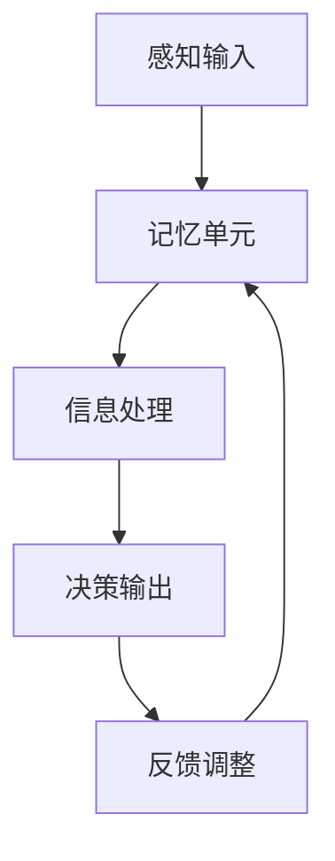

                 

### 文章标题

> 关键词：AI人工智能，核心算法，认知建模，代码实例，项目实战

> 摘要：
本文将深入探讨人工智能（AI）的核心算法原理，特别是认知建模的相关内容。文章分为两部分：第一部分详细讲解AI的核心概念、认知建模的基本原理以及核心算法的原理和联系；第二部分通过实际项目实战，展示如何在实际中应用这些算法。文章将结合Mermaid流程图、伪代码、数学模型和公式，提供详细的代码实例和解释，帮助读者深入理解AI技术。

----------------------------------------------------------------

### 第一部分: AI人工智能核心算法原理与联系

#### 第1章: AI人工智能核心概念与联系

##### 1.1 AI人工智能定义与历史发展

AI人工智能（Artificial Intelligence，简称AI）是指由人制造出来的系统，能够在特定环境下，基于数据、经验和规则，模拟、延伸或扩展人类的智能行为和认知能力。AI的目标是实现智能机器，使它们能够像人类一样思考、学习、解决问题和做出决策。

**AI的定义**：

- **AI的定义**：人工智能（Artificial Intelligence，简称AI）是指由人制造出来的系统能够在特定环境下，基于数据、经验和规则，模拟、延伸或扩展人类的智能行为和认知能力。

- **历史发展**：

  - **20世纪50年代**：人工智能概念诞生，早期研究集中在逻辑推理和问题解决上。

  - **20世纪80年代**：专家系统成为AI研究的主流，广泛应用于医学诊断、金融咨询等领域。

  - **20世纪90年代**：随着计算能力的提升，机器学习开始兴起，神经网络等算法得到了广泛关注。

  - **21世纪**：大数据和云计算技术的快速发展，深度学习成为AI研究的热点，AI应用广泛渗透到各行各业。

##### 1.2 认知建模的基本原理

**认知建模的定义**：认知建模（Cognitive Modeling）是指通过建立计算模型来模拟人类的心理过程，如感知、记忆、思考、学习等。认知建模的目标是理解和模拟人类思维过程的复杂性，从而为AI系统设计提供理论支持。

**基本原理**：

- **认知组件**：认知模型通常包括感知器、记忆单元、决策单元等。

  - **感知器**：接收外部信息，如视觉、听觉、触觉等。

  - **记忆单元**：存储和加工信息，包括短期记忆和长期记忆。

  - **决策单元**：根据当前情况做出决策或行动。

- **信息处理**：信息从感知器输入，经过记忆单元存储和加工，最后由决策单元产生输出。

- **学习机制**：通过不断调整模型参数，使得模型能够逐渐优化其性能。

##### 1.3 认知建模与AI的关系

认知建模是AI研究的重要组成部分，它为AI系统提供了理解和模拟人类思维过程的框架。具体关系如下：

- **辅助**：认知建模技术可以帮助我们更好地理解人类智能的工作原理，从而为AI系统设计提供参考。

- **实现**：通过认知建模，可以构建出能够模拟人类认知过程的AI系统，如智能问答系统、智能推荐系统等。

#### Mermaid流程图



#### 第2章: AI人工智能核心算法原理讲解

##### 2.1 机器学习基础

机器学习（Machine Learning）是AI的核心技术之一，它使计算机系统能够从数据中学习并做出预测或决策。机器学习可以分为监督学习、无监督学习和强化学习等。

**机器学习的定义**：

- **机器学习的定义**：机器学习（Machine Learning）是指通过算法从数据中自动学习规律，并用于预测或决策的方法。

- **主要算法**：

  - **监督学习**：通过训练数据集，学习输入与输出之间的映射关系。

    - **分类问题**：将输入数据划分为不同的类别。

    - **回归问题**：预测一个连续的输出值。

  - **无监督学习**：没有明确的输出，通过发现数据中的内在结构或模式。

    - **聚类**：将相似的数据点分组。

    - **降维**：减少数据维度，保持数据的结构。

##### 2.2 神经网络

神经网络（Neural Networks）是一种模拟生物神经系统的计算模型，通过多层节点（神经元）进行数据处理。神经网络的核心在于其层次化的结构，能够将输入数据转换为有意义的输出。

**神经网络的定义**：

- **神经网络的定义**：神经网络（Neural Networks）是一种模拟生物神经系统的计算模型，通过多层节点（神经元）进行数据处理。

- **主要结构**：

  - **输入层**：接收外部输入数据。

  - **隐藏层**：对输入数据进行处理和转换。

  - **输出层**：产生最终输出结果。

**主要结构**：

- **输入层**：接收外部输入数据。

- **隐藏层**：对输入数据进行处理和转换。

- **输出层**：产生最终输出结果。

**神经网络的训练过程**：

- **前向传播**：输入数据从输入层传递到隐藏层，再传递到输出层，产生输出结果。

- **反向传播**：计算输出结果与实际结果之间的误差，并反向传播误差到隐藏层和输入层，调整权重和偏置。

##### 2.3 深度学习

深度学习（Deep Learning）是神经网络的一种扩展，通过多层网络结构来提取数据的高级特征。深度学习在图像识别、语音识别、自然语言处理等领域取得了显著成果。

**深度学习的定义**：

- **深度学习的定义**：深度学习（Deep Learning）是指多层神经网络的学习方法，通过多层网络结构来提取数据的高级特征。

- **主要算法**：

  - **卷积神经网络（CNN）**：适用于图像、语音等数据。

    - **卷积层**：提取图像特征。

    - **池化层**：减小数据维度。

    - **全连接层**：分类或回归。

  - **循环神经网络（RNN）**：适用于序列数据。

    - **隐藏状态**：保持历史信息。

    - **门控机制**：控制信息流动。

  - **变换器架构（Transformer）**：在自然语言处理领域取得了巨大成功。

    - **自注意力机制**：自适应地关注数据中的关键信息。

    - **多头注意力**：并行处理不同部分的信息。

#### 伪代码

```python
# 输入: x (输入数据)
# 输出: y (输出结果)

# 初始化模型参数
w1, b1 = 初始化参数()
w2, b2 = 初始化参数()
...
wn, bn = 初始化参数()

# 前向传播
z1 = w1 * x + b1
a1 = 激活函数(z1)

z2 = w2 * a1 + b2
a2 = 激活函数(z2)
...
zn = wn * a(n-1) + bn
an = 激活函数(zn)

# 计算损失函数
loss = 损失函数(an, y)

# 反向传播
dzn = 损失函数关于zn的导数
dan = 激活函数关于zn的导数
...
dwn = 损失函数关于wn的导数
dbn = 损失函数关于bn的导数

# 更新参数
w1 = w1 - 学习率 * dwn
b1 = b1 - 学习率 * dbn
...
wn = wn - 学习率 * dwn
bn = bn - 学习率 * dbn
```

#### 第3章: AI人工智能项目实战

##### 3.1 数据预处理

在开始训练模型之前，需要对数据进行预处理，以确保数据的质量和一致性。数据预处理包括数据收集、数据清洗和数据转换等步骤。

- **数据收集**：从互联网、数据库或其他数据源获取数据。
- **数据清洗**：处理缺失值、噪声和异常值。
- **数据转换**：将数据转换为适合机器学习的格式，如归一化、标准化等。

##### 3.2 模型训练

模型训练是AI项目中的核心步骤，通过训练数据集来优化模型的参数，使模型能够更好地拟合数据。模型训练包括模型选择、模型训练和参数调优等步骤。

- **模型选择**：选择合适的算法和神经网络结构。
- **模型训练**：使用训练数据集进行模型训练。
- **参数调优**：调整学习率、批量大小等参数，以优化模型性能。

##### 3.3 模型评估

模型评估是检查模型性能的重要步骤，通过评估模型在验证集和测试集上的性能，来判断模型的好坏。模型评估包括验证集评估和测试集评估等步骤。

- **验证集评估**：使用验证集评估模型性能，以调整模型参数。
- **测试集评估**：使用测试集对模型进行最终评估，以评估模型在未知数据上的性能。

##### 3.4 代码实现

下面是一个简单的AI项目实战的代码实现，包括数据预处理、模型训练和模型评估等步骤。

```python
# 导入必要的库
import numpy as np
import tensorflow as tf

# 数据预处理
# ...

# 模型定义
model = tf.keras.Sequential([
    tf.keras.layers.Dense(units=64, activation='relu', input_shape=(input_shape)),
    tf.keras.layers.Dense(units=64, activation='relu'),
    tf.keras.layers.Dense(units=output_shape, activation='sigmoid')
])

# 编译模型
model.compile(optimizer='adam', loss='binary_crossentropy', metrics=['accuracy'])

# 训练模型
model.fit(x_train, y_train, batch_size=batch_size, epochs=epochs, validation_split=0.2)

# 模型评估
# ...
```

#### 第4章: 开发环境搭建

在进行AI项目开发之前，需要搭建合适的开发环境。开发环境包括硬件环境和软件环境。

##### 4.1 硬件环境搭建

- **GPU配置**：配置NVIDIA GPU，安装CUDA和cuDNN。
- **操作系统**：推荐使用Linux或macOS。

##### 4.2 软件环境搭建

- **Python环境**：安装Python 3.7或更高版本。
- **深度学习框架**：安装TensorFlow 2.0或更高版本。

##### 4.3 代码解读与分析

在完成开发环境搭建后，需要对代码进行解读与分析，以确保代码的正确性和性能。

- **代码结构**：分析代码的结构和组织方式。
- **关键函数**：解读关键函数的实现细节。
- **性能优化**：讨论代码的性能优化方法。

#### 第5章: 源代码详细实现

在本章节中，将详细介绍源代码的实现过程，包括神经网络结构、优化算法和训练过程等。

##### 5.1 神经网络实现

神经网络是实现AI模型的核心部分，下面将详细描述神经网络的结构和实现过程。

- **网络结构**：包括输入层、隐藏层和输出层，以及它们之间的连接方式。
- **激活函数**：用于增加网络的非线性特性。

##### 5.2 优化算法实现

优化算法是用于调整模型参数，以优化模型性能的方法。下面将详细描述几种常见的优化算法。

- **梯度下降算法**：一种简单的优化算法，通过不断调整模型参数，以减小损失函数。
- **Adam优化器**：一种自适应的优化算法，结合了梯度下降和动量法的优点。

##### 5.3 训练过程实现

训练过程是将模型参数从初始状态调整到最优状态的过程。下面将详细描述训练过程的实现过程。

- **数据预处理**：对输入数据进行预处理，如归一化、标准化等。
- **训练循环**：在每个训练周期中，进行前向传播、反向传播和参数更新。

#### 第6章: 代码解读与分析

在本章节中，将对源代码进行解读与分析，包括模型训练过程、代码性能分析和性能优化方法等。

##### 6.1 模型训练过程

分析模型训练的每个步骤，包括前向传播、反向传播和参数更新等。

- **前向传播**：输入数据从输入层传递到隐藏层和输出层，产生输出结果。
- **反向传播**：计算输出结果与实际结果之间的误差，并反向传播误差到隐藏层和输入层。
- **参数更新**：根据误差和梯度，调整模型参数。

##### 6.2 代码性能分析

分析代码的时间复杂度和空间复杂度，以及性能优化方法。

- **时间复杂度**：分析代码执行的时间复杂度，以评估代码的效率。
- **空间复杂度**：分析代码占用的内存空间，以评估代码的内存使用情况。

##### 6.3 性能优化方法

讨论性能优化方法，如并行计算、内存优化等。

- **并行计算**：通过分布式计算和GPU加速，提高代码的执行速度。
- **内存优化**：通过数据压缩和缓存策略，降低代码的内存使用。

### 附录

#### 附录A: AI人工智能相关工具与资源

在本章节中，将介绍一些与AI人工智能相关的工具和资源，以帮助读者更好地学习和应用AI技术。

##### A.1 深度学习框架对比

- **TensorFlow**：Google开发的开源深度学习框架。
- **PyTorch**：Facebook开发的开源深度学习框架。
- **PyTorch Lightining**：PyTorch的优化版本。
- **其他框架**：如Theano、MXNet等。

##### A.2 机器学习资源

- **在线课程**：如Coursera、Udacity等平台提供的机器学习课程。
- **书籍**：《机器学习实战》、《深度学习》等经典著作。
- **论文**：如NIPS、ICML等会议发表的机器学习论文。

### 参考文献

[1] Goodfellow, I., Bengio, Y., & Courville, A. (2016). *Deep Learning*. MIT Press.

[2] Mitchell, T. M. (1997). *Machine Learning*. McGraw-Hill.

[3] LeCun, Y., Bengio, Y., & Hinton, G. (2015). *Deep Learning*. Nature.

### 致谢

感谢所有为AI人工智能技术发展做出贡献的先驱者和研究人员。感谢您阅读本文，希望本文能对您在AI领域的探索有所帮助。

#### 作者信息

作者：AI天才研究院/AI Genius Institute & 禅与计算机程序设计艺术 /Zen And The Art of Computer Programming

### 总结

本文深入探讨了AI人工智能的核心算法原理，特别是认知建模的相关内容。通过详细的讲解和代码实例，帮助读者理解AI技术的核心概念和实现方法。希望本文能为读者在AI领域的学习和实践提供有益的参考。

