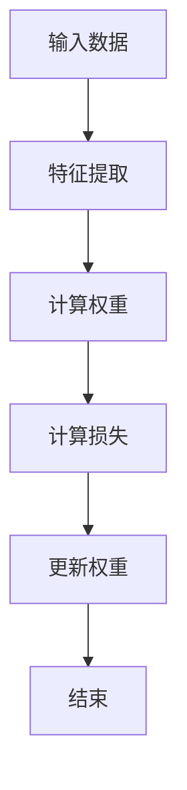

                 

### 文章标题

《AI发展的三大支柱：算法、算力与数据》

### 关键词

- 算法
- 算力
- 数据
- 人工智能
- 机器学习
- 深度学习
- 云计算
- 数据隐私

### 摘要

人工智能（AI）的飞速发展离不开三大支柱：算法、算力和数据。本文将详细探讨这三个关键要素在AI发展中的重要性、相互关系以及实际应用。首先，我们将深入分析算法的原理及其分类，特别是机器学习和深度学习中的经典算法。随后，探讨算力的发展趋势，包括硬件加速技术和云计算在AI中的应用。最后，我们将重点讨论数据的价值、预处理方法和可视化技术，并通过实际案例展示AI项目的全过程。本文旨在为读者提供一个全面、系统的AI技术解读，帮助读者把握AI发展的脉络，为未来的研究和实践打下坚实基础。

### 目录大纲

1. **算法**
   1.1 算法概述
   1.2 机器学习算法基础
   1.3 深度学习算法

2. **算力**
   2.1 算力概述
   2.2 硬件加速技术
   2.3 云计算与AI

3. **数据**
   3.1 数据概述
   3.2 数据预处理
   3.3 数据可视化

4. **综合应用**
   4.1 AI项目实战
   4.2 未来发展趋势

5. **附录**
   5.1 算法流程图
   5.2 数学公式与伪代码
   5.3 开发工具与资源

### 文章正文

#### 第一部分：算法

##### 第1章：算法概述

##### 1.1 算法的定义

算法（Algorithm）是指解决某一特定问题的一系列明确、有序的步骤。算法在计算机科学中至关重要，是程序设计和人工智能（AI）的基础。算法不仅需要正确，还需要高效，以便在有限的时间内解决复杂问题。

##### 1.2 算法的分类

根据不同的标准，算法可以分为多种类型：

- **根据数据结构**：如排序算法、搜索算法等。
- **根据解决问题的策略**：如贪心算法、回溯算法等。
- **根据计算复杂性**：如多项式算法、非多项式算法等。

##### 1.3 算法的特点

- **确定性**：每一步都有明确的规则指导。
- **有穷性**：算法的步骤数量是有限的。
- **可行性**：算法的每一步都是可行的。
- **输入与输出**：算法有输入和输出，输入是解决问题的关键信息，输出是问题的最终答案。

##### 第2章：机器学习算法基础

##### 2.1 监督学习算法

监督学习算法是一种从标记数据中学习预测模型的算法。常见的监督学习算法包括：

- **线性回归**：用于预测连续值。
- **逻辑回归**：用于预测离散值，如分类问题。
- **决策树**：通过树形结构进行分类或回归。
- **随机森林**：多个决策树的集成，提高预测准确性。
- **支持向量机**：通过最大间隔划分数据集。

##### 2.2 无监督学习算法

无监督学习算法不使用标记数据，旨在发现数据中的隐含模式。常见的无监督学习算法包括：

- **K均值聚类**：将数据分为K个簇。
- **主成分分析**：降低数据维度，保持数据结构。
- **聚类算法比较**：比较不同聚类算法的效果。

##### 第3章：深度学习算法

##### 3.1 神经网络基础

神经网络（Neural Network）是模仿生物神经网络构造的计算模型。神经网络由多个节点（神经元）组成，每个节点通过权重连接到其他节点。

- **神经元模型**：每个神经元接收多个输入，并计算加权求和。
- **前向传播**：从输入层到输出层的计算过程。
- **反向传播**：计算损失函数并更新权重的过程。
- **激活函数**：用于引入非线性性的函数，如Sigmoid、ReLU等。

##### 3.2 卷积神经网络

卷积神经网络（Convolutional Neural Network，CNN）是一种专门用于图像和视频处理的神经网络。CNN的主要特点包括：

- **卷积操作**：在图像上进行局部感知，减少参数数量。
- **池化操作**：减小数据维度，增强泛化能力。
- **卷积神经网络结构**：包括卷积层、池化层、全连接层等。

##### 3.3 循环神经网络

循环神经网络（Recurrent Neural Network，RNN）是一种能够处理序列数据的神经网络。RNN通过循环结构实现状态记忆，能够捕捉序列中的时间依赖关系。

- **RNN基本结构**：包含输入门、遗忘门和输出门。
- **LSTM单元**：长短期记忆单元，能够解决RNN的梯度消失问题。
- **GRU单元**：门控循环单元，简化了LSTM的结构。

#### 第二部分：算力

##### 第4章：算力概述

##### 4.1 算力的重要性

算力是指计算能力，是算法高效运行的基础。算力的发展直接影响到算法的性能和AI的应用范围。随着算法的复杂度增加，对算力的需求也日益增长。

##### 4.2 硬件加速技术

硬件加速技术通过使用专门设计的硬件来提高计算速度，是提升算力的重要手段。常见的硬件加速技术包括：

- **GPU加速**：图形处理单元（GPU）在并行计算方面具有显著优势。
- **FPGA加速**：现场可编程门阵列（FPGA）提供高度灵活的硬件加速能力。
- **DPU加速**：专用数据处理单元（DPU）专门用于数据密集型任务。

##### 4.3 云计算与AI

云计算为AI提供了强大的算力支持。通过云平台，用户可以轻松访问高性能计算资源，实现以下应用：

- **云计算基础**：了解云计算的基本概念和架构。
- **云计算在AI中的应用**：如何利用云平台进行模型训练和部署。
- **公共云平台介绍**：介绍AWS、Azure、Google Cloud Platform等公共云平台的特性。

#### 第三部分：数据

##### 第5章：数据概述

##### 5.1 数据的价值

数据是AI的燃料，数据的质量和数量直接影响算法的性能。高质量的数据可以提升模型的准确性和可靠性，而丰富的数据集则为算法创新提供了广阔的空间。

##### 5.2 数据预处理

数据预处理是确保数据适合机器学习模型训练的关键步骤。常见的数据预处理方法包括：

- **数据清洗**：处理缺失值、异常值等。
- **数据集成**：将多个数据源整合为一个统一的数据集。
- **数据转换**：将数据转换为适合机器学习算法的格式。
- **数据归一化**：调整数据范围，提高模型训练的稳定性。

##### 5.3 数据可视化

数据可视化是一种通过图形化方式展示数据的方法，有助于理解和分析数据。常见的数据可视化工具包括：

- **可视化基本概念**：了解数据可视化的重要性和基本原理。
- **常用可视化工具**：介绍常用的可视化库和工具，如Matplotlib、Seaborn等。
- **数据可视化实践**：通过实际案例展示如何使用可视化工具进行分析。

#### 第四部分：综合应用

##### 第6章：AI项目实战

##### 6.1 项目准备

在开始AI项目之前，需要进行充分的准备。项目准备包括以下步骤：

- **项目需求分析**：明确项目目标和需求。
- **项目团队组建**：组建合适的团队，分配任务和责任。
- **开发环境搭建**：配置开发环境和工具，确保开发过程的顺利进行。

##### 6.2 算法与数据应用

算法与数据是AI项目成功的关键。在实际应用中，需要：

- **算法选择**：根据项目需求选择合适的算法。
- **数据集准备**：收集、清洗和预处理数据集。
- **模型训练与优化**：训练模型并进行优化，提高模型性能。

##### 6.3 部署与监控

模型部署和监控是确保AI系统正常运行的重要环节。具体包括：

- **部署策略**：制定模型部署的方案和流程。
- **模型监控**：监控模型运行状态和性能指标。
- **性能调优**：根据监控结果进行模型性能的优化。

#### 第五部分：未来发展趋势

##### 第7章：未来发展趋势

AI技术的发展趋势包括：

- **人工智能的未来方向**：探索AI的新应用场景和可能性。
- **算法创新**：不断提出新的算法和模型，提高AI的性能和效率。
- **硬件发展**：新型硬件技术的出现，如量子计算，将进一步提升算力。
- **数据隐私与安全**：随着数据隐私问题的日益突出，确保数据安全和隐私保护成为重要任务。
- **社会影响**：探讨AI技术在伦理、社会责任和公众认知等方面的影响。

#### 附录

##### 附录A：算法流程图

在此附录中，我们将展示几个经典的算法流程图，包括线性回归、决策树和卷积神经网络等。

##### 附录B：数学公式与伪代码

在此附录中，我们将介绍一些关键的数学公式和伪代码，帮助读者更好地理解算法原理和实现过程。

##### 附录C：开发工具与资源

在此附录中，我们将推荐一些常用的开发工具和资源，包括深度学习框架、数据预处理工具、云计算平台等。

### 结束语

人工智能的三大支柱——算法、算力和数据，共同推动了AI技术的快速发展。通过本文的探讨，我们深入了解了这些关键要素的基本概念、相互关系和实际应用。希望读者能够对AI技术有一个全面、系统的认识，并在未来的研究和实践中不断探索和创新。

### 作者信息

作者：AI天才研究院/AI Genius Institute & 禅与计算机程序设计艺术 /Zen And The Art of Computer Programming

### 参考资料

[1] Bishop, C. M. (2006). **Pattern recognition and machine learning**. Springer.
[2] Goodfellow, I., Bengio, Y., & Courville, A. (2016). **Deep learning**. MIT Press.
[3] Murphy, K. P. (2012). **Machine learning: A probabilistic perspective**. MIT Press.
[4] LeCun, Y., Bengio, Y., & Hinton, G. (2015). **Deep learning**. Nature, 521(7553), 436-444.

<div class="mermaid">
graph TD;
A[算法] --> B[算力];
B --> C[数据];
C --> D[AI];
D --> E[应用];
A --> F[优化];
B --> G[硬件];
C --> H[预处理];
H --> I[可视化];
I --> J[分析];
K[算法流程] --> L[线性回归];
L --> M[决策树];
M --> N[卷积神经网络];
N --> O[神经网络];
O --> P[深度学习];
P --> Q[模型];
Q --> R[训练];
R --> S[优化];
S --> T[部署];
T --> U[监控];
U --> V[调优];
V --> W[应用];
W --> X[未来];
X --> Y[趋势];
Y --> Z[发展];
Z --> A;
</div>

### 第一部分：算法

##### 第1章：算法概述

在人工智能（AI）的世界中，算法是核心驱动力。它们是一系列明确、有序的步骤，用于解决特定问题。算法不仅决定了问题的解决方式，还影响了效率和效果。本章节将探讨算法的定义、分类和特点。

###### 1.1 算法的定义

算法是一种有序的步骤序列，用于解决特定问题。在计算机科学中，算法是程序设计的基础。一个有效的算法需要满足以下条件：

- **确定性**：每一步都有明确的规则指导。
- **有穷性**：算法的步骤数量是有限的。
- **可行性**：算法的每一步都是可行的。
- **输入与输出**：算法有输入和输出，输入是解决问题的关键信息，输出是问题的最终答案。

例如，排序算法就是将一组数据按照特定规则进行排序的算法。常见的排序算法包括冒泡排序、选择排序、插入排序和快速排序。

###### 1.2 算法的分类

根据不同的标准，算法可以分为多种类型：

- **根据数据结构**：如排序算法、搜索算法等。
  - **排序算法**：包括冒泡排序、选择排序、插入排序和快速排序等。
  - **搜索算法**：包括线性搜索和二分搜索等。
- **根据解决问题的策略**：如贪心算法、回溯算法等。
  - **贪心算法**：每一步都选择当前情况下最优的解，但不保证全局最优解。
  - **回溯算法**：通过尝试所有可能的解，并回溯到之前的选择点，以找到最优解。
- **根据计算复杂性**：如多项式算法、非多项式算法等。
  - **多项式算法**：运行时间在多项式时间内，是高效算法。
  - **非多项式算法**：运行时间超过多项式时间，通常被认为是低效算法。

###### 1.3 算法的特点

算法的特点决定了其适用性和效率：

- **确定性**：算法的每一步都有明确的规则指导，保证了结果的可靠性。
- **有穷性**：算法的步骤数量是有限的，确保了问题可以在有限时间内解决。
- **可行性**：算法的每一步都是可行的，不会出现逻辑错误或无法执行的操作。
- **输入与输出**：算法有输入和输出，输入是解决问题的关键信息，输出是问题的最终答案。

这些特点使得算法在计算机科学和人工智能领域发挥了重要作用。算法不仅用于程序设计，还用于解决复杂问题，如数据分析、机器学习和深度学习等。

##### 第2章：机器学习算法基础

机器学习（Machine Learning，ML）是人工智能（AI）的一个重要分支，它通过构建和训练模型，使计算机能够从数据中自动学习和改进。在本章节中，我们将探讨机器学习中的基本概念和经典算法。

###### 2.1 监督学习算法

监督学习（Supervised Learning）是一种机器学习方式，其中模型通过已标记的训练数据学习，然后用于预测未知数据。监督学习算法可以分为回归算法和分类算法。

- **回归算法**：用于预测连续值，如房价预测。常见的回归算法包括：
  - **线性回归**：使用一条直线拟合数据，最小化误差平方和。
    ```latex
    y = ax + b
    ```
  - **岭回归**：通过增加正则项，防止过拟合。
    ```latex
    y = ax + b + λ||w||^2
    ```
  - **套索回归**：结合岭回归和LASSO的正则化方法。

- **分类算法**：用于预测离散值，如垃圾邮件分类。常见的分类算法包括：
  - **决策树**：通过树形结构进行分类，每个节点表示特征，每个分支表示特征的不同取值。
    ```mermaid
    graph TD;
    A[特征] --> B[取值1];
    B --> C[分类1];
    A --> D[取值2];
    D --> E[分类2];
    ```
  - **随机森林**：多个决策树的集成，提高分类准确性。
  - **支持向量机**（SVM）：通过最大间隔划分数据集，适用于高维空间。
    ```mermaid
    graph TD;
    A[数据点] --> B[类别];
    B --> C[分隔超平面];
    ```
  - **K最近邻**（K-Nearest Neighbors，KNN）：根据未知数据点与训练数据点的距离，选择最近的K个点，并预测这些点的多数类别。

###### 2.2 无监督学习算法

无监督学习（Unsupervised Learning）是一种机器学习方式，其中模型在没有标记数据的情况下学习数据的结构。无监督学习算法常用于数据降维、聚类和关联规则挖掘等。

- **聚类算法**：将相似的数据点分组，形成多个簇。常见的聚类算法包括：
  - **K均值聚类**（K-Means Clustering）：将数据点分为K个簇，最小化簇内距离平方和。
    ```mermaid
    graph TD;
    A[数据点] --> B[簇中心];
    B --> C[簇];
    C --> D[更新中心];
    D --> A;
    ```
  - **层次聚类**（Hierarchical Clustering）：通过自底向上或自顶向下的方法构建簇层次结构。
- **降维算法**：将高维数据转换为低维数据，减少计算复杂度。常见的降维算法包括：
  - **主成分分析**（Principal Component Analysis，PCA）：通过保留主要成分，降低数据维度。
  - **线性判别分析**（Linear Discriminant Analysis，LDA）：用于分类问题，通过最大化类间差异和最小化类内差异，选择最优特征。

- **关联规则挖掘**：发现数据项之间的关联关系。常见的算法包括：
  - **Apriori算法**：基于支持度和置信度，发现频繁项集和关联规则。
  - **Eclat算法**：是一种改进的Apriori算法，通过使用频繁模式树来减少计算量。

无监督学习算法不需要标记数据，因此可以用于探索未知的数据结构和关系。它们在数据分析、图像处理和自然语言处理等领域有着广泛的应用。

##### 第3章：深度学习算法

深度学习（Deep Learning，DL）是一种基于多层神经网络的学习方法，它通过模拟人脑的神经网络结构，从大量数据中自动提取特征，实现高层次的抽象和分类。深度学习在图像识别、语音识别和自然语言处理等领域取得了突破性的成果。本章节将介绍深度学习的基本概念、神经网络结构和常用算法。

###### 3.1 神经网络基础

神经网络（Neural Network，NN）是深度学习的基础，它由多个神经元（节点）组成，每个神经元通过权重连接到其他神经元。神经网络通过学习输入和输出之间的关系，实现复杂函数的逼近。

- **神经元模型**：每个神经元接收多个输入，并通过加权求和得到输出。激活函数用于引入非线性，常用的激活函数包括Sigmoid、ReLU和Tanh。

  ```mermaid
  graph TD;
  A[输入] --> B[加权求和];
  B --> C[激活函数];
  C --> D[输出];
  ```

- **前向传播**：神经网络通过前向传播计算输出。每个神经元的输出是下一层输入的一部分，通过权重传递到下一层。

  ```mermaid
  graph TD;
  A[输入层] --> B[隐藏层];
  B --> C[输出层];
  ```

- **反向传播**：神经网络通过反向传播更新权重。在反向传播过程中，计算损失函数，并使用梯度下降算法更新权重，以最小化损失。

  ```mermaid
  graph TD;
  A[输入层] --> B[隐藏层];
  B --> C[输出层];
  C --> D[损失函数];
  D --> E[反向传播];
  E --> F[权重更新];
  ```

- **激活函数**：激活函数是神经网络中引入非线性性的关键。常用的激活函数包括Sigmoid、ReLU和Tanh。

  - **Sigmoid函数**：
    ```latex
    f(x) = \frac{1}{1 + e^{-x}}
    ```
  - **ReLU函数**：
    ```latex
    f(x) = max(0, x)
    ```
  - **Tanh函数**：
    ```latex
    f(x) = \frac{e^x - e^{-x}}{e^x + e^{-x}}
    ```

###### 3.2 卷积神经网络

卷积神经网络（Convolutional Neural Network，CNN）是一种专门用于图像和视频处理的神经网络。CNN通过卷积操作和池化操作，提取图像的特征，并实现高层次的抽象。

- **卷积操作**：卷积操作用于提取图像的特征，通过滑动卷积核在图像上，计算局部特征。

  ```mermaid
  graph TD;
  A[输入图像] --> B[卷积层];
  B --> C[特征图];
  ```

- **池化操作**：池化操作用于降低特征图的维度，增强模型的泛化能力。常见的池化操作包括最大池化和平均池化。

  ```mermaid
  graph TD;
  A[特征图] --> B[池化层];
  B --> C[降维特征];
  ```

- **卷积神经网络结构**：卷积神经网络通常由卷积层、池化层和全连接层组成。

  ```mermaid
  graph TD;
  A[输入图像] --> B[卷积层1];
  B --> C[池化层1];
  C --> D[卷积层2];
  D --> E[池化层2];
  E --> F[全连接层];
  F --> G[输出层];
  ```

###### 3.3 循环神经网络

循环神经网络（Recurrent Neural Network，RNN）是一种能够处理序列数据的神经网络。RNN通过循环结构实现状态记忆，能够捕捉序列中的时间依赖关系。

- **RNN基本结构**：RNN由输入门、遗忘门和输出门组成。

  ```mermaid
  graph TD;
  A[输入] --> B[输入门];
  B --> C[状态];
  C --> D[遗忘门];
  D --> E[新状态];
  E --> F[输出门];
  F --> G[输出];
  ```

- **LSTM单元**：长短期记忆单元（Long Short-Term Memory，LSTM）是RNN的一种改进，能够解决RNN的梯度消失问题。

  ```mermaid
  graph TD;
  A[输入] --> B[输入门];
  B --> C[遗忘门];
  C --> D[输入门];
  D --> E[新状态];
  E --> F[遗忘门];
  F --> G[输出门];
  ```

- **GRU单元**：门控循环单元（Gated Recurrent Unit，GRU）是LSTM的简化版，具有更简单的结构。

  ```mermaid
  graph TD;
  A[输入] --> B[输入门];
  B --> C[新状态];
  C --> D[遗忘门];
  D --> E[输出门];
  ```

深度学习算法在图像识别、语音识别和自然语言处理等领域取得了显著成果。通过不断改进神经网络结构和优化算法，深度学习将继续推动人工智能的发展。

#### 第二部分：算力

##### 第4章：算力概述

算力，即计算能力，是人工智能（AI）发展的核心驱动力之一。它代表了计算机执行计算任务的能力，直接影响着算法的运行效率和AI系统的整体性能。随着AI技术的迅速发展，算力的需求也在不断增长。本章节将探讨算力的重要性，以及如何通过硬件加速技术和云计算来提升算力。

###### 4.1 算力的重要性

算力在AI发展中的作用至关重要，主要体现在以下几个方面：

- **算法效率**：高效的算力能够显著提高算法的运行速度，减少训练和推理时间，使AI系统能够更快速地应对复杂任务。
- **模型大小**：算力强大的系统可以训练更大、更复杂的模型，提高模型的准确性和鲁棒性。
- **实时处理**：对于一些实时应用，如自动驾驶、实时语音识别等，强大的算力能够保证系统的实时响应和处理能力。
- **创新潜力**：强大的算力为研究人员提供了更多的机会去尝试和探索新的算法和模型，推动AI技术的不断创新。

因此，算力不仅是AI系统性能的关键因素，也是推动AI技术不断前进的基础。

###### 4.2 硬件加速技术

为了提升算力，硬件加速技术成为了一个重要方向。这些技术通过使用专门的硬件设备，提高了计算速度和效率。以下是几种常见的硬件加速技术：

- **GPU加速**：图形处理单元（GPU）在并行计算方面具有显著优势。GPU拥有大量的计算单元，能够同时处理多个任务，这使得它在训练深度学习模型时特别有效。例如，深度学习框架如TensorFlow和PyTorch都支持GPU加速。

- **FPGA加速**：现场可编程门阵列（FPGA）提供高度灵活的硬件加速能力。FPGA可以通过编程来定制硬件逻辑，使其适用于特定的计算任务。这使得FPGA在处理特定类型的数据处理任务时，能够提供比通用硬件更高的性能。

- **DPU加速**：专用数据处理单元（DPU）是针对数据密集型任务的硬件加速器。DPU专门用于处理数据包、网络流和存储任务，能够显著提高数据中心和网络设备的性能。

硬件加速技术的应用，不仅提高了AI系统的计算效率，还为研究人员提供了更多可能性，使得复杂任务能够得到更快速和高效的解决。

###### 4.3 云计算与AI

云计算在AI领域扮演了重要角色，为研究人员和开发者提供了强大的算力支持。通过云平台，用户可以轻松访问高性能计算资源，实现以下应用：

- **云计算基础**：云计算是一种通过互联网提供计算资源的服务模式。它包括基础设施即服务（IaaS）、平台即服务（PaaS）和软件即服务（SaaS）等多种形式。云平台提供了弹性计算、存储和网络资源，用户可以根据需求动态调整资源。

- **云计算在AI中的应用**：云计算为AI提供了强大的计算资源，使得大规模模型训练和复杂算法的实现成为可能。例如，深度学习模型的训练通常需要大量的计算资源，而云平台可以提供弹性扩展的GPU集群，满足训练需求。此外，云计算还支持模型的部署和运维，使得AI系统能够更快速地推向市场。

- **公共云平台介绍**：常见的公共云平台包括亚马逊Web服务（AWS）、微软Azure和Google Cloud Platform。这些平台提供了丰富的计算、存储和数据处理服务，用户可以根据需求选择合适的云服务和资源。

云计算与AI的结合，不仅提高了计算效率，还为AI技术的发展提供了广阔的空间。通过云计算，研究人员和开发者可以更加专注于算法创新和模型优化，而不必担心计算资源的限制。

#### 第三部分：数据

##### 第5章：数据概述

数据是人工智能（AI）发展的核心驱动力，没有高质量的数据，AI模型将难以发挥其潜力。在本章节中，我们将探讨数据的基本概念、类型和重要性，并解释为什么数据是AI发展的基础。

###### 5.1 数据的价值

数据是现代AI系统的燃料，其价值体现在以下几个方面：

- **算法训练**：AI模型需要大量数据进行训练，通过学习数据中的模式和规律，模型能够实现预测和分类任务。数据的质量直接影响模型的效果和准确性。
- **模型优化**：通过对数据进行分析，可以发现模型中的问题，从而进行优化和改进。数据的质量和多样性是优化AI模型的关键。
- **业务决策**：在商业环境中，数据提供了关于市场趋势、用户行为和业务绩效的宝贵信息，有助于企业做出更加明智的决策。

高质量的数据能够提升AI模型的准确性和鲁棒性，从而在实际应用中取得更好的效果。

###### 5.2 数据预处理

数据预处理是确保数据适合机器学习模型训练的关键步骤。以下是一些常见的数据预处理方法：

- **数据清洗**：数据清洗旨在处理数据中的错误、缺失值和异常值。常见的方法包括填充缺失值、删除异常值和纠正错误数据。
- **数据集成**：数据集成是将来自多个数据源的数据合并为一个统一的数据集。这通常需要解决数据格式不一致、数据重复和缺失值等问题。
- **数据转换**：数据转换包括将数据转换为适合机器学习算法的格式，例如归一化和标准化。这些方法可以减少数据的方差，提高模型训练的效果。
- **数据归一化**：数据归一化是将数据缩放到一个特定的范围，例如0到1之间。这有助于模型在不同特征之间的比较，提高模型的稳定性。

通过数据预处理，我们可以确保数据的质量，提高模型训练的效率和效果。

###### 5.3 数据可视化

数据可视化是一种通过图形化方式展示数据的方法，有助于我们理解和分析数据。以下是一些常见的数据可视化工具和基本概念：

- **可视化工具**：常见的数据可视化工具包括Matplotlib、Seaborn、Plotly等。这些工具提供了丰富的图形和图表类型，可以帮助我们直观地展示数据。
- **基本概念**：数据可视化包括数据分布、趋势分析、关联性分析等基本概念。例如，条形图可以展示不同类别的数据分布，折线图可以展示数据的变化趋势。
- **实践案例**：通过实际案例，我们可以展示如何使用可视化工具分析数据。例如，使用Matplotlib绘制一个简单的折线图，展示数据的变化趋势。

数据可视化不仅帮助我们更好地理解数据，还可以为数据分析和业务决策提供有力支持。

#### 第四部分：综合应用

##### 第6章：AI项目实战

在本章节中，我们将通过一个实际案例，详细展示如何使用AI技术进行项目开发。该案例将涵盖项目准备、算法与数据应用、模型训练与优化、部署与监控等关键步骤，帮助读者更好地理解AI项目的全过程。

###### 6.1 项目准备

在开始AI项目之前，我们需要进行充分的准备，包括以下步骤：

- **项目需求分析**：明确项目目标和需求。例如，我们可能需要开发一个图像识别系统，用于自动分类图片中的物体。
- **项目团队组建**：组建一个包含数据科学家、软件工程师、产品经理等角色的团队。每个成员都有明确的职责和任务，以确保项目的顺利进行。
- **开发环境搭建**：配置开发环境，包括安装Python、深度学习框架（如TensorFlow或PyTorch）和其他必要的工具和库。同时，确保拥有足够的计算资源，如GPU，以支持模型训练。

###### 6.2 算法与数据应用

算法与数据是AI项目成功的关键。在本案例中，我们将使用卷积神经网络（CNN）进行图像识别，并详细介绍以下步骤：

- **算法选择**：根据项目需求，选择合适的算法。在本案例中，我们选择使用CNN进行图像识别，因为CNN在处理图像数据时具有显著优势。
- **数据集准备**：收集并预处理图像数据。预处理步骤包括数据清洗、归一化和数据增强。数据增强是通过生成图像的变体，提高模型的泛化能力。
- **模型训练**：使用预处理后的数据训练CNN模型。训练过程中，通过反向传播算法和梯度下降优化模型参数，提高模型性能。
- **模型优化**：通过交叉验证和超参数调整，优化模型性能。常用的优化方法包括学习率调整、批次大小和正则化等。

通过上述步骤，我们最终得到一个性能良好的图像识别模型。

###### 6.3 部署与监控

模型部署与监控是确保AI系统能够稳定运行和持续优化的重要环节。以下是我们案例中的具体步骤：

- **部署策略**：将训练好的模型部署到生产环境，例如使用API服务或微服务架构。部署过程中，需要考虑模型的版本管理和故障处理。
- **模型监控**：监控模型的运行状态和性能指标，如准确率、召回率等。通过监控，我们可以及时发现和解决模型异常。
- **性能调优**：根据监控结果，对模型进行性能调优。例如，通过重新训练模型或调整超参数，提高模型性能。

通过以上步骤，我们确保AI系统能够稳定、高效地运行，满足业务需求。

##### 第7章：未来发展趋势

人工智能（AI）技术正在迅速发展，其未来趋势将带来更多的机遇和挑战。以下是我们对未来AI技术发展趋势的展望：

###### 7.1 AI发展趋势

- **算法创新**：随着深度学习和强化学习等技术的不断发展，AI算法将更加智能和高效。未来的算法将更加注重泛化能力和解释性，使AI系统能够更好地适应各种应用场景。
- **硬件发展**：硬件技术的发展，如量子计算、光子计算等，将进一步提升AI系统的计算能力。这些新型硬件将为AI算法的创新提供强大支持。
- **跨学科融合**：AI技术将与其他学科如生物学、心理学、哲学等深度融合，推动AI技术的跨越式发展。跨学科的融合将带来更多创新的应用场景和解决方案。

###### 7.2 数据隐私与安全

随着AI技术的发展，数据隐私和安全问题日益突出。以下是我们对数据隐私与安全的一些展望：

- **数据隐私保护**：未来的AI系统将更加注重数据隐私保护，采用加密、匿名化等技术确保用户数据的安全。同时，隐私保护算法将得到更多研究，以在保护隐私的同时实现高效的数据分析。
- **安全挑战与对策**：AI系统面临的攻击和威胁将更加复杂。未来的安全研究将关注对抗攻击、模型窃取和模型中毒等问题，并提出相应的对策和防御机制。
- **合规要求**：随着数据隐私法规的不断完善，AI系统将需要满足更多的合规要求。企业需要建立完善的数据治理体系，确保AI系统的合规性和安全性。

###### 7.3 社会影响

AI技术的发展将对社会产生深远影响。以下是我们对未来AI技术社会影响的展望：

- **AI伦理问题**：随着AI技术的广泛应用，伦理问题将成为重要议题。如何确保AI系统的公平性、透明性和可解释性，将需要更多的研究和政策指导。
- **社会责任**：企业和社会需要承担更多的社会责任，确保AI技术造福人类。这包括推动AI技术在教育、医疗、环境保护等领域的应用，以及关注AI技术可能带来的就业和社会结构变化。
- **公众认知**：提高公众对AI技术的认知和理解，是推动AI技术健康发展的重要环节。通过教育和宣传，公众将更好地了解AI技术的优势和风险，积极参与到AI技术的应用和管理中。

未来，AI技术将继续快速发展，成为推动社会进步的重要力量。通过不断创新、加强数据隐私与安全和积极应对社会挑战，AI技术将为人类带来更多福祉。

### 附录

#### 附录A：算法流程图

在本文中，我们使用Mermaid图形化工具展示了多个算法的流程图。以下是一个简单的线性回归算法流程图的示例：



该流程图展示了线性回归算法的基本步骤，包括输入数据、特征提取、计算权重、计算损失和更新权重。

#### 附录B：数学公式与伪代码

在本附录中，我们将介绍一些关键的数学公式和伪代码，以帮助读者更好地理解算法原理和实现过程。

##### 数学公式

以下是一个简单的线性回归模型和其损失函数的数学公式：

$$
y = \beta_0 + \beta_1x
$$

损失函数（均方误差）：

$$
J(\theta) = \frac{1}{2m} \sum_{i=1}^{m} (h_\theta(x^{(i)}) - y^{(i)})^2
$$

其中，$h_\theta(x) = \theta_0 + \theta_1x$是预测值，$\theta_0$和$\theta_1$是模型参数。

##### 伪代码

以下是一个简单的线性回归算法的伪代码：

```
初始化：theta = [theta_0, theta_1]
学习率 alpha = 0.01
迭代次数 num_iterations = 1000

for i = 1 to num_iterations:
    gradients = [0, 0]
    for each example (x^(i), y^(i)) in the dataset:
        hypothesis = theta_0 + theta_1 * x^(i)
        gradients[0] += (hypothesis - y^(i))
        gradients[1] += (hypothesis - y^(i)) * x^(i)
    theta = theta - alpha * gradients
return theta
```

该伪代码展示了如何使用梯度下降算法训练线性回归模型。

#### 附录C：开发工具与资源

在本附录中，我们将介绍一些常用的开发工具和资源，以帮助读者在AI项目中更好地利用算法、算力和数据。

##### 深度学习框架

- **TensorFlow**：由Google开发，是一个广泛使用的开源深度学习框架，支持多种编程语言，包括Python和C++。
- **PyTorch**：由Facebook开发，是一个灵活且易用的深度学习框架，特别适合研究和原型开发。
- **Keras**：是一个高级神经网络API，能够在TensorFlow和Theano后端上运行，简化了深度学习模型的构建和训练。

##### 数据预处理工具

- **Pandas**：一个强大的数据操作库，提供数据清洗、数据转换和数据合并等功能。
- **Scikit-learn**：一个用于机器学习的Python库，包括多种机器学习算法和工具，特别适合数据预处理和模型评估。
- **NumPy**：一个用于科学计算的Python库，提供了强大的多维数组对象和数学函数，是数据科学和机器学习的基础。

##### 云计算平台

- **AWS**（Amazon Web Services）：提供广泛的云计算服务，包括EC2实例、S3存储和DynamoDB数据库。
- **Azure**：微软提供的云服务平台，包括Azure Machine Learning、Azure Databricks和Azure Kubernetes Service等。
- **Google Cloud Platform**：提供强大的云计算服务，包括Google AI、TensorFlow和BigQuery等。

##### 其他资源

- **论文与报告**：阅读最新的学术论文和行业报告，了解AI领域的最新研究进展和应用案例。
- **书籍与教程**：参考权威的书籍和在线教程，系统地学习AI、机器学习和深度学习的知识。
- **社区与论坛**：参与在线社区和论坛，与同行交流经验，解决技术问题，获取最新动态。

通过使用这些开发工具和资源，读者可以更加高效地开展AI项目，推动人工智能技术的发展和应用。

