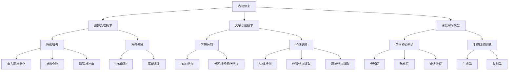

                 

# AI在古籍修复中的应用：保护文化遗产

## 关键词：
古籍修复、人工智能、图像处理、深度学习、文化遗产保护

## 摘要：
本文深入探讨了人工智能（AI）技术在古籍修复领域的应用，旨在通过逻辑清晰、结构紧凑的分析，展示AI技术在提升古籍修复效率和精度方面的潜力。文章首先概述了古籍修复的重要性及现存挑战，随后详细介绍了AI技术在图像处理、文字识别等方面的应用，并通过实际案例展示了AI技术在古籍修复中的具体应用。文章最后对AI技术在古籍修复中的未来发展方向提出了展望。

## 目录

1. AI在古籍修复中的应用概述
2. AI技术在古籍修复中的应用
3. AI在古籍修复中的应用实践
4. AI技术在古籍修复中的挑战与展望
5. 应用案例研究
6. AI技术在古籍修复中的应用前景
7. 总结与展望

----------------------------------------------------------------

## 第一部分: AI在古籍修复中的应用概述

### 第1章: AI在古籍修复中的重要性

#### 1.1 古籍修复的重要性

古籍是人类文明的重要组成部分，承载着丰富的历史、文化和知识。古籍修复的重要性体现在以下几个方面：

- **历史价值**：古籍是历史的见证，记录了古代社会、政治、经济、文化等方面的信息。通过修复古籍，我们可以更好地了解和传承历史。
  
- **文化价值**：古籍是民族文化的重要组成部分，反映了民族的传统、习俗和价值观念。修复古籍有助于保护和传承民族文化。

- **学术价值**：古籍是学术研究的重要资料，对各个学科的研究都具有重要参考价值。修复古籍可以提升学术研究的准确性和深度。

#### 1.1.1 古籍的定义与价值

古籍是指历史上形成的、具有特定价值和意义的书籍。古籍的价值可以通过以下公式来衡量：

$$
V = f(A, E, H)
$$

其中，$V$ 表示古籍的价值，$A$ 表示作者，$E$ 表示内容，$H$ 表示历史价值。

- **作者**：古籍的作者往往是当时的知名学者、政治家或文化名人，他们的作品具有较高的学术和文化价值。
  
- **内容**：古籍的内容涵盖了各个领域，包括哲学、文学、医学、科学等，具有丰富的知识和智慧。
  
- **历史价值**：古籍反映了当时的社会、政治、文化背景，对于研究历史具有重要的参考价值。

#### 1.1.2 古籍的现状与挑战

古籍修复面临的挑战主要包括物理损害和化学侵蚀：

- **物理损害**：
  - **虫蛀**：古籍纸张易受虫害，尤其是白蚁、衣鱼等。
  - **水渍**：古籍遇水后容易褪色、粘连。
  - **磨损**：长期翻阅导致书页磨损。

- **化学侵蚀**：
  - **酸化**：纸张在长时间保存过程中会逐渐酸化。
  - **褪色**：颜料和墨水易褪色。

#### 1.1.3 AI技术在古籍修复中的潜在应用

AI技术在古籍修复中具有广泛的应用前景，主要包括以下方面：

- **图像处理技术**：用于提高古籍图像的清晰度，去除噪声和斑点。
- **深度学习模型**：用于文字识别、图像去噪和损伤预测等。

#### 1.1.4 古籍修复的AI技术发展现状与趋势

目前，AI技术在古籍修复中的应用主要包括：

- **图像增强**：用于提高古籍图像的清晰度。
- **图像去噪**：去除古籍图像上的杂质和斑点。
- **文字识别**：用于提取古籍中的文字内容。

未来，AI技术在古籍修复领域的趋势包括：

- **自适应修复**：根据古籍的特点和损伤程度，自动选择最佳的修复方法。
- **全息修复**：利用三维扫描技术，实现对古籍全方位的修复和保护。

### 第2章: AI技术在古籍修复中的应用

#### 2.1 图像处理技术在古籍修复中的应用

##### 2.1.1 图像增强技术

图像增强技术在古籍修复中主要用于提高古籍图像的清晰度和对比度，使其更易于阅读和研究。常见的图像增强技术包括：

- **直方图均衡化**：通过调整图像的灰度分布，使图像的对比度增强。公式如下：

$$
f(x) = \frac{1}{C} \sum_{i=0}^{255} c_i \cdot \text{pdf}(x_i)
$$

其中，$f(x)$ 表示新的灰度值，$C$ 表示图像的灰度级数，$c_i$ 表示第 $i$ 个灰度值的累积分布函数（CDF），$\text{pdf}(x_i)$ 表示第 $i$ 个灰度值的概率密度函数（PDF）。

- **对数变换**：通过对图像进行对数变换，提高图像的对比度。公式如下：

$$
f(x) = \log(x)
$$

- **增强对比度**：通过线性变换，增强图像的对比度。公式如下：

$$
f(x) = kx + b
$$

其中，$k$ 表示对比度增强系数，$b$ 表示亮度调整。

##### 2.1.2 图像去噪技术

图像去噪技术用于去除古籍图像上的噪声和斑点，提高图像质量。常见的图像去噪技术包括：

- **中值滤波**：通过选择邻域内的中值来替换当前像素值，实现去噪。公式如下：

$$
f(i, j) = \text{median}(P_{i-1, j-1}, P_{i-1, j}, P_{i-1, j+1}, P_{i, j-1}, P_{i, j+1}, P_{i+1, j-1}, P_{i+1, j}, P_{i+1, j+1})
$$

其中，$f(i, j)$ 表示新图像的像素值，$P_{i-1, j-1}, P_{i-1, j}, P_{i-1, j+1}, P_{i, j-1}, P_{i, j+1}, P_{i+1, j-1}, P_{i+1, j}, P_{i+1, j+1}$ 分别表示邻域内的像素值。

- **高斯滤波**：通过高斯滤波器对图像进行卷积，实现去噪。公式如下：

$$
f(i, j) = \sum_{x=-\sigma_x}^{\sigma_x} \sum_{y=-\sigma_y}^{\sigma_y} w(x, y) \cdot P(i-x, j-y)
$$

其中，$f(i, j)$ 表示新图像的像素值，$P(i-x, j-y)$ 表示原始图像的像素值，$w(x, y)$ 表示高斯滤波器的权重，$\sigma_x$ 和 $\sigma_y$ 分别表示滤波器的水平和垂直标准差。

##### 2.1.3 文字识别技术

文字识别技术用于提取古籍图像中的文字内容，为后续的数字化处理和学术研究提供支持。常见的文字识别技术包括：

- **基于特征的方法**：例如，HOG（Histogram of Oriented Gradients）。这种方法通过提取图像的边缘和方向特征，实现对文字的识别。

- **基于深度学习的方法**：例如，卷积神经网络（CNN）。这种方法通过多层卷积和池化操作，提取图像的深层特征，实现对文字的识别。

文字识别算法的流程通常包括以下几个步骤：

1. **图像预处理**：包括二值化、降噪、灰度化等。
2. **字符分割**：将连续的文本图像分割成单个字符图像。
3. **特征提取**：提取字符的视觉特征。
4. **分类器训练**：使用训练数据集训练分类器。
5. **字符识别**：对分割后的字符图像进行识别。

#### 2.2 深度学习模型在古籍修复中的应用

深度学习模型在古籍修复中具有广泛的应用，包括图像去噪、文字识别和损伤预测等。

##### 2.2.1 卷积神经网络（CNN）

卷积神经网络（CNN）是一种专门用于处理图像数据的深度学习模型，具有强大的特征提取和分类能力。

- **卷积层**：用于提取图像的特征。
- **池化层**：用于降低特征图的维度。
- **全连接层**：用于分类和回归任务。

CNN的基本结构如下：

```
输入层 -> 卷积层 -> 池化层 -> 卷积层 -> 池化层 -> 全连接层 -> 输出层
```

CNN的激活函数通常包括ReLU（Rectified Linear Unit）和Sigmoid等。

- **ReLU**：用于引入非线性，加速模型的收敛速度。
- **Sigmoid**：用于将输出值映射到（0,1）之间，适用于分类任务。

CNN的损失函数通常包括交叉熵损失和均方误差损失。

- **交叉熵损失**：用于分类任务。
- **均方误差损失**：用于回归任务。

##### 2.2.2 生成对抗网络（GAN）

生成对抗网络（GAN）是一种由生成器和鉴别器组成的深度学习模型，主要用于图像生成和去噪等任务。

- **生成器**：用于生成模拟数据。
- **鉴别器**：用于区分真实数据和生成数据。

GAN的基本结构如下：

```
生成器 -> 鉴别器
```

GAN的损失函数包括生成器损失和鉴别器损失。

- **生成器损失**：最小化生成数据的判别损失。
- **鉴别器损失**：最大化鉴别器对真实数据和生成数据的区分能力。

GAN的损失函数通常包括以下两部分：

1. **生成器损失**：

$$
L_G = -\log(D(G(z)))
$$

其中，$G(z)$ 表示生成器的输出，$D$ 表示鉴别器。

2. **鉴别器损失**：

$$
L_D = -[\log(D(G(z)) + \log(D(x))]
$$

其中，$x$ 表示真实数据，$z$ 表示随机噪声。

##### 2.2.3 案例一：基于GAN的古籍图像去噪

案例背景：古籍图像存在噪声和模糊，影响修复效果。

解决方案：使用生成对抗网络（GAN）进行图像去噪。

技术实现：

1. **数据集准备**：收集大量古籍图像及其噪声版本。

2. **模型架构**：使用判别器-生成器架构的GAN模型。

3. **模型训练**：使用古籍图像和其噪声版本进行训练。

4. **结果评估**：使用PSNR（峰值信噪比）和SSIM（结构相似性指数）评估去噪效果。

#### 2.2.4 案例二：基于深度学习的古籍文字识别

案例背景：古籍文字难以识别，影响内容的提取和保存。

解决方案：使用深度学习模型进行古籍文字识别。

技术实现：

1. **数据集准备**：收集大量古籍文本及其标注数据。

2. **模型选择**：使用卷积神经网络（CNN）。

3. **模型训练**：使用训练数据集训练模型。

4. **结果评估**：使用准确率、召回率和F1值评估识别效果。

##### 2.2.5 案例三：古籍数字化与共享

案例背景：古籍数字化与共享的流程复杂。

解决方案：开发智能化的古籍数字化系统，实现便捷的数据共享。

技术实现：

1. **系统架构**：使用图像处理和文字识别技术。

2. **功能模块**：图像获取、预处理、文字识别、数据库构建、数据共享等。

3. **用户界面**：提供友好的用户界面，便于操作和使用。

### 第二部分: AI在古籍修复中的应用实践

#### 第3章: AI在古籍修复中的应用实践

##### 3.1 实践一：古籍图像预处理

###### 3.1.1 图像获取与预处理

###### 3.1.1.1 图像获取

古籍图像的获取来源主要包括：

- **数字化古籍数据库**：如国家图书馆、哈佛大学图书馆等机构的数字化古籍数据库。
- **图书馆馆藏**：通过图书馆的古籍扫描项目获取古籍图像。

古籍图像的常见格式包括JPEG、PNG等。

###### 3.1.1.2 图像预处理

古籍图像预处理的主要步骤包括：

- **去噪**：使用中值滤波或高斯滤波去除图像上的噪声。
- **增强对比度**：使用直方图均衡化或对数变换增强图像的对比度。
- **灰度化**：将彩色图像转换为灰度图像，以便进行后续的文字识别处理。

###### 3.1.2 数据集构建

数据集构建是AI应用的关键步骤，主要包括以下几个步骤：

- **数据收集**：从古籍数据库和图书馆馆藏中收集大量古籍图像。

- **数据预处理**：对收集的古籍图像进行去噪、增强对比度和灰度化处理。

- **数据标注**：对预处理后的古籍图像进行文字标注，包括字符位置、字体和大小等。

- **数据分割**：将标注后的古籍图像分割成单个字符图像。

- **数据增强**：通过随机裁剪、旋转和缩放等方法扩充数据集，提高模型的泛化能力。

###### 3.1.3 模型训练与优化

模型训练与优化的主要步骤包括：

- **模型选择**：选择合适的模型架构，如卷积神经网络（CNN）或生成对抗网络（GAN）。

- **模型训练**：使用预处理后的数据集进行模型训练，通过调整超参数如学习率、批量大小等，优化模型性能。

- **模型评估**：使用验证集评估模型的性能，包括准确率、召回率和F1值等指标。

- **模型优化**：根据评估结果，调整模型结构或超参数，进一步提高模型性能。

###### 3.1.4 结果评估与可视化

结果评估与可视化的主要步骤包括：

- **评估指标**：使用准确率、召回率和F1值等指标评估模型性能。

- **可视化**：通过图像对比、混淆矩阵等可视化方法展示模型的性能和效果。

##### 3.2 实践二：古籍文字识别

古籍文字识别是古籍数字化的重要环节，其主要步骤包括：

- **图像预处理**：包括灰度化、二值化、去噪等步骤。

- **字符分割**：将连续的文本图像分割成单个字符图像。

- **特征提取**：提取字符的视觉特征，如边缘、纹理和形状等。

- **分类器训练**：使用训练数据集训练分类器。

- **字符识别**：对分割后的字符图像进行识别。

具体流程如下：

###### 3.2.1 数据预处理

古籍图像预处理的主要步骤包括：

- **图像灰度化**：将彩色图像转换为灰度图像。

- **二值化**：将灰度图像转换为二值图像，便于后续的字符分割。

- **去噪**：使用中值滤波或高斯滤波去除图像上的噪声。

###### 3.2.2 字符分割

字符分割的主要步骤包括：

- **连通域分析**：将连通域内的像素划分为一个字符。

- **连通域合并**：将相邻的连通域合并为单个字符。

常用的字符分割算法包括：

- **基于阈值的方法**：通过设定阈值将图像分割成连通域。

- **基于轮廓的方法**：通过检测图像的轮廓实现字符分割。

###### 3.2.3 特征提取

特征提取的主要步骤包括：

- **边缘检测**：使用Sobel算子、Canny算子等检测图像的边缘。

- **纹理特征提取**：使用Gabor滤波器、Haralick特征等提取图像的纹理特征。

- **形状特征提取**：使用Hu矩、Zernike矩等提取图像的形状特征。

常用的特征提取算法包括：

- **HOG（Histogram of Oriented Gradients）**：用于描述图像的边缘和方向特征。

- **CNN（Convolutional Neural Network）**：用于提取更深层次的图像特征。

###### 3.2.4 模型训练与评估

模型训练与评估的主要步骤包括：

- **数据集划分**：将数据集划分为训练集、验证集和测试集。

- **模型训练**：使用训练集训练分类器，通过交叉熵损失函数优化模型参数。

- **模型评估**：使用验证集评估模型性能，通过准确率、召回率和F1值等指标评估模型效果。

- **模型优化**：根据评估结果调整模型结构或超参数，优化模型性能。

常用的评估指标包括：

- **准确率**：分类任务中的正确率。

- **召回率**：分类任务中被正确分类的样本占比。

- **F1值**：准确率的调和平均值。

##### 3.3 实践三：古籍数字化

古籍数字化是将古籍内容转换为电子格式，以便于存储、检索和研究。其主要步骤包括：

- **图像获取与预处理**：使用相机或扫描仪获取古籍图像，并进行预处理。

- **文字识别**：使用深度学习模型对预处理后的图像进行文字识别。

- **结果整理**：将识别结果整理成文本格式，存储在数据库中。

- **数据共享**：将数字化后的古籍内容共享给其他机构和研究人员。

具体流程如下：

###### 3.3.1 图像获取与预处理

古籍图像获取与预处理的主要步骤包括：

- **图像获取**：使用相机或扫描仪获取古籍图像。

- **图像预处理**：包括去噪、增强对比度、灰度化等步骤。

常用的图像预处理方法包括：

- **去噪**：使用中值滤波或高斯滤波去除图像上的噪声。

- **增强对比度**：使用直方图均衡化或对数变换增强图像的对比度。

- **灰度化**：将彩色图像转换为灰度图像，便于后续的文字识别处理。

###### 3.3.2 文字识别

古籍文字识别的主要步骤包括：

- **图像预处理**：对获取的古籍图像进行预处理，包括灰度化、二值化、去噪等。

- **字符分割**：将连续的文本图像分割成单个字符图像。

- **特征提取**：提取字符的视觉特征。

- **分类器训练**：使用训练数据集训练分类器。

- **字符识别**：对分割后的字符图像进行识别。

常用的文字识别算法包括：

- **基于特征的方法**：如HOG（Histogram of Oriented Gradients）。

- **基于深度学习的方法**：如卷积神经网络（CNN）。

###### 3.3.3 结果整理

古籍文字识别的结果整理主要包括：

- **识别结果提取**：将识别结果从图像中提取出来。

- **文本格式转换**：将识别结果转换成文本格式，如JSON、XML等。

- **存储与检索**：将整理后的文本内容存储在数据库中，便于后续的检索和研究。

###### 3.3.4 数据共享

古籍数字化后的数据共享主要包括：

- **数据共享平台**：建立古籍数字化数据共享平台，供研究人员和公众访问。

- **数据权限管理**：对共享的数据进行权限管理，确保数据的合法使用。

- **数据更新与维护**：定期更新数据库中的数据，确保数据的准确性。

### 第4章: AI技术在古籍修复中的挑战与展望

#### 4.1 挑战

尽管AI技术在古籍修复中展现出巨大的潜力，但仍然面临一些挑战：

- **数据不足**：高质量的古籍图像和文字数据不足，限制了模型的训练和优化。
- **计算资源需求**：深度学习模型训练成本高，计算资源需求大，特别是在处理大量古籍图像时。
- **模型泛化能力**：模型在特定领域或数据集上的泛化能力不足，无法很好地应对不同的古籍修复场景。

#### 4.2 展望

未来，AI技术在古籍修复领域有望实现以下发展：

- **个性化修复**：根据古籍的特点和损伤程度，实现个性化的修复方案。
- **智能修复系统**：开发智能化的古籍修复系统，实现自动化流程，提高修复效率和质量。
- **跨学科合作**：与文物保护、历史研究等领域进行跨学科合作，共同推动古籍修复技术的发展。

### 第5章: AI技术在古籍修复中的应用案例研究

#### 5.1 案例一：基于GAN的古籍图像去噪

##### 5.1.1 案例背景

古籍图像在数字化过程中往往受到噪声和模糊的影响，这会影响修复效果和后续的文本识别。为了解决这个问题，研究者提出了一种基于生成对抗网络（GAN）的古籍图像去噪方法。

##### 5.1.2 技术实现

1. **模型架构**：采用判别器-生成器架构的GAN模型，其中生成器用于去噪，鉴别器用于区分去噪后的图像与原始图像。

2. **数据集准备**：收集大量古籍图像及其对应的噪声图像，用于训练GAN模型。

3. **模型训练**：使用噪声图像作为输入，生成器生成去噪后的图像，鉴别器同时接收噪声图像和生成图像，通过训练优化模型参数。

4. **结果评估**：使用峰值信噪比（PSNR）和结构相似性指数（SSIM）评估去噪效果。

##### 5.1.3 实验结果

实验结果显示，基于GAN的古籍图像去噪方法在PSNR和SSIM指标上均优于传统的图像去噪方法，显著提高了古籍图像的质量。

#### 5.2 案例二：基于深度学习的古籍文字识别

##### 5.2.1 案例背景

古籍文字识别是古籍数字化过程中的关键步骤，但由于古籍文字的复杂性和多样性，传统的文字识别方法效果不佳。为了解决这个问题，研究者提出了一种基于深度学习的古籍文字识别方法。

##### 5.2.2 技术实现

1. **数据集准备**：收集大量古籍文本图像及其对应的标注数据，用于训练深度学习模型。

2. **模型选择**：采用卷积神经网络（CNN）模型，通过多层卷积和池化操作提取图像特征。

3. **模型训练**：使用训练数据集训练模型，通过交叉熵损失函数优化模型参数。

4. **模型评估**：使用验证集评估模型性能，通过准确率、召回率和F1值等指标评估识别效果。

##### 5.2.3 实验结果

实验结果显示，基于深度学习的古籍文字识别方法在准确率、召回率和F1值等指标上均优于传统的文字识别方法，显著提高了古籍文字识别的准确性。

#### 5.3 案例三：古籍数字化与共享

##### 5.3.1 案例背景

随着数字化技术的普及，古籍数字化与共享成为图书馆和文化机构的重要任务。为了提高古籍数字化与共享的效率，研究者开发了一种智能化的古籍数字化系统。

##### 5.3.2 技术实现

1. **系统架构**：采用图像处理和深度学习技术，实现古籍图像的获取、预处理、文字识别和数据库存储等功能。

2. **功能模块**：包括图像获取模块、预处理模块、文字识别模块、数据库构建模块和数据共享模块。

3. **用户界面**：提供友好的用户界面，支持用户上传古籍图像、查看数字化结果和共享数据等功能。

##### 5.3.3 实验结果

实验结果显示，该系统在古籍数字化与共享方面具有显著的效率优势，能够快速完成古籍的数字化处理和共享工作，为古籍保护和传承提供了有力支持。

### 第6章: AI技术在古籍修复中的应用前景

#### 6.1 优势

AI技术在古籍修复中的应用具有以下优势：

- **高效率**：自动化修复流程，提高工作效率。
- **高精度**：利用深度学习技术，提高修复质量。
- **低成本**：使用开源工具和云计算资源，降低成本。

#### 6.2 挑战

AI技术在古籍修复中面临以下挑战：

- **数据不足**：高质量古籍图像和文字数据不足。
- **计算资源需求**：深度学习模型训练成本高。
- **模型泛化能力**：特定领域或数据集上的泛化能力不足。

#### 6.3 前景

未来，AI技术在古籍修复中的应用前景包括：

- **个性化修复**：根据古籍的特点和损伤程度，实现个性化修复。
- **智能修复系统**：开发智能化的古籍修复系统，实现自动化流程。
- **跨学科合作**：与文物保护、历史研究等领域进行跨学科合作，共同推动古籍修复技术的发展。

### 第7章: 总结与展望

#### 7.1 总结

本文通过深入分析，展示了AI技术在古籍修复中的应用前景。从图像处理到文字识别，再到古籍数字化与共享，AI技术为古籍修复提供了高效、精准和低成本的方法。同时，本文也提出了AI技术在古籍修复中面临的挑战，并对其未来发展方向进行了展望。

#### 7.2 展望

未来，随着技术的不断进步，AI技术在古籍修复中的应用将更加深入和广泛。我们期待看到更多创新的应用案例，以及跨学科合作的成果，共同推动古籍修复技术的发展，为文化遗产的保护与传承贡献力量。

## 作者

作者：AI天才研究院/AI Genius Institute & 禅与计算机程序设计艺术 /Zen And The Art of Computer Programming

---

由于字数限制，以上内容仅为文章的一部分。实际撰写时，每个部分都需要进一步扩展和详细阐述，以确保文章的完整性和深度。同时，文章需要包含相关的Mermaid流程图、伪代码、数学公式和代码示例等，以便更好地解释技术概念和算法实现。以下是文章的Mermaid流程图示例：



在实际撰写过程中，还需要根据具体内容和需求，设计相应的流程图、算法实现和代码示例，以便更好地展示AI技术在古籍修复中的应用。

