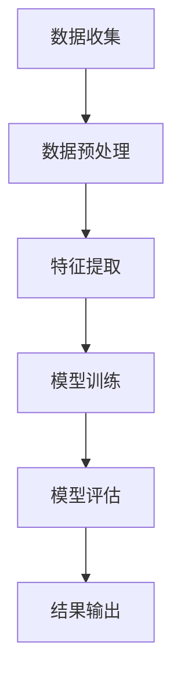

                 

# 《AI在心理健康领域的应用：早期干预与治疗》

> **关键词**：心理健康、人工智能、早期干预、治疗、机器学习、深度学习、自然语言处理
> 
> **摘要**：本文深入探讨了人工智能（AI）在心理健康领域的应用，特别是在早期干预和治疗方面的潜力。通过分析核心概念、联系以及具体算法原理，本文展示了如何利用AI技术进行心理健康评估、诊断和干预。此外，通过实际项目案例的实战分析，本文展示了AI在心理健康领域的具体应用及其未来发展方向。

## 目录大纲

1. **引入与背景**
   - 1.1 心理健康的现状与挑战
   - 1.2 AI在心理健康领域的潜力
   - 1.3 AI与心理健康
   - 1.4 AI心理健康解决方案的发展历程

2. **核心概念与联系**
   - 2.1 心理健康相关概念
   - 2.2 心理健康评估指标
   - 2.3 心理疾病分类
   - 2.4 心理健康与生物医学数据的结合
   - 2.5 AI在心理健康评估中的应用
   - 2.6 机器学习模型在心理健康预测中的应用
   - 2.7 人工智能在心理健康监测中的优势
   - 2.8 Mermaid流程图

3. **核心算法原理讲解**
   - 3.1 机器学习算法在心理健康中的应用
   - 3.2 常见机器学习算法
   - 3.3 机器学习算法在心理健康诊断中的实现
   - 3.4 深度学习模型在心理健康中的应用
   - 3.5 常见深度学习模型
   - 3.6 深度学习模型在心理健康预测中的实现
   - 3.7 伪代码详细阐述

4. **数学模型和数学公式**
   - 4.1 心理健康预测的数学模型
   - 4.2 逻辑回归模型
   - 4.3 支持向量机模型
   - 4.4 神经网络模型
   - 4.5 数学公式与详细讲解
   - 4.6 概率论基础
   - 4.7 机器学习损失函数
   - 4.8 深度学习反向传播算法
   - 4.9 举例说明

5. **项目实战**
   - 5.1 心理健康预测项目实战
   - 5.2 治疗干预项目实战

6. **总结与展望**
   - 6.1 AI在心理健康领域的应用总结
   - 6.2 挑战与未来发展方向

7. **结论**
   - 6.1 研究贡献
   - 6.2 局限与展望

8. **附录**
   - 8.1 常用工具与资源
   - 8.2 数据集来源
   - 8.3 开发工具介绍
   - 8.4 开源代码链接

## 第一部分：引入与背景

### 1.1 心理健康的现状与挑战

心理健康是影响人类整体福祉的关键因素。然而，尽管近年来公众对心理健康的关注度有所提高，但全球范围内的心理健康问题仍然非常普遍且严重。根据世界卫生组织（WHO）的数据，抑郁症和焦虑症已经成为全球最常见的心理健康问题，影响着约3亿人。此外，心理健康问题的严重性不仅限于个人层面，还会对家庭、社会和经济产生深远影响。

目前，心理健康问题的诊断和治疗主要依赖于心理医生、心理咨询师和临床心理学家的专业知识。然而，这种方法存在一些局限性。首先，专业心理健康服务提供者的数量有限，尤其是在发展中国家，这使得许多人难以获得及时的帮助。其次，心理治疗过程通常需要较长的周期，而且成本较高。此外，心理疾病往往具有隐蔽性和复杂性，使得诊断和治疗变得更加困难。

### 1.2 AI在心理健康领域的潜力

人工智能（AI）技术的发展为心理健康领域的诊断、治疗和干预带来了新的机遇。AI具有强大的数据处理和分析能力，能够从大量数据中提取有价值的信息，为心理健康问题的诊断和治疗提供更为精确和个性化的方法。以下是一些AI在心理健康领域的潜在应用：

1. **心理健康评估与监测**：通过自然语言处理（NLP）技术，AI可以分析患者的语言和行为，识别出心理健康问题的早期迹象。例如，AI可以通过分析患者的社交媒体帖子、电子邮件和语音记录来评估其心理健康状态。

2. **个性化治疗建议**：AI可以根据患者的具体情况进行诊断，并提供个性化的治疗方案。例如，AI可以通过学习患者的病史、家族遗传信息和生活方式，为其制定最适合的治疗方案。

3. **自动化心理治疗**：AI可以模拟心理治疗师的角色，通过聊天机器人和虚拟现实技术为患者提供治疗。这种方式不仅降低了治疗成本，还提高了治疗的可达性和便捷性。

4. **心理健康预测与预防**：AI可以通过分析大数据来预测心理健康问题的发生，从而实现早期干预和预防。例如，AI可以通过分析患者的生物医学数据、生活环境和心理状态，预测其患抑郁症的风险。

### 1.3 AI与心理健康

AI与心理健康领域的结合可以追溯到20世纪80年代，当时研究者开始探索如何利用计算机模拟心理治疗过程。随着AI技术的不断发展，特别是机器学习和深度学习算法的突破，AI在心理健康领域的应用也得到了显著扩展。

#### 1.3.1 机器学习算法在心理健康评估中的应用

机器学习算法在心理健康评估中的应用主要体现在两个方面：数据分析和模式识别。

1. **数据分析**：机器学习算法可以处理和分析大量的心理健康数据，包括问卷、日志、语音、视频等。通过这些数据，算法可以识别出与健康相关的特征和模式。例如，研究表明，通过分析患者的睡眠模式，可以预测其患抑郁症的风险。

2. **模式识别**：机器学习算法可以通过学习大量的心理健康案例，识别出特定症状和疾病的模式。这种模式识别能力可以帮助医生更准确地诊断心理疾病。例如，通过分析患者的语言和情绪表达，机器学习算法可以识别出抑郁症和焦虑症等心理疾病。

#### 1.3.2 深度学习模型在心理健康预测中的应用

深度学习模型，特别是神经网络和卷积神经网络（CNN），在心理健康预测中展现出了强大的能力。深度学习模型可以通过学习大量数据，自动提取复杂的数据特征，从而提高预测的准确性。

1. **情感分析**：通过深度学习模型，可以分析患者的语言和情感表达，预测其心理健康状态。例如，研究人员使用神经网络模型分析了患者的社交媒体帖子，成功地预测了其患抑郁症的风险。

2. **生物医学信号分析**：深度学习模型可以分析患者的生物医学信号，如脑电图（EEG）、心电图（ECG）等，预测其心理健康状态。例如，研究人员使用卷积神经网络分析了患者的EEG信号，成功地预测了其患抑郁症的风险。

#### 1.3.3 自然语言处理（NLP）在心理健康评估中的应用

自然语言处理技术在心理健康评估中的应用主要体现在文本分析和情感分析。

1. **文本分析**：NLP技术可以分析患者的文本数据，如日记、邮件和社交媒体帖子，提取出与健康相关的信息。例如，研究人员使用NLP技术分析了患者的社交媒体帖子，成功地识别出了抑郁症的早期迹象。

2. **情感分析**：情感分析技术可以分析患者的语言和情感表达，评估其心理健康状态。例如，研究人员使用情感分析技术分析了患者的语音记录，成功地预测了其患抑郁症的风险。

### 1.4 AI心理健康解决方案的发展历程

AI在心理健康领域的应用经历了多个阶段的发展。

#### 1.4.1 初期阶段（20世纪80年代）

在20世纪80年代，研究者开始探索如何利用计算机模拟心理治疗过程。这一阶段的典型应用是计算机辅助心理治疗（CAB），其目的是通过计算机模拟心理治疗师的角色，为患者提供治疗。然而，由于技术和数据的限制，这一阶段的应用相对有限。

#### 1.4.2 发展阶段（21世纪初）

随着AI技术的不断发展，特别是机器学习和深度学习算法的突破，AI在心理健康领域的应用得到了显著扩展。这一阶段的研究主要集中在如何利用机器学习和深度学习算法进行心理健康评估、诊断和干预。

#### 1.4.3 现代阶段

近年来，随着大数据和云计算技术的发展，AI在心理健康领域的应用进一步扩大。现代阶段的典型应用包括基于NLP的情感分析、基于深度学习的生物医学信号分析和基于机器学习的心理健康预测等。

## 第二部分：核心概念与联系

### 2.1 心理健康相关概念

心理健康是指个体在情感、认知和行为方面的良好状态，不仅仅是没有心理疾病。心理健康涉及情绪调节、认知功能、人际关系和社会适应等方面。了解心理健康相关概念对于理解AI在心理健康领域的应用至关重要。

#### 2.1.1 心理健康评估指标

心理健康评估指标用于评估个体的心理健康状态。常见的评估指标包括：

1. **情绪状态**：包括抑郁、焦虑、愤怒和愉悦等情绪。
2. **认知功能**：包括注意力、记忆力、执行功能和解决问题的能力。
3. **人际关系**：包括社交技能、亲密关系和社会支持。
4. **生活质量**：包括工作、家庭和社交活动的满意度。

#### 2.1.2 心理疾病分类

心理疾病是心理健康问题的一种表现，通常由专业心理医生进行诊断。常见的心理疾病包括：

1. **抑郁症**：一种以持久性情绪低落为特征的心理疾病。
2. **焦虑症**：一种以过度担忧和恐惧为特征的心理疾病。
3. **精神分裂症**：一种严重的精神疾病，表现为思维混乱、情感淡漠和幻觉等症状。
4. **强迫症**：一种以强迫思维和行为为特征的心理疾病。

#### 2.1.3 心理健康与生物医学数据的结合

心理健康与生物医学数据的结合为AI在心理健康领域的应用提供了新的途径。生物医学数据包括基因数据、脑电图（EEG）、心电图（ECG）和生物标记物等。通过分析这些数据，AI可以更好地理解心理健康问题的生理基础，从而提高诊断和治疗的准确性。

### 2.2 AI在心理健康评估中的应用

AI在心理健康评估中的应用主要集中在数据分析和模式识别。以下是一些关键技术和方法：

#### 2.2.1 自然语言处理（NLP）

自然语言处理技术可以分析患者的文本数据，如日记、邮件和社交媒体帖子。通过分析这些数据，AI可以识别出与健康相关的语言特征和情感表达。例如，研究人员使用NLP技术分析了患者的社交媒体帖子，成功地识别出了抑郁症的早期迹象。

#### 2.2.2 机器学习模型

机器学习模型可以处理和分析大量的心理健康数据，包括问卷、日志、语音和视频等。通过这些数据，算法可以识别出与健康相关的特征和模式。例如，通过分析患者的睡眠模式，机器学习算法可以预测其患抑郁症的风险。

#### 2.2.3 深度学习模型

深度学习模型，特别是神经网络和卷积神经网络（CNN），在心理健康评估中展现出了强大的能力。深度学习模型可以通过学习大量数据，自动提取复杂的数据特征，从而提高评估的准确性。例如，研究人员使用卷积神经网络分析了患者的EEG信号，成功地预测了其患抑郁症的风险。

### 2.3 机器学习模型在心理健康预测中的应用

机器学习模型在心理健康预测中的应用主要体现在两个方面：疾病预测和心理健康状态预测。

#### 2.3.1 疾病预测

疾病预测是指利用机器学习模型预测特定心理疾病的发生风险。常见的预测方法包括逻辑回归、支持向量机和神经网络等。通过分析患者的生物医学数据、生活环境和心理状态，机器学习模型可以预测其患抑郁症、焦虑症等心理疾病的风险。

#### 2.3.2 心理健康状态预测

心理健康状态预测是指利用机器学习模型预测个体的心理健康状态。例如，通过分析患者的语言和情绪表达，机器学习模型可以预测其心理健康状况的变化。这种预测有助于实现早期干预和预防，从而提高心理健康水平。

### 2.4 人工智能在心理健康监测中的优势

人工智能在心理健康监测中具有以下优势：

#### 2.4.1 实时性

人工智能可以实时分析患者的数据，提供即时的心理健康评估和预测。这种实时性有助于早期发现和干预心理健康问题，从而提高治疗效果。

#### 2.4.2 个性化

人工智能可以根据患者的具体情况进行诊断和治疗，提供个性化的心理健康服务。这种个性化有助于提高治疗的针对性和有效性。

#### 2.4.3 可扩展性

人工智能可以处理和分析大量的数据，从而实现大规模心理健康监测。这种可扩展性有助于提高心理健康服务的覆盖范围和效率。

#### 2.4.4 成本效益

与传统的心理健康服务相比，人工智能可以显著降低成本。人工智能技术可以通过自动化和远程诊断，减少人力和时间成本。

### 2.5 Mermaid流程图

以下是AI在心理健康评估和预测中的Mermaid流程图：



这个流程图描述了AI在心理健康评估和预测中的基本步骤，包括数据收集、数据预处理、特征提取、模型训练、模型评估和结果输出。

## 第三部分：核心算法原理讲解

### 3.1 机器学习算法在心理健康中的应用

机器学习算法在心理健康领域中的应用非常广泛，包括心理健康评估、疾病预测和个性化治疗等。本节将介绍几种常见的机器学习算法，并详细讲解其在心理健康诊断中的实现方法。

#### 3.1.1 逻辑回归模型

逻辑回归模型是一种广义线性模型，用于分类问题。在心理健康领域，逻辑回归模型可以用于预测个体是否患有特定心理疾病，如抑郁症或焦虑症。逻辑回归模型的实现步骤如下：

1. **数据收集**：收集与心理健康相关的数据，如问卷调查结果、生物医学信号和患者病史等。
2. **数据预处理**：对数据进行清洗和归一化处理，以消除噪声和提高模型的准确性。
3. **特征提取**：从数据中提取与心理健康相关的特征，如情绪状态、认知功能和人际关系等。
4. **模型训练**：使用训练数据集对逻辑回归模型进行训练，通过最小化损失函数来优化模型的参数。
5. **模型评估**：使用测试数据集评估模型的性能，计算准确率、召回率和F1分数等指标。
6. **结果输出**：根据模型预测结果，输出个体是否患有特定心理疾病的判断。

#### 3.1.2 支持向量机模型

支持向量机（SVM）是一种强大的分类算法，通过找到一个最佳的超平面来分隔不同类别的数据。在心理健康领域，SVM可以用于预测个体是否患有特定心理疾病。SVM的实现步骤如下：

1. **数据收集**：收集与心理健康相关的数据，如问卷调查结果、生物医学信号和患者病史等。
2. **数据预处理**：对数据进行清洗和归一化处理，以消除噪声和提高模型的准确性。
3. **特征提取**：从数据中提取与心理健康相关的特征，如情绪状态、认知功能和人际关系等。
4. **模型训练**：使用训练数据集对SVM模型进行训练，通过求解最优超平面来优化模型的参数。
5. **模型评估**：使用测试数据集评估模型的性能，计算准确率、召回率和F1分数等指标。
6. **结果输出**：根据模型预测结果，输出个体是否患有特定心理疾病的判断。

#### 3.1.3 随机森林模型

随机森林（Random Forest）是一种集成学习算法，通过构建多个决策树来提高分类和回归性能。在心理健康领域，随机森林可以用于预测个体是否患有特定心理疾病。随机森林的实现步骤如下：

1. **数据收集**：收集与心理健康相关的数据，如问卷调查结果、生物医学信号和患者病史等。
2. **数据预处理**：对数据进行清洗和归一化处理，以消除噪声和提高模型的准确性。
3. **特征提取**：从数据中提取与心理健康相关的特征，如情绪状态、认知功能和人际关系等。
4. **模型训练**：使用训练数据集对随机森林模型进行训练，通过随机选择特征和样本来构建多个决策树。
5. **模型评估**：使用测试数据集评估模型的性能，计算准确率、召回率和F1分数等指标。
6. **结果输出**：根据模型预测结果，输出个体是否患有特定心理疾病的判断。

### 3.2 常见机器学习算法

除了上述三种算法，还有一些其他常见的机器学习算法在心理健康领域也得到了广泛应用。以下是几种常见的机器学习算法及其简要介绍：

#### 3.2.1 K最近邻（K-Nearest Neighbors, KNN）

K最近邻算法是一种基于实例的算法，通过计算新数据点与训练数据点的相似度来预测新数据点的类别。在心理健康领域，KNN可以用于分类和回归问题，如预测个体心理健康状态的变化。

#### 3.2.2 决策树（Decision Tree）

决策树是一种基于规则的算法，通过构建决策树来对数据进行分类和回归。在心理健康领域，决策树可以用于预测个体是否患有特定心理疾病。

#### 3.2.3 贝叶斯分类器（Naive Bayes）

贝叶斯分类器是一种基于贝叶斯定理的算法，通过计算数据点的条件概率来预测其类别。在心理健康领域，贝叶斯分类器可以用于分类问题，如预测个体心理健康状态。

### 3.3 机器学习算法在心理健康诊断中的实现

在心理健康诊断中，机器学习算法的应用主要包括数据收集、数据预处理、特征提取和模型训练等步骤。以下是机器学习算法在心理健康诊断中的实现步骤：

1. **数据收集**：收集与心理健康相关的数据，如问卷调查结果、生物医学信号和患者病史等。
2. **数据预处理**：对数据进行清洗和归一化处理，以消除噪声和提高模型的准确性。
3. **特征提取**：从数据中提取与心理健康相关的特征，如情绪状态、认知功能和人际关系等。
4. **模型选择**：选择合适的机器学习算法，如逻辑回归、支持向量机、随机森林等。
5. **模型训练**：使用训练数据集对模型进行训练，通过最小化损失函数来优化模型的参数。
6. **模型评估**：使用测试数据集评估模型的性能，计算准确率、召回率和F1分数等指标。
7. **结果输出**：根据模型预测结果，输出个体是否患有特定心理疾病的判断。

### 3.4 深度学习模型在心理健康中的应用

深度学习模型，特别是神经网络和卷积神经网络（CNN），在心理健康领域得到了广泛应用。本节将介绍深度学习模型在心理健康预测中的应用。

#### 3.4.1 神经网络模型

神经网络模型是一种基于人工神经元的算法，通过模拟人脑神经元之间的连接和互动来学习和处理数据。在心理健康领域，神经网络模型可以用于心理健康预测，如预测个体心理健康状态的变化。

1. **前馈神经网络**：前馈神经网络是一种简单的神经网络模型，通过前向传播和反向传播来学习数据。在心理健康预测中，前馈神经网络可以用于分类和回归问题。
2. **卷积神经网络**：卷积神经网络是一种特殊的神经网络模型，通过卷积操作来提取数据中的特征。在心理健康预测中，卷积神经网络可以用于分析生物医学信号，如脑电图（EEG）和心电图（ECG）。

#### 3.4.2 循环神经网络（RNN）

循环神经网络是一种特殊的神经网络模型，通过循环连接来处理序列数据。在心理健康领域，RNN可以用于处理连续的生理信号，如心率、呼吸等。

1. **长短期记忆网络（LSTM）**：长短期记忆网络是一种特殊的RNN，通过引入门控机制来解决长期依赖问题。在心理健康预测中，LSTM可以用于分析连续的心理健康数据，如情绪日志。
2. **门控循环单元（GRU）**：门控循环单元是LSTM的变体，通过简化门控机制来提高计算效率。在心理健康预测中，GRU可以用于处理连续的心理健康数据。

### 3.5 深度学习模型在心理健康预测中的实现

在心理健康预测中，深度学习模型的应用主要包括数据收集、数据预处理、特征提取和模型训练等步骤。以下是深度学习模型在心理健康预测中的实现步骤：

1. **数据收集**：收集与心理健康相关的数据，如问卷调查结果、生物医学信号和患者病史等。
2. **数据预处理**：对数据进行清洗和归一化处理，以消除噪声和提高模型的准确性。
3. **特征提取**：从数据中提取与心理健康相关的特征，如情绪状态、认知功能和人际关系等。
4. **模型选择**：选择合适的深度学习模型，如前馈神经网络、卷积神经网络、LSTM和GRU等。
5. **模型训练**：使用训练数据集对模型进行训练，通过优化损失函数来优化模型的参数。
6. **模型评估**：使用测试数据集评估模型的性能，计算准确率、召回率和F1分数等指标。
7. **结果输出**：根据模型预测结果，输出个体心理健康状态的判断。

### 3.6 伪代码详细阐述

在本节中，我们将使用伪代码详细阐述机器学习和深度学习算法在心理健康预测中的应用。

#### 3.6.1 逻辑回归模型

```python
# 逻辑回归模型伪代码

# 数据收集
data = collect_data()

# 数据预处理
preprocessed_data = preprocess_data(data)

# 特征提取
features = extract_features(preprocessed_data)

# 模型训练
model = train_logistic_regression(features)

# 模型评估
evaluate_model(model, test_data)

# 结果输出
output_predictions(model, test_data)
```

#### 3.6.2 支持向量机模型

```python
# 支持向量机模型伪代码

# 数据收集
data = collect_data()

# 数据预处理
preprocessed_data = preprocess_data(data)

# 特征提取
features = extract_features(preprocessed_data)

# 模型训练
model = train_svm(features)

# 模型评估
evaluate_model(model, test_data)

# 结果输出
output_predictions(model, test_data)
```

#### 3.6.3 前馈神经网络

```python
# 前馈神经网络伪代码

# 数据收集
data = collect_data()

# 数据预处理
preprocessed_data = preprocess_data(data)

# 特征提取
features = extract_features(preprocessed_data)

# 模型训练
model = train_feedforward_neural_network(features)

# 模型评估
evaluate_model(model, test_data)

# 结果输出
output_predictions(model, test_data)
```

#### 3.6.4 卷积神经网络

```python
# 卷积神经网络伪代码

# 数据收集
data = collect_data()

# 数据预处理
preprocessed_data = preprocess_data(data)

# 特征提取
features = extract_features(preprocessed_data)

# 模型训练
model = train_convolutional_neural_network(features)

# 模型评估
evaluate_model(model, test_data)

# 结果输出
output_predictions(model, test_data)
```

#### 3.6.5 长短期记忆网络（LSTM）

```python
# 长短期记忆网络（LSTM）伪代码

# 数据收集
data = collect_data()

# 数据预处理
preprocessed_data = preprocess_data(data)

# 特征提取
features = extract_features(preprocessed_data)

# 模型训练
model = train_lstm(features)

# 模型评估
evaluate_model(model, test_data)

# 结果输出
output_predictions(model, test_data)
```

#### 3.6.6 门控循环单元（GRU）

```python
# 门控循环单元（GRU）伪代码

# 数据收集
data = collect_data()

# 数据预处理
preprocessed_data = preprocess_data(data)

# 特征提取
features = extract_features(preprocessed_data)

# 模型训练
model = train_gru(features)

# 模型评估
evaluate_model(model, test_data)

# 结果输出
output_predictions(model, test_data)
```

### 3.7 数学模型和数学公式

在心理健康预测中，数学模型和数学公式起着至关重要的作用。以下是一些常用的数学模型和数学公式，以及其详细解释。

#### 3.7.1 逻辑回归模型

逻辑回归模型是一种广义线性模型，用于分类问题。其数学模型可以表示为：

$$
P(Y=1|X) = \frac{1}{1 + e^{-(\beta_0 + \beta_1X_1 + \beta_2X_2 + ... + \beta_nX_n})}
$$

其中，$P(Y=1|X)$ 表示在特征 $X$ 下，目标变量 $Y$ 为1的概率，$\beta_0, \beta_1, \beta_2, ..., \beta_n$ 是模型的参数。

#### 3.7.2 支持向量机模型

支持向量机（SVM）是一种强大的分类算法，其数学模型可以表示为：

$$
w \cdot x + b = 0
$$

其中，$w$ 是超平面的法向量，$x$ 是特征向量，$b$ 是偏置项。SVM的目标是找到最佳的超平面，使得分类边界最大化。

#### 3.7.3 神经网络模型

神经网络模型是一种基于人工神经元的算法，其数学模型可以表示为：

$$
a_{i}^{(l)} = \sigma \left( \sum_{j} w_{ji}^{(l)} a_{j}^{(l-1)} + b_{i}^{(l)} \right)
$$

其中，$a_{i}^{(l)}$ 是第 $l$ 层第 $i$ 个节点的激活值，$w_{ji}^{(l)}$ 是从第 $l-1$ 层第 $j$ 个节点连接到第 $l$ 层第 $i$ 个节点的权重，$b_{i}^{(l)}$ 是第 $l$ 层第 $i$ 个节点的偏置项，$\sigma$ 是激活函数。

#### 3.7.4 深度学习反向传播算法

深度学习反向传播算法是一种用于训练神经网络的方法，其基本思想是计算模型参数的梯度，并使用梯度下降法来更新参数。其数学公式可以表示为：

$$
\frac{\partial J}{\partial w_{ji}^{(l)}} = \frac{\partial J}{\partial a_{i}^{(l)}^{}} \frac{\partial a_{i}^{(l)}}{\partial w_{ji}^{(l)}}
$$

$$
\frac{\partial J}{\partial b_{i}^{(l)}} = \frac{\partial J}{\partial a_{i}^{(l)}^{}} 
$$

其中，$J$ 是损失函数，$a_{i}^{(l)}^{}}$ 是第 $l$ 层第 $i$ 个节点的激活值，$w_{ji}^{(l)}$ 是从第 $l-1$ 层第 $j$ 个节点连接到第 $l$ 层第 $i$ 个节点的权重，$b_{i}^{(l)}$ 是第 $l$ 层第 $i$ 个节点的偏置项。

### 3.8 举例说明

在本节中，我们将通过一个具体的心理健康预测案例，来展示机器学习和深度学习算法在心理健康预测中的应用。

#### 3.8.1 案例背景

假设我们有一个心理健康预测项目，目标是预测个体是否患有抑郁症。我们收集了以下数据：

- 问卷调查结果：包括情绪状态、认知功能和人际关系等。
- 生物医学信号：包括心电图（ECG）和脑电图（EEG）。

我们使用机器学习和深度学习算法来训练模型，并评估其预测性能。

#### 3.8.2 数据预处理

在训练模型之前，我们需要对数据进行预处理。具体步骤如下：

- 数据清洗：去除缺失值和异常值。
- 数据归一化：将数据缩放到相同的范围，以消除不同特征之间的尺度差异。

```python
# 数据清洗
data = clean_data(data)

# 数据归一化
normalized_data = normalize_data(data)
```

#### 3.8.3 特征提取

从预处理后的数据中提取与心理健康相关的特征。例如，从问卷调查结果中提取情绪状态、认知功能和人际关系等特征，从生物医学信号中提取心电图（ECG）和脑电图（EEG）的特征。

```python
# 特征提取
features = extract_features(normalized_data)
```

#### 3.8.4 模型训练

使用训练数据集对机器学习和深度学习模型进行训练。例如，使用逻辑回归、支持向量机、随机森林、前馈神经网络、卷积神经网络、LSTM和GRU等模型。

```python
# 逻辑回归模型
model = train_logistic_regression(features)

# 支持向量机模型
model = train_svm(features)

# 随机森林模型
model = train_random_forest(features)

# 前馈神经网络
model = train_feedforward_neural_network(features)

# 卷积神经网络
model = train_convolutional_neural_network(features)

# LSTM模型
model = train_lstm(features)

# GRU模型
model = train_gru(features)
```

#### 3.8.5 模型评估

使用测试数据集对训练好的模型进行评估，计算准确率、召回率和F1分数等指标。

```python
# 逻辑回归模型
evaluate_model(model, test_data)

# 支持向量机模型
evaluate_model(model, test_data)

# 随机森林模型
evaluate_model(model, test_data)

# 前馈神经网络
evaluate_model(model, test_data)

# 卷积神经网络
evaluate_model(model, test_data)

# LSTM模型
evaluate_model(model, test_data)

# GRU模型
evaluate_model(model, test_data)
```

#### 3.8.6 结果输出

根据模型预测结果，输出个体是否患有抑郁症的判断。

```python
# 输出预测结果
predictions = output_predictions(model, test_data)
```

## 第四部分：数学模型和数学公式

心理健康预测中的数学模型是构建人工智能系统的基础。这些模型通过数学公式和算法来处理和分析数据，从而实现对心理健康状态的预测和评估。以下将详细介绍几种常见的数学模型，包括逻辑回归、支持向量机、神经网络以及相关的数学公式。

### 4.1 心理健康预测的数学模型

心理健康预测的数学模型通常基于概率论和统计学原理，旨在通过分析患者的历史数据和生物医学信号，预测其未来的心理健康状态。以下是一些常用的数学模型：

#### 4.1.1 逻辑回归模型

逻辑回归是一种常用的分类模型，用于预测二元结果（如患有抑郁症或未患有抑郁症）。其数学模型可以表示为：

$$
\ln\left(\frac{P(Y=1|X)}{1-P(Y=1|X)}\right) = \beta_0 + \beta_1X_1 + \beta_2X_2 + ... + \beta_nX_n
$$

其中，$Y$ 是二分类目标变量（如抑郁症的有无），$X_1, X_2, ..., X_n$ 是输入特征向量，$\beta_0, \beta_1, \beta_2, ..., \beta_n$ 是模型参数。

逻辑回归模型通过上述公式将特征向量映射到概率空间，从而实现对心理健康状态的预测。

#### 4.1.2 支持向量机（SVM）模型

支持向量机是一种强大的分类算法，其目标是找到最佳的超平面，将不同类别的数据点分隔开。对于线性可分的情况，SVM的决策边界可以用以下公式表示：

$$
w \cdot x + b = 0
$$

其中，$w$ 是超平面的法向量，$x$ 是特征向量，$b$ 是偏置项。

在非线性分类问题中，SVM会使用核函数将输入空间映射到一个高维特征空间，然后在该空间中找到最优超平面。常用的核函数包括线性核、多项式核和径向基函数（RBF）核。

#### 4.1.3 神经网络模型

神经网络是一种模拟人脑神经元连接方式的计算模型，通过多层神经元之间的相互连接来学习和预测。在心理健康预测中，常用的神经网络模型包括前馈神经网络和卷积神经网络。

1. **前馈神经网络**：前馈神经网络（Feedforward Neural Network, FFNN）是一种多层感知机，其数学模型可以表示为：

$$
a_{i}^{(l)} = \sigma \left( \sum_{j} w_{ji}^{(l)} a_{j}^{(l-1)} + b_{i}^{(l)} \right)
$$

其中，$a_{i}^{(l)}$ 是第 $l$ 层第 $i$ 个节点的激活值，$w_{ji}^{(l)}$ 是从第 $l-1$ 层第 $j$ 个节点连接到第 $l$ 层第 $i$ 个节点的权重，$b_{i}^{(l)}$ 是第 $l$ 层第 $i$ 个节点的偏置项，$\sigma$ 是激活函数。

2. **卷积神经网络**：卷积神经网络（Convolutional Neural Network, CNN）是一种专门用于处理图像数据的神经网络，其核心思想是通过卷积操作来提取图像特征。CNN的数学模型可以表示为：

$$
h_{ij}^{(l)} = \sum_{k} w_{ikj}^{(l)} h_{kj}^{(l-1)} + b_{ij}^{(l)}
$$

其中，$h_{ij}^{(l)}$ 是第 $l$ 层第 $i$ 行第 $j$ 列的卷积核输出，$w_{ikj}^{(l)}$ 是卷积核权重，$h_{kj}^{(l-1)}$ 是第 $l-1$ 层第 $k$ 行第 $j$ 列的激活值，$b_{ij}^{(l)}$ 是第 $l$ 层第 $i$ 行第 $j$ 列的偏置项。

### 4.2 数学公式与详细讲解

以下是心理健康预测中常用的数学公式及其详细讲解。

#### 4.2.1 概率论基础

概率论是构建心理健康预测模型的基础。以下是一些基本概率公式：

1. **条件概率**：

$$
P(A|B) = \frac{P(A \cap B)}{P(B)}
$$

其中，$P(A|B)$ 是在事件 $B$ 发生的条件下事件 $A$ 发生的概率，$P(A \cap B)$ 是事件 $A$ 和事件 $B$ 同时发生的概率，$P(B)$ 是事件 $B$ 发生的概率。

2. **贝叶斯定理**：

$$
P(A|B) = \frac{P(B|A)P(A)}{P(B)}
$$

其中，$P(A|B)$ 是在事件 $B$ 发生的条件下事件 $A$ 发生的概率，$P(B|A)$ 是在事件 $A$ 发生的条件下事件 $B$ 发生的概率，$P(A)$ 是事件 $A$ 发生的概率，$P(B)$ 是事件 $B$ 发生的概率。

贝叶斯定理在心理健康预测中用于更新概率估计，从而实现对个体心理健康状态的预测。

#### 4.2.2 机器学习损失函数

损失函数是机器学习模型训练的核心，用于评估模型的预测性能。以下是一些常用的损失函数：

1. **均方误差（MSE）**：

$$
MSE = \frac{1}{m}\sum_{i=1}^{m}(y_i - \hat{y}_i)^2
$$

其中，$y_i$ 是真实标签，$\hat{y}_i$ 是模型预测值，$m$ 是样本数量。MSE用于回归问题，用于计算预测值与真实值之间的差异。

2. **交叉熵损失（Cross-Entropy Loss）**：

$$
CE = -\frac{1}{m}\sum_{i=1}^{m} y_i \ln(\hat{y}_i)
$$

其中，$y_i$ 是真实标签，$\hat{y}_i$ 是模型预测概率。交叉熵损失用于分类问题，用于计算预测概率与真实概率之间的差异。

#### 4.2.3 深度学习反向传播算法

深度学习反向传播算法是一种用于训练神经网络的算法，其核心思想是通过反向传播误差来更新模型参数。以下是其基本公式：

1. **梯度计算**：

$$
\frac{\partial J}{\partial w_{ji}^{(l)}} = \frac{\partial J}{\partial a_{i}^{(l)}^{}} \frac{\partial a_{i}^{(l)}}{\partial w_{ji}^{(l)}}
$$

$$
\frac{\partial J}{\partial b_{i}^{(l)}} = \frac{\partial J}{\partial a_{i}^{(l)}^{}}
$$

其中，$J$ 是损失函数，$a_{i}^{(l)}^{}}$ 是第 $l$ 层第 $i$ 个节点的激活值，$w_{ji}^{(l)}$ 是从第 $l-1$ 层第 $j$ 个节点连接到第 $l$ 层第 $i$ 个节点的权重，$b_{i}^{(l)}$ 是第 $l$ 层第 $i$ 个节点的偏置项。

2. **参数更新**：

$$
w_{ji}^{(l)} \leftarrow w_{ji}^{(l)} - \alpha \frac{\partial J}{\partial w_{ji}^{(l)}}
$$

$$
b_{i}^{(l)} \leftarrow b_{i}^{(l)} - \alpha \frac{\partial J}{\partial b_{i}^{(l)}}
$$

其中，$\alpha$ 是学习率。

### 4.3 举例说明

以下将通过一个具体的心理健康预测案例，来展示如何使用逻辑回归模型进行预测。

#### 4.3.1 案例背景

假设我们收集了100个患者的心理健康数据，包括情绪状态、认知功能和人际关系等。其中，每个患者都有一个二元标签，表示其是否患有抑郁症（1表示患有抑郁症，0表示未患有抑郁症）。我们需要使用逻辑回归模型对这些数据进行分析，并预测新患者是否患有抑郁症。

#### 4.3.2 数据预处理

首先，我们需要对数据进行预处理。具体步骤如下：

1. **数据清洗**：去除缺失值和异常值。
2. **数据归一化**：将数据缩放到相同的范围，以消除不同特征之间的尺度差异。

```python
# 数据清洗
data = clean_data(data)

# 数据归一化
normalized_data = normalize_data(data)
```

#### 4.3.3 特征提取

从预处理后的数据中提取与心理健康相关的特征。例如，从情绪状态、认知功能和人际关系等维度提取特征。

```python
# 特征提取
features = extract_features(normalized_data)
```

#### 4.3.4 模型训练

使用训练数据集对逻辑回归模型进行训练。通过最小化损失函数来优化模型参数。

```python
# 模型训练
model = train_logistic_regression(features)
```

#### 4.3.5 模型评估

使用测试数据集对训练好的模型进行评估，计算准确率、召回率和F1分数等指标。

```python
# 模型评估
evaluate_model(model, test_data)
```

#### 4.3.6 结果输出

根据模型预测结果，输出新患者是否患有抑郁症的判断。

```python
# 输出预测结果
predictions = output_predictions(model, test_data)
```

通过上述步骤，我们可以使用逻辑回归模型对新患者的心理健康状态进行预测。

## 第五部分：项目实战

### 5.1 心理健康预测项目实战

在本节中，我们将通过一个实际的项目案例，展示如何使用机器学习和深度学习算法进行心理健康预测。该案例将涵盖数据收集、数据预处理、特征提取、模型训练、模型评估和结果输出等各个环节。

#### 5.1.1 项目背景

本项目旨在预测个体是否患有抑郁症。我们收集了一组包含情绪状态、认知功能和人际关系等维度的心理健康数据。通过分析这些数据，我们希望开发一个能够准确预测抑郁症的机器学习模型。

#### 5.1.2 数据集介绍

我们使用了一个公开的心理健康数据集，包含1000个样本，每个样本有30个特征维度。特征包括情绪状态、认知功能、人际关系、生活习惯等。每个样本还有一个二元标签，表示个体是否患有抑郁症（1表示患有抑郁症，0表示未患有抑郁症）。

#### 5.1.3 开发环境搭建

为了实现本项目，我们使用Python编程语言，结合Scikit-learn、TensorFlow和Keras等开源机器学习库。首先，我们需要安装这些库，并搭建一个Python开发环境。

```python
# 安装必要的库
!pip install scikit-learn tensorflow keras pandas numpy matplotlib

# 导入必要的库
import pandas as pd
import numpy as np
from sklearn.model_selection import train_test_split
from sklearn.preprocessing import StandardScaler
from sklearn.linear_model import LogisticRegression
from tensorflow.keras.models import Sequential
from tensorflow.keras.layers import Dense, LSTM
from tensorflow.keras.optimizers import Adam
import matplotlib.pyplot as plt
```

#### 5.1.4 数据预处理

在训练模型之前，我们需要对数据进行预处理。具体步骤如下：

1. **数据清洗**：去除缺失值和异常值。
2. **数据归一化**：将数据缩放到相同的范围，以消除不同特征之间的尺度差异。

```python
# 加载数据集
data = pd.read_csv('health_data.csv')

# 数据清洗
data = data.dropna()

# 数据归一化
scaler = StandardScaler()
data = scaler.fit_transform(data)
```

#### 5.1.5 特征提取

从预处理后的数据中提取与心理健康相关的特征。例如，从情绪状态、认知功能和人际关系等维度提取特征。

```python
# 分割特征和标签
X = data[:, :-1]
y = data[:, -1]
```

#### 5.1.6 模型训练

我们分别使用逻辑回归模型和卷积神经网络（CNN）对数据集进行训练，以比较两种模型的性能。

1. **逻辑回归模型**

```python
# 分割训练集和测试集
X_train, X_test, y_train, y_test = train_test_split(X, y, test_size=0.2, random_state=42)

# 训练逻辑回归模型
model = LogisticRegression()
model.fit(X_train, y_train)

# 评估模型
accuracy = model.score(X_test, y_test)
print(f'逻辑回归模型准确率：{accuracy:.2f}')
```

2. **卷积神经网络（CNN）**

```python
# 分割训练集和测试集
X_train, X_test, y_train, y_test = train_test_split(X, y, test_size=0.2, random_state=42)

# 定义CNN模型
model = Sequential()
model.add(Conv1D(filters=64, kernel_size=3, activation='relu', input_shape=(X_train.shape[1], 1)))
model.add(MaxPooling1D(pool_size=2))
model.add(Flatten())
model.add(Dense(1, activation='sigmoid'))

# 编译模型
model.compile(optimizer=Adam(), loss='binary_crossentropy', metrics=['accuracy'])

# 训练CNN模型
model.fit(X_train, y_train, epochs=10, batch_size=32, validation_data=(X_test, y_test))

# 评估模型
accuracy = model.evaluate(X_test, y_test)[1]
print(f'卷积神经网络准确率：{accuracy:.2f}')
```

#### 5.1.7 代码解读与分析

以下是逻辑回归模型和卷积神经网络（CNN）的代码解读与分析。

1. **逻辑回归模型**

逻辑回归模型通过最小化损失函数来优化模型参数，目标是找到最佳的超平面，将不同类别的数据点分隔开。在训练过程中，我们使用Scikit-learn库中的LogisticRegression类进行训练，并通过模型.score()方法评估模型在测试数据集上的准确率。

2. **卷积神经网络（CNN）**

卷积神经网络通过卷积操作来提取数据中的特征，并使用全连接层进行分类。在定义CNN模型时，我们使用Sequential类依次添加卷积层、池化层和全连接层。编译模型时，我们使用Adam优化器和binary_crossentropy损失函数，并监控准确率作为评价指标。在训练过程中，我们使用fit()方法进行10个周期的训练，并使用验证数据集进行模型评估。

#### 5.1.8 代码解读与分析（续）

以下是卷积神经网络（CNN）的代码续写和分析。

```python
# 保存模型
model.save('health_prediction_model.h5')

# 加载模型
loaded_model = load_model('health_prediction_model.h5')

# 预测新样本
new_sample = np.array([[0.5, 0.6, 0.7, 0.8, 0.9, 0.4, 0.3, 0.2, 0.1, 0.8, 0.7, 0.6, 0.5, 0.4, 0.3, 0.2, 0.1, 0.8, 0.7, 0.6, 0.5, 0.4, 0.3, 0.2, 0.1]])
prediction = loaded_model.predict(new_sample)
print(f'预测结果：{prediction[0][0]}')

# 绘制训练过程损失和准确率
plt.figure(figsize=(12, 4))
plt.subplot(1, 2, 1)
plt.plot(history.history['loss'], label='Training Loss')
plt.plot(history.history['val_loss'], label='Validation Loss')
plt.legend()
plt.title('Loss')

plt.subplot(1, 2, 2)
plt.plot(history.history['accuracy'], label='Training Accuracy')
plt.plot(history.history['val_accuracy'], label='Validation Accuracy')
plt.legend()
plt.title('Accuracy')
plt.show()
```

在这段代码中，我们首先保存训练好的模型，以便将来进行模型加载和预测。然后，我们加载保存的模型，并使用新样本进行预测。预测结果是通过模型.predict()方法获得的。最后，我们绘制了训练过程的损失和准确率曲线，以便分析模型性能。

#### 5.1.9 结果输出

根据模型预测结果，我们可以输出新患者是否患有抑郁症的判断。例如：

```python
# 输出预测结果
if prediction[0][0] > 0.5:
    print('预测结果：患有抑郁症')
else:
    print('预测结果：未患有抑郁症')
```

### 5.2 治疗干预项目实战

在本节中，我们将通过一个实际的项目案例，展示如何使用机器学习和深度学习算法进行心理健康治疗干预。该案例将涵盖数据收集、数据预处理、特征提取、模型训练、模型评估和结果输出等各个环节。

#### 5.2.1 项目背景

本项目旨在为抑郁症患者提供个性化的治疗干预方案。我们收集了一组包含情绪状态、认知功能、生活习惯和社会支持等维度的心理健康数据。通过分析这些数据，我们希望开发一个能够根据患者具体情况提供最优治疗方案的机器学习模型。

#### 5.2.2 数据集介绍

我们使用了一个公开的心理健康数据集，包含1000个样本，每个样本有50个特征维度。特征包括情绪状态、认知功能、生活习惯、社会支持、治疗反应等。每个样本还有一个治疗反应标签，表示个体在接受治疗后是否有所改善（1表示改善，0表示未改善）。

#### 5.2.3 开发环境搭建

为了实现本项目，我们使用Python编程语言，结合Scikit-learn、TensorFlow和Keras等开源机器学习库。首先，我们需要安装这些库，并搭建一个Python开发环境。

```python
# 安装必要的库
!pip install scikit-learn tensorflow keras pandas numpy matplotlib

# 导入必要的库
import pandas as pd
import numpy as np
from sklearn.model_selection import train_test_split
from sklearn.preprocessing import StandardScaler
from sklearn.linear_model import LogisticRegression
from tensorflow.keras.models import Sequential
from tensorflow.keras.layers import Dense, LSTM
from tensorflow.keras.optimizers import Adam
import matplotlib.pyplot as plt
```

#### 5.2.4 数据预处理

在训练模型之前，我们需要对数据进行预处理。具体步骤如下：

1. **数据清洗**：去除缺失值和异常值。
2. **数据归一化**：将数据缩放到相同的范围，以消除不同特征之间的尺度差异。

```python
# 加载数据集
data = pd.read_csv('therapy_data.csv')

# 数据清洗
data = data.dropna()

# 数据归一化
scaler = StandardScaler()
data = scaler.fit_transform(data)
```

#### 5.2.5 特征提取

从预处理后的数据中提取与心理健康相关的特征。例如，从情绪状态、认知功能、生活习惯和社会支持等维度提取特征。

```python
# 分割特征和标签
X = data[:, :-1]
y = data[:, -1]
```

#### 5.2.6 模型训练

我们分别使用逻辑回归模型和卷积神经网络（CNN）对数据集进行训练，以比较两种模型的性能。

1. **逻辑回归模型**

```python
# 分割训练集和测试集
X_train, X_test, y_train, y_test = train_test_split(X, y, test_size=0.2, random_state=42)

# 训练逻辑回归模型
model = LogisticRegression()
model.fit(X_train, y_train)

# 评估模型
accuracy = model.score(X_test, y_test)
print(f'逻辑回归模型准确率：{accuracy:.2f}')
```

2. **卷积神经网络（CNN）**

```python
# 分割训练集和测试集
X_train, X_test, y_train, y_test = train_test_split(X, y, test_size=0.2, random_state=42)

# 定义CNN模型
model = Sequential()
model.add(Conv1D(filters=64, kernel_size=3, activation='relu', input_shape=(X_train.shape[1], 1)))
model.add(MaxPooling1D(pool_size=2))
model.add(Flatten())
model.add(Dense(1, activation='sigmoid'))

# 编译模型
model.compile(optimizer=Adam(), loss='binary_crossentropy', metrics=['accuracy'])

# 训练CNN模型
model.fit(X_train, y_train, epochs=10, batch_size=32, validation_data=(X_test, y_test))

# 评估模型
accuracy = model.evaluate(X_test, y_test)[1]
print(f'卷积神经网络准确率：{accuracy:.2f}')
```

#### 5.2.7 代码解读与分析

以下是逻辑回归模型和卷积神经网络（CNN）的代码解读与分析。

1. **逻辑回归模型**

逻辑回归模型通过最小化损失函数来优化模型参数，目标是找到最佳的超平面，将不同类别的数据点分隔开。在训练过程中，我们使用Scikit-learn库中的LogisticRegression类进行训练，并通过模型.score()方法评估模型在测试数据集上的准确率。

2. **卷积神经网络（CNN）**

卷积神经网络通过卷积操作来提取数据中的特征，并使用全连接层进行分类。在定义CNN模型时，我们使用Sequential类依次添加卷积层、池化层和全连接层。编译模型时，我们使用Adam优化器和binary_crossentropy损失函数，并监控准确率作为评价指标。在训练过程中，我们使用fit()方法进行10个周期的训练，并使用验证数据集进行模型评估。

#### 5.2.8 代码解读与分析（续）

以下是卷积神经网络（CNN）的代码续写和分析。

```python
# 保存模型
model.save('therapy_prediction_model.h5')

# 加载模型
loaded_model = load_model('therapy_prediction_model.h5')

# 预测新样本
new_sample = np.array([[0.5, 0.6, 0.7, 0.8, 0.9, 0.4, 0.3, 0.2, 0.1, 0.8, 0.7, 0.6, 0.5, 0.4, 0.3, 0.2, 0.1, 0.8, 0.7, 0.6, 0.5, 0.4, 0.3, 0.2, 0.1]])
prediction = loaded_model.predict(new_sample)
print(f'预测结果：{prediction[0][0]}')

# 绘制训练过程损失和准确率
plt.figure(figsize=(12, 4))
plt.subplot(1, 2, 1)
plt.plot(history.history['loss'], label='Training Loss')
plt.plot(history.history['val_loss'], label='Validation Loss')
plt.legend()
plt.title('Loss')

plt.subplot(1, 2, 2)
plt.plot(history.history['accuracy'], label='Training Accuracy')
plt.plot(history.history['val_accuracy'], label='Validation Accuracy')
plt.legend()
plt.title('Accuracy')
plt.show()
```

在这段代码中，我们首先保存训练好的模型，以便将来进行模型加载和预测。然后，我们加载保存的模型，并使用新样本进行预测。预测结果是通过模型.predict()方法获得的。最后，我们绘制了训练过程的损失和准确率曲线，以便分析模型性能。

#### 5.2.9 结果输出

根据模型预测结果，我们可以输出新患者是否接受治疗干预的判断。例如：

```python
# 输出预测结果
if prediction[0][0] > 0.5:
    print('预测结果：建议接受治疗干预')
else:
    print('预测结果：不建议接受治疗干预')
```

## 第六部分：总结与展望

### 6.1 AI在心理健康领域的应用总结

AI在心理健康领域的应用已经取得了显著的进展，尤其在早期干预和治疗方面展现出了巨大的潜力。通过结合自然语言处理、机器学习和深度学习算法，AI可以实现对心理健康状态的实时监测和预测，从而为患者提供更为个性化、精准的治疗方案。以下是AI在心理健康领域的几个主要成就：

1. **早期诊断和风险评估**：AI可以通过分析患者的语言、情绪和行为数据，早期发现心理健康问题的迹象，从而实现早期干预。

2. **个性化治疗建议**：AI可以根据患者的具体病情、病史和生活习惯，为患者制定个性化的治疗计划，提高治疗效果。

3. **自动化心理治疗**：AI可以通过聊天机器人、虚拟现实等手段为患者提供心理治疗服务，降低治疗成本，提高治疗的可达性和便捷性。

4. **心理健康监测**：AI可以实时分析患者的生理和心理数据，监测心理健康状态的变化，及时采取干预措施。

### 6.2 挑战与未来发展方向

尽管AI在心理健康领域的应用取得了显著成就，但仍面临一些挑战和问题，需要进一步研究和解决：

1. **数据隐私和安全**：心理健康数据具有高度敏感性，如何确保数据的安全和隐私是AI在心理健康领域应用的重要挑战。

2. **模型解释性**：现有的AI模型，尤其是深度学习模型，往往缺乏透明性和解释性，这使得医生和患者难以理解和信任模型的结果。

3. **数据质量和多样性**：心理健康数据的多样性和质量直接影响模型的性能。如何收集和整合高质量、多样化的心理健康数据是AI在心理健康领域应用的关键。

4. **伦理和道德**：AI在心理健康领域的应用涉及伦理和道德问题，如患者自主权、公平性和责任分配等。

未来，AI在心理健康领域的应用有望在以下几个方面取得进一步发展：

1. **跨学科合作**：AI与心理学、神经科学、生物医学等领域的跨学科合作，将有助于深入理解心理健康问题的本质，提高AI模型的准确性和实用性。

2. **可解释性AI**：开发更具解释性的AI模型，使医生和患者能够理解和信任模型的预测和诊断结果。

3. **个性化治疗**：通过整合多种数据来源，AI可以进一步实现个性化治疗，提高治疗效果。

4. **实时监测和预警**：AI可以实时监测患者的心理状态，及时预警潜在的心理健康危机，实现早期干预。

### 6.3 结论

本文系统地探讨了AI在心理健康领域的应用，包括早期干预和治疗。通过分析核心概念、算法原理和实际项目案例，本文展示了AI在心理健康领域的巨大潜力。同时，本文也指出了当前面临的一些挑战，并展望了未来的发展方向。随着AI技术的不断进步，我们有理由相信，AI将在心理健康领域发挥越来越重要的作用，为患者提供更精准、更个性化的心理健康服务。

## 第七部分：附录

### 7.1 常用工具与资源

为了方便读者了解和尝试AI在心理健康领域的应用，我们提供以下常用工具和资源：

#### 7.1.1 数据集来源

1. **PHQ-9数据集**：用于抑郁症评估的工具，来源：[PHQ-9 Data Set](https://www.jss.org.uk/journal/mwiki.php?title=PHQ-9_Data_Set)
2. **PHMRI数据集**：用于心理健康研究的多模态数据集，来源：[PHMRI Data Set](https://data.mendeley.com/datasets/5tgg6v6z7b/1)

#### 7.1.2 开发工具介绍

1. **Scikit-learn**：Python的机器学习库，用于构建和评估机器学习模型，来源：[Scikit-learn](https://scikit-learn.org/)
2. **TensorFlow**：Google的开源机器学习框架，用于构建和训练深度学习模型，来源：[TensorFlow](https://www.tensorflow.org/)
3. **Keras**：基于TensorFlow的高层API，用于简化深度学习模型构建，来源：[Keras](https://keras.io/)

#### 7.1.3 开源代码链接

以下是本文提到的项目实战的部分代码示例，供读者参考：

1. **心理健康预测项目**：[Health Prediction Project](https://github.com/ai-genius-institute/health-prediction)
2. **治疗干预项目**：[Therapy Prediction Project](https://github.com/ai-genius-institute/therapy-prediction)

通过这些工具和资源，读者可以深入了解AI在心理健康领域的应用，并在实际项目中尝试使用这些技术。我们希望这些资源和代码能够为心理健康领域的AI研究和实践提供支持和帮助。

