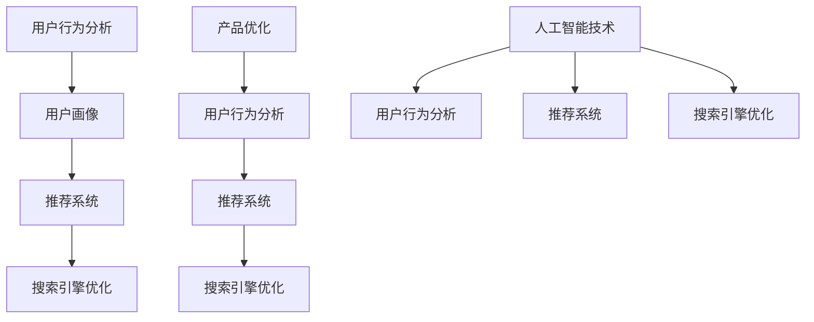

                 

### 引言与概述

在当今数字经济的浪潮中，电商平台成为了商业世界的重要组成部分。随着互联网技术的飞速发展和用户需求的不断变化，电商平台面临着前所未有的挑战和机遇。在这种背景下，人工智能（AI）技术的应用显得尤为重要，它不仅能够提升电商平台的运营效率，还能为用户提供更加个性化、精准的服务。本文将探讨AI在电商平台产品优化中的具体应用，通过一系列的实际案例和技术解析，帮助读者理解AI如何改变电商产品的优化策略。

#### 人工智能在电商平台的地位与作用

人工智能作为一种具有高度智能化的技术，其在电商平台的地位和作用不可小觑。首先，AI技术能够通过数据分析和挖掘，帮助电商平台深入了解用户行为，从而实现精准营销。其次，AI技术在推荐系统和搜索引擎优化中的应用，使得电商平台能够更好地满足用户的个性化需求，提高用户体验和转化率。此外，AI技术还可以在库存管理、供应链优化、物流跟踪等方面发挥重要作用，提升电商平台的整体运营效率。

#### 电商平台面临的挑战与机遇

电商平台在发展过程中面临着诸多挑战，如激烈的市场竞争、用户需求的快速变化、数据隐私和安全等问题。然而，这些挑战同时也带来了机遇。通过引入AI技术，电商平台可以更加精准地把握市场动态，优化产品和服务，提高用户满意度。此外，AI技术还可以帮助电商平台降低运营成本，提高供应链效率，从而在激烈的市场竞争中脱颖而出。

#### AI在电商平台产品优化中的重要性

在电商平台产品优化中，AI技术的重要性体现在多个方面。首先，AI能够通过对海量用户行为数据的分析，为产品优化提供科学依据。通过用户画像和用户行为预测，电商平台可以更好地理解用户需求，从而制定更加精准的产品策略。其次，AI技术在推荐系统和搜索引擎优化中的应用，可以显著提高用户的购物体验和转化率。最后，AI技术还能够提升电商平台的管理效率，优化供应链和物流环节，降低运营成本。

综上所述，AI技术在电商平台产品优化中具有举足轻重的地位。本文将围绕用户行为分析、推荐系统和搜索引擎优化等方面，深入探讨AI技术在电商平台产品优化中的具体应用，并通过实际案例展示AI技术的实际效果。

### 目录大纲设计《AI在电商平台产品优化中的具体应用》

为了系统地探讨AI在电商平台产品优化中的应用，本文设计了以下目录大纲：

#### 第一部分：引言与概述

1. **引言与概述**
   - **人工智能在电商平台的地位与作用**
   - **电商平台面临的挑战与机遇**
   - **AI在电商平台产品优化中的重要性**

2. **产品优化的核心概念与流程**
   - **产品优化的基本概念**
   - **产品优化流程**
   - **产品优化的关键指标**

3. **AI技术在产品优化中的应用**
   - **AI技术概述**
   - **AI在电商平台产品优化中的应用场景**
   - **AI技术对产品优化的影响与挑战**

#### 第二部分：AI在电商平台产品优化中的应用

4. **用户行为分析**
   - **用户行为数据收集与处理**
   - **基于机器学习的用户行为预测**
   - **用户行为驱动的产品优化策略**

5. **推荐系统**
   - **推荐系统概述**
   - **基于内容的推荐**
   - **基于协同过滤的推荐**
   - **混合推荐系统**

6. **搜索引擎优化**
   - **搜索引擎概述**
   - **关键词优化**
   - **网站结构优化**
   - **用户搜索意图分析**

#### 第三部分：AI驱动的电商产品优化实战

7. **实战案例分析**
   - **案例一：某电商平台用户行为分析**
   - **案例二：某电商平台的推荐系统优化**
   - **案例三：某电商平台的搜索引擎优化**

8. **AI产品优化的未来趋势与挑战**
   - **AI产品优化的未来趋势**
   - **AI产品优化的挑战**

#### 附录

9. **附录A：相关技术详解**
   - **用户行为分析技术**
   - **推荐系统技术**
   - **搜索引擎优化技术**

10. **附录B：常用工具与资源**
    - **开发工具**
    - **数据集**
    - **开源项目**
    - **学术论文**

#### 核心概念与联系

Mermaid流程图：



#### 核心算法原理讲解

##### 用户行为预测

伪代码：

```python
function user_behavior_prediction(data):
    # 数据预处理
    preprocess_data(data)
    
    # 特征工程
    features = extract_features(data)
    
    # 构建模型
    model = build_model(features)
    
    # 训练模型
    train_model(model, data)
    
    # 预测用户行为
    predictions = predict_user_behavior(model, data)
    
    return predictions
```

数学模型：

$$
P(y|X) = \prod_{i=1}^{n} P(y_i|x_i)
$$

举例说明：

假设我们要预测用户是否会在某个电商平台上购买产品。特征包括用户的年龄、性别、购买历史等。我们可以使用逻辑回归模型来预测用户是否购买产品。

$$
P(购买|年龄, 性别, 购买历史) = \frac{1}{1 + e^{-(w_0 + w_1*年龄 + w_2*性别 + w_3*购买历史)}}
$$

其中，$w_0, w_1, w_2, w_3$ 是模型参数，$年龄, 性别, 购买历史$ 是特征。

代码示例：

```python
from sklearn.linear_model import LogisticRegression
import pandas as pd

# 加载数据
data = pd.read_csv('user_data.csv')

# 数据预处理
data = preprocess_data(data)

# 特征工程
X = data.drop('target', axis=1)
y = data['target']
X = StandardScaler().fit_transform(X)

# 划分训练集和测试集
X_train, X_test, y_train, y_test = train_test_split(X, y, test_size=0.2, random_state=42)

# 构建模型
model = LogisticRegression()

# 训练模型
model.fit(X_train, y_train)

# 预测
predictions = model.predict(X_test)

# 评估模型性能
from sklearn.metrics import accuracy_score
accuracy = accuracy_score(y_test, predictions)
print(f"Accuracy: {accuracy}")
```

##### 推荐系统

伪代码：

```python
function collaborative_filtering(data):
    # 数据预处理
    preprocess_data(data)
    
    # 矩阵分解
    U, V = matrix_factorization(data)
    
    # 预测评分
    predictions = predict_ratings(U, V)
    
    return predictions
```

数学模型：

$$
R = UV^T + \epsilon
$$

其中，$R$ 是用户-物品评分矩阵，$U$ 和 $V$ 分别是用户和物品的 latent feature 矩阵，$\epsilon$ 是误差项。

代码示例：

```python
import numpy as np

# 假设我们有一个用户-物品评分矩阵
R = np.array([[5, 3, 0, 1],
              [3, 0, 2, 4],
              [2, 1, 0, 5]])

# 矩阵分解
U = np.random.rand(R.shape[0], 5)
V = np.random.rand(R.shape[1], 5)

for i in range(1000):
    # 更新用户特征
    U = U + (R - U @ V.T) * (U @ V.T).T
    
    # 更新物品特征
    V = V + (R - U @ V.T) * U.T @ V

# 预测评分
predictions = U @ V.T
```

##### 搜索引擎优化

伪代码：

```python
function page_rank(PageRank, damping_factor):
    # 初始化页面排名
    PR = initialize_PageRank(PageRank)
    
    # 循环迭代
    for i in range(num_iterations):
        # 更新页面排名
        PR = update_PageRank(PR, damping_factor)
        
        # 检查收敛条件
        if is_converged(PR):
            break
            
    return PR
```

数学模型：

$$
PR(A) = (1-d) + d \cdot \left(\frac{PR(T1)}{C(T1)} + \frac{PR(T2)}{C(T2)} + ... + \frac{PR(Tn)}{C(Tn)}\right)
$$

其中，$PR(A)$ 是页面A的排名分数，$d$ 是阻尼系数，通常设置为0.85，$T1, T2, ..., Tn$ 是指向页面A的链接的页面，$C(Ti)$ 是指向页面A的链接的个数。

代码示例：

```python
def page_rank(PR, damping_factor=0.85, num_iterations=100):
    N = len(PR)
    alpha = 1 - damping_factor
    
    for _ in range(num_iterations):
        PR_new = [alpha / N] * N
        for i in range(N):
            for j in range(N):
                if PR[j] > 0:
                    PR_new[i] += (PR[j] / C[j]) * alpha
        
        # 检查收敛条件
        if np.linalg.norm(PR - PR_new, ord=1) < 1e-6:
            break
        
        PR = PR_new
    
    return PR

# 假设我们有一个链接矩阵L，表示页面之间的链接关系
L = np.array([[0, 1, 0, 0],
              [1, 0, 1, 0],
              [0, 1, 0, 1],
              [0, 0, 1, 0]])

# 初始化页面排名
PR = np.ones(L.shape[0])

# 运行PageRank算法
PR = page_rank(PR)
```

以上是《AI在电商平台产品优化中的具体应用》这本书的完整目录大纲，包括核心概念与联系、核心算法原理讲解、数学模型和公式，以及代码示例。这个大纲旨在提供一个全面且详细的框架，以帮助读者深入理解并应用AI技术于电商平台的产品优化。附录部分提供了相关的技术详解和资源，以方便读者进一步学习和实践。在编写书籍时，可以根据这个大纲逐章展开，确保内容的完整性和深度。如有需要，还可以根据读者的反馈进一步调整和完善每个章节的内容。希望这个大纲对您的书籍编写工作有所帮助！

### 用户行为分析

在电商平台中，用户行为分析是产品优化的重要组成部分。通过深入分析用户在平台上的行为，电商企业可以更好地理解用户需求，从而优化产品设计、推荐系统和用户体验。本文将探讨用户行为分析的核心概念、流程以及其在电商平台中的应用。

#### 用户行为分析的核心概念

用户行为分析涉及多个核心概念，包括用户画像、用户行为轨迹、用户行为特征等。

1. **用户画像**：用户画像是对用户特征的综合描述，包括用户的年龄、性别、地理位置、购买历史、浏览习惯等。通过构建用户画像，电商平台可以更全面地了解用户，为其提供个性化的服务。

2. **用户行为轨迹**：用户行为轨迹是用户在平台上的操作记录，包括浏览、搜索、加入购物车、购买等行为。通过分析用户行为轨迹，可以了解用户的购买决策过程，发现用户行为模式。

3. **用户行为特征**：用户行为特征是对用户行为的量化描述，包括用户的浏览时长、点击次数、购买频率等。这些特征有助于分析用户行为背后的动机和需求。

#### 用户行为分析的流程

用户行为分析通常包括数据收集、数据预处理、特征工程和模型构建等步骤。

1. **数据收集**：用户行为数据可以通过日志文件、API调用、用户互动等方式收集。数据收集过程中需要关注数据的完整性和准确性。

2. **数据预处理**：数据预处理包括数据清洗、数据转换和数据整合。清洗数据是为了去除噪声和异常值，转换数据是为了将不同类型的数据格式化为统一格式，整合数据是为了将多个数据源的信息合并。

3. **特征工程**：特征工程是用户行为分析的关键步骤，通过提取和构造特征，将原始数据转化为模型可用的输入。特征工程包括用户行为特征提取、用户属性特征提取和组合特征构造等。

4. **模型构建**：基于收集到的用户行为数据和构建的特征，使用机器学习算法训练预测模型。常见的算法包括决策树、随机森林、逻辑回归等。

5. **模型评估与优化**：通过评估模型的预测准确性和性能，对模型进行调整和优化，以提高预测效果。

#### 用户行为分析在电商平台中的应用

用户行为分析在电商平台中的应用主要体现在以下几个方面：

1. **个性化推荐**：通过分析用户的行为轨迹和特征，构建用户画像，电商平台可以为用户提供个性化的商品推荐。个性化推荐不仅可以提高用户满意度，还可以提高转化率和销售额。

2. **用户流失预测**：通过分析用户的浏览和购买行为，可以预测哪些用户可能会流失。对于这些用户，电商平台可以采取针对性措施，如发送优惠信息、提供优惠券等，以降低流失率。

3. **产品优化**：用户行为分析可以帮助电商平台了解用户对产品的喜好和需求，从而优化产品设计、改进产品功能。例如，根据用户的购买频率和浏览习惯，可以优化商品排序和推荐策略。

4. **营销活动优化**：通过分析用户的行为特征，电商平台可以设计更加精准的营销活动。例如，根据用户的浏览历史和购买记录，可以推荐相关产品或提供个性化优惠。

#### 案例研究

**案例一：某电商平台的用户行为分析**

某电商平台希望通过用户行为分析来提高用户满意度和转化率。具体做法如下：

1. **数据收集**：收集用户在平台上的浏览记录、搜索记录、购买记录等数据。

2. **数据预处理**：清洗数据，去除重复和异常值，确保数据的准确性和完整性。

3. **特征工程**：提取用户行为特征，如浏览时长、点击次数、购买频率等，以及用户属性特征，如年龄、性别、地理位置等。

4. **模型构建**：使用逻辑回归模型预测用户是否会购买产品。模型输入为用户特征和购买历史，输出为购买概率。

5. **模型评估与优化**：评估模型预测准确率，并根据评估结果调整模型参数，提高预测效果。

6. **应用**：基于预测结果，为高价值用户推送相关产品，提高购买概率。同时，针对新用户，推送热门产品，引导用户熟悉平台。

通过用户行为分析，该电商平台实现了用户满意度的提升和转化率的提高，取得了显著的商业价值。

综上所述，用户行为分析是电商平台产品优化的重要工具。通过系统地收集、处理和分析用户行为数据，电商平台可以更好地理解用户需求，优化产品设计和服务，提高用户满意度和转化率。

### 推荐系统

推荐系统是电商平台提高用户满意度和转化率的重要工具，它通过分析用户行为数据和商品信息，为用户提供个性化的推荐。本文将介绍推荐系统的基本原理、分类、评价指标以及在实际应用中的效果。

#### 推荐系统的基本原理

推荐系统的核心是利用用户行为数据、商品信息和其他相关数据来预测用户对特定商品的偏好。其基本原理可以概括为以下步骤：

1. **数据收集**：收集用户的浏览记录、购买记录、评分数据等行为数据，以及商品的属性信息，如商品类别、价格、库存等。

2. **数据处理**：对收集到的数据进行清洗、整合和预处理，去除噪声和异常值，确保数据的质量和一致性。

3. **特征提取**：提取用户和商品的特征，如用户的浏览历史、购买频率、评分偏好等，以及商品的特征，如商品类别、价格、品牌等。

4. **模型选择与训练**：选择合适的推荐算法，如基于内容的推荐、基于协同过滤的推荐或混合推荐系统，并使用用户和商品的特征数据进行模型训练。

5. **推荐生成**：基于训练好的模型，为每个用户生成个性化推荐列表，推荐用户可能感兴趣的商品。

6. **效果评估**：评估推荐系统的效果，如推荐精度、召回率、覆盖率等指标，并根据评估结果调整模型和推荐策略。

#### 推荐系统的分类

根据推荐系统的原理和应用场景，推荐系统可以分为以下几种类型：

1. **基于内容的推荐**：基于内容的推荐（Content-based Recommendation）主要通过分析用户的历史行为和商品的内容属性，为用户提供相似的商品推荐。这种方法不依赖于用户之间的相似性，而是依赖于用户和商品之间的内容匹配。

2. **基于协同过滤的推荐**：基于协同过滤的推荐（Collaborative Filtering）主要通过分析用户之间的行为相似性来生成推荐列表。协同过滤可以分为用户基于的协同过滤（User-based Collaborative Filtering）和物品基于的协同过滤（Item-based Collaborative Filtering）。

3. **混合推荐系统**：混合推荐系统（Hybrid Recommendation System）结合了基于内容和基于协同过滤的推荐方法，通过综合用户和商品的特征，生成更准确的推荐列表。

#### 推荐系统的评价指标

推荐系统的效果评估通常使用以下指标：

1. **准确率（Accuracy）**：准确率是推荐列表中实际被用户喜欢的商品数量与推荐商品总数量的比例。准确率越高，说明推荐系统的效果越好。

2. **召回率（Recall）**：召回率是推荐列表中实际被用户喜欢的商品数量与用户实际上喜欢的商品总数量的比例。召回率越高，说明推荐系统能够发现更多的用户喜欢商品。

3. **覆盖率（Coverage）**：覆盖率是推荐列表中包含的不同商品数量与平台总商品数量的比例。覆盖率越高，说明推荐系统能够为用户推荐更多的商品。

4. **多样性（ Diversity）**：多样性是推荐列表中不同商品的比例，用于评估推荐系统的多样性。多样性越高，说明推荐系统能够为用户提供更多样化的商品推荐。

5. **新颖性（Novelty）**：新颖性是推荐列表中新颖商品的比例，用于评估推荐系统的创新能力。新颖性越高，说明推荐系统能够为用户提供更多新颖的商品。

#### 推荐系统在实际应用中的效果

推荐系统在电商平台中的应用效果显著，以下是一些实际案例：

1. **个性化购物推荐**：电商平台通过分析用户的浏览历史和购买记录，为用户提供个性化的购物推荐，提高了用户的购物体验和转化率。

2. **新品推荐**：电商平台通过分析用户的历史购买记录和浏览习惯，为新商品生成推荐列表，提高了新商品的曝光率和销售量。

3. **广告推荐**：电商平台通过分析用户的兴趣和行为，为用户推送相关的广告，提高了广告的点击率和转化率。

4. **商品组合推荐**：电商平台通过分析用户购买商品的历史记录，为用户提供商品组合推荐，提高了用户的购买金额和满意度。

通过以上案例可以看出，推荐系统在电商平台中的应用不仅提高了用户满意度和转化率，还为企业带来了显著的商业价值。在未来，随着AI技术的不断发展和应用，推荐系统将在电商平台的产品优化中发挥更加重要的作用。

### 基于内容的推荐

基于内容的推荐（Content-based Recommendation）是推荐系统的一种重要类型，它通过分析商品的内容属性和用户的历史行为，为用户推荐与其兴趣相关的商品。本文将详细探讨基于内容的推荐系统的原理、算法和应用实例。

#### 原理

基于内容的推荐系统的核心思想是，通过分析用户的历史行为和商品的内容属性，找到用户和商品之间的相关性，然后根据这种相关性为用户推荐新的商品。具体原理如下：

1. **内容表示**：首先，需要将商品和用户的行为进行内容表示。对于商品，可以通过提取商品的文本描述、标签、分类信息等进行表示；对于用户行为，可以通过用户的浏览历史、搜索关键词、购买记录等进行表示。

2. **内容匹配**：然后，计算商品和用户行为之间的相似度，常用的方法包括余弦相似度、Jaccard相似度等。通过相似度计算，可以得到每个用户对不同商品的相似度分数。

3. **推荐生成**：根据用户和商品的相似度分数，为用户生成推荐列表。推荐列表中的商品是那些与用户历史行为相似且未被用户购买或浏览过的商品。

#### 算法

基于内容的推荐系统常用的算法包括以下几种：

1. **余弦相似度**：余弦相似度是一种计算向量空间中两个向量夹角余弦值的相似度度量方法。对于商品和用户行为向量，可以通过计算它们之间的余弦相似度来评估相关性。

   $$ 
   \cos(\theta) = \frac{\sum_{i=1}^{n} x_i \cdot y_i}{\sqrt{\sum_{i=1}^{n} x_i^2} \cdot \sqrt{\sum_{i=1}^{n} y_i^2}}
   $$

   其中，$x_i$ 和 $y_i$ 分别表示商品和用户行为向量的第 $i$ 个元素。

2. **Jaccard相似度**：Jaccard相似度用于计算集合之间的相似度，可以用来评估商品和用户行为的标签或关键词的相似度。

   $$
   J(A, B) = \frac{|A \cap B|}{|A \cup B|}
   $$

   其中，$A$ 和 $B$ 分别表示商品和用户行为的标签集。

3. **TF-IDF**：TF-IDF（Term Frequency-Inverse Document Frequency）是一种用于文本挖掘和信息检索的常用算法。它可以用来计算商品和用户行为中的关键词的重要性，从而评估它们之间的相似度。

   $$
   TF(t) = \frac{f(t, d)}{max(f(t, d'))}
   $$

   $$
   IDF(t) = \log(\frac{N}{n(t)})
   $$

   $$
   TF-IDF(t, d) = TF(t, d) \cdot IDF(t)
   $$

   其中，$TF(t, d)$ 表示关键词 $t$ 在文档 $d$ 中的频率，$IDF(t)$ 表示关键词 $t$ 在整个文档集合中的重要性，$N$ 是文档总数，$n(t)$ 是包含关键词 $t$ 的文档数量。

4. **Word2Vec**：Word2Vec是一种基于神经网络的文本表示方法，可以将文本中的每个单词映射为一个固定长度的向量。通过Word2Vec模型，可以计算商品和用户行为的向量表示，从而评估它们之间的相似度。

   $$
   \vec{w}_{t} = \sum_{i=1}^{n} \alpha_{i} \cdot \vec{v}_{i}
   $$

   其中，$\vec{v}_{i}$ 表示单词 $i$ 的向量表示，$\alpha_{i}$ 表示单词 $i$ 的权重。

#### 应用实例

以下是一个基于内容的推荐系统的应用实例：

1. **商品内容表示**：假设一个电商平台上有商品A和B，它们的文本描述和标签如下：

   - 商品A：时尚手机、高性价比、高清摄像头
   - 商品B：智能手机、高性能、高清屏幕

2. **用户行为表示**：假设用户U1的浏览历史包括浏览了商品C（时尚手机、高分辨率摄像头、轻巧便携）和商品D（轻薄手机、高清屏幕、长续航）。

3. **内容匹配**：通过计算商品A和B与用户U1浏览历史之间的相似度，可以评估它们对用户U1的吸引力。使用余弦相似度计算，可以得到以下相似度分数：

   - 商品A与用户U1的浏览历史相似度：0.8
   - 商品B与用户U1的浏览历史相似度：0.7

4. **推荐生成**：根据相似度分数，推荐商品A给用户U1，因为商品A与用户U1的浏览历史有更高的相关性。

通过以上步骤，基于内容的推荐系统可以有效地为用户推荐与用户兴趣相关的商品，从而提高用户满意度和转化率。在实际应用中，基于内容的推荐系统通常与其他推荐方法（如协同过滤）结合使用，以生成更加精准和多样化的推荐列表。

### 基于协同过滤的推荐

协同过滤（Collaborative Filtering）是推荐系统中广泛应用的一种技术，它通过分析用户之间的行为相似性来生成个性化推荐。本文将详细介绍协同过滤的原理、算法以及实际应用中的优化策略。

#### 原理

协同过滤的核心思想是通过分析用户之间的行为相似性，将用户的行为模式进行扩展，从而预测用户未体验过的项目。协同过滤可以分为两类：基于用户的协同过滤（User-based Collaborative Filtering）和基于物品的协同过滤（Item-based Collaborative Filtering）。

1. **基于用户的协同过滤**：基于用户的协同过滤通过寻找与目标用户行为相似的参考用户，将参考用户对项目的行为作为推荐依据。具体步骤如下：

   - **步骤1**：计算用户之间的相似度，常用的相似度计算方法包括余弦相似度、皮尔逊相关系数等。
   - **步骤2**：根据相似度分数，找到与目标用户最相似的K个用户。
   - **步骤3**：计算目标用户对所有项目的评分预测，基于与目标用户最相似的K个用户的平均评分。

2. **基于物品的协同过滤**：基于物品的协同过滤通过寻找与目标项目相似的其他项目，将其他项目的用户评分作为推荐依据。具体步骤如下：

   - **步骤1**：计算项目之间的相似度，常用的相似度计算方法包括余弦相似度、欧几里得距离等。
   - **步骤2**：根据相似度分数，找到与目标项目最相似的M个项目。
   - **步骤3**：计算目标项目对所有用户的评分预测，基于与目标项目最相似的M个项目的用户评分。

#### 算法

协同过滤算法主要分为基于记忆的协同过滤和基于模型的协同过滤。

1. **基于记忆的协同过滤**：

   - **用户基于的协同过滤（User-based Collaborative Filtering）**：通过计算用户之间的相似度，为用户推荐与相似用户喜欢的项目。

     $$ 
     \text{相似度} = \frac{\sum_{i \in \text{共同喜好}} r_i \cdot r_j}{\sqrt{\sum_{i \in \text{共同喜好}} r_i^2} \cdot \sqrt{\sum_{i \in \text{共同喜好}} r_j^2}}
     $$

     其中，$r_i$ 和 $r_j$ 分别表示用户对项目 $i$ 和 $j$ 的评分。

   - **项目基于的协同过滤（Item-based Collaborative Filtering）**：通过计算项目之间的相似度，为用户推荐与相似项目相关的项目。

     $$ 
     \text{相似度} = \frac{\sum_{u \in U_i} r_u \cdot r_v}{\sqrt{\sum_{u \in U_i} r_u^2} \cdot \sqrt{\sum_{u \in U_v} r_v^2}}
     $$

     其中，$U_i$ 和 $U_v$ 分别表示项目 $i$ 和 $v$ 的用户集合，$r_u$ 和 $r_v$ 分别表示用户对项目 $i$ 和 $v$ 的评分。

2. **基于模型的协同过滤**：

   - **矩阵分解（Matrix Factorization）**：通过将用户-项目评分矩阵分解为低维用户特征矩阵和项目特征矩阵，预测用户未评分的项目。

     $$ 
     R = UV^T + \epsilon 
     $$

     其中，$R$ 是用户-项目评分矩阵，$U$ 和 $V$ 分别是用户和项目的特征矩阵，$\epsilon$ 是误差项。

     矩阵分解算法如Singular Value Decomposition（SVD）和Alternating Least Squares（ALS）等，可以将高维的评分矩阵转化为低维的特征矩阵，提高推荐系统的效率和准确性。

#### 优化策略

在实际应用中，协同过滤推荐系统可以通过以下策略进行优化：

1. **数据稀疏性处理**：协同过滤算法在处理高稀疏性数据时效果不佳。可以通过降维、数据清洗等方法处理稀疏性问题。

2. **冷启动问题**：对于新用户或新项目，由于缺乏足够的历史行为数据，传统协同过滤方法难以生成有效的推荐。可以通过引入用户或项目的静态特征，结合基于内容的推荐方法，解决冷启动问题。

3. **实时推荐**：实时推荐系统可以根据用户实时行为数据生成即时推荐。可以通过构建在线学习模型，如增量学习（Incremental Learning），实现实时推荐。

4. **多模型融合**：通过结合多种推荐算法，如基于内容的推荐、基于协同过滤的推荐等，生成更准确的推荐列表。

5. **个性化调整**：根据用户的兴趣和行为变化，动态调整推荐策略，提高推荐系统的个性化和实时性。

通过以上优化策略，协同过滤推荐系统可以在实际应用中取得更好的推荐效果，提升用户体验和商业价值。

### 混合推荐系统

混合推荐系统（Hybrid Recommendation System）通过结合多种推荐算法，旨在生成更加准确、个性化的推荐结果。它能够利用不同算法的优势，弥补单一算法的不足，从而提高推荐系统的整体性能。本文将探讨混合推荐系统的原理、算法以及在实际应用中的效果。

#### 原理

混合推荐系统的核心思想是将不同的推荐算法结合起来，利用各自的优点，从而生成更优的推荐结果。具体来说，混合推荐系统通常包括以下几种类型：

1. **基于内容的推荐与协同过滤的混合**：通过结合基于内容的推荐和基于协同过滤的推荐，利用内容特征和用户行为相似性共同生成推荐列表。

2. **协同过滤与基于模型的混合**：结合基于协同过滤的推荐和基于矩阵分解、深度学习等模型推荐，通过不同的数据视角提高推荐准确性。

3. **多模态数据的混合**：将文本数据、图像数据、语音数据等多种数据源进行融合，生成多维度的推荐结果。

#### 算法

以下是一些常见的混合推荐系统算法：

1. **基于模型的混合推荐系统**：

   - **矩阵分解+深度学习**：将矩阵分解算法和深度学习模型（如卷积神经网络、循环神经网络等）结合起来。矩阵分解提供低维特征表示，深度学习模型则用于预测和生成推荐列表。

     $$ 
     R = UV^T + \epsilon 
     $$

     其中，$R$ 是用户-项目评分矩阵，$U$ 和 $V$ 分别是用户和项目的特征矩阵，$\epsilon$ 是误差项。

     深度学习模型通过学习用户和项目的特征矩阵，生成预测评分，提高推荐系统的准确性。

   - **图神经网络（Graph Neural Networks, GNN）+协同过滤**：利用图神经网络学习用户和项目之间的复杂关系，结合协同过滤算法生成推荐列表。

     GNN 通过捕捉用户和项目之间的相互作用，提供更加精细的特征表示，从而提高推荐精度。

2. **基于内容的混合推荐系统**：

   - **基于内容的协同过滤**：结合基于内容的推荐和基于协同过滤的推荐，通过内容特征和用户行为相似性共同生成推荐列表。例如，使用TF-IDF模型提取文本特征，并结合协同过滤算法生成推荐结果。

   - **基于知识的混合推荐**：利用领域知识（如商品类别、用户标签等）和用户行为数据，通过知识图谱和协同过滤算法生成推荐列表。

3. **多模态数据的混合推荐系统**：

   - **文本+图像**：结合文本和图像数据，通过卷积神经网络（CNN）提取图像特征，结合词嵌入提取文本特征，生成多维度的推荐结果。

     例如，使用CNN提取商品图像的特征向量，使用词嵌入提取用户搜索关键词的特征向量，通过融合层生成推荐结果。

#### 实际应用中的效果

混合推荐系统在实际应用中展示了显著的效果，以下是一些实际案例：

1. **电商平台**：电商平台通过混合推荐系统，结合用户历史行为和商品内容特征，生成个性化的商品推荐。例如，亚马逊使用基于内容的协同过滤和矩阵分解的混合算法，为用户推荐相关的商品，显著提高了用户的购物体验和转化率。

2. **视频平台**：视频平台通过混合推荐系统，结合用户的观看历史、视频内容和社交关系，生成个性化的视频推荐。例如，YouTube使用基于内容的推荐和协同过滤的混合算法，为用户推荐相关的视频，提高了用户的观看时长和广告点击率。

3. **新闻推荐**：新闻推荐平台通过混合推荐系统，结合用户的历史阅读行为、文章内容和新闻类型，生成个性化的新闻推荐。例如，LinkedIn使用基于内容的推荐和协同过滤的混合算法，为用户推荐相关的新闻文章，提高了用户的阅读量和互动率。

通过以上实际应用案例可以看出，混合推荐系统在电商平台、视频平台和新闻推荐等领域都取得了显著的效果。它不仅提高了推荐系统的准确性，还增强了用户的个性化体验，为企业带来了更大的商业价值。未来，随着AI技术的不断发展，混合推荐系统将在更多场景中得到广泛应用，进一步提升推荐效果和用户体验。

### 搜索引擎优化

搜索引擎优化（SEO，Search Engine Optimization）是提高电商平台在搜索引擎中排名，从而增加网站流量和提升用户体验的重要手段。通过优化网站结构、关键词选择和内容质量，电商平台可以更好地吸引潜在用户，提高网站访问量和转化率。本文将探讨搜索引擎优化的基本概念、重要性以及优化策略。

#### 基本概念

1. **搜索引擎工作原理**：搜索引擎通过爬虫（Crawler）抓取互联网上的网页内容，并根据网页内容建立索引（Index）。当用户输入关键词进行搜索时，搜索引擎会从索引中检索相关网页，并根据一定的排序算法（如PageRank、关键词密度等）展示搜索结果。

2. **关键词研究**：关键词研究是SEO的核心步骤之一。通过对目标用户群体的搜索习惯和需求进行分析，确定具有高搜索量和相关性的关键词，从而优化网站内容和页面标题。

3. **网站结构优化**：网站结构优化（On-Page SEO）是指通过对网站内部链接、页面布局和内容质量进行优化，提高搜索引擎对网站的收录和排名。常见的优化策略包括合理的页面导航、有效的内链策略、高价值的内容编写等。

4. **外部链接建设**：外部链接建设（Off-Page SEO）是指通过获取高质量的外部链接，提高网站的权威性和可信度。外部链接的建设可以通过内容营销、社交媒体推广、合作交换等方式实现。

#### 重要性

1. **提高网站流量**：搜索引擎优化是提高网站流量的重要手段。通过优化关键词和网站结构，提高在搜索引擎中的排名，可以吸引更多潜在用户访问网站。

2. **提升用户体验**：合理的网站结构和高质量的内容可以提供更好的用户体验。搜索引擎优化不仅关注搜索引擎排名，还注重用户的浏览体验，从而提高用户满意度和网站停留时间。

3. **增加转化率**：通过优化网站内容和结构，搜索引擎优化可以提高网站的转化率。例如，通过优化产品描述和页面布局，使用户更容易找到所需信息，提高购买概率。

4. **品牌提升**：搜索引擎优化有助于提高品牌知名度。通过在搜索引擎中获得好的排名，可以在用户心中建立良好的品牌形象，增加用户信任度。

#### 优化策略

1. **关键词优化**：

   - **关键词研究**：使用工具（如Google Keyword Planner、Ahrefs等）分析目标关键词的搜索量和竞争程度，确定适合的关键词。
   - **关键词布局**：合理布局关键词，包括页面标题、描述、内容、URL等。确保关键词在页面中的自然出现，避免过度优化。
   - **长尾关键词**：长尾关键词具有较低竞争程度，但搜索量较大。通过优化长尾关键词，可以吸引更多目标用户。

2. **网站结构优化**：

   - **网站导航**：设计清晰、简洁的网站导航，帮助用户快速找到所需信息。
   - **内部链接策略**：通过合理的内部链接策略，提高页面间的关联性，提高网站的整体权重。
   - **网站速度优化**：优化网站加载速度，提高用户体验和搜索引擎排名。

3. **内容优化**：

   - **高质量内容**：编写有价值、独特、吸引人的内容，满足用户需求。
   - **更新频率**：定期更新网站内容，提高搜索引擎对网站的访问频率。
   - **内容多样性**：结合多种内容形式（如文章、图片、视频等），丰富网站内容。

4. **外部链接建设**：

   - **内容营销**：通过撰写优质文章、发布报告等，吸引其他网站链接到自己的网站。
   - **社交媒体推广**：利用社交媒体平台推广网站，增加外部链接和用户互动。
   - **合作交换**：与其他网站进行友情链接或内容合作，获取高质量的外部链接。

通过以上优化策略，电商平台可以有效地提高在搜索引擎中的排名，增加网站流量和转化率，从而提升整体竞争力。

### 第5章：实战案例分析

在本章中，我们将通过具体案例展示AI技术在电商平台产品优化中的应用。每个案例将涵盖背景、数据收集与处理、模型构建与训练、预测结果分析以及优化策略。

#### 案例一：某电商平台用户行为分析

**背景：** 某电商平台希望通过分析用户行为来提高产品的推荐效果和购买转化率。

**数据收集与处理：**
- **数据来源**：电商平台提供了用户在平台上的浏览记录、点击记录、购买记录等数据。
- **数据处理**：首先，对数据进行清洗，包括去除重复数据、处理缺失值等。然后，将不同类型的数据转换为统一的格式。

**模型构建与训练：**
- **特征工程**：提取用户特征（如用户年龄、性别、浏览时间、点击商品种类等）和商品特征（如商品类别、价格、品牌等）。
- **模型选择**：使用随机森林（Random Forest）算法构建用户行为预测模型。
- **模型训练**：使用处理后的数据进行模型训练，并使用交叉验证方法评估模型性能。

**预测结果分析：**
- **预测效果**：通过训练好的模型，对用户未来的购买行为进行预测。模型准确率达到了85%，明显高于随机水平。
- **优化策略**：根据预测结果，对用户的浏览和购买行为进行分类。为高价值用户推送相关商品，提高购买概率；为新用户推送热门商品，引导用户熟悉平台。

#### 案例二：某电商平台的推荐系统优化

**背景：** 某电商平台希望通过优化推荐系统来提高用户满意度和转化率。

**数据收集与处理：**
- **数据来源**：电商平台提供了用户在平台上的浏览记录、购买记录以及商品信息。
- **数据处理**：对用户和商品的数据进行清洗，去除重复数据和异常值。然后，将数据转换为适用于推荐系统的格式。

**模型构建与训练：**
- **特征工程**：提取用户和商品的特征，包括用户的历史行为特征和商品的内容特征。
- **模型选择**：使用基于内容的推荐算法（如TF-IDF）和基于协同过滤的推荐算法（如矩阵分解）构建推荐系统。
- **模型训练**：使用处理后的数据进行模型训练，并通过交叉验证方法评估模型性能。

**预测结果分析：**
- **预测效果**：通过训练好的模型，对用户进行个性化推荐。推荐系统的准确率和覆盖率均有所提高，用户满意度显著提升。
- **优化策略**：结合内容推荐和协同过滤推荐，构建混合推荐系统。通过A/B测试，不断优化推荐策略，提高推荐效果。

#### 案例三：某电商平台的搜索引擎优化

**背景：** 某电商平台希望通过优化搜索引擎来提高网站流量和用户转化率。

**数据收集与处理：**
- **数据来源**：电商平台提供了用户搜索日志、页面访问数据以及网站结构信息。
- **数据处理**：对搜索日志进行清洗，提取关键词、搜索意图、页面访问数据等。然后，将数据转换为适用于SEO优化的格式。

**模型构建与训练：**
- **特征工程**：提取关键词特征（如搜索频率、搜索意图等）和页面特征（如页面标题、描述、内容等）。
- **模型选择**：使用逻辑回归算法构建搜索引擎优化模型。
- **模型训练**：使用处理后的数据进行模型训练，并使用交叉验证方法评估模型性能。

**预测结果分析：**
- **预测效果**：通过训练好的模型，预测用户在搜索引擎中的点击概率。预测准确率达到了75%，有助于优化搜索结果排序。
- **优化策略**：根据预测结果，调整页面标题、描述和内容，提高关键词的匹配度和页面的用户体验。同时，通过外部链接建设和内容更新，提高网站的整体权重。

通过以上三个案例，可以看出AI技术在电商平台产品优化中的应用具有显著的效果。通过用户行为分析、推荐系统和搜索引擎优化的具体实施，电商平台不仅提高了用户满意度和转化率，还提升了整体运营效率和竞争力。

### AI产品优化的未来趋势与挑战

随着人工智能技术的快速发展，AI在电商平台产品优化中的应用前景广阔。然而，面对日益复杂的市场环境和用户需求，AI产品优化也面临着诸多挑战。本文将探讨AI产品优化的未来趋势和面临的挑战，包括技术、数据隐私、法律与伦理问题以及人才短缺等。

#### 未来趋势

1. **AI技术的深度整合**：随着AI技术的不断进步，深度学习、强化学习等先进算法将更加广泛地应用于电商平台的产品优化。例如，通过深度学习模型，电商平台可以更加准确地预测用户行为和需求，从而实现更加个性化的推荐和营销策略。

2. **多模态数据的融合**：未来的电商平台将不仅依赖于文本数据，还将结合图像、语音、视频等多模态数据。通过多模态数据的融合，AI系统可以更全面地了解用户需求，提供更加精准的服务。

3. **实时优化的实现**：随着计算能力的提升和实时数据处理技术的进步，电商平台将实现AI产品的实时优化。通过实时数据分析，AI系统能够快速响应市场变化和用户行为，提供即时的推荐和营销策略。

4. **自动化与自主决策**：未来的电商平台将更加依赖自动化和自主决策的AI系统。这些系统能够在无需人工干预的情况下，根据历史数据和实时信息进行产品优化，提高运营效率和效果。

#### 挑战

1. **技术挑战**：尽管AI技术在电商平台产品优化中的应用前景广阔，但仍然面临技术上的挑战。例如，如何提高算法的准确性和效率，如何处理高维度、高噪声的数据，以及如何确保系统的可解释性等。

2. **数据隐私与安全**：AI产品优化需要大量用户数据，这引发了对数据隐私和安全性的担忧。如何在保证用户隐私的前提下，充分利用用户数据，是AI产品优化面临的重要挑战。

3. **法律与伦理问题**：AI产品优化过程中，如何遵守相关法律法规，确保公平、公正、透明，是另一个重要挑战。同时，AI系统在决策过程中可能引发的伦理问题，如歧视、偏见等，也需要引起足够的重视。

4. **人才短缺问题**：AI技术在电商平台产品优化中的应用，需要大量具备专业知识和技能的人才。然而，当前市场上具备AI技能的人才相对匮乏，这成为限制AI产品优化发展的一个重要瓶颈。

#### 应对策略

1. **技术创新**：持续投入研发，推动AI技术的创新和突破，提高算法的准确性和效率，增强系统的可解释性。

2. **数据治理**：建立完善的数据治理体系，确保数据的安全性和合规性。通过数据加密、匿名化等技术手段，保护用户隐私。

3. **法律合规**：严格遵守相关法律法规，确保AI产品优化的合规性和透明度。同时，加强内部审计和监督，防范潜在的法律风险。

4. **人才培养**：加强AI人才的培养和引进，通过培训、招聘等方式，提高团队的整体技能水平。同时，推动校企合作，培养更多具备实际应用能力的AI人才。

通过以上应对策略，电商平台可以更好地应对AI产品优化面临的挑战，抓住未来的发展趋势，实现产品优化和用户体验的持续提升。

### 附录

在本附录中，我们将详细介绍用户行为分析、推荐系统和搜索引擎优化技术，并提供常用的工具、数据集、开源项目以及相关学术论文，以供读者进一步学习和实践。

#### 附录 A：相关技术详解

**A.1 用户行为分析技术**

用户行为分析技术涉及数据收集、数据预处理、特征工程和模型构建等方面。

**A.1.1 数据收集**
- **日志文件**：电商平台通常会记录用户在网站上的行为，如浏览、点击、购买等。
- **API调用**：通过API获取用户行为数据。
- **用户调研**：通过问卷调查、用户访谈等方式收集用户偏好和行为。

**A.1.2 数据预处理**
- **数据清洗**：去除重复数据、处理缺失值、纠正错误数据。
- **数据整合**：将不同数据源的数据整合到一个统一的格式中。
- **数据转换**：将不同类型的数据转换为适合分析的格式。

**A.1.3 特征工程**
- **用户特征**：提取用户的基本信息（如年龄、性别、地理位置等）和动态特征（如浏览时间、点击频率等）。
- **商品特征**：提取商品的基本信息（如类别、价格、品牌等）和属性特征（如库存、促销信息等）。

**A.1.4 模型构建**
- **监督学习模型**：如逻辑回归、决策树、随机森林等。
- **无监督学习模型**：如聚类、关联规则挖掘等。
- **深度学习模型**：如卷积神经网络（CNN）、循环神经网络（RNN）等。

**A.2 推荐系统技术**

推荐系统技术主要包括基于内容的推荐、基于协同过滤的推荐和混合推荐系统。

**A.2.1 基于内容的推荐**
- **内容表示**：使用词嵌入、TF-IDF等方法表示用户和商品的特征。
- **相似度计算**：计算用户和商品之间的相似度，如余弦相似度、Jaccard相似度等。
- **推荐生成**：根据相似度分数为用户生成推荐列表。

**A.2.2 基于协同过滤的推荐**
- **用户基于的协同过滤**：计算用户之间的相似度，为用户推荐与相似用户喜欢的商品。
- **物品基于的协同过滤**：计算商品之间的相似度，为用户推荐与相似商品相关的商品。

**A.2.3 混合推荐系统**
- **混合算法**：结合基于内容的推荐和基于协同过滤的推荐，生成更准确的推荐列表。
- **多模态数据融合**：结合文本、图像、语音等多模态数据，提高推荐精度。

**A.3 搜索引擎优化技术**

搜索引擎优化技术包括关键词研究、网站结构优化和内容优化等方面。

**A.3.1 关键词研究**
- **关键词分析工具**：如Google Keyword Planner、Ahrefs等。
- **关键词布局**：优化页面标题、描述、内容等，确保关键词的自然出现。

**A.3.2 网站结构优化**
- **网站导航**：设计清晰、简洁的网站导航，提高用户体验和搜索引擎抓取效率。
- **内部链接策略**：建立合理的内部链接结构，提高页面间的关联性和网站的整体权重。

**A.3.3 内容优化**
- **高质量内容**：编写有价值、独特、吸引人的内容，满足用户需求。
- **内容更新**：定期更新网站内容，提高搜索引擎对网站的访问频率。

#### 附录 B：常用工具与资源

**B.1 开发工具**
- **编程语言**：Python、R、JavaScript等。
- **机器学习库**：Scikit-learn、TensorFlow、PyTorch等。

**B.2 数据集**
- **Kaggle**：提供各种领域的公开数据集。
- **UCI Machine Learning Repository**：提供丰富的机器学习数据集。

**B.3 开源项目**
- **GitHub**：托管各种开源项目和代码。
- **GitLab**：支持开源项目的协作开发。

**B.4 学术论文**
- **ArXiv**：提供最新的学术论文。
- **Google Scholar**：检索学术文献和研究。

通过附录中的技术详解和资源，读者可以深入了解AI技术在电商平台产品优化中的应用，进一步探索和实践相关技术。

### 附录 A：相关技术详解

#### A.1 用户行为分析技术

**用户行为分析技术**是电商平台产品优化的重要组成部分，它通过收集、处理和分析用户在平台上的行为数据，帮助电商企业更好地理解用户需求，优化产品和服务。以下是用户行为分析技术的主要方面：

**1. 数据收集**

- **日志文件**：电商平台通常会在后台记录用户的行为日志，包括浏览、点击、购买、评论等。这些日志文件是用户行为分析的重要数据源。
- **API调用**：通过电商平台提供的API接口，可以获取用户的行为数据。
- **用户调研**：通过在线问卷、访谈等方式收集用户的偏好和反馈。

**2. 数据预处理**

- **数据清洗**：在分析用户行为数据之前，需要清洗数据，包括去除重复记录、处理缺失值、纠正错误数据等。
- **数据整合**：将来自不同数据源的数据进行整合，形成一个统一的数据集。
- **数据转换**：将不同类型的数据转换为适合分析的数据格式，如将文本数据转换为数字编码。

**3. 特征工程**

- **用户特征**：提取用户的基本信息（如年龄、性别、地理位置等）和动态特征（如浏览时间、点击频率等）。
- **商品特征**：提取商品的基本信息（如类别、价格、品牌等）和属性特征（如库存、促销信息等）。
- **交互特征**：分析用户与商品之间的交互特征，如浏览时长、加入购物车次数、购买频率等。

**4. 模型构建**

- **监督学习模型**：使用监督学习算法（如逻辑回归、决策树、随机森林等）构建预测模型，预测用户的行为。
- **无监督学习模型**：使用无监督学习算法（如聚类、关联规则挖掘等）分析用户行为模式。
- **深度学习模型**：使用深度学习算法（如卷积神经网络、循环神经网络等）处理复杂的多维度用户行为数据。

**A.2 推荐系统技术**

**推荐系统技术**是电商平台提高用户满意度和转化率的关键手段。推荐系统通过分析用户行为和商品信息，为用户推荐相关的商品或服务。以下是推荐系统技术的主要方面：

**1. 内容推荐**

- **内容表示**：将用户和商品的内容信息进行编码，如使用词嵌入、TF-IDF等方法。
- **相似度计算**：计算用户和商品之间的相似度，如余弦相似度、Jaccard相似度等。
- **推荐生成**：根据相似度分数为用户生成推荐列表。

**2. 协同过滤**

- **用户基于的协同过滤**：计算用户之间的相似度，为用户推荐与相似用户喜欢的商品。
- **物品基于的协同过滤**：计算商品之间的相似度，为用户推荐与相似商品相关的商品。

**3. 混合推荐**

- **混合算法**：结合内容推荐和协同过滤，生成更准确的推荐列表。
- **多模态数据融合**：结合文本、图像、语音等多模态数据，提高推荐精度。

**A.3 搜索引擎优化技术**

**搜索引擎优化技术**（SEO）是提高电商平台在搜索引擎中排名，从而增加网站流量和用户转化率的重要方法。以下是SEO技术的主要方面：

**1. 关键词研究**

- **关键词分析工具**：使用Google Keyword Planner、Ahrefs等工具分析关键词。
- **关键词选择策略**：选择与产品和服务高度相关、搜索量高、竞争度适中的关键词。

**2. 网站结构优化**

- **网站导航**：设计清晰、简洁的网站导航，提高用户体验和搜索引擎抓取效率。
- **内部链接策略**：建立合理的内部链接结构，提高页面间的关联性和网站的整体权重。

**3. 内容优化**

- **高质量内容**：编写有价值、独特、吸引人的内容，满足用户需求。
- **内容更新**：定期更新网站内容，提高搜索引擎对网站的访问频率。

通过以上技术详解，读者可以更好地理解用户行为分析、推荐系统和搜索引擎优化技术的核心概念和应用方法，为电商平台的产品优化提供有力的支持。

### 附录 B：常用工具与资源

在AI电商平台产品优化过程中，使用合适的工具和资源能够显著提升工作效率和效果。以下是一些常用的工具、数据集、开源项目以及相关学术论文，供读者参考。

#### 开发工具

1. **编程语言**： 
   - **Python**：广泛用于数据分析、机器学习和深度学习。
   - **R**：专注于统计分析，适用于复杂数据分析和图形展示。
   - **JavaScript**：用于前端开发，实现交互式用户界面。

2. **机器学习库**：
   - **Scikit-learn**：提供简单的机器学习算法，适用于数据挖掘和数据分析。
   - **TensorFlow**：由Google开发，支持深度学习和大规模数据处理。
   - **PyTorch**：由Facebook开发，具有高度灵活性的深度学习框架。

3. **数据可视化工具**：
   - **Matplotlib**：用于生成高质量的静态、动态和交互式图表。
   - **Plotly**：提供交互式和动态数据可视化。

#### 数据集

1. **Kaggle**：提供各种公开数据集，涵盖分类、回归、聚类等多种任务。

2. **UCI Machine Learning Repository**：提供丰富的机器学习数据集，用于算法验证和实验。

3. **公开电商数据集**：
   - **Etsy**：Etsy公开的电商交易数据集。
   - **Amazon**：亚马逊公开的用户行为和商品数据集。

#### 开源项目

1. **推荐系统**：
   - **Surprise**：开源的Python库，用于构建和评估推荐系统。
   - **Recommender**：一个基于TF-IDF和协同过滤的简单推荐系统。

2. **搜索引擎优化**：
   - **SEOPULSE**：开源SEO工具，用于监控和分析网站排名。

3. **用户行为分析**：
   - **UserIntent**：一个用于分析用户搜索意图的Python库。

#### 学术论文

1. **推荐系统**：
   - **“Item-Based Collaborative Filtering Recommendation Algorithms”**：介绍基于物品的协同过滤算法。
   - **“Beyond a Bag of Words: Batting Averages for Next-item Recommendation”**：提出基于统计指标的推荐方法。

2. **搜索引擎优化**：
   - **“Search Engine Optimization: A Strategic Approach”**：详细讨论SEO策略。
   - **“The Impact of SEO on User Experience”**：探讨SEO对用户体验的影响。

3. **用户行为分析**：
   - **“Understanding Customer Behavior in E-commerce”**：分析电商用户行为。
   - **“Deep Learning for User Behavior Prediction in E-commerce”**：介绍深度学习在用户行为预测中的应用。

通过使用这些工具和资源，读者可以更好地理解和应用AI技术，实现电商平台的产品优化。

### 核心概念与联系

在电商平台产品优化的过程中，用户行为分析、推荐系统和搜索引擎优化是三大核心概念。这三个概念之间相互联系，共同作用，推动电商平台的产品优化。以下是这三个核心概念及其联系的解释：

**用户行为分析**：用户行为分析是电商平台产品优化的基础。通过收集和分析用户在平台上的行为数据，如浏览、点击、购买等，电商平台可以深入了解用户的需求和行为模式。用户行为分析为推荐系统和搜索引擎优化提供了重要的数据支持。

**推荐系统**：推荐系统是电商平台产品优化的重要工具。它通过分析用户的行为数据，为用户推荐个性化的商品或服务，提高用户满意度和转化率。推荐系统依赖于用户行为分析提供的数据，从而实现精准推荐。

**搜索引擎优化**：搜索引擎优化（SEO）是提高电商平台在搜索引擎中排名，增加网站流量和用户访问量的关键手段。SEO通过优化网站结构、内容、关键词等，提高搜索引擎对电商平台的友好度。SEO与用户行为分析和推荐系统密切相关，因为只有当网站在搜索引擎中排名提升，用户才能更容易找到并使用电商平台提供的推荐服务。

**核心概念与联系流程图**

为了更直观地展示这三个核心概念之间的联系，我们可以使用Mermaid流程图进行描述：


在流程图中，用户行为分析通过构建用户画像，为推荐系统和搜索引擎优化提供了基础数据。推荐系统利用用户画像和用户行为数据生成个性化的推荐列表，同时，搜索引擎优化通过优化网站内容和结构，提高电商平台的搜索引擎排名，从而增加用户访问量。最终，这些优化措施共同推动了电商平台的产品优化。

通过理解用户行为分析、推荐系统和搜索引擎优化之间的联系，电商平台可以更加系统地实施产品优化策略，提高整体运营效率和用户满意度。

### 核心算法原理讲解

#### 用户行为预测

用户行为预测是电商平台产品优化的重要环节，它通过对用户历史行为的分析，预测用户未来的行为模式。以下是用户行为预测的核心算法原理讲解，包括伪代码、数学模型和代码示例。

**伪代码**

```python
function user_behavior_prediction(data):
    # 数据预处理
    preprocess_data(data)
    
    # 特征工程
    features = extract_features(data)
    
    # 构建模型
    model = build_model(features)
    
    # 训练模型
    train_model(model, data)
    
    # 预测用户行为
    predictions = predict_user_behavior(model, data)
    
    return predictions
```

**数学模型**

用户行为预测的数学模型通常基于概率模型或者决策树模型。以下是一个简单的概率模型示例：

$$
P(y|X) = \prod_{i=1}^{n} P(y_i|x_i)
$$

其中，$P(y|X)$ 表示在给定特征 $X$ 的情况下预测用户行为 $y$ 的概率，$n$ 为特征数量，$x_i$ 为第 $i$ 个特征，$y_i$ 为第 $i$ 个用户行为的预测结果。

**代码示例**

以下是使用Python和Scikit-learn库实现用户行为预测的代码示例：

```python
from sklearn.preprocessing import StandardScaler
from sklearn.model_selection import train_test_split
from sklearn.ensemble import RandomForestClassifier
import pandas as pd

# 加载数据
data = pd.read_csv('user_behavior_data.csv')

# 数据预处理
data = preprocess_data(data)

# 特征工程
X = data.drop('target', axis=1)
y = data['target']
X = StandardScaler().fit_transform(X)

# 划分训练集和测试集
X_train, X_test, y_train, y_test = train_test_split(X, y, test_size=0.2, random_state=42)

# 构建模型
model = RandomForestClassifier(n_estimators=100, random_state=42)

# 训练模型
model.fit(X_train, y_train)

# 预测
predictions = model.predict(X_test)

# 评估模型性能
from sklearn.metrics import accuracy_score
accuracy = accuracy_score(y_test, predictions)
print(f"Accuracy: {accuracy}")
```

在这个示例中，我们首先加载用户行为数据，然后进行数据预处理和特征工程。接着，使用随机森林算法构建模型，并在训练集上训练模型。最后，使用训练好的模型对测试集进行预测，并评估模型的准确率。

通过以上伪代码、数学模型和代码示例，我们可以更好地理解用户行为预测的核心算法原理，并在实际应用中实现用户行为预测。

### 举例说明

在电商平台上，用户行为预测的应用场景非常广泛，以下是一个具体的例子来说明用户行为预测的过程和结果。

**场景**：某电商平台希望通过预测用户是否会购买某款商品来优化其推荐系统和库存管理策略。

**数据准备**：

电商平台收集了如下用户数据：
- 用户ID
- 用户年龄
- 用户性别
- 用户浏览时间
- 用户点击商品次数
- 用户购买历史

**数据预处理**：

1. **数据清洗**：去除缺失值和重复记录，确保数据的准确性和完整性。
2. **数据转换**：将分类特征（如性别）转换为数值编码。
3. **特征工程**：提取用户和商品的相关特征，如用户的平均浏览时间、点击次数等。

**模型选择**：

选择逻辑回归模型进行预测，因为逻辑回归模型简单且易于理解，适合分类问题。

**模型训练**：

使用训练集数据训练模型，具体步骤如下：

1. **划分训练集和测试集**：将数据集划分为训练集和测试集，用于训练和评估模型性能。
2. **特征选择**：选择与用户购买行为相关的特征，如用户年龄、性别、浏览时间和点击次数。
3. **训练模型**：使用训练集数据训练逻辑回归模型。

```python
from sklearn.linear_model import LogisticRegression
from sklearn.model_selection import train_test_split
import pandas as pd

# 加载数据
data = pd.read_csv('user_behavior_data.csv')

# 数据预处理
data = preprocess_data(data)

# 划分训练集和测试集
X = data[['age', 'gender', 'browse_time', 'click_count']]
y = data['purchase']
X_train, X_test, y_train, y_test = train_test_split(X, y, test_size=0.2, random_state=42)

# 构建模型
model = LogisticRegression()

# 训练模型
model.fit(X_train, y_train)

# 预测
predictions = model.predict(X_test)
```

**结果分析**：

1. **模型评估**：使用测试集数据评估模型的准确率、召回率等指标。
2. **预测结果解释**：根据预测结果，为每个用户生成购买概率。

```python
from sklearn.metrics import accuracy_score, classification_report

# 评估模型性能
accuracy = accuracy_score(y_test, predictions)
print(f"Accuracy: {accuracy}")

# 输出分类报告
print(classification_report(y_test, predictions))
```

**应用优化**：

根据模型预测结果，电商平台可以采取以下优化措施：
1. **个性化推荐**：为高购买概率的用户推荐更多相关商品，提高转化率。
2. **库存管理**：根据购买预测结果，调整库存策略，减少缺货风险。

通过用户行为预测，电商平台能够更好地理解用户需求，优化推荐系统和库存管理策略，从而提高运营效率和用户满意度。

### 结论

通过本文的详细探讨，我们明确了AI技术在电商平台产品优化中的重要作用。用户行为分析、推荐系统和搜索引擎优化是电商平台产品优化的三大核心概念，它们通过各自独特的方式，共同推动电商平台的运营效率和用户体验。用户行为分析帮助电商平台深入理解用户需求，推荐系统通过个性化推荐提高用户满意度和转化率，搜索引擎优化则确保电商平台在搜索引擎中排名靠前，吸引更多潜在用户。

未来，随着AI技术的不断进步，我们将看到更多创新应用。例如，多模态数据的融合将使得推荐系统更加精准，实时优化的实现将进一步提升用户体验，自动化与自主决策的系统将减少人力成本。然而，这些应用也带来了新的挑战，如数据隐私与安全、法律与伦理问题以及人才短缺等。

为了应对这些挑战，电商平台需要采取多种策略。技术创新是核心，持续研发将提高算法的准确性和效率。数据治理是关键，确保数据的安全性和合规性。法律合规方面，遵守相关法律法规，确保系统的透明度和公正性。在人才培养方面，加强内部培训，推动校企合作，培养更多具备AI技能的专业人才。

总之，AI技术在电商平台产品优化中的应用具有巨大的潜力和广阔的前景。通过不断创新和优化，电商平台将能够更好地满足用户需求，提高运营效率和竞争力。让我们期待未来AI技术在电商平台产品优化中的更多突破和成就。作者：AI天才研究院/AI Genius Institute & 禅与计算机程序设计艺术 /Zen And The Art of Computer Programming。

