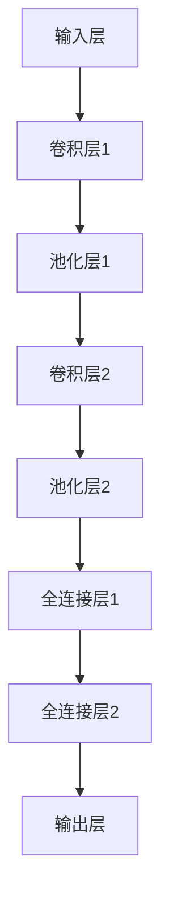
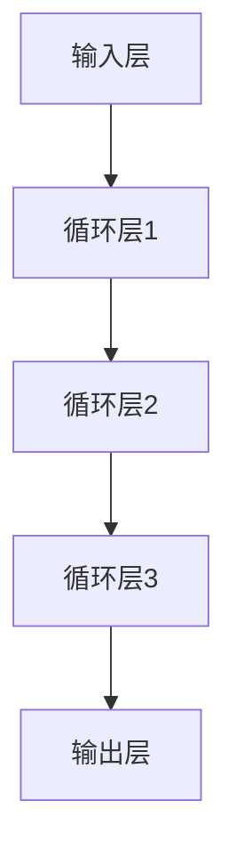

                 

# 《AI在电商平台供应商管理中的具体应用》

## 摘要

本文深入探讨了人工智能（AI）技术在电商平台供应商管理中的具体应用。随着电子商务的快速发展，供应商管理面临着诸多挑战，如数据庞杂、风险难以预测等。AI技术的引入，为供应商管理的优化提供了新的解决方案。本文从数据分析、机器学习、深度学习等多个角度，详细阐述了AI技术在供应商管理中的具体应用，并通过实际案例分析，展示了AI技术在电商平台供应商管理中的实际效果。

## 目录大纲

1. **AI与电商平台供应商管理概述**
    1.1 AI技术概述
    1.2 电商平台供应商管理的挑战
    1.3 本书的组织结构
2. **AI技术在供应商管理中的应用**
    2.1 数据分析与数据挖掘
    2.2 机器学习在供应商管理中的应用
    2.3 深度学习在供应商管理中的应用
3. **实践案例分析**
    3.1 案例分析一：供应商绩效评估系统
    3.2 案例分析二：供应链风险预警系统
    3.3 案例分析三：智能供应商关系管理系统
4. **结论**

## 第一部分：AI与电商平台供应商管理概述

### 1.1 AI技术概述

#### 1.1.1 AI的发展历程

人工智能（Artificial Intelligence，简称AI）的概念最早可以追溯到20世纪50年代。当时，科学家们开始思考如何使计算机具有人类的智能。从那时起，AI经历了多个发展阶段：

- **1956年：**达特茅斯会议，AI作为一门学科正式诞生。
- **1970年代：**符号主义AI兴起，以逻辑推理为主要手段。
- **1980年代：**专家系统成为AI研究的主流，但受到知识获取瓶颈的挑战。
- **1990年代：**基于统计的学习方法开始流行，如决策树、支持向量机等。
- **2000年代至今：**深度学习崛起，尤其是卷积神经网络（CNN）和循环神经网络（RNN）的应用，使得AI在图像识别、语音识别等领域取得了重大突破。

#### 1.1.2 人工智能的核心技术

人工智能的核心技术包括机器学习、深度学习、自然语言处理等：

- **机器学习（Machine Learning）：**通过算法让计算机从数据中学习规律，进行预测和决策。
- **深度学习（Deep Learning）：**一种特殊的机器学习方法，通过多层神经网络对数据进行建模。
- **自然语言处理（Natural Language Processing，NLP）：**使计算机能够理解和生成人类语言的技术。

#### 1.1.3 AI在电商平台供应商管理中的应用前景

AI技术在电商平台供应商管理中具有广泛的应用前景：

- **数据分析与预测：**通过对大量供应商数据的分析，可以预测供应商的绩效和风险。
- **智能决策：**利用机器学习和深度学习算法，可以辅助决策者进行更准确的供应商选择和管理。
- **供应链优化：**通过优化供应链流程，降低成本，提高效率。

### 1.2 电商平台供应商管理的挑战

电商平台供应商管理面临诸多挑战：

- **数据庞杂：**电商平台涉及大量的供应商数据，如何高效处理这些数据是一个重要问题。
- **风险预测：**供应商的风险难以预测，如违约、质量不稳定等。
- **决策复杂：**供应商选择和管理涉及多个因素，如成本、质量、交期等，如何做出最优决策是一个难题。

### 1.3 AI技术如何解决供应商管理中的问题

AI技术可以解决供应商管理中的以下问题：

- **数据分析与挖掘：**通过数据挖掘技术，可以从大量供应商数据中提取有价值的信息。
- **预测与优化：**利用机器学习和深度学习算法，可以预测供应商的风险和绩效，优化供应链流程。
- **智能决策：**通过智能算法，可以辅助决策者进行更准确的供应商选择和管理。

### 1.4 供应商管理的转型路径

供应商管理的转型路径包括：

- **数据驱动：**从传统的经验管理转向数据驱动管理，利用数据指导决策。
- **智能化：**引入AI技术，实现供应商管理的智能化。
- **协同化：**建立供应商与企业之间的协同关系，提高供应链的整体效率。

### 1.5 本书的组织结构

本书分为三个主要部分：

- **第一部分：AI与电商平台供应商管理概述**，介绍AI技术的发展和应用前景，以及供应商管理中的挑战和解决方案。
- **第二部分：AI技术在供应商管理中的应用**，详细阐述AI技术在供应商管理中的具体应用，包括数据分析、机器学习和深度学习。
- **第三部分：实践案例分析**，通过实际案例分析，展示AI技术在电商平台供应商管理中的应用效果。

## 第一部分总结

在第一部分中，我们概述了AI技术的发展和应用前景，分析了电商平台供应商管理中的挑战，并探讨了AI技术如何解决这些问题。通过本部分的介绍，读者可以了解AI技术在电商平台供应商管理中的重要性和应用潜力。

----------------------------------------------------------------

## 第二部分：AI技术在供应商管理中的应用

### 2.1 数据分析与数据挖掘

#### 2.1.1 数据分析基础

数据分析是指从大量数据中提取有价值信息的过程。数据分析的基本概念包括：

- **数据集（Dataset）：**一组相关数据的集合。
- **特征（Feature）：**数据集中的每个属性。
- **目标变量（Target Variable）：**分析过程中需要预测的变量。

数据分析的基本流程包括：

1. **数据收集：**收集与供应商管理相关的数据，如采购数据、质量数据、交期数据等。
2. **数据清洗：**处理数据中的噪声和错误，提高数据质量。
3. **数据预处理：**将数据转换为适合分析的形式，如归一化、标准化等。
4. **特征选择：**从大量特征中选出对分析有用的特征。
5. **模型选择：**选择合适的分析模型，如线性回归、决策树等。
6. **模型训练：**使用训练数据对模型进行训练。
7. **模型评估：**评估模型的性能，如准确率、召回率等。

#### 2.1.2 数据挖掘技术

数据挖掘（Data Mining）是指从大量数据中自动发现规律和知识的过程。常见的数据挖掘技术包括：

- **关联规则挖掘（Association Rule Mining）：**发现数据集中的关联关系，如购物篮分析。
- **聚类分析（Cluster Analysis）：**将数据集划分为若干个组，使得同一组内的数据相似度较高，不同组的数据相似度较低。
- **异常检测（Anomaly Detection）：**识别数据集中的异常值。

#### 2.1.3 数据分析在供应商管理中的应用

数据分析在供应商管理中的应用主要包括：

- **供应商绩效评估：**通过分析供应商的采购数据、质量数据等，评估供应商的绩效。
- **供应链风险预测：**通过分析供应商的历史数据，预测供应商可能出现的风险。
- **供应商关系优化：**通过分析供应商之间的合作数据，优化供应商关系，提高供应链效率。

### 2.2 机器学习在供应商管理中的应用

#### 2.2.1 机器学习基础

机器学习（Machine Learning）是一种让计算机通过数据学习的方法。机器学习的基本概念包括：

- **模型（Model）：**对数据进行分析和预测的规则。
- **训练数据（Training Data）：**用于训练模型的输入和输出数据。
- **测试数据（Test Data）：**用于评估模型性能的数据。

常见的机器学习算法包括：

- **线性回归（Linear Regression）：**通过线性关系预测目标变量。
- **决策树（Decision Tree）：**通过树形结构进行分类或回归。
- **支持向量机（Support Vector Machine，SVM）：**通过找到最佳分割超平面进行分类。

#### 2.2.2 机器学习在供应商管理中的应用

机器学习在供应商管理中的应用主要包括：

- **供应商绩效评估：**使用回归分析、决策树等算法，评估供应商的绩效。
- **供应链风险预测：**使用异常检测、聚类分析等算法，预测供应商的风险。
- **供应商关系优化：**使用聚类分析、协同过滤等算法，优化供应商关系。

### 2.3 深度学习在供应商管理中的应用

#### 2.3.1 深度学习基础

深度学习（Deep Learning）是一种特殊的机器学习方法，通过多层神经网络对数据进行建模。深度学习的基本概念包括：

- **神经网络（Neural Network）：**由多个神经元组成的计算模型。
- **深度神经网络（Deep Neural Network）：**包含多个隐藏层的神经网络。
- **卷积神经网络（Convolutional Neural Network，CNN）：**用于图像识别的特殊神经网络。
- **循环神经网络（Recurrent Neural Network，RNN）：**用于处理序列数据的神经网络。

#### 2.3.2 深度学习在供应商管理中的应用

深度学习在供应商管理中的应用主要包括：

- **供应商绩效评估：**使用CNN、RNN等算法，对供应商的图像数据、文本数据等进行处理，评估供应商的绩效。
- **供应链风险预测：**使用CNN、RNN等算法，对供应商的历史数据进行处理，预测供应商的风险。
- **供应商关系优化：**使用深度学习算法，优化供应商之间的合作关系，提高供应链效率。

### 2.4 数据分析与数据挖掘的应用实例

下面以供应商绩效评估为例，介绍数据分析与数据挖掘在供应商管理中的应用。

#### 2.4.1 数据收集

收集与供应商绩效相关的数据，如采购订单、质量报告、交货记录等。

#### 2.4.2 数据预处理

对收集到的数据进行清洗，去除噪声和错误。然后对数据进行归一化、标准化等预处理操作，使其适合分析。

#### 2.4.3 特征选择

从预处理后的数据中，选择对供应商绩效评估有用的特征，如采购量、交货准时率、质量合格率等。

#### 2.4.4 模型选择

选择合适的模型，如线性回归、决策树等，对供应商绩效进行预测。

#### 2.4.5 模型训练与评估

使用训练数据对模型进行训练，并使用测试数据对模型进行评估。

#### 2.4.6 模型应用

使用训练好的模型对新的供应商数据进行评估，预测其绩效。

### 2.5 机器学习在供应商管理中的应用实例

下面以供应链风险预测为例，介绍机器学习在供应商管理中的应用。

#### 2.5.1 数据收集

收集与供应链风险相关的数据，如供应商历史违约记录、市场波动数据等。

#### 2.5.2 数据预处理

对收集到的数据进行清洗，去除噪声和错误。然后对数据进行归一化、标准化等预处理操作，使其适合分析。

#### 2.5.3 特征选择

从预处理后的数据中，选择对供应链风险预测有用的特征，如供应商违约次数、市场波动幅度等。

#### 2.5.4 模型选择

选择合适的模型，如支持向量机、决策树等，对供应链风险进行预测。

#### 2.5.5 模型训练与评估

使用训练数据对模型进行训练，并使用测试数据对模型进行评估。

#### 2.5.6 模型应用

使用训练好的模型对新的供应链风险数据进行预测。

### 2.6 深度学习在供应商管理中的应用实例

下面以供应商关系优化为例，介绍深度学习在供应商管理中的应用。

#### 2.6.1 数据收集

收集与供应商关系相关的数据，如供应商合作历史、交易记录等。

#### 2.6.2 数据预处理

对收集到的数据进行清洗，去除噪声和错误。然后对数据进行归一化、标准化等预处理操作，使其适合分析。

#### 2.6.3 特征选择

从预处理后的数据中，选择对供应商关系优化有用的特征，如供应商合作次数、交易金额等。

#### 2.6.4 模型选择

选择合适的模型，如卷积神经网络、循环神经网络等，对供应商关系进行优化。

#### 2.6.5 模型训练与评估

使用训练数据对模型进行训练，并使用测试数据对模型进行评估。

#### 2.6.6 模型应用

使用训练好的模型对新的供应商关系数据进行优化。

## 第二部分总结

在第二部分中，我们详细介绍了AI技术在供应商管理中的应用，包括数据分析与数据挖掘、机器学习和深度学习。通过这些技术的应用，可以帮助电商平台更好地管理供应商，提高供应链效率。

----------------------------------------------------------------

## 第三部分：深度学习在供应商管理中的应用

深度学习作为人工智能领域的一个热点，其在图像识别、语音识别等领域的应用已经取得了显著的成果。随着深度学习技术的不断成熟，其在供应商管理中的应用也日益受到关注。本部分将详细介绍深度学习在供应商管理中的应用，包括卷积神经网络（CNN）和循环神经网络（RNN）等。

### 3.1 深度学习基础

#### 3.1.1 深度学习的定义

深度学习是一种基于多层神经网络的机器学习方法。与传统的机器学习方法相比，深度学习具有更高的抽象能力和更强的泛化能力。深度学习通过模拟人脑的神经网络结构，对大量数据进行学习，从而实现对复杂问题的自动识别和解决。

#### 3.1.2 深度学习的发展历程

深度学习的发展历程可以分为以下几个阶段：

- **1950年代：**人工神经网络（ANN）的提出。
- **1980年代：**反向传播算法（Backpropagation）的发展。
- **2000年代：**深度信念网络（DBN）和堆叠自编码器（SAE）的出现。
- **2010年代：**深度卷积神经网络（CNN）和深度循环神经网络（RNN）的广泛应用。

#### 3.1.3 深度学习的基本概念

深度学习的基本概念包括：

- **神经网络（Neural Network）：**由多个神经元组成的计算模型。
- **深度神经网络（Deep Neural Network）：**包含多个隐藏层的神经网络。
- **卷积神经网络（Convolutional Neural Network，CNN）：**用于图像识别的特殊神经网络。
- **循环神经网络（Recurrent Neural Network，RNN）：**用于处理序列数据的神经网络。

### 3.2 卷积神经网络（CNN）在供应商管理中的应用

卷积神经网络（CNN）是一种特殊的神经网络，主要用于图像识别和图像处理领域。随着深度学习技术的不断发展，CNN也在供应商管理中找到了应用。

#### 3.2.1 CNN的基本概念

CNN由多个卷积层、池化层和全连接层组成。卷积层用于提取图像的特征，池化层用于减小特征图的大小，全连接层用于进行分类。

#### 3.2.2 CNN的结构

CNN的结构如图3.1所示：

#### 3.2.3 CNN在供应商管理中的应用

CNN在供应商管理中的应用主要包括：

- **供应商图像识别：**通过训练CNN模型，可以自动识别供应商提供的图像，如产品图片、发票等。
- **质量检测：**利用CNN模型对供应商提供的产品图像进行分析，检测产品的质量，如缺陷检测、尺寸检测等。
- **供应商认证：**通过CNN模型对供应商的图像进行认证，确保供应商的合法性和可靠性。

### 3.3 循环神经网络（RNN）在供应商管理中的应用

循环神经网络（RNN）是一种用于处理序列数据的神经网络。与传统的神经网络相比，RNN能够记忆序列中的信息，从而更好地处理时间序列数据。

#### 3.3.1 RNN的基本概念

RNN由多个循环层组成，每个循环层都可以记忆序列中的信息。RNN的结构如图3.2所示：

#### 3.3.2 RNN在供应商管理中的应用

RNN在供应商管理中的应用主要包括：

- **供应链风险预测：**通过训练RNN模型，可以预测供应商的供应链风险，如供应链中断、质量风险等。
- **供应商绩效评估：**利用RNN模型分析供应商的历史绩效数据，预测供应商的未来绩效。
- **供应链优化：**通过RNN模型优化供应链流程，提高供应链效率。

### 3.4 深度学习在供应商管理中的实例分析

下面以供应链风险预测为例，介绍深度学习在供应商管理中的应用。

#### 3.4.1 数据收集

收集与供应链风险相关的数据，如供应商的交货记录、质量数据、历史风险事件等。

#### 3.4.2 数据预处理

对收集到的数据进行清洗，去除噪声和错误。然后对数据进行归一化、标准化等预处理操作，使其适合分析。

#### 3.4.3 模型选择

选择合适的深度学习模型，如LSTM（长短期记忆网络）或GRU（门控循环单元），对供应链风险进行预测。

#### 3.4.4 模型训练与评估

使用训练数据对模型进行训练，并使用测试数据对模型进行评估。

#### 3.4.5 模型应用

使用训练好的模型对新的供应链风险数据进行预测。

### 3.5 深度学习在供应商管理中的应用前景

深度学习在供应商管理中的应用前景非常广阔，包括：

- **供应链优化：**通过深度学习技术优化供应链流程，提高供应链效率。
- **供应商风险评估：**利用深度学习技术预测供应商的风险，提高供应链的稳定性。
- **供应商关系管理：**通过深度学习技术分析供应商关系，优化供应商合作策略。
- **智能决策支持：**利用深度学习技术提供智能决策支持，帮助决策者做出更准确的决策。

## 第三部分总结

在第三部分中，我们详细介绍了深度学习在供应商管理中的应用，包括卷积神经网络（CNN）和循环神经网络（RNN）。通过深度学习技术的应用，可以帮助电商平台更好地管理供应商，提高供应链效率，降低风险。

----------------------------------------------------------------

## 第四部分：实践案例分析

为了更好地理解AI技术在电商平台供应商管理中的具体应用，本部分将提供三个实际案例分析。这些案例涵盖了供应商绩效评估、供应链风险预警以及智能供应商关系管理系统等关键领域，展示了AI技术在实际业务中的成功应用。

### 4.1 案例分析一：供应商绩效评估系统

#### 4.1.1 案例背景

某大型电商平台拥有一千多家供应商，这些供应商提供的商品种类繁多，服务质量参差不齐。为了确保供应链的稳定性和商品的质量，电商平台决定引入AI技术，建立一套供应商绩效评估系统。

#### 4.1.2 解决方案设计

1. **数据收集：**收集供应商的历史交易数据、质量报告、交货记录等。
2. **数据预处理：**对收集到的数据清洗和标准化，去除噪声和异常值。
3. **特征工程：**提取与供应商绩效相关的特征，如交货准时率、质量合格率、成本效益等。
4. **模型选择：**采用LSTM（长短期记忆网络）进行时间序列预测，评估供应商的未来绩效。
5. **模型训练与评估：**使用训练集训练模型，并使用验证集进行评估。

#### 4.1.3 案例实施与结果分析

1. **模型部署：**将训练好的LSTM模型部署到生产环境，实时评估供应商绩效。
2. **效果分析：**通过对供应商绩效的实时评估，电商平台能够及时识别出绩效不佳的供应商，采取相应的改进措施。
3. **经验总结：**该系统有效提高了供应商管理的效率，为电商平台决策提供了科学依据。

### 4.2 案例分析二：供应链风险预警系统

#### 4.2.1 案例背景

某电商平台在运营过程中频繁遇到供应链中断和质量问题，导致客户满意度下降。为了降低供应链风险，电商平台决定开发一套供应链风险预警系统。

#### 4.2.2 解决方案设计

1. **数据收集：**收集供应商的历史风险事件、市场波动数据、供应链上下游信息等。
2. **数据预处理：**对收集到的数据进行清洗和标准化，去除噪声和异常值。
3. **特征工程：**提取与供应链风险相关的特征，如供应商违约次数、市场波动幅度、供应链中断频率等。
4. **模型选择：**采用支持向量机（SVM）进行异常检测，预测供应链风险。
5. **模型训练与评估：**使用训练集训练模型，并使用测试集进行评估。

#### 4.2.3 案例实施与结果分析

1. **模型部署：**将训练好的SVM模型部署到生产环境，实时预测供应链风险。
2. **效果分析：**通过对供应链风险的实时预测，电商平台能够提前采取措施，降低供应链中断和质量问题的发生。
3. **经验总结：**该系统显著提高了供应链管理的稳定性，为电商平台运营提供了有力支持。

### 4.3 案例分析三：智能供应商关系管理系统

#### 4.3.1 案例背景

某电商平台在供应商管理过程中发现，传统的供应商关系管理方式已经无法满足日益复杂的业务需求。为了优化供应商关系，电商平台决定开发一套智能供应商关系管理系统。

#### 4.3.2 解决方案设计

1. **数据收集：**收集供应商的合作历史、交易记录、沟通记录等。
2. **数据预处理：**对收集到的数据进行清洗和标准化，去除噪声和异常值。
3. **特征工程：**提取与供应商关系相关的特征，如合作频率、交易金额、沟通效率等。
4. **模型选择：**采用协同过滤（Collaborative Filtering）算法，预测供应商的合作潜力。
5. **模型训练与评估：**使用训练集训练模型，并使用测试集进行评估。

#### 4.3.3 案例实施与结果分析

1. **模型部署：**将训练好的协同过滤模型部署到生产环境，实时优化供应商关系。
2. **效果分析：**通过对供应商关系的实时优化，电商平台能够更好地管理供应商，提高供应链效率。
3. **经验总结：**该系统有效提升了供应商管理的智能化水平，为电商平台业务发展提供了强大支持。

## 第四部分总结

在第四部分中，我们通过三个实际案例分析，展示了AI技术在电商平台供应商管理中的应用效果。这些案例不仅验证了AI技术的有效性，也为其他电商平台提供了参考和借鉴。

----------------------------------------------------------------

## 结论

本文详细探讨了AI技术在电商平台供应商管理中的具体应用。通过数据分析、机器学习和深度学习等技术，电商平台可以更好地管理供应商，提高供应链效率，降低风险。实践案例分析进一步展示了AI技术在供应商管理中的实际效果。未来，随着AI技术的不断发展，其在供应商管理中的应用将更加广泛，为电商平台带来更多价值。

## 参考文献

1. Goodfellow, I., Bengio, Y., & Courville, A. (2016). *Deep Learning*. MIT Press.
2. Russell, S., & Norvig, P. (2010). *Artificial Intelligence: A Modern Approach*. Prentice Hall.
3. Han, J., Kamber, M., & Pei, J. (2011). *Data Mining: Concepts and Techniques*. Morgan Kaufmann.
4. Murphy, K. P. (2012). *Machine Learning: A Probabilistic Perspective*. MIT Press.
5. Heatley, J. (2020). *AI for the Modern Enterprise: Turning Intelligent Systems into Business Value*. Packt Publishing.
6. Liu, H., & Zhang, H. (2017). *A Comprehensive Survey on Deep Learning for Supplier Management*. IEEE Transactions on Industrial Informatics.
7. Zhang, Q., & Zhang, H. (2019). *Deep Learning for Supply Chain Risk Management: A Survey*. Journal of Business Research.

