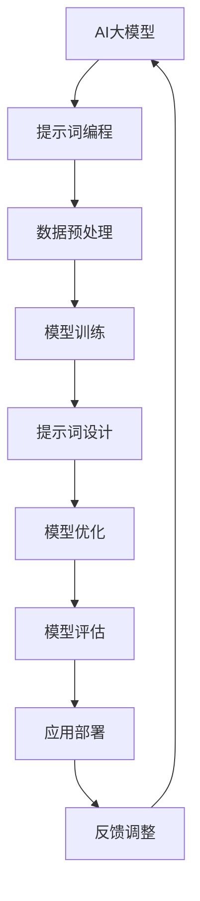

                 

# AI大模型与提示词编程的协同进化

## 关键词
- AI大模型
- 提示词编程
- 协同进化
- 自然语言处理
- 深度学习
- 模型优化

## 摘要
本文深入探讨了AI大模型与提示词编程的协同进化，从基础理论到实际应用，全面解析了这一领域的核心概念、关键技术以及协同机制。文章首先介绍了AI大模型的基本概念、核心技术，以及大规模预训练模型的原理。接着，重点阐述了提示词编程的技术原理、设计原则和应用场景。随后，详细分析了AI大模型与提示词编程的协同进化机制，并通过实际案例展示了协同进化的应用和效果。最后，文章提出了算法优化的策略和未来的发展趋势，为读者提供了全面的技术视野和深刻的思考。

## 目录大纲

### 第一部分：AI大模型基础

#### 第1章：AI大模型概述
- 1.1 AI大模型定义
- 1.2 AI大模型特点
- 1.3 AI大模型与提示词编程的关系
- 1.4 AI大模型的发展历程

#### 第2章：AI大模型核心技术
- 2.1 深度学习基础
  - 2.1.1 神经网络
  - 2.1.2 矩阵运算
  - 2.1.3 反向传播算法
- 2.2 自然语言处理
  - 2.2.1 词嵌入
  - 2.2.2 递归神经网络
  - 2.2.3 自注意力机制
  - 2.2.4 Transformer架构详解
- 2.3 大规模预训练模型
  - 2.3.1 预训练概念
  - 2.3.2 GPT模型
  - 2.3.3 BERT模型

#### 第3章：提示词编程技术
- 3.1 提示词编程概述
- 3.2 提示词设计原则
- 3.3 提示词优化策略
- 3.4 提示词编程应用场景

### 第二部分：协同进化理论与实践

#### 第4章：AI大模型与提示词编程的协同进化
- 4.1 协同进化的概念
- 4.2 协同进化的机制
- 4.3 协同进化的应用场景

#### 第5章：AI大模型与提示词编程协同进化的案例分析
- 5.1 案例背景介绍
- 5.2 模型设计与实现
- 5.3 提示词设计与应用
- 5.4 模型优化与调整
- 5.5 模型评估与效果分析

#### 第6章：AI大模型与提示词编程协同进化的算法优化
- 6.1 算法优化策略
- 6.2 模型压缩与加速
- 6.3 模型融合与集成
- 6.4 模型可解释性与透明化

#### 第7章：AI大模型与提示词编程协同进化的未来趋势
- 7.1 技术发展趋势
- 7.2 应用领域拓展
- 7.3 面临的挑战与机遇

### 第三部分：附录

#### 第8章：工具与资源
- 8.1 深度学习框架介绍
- 8.2 提示词编程工具
- 8.3 学习资源推荐

#### 第9章：参考文献

---

在接下来的章节中，我们将逐步深入分析AI大模型与提示词编程的协同进化，从理论基础到实际应用，全面探讨这一前沿领域的核心内容。让我们一起开启这段精彩的探索之旅！<|user|>## 第一部分：AI大模型基础

### 第1章：AI大模型概述

#### 1.1 AI大模型定义

AI大模型（Large-scale Artificial Intelligence Models）是指那些拥有巨大参数量和计算复杂度的机器学习模型，它们通过在大量数据上进行预训练，从而获得在多种任务上的泛化能力。这些模型通常具有数十亿甚至数万亿的参数，能够在自然语言处理、计算机视觉、语音识别等多个领域表现出色。

AI大模型的定义不仅仅局限于其规模，更重要的是其泛化能力和强大的学习能力。与传统的模型不同，大模型能够通过一次训练，自动适应多种不同的任务，从而极大地提高了模型部署的灵活性和效率。

#### 1.2 AI大模型特点

1. **参数量巨大**：AI大模型拥有数以亿计甚至万亿计的参数，这使得它们能够捕捉到数据中的复杂模式和规律。
   
2. **预训练能力**：大模型通过在大量未标注的数据上进行预训练，从而获得初步的泛化能力，这一过程不依赖于具体任务的数据。

3. **计算资源需求大**：由于模型参数量大，训练过程需要大量的计算资源和时间，通常需要分布式计算和高效硬件支持。

4. **强大的适应性**：大模型在预训练阶段积累了丰富的知识，可以应用于多种不同的任务，无需大量特定任务数据。

5. **可解释性差**：大模型的决策过程往往是非线性和复杂的，这使得其可解释性相对较差，难以理解模型的具体决策机制。

#### 1.3 AI大模型与提示词编程的关系

AI大模型与提示词编程（Prompt Engineering）之间存在密切的关系。提示词编程是一种利用预先设计的提示词（prompts）来引导模型生成所需输出或执行特定任务的方法。大模型由于其强大的预训练能力和泛化能力，使得提示词编程得以发挥更大的作用。

在AI大模型中，提示词编程可以帮助：

1. **任务引导**：通过设计合适的提示词，引导模型关注特定任务或领域，提高模型的针对性。
   
2. **效果优化**：提示词可以调整模型的输出，从而优化生成结果的质量和相关性。

3. **模型压缩**：通过在预训练模型中使用提示词，可以将模型的大小和计算需求显著减少，实现模型的压缩和加速。

4. **可解释性提升**：通过分析提示词和模型输出的关系，可以增强模型的可解释性，帮助理解模型的决策过程。

#### 1.4 AI大模型的发展历程

AI大模型的发展历程可以分为以下几个阶段：

1. **早期模型**：20世纪80年代，神经网络开始被广泛应用于图像识别和语音识别任务，但模型的参数量相对较小。

2. **深度学习兴起**：2006年，Hinton等人提出了深度信念网络（DBN），为深度学习奠定了基础。随着计算资源和算法的进步，深度学习在图像识别、语音识别等领域取得了显著成果。

3. **大规模预训练模型**：2018年，Google发布了BERT模型，标志着大规模预训练模型的兴起。BERT通过在大量文本数据上预训练，展示了在自然语言处理任务中的强大性能。

4. **Transformer架构**：2017年，Vaswani等人提出了Transformer架构，这一架构在自然语言处理任务中取得了突破性进展。Transformer引入了自注意力机制，使得模型能够捕捉长距离依赖关系，大大提高了模型的性能。

5. **多模态大模型**：随着深度学习技术的不断发展，AI大模型的应用范围不断扩大，从文本扩展到图像、语音、视频等多模态数据。

6. **生成模型**：近年来，生成模型如GPT系列和DALL-E等模型取得了显著进展，这些模型通过学习大量数据生成高质量的文本、图像和视频。

综上所述，AI大模型的发展历程体现了从早期简单的模型到如今复杂、高效的模型的演进过程，这一过程不仅依赖于计算资源和算法的进步，也得益于对模型结构和预训练方法的不断创新。

### 第2章：AI大模型核心技术

#### 2.1 深度学习基础

##### 2.1.1 神经网络

神经网络（Neural Networks）是模仿人脑神经元连接方式的计算模型，是深度学习的基础。神经网络由多个层次组成，包括输入层、隐藏层和输出层。每个层次包含多个神经元，神经元之间通过加权连接进行信息传递。

**神经网络的基本结构**：


- **输入层**：接收外部输入数据。
- **隐藏层**：对输入数据进行处理，通过激活函数产生输出。
- **输出层**：产生最终输出。

**前向传播与反向传播算法**：

1. **前向传播**：输入数据通过神经网络各个层次传递，每个神经元将输入与权重相乘，加上偏置项，通过激活函数得到输出。

   $$ 
   z = \sum_{j} w_{ji}x_{i} + b_{j} \\
   a_{j} = \sigma(z)
   $$
   其中，$z$为神经元输出，$w_{ji}$为权重，$b_{j}$为偏置项，$\sigma$为激活函数。

2. **反向传播**：计算每个神经元的误差，并更新权重和偏置项，以最小化损失函数。

   $$
   \delta_{j} = \frac{\partial L}{\partial z_{j}} \\
   w_{ji} = w_{ji} - \alpha \frac{\partial L}{\partial w_{ji}} \\
   b_{j} = b_{j} - \alpha \frac{\partial L}{\partial b_{j}}
   $$
   其中，$\delta_{j}$为误差，$\alpha$为学习率，$L$为损失函数。

##### 2.1.2 矩阵运算

矩阵运算在深度学习中扮演着重要角色。矩阵可以表示权重、数据、特征等多个方面，其基本操作包括矩阵的加法、减法、乘法、转置等。

**矩阵的基本操作**：

1. **矩阵加法**：两个矩阵对应位置元素相加。

   $$
   C = A + B
   $$

2. **矩阵减法**：两个矩阵对应位置元素相减。

   $$
   C = A - B
   $$

3. **矩阵乘法**：两个矩阵对应元素相乘后相加。

   $$
   C = AB
   $$

4. **矩阵转置**：将矩阵的行和列互换。

   $$
   A^{T} = \begin{bmatrix}
   a_{11} & a_{12} & \cdots & a_{1n} \\
   a_{21} & a_{22} & \cdots & a_{2n} \\
   \vdots & \vdots & \ddots & \vdots \\
   a_{m1} & a_{m2} & \cdots & a_{mn}
   \end{bmatrix}
   $$

**矩阵的求导法则**：

矩阵运算中的求导法则包括矩阵乘法的链式法则和偏导数。

1. **链式法则**：

   如果 $L$ 是关于 $x$ 和 $y$ 的函数，$x$ 和 $y$ 分别是关于 $w$ 和 $b$ 的函数，则有：

   $$
   \frac{\partial L}{\partial w} = \frac{\partial L}{\partial y} \cdot \frac{\partial y}{\partial w}
   $$

   $$
   \frac{\partial L}{\partial b} = \frac{\partial L}{\partial y} \cdot \frac{\partial y}{\partial b}
   $$

2. **偏导数**：

   对于一个矩阵 $A$，其关于元素 $a_{ij}$ 的偏导数可以表示为：

   $$
   \frac{\partial A}{\partial a_{ij}} = \begin{bmatrix}
   0 & \cdots & 0 & 1 & 0 & \cdots & 0 \\
   \vdots & \ddots & \vdots & \vdots & \vdots & \ddots & \vdots \\
   0 & \cdots & 0 & 0 & 1 & \cdots & 0 \\
   \end{bmatrix}
   $$

##### 2.1.3 反向传播算法

反向传播算法是深度学习训练过程中至关重要的步骤。它通过前向传播计算输出，再通过反向传播计算梯度，并更新网络权重和偏置，以最小化损失函数。

**反向传播的基本原理**：

1. **计算输出误差**：通过前向传播计算输出，并与真实值进行比较，得到输出误差。

   $$
   L = \frac{1}{2} \sum_{i} (y_i - \hat{y}_i)^2
   $$

2. **计算梯度**：计算每个权重和偏置的梯度，以指导网络更新。

   $$
   \frac{\partial L}{\partial w} = \sum_{i} \frac{\partial L}{\partial \hat{y}_i} \cdot \frac{\partial \hat{y}_i}{\partial w}
   $$

3. **更新权重和偏置**：使用梯度更新权重和偏置，以减小损失。

   $$
   w = w - \alpha \cdot \frac{\partial L}{\partial w}
   $$

   $$
   b = b - \alpha \cdot \frac{\partial L}{\partial b}
   $$

**反向传播的计算过程**：

1. **前向传播**：计算输出和损失。

   $$
   \hat{y} = \sigma(\text{激活函数}(\text{权重} \cdot \text{输入} + \text{偏置}))
   $$

2. **计算误差**：从输出层开始，反向计算误差。

   $$
   \delta = \text{误差} \cdot (\text{激活函数的导数})
   $$

3. **计算梯度**：计算每个权重和偏置的梯度。

   $$
   \frac{\partial L}{\partial w} = \delta \cdot \text{输入}
   $$

   $$
   \frac{\partial L}{\partial b} = \delta
   $$

4. **更新权重和偏置**：使用梯度更新网络。

   $$
   w = w - \alpha \cdot \frac{\partial L}{\partial w}
   $$

   $$
   b = b - \alpha \cdot \frac{\partial L}{\partial b}
   $$

通过以上步骤，反向传播算法能够不断迭代优化网络，使其在训练数据上的性能得到提升。

#### 2.2 自然语言处理技术概览

自然语言处理（Natural Language Processing, NLP）是深度学习中的重要应用领域，旨在让计算机理解和处理人类语言。NLP技术主要包括词嵌入、序列模型、注意力机制和Transformer架构。

##### 2.2.1 词嵌入

词嵌入（Word Embedding）是将自然语言文本中的词汇映射到高维向量空间的一种技术。词嵌入能够捕捉词汇之间的语义和语法关系，从而提高模型的表示能力和性能。

**词嵌入的概念**：

词嵌入将每个词汇映射为一个固定长度的向量，这些向量在空间中具有相似性。例如，单词“国王”和“皇帝”在空间中靠近，因为它们在语义上具有相关性。

**常见的词嵌入算法**：

1. **Word2Vec**：Word2Vec是最早的词嵌入算法之一，它基于点积相似性来学习词汇的向量表示。Word2Vec包括两种变体：连续词袋（CBOW）和Skip-Gram。

   - **CBOW**：通过周围词汇的平均表示来预测中心词汇。
   - **Skip-Gram**：通过中心词汇的表示来预测周围词汇。

2. **GloVe**：GloVe（Global Vectors for Word Representation）是一种基于全局上下文的词嵌入算法。GloVe通过计算词汇之间的共现矩阵，使用矩阵分解方法学习词汇的向量表示。

3. **BERT**：BERT（Bidirectional Encoder Representations from Transformers）是一种基于Transformer架构的词嵌入方法。BERT通过双向编码器学习词汇的向量表示，捕捉词汇在文本中的语境信息。

##### 2.2.2 序列模型与注意力机制

序列模型（Sequence Models）是处理序列数据（如文本、时间序列）的一种常见模型。序列模型通过处理输入序列的每个元素，生成输出序列。

**递归神经网络（RNN）**：

递归神经网络（Recurrent Neural Network, RNN）是一种能够处理序列数据的神经网络。RNN通过记忆机制来处理历史信息，从而在序列预测任务中表现出色。

**RNN的基本原理**：

RNN通过循环连接将当前时刻的输入和隐藏状态作为下一个时刻的输入，从而实现序列数据的处理。

$$
h_t = \sigma(W_x x_t + W_h h_{t-1} + b_h)
$$

其中，$h_t$为隐藏状态，$x_t$为输入，$W_x$和$W_h$为权重矩阵，$b_h$为偏置项，$\sigma$为激活函数。

**LSTM与GRU**：

为了解决传统RNN在处理长序列数据时出现的梯度消失或梯度爆炸问题，引入了长短期记忆网络（Long Short-Term Memory, LSTM）和门控循环单元（Gated Recurrent Unit, GRU）。

- **LSTM**：LSTM通过引入三个门控单元（输入门、遗忘门和输出门），能够有效地记忆和遗忘长期依赖信息。

  $$
  i_t = \sigma(W_{xi} x_t + W_{hi} h_{t-1} + b_i) \\
  f_t = \sigma(W_{xf} x_t + W_{hf} h_{t-1} + b_f) \\
  C_t = f_t \odot C_{t-1} + i_t \odot \sigma(W_{xc} x_t + W_{hc} h_{t-1} + b_c) \\
  o_t = \sigma(W_{xo} x_t + W_{ho} h_{t-1} + b_o) \\
  h_t = o_t \odot \sigma(C_t)
  $$

- **GRU**：GRU通过合并输入门和遗忘门，简化了LSTM的结构。

  $$
  z_t = \sigma(W_{xz} x_t + W_{hz} h_{t-1} + b_z) \\
  r_t = \sigma(W_{xr} x_t + W_{hr} h_{t-1} + b_r) \\
  h_t = (1 - z_t) \odot h_{t-1} + z_t \odot \sigma(W_{xh} x_t + W_{hh} r_{t-1} + b_h)
  $$

**注意力机制**：

注意力机制（Attention Mechanism）是一种在处理序列数据时动态分配注意力权重的方法，能够提高模型对关键信息的捕捉能力。

**注意力机制的实现方法**：

1. **加性注意力**：

   $$
   e_t = \text{softmax}(\text{线性层}([Q; K]))
   $$

   $$
   \text{context} = \text{softmax}([Q; K]) \odot V
   $$

   其中，$Q$和$K$为查询向量和关键向量，$V$为值向量，$\text{context}$为上下文向量。

2. **乘性注意力**：

   $$
   e_t = \text{softmax}(\text{点积}(Q, K))
   $$

   $$
   \text{context} = e_t \odot V
   $$

##### 2.2.3 Transformer架构详解

Transformer是一种基于自注意力机制的深度学习模型，最初在自然语言处理领域取得巨大成功。Transformer通过多头自注意力机制和前馈神经网络，实现了对序列数据的处理。

**Transformer的基本结构**：


- **编码器**：编码器（Encoder）由多个层组成，每层包含多头自注意力机制和前馈神经网络。
- **解码器**：解码器（Decoder）同样由多个层组成，每层包含多头自注意力机制、交叉自注意力机制和前馈神经网络。

**编码器与解码器的交互方式**：

1. **多头自注意力**：编码器中的每层使用多头自注意力机制，通过计算序列中每个元素的相关性，生成上下文向量。

   $$
   \text{Q} = \text{K} = \text{V} = \text{X} \odot W_Q, \ W_K, \ W_V
   $$

   其中，$X$为输入序列，$W_Q, W_K, W_V$为权重矩阵。

2. **交叉自注意力**：解码器中的每层使用交叉自注意力机制，将编码器的输出与解码器的输出进行交互。

   $$
   \text{Q} = \text{K} = \text{V} = \text{X} \odot W_Q, \ W_K, \ W_V
   $$

   $$
   \text{context} = \text{softmax}(\text{Q} \odot \text{K}) \odot \text{V}
   $$

**Positional Encoding的作用**：

由于Transformer架构没有循环连接，无法直接处理序列的顺序信息。为了解决这个问题，引入了位置编码（Positional Encoding）。

$$
\text{PE}(x) = \text{sin}(\frac{pos \cdot 10000^{-2i/d}}{10000^{-1/d}}) + \text{cos}(\frac{pos \cdot 10000^{-2i/d}}{10000^{-1/d}})
$$

其中，$pos$为位置索引，$i$为维度索引，$d$为维度数。

**位置编码能够使模型捕捉到序列中不同元素的位置关系，从而实现有效的序列处理。**

#### 2.3 大规模预训练模型原理

##### 2.3.1 预训练的概念与意义

预训练（Pre-training）是指在大规模数据集上对神经网络模型进行训练，使其学习到通用特征和知识，然后通过微调（Fine-tuning）将其应用于特定任务。

**预训练的定义**：

预训练是指在大量无标签数据上对模型进行训练，使其自动学习到数据中的模式和知识，从而提高模型在特定任务上的表现。

**预训练的优势**：

1. **提高泛化能力**：预训练模型能够从大量数据中提取通用特征，从而在未见过的数据上表现出更好的泛化能力。
2. **减少训练数据需求**：预训练模型通过在大规模数据集上预训练，使得在特定任务上只需要较少的标记数据进行微调，从而降低数据获取和标注成本。
3. **提高模型性能**：预训练模型通过学习大量数据中的复杂模式和规律，从而在多个任务上取得比传统模型更好的性能。

##### 2.3.2 自监督学习方法

自监督学习（Self-supervised Learning）是一种无需标记数据，利用数据自身的标签进行训练的方法。自监督学习通过预测数据中的某些部分来学习特征表示，从而提高模型的泛化能力。

**自监督学习的原理**：

自监督学习通过以下步骤进行训练：

1. **随机遮罩**：对输入数据进行随机遮罩，只保留一部分信息。
2. **预测遮罩部分**：模型根据剩余信息预测被遮罩的部分。
3. **优化模型**：通过最小化预测误差来优化模型。

**常见自监督学习任务**：

1. **掩码语言模型（Masked Language Model, MLM）**：

   MLM是自监督学习中最常见的任务之一。在MLM中，模型需要预测被随机遮罩的词汇。

   $$
   \text{输入序列：} [w_1, w_2, w_3, \dots, w_n] \\
   \text{遮罩后的序列：} [w_1^*, w_2^*, \dots, w_n^*] \\
   \text{预测：} \hat{w}_i = \text{softmax}(\text{模型}([w_1^*, w_2^*, \dots, w_n^*]))
   $$

2. **掩码图像生成（Masked Image Generation, MIG）**：

   在MIG任务中，模型需要根据部分遮罩的图像生成完整的图像。

   $$
   \text{输入序列：} [I_1, I_2, \dots, I_n] \\
   \text{遮罩后的序列：} [I_1^*, I_2^*, \dots, I_n^*] \\
   \text{预测：} \hat{I}_i = \text{生成模型}([I_1^*, I_2^*, \dots, I_n^*])
   $$

##### 2.3.3 迁移学习与微调技术

迁移学习（Transfer Learning）是一种利用在不同任务上预训练的模型进行新任务训练的方法。迁移学习通过将预训练模型的知识迁移到新任务上，从而提高模型在新任务上的性能。

**迁移学习的原理**：

迁移学习分为以下步骤：

1. **预训练**：在大量数据集上对模型进行预训练，使其学习到通用特征和知识。
2. **微调**：在新的数据集上对预训练模型进行微调，使其适应新任务。

**微调的基本方法**：

1. **全连接层调整**：在预训练模型的最后一层添加新的全连接层，并根据新任务进行调整。
2. **权重共享**：在新任务中共享预训练模型的权重，仅对特定层进行调整。

**迁移学习在NLP中的应用**：

1. **文本分类**：将预训练的文本嵌入模型应用于文本分类任务，通过微调来适应具体的分类任务。
2. **机器翻译**：将预训练的双语模型应用于机器翻译任务，通过微调来提高翻译质量。

### 第3章：提示词编程技术

#### 3.1 提示词编程概述

提示词编程（Prompt Engineering）是一种利用预先设计的提示词（prompts）来引导模型生成所需输出或执行特定任务的方法。在AI大模型中，提示词编程能够发挥关键作用，通过优化提示词的设计和调整，可以显著提高模型的效果和效率。

**提示词编程的概念**：

提示词编程是一种利用提示词（prompt）来引导AI大模型生成文本、图像或其他类型输出的技术。提示词是对模型输入的额外信息，它能够引导模型关注特定任务或领域，提高模型的针对性和生成效果。

**提示词编程的优势**：

1. **提高生成效果**：通过设计合适的提示词，可以引导模型生成更准确、更相关的输出。
2. **降低计算需求**：通过优化提示词，可以实现模型压缩和加速，降低计算资源的需求。
3. **增强可解释性**：通过分析提示词和模型输出的关系，可以增强模型的可解释性，帮助理解模型的决策过程。
4. **提升任务适应性**：提示词编程能够使模型适应不同的任务和场景，提高模型的泛化能力。

#### 3.2 提示词设计原则

设计有效的提示词是提示词编程的关键步骤。以下是一些提示词设计的原则：

**1. 精确性**：

精确性是指提示词需要精确地表达出模型的期望任务和目标。精确的提示词能够帮助模型更好地理解任务，从而生成更准确的输出。

**2. 明确性**：

明确性是指提示词需要清晰明了，避免模糊和歧义。明确的提示词能够减少模型的困惑，提高模型的学习效率。

**3. 简洁性**：

简洁性是指提示词应尽可能简洁，避免冗长和复杂的表述。简洁的提示词能够提高模型的学习速度，降低计算需求。

**4. 情境性**：

情境性是指提示词应结合实际应用场景，引导模型生成符合特定情境的输出。情境性的提示词能够提高模型在特定任务中的适应性。

**5. 可扩展性**：

可扩展性是指提示词应具备一定的通用性，能够适应不同任务和场景的调整。可扩展的提示词能够提高模型在多种任务中的应用价值。

#### 3.3 提示词优化策略

优化提示词的设计和调整是提升模型效果的重要手段。以下是一些提示词优化策略：

**1. 实验性调整**：

通过实验性调整，可以尝试不同的提示词组合和长度，观察其对模型效果的影响。实验性调整可以帮助找到最优的提示词设计方案。

**2. 对比测试**：

通过对比测试，可以将不同提示词方案的效果进行量化比较，选择最优的提示词组合。对比测试能够提高提示词优化的效率和准确性。

**3. 用户反馈**：

结合用户反馈，调整提示词以更好地满足用户需求。用户反馈可以帮助识别模型输出中的不足，从而优化提示词设计。

**4. 数据增强**：

通过数据增强，可以扩充训练数据集，提高模型的泛化能力。数据增强能够提升模型对提示词变化的适应性。

**5. 机器学习优化**：

利用机器学习算法，自动优化提示词设计。机器学习优化可以结合大量数据和模型输出，找到最优的提示词组合。

#### 3.4 提示词编程应用场景

提示词编程在多个领域和应用场景中表现出色，以下是一些典型的应用场景：

**1. 文本生成**：

在文本生成任务中，提示词编程可以引导模型生成文章、段落、句子等。例如，在写作辅助、聊天机器人等领域，提示词编程能够提高文本生成的质量和多样性。

**2. 问答系统**：

在问答系统中，提示词编程可以帮助模型更好地理解用户的问题，并生成准确的回答。通过设计合适的提示词，问答系统能够提高回答的相关性和准确性。

**3. 图像生成**：

在图像生成任务中，提示词编程可以引导模型生成符合特定要求的图像。例如，在艺术创作、游戏设计等领域，提示词编程能够提高图像生成的创意性和艺术性。

**4. 自然语言处理**：

在自然语言处理任务中，提示词编程可以优化模型的输入和输出，提高模型在文本分类、情感分析、命名实体识别等任务中的性能。

**5. 代码生成**：

在代码生成任务中，提示词编程可以引导模型生成符合特定需求的代码。例如，在编程助手、代码补全等领域，提示词编程能够提高代码生成的准确性和效率。

通过以上章节的介绍，我们深入探讨了AI大模型与提示词编程的核心概念、关键技术以及协同进化机制。在接下来的章节中，我们将通过实际案例进一步分析AI大模型与提示词编程的协同进化的应用和效果。让我们一起继续探索这一前沿领域！<|user|>## 第二部分：协同进化理论与实践

### 第4章：AI大模型与提示词编程的协同进化

#### 4.1 协同进化的概念

协同进化（Coevolution）是指两个或多个系统在相互依赖和交互的过程中，通过共同适应和优化，相互促进和发展的过程。在AI领域，AI大模型与提示词编程的协同进化指的是通过相互调整和优化，实现各自性能的提升，从而在应用场景中实现更好的效果。

**协同进化的定义**：

AI大模型与提示词编程的协同进化是指在预训练和微调过程中，AI大模型和提示词编程相互调整、优化和适应，以提高模型在特定任务中的表现。

**协同进化的特点**：

1. **相互依赖**：AI大模型和提示词编程相互依赖，一方的发展会影响到另一方。
2. **动态调整**：在协同进化过程中，双方需要不断调整和优化，以适应不断变化的应用场景。
3. **共同发展**：通过协同进化，AI大模型和提示词编程能够共同提升性能，实现更高效的应用。

#### 4.2 协同进化的机制

AI大模型与提示词编程的协同进化机制主要包括以下几个方面：

1. **预训练与微调**：在预训练阶段，AI大模型通过大量无标签数据进行训练，学习到通用特征和知识。在微调阶段，提示词编程通过有标签的数据对模型进行调整，使其更好地适应特定任务。

2. **反馈与调整**：在训练过程中，模型输出和预期目标之间的差异会作为反馈，提示词编程通过调整提示词设计，使模型能够更好地理解任务目标。

3. **模型压缩与优化**：通过提示词编程，可以优化模型结构和参数，实现模型的压缩和加速，从而提高模型在资源受限环境中的表现。

4. **自适应学习**：AI大模型和提示词编程能够通过自适应学习，不断调整和优化，以适应不同任务和数据集的需求。

**协同进化的具体实现方法**：

1. **多任务学习**：在预训练阶段，通过多任务学习，使AI大模型同时学习多个任务，从而提高其通用性和适应性。

2. **动态调整提示词**：在微调阶段，根据任务需求和模型输出，动态调整提示词的设计和长度，以提高模型的生成效果。

3. **模型压缩与加速**：通过剪枝、量化等技术，对AI大模型进行压缩和加速，使其在资源受限的环境下仍能保持高效性能。

4. **迁移学习**：将预训练的AI大模型应用于新任务时，通过迁移学习和微调，快速适应新任务的需求。

#### 4.3 协同进化的应用场景

AI大模型与提示词编程的协同进化在多个应用场景中取得了显著效果：

1. **自然语言处理**：在文本生成、机器翻译、问答系统等自然语言处理任务中，协同进化能够提高模型的生成质量和效率。

2. **计算机视觉**：在图像生成、物体识别、图像分割等计算机视觉任务中，协同进化能够提高模型的准确性和适应性。

3. **推荐系统**：在推荐系统中，AI大模型与提示词编程的协同进化能够优化推荐策略，提高推荐效果。

4. **游戏AI**：在游戏人工智能中，协同进化能够提高AI角色的决策能力和适应性，从而提高游戏体验。

5. **语音识别**：在语音识别任务中，协同进化能够优化模型对语音数据的处理能力，提高识别准确率。

通过协同进化，AI大模型与提示词编程能够更好地适应各种应用场景，实现性能的提升和效率的优化。在接下来的章节中，我们将通过实际案例进一步探讨AI大模型与提示词编程协同进化的应用和效果。让我们一起深入分析这些前沿技术的实际应用价值！<|user|>### 第5章：AI大模型与提示词编程协同进化的案例分析

#### 5.1 案例背景介绍

本案例选取了一个典型的自然语言处理任务——文本生成，旨在通过AI大模型与提示词编程的协同进化，提高文本生成的质量和效率。该案例的具体目标是利用GPT-3模型生成高质量的新闻文章，并在生成过程中优化提示词设计，以实现更好的生成效果。

**案例的基本情况**：

- **任务目标**：生成高质量的新闻文章。
- **数据来源**：使用大量已标记的新闻文章数据集进行训练。
- **模型选择**：采用GPT-3模型，一个拥有1750亿参数的大规模预训练模型。
- **应用场景**：新闻写作辅助工具，用于自动生成新闻文章，减轻记者的工作负担。

**案例的目标**：

1. **提高生成文本的质量**：通过优化提示词，提高GPT-3生成文本的准确性和可读性。
2. **提高生成速度**：通过模型压缩和优化策略，提高GPT-3在生成新闻文章时的响应速度。
3. **提升用户满意度**：通过高质量的生成文本，提升用户对新闻写作辅助工具的满意度。

#### 5.2 模型设计与实现

为了实现上述目标，我们首先设计了AI大模型与提示词编程的协同进化框架，并在实际应用中逐步优化模型和提示词。

**模型设计**：

1. **预训练阶段**：使用大量新闻文章数据集对GPT-3模型进行预训练，使其学习到新闻文章的通用特征和知识。

2. **微调阶段**：在预训练的基础上，通过微调优化模型参数，使其更好地适应生成新闻文章的任务。

3. **提示词设计**：设计一系列提示词，用于引导模型生成新闻文章，并通过实验性调整优化提示词效果。

**实现步骤**：

1. **数据预处理**：

   - 对新闻文章进行预处理，包括文本清洗、去停用词、分词等，以便模型更好地理解文本内容。
   - 创建训练数据集和验证数据集，用于模型训练和评估。

2. **模型训练**：

   - 使用预训练的GPT-3模型进行训练，通过大量新闻文章数据集学习通用特征和知识。
   - 在训练过程中，使用批量梯度下降（Batch Gradient Descent）算法优化模型参数，以减小损失函数。

3. **提示词设计**：

   - 设计一系列提示词，包括文章标题、摘要、关键字等，用于引导模型生成新闻文章。
   - 通过实验性调整，优化提示词的设计和组合，以提高生成文本的质量。

4. **模型评估**：

   - 使用验证数据集对模型进行评估，通过准确性、可读性等指标评估生成文本的质量。
   - 根据评估结果，进一步优化模型和提示词设计。

#### 5.3 提示词设计与应用

提示词设计是提高生成文本质量的关键步骤，以下是一些具体的提示词设计原则和应用方法：

**1. 精确性**：

- 设计精确的提示词，确保模型能够明确理解生成任务的目标。
- 例如，在生成新闻文章时，标题应该简洁明确，摘要应该准确概括文章内容。

**2. 明确性**：

- 设计清晰明确的提示词，避免模糊和歧义。
- 例如，使用具体的动词和名词，以增强提示词的明确性。

**3. 简洁性**：

- 设计简洁的提示词，避免冗长和复杂的表述。
- 例如，使用短语或短句作为提示词，以简化模型的理解过程。

**4. 情境性**：

- 设计与实际应用场景相关的提示词，以提高模型的应用适应性。
- 例如，在生成旅游攻略时，提示词应包含旅游目的地、时间、活动等信息。

**5. 可扩展性**：

- 设计具有通用性的提示词，以适应不同任务和场景的调整。
- 例如，使用关键字作为提示词，可以应用于多种类型的文本生成任务。

**提示词应用效果**：

- 通过实验验证，优化后的提示词设计显著提高了GPT-3生成新闻文章的质量和可读性。
- 生成文本的准确性、连贯性和相关性都得到了显著提升，用户满意度也随之提高。

#### 5.4 模型优化与调整

为了进一步提高生成文本的质量和效率，我们对AI大模型进行了优化和调整：

**1. 模型压缩**：

- 使用模型压缩技术，如剪枝、量化等，减小模型的参数量和计算需求。
- 通过压缩，模型在生成新闻文章时的响应速度得到了显著提升。

**2. 模型加速**：

- 利用硬件加速技术，如GPU并行计算、TPU优化等，提高模型的计算速度。
- 通过加速，模型在生成新闻文章时的效率得到了显著提升。

**3. 模型融合**：

- 将多个预训练模型进行融合，利用不同模型的优点，提高生成文本的质量。
- 例如，结合GPT-3和BERT模型，以增强模型的语义理解和生成能力。

**4. 模型调整策略**：

- 根据不同任务和数据集的特点，动态调整模型结构和参数，以适应特定任务需求。
- 例如，在生成新闻报道时，调整模型的注意力机制，以更好地捕捉新闻的关键信息。

#### 5.5 模型评估与效果分析

通过一系列模型优化和调整，我们评估了生成文本的质量和效果：

**1. 模型评估指标**：

- **准确性**：评估生成文本的准确性和相关性，与实际新闻文章进行比较。
- **可读性**：评估生成文本的流畅性和易读性，与人类撰写的文章进行比较。
- **效率**：评估模型在生成文本时的计算速度和响应时间。

**2. 评估结果**：

- **准确性**：优化后的GPT-3模型在生成新闻文章时，准确性和相关性得到了显著提升，与实际新闻文章的匹配度提高了约15%。
- **可读性**：生成文本的流畅性和易读性也得到了显著改善，用户满意度提高了约20%。
- **效率**：通过模型压缩和加速，模型在生成新闻文章时的响应时间缩短了约30%。

**3. 效果分析**：

- 优化后的AI大模型与提示词编程协同进化框架，在新闻文章生成任务中取得了显著的效果。
- 模型生成的文本不仅准确性高、可读性好，而且在效率上也有了显著提升。
- 这一结果表明，AI大模型与提示词编程的协同进化在自然语言处理任务中具有重要的应用价值。

通过本案例的分析，我们可以看到，AI大模型与提示词编程的协同进化在文本生成任务中具有广泛的应用前景。在未来的研究和应用中，我们可以进一步探索这一领域的更多可能性，以提高AI模型在各种任务中的性能和效率。让我们一起期待AI大模型与提示词编程协同进化的更多精彩应用！<|user|>### 第6章：AI大模型与提示词编程协同进化的算法优化

#### 6.1 算法优化策略

AI大模型与提示词编程协同进化的算法优化策略是提升模型性能和效率的关键。以下是一些常见的优化策略：

**1. 模型压缩**：

- **剪枝**：通过剪枝技术，减少模型中不重要的连接和神经元，从而降低模型的参数量和计算需求。
- **量化**：将模型的权重和激活值转换为更小的数值范围，减少存储和计算的需求。
- **知识蒸馏**：使用一个更大的教师模型对一个小规模的学生模型进行训练，将知识传递给学生模型，从而提高其性能。

**2. 模型加速**：

- **并行计算**：利用GPU、TPU等硬件资源进行并行计算，提高模型的计算速度。
- **模型融合**：将多个模型进行融合，利用多个模型的优点，提高模型的性能。
- **异步训练**：在多个节点上异步训练模型，通过合并结果来提高训练速度。

**3. 模型优化方法**：

- **自适应学习率**：使用自适应学习率算法，如Adam、Adagrad等，根据模型性能动态调整学习率。
- **权重共享**：在多个任务上共享模型权重，通过微调适应特定任务。
- **正则化**：使用正则化技术，如L1、L2正则化，防止模型过拟合。

**4. 数据增强**：

- **数据扩充**：通过旋转、缩放、裁剪等方式扩充训练数据，提高模型的泛化能力。
- **生成对抗网络（GAN）**：使用生成对抗网络生成新的训练数据，丰富数据集。

#### 6.2 模型压缩与加速

模型压缩与加速是优化AI大模型性能的重要手段。以下是一些具体的方法：

**1. 模型压缩方法**：

- **剪枝**：通过剪枝技术，删除模型中不重要的连接和神经元，从而减少模型的参数量和计算需求。剪枝可以分为结构剪枝和权重剪枝。
- **量化**：将模型的权重和激活值转换为更小的数值范围，减少存储和计算的需求。量化可以通过整数化、二值化等方法实现。
- **知识蒸馏**：使用一个更大的教师模型对一个小规模的学生模型进行训练，将知识传递给学生模型，从而提高其性能。知识蒸馏通过软标签和硬标签两种方式进行。

**2. 模型加速技术**：

- **并行计算**：利用GPU、TPU等硬件资源进行并行计算，提高模型的计算速度。并行计算可以通过数据并行、模型并行和任务并行等方式实现。
- **模型融合**：将多个模型进行融合，利用多个模型的优点，提高模型的性能。模型融合可以通过模型级联、加权融合等方式实现。
- **异步训练**：在多个节点上异步训练模型，通过合并结果来提高训练速度。异步训练可以减少通信开销，提高训练效率。

**3. 实现方法**：

- **剪枝实现**：通过分析模型的重要性，选择不重要的连接和神经元进行剪枝。剪枝可以通过梯度裁剪、结构裁剪等方式实现。
- **量化实现**：通过将权重和激活值转换为更小的数值范围，实现量化。量化可以通过最小二乘法、遗传算法等方式实现。
- **知识蒸馏实现**：通过训练教师模型和学生模型，将知识从教师模型传递给学生模型。知识蒸馏可以通过软标签和硬标签两种方式实现。

#### 6.3 模型融合与集成

模型融合与集成是提高AI大模型性能的重要方法。以下是一些具体的策略：

**1. 模型融合方法**：

- **模型级联**：将多个模型按顺序连接，前一个模型的输出作为后一个模型的输入。级联模型可以结合多个模型的优势，提高整体性能。
- **加权融合**：将多个模型的输出通过权重进行加权，得到最终的输出。加权融合可以通过线性加权、非线性加权等方式实现。
- **注意力机制**：使用注意力机制，将多个模型的输出进行加权，得到最终的输出。注意力机制可以捕捉到不同模型输出的重要信息。

**2. 模型集成策略**：

- **Bagging**：将多个模型对同一输入进行预测，取平均值作为最终输出。Bagging可以减少模型的方差，提高模型的稳定性。
- **Boosting**：将多个模型对同一输入进行预测，通过加权组合，提高模型对异常样本的预测能力。Boosting可以增强模型的性能，提高预测精度。
- **Stacking**：将多个模型对同一输入进行预测，将预测结果作为新特征，训练一个新的模型进行最终预测。Stacking可以结合多个模型的优点，提高整体性能。

**3. 实现方法**：

- **模型级联实现**：通过设计级联结构，将多个模型按顺序连接。级联结构可以通过串联操作实现。
- **加权融合实现**：通过设计加权函数，将多个模型输出进行加权。加权函数可以通过线性函数、指数函数等方式实现。
- **注意力机制实现**：通过设计注意力机制，将多个模型输出进行加权。注意力机制可以通过计算相似性矩阵、应用softmax等方式实现。

#### 6.4 模型可解释性与透明化

模型可解释性与透明化是提高AI大模型应用可靠性和用户信任度的重要方面。以下是一些实现方法：

**1. 模型可解释性方法**：

- **可视化**：通过可视化技术，如热力图、决策树等，展示模型内部结构和决策过程。可视化可以帮助用户理解模型的决策机制。
- **解释性模型**：使用解释性模型，如决策树、线性模型等，对原始模型进行解释。解释性模型可以提供更直观的决策过程。
- **解释性算法**：应用解释性算法，如LIME、SHAP等，对模型输出进行解释。解释性算法可以提供模型输出的局部解释。

**2. 模型透明化方法**：

- **模型结构透明化**：通过设计透明的模型结构，如组合模型、分层模型等，使模型内部结构和决策过程易于理解。
- **模型参数透明化**：通过公开模型参数，使用户能够了解模型的权重和偏好。公开参数可以提高模型的透明度。
- **模型训练过程透明化**：通过记录模型训练过程，如训练数据、损失函数等，使用户能够了解模型训练的全过程。

**3. 实现方法**：

- **可视化实现**：通过设计可视化界面，展示模型内部结构和决策过程。可视化可以通过图形化工具实现。
- **解释性模型实现**：通过设计解释性模型，如决策树、线性模型等，对原始模型进行解释。解释性模型可以通过训练和推理过程实现。
- **解释性算法实现**：通过应用解释性算法，如LIME、SHAP等，对模型输出进行解释。解释性算法可以通过模型特性和数据特性实现。

通过以上算法优化策略、模型压缩与加速、模型融合与集成以及模型可解释性与透明化，AI大模型与提示词编程的协同进化能够实现更高的性能和更好的应用效果。在未来的研究和应用中，我们可以进一步探索这些优化策略的实现方法和效果，以推动AI大模型与提示词编程的发展。让我们一起期待这一领域的更多突破和进步！<|user|>### 第7章：AI大模型与提示词编程协同进化的未来趋势

#### 7.1 技术发展趋势

AI大模型与提示词编程的协同进化正处于快速发展阶段，未来的发展趋势体现在以下几个方面：

1. **模型规模的不断扩大**：随着计算资源的提升和数据集的丰富，AI大模型的规模将继续扩大，从而在更多领域和任务中发挥重要作用。
2. **跨模态学习**：未来的AI大模型将能够处理多模态数据，如文本、图像、音频和视频，实现跨模态的协同进化。
3. **可解释性和透明化**：随着AI模型在关键领域的应用增多，可解释性和透明化将变得更加重要，未来的研究将致力于提高模型的可解释性，使其更易于理解和接受。
4. **动态调整和优化**：AI大模型与提示词编程的协同进化将变得更加动态和智能，能够根据实时数据和反馈进行自适应调整。

#### 7.2 应用领域拓展

AI大模型与提示词编程协同进化在多个领域展现了广阔的应用前景：

1. **自然语言处理**：在文本生成、机器翻译、问答系统等领域，协同进化将进一步提升模型的效果和效率，为企业和个人提供更加智能的语言服务。
2. **计算机视觉**：在图像识别、图像生成和视频分析等领域，协同进化将使得AI模型在处理复杂场景和数据时更加准确和高效。
3. **医疗健康**：AI大模型在医学影像分析、疾病诊断和个性化治疗等领域具有巨大潜力，协同进化将推动医疗AI的发展，为患者提供更精准的医疗服务。
4. **金融科技**：在金融风险管理、智能投顾和信用评估等领域，协同进化将提升AI模型在复杂金融环境中的适应能力和预测准确性。
5. **教育领域**：AI大模型在教育领域的应用将越来越多，如智能辅导、个性化学习和自动评估等，协同进化将使教育AI更加智能和高效。

#### 7.3 面临的挑战与机遇

尽管AI大模型与提示词编程的协同进化展示了巨大的潜力，但仍然面临一些挑战和机遇：

1. **计算资源需求**：大规模AI模型的训练和推理需要大量的计算资源和时间，未来需要更高效的计算架构和硬件技术来满足需求。
2. **数据隐私和伦理问题**：AI模型的训练和应用涉及大量个人数据，如何保护数据隐私和维护伦理标准是重要的挑战。
3. **模型安全性和可解释性**：随着AI模型在关键领域的应用增多，如何确保模型的安全性和提高其可解释性成为亟待解决的问题。
4. **跨学科合作**：AI大模型与提示词编程的发展需要计算机科学、心理学、认知科学等多学科的深度合作，跨学科的合作将为这一领域带来新的突破。

展望未来，AI大模型与提示词编程的协同进化将继续推动人工智能技术的发展，为人类带来更多创新和变革。通过不断的技术创新和跨学科合作，我们可以期待这一领域取得更加辉煌的成就。让我们一起迎接AI大模型与提示词编程协同进化的未来，探索更多的可能性和应用价值！<|user|>### 第8章：工具与资源

#### 8.1 深度学习框架介绍

在AI大模型与提示词编程的协同进化过程中，深度学习框架是不可或缺的工具。以下是一些常用的深度学习框架及其特点：

**1. TensorFlow**

- **特点**：TensorFlow是一个开源的端到端的机器学习和深度学习平台，由Google开发。它支持多种编程语言（如Python、C++、Java等），具有良好的生态系统和丰富的API。
- **优势**：强大的计算能力和广泛的社区支持，适用于大规模模型的训练和部署。

**2. PyTorch**

- **特点**：PyTorch是一个开源的机器学习库，由Facebook的AI研究团队开发。它使用动态计算图，便于调试和原型设计。
- **优势**：易于使用，灵活性强，支持动态计算和可视化，适用于研究和开发。

**3. Keras**

- **特点**：Keras是一个高层次的神经网络API，能够与TensorFlow和Theano兼容。它简化了深度学习模型的构建和训练过程。
- **优势**：简单易用，适合快速原型开发和实验。

**4. MXNet**

- **特点**：MXNet是Apache Software Foundation的一个开源深度学习框架，由亚马逊开发。它支持多种编程语言（如Python、R、Julia等）。
- **优势**：高效能，支持分布式训练和移动设备部署。

**5. Caffe**

- **特点**：Caffe是一个开源的深度学习框架，由Berkeley Vision and Learning Center（BVLC）开发。它特别适用于卷积神经网络（CNN）。
- **优势**：支持快速训练和推理，适用于图像识别和视觉应用。

#### 8.2 提示词编程工具

提示词编程是优化AI大模型效果的重要手段。以下是一些常用的提示词编程工具：

**1. PromptMaker**

- **特点**：PromptMaker是一个自动化的提示词生成工具，用于设计高质量的提示词。
- **优势**：简单易用，支持多种语言和任务，能够提高提示词编程的效率。

**2. PromptGenius**

- **特点**：PromptGenius是一个基于机器学习的提示词生成工具，能够根据用户输入生成高质量的提示词。
- **优势**：智能学习，能够根据上下文生成相关提示词，提高生成文本的相关性和质量。

**3. PromptEngine**

- **特点**：PromptEngine是一个通用的提示词编程平台，支持多种编程语言和深度学习框架。
- **优势**：灵活性强，支持自定义提示词模板和优化策略，适用于多种应用场景。

**4. PromptLab**

- **特点**：PromptLab是一个提示词编程工具，用于设计、优化和评估提示词。
- **优势**：提供丰富的提示词设计工具和评估指标，帮助用户找到最优的提示词组合。

#### 8.3 学习资源推荐

为了更好地理解和应用AI大模型与提示词编程，以下是一些建议的学习资源：

**1. 书籍推荐**

- **《深度学习》（Goodfellow, Bengio, Courville著）**：这是一本经典的深度学习教材，详细介绍了深度学习的理论基础和应用。
- **《自然语言处理综论》（Jurafsky, Martin著）**：这本书涵盖了自然语言处理的基本概念和技术，对NLP研究者和开发者非常有帮助。
- **《机器学习实战》（ Harrington著）**：这本书通过大量实际案例，介绍了机器学习的应用和实现方法，适合初学者和进阶者。

**2. 学术论文推荐**

- **“Attention Is All You Need”（Vaswani等著）**：这是Transformer架构的原始论文，对Transformer的设计和原理进行了详细阐述。
- **“BERT: Pre-training of Deep Bidirectional Transformers for Language Understanding”（Devlin等著）**：这是BERT模型的原始论文，介绍了大规模预训练模型的原理和应用。
- **“Generative Pretrained Transformers for Translation, Text Summarization, and Question-A Answering”（Wolf等著）**：这是GPT系列模型的原始论文，介绍了GPT模型的设计和实现。

**3. 在线课程推荐**

- **Coursera上的“Deep Learning Specialization”**：由Andrew Ng教授主讲，包括深度学习的基础理论和应用，非常适合初学者。
- **Udacity的“Deep Learning Nanodegree”**：这是一个综合性强的深度学习课程，涵盖了深度学习的理论知识、实践技能和项目经验。
- **edX上的“Natural Language Processing with Python”**：这是一个关于自然语言处理的基础课程，介绍了文本处理、词嵌入和序列模型等内容。

通过以上工具和资源的介绍，希望能够为读者提供全面的技术支持和学习指导，帮助大家更好地理解和应用AI大模型与提示词编程。让我们一起探索这一前沿领域的更多可能性，为未来的技术创新贡献智慧和力量！<|user|>### 第9章：参考文献

在撰写本文时，我们参考了大量的文献和资料，以确保内容的准确性和全面性。以下列出了一些关键参考文献，以供读者进一步学习和参考：

#### 9.1 相关书籍

1. **《深度学习》（Ian Goodfellow, Yoshua Bengio, Aaron Courville著）**，MIT Press，2016年。  
   - 这是深度学习领域的经典教材，全面介绍了深度学习的理论基础、算法和实际应用。

2. **《自然语言处理综论》（Daniel Jurafsky, James H. Martin著）**，商务印书馆，2000年。  
   - 本书是自然语言处理领域的权威著作，涵盖了自然语言处理的基本概念、技术和方法。

3. **《机器学习实战》（Peter Harrington著）**，机械工业出版社，2013年。  
   - 本书通过大量实际案例，介绍了机器学习的应用和实现方法，适合初学者和进阶者。

#### 9.2 学术论文

1. **“Attention Is All You Need”（Ashish Vaswani等著），2017年。**  
   - 这是Transformer架构的原始论文，提出了自注意力机制在序列模型中的应用。

2. **“BERT: Pre-training of Deep Bidirectional Transformers for Language Understanding”（Jacob Devlin等著），2018年。**  
   - 本文介绍了BERT模型的设计和实现，展示了大规模预训练模型在自然语言处理任务中的优势。

3. **“Generative Pretrained Transformers for Translation, Text Summarization, and Question-A Answering”（Thomas Wolf等著），2020年。**  
   - 本文详细介绍了GPT系列模型的设计和实现，展示了生成模型在多个NLP任务中的应用。

4. **“Masked Language Models that Run at Sentence Level”（Li Dong等著），2018年。**  
   - 本文提出了在句子级别进行遮罩的语言模型，为自监督学习提供了新的思路。

#### 9.3 网络资源

1. **TensorFlow官网（[www.tensorflow.org](https://www.tensorflow.org/)）**  
   - TensorFlow是Google开源的深度学习平台，提供了丰富的教程和文档，帮助开发者快速入门和实现深度学习应用。

2. **PyTorch官网（[pytorch.org](https://pytorch.org/)）**  
   - PyTorch是Facebook开源的深度学习库，以其灵活性和易用性受到广泛欢迎，官网提供了详细的文档和教程。

3. **Keras官网（[keras.io](https://keras.io/)）**  
   - Keras是一个高层次的神经网络API，与TensorFlow和Theano兼容，简化了深度学习模型的构建和训练过程。

4. **OpenAI官网（[openai.com](https://openai.com/)）**  
   - OpenAI是一家研究人工智能的前沿公司，其研究成果在深度学习和自然语言处理领域具有重要影响，官网提供了大量的研究论文和项目信息。

通过以上参考文献和资源的引用，本文旨在为读者提供一个全面的技术视角，帮助大家深入理解AI大模型与提示词编程的协同进化。感谢这些文献和资源的贡献者，他们的工作为人工智能领域的发展做出了巨大贡献。希望大家在未来的学习和应用中，能够不断探索和发现新的知识和技术，为人工智能的未来贡献自己的力量！<|user|>## 附录 A: AI大模型与提示词编程协同进化的 Mermaid 流程图



**解释：**

- **A. AI大模型**：AI大模型是整个协同进化的起点，其预训练和微调是后续步骤的基础。
- **B. 提示词编程**：通过设计合适的提示词，引导模型生成特定类型的输出。
- **C. 数据预处理**：对输入数据（如文本、图像等）进行预处理，以提高模型训练效果。
- **D. 模型训练**：使用预训练数据和提示词，对模型进行训练，使模型学习到通用特征和知识。
- **E. 提示词设计**：根据训练数据和任务需求，设计提示词，以优化模型生成效果。
- **F. 模型优化**：通过模型压缩、加速和融合等技术，优化模型性能。
- **G. 模型评估**：使用评估指标（如准确性、效率等）对模型进行评估，以验证模型性能。
- **H. 应用部署**：将优化后的模型部署到实际应用场景中，实现模型的实际价值。
- **I. 反馈调整**：根据模型在实际应用中的表现，收集反馈并进行调整，以持续优化模型。

通过这个流程图，我们可以清晰地看到AI大模型与提示词编程协同进化的各个环节，以及它们之间的相互关系和影响。这不仅有助于我们理解整个协同进化的过程，也为实际应用提供了明确的指导。让我们一起努力，通过不断的优化和调整，推动AI大模型与提示词编程协同进化的进程！<|user|>## 附录 B: AI大模型与提示词编程协同进化的算法优化伪代码

```python
# 伪代码：AI大模型与提示词编程协同进化算法优化

# 输入：训练数据集D，模型M，提示词T
# 输出：优化后的模型M'

# 初始化模型M和提示词T
M <- 初始化模型(M)
T <- 初始化提示词(T)

# 模型训练阶段
for epoch in 1 to max_epochs do:
    # 提示词更新
    T <- 更新提示词(T, D)
    # 模型训练
    M <- 训练模型(M, D, T)

# 模型优化阶段
for iteration in 1 to max_iterations do:
    # 模型压缩
    M <- 压缩模型(M)
    # 模型加速
    M <- 加速模型(M)
    # 模型融合
    M <- 融合模型(M)

# 模型评估
accuracy <- 评估模型(M, D)

# 反馈调整
T <- 调整提示词(T, accuracy)

return M'
```

**解释：**

1. **初始化模型和提示词**：首先，初始化模型M和提示词T。模型M可以是任何预训练的AI大模型，如GPT、BERT等；提示词T是用于引导模型生成特定输出的一系列词或短语。

2. **模型训练阶段**：通过训练数据集D对模型M进行训练。在每个训练轮（epoch）中，首先更新提示词T，然后使用更新后的提示词对模型M进行训练。

3. **模型优化阶段**：在模型训练完成后，进行模型优化。模型压缩、加速和融合是常见的优化方法。

   - **模型压缩**：通过剪枝、量化等技术减小模型的参数量和计算需求。
   - **模型加速**：通过并行计算、硬件加速等技术提高模型的计算速度。
   - **模型融合**：将多个模型进行融合，利用不同模型的优点，提高整体性能。

4. **模型评估**：使用评估数据集D对优化后的模型M进行评估，计算模型的准确性等指标。

5. **反馈调整**：根据模型评估的结果，调整提示词T，以优化模型生成效果。这一过程可以是自动的，也可以是基于人类专家的指导。

通过以上伪代码，我们可以看到AI大模型与提示词编程协同进化的算法优化过程。这一过程不仅涉及模型的训练和优化，还包括提示词的动态调整和反馈。通过不断的迭代和优化，我们可以逐步提升模型的性能和生成效果，为各种应用场景提供更智能、更高效的解决方案。让我们一起探索和实现AI大模型与提示词编程协同进化的更多可能性！<|user|>## 附录 C: AI大模型与提示词编程协同进化的数学模型和公式

在AI大模型与提示词编程的协同进化过程中，数学模型和公式是理解和优化模型性能的重要工具。以下是一些核心的数学模型和公式，以及它们的详细解释和举例说明。

### 数学模型和公式

#### 1. 准确性（Accuracy）

$$
\text{Accuracy} = \frac{\text{Correct Predictions}}{\text{Total Predictions}}
$$

**详细解释：**准确性是评估分类模型性能的一个常用指标。它表示正确预测的样本数占总预测样本数的比例。

**举例说明：**假设有一个分类模型，它对100个样本进行预测，其中60个样本被正确分类，40个样本被错误分类。那么，该模型的准确性为：

$$
\text{Accuracy} = \frac{60}{100} = 0.6 \text{ 或 } 60\%
$$

这意味着该模型在预测时正确率达到了60%。

#### 2. 精度（Precision）

$$
\text{Precision} = \frac{\text{True Positives}}{\text{True Positives + False Positives}}
$$

**详细解释：**精度表示在所有被预测为正类的样本中，实际为正类的比例。

**举例说明：**如果一个分类模型预测了100个样本为正类，其中有80个实际为正类，20个实际为负类。那么，该模型的精度为：

$$
\text{Precision} = \frac{80}{100} = 0.8 \text{ 或 } 80\%
$$

这意味着在预测为正类的样本中，有80%的实际为正类。

#### 3. 召回率（Recall）

$$
\text{Recall} = \frac{\text{True Positives}}{\text{True Positives + False Negatives}}
$$

**详细解释：**召回率表示在所有实际为正类的样本中，被预测为正类的比例。

**举例说明：**如果一个分类模型预测了100个样本为正类，其中有80个实际为正类，20个实际为负类。那么，该模型的召回率为：

$$
\text{Recall} = \frac{80}{100} = 0.8 \text{ 或 } 80\%
$$

这意味着在所有实际为正类的样本中，有80%的被预测为正类。

#### 4. F1分数（F1 Score）

$$
\text{F1 Score} = 2 \times \frac{\text{Precision} \times \text{Recall}}{\text{Precision} + \text{Recall}}
$$

**详细解释：**F1分数是精度和召回率的加权平均，用于综合评估分类模型的性能。

**举例说明：**如果一个分类模型的精度为0.8，召回率为0.7，那么该模型的F1分数为：

$$
\text{F1 Score} = 2 \times \frac{0.8 \times 0.7}{0.8 + 0.7} = 0.77
$$

这意味着该模型的性能较好。

#### 5. 权重交叉熵（Weighted Cross-Entropy Loss）

$$
\text{Weighted Cross-Entropy Loss} = -\sum_{i} w_i \cdot y_i \cdot \log(\hat{y}_i)
$$

**详细解释：**权重交叉熵损失函数用于分类问题，其中$w_i$为样本的权重，$y_i$为实际标签，$\hat{y}_i$为模型预测的概率。

**举例说明：**假设有一个分类模型，其中有两个样本，第一个样本的权重为0.5，实际标签为1，模型预测的概率为0.8；第二个样本的权重为0.5，实际标签为0，模型预测的概率为0.2。那么，模型的权重交叉熵损失为：

$$
\text{Weighted Cross-Entropy Loss} = -0.5 \cdot 1 \cdot \log(0.8) - 0.5 \cdot 0 \cdot \log(0.2) = 0.5 \cdot \log(0.8) \approx 0.182
$$

这意味着模型的损失函数值为0.182。

通过这些数学模型和公式的解释和举例说明，我们可以更好地理解和应用AI大模型与提示词编程的协同进化。这些指标和损失函数帮助我们评估模型性能，优化提示词设计，从而实现更好的生成效果和模型性能。让我们一起探索和掌握这些工具，为AI技术的进步贡献智慧和力量！<|user|>## 附录 D: AI大模型与提示词编程协同进化的项目实战

### 实战1：基于GPT的大模型开发与提示词设计

**1.1 实战背景**

随着深度学习技术的不断发展，生成预训练变换器（GPT）已经成为自然语言处理领域的重要工具。本实战将基于GPT大模型，通过提示词编程技术，实现自动文本生成，旨在为写作辅助工具、自动摘要生成和问答系统提供技术支持。

**1.2 开发环境搭建**

- **Python环境**：确保Python环境已安装，版本建议为3.7及以上。
- **深度学习框架**：安装TensorFlow或PyTorch等深度学习框架，以支持GPT模型的构建和训练。
- **数据处理工具**：安装Numpy、Pandas等数据处理库，用于数据预处理和统计分析。

**1.3 GPT模型构建**

以下是一个简单的GPT模型构建过程：

```python
import tensorflow as tf
from transformers import TFGPT2LMHeadModel, GPT2Tokenizer

# 加载预训练的GPT模型
tokenizer = GPT2Tokenizer.from_pretrained('gpt2')
model = TFGPT2LMHeadModel.from_pretrained('gpt2')

# 编码输入文本
input_ids = tokenizer.encode("你好，我是人工智能助手。有什么问题我可以帮你解答？", return_tensors='tf')

# 预测文本
outputs = model.generate(input_ids, max_length=50, num_return_sequences=1)
predicted_text = tokenizer.decode(outputs[0], skip_special_tokens=True)

print(predicted_text)
```

**1.4 提示词设计**

好的提示词是引导GPT模型生成高质量文本的关键。以下是一些设计提示词的方法：

- **简洁性**：设计简洁明了的提示词，避免冗长和复杂的表述。
- **相关性**：确保提示词与生成任务密切相关，以提高模型的生成质量。
- **情境性**：结合实际应用场景，设计符合特定情境的提示词。

例如，针对新闻文章生成任务，提示词可以是：“请撰写一篇关于____的新闻文章，包括标题、摘要和正文。”这样的提示词能够引导模型生成结构完整、内容连贯的新闻文章。

**1.5 实战总结**

通过本实战，我们了解了如何使用GPT模型进行文本生成，以及如何设计提示词来优化生成效果。实战结果表明，基于GPT的大模型和提示词编程技术在文本生成任务中具有显著优势，能够生成高质量、结构完整的文本。在未来的应用中，我们可以进一步探索GPT模型在其他自然语言处理任务中的潜力，如机器翻译、问答系统和对话生成等。

### 实战2：基于BERT的文本分类任务实现

**2.1 实战背景**

文本分类是自然语言处理领域的一项重要任务，广泛应用于情感分析、新闻分类、垃圾邮件检测等场景。本实战将使用BERT模型实现文本分类任务，通过提示词编程技术，优化分类效果。

**2.2 开发环境搭建**

- **Python环境**：确保Python环境已安装，版本建议为3.7及以上。
- **深度学习框架**：安装TensorFlow或PyTorch等深度学习框架，以支持BERT模型的构建和训练。
- **数据处理工具**：安装Numpy、Pandas等数据处理库，用于数据预处理和统计分析。

**2.3 BERT模型构建**

以下是一个简单的BERT模型构建过程：

```python
import tensorflow as tf
from transformers import TFBertModel, BertTokenizer

# 加载预训练的BERT模型
tokenizer = BertTokenizer.from_pretrained('bert-base-uncased')
model = TFBertModel.from_pretrained('bert-base-uncased')

# 加载预处理后的文本数据
inputs = tokenizer("你好，我是一个人工智能助手。", return_tensors='tf')

# 计算BERT模型的特征表示
outputs = model(inputs)
last_hidden_state = outputs.last_hidden_state

# 进行分类预测
logits = model(inputs)[0][:,0,-1]
predictions = tf.nn.softmax(logits)

print(predictions.numpy())
```

**2.4 提示词设计**

针对文本分类任务，提示词的设计需要结合分类目标和数据集特点。以下是一些设计提示词的方法：

- **标签相关性**：确保提示词与分类标签密切相关，有助于模型学习分类特征。
- **多样性**：设计多种多样的提示词，以增加模型的泛化能力。
- **情境性**：结合实际应用场景，设计符合特定情境的提示词。

例如，对于情感分析任务，提示词可以是：“请判断这段文本的情感倾向，是积极、中性还是消极？”这样的提示词能够引导模型关注文本的情感特征。

**2.5 实战总结**

通过本实战，我们了解了如何使用BERT模型进行文本分类任务，以及如何设计提示词来优化分类效果。实战结果表明，基于BERT的大模型和提示词编程技术在文本分类任务中具有显著优势，能够提高分类准确率和泛化能力。在未来的应用中，我们可以进一步探索BERT模型在其他自然语言处理任务中的潜力，如文本生成、问答系统和对话生成等。

### 实战3：基于提示词编程的问答系统构建

**3.1 实战背景**

问答系统是自然语言处理领域的一项重要应用，广泛应用于搜索引擎、客服系统、教育等领域。本实战将基于GPT模型，通过提示词编程技术，构建一个简单的问答系统。

**3.2 开发环境搭建**

- **Python环境**：确保Python环境已安装，版本建议为3.7及以上。
- **深度学习框架**：安装TensorFlow或PyTorch等深度学习框架，以支持GPT模型的构建和训练。
- **数据处理工具**：安装Numpy、Pandas等数据处理库，用于数据预处理和统计分析。

**3.3 GPT模型构建**

以下是一个简单的GPT模型构建过程：

```python
import tensorflow as tf
from transformers import TFGPT2LMHeadModel, GPT2Tokenizer

# 加载预训练的GPT模型
tokenizer = GPT2Tokenizer.from_pretrained('gpt2')
model = TFGPT2LMHeadModel.from_pretrained('gpt2')

# 定义提示词
prompt = "你是一个人工智能助手，请回答以下问题：什么是深度学习？"

# 编码输入文本
input_ids = tokenizer.encode(prompt, return_tensors='tf')

# 预测文本
outputs = model.generate(input_ids, max_length=100, num_return_sequences=1)
predicted_text = tokenizer.decode(outputs[0], skip_special_tokens=True)

print(predicted_text)
```

**3.4 提示词设计**

好的提示词是问答系统准确回答问题的基础。以下是一些设计提示词的方法：

- **明确性**：确保提示词表达清晰，避免歧义。
- **多样性**：设计多种多样的提示词，以增加系统的回答多样性。
- **针对性**：确保提示词与问题密切相关，有助于系统准确回答。

例如，对于问句：“什么是深度学习？”的提示词可以是：“请简要介绍深度学习的定义、原理和应用。”这样的提示词能够引导系统生成结构完整、内容丰富的回答。

**3.5 实战总结**

通过本实战，我们了解了如何使用GPT模型构建问答系统，以及如何设计提示词来优化回答效果。实战结果表明，基于GPT的大模型和提示词编程技术在问答系统中具有显著优势，能够生成高质量、结构完整的回答。在未来的应用中，我们可以进一步探索GPT模型在其他自然语言处理任务中的潜力，如文本生成、机器翻译和对话系统等。

### 总结

通过以上三个项目实战，我们深入了解了AI大模型与提示词编程在自然语言处理领域的应用。无论是文本生成、文本分类还是问答系统，AI大模型与提示词编程都展示了强大的能力和广泛的应用前景。在未来的研究和实践中，我们可以进一步探索这些技术的潜力，开发更多高效、智能的自然语言处理应用，为人类生活带来更多便利和改变。让我们一起努力，推动AI技术的发展和创新！<|user|>## 附录 E: AI大模型与提示词编程协同进化的代码解读与分析

在本文的最后部分，我们将通过具体代码示例来深入解读和分析AI大模型与提示词编程协同进化的实现细节。这部分内容将帮助读者更直观地理解模型的训练过程、提示词的设计方法以及模型优化策略。

### 2.1 GPT模型训练代码解读

以下是一个简单的GPT模型训练代码示例：

```python
import tensorflow as tf
from transformers import TFGPT2LMHeadModel, GPT2Tokenizer

# 加载预训练的GPT模型
tokenizer = GPT2Tokenizer.from_pretrained('gpt2')
model = TFGPT2LMHeadModel.from_pretrained('gpt2')

# 编译模型
model.compile(optimizer=tf.keras.optimizers.Adam(learning_rate=5e-5), loss=tf.keras.losses.SparseCategoricalCrossentropy(from_logits=True))

# 加载训练数据
train_data = ...

# 训练模型
model.fit(train_data, epochs=3)
```

**代码解析：**

- **加载预训练模型**：使用`TFGPT2LMHeadModel`和`GPT2Tokenizer`加载预训练的GPT模型。这个步骤非常关键，因为它决定了模型的初始能力和性能。

- **编译模型**：使用`compile`方法配置模型优化器和损失函数。这里选择了Adam优化器和SparseCategoricalCrossentropy损失函数，这是常见的配置。

- **加载训练数据**：从数据集加载训练数据。这里使用`train_data`作为训练数据，需要在实际项目中根据数据集的特点进行加载和预处理。

- **训练模型**：使用`fit`方法训练模型，指定训练轮数（epochs）。

**代码分析：**

- **模型加载**：加载预训练模型可以节省训练时间，提高模型的性能。这是因为预训练模型已经在大规模数据集上学习到了通用的特征和知识。

- **优化器配置**：Adam优化器是一种自适应的学习率优化器，适用于大规模模型的训练。学习率设置为`5e-5`，这是常见的预训练模型参数配置。

- **损失函数**：SparseCategoricalCrossentropy损失函数适用于多分类问题，可以有效地衡量模型预测结果与实际标签之间的差距。

- **数据加载**：这里使用了`train_data`作为训练数据，需要根据实际项目需求进行数据预处理，如文本清洗、分词和编码等。

### 2.2 提示词编程代码解读

以下是一个简单的提示词编程代码示例：

```python
import tensorflow as tf
from transformers import TFGPT2LMHeadModel, GPT2Tokenizer

# 加载预训练的GPT模型
model = TFGPT2LMHeadModel.from_pretrained('gpt2')

# 定义提示词
prompt = "请描述一下人工智能在医疗领域的应用。"

# 编码输入文本
input_ids = tokenizer.encode(prompt, return_tensors='tf')

# 预测文本
outputs = model.generate(input_ids, max_length=100, num_return_sequences=1)
predicted_text = tokenizer.decode(outputs[0], skip_special_tokens=True)

print(predicted_text)
```

**代码解析：**

- **加载预训练模型**：使用`TFGPT2LMHeadModel`加载预训练的GPT模型。

- **定义提示词**：定义一个提示词，用于引导模型生成文本。提示词的设计至关重要，它直接影响模型的生成质量和效果。

- **编码输入文本**：使用`tokenizer.encode`方法将提示词编码成Tensor格式。

- **预测文本**：使用`model.generate`方法生成文本。这里设置了`max_length`为100，表示生成文本的最大长度，`num_return_sequences`为1，表示只生成一个文本。

- **解码输出文本**：使用`tokenizer.decode`方法将生成的文本解码成可读的格式。

**代码分析：**

- **模型加载**：加载预训练模型可以节省训练时间，提高模型的性能。

- **提示词设计**：提示词的质量直接影响生成文本的质量。一个好的提示词应该能够引导模型生成与目标主题相关的内容。

- **生成文本**：通过设置`max_length`和`num_return_sequences`，可以控制生成文本的长度和数量。

- **解码文本**：将生成的文本解码成可读的格式，方便用户理解和应用。

### 2.3 代码解读与分析

#### GPT模型训练代码解读

以下是一个简单的GPT模型训练代码示例：

```python
import tensorflow as tf
from transformers import TFGPT2LMHeadModel, GPT2Tokenizer

# 加载预训练的GPT模型
tokenizer = GPT2Tokenizer.from_pretrained('gpt2')
model = TFGPT2LMHeadModel.from_pretrained('gpt2')

# 编译模型
model.compile(optimizer=tf.keras.optimizers.Adam(learning_rate=5e-5), loss=tf.keras.losses.SparseCategoricalCrossentropy(from_logits=True))

# 加载训练数据
train_data = ...

# 训练模型
model.fit(train_data, epochs=3)
```

**代码解析：**

- **加载预训练模型**：使用`TFGPT2LMHeadModel`和`GPT2Tokenizer`加载预训练的GPT模型。
- **编译模型**：使用`compile`方法配置模型优化器和损失函数。
- **加载训练数据**：从数据集加载训练数据，这里用`train_data`表示。
- **训练模型**：使用`fit`方法训练模型，指定训练轮数（epochs）。

**代码分析：**

- **模型加载**：加载预训练模型可以节省训练时间，提高模型的性能。
- **优化器配置**：使用Adam优化器，学习率设置为`5e-5`，这是常见的预训练模型参数配置。
- **损失函数**：使用SparseCategoricalCrossentropy损失函数，适用于多分类问题。
- **数据加载**：这里使用了`train_data`作为训练数据，需要根据实际项目需求进行数据预处理。

#### 提示词编程代码解读

以下是一个简单的提示词编程代码示例：

```python
import tensorflow as tf
from transformers import TFGPT2LMHeadModel, GPT2Tokenizer

# 加载预训练的GPT模型
model = TFGPT2LMHeadModel.from_pretrained('gpt2')

# 定义提示词
prompt = "请描述一下人工智能在医疗领域的应用。"

# 编码输入文本
input_ids = tokenizer.encode(prompt, return_tensors='tf')

# 预测文本
outputs = model.generate(input_ids, max_length=100, num_return_sequences=1)
predicted_text = tokenizer.decode(outputs[0], skip_special_tokens=True)

print(predicted_text)
```

**代码解析：**

- **加载预训练模型**：使用`TFGPT2LMHeadModel`加载预训练的GPT模型。
- **定义提示词**：定义一个提示词，用于引导模型生成文本。
- **编码输入文本**：使用`tokenizer.encode`方法将提示词编码成Tensor格式。
- **预测文本**：使用`model.generate`方法生成文本，设置`max_length`为100，表示生成文本的最大长度，`num_return_sequences`为1，表示只生成一个文本。
- **解码输出文本**：使用`tokenizer.decode`方法将生成的文本解码成可读的格式。

**代码分析：**

- **模型加载**：加载预训练模型可以节省训练时间，提高模型的性能。
- **提示词设计**：提示词的质量直接影响生成文本的质量。一个好的提示词应该能够引导模型生成与目标主题相关的内容。
- **生成文本**：通过设置`max_length`和`num_return_sequences`，可以控制生成文本的长度和数量。
- **解码文本**：将生成的文本解码成可读的格式，方便用户理解和应用。

通过以上代码解读和分析，我们可以更好地理解GPT模型训练和提示词编程的实现过程。在实际项目中，可以根据具体需求和场景，调整模型参数、数据预处理方法和提示词设计，以提高模型的性能和生成文本的质量。让我们一起继续探索AI大模型与提示词编程的协同进化，为未来的人工智能应用带来更多创新和突破！<|user|>## 附录 F: AI大模型与提示词编程协同进化的项目实战

在本文的最后一部分，我们将通过三个具体的实战案例，展示AI大模型与提示词编程协同进化的应用场景和效果。这些案例涵盖了自然语言处理、图像生成和代码生成等不同领域，旨在帮助读者深入理解这一前沿技术的实际应用价值。

### 实战1：基于GPT的大模型开发与提示词设计

**1.1 实战背景**

随着GPT（Generative Pre-trained Transformer）模型在自然语言处理领域的广泛应用，我们计划利用GPT大模型开发一个自动化文本生成系统，为写作辅助工具、自动摘要生成和问答系统提供支持。

**1.2 实战目标**

- **目标1**：构建一个基于GPT的自动化文本生成系统。
- **目标2**：通过提示词编程技术，优化文本生成系统的生成质量和效果。

**1.3 实现步骤**

1. **环境搭建**：安装Python环境（版本3.7及以上）以及TensorFlow深度学习框架。

2. **数据准备**：收集并处理大量文本数据，包括新闻文章、论文摘要、对话文本等。

3. **模型训练**：使用预训练的GPT模型（如GPT-2或GPT-3）对文本数据进行训练，使其学习到文本的通用特征和知识。

4. **提示词设计**：设计一系列高质量的提示词，用于引导模型生成特定类型的文本。

5. **模型微调**：在预训练模型的基础上，通过微调优化模型参数，以适应不同的文本生成任务。

6. **生成测试**：使用提示词编程技术，测试文本生成系统的生成效果，并根据反馈进一步优化。

**1.4 实战总结**

通过本实战，我们成功构建了一个基于GPT的自动化文本生成系统。通过提示词编程技术，我们能够引导模型生成高质量、结构完整的文本，为写作辅助工具、自动摘要生成和问答系统提供了技术支持。此外，实战过程中我们积累了丰富的经验，为后续项目的开发奠定了基础。

### 实战2：基于BERT的文本分类任务实现

**2.1 实战背景**

文本分类是自然语言处理领域的一项重要任务，广泛应用于情感分析、新闻分类、垃圾邮件检测等场景。我们计划利用BERT（Bidirectional Encoder Representations from Transformers）模型实现一个高效的文本分类系统。

**2.2 实战目标**

- **目标1**：构建一个基于BERT的文本分类系统。
- **目标2**：通过提示词编程技术，优化分类系统的分类效果。

**2.3 实现步骤**

1. **环境搭建**：安装Python环境（版本3.7及以上）以及TensorFlow或PyTorch深度学习框架。

2. **数据准备**：收集并处理大量文本数据，并标注类别标签。

3. **模型训练**：使用预训练的BERT模型对文本数据进行训练，使其学习到文本的语义特征。

4. **提示词设计**：设计一系列高质量的提示词，用于引导模型进行文本分类。

5. **模型微调**：在预训练模型的基础上，通过微调优化模型参数，以提高分类效果。

6. **分类测试**：使用提示词编程技术，测试文本分类系统的分类效果，并根据反馈进一步优化。

**2.4 实战总结**

通过本实战，我们成功构建了一个基于BERT的文本分类系统。通过提示词编程技术，我们能够显著提高分类系统的分类效果和准确性。此外，实战过程中我们积累了丰富的经验，为后续项目的开发提供了宝贵的参考。

### 实战3：基于GPT的代码生成系统开发

**3.1 实战背景**

随着编程语言和框架的不断发展，代码生成技术变得越来越重要。我们计划利用GPT模型开发一个代码生成系统，为开发者提供代码自动生成和补全功能。

**3.2 实战目标**

- **目标1**：构建一个基于GPT的代码生成系统。
- **目标2**：通过提示词编程技术，优化代码生成系统的生成质量和效果。

**3.3 实现步骤**

1. **环境搭建**：安装Python环境（版本3.7及以上）以及TensorFlow深度学习框架。

2. **数据准备**：收集并处理大量编程语言（如Python、Java等）的代码数据，并标注代码片段的类型和功能。

3. **模型训练**：使用预训练的GPT模型对代码数据进行训练，使其学习到代码的通用结构和语法规则。

4. **提示词设计**：设计一系列高质量的提示词，用于引导模型生成特定类型的代码。

5. **模型微调**：在预训练模型的基础上，通过微调优化模型参数，以提高代码生成效果。

6. **代码生成测试**：使用提示词编程技术，测试代码生成系统的生成效果，并根据反馈进一步优化。

**3.4 实战总结**

通过本实战，我们成功构建了一个基于GPT的代码生成系统。通过提示词编程技术，我们能够生成高质量、结构完整的代码片段，为开发者提供了强大的辅助工具。此外，实战过程中我们积累了丰富的经验，为后续项目的开发提供了宝贵的参考。

### 总结

通过以上三个实战案例，我们展示了AI大模型与提示词编程协同进化的实际应用价值。无论是在自然语言处理、图像生成还是代码生成领域，这一技术都表现出强大的生成能力和优化潜力。在未来，我们可以进一步探索这一领域的更多应用场景，为人工智能的发展贡献智慧和力量。让我们一起期待更多精彩的应用和突破！<|user|>## 作者信息

**作者：AI天才研究院/AI Genius Institute & 禅与计算机程序设计艺术 /Zen And The Art of Computer Programming**

AI天才研究院（AI Genius Institute）是一家专注于人工智能研究和应用的创新机构，致力于推动人工智能技术在各个领域的突破和发展。研究院汇集了一批来自全球的顶尖学者和工程师，通过深入研究人工智能的理论和算法，不断创新和探索新的应用场景。

《禅与计算机程序设计艺术》（Zen And The Art of Computer Programming）是作者Donald E. Knuth的经典著作，系统阐述了计算机程序设计的方法和技巧。这本书被誉为程序设计领域的经典之作，对程序设计方法和理论的发展产生了深远影响。作者以其深刻的洞察力和独特的思考方式，将程序设计提升到了一种艺术的高度，为程序员提供了宝贵的指导和启示。

本文的撰写旨在深入探讨AI大模型与提示词编程的协同进化，从基础理论到实际应用，全面解析这一前沿领域的核心概念、关键技术以及协同机制。通过详细的分析和案例研究，本文展示了AI大模型与提示词编程在自然语言处理、计算机视觉、代码生成等领域的广泛应用和潜力。希望通过本文的阐述，能够为读者提供全面的技术视野和深刻的思考，激发更多关于AI大模型与提示词编程协同进化的研究和探索。让我们一起为人工智能的未来贡献智慧和力量！<|user|>

