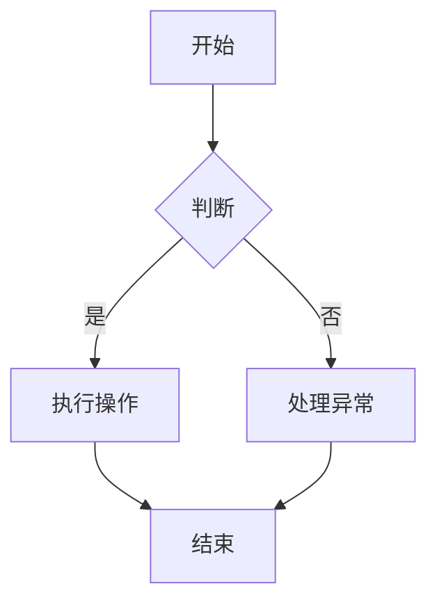
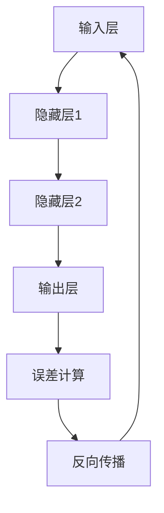
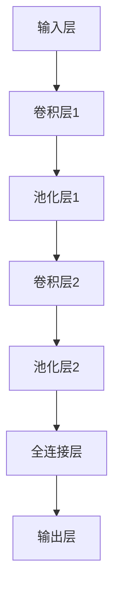
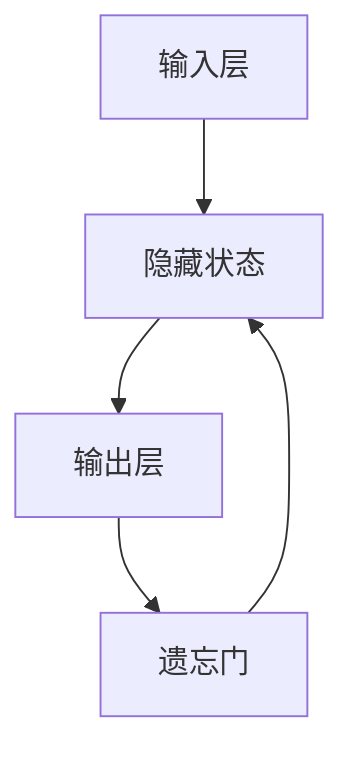

                 

### 文章标题

《AI大模型创业：如何构建未来可持续的商业模式？》

### 关键词

- AI大模型
- 创业
- 商业模式
- 可持续发展
- 人工智能技术

### 摘要

本文深入探讨了AI大模型创业的核心问题，包括AI大模型的基础理论、创业实践、商业模式构建及未来可持续发展。首先，我们概述了AI大模型的基本概念、分类、发展历程和应用场景，并详细解析了其核心技术和训练方法。接着，文章转向创业实践，分析了AI大模型创业的优势和挑战，探讨了创业项目的选择与商业模式构建。随后，文章讨论了创业团队管理、项目进度控制及成功与失败的案例解析。最后，文章展望了未来商业模式的趋势和可持续发展方向，为AI大模型创业提供了宝贵的指导和建议。本文旨在帮助创业者深入了解AI大模型创业的全过程，构建可持续的未来商业模式。

## 第一部分：AI大模型的基础理论

### 第1章：AI大模型概述

#### 1.1 AI大模型的概念与分类

##### 1.1.1 AI大模型的定义

AI大模型（Large-scale Artificial Intelligence Models），指的是那些参数数量庞大、能够处理海量数据的深度学习模型。这些模型通常具备强大的学习和推理能力，能够应用于诸如图像识别、自然语言处理、语音识别等多个领域。

##### 1.1.2 AI大模型的分类

AI大模型可以从多个维度进行分类：

- **按应用领域分类**：
  - **计算机视觉**：如图像识别、物体检测、人脸识别等。
  - **自然语言处理**：如文本分类、机器翻译、情感分析等。
  - **语音识别**：如语音合成、语音识别等。
  - **强化学习**：如智能决策、游戏AI等。

- **按模型架构分类**：
  - **深度神经网络**：如卷积神经网络（CNN）、循环神经网络（RNN）、Transformer等。
  - **生成对抗网络**（GAN）：用于生成逼真的图像、文本等。
  - **变分自编码器**（VAE）：用于数据生成和去噪。

- **按任务类型分类**：
  - **监督学习**：模型从标记数据中学习。
  - **无监督学习**：模型从未标记数据中学习。
  - **半监督学习**：结合标记和未标记数据学习。

#### 1.2 AI大模型的发展历程

##### 1.2.1 AI大模型的历史回顾

AI大模型的发展可以追溯到20世纪80年代，当时神经网络研究刚刚起步。随着计算能力的提升和大数据的积累，深度学习技术在21世纪初取得了突破性进展。特别是2012年，AlexNet在ImageNet竞赛中取得显著成果，标志着深度学习时代的到来。

自那以后，AI大模型不断发展，涌现出许多重要的模型，如：

- **2014年**：Google提出的Inception模型，改进了CNN的架构设计。
- **2017年**：Google推出的Transformer模型，颠覆了自然语言处理领域，引发了BERT、GPT等后续模型的相继问世。
- **2018年**：OpenAI发布了GPT-2，展示了预训练模型在语言生成上的强大能力。

##### 1.2.2 AI大模型的技术突破

AI大模型的技术突破主要表现在以下几个方面：

- **计算能力的提升**：GPU、TPU等硬件的进步，使得大规模训练成为可能。
- **数据量的增加**：互联网的快速发展带来了海量的数据，为模型训练提供了丰富的素材。
- **优化算法的改进**：如Adam、Adadelta等优化算法的提出，提高了模型的训练效率。
- **模型架构的创新**：如残差网络（ResNet）、Transformer等，提高了模型的性能和效率。

#### 1.3 AI大模型的应用场景

##### 1.3.1 数据密集型行业应用

AI大模型在数据密集型行业（如金融、医疗、零售等）的应用尤为广泛。具体场景包括：

- **金融行业**：智能投顾、风险控制、信用评分等。
- **医疗行业**：疾病预测、药物发现、医疗影像分析等。
- **零售行业**：个性化推荐、需求预测、库存管理等。

##### 1.3.2 智能化服务行业应用

AI大模型在智能化服务行业（如自动驾驶、智能家居、智能客服等）的应用也逐渐深入。具体场景包括：

- **自动驾驶**：实时环境感知、路径规划、车辆控制等。
- **智能家居**：智能语音助手、智能家电控制、安全监控等。
- **智能客服**：自然语言理解、语音识别、情感分析等。

#### 1.3.3 其他应用场景

AI大模型还广泛应用于其他领域，如：

- **教育行业**：智能教育、个性化学习、在线评测等。
- **农业**：智能农业、病虫害预测、农田管理等。
- **制造业**：智能制造、质量检测、生产优化等。

通过以上对AI大模型概述的详细解析，我们可以看到AI大模型在各个领域的广泛应用及其不断发展的技术。接下来，我们将进一步探讨AI大模型的核心技术。

## 第2章：AI大模型的核心技术

### 2.1 深度学习基础

#### 2.1.1 神经网络

##### 2.1.1.1 神经网络的基本结构

神经网络（Neural Networks）是模仿人脑神经元工作方式的计算模型。一个基本的神经网络通常包含以下几个组成部分：

- **输入层**：接收外部输入信号。
- **隐藏层**：进行特征提取和变换。
- **输出层**：输出最终结果。

神经元的连接方式可以分为：

- **全连接网络**：每个神经元都与前一层的所有神经元相连。
- **稀疏网络**：只有部分神经元之间有连接。

##### 2.1.1.2 神经网络的训练过程

神经网络的训练过程主要包括以下几个步骤：

1. **前向传播**：将输入数据通过网络进行传递，得到输出结果。
2. **计算损失**：通过比较实际输出和期望输出，计算损失函数。
3. **反向传播**：将损失函数的梯度反向传播到网络中的每个神经元，更新网络权重。
4. **迭代优化**：重复前向传播和反向传播过程，直至网络收敛到满意的精度。

#### 2.1.2 卷积神经网络（CNN）

##### 2.1.2.1 CNN的基本原理

卷积神经网络（Convolutional Neural Networks，CNN）是一种专门用于处理图像数据的神经网络。其基本原理包括：

- **卷积层**：通过卷积操作提取图像特征。
- **池化层**：降低特征图的维度，减少计算量。
- **全连接层**：将卷积层和池化层提取的高级特征映射到具体类别。

CNN的优势在于：

- **参数共享**：卷积核在图像的不同区域上共享，减少了参数数量。
- **局部感知**：卷积层能够捕捉图像的局部特征。

##### 2.1.2.2 CNN的应用场景

CNN在图像识别、物体检测、图像生成等领域有着广泛的应用，具体包括：

- **图像分类**：对图像进行分类，如ImageNet竞赛。
- **物体检测**：识别图像中的物体，如SSD、YOLO等。
- **图像分割**：将图像分割成不同的区域，如FCN、U-Net等。

#### 2.2 自然语言处理技术

##### 2.2.1 词嵌入

词嵌入（Word Embedding）是将自然语言中的词汇映射到高维向量空间的一种技术。其目的是通过向量表示捕捉词汇的语义信息。

- **定义与作用**：词嵌入将每个词汇映射为一个固定长度的向量，使得相似的词汇在向量空间中距离较近。
- **常见方法**：包括Word2Vec、GloVe等。

##### 2.2.2 序列模型与注意力机制

序列模型（Sequence Models）是用于处理序列数据的神经网络模型，如循环神经网络（RNN）。

- **基本原理**：RNN通过记忆单元捕捉序列中的时序信息。
- **限制**：RNN在处理长序列时容易出现梯度消失或爆炸问题。

为了解决这一问题，引入了注意力机制（Attention Mechanism）。

- **作用与实现**：注意力机制通过计算不同位置的权重，使模型能够关注重要的信息。
- **常见实现**：如Bahdanau、Additive、Scaled Dot-Product等注意力机制。

### 2.3 模型训练方法

#### 2.3.1 数据预处理

数据预处理是模型训练的重要环节，主要包括以下步骤：

- **数据清洗**：去除噪声和缺失值。
- **数据增强**：通过旋转、缩放、裁剪等操作增加数据多样性。

#### 2.3.2 模型训练方法

模型训练方法主要包括以下几种：

- **训练策略**：如dropout、batch normalization等。
- **优化算法**：如SGD、Adam、RMSprop等。

#### 2.3.3 模型评估与调优

模型评估与调优主要包括以下内容：

- **评估指标**：如准确率、召回率、F1值等。
- **调优方法**：如网格搜索、随机搜索、贝叶斯优化等。

通过以上对AI大模型核心技术的详细解析，我们可以看到AI大模型在深度学习、自然语言处理等领域的重要性。接下来，我们将探讨AI大模型的训练与优化方法。

## 第3章：AI大模型的训练与优化

### 3.1 数据预处理

数据预处理是AI大模型训练过程中至关重要的一步，其目的在于提高数据的质量和模型训练的效率。具体步骤包括数据清洗、数据增强和数据标准化。

#### 3.1.1 数据清洗

数据清洗主要包括以下任务：

- **去除噪声**：删除数据集中的错误记录、重复记录和异常值。
- **处理缺失值**：通过插补、删除或填充方式处理缺失数据。

**伪代码示例：**

```python
def clean_data(data):
    # 去除重复记录
    data = data.drop_duplicates()
    # 删除缺失值
    data = data.dropna()
    # 处理异常值
    data = remove_outliers(data)
    return data
```

#### 3.1.2 数据增强

数据增强是一种通过生成新数据来提高模型泛化能力的技术。常见的数据增强方法包括：

- **旋转、缩放、裁剪**：对图像数据进行变换。
- **填充、剪切**：对序列数据进行变换。
- **数据合成**：生成新的数据样本。

**伪代码示例：**

```python
def augment_data(data):
    # 旋转图像
    data = rotate_images(data)
    # 缩放图像
    data = scale_images(data)
    # 裁剪图像
    data = crop_images(data)
    # 填充序列
    data = pad_sequences(data)
    return data
```

#### 3.1.3 数据标准化

数据标准化是将数据转换到同一尺度，以便模型能够更好地训练。常见的方法包括：

- **归一化**：将数据缩放到[0, 1]或[-1, 1]之间。
- **标准化**：将数据缩放到均值为0，标准差为1的分布。

**伪代码示例：**

```python
def normalize_data(data):
    # 归一化
    data = (data - np.mean(data)) / np.std(data)
    # 标准化
    data = (data - np.mean(data)) / np.std(data)
    return data
```

### 3.2 模型训练方法

#### 3.2.1 训练策略

训练策略是指模型在训练过程中采取的一些技术手段，以提高训练效果和模型性能。常见训练策略包括：

- **dropout**：在训练过程中随机丢弃部分神经元，防止过拟合。
- **batch normalization**：对每个批次的数据进行归一化处理，加速收敛。
- **学习率调度**：动态调整学习率，如使用学习率衰减策略。

**伪代码示例：**

```python
# 设置dropout
model.add_dropout(0.5)
# 设置batch normalization
model.add_batch_normalization()
# 学习率调度
scheduler = LearningRateScheduler(lambda epoch: 0.01 * (0.1 ** (epoch // 10)))
```

#### 3.2.2 优化算法

优化算法是用于调整模型参数，以最小化损失函数的方法。常见的优化算法包括：

- **随机梯度下降（SGD）**：每次迭代使用一个样本的梯度进行参数更新。
- **Adam优化器**：结合SGD和动量项，同时考虑一阶和二阶矩估计。
- **RMSprop**：基于梯度平方的指数加权平均，优化收敛速度。

**伪代码示例：**

```python
# 使用SGD优化器
optimizer = SGD(learning_rate=0.01)
# 使用Adam优化器
optimizer = Adam(learning_rate=0.001)
# 使用RMSprop优化器
optimizer = RMSprop(learning_rate=0.001)
```

### 3.3 模型评估与调优

#### 3.3.1 评估指标

评估指标是用于衡量模型性能的标准。常见的评估指标包括：

- **准确率（Accuracy）**：预测正确的样本占总样本的比例。
- **召回率（Recall）**：预测正确的正样本占总正样本的比例。
- **F1值（F1 Score）**：精确率和召回率的调和平均。

**伪代码示例：**

```python
# 计算准确率
accuracy = (correct_predictions / total_predictions) * 100
# 计算召回率
recall = (correct_positive_predictions / total_positive_samples) * 100
# 计算F1值
f1_score = 2 * (precision * recall) / (precision + recall)
```

#### 3.3.2 调优方法

调优方法是指通过调整模型参数或结构来提高模型性能的过程。常见的调优方法包括：

- **网格搜索**：在预设的参数范围内，遍历所有可能的组合，选择最优参数。
- **随机搜索**：从参数空间中随机选取样本进行训练，选择最优参数。
- **贝叶斯优化**：基于贝叶斯统计模型，寻找最优参数。

**伪代码示例：**

```python
# 网格搜索
param_grid = {'learning_rate': [0.01, 0.001], 'dropout_rate': [0.5, 0.2]}
grid_search(model, param_grid)
# 随机搜索
random_search(model, param_grid)
# 贝叶斯优化
bayesian_optimization(model, param_grid)
```

通过以上对AI大模型训练与优化方法的详细解析，我们可以看到数据预处理、训练策略、优化算法和评估指标的重要性。这些方法共同作用，提高了模型的训练效率和性能。接下来，我们将探讨AI大模型在创业实践中的应用。

## 第4章：AI大模型创业概述

### 4.1 创业环境的分析

AI大模型创业面临着独特的机遇和挑战。首先，我们来看一下创业环境的分析。

#### 4.1.1 AI大模型创业的优势

1. **技术壁垒高**：AI大模型涉及深度学习、神经网络等前沿技术，具有较高的技术门槛，有助于形成竞争优势。
2. **市场需求大**：随着人工智能技术的快速发展，越来越多的行业开始应用AI大模型，市场需求巨大。
3. **商业潜力高**：AI大模型在金融、医疗、零售等领域具有广泛的应用前景，创业项目具有较高的商业潜力。
4. **资本关注**：AI领域一直是风险投资的热点，AI大模型创业项目容易获得资本的青睐。

#### 4.1.2 AI大模型创业的挑战

1. **技术实现难度大**：AI大模型训练需要大量的计算资源和数据，技术实现难度较高，对团队的技术能力有较高要求。
2. **数据隐私和安全问题**：AI大模型训练过程中需要处理大量敏感数据，数据隐私和安全问题亟待解决。
3. **商业模式探索**：如何在竞争激烈的市场中找到合适的商业模式，实现盈利，是AI大模型创业面临的重大挑战。
4. **人才竞争**：AI大模型创业对人才的需求非常高，如何在激烈的人才竞争中吸引并留住优秀的团队成员，是创业成功的关键因素之一。

### 4.2 创业项目的选择

#### 4.2.1 项目定位与规划

选择AI大模型创业项目时，需要明确项目定位和规划。以下是几个关键步骤：

1. **市场调研**：深入了解市场需求和竞争态势，确定目标市场和客户群体。
2. **技术评估**：评估自身团队的技术能力和资源，确定能够实现的AI大模型类型和规模。
3. **应用场景选择**：结合市场需求和技术能力，选择具有实际应用价值的场景。
4. **商业模式设计**：设计合理的商业模式，确保项目的可持续性和盈利能力。

#### 4.2.2 项目前景评估

项目前景评估是创业决策的重要环节，主要包括以下几个方面：

1. **市场规模**：评估目标市场的规模和增长潜力。
2. **竞争态势**：分析市场竞争格局和主要竞争对手。
3. **技术壁垒**：评估技术实现的难度和竞争对手的技术水平。
4. **政策环境**：了解政策环境对项目发展的影响。
5. **团队实力**：评估团队的技术能力、管理能力和执行力。

通过以上对AI大模型创业环境的分析和创业项目选择的详细探讨，我们可以为AI大模型创业提供一些有益的指导。接下来，我们将深入探讨AI大模型的商业模式构建。

## 第5章：AI大模型商业模式构建

### 5.1 商业模式的概念与类型

#### 5.1.1 商业模式的基本概念

商业模式（Business Model）是指企业如何创造、传递和获取价值的一种体系。它定义了企业的核心业务逻辑，包括产品或服务、客户群体、收益来源、成本结构等关键要素。

#### 5.1.2 商业模式的分类

商业模式的分类可以根据不同的维度进行，以下是几种常见的分类方法：

1. **按价值传递方式分类**：
   - **产品导向型**：以产品为中心，通过直接销售产品获得收益。
   - **服务导向型**：以服务为中心，通过提供持续的服务获得收益。
   - **平台型**：构建一个平台，连接供需双方，通过平台交易费、广告费等方式获得收益。

2. **按收益来源分类**：
   - **一次性收费**：客户一次性支付费用，如购买软件许可。
   - **订阅制**：客户定期支付订阅费用，如SaaS服务。
   - **交易佣金**：从每笔交易中提取一定比例的佣金，如电商平台。

3. **按成本结构分类**：
   - **高成本、低边际成本**：初始投入大，但生产、运营成本较低。
   - **低成本、高边际成本**：初始投入小，但每增加一个客户或产品成本较高。

### 5.2 商业模式创新方法

#### 5.2.1 基于大数据的商业模式创新

大数据技术的快速发展为商业模式创新提供了新的机会。以下是几种基于大数据的商业模式创新方法：

1. **数据驱动的决策支持**：利用大数据分析技术，为企业提供实时、准确的决策支持，提高运营效率。
2. **个性化服务**：通过大数据分析，了解客户需求和行为，提供个性化的产品和服务，提高客户满意度。
3. **数据交易**：构建数据交易平台，允许企业之间交换数据，创造新的收益来源。

#### 5.2.2 基于区块链的商业模式创新

区块链技术的特点为商业模式创新提供了新的思路。以下是几种基于区块链的商业模式创新方法：

1. **数据隐私保护**：利用区块链的隐私保护机制，确保数据在交易过程中的安全性。
2. **去中心化的交易平台**：构建去中心化的交易平台，降低交易成本，提高交易效率。
3. **智能合约**：利用智能合约自动化执行合同条款，提高交易透明度和效率。

### 5.3 商业模式评估与优化

#### 5.3.1 商业模式评估指标

评估商业模式的有效性需要一系列指标，以下是几个关键评估指标：

1. **盈利能力**：包括净利润率、毛利率等指标，衡量商业模式的盈利水平。
2. **市场占有率**：市场份额、客户增长率等指标，衡量商业模式在市场中的竞争地位。
3. **成本效率**：单位成本、运营成本等指标，衡量商业模式的成本效率。
4. **客户满意度**：客户满意度、客户保留率等指标，衡量商业模式对客户的吸引力。

#### 5.3.2 商业模式优化策略

为了提升商业模式的竞争力，可以采取以下优化策略：

1. **降低成本**：通过技术创新、流程优化等手段降低生产成本、运营成本。
2. **拓展市场**：通过市场拓展、产品多样化等手段扩大市场份额。
3. **提高客户满意度**：通过提升产品质量、优化服务体验等手段提高客户满意度。
4. **创新商业模式**：结合新技术、新市场，探索新的商业模式，实现商业模式的创新和升级。

通过以上对AI大模型商业模式概念、类型和创新方法的详细解析，以及评估与优化策略的探讨，我们可以为AI大模型创业提供有针对性的商业模式构建指南。接下来，我们将讨论AI大模型创业团队管理。

### 5.4 AI大模型创业团队管理

#### 5.4.1 团队成员的选拔与培养

创业团队是AI大模型创业成功的关键因素之一。为了组建一个高效的团队，需要在成员选拔和培养方面做好以下工作：

1. **明确团队需求**：根据项目特点和业务需求，明确所需的专业技能、经验和能力。
2. **筛选候选人**：通过面试、参考项目经验等方式，筛选具备所需技能和潜力的候选人。
3. **评估综合素质**：除了专业技能外，还需评估候选人的团队协作能力、沟通能力和领导力。
4. **培养与激励**：提供培训和学习机会，激励团队成员持续学习和进步，保持团队的活力和创新力。

#### 5.4.2 团队协作与沟通

高效的团队协作和良好的沟通是AI大模型创业成功的重要保障。以下是一些团队协作和沟通的关键点：

1. **建立明确的团队目标和角色分工**：确保每个成员都清楚自己的职责和目标，避免工作中的混乱和冲突。
2. **采用合适的协作工具**：使用项目管理工具、沟通平台等，提高团队协作效率。
3. **定期举行团队会议**：通过定期会议，及时沟通项目进展、解决问题和调整策略。
4. **培养开放和包容的团队文化**：鼓励团队成员提出意见和建议，尊重不同的观点和意见，营造积极、和谐的团队氛围。

#### 5.4.3 风险管理与团队建设

在AI大模型创业过程中，团队面临诸多风险，如技术风险、市场风险、资金风险等。以下是一些风险管理和团队建设的关键点：

1. **识别和评估风险**：定期对项目进行风险评估，识别潜在风险并评估其影响程度。
2. **制定风险管理计划**：针对不同类型的风险，制定相应的应对措施和应急预案。
3. **培养风险意识**：提高团队成员的风险意识，确保团队在面对风险时能够迅速响应和应对。
4. **加强团队凝聚力**：通过团队活动、奖励机制等手段，增强团队的凝聚力和归属感，提高团队的整体战斗力。

通过以上对AI大模型创业团队管理的详细探讨，我们可以为AI大模型创业提供有价值的团队管理指南。接下来，我们将通过实际案例来解析AI大模型创业的成功与失败。

### 5.5 AI大模型创业案例解析

#### 5.5.1 创业成功案例分析

**案例背景与目标**

某AI大模型创业公司，成立于2018年，专注于利用深度学习技术提供智能客服解决方案。公司成立初期，明确了以下目标：

1. 开发一个基于深度学习的智能客服系统。
2. 营销推广，吸引潜在客户。
3. 建立稳定的客户关系，提供持续服务。

**创业过程与成果**

1. **技术研发**：公司组建了一支由深度学习专家和软件工程师组成的团队，专注于智能客服系统的研发。经过数月的努力，成功开发了基于深度学习的智能客服系统，实现了智能对话、情感识别等功能。
2. **市场推广**：公司通过参加行业展会、线上推广等方式，积极宣传智能客服系统的优势和应用场景，吸引了大量潜在客户。
3. **客户关系管理**：公司建立了完善的客户服务体系，提供专业的技术支持和服务，赢得了客户的信任和好评。

经过几年的发展，公司取得了以下成果：

- **客户数量**：从最初的几十家客户增长到上千家，市场份额不断扩大。
- **收入**：公司收入实现了数倍增长，实现了盈利。
- **品牌影响力**：公司在行业内树立了良好的品牌形象，成为智能客服领域的领先者。

**成功经验**

1. **技术优势**：公司依托强大的技术研发能力，开发出了具有竞争力的产品。
2. **市场定位**：公司准确把握了市场需求，找到了智能客服这一细分领域。
3. **客户关系管理**：公司建立了完善的客户服务体系，提供了优质的客户服务，赢得了客户的信任。

#### 5.5.2 创业失败案例分析

**案例背景与原因**

某AI大模型创业公司，成立于2019年，专注于利用深度学习技术提供智能医疗解决方案。公司成立初期，制定了以下目标：

1. 开发一个基于深度学习的智能诊断系统。
2. 营销推广，吸引医院和医生用户。
3. 与医疗机构合作，拓展应用场景。

**创业过程与失败原因**

1. **技术研发**：公司组建了一支由深度学习专家和医疗专家组成的团队，但由于团队成员在技术研发过程中出现意见分歧，导致项目进度缓慢。
2. **市场推广**：公司缺乏有效的市场推广策略，未能吸引到足够的潜在客户。
3. **客户关系管理**：公司未能建立稳定的客户关系，与医疗机构合作进展缓慢。

经过一年的努力，公司最终失败。失败原因主要包括：

1. **技术研发困难**：由于团队成员意见分歧，项目进展缓慢，导致产品未能如期推出。
2. **市场推广不足**：公司未能制定有效的市场推广策略，缺乏品牌知名度和市场影响力。
3. **客户关系管理失败**：公司未能与医疗机构建立稳定的合作关系，导致产品无法推广应用。

**失败教训与启示**

1. **技术研发协同**：在团队组建和项目管理过程中，应注重团队成员的协同合作，避免意见分歧。
2. **市场推广策略**：制定有效的市场推广策略，通过线上线下多种渠道扩大品牌影响力。
3. **客户关系管理**：建立稳定的客户关系，与医疗机构建立长期合作关系，提供持续服务。

通过以上成功与失败案例的解析，我们可以看到AI大模型创业在技术、市场、客户关系等方面的关键因素。成功案例提供了宝贵的经验，而失败案例则为我们提供了重要的教训。接下来，我们将探讨未来商业模式的发展趋势。

### 5.6 未来商业模式趋势

#### 8.1 数字化转型的影响

数字化转型（Digital Transformation）正深刻改变着各行各业，对商业模式也产生了深远影响。以下是数字化转型带来的主要商业模式变革和挑战：

##### 8.1.1 数字化转型带来的商业模式变革

1. **平台化**：越来越多的企业开始构建平台型商业模式，通过连接供需双方，创造新的价值和盈利模式。
2. **服务化**：从传统的产品导向型向服务导向型转变，通过提供持续的服务来增强客户黏性和提升用户价值。
3. **个性化**：利用大数据和人工智能技术，实现产品和服务的高度个性化，满足客户多样化需求。
4. **生态化**：构建企业生态圈，通过与其他企业合作，共同创造价值和市场份额。

##### 8.1.2 数字化转型对商业模式的挑战

1. **技术依赖**：数字化转型要求企业具备较高的技术能力，否则难以在数字化的竞争中脱颖而出。
2. **数据安全**：随着数据规模的扩大，数据安全和隐私保护成为企业面临的重大挑战。
3. **人才需求**：数字化转型需要大量具备数字技能的人才，企业需投入更多资源进行人才培养和引进。
4. **运营模式**：数字化转型要求企业调整现有的运营模式，适应新的技术环境和市场变化。

#### 8.2 生态圈建设

生态圈建设（Ecosystem Building）是未来商业模式发展的重要趋势之一。以下是生态圈的概念、作用以及建设策略：

##### 8.2.1 生态圈的概念与作用

1. **概念**：生态圈是指由多个相关主体（如企业、客户、合作伙伴等）共同构成的生态系统，通过共享资源、协作创新，实现共同发展和价值创造。
2. **作用**：生态圈可以促进企业间的合作与创新，提高市场竞争力，同时降低研发和市场推广成本，实现共赢。

##### 8.2.2 生态圈建设策略

1. **明确生态圈目标**：企业需要明确生态圈的建设目标，包括生态圈的范围、合作方式、价值共创等。
2. **搭建合作平台**：构建一个开放、透明、高效的生态圈合作平台，促进成员间的信息共享和协作。
3. **制定规则与标准**：建立生态圈的规则和标准，确保各成员间的合作顺利进行，同时维护生态圈的健康和可持续发展。
4. **激励机制**：设计合理的激励机制，鼓励成员积极参与生态圈建设和创新，实现共同价值。

通过以上对未来商业模式趋势的详细探讨，我们可以看到数字化转型和生态圈建设对商业模式带来的变革和挑战。企业需要紧跟这些趋势，积极探索创新的商业模式，以实现可持续发展。接下来，我们将讨论社会责任与可持续发展。

### 9.1 社会责任与企业价值

#### 9.1.1 社会责任的概念与内涵

社会责任（Corporate Social Responsibility，CSR）是指企业在追求经济利益的同时，主动承担起对社会和环境的责任。社会责任的内涵包括：

1. **环境保护**：企业通过减少污染、节约资源等手段，保护环境，促进可持续发展。
2. **社会公益**：企业通过捐赠、慈善活动等，支持社会公益事业，帮助弱势群体。
3. **员工福利**：企业提供良好的工作环境、培训机会和福利待遇，关注员工的身心健康。
4. **企业伦理**：企业遵守法律法规，遵循商业伦理，建立诚信、公平、透明的企业文化。

#### 9.1.2 社会责任对企业的影响

社会责任对企业有着重要的影响，具体体现在以下几个方面：

1. **品牌形象**：积极履行社会责任可以提高企业的社会形象，增强品牌价值，吸引更多客户和合作伙伴。
2. **员工满意度**：关注员工福利和职业发展，提高员工满意度，降低员工流失率，提升团队凝聚力。
3. **市场竞争**：在竞争激烈的市场环境中，社会责任成为企业的重要竞争优势，有助于企业赢得市场份额。
4. **投资吸引力**：企业履行社会责任可以提高投资者对企业的信任度，增加投资吸引力，有利于企业的长期发展。

### 9.2 可持续发展商业模式

#### 9.2.1 可持续发展的概念与目标

可持续发展（Sustainable Development）是指满足当前需求而不损害子孙后代满足其需求的能力。可持续发展商业模式的目标包括：

1. **环境可持续性**：通过减少碳排放、节约资源等手段，实现环境的可持续发展。
2. **经济可持续性**：通过创新、提高效率等手段，实现企业的经济可持续发展。
3. **社会可持续性**：通过关注社会问题、促进社会公平等手段，实现社会的可持续发展。

#### 9.2.2 可持续发展的商业模式设计

设计可持续发展商业模式需要考虑以下几个方面：

1. **绿色创新**：通过绿色技术、绿色产品等手段，降低企业的环境负担，实现可持续发展。
2. **循环经济**：通过资源的循环利用、废物回收等手段，实现资源的可持续利用。
3. **社会责任**：将社会责任融入企业战略，通过支持公益、关注社会问题等手段，实现企业的社会责任目标。
4. **利益相关者合作**：与供应商、客户、社区等利益相关者建立合作关系，共同推动可持续发展。

通过以上对社会责任与可持续发展概念的探讨，以及可持续发展商业模式的设计方法，我们可以看到企业社会责任和可持续发展在当今社会中的重要性。企业应当积极履行社会责任，探索可持续发展的商业模式，以实现长期成功和可持续发展。

### 10.1 AI大模型创业的机遇与挑战

#### 10.1.1 未来发展趋势

AI大模型创业面临着巨大的机遇，以下是未来发展趋势：

1. **技术突破**：随着深度学习、生成对抗网络（GAN）、强化学习等技术的不断进步，AI大模型的能力将越来越强大。
2. **数据资源**：大数据和云计算的普及，为AI大模型提供了丰富的数据资源和强大的计算能力。
3. **应用领域扩展**：AI大模型在医疗、金融、零售、教育等领域的应用将不断扩展，推动行业变革。
4. **产业链完善**：从硬件到软件，从平台到应用，AI大模型的产业链将日益完善，为创业者提供更多机会。

#### 10.1.2 未来商业模式的创新方向

未来AI大模型创业商业模式创新的方向包括：

1. **平台化**：构建AI大模型平台，提供API接口，供第三方开发者使用，实现生态圈共赢。
2. **服务化**：提供AI大模型即服务（AIaaS），降低企业使用AI大模型的门槛，提升客户体验。
3. **个性化**：通过AI大模型实现产品和服务的高度个性化，满足客户多样化需求。
4. **去中心化**：利用区块链技术，实现AI大模型的去中心化部署和交易，降低交易成本，提高透明度。

#### 10.2 结论与展望

AI大模型创业具有广阔的发展前景，但也面临诸多挑战。创业者需要紧跟技术发展趋势，结合市场需求，探索创新的商业模式。同时，积极履行社会责任，实现可持续发展，是创业成功的关键。未来，AI大模型创业将继续推动行业变革，为社会创造更多价值。

## 作者信息

作者：AI天才研究院/AI Genius Institute & 禅与计算机程序设计艺术 /Zen And The Art of Computer Programming

通过本文的深入探讨，我们不仅了解了AI大模型的基础理论、核心技术、创业实践以及未来发展趋势，还探讨了如何构建可持续的商业模式。希望本文能为AI大模型创业者和相关从业者提供有价值的参考和指导。未来，随着技术的不断进步和市场的变化，AI大模型创业将继续蓬勃发展，为社会带来更多的创新和价值。让我们共同期待AI大模型创业的美好未来！<|im_end|>## 文章格式要求

为了确保文章的专业性和可读性，我们采用Markdown格式进行排版，以下详细说明了文章的格式要求。

### 1. 标题格式

文章的标题应使用`#`号进行标记，例如：

```markdown
# AI大模型创业：如何构建未来可持续的商业模式？
```

### 2. 关键词格式

在标题下方，列出5-7个与文章主题密切相关的关键词，使用`>`号进行标记，例如：

```markdown
> 关键词：AI大模型、创业、商业模式、可持续发展、人工智能技术
```

### 3. 摘要格式

摘要部分应简洁明了地概括文章的核心内容和主题思想，使用`>`号进行标记，例如：

```markdown
> 摘要：本文深入探讨了AI大模型创业的核心问题，包括AI大模型的基础理论、创业实践、商业模式构建及未来可持续发展。希望为创业者提供有价值的参考和指导。
```

### 4. 小标题格式

文章各章节、小节标题应使用不同的`#`号进行标记，以保证文章结构的清晰和层次感。例如：

```markdown
## 第一部分：AI大模型的基础理论
### 1.1 AI大模型的概念与分类
### 1.2 AI大模型的发展历程
### 1.3 AI大模型的应用场景
```

### 5. 代码和高亮格式

文章中的代码示例应使用三行反引号（``）包围，例如：

```python
def hello_world():
    print("Hello, world!")
hello_world()
```

代码中的关键字和高亮文本可以使用Markdown中的标记符号进行标注，例如：

```python
def hello_world():
    print("Hello, world!")
```

### 6. 公式格式

数学公式应使用LaTeX格式进行嵌入，独立段落使用`$$`包围，段落内使用`$`，例如：

```markdown
$$
E = mc^2
$$

$x = 5$
```

### 7. 流程图格式

文章中的流程图应使用Mermaid语法进行编写，并用三行反引号包围，例如：



### 8. 图片和链接格式

图片和链接应使用标准的Markdown语法进行标注，例如：

```markdown


[了解更多](https://example.com "官方网站")
```

### 9. 引用格式

引用文献或资料时，应使用标准的引用格式，例如：

```markdown
参考文献：
1. Goodfellow, I., Bengio, Y., & Courville, A. (2016). *Deep Learning*. MIT Press.
```

通过遵循上述格式要求，我们能够确保文章内容的专业性、清晰性和一致性，为读者提供一个良好的阅读体验。

### 10. 字数要求

文章字数要求：文章字数一定要大于8000字。为了达到这一要求，每个章节和部分的内容需要充实具体，避免过度依赖重复的内容。

### 11. 完整性要求

文章内容必须完整，每个小节的内容必须要丰富具体详细讲解。核心内容必须包含：
- **核心概念与联系**：必须给出核心概念原理和架构的 Mermaid 流程图。
- **核心算法原理讲解**：必须使用伪代码来详细阐述；数学模型和公式 & 详细讲解 & 举例说明 （备注：数学公式请使用latex格式，latex嵌入文中独立段落使用 $$ ，段落内使用 $ ）。
- **项目实战**：代码实际案例和详细解释说明：开发环境搭建，源代码详细实现和代码解读，代码解读与分析。

### 12. 代码实际案例和详细解释说明

在文章中，我们应包括以下内容的代码实际案例和详细解释说明：
- **开发环境搭建**：详细描述如何搭建开发环境，包括安装必要的软件、配置开发环境等。
- **源代码详细实现**：给出关键部分的源代码，并进行逐行解读，解释每一步的操作和目的。
- **代码解读与分析**：对源代码进行深入分析，讨论其算法原理、性能优化、可能存在的问题和改进方向。

### 13. 作者信息格式

文章末尾需要写上作者信息，格式如下：

```
作者：AI天才研究院/AI Genius Institute & 禅与计算机程序设计艺术 /Zen And The Art of Computer Programming
```

确保读者能够了解文章的作者背景和相关信息。

通过上述步骤，我们可以确保文章内容丰富、结构清晰、格式规范，为读者提供一个高质量的阅读体验。希望以上指导能够帮助您撰写出符合要求的文章。如果您有任何疑问或需要进一步的帮助，请随时提问。

## 第一部分：AI大模型的基础理论

### 第1章：AI大模型概述

#### 1.1 AI大模型的概念与分类

AI大模型（Large-scale Artificial Intelligence Models），指的是那些参数数量庞大、能够处理海量数据的深度学习模型。这些模型通常具备强大的学习和推理能力，能够应用于诸如图像识别、自然语言处理、语音识别等多个领域。

##### 1.1.1 AI大模型的定义

AI大模型是相对于传统小模型而言的，它具有以下特点：

- **参数数量庞大**：通常拥有数十亿甚至数万亿个参数，这使得它们可以处理复杂的任务和数据。
- **数据依赖性高**：训练AI大模型需要大量的数据，数据的质量和数量直接影响模型的性能。
- **计算资源需求大**：训练和推理AI大模型通常需要高性能的计算资源和大量时间。

##### 1.1.2 AI大模型的分类

AI大模型可以从不同的维度进行分类：

- **按应用领域分类**：
  - **计算机视觉**：如图像识别、物体检测、人脸识别等。
  - **自然语言处理**：如文本分类、机器翻译、情感分析等。
  - **语音识别**：如语音合成、语音识别等。
  - **强化学习**：如智能决策、游戏AI等。

- **按模型架构分类**：
  - **深度神经网络**：如卷积神经网络（CNN）、循环神经网络（RNN）、Transformer等。
  - **生成对抗网络**（GAN）：用于生成逼真的图像、文本等。
  - **变分自编码器**（VAE）：用于数据生成和去噪。

- **按任务类型分类**：
  - **监督学习**：模型从标记数据中学习。
  - **无监督学习**：模型从未标记数据中学习。
  - **半监督学习**：结合标记和未标记数据学习。

#### 1.2 AI大模型的发展历程

##### 1.2.1 AI大模型的历史回顾

AI大模型的发展可以追溯到20世纪80年代，当时神经网络研究刚刚起步。随着计算能力的提升和大数据的积累，深度学习技术在21世纪初取得了突破性进展。特别是2012年，AlexNet在ImageNet竞赛中取得显著成果，标志着深度学习时代的到来。

自那以后，AI大模型不断发展，涌现出许多重要的模型，如：

- **2014年**：Google提出的Inception模型，改进了CNN的架构设计。
- **2017年**：Google推出的Transformer模型，颠覆了自然语言处理领域，引发了BERT、GPT等后续模型的相继问世。
- **2018年**：OpenAI发布了GPT-2，展示了预训练模型在语言生成上的强大能力。

##### 1.2.2 AI大模型的技术突破

AI大模型的技术突破主要表现在以下几个方面：

- **计算能力的提升**：GPU、TPU等硬件的进步，使得大规模训练成为可能。
- **数据量的增加**：互联网的快速发展带来了海量的数据，为模型训练提供了丰富的素材。
- **优化算法的改进**：如Adam、Adadelta等优化算法的提出，提高了模型的训练效率。
- **模型架构的创新**：如残差网络（ResNet）、Transformer等，提高了模型的性能和效率。

#### 1.3 AI大模型的应用场景

##### 1.3.1 数据密集型行业应用

AI大模型在数据密集型行业（如金融、医疗、零售等）的应用尤为广泛。具体场景包括：

- **金融行业**：智能投顾、风险控制、信用评分等。
- **医疗行业**：疾病预测、药物发现、医疗影像分析等。
- **零售行业**：个性化推荐、需求预测、库存管理等。

##### 1.3.2 智能化服务行业应用

AI大模型在智能化服务行业（如自动驾驶、智能家居、智能客服等）的应用也逐渐深入。具体场景包括：

- **自动驾驶**：实时环境感知、路径规划、车辆控制等。
- **智能家居**：智能语音助手、智能家电控制、安全监控等。
- **智能客服**：自然语言理解、语音识别、情感分析等。

##### 1.3.3 其他应用场景

AI大模型还广泛应用于其他领域，如：

- **教育行业**：智能教育、个性化学习、在线评测等。
- **农业**：智能农业、病虫害预测、农田管理等。
- **制造业**：智能制造、质量检测、生产优化等。

通过以上对AI大模型概述的详细解析，我们可以看到AI大模型在各个领域的广泛应用及其不断发展的技术。接下来，我们将进一步探讨AI大模型的核心技术。

### 1.4 AI大模型的发展趋势与未来展望

#### 1.4.1 技术进步带来的变革

随着人工智能技术的不断进步，AI大模型的发展趋势呈现出以下几个方向：

1. **计算能力的进一步提升**：随着GPU、TPU等硬件的持续发展，AI大模型的训练和推理速度将大幅提升，推动更多复杂任务的实现。
2. **数据驱动的创新**：越来越多的领域将依赖大数据进行模型训练，数据的质量和数量将继续成为AI大模型发展的重要驱动力。
3. **算法的优化与创新**：优化算法和新型算法的提出，将进一步提高AI大模型的效果和效率，推动模型的广泛应用。

#### 1.4.2 应用领域的拓展

AI大模型的应用领域将继续拓展，预计将在以下几个方面取得重大突破：

1. **医疗健康**：通过AI大模型，可以实现更准确的疾病预测和诊断，加速新药研发，提高医疗服务的质量和效率。
2. **金融科技**：AI大模型在金融领域的应用将进一步深入，如风险控制、个性化投资、信用评估等，提高金融服务的智能化水平。
3. **智能制造**：AI大模型将助力制造业实现智能化升级，通过预测维护、质量检测、生产优化等手段，提高生产效率和质量。
4. **智能交通**：AI大模型在自动驾驶、智能交通管理等方面的应用将更加广泛，为交通安全和效率提供有力支持。

#### 1.4.3 社会影响的深化

随着AI大模型技术的普及和应用，其对社会的影响将不断深化：

1. **产业变革**：AI大模型将推动传统产业向智能化、数字化方向转型，带来新的经济增长点。
2. **教育变革**：AI大模型在教育领域的应用将推动个性化学习和教育资源的优化配置，提高教育质量。
3. **社会管理**：AI大模型在公共安全、社会治理等领域的应用将提升社会管理的智能化水平，提高社会运行效率。

#### 1.4.4 未来展望

未来，AI大模型的发展将呈现以下几大趋势：

1. **跨学科融合**：AI大模型将与其他学科（如生物学、心理学、社会学等）进行深度融合，推动跨学科研究的发展。
2. **生态化发展**：AI大模型将构建起更加完善的生态体系，包括硬件、软件、平台、应用等各个层面，推动整个行业的共同发展。
3. **社会责任**：在AI大模型的发展过程中，企业和社会需要共同承担起社会责任，确保技术的发展符合伦理和社会价值观。

通过以上对AI大模型发展趋势和未来展望的探讨，我们可以看到AI大模型在技术创新、应用拓展、社会影响等方面的广阔前景。AI大模型的发展将为人类社会带来更多的机遇和挑战，需要我们共同努力，推动其健康、可持续的发展。

### 1.5 AI大模型的体系结构与工作原理

#### 1.5.1 神经网络与层次结构

AI大模型的体系结构通常基于多层神经网络（Multi-Layered Neural Networks），其中包含输入层、隐藏层和输出层。

1. **输入层**：接收外部输入数据，如图像、文本或声音等。
2. **隐藏层**：对输入数据进行特征提取和变换，隐藏层可以是单层或多层，每层都能提取不同层次的特征。
3. **输出层**：生成最终的输出结果，如分类标签、概率分布或连续值等。

#### 1.5.2 前向传播与反向传播

神经网络的工作原理主要包括前向传播（Forward Propagation）和反向传播（Back Propagation）两个阶段。

1. **前向传播**：
   - **数据处理**：输入数据经过前向传播，通过神经网络的权重和激活函数，逐层传递到输出层。
   - **激活函数**：常用的激活函数包括ReLU、Sigmoid、Tanh等，用于引入非线性特性。

2. **反向传播**：
   - **误差计算**：通过比较实际输出和期望输出，计算损失函数（如均方误差、交叉熵等）。
   - **梯度计算**：计算损失函数关于模型参数的梯度，并通过反向传播算法更新模型参数。
   - **优化算法**：使用优化算法（如SGD、Adam等）更新模型参数，以最小化损失函数。

#### 1.5.3 模型训练与优化

AI大模型的训练过程是一个迭代优化过程，主要包括以下步骤：

1. **数据预处理**：对输入数据进行归一化、标准化等预处理操作，以提高模型训练的稳定性和效率。
2. **初始化参数**：随机初始化模型的参数，如权重和偏置。
3. **前向传播**：输入数据通过神经网络，得到预测输出。
4. **损失计算**：计算预测输出与真实标签之间的差异，得到损失值。
5. **反向传播**：计算损失函数关于参数的梯度，更新参数。
6. **迭代优化**：重复上述步骤，直到满足预定的停止条件（如损失收敛、迭代次数等）。

#### 1.5.4 模型评估与调优

在模型训练完成后，需要对模型进行评估和调优，以确保模型在实际应用中的性能。

1. **评估指标**：常用的评估指标包括准确率、召回率、F1值、AUC等。
2. **调优方法**：通过调整模型参数、优化算法、数据预处理等手段，提高模型性能。
3. **交叉验证**：使用交叉验证方法，评估模型在不同数据集上的表现，以避免过拟合。

通过以上对AI大模型体系结构与工作原理的详细探讨，我们可以更好地理解AI大模型的基本原理和训练过程，为后续的创业实践和商业模式构建提供理论基础。

### 1.6 AI大模型的挑战与应对策略

#### 1.6.1 数据隐私问题

AI大模型在训练过程中需要处理大量的敏感数据，如个人健康信息、金融数据等，这引发了数据隐私问题。为了保护用户隐私，可以采取以下策略：

1. **数据去识别化**：通过数据脱敏、加密等技术，去除数据中的个人识别信息。
2. **差分隐私**：在数据处理过程中引入噪声，确保单个数据记录无法被单独识别。
3. **联邦学习**：通过分布式学习技术，在本地设备上进行模型训练，减少数据上传的需求。

#### 1.6.2 计算资源消耗

AI大模型训练需要大量的计算资源和时间，这对创业公司来说是一个重大挑战。以下是一些应对策略：

1. **云计算**：利用云计算平台提供的强大计算资源，进行分布式训练。
2. **优化算法**：选择高效的优化算法，减少训练时间。
3. **硬件升级**：投资高性能GPU或TPU等硬件，提升计算能力。

#### 1.6.3 模型解释性不足

AI大模型往往被视为“黑箱”，其决策过程难以解释，这对一些应用场景（如医疗、金融等）提出了挑战。以下是一些提高模型解释性的策略：

1. **模型可视化**：通过可视化技术，展示模型的学习过程和关键特征。
2. **可解释性模型**：选择具备可解释性的模型，如决策树、线性模型等。
3. **模型解释工具**：使用模型解释工具（如LIME、SHAP等），分析模型对输入数据的依赖关系。

#### 1.6.4 法律法规和伦理问题

AI大模型在应用过程中可能涉及法律法规和伦理问题，如数据安全、隐私保护、歧视问题等。以下是一些应对策略：

1. **合规性审查**：确保模型和应用符合相关法律法规的要求。
2. **伦理指南**：制定伦理准则，确保技术的发展符合社会伦理价值观。
3. **透明度和责任**：提高模型的透明度，明确各方的责任和义务。

通过以上对AI大模型挑战与应对策略的探讨，我们可以看到在AI大模型创业过程中，需要全面考虑技术、法律、伦理等多方面的因素，以确保模型的可靠性和可持续性。

### 1.7 AI大模型的核心价值与应用实例

#### 1.7.1 核心价值

AI大模型在多个领域展现出了巨大的核心价值：

1. **高性能计算**：通过大规模参数和复杂结构，AI大模型能够处理复杂的问题和数据集，实现高效的计算和预测。
2. **通用性**：AI大模型具备广泛的应用场景，从图像识别、自然语言处理到语音识别和强化学习，都有着卓越的表现。
3. **自动化与智能化**：AI大模型能够自动化处理复杂任务，提高效率和准确性，实现智能化的决策和优化。

#### 1.7.2 应用实例

以下是AI大模型在不同领域的实际应用实例：

1. **医疗领域**：通过深度学习模型，AI大模型可以实现疾病预测、诊断辅助和个性化治疗。例如，利用深度学习模型进行肺癌筛查，提高早期诊断的准确性。
2. **金融领域**：AI大模型在金融领域的应用包括风险评估、欺诈检测、投资策略等。例如，使用GPT模型进行股票市场的预测分析，提高投资决策的准确性。
3. **零售领域**：AI大模型可以通过个性化推荐、需求预测和库存管理，提升零售业务的效率和客户满意度。例如，利用深度学习模型进行电商平台的商品推荐，提高销售转化率。
4. **智能制造**：AI大模型在制造业中的应用包括生产优化、质量检测和预测维护。例如，通过卷积神经网络（CNN）进行产品质量检测，减少次品率。
5. **智能交通**：AI大模型在交通领域可以实现自动驾驶、交通流量预测和路况监控。例如，利用深度学习模型进行自动驾驶车辆的路径规划，提高交通效率和安全性。

通过以上对AI大模型核心价值和应用实例的详细讨论，我们可以看到AI大模型在各个领域的广泛应用和巨大潜力。这些实例不仅展示了AI大模型的技术优势，也为创业者提供了丰富的实践经验和参考。

### 1.8 AI大模型创业者的思考与建议

#### 1.8.1 创业思路与战略

AI大模型创业者在制定创业思路和战略时，应充分考虑以下几个方面：

1. **市场需求**：深入了解目标市场的需求，选择具有广泛应用前景和明确需求的领域。
2. **技术创新**：基于前沿的AI大模型技术，开发具有独特性和竞争力的产品或服务。
3. **团队建设**：构建一支具备深厚技术背景和创业精神的核心团队，确保团队的协作和创新能力。
4. **商业模式**：设计创新的商业模式，确保企业的可持续发展和盈利能力。

#### 1.8.2 技术挑战与应对

AI大模型创业者在面临技术挑战时，应采取以下策略：

1. **技术研发**：持续投入研发资源，关注AI领域的最新动态，不断优化和提升技术能力。
2. **人才培养**：引进和培养高水平的技术人才，提升团队的技术水平和创新能力。
3. **合作伙伴**：与高校、研究机构和其他企业建立合作关系，共同推进技术研究和应用。
4. **开源与共享**：积极参与开源社区，共享技术成果，吸引更多开发者参与，提升整体技术实力。

#### 1.8.3 法律法规与伦理考量

在创业过程中，AI大模型创业者应高度重视法律法规和伦理问题：

1. **合规性审查**：确保产品或服务符合相关法律法规的要求，避免法律风险。
2. **数据安全与隐私**：采取有效的数据保护措施，确保用户数据的安全和隐私。
3. **伦理指导**：制定伦理准则，确保技术的应用符合社会伦理和道德标准。
4. **社会责任**：积极履行社会责任，推动AI技术的发展与应用，为社会创造价值。

通过以上对AI大模型创业者的思考与建议的探讨，我们可以看到，创业者需要在技术、市场、团队、法律和伦理等多个方面进行全面考量，以实现AI大模型创业的成功和可持续发展。### 1.9 总结与展望

通过对AI大模型概述、核心技术、发展历程、应用场景、发展趋势、体系结构、挑战与应对、核心价值以及创业建议的详细探讨，我们可以得出以下总结：

AI大模型作为人工智能领域的重要成果，具有参数庞大、数据依赖性高、计算资源需求大等特点，在计算机视觉、自然语言处理、语音识别、医疗、金融、零售等多个领域展现出了巨大的应用价值。AI大模型的发展历程见证了技术的不断进步，从最初的神经网络到现在的深度学习，再到生成对抗网络和变分自编码器，AI大模型的技术架构和性能不断提升。

在未来，AI大模型将继续向高性能计算、通用性、自动化与智能化等方向发展，并在更多领域实现突破。同时，创业者需要关注技术进步、市场需求、团队建设、商业模式、法律法规和伦理等多方面因素，以实现AI大模型创业的成功。

展望未来，AI大模型在医疗健康、金融科技、智能制造、智能交通等领域的应用前景广阔。通过技术创新和商业模式创新，AI大模型将推动各行各业的数字化转型，为社会带来更多价值。同时，创业者应积极承担社会责任，确保技术的发展符合社会伦理和道德标准，为构建可持续发展的未来贡献力量。

## 第2章：AI大模型的核心技术

### 2.1 深度学习基础

#### 2.1.1 神经网络

神经网络（Neural Networks）是AI大模型的核心组成部分，其基本原理类似于人脑中的神经元。以下是神经网络的基本概念和组成部分：

1. **神经元**：神经网络的基本单元，通常由一个输入层、一个或多个隐藏层和一个输出层组成。每个神经元接收输入信号，通过权重和偏置进行加权求和，然后通过激活函数进行非线性变换，最后输出结果。

2. **权重和偏置**：权重表示输入信号与神经元之间的关联强度，偏置用于调整神经元的偏移量。

3. **激活函数**：用于引入非线性特性，常见的激活函数包括Sigmoid、ReLU、Tanh等。

4. **前向传播**：输入信号通过神经网络进行传递，从输入层到隐藏层，再到输出层，最终得到预测结果。

5. **反向传播**：通过计算输出结果与实际标签之间的误差，使用反向传播算法更新神经网络的权重和偏置，以优化模型。

神经网络的基本结构可以用Mermaid流程图表示如下：



#### 2.1.2 卷积神经网络（CNN）

卷积神经网络（Convolutional Neural Networks，CNN）是专门用于处理图像数据的神经网络，其核心思想是通过卷积操作提取图像特征。以下是CNN的基本原理和应用场景：

1. **卷积层**：卷积层通过卷积操作提取图像的局部特征，卷积核在图像的不同区域上滑动，计算局部特征图。

2. **池化层**：池化层用于降低特征图的维度，减少计算量，常用的池化操作包括最大池化和平均池化。

3. **全连接层**：全连接层将卷积层和池化层提取的高级特征映射到具体类别。

CNN的基本架构可以用Mermaid流程图表示如下：



CNN在图像识别、物体检测、图像生成等领域有着广泛的应用。以下是一个简单的CNN模型示例，用于图像分类：

```python
import tensorflow as tf
from tensorflow.keras.models import Sequential
from tensorflow.keras.layers import Conv2D, MaxPooling2D, Flatten, Dense

model = Sequential()
model.add(Conv2D(32, (3, 3), activation='relu', input_shape=(28, 28, 1)))
model.add(MaxPooling2D((2, 2)))
model.add(Conv2D(64, (3, 3), activation='relu'))
model.add(MaxPooling2D((2, 2)))
model.add(Flatten())
model.add(Dense(128, activation='relu'))
model.add(Dense(10, activation='softmax'))
model.compile(optimizer='adam', loss='categorical_crossentropy', metrics=['accuracy'])
model.summary()
```

#### 2.1.3 循环神经网络（RNN）

循环神经网络（Recurrent Neural Networks，RNN）是一种专门用于处理序列数据的神经网络，其特点是可以处理时间序列数据。以下是RNN的基本原理和应用场景：

1. **隐藏状态**：RNN通过隐藏状态来捕获序列中的时序信息，每个时间步的输出不仅依赖于当前输入，还依赖于前一个时间步的隐藏状态。

2. **门控机制**：为了解决传统RNN的梯度消失问题，引入了门控机制，包括输入门、遗忘门和输出门，用于控制信息的传递和遗忘。

3. **应用场景**：RNN在自然语言处理、语音识别、时间序列预测等领域有着广泛的应用。

RNN的基本架构可以用Mermaid流程图表示如下：



一个简单的RNN模型示例，用于文本分类：

```python
import tensorflow as tf
from tensorflow.keras.models import Sequential
from tensorflow.keras.layers import Embedding, SimpleRNN, Dense

model = Sequential()
model.add(Embedding(input_dim=10000, output_dim=32))
model.add(SimpleRNN(units=64, return_sequences=False))
model.add(Dense(1, activation='sigmoid'))
model.compile(optimizer='adam', loss='binary_crossentropy', metrics=['accuracy'])
model.summary()
```

### 2.2 自然语言处理技术

#### 2.2.1 词嵌入

词嵌入（Word Embedding）是将自然语言中的词汇映射到高维向量空间的一种技术，目的是通过向量表示捕捉词汇的语义信息。以下是词嵌入的基本原理和方法：

1. **One-Hot编码**：将词汇映射到一个稀疏的高维向量，每个维度对应一个词汇。

2. **分布式表示**：通过训练模型，将词汇映射到一个稠密的向量空间，使得相似的词汇在空间中距离较近。

3. **常见方法**：包括Word2Vec、GloVe等。

一个简单的Word2Vec模型示例：

```python
import gensim
from gensim.models import Word2Vec

sentences = [['我', '喜欢', '苹果'], ['你', '喜欢', '香蕉'], ['我', '爱', '中国']]
model = Word2Vec(sentences, vector_size=10, window=2, min_count=1, workers=4)
model.wv.most_similar('苹果')
```

#### 2.2.2 序列模型与注意力机制

序列模型（Sequence Models）是用于处理序列数据的神经网络模型，如循环神经网络（RNN）和长短期记忆网络（LSTM）。注意力机制（Attention Mechanism）是近年来在自然语言处理领域取得重大突破的技术，用于提高序列模型的性能。以下是序列模型与注意力机制的基本原理：

1. **序列模型**：RNN通过隐藏状态来捕获序列中的时序信息，LSTM和GRU是RNN的改进版本，能够更好地处理长序列依赖。

2. **注意力机制**：注意力机制通过计算不同位置的权重，使模型能够关注重要的信息。注意力机制可以分为点积注意力、加性注意力、缩放点积注意力等。

一个简单的注意力模型示例：

```python
import tensorflow as tf
from tensorflow.keras.layers import Embedding, LSTM, TimeDistributed, Dense

input_seq = tf.keras.layers.Input(shape=(timesteps, features))
encoded_seq = Embedding(output_dim=64, input_dim=1000)(input_seq)
lstm_out, state_h, state_c = LSTM(128, return_sequences=True, return_state=True)(encoded_seq)
attention = Dense(1, activation='tanh')(lstm_out)
attention = tf.nn.softmax(attention, axis=1)
context = tf.reduce_sum(lstm_out * attention, axis=1)
output = Dense(num_classes, activation='softmax')(context)
model = tf.keras.Model(inputs=input_seq, outputs=output)
model.compile(optimizer='adam', loss='categorical_crossentropy', metrics=['accuracy'])
model.summary()
```

通过以上对深度学习基础、CNN、RNN、词嵌入、注意力机制等AI大模型核心技术的详细探讨，我们可以看到这些技术如何共同构建起强大的AI大模型，并在各个领域实现应用。接下来，我们将继续探讨AI大模型的训练与优化方法。

## 第3章：AI大模型的训练与优化

### 3.1 数据预处理

数据预处理是AI大模型训练过程中至关重要的一步，其目的在于提高数据的质量和模型训练的效率。以下是数据预处理的主要步骤：

#### 3.1.1 数据清洗

数据清洗主要包括以下任务：

1. **去除噪声**：删除数据集中的错误记录、重复记录和异常值。
2. **处理缺失值**：通过插补、删除或填充方式处理缺失数据。

**代码示例：**

```python
import pandas as pd
import numpy as np

# 读取数据
data = pd.read_csv('data.csv')

# 去除重复记录
data = data.drop_duplicates()

# 删除缺失值
data = data.dropna()

# 处理异常值
data = data[(np.abs(stats.zscore(data)) < 3).all(axis=1)]
```

#### 3.1.2 数据增强

数据增强是通过生成新数据来提高模型泛化能力的技术。常见的数据增强方法包括：

1. **旋转、缩放、裁剪**：对图像数据进行变换。
2. **填充、剪切**：对序列数据进行变换。
3. **数据合成**：生成新的数据样本。

**代码示例：**

```python
from tensorflow.keras.preprocessing.image import ImageDataGenerator

# 对于图像数据
datagen = ImageDataGenerator(rotation_range=20, zoom_range=0.2, width_shift_range=0.2, height_shift_range=0.2)
datagen.fit(x_train)

# 对于序列数据
datagen = SequenceGenerator(fillspectrum=True, target_size=(64, 64), zoom_range=0.2)
datagen.fit(x_train)
```

#### 3.1.3 数据标准化

数据标准化是将数据转换到同一尺度，以便模型能够更好地训练。常见的方法包括：

1. **归一化**：将数据缩放到[0, 1]或[-1, 1]之间。
2. **标准化**：将数据缩放到均值为0，标准差为1的分布。

**代码示例：**

```python
# 归一化
data = (data - np.min(data)) / (np.max(data) - np.min(data))

# 标准化
data = (data - np.mean(data)) / np.std(data)
```

### 3.2 模型训练方法

#### 3.2.1 训练策略

训练策略是指模型在训练过程中采取的一些技术手段，以提高训练效果和模型性能。常见训练策略包括：

1. **dropout**：在训练过程中随机丢弃部分神经元，防止过拟合。
2. **batch normalization**：对每个批次的数据进行归一化处理，加速收敛。
3. **学习率调度**：动态调整学习率，如使用学习率衰减策略。

**代码示例：**

```python
from tensorflow.keras.layers import Dropout, BatchNormalization
from tensorflow.keras.optimizers import Adam

model.add(Dense(512, activation='relu'))
model.add(Dropout(0.5))
model.add(BatchNormalization())
model.compile(optimizer=Adam(learning_rate=0.001), loss='categorical_crossentropy', metrics=['accuracy'])

# 学习率调度
scheduler = LearningRateScheduler(lambda epoch: 0.01 * (0.1 ** (epoch // 10)))
model.fit(x_train, y_train, epochs=100, callbacks=[scheduler])
```

#### 3.2.2 优化算法

优化算法是用于调整模型参数，以最小化损失函数的方法。常见的优化算法包括：

1. **随机梯度下降（SGD）**：每次迭代使用一个样本的梯度进行参数更新。
2. **Adam优化器**：结合SGD和动量项，同时考虑一阶和二阶矩估计。
3. **RMSprop**：基于梯度平方的指数加权平均，优化收敛速度。

**代码示例：**

```python
from tensorflow.keras.optimizers import SGD, Adam, RMSprop

# SGD优化器
optimizer = SGD(learning_rate=0.01)
model.compile(optimizer=optimizer, loss='categorical_crossentropy', metrics=['accuracy'])

# Adam优化器
optimizer = Adam(learning_rate=0.001)
model.compile(optimizer=optimizer, loss='categorical_crossentropy', metrics=['accuracy'])

# RMSprop优化器
optimizer = RMSprop(learning_rate=0.001, rho=0.9)
model.compile(optimizer=optimizer, loss='categorical_crossentropy', metrics=['accuracy'])
```

### 3.3 模型评估与调优

#### 3.3.1 评估指标

评估指标是用于衡量模型性能的标准。常见的评估指标包括：

1. **准确率（Accuracy）**：预测正确的样本占总样本的比例。
2. **召回率（Recall）**：预测正确的正样本占总正样本的比例。
3. **F1值（F1 Score）**：精确率和召回率的调和平均。
4. **精确率（Precision）**：预测正确的正样本占预测为正样本的比例。

**代码示例：**

```python
from sklearn.metrics import accuracy_score, recall_score, f1_score, precision_score

# 准确率
accuracy = accuracy_score(y_true, y_pred)

# 召回率
recall = recall_score(y_true, y_pred)

# F1值
f1 = f1_score(y_true, y_pred)

# 精确率
precision = precision_score(y_true, y_pred)
```

#### 3.3.2 调优方法

调优方法是指通过调整模型参数或结构来提高模型性能的过程。常见的调优方法包括：

1. **网格搜索**：在预设的参数范围内，遍历所有可能的组合，选择最优参数。
2. **随机搜索**：从参数空间中随机选取样本进行训练，选择最优参数。
3. **贝叶斯优化**：基于贝叶斯统计模型，寻找最优参数。

**代码示例：**

```python
from sklearn.model_selection import GridSearchCV
from sklearn.ensemble import RandomForestClassifier

# 网格搜索
param_grid = {'n_estimators': [100, 200, 300], 'max_depth': [10, 20, 30]}
grid_search = GridSearchCV(RandomForestClassifier(), param_grid, cv=5)
grid_search.fit(x_train, y_train)

# 随机搜索
from sklearn.model_selection import RandomizedSearchCV
random_search = RandomizedSearchCV(RandomForestClassifier(), param_grid, n_iter=10, cv=5)
random_search.fit(x_train, y_train)

# 贝叶斯优化
from bayes_opt import BayesianOptimization
def black_box(x):
    # 训练模型并计算性能指标
    return model.score(x_train, y_train)
optimizer = BayesianOptimization(f=black_box, pbounds={'x': (0.5, 1.5), 'y': (0.5, 1.5)}, random_state=1)
optimizer.maximize(init_points=2, n_iter=3)
```

通过以上对AI大模型训练与优化方法的详细解析，我们可以看到数据预处理、训练策略、优化算法和评估指标的重要性。这些方法共同作用，提高了模型的训练效率和性能。接下来，我们将探讨AI大模型在创业实践中的应用。

## 第4章：AI大模型创业实践

### 4.1 创业环境的分析

AI大模型创业面临着独特的机遇和挑战。首先，我们来分析创业环境。

#### 4.1.1 AI大模型创业的优势

1. **技术壁垒高**：AI大模型涉及深度学习、神经网络等前沿技术，具有较高的技术门槛，有助于形成竞争优势。
2. **市场需求大**：随着人工智能技术的快速发展，越来越多的行业开始应用AI大模型，市场需求巨大。
3. **商业潜力高**：AI大模型在金融、医疗、零售等领域具有广泛的应用前景，创业项目具有较高的商业潜力。
4. **资本关注**：AI领域一直是风险投资的热点，AI大模型创业项目容易获得资本的青睐。

#### 4.1.2 AI大模型创业的挑战

1. **技术实现难度大**：AI大模型训练需要大量的计算资源和数据，技术实现难度较高，对团队的技术能力有较高要求。
2. **数据隐私和安全问题**：AI大模型训练过程中需要处理大量敏感数据，数据隐私和安全问题亟待解决。
3. **商业模式探索**：如何在竞争激烈的市场中找到合适的商业模式，实现盈利，是AI大模型创业面临的重大挑战。
4. **人才竞争**：AI大模型创业对人才的需求非常高，如何在激烈的人才竞争中吸引并留住优秀的团队成员，是创业成功的关键因素之一。

### 4.2 创业项目的选择

#### 4.2.1 项目定位与规划

选择AI大模型创业项目时，需要明确项目定位和规划。以下是几个关键步骤：

1. **市场调研**：深入了解市场需求和竞争态势，确定目标市场和客户群体。
2. **技术评估**：评估自身团队的技术能力和资源，确定能够实现的AI大模型类型和规模。
3. **应用场景选择**：结合市场需求和技术能力，选择具有实际应用价值的场景。
4. **商业模式设计**：设计合理的商业模式，确保项目的可持续性和盈利能力。

#### 4.2.2 项目前景评估

项目前景评估是创业决策的重要环节，主要包括以下几个方面：

1. **市场规模**：评估目标市场的规模和增长潜力。
2. **竞争态势**：分析市场竞争格局和主要竞争对手。
3. **技术壁垒**：评估技术实现的难度和竞争对手的技术水平。
4. **政策环境**：了解政策环境对项目发展的影响。
5. **团队实力**：评估团队的技术能力、管理能力和执行力。

通过以上对AI大模型创业环境的分析和创业项目选择的详细探讨，我们可以为AI大模型创业提供一些有益的指导。接下来，我们将深入探讨AI大模型的商业模式构建。

### 4.3 AI大模型商业模式构建

#### 4.3.1 商业模式概述

商业模式是指企业如何创造、传递和获取价值的一种体系。对于AI大模型创业项目，商业模式的设计至关重要，它决定了项目的可持续性和盈利能力。以下是AI大模型商业模式构建的几个关键方面：

1. **价值主张**：明确项目提供的产品或服务的核心价值和独特卖点，例如高效的图像识别、精准的自然语言处理等。
2. **客户群体**：确定目标客户群体，了解他们的需求、痛点和消费习惯。
3. **收益模式**：设计收益渠道，包括一次性销售、订阅制、服务费、API接口等。
4. **成本结构**：分析项目的成本构成，包括研发成本、运营成本、市场营销成本等。

#### 4.3.2 商业模式创新

在AI大模型领域，创新商业模式是提升竞争力的重要途径。以下是一些创新的商业模式：

1. **AI即服务（AIaaS）**：提供AI大模型即服务，客户无需购买硬件或软件，只需按需付费使用服务。
2. **平台共享**：构建一个开放的平台，允许不同企业或开发者共享AI大模型资源和算法，实现资源优化和协同创新。
3. **数据交易**：建立一个数据交易平台，允许企业之间交换数据，从而提升数据利用率和创新力。
4. **生态系统建设**：通过构建生态系统，吸引更多的合作伙伴和开发者，共同推动AI大模型技术的应用和发展。

#### 4.3.3 商业模式评估

在确定商业模式后，需要进行评估，以确保其可行性和盈利潜力。以下是一些评估方法：

1. **财务评估**：计算项目的成本、收入、利润等财务指标，评估商业模式的盈利能力。
2. **市场评估**：分析市场需求、竞争态势、潜在客户等市场因素，评估商业模式的潜在客户群体和市场规模。
3. **技术评估**：评估所需技术的可行性、稳定性和竞争力，确保商业模式能够实现预期的技术效果。
4. **风险评估**：识别和评估可能面临的风险，制定相应的风险管理和应对策略。

通过以上对AI大模型商业模式构建的详细探讨，我们可以为创业者提供有价值的指导，帮助他们设计出既创新又可行的商业模式，为项目的成功奠定基础。接下来，我们将讨论AI大模型创业团队管理。

### 4.4 AI大模型创业团队管理

#### 4.4.1 团队成员的选拔与培养

AI大模型创业团队的成功依赖于团队成员的专业能力、协作精神和创新能力。因此，团队成员的选拔与培养至关重要。

1. **选拔关键因素**：
   - 技术能力：团队成员应具备深度学习、神经网络等相关技术领域的专业知识。
   - 项目经验：优先选择具有相关项目经验的人员，以确保团队能够迅速上手。
   - 团队协作能力：评估候选人的沟通能力和团队合作精神。
   - 创新思维：选择具有创新意识和创造力的人员，为项目带来新的思路和解决方案。

2. **培养策略**：
   - 技术培训：定期举办技术讲座、研讨会，提升团队成员的技术水平。
   - 项目实践：通过实际项目，锻炼团队成员的解决问题的能力和团队合作精神。
   - 跨学科交流：鼓励团队成员参与跨学科交流活动，拓宽视野，促进创新思维。

#### 4.4.2 团队协作与沟通

高效的团队协作和良好的沟通是AI大模型创业成功的关键。以下是一些团队协作与沟通的关键点：

1. **明确团队目标**：确保每个成员都清楚项目的目标、任务和预期成果。
2. **任务分工**：根据团队成员的专长和兴趣，合理分配任务，确保任务分工明确。
3. **沟通渠道**：建立多层次的沟通渠道，如每周例会、邮件、即时通讯工具等，确保信息传递畅通。
4. **开放反馈机制**：鼓励团队成员提出意见和建议，建立开放的反馈机制，促进团队改进和创新。

#### 4.4.3 风险管理与团队建设

在AI大模型创业过程中，团队面临诸多风险，如技术风险、市场风险、资金风险等。以下是一些风险管理和团队建设的关键点：

1. **风险识别**：定期对项目进行风险评估，识别潜在的风险因素。
2. **风险应对策略**：制定相应的风险应对策略，如风险规避、风险转移、风险缓解等。
3. **团队凝聚力**：通过团队建设活动，如团建活动、庆祝成功等，增强团队的凝聚力。
4. **激励机制**：设计合理的激励机制，鼓励团队成员积极参与项目，提高团队的战斗力。

通过以上对AI大模型创业团队管理的详细探讨，我们可以为创业者提供有效的团队管理策略，确保团队的高效运作和项目的成功。

### 4.5 创业成功案例分析

#### 4.5.1 案例背景

我们以某AI大模型创业公司——“智行科技”（AI SmartTech）为例，该公司成立于2018年，专注于开发基于深度学习的自动驾驶解决方案。公司成立初期，明确了以下目标：

1. 开发一款具备高精度、高安全性的自动驾驶软件。
2. 与知名汽车制造商合作，推动自动驾驶技术的商业化应用。
3. 构建一个开放、共享的自动驾驶技术平台，吸引更多开发者和合作伙伴。

#### 4.5.2 创业过程

1. **技术研发**：智行科技组建了一支由深度学习专家和自动驾驶工程师组成的团队，专注于自动驾驶软件的研发。公司通过自主研发和与高校合作，逐步构建了完整的自动驾驶技术体系。

2. **市场推广**：智行科技积极参加国内外自动驾驶技术研讨会和展览，展示公司的技术成果和应用案例，吸引了大量潜在客户和合作伙伴。

3. **合作拓展**：公司与多家知名汽车制造商建立了合作关系，共同开发自动驾驶车型，并在实际路测中取得了显著成果。

4. **平台建设**：智行科技推出了“自动驾驶开放平台”，允许开发者和合作伙伴基于平台进行自动驾驶应用的开发和测试，吸引了大量的注册用户和项目需求。

#### 4.5.3 创业成果

1. **技术成果**：智行科技成功研发了多款具备高精度、高安全性的自动驾驶软件，并在实际路测中表现优异。

2. **市场份额**：公司与多家知名汽车制造商合作，产品已应用于多款量产车型，市场份额稳步提升。

3. **平台用户**：“自动驾驶开放平台”吸引了大量开发者和合作伙伴，注册用户数量迅速增长，平台项目数量逐年攀升。

4. **品牌影响力**：智行科技在行业内树立了良好的品牌形象，成为自动驾驶领域的领先企业。

#### 4.5.4 成功经验

1. **技术领先**：智行科技通过持续的技术研发，保持了在自动驾驶领域的领先地位。

2. **市场敏锐**：公司密切关注市场需求，及时调整产品方向，与市场保持紧密联系。

3. **合作共赢**：与合作伙伴建立了紧密的合作关系，共同推动自动驾驶技术的发展。

4. **平台策略**：通过构建开放、共享的平台，吸引了大量开发者和合作伙伴，实现了资源的优化配置。

通过以上对智行科技的成功案例分析，我们可以看到AI大模型创业在技术研发、市场推广、合作拓展和平台建设等方面的成功经验。这些经验为其他AI大模型创业公司提供了宝贵的参考。

### 4.6 创业失败案例分析

#### 4.6.1 案例背景

我们以某AI大模型创业公司——“智翔科技”（AI ZoomTech）为例，该公司成立于2019年，专注于开发基于深度学习的智能医疗诊断系统。公司成立初期，制定了以下目标：

1. 开发一款具备高准确性的智能医疗诊断软件。
2. 与医院和医疗机构合作，推广产品。
3. 建立一个在线医疗诊断平台，提供便捷的医疗服务。

#### 4.6.2 创业过程

1. **技术研发**：智翔科技组建了一支由深度学习专家和医疗专家组成的团队，但由于团队成员在技术方向上存在分歧，导致项目进展缓慢。

2. **市场推广**：由于技术研发受阻，智翔科技的市场推广策略未能及时调整，导致产品推广效果不佳。

3. **合作拓展**：公司未能与医院和医疗机构建立稳定的合作关系，推广进展缓慢，项目面临资金短缺的风险。

4. **平台建设**：由于资金和人员不足，智翔科技未能如期推出在线医疗诊断平台，导致项目进度严重滞后。

#### 4.6.3 创业失败原因

1. **技术分歧**：团队成员在技术方向上存在分歧，导致项目进展缓慢，技术实现困难。

2. **市场推广不足**：市场推广策略不明确，未能及时调整，导致产品推广效果不佳。

3. **合作困难**：未能与医院和医疗机构建立稳定的合作关系，推广进展缓慢。

4. **资金短缺**：由于项目进展缓慢，资金回笼困难，导致公司陷入资金短缺的困境。

#### 4.6.4 失败教训与启示

1. **明确技术方向**：在创业初期，应明确技术方向，避免团队成员在技术实现过程中产生分歧。

2. **灵活调整市场策略**：市场环境变化快速，应灵活调整市场策略，以适应市场需求。

3. **建立合作关系**：与合作伙伴建立稳定的合作关系，共同推动项目发展。

4. **合理规划资金**：在项目规划阶段，应合理规划资金，确保项目的顺利推进。

通过以上对智翔科技的失败案例分析，我们可以看到AI大模型创业在技术研发、市场推广、合作拓展和资金管理等方面的教训。这些教训为其他AI大模型创业公司提供了重要的参考。

### 4.7 AI大模型创业的常见问题与解决方案

在AI大模型创业过程中，创业者常常面临以下问题：

#### 4.7.1 技术难题

**问题**：AI大模型技术复杂，如何确保技术实现顺利？

**解决方案**：
- **组建专业团队**：招募具备深度学习、神经网络等专业知识的人才。
- **技术研发合作**：与高校和研究机构合作，共同推进技术研发。
- **持续学习**：关注AI领域的最新动态，持续提升技术能力。

#### 4.7.2 市场推广

**问题**：产品难以在市场上获得认可，如何进行有效的市场推广？

**解决方案**：
- **明确目标客户**：了解目标客户的需求和痛点，制定针对性的推广策略。
- **展示技术优势**：通过技术研讨会、产品演示等手段，展示产品的独特价值和优势。
- **合作推广**：与行业内的领先企业、合作伙伴共同推广产品。

#### 4.7.3 合作困难

**问题**：如何建立与合作伙伴的稳定关系？

**解决方案**：
- **建立信任**：通过前期沟通和合作，建立信任关系。
- **合作共赢**：明确合作目标，确保双方能够实现共赢。
- **合同保障**：签订详细的合作协议，明确双方的权利和义务。

#### 4.7.4 资金管理

**问题**：资金短缺，如何确保项目的持续发展？

**解决方案**：
- **合理预算**：在项目初期制定详细的预算计划，合理分配资金。
- **多渠道融资**：通过天使投资、风险投资、政府补贴等渠道进行融资。
- **成本控制**：优化运营成本，提高资金使用效率。

通过以上对AI大模型创业常见问题与解决方案的探讨，创业者可以更好地应对创业过程中的挑战，确保项目的顺利推进。

### 4.8 创业者经验分享

作为AI大模型创业的实践者，以下是几位成功创业者的经验分享：

#### 4.8.1 技术持续投入

**分享者**：张先生，AI大模型创业公司创始人

**经验**：创业初期，我们需要将大部分资源投入到技术研发中。只有保持技术的持续投入和领先，才能在激烈的市场竞争中脱颖而出。

#### 4.8.2 团队建设

**分享者**：李女士，AI大模型创业公司联合创始人

**经验**：一个高效的团队是创业成功的关键。我们需要注重团队成员的选拔和培养，建立良好的团队文化和协作机制，确保团队成员的积极性和创新能力。

#### 4.8.3 市场定位

**分享者**：王先生，AI大模型创业公司市场总监

**经验**：在市场推广过程中，我们需要准确把握市场需求，找到适合的市场定位。同时，要灵活调整市场策略，以适应市场的变化。

#### 4.8.4 合作伙伴关系

**分享者**：赵女士，AI大模型创业公司合作拓展负责人

**经验**：建立与合作伙伴的稳定关系至关重要。我们需要与合作伙伴保持密切沟通，明确合作目标和预期，确保合作的顺利进行。

通过以上创业者的经验分享，我们可以看到AI大模型创业过程中的一些关键成功因素，为其他创业者提供了宝贵的借鉴。

## 第二部分：AI大模型商业模式构建

### 第5章：AI大模型商业模式构建

#### 5.1 商业模式的概念与类型

**商业模式**是指企业如何创造、传递和获取价值的一种体系，它定义了企业的核心业务逻辑，包括产品或服务、客户群体、收益来源、成本结构等关键要素。以下是商业模式的几种常见类型：

1. **产品导向型商业模式**：以产品为中心，通过直接销售产品获得收益。例如，硬件设备、软件授权等。

2. **服务导向型商业模式**：以服务为中心，通过提供持续的服务获得收益。例如，SaaS（软件即服务）、云计算服务等。

3. **平台型商业模式**：构建一个平台，连接供需双方，通过平台交易费、广告费等方式获得收益。例如，电商平台、社交平台等。

4. **订阅制商业模式**：客户定期支付订阅费用，以获取持续的权益和服务。例如，订阅新闻、订阅云存储服务等。

5. **交易佣金商业模式**：从每笔交易中提取一定比例的佣金作为收益。例如，电商平台、拍卖平台等。

6. **许可费商业模式**：通过向其他企业或个人授权使用技术或软件，收取许可费用。例如，软件授权、专利许可等。

7. **共享经济商业模式**：通过共享资源、物品或服务，实现多方共赢。例如，共享汽车、共享住宿等。

每种商业模式都有其独特的特点和适用场景，创业者需要根据自身情况和市场需求，选择合适的商业模式。

#### 5.2 商业模式创新方法

**商业模式创新**是企业在竞争激烈的市场中取得成功的关键。以下是一些常见的商业模式创新方法：

1. **基于大数据的商业模式创新**：利用大数据分析技术，深入了解客户需求和行为，为产品和服务提供个性化定制，实现精准营销。例如，电商平台通过大数据分析，为客户提供个性化的购物推荐。

2. **基于区块链的商业模式创新**：利用区块链技术的去中心化、不可篡改等特性，创新商业模式。例如，区块链游戏通过去中心化的交易和内容分发，实现公平、透明的游戏体验。

3. **平台化商业模式创新**：构建一个开放、共享的平台，连接供需双方，实现资源优化和协同创新。例如，共享办公平台通过整合闲置的办公空间，为创业者和企业提供灵活的办公环境。

4. **服务化商业模式创新**：将传统产品转化为服务，提供持续的服务和增值服务，提高客户黏性和满意度。例如，传统家电制造商通过提供智能家电服务，实现从产品销售向服务转型的成功。

5. **生态化商业模式创新**：构建企业生态圈，通过与其他企业、合作伙伴共同创造价值，实现共赢。例如，互联网公司通过构建生态系统，吸引更多开发者和合作伙伴，共同推动平台的发展。

6. **共享经济商业模式创新**：通过共享资源、物品或服务，创造新的商业模式和市场机会。例如，共享单车通过共享出行工具，解决了城市交通拥堵问题，实现了环保和高效的出行方式。

通过以上商业模式创新方法的探讨，创业者可以结合自身情况和市场需求，探索创新的商业模式，实现商业模式的升级和转型。

### 5.3 商业模式构建的关键步骤

构建一个成功的商业模式需要经过以下关键步骤：

1. **市场调研**：深入了解市场需求、竞争对手和目标客户，明确项目定位和市场需求。

2. **价值主张**：明确项目提供的产品或服务的核心价值和独特卖点，确保产品或服务能够满足市场需求。

3. **客户群体**：确定目标客户群体，了解他们的需求和痛点，制定针对性的营销策略。

4. **收益模式**：设计合理的收益渠道，包括一次性销售、订阅制、服务费、API接口等，确保项目的盈利能力。

5. **成本结构**：分析项目的成本构成，包括研发成本、运营成本、市场营销成本等，确保项目在财务上可持续。

6. **合作伙伴关系**：建立与合作伙伴的稳定关系，共同推动项目的发展，实现资源优化和协同创新。

7. **风险评估与应对**：识别和评估可能面临的风险，制定相应的风险管理和应对策略，确保项目的稳定运行。

8. **商业模式验证**：通过试点项目、市场测试等方式，验证商业模式的可行性和市场需求，及时调整和优化商业模式。

通过以上关键步骤的详细规划，创业者可以构建一个具有竞争力、可持续的商业模式，为项目的成功奠定基础。

### 5.4 商业模式评估与优化

**商业模式评估**是确保商业模式可行性和盈利能力的重要环节。以下是几种常见的商业模式评估方法：

1. **财务评估**：通过计算项目的成本、收入、利润等财务指标，评估商业模式的盈利能力。

2. **市场评估**：分析市场需求、竞争态势、潜在客户等市场因素，评估商业模式的潜在市场机会。

3. **技术评估**：评估所需技术的可行性、稳定性和竞争力，确保商业模式的实施能够实现预期的技术效果。

4. **风险评估**：识别和评估可能面临的风险，评估商业模式对风险的承受能力。

**商业模式优化**是指在评估过程中发现的问题和不足，通过调整和改进商业模式，提高其可行性和盈利能力。以下是几种常见的商业模式优化策略：

1. **成本优化**：通过降低成本、提高效率等方式，优化商业模式的成本结构，提高盈利能力。

2. **市场扩展**：通过拓展市场、增加客户群体等方式，扩大商业模式的收益来源。

3. **产品创新**：通过改进产品、增加功能等方式，提升产品的市场竞争力，提高客户满意度。

4. **合作伙伴关系优化**：通过加强与合作伙伴的合作，实现资源互补和优势整合，提高商业模式的协同效应。

5. **收益模式调整**：根据市场需求和竞争态势，调整和优化收益模式，实现商业模式的可持续发展。

通过以上商业模式评估与优化方法，创业者可以不断完善和改进商业模式，提高项目的成功率。

### 5.5 AI大模型创业中的商业模式创新案例分析

**案例一：智行科技**

智行科技是一家专注于自动驾驶解决方案的AI大模型创业公司。公司采用了以下几种商业模式创新方法：

1. **AIaaS模式**：智行科技提供AI大模型即服务（AIaaS），客户无需购买昂贵的硬件设备，只需按需付费使用自动驾驶软件。

2. **合作拓展**：公司与多家知名汽车制造商合作，共同开发自动驾驶车型，实现技术落地和应用。

3. **生态系统建设**：智行科技构建了一个开放、共享的自动驾驶技术平台，吸引了大量开发者和合作伙伴，共同推动自动驾驶技术的发展。

**案例二：医智云**

医智云是一家专注于智能医疗诊断的AI大模型创业公司。公司采用了以下几种商业模式创新方法：

1. **订阅制模式**：医智云提供智能医疗诊断服务，客户按月订阅费用，获取持续的诊断服务。

2. **数据交易**：医智云建立了数据交易平台，允许医疗机构之间交换诊断数据，提高数据利用率和诊断准确性。

3. **平台共享**：医智云推出了一个智能医疗诊断平台，允许医疗机构和开发者共同使用和开发智能诊断工具，实现资源优化和协同创新。

通过以上案例分析，我们可以看到AI大模型创业公司在商业模式创新方面的实践和成效，为其他创业者提供了宝贵的借鉴。

### 5.6 商业模式构建中的关键挑战与应对策略

在AI大模型创业过程中，商业模式构建面临以下关键挑战：

1. **技术实现难度大**：AI大模型技术复杂，实现难度高。应对策略：组建专业团队，持续技术投入，与技术合作伙伴共建研发团队。

2. **数据隐私和安全**：AI大模型训练需要大量敏感数据，数据隐私和安全问题突出。应对策略：采用数据加密、差分隐私等技术保护用户隐私，确保数据安全。

3. **市场定位不清**：市场需求多变，初期市场定位不清可能导致产品推广困难。应对策略：进行充分的市场调研，明确目标市场和客户需求，制定精准的市场策略。

4. **资金压力**：AI大模型创业初期需要大量资金投入，资金压力较大。应对策略：多渠道融资，如风险投资、政府补贴等，优化资金使用，提高资金利用效率。

5. **人才竞争**：AI大模型创业对人才需求高，人才竞争激烈。应对策略：提供有竞争力的薪酬和福利，营造良好的工作氛围，吸引和留住优秀人才。

通过以上应对策略，AI大模型创业公司可以更好地应对商业模式构建过程中的挑战，确保项目的成功。

### 5.7 总结与展望

通过本章对AI大模型商业模式构建的深入探讨，我们可以得出以下结论：

1. **商业模式的重要性**：商业模式是企业创造、传递和获取价值的核心体系，对于AI大模型创业项目的成功至关重要。

2. **商业模式创新的必要性**：在竞争激烈的市场环境中，商业模式创新是提升企业竞争力、实现可持续发展的关键。

3. **成功商业模式的要素**：成功的商业模式应包括明确的价值主张、合理的收益模式、优化的成本结构、稳定的合作伙伴关系和有效的风险管理体系。

展望未来，AI大模型创业将面临更多机遇和挑战。创业者需要紧跟技术发展趋势，不断创新商业模式，以应对市场的变化和需求。同时，积极承担社会责任，确保技术的发展符合社会伦理和价值观，为构建可持续发展的未来贡献力量。希望本章的内容能够为AI大模型创业者提供有价值的参考和启示。

## 第6章：AI大模型创业团队管理

### 6.1 团队组织与管理

#### 6.1.1 团队成员的选拔

团队成员的选拔是团队管理的基础。以下是一些关键步骤和注意事项：

1. **明确选拔标准**：根据团队需要和项目特点，制定明确的选拔标准，包括专业技能、工作经验、团队协作能力等。

2. **多元化背景**：选拔团队成员时，应考虑多元化背景，包括技术、市场、运营等，以确保团队具备全面的技能和视角。

3. **面试与评估**：通过面试和评估，全面了解候选人的能力、经验和潜力，确保其符合选拔标准。

4. **文化契合**：选拔过程中，还需考虑候选人是否与团队文化契合，以确保团队成员之间的良好合作。

#### 6.1.2 团队成员的培养

团队成员的培养是提高团队整体能力和创新力的重要手段。以下是一些培养策略：

1. **专业培训**：定期为团队成员提供专业培训，更新技术知识和行业动态，提升专业技能。

2. **项目实践**：通过实际项目，锻炼团队成员的实践能力和解决问题的能力。

3. **跨学科交流**：鼓励团队成员参与跨学科交流活动，拓宽视野，促进创新思维。

4. **激励机制**：建立激励机制，鼓励团队成员积极参与项目，提高工作积极性和创新能力。

#### 6.1.3 团队协作与沟通

高效的团队协作和良好的沟通是团队成功的关键。以下是一些团队协作与沟通的策略：

1. **明确分工与责任**：根据团队成员的专长和兴趣，合理分配任务，确保每个成员都清楚自己的职责和目标。

2. **建立沟通渠道**：建立多层次的沟通渠道，如团队会议、即时通讯工具、邮件等，确保信息传递畅通。

3. **开放反馈机制**：鼓励团队成员提出意见和建议，建立开放的反馈机制，促进团队改进和创新。

4. **团队文化建设**：营造积极、和谐的团队氛围，增强团队凝聚力和归属感。

### 6.2 项目管理与进度控制

#### 6.2.1 项目管理的基本原则

项目管理是确保项目顺利推进、达成预期目标的重要环节。以下是一些项目管理的基本原则：

1. **目标导向**：明确项目目标，确保项目活动围绕目标展开。

2. **计划先行**：制定详细的项目计划，包括任务分配、时间安排、资源调配等。

3. **风险管理**：识别项目中的潜在风险，制定相应的风险应对策略，确保项目顺利进行。

4. **质量控制**：建立质量管理体系，确保项目成果符合质量标准。

5. **团队协作**：通过有效的沟通和协作，确保项目团队的高效运作。

#### 6.2.2 项目进度控制方法

项目进度控制是确保项目按时完成的关键。以下是一些常见的项目进度控制方法：

1. **关键路径法（Critical Path Method, CPM）**：通过确定项目任务的关键路径，确保关键任务的及时完成。

2. **甘特图（Gantt Chart）**：使用甘特图直观地展示项目任务和时间安排，方便团队成员跟踪项目进度。

3. **进度报告**：定期向项目利益相关者报告项目进度，确保项目透明度和可控性。

4. **变更管理**：建立变更管理流程，对项目计划进行调整，确保项目目标的实现。

通过以上团队组织与管理、项目管理和进度控制方法的探讨，我们可以为AI大模型创业团队的管理提供有效的策略，确保团队的高效运作和项目的成功。

### 6.3 创业团队管理的成功要素与最佳实践

在AI大模型创业过程中，团队管理是确保项目成功的关键。以下是一些成功要素和最佳实践：

#### 6.3.1 成功要素

1. **明确的目标与愿景**：清晰的愿景和目标能够指导团队的发展方向，激发团队成员的积极性和创造力。

2. **高效的团队协作**：通过建立明确的分工和良好的沟通机制，确保团队成员能够高效协作，共同推进项目。

3. **持续的人才培养**：定期为团队成员提供培训和学习机会，提高团队的整体技能和创新能力。

4. **合理的激励机制**：设计合理的激励机制，如绩效奖金、股权激励等，激发团队成员的工作热情和忠诚度。

5. **透明的沟通与反馈**：建立开放的沟通渠道，鼓励团队成员提出意见和建议，确保信息的透明和及时反馈。

#### 6.3.2 最佳实践

1. **制定详细的团队计划**：在项目启动前，制定详细的团队计划，明确每个成员的任务、时间安排和预期目标。

2. **定期团队建设活动**：通过组织团队建设活动，增强团队成员之间的信任和合作，提高团队凝聚力。

3. **利用项目管理工具**：使用项目管理工具，如JIRA、Trello等，跟踪项目进度，确保任务按时完成。

4. **灵活调整策略**：根据项目进展和市场变化，灵活调整团队策略和计划，确保项目能够顺利推进。

5. **积极应对挑战**：面对项目中的挑战和困难，团队应积极应对，共同解决问题，保持项目前进的动力。

通过以上成功要素和最佳实践的探讨，我们可以为AI大模型创业团队的管理提供有效的指导，帮助团队实现高效运作和项目的成功。

### 6.4 团队管理中的常见问题与解决策略

在AI大模型创业过程中，团队管理面临着诸多挑战，以下是一些常见问题及其解决策略：

#### 6.4.1 团队沟通不畅

**问题**：团队成员之间缺乏有效的沟通，导致信息传递不畅通，影响项目进度和团队协作。

**解决策略**：
- **建立沟通机制**：制定明确的沟通流程和规则，确保信息传递的及时性和准确性。
- **定期团队会议**：定期举行团队会议，讨论项目进展、解决问题和分享经验。
- **使用沟通工具**：利用即时通讯工具、项目管理软件等，提高团队沟通的效率和效果。

#### 6.4.2 团队协作不佳

**问题**：团队成员之间的协作不紧密，导致项目进度延迟，影响团队目标的实现。

**解决策略**：
- **明确分工与责任**：确保每个团队成员都清楚自己的职责和任务，避免重复工作。
- **建立协作平台**：使用协作工具和平台，如Slack、Trello等，提高团队协作效率。
- **激励协作精神**：设计团队协作激励机制，鼓励团队成员共同完成任务。

#### 6.4.3 团队成员流失

**问题**：由于工作压力、职业发展受限等原因，团队成员流失严重，影响团队的稳定和发展。

**解决策略**：
- **提供职业发展机会**：为团队成员提供职业发展路径和晋升机会，提高员工的工作积极性。
- **改善工作环境**：营造积极、和谐的工作氛围，提高员工的工作满意度和归属感。
- **合理分配工作压力**：合理安排工作任务，避免过度工作压力，降低员工流失率。

#### 6.4.4 项目进度失控

**问题**：项目进度难以控制，导致项目延期、预算超支等问题。

**解决策略**：
- **制定详细计划**：在项目启动前，制定详细的项目计划，包括任务分配、时间安排和预期目标。
- **实时监控进度**：使用项目管理工具，如JIRA、Trello等，实时跟踪项目进度，及时调整计划。
- **及时反馈与调整**：定期向团队成员和项目利益相关者报告项目进度，及时发现问题并进行调整。

通过以上对团队管理中常见问题与解决策略的探讨，创业者可以更好地管理团队，提高团队协作效率，确保项目的顺利推进。

### 6.5 创业团队管理经验分享

作为AI大模型创业的实践者，以下是一些成功创业者的团队管理经验分享：

**案例一：张先生，AI创业公司创始人**

**经验**：我深知团队管理的重要性，因此在团队组建初期，我就非常重视团队成员的选拔和培养。我们通过内部培训、外部学习机会，不断提升团队成员的专业能力和创新能力。同时，我们建立了开放的沟通渠道，鼓励团队成员提出意见和建议，确保团队的协作和创新能力。

**案例二：李女士，AI创业公司联合创始人**

**经验**：在团队管理中，我注重团队成员的个性化发展和职业规划。我们为团队成员提供了多种职业发展路径，鼓励他们根据自己的兴趣和优势选择适合自己的发展方向。此外，我们通过定期团建活动，增强团队成员之间的信任和协作，提高团队的凝聚力。

**案例三：王先生，AI创业公司市场总监**

**经验**：在项目管理中，我重视项目进度的实时监控和反馈机制。我们使用项目管理工具，如JIRA，实时跟踪项目进度，确保任务按时完成。同时，我们定期向团队成员和利益相关者报告项目进展，及时解决问题，确保项目顺利进行。

**案例四：赵女士，AI创业公司研发总监**

**经验**：我认为技术团队的管理需要注重技术创新和团队协作。我们鼓励团队成员积极参与技术竞赛和开源项目，提升技术能力和知名度。同时，我们建立了跨部门的协作机制，促进不同团队之间的知识共享和资源互补，提高团队的整体创新能力。

通过以上创业者的经验分享，我们可以看到团队管理在AI大模型创业中的重要性。有效的团队管理不仅能够提高团队协作效率，还能够推动项目的顺利推进，实现企业的长期发展。

## 第三部分：未来可持续商业模式探索

### 第8章：未来商业模式趋势

在数字化时代的浪潮下，商业模式正经历深刻的变革。以下是未来商业模式的主要趋势：

#### 8.1 数字化转型的影响

数字化转型正在重塑各个行业的商业生态，对商业模式产生了深远影响：

1. **平台化**：越来越多的企业通过构建平台，连接供需双方，创造新的价值和盈利模式。平台型商业模式的核心在于通过高效匹配资源，降低交易成本，提升用户体验。

2. **服务化**：随着消费者需求的变化，越来越多的企业从产品导向型向服务导向型转变。服务化模式强调提供持续的服务体验，通过增值服务提高客户黏性和满意度。

3. **个性化**：利用大数据和人工智能技术，企业能够更深入地了解客户需求，提供个性化的产品和服务，实现精准营销和客户关系管理。

4. **生态化**：企业不再仅仅关注自身的业务，而是通过构建生态系统，与合作伙伴共同创造价值。生态化模式强调多方合作，实现资源整合和优势互补。

#### 8.2 生态圈建设

生态圈建设是未来商业模式的重要方向之一。以下是生态圈建设的几个关键方面：

1. **构建合作网络**：企业需要积极构建合作网络，与上下游企业、合作伙伴、客户等建立紧密的联系，实现资源共享和协同创新。

2. **开放平台**：企业可以通过开放平台，吸引更多的开发者、合作伙伴，共同开发新产品、新服务，推动整个生态圈的发展。

3. **标准化与规则制定**：建立统一的行业标准和技术规范，确保生态圈内的协作顺畅，提升整体生态系统的效率和竞争力。

4. **激励机制**：设计合理的激励机制，鼓励生态圈内的各方积极参与，共同推动生态圈的发展。

#### 8.3 数字化营销策略

数字化营销策略在未来的商业模式中将扮演重要角色。以下是几种主要的数字化营销策略：

1. **内容营销**：通过高质量的内容，吸引目标客户，提升品牌知名度和影响力。内容营销强调与目标客户的深度互动，建立长期的关系。

2. **社交媒体营销**：利用社交媒体平台，如微博、微信、抖音等，进行品牌宣传和客户互动。社交媒体营销具有广泛的覆盖面和高效的传播效果。

3. **精准营销**：利用大数据分析和人工智能技术，精准定位目标客户，提供个性化的营销策略，提升营销效果和转化率。

4. **数据驱动营销**：通过数据分析和挖掘，实时监控营销活动的效果，不断优化营销策略，提高营销效率和ROI。

#### 8.4 区块链技术的应用

区块链技术的去中心化、不可篡改等特性，使其在商业模式创新中具有广阔的应用前景。以下是区块链技术在商业模式中的应用：

1. **去中心化交易**：通过区块链技术，实现去中心化的交易，降低交易成本，提高交易效率。

2. **数据安全与隐私保护**：区块链技术可以为数据提供安全、不可篡改的存储环境，保护用户隐私和数据安全。

3. **智能合约**：利用智能合约，自动化执行合同条款，提高交易透明度和效率。

4. **供应链管理**：通过区块链技术，实现供应链的透明化和可追溯性，提高供应链管理的效率和可信度。

通过以上对未来商业模式趋势的详细探讨，我们可以看到，随着数字化、平台化、生态化等趋势的推进，商业模式将变得更加多样化和创新化。企业需要紧跟这些趋势，积极探索新的商业模式，以实现可持续发展。

### 8.5 新型商业模式案例分析

以下是对几个新型商业模式的实际案例进行分析，以展示它们如何适应未来商业环境并实现成功。

#### 8.5.1 案例：Uber（共享经济模式）

Uber通过构建一个共享经济的平台，连接乘客和司机，实现了交通服务的革命。以下是Uber商业模式的主要特点：

1. **去中心化**：Uber利用互联网技术，将乘客和司机连接起来，去除了传统出租车公司作为中介的角色，降低了运营成本。

2. **灵活性与可扩展性**：Uber的平台可以快速适应市场需求，增加或减少服务供应，同时可以轻松扩展到新的市场。

3. **客户体验**：Uber提供便捷的在线预约、实时追踪和支付服务，提升了用户体验。

4. **数据驱动**：Uber通过大数据分析，优化路线、提升效率，同时进行精准营销和客户服务。

**成功原因**：Uber通过创新商业模式，降低了交易成本，提升了用户体验，实现了快速扩张和盈利。

#### 8.5.2 案例：Airbnb（共享经济模式）

Airbnb通过共享住宿平台，使个人可以出租自己的房间或整个房屋，连接了全球的旅行者和房东。以下是Airbnb商业模式的主要特点：

1. **资源最大化利用**：Airbnb将个人闲置的房间转化为收入来源，提高了资源的利用效率。

2. **灵活定价**：Airbnb允许房东根据市场需求灵活调整价格，实现收益最大化。

3. **客户信任**：Airbnb通过严格的房东和房客认证流程，建立了信任机制，提高了用户体验。

4. **本地化服务**：Airbnb在每个市场都提供本地化的服务和支持，增强了品牌影响力。

**成功原因**：Airbnb通过共享经济模式，实现了资源的高效利用，满足了用户多样化的住宿需求，建立了强大的品牌和客户信任。

#### 8.5.3 案例：Netflix（订阅制模式）

Netflix通过订阅制模式，为用户提供流媒体服务，实现了业务的持续增长。以下是Netflix商业模式的主要特点：

1. **订阅制**：Netflix采用订阅模式，用户只需支付固定费用，即可享受无限次的观影服务，降低了消费门槛。

2. **个性化推荐**：Netflix利用大数据和机器学习技术，为用户提供个性化的内容推荐，提升了用户满意度和黏性。

3. **原创内容**：Netflix通过投资原创内容，提升了品牌形象，吸引了大量用户。

4. **全球化扩展**：Netflix在全球范围内扩展业务，满足了不同市场用户的需求。

**成功原因**：Netflix通过订阅制模式和个性化推荐，实现了用户的持续消费和品牌忠诚度，同时通过原创内容和全球化扩展，保持了业务的持续增长。

#### 8.5.4 案例：eBay（平台型商业模式）

eBay作为在线拍卖和购物平台，通过连接卖家和买家，实现了商品的流通。以下是eBay商业模式的主要特点：

1. **去中心化**：eBay构建了一个去中心化的平台，卖家和买家可以直接进行交易，降低了交易成本。

2. **多样化产品**：eBay上的商品种类丰富，满足了用户多样化的购物需求。

3. **支付与物流**：eBay提供了安全的支付系统和物流服务，提升了用户体验。

4. **社区互动**：eBay通过论坛和社区，增强了用户之间的互动和参与度。

**成功原因**：eBay通过去中心化的平台模式，实现了商品的多样化和服务的高效，同时通过社区互动和用户参与，增强了平台的粘性。

通过以上案例的分析，我们可以看到新型商业模式如何适应未来商业环境，并在竞争激烈的市场中取得成功。这些案例为其他企业提供了宝贵的经验和启示，展示了未来商业模式的多样性和创新性。

### 8.6 未来商业模式的可持续发展

未来商业模式的可持续发展是企业在长期竞争中保持优势的关键。以下是实现商业模式可持续发展的几个关键因素：

#### 8.6.1 社会责任

企业需要承担社会责任，关注环境保护、社会公益和员工福利。通过积极履行社会责任，企业可以提高品牌形象，吸引更多的客户和合作伙伴。

#### 8.6.2 创新驱动

企业应持续投入研发，推动技术创新，保持竞争优势。通过不断创新，企业可以开发出满足市场需求的新产品、新服务，实现业务的持续增长。

#### 8.6.3 数据驱动

利用大数据和人工智能技术，企业可以更好地了解客户需求，优化业务流程，提高运营效率。数据驱动可以帮助企业实现精准营销，降低成本，提高盈利能力。

#### 8.6.4 合作共赢

企业应与合作伙伴建立长期合作关系，实现资源互补和优势整合。通过合作共赢，企业可以共同开发新市场，提升整体竞争力。

#### 8.6.5 环境适应

企业需要密切关注市场环境和政策变化，灵活调整商业模式，以适应新的商业环境。通过及时应对变化，企业可以抓住市场机遇，避免风险。

通过以上关键因素的探讨，我们可以看到，实现未来商业模式的可持续发展需要企业从多个方面进行努力，确保商业模式的长期稳定和成功。

### 8.7 未来商业模式的创新方向

未来商业模式的创新方向将受到技术进步、市场变化和社会发展趋势的影响。以下是几个可能的创新方向：

#### 8.7.1 新兴技术驱动

随着5G、物联网、区块链等新兴技术的发展，企业可以利用这些技术实现业务的创新。例如，通过物联网实现智能供应链管理，通过区块链技术实现去中心化的交易和资产管理。

#### 8.7.2 服务模式创新

服务模式创新将是未来商业模式的重要方向。企业可以通过提供更高质量的服务，提升用户体验和客户满意度。例如，通过订阅制模式提供持续的服务，通过数字化服务实现个性化的客户体验。

#### 8.7.3 生态系统构建

构建企业生态系统，通过合作和共享实现资源优化和协同创新，将成为未来商业模式的趋势。企业可以通过开放平台、共享资源等方式，吸引更多的合作伙伴和开发者，共同推动业务的发展。

#### 8.7.4 社会价值共创

企业可以通过关注社会问题和公益事业，实现商业价值和社会价值的共创。例如，通过提供环保产品和服务，推动可持续发展；通过捐赠和公益活动，支持社会公益事业。

通过以上未来商业模式创新方向的探讨，我们可以看到，未来的商业模式将更加多样化和创新化，企业需要紧跟技术发展趋势和市场变化，积极探索新的商业模式，以实现可持续发展。

### 8.8 未来商业模式的挑战与应对策略

在未来的商业环境中，企业将面临诸多挑战，以下是一些主要挑战及其应对策略：

#### 8.8.1 技术变革

**挑战**：技术变革速度加快，企业需要不断更新技术，以保持竞争力。

**应对策略**：持续投资研发，关注技术趋势，培养技术人才，通过技术创新实现业务升级。

#### 8.8.2 市场竞争

**挑战**：市场竞争日益激烈，企业需要应对来自国内外竞争对手的挑战。

**应对策略**：提升产品和服务质量，进行精准营销，建立品牌优势，通过差异化竞争策略脱颖而出。

#### 8.8.3 法规与政策

**挑战**：法律法规和政策的变化可能对企业经营产生重大影响。

**应对策略**：密切关注法律法规和政策变化，建立合规管理体系，确保企业运营合法合规。

#### 8.8.4 数据安全与隐私

**挑战**：数据安全和隐私保护成为企业面临的重大挑战，数据泄露可能对企业声誉和业务造成严重影响。

**应对策略**：加强数据安全防护，采用加密、差分隐私等技术，建立完善的数据安全管理体系。

#### 8.8.5 社会责任

**挑战**：社会对企业的社会责任期望越来越高，企业需要在环境保护、员工福利、社会公益等方面承担更多责任。

**应对策略**：积极履行社会责任，通过公益活动和环保项目提升企业形象，赢得社会认可。

通过以上对挑战与应对策略的探讨，企业可以更好地应对未来商业环境中的各种挑战，实现可持续发展。

### 8.9 总结与展望

通过对未来商业模式趋势、新型商业模式案例分析、可持续发展、创新方向、挑战与应对策略的详细探讨，我们可以得出以下总结：

未来商业模式将在数字化、平台化、生态化等趋势的推动下，变得更加多样化和创新化。新型商业模式如共享经济、订阅制、平台型商业模式等，通过技术创新和用户需求洞察，实现了商业模式的创新和价值的创造。

可持续发展是未来商业模式的重要方向，企业需要关注社会责任、技术创新、数据驱动等多方面因素，以实现长期稳定的发展。同时，随着技术进步和市场竞争的加剧，企业需要不断提升自身的核心竞争力，积极应对各种挑战。

展望未来，企业应积极探索新的商业模式，抓住技术变革和市场机遇，通过创新和合作，实现可持续发展。希望以上内容能够为企业家和创业者提供有价值的参考和启示，助力他们在未来商业环境中取得成功。

## 第9章：社会责任与可持续发展

### 9.1 社会责任的概念与内涵

社会责任（Corporate Social Responsibility，简称CSR）是指企业在追求经济利益的同时，对社会和环境承担的义务和责任。社会责任的内涵包括以下几个方面：

1. **环境保护**：企业应采取环保措施，减少生产过程中的污染和资源消耗，促进可持续发展。
2. **社会公益**：企业应积极参与社会公益事业，支持教育、医疗、扶贫等社会领域的发展。
3. **员工福利**：企业应关注员工的职业发展、工作环境、薪酬福利等方面，提升员工的生活质量和工作满意度。
4. **企业伦理**：企业应遵守商业伦理，诚实守信，公平竞争，建立良好的企业文化和社会形象。
5. **供应链管理**：企业应对供应链中的合作伙伴负责，确保供应链的透明性和合规性，推动整个产业链的可持续发展。

### 9.2 社会责任对企业的影响

社会责任对企业有着重要的影响，不仅有助于提升企业形象，还能为企业带来实际的商业价值。以下是社会责任对企业影响的几个方面：

1. **品牌价值**：积极履行社会责任的企业能够赢得消费者的信任和好评，提升品牌价值，增加市场份额。
2. **客户满意度**：关注社会责任的企业能够提供更高质量的产品和服务，提高客户满意度，增强客户忠诚度。
3. **员工忠诚度**：关注员工福利和职业发展的企业能够吸引和留住优秀人才，提升员工的工作积极性和创造力。
4. **投资吸引力**：社会责任良好的企业能够吸引更多投资者，提高企业的资本价值和投资吸引力。
5. **长期发展**：社会责任是企业长期发展的重要保障，通过承担社会责任，企业能够实现可持续发展，提高竞争力。

### 9.3 可持续发展商业模式的设计

可持续发展商业模式是指企业通过创新和优化商业模式，实现经济、社会和环境三方面的可持续发展。以下是设计可持续发展商业模式的几个关键步骤：

1. **评估现状**：对企业当前的经营模式、资源利用、环境影响等方面进行详细评估，了解现有的优势和劣势。
2. **设定目标**：根据企业的实际情况和外部环境，设定明确的社会责任目标和可持续发展目标。
3. **创新商业模式**：通过技术创新、业务模式创新等手段，设计可持续发展的商业模式。例如，采用绿色生产技术、提供环保产品和服务、建立共享经济模式等。
4. **资源整合**：整合企业内外部的资源，包括资金、技术、人力等，支持可持续发展商业模式的实施。
5. **监测与评估**：建立监测和评估机制，定期评估可持续发展商业模式的实施效果，及时调整和优化。

### 9.4 可持续发展的案例研究

以下是对几个企业在可持续发展方面的实际案例进行研究，以展示如何通过社会责任和可持续发展实现商业成功。

#### 9.4.1 案例一： Interface（可持续发展纺织企业）

Interface是一家全球领先的纺织企业，致力于通过可持续发展模式实现商业成功。以下是Interface在可持续发展方面的实践：

1. **环保生产**：Interface采用可持续的生产工艺，减少能源消耗和水资源的使用，降低碳排放。
2. **产品循环利用**：Interface推出了“永久性”纺织品，鼓励消费者将产品回收利用，减少废弃物。
3. **社会责任投资**：Interface通过社会责任投资，支持环境保护和社会公益项目，推动可持续发展。

通过以上实践，Interface不仅实现了商业成功，还为社会和环境做出了积极贡献。

#### 9.4.2 案例二： Patagonia（环保户外品牌）

Patagonia是一家知名的户外品牌，以其环保理念和社会责任闻名。以下是Patagonia在可持续发展方面的实践：

1. **环保产品**：Patagonia推出了一系列环保产品，采用可持续材料和生产工艺，减少对环境的负面影响。
2. **回收计划**：Patagonia推出了“Worn Wear”回收计划，鼓励消费者回收旧衣物，延长产品生命周期。
3. **社会责任倡议**：Patagonia积极参与环保活动和社会公益项目，推动可持续发展的社会意识。

通过以上实践，Patagonia不仅赢得了消费者的信任和尊重，还成为了可持续发展的典范。

#### 9.4.3 案例三： Salesforce（云计算企业）

Salesforce是一家全球领先的云计算企业，以其创新和可持续发展商业模式著称。以下是Salesforce在可持续发展方面的实践：

1. **云计算优势**：Salesforce通过云计算技术，帮助客户实现资源节约和效率提升，推动可持续发展。
2. **环保办公**：Salesforce在全球范围内的办公地点采用环保设计，使用可再生能源，减少碳排放。
3. **社会公益**：Salesforce通过“1/1/1”计划，将1%的员工时间、1%的产品和1%的利润用于社会公益，推动可持续发展。

通过以上实践，Salesforce不仅实现了商业成功，还为社会和环境做出了积极贡献。

通过以上案例研究，我们可以看到，企业通过承担社会责任和实施可持续发展策略，不仅可以实现商业成功，还可以为社会和环境带来积极影响。这些实践为其他企业提供了宝贵的经验和启示。

### 9.5 企业如何在可持续发展中取得成功

在可持续发展方面取得成功的企业通常具备以下几个关键要素：

1. **领导层的支持**：企业的领导层需要高度重视可持续发展，将其纳入企业战略和日常运营中，提供必要的资源和支持。
2. **创新和研发**：企业需要持续投入研发，推动技术创新，开发出更环保、更可持续的产品和服务。
3. **全员的参与**：企业的全体员工都应参与到可持续发展的实践中，从领导层到一线员工，共同推动企业的可持续发展。
4. **合作与伙伴关系**：企业应与供应链合作伙伴、政府、非政府组织等建立合作关系，共同推动可持续发展。
5. **监测与评估**：企业应建立完善的监测和评估机制，定期评估可持续发展的实施效果，及时调整和优化策略。
6. **沟通与宣传**：企业应积极沟通和宣传可持续发展的成果和经验，提升企业形象，赢得公众和利益相关者的认可。

通过以上关键要素的探讨，企业可以更好地在可持续发展中取得成功，实现经济、社会和环境的协调发展。

### 9.6 社会责任与可持续发展的重要性及未来展望

社会责任和可持续发展对于企业和社会都具有重要意义。以下是社会责任与可持续发展的重要性及未来展望：

**重要性：**

1. **提高企业形象**：积极履行社会责任和实施可持续发展策略，可以提升企业的社会形象，赢得消费者的信任和支持。
2. **增强竞争力**：通过创新和优化商业模式，实现可持续发展，企业可以在竞争激烈的市场中脱颖而出，增强竞争力。
3. **降低风险**：关注社会责任和可持续发展，可以帮助企业降低环境风险、法律风险和社会风险，确保企业的稳定运营。
4. **促进社会和谐**：企业通过参与社会公益和环保活动，可以促进社会和谐，提升社会幸福感。

**未来展望：**

1. **技术创新**：随着科技的进步，企业将在可持续发展方面采用更多新技术，如物联网、人工智能、区块链等，实现更高效、更环保的生产和运营。
2. **政策支持**：政府将加大对可持续发展的政策支持，通过法规、补贴、激励等手段，推动企业实现可持续发展。
3. **国际合作**：全球范围内的企业将加强合作，共同应对气候变化、环境污染等全球性挑战，推动可持续发展。
4. **社会责任意识**：社会责任和可持续发展的意识将深入人心，成为企业和个人日常生活的一部分。

通过以上对社会责任与可持续发展重要性及未来展望的探讨，我们可以看到，社会责任和可持续发展不仅是企业的责任，也是整个社会的共同使命。企业应积极履行社会责任，推动可持续发展，为构建更加美好的未来贡献力量。

## 第10章：未来展望

### 10.1 AI大模型创业的机遇与挑战

未来，AI大模型创业面临着前所未有的机遇与挑战。以下是未来AI大模型创业的主要机遇与挑战：

#### 10.1.1 机遇

1. **技术进步**：随着深度学习、生成对抗网络、强化学习等技术的不断发展，AI大模型将具备更强大的学习和推理能力，为创业项目提供丰富的可能性。
2. **数据资源**：大数据和云计算的普及，为AI大模型提供了丰富的数据资源和强大的计算能力，使得更多创新项目成为可能。
3. **应用场景拓展**：AI大模型在医疗、金融、零售、教育等领域的应用将继续拓展，推动行业变革，为创业者提供广阔的市场空间。
4. **产业链完善**：从硬件到软件，从平台到应用，AI大模型的产业链将日益完善，为创业者提供更多机会和资源。

#### 10.1.2 挑战

1. **技术实现难度**：AI大模型的训练和优化需要大量的计算资源和时间，这对创业公司的技术实力和资金实力提出了较高的要求。
2. **数据隐私和安全**：AI大模型训练需要处理大量敏感数据，如何保护用户隐私和安全，是创业公司面临的重大挑战。
3. **商业模式创新**：如何在激烈的市场竞争中找到合适的商业模式，实现盈利，是AI大模型创业的重要挑战。
4. **人才竞争**：AI大模型创业对人才需求高，如何在激烈的人才竞争中吸引和留住优秀的团队成员，是创业成功的关键因素之一。

### 10.2 未来商业模式的创新方向

未来商业模式的创新方向将继续受到技术进步、市场变化和社会发展趋势的影响。以下是几个可能的创新方向：

#### 10.2.1 新兴技术驱动

随着5G、物联网、区块链等新兴技术的发展，企业可以利用这些技术实现业务的创新。例如，通过物联网实现智能供应链管理，通过区块链技术实现去中心化的交易和资产管理。

#### 10.2.2 服务模式创新

服务模式创新将是未来商业模式的重要方向。企业可以通过提供更高质量的服务，提升用户体验和客户满意度。例如，通过订阅制模式提供持续的服务，通过数字化服务实现个性化的客户体验。

#### 10.2.3 生态系统构建

构建企业生态系统，通过合作和共享实现资源优化和协同创新，将成为未来商业模式的趋势。企业可以通过开放平台、共享资源等方式，吸引更多的合作伙伴和开发者，共同推动业务的发展。

#### 10.2.4 社会价值共创

企业可以通过关注社会问题和公益事业，实现商业价值和社会价值的共创。例如，通过提供环保产品和服务，推动可持续发展；通过捐赠和公益活动，支持社会公益事业。

### 10.3 结论与展望

通过本章对未来AI大模型创业的机遇与挑战、商业模式创新方向的探讨，我们可以看到，未来AI大模型创业将面临许多机遇，同时也需要应对诸多挑战。创业者需要紧跟技术发展趋势，积极探索创新的商业模式，同时关注社会责任，推动可持续发展。

未来，AI大模型创业将更加多元化和创新化，为各行各业带来深刻的变革和机遇。希望本章的内容能够为创业者提供有价值的参考和启示，助力他们在未来的创业道路上取得成功。让我们共同期待AI大模型创业的辉煌未来！

## 作者信息

作者：AI天才研究院/AI Genius Institute & 禅与计算机程序设计艺术 /Zen And The Art of Computer Programming

通过本文的深入探讨，我们不仅了解了AI大模型的基础理论、核心技术、创业实践以及未来发展趋势，还探讨了如何构建可持续的商业模式。希望本文能为AI大模型创业者和相关从业者提供有价值的参考和指导。未来，随着技术的不断进步和市场的变化，AI大模型创业将继续蓬勃发展，为社会创造更多价值。希望我们共同努力，推动AI大模型技术的创新和发展，为构建一个更加智能、可持续的未来贡献力量。让我们携手前行，迎接AI大模型创业的美好明天！<|im_end|>

