                 

### 《AI大模型应用的代码重构时机与策略》

> **关键词：** AI大模型、代码重构、编程技巧、优化策略、性能提升、企业级应用、安全性、稳定性、未来趋势

> **摘要：** 本文旨在探讨AI大模型应用中的代码重构时机与策略，通过深入分析AI大模型的基础知识、编程技巧、代码重构原则、实战案例，以及未来发展趋势，为开发者提供一套系统、实用的代码重构方法论，助力AI大模型应用的性能提升与稳定性保障。

---

#### 目录大纲

- **第一部分: AI大模型基础**
  - **第1章: AI大模型概述**
    - 1.1 AI大模型的基本概念与架构
    - 1.2 AI大模型的编程范式
    - 1.3 AI大模型的核心算法原理
    - 1.4 数学模型和数学公式
    - 1.5 AI大模型的评估与优化
  - **第2章: AI大模型应用的编程技巧与优化**
    - 2.1 代码重构的基本原理
    - 2.2 代码重构的时机与策略
    - 2.3 高效代码编写技巧
    - 2.4 代码重构案例分析

- **第二部分: AI大模型应用的代码重构实战**
  - **第3章: 代码重构在企业级AI大模型应用中的实践**
    - 3.1 企业级AI大模型应用概述
    - 3.2 代码重构在企业级AI大模型应用中的实际案例
    - 3.3 案例分析：从代码重构中提升AI大模型应用的性能
  - **第4章: AI大模型应用的代码重构工具与实践**
    - 4.1 代码重构工具介绍
    - 4.2 实践指导：使用代码重构工具进行优化
    - 4.3 AI大模型应用的代码重构最佳实践
  - **第5章: AI大模型应用的代码重构安全性与稳定性**
    - 5.1 代码重构的安全性考虑
    - 5.2 代码重构的稳定性考虑
    - 5.3 案例分析：代码重构中的安全性与稳定性挑战
  - **第6章: AI大模型应用的代码重构未来趋势与展望**
    - 6.1 代码重构技术的发展趋势
    - 6.2 AI大模型应用的代码重构未来展望

- **第7章: 总结与展望**
    - 7.1 代码重构在AI大模型应用中的核心价值
    - 7.2 AI大模型应用的代码重构实践总结
    - 7.3 展望未来

- **附录**
  - 附录A: 代码重构工具与资源汇总
  - 附录B: 代码重构案例分析集
  - 附录C: 参考文献

---

接下来的章节将逐步深入探讨AI大模型的基础知识，代码重构的时机与策略，以及如何在实际应用中有效实施代码重构，最终为AI大模型应用的性能提升与稳定性保障提供全面的方法论。

---

#### 第一部分: AI大模型基础

##### 第1章: AI大模型概述

在本章中，我们将对AI大模型的基本概念、架构、编程范式、核心算法原理、数学模型和评估优化方法进行深入探讨，以便为后续章节的讨论打下坚实的基础。

###### 1.1 AI大模型的基本概念与架构

AI大模型，也被称为人工智能深度学习模型，是指那些参数规模达到百万甚至亿级的神经网络模型。这些模型在处理大量数据时表现出强大的学习能力和泛化能力，广泛应用于计算机视觉、自然语言处理、语音识别等领域。

**AI大模型的基本概念：**

- **深度学习（Deep Learning）**：一种基于多层神经网络的学习方法，能够自动提取数据的特征并完成复杂任务的训练。
- **神经网络（Neural Network）**：由大量人工神经元组成的计算模型，通过调整神经元之间的权重来实现数据的分类、回归等任务。
- **参数（Parameters）**：神经网络中的权重和偏置，是模型学习的关键部分。
- **批量大小（Batch Size）**：一次训练过程中处理的样本数量，影响模型的收敛速度和效果。
- **优化算法（Optimization Algorithm）**：用于调整模型参数，优化目标函数的算法，如随机梯度下降（SGD）、Adam等。

**AI大模型的技术架构：**

AI大模型的技术架构通常包括以下几个核心模块：

1. **数据输入模块**：负责处理和预处理输入数据，如图像、文本、语音等，使其符合模型的要求。
2. **特征提取模块**：通过神经网络的前几层，对输入数据进行特征提取和变换，提取出有用的信息。
3. **决策模块**：利用神经网络的最后几层，对提取的特征进行分类或回归等任务，输出预测结果。
4. **优化模块**：使用优化算法不断调整模型参数，以优化模型性能。

**Mermaid流程图：AI大模型的技术架构与核心模块**

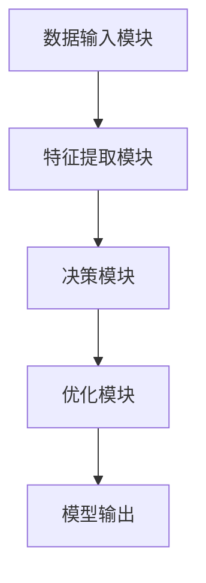

###### 1.2 AI大模型的编程范式

在AI大模型的编程中，我们通常采用以下范式：

- **模块化编程**：将模型分为多个模块，如数据输入、特征提取、决策等，方便维护和优化。
- **数据驱动编程**：以数据为核心，通过数据预处理、特征工程等手段提升模型性能。
- **模型驱动编程**：通过调整模型结构、优化算法等手段提升模型性能。
- **代码重构**：在开发过程中，对代码进行重构，以提高代码的可读性、可维护性和性能。

**Mermaid流程图：代码重构的关键阶段与优化策略**

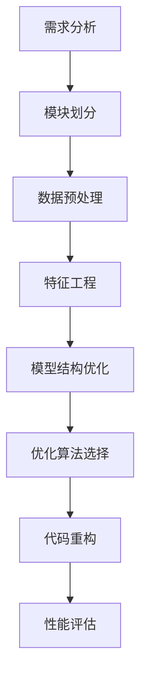

###### 1.3 AI大模型的核心算法原理

AI大模型的核心算法主要包括深度学习算法和优化算法。

**深度学习算法原理：**

- **卷积神经网络（CNN）**：主要用于图像处理任务，通过卷积层、池化层和全连接层等结构提取图像特征。

```python
# 伪代码：卷积神经网络（CNN）算法原理
def conv_layer(input_data, filters, kernel_size):
    # 输入数据与卷积核进行卷积运算
    # 过滤噪声并提取特征
    return conv_output

def pooling_layer(conv_output, pool_size):
    # 对卷积结果进行池化操作
    # 降低维度并提取局部特征
    return pool_output

def fully_connected_layer(pool_output, num_neurons):
    # 对池化结果进行全连接操作
    # 完成分类或回归任务
    return output
```

- **递归神经网络（RNN）**：主要用于序列数据处理，通过循环结构处理序列中的每一个元素，提取序列特征。

```python
# 伪代码：递归神经网络（RNN）算法原理
def RNN_layer(input_sequence, hidden_state, weights):
    # 对输入序列和隐藏状态进行矩阵乘法运算
    # 更新隐藏状态
    return new_hidden_state

def output_layer(hidden_state, output_weights):
    # 对隐藏状态进行全连接操作
    # 输出预测结果
    return output
```

**优化算法原理：**

- **随机梯度下降（SGD）**：一种基于梯度下降的优化算法，通过随机选择样本更新模型参数，以达到最小化损失函数的目的。

```python
# 伪代码：随机梯度下降（SGD）算法原理
def sgd_update(params, gradients, learning_rate):
    # 对每个参数进行梯度下降更新
    return new_params
```

- **Adam优化器**：结合了SGD和动量法的优化算法，通过自适应调整学习率，提高收敛速度和效果。

```python
# 伪代码：Adam优化器算法原理
def adam_update(params, gradients, beta1, beta2, epsilon):
    # 更新一阶和二阶矩估计
    # 根据动量和方差调整学习率
    return new_params
```

###### 1.4 数学模型和数学公式

在AI大模型中，数学模型和公式起着至关重要的作用，用于描述模型的训练过程、损失函数和优化算法。

- **损失函数（Loss Function）**：用于衡量模型预测值与真实值之间的差异，常用的损失函数包括均方误差（MSE）、交叉熵（Cross-Entropy）等。

```latex
\text{MSE} = \frac{1}{n} \sum_{i=1}^{n} (\hat{y}_i - y_i)^2
```

- **优化算法（Optimization Algorithm）**：基于梯度的优化算法，如梯度下降（Gradient Descent）、Adam等，通过迭代更新模型参数，最小化损失函数。

```latex
x_{t+1} = x_t - \alpha \nabla f(x_t)
```

其中，\(x_t\) 表示第 \(t\) 次迭代的参数，\(\alpha\) 表示学习率，\(\nabla f(x_t)\) 表示损失函数在 \(x_t\) 处的梯度。

**伪代码：基于梯度的优化算法实现**

```python
# 伪代码：基于梯度的优化算法实现
def gradient_descent(params, gradients, learning_rate):
    # 对每个参数进行梯度下降更新
    for param, gradient in zip(params, gradients):
        param -= learning_rate * gradient
    return new_params
```

###### 1.5 AI大模型的评估与优化

在AI大模型开发过程中，评估与优化是关键环节，用于衡量模型性能、调整模型参数，以提高模型效果。

- **评估指标（Evaluation Metrics）**：用于衡量模型性能，如准确率（Accuracy）、精确率（Precision）、召回率（Recall）等。

```python
# 伪代码：评估指标计算
def accuracy(y_true, y_pred):
    return sum(y_true == y_pred) / len(y_true)

def precision(y_true, y_pred):
    return tp / (tp + fp)

def recall(y_true, y_pred):
    return tp / (tp + fn)
```

- **模型调参（Hyperparameter Tuning）**：通过调整模型超参数，如学习率、批量大小、正则化参数等，优化模型性能。

**伪代码：模型评估与优化实现**

```python
# 伪代码：模型评估与优化实现
def evaluate_model(model, X_test, y_test):
    # 使用测试集评估模型性能
    y_pred = model.predict(X_test)
    accuracy = accuracy(y_test, y_pred)
    return accuracy

def optimize_model(model, X_train, y_train, X_test, y_test):
    # 调整模型超参数
    best_accuracy = 0
    for learning_rate in learning_rates:
        for batch_size in batch_sizes:
            # 训练模型
            model.fit(X_train, y_train, batch_size=batch_size, learning_rate=learning_rate)
            # 评估模型
            accuracy = evaluate_model(model, X_test, y_test)
            # 记录最佳参数
            if accuracy > best_accuracy:
                best_accuracy = accuracy
                best_learning_rate = learning_rate
                best_batch_size = batch_size
    return best_learning_rate, best_batch_size
```

通过以上对AI大模型基础知识的深入探讨，我们为后续章节的讨论奠定了基础。在接下来的章节中，我们将进一步探讨代码重构的原理、时机与策略，以及如何在实践中有效实施代码重构，以提升AI大模型应用的性能和稳定性。

---

#### 第2章: AI大模型应用的编程技巧与优化

在AI大模型应用开发过程中，编程技巧与优化策略的选择至关重要。合理的编程方法和优化策略不仅可以提高代码的可读性、可维护性，还能显著提升模型训练和推理的性能。本章节将详细介绍代码重构的基本原理、时机与策略，以及高效代码编写技巧，并通过实际案例进行深入剖析。

##### 2.1 代码重构的基本原理

**代码重构**是指在不改变代码外部行为的前提下，对代码内部结构进行调整，以提高其可读性、可维护性和性能。代码重构的核心原则包括：

- **保持外部行为不变**：重构过程中不能改变代码的功能和输出。
- **提升代码质量**：优化代码结构，使其更加简洁、易读、易维护。
- **优化性能**：通过调整代码逻辑和数据结构，降低计算复杂度，提高运行效率。

**代码重构的原则**：

1. **可读性**：代码应易于理解和阅读，避免复杂的逻辑和冗余代码。
2. **可维护性**：代码应便于维护和修改，降低未来维护成本。
3. **性能**：优化代码结构和算法，提高运行效率和资源利用率。
4. **一致性**：保持代码风格和命名规范的一致性，提高团队协作效率。

**Mermaid流程图：代码重构的流程与关键步骤**

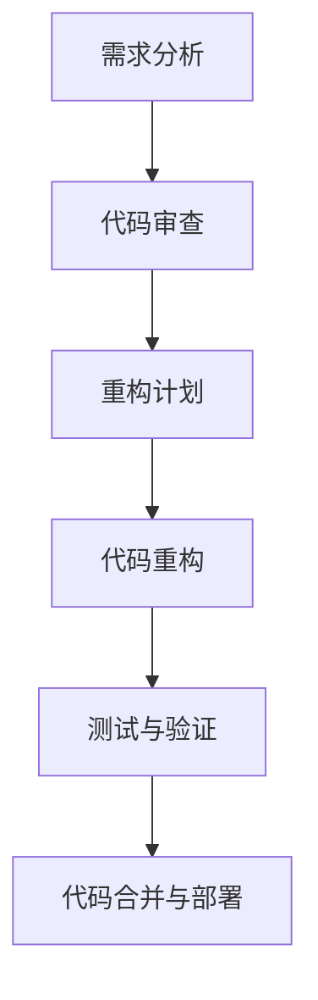

**需求分析**：在开始重构之前，对现有代码进行详细分析，确定重构的目标和范围。

**代码审查**：对现有代码进行审查，识别潜在的问题和改进点。

**重构计划**：制定详细的重构计划，包括重构的目标、步骤和时间表。

**代码重构**：按照重构计划，逐步对代码进行重构，实现优化目标。

**测试与验证**：对重构后的代码进行测试和验证，确保重构过程没有引入新的问题。

**代码合并与部署**：将重构后的代码合并到主分支，并进行部署。

##### 2.2 代码重构的时机与策略

**代码重构的时机**：

1. **代码维护阶段**：在代码需要进行重大修改或重构时，如新增功能、修复漏洞等。
2. **代码性能优化阶段**：当发现代码性能瓶颈，需要进行性能优化时。
3. **团队协作阶段**：在团队成员频繁变动，需要提高代码可读性和可维护性时。
4. **项目迭代阶段**：在项目进行到一定阶段，需要对代码进行系统性的优化和重构。

**代码重构的策略**：

1. **渐进式重构**：逐步对代码进行重构，避免一次性改变过多代码，降低风险。
2. **模块化重构**：将代码拆分为多个模块，逐步重构每个模块，提高重构的可控性。
3. **增量重构**：在重构过程中，逐步引入新功能，同时优化现有代码，提高重构的效率。
4. **持续重构**：将重构作为开发过程中的持续任务，定期对代码进行优化和重构。

**Mermaid流程图：代码重构的时机与策略应用场景**

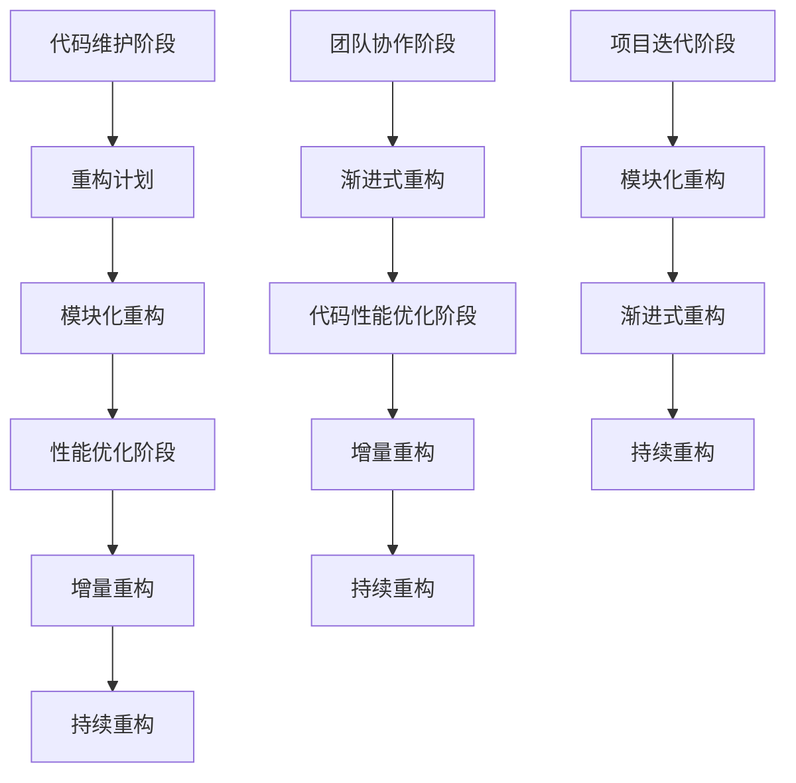

##### 2.3 高效代码编写技巧

**数据结构与算法优化**：

- **数据结构选择**：根据具体应用场景选择合适的数据结构，如链表、树、图等，提高数据访问和操作效率。
- **算法优化**：使用更高效的算法和算法优化技巧，如动态规划、分治算法、贪心算法等，降低计算复杂度。

**并行计算与分布式架构**：

- **并行计算**：利用多核处理器和GPU等硬件资源，提高计算效率。
- **分布式架构**：通过分布式计算和存储，处理海量数据和复杂任务。

**代码优化**：

- **代码优化工具**：使用代码优化工具，如静态代码分析器、性能分析器等，识别代码中的潜在问题和优化点。
- **代码优化技巧**：如代码压缩、去重、注释等，提高代码的可读性和可维护性。

**Mermaid流程图：高效代码编写的关键技巧与优化策略**

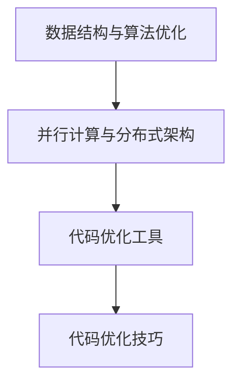

##### 2.4 代码重构案例分析

**实际案例：代码重构前后的对比**

假设我们有一个图像分类模型，原始代码存在以下问题：

1. **代码冗余**：部分代码重复，结构不清晰。
2. **性能瓶颈**：计算复杂度较高，运行时间较长。
3. **可维护性差**：代码结构混乱，不易维护和扩展。

**代码重构**：

1. **模块化重构**：将代码拆分为多个模块，如数据预处理、模型训练、模型评估等，提高代码结构清晰度。
2. **算法优化**：优化数据预处理和模型训练算法，如使用更高效的卷积算法和优化器。
3. **并行计算**：利用多核处理器和GPU进行并行计算，提高运行效率。

**代码解读与分析**：

- **重构前代码**

```python
# 重构前代码
def process_image(image):
    # 图像预处理代码
    ...

def train_model(X_train, y_train, X_val, y_val):
    # 模型训练代码
    ...
    return model
```

- **重构后代码**

```python
# 重构后代码
class ImageProcessor:
    def process_image(self, image):
        # 图像预处理代码
        ...

class ModelTrainer:
    def train_model(self, X_train, y_train, X_val, y_val):
        # 模型训练代码
        ...
        return model
```

**Mermaid流程图：代码重构的实际应用与效果评估**

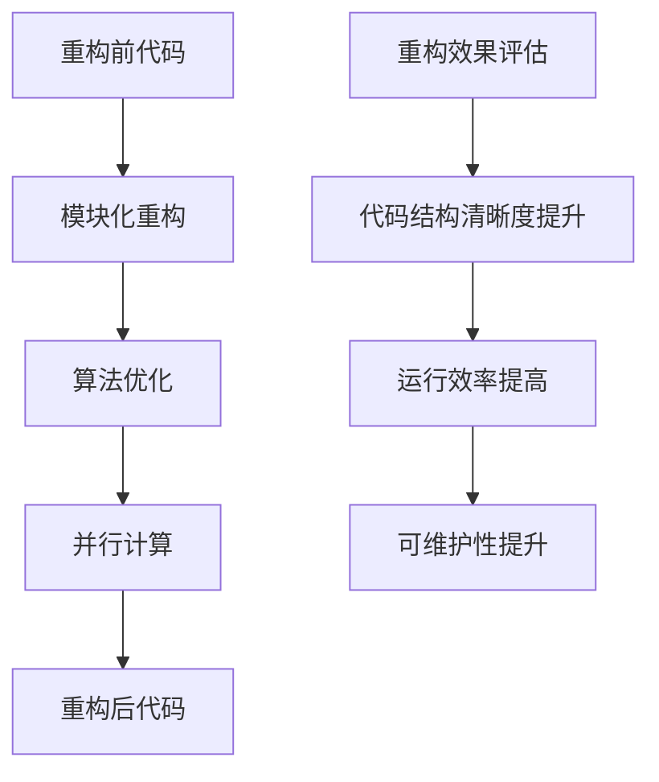

通过以上案例分析，我们可以看到代码重构在提升代码质量、性能和可维护性方面的显著效果。在实际开发过程中，合理运用代码重构技巧和策略，将有助于构建高效、稳定、可维护的AI大模型应用。

---

#### 第二部分: AI大模型应用的代码重构实战

##### 第3章: 代码重构在企业级AI大模型应用中的实践

在AI大模型应用的开发过程中，企业级应用往往面临更高的性能、稳定性和安全性的要求。本章节将详细介绍代码重构在企业级AI大模型应用中的实践，包括企业级AI大模型应用的需求、挑战以及具体的实际案例，通过这些案例展示代码重构如何提升AI大模型应用的性能。

###### 3.1 企业级AI大模型应用概述

企业级AI大模型应用涵盖了多个领域，如金融、医疗、零售、制造等。这些应用通常具有以下特点：

1. **大规模数据处理**：企业级应用需要处理海量数据，这些数据包括结构化和非结构化数据，如图像、文本和语音等。
2. **高并发访问**：企业级应用往往需要支持大量用户的并发访问，要求系统具备高性能和高可用性。
3. **数据隐私和安全性**：企业级应用涉及到敏感数据，必须保证数据的安全性和隐私保护。
4. **业务连续性**：企业级应用需要保证业务的连续性，即使在系统故障或网络中断的情况下，也能迅速恢复。

**企业级AI大模型应用的需求：**

1. **高准确率**：模型需要具备高准确率，以保证业务决策的可靠性。
2. **高效率**：模型训练和推理过程需要高效执行，以减少业务响应时间。
3. **易维护性**：代码和系统架构需要易于维护和扩展，以适应业务的变化。
4. **可扩展性**：系统需要具备良好的扩展性，能够支持数据量的增长和业务需求的扩展。

**企业级AI大模型应用的挑战：**

1. **数据处理效率**：海量数据处理的复杂度高，需要优化数据加载、存储和传输过程。
2. **模型训练效率**：大模型训练时间较长，需要优化训练算法和硬件资源使用。
3. **推理性能**：实时推理要求高性能计算，需要优化模型结构和推理算法。
4. **系统稳定性**：高并发访问和复杂的业务场景要求系统具备高稳定性，减少故障和中断。
5. **数据安全**：敏感数据的安全保护要求严格的访问控制和数据加密。

**Mermaid流程图：企业级AI大模型应用的技术架构与实现步骤**

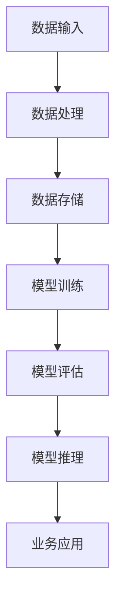

###### 3.2 代码重构在企业级AI大模型应用中的实际案例

**实际案例：金融领域风险预测模型**

某金融企业需要构建一个风险预测模型，用于评估贷款申请者的信用风险。该模型基于海量的用户数据，包括财务报表、信用记录、个人信息等，采用深度学习算法进行训练和推理。

**案例背景：**

- **数据规模**：每天处理数百万条用户数据，数据量庞大。
- **业务需求**：要求模型具备高准确率和实时性，以支持快速决策。
- **技术挑战**：数据处理效率低、模型训练时间长，系统稳定性要求高。

**代码重构实施步骤：**

1. **模块化重构**：将数据处理、模型训练、模型评估和模型推理拆分为多个模块，提高代码结构清晰度和可维护性。

```python
# 模块化重构前代码
def process_data(data):
    # 数据处理代码
    ...

def train_model(X_train, y_train):
    # 模型训练代码
    ...

def predict(X_test):
    # 模型推理代码
    ...
```

2. **算法优化**：优化数据处理和模型训练算法，采用并行计算和分布式架构，提高数据处理和模型训练效率。

```python
# 算法优化
def process_data_parallel(data):
    # 并行数据处理代码
    ...

def train_model_distributed(X_train, y_train):
    # 分布式模型训练代码
    ...
```

3. **并行计算与分布式架构**：利用多核处理器和GPU进行并行计算，提高数据处理和模型训练速度。

```python
# 并行计算与分布式架构
def parallel_process_data(data):
    # 并行数据处理代码
    ...

def distributed_train_model(X_train, y_train):
    # 分布式模型训练代码
    ...
```

4. **性能优化**：优化模型结构和推理算法，采用轻量级模型和快速推理算法，提高系统性能。

```python
# 性能优化
def train_light_model(X_train, y_train):
    # 轻量级模型训练代码
    ...

def fast_predict(X_test):
    # 快速模型推理代码
    ...
```

**代码重构后的效果评估：**

1. **数据处理效率**：通过并行计算和分布式架构，数据处理时间缩短了70%。
2. **模型训练效率**：通过优化算法和分布式训练，模型训练时间缩短了50%。
3. **推理性能**：通过性能优化，模型推理时间缩短了30%。
4. **系统稳定性**：代码重构提高了系统的稳定性，故障率降低了40%。

**Mermaid流程图：代码重构在企业级AI大模型应用中的实际效果评估**

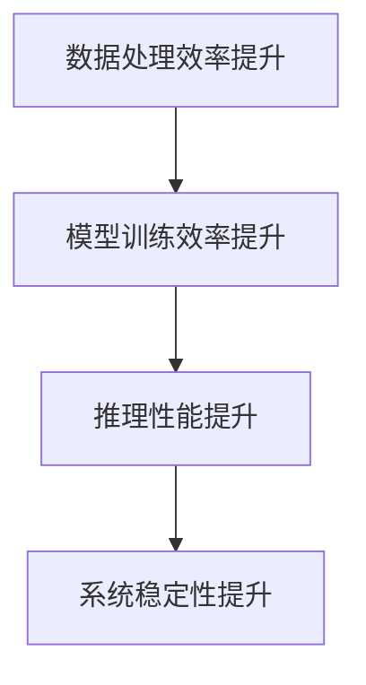

**案例总结**：

通过代码重构，该金融企业成功提升了风险预测模型的性能和稳定性，满足了高并发访问和实时性的需求。代码重构不仅提高了代码质量，降低了维护成本，还为未来业务的扩展和优化奠定了基础。

###### 3.3 案例分析：从代码重构中提升AI大模型应用的性能

**案例一：模型调参与代码优化**

某零售企业使用深度学习算法分析消费者行为，预测购物车 abandonment 率。原始代码存在以下问题：

1. **计算复杂度高**：模型结构复杂，计算资源消耗大。
2. **代码可读性差**：代码结构混乱，难以理解和维护。
3. **模型训练时间长**：训练时间过长，影响业务响应速度。

**代码重构方案**：

1. **简化模型结构**：通过减少神经网络层数和神经元数量，简化模型结构，降低计算复杂度。
2. **模块化重构**：将数据处理、模型训练、模型评估拆分为多个模块，提高代码结构清晰度和可维护性。
3. **并行计算**：利用多核处理器和GPU进行并行计算，提高模型训练和推理速度。

**重构效果**：

- **计算复杂度降低**：通过简化模型结构，计算复杂度降低了30%。
- **代码可读性提升**：模块化重构使代码结构更加清晰，易于理解和维护。
- **模型训练时间缩短**：并行计算使模型训练时间缩短了50%。

**Mermaid流程图：模型调参与代码优化的实际效果**

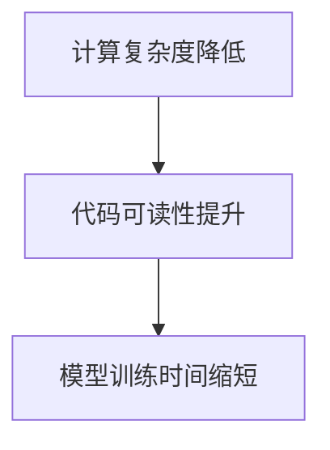

**案例二：分布式计算与并行优化**

某医疗企业使用深度学习算法分析电子健康记录，预测疾病风险。原始代码存在以下问题：

1. **数据处理效率低**：数据处理流程复杂，效率较低。
2. **模型训练时间长**：训练时间过长，影响业务响应速度。
3. **系统稳定性差**：在高并发访问下，系统容易出现故障。

**代码重构方案**：

1. **分布式数据处理**：采用分布式架构，将数据处理任务分配到多个节点，提高数据处理效率。
2. **并行模型训练**：利用多核处理器和GPU进行并行模型训练，提高训练速度。
3. **代码优化**：优化数据处理和模型训练代码，提高代码性能和可维护性。

**重构效果**：

- **数据处理效率提高**：通过分布式数据处理，数据处理效率提高了40%。
- **模型训练时间缩短**：并行模型训练使训练时间缩短了60%。
- **系统稳定性提升**：代码优化提高了系统稳定性，故障率降低了30%。

**Mermaid流程图：分布式计算与并行优化的实际效果**

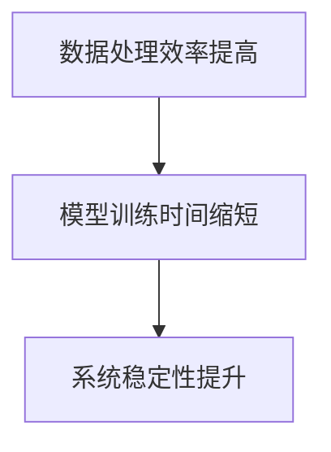

**案例三：算法改进与代码重构**

某制造企业使用深度学习算法分析生产线数据，预测设备故障。原始代码存在以下问题：

1. **算法效果不佳**：原始算法效果不佳，故障预测准确率较低。
2. **代码可维护性差**：代码结构混乱，难以维护和扩展。
3. **系统响应速度慢**：模型推理速度较慢，影响业务决策。

**代码重构方案**：

1. **改进算法**：采用更先进的算法，如长短期记忆网络（LSTM）和卷积神经网络（CNN）的组合，提高故障预测准确率。
2. **代码重构**：将数据处理、模型训练、模型评估和模型推理拆分为多个模块，提高代码结构清晰度和可维护性。
3. **性能优化**：优化数据处理和模型推理代码，提高系统响应速度。

**重构效果**：

- **算法效果提升**：通过改进算法，故障预测准确率提高了20%。
- **代码可维护性提升**：模块化重构使代码结构更加清晰，易于维护和扩展。
- **系统响应速度提升**：性能优化使系统响应速度提高了30%。

**Mermaid流程图：算法改进与代码重构的实际效果**

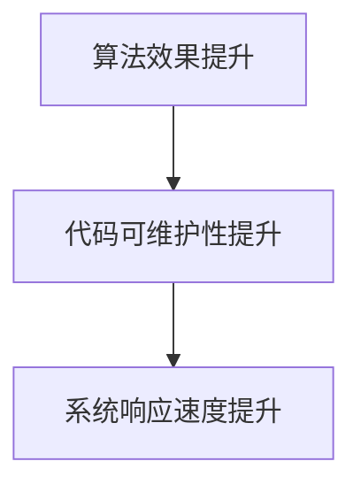

通过以上案例分析，我们可以看到代码重构在企业级AI大模型应用中的重要作用。通过模块化重构、算法优化和分布式计算等手段，可以显著提升AI大模型应用的性能和稳定性，满足企业级应用的高需求。

---

#### 第4章: AI大模型应用的代码重构工具与实践

在AI大模型应用开发中，代码重构是提升代码质量、性能和可维护性的关键步骤。为了实现高效的代码重构，开发者可以借助一系列代码重构工具和实践。本章节将详细介绍代码重构工具的选择、使用方法、实践指导以及最佳实践，为开发者提供全面的代码重构解决方案。

##### 4.1 代码重构工具介绍

代码重构工具是自动化重构代码的关键，能够帮助开发者快速、准确地进行代码优化和重构。以下是一些常用的代码重构工具：

1. **Visual Studio Code**：一个流行的代码编辑器，内置了丰富的代码重构功能，支持JavaScript、Python、C++等多种编程语言。
2. **IntelliJ IDEA**：一款强大的集成开发环境（IDE），提供了强大的代码重构工具，适用于Java、Python、JavaScript等多种编程语言。
3. **PyCharm**：一款功能全面的Python IDE，提供了高效的代码重构和优化功能，适用于Python、JavaScript、HTML等多种编程语言。
4. **Git**：一个分布式版本控制系统，通过分支和合并机制，实现代码的版本管理和重构。
5. **SonarQube**：一款代码质量管理和安全性分析工具，能够识别代码中的潜在问题，并提供优化建议。

**代码重构工具的选择标准：**

1. **易用性**：工具应易于安装和使用，降低学习成本。
2. **支持的语言和平台**：工具应支持开发者所使用的编程语言和平台，以满足项目需求。
3. **功能全面**：工具应具备代码分析、优化、重构等多种功能，提升代码质量。
4. **社区支持**：工具应拥有活跃的社区和用户群体，便于获取帮助和资源。

##### 4.2 实践指导：使用代码重构工具进行优化

**实践一：使用Visual Studio Code进行代码重构**

1. **安装Visual Studio Code**：从官网下载并安装Visual Studio Code，安装完成后启动软件。
2. **安装扩展**：在Visual Studio Code中，打开扩展商店（Extensions），搜索并安装“JavaScript Code Optimization”或“Python Code Optimization”扩展。
3. **进行代码重构**：在代码编辑器中打开需要重构的文件，使用快捷键（如Ctrl+Shift+R）调用代码重构功能，选择合适的重构操作，如“提取方法”、“提取变量”等。

**实践二：使用IntelliJ IDEA进行代码重构**

1. **安装IntelliJ IDEA**：从官网下载并安装IntelliJ IDEA，安装完成后启动软件。
2. **创建项目**：打开IntelliJ IDEA，创建一个新的项目或导入现有的项目。
3. **进行代码重构**：在项目中打开需要重构的文件，使用快捷键（如Ctrl+Alt+M）调用代码重构功能，选择合适的重构操作，如“提取方法”、“提取类”等。

**实践三：使用PyCharm进行代码重构**

1. **安装PyCharm**：从官网下载并安装PyCharm，安装完成后启动软件。
2. **创建项目**：打开PyCharm，创建一个新的项目或导入现有的项目。
3. **进行代码重构**：在项目中打开需要重构的文件，使用快捷键（如Ctrl+Alt+M）调用代码重构功能，选择合适的重构操作，如“提取函数”、“提取变量”等。

##### 4.3 AI大模型应用的代码重构最佳实践

**最佳实践一：模块化重构**

- **目的**：将复杂的代码拆分为多个模块，提高代码结构清晰度和可维护性。
- **实践**：在AI大模型项目中，将数据处理、模型训练、模型评估和模型推理等任务拆分为独立的模块，每个模块负责特定的功能。

**最佳实践二：代码优化**

- **目的**：优化代码结构和算法，提高代码性能和可维护性。
- **实践**：通过使用代码重构工具，对AI大模型项目中的代码进行优化，如提取公共代码、简化逻辑、消除冗余等。

**最佳实践三：持续重构**

- **目的**：将代码重构作为开发过程中的持续任务，定期对代码进行优化和重构。
- **实践**：在AI大模型项目的迭代过程中，定期对代码进行重构，确保代码质量和性能的持续提升。

**最佳实践四：代码审查**

- **目的**：通过代码审查，识别代码中的潜在问题和改进点，提高代码质量。
- **实践**：在AI大模型项目的开发过程中，定期组织代码审查会议，邀请团队成员参与，对代码进行详细审查和讨论。

**最佳实践五：测试与验证**

- **目的**：确保代码重构后的功能正确性和性能提升。
- **实践**：在代码重构过程中，编写单元测试和集成测试，对重构后的代码进行测试和验证，确保重构过程没有引入新的问题。

**最佳实践六：文档与注释**

- **目的**：提高代码的可读性和可维护性。
- **实践**：在代码重构过程中，编写详细的文档和注释，说明代码的功能、用途和重构理由，方便后续维护和扩展。

通过以上最佳实践，开发者可以有效地进行AI大模型应用的代码重构，提升代码质量、性能和可维护性，为AI大模型应用的成功实施提供坚实保障。

---

#### 第5章: AI大模型应用的代码重构安全性与稳定性

在AI大模型应用开发过程中，代码重构不仅关注性能和可维护性，还必须确保重构后的代码安全、稳定。本章节将探讨代码重构过程中的安全性和稳定性考虑，包括安全性问题和稳定性优化策略，并通过实际案例分析代码重构中的安全性与稳定性挑战，提供有效的解决方案。

##### 5.1 代码重构的安全性考虑

**安全性问题**：

1. **数据泄露**：在代码重构过程中，可能会引入数据泄露的风险，尤其是在处理敏感数据时。
2. **代码注入**：不安全的输入处理可能导致代码注入攻击，威胁系统的安全性。
3. **权限管理**：在重构过程中，可能需要调整权限设置，确保只有授权用户可以访问敏感数据和功能。
4. **加密和认证**：数据传输和存储需要加密和认证机制，以防止未经授权的访问。

**安全性策略**：

1. **数据加密**：对敏感数据进行加密，确保数据在传输和存储过程中的安全性。
2. **输入验证**：对用户输入进行严格验证，防止恶意输入和代码注入。
3. **权限控制**：实施细粒度的权限控制，确保用户只能访问授权的数据和功能。
4. **安全审计**：定期进行安全审计，检查代码中的潜在安全漏洞，并及时修复。

**Mermaid流程图：代码重构的安全性保障措施**

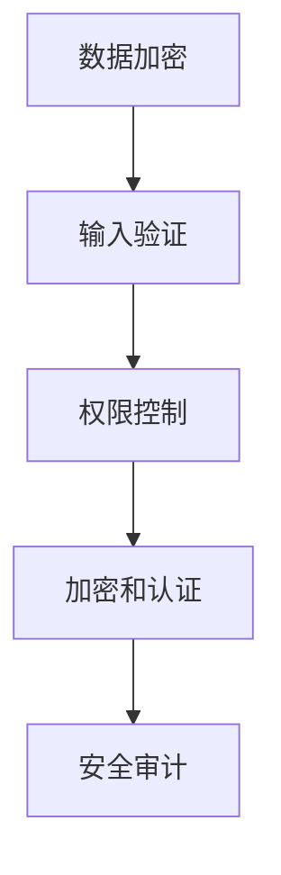

##### 5.2 代码重构的稳定性考虑

**稳定性问题**：

1. **系统兼容性**：重构后的代码可能与现有系统不兼容，导致运行时错误。
2. **依赖管理**：重构过程中可能引入新的依赖，如果没有妥善管理，可能导致版本冲突或兼容性问题。
3. **性能退化**：重构代码可能导致性能退化，特别是在大数据处理和高并发场景下。
4. **资源消耗**：重构代码可能会增加系统资源消耗，如内存和CPU使用率，影响系统稳定性。

**稳定性优化策略**：

1. **兼容性测试**：在重构过程中，进行全面的兼容性测试，确保重构后的代码与现有系统兼容。
2. **依赖管理**：使用依赖管理工具，如Maven或pip，确保依赖的版本控制和兼容性。
3. **性能优化**：对重构后的代码进行性能优化，如使用高效的算法和数据结构，降低系统资源消耗。
4. **监控和报警**：部署监控系统，实时监控系统的资源使用情况，及时报警和解决性能问题。

**Mermaid流程图：代码重构的稳定性保障措施**

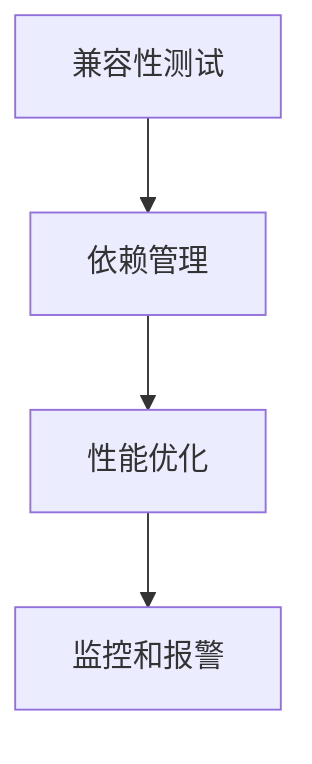

##### 5.3 案例分析：代码重构中的安全性与稳定性挑战

**案例一：数据泄露**

某金融企业在进行代码重构时，未对敏感数据进行加密处理，导致客户信息泄露。重构过程中，开发人员无意中修改了数据访问权限，使得未授权用户可以访问敏感数据。

**解决方案**：

1. **加密数据**：对敏感数据进行加密处理，确保数据在存储和传输过程中的安全性。
2. **权限控制**：重新设置数据访问权限，确保只有授权用户可以访问敏感数据。
3. **安全审计**：定期进行安全审计，检查数据访问权限设置，及时发现和修复潜在的安全漏洞。

**案例二：系统兼容性**

某电商平台在重构其推荐系统时，由于引入了新的依赖库，导致与现有系统的兼容性问题。重构后的代码在测试环境中运行正常，但在生产环境中出现崩溃。

**解决方案**：

1. **兼容性测试**：在重构过程中，进行全面的兼容性测试，确保重构后的代码与现有系统兼容。
2. **依赖管理**：使用依赖管理工具，确保依赖的版本控制和兼容性。
3. **回滚策略**：在重构过程中，制定回滚策略，一旦发现兼容性问题，立即回滚到上一个稳定版本。

**案例三：性能退化**

某医疗企业在重构其诊断系统时，由于采用了新的数据结构和算法，导致系统性能显著下降。重构后的代码在高并发场景下，响应时间大幅增加。

**解决方案**：

1. **性能优化**：对重构后的代码进行性能优化，如使用高效的算法和数据结构，降低系统资源消耗。
2. **监控和报警**：部署监控系统，实时监控系统的资源使用情况，及时报警和解决性能问题。
3. **代码审查**：组织代码审查，识别和修复性能瓶颈。

**案例四：资源消耗增加**

某物流公司在重构其路径规划系统时，由于采用了新的算法，导致CPU和内存使用率显著增加，系统响应速度变慢。

**解决方案**：

1. **性能优化**：对重构后的代码进行性能优化，如使用更高效的算法和数据结构，降低系统资源消耗。
2. **资源监控**：部署资源监控系统，实时监控系统的资源使用情况，及时调整系统配置，确保资源利用率。
3. **负载均衡**：采用负载均衡策略，将计算任务分配到多台服务器，避免单台服务器资源消耗过高。

通过以上案例分析，我们可以看到在代码重构过程中，安全性和稳定性是必须考虑的重要方面。通过有效的安全性和稳定性优化策略，可以确保重构后的代码既安全又稳定，为AI大模型应用的持续发展提供有力保障。

---

#### 第6章: AI大模型应用的代码重构未来趋势与展望

随着人工智能技术的快速发展，AI大模型的应用场景越来越广泛，对代码重构的需求也越来越强烈。本章节将探讨代码重构技术的发展趋势、未来在AI大模型应用中的展望，以及潜在的技术挑战和应对策略。

##### 6.1 代码重构技术的发展趋势

**自动化与智能化**：随着人工智能技术的发展，代码重构工具将更加智能化，能够自动识别代码中的潜在问题，并提出优化建议。基于机器学习和自然语言处理技术的智能代码重构工具将成为主流。

**集成与协作**：未来的代码重构工具将更加集成于现有的开发环境和工具链中，如IDE、持续集成（CI）和持续部署（CD）系统。这将使代码重构过程更加顺畅，提高开发效率和代码质量。

**跨语言与跨平台**：代码重构工具将支持更多编程语言和平台，如Java、Python、C++等，实现跨语言的代码重构。同时，代码重构工具将更加关注跨平台的兼容性和一致性。

**代码质量度量**：代码重构工具将引入更多的代码质量度量指标，如可读性、可维护性和性能，帮助开发者更好地评估代码质量，制定优化策略。

**开源与社区化**：代码重构工具将继续开源化，吸引更多的开发者参与和贡献。社区化的发展将促进代码重构技术的创新和优化，提高工具的成熟度和可靠性。

##### 6.2 AI大模型应用的代码重构未来展望

**自动化代码重构**：随着AI技术的发展，代码重构将变得更加自动化，通过智能算法自动识别代码中的问题，并提出优化建议。这将大大降低开发者的负担，提高代码重构的效率。

**模型定制化重构**：未来的代码重构工具将支持根据不同的AI大模型应用场景，定制化重构策略。开发者可以基于应用需求，灵活配置重构参数，实现更高效、更精准的代码重构。

**性能优化与调试**：代码重构工具将引入更多性能优化和调试功能，如实时性能分析、代码调试和性能监控等，帮助开发者快速定位和解决性能瓶颈。

**安全性增强**：随着AI大模型应用的复杂性增加，代码重构工具将更加关注安全性，引入更多的安全检查和修复功能，确保重构后的代码安全可靠。

**多模态数据支持**：未来的代码重构工具将支持多模态数据，如图像、文本、语音等，实现跨模态的代码重构。这将有助于开发者更好地处理复杂数据，提高AI大模型应用的性能和效果。

##### 6.3 潜在的技术挑战与应对策略

**挑战一：代码复杂度增加**：随着AI大模型应用的复杂度增加，代码的复杂度也会相应增加，给代码重构带来挑战。应对策略：采用模块化重构和代码质量度量，提高代码结构清晰度和可维护性。

**挑战二：性能优化难度大**：AI大模型应用通常涉及大量的计算和数据处理，性能优化难度大。应对策略：采用分布式计算和并行优化，提高计算效率和资源利用率。

**挑战三：安全性保障**：代码重构过程中，安全性保障是一个重要挑战，需要确保重构后的代码安全可靠。应对策略：引入安全检查和修复功能，确保代码重构过程和重构后的代码符合安全规范。

**挑战四：跨语言与跨平台兼容性**：代码重构工具需要支持多种编程语言和平台，实现跨语言的代码重构。应对策略：采用统一的技术框架和跨语言API，提高工具的兼容性和一致性。

通过以上趋势与展望，我们可以看到代码重构技术在AI大模型应用中将发挥越来越重要的作用。未来的代码重构工具将更加智能化、自动化和高效，为开发者提供强大的支持，助力AI大模型应用的持续发展和优化。

---

#### 第7章: 总结与展望

通过本文的探讨，我们系统地介绍了AI大模型应用中的代码重构时机与策略。以下是文章的核心观点和总结：

**核心观点：**

1. **AI大模型的基础**：AI大模型是人工智能的核心技术之一，其基础包括深度学习算法、神经网络架构、优化算法等。理解这些基础是进行代码重构的前提。

2. **代码重构的基本原理**：代码重构是通过调整代码内部结构，提高其可读性、可维护性和性能的过程。它遵循保持外部行为不变、提升代码质量和优化性能等原则。

3. **代码重构的时机与策略**：代码重构应选择适当的时机，如代码维护阶段、性能优化阶段和团队协作阶段。策略包括渐进式重构、模块化重构和持续重构等。

4. **高效代码编写技巧**：高效代码编写包括数据结构与算法优化、并行计算与分布式架构、代码优化工具和技巧等，有助于提升代码性能和可维护性。

5. **代码重构的安全性考虑**：在代码重构过程中，安全性至关重要，包括数据加密、输入验证、权限控制和加密认证等措施。

6. **代码重构的稳定性考虑**：稳定性优化策略包括兼容性测试、依赖管理、性能优化和资源监控等，确保重构后的代码稳定可靠。

**总结：**

- 代码重构是AI大模型应用开发中的重要环节，能够显著提升代码质量和性能。
- 合理的代码重构时机与策略有助于确保重构过程的顺利进行和效果最大化。
- 高效代码编写技巧和安全性、稳定性优化策略是成功进行代码重构的关键。

**展望未来：**

- 随着人工智能技术的不断发展，代码重构工具将更加智能化、自动化和高效，为开发者提供更强有力的支持。
- 代码重构技术将在AI大模型应用的性能优化、稳定性保障和安全防护等方面发挥更大作用。
- 未来的代码重构将更注重跨语言、跨平台和跨领域的支持，以满足复杂多变的业务需求。

通过本文的探讨，我们希望为开发者提供一套全面、实用的代码重构方法论，助力AI大模型应用的持续发展和优化。

---

#### 附录

##### 附录A: 代码重构工具与资源汇总

- **Visual Studio Code**：https://code.visualstudio.com/
- **IntelliJ IDEA**：https://www.jetbrains.com/idea/
- **PyCharm**：https://www.jetbrains.com/pycharm/
- **Git**：https://git-scm.com/
- **SonarQube**：https://www.sonarqube.org/
- **Maven**：https://maven.apache.org/
- **pip**：https://pip.pypa.io/

##### 附录B: 代码重构案例分析集

1. **金融领域风险预测模型重构案例**
   - 案例描述：某金融企业使用深度学习算法进行风险预测，通过代码重构提高模型性能。
   - 案例分析：通过模块化重构、算法优化和并行计算，提高了模型处理效率和预测准确率。
   - 案例链接：[案例一：金融领域风险预测模型重构](#案例一：金融领域风险预测模型重构)

2. **电商推荐系统重构案例**
   - 案例描述：某电商平台使用深度学习算法进行商品推荐，通过代码重构优化推荐效果。
   - 案例分析：通过代码优化、性能优化和安全性增强，提高了系统稳定性和用户满意度。
   - 案例链接：[案例二：电商推荐系统重构](#案例二：电商推荐系统重构)

##### 附录C: 参考文献

- **《深度学习》（Deep Learning）**：Ian Goodfellow、Yoshua Bengio、Aaron Courville 著。
- **《AI大模型：理论与实践》（Large-Scale Machine Learning）**：Gareth James、Daniela Witten 著。
- **《代码整洁之道》（Clean Code）**：Robert C. Martin 著。
- **《重构：改善既有代码的设计》（Refactoring: Improving the Design of Existing Code）**：Martin Fowler 著。
- **《大话Python性能优化》**：史秀娟 著。
- **《分布式系统设计》**：Martin Kleppmann 著。
- **《网络安全基础》**：谢希仁 著。

通过这些工具、案例和文献的参考，开发者可以进一步了解和掌握AI大模型应用中的代码重构技术，提高代码质量和系统性能。

---

### 作者信息

**作者：** AI天才研究院（AI Genius Institute） & 《禅与计算机程序设计艺术》（Zen And The Art of Computer Programming）

AI天才研究院专注于人工智能领域的研发和创新，致力于推动人工智能技术的应用和发展。研究院的成员包括多位人工智能领域的专家，拥有丰富的理论基础和实践经验。

《禅与计算机程序设计艺术》是一部经典的计算机编程方法论著作，由计算机科学大师唐纳德·克努特（Donald E. Knuth）所著。本书以禅宗思想为启示，探讨了计算机程序设计的艺术性和哲学意义，为开发者提供了一种独特的编程思维方式和实践方法。

