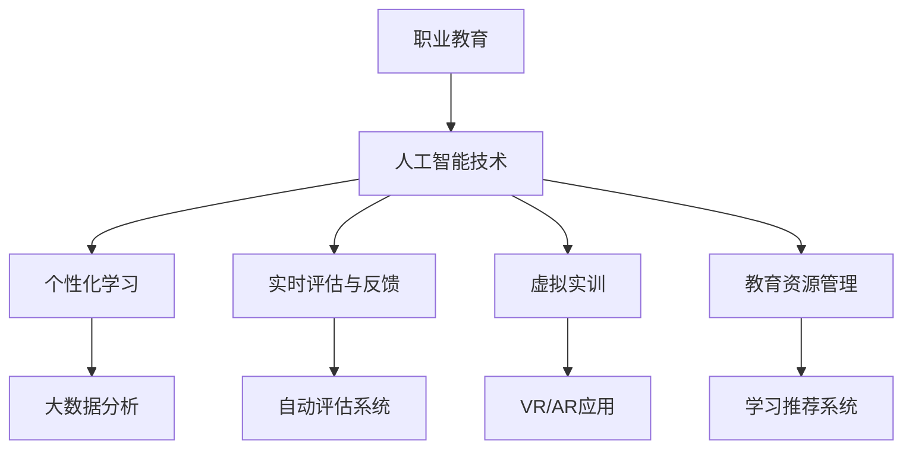

                 

# AI技术的就业影响应对：职业教育和终身学习体系

> 关键词：人工智能、就业影响、职业教育、终身学习、技能提升、数字化转型

> 摘要：随着人工智能技术的迅速发展，其对就业市场产生了深远的影响。本文首先概述了AI技术对就业市场的积极和消极影响，然后深入探讨了职业教育和终身学习体系在应对AI技术就业影响中的作用。通过分析职业教育的发展历程、模式、创新实践，以及终身学习的概念、模式与策略，本文提出了AI技术就业影响的应对策略。最后，通过项目实战和案例研究，展示了职业教育和终身学习体系在实践中的应用，为未来发展和实施提供了参考。

### 第一部分: AI技术的就业影响应对基础

#### 第1章: AI技术的就业影响概述

##### 1.1 AI技术发展的背景与现状

人工智能技术（AI）是计算机科学的一个重要分支，旨在使机器能够模拟、延伸和扩展人类的智能行为。AI技术的发展可以追溯到20世纪50年代，但真正的大规模突破是在21世纪初，随着计算能力的提升和数据量的爆炸性增长。近年来，深度学习、自然语言处理、计算机视觉等AI子领域的迅猛发展，使得AI技术在全球范围内得到了广泛应用。

当前，AI技术在多个行业和领域取得了显著成果，如自动驾驶、智能客服、金融分析、医疗诊断等。根据市场研究机构的数据，全球AI市场预计将在未来几年内保持高速增长，AI技术的普及和应用将进一步扩大。

##### 1.1.1 人工智能技术的历史背景

人工智能（AI）的起源可以追溯到20世纪50年代，当时科学家们开始探讨如何让计算机模拟人类的智能行为。1950年，艾伦·图灵提出了著名的图灵测试，旨在判断机器是否具有人类智能。随后，1956年达特茅斯会议上，约翰·麦卡锡等科学家正式提出了“人工智能”这一概念，标志着AI研究的正式开始。

在随后的几十年中，AI经历了多次起伏。70年代，由于算法复杂性和计算能力的限制，AI研究进入低谷期。然而，随着计算技术的进步，特别是在21世纪初，AI研究再次迎来了爆发式的发展。

##### 1.1.2 AI技术的发展现状

近年来，AI技术取得了许多突破性进展。深度学习作为AI的核心技术之一，通过多层神经网络模型，能够从大量数据中自动学习和提取特征，实现了在图像识别、语音识别、自然语言处理等领域的卓越表现。同时，自然语言处理技术也取得了显著进展，例如谷歌的BERT模型和OpenAI的GPT系列模型，使得机器在理解和生成自然语言方面达到了前所未有的水平。

除了这些核心技术，AI在应用领域也取得了广泛的成功。自动驾驶汽车、智能家居、智能医疗等应用场景不断涌现，推动了AI技术的商业化进程。据市场研究机构的预测，AI技术将在未来几年内继续扩展到更多行业和领域，进一步改变人们的生产生活方式。

##### 1.1.3 AI技术对就业市场的潜在影响

AI技术的发展对就业市场产生了深远的影响。一方面，AI技术推动了新职业的诞生，如数据科学家、机器学习工程师、AI产品经理等。这些新职业需要高度专业化的技能和知识，为求职者提供了新的就业机会。另一方面，AI技术也导致了一些传统职业的消失或转变。例如，自动化技术的大量应用使得一些低技能岗位的就业机会减少，而数据分析和机器学习等高技能岗位的需求增加。

此外，AI技术还加剧了劳动力市场的不稳定性。由于AI技术的快速发展，职业技能的更新速度加快，劳动者需要不断学习新的技能以保持竞争力。这种技能迭代的需求使得就业市场更加动态化，对劳动者的适应能力和学习能力提出了更高的要求。

总之，AI技术对就业市场的影响是复杂而多层次的，既带来了新的机遇，也带来了挑战。为了应对这些影响，需要采取有效的职业教育和终身学习策略，帮助劳动者适应和利用AI技术的发展。

##### 1.2 AI技术的主要领域与应用场景

AI技术涵盖了多个领域，包括机器学习、深度学习、计算机视觉、自然语言处理等。这些技术在不同行业和应用场景中发挥着重要作用，推动了行业变革和生产力提升。

首先，机器学习是AI的核心技术之一，它使计算机能够从数据中学习并做出决策。在金融领域，机器学习技术被广泛应用于风险管理、欺诈检测和投资策略优化。通过分析大量的历史数据，机器学习算法能够预测市场趋势和用户行为，从而提高金融决策的准确性和效率。

其次，深度学习通过多层神经网络模型，实现了从数据中自动学习和提取特征的能力。在图像识别和语音识别领域，深度学习技术取得了显著突破。例如，人脸识别技术已经成为许多安全系统和移动应用的核心功能，而语音识别技术则使得智能助手和语音控制应用得以广泛应用。

计算机视觉是AI技术的重要分支，它使计算机能够理解和解释视觉信息。在制造业中，计算机视觉技术被用于质量检测、设备故障预测和自动化控制。通过实时监测生产线上的设备状态，计算机视觉系统能够及时发现并纠正问题，提高生产效率。

自然语言处理技术则专注于理解和生成人类语言。在智能客服和智能问答系统中，自然语言处理技术使得计算机能够理解用户的问题并给出合理的回答。这种技术的应用不仅提高了服务效率，还减少了人力成本，为企业创造了更多价值。

除了上述领域，AI技术还在医疗诊断、医疗影像分析、医疗决策支持等方面发挥着重要作用。通过结合大数据和机器学习技术，AI系统能够对医疗数据进行分析，提供更准确的诊断结果和治疗方案。

总的来说，AI技术在各个领域和场景中的应用，不仅提高了生产效率和创新能力，还为经济发展注入了新动能。然而，AI技术的快速发展也带来了劳动力市场的变革，对劳动者的技能要求提出了新的挑战。为了应对这些挑战，需要不断推动职业教育和终身学习，帮助劳动者适应和利用AI技术的发展。

##### 1.3 职业教育与终身学习体系的重要性

职业教育和终身学习在应对AI技术就业影响中扮演着至关重要的角色。随着AI技术的不断进步，劳动力市场正经历深刻变革，传统职业的消失和新兴职业的诞生使得劳动者需要不断更新和提升自己的技能。职业教育和终身学习体系为此提供了重要的支持和保障。

首先，职业教育是指通过教育和培训，帮助劳动者获得特定职业技能和知识，以适应就业市场的需求。职业教育不仅包括传统的职业学校教育，还涵盖了职业培训、技能认证等多种形式。通过职业教育的系统学习和实践，劳动者能够掌握行业前沿的技术和知识，提高自身的就业竞争力。

其次，终身学习是一种持续的学习过程，旨在帮助劳动者在整个职业生涯中不断提升自己的知识和技能。随着AI技术的快速发展，职业技能的更新速度加快，劳动者需要通过终身学习来保持自身的竞争力。终身学习体系包括多种学习形式，如在线学习、企业培训、社区学习等，为劳动者提供了多样化的学习机会。

职业教育和终身学习在应对AI技术就业影响中的作用主要体现在以下几个方面：

1. **技能更新与提升**：AI技术的快速发展使得传统职业技能不断被更新和淘汰，劳动者需要通过职业教育和终身学习来掌握新的技能。职业教育和终身学习体系提供了系统的课程和培训，帮助劳动者紧跟行业发展趋势，提高自身的技能水平。

2. **职业转换与适应**：随着AI技术的广泛应用，一些传统职业正在消失或转变，劳动者需要适应新的职业环境和要求。职业教育和终身学习体系通过提供多样化的培训和学习资源，帮助劳动者实现职业转换和适应，提高就业灵活性。

3. **创新能力培养**：AI技术的发展离不开创新，而创新能力的培养是职业教育和终身学习体系的重要任务之一。通过实践性教学和项目实战，职业教育和终身学习体系能够培养劳动者的创新思维和解决问题的能力，为AI技术的发展提供有力支持。

4. **社会公平与包容**：AI技术的发展可能加剧社会的不平等，职业教育和终身学习体系为此提供了公平和包容的途径。通过提供普惠的教育资源，职业教育和终身学习体系能够帮助更多人获得就业机会，减少社会不平等等问题。

总之，职业教育和终身学习体系在应对AI技术就业影响中具有不可替代的作用。通过提供系统化的教育和培训，职业教育和终身学习体系能够帮助劳动者适应和利用AI技术的发展，提高就业竞争力，促进社会经济的可持续发展。

##### 1.4 AI技术对就业市场的积极影响

AI技术的迅猛发展不仅改变了各行各业的生产方式，也对就业市场产生了积极影响。以下从新职业的诞生、劳动生产率的提高和促进创新与经济发展三个方面详细分析AI技术对就业市场的积极影响。

**新职业的诞生**

AI技术的应用推动了新职业的诞生，为就业市场注入了新的活力。例如，数据科学家、机器学习工程师、AI产品经理等职业应运而生，这些职业需要高度专业化的技能和知识，为求职者提供了新的就业机会。此外，AI技术在自动化、机器人技术等领域的应用也催生了诸如自动化工程师、机器人工程师等新兴职业。这些新职业不仅丰富了就业市场，也为劳动力市场提供了更多选择和机会。

**提高劳动生产率**

AI技术在许多行业中的应用显著提高了劳动生产率。通过自动化和智能化技术，许多重复性、低技能的工作得以由机器完成，从而减少了人力成本和劳动强度。例如，在制造业中，AI技术的应用使得生产线的自动化程度大幅提高，生产效率显著提升。在服务业中，智能客服系统、智能机器人等AI应用也大大提高了服务效率和质量。通过提高劳动生产率，AI技术不仅为企业创造了更多价值，也为劳动者提供了更多的工作机会。

**促进创新与经济发展**

AI技术的应用不仅提高了生产效率，还推动了创新和经济发展。AI技术在医疗、金融、教育等领域的应用，带来了许多革命性的变革。例如，在医疗领域，AI技术的应用使得疾病诊断和治疗方案更加精准和高效，为医疗行业带来了巨大的创新和发展。在金融领域，AI技术的应用使得风险管理和投资决策更加智能化和精准化，推动了金融行业的创新和进步。通过促进创新和经济发展，AI技术为就业市场提供了更多的机会和动力，为劳动者的职业发展提供了更广阔的空间。

总之，AI技术对就业市场的积极影响是多方面的，从新职业的诞生到劳动生产率的提高，再到促进创新与经济发展，AI技术为就业市场带来了新的机遇和挑战。通过充分利用AI技术的优势，企业和劳动者可以共同应对这些变化，实现共同发展和繁荣。

##### 1.5 AI技术对就业市场的消极影响

尽管AI技术的快速发展带来了许多积极影响，但它也对就业市场产生了消极影响。以下是AI技术对就业市场的消极影响，包括传统职业的消失、劳动力市场的不稳定性以及技能差距和社会不平等等问题。

**传统职业的消失**

AI技术的广泛应用导致许多传统职业的消失。自动化和智能化的普及使得许多低技能和重复性的工作变得不再必要。例如，制造业中的自动化生产线和智能机器人取代了大量的生产线工人，物流行业中的无人驾驶卡车和无人机配送系统也减少了司机和快递员的需求。这些变化导致了许多传统职业的消失，使得大量劳动者面临失业风险。

**劳动力市场的不稳定性**

AI技术的快速发展使得劳动力市场变得更加不稳定。职业技能的迭代速度加快，劳动者需要不断学习和更新技能，以适应新的职业需求。这种变化增加了劳动力的流动性，导致就业市场的不稳定性增加。此外，AI技术的不断进步也可能引发行业变革，使得某些行业迅速崛起，而另一些行业逐渐衰落，进一步加剧了劳动力市场的不稳定性。

**技能差距和社会不平等等问题**

AI技术的发展加剧了技能差距和社会不平等等问题。高技能岗位的需求增加，而低技能岗位的需求减少，这导致了一些劳动者无法找到合适的工作。由于缺乏必要的技能和知识，这些劳动者可能会陷入长期失业的困境。此外，AI技术的应用也可能导致收入分配不均，加剧贫富差距。高技能劳动者能够从AI技术的应用中获得更多收益，而低技能劳动者则可能面临收入下降和就业机会减少的风险。

综上所述，AI技术对就业市场的影响是复杂而多层次的，既有积极的一面，也有消极的一面。为了应对这些消极影响，需要采取有效的政策和措施，通过职业教育和终身学习体系帮助劳动者适应和利用AI技术的发展，减少技能差距和社会不平等等问题。

#### 第2章: 职业教育的发展与变革

##### 2.1 职业教育的定义与作用

职业教育是指通过教育和培训，帮助劳动者获得特定职业技能和知识，以适应就业市场的需求。它与普通教育不同，更注重实践性和实用性，旨在培养具有专业技能的劳动者。职业教育不仅包括职业学校教育，还包括职业培训、技能认证等多种形式。

职业教育的定义可以从以下几个方面进行理解：

1. **目标定位**：职业教育的核心目标是培养具备实际操作能力和职业素养的劳动者，以满足社会和经济发展的需求。与普通教育注重理论知识和学术能力的培养不同，职业教育更强调实用技能和职业素养的培养。

2. **课程设置**：职业教育的课程设置以职业需求为导向，注重实践操作和技能训练。课程内容通常包括专业知识和实际操作技能，通过理论教学和实训相结合的方式，使学习者能够快速掌握所需的职业技能。

3. **教学方式**：职业教育采用灵活多样的教学方式，如项目教学、案例教学、实践操作等，以培养学生的实际操作能力和解决实际问题的能力。这种教学方式强调学生的参与和互动，提高学习效果。

4. **培训模式**：职业教育不仅仅是学校教育，还包括职业培训和技能认证。职业培训是指通过短期课程和实训，帮助劳动者快速掌握新的技能和知识。技能认证则是通过考试和评估，确认劳动者具备特定职业技能的过程。

职业教育在社会经济中的作用主要体现在以下几个方面：

1. **劳动力市场的供需匹配**：职业教育有助于提高劳动者的技能水平，使其能够更好地适应就业市场的需求，从而实现劳动力市场的供需匹配。通过职业教育，劳动者能够获得与市场需求相匹配的职业技能，提高就业竞争力和就业稳定性。

2. **技术创新与经济发展**：职业教育培养的技术技能人才是技术创新和经济发展的重要推动力量。具有专业技能的劳动者能够参与到新技术和新产品的研发中，推动产业升级和经济增长。

3. **社会公平与机会均等**：职业教育提供了多样化的教育途径，使不同背景和能力的劳动者都有机会接受专业培训，提高自身的职业技能。这有助于减少社会不平等等问题，实现机会均等。

4. **企业竞争力的提升**：职业教育为企业提供了高质量的人力资源，有助于提高企业的生产效率和服务质量。具有专业技能的劳动者能够更快地适应企业的工作要求，提高工作效率和质量，从而增强企业的竞争力。

总之，职业教育在现代社会中扮演着重要的角色，不仅有助于劳动者适应就业市场的需求，推动技术创新和经济发展，还有助于实现社会公平和机会均等。随着AI技术的快速发展，职业教育的作用将更加突出，成为应对就业市场变革的重要手段。

##### 2.2 职业教育的发展历程

职业教育的发展历程可以追溯到19世纪末20世纪初，其背景和演变过程反映了社会、经济和技术的变革。在工业革命期间，随着机器生产的普及，对具有特定技能的劳动力的需求急剧增加。这一时期，职业教育的概念逐渐形成，并开始在一些国家得到推广。

**国际职业教育的发展**

在国际上，职业教育的发展历程可以分为几个阶段：

1. **早期职业培训（19世纪末至20世纪初期）**：在这个阶段，职业教育的重点是技能培训，主要面向工厂工人和手工艺人。许多国家建立了职业培训学校，提供各种职业技能的培训，以满足工业化进程的需求。

2. **中等职业教育（20世纪中期）**：随着工业化和现代化进程的加速，职业教育逐渐纳入中等教育体系，成为中等教育的重要组成部分。这一阶段的职业教育更加注重理论与实践的结合，培养了大批技术工人和管理人员。

3. **职业教育体系完善（20世纪后期至21世纪初期）**：在这个阶段，职业教育的范围进一步扩大，不仅包括中等职业教育，还包括高等职业教育和职业继续教育。各国政府相继出台了相关政策和法规，推动职业教育的发展和完善。

**我国职业教育的发展**

我国的职业教育起步较晚，但发展迅速。以下是我国职业教育的发展历程：

1. **初创阶段（20世纪50年代至70年代）**：新中国成立后，我国开始大力发展职业教育，建立了大量技工学校和职业学校，培养技术工人和熟练劳动力。

2. **改革与发展阶段（20世纪80年代至90年代）**：改革开放以来，我国职业教育进入快速发展阶段。政府出台了一系列政策，鼓励社会力量参与职业教育，推进职业教育与产业需求的紧密结合。

3. **现代化建设阶段（21世纪以来）**：随着我国经济的快速发展和产业结构的升级，职业教育进入了现代化建设阶段。政府加大对职业教育的投入，推动职业教育向高质量、高水平方向发展。同时，职业教育与产业界的合作日益紧密，为经济社会发展提供了有力支持。

**职业教育面临的挑战与机遇**

尽管职业教育在发展过程中取得了显著成果，但仍然面临着一些挑战和机遇：

1. **技能需求的变化**：随着技术的不断进步和产业结构的调整，职业教育的技能需求也在不断变化。如何及时调整职业教育的内容和形式，以满足不断变化的市场需求，是职业教育面临的一大挑战。

2. **教育资源的分配**：职业教育的发展需要大量的教育资源投入，但我国教育资源分配不均，一些地区和学校的教育资源相对匮乏。如何优化教育资源配置，提高职业教育的普及率和质量，是职业教育面临的重要问题。

3. **终身学习体系建设**：随着终身学习理念的普及，职业教育需要与终身学习体系相结合，提供多样化的学习途径和资源。如何构建完善的终身学习体系，提高劳动者的终身学习能力，是职业教育的重要任务。

4. **国际交流与合作**：在全球化的背景下，职业教育需要加强国际交流与合作，借鉴国际先进经验，提高我国职业教育的国际化水平。通过国际合作，可以拓宽职业教育的视野，提升职业教育的质量。

总之，职业教育在发展过程中既面临着挑战，也充满了机遇。通过不断改革和创新，职业教育将在提高劳动力素质、促进经济发展和实现社会公平等方面发挥更加重要的作用。

##### 2.3 职业教育的体系与模式

职业教育的体系与模式是确保其有效性和适应性的关键。以下从层次结构、培养模式和质量评价体系三个方面详细介绍职业教育的体系与模式。

**职业教育的层次结构**

职业教育的层次结构是指职业教育在不同教育阶段和层次上的分类和安排。根据我国教育体系的安排，职业教育的层次结构可以分为以下几个部分：

1. **初等职业教育**：主要面向初中毕业生，培养基本的职业素养和技能。包括职业中学、技工学校等。

2. **中等职业教育**：主要面向高中毕业生，培养中等专业技能和知识。包括中等专业学校、职业技术学院等。

3. **高等职业教育**：主要面向大专、本科毕业生，培养高等专业技能和知识。包括高等职业技术学院、应用技术大学等。

4. **继续职业教育**：面向已经进入职场的人员，提供进一步的职业技能培训和学习机会，以提高其职业素养和竞争力。包括职业技能培训中心、成人高等教育等。

这种层次结构不仅涵盖了从初等到高等各个教育阶段，还提供了多样化的学习路径和职业发展机会，使得劳动者可以根据自身需求和职业规划选择合适的教育阶段和层次。

**职业教育的培养模式**

职业教育的培养模式是指职业教育如何通过课程设置、教学方法、实践训练等手段，实现培养目标。以下是一些常见的职业教育培养模式：

1. **项目导向培养模式**：以实际项目为导向，通过项目实施和完成，培养学生的实际操作能力和解决问题的能力。项目导向培养模式强调学生的参与和互动，注重培养学生的实践能力和团队合作精神。

2. **案例教学培养模式**：通过案例教学，将理论知识与实际案例相结合，使学生能够更好地理解和应用所学知识。案例教学培养模式有助于提高学生的分析和解决实际问题的能力，增强学习的实用性和针对性。

3. **工学结合培养模式**：将学校教学与企业生产相结合，通过实习、实训等手段，使学生能够将所学知识应用到实际工作中。工学结合培养模式有助于提高学生的实际操作能力和职业素养，增强学生的就业竞争力。

4. **模块化培养模式**：将课程内容划分为多个模块，每个模块对应一个特定的职业领域或技能。学生可以根据自己的兴趣和职业规划，选择合适的模块进行学习。模块化培养模式具有灵活性和针对性，能够更好地满足学生的个性化需求。

**职业教育的质量评价体系**

职业教育的质量评价体系是确保职业教育培养质量和效果的重要手段。以下是一些常见的质量评价方法：

1. **过程评价**：通过评估教学过程，如课程设计、教学方法、实践教学等，评价职业教育的教学质量。过程评价注重教学过程的质量和效率，为教师改进教学方法提供参考。

2. **结果评价**：通过评估学生的学业成绩、技能水平、就业情况等，评价职业教育的培养效果。结果评价注重学生的实际表现和成果，为学校和教育部门提供反馈和改进方向。

3. **第三方评价**：由独立的第三方机构对职业教育进行评价，以提供客观、公正的评价结果。第三方评价有助于提高职业教育的透明度和公信力，促进教育质量的提升。

4. **社会评价**：通过收集社会对职业教育的反馈和评价，了解职业教育的实际效果和社会认可度。社会评价有助于了解职业教育的实际影响和社会需求，为职业教育的发展提供指导。

总之，职业教育的体系与模式是一个系统性的工程，涉及层次结构、培养模式和评价体系等多个方面。通过不断优化和完善这些体系与模式，职业教育将能够更好地适应社会和市场需求，为培养高素质劳动者和推动经济发展做出更大贡献。

##### 2.4 职业教育的创新与实践

随着技术的进步和社会需求的变化，职业教育也在不断创新和实践。以下从在线教育模式、与企业合作的案例以及跨学科、跨行业的职业教育三个方面详细探讨职业教育的创新与实践。

**在线教育模式**

在线教育模式是指通过互联网平台，提供灵活多样的职业教育课程和培训。这种模式具有以下优势：

1. **灵活性**：在线教育模式打破了时间和空间的限制，使学习者可以根据自己的时间安排进行学习。学习者可以随时随地访问课程内容，不再受限于传统的上课时间和地点。

2. **个性化**：在线教育平台通常具备智能推荐系统，根据学习者的兴趣和进度，推荐适合的学习内容和课程。这种个性化学习体验有助于提高学习效果和效率。

3. **互动性**：在线教育平台提供了多种互动工具，如讨论区、在线问答、直播课程等，使学习者能够与教师和同学进行实时交流。这种互动性增强了学习的参与感和互动性，提高了学习效果。

4. **资源共享**：在线教育平台汇集了丰富的教育资源，包括课程视频、电子书籍、实践项目等。学习者可以共享这些资源，拓宽知识视野，提高学习效果。

**与企业合作的案例**

职业教育与企业合作是一种双赢的模式，既有助于提高学生的实践能力和职业素养，也为企业提供了高素质的人才。以下是一些典型的合作案例：

1. **共建实验室**：学校与企业合作建设实验室，为学生提供真实的实践环境。例如，某高校与知名互联网公司合作建立了人工智能实验室，学生可以在实验室中参与实际项目，提高实践能力和技术水平。

2. **实习和实训**：学校与企业合作安排学生的实习和实训，使学生在企业环境中获得实际工作经验。这种模式有助于学生了解行业现状，提高职业素养和就业竞争力。

3. **订单式培养**：学校根据企业的需求，为企业定制培养计划，培养符合企业要求的人才。例如，某职业技术学院与一家制造企业合作，根据企业的需求，制定了一套针对该企业的定制化培训课程。

4. **联合研发**：学校与企业共同开展科研项目和产品研发，使学生在实际项目中提高科研能力和创新能力。例如，某高校与一家科技企业合作，共同研发了一款智能家居产品，学生在项目中发挥了重要作用。

**跨学科、跨行业的职业教育**

跨学科、跨行业的职业教育是指将不同学科和行业知识进行融合，培养具有跨界能力和综合素质的人才。以下是一些典型的跨学科、跨行业职业教育模式：

1. **跨学科课程设置**：学校在职业教育的课程设置中，注重跨学科知识的融合。例如，将计算机科学、经济学和管理学等学科知识进行融合，培养具有跨学科能力和综合素质的人才。

2. **跨界人才培养**：学校与企业合作，培养具备跨行业知识和技能的人才。例如，某职业技术学院与多家企业合作，开设了涉及多个行业的专业课程，培养具备多行业知识和技能的复合型人才。

3. **项目制教学**：学校通过项目制教学，培养学生的跨学科、跨行业能力。例如，学校组织学生参与跨学科项目，使学生在项目中运用多个学科的知识和技能，提高综合能力。

4. **国际化教育**：学校与国外教育机构和企业合作，开展国际化职业教育。通过国际交流与合作，学生可以获得国际视野，掌握跨文化沟通和合作能力。

总之，职业教育的创新与实践为职业教育的发展注入了新的动力。通过在线教育模式、与企业合作的案例以及跨学科、跨行业的职业教育，职业教育能够更好地适应社会需求，培养高素质的劳动者，为经济发展和社会进步做出贡献。

##### 2.5 职业教育的未来趋势与展望

随着技术的不断进步和社会需求的不断变化，职业教育也在不断变革和进步。以下是职业教育未来可能的发展趋势与展望：

**1. 职业教育与人工智能的深度融合**

人工智能（AI）技术的快速发展为职业教育带来了新的机遇和挑战。未来，职业教育将与AI技术深度融合，实现教育模式的创新和优化。具体表现如下：

- **个性化学习**：AI技术可以根据学生的学习特点和需求，提供个性化的学习路径和资源，提高学习效果和效率。通过智能推荐系统，学生可以自主学习最适合自己兴趣和水平的课程。
- **智能评估与反馈**：AI技术能够对学生的学习过程和结果进行实时评估和反馈，帮助教师更好地了解学生的学习状况，提供有针对性的指导和建议。智能评估系统还可以根据学生的表现，自动调整教学内容和难度，实现因材施教。
- **虚拟现实（VR）与增强现实（AR）应用**：VR和AR技术为职业教育提供了丰富的实践平台。通过VR和AR技术，学生可以在虚拟环境中进行实训操作，增强实践体验，提高实际操作能力。

**2. 职业教育国际化与全球化**

随着全球化和经济一体化的深入发展，职业教育国际化趋势愈发明显。未来，职业教育将在以下几个方面实现国际化与全球化：

- **国际交流与合作**：职业教育机构将加强与国际教育机构的合作，开展联合培养、学生交换等项目，提高职业教育的国际化水平。通过国际合作，学生可以获得国际视野，提升跨文化沟通和合作能力。
- **课程国际化**：职业教育课程将更多地引入国际先进的教育理念和资源，培养学生的国际竞争力。例如，可以开设国际化的专业课程、引入国际认证和标准，提高课程的国际认可度。
- **全球就业市场适应**：职业教育将更加注重培养具有全球就业市场适应能力的人才。学生将学习全球通用技能，如跨文化沟通、国际商务、全球问题解决等，为未来在国际就业市场打下坚实基础。

**3. 职业教育的数字化转型**

数字化转型是职业教育未来发展的关键趋势。通过数字化转型，职业教育将实现教育资源的优化配置和高效利用，提高教育质量和效益。以下是数字化转型在职业教育中的几个方面：

- **在线教育与混合式学习**：在线教育将成为职业教育的重要组成部分，提供灵活多样的学习方式。同时，混合式学习模式将得到广泛应用，结合线上和线下的教学方式，实现教学效果的最大化。
- **数字化资源与平台建设**：职业教育机构将加大对数字化教学资源和技术平台的建设投入，提供丰富的在线课程、虚拟实验室、在线测评等数字化资源，满足学生的多样化学习需求。
- **大数据与智能分析**：通过大数据和智能分析技术，职业教育机构可以更好地了解学生的学习状况和需求，提供个性化的教育服务。同时，智能分析技术还可以用于教育管理、教学质量评估等方面，提高管理效率。

**4. 跨学科、跨行业的职业教育**

未来，职业教育将更加注重跨学科和跨行业的发展，培养具有跨界能力和综合素质的人才。具体措施如下：

- **跨学科课程设置**：职业教育机构将打破传统学科界限，设置跨学科课程，培养学生的综合能力和创新思维。例如，将计算机科学、经济学、管理学等学科知识进行融合，培养具备多学科背景和跨界能力的人才。
- **跨行业合作**：职业教育机构将加强与不同行业的合作，开展跨行业的职业教育项目。通过跨行业合作，学生可以接触到不同行业的知识和技能，拓宽职业发展道路。
- **项目制教学**：职业教育将通过项目制教学，培养学生的实际操作能力和解决问题的能力。通过参与实际项目，学生可以锻炼跨学科和跨行业的综合能力，为未来职业发展打下坚实基础。

总之，未来职业教育将在人工智能、国际化、数字化转型、跨学科、跨行业等方面实现深度变革和创新发展。通过不断优化和创新，职业教育将更好地适应社会和市场需求，为培养高素质劳动者和推动经济发展做出更大贡献。

##### 2.6 职业教育与AI技术的深度融合

随着人工智能（AI）技术的快速发展，职业教育正面临着深刻的变革和机遇。AI技术不仅为职业教育提供了丰富的教学资源和工具，还改变了教学方式、评估体系和教育管理，推动了职业教育的创新与发展。

**AI技术在职业教育中的应用**

AI技术在职业教育中的应用主要体现在以下几个方面：

1. **个性化学习**：AI技术可以通过分析学生的学习数据，提供个性化的学习路径和资源。例如，通过智能推荐系统，AI可以根据学生的学习兴趣、学习速度和知识水平，推荐最适合的学习内容和课程。这种个性化学习模式有助于提高学习效果和效率。

2. **智能评估与反馈**：AI技术可以对学生的学习和实践过程进行实时评估和反馈。通过自动化评估系统，AI可以快速、准确地评估学生的学习成果和技能水平。同时，AI还可以提供详细的反馈报告，帮助学生了解自己的优势和不足，并提供针对性的学习建议。

3. **虚拟实训**：AI技术可以通过虚拟现实（VR）和增强现实（AR）技术，为学生提供沉浸式的实训体验。通过虚拟实训平台，学生可以在虚拟环境中模拟实际操作，提高实践能力和技能水平。这种虚拟实训方式不仅安全、高效，还可以节省成本和资源。

4. **智能教师助手**：AI技术可以开发智能教师助手，协助教师进行教学管理、课堂互动和学习支持。智能教师助手可以自动批改作业、分析学生学习数据，帮助教师更好地了解学生的学习状况，提供有针对性的教学支持。

**AI技术对职业教育模式的变革**

AI技术的应用对职业教育模式产生了深远的影响：

1. **教学方式的变革**：传统以教师为中心的教学模式逐渐转变为以学生为中心的学习模式。AI技术通过提供个性化的学习资源和工具，帮助学生主动学习和探索，提高学习的自主性和积极性。

2. **评估体系的变革**：传统的评估方式主要依赖于考试和测验，而AI技术可以实现全程、多维度的评估。通过数据分析，AI可以实时跟踪学生的学习进度和成果，提供更准确和全面的评估结果。

3. **教育管理的变革**：AI技术可以优化教育管理流程，提高管理效率。例如，通过智能管理系统，学校可以自动化处理报名、课程安排、成绩管理等事务，减轻教师和管理人员的工作负担。

**AI技术在职业教育中的应用挑战与解决方案**

尽管AI技术在职业教育中具有巨大潜力，但其应用也面临一些挑战：

1. **技术挑战**：AI技术的应用需要高水平的技术支持和基础设施。学校需要投入大量资金和人力资源来构建和维护AI系统，这对一些资源有限的学校来说是一个挑战。

2. **数据隐私与安全**：AI系统需要收集和分析大量的学生数据，这可能涉及数据隐私和安全问题。学校需要制定严格的数据隐私政策和安全措施，确保学生数据的安全和隐私。

3. **教师技能提升**：AI技术的应用要求教师具备一定的技术素养和数字化教学能力。学校需要为教师提供专业的培训和支持，帮助他们掌握和应用AI技术。

针对这些挑战，以下是一些解决方案：

1. **加强技术支持**：政府和企业可以加大对职业教育技术的支持，提供资金和技术资源，帮助学校构建和维护AI系统。

2. **重视数据隐私和安全**：学校需要制定严格的数据隐私和安全政策，确保学生数据的安全和隐私。同时，学校可以采用加密技术和数据匿名化等方法，加强数据保护。

3. **教师培训与支持**：学校可以开展教师培训项目，提高教师的技术素养和数字化教学能力。通过培训和实践，教师可以更好地掌握和应用AI技术，提高教学效果。

总之，AI技术的应用为职业教育带来了新的机遇和挑战。通过不断优化和创新，职业教育可以更好地适应社会和市场需求，培养具备高素质和竞争力的劳动者，为经济发展和社会进步做出贡献。

##### 2.7 AI驱动的职业培训与教育

随着人工智能（AI）技术的不断进步，AI在职业培训与教育中的应用日益广泛，为职业教育模式带来了深刻的变革。AI驱动的职业培训与教育通过个性化学习、实时评估与反馈、智能资源推荐等手段，大幅提升了培训效果和学习体验。

**AI驱动的个性化学习**

个性化学习是职业教育的重要目标之一，而AI技术为实现这一目标提供了强大的支持。通过收集和分析学生的学习数据，AI能够了解每个学生的学习习惯、知识水平和学习速度，从而提供个性化的学习路径和资源。

1. **学习数据收集**：AI系统可以收集学生在学习过程中的各种数据，包括学习时间、学习内容、作业完成情况、考试成绩等。这些数据为AI提供了了解学生情况的基础。

2. **个性化学习路径**：基于学习数据，AI可以为学生制定个性化的学习计划。例如，对于学习进度较快的学生，AI可能会推荐更高难度的课程内容；而对于学习进度较慢的学生，AI则会提供更多基础知识的复习和强化训练。

3. **智能资源推荐**：AI系统可以根据学生的学习兴趣和需求，推荐最适合的学习资源。例如，通过分析学生在学习过程中经常访问的网站、阅读的书籍和观看的视频，AI可以推荐相关的课程和学习资料。

**实时评估与反馈**

实时评估与反馈是提高学习效果的重要手段，而AI技术在这方面具有显著优势。通过AI技术，教育机构可以实现对学习过程的全程监控和实时评估，为学生提供即时的反馈和支持。

1. **自动化评估系统**：AI系统可以自动化处理学生的作业和考试，快速生成评估结果。这种自动化评估不仅提高了评估效率，还减少了人为误差。

2. **实时反馈**：AI系统可以实时跟踪学生的学习进度和成果，及时提供反馈。例如，当学生在完成作业或考试时，AI系统可以立即给出答案和详细解析，帮助学生理解错误原因，并提供改进建议。

3. **个性化反馈**：AI系统可以根据学生的具体情况，提供个性化的反馈。例如，对于学习困难的学生，AI系统可能会提供更详细的解析和额外的练习题，帮助他们巩固知识点。

**智能资源管理**

AI技术在教育资源管理方面也发挥了重要作用。通过智能资源管理，教育机构可以更有效地组织和利用教育资源，提高资源利用率。

1. **教育资源整合**：AI系统可以将各类教育资源（如教材、视频、在线课程等）进行整合，构建一个统一的学习平台。学生可以通过平台方便地访问各种学习资源，提高学习效率。

2. **资源推荐与推送**：AI系统可以根据学生的学习进度和兴趣，推荐合适的资源和内容。例如，当学生完成某个课程的学习后，AI系统可以推荐相关的扩展课程和深度学习资源。

3. **资源优化分配**：AI系统可以根据学生的需求和资源的使用情况，优化教育资源的分配。例如，对于使用频率较高的资源，AI系统可能会提高其优先级，确保学生能够及时获得所需资源。

**案例与实践**

以下是一个AI驱动的职业培训与教育的实际案例：

- **案例背景**：某职业技术学院希望通过引入AI技术，提升职业培训的效果和学习体验。学院为学生提供了智能学习平台，平台集成了AI驱动的个性化学习、实时评估与反馈、智能资源推荐等功能。

- **实施过程**：
  1. **数据收集与个性化学习路径制定**：平台收集学生的学习数据，包括学习时间、课程完成情况等。基于这些数据，AI系统为每个学生制定个性化的学习路径，推荐最适合的学习资源和课程。
  2. **实时评估与反馈**：学生在学习过程中，平台会实时跟踪学习进度，并提供自动化的作业评估和即时反馈。学生可以根据反馈调整学习策略，提高学习效果。
  3. **智能资源管理**：平台整合了各类教育资源，学生可以通过平台方便地访问和学习。平台还根据学生的学习进度和兴趣，推荐相关的扩展课程和深度学习资源。

- **实施效果**：通过AI驱动的职业培训与教育，学院的学生学习效果显著提高。学生的参与度和满意度也有所提升，学院的教育质量和竞争力得到了增强。

总之，AI驱动的职业培训与教育通过个性化学习、实时评估与反馈、智能资源管理等功能，大幅提升了培训效果和学习体验。随着AI技术的不断进步，未来职业教育将更加智能化和个性化，为培养高素质的劳动者和推动经济发展做出更大贡献。

##### 2.8 职业教育的数字化转型

随着信息技术的飞速发展，职业教育的数字化转型已经成为一种趋势。数字化转型不仅改变了职业教育的传统模式，也为职业教育的发展提供了新的机遇和挑战。以下是职业教育数字化转型的主要表现、优势以及面临的问题和解决方案。

**数字化转型的主要表现**

1. **在线教育平台**：在线教育平台是职业教育数字化转型的核心组成部分。通过在线教育平台，学习者可以随时随地访问课程资源，进行在线学习和交流。在线教育平台提供了丰富的课程内容，包括视频教程、电子书籍、互动练习等，使学习更加灵活和便捷。

2. **混合式学习**：混合式学习是将线上学习和线下学习相结合的一种教学模式。在职业教育中，混合式学习模式通过线上课程和线下实践相结合，提高学生的学习效果和技能水平。学生可以在线上完成理论课程学习，线下进行实训操作，实现理论与实践的紧密结合。

3. **智能教学系统**：智能教学系统利用人工智能技术，为教师和学生提供个性化的教学和学习支持。智能教学系统可以通过数据分析，了解学生的学习情况和需求，提供个性化的学习建议和资源。同时，智能教学系统还可以自动化评估学生的学习进度和成绩，提高教学管理的效率。

4. **虚拟现实（VR）和增强现实（AR）**：VR和AR技术在职业教育中的应用，为学习者提供了沉浸式的学习体验。通过VR和AR技术，学生可以模拟实际操作场景，进行虚拟实训，提高实践能力和技能水平。例如，机械专业的学生可以通过VR技术模拟机械操作，进行故障排查和维修。

**数字化转型的优势**

1. **提高学习灵活性**：数字化转型使学习不再受时间和地点的限制，学习者可以根据自己的需求和节奏进行学习。在线教育平台和混合式学习模式为学习者提供了灵活的学习安排，使学习更加自主和高效。

2. **增强学习体验**：智能教学系统和VR、AR技术的应用，为学习者提供了丰富的学习资源和沉浸式的学习体验。通过虚拟实训和智能反馈，学习者可以更加深入地理解和掌握专业知识，提高学习效果。

3. **优化教育资源分配**：数字化转型可以优化教育资源的分配和使用。通过在线教育平台和智能教学系统，教育机构可以更有效地管理和利用教育资源，实现教育资源的共享和最大化利用。

4. **提高教学管理效率**：数字化转型可以简化教学管理流程，提高教学管理的效率。智能教学系统和在线教育平台可以自动化处理教学任务和成绩管理，减轻教师和管理人员的工作负担。

**面临的问题和解决方案**

1. **技术挑战**：数字化转型需要高水平的技术支持和基础设施。教育机构需要投入大量资金和人力资源来构建和维护数字化教学系统，这对一些资源有限的学校来说是一个挑战。解决方案是政府和企业可以加大对职业教育技术的支持，提供资金和技术资源。

2. **数据隐私与安全**：数字化转型涉及大量的学生数据，这可能涉及数据隐私和安全问题。教育机构需要制定严格的数据隐私政策和安全措施，确保学生数据的安全和隐私。解决方案是采用加密技术和数据匿名化等方法，加强数据保护。

3. **教师技能提升**：数字化转型要求教师具备一定的技术素养和数字化教学能力。教育机构需要为教师提供专业的培训和支持，帮助他们掌握和应用数字化教学工具和方法。解决方案是开展教师培训项目，提高教师的技术素养和数字化教学能力。

4. **学生适应能力**：数字化转型对学生的适应能力提出了新的要求。一些学生可能不适应在线学习和数字化教学环境，导致学习效果下降。解决方案是教育机构可以通过提供学习支持和辅导，帮助学生适应数字化学习模式。

总之，职业教育的数字化转型为职业教育的发展带来了新的机遇和挑战。通过不断优化和创新，职业教育可以更好地适应社会和市场需求，提高教育质量和效率，为培养高素质的劳动者和推动经济发展做出更大贡献。

##### 3.1 终身学习的概念与价值

终身学习是指一个人在其一生中不断学习、更新知识和技能的过程。它不仅包括学校教育，还包括在职培训、自学、网络学习等多种形式。终身学习是一种积极的学习态度和生活方式，旨在帮助个人不断提升自己的知识水平、技能和能力，以适应社会和经济发展的需求。

**终身学习的定义**

终身学习最初由联合国教科文组织在20世纪60年代提出，其核心思想是“活到老，学到老”。它强调的是学习的过程，而不是学习的终点。终身学习不仅仅是为了获取新知识，更重要的是培养学习的能力和习惯，使个体能够在快速变化的社会中不断适应和进步。

**终身学习的重要性**

1. **适应社会变化**：随着科技的迅猛发展和全球化进程的加速，社会和经济环境发生了深刻变化。终身学习能够帮助个人不断更新知识和技能，适应这些变化，提高社会竞争力。

2. **促进个人发展**：终身学习能够帮助个人实现自我提升和全面发展。通过不断学习，个人可以拓宽视野，培养创新思维和解决问题的能力，提高自身的职业素养和生活质量。

3. **提高职业竞争力**：在竞争激烈的劳动力市场中，具备终身学习能力的个人具有更高的就业竞争力和职业发展潜力。通过持续学习，个人可以掌握行业前沿的知识和技能，提高自身的职业价值。

4. **推动社会进步**：终身学习不仅对个人发展有重要影响，还对社会进步有积极作用。通过提高整个社会的知识水平和技能水平，终身学习有助于推动科技创新、经济发展和社会进步。

**终身学习对个人职业发展的作用**

1. **职业技能提升**：终身学习可以帮助个人掌握新的职业技能和知识，提高工作效率和质量。通过学习新的技术和方法，个人可以在职业中取得更好的成绩和业绩。

2. **职业转换和晋升**：终身学习为个人提供了更多职业转换和晋升的机会。通过学习新的知识和技能，个人可以适应不同行业和岗位的需求，实现职业转换和晋升。

3. **职业竞争力增强**：终身学习使个人具备不断适应和应对变化的能力，提高在职场中的竞争力。通过不断学习和提升，个人能够更好地应对职业挑战，保持长期的职业竞争力。

4. **职业发展规划**：终身学习有助于个人制定明确的职业发展规划。通过学习新的知识和技能，个人可以更好地了解自己的职业兴趣和潜力，制定切实可行的职业发展计划。

总之，终身学习在现代社会中具有重要意义，不仅对个人职业发展有积极作用，还对推动社会进步和经济发展有重要贡献。通过终身学习，个人可以不断提升自己的知识水平和技能能力，实现自我价值和职业成功。

##### 3.2 终身学习的模式与途径

终身学习是一个贯穿人一生的重要过程，涉及多种学习模式与途径。以下是终身学习的主要模式与途径，包括在职学习、网络学习、社区学习和企业培训。

**在职学习**

在职学习是指员工在工作期间通过参加培训课程、研讨会和职业资格认证等方式，提升自身职业技能和知识水平。在职学习有助于员工适应岗位需求，提高工作效率，同时也有利于企业的长期发展。

1. **职业培训课程**：企业通常为员工提供各种职业培训课程，包括新员工入职培训、专业技能提升培训和管理能力培训等。这些课程有助于员工快速掌握岗位技能，提升工作效率。

2. **内部研讨会**：企业内部定期组织研讨会，邀请行业专家和内部资深员工分享经验和知识。这种学习方式不仅能够提高员工的职业技能，还能促进员工之间的交流和合作。

3. **职业资格认证**：许多行业都设有职业资格认证制度，员工可以通过参加认证考试，获得相应的职业资格证书。这些证书不仅证明了员工的专业能力，也为员工的职业发展提供了有力支持。

**网络学习**

网络学习是指通过互联网进行的学习活动，包括在线课程、电子书籍、在线论坛和虚拟课堂等。网络学习具有灵活性和便捷性的特点，适合不同年龄、职业和地域的学习者。

1. **在线课程**：各类在线教育平台提供了丰富的在线课程，包括专业课程、技能培训课程和兴趣爱好课程等。学习者可以根据自己的需求和兴趣选择合适的课程，进行自我提升。

2. **电子书籍**：互联网上有大量的电子书籍资源，学习者可以通过下载或在线阅读，获取所需的知识和技能。电子书籍具有携带方便、更新及时等优点。

3. **在线论坛**：在线论坛为学习者提供了交流和互动的平台，学习者可以在论坛上提问、分享经验和讨论学习心得。这种互动式学习有助于提高学习效果和扩展知识视野。

**社区学习**

社区学习是指通过社区教育机构和社区活动，为居民提供学习机会和资源。社区学习不仅有助于提高居民的文化素养和职业技能，还能增强社区凝聚力和互助精神。

1. **社区教育中心**：许多社区设有社区教育中心，提供各种形式的课程和培训，如文化课程、职业技能培训和社区活动等。社区教育中心为居民提供了便利的学习平台。

2. **社区活动**：社区定期举办各种文化、教育和娱乐活动，如读书会、讲座、展览等。这些活动不仅丰富了居民的生活，还为居民提供了学习新知识和技能的机会。

**企业培训**

企业培训是企业为提高员工素质和业务能力而开展的一系列培训和教育活动。企业培训包括内部培训和外部培训，旨在帮助员工不断提升自己的专业能力和综合素质。

1. **内部培训**：企业内部培训主要包括新员工入职培训、岗位技能培训和管理培训等。内部培训能够迅速提升员工的专业技能和业务水平，有助于企业的稳定发展。

2. **外部培训**：企业还可以组织员工参加外部培训课程，如专业认证考试、行业研讨会和专家讲座等。外部培训不仅能够提升员工的职业技能，还能拓展员工的视野，增强企业的竞争力。

总之，终身学习模式与途径的多样化，为个人提供了丰富的学习选择和机会。通过在职学习、网络学习、社区学习和企业培训等途径，个人可以不断提升自己的知识和技能，适应社会和经济发展的需求，实现个人和职业的全面发展。

##### 3.3 技能提升的方法与策略

在快速变化的工作环境中，技能提升成为个人职业发展的关键因素。以下从技能评估与需求分析、技能培训与学习计划以及技能认证与职业晋升三个方面，详细探讨技能提升的方法与策略。

**技能评估与需求分析**

技能评估是技能提升的第一步，通过评估个人当前的技能水平，识别不足和需求，为后续的培训和学习提供依据。以下是一些常见的技能评估方法：

1. **自我评估**：个人可以通过自我反思，识别自己在特定技能领域的优势和不足。这种方法简单易行，但可能存在主观偏差。

2. **面试与绩效评估**：雇主或上级领导可以通过面试和绩效评估，了解员工的实际工作表现和技能水平。这种方法具有较高的客观性，但依赖于评估者的经验和判断。

3. **技能测试**：通过技能测试，可以量化地评估个人在特定技能领域的水平。技能测试通常包括笔试、操作考试和项目评估等，能够提供较为准确的评估结果。

在进行技能评估后，需要对评估结果进行分析，识别技能需求。以下是一些分析技巧：

1. **差距分析**：将个人现有技能与理想技能水平进行比较，识别存在的差距和需求。例如，如果某个岗位要求具备编程技能，而个人目前只有基础编程知识，那么编程技能的提升就是迫切需求。

2. **目标设定**：根据技能需求，设定明确的技能提升目标。目标应具有可衡量性、具体性和可实现性，例如，在六个月内通过编程认证考试。

**技能培训与学习计划**

一旦明确了技能需求，制定具体的培训和学习计划是关键。以下是一些建议：

1. **课程选择**：根据技能需求，选择合适的培训课程。可以选择在线课程、职业培训机构提供的课程或高校的专业课程。选择课程时应考虑课程内容、授课质量和教学方式等因素。

2. **学习时间规划**：合理安排学习时间，确保有足够的时间进行系统的学习和实践。可以将学习时间分配到每周或每月，确保持续进步。

3. **学习资源整合**：利用各种学习资源，如电子书籍、在线论坛、学习社区等，扩大知识面和技能水平。此外，可以参加相关的讲座、研讨会和行业会议，了解行业最新动态。

4. **实践与反思**：技能提升不仅需要理论知识，更需要实际操作。通过实践项目、实习或工作坊等方式，将所学知识应用于实际工作中，提升技能水平。同时，定期进行反思和总结，评估学习效果和进步情况。

**技能认证与职业晋升**

技能认证是个人职业发展的重要里程碑，它不仅证明了个人在特定领域的专业能力，还能为职业晋升提供有力支持。以下是一些常见的技能认证：

1. **专业认证**：许多行业都设有专业认证制度，如项目管理认证（PMP）、软件开发认证（Oracle认证）等。通过参加认证考试，可以证明个人在相关领域的专业水平。

2. **职业资格证书**：某些职业领域要求具备特定的资格证书，如教师资格证、会计从业资格证书等。这些证书是进入相关行业的必要条件。

3. **学术学位**：通过攻读硕士或博士学位，可以获得学术学位。学术学位不仅提高了个人的知识水平，还为职业发展提供了更多机会。

在获得技能认证后，可以利用这些证书进行职业晋升：

1. **职位晋升**：具备高级技能和认证的个人，通常可以获得更高层次的职位，如高级项目经理、技术总监等。

2. **薪资提升**：技能认证和个人技能水平的提升，通常会带来薪资的提升。企业通常更愿意为具备高级技能和专业认证的员工支付更高的薪资。

3. **职业发展路径**：技能认证可以帮助个人规划明确的职业发展路径，确定未来职业目标和发展方向。

总之，通过技能评估与需求分析、技能培训与学习计划以及技能认证与职业晋升，个人可以不断提升自己的技能水平，实现职业发展和个人价值。在快速变化的工作环境中，持续学习和发展是保持竞争力的重要策略。

##### 数学模型：技能提升的数学模型

为了定量分析技能提升的过程，我们可以使用一个简单的数学模型来描述技能提升率与学习时长、实践次数之间的关系。假设技能提升率与学习时长和实践次数成反比，我们可以建立以下数学模型：

$$
\text{技能提升率} = \alpha \times (\text{学习时长})^{-0.5} + \beta \times (\text{实践次数})^{-0.3}
$$

其中，$\alpha$ 和 $\beta$ 是常数，用于调节学习时长和实践次数对技能提升率的影响。

**模型解释**：

- **学习时长**：学习时长对技能提升率有显著影响。学习时长越长，技能提升率越低，这表明学习效果会在较长的时间内逐渐减弱。
- **实践次数**：实践次数也对技能提升率有影响。实践次数越多，技能提升率越高，这表明通过实践，技能可以更快地得到巩固和提升。

**计算举例**：

假设常数 $\alpha = 0.3$，$\beta = 0.4$。我们以编程技能提升为例，设定以下参数：

- **学习时长**：每月学习20小时
- **实践次数**：每周进行1次项目实践

**计算过程**：

$$
\text{技能提升率} = 0.3 \times (20 \times 12)^{-0.5} + 0.4 \times (52)^{-0.3}
$$

$$
\text{技能提升率} = 0.3 \times (240)^{-0.5} + 0.4 \times (52)^{-0.3}
$$

$$
\text{技能提升率} = 0.3 \times (0.0417) + 0.4 \times (0.663)
$$

$$
\text{技能提升率} = 0.01275 + 0.2672
$$

$$
\text{技能提升率} \approx 0.2797
$$

**案例分析**：

- **案例1：编程技能提升**：每月学习20小时，每周进行1次项目实践，技能提升率约为27.97%。
- **案例2：数据分析技能提升**：每周学习10小时，每周进行2次数据分析项目，技能提升率可以通过类似的方法计算得出。

通过这个数学模型，我们可以更直观地理解技能提升的过程，为制定有效的学习计划提供参考。

##### 3.4 技能提升案例：编程技能提升

**案例背景**：

小张是一名软件开发工程师，希望在短时间内提升自己的编程技能，以适应工作中日益复杂的技术需求。他决定通过系统的学习和实践来提高自己的编程能力。

**学习时长**：

小张计划每月投入20小时的学习时间，包括参加在线编程课程、阅读技术书籍和社区讨论等。

**实践次数**：

小张每周进行1次项目实践，通过实际编写代码和解决具体问题，巩固和提升编程技能。

**技能提升率**：

根据前述数学模型，我们设定常数 $\alpha = 0.3$，$\beta = 0.4$。设定学习时长为每月20小时，实践次数为每周1次。

**计算过程**：

$$
\text{技能提升率} = 0.3 \times (20 \times 12)^{-0.5} + 0.4 \times (52)^{-0.3}
$$

$$
\text{技能提升率} = 0.3 \times (240)^{-0.5} + 0.4 \times (52)^{-0.3}
$$

$$
\text{技能提升率} = 0.3 \times (0.0417) + 0.4 \times (0.663)
$$

$$
\text{技能提升率} = 0.01275 + 0.2672
$$

$$
\text{技能提升率} \approx 0.2797
$$

**结果分析**：

通过计算，小张的编程技能提升率约为27.97%。这意味着，在每月投入20小时学习时间和每周进行1次项目实践的情况下，他的编程技能将显著提升。

**实践建议**：

1. **合理安排学习时间**：确保每月有固定的20小时用于学习编程知识，充分利用在线课程和技术书籍等资源。
2. **定期进行项目实践**：每周至少进行1次项目实践，通过实际编写代码和解决问题，巩固所学知识。
3. **持续反馈与调整**：定期评估学习效果，根据反馈调整学习计划和实践策略，确保技能提升的持续性和有效性。

通过系统的学习和实践，小张可以显著提升自己的编程技能，为职业发展打下坚实基础。

##### 3.5 技能提升案例：数据分析技能提升

**案例背景**：

小王是一名数据分析师，随着公司业务的发展和技术的进步，他对数据分析技能的需求不断增加。为了提升自己的数据分析能力，小王决定通过系统的学习和实践来提高自己的技能。

**学习时长**：

小王计划每周投入10小时的学习时间，用于参加在线数据分析课程、阅读专业书籍和社区讨论等。

**实践次数**：

小王每周进行2次数据分析项目，通过实际操作和分析数据，巩固和提升数据分析技能。

**技能提升率**：

根据前述数学模型，我们设定常数 $\alpha = 0.4$，$\beta = 0.4$。设定学习时长为每周10小时，实践次数为每周2次。

**计算过程**：

$$
\text{技能提升率} = 0.4 \times (10 \times 52)^{-0.5} + 0.4 \times (104)^{-0.3}
$$

$$
\text{技能提升率} = 0.4 \times (520)^{-0.5} + 0.4 \times (104)^{-0.3}
$$

$$
\text{技能提升率} = 0.4 \times (0.0275) + 0.4 \times (0.679)
$$

$$
\text{技能提升率} = 0.011 + 0.2716
$$

$$
\text{技能提升率} \approx 0.2826
$$

**结果分析**：

通过计算，小王的数据分析技能提升率约为28.26%。这意味着，在每周投入10小时学习时间和每周进行2次数据分析项目的情况下，他的数据分析技能将显著提升。

**实践建议**：

1. **合理安排学习时间**：每周固定10小时用于学习数据分析知识，充分利用在线课程、专业书籍和社区资源。
2. **定期进行项目实践**：每周至少进行2次数据分析项目，通过实际操作和分析数据，提高数据分析技能。
3. **持续反馈与调整**：定期评估学习效果和实践成果，根据反馈调整学习计划和实践策略，确保技能提升的持续性和有效性。

通过系统的学习和实践，小王可以显著提升自己的数据分析技能，为公司提供更高质量的数据分析支持。

##### 项目实战：终身学习平台设计与实现

**目标**：设计并实现一个集课程学习、学习评估和认证于一体的终身学习平台。

**实现步骤**：

1. **需求分析**：
   - 确定平台的功能需求，如用户管理、课程管理、学习进度记录、学习评估和认证等。
   - 分析目标用户群体，包括在职人员、学生和自由职业者等。

2. **技术选型**：
   - 选择前端技术，如React或Vue.js，用于构建用户界面。
   - 选择后端技术，如Spring Boot或Django，用于处理业务逻辑和数据存储。
   - 确定数据库方案，如MySQL或PostgreSQL，用于存储用户数据和学习记录。

3. **功能实现**：
   - 实现用户注册与登录功能，确保用户能够安全登录和使用平台。
   - 实现课程管理功能，包括课程添加、删除、修改和查询，确保用户能够方便地浏览和选择课程。
   - 实现学习进度记录功能，记录用户的学习时长、课程完成情况和考核成绩，确保用户能够跟踪自己的学习进度。
   - 实现学习评估功能，通过自动化的考核系统评估用户的学习效果，并提供即时反馈。
   - 实现认证管理功能，为完成学习目标和考核的用户发放电子证书，确保用户能够证明自己的学习成果。

4. **测试与部署**：
   - 进行功能测试，确保平台各个功能模块正常运作。
   - 进行性能测试，确保平台在高负载情况下稳定运行。
   - 部署平台到服务器，进行上线运行。

**具体实现细节**：

**后端代码示例（Spring Boot）**：

```java
@RestController
@RequestMapping("/api")
public class UserController {

    @Autowired
    private UserService userService;

    @PostMapping("/register")
    public ResponseEntity<?> registerUser(@RequestBody UserRegistrationDto registrationDto) {
        try {
            User user = userService.registerUser(registrationDto);
            return ResponseEntity.ok().body(user);
        } catch (Exception e) {
            return ResponseEntity.badRequest().body("注册失败");
        }
    }

    @PostMapping("/login")
    public ResponseEntity<?> loginUser(@RequestBody LoginDto loginDto) {
        try {
            User user = userService.loginUser(loginDto);
            return ResponseEntity.ok().body(user);
        } catch (Exception e) {
            return ResponseEntity.badRequest().body("登录失败");
        }
    }
}

@RestController
@RequestMapping("/api/course")
public class CourseController {

    @Autowired
    private CourseService courseService;

    @GetMapping
    public List<Course> getAllCourses() {
        return courseService.getAllCourses();
    }

    @PostMapping
    public Course createCourse(@RequestBody Course course) {
        return courseService.createCourse(course);
    }
}
```

**前端代码示例（React）**：

```jsx
import React, { useState } from 'react';
import axios from 'axios';

function Register() {
    const [username, setUsername] = useState('');
    const [password, setPassword] = useState('');

    const handleSubmit = async (e) => {
        e.preventDefault();
        try {
            const response = await axios.post('/api/register', {
                username,
                password,
            });
            alert('注册成功');
        } catch (error) {
            alert('注册失败');
        }
    };

    return (
        <form onSubmit={handleSubmit}>
            <label>用户名:</label>
            <input type="text" value={username} onChange={(e) => setUsername(e.target.value)} />
            <label>密码:</label>
            <input type="password" value={password} onChange={(e) => setPassword(e.target.value)} />
            <button type="submit">注册</button>
        </form>
    );
}

export default Register;
```

**代码解读与分析**：

在后端代码中，我们使用Spring Boot框架实现了用户注册和登录功能。`UserController`类处理用户相关的请求，包括用户注册和登录。在`registerUser`方法中，我们接收用户提交的注册信息，并调用`UserService`中的方法进行用户注册。如果注册成功，返回注册成功的用户信息；否则，返回错误信息。

在前端代码中，我们使用React框架构建了用户注册页面。通过状态管理，我们能够实时更新用户名和密码的输入值。当用户点击注册按钮时，`handleSubmit`函数会被触发，将用户信息提交到后端进行注册。如果注册成功，会显示注册成功的提示；否则，显示注册失败的提示。

通过这样的设计和实现，我们能够构建一个基本的终身学习平台，为用户提供便捷的学习和评估服务。未来，我们还可以继续完善平台的功能，如添加课程管理、学习进度记录和学习评估等模块，以提供更全面的学习体验。

##### 第三部分：AI技术就业影响应对策略

#### 第4章: 职业教育与AI技术的深度融合

##### 4.1 AI技术对职业教育的影响

随着人工智能（AI）技术的迅速发展，它对职业教育产生了深远的影响。AI技术在职业教育中的应用，不仅改变了教学方式，还优化了教育管理和评估体系。以下是AI技术对职业教育的主要影响：

**1. 教学方式的变革**

传统的课堂教学模式受到AI技术的挑战，逐渐向线上线下相结合的混合式教学模式转变。AI技术提供了丰富的在线学习资源和工具，如智能教学平台、虚拟实验室和在线评估系统，使学生能够随时随地获取学习资源，进行自主学习和互动学习。这种灵活的学习方式，满足了不同学习者的需求，提高了学习的效率和效果。

**2. 教育资源的优化**

AI技术通过大数据和云计算技术，极大地丰富了教育资源的种类和数量。教师和学生可以通过智能教学平台，获取到全球范围内的优质教育资源和教学案例。此外，AI技术还能根据学生的兴趣和需求，智能推荐适合的学习内容和资源，实现了教育资源的个性化和精准化。

**3. 教育管理的智能化**

AI技术在教育管理中的应用，提高了教育管理的效率和精准度。通过智能管理系统，学校可以自动化处理学生报名、课程安排、成绩管理等事务，减轻了教师和管理人员的工作负担。同时，AI技术还能通过数据分析，对学生的学习行为和成绩进行实时监控和评估，为教师提供教学决策的支持。

**4. 教育评估的精准化**

传统的教育评估方式往往依赖于期末考试和作业评分，而AI技术能够提供更加精准和多样化的评估方式。通过自动化评估系统，AI可以对学生的每次作业和考试进行即时评估和反馈，提供了更详细的评估结果和改进建议。此外，AI技术还能通过学习行为分析，预测学生的学业表现，为教师提供有针对性的辅导和建议。

**5. 教育创新的支持**

AI技术为教育创新提供了新的机遇和工具。通过虚拟现实（VR）和增强现实（AR）技术，学生可以沉浸式地体验学习内容，提高学习的趣味性和参与度。同时，AI技术还能支持项目式学习和实践导向的学习模式，培养学生的创新能力和实际操作能力。

总之，AI技术对职业教育的影响是多方面的，从教学方式、教育资源、教育管理到教育评估，AI技术都为职业教育带来了深刻的变革和提升。通过深入融合AI技术，职业教育将能够更好地适应社会和市场需求，培养高素质的劳动者。

##### 4.2 AI驱动的职业培训与教育

人工智能（AI）技术在职业培训与教育中的应用正日益广泛，极大地提升了培训效果和学习体验。以下是AI驱动的职业培训与教育的几个关键方面：个性化学习、实时评估与反馈、以及智能资源管理。

**个性化学习**

个性化学习是职业培训的核心目标之一，AI技术通过收集和分析大量学习数据，实现了个性化学习路径的制定。以下是实现个性化学习的几个步骤：

1. **学习数据收集**：AI系统通过分析学生的学习行为数据，包括学习时间、学习内容、测试成绩等，构建个性化的学习档案。
2. **学习路径推荐**：基于学习数据，AI系统能够推荐最适合的学习路径和资源。例如，对于学习进度较快的学生，AI系统可能会推荐更高级的课程内容；而对于学习进度较慢的学生，AI系统则会提供更多的基础知识和复习资料。
3. **自适应学习**：AI系统可以根据学生的学习反馈和学习效果，动态调整学习内容和方法，确保学生始终处于最佳学习状态。

**实时评估与反馈**

实时评估与反馈是提高职业培训效果的重要手段，AI技术在这一领域具有显著优势。以下是实现实时评估与反馈的几个方面：

1. **自动评估系统**：AI系统能够自动化处理学生的作业和考试，快速生成评估结果。这种自动化评估不仅提高了评估效率，还减少了人为误差。
2. **即时反馈**：AI系统可以实时跟踪学生的学习进度和成果，并提供即时反馈。例如，当学生在完成作业或考试时，AI系统可以立即给出答案和详细解析，帮助学生理解错误原因，并提供改进建议。
3. **个性化反馈**：AI系统根据学生的具体表现，提供个性化的反馈。例如，对于学习困难的学生，AI系统可能会提供更多详细的解析和额外的练习题，帮助他们巩固知识点。

**智能资源管理**

智能资源管理是提高职业培训效率的重要环节，AI技术在这一方面发挥着重要作用。以下是智能资源管理的几个方面：

1. **资源整合**：AI系统能够整合各类教育资源，包括在线课程、电子书籍、视频教程等，构建一个统一的学习平台。学生可以通过平台方便地访问和学习各种资源。
2. **资源推荐**：AI系统可以根据学生的学习进度、兴趣和需求，推荐最适合的学习资源和课程。这种个性化推荐能够提高学习效率和效果。
3. **资源优化分配**：AI系统可以根据资源的使用情况，优化教育资源的分配。例如，对于使用频率较高的资源，AI系统可能会提高其优先级，确保学生能够及时获得所需资源。

**案例与实践**

以下是一个AI驱动的职业培训与教育的实际案例：

- **案例背景**：某职业培训机构希望通过引入AI技术，提升培训效果和学习体验。该机构为学生提供了智能学习平台，平台集成了AI驱动的个性化学习、实时评估与反馈、智能资源推荐等功能。
- **实施过程**：
  1. **数据收集与个性化学习路径制定**：平台收集学生的学习数据，包括学习时间、课程完成情况等。基于这些数据，AI系统为每个学生制定个性化的学习路径，推荐最适合的学习资源和课程。
  2. **实时评估与反馈**：学生在学习过程中，平台会实时跟踪学习进度，并提供自动化的作业评估和即时反馈。学生可以根据反馈调整学习策略，提高学习效果。
  3. **智能资源管理**：平台整合了各类教育资源，学生可以通过平台方便地访问和学习。平台还根据学生的学习进度和兴趣，推荐相关的扩展课程和深度学习资源。
- **实施效果**：通过AI驱动的职业培训与教育，学生的培训效果显著提高。学生的学习参与度和满意度也有所提升，机构的培训质量和竞争力得到了增强。

总之，AI驱动的职业培训与教育通过个性化学习、实时评估与反馈、智能资源管理等功能，大幅提升了培训效果和学习体验。随着AI技术的不断进步，未来职业培训将更加智能化和个性化，为培养高素质的劳动者和推动经济发展做出更大贡献。

##### 4.3 职业教育的数字化转型

随着信息技术的迅猛发展，职业教育的数字化转型已经成为教育领域的重要趋势。数字化转型不仅改变了职业教育的传统模式，还为职业教育的发展提供了新的机遇和挑战。以下是职业教育数字化转型的主要表现、优势以及面临的问题和解决方案。

**主要表现**

1. **在线教育平台**：在线教育平台是职业教育数字化转型的核心组成部分。通过在线教育平台，学习者可以随时随地访问课程资源，进行在线学习和交流。在线教育平台提供了丰富的课程内容，包括视频教程、电子书籍、互动练习等，使学习更加灵活和便捷。

2. **混合式学习**：混合式学习是将线上学习和线下学习相结合的一种教学模式。在职业教育中，混合式学习模式通过线上课程和线下实践相结合，提高学生的学习效果和技能水平。学生可以在线上完成理论课程学习，线下进行实训操作，实现理论与实践的紧密结合。

3. **智能教学系统**：智能教学系统利用人工智能技术，为教师和学生提供个性化的教学和学习支持。智能教学系统可以通过数据分析，了解学生的学习情况和需求，提供个性化的学习建议和资源。同时，智能教学系统还可以自动化评估学生的学习进度和成绩，提高教学管理的效率。

4. **虚拟现实（VR）和增强现实（AR）**：VR和AR技术在职业教育中的应用，为学习者提供了沉浸式的学习体验。通过VR和AR技术，学生可以模拟实际操作场景，进行虚拟实训，提高实践能力和技能水平。例如，机械专业的学生可以通过VR技术模拟机械操作，进行故障排查和维修。

**优势**

1. **提高学习灵活性**：数字化转型使学习不再受时间和地点的限制，学习者可以根据自己的需求和节奏进行学习。在线教育平台和混合式学习模式为学习者提供了灵活的学习安排，使学习更加自主和高效。

2. **增强学习体验**：智能教学系统和VR、AR技术的应用，为学习者提供了丰富的学习资源和沉浸式的学习体验。通过虚拟实训和智能反馈，学习者可以更加深入地理解和掌握专业知识，提高学习效果。

3. **优化教育资源分配**：数字化转型可以优化教育资源的分配和使用。通过在线教育平台和智能教学系统，教育机构可以更有效地管理和利用教育资源，实现教育资源的共享和最大化利用。

4. **提高教学管理效率**：数字化转型可以简化教学管理流程，提高教学管理的效率。智能教学系统和在线教育平台可以自动化处理教学任务和成绩管理，减轻教师和管理人员的工作负担。

**面临的问题和解决方案**

1. **技术挑战**：数字化转型需要高水平的技术支持和基础设施。教育机构需要投入大量资金和人力资源来构建和维护数字化教学系统，这对一些资源有限的学校来说是一个挑战。解决方案是政府和企业可以加大对职业教育技术的支持，提供资金和技术资源。

2. **数据隐私与安全**：数字化转型涉及大量的学生数据，这可能涉及数据隐私和安全问题。教育机构需要制定严格的数据隐私政策和安全措施，确保学生数据的安全和隐私。解决方案是采用加密技术和数据匿名化等方法，加强数据保护。

3. **教师技能提升**：数字化转型要求教师具备一定的技术素养和数字化教学能力。教育机构需要为教师提供专业的培训和支持，帮助他们掌握和应用数字化教学工具和方法。解决方案是开展教师培训项目，提高教师的技术素养和数字化教学能力。

4. **学生适应能力**：数字化转型对学生的适应能力提出了新的要求。一些学生可能不适应在线学习和数字化教学环境，导致学习效果下降。解决方案是教育机构可以通过提供学习支持和辅导，帮助学生适应数字化学习模式。

总之，职业教育的数字化转型为职业教育的发展带来了新的机遇和挑战。通过不断优化和创新，职业教育可以更好地适应社会和市场需求，提高教育质量和效率，为培养高素质的劳动者和推动经济发展做出更大贡献。

##### 4.4 职业教育与AI技术的深度融合

职业教育的数字化转型正在不断深化，而人工智能（AI）技术的融入则为这一过程注入了新的活力和可能性。以下从联系图、职业教育与AI技术的未来发展趋势以及产业界与教育界的合作与融合三个方面，探讨职业教育与AI技术的深度融合。

**联系图：职业教育与AI技术的深度融合**



**职业教育与AI技术的未来发展趋势**

1. **个性化学习**：AI技术能够通过大数据分析和学习算法，为每个学生提供个性化的学习路径和资源。未来的职业教育将更加注重个性化学习，帮助学生根据自身特点和需求，高效地掌握知识和技能。

2. **实时评估与反馈**：AI技术的实时评估系统能够快速、准确地评估学生的学习成果，并提供即时的反馈和建议。这种实时评估将帮助教师更好地了解学生的学习状况，为学生提供有针对性的指导和帮助。

3. **虚拟实训**：虚拟现实（VR）和增强现实（AR）技术的应用，使得学生可以在虚拟环境中进行实训操作，提高实践能力和技能水平。未来的职业教育将更多地利用VR和AR技术，提供更加真实和沉浸式的学习体验。

4. **教育资源管理**：AI技术可以优化教育资源的分配和管理，提高教育资源的利用效率。例如，通过智能推荐系统，AI能够根据学生的学习需求和进度，推荐最适合的学习资源，实现教育资源的精准匹配。

**产业界与教育界的合作与融合**

1. **产学研结合**：产业界与教育界的合作，是实现职业教育与AI技术深度融合的关键。通过产学研结合，教育机构可以更好地了解行业需求，将最新技术成果融入教学实践中，提高职业教育的实用性和针对性。

2. **企业参与**：企业可以通过参与职业教育项目，提供实践机会和技术支持，帮助学校和学生了解行业前沿技术和市场需求。同时，企业也可以通过职业教育培养所需的人才，提高企业的竞争力和创新能力。

3. **合作平台**：建立产学研合作平台，促进产业界与教育界的沟通与合作。平台可以提供资源共享、项目对接、人才培训等功能，为合作各方提供便利和支持。

总之，职业教育与AI技术的深度融合，将推动职业教育模式的变革和发展。通过个性化学习、实时评估与反馈、虚拟实训和智能资源管理，职业教育将能够更好地适应社会和市场需求，培养高素质的劳动者。同时，产业界与教育界的合作与融合，将为职业教育的发展提供新的动力和机遇。

##### 第5章: AI技术就业市场的应对策略

随着人工智能（AI）技术的快速发展，其对就业市场产生了深远的影响。为了应对AI技术带来的挑战，劳动力市场需要采取一系列适应与转型策略，企业需要制定有效的数字化转型策略，而个人则需要规划职业发展和提升自身技能。以下是针对这些方面的具体应对策略。

#### 5.1 劳动力市场的适应与转型

**1. 劳动力市场的变化与挑战**

AI技术的发展带来了劳动力市场的一系列变化和挑战。首先，自动化和智能化的普及导致许多传统职业的消失或转变，如生产线操作员、仓库管理员等。其次，劳动力市场的不稳定性增加，由于AI技术的快速迭代，职业技能的更新速度加快，劳动者需要不断适应新的技术变化。此外，AI技术的应用加剧了技能差距和社会不平等等问题，高技能岗位的需求增加，而低技能岗位的需求减少。

**2. 劳动力市场的适应策略**

为了应对这些挑战，劳动力市场需要采取以下适应策略：

- **技能提升与转型**：劳动者需要通过职业培训和继续教育，提升自己的技能，适应新的职业需求。例如，可以通过参加AI相关的培训课程，学习机器学习、深度学习等前沿技术。

- **职业转换与规划**：劳动者需要根据市场需求和个人兴趣，规划职业转换路径。可以通过职业咨询和心理评估，帮助劳动者找到适合自己的新职业。

- **就业稳定性提升**：劳动力市场需要建立灵活的就业制度，提供更多的就业机会和职业转换机会。例如，通过政策引导，鼓励企业为劳动者提供再就业培训和转岗安置。

#### 5.2 企业在AI技术就业影响下的应对措施

企业在AI技术的影响下，需要采取一系列措施来适应和应对新的就业环境。以下是一些具体的应对措施：

**1. 企业的数字化转型策略**

- **技术升级与智能化改造**：企业需要通过引进先进的技术，如人工智能、物联网等，实现生产和管理流程的智能化改造，提高生产效率和产品质量。

- **人才培养与引进**：企业需要加大人才培养和引进力度，招聘具有AI技能的员工，同时通过内部培训和人才发展计划，提升现有员工的技能水平。

- **合作与联盟**：企业可以通过与高校、研究机构和其他企业建立合作关系，共同推进AI技术的研发和应用，实现资源共享和优势互补。

**2. 企业的培训与人才发展计划**

- **技能提升培训**：企业需要为员工提供定期的技能提升培训，包括AI技术相关的课程和实训项目，帮助员工掌握新技术。

- **职业发展计划**：企业需要制定明确的职业发展计划，为员工提供晋升通道和职业发展路径，激励员工不断提升自身技能。

- **人才梯队建设**：企业需要建立人才梯队，培养一批具备AI技能的核心人才，确保企业在AI技术领域的持续竞争力。

**3. 企业与职业教育机构的合作模式**

- **联合培养**：企业可以与职业教育机构合作，共同开发课程和实训项目，为学校和学生提供实际操作的机会。

- **人才输送与反馈**：企业可以将招聘需求反馈给职业教育机构，帮助他们调整课程设置和教学内容，确保培养的人才符合市场需求。

- **产学研合作**：企业可以与高校和研究机构合作，共同开展科研项目，推动AI技术的创新和应用。

#### 5.3 个人在AI技术就业影响下的应对策略

在AI技术的就业影响下，个人需要采取一系列策略来规划职业发展和提升自身技能。以下是一些具体的应对策略：

**1. 个人职业发展的规划与调整**

- **自我评估**：个人需要定期进行自我评估，了解自己在AI技术领域的优势和不足，明确职业发展方向。

- **目标设定**：根据自身兴趣和市场需求，设定明确的职业发展目标，并制定实现目标的步骤和计划。

- **持续学习**：个人需要持续学习，不断更新自己的知识和技能，以适应AI技术发展的需求。可以通过参加在线课程、职业培训、自学等方式提升自身能力。

**2. 技能提升与职业认证**

- **技能提升**：个人可以通过参加职业技能培训、实习、项目实践等方式，提升自己的专业技能。可以选择学习AI相关的技术，如机器学习、深度学习、自然语言处理等。

- **职业认证**：个人可以通过获得职业资格证书，证明自己的专业能力和技术水平。例如，可以参加人工智能、数据科学等领域的认证考试。

**3. 求职策略与就业准备**

- **简历优化**：个人需要优化自己的简历，突出自己在AI技术领域的技能和经验，提高求职竞争力。

- **求职渠道**：个人可以通过多种求职渠道，如招聘网站、社交媒体、职业博览会等，寻找合适的就业机会。

- **就业准备**：个人在求职过程中，需要做好充分的就业准备，包括面试技巧、职业形象设计等，提高面试成功率。

总之，在AI技术的就业影响下，劳动力市场、企业和个人都需要采取有效的应对策略。通过适应与转型、数字化转型、职业规划和技能提升，可以更好地应对AI技术带来的挑战，实现职业发展和个人价值。

#### 5.4 企业在AI技术就业影响下的应对措施

随着人工智能（AI）技术的不断进步，企业面临着一系列新的就业影响。为了保持竞争力，企业需要采取一系列应对措施，包括数字化转型策略、培训与人才发展计划以及与职业教育机构的合作模式。以下详细探讨这些措施。

**1. 企业的数字化转型策略**

数字化转型是企业应对AI技术就业影响的重要途径。以下是数字化转型的一些关键措施：

- **技术升级与智能化改造**：企业需要引进先进的AI技术和工具，对现有的业务流程进行智能化改造。例如，通过引入智能客服系统、自动化生产线和智能物流系统，提高生产效率和服务质量。

- **数据驱动的决策**：企业需要利用大数据和AI技术进行数据分析和预测，优化业务决策。通过分析市场数据、客户行为和内部运营数据，企业可以更准确地预测市场趋势和需求，制定有效的业务策略。

- **云计算与边缘计算**：企业可以利用云计算和边缘计算技术，实现数据的快速处理和分析。通过分布式计算架构，企业可以更高效地处理海量数据，提高业务响应速度和灵活性。

**2. 培训与人才发展计划**

为了应对AI技术的就业影响，企业需要制定全面的培训与人才发展计划，提升员工的技术能力和专业素养。以下是几个关键方面：

- **技能提升培训**：企业需要定期组织技能提升培训，帮助员工掌握最新的AI技术和工具。培训内容可以包括机器学习、深度学习、自然语言处理等前沿技术。

- **内部培训项目**：企业可以建立内部培训项目，为员工提供系统的培训和学习资源。例如，可以设立内部讲师团队，通过线上课程、研讨会和实操项目等形式，提高员工的技能水平。

- **职业发展计划**：企业需要为员工提供明确的职业发展路径和晋升机会，激励员工不断提升自身能力。通过制定个人发展计划，员工可以明确自己的职业目标，并制定实现目标的步骤和策略。

**3. 与职业教育机构的合作模式**

企业可以通过与职业教育机构合作，共同培养具备AI技能的人才，满足企业发展的需求。以下是几种常见的合作模式：

- **联合培养**：企业与职业教育机构合作，共同制定课程和实训项目，为学生提供实际操作的机会。这种模式有助于学生将理论知识应用到实际工作中，提高就业竞争力。

- **人才输送与反馈**：企业可以与职业教育机构建立长期的人才输送合作关系，将招聘需求反馈给学校，帮助学校调整课程设置和教学内容。通过这种合作，学校可以培养更多符合市场需求的人才。

- **产学研合作**：企业与高校和研究机构合作，共同开展科研项目和产品研发。通过产学研合作，企业可以获得最新的研究成果和人才支持，推动技术创新和业务发展。

总之，企业在AI技术就业影响下，需要采取一系列应对措施，包括数字化转型策略、培训与人才发展计划以及与职业教育机构的合作模式。通过这些措施，企业可以提升员工的技能水平和创新能力，保持竞争优势，为未来的发展奠定坚实基础。

##### 5.5 个人在AI技术就业影响下的应对策略

在人工智能（AI）技术快速发展的背景下，个人职业发展面临着新的机遇和挑战。为了在激烈的市场竞争中保持竞争力，个人需要采取一系列策略来规划职业发展、提升自身技能，并制定有效的求职策略。以下详细探讨这些策略。

**1. 个人职业发展的规划与调整**

职业规划是个人在AI技术就业影响下应对变化的关键。以下是几个步骤和要点：

- **自我评估**：个人需要定期进行自我评估，分析自身的兴趣、优势、劣势以及职业价值观。通过自我评估，个人可以明确自己的职业发展方向。

- **市场调研**：了解行业发展趋势和市场动态，掌握AI技术在不同行业中的应用情况。这有助于个人确定潜在的职业机会和岗位需求。

- **目标设定**：根据自我评估和市场调研的结果，设定明确的职业目标。目标应具体、可实现，并分为短期和长期目标，以便逐步实现。

- **路径规划**：制定实现目标的步骤和策略。例如，如果目标是成为数据科学家，那么可以设定学习数据分析、编程语言和机器学习等课程的步骤。

**2. 技能提升与职业认证**

在AI技术的推动下，技能提升和职业认证成为个人职业发展的关键。以下是几个建议：

- **持续学习**：学习是适应技术变化的关键。个人可以通过在线课程、职业培训、学术研究等方式，持续学习最新的AI技术和行业知识。

- **技能培训**：参加AI技术相关的培训课程，如机器学习、深度学习、自然语言处理等。这些课程可以帮助个人掌握前沿技术，提高职业竞争力。

- **职业认证**：获得权威的AI技术认证，如谷歌的机器学习工程师认证、微软的数据分析师认证等。职业认证不仅可以证明个人的技术能力，还能增加求职时的竞争力。

**3. 求职策略与就业准备**

在求职过程中，个人需要采取有效的策略和准备，以增加求职成功率。以下是几个要点：

- **简历优化**：简历是求职的重要工具。个人需要优化简历，突出自己的技术能力、项目经验和成就。使用量化数据展示成果，如“通过机器学习算法提升了20%的生产效率”。

- **求职渠道**：利用多种求职渠道，如招聘网站、社交媒体、职业顾问等，寻找合适的职位。参加职业博览会和行业会议，扩大人脉网络。

- **面试准备**：面试是求职的关键环节。个人需要准备常见的面试问题，如“请介绍一下你的项目经验”和“你对AI技术的看法”。同时，通过模拟面试和请教专业人士，提高面试技巧。

- **职业形象设计**：良好的职业形象可以给面试官留下深刻的印象。个人需要注重个人形象设计，如着装、仪表和沟通技巧。

总之，在AI技术就业影响下，个人需要通过职业规划、技能提升和求职策略，积极应对变化，提升职业竞争力。通过持续学习和不断调整策略，个人可以在AI技术的浪潮中抓住机遇，实现职业发展和个人价值。

#####

