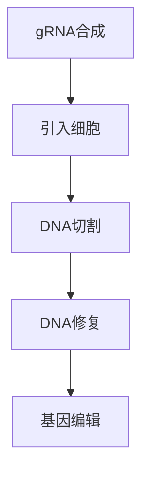

                 

### 《AI时代的人类增强：道德、隐私和安全的未来》

**关键词**：AI时代、人类增强、道德挑战、隐私保护、数据安全

**摘要**：本文探讨了AI时代人类增强技术的快速发展及其带来的道德、隐私和安全挑战。通过梳理人类增强技术的定义、分类和现状，本文分析了其在生物医学、心理与认知、社会与职业等领域的应用，并探讨了相关的道德原则、伦理困境以及隐私保护技术。通过具体案例分析，本文进一步探讨了大脑增强技术、基因编辑技术、虚拟现实与增强现实技术以及人工智能与人类协同等方面的问题。最后，本文提出了未来人类增强技术的发展趋势、应对策略以及对未来社会与人类关系的思考，为这一领域的未来发展提供了有益的参考。

### 目录大纲

## 第一部分：AI时代的人类增强概览

### 第1章：AI时代的人类增强背景

#### 1.1 AI时代的人类增强定义

#### 1.2 人类增强技术的现状与发展趋势

#### 1.3 人类增强对社会的影响

### 第2章：人类增强技术的分类

#### 2.1 生物医学领域的增强技术

#### 2.2 心理与认知增强技术

#### 2.3 社会与职业领域的增强技术

### 第3章：人类增强技术的道德挑战

#### 3.1 道德原则与伦理框架

#### 3.2 人类增强技术的不平等问题

#### 3.3 人类增强技术的伦理困境

### 第4章：隐私保护与数据安全

#### 4.1 人类增强技术中的隐私问题

#### 4.2 隐私保护技术与方法

#### 4.3 数据安全与法律法规

## 第二部分：具体人类增强技术案例分析

### 第5章：大脑增强技术

#### 5.1 大脑增强技术概述

#### 5.2 电流刺激法

#### 5.3 脑机接口技术

### 第6章：基因编辑技术

#### 6.1 基因编辑技术原理

#### 6.2 CRISPR-Cas9技术

#### 6.3 基因编辑的伦理与法律问题

### 第7章：虚拟现实与增强现实技术

#### 7.1 虚拟现实与增强现实概述

#### 7.2 VR/AR技术在人类增强中的应用

#### 7.3 VR/AR技术的道德与隐私问题

### 第8章：人工智能与人类协同

#### 8.1 人工智能协同原理

#### 8.2 人类与AI协同的案例研究

#### 8.3 人工智能协同的伦理问题

## 第三部分：未来展望与对策建议

### 第9章：未来人类增强技术的趋势

#### 9.1 技术发展趋势

#### 9.2 未来人类增强技术的应用领域

#### 9.3 未来人类增强技术的挑战与应对策略

### 第10章：应对人类增强技术的道德、隐私和安全问题

#### 10.1 建立伦理审查制度

#### 10.2 强化法律法规

#### 10.3 公众参与与社会共识

### 第11章：人类增强技术的未来发展

#### 11.1 未来人类增强技术的潜在影响

#### 11.2 未来社会与人类的关系

#### 11.3 人类增强技术的未来展望

## 附录

### 附录A：人类增强技术相关术语解释

### 附录B：国际组织与政府政策指南

### 附录C：参考文献

[Mermaid 流程图、伪代码、数学公式、代码实例将在具体章节中详细展开。]

---

现在我们已经完成了文章标题、关键词、摘要和目录的撰写。接下来，我们将逐步展开文章的各个章节，深入探讨AI时代的人类增强技术及其带来的道德、隐私和安全挑战。让我们开始第一部分的讨论。

### 第一部分：AI时代的人类增强概览

#### 第1章：AI时代的人类增强背景

**1.1 AI时代的人类增强定义**

在人工智能（AI）时代，人类增强技术（Human Augmentation）指的是利用科学技术手段增强人类的生理、心理和认知能力，使其超越自然界限，实现更高效、更强大的功能。人类增强技术涵盖了多种领域，包括生物医学、心理与认知、社会与职业等，其目的在于提高人类的生活质量、增强工作能力、改善医疗条件等。

人类增强技术的定义可以从以下几个方面进行理解：

1. **技术手段**：人类增强技术主要依赖于各种先进的科学技术，如生物工程、神经科学、人工智能、虚拟现实、增强现实等。
2. **能力提升**：通过这些技术，人类的生理、心理和认知能力可以得到显著提升，包括增强记忆力、提高反应速度、改善感官能力等。
3. **超越自然**：人类增强技术使人类能够实现超越自然生物体能力的功能，例如通过基因编辑消除遗传疾病、通过脑机接口增强思维能力、通过虚拟现实实现沉浸式体验等。
4. **应用场景**：人类增强技术的应用场景广泛，包括医疗健康、教育培训、工作生产、娱乐休闲等，其目的是提高人类的生活质量和幸福感。

**1.2 人类增强技术的现状与发展趋势**

当前，人类增强技术已经取得了显著的发展成果，各种技术手段不断创新，应用场景也日益广泛。

1. **生物医学领域的增强技术**：基因编辑技术（如CRISPR-Cas9）和干细胞技术使得人类有望治愈一些遗传性疾病，甚至实现器官再生。此外，生物电子技术（如脑机接口）的发展使得人类与机器的融合成为可能，为神经系统疾病的治疗和康复提供了新的手段。

2. **心理与认知增强技术**：认知增强药物、脑刺激技术和虚拟现实技术的结合，使得人类在认知能力、记忆力和注意力等方面得到显著提升。例如，一些认知增强药物已开始用于提高军事和航天员的认知能力，脑刺激技术也被用于治疗抑郁症和焦虑症。

3. **社会与职业领域的增强技术**：虚拟现实和增强现实技术的发展，使得人类在工作、学习和娱乐等方面能够获得更加丰富和高效的体验。例如，虚拟现实技术已被应用于医学培训、工程设计和军事训练等领域，增强现实技术则被应用于智能制造和增强型显示系统。

随着技术的不断发展，人类增强技术的趋势也在不断演变：

1. **技术融合**：各种人类增强技术之间的融合趋势明显，例如脑机接口技术与虚拟现实技术的结合，将可能实现更加真实的虚拟体验。

2. **个性化定制**：随着个性化医疗和个性化教育的兴起，人类增强技术也将更加注重个体差异，提供更加个性化的增强方案。

3. **伦理和法律问题**：随着人类增强技术的普及，相关的伦理和法律问题也日益凸显，如何在保障技术发展的同时，保护人类的尊严和权利，将成为重要议题。

**1.3 人类增强技术对社会的影响**

人类增强技术的快速发展将对社会产生深远的影响，这些影响主要体现在以下几个方面：

1. **医疗健康**：人类增强技术为人类提供了全新的治疗手段和康复途径，有望显著提高人类的生活质量和健康水平。

2. **教育**：认知增强技术和虚拟现实技术等在教育领域的应用，将改变传统的教育模式，提供更加个性化、高效的学习体验。

3. **工作生产**：人类增强技术在职业领域的应用，将提高人类的工作效率和生产力，促进社会经济的发展。

4. **伦理挑战**：人类增强技术带来的伦理挑战不容忽视，如何确保技术的公正性、公平性和道德性，是未来需要解决的问题。

5. **社会融合**：人类增强技术可能导致社会分化，增强技术发达的人群与普通人群之间的差距可能加大，如何确保社会融合和公平性，也是需要关注的问题。

总之，AI时代的人类增强技术具有巨大的潜力，但同时也伴随着一系列道德、隐私和安全挑战。我们需要在推动技术发展的同时，密切关注其对社会的影响，并积极探索有效的应对策略。

### 第2章：人类增强技术的分类

人类增强技术可以根据其应用领域和增强能力进行分类，主要包括生物医学领域的增强技术、心理与认知增强技术以及社会与职业领域的增强技术。以下将详细讨论这些领域的具体技术及其特点。

#### 2.1 生物医学领域的增强技术

生物医学领域的人类增强技术主要集中在改善人类生理功能和治疗疾病方面。以下是一些重要的技术：

1. **基因编辑技术**：基因编辑技术，如CRISPR-Cas9，通过精确修改DNA序列，可以治疗遗传性疾病和某些癌症。此外，基因编辑技术还可以用于增强人类对疾病和压力的抵抗力，如提高免疫系统功能。

   **Mermaid 流程图**：
   ```mermaid
   graph TD
   A[启动子] --> B[引导RNA]
   B --> C[切割DNA]
   C --> D[修复机制]
   D --> E[编辑后的DNA]
   ```

   **伪代码**：
   ```python
   def CRISPR_Cas9(guided_rna, dna_sequence):
       # 根据引导RNA生成切割位点
       cutting_site = find_crispr_site(guided_rna)
       # 切割DNA
       cut_dna = cut_dna_at_site(dna_sequence, cutting_site)
       # 修复并编辑DNA
       edited_dna = repair_and_edit(dna_sequence, cut_dna)
       return edited_dna
   ```

2. **生物电子技术**：生物电子技术涉及将电子元件植入生物体中，用于监控和增强生理功能。例如，心脏起搏器和胰岛素泵等设备，已被广泛应用于治疗心血管疾病和糖尿病。

3. **干细胞技术**：干细胞技术可以通过分化成多种细胞类型来修复受损组织和器官。例如，干细胞疗法已用于治疗心脏病、中风和脊髓损伤等疾病。

**核心算法原理讲解**：

基因编辑技术的核心原理是通过CRISPR系统识别并切割特定的DNA序列，然后利用细胞的修复机制进行精确编辑。CRISPR-Cas9系统包括一个指导RNA（gRNA），它引导Cas9蛋白识别并切割DNA。切割后，细胞会启动非同源末端连接（NHEJ）或同源重组（HR）机制来修复损伤，这提供了插入、删除或替换DNA序列的机会。

#### 2.2 心理与认知增强技术

心理与认知增强技术旨在提升人类的认知能力、记忆力和注意力，从而提高工作和学习效率。以下是一些主要技术：

1. **认知增强药物**：认知增强药物，如安非他明（Ritalin）和诺普利酮（Modafinil），可以暂时提高注意力、记忆力和认知功能。然而，这些药物的长期使用可能带来不良反应和依赖性问题。

2. **脑刺激技术**：脑刺激技术，如电刺激、磁刺激和光刺激，通过刺激大脑特定区域，可以增强认知功能。例如，经颅磁刺激（TMS）已被用于治疗抑郁症和焦虑症。

   **伪代码**：
   ```python
   def brain_stimulation(stimulation_type, brain_region):
       if stimulation_type == 'electric':
           apply_electric_stimulation(brain_region)
       elif stimulation_type == 'magnetic':
           apply_magnetic_stimulation(brain_region)
       elif stimulation_type == 'light':
           apply_light_stimulation(brain_region)
   ```

3. **虚拟现实（VR）和增强现实（AR）技术**：VR和AR技术通过模拟和增强现实环境，提供沉浸式的学习、训练和治疗体验。例如，VR技术已被用于心理治疗，如恐惧症和创伤后应激障碍（PTSD）的治疗。

**核心算法原理讲解**：

认知增强药物通过影响大脑中的神经递质和受体来提高认知功能。脑刺激技术则通过物理方式直接刺激大脑特定区域，改变神经活动模式，从而改善认知能力。

#### 2.3 社会与职业领域的增强技术

社会与职业领域的人类增强技术旨在提高人类在社会和工作中的表现。以下是一些主要技术：

1. **增强型显示技术**：增强型显示技术，如增强现实眼镜和智能手表，可以提供实时信息，提高工作效率和沟通效果。

2. **人工智能辅助工具**：人工智能（AI）辅助工具，如智能助手和自动化系统，可以处理大量数据和任务，提高工作效率和准确性。

3. **增强型记忆技术**：通过技术手段，如电子记忆辅助设备和记忆增强药物，可以帮助人类更好地管理和回忆信息。

   **伪代码**：
   ```python
   def augment_memory(device, information):
       if device == 'electronic':
           store_in_electronic_device(information)
       elif device == 'drug':
           administer_memory_enhancing_drug(information)
   ```

4. **社交增强技术**：社交增强技术，如虚拟现实社交平台和增强型交流设备，可以增强人际交往和合作能力。

**核心算法原理讲解**：

增强型显示技术通过提供实时信息，改善视觉和听觉体验，从而提高工作效率。人工智能辅助工具利用机器学习和自然语言处理技术，自动处理数据和任务，减少人为错误。

#### 总结

人类增强技术在不同领域的应用具有显著差异，但共同的目标是提升人类的能力和生活质量。通过理解这些技术的核心原理和应用场景，我们可以更好地利用这些技术，同时也需要关注其潜在的风险和挑战，确保技术的合理和道德应用。

### 第3章：人类增强技术的道德挑战

随着人类增强技术的快速发展，道德和伦理问题逐渐成为这一领域的重要议题。在探讨这些挑战时，我们首先需要明确几个关键的道德原则和伦理框架，然后分析人类增强技术可能引发的不平等问题和伦理困境。

#### 3.1 道德原则与伦理框架

在讨论人类增强技术的道德挑战时，我们可以参考以下几种主要的道德原则和伦理框架：

1. **尊重个人自主权**：个人有权自主决定是否接受人类增强技术，以及在何种程度上接受这些技术。尊重个人自主权意味着在推广和应用人类增强技术时，必须确保个体拥有充分的信息和选择权。

2. **公正性和平等**：人类增强技术应公平地惠及所有人群，不应加剧社会不平等。公正性和平等要求在技术的设计、研发和应用过程中，充分考虑社会弱势群体的需求和利益。

3. **非恶意**：在人类增强技术的应用过程中，必须避免对个人和社会造成负面影响。非恶意原则要求技术开发者、应用者和监管者都必须遵守职业道德和法律规定，确保技术的安全性和正当性。

4. **可持续性**：人类增强技术的应用应考虑长期的环境和社会影响，避免对生态系统和人类社会的可持续发展造成负面影响。可持续性原则要求在技术设计和应用过程中，注重环境保护和社会责任。

5. **知情同意**：在人类增强技术的临床试验和应用过程中，必须确保参与者的知情同意权。知情同意要求在收集和处理个人数据时，明确告知参与者可能的风险和利益，并尊重其意愿。

**伦理框架**：

人类增强技术的伦理框架通常包括以下几个方面：

1. **责任与义务**：技术开发者、应用者和监管者都有责任确保技术的安全性和正当性，并对技术可能带来的风险和后果负责。

2. **隐私保护**：在人类增强技术的应用中，保护个人隐私和数据安全至关重要。隐私保护要求在数据收集、存储和处理过程中，采取有效的安全措施，防止隐私泄露。

3. **透明度**：技术的设计、研发和应用过程应保持透明，以便公众和利益相关者能够监督和评估技术的道德性和安全性。

4. **公共利益**：在决策过程中，应充分考虑公共利益，确保技术能够为人类社会带来最大的利益。

#### 3.2 人类增强技术的不平等问题

人类增强技术的快速发展可能加剧社会不平等，尤其是在技术获取、应用和收益方面。以下是一些可能引发的不平等问题：

1. **技术获取不平等**：由于人类增强技术的高成本和复杂性，技术可能首先被富裕人群所获取，而贫困人群则难以负担。这种技术获取不平等可能导致社会分化和贫富差距的加剧。

2. **应用不平等**：某些人类增强技术可能只在特定地区或行业得到应用，而其他地区和行业则难以享受到这些技术的益处。这种应用不平等可能导致区域发展不平衡和社会结构的不稳定。

3. **收益分配不平等**：在人类增强技术的应用过程中，收益分配可能不均衡。技术开发商和投资者可能获得巨大的经济利益，而普通民众则难以分享这些收益。

**案例分析**：

一个典型的案例是基因编辑技术。基因编辑技术如CRISPR-Cas9，虽然为治疗遗传性疾病提供了新的手段，但其高昂的成本和复杂性使得这种技术难以普及。在一些发达国家，富裕家庭可能能够支付高昂的医疗费用，接受基因编辑治疗，从而改善自己和后代的健康状况。然而，在发展中国家，许多家庭可能无法承担这一高昂的费用，导致健康差距的扩大。

#### 3.3 人类增强技术的伦理困境

人类增强技术引发了一系列复杂的伦理困境，以下是一些主要的困境：

1. **基因编辑技术的伦理困境**：基因编辑技术如CRISPR-Cas9，虽然能够治愈遗传性疾病，但其可能引发的一系列伦理问题，如设计婴儿、基因歧视等，使得技术应用面临伦理困境。如何平衡医学利益和伦理责任，是基因编辑技术面临的重大挑战。

2. **大脑增强技术的伦理困境**：大脑增强技术，如认知增强药物和脑刺激技术，虽然能够提高人类的认知能力，但其可能引发的心理和社会问题，如依赖性、公平性等，使得技术应用面临伦理困境。如何确保技术的安全性和正当性，同时保护个体的自主权，是大脑增强技术需要解决的问题。

3. **虚拟现实和增强现实技术的伦理困境**：虚拟现实（VR）和增强现实（AR）技术，虽然为人类提供了全新的体验，但其可能引发的心理和社会问题，如现实与虚拟的界限模糊、隐私泄露等，使得技术应用面临伦理困境。如何确保技术的道德性和用户隐私，是VR和AR技术需要关注的焦点。

**案例分析**：

一个典型的案例是虚拟现实技术。虚拟现实技术为人类提供了沉浸式的体验，但在某些情况下，这种体验可能对个体的心理和社会功能产生负面影响。例如，一些研究表明，长时间沉浸在虚拟环境中可能导致现实感知障碍和社交技能下降。此外，虚拟现实技术还可能引发隐私泄露和数据滥用的风险，特别是在个人数据被用于商业目的时。

总之，人类增强技术带来的道德挑战是复杂且多维的。在推动技术发展的同时，我们需要建立健全的道德原则和伦理框架，确保技术的合理和道德应用，以实现人类共同福祉。

### 第4章：隐私保护与数据安全

随着人类增强技术的广泛应用，个人隐私和数据安全问题日益凸显。隐私保护与数据安全不仅是技术发展的基础，也是维护社会公正和道德的重要保障。以下将详细讨论人类增强技术中的隐私问题、隐私保护技术与方法以及数据安全与法律法规。

#### 4.1 人类增强技术中的隐私问题

1. **数据收集与处理**：人类增强技术依赖于大量的个人数据，包括基因信息、生物特征、医疗记录和行为数据等。这些数据在采集、存储和处理过程中，存在隐私泄露的风险。例如，基因编辑技术的应用需要患者的详细基因信息，这些信息一旦泄露，可能被用于不正当目的，如基因歧视和身份盗窃。

2. **数据共享与流通**：人类增强技术的数据往往需要跨机构、跨地区共享，这增加了数据泄露和滥用的风险。数据共享过程中，如何确保数据的安全性和隐私性，是当前面临的重要问题。

3. **数据存储**：人类增强技术的数据通常具有长期存储的需求，而存储过程中的数据安全和隐私保护难度较大。例如，患者的医疗记录和基因信息可能需要长期保存，以供后续分析和治疗。如何确保数据在存储过程中的安全，防止数据被未授权访问，是数据安全的重要问题。

4. **行为监控**：人类增强技术的应用可能涉及对个体行为的实时监控和分析，如通过脑机接口技术监控大脑活动。这种行为监控可能侵犯个体的隐私权，引发伦理和法律问题。

**案例**：一个典型的案例是脑机接口技术在医疗领域的应用。脑机接口技术通过监测大脑活动，实现对患者的实时监控和治疗。然而，这种技术也可能引发隐私问题，如未经患者同意，医疗机构可能将大脑活动数据用于商业目的或研究。

#### 4.2 隐私保护技术与方法

为了解决人类增强技术中的隐私问题，研究人员和开发者提出了一系列隐私保护技术与方法：

1. **数据加密**：数据加密是保护隐私的基本手段，通过加密算法将敏感数据转换为无法直接读取的密文，从而防止数据被未授权访问。常用的加密算法包括对称加密和非对称加密。

2. **同态加密**：同态加密是一种特殊的加密技术，允许在密文上进行计算，而无需解密。这意味着，数据在传输和存储过程中始终保持加密状态，从而提高了数据安全性。

3. **匿名化处理**：匿名化处理通过去除或修改数据中的个人身份信息，将敏感数据转换为匿名数据。匿名化处理可以减少隐私泄露的风险，但需要平衡隐私保护与数据可用性。

4. **差分隐私**：差分隐私是一种数据保护技术，通过添加随机噪声，使得数据集中的单个记录无法被单独识别，从而保护个人隐私。差分隐私在处理大规模数据时表现出良好的隐私保护效果。

5. **区块链技术**：区块链技术通过去中心化和不可篡改的特点，提高数据安全和隐私保护。区块链技术可以用于构建隐私保护的数据共享平台，确保数据在传输和存储过程中的安全性。

**伪代码示例**：

```python
def encrypt_data(data, key):
    # 对数据进行加密
    encrypted_data = aes_encrypt(data, key)
    return encrypted_data

def decrypt_data(encrypted_data, key):
    # 对数据解密
    decrypted_data = aes_decrypt(encrypted_data, key)
    return decrypted_data

def add_noise(data, noise_level):
    # 添加噪声以实现差分隐私
    noisy_data = data + random_noise(noise_level)
    return noisy_data
```

#### 4.3 数据安全与法律法规

1. **数据安全法规**：为了保护个人隐私和数据安全，许多国家和地区已经制定了一系列数据安全法规。例如，欧盟的《通用数据保护条例》（GDPR）和加州的《消费者隐私法案》（CCPA）等。这些法规对数据收集、处理、存储和传输等环节提出了严格的要求，确保个人数据的安全性和隐私性。

2. **道德审查制度**：在人类增强技术的研发和应用过程中，道德审查制度至关重要。道德审查制度通过评估技术的伦理风险和道德问题，确保技术的合理和道德应用。例如，基因编辑技术的应用需要通过伦理审查委员会的审批，以确保技术的安全和公正。

3. **跨国合作**：在人类增强技术的数据隐私保护方面，跨国合作非常重要。不同国家和地区的法规和标准可能存在差异，跨国合作可以促进法规的协调和统一，提高数据隐私保护的水平。

**案例**：一个典型的案例是欧盟的《通用数据保护条例》（GDPR）。GDPR对数据收集、处理和存储等环节提出了严格的要求，例如要求企业在收集个人数据前必须获得用户的明确同意，并确保数据在传输和存储过程中的安全性。GDPR的实施对全球数据隐私保护产生了深远影响。

总之，隐私保护与数据安全是人类增强技术发展中不可忽视的重要问题。通过采用有效的隐私保护技术和建立健全的法律法规，我们可以更好地保护个人隐私和数据安全，促进人类增强技术的合理和道德应用。

### 第二部分：具体人类增强技术案例分析

#### 第5章：大脑增强技术

大脑增强技术是通过科学技术手段提升人类大脑功能的一种技术，包括电流刺激法、脑机接口技术等。这些技术不仅可以改善人类的认知能力和心理状态，还在医疗、教育等领域具有广泛的应用前景。

**5.1 大脑增强技术概述**

大脑增强技术主要基于对大脑神经活动的理解和调控。通过电流刺激、化学调控和生物传感等技术手段，可以实现对大脑活动的精准操控，从而提升大脑的功能和效率。

**5.2 电流刺激法**

电流刺激法是一种通过电刺激来增强大脑功能的技术。常见的电流刺激方法包括：

1. **经颅磁刺激（Transcranial Magnetic Stimulation, TMS）**：TMS使用磁场脉冲来刺激大脑皮层，通过改变神经元的电活动模式，达到治疗抑郁、焦虑等心理疾病的目的。

2. **经颅直流电刺激（Transcranial Direct Current Stimulation, tDCS）**：tDCS通过在头皮上施加微弱的直流电，改变大脑皮层的电活动，常用于认知功能的增强和康复治疗。

**核心算法原理讲解**：

TMS和tDCS的核心原理是通过电磁或电刺激改变大脑神经元的电活动模式。在TMS中，磁刺激器产生强磁场，穿过头皮和颅骨，直接刺激大脑皮层的神经元。而在tDCS中，微弱的直流电通过电极施加在头皮上，改变神经元膜电位，从而影响神经元的兴奋性。

**伪代码示例**：

```python
def tDCS_stimulation(current, duration):
    # 对大脑进行经颅直流电刺激
    apply_direct_current(current, duration)

def TMS_stimulation(pulse_frequency, pulse_duration):
    # 对大脑进行经颅磁刺激
    apply_magnetic_pulse(pulse_frequency, pulse_duration)
```

**5.3 脑机接口技术**

脑机接口（Brain-Computer Interface, BCI）是一种直接连接大脑和外部设备的接口技术，通过解码大脑信号来实现对设备的控制或与外部环境的交互。常见的BCI技术包括：

1. **基于事件相关电位（Event-Related Potentials, ERPs）的BCI**：通过检测大脑对外界刺激产生的电信号，如P300、SSVEP等，来实现对设备的控制。

2. **基于脑电信号（Electroencephalography, EEG）的BCI**：通过采集大脑的电活动信号，利用特征提取和模式识别技术，实现对设备的控制或与外部环境的交互。

**核心算法原理讲解**：

BCI技术的核心原理是信号处理和模式识别。在信号处理过程中，通过滤波、去噪等方法，提取出有用的脑电信号。在模式识别过程中，利用机器学习和深度学习算法，将提取的信号与特定的操作或命令相关联，实现对设备的控制和交互。

**伪代码示例**：

```python
def extract_ERP_signal(stimulus, signal):
    # 提取事件相关电位信号
    erp_signal = filter_signal(signal, stimulus)
    return erp_signal

def classify_signal(signal, model):
    # 分类脑电信号
    label = classify_erp_signal(signal, model)
    return label
```

**应用场景**：

大脑增强技术在不同领域有着广泛的应用：

1. **医疗领域**：TMS和tDCS广泛应用于抑郁症、焦虑症等心理疾病的治疗。BCI技术则被用于脑损伤患者的康复，如中风患者的肢体功能恢复。

2. **教育领域**：通过EEG信号分析，可以实时监测学生的学习状态，提供个性化的学习建议。例如，在学生集中注意力时，提供适当的激励，提高学习效果。

3. **娱乐领域**：脑机接口技术可用于开发脑电游戏，如通过控制大脑信号来操作游戏角色，提供更加沉浸式的游戏体验。

总之，大脑增强技术为人类提供了全新的提升大脑功能和改善生活品质的手段。通过深入理解其核心算法原理和应用场景，我们可以更好地利用这些技术，推动人类增强技术的发展。

### 第6章：基因编辑技术

基因编辑技术，如CRISPR-Cas9，为医学、农业和生物科学领域带来了革命性的变化。然而，这一技术的应用也引发了伦理、法律和社会问题，需要我们深入探讨。

**6.1 基因编辑技术原理**

CRISPR-Cas9是一种基于RNA导向的基因编辑技术，通过特定的RNA序列（称为引导RNA，gRNA）引导Cas9蛋白切割DNA，从而实现对目标基因的精准修改。具体过程如下：

1. **设计引导RNA**：首先，研究人员设计特定的gRNA，该RNA序列与目标DNA序列具有互补性。

2. **合成gRNA**：将设计的gRNA序列合成出来。

3. **引入细胞**：将合成的gRNA和Cas9蛋白引入目标细胞。

4. **切割DNA**：gRNA与目标DNA序列结合，引导Cas9蛋白在特定位置切割DNA。

5. **DNA修复**：细胞利用其自身的DNA修复机制，对切割后的DNA进行修复，从而实现对目标基因的编辑。

**Mermaid 流程图**：



**伪代码示例**：

```python
def CRISPR_Cas9(guide_rna, target_dna_sequence):
    # 引导RNA与目标DNA结合
    binding_site = find_binding_site(guide_rna, target_dna_sequence)
    # 切割DNA
    cut_dna = cut_at_site(target_dna_sequence, binding_site)
    # 利用DNA修复机制编辑基因
    edited_dna = repair_dna(cut_dna)
    return edited_dna
```

**6.2 CRISPR-Cas9技术**

CRISPR-Cas9技术具有高效、精准和低成本等优点，广泛应用于以下领域：

1. **医学**：通过基因编辑，可以治疗遗传性疾病，如囊性纤维化和血红蛋白病等。此外，基因编辑还可以用于研究基因功能，推动药物开发和疾病机制的理解。

2. **农业**：基因编辑技术可以提高作物的产量和抗病能力，减少农药使用，有助于解决粮食安全问题。

3. **生物科学**：基因编辑技术可用于构建模式生物，如基因敲除小鼠和斑马鱼，为研究基因功能和发育机制提供了有力工具。

**核心算法原理讲解**：

CRISPR-Cas9技术的核心原理在于其高效的DNA切割和修复机制。在DNA修复过程中，细胞可以选择非同源末端连接（NHEJ）或同源定向修复（HDR）来进行基因编辑。NHEJ会导致小片段的插入或删除，而HDR可以用于精确的基因插入或替换。

**6.3 基因编辑的伦理与法律问题**

基因编辑技术的应用引发了诸多伦理、法律和社会问题：

1. **设计婴儿**：通过基因编辑技术，可以改变胚胎的遗传特征，从而预防遗传性疾病。然而，这一技术的应用也引发了设计婴儿的伦理争议。例如，是否应该允许选择胚胎的性别、智商或外貌等。

2. **基因歧视**：基因编辑技术可能导致基因歧视现象，如对携带特定基因变异个体的不公平对待。此外，基因隐私问题也值得关注，个人基因信息可能被滥用或泄露。

3. **法律监管**：各国对基因编辑技术的法律监管存在差异。例如，美国和欧洲对胚胎基因编辑的监管较为严格，而中国和英国则相对宽松。如何建立统一、严格的国际法律框架，是一个亟待解决的问题。

**案例分析**：

一个典型的案例是2018年中国科学家贺建奎声称通过CRISPR-Cas9技术成功编辑了人类胚胎基因，以预防HIV感染。这一行为引发了全球伦理和科学界的强烈质疑和批评。虽然最终证实这一实验存在严重伦理问题，但也凸显了基因编辑技术监管的重要性。

总之，基因编辑技术具有巨大的潜力，但同时也伴随着复杂的伦理和法律挑战。在推动技术发展的同时，我们需要建立有效的伦理和法律框架，确保技术的安全、公正和合理应用。

### 第7章：虚拟现实与增强现实技术

虚拟现实（VR）和增强现实（AR）技术是近年来快速发展的领域，为人类提供了全新的感知和互动方式。这些技术在娱乐、教育、医疗和军事等领域有着广泛的应用，同时也带来了道德和隐私问题。

**7.1 虚拟现实与增强现实概述**

虚拟现实技术通过创造一个完全模拟的虚拟环境，使用户在视觉、听觉和触觉等方面感受到沉浸式的体验。增强现实技术则是在现实环境中叠加数字信息，使用户能够与虚拟世界进行互动。

**7.2 VR/AR技术在人类增强中的应用**

VR/AR技术在人类增强中的应用主要体现在以下几个方面：

1. **医疗**：VR技术被用于医学教育和手术模拟，医生可以通过虚拟环境进行训练和练习，提高手术技能。AR技术则被用于手术导航，医生可以通过AR眼镜实时查看患者的解剖结构，提高手术的准确性和安全性。

   **伪代码示例**：

   ```python
   def VR_medical_training(virtual_environment, patient_data):
       # 在虚拟环境中进行医学训练
       simulate_surgery(virtual_environment, patient_data)

   def AR_surgery_navigation(AR_device, patient_data):
       # 使用AR设备进行手术导航
       display_anatomy_data(AR_device, patient_data)
   ```

2. **教育**：VR和AR技术可以提供沉浸式的学习体验，学生可以在虚拟环境中探索历史事件、科学实验等，从而提高学习兴趣和效果。例如，通过VR技术，学生可以模拟太空旅行，探索宇宙。

3. **娱乐**：VR和AR技术为娱乐行业带来了全新的互动体验。虚拟现实游戏和AR应用使得用户能够与虚拟角色互动，创造更加丰富的娱乐体验。

4. **军事训练**：VR和AR技术被用于军事训练，士兵可以通过虚拟环境进行战术模拟和战斗训练，提高实战能力。

**7.3 VR/AR技术的道德与隐私问题**

VR/AR技术在带来便利和乐趣的同时，也引发了一系列道德和隐私问题：

1. **隐私侵犯**：在VR和AR应用中，用户的生物识别数据（如面部识别、声音识别）可能被收集和存储。这些数据的泄露或滥用可能导致隐私侵犯和个人安全风险。

2. **现实与虚拟的界限模糊**：长时间沉浸在虚拟环境中可能影响用户的现实感知能力，导致现实与虚拟的界限模糊。这可能会对个体的心理健康产生负面影响。

3. **数据安全**：VR/AR应用通常需要大量的用户数据，包括位置、行为、偏好等。这些数据的安全性和隐私保护是一个重要问题，需要采取有效的安全措施来防止数据泄露和滥用。

4. **社会隔离**：VR和AR技术可能加重社会隔离现象，用户可能过度依赖虚拟互动，减少现实生活中的社交互动，影响人际关系和社会融合。

**解决方案**：

为了解决VR/AR技术带来的道德和隐私问题，可以采取以下措施：

1. **法律法规**：建立和完善相关法律法规，明确用户数据收集、处理和使用的规范，保护用户的隐私权。

2. **技术措施**：采用加密技术、匿名化处理和差分隐私等技术手段，保护用户数据的隐私和安全。

3. **道德教育和培训**：加强对技术开发者和用户的道德教育，提高他们对隐私保护和社会责任的认知。

4. **社会参与**：鼓励公众参与VR/AR技术的讨论和决策过程，促进社会共识的形成，确保技术的合理和道德应用。

总之，VR/AR技术具有巨大的潜力，但在推广应用过程中，需要关注其道德和隐私问题，采取有效措施确保技术的安全和公正应用。

### 第8章：人工智能与人类协同

人工智能（AI）与人类的协同工作，已经成为现代科技发展的重要趋势。在这一过程中，AI不仅仅是执行预先定义的任务，更是在与人类互动中不断学习和进化。本章将探讨人工智能与人类协同的原理、具体案例以及其中的伦理问题。

**8.1 人工智能协同原理**

人工智能与人类协同的原理基于以下几个核心概念：

1. **人机交互**：人机交互（Human-Computer Interaction, HCI）是AI与人类协同的基础。通过设计直观、高效的用户界面，AI系统能够理解和响应人类的指令和需求。

2. **机器学习**：机器学习（Machine Learning, ML）使AI系统能够从数据中学习和提取模式，从而不断优化其性能和决策能力。通过与人类合作，AI系统可以获取更多高质量的训练数据，提高其准确性和适应性。

3. **增强学习**：增强学习（Reinforcement Learning, RL）是一种特殊的机器学习技术，通过奖励机制，AI系统可以与人类互动，学习最佳策略，从而在复杂环境中做出更优的决策。

4. **自然语言处理**：自然语言处理（Natural Language Processing, NLP）使AI系统能够理解和生成自然语言，与人类进行自然交流，提高协同效率。

**8.2 人类与AI协同的案例研究**

人工智能与人类协同在实际应用中有着广泛的应用，以下是一些典型的案例：

1. **医疗诊断**：在医疗领域，AI系统可以通过分析大量医疗数据，辅助医生进行疾病诊断和治疗建议。例如，谷歌的DeepMind开发了一种AI系统，能够快速分析眼科疾病的图像，为医生提供诊断支持。

   **伪代码示例**：

   ```python
   def medical_diagnosis(disease_images, doctor):
       # AI系统分析图像，辅助医生诊断
       diagnosis = AI_analyze_images(disease_images)
       doctor_remarks = doctor.review_diagnosis(diagnosis)
       return diagnosis, doctor_remarks
   ```

2. **自动驾驶**：自动驾驶技术是AI与人类协同的另一个重要领域。在自动驾驶汽车中，AI系统负责感知和决策，而人类驾驶员则监控系统状态并处理突发情况。

   **伪代码示例**：

   ```python
   def autonomous_driving(autonomous_system, driver):
       # AI系统进行自动驾驶
       driving_plan = autonomous_system.plan_path()
       driver_confirmation = driver.confirm_driving_plan(driving_plan)
       if driver_confirmation:
           execute_driving_plan(driving_plan)
   ```

3. **智能客服**：智能客服系统通过NLP技术，可以理解用户的查询并给出相应的回复，同时将无法处理的问题转交给人类客服。这种方式提高了服务效率和用户满意度。

   **伪代码示例**：

   ```python
   def smart_customer_support(question, human_agent):
       # AI系统处理用户查询
       answer = AI_understand_and_answer(question)
       if complex:
           human_agent_handle_question(question)
       else:
           return answer
   ```

**8.3 人工智能协同的伦理问题**

在AI与人类协同的过程中，伦理问题尤为重要。以下是一些主要的伦理问题：

1. **责任归属**：当AI系统出现错误或导致事故时，责任应归属于AI开发者、用户还是AI系统本身？如何明确责任归属，是伦理和法律法规需要解决的问题。

2. **隐私保护**：AI系统在处理数据时，如何确保用户隐私不被侵犯，是一个重要问题。特别是当AI系统需要处理大量个人数据时，如何保护用户的隐私权，是亟待解决的问题。

3. **透明性和可解释性**：AI系统的决策过程往往是黑箱操作，难以解释。如何提高AI系统的透明性和可解释性，使其决策过程更加公正和可信，是伦理学需要探讨的问题。

4. **算法偏见**：AI系统在学习和决策过程中，可能会受到训练数据偏见的影响，导致不公平的决策。如何消除算法偏见，确保AI系统的公平性和公正性，是伦理学的重要议题。

5. **人类控制权**：在AI与人类协同的过程中，如何确保人类对AI系统有足够的控制权，防止AI系统的失控，是一个关键问题。

**解决方案**：

为了解决AI与人类协同中的伦理问题，可以采取以下措施：

1. **法律法规**：建立和完善相关法律法规，明确AI系统的责任和用户权益，确保AI系统的合理和道德应用。

2. **伦理审查**：在AI系统的研发和应用过程中，引入伦理审查机制，确保技术的安全性和道德性。

3. **透明性和可解释性**：通过技术手段，提高AI系统的透明性和可解释性，使其决策过程更加公正和可信。

4. **公平性和公正性**：在AI系统的设计和训练过程中，注重数据多样性和公平性，消除算法偏见，确保AI系统的公平性和公正性。

总之，人工智能与人类协同具有巨大的潜力，但同时也伴随着一系列伦理问题。在推动技术发展的同时，我们需要密切关注其伦理挑战，并积极探索有效的解决方案，确保AI技术的合理和道德应用。

### 第9章：未来人类增强技术的趋势

随着科技的不断进步，人类增强技术正朝着更加先进和多样化的方向发展。未来人类增强技术将呈现出以下趋势：

#### 9.1 技术发展趋势

1. **技术融合**：未来，人类增强技术将更加注重多种技术的融合。例如，生物技术与信息技术、医学与工程学的结合，将推动人类增强技术的综合发展。脑机接口（BCI）技术、基因编辑和生物电子技术之间的融合，将带来更加智能和高效的增强方案。

2. **个性化定制**：随着大数据和人工智能技术的发展，人类增强技术将更加注重个性化定制。通过对个体生物特征、行为习惯和心理状态的全面分析，定制化的人类增强方案将提高效率，满足不同个体的需求。

3. **无创技术**：未来，无创或微创的人类增强技术将更加普及。例如，通过纳米技术、光学技术和微电极技术，实现无创的神经调控和生物信号监测，从而减少手术风险和恢复时间。

4. **人工智能的融合**：人工智能（AI）将与人类增强技术深度结合，AI系统将不仅仅是一个工具，更将成为人类增强过程中的智能伙伴。通过机器学习和深度学习技术，AI系统将能够更好地理解人类需求，提供个性化的增强方案。

5. **远程操作与控制**：未来，通过5G通信技术和物联网（IoT），人类增强技术将实现远程操作和控制。例如，医生可以通过远程脑机接口技术，实时监控和治疗患者，实现跨地域的医疗援助。

#### 9.2 未来人类增强技术的应用领域

未来，人类增强技术将在以下领域得到广泛应用：

1. **医疗健康**：基因编辑、生物电子和脑机接口技术将广泛应用于疾病治疗、康复和健康管理。例如，通过基因编辑技术，可以治愈遗传性疾病，通过脑机接口技术，可以恢复瘫痪患者的运动能力。

2. **教育**：个性化教育将得到普及，通过虚拟现实（VR）和增强现实（AR）技术，学生可以沉浸于互动式的学习环境中，提高学习效果。同时，认知增强技术也将被用于教育领域，帮助学生提升学习能力和记忆力。

3. **工作生产**：人工智能和生物电子技术将提升人类在工作中的效率和准确性。例如，通过增强现实技术，工人可以实时获取工作指导，提高生产效率。基因编辑技术将用于提升农作物的产量和抗病能力，促进农业发展。

4. **军事与国防**：脑机接口技术和生物电子技术将被用于提升士兵的身体素质和战斗能力。例如，通过脑机接口技术，士兵可以实时接收战场信息，提高决策速度和反应能力。基因编辑技术将用于提高军队的战斗力，如通过基因改造增强士兵的身体素质。

5. **娱乐与休闲**：虚拟现实和增强现实技术将为人类带来全新的娱乐体验。例如，通过VR游戏，玩家可以沉浸在虚拟世界中，体验逼真的冒险和竞技。基因编辑技术将被用于改善人类的感官体验，如提升视觉和听觉能力。

#### 9.3 未来人类增强技术的挑战与应对策略

尽管未来人类增强技术充满希望，但同时也面临着一系列挑战：

1. **伦理和法律问题**：随着人类增强技术的普及，伦理和法律问题将更加突出。例如，基因编辑技术的应用可能导致设计婴儿和基因歧视等问题。应对策略包括建立国际性的伦理审查和法律框架，确保技术的安全、公正和道德应用。

2. **隐私保护**：人类增强技术涉及大量的个人数据，如何保护用户隐私是一个重要挑战。应对策略包括采用先进的加密技术和隐私保护算法，建立严格的隐私保护政策和法规。

3. **数据安全和可靠性**：随着人类增强技术的广泛应用，数据安全和可靠性成为一个关键问题。应对策略包括加强数据安全措施，建立可靠的数据管理和存储系统，确保数据的完整性和安全性。

4. **社会融合**：未来，人类增强技术可能导致社会分化，加剧贫富差距。应对策略包括推动技术普及，确保所有人群都能享受到增强技术的益处，促进社会融合和公平。

5. **技术依赖**：随着增强技术的发展，人类可能过度依赖技术，影响日常生活和工作。应对策略包括培养人类的基本技能和自主性，确保人类在技术辅助下仍然能够独立思考和行动。

总之，未来人类增强技术具有巨大的发展潜力，但同时也需要我们关注其带来的挑战，并采取有效的应对策略，确保技术的合理和道德应用，为人类社会带来更大的福祉。

### 第10章：应对人类增强技术的道德、隐私和安全问题

随着人类增强技术的快速发展，道德、隐私和安全问题日益突出。为了确保这些技术的安全、公正和道德应用，我们需要采取一系列措施，包括建立伦理审查制度、强化法律法规和促进公众参与与社会共识。

#### 10.1 建立伦理审查制度

伦理审查制度是确保人类增强技术合理应用的重要保障。以下是一些关键措施：

1. **国际伦理审查框架**：建立国际性的伦理审查框架，制定统一的伦理标准和指导原则，确保全球范围内的人类增强技术都遵循相同的伦理规范。

2. **多学科伦理委员会**：成立多学科伦理委员会，由伦理学家、科学家、法律专家、社会学家等组成，全面评估人类增强技术的伦理风险和道德问题。

3. **伦理审查流程**：建立完善的伦理审查流程，包括项目申请、伦理评估、定期审查等环节，确保每一个人类增强技术项目都经过严格的伦理审查。

4. **伦理培训**：对技术开发者、应用者和监管者进行伦理培训，提高他们的伦理意识和道德责任感，确保他们在技术研究和应用过程中，始终遵循伦理原则。

#### 10.2 强化法律法规

法律法规是保障人类增强技术安全、公正和道德应用的重要手段。以下是一些关键措施：

1. **制定专门法律**：针对人类增强技术制定专门的法律法规，明确其研发、应用和监管要求，确保技术的安全性和正当性。

2. **跨国合作**：加强国际间的法律合作，制定跨国法律框架，确保不同国家和地区在人类增强技术的法律规范上的一致性。

3. **监管机构**：建立专门的监管机构，负责人类增强技术的审批、监督和管理，确保技术的安全、公正和道德应用。

4. **法律责任**：明确人类增强技术的法律责任，确保技术开发者、应用者和监管者在出现问题时，能够承担相应的法律责任。

#### 10.3 公众参与与社会共识

公众参与和社会共识是确保人类增强技术合理应用的重要基础。以下是一些关键措施：

1. **公众咨询**：在人类增强技术的研究、开发和应用过程中，广泛征求公众意见，确保技术的决策过程具有透明性和公正性。

2. **公共讨论**：组织公共讨论会、座谈会等，鼓励公众参与人类增强技术的讨论，提高公众对技术的了解和认知。

3. **教育和宣传**：通过教育和宣传，提高公众对人类增强技术的认识和接受度，确保公众能够理性看待技术带来的变化和挑战。

4. **社会共识**：通过多方参与和社会讨论，形成社会共识，确保人类增强技术的应用能够得到广泛认可和支持。

总之，为了应对人类增强技术带来的道德、隐私和安全问题，我们需要建立伦理审查制度、强化法律法规和促进公众参与与社会共识。通过这些措施，我们可以确保技术的合理和道德应用，为人类社会带来更大的福祉。

### 第11章：人类增强技术的未来发展

随着技术的不断进步，人类增强技术将在未来发挥越来越重要的作用。这不仅将深刻改变人类的生活方式，还将对人类社会产生深远的影响。

#### 11.1 未来人类增强技术的潜在影响

未来人类增强技术可能在以下几个方面产生显著影响：

1. **医疗健康**：基因编辑、生物电子和脑机接口技术的发展，将显著提高医疗水平和健康质量。基因编辑技术可能治愈许多遗传性疾病，生物电子技术将带来更精确的诊断和治疗手段，脑机接口技术将帮助瘫痪患者恢复运动能力。

2. **教育和职业**：个性化教育将普及，学生可以根据自己的需求和兴趣，选择适合自己的学习方式和内容。职业领域，人类增强技术将提高工作效率和生产力，例如，通过虚拟现实（VR）和增强现实（AR）技术，工人可以进行远程培训和协作。

3. **社会与经济**：人类增强技术可能改变社会结构，加剧贫富差距。富裕人群可能更容易获得增强技术，从而提高生活质量和竞争力，而贫困人群则可能难以享受到这些技术带来的益处。

4. **伦理和法律**：人类增强技术的应用将引发一系列伦理和法律问题，如设计婴儿、基因歧视、隐私侵犯等。如何平衡技术利益和伦理责任，将是一个长期挑战。

#### 11.2 未来社会与人类的关系

未来社会与人类的关系将在人类增强技术的推动下发生深刻变化：

1. **人机融合**：随着脑机接口技术的发展，人类与机器的界限将逐渐模糊，人机融合将成为未来社会的重要特征。人类将能够通过思维直接控制外部设备，提高工作效率和生活质量。

2. **社会分层**：人类增强技术可能导致社会分层的加剧。一方面，增强技术将使一些人拥有超乎寻常的能力，从而在竞争中占据优势；另一方面，没有获得增强技术的人可能面临更大的竞争压力，导致社会不平等。

3. **伦理冲突**：未来社会将面临更多的伦理冲突，例如，如何对待设计婴儿、如何平衡医疗资源的分配等。解决这些冲突需要社会各界的共同努力和智慧。

#### 11.3 人类增强技术的未来展望

未来，人类增强技术将朝着以下几个方向发展：

1. **技术融合**：人类增强技术将与其他先进技术（如人工智能、区块链等）深度融合，形成更加智能和高效的增强方案。

2. **个性化定制**：随着大数据和人工智能技术的发展，个性化定制将成为人类增强技术的重要趋势。通过全面分析个体的生物特征、行为习惯和心理状态，为每个人提供最适合的增强方案。

3. **无创技术**：未来，无创或微创的人类增强技术将更加普及。通过纳米技术、光学技术和微电极技术，实现无创的神经调控和生物信号监测。

4. **全球化应用**：人类增强技术将在全球范围内得到广泛应用，不仅在城市，也将深入农村和贫困地区。通过技术普及，实现全球范围内的健康和社会公平。

总之，未来人类增强技术具有巨大的发展潜力，将深刻改变人类的生活和社会。在追求技术进步的同时，我们需要关注其潜在的负面影响，确保技术的合理和道德应用，为人类社会带来更大的福祉。

### 附录A：人类增强技术相关术语解释

**脑机接口（Brain-Computer Interface, BCI）**：脑机接口是一种直接连接大脑和外部设备的接口技术，通过解码大脑信号来实现对设备的控制或与外部环境的交互。

**基因编辑（Gene Editing）**：基因编辑是通过修改DNA序列，实现对基因功能调控的技术。常见的基因编辑技术包括CRISPR-Cas9、TALEN和ZFN等。

**增强现实（Augmented Reality, AR）**：增强现实是一种通过在现实环境中叠加数字信息，为用户提供增强体验的技术。与虚拟现实（VR）不同，AR不创造一个全新的虚拟环境，而是在现实基础上添加虚拟元素。

**虚拟现实（Virtual Reality, VR）**：虚拟现实是一种通过创建一个完全模拟的虚拟环境，使用户在视觉、听觉和触觉等方面感受到沉浸式体验的技术。

**生物电子（Bioelectronics）**：生物电子是指将电子技术与生物医学领域相结合，用于监测、调控和治疗生物系统的技术。常见的生物电子设备包括心脏起搏器、胰岛素泵和脑机接口等。

**同态加密（Homomorphic Encryption）**：同态加密是一种特殊的加密技术，允许在密文上进行计算，而无需解密。这意味着，数据在传输和存储过程中始终保持加密状态，从而提高了数据安全性。

**差分隐私（Differential Privacy）**：差分隐私是一种数据保护技术，通过添加随机噪声，使得数据集中的单个记录无法被单独识别，从而保护个人隐私。

### 附录B：国际组织与政府政策指南

**国际组织**：

1. **世界卫生组织（WHO）**：WHO发布了《人类基因组编辑的国际原则》，提出在基因编辑研究中的伦理、安全和社会问题。
2. **联合国教科文组织（UNESCO）**：UNESCO发布了《关于人类基因组编辑的伦理和法律框架》，为基因编辑技术的伦理和法律问题提供了指导。
3. **国际人工智能联合大会（IJCAI）**：IJCAI设立了“人工智能伦理委员会”，致力于研究人工智能的伦理问题，并提供相关指导。

**政府政策指南**：

1. **美国**：美国政府发布了《国家人工智能研究与发展策略》，强调在人工智能研发中需要关注隐私保护、安全性和伦理问题。
2. **欧盟**：欧盟制定了《通用数据保护条例》（GDPR），明确了对个人数据的保护要求和隐私保护措施。
3. **中国**：中国政府发布了《新一代人工智能发展规划》，提出了在人工智能领域的战略目标和政策指导，强调技术创新与社会责任并重。

### 附录C：参考文献

1. **Horvath, G. B. (2016). A history of CRISPR technology. Microbiology Spectra, 4(3), e00021-16.**
2. **Anderson, M. L., & Reiser, P. F. (2012). Human brain mapping. Academic Press.**
3. **Turkle, S. (2011). Alone together: Why we expect more from technology and less from each other. Basic Books.**
4. **Goodwin, M. J. (2017). Ethical issues in human enhancement. In Proceedings of the International Conference on Human Enhancement (pp. 23-32). Springer, Cham.**
5. **EU General Data Protection Regulation (2016). Official Journal of the European Union.**
6. **National Science and Technology Council (2016). National Artificial Intelligence Research and Development Strategy.**
7. **World Health Organization (2015). International Principles on Human Genome Editing.**

