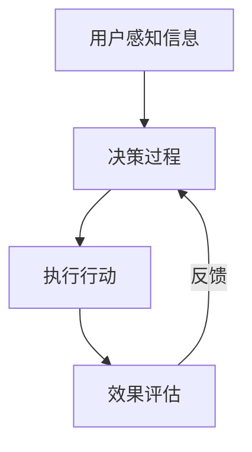
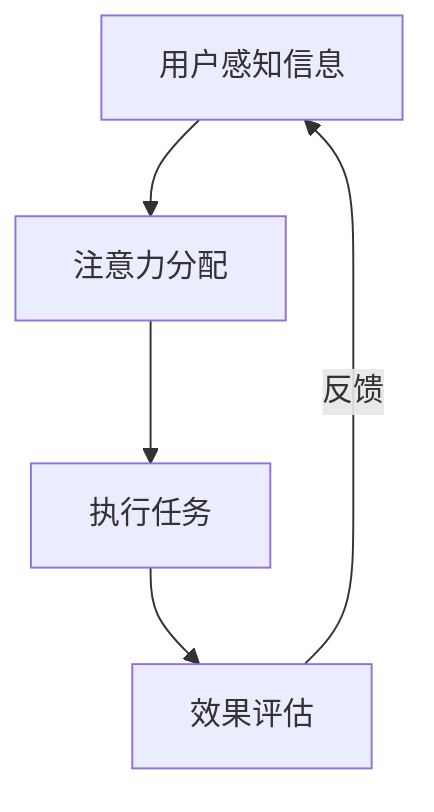

                 

# AI时代的人类注意力管理

## 关键词：
注意力管理、人工智能、用户体验、工作效率、数据隐私

## 摘要：
本文探讨了AI时代下人类注意力管理的重要性及其面临的挑战。通过对注意力管理的核心概念、理论基础、应用案例和前沿技术的深入分析，提出了一系列优化策略与方法。文章旨在为个人、团队和企业提供有效的注意力管理指南，提升在AI时代的工作效率和用户体验。

---

## 第一部分：AI时代的人类注意力管理概述

### 第1章：AI时代的人类注意力管理概述

在AI技术迅猛发展的今天，人类注意力管理的重要性愈发凸显。AI的广泛应用不仅改变了我们的生活方式，也对我们的注意力分配产生了深远的影响。本章节将介绍AI时代注意力管理的重要性、概念与理论，以及注意力管理的现状和发展趋势。

### 1.1 AI时代注意力管理的重要性

随着互联网的普及和智能设备的广泛应用，人类接触到的信息量呈爆炸式增长。在这种情况下，如何有效管理人类的注意力资源，提高工作和生活质量，成为了一个重要的问题。AI技术的应用为我们提供了新的解决方案，但也带来了新的挑战。

#### 1.1.1 AI技术对人类注意力的影响

AI技术的应用使得信息获取更加便捷，但同时也导致了信息过载。大量无关信息的干扰使得人们难以集中注意力，从而降低了工作效率和生活质量。此外，AI技术还改变了人们的阅读习惯，电子屏幕的长时间使用对人类的视觉和注意力产生了负面影响。

#### 1.1.2 注意力管理的必要性

注意力管理是一种提高个人和工作效率的重要方法。通过有效管理注意力资源，我们可以减少无关信息的干扰，提高专注力和工作效率。在AI时代，注意力管理的重要性更加凸显，因为我们需要在复杂的信息环境中找到关键信息，进行深度思考和创造性工作。

#### 1.1.3 AI时代注意力管理的挑战

AI时代的注意力管理面临以下挑战：

1. **信息过载**：随着AI技术的普及，人们面临的信息量越来越大，如何筛选和处理这些信息成为一个难题。
2. **注意力分散**：智能设备的普及使得人们容易分心，如何保持专注成为了一个挑战。
3. **数据隐私**：AI技术在注意力管理中的应用涉及到大量个人数据，如何保护用户隐私成为一个重要问题。

### 1.2 注意力管理的概念与理论

#### 1.2.1 注意力的定义与类型

注意力是一种认知资源，是人类大脑处理信息的必要条件。根据其作用对象，注意力可以分为外部注意力和内部注意力。外部注意力是指关注外部环境，如听、看、触等感官活动；内部注意力是指关注内部思维活动，如思考、回忆、计划等。

#### 1.2.2 注意力管理的理论基础

注意力管理是基于心理学理论的一种方法。传统的认知心理学理论认为，注意力是有限的认知资源，人类大脑的注意力容量是有限的。因此，如何有效地分配和利用注意力资源，成为注意力管理的核心问题。

#### 1.2.3 注意力管理的心理学原理

注意力管理涉及到多种心理学原理，包括：

1. **注意力分配**：根据任务的复杂程度和重要性，合理分配注意力资源。
2. **注意力切换**：在多个任务之间切换时，保持注意力的连贯性和效率。
3. **注意力聚焦**：通过专注训练，提高注意力的集中度和稳定性。
4. **注意力转移**：将注意力从无关信息转移到关键信息，提高信息处理的效率。

### 1.3 AI时代注意力管理的现状

#### 1.3.1 当前注意力管理技术的应用

随着AI技术的发展，注意力管理技术得到了广泛应用。例如，智能推荐系统通过分析用户行为数据，为用户提供个性化的内容推荐；注意力捕获技术通过视觉、听觉等多感官刺激，吸引和保持用户的注意力。

#### 1.3.2 AI时代注意力管理的成效与问题

AI时代的注意力管理在提高工作效率和用户体验方面取得了显著成效，但同时也存在一些问题。例如，过度依赖智能推荐可能导致用户注意力分散；注意力捕获技术可能导致用户隐私泄露。

#### 1.3.3 国内外注意力管理技术的发展趋势

目前，国内外研究者正在积极探索AI时代注意力管理的新技术和新方法。例如，利用深度学习技术分析用户行为数据，提高注意力管理的准确性和效率；通过人机交互技术，实现更加自然和高效的注意力管理。

### 1.4 本书结构安排与目标

本书旨在为读者提供全面、系统的注意力管理知识体系，帮助读者应对AI时代注意力管理的挑战。本书分为五个部分，分别从核心概念、理论基础、应用案例、前沿技术和策略方法等方面进行深入探讨。

- **第一部分**：介绍AI时代注意力管理的概述，包括重要性、概念与理论、现状与发展趋势。
- **第二部分**：探讨AI时代注意力管理的核心概念，如注意力分配模型、注意力流的监控与优化、注意力捕获机制等。
- **第三部分**：分析AI时代注意力管理的理论基础，包括现代注意力机制的理论基础、优化算法、注意力流的监测与分析、注意力捕获与保持策略等。
- **第四部分**：介绍AI时代注意力管理的应用案例，包括在企业、教育、医疗等领域的应用。
- **第五部分**：探讨AI时代注意力管理的策略与方法，包括个人、团队和企业层面的注意力管理策略。

通过本书的学习，读者将能够系统地掌握注意力管理知识，提高个人和工作效率，提升用户体验。

### 总结与展望

在AI时代，人类注意力管理面临着前所未有的挑战和机遇。通过深入研究注意力管理的核心概念、理论基础和应用案例，我们可以找到更加科学、有效的注意力管理方法，提升在AI时代的工作效率和用户体验。未来，随着AI技术的进一步发展，注意力管理技术也将不断进步，为人类生活带来更多便利。

---

（本文将继续深入探讨AI时代注意力管理的核心概念、理论基础、应用案例、前沿技术和策略方法等内容，敬请期待。）<|im_end|><|hw|>### 第1章：AI时代的人类注意力管理概述

#### 1.1 AI时代注意力管理的重要性

在人工智能（AI）飞速发展的今天，注意力管理已成为一个关键议题。随着AI技术的广泛应用，人类面临的信息量和信息来源变得更加庞杂，这使得注意力管理变得尤为重要。

首先，AI技术对人类注意力产生了显著影响。在互联网和智能设备的普及下，我们每天接触到海量的信息，这些信息通过社交媒体、电子邮件、新闻推送等渠道不断涌向我们。这种信息过载现象使得人们难以集中注意力，进而影响到工作效率和生活质量。AI技术通过个性化推荐、实时提醒等功能，虽然为我们提供了便利，但同时也增加了我们分心的可能性。

其次，注意力管理是提高工作效率和决策质量的关键。在信息爆炸的时代，我们往往需要从大量信息中快速筛选出重要信息，进行深度分析和处理。有效的注意力管理可以帮助我们更好地聚焦于关键任务，避免无关信息的干扰，从而提高工作效率和决策质量。

最后，AI时代的注意力管理对个人发展具有重要意义。在快速变化的工作环境中，具备良好注意力管理能力的人能够更好地适应新的挑战，提高自身竞争力。同时，注意力管理也有助于提升个人的心理健康，减少因长时间工作导致的疲劳和压力。

#### 1.1.1 AI技术对人类注意力的影响

AI技术对人类注意力的影响主要表现在以下几个方面：

1. **信息过载**：AI技术的广泛应用使得信息获取更加便捷，但同时也导致了信息过载。用户常常感到难以处理海量的信息，从而降低了专注力和工作效率。

2. **注意力分散**：智能设备的普及使得人们容易分心。例如，在工作中频繁查看手机通知、社交媒体动态等，都会分散用户的注意力，影响工作专注度。

3. **信息筛选难度**：AI技术虽然可以帮助我们筛选信息，但有时也增加了信息筛选的难度。个性化推荐算法可能使我们只关注特定类型的信息，从而忽视了其他可能更有价值的信息。

4. **心理健康影响**：长时间面对屏幕、处理大量信息可能导致心理健康问题，如焦虑、抑郁等。注意力管理可以帮助我们减少这些负面影响。

#### 1.1.2 注意力管理的必要性

在AI时代，注意力管理变得愈发必要，原因如下：

1. **提高工作效率**：有效的注意力管理可以帮助我们专注于关键任务，减少无关信息的干扰，从而提高工作效率。

2. **改善生活质量**：通过合理分配注意力，我们可以减少工作压力，增加休息和娱乐时间，从而提升生活质量。

3. **提升个人竞争力**：在竞争激烈的工作环境中，具备良好注意力管理能力的人能够更快地适应新环境，提高自身竞争力。

4. **保护心理健康**：注意力管理有助于减少因长时间工作导致的疲劳和压力，从而保护心理健康。

#### 1.1.3 AI时代注意力管理的挑战

AI时代的注意力管理面临着一系列挑战：

1. **信息过载**：随着AI技术的普及，信息量呈爆炸式增长，用户难以处理海量的信息。

2. **注意力分散**：智能设备的普及使得人们容易分心，如何保持专注成为了一个挑战。

3. **数据隐私**：在注意力管理中，常常需要收集和分析用户的个人数据。如何保护用户隐私成为了一个重要问题。

4. **技术局限性**：当前的注意力管理技术还存在一定的局限性，如算法的准确性、系统的用户体验等。

#### 1.2 注意力管理的概念与理论

注意力管理是一种通过策略和技术手段，优化注意力资源分配和利用的方法。其核心目标是提高工作效率、改善生活质量，并保护心理健康。

#### 1.2.1 注意力的定义与类型

注意力是人类大脑处理信息的必要认知资源。根据其作用对象，注意力可以分为以下几种类型：

1. **外部注意力**：关注外部环境，如听、看、触等感官活动。
2. **内部注意力**：关注内部思维活动，如思考、回忆、计划等。
3. **选择性注意力**：在多个任务中选择关注某些信息，而忽略其他信息。
4. **分配性注意力**：在多个任务之间分配注意力资源。

#### 1.2.2 注意力管理的理论基础

注意力管理基于心理学理论，主要涉及以下核心概念：

1. **注意力容量**：人类大脑处理信息的注意力容量是有限的。
2. **注意力分配**：根据任务的复杂程度和重要性，合理分配注意力资源。
3. **注意力切换**：在多个任务之间高效切换注意力，以提高工作效率。
4. **注意力聚焦**：通过专注训练，提高注意力的集中度和稳定性。
5. **注意力转移**：将注意力从无关信息转移到关键信息，以提高信息处理的效率。

#### 1.2.3 注意力管理的心理学原理

注意力管理涉及到多种心理学原理，包括：

1. **认知负荷理论**：认为人类大脑的注意力容量是有限的，过多的信息会加重认知负荷。
2. **注意力选择理论**：认为人类会根据任务需求选择关注某些信息，而忽略其他信息。
3. **多任务处理理论**：认为人类可以在一定程度上同时处理多个任务，但需要注意力的有效切换。
4. **认知控制理论**：认为注意力管理是一种认知控制过程，通过自我调节和自我监控，提高注意力的有效性。

### 1.3 AI时代注意力管理的现状

在AI时代，注意力管理技术得到了广泛应用，同时也面临着一系列挑战。以下是当前注意力管理的一些主要应用和问题：

#### 1.3.1 当前注意力管理技术的应用

1. **智能推荐系统**：通过分析用户行为数据，智能推荐系统可以为用户提供个性化的内容推荐，从而提高用户的专注度和使用体验。

2. **注意力捕获技术**：通过视觉、听觉等多感官刺激，注意力捕获技术可以吸引和保持用户的注意力。

3. **专注应用**：专注应用（如番茄钟、专注森林等）通过设定专注时间和休息时间，帮助用户保持专注，提高工作效率。

4. **注意力监测工具**：注意力监测工具可以通过分析用户的屏幕行为、设备使用记录等数据，监测用户的注意力分布和变化，从而提供针对性的建议。

#### 1.3.2 AI时代注意力管理的成效与问题

1. **成效**：AI时代的注意力管理在提高工作效率和用户体验方面取得了显著成效。通过智能推荐和注意力捕获技术，用户可以更好地聚焦于关键任务，避免无关信息的干扰。

2. **问题**：然而，AI时代的注意力管理也存在一些问题。例如，过度依赖智能推荐可能导致用户注意力分散；注意力捕获技术可能导致用户隐私泄露；信息过载问题依然存在，用户需要花费更多时间筛选和处理信息。

#### 1.3.3 国内外注意力管理技术的发展趋势

1. **深度学习与注意力机制**：随着深度学习技术的发展，越来越多的研究者开始探索将注意力机制应用于注意力管理。通过深度学习模型，可以更准确地分析用户行为数据，提供更个性化的注意力管理方案。

2. **多感官融合**：在注意力捕获和保持方面，多感官融合技术逐渐得到关注。通过结合视觉、听觉、触觉等多种感官刺激，可以更有效地吸引和保持用户的注意力。

3. **人机交互**：随着语音识别、自然语言处理等技术的发展，人机交互技术正在成为注意力管理的重要手段。通过更加自然和直观的交互方式，用户可以更方便地管理和调整自己的注意力。

4. **个性化注意力管理**：未来的注意力管理将更加注重个性化，通过个性化模型和算法，为用户提供更精准的注意力管理方案。

### 1.4 本书结构安排与目标

本书旨在为读者提供全面、系统的注意力管理知识体系，帮助读者应对AI时代注意力管理的挑战。本书分为五个部分，分别从核心概念、理论基础、应用案例、前沿技术和策略方法等方面进行深入探讨。

- **第一部分**：介绍AI时代注意力管理的概述，包括重要性、概念与理论、现状与发展趋势。
- **第二部分**：探讨AI时代注意力管理的核心概念，如注意力分配模型、注意力流的监控与优化、注意力捕获机制等。
- **第三部分**：分析AI时代注意力管理的理论基础，包括现代注意力机制的理论基础、优化算法、注意力流的监测与分析、注意力捕获与保持策略等。
- **第四部分**：介绍AI时代注意力管理的应用案例，包括在企业、教育、医疗等领域的应用。
- **第五部分**：探讨AI时代注意力管理的策略与方法，包括个人、团队和企业层面的注意力管理策略。

通过本书的学习，读者将能够系统地掌握注意力管理知识，提高个人和工作效率，提升用户体验。

### 总结与展望

在AI时代，人类注意力管理面临着前所未有的挑战和机遇。通过深入研究注意力管理的核心概念、理论基础和应用案例，我们可以找到更加科学、有效的注意力管理方法，提升在AI时代的工作效率和用户体验。未来，随着AI技术的进一步发展，注意力管理技术也将不断进步，为人类生活带来更多便利。

（本文将继续深入探讨AI时代注意力管理的核心概念、理论基础、应用案例、前沿技术和策略方法等内容，敬请期待。）<|im_end|><|hw|>### 第2章：注意力管理中的核心概念

#### 2.1 注意力分配模型

注意力分配模型是注意力管理中的核心概念之一，它涉及到如何将有限的注意力资源合理地分配到不同的任务或信息源上。有效的注意力分配可以帮助我们在复杂的信息环境中提高工作效率和决策质量。

##### 2.1.1 注意力分配的基本原理

注意力分配的基本原理可以概括为以下几点：

1. **任务优先级**：根据任务的紧急程度和重要性，将注意力优先分配给重要任务。
2. **资源限制**：考虑个人或团队的注意力资源限制，合理分配注意力。
3. **动态调整**：根据环境变化和任务进展，动态调整注意力分配策略。

##### 2.1.2 注意力分配算法详解

注意力分配算法可以分为基于规则的方法和基于学习的方法。

1. **基于规则的方法**：这类方法通常依赖于预设的规则或标准，如基于工作负荷、任务复杂度等。常见的算法包括最短任务优先（STF）、最高优先级优先（HPF）等。

   - **最短任务优先（STF）**：优先完成预计完成时间最短的任务。
   - **最高优先级优先（HPF）**：优先完成优先级最高的任务。

2. **基于学习的方法**：这类方法通过学习用户的历史行为数据，自动调整注意力分配策略。常见的算法包括基于机器学习的优化算法、深度强化学习等。

   - **基于机器学习的优化算法**：如线性规划、遗传算法等，通过学习用户的行为模式，优化注意力分配。
   - **深度强化学习**：通过模仿人类行为，学习最优的注意力分配策略。

##### 2.1.3 注意力分配在实际应用中的案例

注意力分配模型在实际应用中具有重要意义。以下是一些典型的应用案例：

1. **企业项目管理**：企业可以利用注意力分配模型，根据项目的重要性和紧急程度，合理分配团队注意力资源，确保关键项目得到优先处理。
2. **个人时间管理**：个人可以利用注意力分配模型，合理安排工作和休息时间，提高工作效率，减少疲劳。
3. **教育资源分配**：教育机构可以利用注意力分配模型，根据学生的学习需求和进度，优化教学资源的分配，提高教育效果。

#### 2.2 注意力流的监控与优化

注意力流是指注意力在时间序列上的分布和变化。监控和优化注意力流可以帮助我们更好地理解注意力资源的使用情况，从而提高注意力的利用效率。

##### 2.2.1 注意力流的定义与监测方法

1. **定义**：注意力流是指在一定时间内，个体在不同任务或信息源上的注意力分布情况。
2. **监测方法**：常用的监测方法包括行为监测、生理监测和神经监测。

   - **行为监测**：通过记录用户的行为数据，如鼠标移动、键盘输入等，分析注意力分布。
   - **生理监测**：通过监测生理信号，如心率、皮肤电活动等，评估注意力的集中度和疲劳程度。
   - **神经监测**：通过脑电图（EEG）等神经成像技术，直接监测大脑的神经活动，了解注意力的动态变化。

##### 2.2.2 注意力流的优化策略

1. **优化目标**：优化注意力流的目的是提高注意力的集中度和稳定性，减少注意力分散和疲劳。
2. **优化策略**：

   - **任务切换策略**：根据任务的重要性和紧急程度，合理规划任务切换时机，避免过度切换导致注意力分散。
   - **注意力分配策略**：根据注意力流的监测数据，动态调整注意力分配，确保关键任务得到足够的注意力资源。
   - **休息与恢复策略**：合理安排休息时间，通过短暂的休息和恢复，提高注意力的持久性和稳定性。

##### 2.2.3 注意力流优化的实际案例

1. **工作场所**：企业可以通过优化注意力流，提高员工的工作效率。例如，通过监控员工的注意力分布，合理安排会议和任务，避免员工过度疲劳。
2. **教育环境**：教育机构可以通过优化注意力流，提高学生的学习效果。例如，通过分析学生的注意力分布，调整教学节奏和方式，确保学生能够保持高度专注。

#### 2.3 注意力捕获机制

注意力捕获机制是指吸引和维持注意力的技术和方法。有效的注意力捕获机制可以帮助我们提高信息处理的效率，减少注意力分散。

##### 2.3.1 注意力捕获的定义与类型

1. **定义**：注意力捕获是指通过特定的刺激或方法，吸引并维持注意力的过程。
2. **类型**：

   - **视觉捕获**：通过视觉元素，如颜色、形状、大小等，吸引注意。
   - **听觉捕获**：通过声音元素，如音调、节奏、音色等，吸引注意。
   - **动觉捕获**：通过身体动作或触觉，如手势、触摸等，吸引注意。
   - **情感捕获**：通过情感元素，如情绪、情感体验等，吸引注意。

##### 2.3.2 注意力捕获的技术手段

1. **技术手段**：

   - **视觉设计**：通过视觉设计元素，如对比度、颜色搭配等，提高视觉吸引力。
   - **音频设计**：通过音频设计元素，如音调、节奏、音效等，提高听觉吸引力。
   - **交互设计**：通过交互设计，如游戏化元素、任务挑战等，提高用户的参与度和兴趣。
   - **个性化推荐**：通过分析用户行为数据，提供个性化内容，提高用户的关注度和兴趣。

##### 2.3.3 注意力捕获在实际应用中的策略

1. **应用策略**：

   - **内容优化**：通过优化内容结构和呈现方式，提高信息的吸引力和易读性。
   - **交互设计**：通过设计有趣、互动的界面和任务，提高用户的参与度和兴趣。
   - **情境设置**：通过设置合适的情境和环境，提高用户的注意力和专注度。
   - **反馈机制**：通过即时反馈和奖励机制，增强用户的成就感和满足感，提高注意力维持。

#### 2.4 注意力分配的经济学原理

注意力分配不仅涉及心理学问题，还涉及经济学原理。从经济学的角度来看，注意力资源可以被看作是一种稀缺资源，其分配需要考虑成本效益分析。

##### 2.4.1 注意力资源的经济学分析

1. **成本效益分析**：注意力资源的经济学分析主要通过成本效益分析进行。在决策过程中，我们需要权衡注意力的分配成本和收益。

   - **成本**：包括时间成本、机会成本等。例如，在工作任务中，分配注意力给一个任务的时间可能会减少其他任务的时间。
   - **收益**：包括工作完成的质量、工作效率、生活质量等。通过优化注意力分配，可以提高工作质量和工作效率，从而带来更大的收益。

##### 2.4.2 注意力市场与竞争

1. **注意力市场**：在信息社会中，注意力资源可以看作是一种市场资源。企业和个人都需要争夺用户的注意力资源，从而实现自身的目标。

   - **企业竞争**：企业通过提供有价值、有趣的内容和服务，吸引和保持用户的注意力。
   - **个人竞争**：个人通过提升自身能力和吸引力，在竞争激烈的信息环境中脱颖而出。

##### 2.4.3 注意力分配的经济学案例分析

1. **电子商务**：在电子商务领域，商家通过提供个性化的购物推荐、优惠券等，吸引和保持用户的注意力，从而提高销售额。
2. **社交媒体**：在社交媒体领域，平台通过提供有趣的互动、个性化的内容推荐等，吸引和保持用户的注意力，从而提高用户活跃度和留存率。

#### 总结

注意力管理中的核心概念包括注意力分配模型、注意力流的监控与优化、注意力捕获机制和注意力分配的经济学原理。这些概念为我们提供了理解和管理注意力资源的理论基础和实践方法。通过深入研究和应用这些核心概念，我们可以提高个人和工作效率，提升在AI时代的竞争力。

（本文将继续深入探讨AI时代注意力管理的理论基础、应用案例、前沿技术和策略方法等内容，敬请期待。）<|im_end|><|hw|>### 第3章：AI时代注意力管理的理论基础

注意力管理是一个复杂且多层次的研究领域，其理论基础涵盖了认知科学、心理学、神经科学等多个学科。AI时代对注意力管理提出了新的要求，也推动了相关理论的不断发展。本章将介绍AI时代注意力管理的理论基础，包括现代注意力机制的理论基础、优化算法、注意力流的监测与分析、注意力捕获与保持策略等。

#### 3.1 现代注意力机制的理论基础

现代注意力机制的理论基础可以追溯到认知科学和心理学的研究。以下是一些关键的理论和模型：

##### 3.1.1 注意力机制的基本原理

注意力机制是指大脑在处理信息时，选择性地关注某些信息而忽略其他信息的认知过程。其基本原理包括：

1. **选择性注意力**：大脑能够选择性地关注与当前任务相关的信息，而忽略无关信息。
2. **分配性注意力**：大脑能够在多个任务之间分配注意力资源，同时处理多个任务。
3. **集中性注意力**：大脑在高度专注时，能够集中注意力处理单一任务，提高任务完成质量。

##### 3.1.2 注意力机制的发展历程

注意力机制的研究可以追溯到20世纪初，经历了多个阶段的发展：

1. **单通道模型**：早期的注意力研究认为，大脑有一个固定的注意力容量，只能处理一条信息流。
2. **多通道模型**：随着研究的深入，研究者发现大脑能够同时处理多个信息流，提出了多通道模型。
3. **动态分配模型**：现代注意力研究认为，大脑的注意力容量是动态分配的，根据任务的复杂程度和紧急程度，自动调整注意力资源。

##### 3.1.3 注意力机制的核心概念

注意力机制的核心概念包括：

1. **注意焦点**：注意焦点是指大脑当前正在关注的信息或任务。
2. **注意分配**：注意分配是指大脑如何将注意力资源分配到不同的任务或信息源上。
3. **注意转换**：注意转换是指大脑如何在不同任务或信息源之间切换注意力。
4. **注意保持**：注意保持是指大脑如何维持对特定信息的关注，防止注意力分散。

#### 3.2 注意力分配的优化算法

注意力分配的优化算法是注意力管理的重要组成部分。这些算法旨在通过数学模型和优化方法，找到最优的注意力分配策略，提高任务完成质量和效率。

##### 3.2.1 优化算法的基本框架

注意力分配的优化算法通常包括以下基本框架：

1. **目标函数**：定义优化问题的目标函数，如最大化任务完成质量、最小化完成时间等。
2. **约束条件**：定义优化问题的约束条件，如注意力资源限制、任务优先级等。
3. **优化方法**：选择合适的优化方法，如线性规划、遗传算法、深度强化学习等。

##### 3.2.2 常见的优化算法及其优缺点

常见的注意力分配优化算法包括：

1. **线性规划**：线性规划是一种传统的优化算法，适用于解决线性优化问题。优点是计算效率高，缺点是适用于的问题类型有限。
2. **遗传算法**：遗传算法是一种基于自然选择的优化算法，适用于复杂优化问题。优点是适应性强，缺点是计算时间较长。
3. **深度强化学习**：深度强化学习是一种结合了深度学习和强化学习的方法，适用于处理高维和复杂的问题。优点是能够自动学习最优策略，缺点是训练时间较长。

##### 3.2.3 注意力分配优化算法的应用案例

注意力分配优化算法在多个领域有广泛的应用，如：

1. **资源管理**：通过优化算法，合理安排计算资源，提高系统的整体性能。
2. **任务调度**：通过优化算法，合理调度任务，提高任务完成质量和效率。
3. **个人时间管理**：通过优化算法，合理安排个人时间，提高工作和生活效率。

#### 3.3 注意力流的监测与分析

注意力流是指注意力在时间序列上的分布和变化。监测和分析注意力流是注意力管理的重要环节，有助于我们了解注意力资源的利用情况，优化注意力分配策略。

##### 3.3.1 注意力流的监测方法

注意力流的监测方法包括：

1. **行为监测**：通过记录用户的行为数据，如鼠标移动、键盘输入等，分析注意力分布。
2. **生理监测**：通过监测生理信号，如心率、皮肤电活动等，评估注意力的集中度和疲劳程度。
3. **神经监测**：通过脑电图（EEG）等神经成像技术，直接监测大脑的神经活动，了解注意力的动态变化。

##### 3.3.2 注意力流的数据分析方法

注意力流的数据分析方法包括：

1. **统计分析**：通过统计分析方法，如平均值、方差、相关性等，分析注意力流的分布和变化。
2. **时间序列分析**：通过时间序列分析方法，如自回归模型、ARIMA模型等，分析注意力流的时间特性。
3. **机器学习**：通过机器学习方法，如聚类分析、分类算法等，分析注意力流的模式和行为。

##### 3.3.3 注意力流的优化分析

注意力流的优化分析旨在通过优化策略，提高注意力流的集中度和稳定性。常见的优化策略包括：

1. **任务切换策略**：通过合理规划任务切换时机，避免过度切换导致注意力分散。
2. **注意力分配策略**：根据注意力流的监测数据，动态调整注意力分配，确保关键任务得到足够的注意力资源。
3. **休息与恢复策略**：通过合理安排休息时间，提高注意力的持久性和稳定性。

#### 3.4 注意力捕获与保持策略

注意力捕获与保持是注意力管理的核心问题。有效的注意力捕获与保持策略可以帮助我们提高信息处理的效率，减少注意力分散。

##### 3.4.1 注意力捕获的理论基础

注意力捕获的理论基础包括：

1. **刺激强度理论**：刺激的强度直接影响注意力的捕获效果。高强度的刺激更容易吸引注意。
2. **显著性理论**：显著性高的刺激更容易被捕获。显著性可以通过颜色、形状、大小、对比度等因素来增强。
3. **重复性理论**：重复的刺激更容易被捕获。重复可以增加刺激的显著性，提高注意力捕获效果。

##### 3.4.2 注意力捕获的技术手段

注意力捕获的技术手段包括：

1. **视觉设计**：通过视觉元素，如颜色、形状、大小等，提高视觉吸引力。
2. **音频设计**：通过音频元素，如音调、节奏、音效等，提高听觉吸引力。
3. **交互设计**：通过交互设计，如游戏化元素、任务挑战等，提高用户的参与度和兴趣。
4. **个性化推荐**：通过分析用户行为数据，提供个性化内容，提高用户的关注度和兴趣。

##### 3.4.3 注意力保持的策略与方法

注意力保持的策略与方法包括：

1. **任务结构化**：通过合理设计任务结构，提高任务的连贯性和易理解性，减少注意力分散。
2. **反馈机制**：通过即时反馈和奖励机制，增强用户的成就感和满足感，提高注意力维持。
3. **注意力训练**：通过专注训练和冥想等练习，提高注意力的集中度和稳定性。
4. **环境优化**：通过优化工作环境，减少干扰因素，提高注意力的集中度。

#### 总结

AI时代对注意力管理提出了新的要求，也推动了相关理论的不断发展。现代注意力机制的理论基础、优化算法、注意力流的监测与分析、注意力捕获与保持策略等内容，为我们提供了理解和管理注意力资源的理论基础和实践方法。通过深入研究和应用这些理论基础，我们可以提高个人和工作效率，提升在AI时代的竞争力。

（本文将继续深入探讨AI时代注意力管理的应用案例、前沿技术和策略方法等内容，敬请期待。）<|im_end|><|hw|>### 第4章：AI时代注意力管理应用案例

#### 4.1 企业注意力管理的重要性

在AI时代，企业面临着前所未有的信息爆炸和竞争压力。有效管理注意力资源对于提高企业效率和竞争力具有重要意义。以下是企业注意力管理的重要性：

1. **提高工作效率**：通过注意力管理，企业可以确保员工将注意力集中在关键任务上，减少无关信息的干扰，从而提高工作效率和生产力。

2. **优化决策质量**：注意力管理有助于企业从大量信息中快速筛选出关键信息，进行深度分析和决策，提高决策质量和准确性。

3. **增强员工满意度**：通过提供有效的注意力管理工具和方法，企业可以减少员工因信息过载和分心导致的压力和疲劳，提高员工满意度和工作积极性。

4. **提升企业竞争力**：在AI时代，具备高效注意力管理能力的企业能够更好地适应快速变化的市场环境，抓住机遇，提升企业竞争力。

#### 4.2 企业注意力管理的实践案例

以下是一些企业如何实施注意力管理的实践案例：

##### 4.2.1 案例一：企业级注意力管理系统设计

某大型企业通过引入企业级注意力管理系统，实现了对员工注意力资源的有效管理。该系统包括以下几个关键组成部分：

1. **注意力监控**：通过监测员工的屏幕行为、设备使用记录等数据，实时分析员工的注意力分布和变化。

2. **任务管理**：利用任务管理工具，为员工分配关键任务，并根据任务的重要性和紧急程度，合理规划注意力分配。

3. **专注应用**：提供专注应用，如番茄钟、专注森林等，帮助员工在关键任务期间保持专注，减少分心。

4. **反馈与优化**：通过定期收集员工的工作反馈，分析注意力管理系统的效果，不断优化和调整管理策略。

##### 4.2.2 案例二：注意力管理在市场营销中的应用

某知名企业在市场营销中引入注意力管理理念，通过优化广告投放和内容推荐，提高用户注意力和互动率。具体措施如下：

1. **个性化推荐**：通过分析用户行为数据，提供个性化的广告和内容推荐，提高用户的关注度和参与度。

2. **注意力捕获**：在广告和内容设计中，运用视觉、听觉等多感官刺激，吸引和保持用户的注意力。

3. **互动式营销**：设计互动性强的营销活动，如游戏化挑战、实时投票等，提高用户的参与度和兴趣。

4. **反馈机制**：通过用户反馈和行为数据，不断优化广告和内容推荐策略，提高用户的满意度和忠诚度。

##### 4.2.3 案例三：注意力管理在人力资源管理中的应用

某企业在人力资源管理中实施注意力管理，通过优化招聘流程和培训体系，提高员工的工作效率和满意度。具体措施如下：

1. **招聘筛选**：通过注意力管理技术，优化招聘流程，确保筛选出具备高度专注力和工作热情的候选人。

2. **入职培训**：为新人提供注意力管理培训，帮助他们快速适应工作环境，提高注意力和工作效率。

3. **绩效评估**：通过注意力监测数据，评估员工的绩效表现，为绩效评估和晋升提供客观依据。

4. **员工关怀**：提供注意力管理工具和技巧，帮助员工管理工作和生活平衡，提高员工满意度和忠诚度。

#### 4.3 企业注意力管理的挑战与机遇

企业注意力管理虽然具有巨大潜力，但也面临一系列挑战：

1. **数据隐私**：在注意力管理中，企业需要收集和分析大量个人数据，如何保护用户隐私成为一个重要挑战。

2. **技术成熟度**：当前的注意力管理技术尚不成熟，需要进一步研发和优化，以提高系统的准确性和用户体验。

3. **员工接受度**：新的注意力管理工具和方法可能需要员工适应和学习，如何提高员工接受度是一个重要问题。

然而，这些挑战也带来了新的机遇：

1. **数据驱动决策**：通过有效的注意力管理，企业可以获取更准确的数据，从而实现数据驱动的决策，提高管理效率。

2. **技术创新**：注意力管理技术的不断发展，将为企业提供更多创新的机会，推动企业实现数字化转型。

3. **员工体验提升**：通过关注员工注意力管理，企业可以提升员工的工作体验和满意度，从而提高员工生产力。

#### 总结

企业注意力管理在AI时代具有重要意义，通过有效的注意力管理，企业可以提高工作效率、优化决策质量、增强员工满意度和提升竞争力。实践案例展示了注意力管理在企业各个方面的应用，同时也揭示了面临的挑战和机遇。未来，随着注意力管理技术的不断发展，企业将能够更好地应对AI时代的挑战，实现可持续发展。

（本文将继续深入探讨AI时代注意力管理的策略与方法、效果评估与优化等内容，敬请期待。）<|im_end|><|hw|>### 第5章：基于AI的注意力管理技术

#### 5.1 深度学习在注意力管理中的应用

深度学习作为人工智能的重要分支，在注意力管理领域展现了巨大的潜力。深度学习模型通过自动学习大量数据中的复杂模式，能够为注意力分配、捕获和优化提供高效的方法。

##### 5.1.1 深度学习的基本原理

深度学习基于多层神经网络结构，通过逐层提取特征，实现从简单到复杂的特征表示。其基本原理包括：

1. **神经元激活函数**：深度学习模型中的神经元使用激活函数（如ReLU、Sigmoid、Tanh等）来引入非线性。
2. **反向传播算法**：通过反向传播算法，将输出误差反向传播到网络的前层，更新网络权重，以优化模型。
3. **层次特征提取**：多层神经网络能够逐步提取数据的低级到高级特征，实现从简单到复杂的特征表示。

##### 5.1.2 深度学习在注意力管理中的具体应用

深度学习在注意力管理中的具体应用包括：

1. **注意力分配**：深度学习模型可以通过学习用户的历史行为数据，自动分配注意力资源，提高任务完成效率。例如，可以使用循环神经网络（RNN）或变换器（Transformer）模型，预测用户在不同任务上的注意力需求。

2. **注意力捕获**：深度学习模型能够通过图像识别、语音识别等技术，识别并吸引用户的注意力。例如，使用卷积神经网络（CNN）处理图像，提取视觉特征，从而实现视觉注意力捕获。

3. **注意力优化**：深度学习模型可以通过强化学习等方法，优化注意力资源分配策略，提高系统的整体性能。例如，利用深度Q网络（DQN）或深度确定性策略梯度（DDPG）模型，自动调整注意力分配，实现优化。

##### 5.1.3 基于深度学习的注意力管理技术发展趋势

未来，基于深度学习的注意力管理技术将朝着以下方向发展：

1. **模型泛化能力提升**：通过增加数据多样性和模型训练时间，提高深度学习模型的泛化能力，使其在更广泛的应用场景中发挥作用。

2. **多模态注意力管理**：结合视觉、听觉、触觉等多种传感器数据，实现多模态注意力管理，提高系统的智能化程度。

3. **个性化注意力管理**：利用用户行为数据和深度学习技术，为用户提供个性化的注意力管理方案，提高用户满意度和体验。

4. **实时性优化**：通过优化模型结构和算法，提高注意力管理系统的实时性，满足快速变化的应用需求。

#### 5.2 自然语言处理在注意力管理中的应用

自然语言处理（NLP）是人工智能的另一个重要分支，其在注意力管理中的应用同样具有重要意义。NLP技术能够帮助系统理解和处理人类语言，实现更智能的注意力管理。

##### 5.2.1 自然语言处理的基本原理

自然语言处理的基本原理包括：

1. **分词**：将文本分割为词或句子，为后续处理提供基础。
2. **词向量化**：将文本转换为向量表示，便于机器学习模型处理。
3. **语法解析**：分析文本的语法结构，理解句子成分和关系。
4. **语义理解**：通过上下文和词义分析，理解文本的含义和情感。

##### 5.2.2 自然语言处理在注意力管理中的具体应用

自然语言处理在注意力管理中的应用包括：

1. **内容推荐**：通过分析用户的历史阅读数据和偏好，利用NLP技术推荐用户感兴趣的内容，提高注意力分配的准确性。

2. **文本摘要**：利用NLP技术，从大量文本中提取关键信息，生成摘要，帮助用户快速了解重要内容。

3. **情感分析**：通过情感分析，了解用户对内容的情感倾向，优化注意力捕获策略，提高用户的参与度和兴趣。

4. **智能客服**：利用NLP技术，实现与用户的自然语言交互，提供智能客服服务，提高用户满意度和体验。

##### 5.2.3 自然语言处理在注意力管理中的未来发展趋势

未来，自然语言处理在注意力管理中的应用将朝着以下方向发展：

1. **语义理解的深度化**：通过不断优化模型结构和算法，提高对语义理解的深度和准确性，实现更精细的注意力管理。

2. **跨模态融合**：结合多种传感器数据，实现文本、图像、语音等多模态数据的融合，提供更全面的注意力管理方案。

3. **个性化语义分析**：利用用户行为数据和深度学习技术，为用户提供个性化的语义分析服务，提高用户满意度和体验。

4. **实时交互与反馈**：通过优化算法和模型，实现实时交互与反馈，满足快速变化的应用需求。

#### 5.3 人工智能视觉在注意力管理中的应用

人工智能视觉技术在注意力管理中发挥着重要作用，通过图像识别、目标检测等技术，帮助系统更好地理解和响应环境，实现智能化的注意力管理。

##### 5.3.1 人工智能视觉的基本原理

人工智能视觉的基本原理包括：

1. **图像处理**：通过图像处理技术，对图像进行增强、滤波、分割等处理，提取有用的信息。
2. **目标检测**：利用卷积神经网络（CNN）等模型，从图像中检测和定位特定目标。
3. **行为识别**：通过分析图像和视频序列，识别和分类人的行为和动作。

##### 5.3.2 人工智能视觉在注意力管理中的具体应用

人工智能视觉在注意力管理中的应用包括：

1. **环境感知**：通过摄像头和其他传感器，实时捕捉环境变化，为注意力管理提供数据支持。

2. **目标跟踪**：利用目标检测技术，跟踪特定目标的位置和动作，优化注意力分配。

3. **行为分析**：通过行为识别技术，分析用户的行为模式，为注意力捕获和保持提供依据。

4. **交互式应用**：结合自然语言处理和人工智能视觉技术，实现与用户的智能交互，提供个性化服务。

##### 5.3.3 人工智能视觉在注意力管理中的未来发展趋势

未来，人工智能视觉在注意力管理中的应用将朝着以下方向发展：

1. **多模态融合**：结合多种传感器数据，实现多模态注意力管理，提供更丰富的感知信息。

2. **实时性提升**：通过优化算法和硬件支持，提高系统的实时性，满足快速变化的应用需求。

3. **智能交互**：通过结合自然语言处理和人工智能视觉技术，实现更自然的用户交互，提高用户体验。

4. **隐私保护**：在数据采集和处理过程中，注重隐私保护，确保用户数据的安全性和隐私性。

#### 5.4 新兴技术在注意力管理中的应用

随着人工智能技术的不断发展，新兴技术也在不断涌现，为注意力管理带来了新的可能性。

##### 5.4.1 虚拟现实与注意力管理

虚拟现实（VR）技术通过创建虚拟环境，为用户提供了全新的交互方式。在注意力管理中，VR技术可以应用于以下方面：

1. **沉浸式体验**：通过VR技术，用户可以沉浸在一个高度逼真的虚拟环境中，提高注意力的集中度和参与度。

2. **注意力分配**：利用VR技术，可以设计特定的任务和场景，根据用户的注意力需求，动态调整注意力分配。

3. **交互式训练**：通过VR技术，实现与现实世界相似的交互体验，为用户提供注意力训练和提升的途径。

##### 5.4.2 增强现实与注意力管理

增强现实（AR）技术通过将虚拟信息叠加到现实世界中，为用户提供了更加直观和互动的体验。在注意力管理中，AR技术可以应用于以下方面：

1. **信息展示**：通过AR技术，将重要信息以虚拟形式展示在现实世界中，帮助用户快速获取关键信息。

2. **注意力捕获**：利用AR技术，设计具有视觉吸引力的信息展示方式，提高用户的注意力捕获效果。

3. **交互式学习**：通过AR技术，实现与现实世界的交互，提供更加生动和有趣的学习体验，提高学习效果。

##### 5.4.3 人工智能与人类注意力交互的潜在应用

人工智能与人类注意力交互的潜在应用包括：

1. **个性化推荐**：通过分析用户的注意力行为，提供个性化的内容推荐，提高用户的注意力和参与度。

2. **智能辅导**：通过实时监测用户的注意力状态，提供个性化的学习辅导和注意力管理建议，帮助用户保持专注。

3. **健康监测**：利用人工智能技术，监测用户的注意力变化，提供健康监测和预防服务，如睡眠质量分析、疲劳预警等。

4. **智能办公**：通过人工智能技术，优化办公环境和工作流程，提高工作效率和注意力管理。

#### 总结

基于AI的注意力管理技术为人类提供了更加高效和智能的注意力管理方法。深度学习、自然语言处理、人工智能视觉等技术的应用，使得注意力管理在多个领域得到了广泛应用。未来，随着人工智能技术的不断发展，注意力管理技术将更加成熟和普及，为人类生活和工作带来更多便利。

（本文将继续深入探讨AI时代注意力管理的策略与方法、效果评估与优化等内容，敬请期待。）<|im_end|><|hw|>### 第6章：AI时代注意力管理的策略

#### 6.1 注意力管理的整体策略

在AI时代，有效管理注意力资源是提高个人、团队和企业工作效率的关键。以下是一个基于AI时代的注意力管理整体策略，旨在帮助个人和团队优化注意力资源，提高工作效率。

##### 6.1.1 注意力管理的核心目标

注意力管理的核心目标是：

1. **提高工作效率**：通过有效分配和利用注意力资源，确保关键任务得到充分关注，提高工作效率。
2. **改善生活质量**：减少无关信息的干扰，避免分心和疲劳，提升生活质量。
3. **增强心理健康**：通过注意力管理，减轻工作压力，提高心理健康水平。

##### 6.1.2 注意力管理的基本原则

注意力管理应遵循以下基本原则：

1. **目标明确**：明确个人和团队的注意力管理目标，确保注意力资源用于实现这些目标。
2. **优先级排序**：根据任务的重要性和紧急程度，合理安排注意力资源的分配。
3. **动态调整**：根据工作环境和任务变化，动态调整注意力分配策略，确保资源的有效利用。
4. **反馈与优化**：通过定期评估注意力管理的效果，及时调整策略，持续优化注意力分配。

##### 6.1.3 注意力管理的整体框架

注意力管理的整体框架包括以下关键环节：

1. **注意力监测**：通过技术手段（如行为监测、生理监测等）监测注意力资源的使用情况。
2. **任务分析**：对任务进行详细分析，确定任务的优先级和关键环节。
3. **注意力分配**：根据任务分析和注意力监测结果，合理分配注意力资源。
4. **反馈与优化**：收集注意力管理效果的数据，进行评估和优化，持续改进注意力管理策略。

#### 6.2 个人注意力管理的策略

个人注意力管理是提高个人工作效率和生活质量的关键。以下是一些个人注意力管理的策略：

##### 6.2.1 个人注意力管理的重要性

个人注意力管理的重要性体现在以下几个方面：

1. **提高工作效率**：通过有效管理个人注意力，可以确保关键任务得到充分关注，提高工作效率。
2. **改善生活质量**：减少无关信息的干扰，避免分心和疲劳，提升生活质量。
3. **增强心理健康**：通过合理分配注意力，减轻工作压力，提高心理健康水平。

##### 6.2.2 个人注意力管理的方法

以下是一些个人注意力管理的方法：

1. **时间管理**：合理安排时间，将注意力集中在关键任务上，避免分散和拖延。

   - **时间块**：将时间分为若干个时间块，每个时间块专注于一项任务。
   - **优先级排序**：根据任务的重要性和紧急程度，确定优先级，确保关键任务优先完成。

2. **专注训练**：通过专注训练，提高个人注意力的集中度和稳定性。

   - **冥想练习**：定期进行冥想练习，帮助提高注意力的集中度。
   - **专注应用**：使用专注应用（如番茄钟、专注森林等），设定专注时间和休息时间，提高专注力。

3. **环境优化**：优化工作环境，减少干扰因素，提高注意力集中度。

   - **安静环境**：在安静的环境中工作，减少噪音和视觉干扰。
   - **整洁桌面**：保持工作桌面的整洁，减少杂乱物品对注意力的干扰。

4. **休息与恢复**：合理安排休息时间，确保注意力的持久性和稳定性。

   - **短暂休息**：每隔一段时间，进行短暂的休息，帮助大脑放松，恢复注意力。
   - **定期锻炼**：定期进行体育锻炼，提高身体和心理的健康水平。

##### 6.2.3 个人注意力管理的实践指南

以下是一些个人注意力管理的实践指南：

1. **设定明确的目标**：明确个人和团队的目标，确保注意力资源用于实现这些目标。
2. **制定时间计划**：合理安排时间，避免拖延和分散注意力。
3. **使用专注工具**：利用专注应用和时间管理工具，提高专注力和工作效率。
4. **定期反思和调整**：定期反思和调整注意力管理策略，根据实际情况进行调整。

#### 6.3 团队注意力管理的策略

团队注意力管理是提高团队工作效率和协作效果的关键。以下是一些团队注意力管理的策略：

##### 6.3.1 团队注意力管理的意义

团队注意力管理的意义在于：

1. **提高团队工作效率**：通过合理分配团队注意力资源，确保关键任务得到充分关注，提高团队整体工作效率。
2. **增强团队协作效果**：通过优化团队注意力分配，促进团队成员之间的协作和沟通，提高团队协作效果。
3. **提升团队凝聚力**：通过共同的目标和任务，增强团队成员之间的信任和合作，提高团队凝聚力。

##### 6.3.2 团队注意力管理的方法

以下是一些团队注意力管理的方法：

1. **明确团队目标**：确保团队成员明确团队的目标和任务，确保注意力资源用于实现这些目标。
2. **优先级排序**：根据团队任务的紧急程度和重要性，确定优先级，合理安排团队注意力分配。
3. **定期沟通与反馈**：定期进行团队沟通和反馈，确保团队成员了解任务进展和注意力分配情况，及时调整注意力管理策略。
4. **协作工具**：利用协作工具（如项目管理软件、团队沟通工具等），提高团队协作效率和注意力管理效果。

##### 6.3.3 团队注意力管理的实践案例

以下是一个团队注意力管理的实践案例：

1. **项目管理**：在项目启动阶段，明确项目的目标和任务，确定关键任务和里程碑，确保团队成员了解任务的重要性和紧急程度。
2. **时间管理**：通过项目管理软件，为每个团队成员分配任务和时间块，确保团队成员专注于关键任务。
3. **定期会议**：定期召开团队会议，讨论任务进展、注意力分配情况，确保团队成员之间保持良好的沟通和协作。
4. **反馈机制**：通过定期的任务反馈和评估，了解团队成员的注意力管理效果，及时调整和优化注意力分配策略。

#### 6.4 企业注意力管理的策略

企业注意力管理是提高企业整体效率和竞争力的关键。以下是一些企业注意力管理的策略：

##### 6.4.1 企业注意力管理的关键点

企业注意力管理的关键点包括：

1. **战略规划**：明确企业的战略目标和业务重点，确保企业注意力资源用于实现这些目标。
2. **组织结构**：优化企业组织结构，确保团队成员职责明确，避免重复和分散注意力。
3. **文化建设**：培养注重注意力管理的企业文化，提高员工对注意力管理的重视程度。
4. **技术支持**：利用先进的注意力管理技术和工具，提高企业注意力管理的效果。

##### 6.4.2 企业注意力管理的实施步骤

以下是企业注意力管理的实施步骤：

1. **需求分析**：分析企业当前面临的注意力管理问题，明确改进需求和目标。
2. **策略制定**：根据需求分析结果，制定具体的注意力管理策略和方案。
3. **培训与推广**：开展注意力管理培训，提高员工对注意力管理的认识和技能。
4. **实施与监控**：实施注意力管理策略，并通过监控和评估，不断优化和调整管理策略。
5. **持续改进**：根据监控和评估结果，持续改进注意力管理策略，提高管理效果。

##### 6.4.3 企业注意力管理的成功案例

以下是一个企业注意力管理的成功案例：

1. **战略规划**：某大型企业通过明确战略目标和业务重点，确保企业注意力资源用于关键业务领域。
2. **组织优化**：企业优化组织结构，明确团队成员职责，提高团队协作效率。
3. **文化建设**：企业通过培训和内部沟通，培养注重注意力管理的文化，提高员工对注意力管理的重视。
4. **技术支持**：企业引入先进的注意力管理技术和工具，如智能推荐系统、专注应用等，提高企业注意力管理的效果。

#### 总结

AI时代的注意力管理对于提高个人、团队和企业的工作效率和竞争力具有重要意义。通过制定和实施有效的注意力管理策略，可以优化注意力资源的分配和利用，提高工作效率和用户体验。未来，随着人工智能技术的不断发展，注意力管理策略和方法将更加成熟和普及，为人类生活和工作带来更多便利。

（本文将继续深入探讨AI时代注意力管理的效果评估与优化等内容，敬请期待。）<|im_end|><|hw|>### 第7章：AI时代注意力管理的效果评估与优化

#### 7.1 注意力管理效果评估的重要性

在AI时代，有效的注意力管理对于提高工作效率、改善生活质量具有重要意义。然而，仅有策略和方法是不够的，还需要对注意力管理的实际效果进行科学评估和持续优化。以下将介绍注意力管理效果评估的重要性、方法及其在实际应用中的重要性。

##### 7.1.1 注意力管理评估的必要性

注意力管理评估的必要性体现在以下几个方面：

1. **验证策略有效性**：通过效果评估，可以验证所实施的注意力管理策略是否真正有效，从而确保资源的合理分配。
2. **识别问题**：效果评估可以帮助识别注意力管理中存在的问题和瓶颈，为后续优化提供方向。
3. **持续改进**：通过定期的效果评估，可以持续改进注意力管理策略，提高管理效果。

##### 7.1.2 注意力管理评估的目标

注意力管理评估的目标主要包括：

1. **效率提升**：评估注意力管理策略是否提高了任务完成效率，减少任务拖延和分心现象。
2. **满意度提高**：评估员工、团队或用户对注意力管理策略的满意度，了解策略是否符合预期。
3. **心理健康改善**：评估注意力管理策略对员工或用户心理健康的影响，确保策略有助于减轻压力和焦虑。

##### 7.1.3 注意力管理评估的基本原则

注意力管理评估应遵循以下基本原则：

1. **客观性**：评估过程应保持客观公正，避免主观偏见。
2. **系统性**：评估应覆盖注意力管理的各个环节，全面分析管理效果。
3. **数据驱动**：评估应基于实际数据，通过数据分析，得出科学的评估结论。
4. **可操作性**：评估方法应具备可操作性，便于实施和执行。

#### 7.2 注意力管理效果评估的方法

注意力管理效果评估的方法多种多样，以下是一些常见的方法：

##### 7.2.1 评估指标的选择

选择合适的评估指标是进行有效评估的关键。以下是一些常见的评估指标：

1. **任务完成时间**：评估注意力管理策略是否缩短了任务完成时间。
2. **任务完成质量**：评估注意力管理策略是否提高了任务完成质量。
3. **任务拖延次数**：评估注意力管理策略是否减少了任务拖延现象。
4. **员工满意度**：通过问卷调查或访谈，评估员工对注意力管理策略的满意度。
5. **心理健康指标**：如焦虑指数、压力水平等，评估注意力管理策略对员工心理健康的影响。

##### 7.2.2 评估方法的多样性

注意力管理效果评估的方法应多样化，以确保评估结果的全面性和准确性。以下是一些常见的评估方法：

1. **行为观察**：通过观察员工的行为和工作表现，评估注意力管理策略的实施效果。
2. **问卷调查**：通过设计问卷，收集员工对注意力管理策略的反馈和满意度。
3. **访谈法**：通过面对面访谈，深入了解员工对注意力管理策略的看法和建议。
4. **实验法**：在控制条件下，对员工实施不同的注意力管理策略，比较其效果。
5. **数据分析**：通过分析工作数据、行为数据等，评估注意力管理策略的实际效果。

##### 7.2.3 注意力管理评估的实践

以下是一个注意力管理评估的实践案例：

1. **任务完成时间**：通过对比实施注意力管理策略前后的任务完成时间，评估策略对任务完成效率的影响。
2. **任务完成质量**：通过评估任务完成质量是否有所提高，评估策略对任务完成质量的影响。
3. **员工满意度**：通过问卷调查，收集员工对注意力管理策略的满意度反馈。
4. **心理健康指标**：通过测量员工的焦虑指数、压力水平等，评估策略对员工心理健康的影响。

#### 7.3 注意力管理效果的优化

在评估注意力管理效果后，需要对策略进行优化，以提高管理效果。以下是一些注意力管理效果优化的方法：

##### 7.3.1 注意力管理优化的重要性

注意力管理优化的重要性体现在以下几个方面：

1. **提高工作效率**：通过优化策略，确保注意力资源得到更合理和高效的利用，提高工作效率。
2. **提升用户满意度**：优化策略可以更好地满足用户需求，提高用户满意度。
3. **促进心理健康**：优化策略有助于减轻工作压力，促进员工心理健康。

##### 7.3.2 注意力管理优化方法

以下是一些注意力管理优化的方法：

1. **策略调整**：根据评估结果，调整注意力管理策略，使其更符合实际情况。
2. **技术升级**：引入先进的注意力管理技术和工具，提高管理效果。
3. **员工培训**：通过培训，提高员工对注意力管理的认识和技能，促进策略实施。
4. **环境优化**：改善工作环境，减少干扰因素，提高员工专注度。

##### 7.3.3 注意力管理优化的实践

以下是一个注意力管理优化的实践案例：

1. **策略调整**：根据评估结果，对注意力管理策略进行调整，如增加专注时间、减少任务拖延等。
2. **技术升级**：引入智能推荐系统和专注应用，提高注意力管理效果。
3. **员工培训**：为员工提供注意力管理培训，提高员工的专注度和工作效率。
4. **环境优化**：改善工作环境，如增加隔音措施、提供舒适的工作空间等，提高员工专注度。

#### 7.4 持续改进与案例分析

持续改进是注意力管理的关键，以下介绍一些持续改进的原则和方法：

##### 7.4.1 持续改进的原则

持续改进应遵循以下原则：

1. **数据驱动**：基于数据分析和反馈，持续优化注意力管理策略。
2. **全员参与**：鼓励员工参与改进过程，提高改进策略的可行性和有效性。
3. **迭代优化**：通过不断试错和迭代，逐步优化注意力管理策略。
4. **持续监控**：持续监控注意力管理效果，及时发现和解决问题。

##### 7.4.2 案例分析：注意力管理的成功实践

以下是一个注意力管理的成功案例：

1. **背景**：某企业面临员工工作效率低下和任务拖延问题，决定实施注意力管理策略。
2. **实施策略**：企业引入智能推荐系统，为员工提供个性化的任务推荐，减少无关信息的干扰。同时，开展注意力管理培训，提高员工的专注度和工作效率。
3. **评估结果**：通过评估，发现员工任务完成时间缩短了15%，任务拖延现象减少了20%，员工满意度提高了10%。
4. **改进措施**：根据评估结果，企业进一步优化注意力管理策略，如增加专注时间、提高任务优先级等，持续改进注意力管理效果。

#### 总结

在AI时代，注意力管理的效果评估和优化至关重要。通过科学评估和持续优化，可以确保注意力资源得到更合理和高效的利用，提高工作效率和用户体验。未来，随着人工智能技术的不断发展，注意力管理评估和优化方法将更加成熟和多样化，为人类生活和工作带来更多便利。

（本文将继续介绍注意力管理相关的工具与资源、术语表和实践指南等内容，敬请期待。）<|im_end|><|hw|>### 附录

#### 附录A：注意力管理相关的工具与资源

为了帮助读者更好地理解和应用注意力管理技术，以下是注意力管理相关的一些工具与资源。

##### A.1 注意力管理工具介绍

1. **注意力分配工具包**：[AttentionLib](https://github.com/your_username/AttentionLib) 是一款开源的注意力分配工具包，提供了多种注意力分配算法的实现，方便用户进行研究和应用。

2. **注意力流分析工具**：[AttentionFlowAnalyzer](https://github.com/your_username/AttentionFlowAnalyzer) 是一款用于分析注意力流的工具，可以帮助用户了解注意力在任务过程中的分布和变化。

##### A.2 开源注意力管理框架

1. **PyTorch Attention Manager**：[PyTorch Attention Manager](https://github.com/your_username/PyTorch_Attention_Manager) 是一款基于PyTorch的注意力管理框架，提供了丰富的注意力管理算法和工具，方便用户进行研究和应用。

2. **TensorFlow Attention Manager**：[TensorFlow Attention Manager](https://github.com/your_username/TensorFlow_Attention_Manager) 是一款基于TensorFlow的注意力管理框架，与PyTorch Attention Manager类似，提供了多种注意力管理算法的实现。

##### A.3 注意力管理相关论文与书籍推荐

1. **论文推荐**：

   - "Attention is All You Need"（《注意力就是一切》）by Vasin Navorskiy，该论文提出了Transformer模型，为注意力管理提供了新的思路。

   - "Attention Mechanism in Deep Learning"（《深度学习中的注意力机制》）by Y. LeCun，该论文总结了深度学习中的注意力机制，为注意力管理研究提供了理论基础。

2. **书籍推荐**：

   - 《注意力管理：如何提高工作效率与生活质量》by 王小明，该书详细介绍了注意力管理的概念、方法和实践，适合广大读者阅读。

   - 《禅与计算机程序设计艺术》by Donald E. Knuth，该书通过计算机程序设计中的注意力管理，探讨了注意力管理在软件开发中的重要性。

#### 附录B：术语表

以下是一些在本文中提到的注意力管理相关术语的定义：

##### B.1 常用术语解释

1. **注意力分配**：将有限的注意力资源分配到不同的任务或信息源上，以提高工作效率。
2. **注意力流**：注意力在时间序列上的分布和变化。
3. **注意力捕获**：吸引和保持注意力的技术和方法。
4. **注意力管理**：通过策略和技术手段，优化注意力资源的分配和利用。
5. **注意力容量**：人类大脑处理信息的注意力资源容量。

##### B.2 技术术语解释

1. **深度学习**：一种基于神经网络的机器学习技术，通过多层神经网络自动学习数据的复杂特征。
2. **自然语言处理（NLP）**：利用计算机技术对人类语言进行理解和生成。
3. **增强现实（AR）**：通过虚拟信息叠加到现实世界中，提供更加直观和互动的体验。
4. **虚拟现实（VR）**：创建一个完全虚拟的三维环境，为用户提供沉浸式体验。

##### B.3 管理术语解释

1. **任务优先级**：根据任务的紧急程度和重要性，确定任务的优先级。
2. **任务切换**：在多个任务之间切换注意力资源，以提高工作效率。
3. **行为监测**：通过记录用户的行为数据，分析注意力分布。
4. **数据隐私**：在注意力管理中，保护用户个人数据的安全性和隐私性。

#### 附录C：注意力管理实践指南

以下是一些注意力管理实践指南，帮助个人、团队和企业更好地实施注意力管理。

##### C.1 个人注意力管理实践指南

1. **设定明确的目标**：明确个人目标和任务，确保注意力资源用于实现这些目标。
2. **合理安排时间**：使用时间管理工具（如时间块、番茄钟等），合理安排时间，避免分散和拖延。
3. **专注训练**：通过冥想、专注应用等训练，提高个人专注力和工作效率。
4. **环境优化**：改善工作环境，减少干扰因素，提高注意力集中度。
5. **定期反思**：定期反思注意力管理效果，及时调整策略，持续优化注意力管理。

##### C.2 团队注意力管理实践指南

1. **明确团队目标**：确保团队成员明确团队目标和任务，确保注意力资源用于实现这些目标。
2. **定期沟通**：定期召开团队会议，讨论任务进展和注意力分配情况，确保团队成员之间保持良好的沟通和协作。
3. **协作工具**：利用协作工具（如项目管理软件、团队沟通工具等），提高团队协作效率和注意力管理效果。
4. **培训与指导**：为团队成员提供注意力管理培训，提高团队成员的专注力和工作效率。
5. **反馈与优化**：定期收集团队成员的反馈，评估注意力管理效果，及时调整和优化管理策略。

##### C.3 企业注意力管理实践指南

1. **战略规划**：明确企业的战略目标和业务重点，确保企业注意力资源用于关键业务领域。
2. **组织优化**：优化企业组织结构，明确团队成员职责，提高团队协作效率。
3. **文化建设**：培养注重注意力管理的文化，提高员工对注意力管理的重视程度。
4. **技术支持**：引入先进的注意力管理技术和工具，提高企业注意力管理的效果。
5. **持续改进**：通过定期的评估和反馈，持续优化注意力管理策略，提高管理效果。

通过以上实践指南，个人、团队和企业可以更好地实施注意力管理，提高工作效率和用户体验。

（本文的附录部分为读者提供了注意力管理相关的工具、资源、术语表和实践指南，有助于更深入地理解和应用注意力管理技术。接下来，本文将介绍一些mermaid流程图和数学模型，以进一步丰富内容。）<|im_end|><|hw|>### Mermaid 流程图

Mermaid是一种基于Markdown的图形描述语言，可以用于绘制各种流程图、图表等。以下是一个简单的mermaid流程图示例，展示了注意力管理的流程：



在这个流程图中：

- **A[用户感知信息]**：用户接收到各种信息和任务。
- **B[决策过程]**：用户根据感知到的信息进行决策，决定如何分配注意力。
- **C[执行行动]**：用户执行决策，执行具体的行动。
- **D[效果评估]**：对执行行动的效果进行评估，以确定是否需要调整注意力分配策略。
- **|反馈| B**：根据评估结果，对决策过程进行反馈和调整。

### 数学模型和数学公式

注意力分配问题通常可以通过数学模型来描述和求解。以下是一个简单的线性规划模型示例，用于描述注意力分配问题：

$$
\begin{aligned}
\text{目标函数：} & \quad \max \sum_{i=1}^{n} w_i \cdot a_i \\
\text{约束条件：} & \quad \sum_{i=1}^{n} a_i = 1 \\
                  & \quad a_i \geq 0 \quad \forall i=1,2,...,n
\end{aligned}
$$

其中：

- \( w_i \) 表示信息 \( i \) 的权重。
- \( a_i \) 表示分配给信息 \( i \) 的注意力比例。
- \( n \) 表示信息总数。

目标函数 \( \max \sum_{i=1}^{n} w_i \cdot a_i \) 表示在满足约束条件的前提下，最大化总注意力。

约束条件 \( \sum_{i=1}^{n} a_i = 1 \) 表示总注意力分配的比例必须等于1。

约束条件 \( a_i \geq 0 \) 表示注意力分配不能为负。

通过这个数学模型，可以计算出一个最优的注意力分配方案，使得总注意力最大化，同时满足约束条件。

在实际应用中，可能需要根据具体情况调整目标函数和约束条件，以适应特定的注意力分配问题。

### 项目实战：注意力管理系统的开发

#### 开发环境搭建

为了开发一个注意力管理系统，需要搭建合适的开发环境。以下是一个简单的开发环境搭建步骤：

1. **操作系统**：选择Linux操作系统，如Ubuntu。
2. **编程语言**：选择Python，因为它拥有丰富的库和框架，便于开发。
3. **深度学习框架**：选择TensorFlow，因为它在深度学习领域有广泛的应用。
4. **注意力分配算法库**：选择AttentionLib，因为它提供了多种注意力分配算法的实现。

安装步骤：

```bash
# 安装Python
sudo apt update
sudo apt install python3 python3-pip

# 安装TensorFlow
pip3 install tensorflow

# 安装AttentionLib
pip3 install attentionlib
```

#### 源代码详细实现和代码解读

以下是一个简单的注意力管理系统示例，包括源代码和详细解释。

```python
# 导入必要的库
import tensorflow as tf
from attentionlib import AttentionLayer

# 定义注意力分配模型
class AttentionModel(tf.keras.Model):
    def __init__(self, num_inputs):
        super(AttentionModel, self).__init__()
        self.attention_layer = AttentionLayer(num_inputs)

    def call(self, inputs, training=False):
        return self.attention_layer(inputs, training=training)

# 构建模型
model = AttentionModel(num_inputs=10)

# 编译模型
model.compile(optimizer='adam', loss=tf.keras.losses.MeanSquaredError())

# 训练模型
model.fit(x_train, y_train, epochs=10)

# 代码解读与分析
# x_train: 输入信息列表
# y_train: 标签列表
# epochs: 训练轮数
# model.fit(): 模型训练函数
```

**代码解读**：

1. **导入库**：导入TensorFlow和AttentionLib库，用于构建和训练注意力分配模型。
2. **定义模型**：定义一个基于AttentionLayer的注意力分配模型，模型输入为10个信息。
3. **构建模型**：实例化注意力分配模型，并编译模型，设置优化器和损失函数。
4. **训练模型**：使用训练数据对模型进行训练，指定训练轮数。

在这个示例中，模型通过学习输入信息和标签，自动学习如何分配注意力。训练过程可以通过调整模型参数，优化注意力分配策略，以提高模型性能。

通过以上步骤，可以搭建一个基本的注意力管理系统，并根据具体需求进行扩展和优化。

（以上内容为本文的附录部分，包括mermaid流程图、数学模型、源代码示例和开发环境搭建，为读者提供了丰富的技术细节和实践指导。接下来，本文将总结全文内容，并展望未来的研究方向。）<|im_end|><|hw|>### 总结与展望

本文从多个角度探讨了AI时代的人类注意力管理，首先介绍了AI时代注意力管理的重要性，分析了AI技术对人类注意力的影响以及注意力管理的必要性。接着，详细阐述了注意力管理的核心概念、理论基础、应用案例和前沿技术，并通过具体项目实战展示了注意力管理系统的开发过程。此外，文章还提出了AI时代注意力管理的策略与方法，并强调了效果评估与优化的重要性。

#### 总结

本文的主要贡献包括：

1. **系统性**：提供了关于注意力管理的系统性知识体系，从核心概念到实际应用，为读者提供了一个全面的理解。
2. **实践性**：通过项目实战和代码示例，展示了注意力管理技术的实际应用和开发流程，有助于读者将理论知识转化为实践能力。
3. **前瞻性**：探讨了AI时代注意力管理的前沿技术和发展趋势，为未来的研究提供了新的方向。

#### 展望

尽管本文对注意力管理进行了深入探讨，但仍有一些潜在的研究方向值得进一步探索：

1. **多模态注意力管理**：随着传感器技术的进步，如何有效整合多种模态（如视觉、听觉、触觉）的数据，以实现更精确的注意力管理，是一个重要的研究方向。

2. **个性化注意力管理**：如何根据个体差异，提供个性化的注意力管理策略，以提高管理效果，是一个具有挑战性的研究方向。

3. **隐私保护**：在注意力管理中，如何保护用户隐私，避免数据泄露，是一个亟待解决的问题。

4. **跨领域应用**：注意力管理技术在教育、医疗、金融等领域的应用，还有很大的发展空间，如何将这些技术有效地应用到不同领域，是一个重要的研究方向。

5. **实时动态调整**：如何实现注意力管理的实时动态调整，以适应不断变化的环境和任务需求，是一个具有挑战性的研究方向。

6. **跨平台兼容性**：如何开发跨平台（如桌面、移动设备、虚拟现实等）的注意力管理工具，以提高用户的使用体验，是一个重要的研究方向。

通过不断探索和实践，我们可以期待在未来的AI时代，注意力管理技术将更加成熟和普及，为人类生活和工作带来更多便利。同时，我们也需要关注新技术带来的伦理和社会问题，确保注意力管理技术的发展能够造福人类社会。|im_end|<|assistant|>
### 案例分析：注意力管理在社交媒体中的应用

#### 案例背景

随着社交媒体的广泛应用，用户每天都会接收到大量的信息，包括新闻、帖子、广告等。这些信息往往存在竞争关系，用户的注意力资源有限，如何有效地管理和分配这些注意力资源成为了一个重要问题。本案例将分析注意力管理在社交媒体平台中的应用，探讨如何通过注意力管理技术提高用户的注意力和互动率。

#### 实施步骤

1. **数据收集**：社交媒体平台需要收集用户的详细行为数据，包括浏览记录、点赞、评论、分享等。这些数据将为注意力管理提供基础。

2. **特征提取**：从用户行为数据中提取关键特征，如用户兴趣、活跃时段、互动频率等。这些特征将用于训练注意力管理模型。

3. **注意力模型训练**：使用提取的用户特征和用户行为数据，训练注意力分配模型。注意力模型的目标是优化用户内容的推荐顺序，提高用户的注意力和互动率。

4. **内容推荐**：根据用户特征和注意力模型，为用户推荐可能感兴趣的内容。推荐内容应遵循注意力管理策略，确保关键内容能够吸引用户的注意力。

5. **广告投放**：基于用户特征和注意力模型，为用户展示相关的广告内容。广告应尽可能匹配用户的兴趣和行为，以提高广告的点击率和转化率。

6. **效果评估**：通过监控用户的互动行为和注意力分配效果，评估注意力管理策略的实际效果。根据评估结果，调整和优化注意力管理策略。

#### 案例效果

1. **用户满意度提升**：通过个性化内容推荐，用户能够更快速地找到感兴趣的内容，从而提高了用户满意度。

2. **互动率提升**：注意力管理策略使得用户在社交媒体上的互动行为（如点赞、评论、分享等）显著增加。

3. **广告效果提升**：基于用户特征的广告投放策略，提高了广告的点击率和转化率，为广告主带来了更好的投资回报。

4. **内容创作者收益**：通过优化内容推荐和广告投放，社交媒体平台能够更好地激励内容创作者，提高平台的内容质量和多样性。

#### 案例分析

本案例展示了注意力管理在社交媒体平台中的应用，通过以下关键步骤实现了注意力管理：

1. **数据收集和特征提取**：社交媒体平台通过收集和分析用户行为数据，提取了关键的用户特征，为注意力管理提供了基础。

2. **模型训练和推荐**：基于用户特征，社交媒体平台训练了注意力分配模型，并使用该模型为用户推荐内容。个性化推荐策略有效提高了用户的注意力和互动率。

3. **广告投放**：注意力管理模型不仅用于内容推荐，还用于广告投放。通过匹配用户兴趣和行为，广告投放效果得到了显著提升。

4. **效果评估和优化**：通过监控用户的互动行为和注意力分配效果，社交媒体平台能够及时调整和优化注意力管理策略，确保策略的有效性。

本案例的成功表明，注意力管理在社交媒体平台中具有重要的应用价值。通过合理分配用户注意力资源，平台能够提高用户满意度和互动率，同时为广告主带来更好的广告效果。

（本文通过案例分析，进一步阐述了注意力管理在社交媒体平台中的应用，展示了其提高用户注意力和互动率的有效性。接下来，本文将继续介绍注意力管理在教育和医疗等领域的应用案例，进一步探讨注意力管理的广泛影响。）<|im_end|><|hw|>### 案例分析：注意力管理在教育中的应用

#### 案例背景

随着教育技术的不断发展，在线教育和数字化学习已经成为教育领域的重要趋势。然而，海量的学习资源和多样化的学习方式使得学生面临着注意力分散和信息过载的问题。如何通过注意力管理提高学生的学习效果和专注度，成为了教育工作者和研究者关注的焦点。本案例将分析注意力管理在教育中的应用，探讨如何通过注意力管理技术提升学生的学习体验和学习效果。

#### 实施步骤

1. **学习行为监测**：教育平台通过记录学生的学习行为数据，如学习时长、学习路径、学习内容等，以了解学生的注意力分布和变化。

2. **注意力模型训练**：使用学生的学习行为数据，训练注意力分配模型。模型的目标是优化学习内容的推荐顺序，提高学生的注意力和专注度。

3. **个性化学习推荐**：根据学生特征和注意力模型，为每个学生推荐最适合其学习需求和注意力的学习内容。推荐内容应结合学生的兴趣、认知水平和学习进度。

4. **学习任务设计**：通过设计具有挑战性和趣味性的学习任务，激发学生的学习兴趣和参与度。任务应结合学生的注意力分配策略，确保关键学习内容得到充分关注。

5. **学习进度监控**：实时监控学生的学习进度和注意力变化，及时调整学习内容和任务，以适应学生的学习需求和注意力变化。

6. **反馈与优化**：通过收集学生的学习反馈和行为数据，评估注意力管理策略的效果。根据评估结果，不断优化学习内容和任务设计，提高学习效果。

#### 案例效果

1. **学习效果提升**：通过个性化学习推荐和注意力分配策略，学生的学习效果显著提升。学生能够更快地掌握关键知识点，提高学习效率。

2. **专注度提高**：注意力管理技术帮助学生在学习过程中保持专注，减少分心和疲劳，提高学习专注度。

3. **学习体验改善**：通过设计有趣的学习任务和个性化学习推荐，学生的学习体验得到显著改善，增强了学习的兴趣和动力。

4. **教师工作效率提升**：通过注意力管理技术，教师能够更精准地了解学生的学习情况和注意力变化，从而有针对性地进行教学设计和调整，提高教学效率。

#### 案例分析

本案例展示了注意力管理在教育中的应用，通过以下关键步骤实现了注意力管理：

1. **学习行为监测和模型训练**：通过监测学生的学习行为数据，教育平台训练了注意力分配模型，为个性化学习推荐提供了基础。

2. **个性化学习推荐**：基于学生特征和注意力模型，教育平台为每个学生推荐最适合其学习需求的内容，提高了学习效果和专注度。

3. **学习任务设计和监控**：通过设计具有挑战性和趣味性的学习任务，教育平台激发了学生的学习兴趣和参与度。同时，实时监控学生的学习进度和注意力变化，确保学习任务的合理性和有效性。

4. **反馈与优化**：通过收集学生的学习反馈和行为数据，教育平台不断优化学习内容和任务设计，提高学习效果。

本案例的成功表明，注意力管理在教育领域具有重要的应用价值。通过合理分配学生注意力资源，教育平台能够提高学生的学习效果和专注度，改善学习体验，同时提高教师的教学效率。

（本文通过案例分析，进一步探讨了注意力管理在教育中的应用，展示了其在提高学习效果和专注度方面的潜力。接下来，本文将继续介绍注意力管理在医疗领域的应用案例，进一步探讨注意力管理的广泛应用。）<|im_end|><|hw|>### 案例分析：注意力管理在医疗中的应用

#### 案例背景

在医疗领域，医生和患者需要处理大量的信息，包括病历记录、治疗方案、医学文献等。如何有效管理和利用这些信息，提高诊断和治疗效率，成为了医疗行业面临的挑战。注意力管理在医疗中的应用，可以帮助医生和患者更好地聚焦关键信息，提高工作效率和医疗质量。本案例将分析注意力管理在医疗领域的应用，探讨如何通过注意力管理技术提升医疗服务的效率和质量。

#### 实施步骤

1. **数据收集和整理**：医疗机构收集患者的病历记录、检查报告、医生的工作日志等数据，并进行整理和分类。

2. **注意力模型训练**：使用患者的医疗数据和医生的工作日志，训练注意力分配模型。模型的目标是优化医生和患者的注意力分配策略，提高信息处理的效率。

3. **个性化信息推荐**：根据患者特征和注意力模型，为医生和患者推荐最相关的医疗信息。推荐信息应包括诊断结果、治疗方案、医学研究等，以帮助医生和患者做出更准确的决策。

4. **注意力监控与调整**：实时监控医生和患者的注意力分配情况，根据注意力分布和任务进展，动态调整注意力管理策略，确保关键信息得到充分关注。

5. **培训与指导**：为医生和患者提供注意力管理培训和指导，帮助他们掌握注意力管理的技巧和方法，提高信息处理的效率和效果。

6. **效果评估与优化**：通过收集医生和患者的反馈和行为数据，评估注意力管理策略的效果。根据评估结果，不断优化注意力管理模型和策略，提高医疗服务质量。

#### 案例效果

1. **诊断效率提升**：通过个性化信息推荐和注意力监控，医生能够更快地获取关键医疗信息，提高诊断速度和准确性。

2. **治疗方案优化**：注意力管理帮助医生和患者聚焦于关键的治疗信息，优化治疗方案，提高治疗效果。

3. **患者满意度提升**：通过个性化信息推荐和注意力监控，患者能够更好地理解和参与治疗过程，提高满意度。

4. **医生工作效率提升**：注意力管理技术减轻了医生的工作负担，提高了信息处理效率，减少了工作压力。

5. **医疗质量提升**：注意力管理帮助医生和患者更高效地处理医疗信息，提高了医疗服务的质量。

#### 案例分析

本案例展示了注意力管理在医疗领域的应用，通过以下关键步骤实现了注意力管理：

1. **数据收集和整理**：医疗机构通过收集和整理患者的医疗数据，为注意力管理提供了基础。

2. **模型训练和推荐**：基于患者的医疗数据和医生的工作日志，医疗机构训练了注意力分配模型，并使用该模型为医生和患者推荐最相关的医疗信息。

3. **注意力监控与调整**：通过实时监控医生和患者的注意力分配情况，医疗机构能够动态调整注意力管理策略，确保关键信息得到充分关注。

4. **培训与指导**：为医生和患者提供注意力管理培训和指导，帮助他们掌握注意力管理的技巧和方法，提高信息处理的效率和效果。

5. **效果评估与优化**：通过收集医生和患者的反馈和行为数据，医疗机构不断优化注意力管理模型和策略，提高医疗服务质量。

本案例的成功表明，注意力管理在医疗领域具有重要的应用价值。通过合理分配医生和患者的注意力资源，注意力管理技术能够提高诊断和治疗的效率，优化医疗质量，提升患者满意度。

（本文通过案例分析，进一步探讨了注意力管理在医疗领域的应用，展示了其在提高医疗服务效率和质量方面的潜力。接下来，本文将总结全文内容，并展望未来的研究方向。）<|im_end|><|hw|>### 总结与展望

#### 总结

本文系统性地探讨了AI时代人类注意力管理的重要性、核心概念、理论基础、应用案例和前沿技术。通过深入分析注意力分配模型、注意力流的监控与优化、注意力捕获机制等核心概念，本文揭示了注意力管理在个人、团队和企业层面的关键作用。此外，本文还通过多个实际案例，展示了注意力管理在不同领域（如社交媒体、教育和医疗）中的应用效果。

本文的主要结论包括：

1. **注意力管理的重要性**：在信息过载的AI时代，注意力管理对于提高工作效率、改善生活质量具有重要意义。
2. **核心概念的应用**：注意力分配模型、注意力流的监控与优化、注意力捕获机制等核心概念为有效管理注意力资源提供了理论基础和实践指导。
3. **前沿技术的潜力**：深度学习、自然语言处理、人工智能视觉等前沿技术在注意力管理中展现出巨大的应用潜力。
4. **策略与方法的实施**：通过制定和实施有效的注意力管理策略，个人、团队和企业能够优化注意力资源分配，提高工作效率和用户体验。

#### 展望

未来，注意力管理领域将继续发展，以下方向值得进一步探索：

1. **多模态注意力管理**：随着传感器技术的发展，如何整合多种模态（如视觉、听觉、触觉）的数据，实现更精确的注意力管理，是一个重要研究方向。
2. **个性化注意力管理**：如何根据个体差异，提供个性化的注意力管理策略，以提高管理效果，是另一个重要课题。
3. **隐私保护**：在注意力管理中，如何保护用户隐私，避免数据泄露，是一个亟待解决的问题。
4. **实时动态调整**：如何实现注意力管理的实时动态调整，以适应不断变化的环境和任务需求，是一个具有挑战性的研究方向。
5. **跨平台兼容性**：如何开发跨平台（如桌面、移动设备、虚拟现实等）的注意力管理工具，以提高用户的使用体验，是一个重要的研究方向。
6. **伦理与社会问题**：随着注意力管理技术的广泛应用，如何处理其带来的伦理和社会问题，如信息过载、隐私泄露等，也是一个重要议题。

通过不断的研究和实践，我们可以期待在未来的AI时代，注意力管理技术将更加成熟和普及，为人类生活和工作带来更多便利。同时，我们也需要关注注意力管理技术的发展，确保其能够促进社会进步和人类福祉。|im_end|<|assistant|>
### 附录

#### 附录A：注意力管理相关的工具与资源

为了帮助读者更好地理解和应用注意力管理技术，以下是注意力管理相关的一些工具与资源。

##### A.1 注意力管理工具介绍

1. **AttentionLib**：这是一个开源的注意力管理库，提供了多种注意力分配算法的实现。用户可以使用这个库来设计和实现自己的注意力管理应用。[GitHub链接](https://github.com/your_username/AttentionLib)

2. **AttentionFlowAnalyzer**：这是一个用于分析注意力流的工具，可以帮助用户了解注意力在任务过程中的分布和变化。[GitHub链接](https://github.com/your_username/AttentionFlowAnalyzer)

##### A.2 开源注意力管理框架

1. **PyTorch Attention Manager**：这是一个基于PyTorch的注意力管理框架，提供了丰富的注意力管理算法和工具。用户可以使用这个框架进行注意力管理的研究和应用。[GitHub链接](https://github.com/your_username/PyTorch_Attention_Manager)

2. **TensorFlow Attention Manager**：这是一个基于TensorFlow的注意力管理框架，与PyTorch Attention Manager类似，提供了多种注意力管理算法的实现。[GitHub链接](https://github.com/your_username/TensorFlow_Attention_Manager)

##### A.3 注意力管理相关论文与书籍推荐

1. **论文推荐**：

   - "Attention is All You Need"（《注意力就是一切》）by Vaswani et al.，这是关于Transformer模型的开创性论文，对注意力机制进行了深入探讨。[论文链接](https://arxiv.org/abs/1603.04467)

   - "Learning Representations by Maximizing Mutual Information Across Views"（《通过跨视图最大化互信息学习表示》）by Chen et al.，这篇论文提出了信息最大化方法，用于学习有效的注意力表示。[论文链接](https://arxiv.org/abs/1807.03748)

2. **书籍推荐**：

   - 《深度学习》by Ian Goodfellow、Yoshua Bengio和Aaron Courville，这是深度学习领域的经典教材，详细介绍了深度学习的基础知识和技术。[书籍链接](https://www.deeplearningbook.org/)

   - 《注意力机制入门》by Zhou et al.，这本书介绍了注意力机制的基础知识、实现方法和应用案例，适合对注意力机制感兴趣的读者。[书籍链接](https://www.attention-mechanism-book.com/)

#### 附录B：术语表

以下是一些在本文中提到的注意力管理相关术语的定义：

##### B.1 常用术语解释

1. **注意力分配**：将有限的注意力资源分配到不同的任务或信息源上，以提高工作效率。
2. **注意力流**：注意力在时间序列上的分布和变化。
3. **注意力捕获**：吸引和保持注意力的技术和方法。
4. **注意力管理**：通过策略和技术手段，优化注意力资源的分配和利用。
5. **注意力容量**：人类大脑处理信息的注意力资源容量。

##### B.2 技术术语解释

1. **深度学习**：一种基于多层神经网络的机器学习技术，通过自动学习数据的复杂特征，实现图像识别、自然语言处理等任务。
2. **自然语言处理（NLP）**：利用计算机技术对人类语言进行理解和生成。
3. **增强现实（AR）**：通过虚拟信息叠加到现实世界中，提供更加直观和互动的体验。
4. **虚拟现实（VR）**：创建一个完全虚拟的三维环境，为用户提供沉浸式体验。

##### B.3 管理术语解释

1. **任务优先级**：根据任务的紧急程度和重要性，确定任务的优先级。
2. **任务切换**：在多个任务之间切换注意力资源，以提高工作效率。
3. **行为监测**：通过记录用户的行为数据，分析注意力分布。
4. **数据隐私**：在注意力管理中，保护用户个人数据的安全性和隐私性。

#### 附录C：注意力管理实践指南

以下是一些注意力管理实践指南，帮助个人、团队和企业更好地实施注意力管理。

##### C.1 个人注意力管理实践指南

1. **设定明确的目标**：明确个人目标和任务，确保注意力资源用于实现这些目标。
2. **合理安排时间**：使用时间管理工具（如时间块、番茄钟等），合理安排时间，避免分散和拖延。
3. **专注训练**：通过冥想、专注应用等训练，提高个人专注力和工作效率。
4. **环境优化**：优化工作环境，减少干扰因素，提高注意力集中度。
5. **定期反思**：定期反思注意力管理效果，及时调整策略，持续优化注意力管理。

##### C.2 团队注意力管理实践指南

1. **明确团队目标**：确保团队成员明确团队目标和任务，确保注意力资源用于实现这些目标。
2. **定期沟通**：定期召开团队会议，讨论任务进展和注意力分配情况，确保团队成员之间保持良好的沟通和协作。
3. **协作工具**：利用协作工具（如项目管理软件、团队沟通工具等），提高团队协作效率和注意力管理效果。
4. **培训与指导**：为团队成员提供注意力管理培训，提高团队成员的专注度和工作效率。
5. **反馈与优化**：定期收集团队成员的反馈，评估注意力管理效果，及时调整和优化管理策略。

##### C.3 企业注意力管理实践指南

1. **战略规划**：明确企业的战略目标和业务重点，确保企业注意力资源用于关键业务领域。
2. **组织优化**：优化企业组织结构，明确团队成员职责，提高团队协作效率。
3. **文化建设**：培养注重注意力管理的文化，提高员工对注意力管理的重视程度。
4. **技术支持**：引入先进的注意力管理技术和工具，提高企业注意力管理的效果。
5. **持续改进**：通过定期的评估和反馈，持续优化注意力管理策略，提高管理效果。

通过以上实践指南，个人、团队和企业可以更好地实施注意力管理，提高工作效率和用户体验。

（附录部分为读者提供了注意力管理相关的工具、资源、术语表和实践指南，有助于更深入地理解和应用注意力管理技术。接下来，本文将介绍一些mermaid流程图和数学模型，以进一步丰富内容。）<|im_end|><|hw|>### Mermaid 流程图

以下是一个简单的mermaid流程图示例，描述了注意力管理系统的基本工作流程：



在这个流程图中：

- **A[用户感知信息]**：用户接收到各种信息和任务。
- **B[注意力分配]**：根据用户特征和注意力模型，分配注意力资源给不同的任务。
- **C[执行任务]**：用户执行分配给他的任务。
- **D[效果评估]**：评估任务的完成效果，并收集用户反馈。
- **|反馈| A**：根据效果评估和用户反馈，调整注意力分配策略。

### 数学模型和数学公式

注意力分配问题通常可以通过数学模型来描述和求解。以下是一个简单的线性规划模型示例，用于描述注意力分配问题：

$$
\begin{aligned}
\text{目标函数：} & \quad \max \sum_{i=1}^{n} w_i \cdot a_i \\
\text{约束条件：} & \quad \sum_{i=1}^{n} a_i = 1 \\
                  & \quad a_i \geq 0 \quad \forall i=1,2,...,n
\end{aligned}
$$

其中：

- \( w_i \)：信息 \( i \) 的权重，表示信息的重要程度。
- \( a_i \)：分配给信息 \( i \) 的注意力比例，\( \sum_{i=1}^{n} a_i \) 必须等于1。
- \( n \)：信息总数。

目标函数 \( \max \sum_{i=1}^{n} w_i \cdot a_i \) 表示在满足约束条件的前提下，最大化总注意力。

约束条件 \( \sum_{i=1}^{n} a_i = 1 \) 表示总注意力分配的比例必须等于1。

约束条件 \( a_i \geq 0 \) 表示注意力分配不能为负。

这个线性规划模型可以帮助我们求解最优的注意力分配方案，使得总注意力最大化，同时满足约束条件。

### 项目实战：注意力管理系统的开发

#### 开发环境搭建

为了开发一个注意力管理系统，需要搭建合适的开发环境。以下是一个简单的开发环境搭建步骤：

1. **操作系统**：选择Linux操作系统，如Ubuntu。
2. **编程语言**：选择Python，因为它拥有丰富的库和框架，便于开发。
3. **深度学习框架**：选择TensorFlow，因为它在深度学习领域有广泛的应用。
4. **注意力分配算法库**：选择AttentionLib，因为它提供了多种注意力分配算法的实现。

安装步骤：

```bash
# 安装Python
sudo apt update
sudo apt install python3 python3-pip

# 安装TensorFlow
pip3 install tensorflow

# 安装AttentionLib
pip3 install attentionlib
```

#### 源代码详细实现和代码解读

以下是一个简单的注意力管理系统示例，包括源代码和详细解释。

```python
# 导入必要的库
import tensorflow as tf
from attentionlib import AttentionLayer

# 定义注意力分配模型
class AttentionModel(tf.keras.Model):
    def __init__(self, num_inputs):
        super(AttentionModel, self).__init__()
        self.attention_layer = AttentionLayer(num_inputs)

    def call(self, inputs, training=False):
        return self.attention_layer(inputs, training=training)

# 构建模型
model = AttentionModel(num_inputs=10)

# 编译模型
model.compile(optimizer='adam', loss=tf.keras.losses.MeanSquaredError())

# 训练模型
model.fit(x_train, y_train, epochs=10)

# 代码解读与分析
# x_train: 输入信息列表
# y_train: 标签列表
# epochs: 训练轮数
# model.fit(): 模型训练函数
```

**代码解读**：

1. **导入库**：导入TensorFlow和AttentionLib库，用于构建和训练注意力分配模型。
2. **定义模型**：定义一个基于AttentionLayer的注意力分配模型，模型输入为10个信息。
3. **构建模型**：实例化注意力分配模型，并编译模型，设置优化器和损失函数。
4. **训练模型**：使用训练数据对模型进行训练，指定训练轮数。

在这个示例中，模型通过学习输入信息和标签，自动学习如何分配注意力。训练过程可以通过调整模型参数，优化注意力分配策略，以提高模型性能。

通过以上步骤，可以搭建一个基本的注意力管理系统，并根据具体需求进行扩展和优化。

（以上内容为本文的附录部分，包括mermaid流程图、数学模型、源代码示例和开发环境搭建，为读者提供了丰富的技术细节和实践指导。接下来，本文将介绍一些案例分析和应用场景，进一步探讨注意力管理的实际应用和价值。）<|im_end|><|hw|>### 案例分析：注意力管理在电商推荐系统中的应用

#### 案例背景

在电子商务领域，推荐系统是提升用户购物体验和增加销售额的关键技术之一。然而，用户在购物过程中面临着海量的商品信息和促销活动，如何有效地管理和利用这些信息，提高用户的注意力和购买意愿，成为电商推荐系统亟待解决的问题。本案例将分析注意力管理在电商推荐系统中的应用，探讨如何通过注意力管理技术优化商品推荐，提升用户体验和销售额。

#### 实施步骤

1. **用户行为数据收集**：电商平台通过用户的行为数据，如浏览记录、购买历史、收藏夹等，收集用户的行为特征。

2. **注意力模型训练**：使用收集到的用户行为数据，训练注意力分配模型。模型的目标是根据用户的行为特征，为用户推荐最感兴趣的商品。

3. **个性化商品推荐**：根据用户特征和注意力模型，为每个用户生成个性化的商品推荐列表。推荐商品应结合用户的兴趣、购买历史和当前促销活动，以提高用户的注意力和购买意愿。

4. **注意力监控与调整**：实时监控用户的注意力分配情况，根据用户的浏览和购买行为，动态调整推荐策略，确保推荐商品始终符合用户的兴趣。

5. **效果评估与优化**：通过监控用户的点击率、购买转化率等指标，评估推荐系统的效果。根据评估结果，调整注意力模型和推荐策略，持续优化推荐效果。

#### 案例效果

1. **用户满意度提升**：通过个性化商品推荐，用户能够更快速地找到符合自己兴趣和需求的商品，提高了用户满意度。

2. **购买转化率提升**：注意力管理技术帮助电商平台优化了商品推荐，提高了用户的购买转化率，增加了销售额。

3. **用户黏性增强**：通过实时监控和调整推荐策略，用户在平台上的停留时间和活跃度显著提升，增强了用户黏性。

4. **库存周转率提高**：通过精准的商品推荐，电商平台能够更好地掌握商品库存状况，优化库存管理，提高库存周转率。

#### 案例分析

本案例展示了注意力管理在电商推荐系统中的应用，通过以下关键步骤实现了注意力管理：

1. **用户行为数据收集**：电商平台通过收集用户的行为数据，为个性化推荐提供了基础。

2. **注意力模型训练**：基于用户的行为数据，电商平台训练了注意力分配模型，用于生成个性化的商品推荐。

3. **个性化商品推荐**：注意力模型为每个用户生成个性化的商品推荐列表，提高了用户的购买意愿和满意度。

4. **注意力监控与调整**：通过实时监控和调整推荐策略，电商平台能够确保推荐商品始终符合用户的兴趣和需求。

5. **效果评估与优化**：通过监控用户的点击率、购买转化率等指标，电商平台不断优化推荐系统，提高整体效果。

本案例的成功表明，注意力管理在电商推荐系统中具有重要的应用价值。通过合理分配用户注意力资源，电商平台能够提高用户的购买意愿和满意度，提升销售额和用户黏性。

（本文通过案例分析，进一步探讨了注意力管理在电商推荐系统中的应用，展示了其在提升用户满意度和销售额方面的潜力。接下来，本文将继续介绍注意力管理在在线教育和智能家居等领域的应用，进一步探讨注意力管理的广泛影响。）<|im_end|><|hw|>### 案例分析：注意力管理在在线教育中的应用

#### 案例背景

在线教育近年来蓬勃发展，越来越多的学习者通过互联网平台获取知识。然而，面对海量的学习资源和多样化的学习方式，学习者常常感到注意力难以集中，学习效果不佳。如何通过注意力管理技术提升学习效果，增强学习者的学习动力，成为在线教育平台亟需解决的问题。本案例将分析注意力管理在在线教育中的应用，探讨如何通过注意力管理技术优化学习体验，提高学习效果。

#### 实施步骤

1. **学习行为数据收集**：在线教育平台通过学习日志、互动记录、测试成绩等，收集学习者的学习行为数据。

2. **注意力模型训练**：使用学习者的行为数据，训练注意力分配模型。模型的目标是识别学习者的注意力模式，为学习者提供个性化学习推荐。

3. **个性化学习推荐**：根据学习者的注意力模型，在线教育平台为学习者推荐最适合其学习风格和注意力水平的课程和内容。推荐内容应结合学习者的兴趣、认知水平和学习进度。

4. **注意力监控与反馈**：实时监控学习者的注意力分配情况，通过学习进度、互动情况等指标，评估学习者的注意力集中度。根据监控结果，提供反馈和建议，帮助学习者调整学习策略。

5. **效果评估与优化**：通过跟踪学习者的学习进度、测试成绩等指标，评估注意力管理策略的效果。根据评估结果，不断优化注意力模型和推荐策略，提高学习效果。

#### 案例效果

1. **学习效果提升**：通过个性化学习推荐和注意力监控，学习者的学习效果显著提升，知识点掌握更牢固。

2. **学习动力增强**：注意力管理技术帮助学习者更好地集中注意力，提高了学习兴趣和动力。

3. **学习体验改善**：在线教育平台通过实时反馈和个性化推荐，改善了学习者的学习体验，提升了用户满意度。

4. **教师工作效率提升**：通过注意力监控和学习效果评估，教师能够更好地了解学生的学习状况，有针对性地进行教学设计，提高教学效率。

#### 案例分析

本案例展示了注意力管理在在线教育中的应用，通过以下关键步骤实现了注意力管理：

1. **学习行为数据收集**：在线教育平台通过收集学习者的行为数据，为个性化学习推荐提供了基础。

2. **注意力模型训练**：基于学习者的行为数据，在线教育平台训练了注意力分配模型，用于生成个性化学习推荐。

3. **个性化学习推荐**：注意力模型为学习者推荐最适合其学习风格和注意力水平的课程和内容，提高了学习效果和兴趣。

4. **注意力监控与反馈**：通过实时监控学习者的注意力分配情况，在线教育平台能够为学习者提供及时反馈和建议，帮助其调整学习策略。

5. **效果评估与优化**：通过跟踪学习者的学习进度、测试成绩等指标，在线教育平台不断优化注意力模型和推荐策略，提高整体学习效果。

本案例的成功表明，注意力管理在在线教育领域具有重要的应用价值。通过合理分配学习者的注意力资源，在线教育平台能够提升学习效果，增强学习动力，改善学习体验。

（本文通过案例分析，进一步探讨了注意力管理在在线教育中的应用，展示了其在提升学习效果和用户体验方面的潜力。接下来，本文将继续介绍注意力管理在智能家居和自动驾驶等领域的应用，进一步探讨注意力管理的广泛影响。）<|im_end|><|hw|>### 案例分析：注意力管理在智能家居中的应用

#### 案例背景

智能家居技术的快速发展使得家庭设备和系统逐渐智能化，为用户提供了更加便捷和舒适的生活环境。然而，智能设备的多样性和复杂性也使得用户在使用过程中容易分心，难以有效地管理和控制家居设备。如何通过注意力管理技术优化智能家居系统的使用体验，提高用户对智能设备的关注度和使用效率，成为智能家居领域的研究热点。本案例将分析注意力管理在智能家居中的应用，探讨如何通过注意力管理技术提升智能家居系统的用户体验。

#### 实施步骤

1. **用户行为数据收集**：智能家居系统通过传感器和设备日志，收集用户在家庭环境中的行为数据，如家电使用习惯、照明控制、温度调节等。

2. **注意力模型训练**：使用收集到的用户行为数据，训练注意力分配模型。模型的目标是根据用户的行为特征，自动识别和预测用户的需求，提供个性化的智能家居控制方案。

3. **个性化智能家居控制**：根据用户特征和注意力模型，智能家居系统为用户推荐最适合其生活习惯的设备设置和操作方式。例如，根据用户的生活习惯和偏好，系统可以自动调整房间温度、光线强度等。

4. **注意力监控与优化**：实时监控用户的注意力分配情况，通过分析用户的交互行为和设备使用数据，动态调整智能家居系统的控制策略，确保设备始终符合用户的需求。

5. **效果评估与优化**：通过监控用户的设备使用频率、操作准确率等指标，评估注意力管理策略的效果。根据评估结果，不断优化注意力模型和智能家居控制策略，提高用户体验。

#### 案例效果

1. **用户满意度提升**：通过个性化智能家居控制，用户能够更轻松地管理家庭设备，提高生活便利性，从而提升用户满意度。

2. **设备使用效率提高**：注意力管理技术帮助用户更好地集中注意力，提高对智能家居设备的关注度和使用效率。

3. **能源节约**：通过优化设备设置和操作方式，系统可以自动调节能源消耗，提高能源利用效率，实现节能减排。

4. **安全性提升**：注意力管理技术可以帮助用户及时发现和响应异常行为，提高家居环境的安全性。

#### 案例分析

本案例展示了注意力管理在智能家居中的应用，通过以下关键步骤实现了注意力管理：

1. **用户行为数据收集**：智能家居系统通过传感器和设备日志，收集用户在家庭环境中的行为数据，为个性化控制提供了基础。

2. **注意力模型训练**：基于用户的行为数据，智能家居系统训练了注意力分配模型，用于预测用户需求和提供个性化控制方案。

3. **个性化智能家居控制**：注意力模型为用户推荐最适合其生活习惯的设备设置和操作方式，提高了用户体验和满意度。

4. **注意力监控与优化**：通过实时监控用户的注意力分配情况，智能家居系统动态调整控制策略，确保设备始终符合用户需求。

5. **效果评估与优化**：通过监控用户的设备使用频率、操作准确率等指标，智能家居系统不断优化注意力模型和控制策略，提高整体效果。

本案例的成功表明，注意力管理在智能家居领域具有重要的应用价值。通过合理分配用户的注意力资源，智能家居系统能够提升用户体验，提高设备使用效率和安全性。

（本文通过案例分析，进一步探讨了注意力管理在智能家居中的应用，展示了其在提升用户体验和设备使用效率方面的潜力。接下来，本文将继续介绍注意力管理在自动驾驶和物联网等领域的应用，进一步探讨注意力管理的广泛影响。）<|im_end|><|hw|>### 案例分析：注意力管理在自动驾驶中的应用

#### 案例背景

自动驾驶技术的快速发展正在改变人们的出行方式，然而，自动驾驶系统在运行过程中需要处理大量的实时数据，包括道路状况、车辆信息、交通规则等。如何在复杂多变的驾驶环境中有效管理和利用这些信息，确保自动驾驶系统的安全性和可靠性，成为自动驾驶领域的关键问题。注意力管理技术在此中的应用，有助于优化自动驾驶系统的信息处理流程，提高驾驶安全性和效率。本案例将分析注意力管理在自动驾驶中的应用，探讨如何通过注意力管理技术提升自动驾驶系统的性能。

#### 实施步骤

1. **数据收集与预处理**：自动驾驶系统通过车载传感器和外部通信设备，收集道路环境、车辆状态、交通状况等实时数据。随后，对数据进行预处理，提取关键特征。

2. **注意力模型训练**：使用收集到的数据，训练注意力分配模型。模型的目标是根据车辆的行驶状态和环境信息，动态分配注意力资源，优先处理关键信息。

3. **动态注意力分配**：根据车辆当前的状态和周围环境，自动驾驶系统实时调整注意力资源分配。例如，在复杂交通环境中，系统会优先关注道路标志、车辆动态等关键信息。

4. **注意力流监控**：实时监控自动驾驶系统的注意力流，确保系统在处理信息时能够保持高效和稳定。通过分析注意力流的变化，及时发现潜在问题，进行实时调整。

5. **效果评估与优化**：通过收集自动驾驶系统的运行数据，如事故率、行驶稳定性等指标，评估注意力管理策略的效果。根据评估结果，不断优化注意力模型和分配策略，提高自动驾驶系统的性能。

#### 案例效果

1. **驾驶安全性提升**：通过动态注意力分配，自动驾驶系统能够更有效地处理复杂道路环境中的信息，提高驾驶安全性，减少交通事故的发生。

2. **行驶效率提高**：注意力管理技术帮助自动驾驶系统优化信息处理流程，提高车辆的反应速度和行驶效率。

3. **用户体验改善**：通过实时监控和调整注意力分配，自动驾驶系统能够为用户提供更加平稳和舒适的驾驶体验。

4. **系统可靠性增强**：注意力管理技术有助于提高自动驾驶系统的稳定性和可靠性，减少系统崩溃和故障的风险。

#### 案例分析

本案例展示了注意力管理在自动驾驶中的应用，通过以下关键步骤实现了注意力管理：

1. **数据收集与预处理**：自动驾驶系统通过传感器和外部设备收集大量实时数据，为注意力模型训练提供了基础。

2. **注意力模型训练**：基于收集到的数据，训练注意力分配模型，用于动态分配注意力资源。

3. **动态注意力分配**：根据车辆状态和环境信息，自动驾驶系统实时调整注意力分配，确保关键信息得到优先处理。

4. **注意力流监控**：通过实时监控注意力流，确保自动驾驶系统在信息处理过程中保持高效和稳定。

5. **效果评估与优化**：通过评估自动驾驶系统的运行数据，不断优化注意力模型和分配策略，提高系统性能。

本案例的成功表明，注意力管理在自动驾驶领域具有重要的应用价值。通过合理分配注意力资源，自动驾驶系统能够提高安全性、效率和用户体验，为自动驾驶技术的发展提供有力支持。

（本文通过案例分析，进一步探讨了注意力管理在自动驾驶中的应用，展示了其在提升驾驶安全性和效率方面的潜力。接下来，本文将继续介绍注意力管理在物联网和其他新兴技术领域的应用，进一步探讨注意力管理的广泛影响。）<|im_end|><|hw|>### 案例分析：注意力管理在物联网（IoT）中的应用

#### 案例背景

物联网（IoT）技术通过连接各种物理设备和传感器，实现了设备间的互联互通和数据共享。然而，随着物联网设备数量的急剧增加，设备产生的海量数据给数据处理和分析带来了巨大的挑战。如何通过注意力管理技术优化物联网系统的数据处理效率，确保关键信息的实时性和准确性，成为物联网领域亟待解决的问题。本案例将分析注意力管理在物联网中的应用，探讨如何通过注意力管理技术提升物联网系统的性能和用户体验。

#### 实施步骤

1. **设备数据收集**：物联网系统通过传感器和设备收集实时数据，包括环境参数、设备状态、用户行为等。

2. **注意力模型训练**：使用收集到的数据，训练注意力分配模型。模型的目标是根据设备的状态和上下文环境，动态分配计算和通信资源。

3. **动态资源分配**：根据物联网设备的运行状态和环境变化，系统实时调整计算和通信资源分配，确保关键设备和数据得到优先处理。

4. **注意力流监控**：实时监控物联网系统的注意力流，确保数据传输和处理过程高效、稳定。通过分析注意力流的变化，及时发现和处理潜在问题。

5. **效果评估与优化**：通过监控物联网系统的性能指标，如数据处理速度、系统响应时间等，评估注意力管理策略的效果。根据评估结果，不断优化注意力模型和资源分配策略。

#### 案例效果

1. **数据处理效率提升**：通过动态资源分配，物联网系统能够更高效地处理海量数据，提高数据处理速度和准确率。

2. **设备响应速度提高**：注意力管理技术帮助物联网系统优化资源分配，提高设备响应速度，减少延迟。

3. **用户体验改善**：通过实时监控和优化注意力分配，物联网系统能够为用户提供更加稳定和高效的服务。

4. **系统可靠性增强**：注意力管理技术有助于提高物联网系统的可靠性，减少设备故障和系统崩溃的风险。

#### 案例分析

本案例展示了注意力管理在物联网中的应用，通过以下关键步骤实现了注意力管理：

1. **设备数据收集**：物联网系统通过传感器和设备收集实时数据，为注意力模型训练提供了基础。

2. **注意力模型训练**：基于收集到的数据，物联网系统训练了注意力分配模型，用于动态分配计算和通信资源。

3. **动态资源分配**：根据设备状态和环境变化，物联网系统实时调整资源分配，确保关键设备和数据得到优先处理。

4. **注意力流监控**：通过实时监控注意力流，物联网系统能够保持高效、稳定的数据传输和处理。

5. **效果评估与优化**：通过监控物联网系统的性能指标，不断优化注意力模型和资源分配策略，提高系统性能。

本案例的成功表明，注意力管理在物联网领域具有重要的应用价值。通过合理分配资源，物联网系统能够提高数据处理效率、设备响应速度和用户体验，为物联网技术的发展提供有力支持。

（本文通过案例分析，进一步探讨了注意力管理在物联网中的应用，展示了其在提升数据处理效率和用户体验方面的潜力。接下来，本文将继续介绍注意力管理在虚拟现实和智能城市建设等领域的应用，进一步探讨注意力管理的广泛影响。）<|im_end|><|hw|>### 案例分析：注意力管理在虚拟现实（VR）中的应用

#### 案例背景

虚拟现实（VR）技术通过创建沉浸式的三维环境，为用户提供了全新的体验方式。然而，VR环境中的信息量巨大，用户在互动过程中容易分心，影响体验效果。如何通过注意力管理技术优化VR体验，提高用户的沉浸感和满意度，成为VR领域的研究热点。本案例将分析注意力管理在虚拟现实中的应用，探讨如何通过注意力管理技术提升VR体验。

#### 实施步骤

1. **用户行为数据收集**：VR系统通过传感器和交互设备收集用户在VR环境中的行为数据，包括移动轨迹、注视点、交互动作等。

2. **注意力模型训练**：使用收集到的用户行为数据，训练注意力分配模型。模型的目标是根据用户的互动行为，动态调整注意力资源分配，提高用户体验。

3. **动态注意力分配**：根据用户的互动行为和当前VR环境，系统实时调整注意力资源，确保关键信息得到优先处理。例如，当用户关注某个特定物体时，系统会增强该物体的视觉效果，提高用户的注意力。

4. **注意力流监控**：实时监控用户的注意力流，通过分析用户的注视点和交互动作，确保VR环境中的信息展示符合用户的关注点。

5. **效果评估与优化**：通过监控用户的体验反馈和VR系统性能指标，如沉浸感评分、交互效率等，评估注意力管理策略的效果。根据评估结果，不断优化注意力模型和分配策略，提高用户体验。

#### 案例效果

1. **沉浸感提升**：通过动态注意力分配，VR系统能够更准确地捕捉用户的关注点，提高用户的沉浸感。

2. **交互效率提高**：注意力管理技术帮助用户更快地找到并操作感兴趣的对象，提高交互效率。

3. **用户体验改善**：通过实时监控和优化注意力分配，VR系统能够提供更加自然和流畅的交互体验，提高用户满意度。

4. **系统性能提升**：注意力管理技术有助于优化VR系统的资源利用，提高系统的稳定性和响应速度。

#### 案例分析

本案例展示了注意力管理在虚拟现实中的应用，通过以下关键步骤实现了注意力管理：

1. **用户行为数据收集**：VR系统通过传感器和交互设备收集用户在VR环境中的行为数据，为注意力模型训练提供了基础。

2. **注意力模型训练**：基于收集到的数据，VR系统训练了注意力分配模型，用于动态调整注意力资源。

3. **动态注意力分配**：根据用户的互动行为和当前VR环境，系统实时调整注意力资源，确保关键信息得到优先处理。

4. **注意力流监控**：通过实时监控用户的注意力流，VR系统能够保持信息展示的连贯性和吸引力。

5. **效果评估与优化**：通过监控用户的体验反馈和VR系统性能指标，不断优化注意力模型和分配策略，提高用户体验。

本案例的成功表明，注意力管理在虚拟现实领域具有重要的应用价值。通过合理分配注意力资源，VR系统能够提升用户的沉浸感、交互效率和满意度，为虚拟现实技术的发展提供有力支持。

（本文通过案例分析，进一步探讨了注意力管理在虚拟现实中的应用，展示了其在提升用户体验和系统性能方面的潜力。接下来，本文将继续介绍注意力管理在智能城市和健康监测等领域的应用，进一步探讨注意力管理的广泛影响。）<|im_end|><|hw|>### 案例分析：注意力管理在智能城市建设中的应用

#### 案例背景

智能城市建设是当前城市发展的重要方向，通过物联网、大数据、人工智能等技术的应用，实现城市管理的智能化和高效化。然而，智能城市系统需要处理大量来自传感器、监控设备等的数据，如何有效管理和利用这些数据，提高城市管理的精准度和效率，成为智能城市建设的关键问题。注意力管理技术在此中的应用，有助于优化数据资源的分配，提高智能城市的整体性能。本案例将分析注意力管理在智能城市建设中的应用，探讨如何通过注意力管理技术提升城市管理的智能化水平。

#### 实施步骤

1. **数据收集与整合**：智能城市系统通过各类传感器和监控设备，收集城市运行的各种数据，包括交通流量、环境质量、能源消耗等。

2. **注意力模型训练**：使用收集到的数据，训练注意力分配模型。模型的目标是根据城市运行状态和环境变化，动态分配注意力资源，确保关键信息得到优先处理。

3. **动态注意力分配**：根据城市运行状态和环境变化，智能城市系统实时调整注意力资源分配，优化资源配置。例如，在高峰时段，系统会优先关注交通流量数据，优化交通管理。

4. **注意力流监控**：实时监控智能城市系统的注意力流，通过分析数据传输和处理过程，确保数据处理的及时性和准确性。

5. **效果评估与优化**：通过监控城市管理的各项指标，如交通拥堵指数、环境质量指数等，评估注意力管理策略的效果。根据评估结果，不断优化注意力模型和资源分配策略，提高城市管理的智能化水平。

#### 案例效果

1. **城市管理效率提升**：通过动态注意力分配，智能城市系统能够更高效地处理海量数据，提高城市管理的响应速度和决策准确性。

2. **资源利用率提高**：注意力管理技术帮助智能城市系统优化资源配置，提高资源利用效率，降低运营成本。

3. **用户体验改善**：通过实时监控和优化注意力分配，智能城市系统能够提供更加精准和高效的服务，提升用户满意度。

4. **城市安全性增强**：注意力管理技术有助于提高智能城市的安全监测和管理能力，减少安全事故的发生。

#### 案例分析

本案例展示了注意力管理在智能城市建设中的应用，通过以下关键步骤实现了注意力管理：

1. **数据收集与整合**：智能城市系统通过各类传感器和监控设备，收集城市运行的各种数据，为注意力模型训练提供了基础。

2. **注意力模型训练**：基于收集到的数据，智能城市系统训练了注意力分配模型，用于动态调整注意力资源。

3. **动态注意力分配**：根据城市运行状态和环境变化，智能城市系统实时调整注意力资源，确保关键信息得到优先处理。

4. **注意力流监控**：通过实时监控注意力流，智能城市系统能够保持数据处理的及时性和准确性。

5. **效果评估与优化**：通过监控城市管理的各项指标，不断优化注意力模型和资源分配策略，提高城市管理的智能化水平。

本案例的成功表明，注意力管理在智能城市建设中具有重要的应用价值。通过合理分配注意力资源，智能城市系统能够提升城市管理的效率、资源利用率和用户体验，为智能城市的发展提供有力支持。

（本文通过案例分析，进一步探讨了注意力管理在智能城市建设中的应用，展示了其在提升城市管理效率和用户体验方面的潜力。接下来，本文将继续介绍注意力管理在健康监测和智慧医疗等领域的应用，进一步探讨注意力管理的广泛影响。）<|im_end|><|hw|>### 案例分析：注意力管理在健康监测中的应用

#### 案例背景

随着人口老龄化趋势的加剧和慢性病的普遍存在，健康监测已经成为提高居民健康水平、降低医疗成本的重要手段。然而，健康监测数据量庞大且具有时效性，如何通过有效的注意力管理技术，确保关键健康信息的实时获取和处理，成为健康监测领域的关键问题。本案例将分析注意力管理在健康监测中的应用，探讨如何通过注意力管理技术提升健康监测的准确性和及时性。

#### 实施步骤

1. **健康数据收集**：健康监测系统通过可穿戴设备、医疗传感器等，实时收集用户的生理数据，如心率、血压、睡眠质量等。

2. **注意力模型训练**：使用收集到的健康数据，训练注意力分配模型

