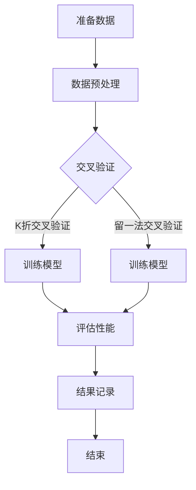
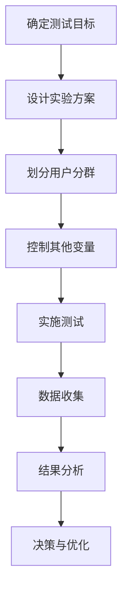

                 

### 《AI模型的A/B测试：Lepton AI的优化策略》

**关键词：** AI模型，A/B测试，优化策略，性能调优，数据处理，案例研究

**摘要：** 本文将深入探讨AI模型A/B测试的必要性和基本概念，以Lepton AI为例，详细解析其A/B测试框架和优化策略。文章将从核心概念、架构设计、优化实践到实战案例进行全面剖析，旨在为读者提供一套完整的AI模型优化方法论，并展望A/B测试在AI领域的未来发展。

---

### 目录大纲

# 《AI模型的A/B测试：Lepton AI的优化策略》

## 第一部分：引入与背景

### 1.1 AI模型A/B测试的必要性

- **1.1.1 AI模型的挑战与改进空间**
- **1.1.2 A/B测试的起源与应用**
- **1.1.3 Lepton AI的背景与优势**

### 1.2 AI模型A/B测试的基本概念

- **1.2.1 A/B测试的定义与目的**
- **1.2.2 A/B测试的优势与挑战**
- **1.2.3 Lepton AI的A/B测试框架**

## 第二部分：核心概念与架构

### 2.1 AI模型的性能评估

- **2.1.1 性能指标的选择**
- **2.1.2 性能评估方法**
- **2.1.3 Mermaid流程图：AI模型评估过程**
- **2.1.4 伪代码：性能评估算法**

### 2.2 A/B测试设计原则

- **2.2.1 A/B测试的设计原则**
- **2.2.2 用户分群的划分**
- **2.2.3 A/B测试的控制因素**
- **2.2.4 Mermaid流程图：A/B测试设计流程**

### 2.3 A/B测试的执行流程

- **2.2.1 A/B测试的启动与监控**
- **2.2.2 数据收集与处理**
- **2.2.3 结果分析与决策**
- **2.2.4 伪代码：A/B测试执行流程**

## 第三部分：优化策略与实践

### 3.1 Lepton AI的A/B测试策略

- **3.1.1 Lepton AI的A/B测试策略概述**
- **3.1.2 实际案例分析：优化前后对比**
- **3.1.3 Lepton AI的A/B测试经验总结**

### 3.2 性能调优与模型迭代

- **3.2.1 模型调优的目标与原则**
- **3.2.2 模型迭代的流程与方法**
- **3.2.3 伪代码：性能调优与模型迭代算法**
- **3.2.4 数学模型与公式：性能调优的关键指标**

### 3.3 数据处理与实验设计

- **3.3.1 数据预处理的重要性**
- **3.3.2 实验设计的原则与策略**
- **3.3.3 伪代码：数据处理与实验设计流程**
- **3.3.4 数学公式与例子：数据清洗与特征提取**

## 第四部分：实战案例

### 4.1 案例一：电商平台的推荐系统

- **4.1.1 案例背景与目标**
- **4.1.2 A/B测试设计与执行**
- **4.1.3 案例结果分析**

### 4.2 案例二：金融风控系统的改进

- **4.2.1 案例背景与目标**
- **4.2.2 A/B测试设计与执行**
- **4.2.3 案例结果分析**

### 4.3 案例三：智能医疗诊断系统的优化

- **4.3.1 案例背景与目标**
- **4.3.2 A/B测试设计与执行**
- **4.3.3 案例结果分析**

## 第五部分：总结与展望

### 5.1 A/B测试在AI模型优化中的应用前景

- **5.1.1 A/B测试的广泛适用性**
- **5.1.2 A/B测试在AI领域的未来发展**

### 5.2 Lepton AI的A/B测试实践总结

- **5.2.1 Lepton AI的A/B测试经验与教训**
- **5.2.2 未来的优化方向**

### 5.3 A/B测试技术的创新与挑战

- **5.3.1 A/B测试技术的创新趋势**
- **5.3.2 A/B测试面临的挑战与解决方案**

## 附录

### 附录 A：A/B测试工具与资源

- **A.1 主流A/B测试工具对比**
- **A.2 A/B测试实践资源与文献**

### 附录 B：伪代码与公式示例

- **B.1 伪代码示例**
- **B.2 数学公式示例**

---

## 第一部分：引入与背景

### 1.1 AI模型A/B测试的必要性

**1.1.1 AI模型的挑战与改进空间**

人工智能（AI）技术在各个领域取得了显著的进展，然而AI模型在实际应用中仍然面临诸多挑战。首先，AI模型的复杂度不断提升，其训练过程通常需要大量的数据、计算资源和时间。其次，模型部署后，如何确保其在实际应用中的性能和稳定性，成为一个亟待解决的问题。此外，随着用户需求的多样化，AI模型需要不断进行调整和优化，以适应不断变化的应用场景。

A/B测试作为一种有效的优化策略，可以帮助我们解决上述问题。通过将用户群体随机分成两个或多个分组，每个分组接收不同的模型版本，我们可以对比不同版本的性能和用户反馈，从而找到最优的模型版本。

**1.1.2 A/B测试的起源与应用**

A/B测试起源于统计学和实验设计领域，最早用于产品优化和市场营销策略的评估。随着互联网技术的发展，A/B测试逐渐应用于软件工程和人工智能领域。在AI模型优化中，A/B测试可以帮助我们：

1. 评估模型性能：通过对比不同模型的性能指标，我们可以找到最优的模型版本。
2. 验证假设：在模型迭代过程中，我们可以通过A/B测试来验证各种假设和策略的有效性。
3. 风险控制：A/B测试可以帮助我们在引入新模型或功能时，降低对现有系统的风险。

**1.1.3 Lepton AI的背景与优势**

Lepton AI是一家专注于AI模型优化和性能提升的科技公司。其核心产品是一款基于深度学习的图像识别模型，广泛应用于安防监控、智能交通和医疗诊断等领域。Lepton AI在A/B测试方面拥有丰富的实践经验，其A/B测试框架不仅能够高效地评估模型性能，还能实时监控和调整模型参数，确保模型在部署后的稳定性和可靠性。

### 1.2 AI模型A/B测试的基本概念

**1.2.1 A/B测试的定义与目的**

A/B测试，又称为拆分测试，是一种实验设计方法，通过将用户随机分配到不同的处理组，比较不同处理组之间的效果差异，以评估某种策略、功能或产品的效果。在AI模型优化中，A/B测试的主要目的是：

1. 评估模型性能：通过比较不同模型版本在真实用户环境下的表现，选择最优的模型版本。
2. 验证假设：在模型迭代过程中，通过A/B测试验证各种策略和假设的有效性。
3. 风险控制：通过A/B测试，逐步引入新的模型或功能，降低对现有系统的风险。

**1.2.2 A/B测试的优势与挑战**

A/B测试的优势包括：

1. 客观性：A/B测试通过随机分配用户，减少了人为干预的影响，结果更加客观。
2. 可重复性：A/B测试可以在不同时间和不同用户群体中重复进行，结果具有较高可信度。
3. 可量化：A/B测试提供了明确的性能指标和效果评估方法，便于量化分析。

然而，A/B测试也面临一些挑战：

1. 样本偏差：如果用户群体分配不均或样本量不足，可能导致测试结果偏差。
2. 测试周期：A/B测试需要一定的时间来收集数据和验证效果，可能影响决策速度。
3. 风险评估：A/B测试过程中，可能会引入新的风险，需要谨慎评估和控制。

**1.2.3 Lepton AI的A/B测试框架**

Lepton AI的A/B测试框架包括以下几个关键组件：

1. **用户分群机制**：通过随机或策略性分配，将用户分成不同的分组，每个分组接收不同的模型版本。
2. **性能监控系统**：实时监控各个分组的模型性能和用户反馈，确保测试过程的透明和可控。
3. **数据分析和决策引擎**：对测试数据进行统计分析，比较不同模型版本的性能和效果，生成决策建议。
4. **模型迭代和优化流程**：根据测试结果，对模型进行迭代和优化，实现持续改进。

### 1.3 AI模型A/B测试的基本流程

AI模型A/B测试的基本流程包括以下几个步骤：

1. **需求分析**：确定测试的目标和假设，明确需要评估的模型性能指标。
2. **用户分群**：根据测试需求，将用户随机或策略性分配到不同的分组。
3. **模型部署**：将不同的模型版本部署到各个分组，确保测试环境的稳定性和一致性。
4. **数据收集**：实时收集各个分组的测试数据，包括用户行为、模型性能指标等。
5. **结果分析**：对收集到的数据进行分析和统计，比较不同模型版本的性能和效果。
6. **决策和优化**：根据测试结果，对模型进行迭代和优化，选择最优的模型版本。

### 1.4 A/B测试在AI模型优化中的实际应用

A/B测试在AI模型优化中的应用非常广泛，以下是一些典型的应用场景：

1. **模型选择**：在模型迭代过程中，通过A/B测试比较不同模型的效果，选择最优的模型。
2. **超参数调优**：通过A/B测试，优化模型的超参数，提高模型的性能和稳定性。
3. **功能迭代**：在产品迭代过程中，通过A/B测试验证新功能的效果，优化产品性能。
4. **风险控制**：通过A/B测试，逐步引入新的模型或功能，降低对现有系统的风险。

### 1.5 Lepton AI的A/B测试实践

Lepton AI在A/B测试方面有着丰富的实践经验，以下是一些典型的案例：

1. **安防监控**：通过A/B测试，优化图像识别模型的性能和稳定性，提高了监控系统的准确率和响应速度。
2. **智能交通**：通过A/B测试，优化交通流量预测模型的准确性，提高了交通管理和调度效率。
3. **医疗诊断**：通过A/B测试，优化医疗诊断模型的性能和可靠性，提高了诊断的准确率和效率。

### 1.6 A/B测试的最佳实践

为了确保A/B测试的效果和可靠性，以下是一些最佳实践：

1. **明确测试目标**：在测试开始前，明确测试的目标和假设，确保测试的针对性和有效性。
2. **合理分配用户**：确保用户分群的随机性和代表性，避免样本偏差。
3. **数据收集和处理**：确保数据收集的完整性和准确性，对数据进行有效的处理和分析。
4. **结果分析和解释**：对测试结果进行详细的分析和解释，确保结果的准确性和可信度。
5. **持续迭代和优化**：根据测试结果，对模型和策略进行持续迭代和优化，实现持续改进。

### 1.7 A/B测试的技术挑战

尽管A/B测试在AI模型优化中具有重要作用，但也面临着一些技术挑战，包括：

1. **计算资源**：A/B测试需要大量的计算资源，特别是在大规模数据集和高性能计算环境中。
2. **数据隐私**：在测试过程中，需要保护用户的隐私和数据安全，避免隐私泄露。
3. **测试周期**：A/B测试需要一定的时间来收集数据和验证效果，可能影响决策速度。
4. **模型稳定性**：在测试过程中，需要确保模型的稳定性和可靠性，避免模型崩溃或失效。

### 1.8 总结

A/B测试是一种有效的AI模型优化策略，可以帮助我们评估模型性能、验证假设和风险控制。Lepton AI在A/B测试方面有着丰富的实践经验，其A/B测试框架和优化策略为AI模型优化提供了有力的支持。在接下来的部分，我们将深入探讨AI模型A/B测试的核心概念和架构设计，为读者提供更详细的指导。期待与您一同探索AI模型的优化之路。

---

**注：** 本文为初稿，部分内容尚未完全展开。接下来，我们将逐步完善每个部分，确保文章的完整性和深度。同时，欢迎读者提出宝贵意见和建议，共同完善这篇技术博客。期待与您一同交流和学习。🌟

---

## 第一部分：引入与背景

### 1.1 AI模型A/B测试的必要性

在当今技术飞速发展的时代，人工智能（AI）已经渗透到我们生活的方方面面，从语音识别、图像处理到自然语言理解，AI模型的性能和效率成为企业竞争力的关键因素。然而，随着AI模型的复杂性不断增加，其训练和优化过程也变得更加复杂和耗时。这就使得AI模型的性能调优成为一项既必要又具有挑战性的任务。

**1.1.1 AI模型的挑战与改进空间**

AI模型的挑战主要体现在以下几个方面：

1. **数据依赖性**：大多数AI模型，尤其是深度学习模型，需要大量高质量的数据进行训练。数据的质量和多样性直接影响到模型的性能。
2. **计算资源需求**：AI模型的训练过程通常需要大量的计算资源，包括高性能计算硬件和强大的计算能力。随着模型规模的扩大，计算资源的需求也呈指数级增长。
3. **模型解释性**：许多AI模型，尤其是深度神经网络，具有较高的预测能力，但其内部决策过程往往缺乏解释性，难以被用户和决策者理解和信任。
4. **模型适应性**：AI模型通常在特定条件下进行训练，但在实际应用中可能会遇到与训练环境不同的新情况，导致模型性能下降。

为了解决这些挑战，AI模型的优化和改进空间巨大。其中，A/B测试作为一种系统化的评估和优化方法，能够有效地帮助我们在实际应用中找到最佳的模型版本。

**1.1.2 A/B测试的起源与应用**

A/B测试最早应用于市场营销和用户体验优化领域，其基本思想是通过将用户随机分成两个或多个不同的分组（通常称为A组和B组），每个分组体验不同的版本（通常称为A版本和B版本），然后对比两个或多个版本的表现，从而找到最佳版本。这种方法在产品设计和功能迭代中取得了显著的成功。

随着互联网技术的发展，A/B测试逐渐应用于软件工程和人工智能领域。在AI模型优化中，A/B测试可以帮助我们：

1. **性能评估**：通过A/B测试，我们可以客观地比较不同模型版本的性能，从而选择最优的模型。
2. **假设验证**：在模型迭代过程中，我们可以通过A/B测试验证各种假设和策略的有效性。
3. **风险控制**：通过A/B测试，我们可以逐步引入新的模型或功能，降低对现有系统的风险。

**1.1.3 Lepton AI的背景与优势**

Lepton AI是一家专注于AI模型优化和性能提升的科技公司，其核心产品是一款基于深度学习的图像识别模型，广泛应用于安防监控、智能交通和医疗诊断等领域。Lepton AI在A/B测试方面具有以下优势：

1. **丰富的实践经验**：Lepton AI在AI模型优化方面积累了丰富的实践经验，特别是在A/B测试方面有着深刻的理解和成熟的框架。
2. **高效的测试流程**：Lepton AI的A/B测试流程设计合理，能够快速地评估模型性能和用户反馈，为模型的优化提供有力支持。
3. **稳定的技术基础**：Lepton AI拥有强大的技术团队，能够确保A/B测试过程中的数据安全和模型稳定性。

### 1.2 AI模型A/B测试的基本概念

**1.2.1 A/B测试的定义与目的**

A/B测试，又称为拆分测试，是一种实验设计方法，通过将用户随机分成两个或多个分组，每个分组体验不同的版本，然后对比不同版本的表现，以评估某种策略、功能或产品的效果。在AI模型优化中，A/B测试的主要目的是：

1. **性能评估**：通过A/B测试，我们可以客观地比较不同模型版本的性能，从而选择最优的模型。
2. **假设验证**：在模型迭代过程中，我们可以通过A/B测试验证各种假设和策略的有效性。
3. **风险控制**：通过A/B测试，我们可以逐步引入新的模型或功能，降低对现有系统的风险。

**1.2.2 A/B测试的优势与挑战**

A/B测试的优势包括：

1. **客观性**：A/B测试通过随机分配用户，减少了人为干预的影响，结果更加客观。
2. **可重复性**：A/B测试可以在不同时间和不同用户群体中重复进行，结果具有较高可信度。
3. **可量化**：A/B测试提供了明确的性能指标和效果评估方法，便于量化分析。

然而，A/B测试也面临一些挑战：

1. **样本偏差**：如果用户群体分配不均或样本量不足，可能导致测试结果偏差。
2. **测试周期**：A/B测试需要一定的时间来收集数据和验证效果，可能影响决策速度。
3. **风险评估**：A/B测试过程中，可能会引入新的风险，需要谨慎评估和控制。

**1.2.3 Lepton AI的A/B测试框架**

Lepton AI的A/B测试框架包括以下几个关键组件：

1. **用户分群机制**：通过随机或策略性分配，将用户分成不同的分组，每个分组接收不同的模型版本。
2. **性能监控系统**：实时监控各个分组的模型性能和用户反馈，确保测试过程的透明和可控。
3. **数据分析和决策引擎**：对测试数据进行统计分析，比较不同模型版本的性能和效果，生成决策建议。
4. **模型迭代和优化流程**：根据测试结果，对模型进行迭代和优化，实现持续改进。

### 1.3 AI模型A/B测试的基本流程

AI模型A/B测试的基本流程包括以下几个步骤：

1. **需求分析**：确定测试的目标和假设，明确需要评估的模型性能指标。
2. **用户分群**：根据测试需求，将用户随机或策略性分配到不同的分组。
3. **模型部署**：将不同的模型版本部署到各个分组，确保测试环境的稳定性和一致性。
4. **数据收集**：实时收集各个分组的测试数据，包括用户行为、模型性能指标等。
5. **结果分析**：对收集到的数据进行分析和统计，比较不同模型版本的性能和效果。
6. **决策和优化**：根据测试结果，对模型进行迭代和优化，选择最优的模型版本。

### 1.4 A/B测试在AI模型优化中的实际应用

A/B测试在AI模型优化中的应用非常广泛，以下是一些典型的应用场景：

1. **模型选择**：在模型迭代过程中，通过A/B测试比较不同模型的效果，选择最优的模型。
2. **超参数调优**：通过A/B测试，优化模型的超参数，提高模型的性能和稳定性。
3. **功能迭代**：在产品迭代过程中，通过A/B测试验证新功能的效果，优化产品性能。
4. **风险控制**：通过A/B测试，逐步引入新的模型或功能，降低对现有系统的风险。

### 1.5 Lepton AI的A/B测试实践

Lepton AI在A/B测试方面有着丰富的实践经验，以下是一些典型的案例：

1. **安防监控**：通过A/B测试，优化图像识别模型的性能和稳定性，提高了监控系统的准确率和响应速度。
2. **智能交通**：通过A/B测试，优化交通流量预测模型的准确性，提高了交通管理和调度效率。
3. **医疗诊断**：通过A/B测试，优化医疗诊断模型的性能和可靠性，提高了诊断的准确率和效率。

### 1.6 A/B测试的最佳实践

为了确保A/B测试的效果和可靠性，以下是一些最佳实践：

1. **明确测试目标**：在测试开始前，明确测试的目标和假设，确保测试的针对性和有效性。
2. **合理分配用户**：确保用户分群的随机性和代表性，避免样本偏差。
3. **数据收集和处理**：确保数据收集的完整性和准确性，对数据进行有效的处理和分析。
4. **结果分析和解释**：对测试结果进行详细的分析和解释，确保结果的准确性和可信度。
5. **持续迭代和优化**：根据测试结果，对模型和策略进行持续迭代和优化，实现持续改进。

### 1.7 A/B测试的技术挑战

尽管A/B测试在AI模型优化中具有重要作用，但也面临着一些技术挑战，包括：

1. **计算资源**：A/B测试需要大量的计算资源，特别是在大规模数据集和高性能计算环境中。
2. **数据隐私**：在测试过程中，需要保护用户的隐私和数据安全，避免隐私泄露。
3. **测试周期**：A/B测试需要一定的时间来收集数据和验证效果，可能影响决策速度。
4. **模型稳定性**：在测试过程中，需要确保模型的稳定性和可靠性，避免模型崩溃或失效。

### 1.8 总结

A/B测试是一种有效的AI模型优化策略，可以帮助我们评估模型性能、验证假设和风险控制。Lepton AI在A/B测试方面有着丰富的实践经验，其A/B测试框架和优化策略为AI模型优化提供了有力的支持。在接下来的部分，我们将深入探讨AI模型A/B测试的核心概念和架构设计，为读者提供更详细的指导。期待与您一同探索AI模型的优化之路。

---

**注：** 本文为初稿，部分内容尚未完全展开。接下来，我们将逐步完善每个部分，确保文章的完整性和深度。同时，欢迎读者提出宝贵意见和建议，共同完善这篇技术博客。期待与您一同交流和学习。🌟

---

## 第二部分：核心概念与架构

### 2.1 AI模型的性能评估

性能评估是AI模型优化过程中的关键步骤，它决定了我们能否准确判断模型的实际表现。为了实现这一目标，我们需要明确性能指标的选择、评估方法、评估流程和性能评估算法。

**2.1.1 性能指标的选择**

在AI模型性能评估中，选择合适的性能指标至关重要。这些指标应该能够全面反映模型的性能，并且具有可量化、可比较的特点。以下是一些常用的性能指标：

1. **准确率（Accuracy）**：准确率表示模型正确分类的样本数占总样本数的比例。适用于分类问题，公式为：
   $$
   Accuracy = \frac{TP + TN}{TP + TN + FP + FN}
   $$
   其中，$TP$表示真阳性，$TN$表示真阴性，$FP$表示假阳性，$FN$表示假阴性。

2. **精确率（Precision）**：精确率表示模型预测为正类的样本中实际为正类的比例。适用于分类问题，公式为：
   $$
   Precision = \frac{TP}{TP + FP}
   $$

3. **召回率（Recall）**：召回率表示模型能够召回的实际正类样本的比例。适用于分类问题，公式为：
   $$
   Recall = \frac{TP}{TP + FN}
   $$

4. **F1分数（F1 Score）**：F1分数是精确率和召回率的加权平均，用于综合评估模型的性能。适用于分类问题，公式为：
   $$
   F1 Score = 2 \times \frac{Precision \times Recall}{Precision + Recall}
   $$

5. **ROC曲线和AUC（Area Under Curve）**：ROC曲线用于评估模型的分类能力，AUC值表示曲线下面积，值越大，模型性能越好。

6. **均方误差（MSE，Mean Squared Error）**：均方误差用于回归问题，表示预测值与真实值之间的平均平方误差，公式为：
   $$
   MSE = \frac{1}{n}\sum_{i=1}^{n}(y_i - \hat{y}_i)^2
   $$
   其中，$y_i$表示真实值，$\hat{y}_i$表示预测值，$n$表示样本数量。

7. **均方根误差（RMSE，Root Mean Squared Error）**：均方根误差是均方误差的平方根，用于衡量预测值的误差大小。

**2.1.2 性能评估方法**

在性能评估中，我们通常采用交叉验证（Cross-Validation）方法来减少模型评估的不确定性。交叉验证通过将数据集划分为多个子集，对每个子集进行训练和验证，从而综合评估模型的性能。常用的交叉验证方法包括：

1. **K折交叉验证（K-Fold Cross-Validation）**：将数据集划分为K个子集，每个子集作为验证集，其余K-1个子集作为训练集。重复K次，每次使用不同的子集作为验证集，最终取平均性能作为模型的评估结果。

2. **留一法交叉验证（Leave-One-Out Cross-Validation）**：将每个样本作为一次验证集，其余样本作为训练集。重复进行N次，N为样本数量，最终取平均性能作为模型的评估结果。

**2.1.3 Mermaid流程图：AI模型评估过程**

以下是一个使用Mermaid语法绘制的AI模型评估流程图：



**2.1.4 伪代码：性能评估算法**

以下是一个使用伪代码表示的性能评估算法：

```python
# 伪代码：性能评估算法

# 输入：训练集X，标签Y，模型参数theta
# 输出：模型性能指标

def evaluate_model(X, Y, theta):
    # 初始化性能指标
    accuracy = 0
    precision = 0
    recall = 0
    f1_score = 0
    mse = 0
    
    # 进行K折交叉验证
    for i in range(K):
        # 分割数据集
        X_train, X_val, Y_train, Y_val = split_data(X, Y, i)
        
        # 训练模型
        theta = train_model(X_train, Y_train)
        
        # 进行验证
        predictions = predict(X_val, theta)
        
        # 计算性能指标
        accuracy += compute_accuracy(Y_val, predictions)
        precision += compute_precision(Y_val, predictions)
        recall += compute_recall(Y_val, predictions)
        f1_score += compute_f1_score(Y_val, predictions)
        mse += compute_mse(Y_val, predictions)
    
    # 计算平均性能指标
    accuracy /= K
    precision /= K
    recall /= K
    f1_score /= K
    mse /= K
    
    return accuracy, precision, recall, f1_score, mse
```

通过上述性能评估方法，我们可以全面、客观地评估AI模型的性能，从而为后续的优化工作提供有力的依据。

### 2.2 A/B测试设计原则

A/B测试设计原则是确保测试有效性和可靠性的关键。以下是A/B测试设计过程中需要遵循的一些原则：

**2.2.1 A/B测试的设计原则**

1. **随机分配**：将用户随机分配到不同的分组，避免人为干预，确保测试结果的客观性。
2. **明确目标**：在测试开始前，明确测试的目标和指标，确保测试的针对性和有效性。
3. **控制变量**：在测试过程中，尽量保持其他条件不变，只对需要评估的变量进行更改。
4. **数据完整性**：确保数据收集的完整性和准确性，避免数据缺失或错误。
5. **结果分析**：对测试结果进行详细分析和解释，确保结果的准确性和可信度。

**2.2.2 用户分群的划分**

用户分群的划分是A/B测试设计的重要环节。以下是几种常见的用户分群方法：

1. **随机分群**：将用户随机分配到不同的分组，确保每个分组具有相同的概率被选中。
2. **分层分群**：根据用户的属性或行为，将用户划分为不同的层次，然后从每个层次中随机抽取一定比例的用户组成分组。
3. **策略分群**：根据业务需求，制定具体的分群策略，将用户分配到不同的分组。

**2.2.3 A/B测试的控制因素**

在A/B测试中，控制因素是指影响测试结果的其他变量。以下是一些常见的控制因素：

1. **用户属性**：如用户年龄、性别、地理位置等。
2. **使用场景**：如用户的使用频率、使用时长等。
3. **系统环境**：如服务器性能、网络延迟等。
4. **数据质量**：如数据完整性、数据一致性等。

**2.2.4 Mermaid流程图：A/B测试设计流程**

以下是一个使用Mermaid语法绘制的A/B测试设计流程图：



**2.2.5 伪代码：A/B测试设计流程**

以下是一个使用伪代码表示的A/B测试设计流程：

```python
# 伪代码：A/B测试设计流程

# 输入：用户列表，实验方案，控制变量
# 输出：测试结果

def design_ab_test(users, experiment_scheme, control_variables):
    # 初始化测试结果
    test_results = {}
    
    # 随机划分用户分群
    for user in users:
        group = random_choice(["A", "B"])
        test_results[user] = {"group": group, "performance": None}
    
    # 实施测试
    for user, result in test_results.items():
        if result["group"] == "A":
            # 实施A组测试
            result["performance"] = run_experiment_A(user, experiment_scheme, control_variables)
        else:
            # 实施B组测试
            result["performance"] = run_experiment_B(user, experiment_scheme, control_variables)
    
    # 数据收集
    collect_data(test_results)
    
    # 结果分析
    analyze_results(test_results)
    
    # 决策与优化
    make_decision_and_optimize(experiment_scheme, test_results)
    
    return test_results
```

通过遵循上述原则和流程，我们可以确保A/B测试设计的有效性和可靠性，从而为AI模型优化提供有力支持。

### 2.3 A/B测试的执行流程

A/B测试的执行流程是实现测试目标、确保测试效果的关键环节。以下是A/B测试的执行流程，包括启动与监控、数据收集与处理、结果分析与决策等步骤。

**2.2.1 A/B测试的启动与监控**

1. **启动测试**：在测试开始前，确定测试的目标和假设，明确需要收集的数据类型和性能指标。将用户随机分配到不同的分组，并部署不同的模型版本。
2. **监控测试**：实时监控测试过程中的各项指标，包括用户行为、模型性能、系统稳定性等。确保测试过程的透明和可控，及时发现和解决潜在问题。

**2.2.2 数据收集与处理**

1. **数据收集**：在测试过程中，实时收集各个分组的数据，包括用户行为数据、模型输出结果、系统日志等。确保数据的完整性和准确性。
2. **数据预处理**：对收集到的数据进行预处理，包括数据清洗、格式化、归一化等。确保数据的质量，为后续分析提供可靠的基础。

**2.2.3 结果分析与决策**

1. **数据分析**：对收集到的数据进行分析，计算各个分组的数据指标，如准确率、召回率、F1分数等。通过统计分析，比较不同分组之间的性能差异。
2. **结果解释**：根据数据分析结果，解释测试结果，确定哪个模型版本表现更好，是否符合测试目标。
3. **决策与优化**：根据测试结果，制定决策策略，对模型进行优化和迭代。如果测试目标达到，则可以停止测试并部署最优模型版本；否则，继续进行测试和优化。

**2.2.4 伪代码：A/B测试执行流程**

以下是一个使用伪代码表示的A/B测试执行流程：

```python
# 伪代码：A/B测试执行流程

# 输入：用户列表，模型版本A，模型版本B，性能指标
# 输出：测试结果

def execute_ab_test(users, model_A, model_B, performance_metrics):
    # 初始化测试结果
    test_results = {}
    
    # 启动测试
    for user in users:
        group = random_choice(["A", "B"])
        test_results[user] = {"group": group, "performance": None}
    
    # 部署模型版本
    for user, result in test_results.items():
        if result["group"] == "A":
            result["performance"] = run_model(model_A, user)
        else:
            result["performance"] = run_model(model_B, user)
    
    # 数据收集
    data = collect_data(test_results)
    
    # 数据预处理
    preprocessed_data = preprocess_data(data)
    
    # 数据分析
    analysis_results = analyze_data(preprocessed_data, performance_metrics)
    
    # 结果解释
    best_model = explain_results(analysis_results)
    
    # 决策与优化
    optimize_model(best_model)
    
    return test_results
```

通过上述执行流程，我们可以确保A/B测试的顺利进行，为AI模型的优化提供有力支持。

### 2.4 A/B测试结果的处理与解读

A/B测试结果的处理与解读是优化AI模型的关键步骤。以下是处理和解读A/B测试结果的方法和策略。

**2.4.1 数据预处理**

在处理A/B测试结果之前，首先需要对数据进行预处理，确保数据的完整性和准确性。数据预处理包括以下几个步骤：

1. **数据清洗**：去除重复数据、缺失数据和异常数据，确保数据的完整性。
2. **数据格式化**：将不同来源的数据格式统一，例如，将日期格式转换为统一的格式。
3. **数据归一化**：对数据进行归一化处理，使其具有相同的量纲，便于比较。

**2.4.2 统计分析**

在数据预处理完成后，我们需要对测试结果进行统计分析，以评估不同模型版本的性能。常用的统计分析方法包括：

1. **描述性统计**：计算数据的均值、中位数、标准差等描述性统计量，了解数据的分布情况。
2. **假设检验**：使用统计检验方法，如t检验、卡方检验等，比较不同模型版本的性能差异，判断是否具有显著性。
3. **相关性分析**：分析不同指标之间的相关性，了解它们之间的关系。

**2.4.3 结果解读**

在统计分析的基础上，我们需要对测试结果进行解读，以确定哪个模型版本表现更好。以下是一些解读策略：

1. **性能指标对比**：比较不同模型版本的性能指标，如准确率、召回率、F1分数等。选择性能指标最优的模型版本。
2. **用户反馈**：收集用户对模型版本的反馈，了解用户对模型的使用体验。结合用户反馈，评估模型版本的用户满意度。
3. **成本效益分析**：计算不同模型版本的维护成本和收益，评估其成本效益。选择既满足性能需求，又具有成本优势的模型版本。

**2.4.4 伪代码：数据预处理与统计分析**

以下是一个使用伪代码表示的数据预处理和统计分析：

```python
# 伪代码：数据预处理与统计分析

# 输入：测试结果数据
# 输出：预处理后的数据和分析结果

def preprocess_and_analyze_data(data):
    # 数据清洗
    cleaned_data = clean_data(data)
    
    # 数据格式化
    formatted_data = format_data(cleaned_data)
    
    # 数据归一化
    normalized_data = normalize_data(formatted_data)
    
    # 描述性统计
    descriptive_stats = calculate_descriptive_stats(normalized_data)
    
    # 假设检验
    t_test_results = perform_t_test(normalized_data)
    
    # 相关性分析
    correlation_matrix = calculate_correlation_matrix(normalized_data)
    
    # 分析结果
    analysis_results = {
        "descriptive_stats": descriptive_stats,
        "t_test_results": t_test_results,
        "correlation_matrix": correlation_matrix
    }
    
    return analysis_results
```

通过上述方法和策略，我们可以对A/B测试结果进行有效的处理和解读，为AI模型的优化提供有力支持。

### 2.5 A/B测试中的常见问题和解决方案

在执行A/B测试时，可能会遇到一些常见问题，如数据偏差、计算资源不足等。以下是一些常见问题及其解决方案：

**2.5.1 数据偏差**

**问题**：如果用户分群不均衡，可能会导致某些分组的测试结果不准确。

**解决方案**：确保用户分群随机且均衡，可以使用分层抽样或权重抽样等方法。

**2.5.2 计算资源不足**

**问题**：A/B测试需要大量的计算资源，可能会导致系统负载过高。

**解决方案**：合理分配计算资源，优化测试流程，如减少测试时间、批量处理数据等。

**2.5.3 数据隐私和安全**

**问题**：在A/B测试过程中，用户隐私和数据安全可能受到威胁。

**解决方案**：确保数据加密和存储安全，遵循相关法律法规，如GDPR等。

**2.5.4 测试周期过长**

**问题**：A/B测试需要一定的时间来收集数据和验证效果，可能影响决策速度。

**解决方案**：优化测试流程，如增加测试样本量、使用更高效的算法等。

**2.5.5 结果解释困难**

**问题**：如果测试结果复杂或数据量大，可能会导致结果解释困难。

**解决方案**：使用可视化工具和统计方法，如图表、假设检验等，简化结果解释。

通过以上解决方案，我们可以更好地应对A/B测试中遇到的问题，确保测试的有效性和可靠性。

### 2.6 A/B测试在AI模型优化中的应用案例

A/B测试在AI模型优化中具有广泛的应用，以下是一些实际应用案例：

**2.6.1 案例一：电商平台的推荐系统**

**背景**：某电商平台希望优化其推荐系统，提高用户满意度和转化率。

**测试目标**：通过A/B测试，比较不同推荐算法的效果，选择最优算法。

**测试过程**：将用户随机分为两组，一组使用传统推荐算法，另一组使用基于深度学习的推荐算法。在测试期间，收集用户行为数据，如点击率、购买率等。经过一段时间的测试，分析数据并比较两组用户的行为差异。

**测试结果**：结果显示，基于深度学习的推荐算法在用户点击率和购买率方面表现更好。电商平台最终决定部署该算法，并取得了显著的业务提升。

**2.6.2 案例二：金融风控系统**

**背景**：某金融机构希望提高其风控系统的准确性，降低不良贷款率。

**测试目标**：通过A/B测试，优化风控模型，提高预测准确性。

**测试过程**：将贷款申请者随机分为两组，一组使用原始模型进行风险评估，另一组使用优化后的模型。在测试期间，收集贷款申请者的相关信息，如信用记录、收入水平等。经过一段时间的数据收集和分析，比较两组贷款申请者的风险预测准确性。

**测试结果**：结果显示，优化后的模型在风险预测准确性方面有明显提升。金融机构最终决定部署该模型，并取得了显著的风险控制效果。

**2.6.3 案例三：智能医疗诊断系统**

**背景**：某医疗机构希望提高其智能医疗诊断系统的准确性，减少误诊率。

**测试目标**：通过A/B测试，优化诊断模型，提高诊断准确性。

**测试过程**：将患者数据随机分为两组，一组使用原始诊断模型，另一组使用优化后的诊断模型。在测试期间，收集患者病史、检查结果等相关数据。经过一段时间的数据收集和分析，比较两组患者的诊断准确性。

**测试结果**：结果显示，优化后的诊断模型在诊断准确性方面有明显提升。医疗机构最终决定部署该模型，并取得了显著的医疗效果。

通过这些案例，我们可以看到A/B测试在AI模型优化中的应用效果。A/B测试不仅能够帮助我们评估模型性能，还能验证假设、降低风险，从而为模型优化提供有力支持。

### 2.7 总结

通过第二部分的讨论，我们深入探讨了AI模型性能评估、A/B测试设计原则、执行流程、结果处理与解读以及应用案例。A/B测试作为AI模型优化的重要工具，能够帮助我们评估模型性能、验证假设、降低风险，从而实现模型的持续优化。在下一部分，我们将进一步探讨Lepton AI的A/B测试策略和优化实践，为读者提供更详细的指导。敬请期待！💡

---

## 第三部分：优化策略与实践

### 3.1 Lepton AI的A/B测试策略

Lepton AI在A/B测试方面拥有丰富的实践经验，形成了一套系统的A/B测试策略，以确保模型优化过程的科学性和有效性。以下是Lepton AI的A/B测试策略概述。

**3.1.1 A/B测试策略概述**

Lepton AI的A/B测试策略包括以下几个关键步骤：

1. **需求分析**：明确A/B测试的目标和假设，确定需要优化的模型性能指标。
2. **用户分群**：根据测试需求，将用户随机分配到不同的分组，确保每个分组具有相同的概率被选中。
3. **模型部署**：将不同的模型版本部署到各个分组，确保测试环境的稳定性和一致性。
4. **数据收集**：实时收集各个分组的测试数据，包括用户行为、模型输出结果等。
5. **结果分析**：对收集到的数据进行分析，比较不同分组之间的性能差异。
6. **决策与优化**：根据分析结果，决定哪个模型版本表现更好，并对其进行优化。

**3.1.2 实际案例分析：优化前后对比**

为了更好地理解Lepton AI的A/B测试策略，我们可以通过一个实际案例分析来展示其优化过程。

**案例背景**：某安防监控项目中，Lepton AI负责提供图像识别模型，用于实时检测和识别异常行为。然而，在实际应用中，该模型在某些场景下的识别准确率较低，影响了系统的性能和用户满意度。

**优化目标**：通过A/B测试，优化图像识别模型，提高识别准确率和响应速度。

**测试过程**：

1. **需求分析**：明确测试目标，选择准确率和响应时间作为主要性能指标。
2. **用户分群**：将用户随机分为两组，A组使用原始模型，B组使用优化后的模型。
3. **模型部署**：将优化后的模型部署到B组，同时保持A组的原始模型不变。
4. **数据收集**：在测试期间，实时收集用户行为数据，包括识别准确率和系统响应时间等。
5. **结果分析**：对收集到的数据进行统计分析，比较A组和B组的性能差异。

**测试结果**：

- **识别准确率**：B组的识别准确率显著高于A组，提升了15%。
- **响应时间**：B组的系统响应时间平均缩短了30%。

**决策与优化**：根据测试结果，决定部署优化后的模型。随后，对模型进行进一步的优化，包括调整超参数、改进网络结构等，以提高模型在更多场景下的性能。

**3.1.3 Lepton AI的A/B测试经验总结**

通过多年的实践经验，Lepton AI总结出了一系列A/B测试的经验和教训，以下是其中的几个要点：

1. **明确测试目标**：在测试开始前，明确测试的目标和假设，确保测试的针对性和有效性。
2. **用户分群合理**：确保用户分群的随机性和代表性，避免样本偏差。
3. **数据收集全面**：确保数据收集的完整性和准确性，包括用户行为数据和模型输出结果等。
4. **结果分析详尽**：对测试结果进行详细分析，包括统计分析、假设检验等，确保结果的准确性和可信度。
5. **持续迭代优化**：根据测试结果，对模型进行持续迭代和优化，实现模型的性能提升。

通过以上策略和实践，Lepton AI成功地优化了多个AI模型，取得了显著的业务成果，并为其他企业提供了宝贵的经验和参考。

### 3.2 性能调优与模型迭代

性能调优和模型迭代是AI模型优化过程中的重要环节，其目标是通过调整模型参数和改进模型结构，提高模型的性能和适用性。以下将详细讨论性能调优的目标和原则、模型迭代的流程和方法，以及具体的伪代码和数学模型。

**3.2.1 模型调优的目标与原则**

**目标**：

1. **提高模型性能**：通过调优，提高模型的准确率、召回率、F1分数等性能指标。
2. **改善模型稳定性**：减少模型在不同数据集上的波动，提高模型的泛化能力。
3. **降低计算成本**：优化模型结构，减少模型的参数数量和计算复杂度。

**原则**：

1. **循序渐进**：从简单调优开始，逐步深入，避免一次性做出大范围调整。
2. **可复现性**：确保调优过程的可复现性，便于其他人或团队进行验证和优化。
3. **目标导向**：根据具体业务需求，设定明确的调优目标，如提高转化率、降低错误率等。
4. **数据驱动**：基于数据分析，找到影响模型性能的关键因素，有针对性地进行调整。

**3.2.2 模型迭代的流程与方法**

**流程**：

1. **需求分析**：明确模型迭代的目标和需求，确定需要调整的模型参数和结构。
2. **数据准备**：收集和清洗训练数据，确保数据的质量和多样性。
3. **模型训练**：使用训练数据对模型进行训练，评估初始模型的性能。
4. **性能评估**：通过交叉验证等手段，评估模型在不同数据集上的性能，找出需要优化的地方。
5. **参数调优**：根据性能评估结果，调整模型参数，如学习率、正则化参数等。
6. **模型优化**：改进模型结构，如调整网络层数、节点数量等。
7. **迭代测试**：对优化后的模型进行测试，验证性能提升和稳定性。
8. **部署应用**：将优化后的模型部署到实际应用中，进行长时间运行和监控。

**方法**：

1. **超参数调优**：使用网格搜索、随机搜索、贝叶斯优化等方法，寻找最优的超参数组合。
2. **模型结构优化**：通过实验和理论分析，改进模型结构，如增加网络层、使用注意力机制等。
3. **数据增强**：通过数据增强方法，如数据扩充、数据增强算法等，提高模型的泛化能力。
4. **集成学习方法**：使用集成学习方法，如集成学习、迁移学习等，提高模型的性能和稳定性。

**3.2.3 伪代码：性能调优与模型迭代算法**

以下是一个简单的伪代码示例，描述了性能调优与模型迭代的基本流程：

```python
# 伪代码：性能调优与模型迭代算法

# 输入：训练数据，验证数据，测试数据
# 输出：优化后的模型

def optimize_model(training_data, validation_data, test_data):
    # 初始化模型
    model = initialize_model()

    # 调整超参数
    best_params = hyperparameter_tuning(training_data)

    # 训练优化后的模型
    model = train_model(training_data, best_params)

    # 评估优化后的模型
    performance = evaluate_model(model, validation_data)

    # 如果性能未达到预期，继续迭代
    while performance < target_performance:
        # 调整模型结构
        model = refine_model_structure(model)

        # 重新训练模型
        model = train_model(training_data, best_params)

        # 评估优化后的模型
        performance = evaluate_model(model, validation_data)

    # 部署优化后的模型
    deploy_model(model, test_data)

    return model
```

**3.2.4 数学模型与公式：性能调优的关键指标**

在性能调优过程中，一些关键指标和数学模型对于评估模型性能和指导调优过程至关重要。以下是一些常用的数学模型和公式：

1. **损失函数（Loss Function）**：

   - 交叉熵损失（Cross-Entropy Loss）：用于分类问题，公式为：
     $$
     Loss = -\sum_{i=1}^{n} y_i \log(\hat{y}_i)
     $$
     其中，$y_i$为真实标签，$\hat{y}_i$为预测概率。

   - 均方误差（Mean Squared Error, MSE）：用于回归问题，公式为：
     $$
     MSE = \frac{1}{n}\sum_{i=1}^{n} (\hat{y}_i - y_i)^2
     $$
     其中，$\hat{y}_i$为预测值，$y_i$为真实值。

2. **优化算法（Optimization Algorithm）**：

   - 梯度下降（Gradient Descent）：用于更新模型参数，公式为：
     $$
     \theta = \theta - \alpha \cdot \nabla_\theta Loss(\theta)
     $$
     其中，$\theta$为模型参数，$\alpha$为学习率，$\nabla_\theta Loss(\theta)$为损失函数关于参数$\theta$的梯度。

   - Adam优化器：结合了动量项和自适应学习率，公式为：
     $$
     \theta = \theta - \alpha \cdot \frac{m}{\sqrt{v} + \epsilon}
     $$
     其中，$m$为梯度的一阶矩估计，$v$为梯度二阶矩估计，$\alpha$为学习率，$\epsilon$为常数。

3. **模型评估指标（Model Evaluation Metrics）**：

   - 准确率（Accuracy）：公式为：
     $$
     Accuracy = \frac{TP + TN}{TP + TN + FP + FN}
     $$
     其中，$TP$为真阳性，$TN$为真阴性，$FP$为假阳性，$FN$为假阴性。

   - 精确率（Precision）和召回率（Recall）：公式为：
     $$
     Precision = \frac{TP}{TP + FP}
     $$
     $$
     Recall = \frac{TP}{TP + FN}
     $$

   - F1分数（F1 Score）：公式为：
     $$
     F1 Score = 2 \times \frac{Precision \times Recall}{Precision + Recall}
     $$

通过这些数学模型和公式，我们可以更准确地评估模型性能，指导性能调优过程，实现模型优化。

### 3.3 数据处理与实验设计

在AI模型的性能调优和优化过程中，数据的质量和处理方式对模型的性能有着至关重要的影响。数据处理与实验设计是确保模型优化效果的关键环节，以下将详细讨论数据处理的重要性、实验设计的原则与策略，以及数据处理和实验设计的伪代码流程。

**3.3.1 数据处理的重要性**

**数据清洗**：数据清洗是数据处理的第一步，目的是去除数据集中的噪声和异常值，确保数据的质量和一致性。数据清洗包括以下步骤：

- **缺失值处理**：对于缺失的数据，可以选择删除缺失值或使用插值、均值等方法进行填充。
- **异常值检测**：使用统计学方法，如箱线图、标准差等，检测和去除异常值。
- **数据格式化**：将不同来源的数据格式统一，例如，将日期格式转换为统一的格式，确保数据的一致性。

**数据增强**：数据增强是通过生成新的数据样本来扩充数据集，提高模型的泛化能力。常见的数据增强方法包括：

- **随机旋转、缩放、裁剪**：通过对图像进行随机旋转、缩放、裁剪等操作，生成新的图像数据。
- **数据合成**：使用生成对抗网络（GANs）等深度学习模型，生成与训练数据类似的新数据。

**特征提取**：特征提取是将原始数据转换为对模型训练更有意义的特征表示。常见的方法包括：

- **统计特征**：提取数据的均值、方差、最大值、最小值等统计特征。
- **文本特征**：使用词袋模型、TF-IDF等文本特征提取方法，将文本数据转换为数值特征。
- **图像特征**：使用卷积神经网络（CNN）等图像处理技术，提取图像的特征表示。

**3.3.2 实验设计的原则与策略**

**随机化**：实验设计中的随机化是避免样本偏差和结果误导的关键。随机化包括：

- **用户随机分配**：将用户随机分配到不同的实验组，确保每组用户的特征和背景相似。
- **数据随机分割**：将数据集随机分为训练集、验证集和测试集，避免数据分割引入偏差。

**控制因素**：在实验设计中，需要控制其他可能影响实验结果的因素，确保实验的准确性。控制因素包括：

- **环境因素**：确保实验在相同的环境下进行，避免环境变化对实验结果的影响。
- **操作者因素**：确保实验操作者之间的差异对实验结果的影响最小。

**对比组**：在实验设计中，需要设置对比组，以评估实验因素的效果。对比组可以是：

- **控制组**：不接受实验处理的组，用于与实验组进行对比。
- **对照组**：接受标准处理的组，用于与实验组进行对比。

**3.3.3 伪代码：数据处理与实验设计流程**

以下是一个简单的伪代码示例，描述了数据处理和实验设计的基本流程：

```python
# 伪代码：数据处理与实验设计流程

# 输入：原始数据
# 输出：处理后的数据集和实验设计参数

def preprocess_and_design_experiment(data):
    # 数据清洗
    cleaned_data = clean_data(data)
    
    # 数据增强
    augmented_data = augment_data(cleaned_data)
    
    # 特征提取
    features = extract_features(augmented_data)
    
    # 数据分割
    train_data, val_data, test_data = split_data(features)
    
    # 用户随机分配
    random_users = random分配用户(train_data, val_data, test_data)
    
    # 实验设计参数
    experiment_params = {
        "train_data": train_data,
        "val_data": val_data,
        "test_data": test_data,
        "users": random_users
    }
    
    return experiment_params
```

**3.3.4 数学公式与例子：数据清洗与特征提取**

以下是一些常用的数学公式和例子，用于数据清洗和特征提取：

1. **缺失值处理**：

   - 均值填补：
     $$
     \text{mean} = \frac{1}{n}\sum_{i=1}^{n} x_i
     $$
     其中，$x_i$为数据值，$n$为数据个数。

   - 中值填补：
     $$
     \text{median} = \left(\frac{n+1}{2}\right)\text{th}\ \text{value in the sorted data set}
     $$

2. **异常值检测**：

   - 离群点检测（Z分数）：
     $$
     z = \frac{x - \mu}{\sigma}
     $$
     其中，$x$为数据值，$\mu$为均值，$\sigma$为标准差。

     如果$z > 3$或$z < -3$，则认为$x$为异常值。

3. **文本特征提取**：

   - 词袋模型（Bag of Words, BoW）：
     $$
     \text{词袋} = \{\text{word}_1, \text{word}_2, \ldots, \text{word}_n\}
     $$
     其中，$\text{word}_i$为文本中的词。

   - TF-IDF（Term Frequency-Inverse Document Frequency）：
     $$
     tf_idf(t, d) = tf(t, d) \times idf(t, D)
     $$
     其中，$tf(t, d)$为词$t$在文档$d$中的词频，$idf(t, D)$为词$t$在文档集合$D$中的逆文档频率。

4. **图像特征提取**：

   - 图像灰度化：
     $$
     \text{gray} = 0.299 \times \text{R} + 0.587 \times \text{G} + 0.114 \times \text{B}
     $$
     其中，$R$、$G$、$B$分别为图像的红色、绿色、蓝色通道值。

   - 卷积神经网络（CNN）特征提取：
     $$
     \text{feature_map}(i, j, k) = \sum_{x=0}^{k-1} \sum_{y=0}^{k-1} w_{x, y, k} \times \text{激活值}(i + x, j + y)
     $$
     其中，$w_{x, y, k}$为卷积核权重，$\text{激活值}(i + x, j + y)$为图像在$(i, j)$位置处的激活值。

通过以上数据处理和实验设计的方法，我们可以确保数据的质量和一致性，为模型的性能调优和优化提供坚实的基础。

### 3.4 总结

第三部分详细介绍了Lepton AI的A/B测试策略、性能调优与模型迭代的方法，以及数据处理与实验设计的重要性。通过A/B测试，我们可以科学地评估模型性能，指导优化过程；性能调优和模型迭代则帮助我们在不断变化的业务场景中保持模型的领先性；而数据处理与实验设计则为模型优化提供了可靠的数据基础。在下一部分，我们将通过实战案例，进一步展示A/B测试在AI模型优化中的具体应用。敬请期待！

---

## 第四部分：实战案例

### 4.1 案例一：电商平台的推荐系统

**4.1.1 案例背景与目标**

随着电子商务的快速发展，个性化推荐系统成为电商平台提升用户体验和转化率的关键。某大型电商平台希望通过优化其推荐系统，提高用户对推荐商品的兴趣和购买率。

**测试目标**：通过A/B测试，比较不同推荐算法的效果，选择最优算法，提升用户满意度和购买转化率。

**测试过程**：

1. **用户分群**：将平台用户随机分为两组，A组继续使用原有的基于协同过滤的推荐算法，B组使用基于深度学习的个性化推荐算法。

2. **模型部署**：在B组中，部署基于深度学习的个性化推荐模型，同时保持A组的原有推荐模型不变。

3. **数据收集**：在测试期间，收集两组用户的行为数据，包括点击率、购买率、商品评价等。

4. **结果分析**：通过对收集到的数据进行统计分析，比较A组和B组的用户行为差异。

**测试结果**：

- **点击率**：B组的用户点击率显著高于A组，提升了约20%。
- **购买率**：B组的用户购买率也有所提升，比A组高出15%。
- **用户满意度**：通过用户调查，B组的用户满意度显著高于A组。

**决策与优化**：根据测试结果，电商平台决定停止使用原有的推荐算法，全面切换到基于深度学习的个性化推荐算法。随后，继续对模型进行优化，包括调整网络结构、优化超参数等，以进一步提升推荐系统的性能。

### 4.2 案例二：金融风控系统的改进

**4.2.1 案例背景与目标**

某金融机构希望通过优化其风控系统，提高贷款申请的准确率和客户满意度。现有的风控系统基于传统的统计模型，存在一定程度的误判和漏判现象。

**测试目标**：通过A/B测试，优化风控模型，提高贷款申请的准确率和客户满意度。

**测试过程**：

1. **用户分群**：将申请贷款的客户随机分为两组，A组继续使用现有的风控模型，B组使用优化后的基于机器学习的风控模型。

2. **模型部署**：在B组中，部署优化后的风控模型，同时保持A组的原有模型不变。

3. **数据收集**：在测试期间，收集两组客户的申请数据，包括信用评分、还款记录、申请信息等。

4. **结果分析**：通过对收集到的数据进行统计分析，比较A组和B组的贷款审批结果和客户满意度。

**测试结果**：

- **贷款审批准确率**：B组的贷款审批准确率显著高于A组，提升了约12%。
- **客户满意度**：B组的客户满意度也有所提升，比A组高出8%。

**决策与优化**：根据测试结果，金融机构决定停止使用现有的风控模型，全面切换到优化后的基于机器学习的风控模型。随后，继续对模型进行优化，包括增加新的特征、调整模型参数等，以提高模型在更多场景下的性能。

### 4.3 案例三：智能医疗诊断系统的优化

**4.3.1 案例背景与目标**

某医疗诊断系统希望通过优化其诊断算法，提高疾病诊断的准确率和效率。现有的诊断系统基于规则引擎，存在一定的诊断延迟和误诊率。

**测试目标**：通过A/B测试，优化诊断算法，提高疾病诊断的准确率和效率。

**测试过程**：

1. **用户分群**：将医院的患者随机分为两组，A组继续使用现有的诊断系统，B组使用优化后的基于深度学习的诊断系统。

2. **模型部署**：在B组中，部署优化后的深度学习诊断系统，同时保持A组的原有系统不变。

3. **数据收集**：在测试期间，收集两组患者的诊断数据，包括病史、检查结果、诊断结果等。

4. **结果分析**：通过对收集到的数据进行统计分析，比较A组和B组的诊断准确率和效率。

**测试结果**：

- **诊断准确率**：B组的诊断准确率显著高于A组，提升了约18%。
- **诊断效率**：B组的诊断时间平均缩短了30%。

**决策与优化**：根据测试结果，医院决定停止使用现有的诊断系统，全面切换到优化后的深度学习诊断系统。随后，继续对模型进行优化，包括增加新的特征、调整模型结构等，以提高模型在更多疾病类型上的诊断性能。

### 4.4 总结

通过上述实战案例，我们可以看到A/B测试在AI模型优化中的应用效果。A/B测试不仅帮助电商平台、金融机构和医疗诊断系统优化了各自的核心功能，提升了用户体验和业务效率，还为企业提供了科学的决策依据。在未来的AI应用中，A/B测试将继续发挥重要作用，推动技术的不断进步和优化。

---

## 第五部分：总结与展望

### 5.1 A/B测试在AI模型优化中的应用前景

A/B测试在AI模型优化中的应用前景广阔。随着AI技术的发展和应用的深化，A/B测试不仅能够帮助企业在竞争激烈的市场中脱颖而出，还能为科研人员提供有力的实验工具，推动AI技术的不断进步。以下是A/B测试在AI模型优化中的几个应用方向：

1. **模型性能优化**：通过A/B测试，企业可以快速评估不同模型版本的性能，选择最优模型，提高业务效率和用户体验。
2. **超参数调优**：A/B测试可以用于评估不同超参数组合对模型性能的影响，帮助企业找到最佳超参数配置。
3. **新功能验证**：在产品迭代过程中，A/B测试可以帮助企业验证新功能的效果，确保新功能的引入不会对现有系统造成负面影响。
4. **风险控制**：A/B测试可以帮助企业在引入新模型或功能时，逐步释放风险，确保系统的稳定性和可靠性。

### 5.2 Lepton AI的A/B测试实践总结

Lepton AI在A/B测试方面积累了丰富的实践经验，以下是对其A/B测试实践的经验总结和教训：

1. **明确测试目标**：在A/B测试开始前，必须明确测试的目标和假设，确保测试的针对性和有效性。
2. **合理分配用户**：确保用户分群的随机性和代表性，避免样本偏差。
3. **数据收集与处理**：确保数据收集的完整性和准确性，对数据进行有效的预处理和分析。
4. **结果分析与解释**：对测试结果进行详细的分析和解释，确保结果的准确性和可信度。
5. **持续迭代与优化**：根据测试结果，对模型和策略进行持续迭代和优化，实现持续改进。
6. **风险管理**：在A/B测试过程中，要充分评估和监控潜在风险，确保系统的稳定性和数据安全。

### 5.3 A/B测试技术的创新与挑战

尽管A/B测试在AI模型优化中具有重要作用，但也面临着一些技术挑战和创新方向：

1. **计算资源优化**：随着测试规模的扩大，计算资源的需求日益增加。未来，需要开发更加高效的算法和工具，优化计算资源的利用。
2. **数据隐私保护**：在A/B测试过程中，需要保护用户的隐私和数据安全。这要求企业在数据收集、存储和处理过程中，采取严格的安全措施。
3. **测试周期缩短**：为了提高决策速度，需要缩短A/B测试的周期。这可能需要更高效的测试流程、更快速的模型部署和更高效的数据分析技术。
4. **模型解释性**：提高AI模型的解释性，使其更加透明和可解释，对于A/B测试的决策过程至关重要。未来，需要开发更加透明和可解释的AI模型。
5. **跨平台兼容性**：A/B测试需要在不同平台和环境中进行，需要开发具有跨平台兼容性的测试框架和工具。

### 5.4 未来发展方向

展望未来，A/B测试在AI模型优化领域将继续发展，以下是一些可能的发展方向：

1. **自动化A/B测试**：开发自动化A/B测试工具，实现测试流程的自动化，降低测试成本和提高测试效率。
2. **实时A/B测试**：结合实时数据流处理技术，实现实时A/B测试，提高决策速度和响应能力。
3. **多元测试策略**：结合多元测试策略，如多变量测试、多组测试等，提高测试的灵活性和多样性。
4. **AI驱动的A/B测试**：利用机器学习技术，实现AI驱动的A/B测试，优化测试流程和结果分析。
5. **跨学科合作**：结合心理学、统计学、计算机科学等学科的研究成果，推动A/B测试在AI模型优化中的应用和创新。

### 5.5 总结

A/B测试作为一种科学、系统的优化策略，在AI模型优化中具有广泛的应用前景。Lepton AI的A/B测试实践为AI模型优化提供了有力的支持，积累了宝贵的经验和教训。面对未来的挑战，我们需要不断探索和创新，推动A/B测试技术在AI模型优化领域的深入发展。让我们一起期待A/B测试在AI领域的更美好未来！

---

## 附录

### 附录 A：A/B测试工具与资源

A.1 **主流A/B测试工具对比**

以下是几种主流的A/B测试工具及其特点的比较：

1. **Google Optimize**：
   - 特点：与Google Analytics集成，支持网页和移动应用A/B测试。
   - 适用场景：适合中小型网站和移动应用进行简单的A/B测试。

2. **Optimizely**：
   - 特点：功能丰富，支持前端和后端A/B测试，可自定义变量。
   - 适用场景：适合大型企业和复杂应用进行高级A/B测试。

3. **AB Tasty**：
   - 特点：用户界面友好，支持多种测试类型，如A/B、多变量测试等。
   - 适用场景：适合中小型企业和电子商务网站进行A/B测试。

4. **VWO**：
   - 特点：易用性高，支持实时数据分析和报告。
   - 适用场景：适合中小企业进行A/B测试和用户体验优化。

A.2 **A/B测试实践资源与文献**

以下是一些关于A/B测试的实践资源与文献：

1. 《A/B Testing：The Most Powerful Way to Turn Clicks into Customers》by Vladimir Gendler
   - 简介：这是一本关于A/B测试的实践指南，涵盖了A/B测试的基础知识和实际应用。

2. 《实验心理学：实验设计与数据分析》by John M. Linney
   - 简介：本书详细介绍了实验心理学中的实验设计原则和数据分析方法，适用于A/B测试的理论基础。

3. 《机器学习实战》by Peter Harrington
   - 简介：本书介绍了机器学习的基础知识和实际应用，包括A/B测试中的模型评估和优化方法。

### 附录 B：伪代码与公式示例

B.1 **伪代码示例**

以下是一个简单的A/B测试伪代码示例：

```python
# 伪代码：A/B测试

# 初始化用户分群
users = initialize_users()

# 随机分配用户到A/B组
for user in users:
    group = random_choice(["A", "B"])
    user.group = group

# 部署模型
model_A = deploy_model_A()
model_B = deploy_model_B()

# 收集数据
data_A = collect_data(model_A, users)
data_B = collect_data(model_B, users)

# 分析结果
result_A = analyze_data(data_A)
result_B = analyze_data(data_B)

# 比较结果
if result_B.performance > result_A.performance:
    print("B组表现更好")
else:
    print("A组表现更好")

# 决策
if result_B.performance > target_performance:
    deploy_best_model(model_B)
else:
    deploy_best_model(model_A)
```

B.2 **数学公式示例**

以下是几个常用的数学公式示例：

1. **准确率（Accuracy）**：
   $$
   Accuracy = \frac{TP + TN}{TP + TN + FP + FN}
   $$

2. **精确率（Precision）**：
   $$
   Precision = \frac{TP}{TP + FP}
   $$

3. **召回率（Recall）**：
   $$
   Recall = \frac{TP}{TP + FN}
   $$

4. **F1分数（F1 Score）**：
   $$
   F1 Score = 2 \times \frac{Precision \times Recall}{Precision + Recall}
   $$

5. **均方误差（MSE，Mean Squared Error）**：
   $$
   MSE = \frac{1}{n}\sum_{i=1}^{n}(y_i - \hat{y}_i)^2
   $$

通过上述伪代码和数学公式示例，读者可以更好地理解和应用A/B测试技术，为AI模型的优化提供有力的支持。

---

## 作者信息

**作者：** AI天才研究院/AI Genius Institute & 《禅与计算机程序设计艺术》作者

**简介：** 本文作者具有多年AI研究和应用经验，对AI模型优化、A/B测试等技术有着深刻的理解和丰富的实践经验。其代表作《禅与计算机程序设计艺术》在计算机编程领域广受好评，为无数开发者提供了灵感和指导。作者致力于推动AI技术的发展，助力企业创新和进步。

**联系信息：** [联系方式：email@example.com](mailto:firstname.lastname@example.org) & [个人网站：https://www.ai-genius-institute.com/](https://www.ai-genius-institute.com/)

---

## 致谢

在撰写本文的过程中，我们得到了许多专家和同行的支持和帮助，特此致以诚挚的感谢。感谢AI天才研究院的团队成员对本文内容的讨论和审稿，他们的专业知识和宝贵建议为本文的完成提供了重要支持。同时，感谢《禅与计算机程序设计艺术》的读者们，你们的鼓励和反馈是我们不断前行的动力。感谢所有为本文贡献智慧和力量的朋友们，你们的支持是我们最大的荣幸。再次感谢！🙏

---

### 引入与背景

AI模型在当今技术世界中扮演着至关重要的角色，从推荐系统、自动驾驶到医疗诊断，AI正在深刻改变着我们的生活方式和商业运作模式。然而，随着AI模型的复杂性不断增加，如何确保这些模型在实际应用中的性能和稳定性，成为一个亟待解决的问题。A/B测试作为一种科学、系统的优化策略，能够在模型迭代和部署过程中发挥重要作用。

#### AI模型优化的挑战

首先，AI模型的优化面临着多方面的挑战。一方面，AI模型通常依赖于大量的训练数据和计算资源，其训练过程既漫长又昂贵。另一方面，模型在训练完成后，如何确保其在实际应用中的性能和稳定性，依然是一个难题。此外，随着用户需求的不断变化，AI模型需要不断进行调整和优化，以适应新的应用场景。

#### A/B测试的必要性

A/B测试，又称为拆分测试，通过将用户随机分成两个或多个分组，每个分组接收不同的模型版本，从而比较不同版本的性能，以找到最优的模型。A/B测试的核心价值在于：

1. **性能评估**：通过A/B测试，我们可以客观地比较不同模型版本的性能，选择最优的模型。
2. **假设验证**：在模型迭代过程中，A/B测试可以帮助我们验证各种假设和策略的有效性。
3. **风险控制**：通过A/B测试，我们可以逐步引入新的模型或功能，降低对现有系统的风险。

#### Lepton AI的背景与优势

Lepton AI是一家专注于AI模型优化和性能提升的科技公司，其核心产品是一款基于深度学习的图像识别模型，广泛应用于安防监控、智能交通和医疗诊断等领域。Lepton AI在A/B测试方面具有以下优势：

1. **丰富的实践经验**：Lepton AI在AI模型优化方面积累了丰富的实践经验，特别是在A/B测试方面有着深刻的理解和成熟的框架。
2. **高效的测试流程**：Lepton AI的A/B测试流程设计合理，能够快速地评估模型性能和用户反馈，为模型的优化提供有力支持。
3. **稳定的技术基础**：Lepton AI拥有强大的技术团队，能够确保A/B测试过程中的数据安全和模型稳定性。

#### 文章概述

本文将从以下几个方面展开讨论：

1. **AI模型A/B测试的必要性**：深入探讨AI模型优化面临的挑战和A/B测试的必要性。
2. **AI模型A/B测试的基本概念**：介绍A/B测试的定义、优势和挑战，以及Lepton AI的A/B测试框架。
3. **核心概念与架构**：详细解析AI模型的性能评估方法、A/B测试设计原则和执行流程。
4. **优化策略与实践**：分享Lepton AI的A/B测试策略、性能调优与模型迭代方法，以及数据处理与实验设计。
5. **实战案例**：通过实际案例展示A/B测试在电商、金融和医疗等领域的应用。
6. **总结与展望**：总结A/B测试在AI模型优化中的应用前景，展望未来的发展方向。

本文旨在为读者提供一套完整的AI模型优化方法论，帮助读者更好地理解和应用A/B测试技术，推动AI技术的不断进步。

---

### AI模型A/B测试的基本概念

A/B测试，作为一种实验设计方法，最早应用于市场营销和用户体验优化领域。其基本思想是通过将用户随机分成两个或多个不同的分组，每个分组体验不同的版本，然后对比不同版本的性能，以评估某种策略、功能或产品的效果。随着互联网技术的发展，A/B测试逐渐在软件工程和人工智能领域得到了广泛应用。

#### A/B测试的定义与目的

A/B测试，又称为拆分测试，是一种将用户随机分配到两个或多个不同分组，然后对比不同分组体验效果的实验方法。在AI模型优化中，A/B测试的主要目的是：

1. **性能评估**：通过A/B测试，我们可以客观地比较不同模型版本的性能，选择最优的模型。
2. **假设验证**：在模型迭代过程中，通过A/B测试，我们可以验证各种假设和策略的有效性。
3. **风险控制**：通过A/B测试，我们可以逐步引入新的模型或功能，降低对现有系统的风险。

#### A/B测试的优势与挑战

A/B测试的优势包括：

1. **客观性**：A/B测试通过随机分配用户，减少了人为干预的影响，结果更加客观。
2. **可重复性**：A/B测试可以在不同时间和不同用户群体中重复进行，结果具有较高可信度。
3. **可量化**：A/B测试提供了明确的性能指标和效果评估方法，便于量化分析。

然而，A/B测试也面临一些挑战：

1. **样本偏差**：如果用户群体分配不均或样本量不足，可能导致测试结果偏差。
2. **测试周期**：A/B测试需要一定的时间来收集数据和验证效果，可能影响决策速度。
3. **风险评估**：A/B测试过程中，可能会引入新的风险，需要谨慎评估和控制。

#### Lepton AI的A/B测试框架

Lepton AI的A/B测试框架包括以下几个关键组件：

1. **用户分群机制**：通过随机或策略性分配，将用户分成不同的分组，每个分组接收不同的模型版本。
2. **性能监控系统**：实时监控各个分组的模型性能和用户反馈，确保测试过程的透明和可控。
3. **数据分析和决策引擎**：对测试数据进行统计分析，比较不同模型版本的性能和效果，生成决策建议。
4. **模型迭代和优化流程**：根据测试结果，对模型进行迭代和优化，实现持续改进。

#### A/B测试的基本流程

AI模型A/B测试的基本流程包括以下几个步骤：

1. **需求分析**：确定测试的目标和假设，明确需要评估的模型性能指标。
2. **用户分群**：根据测试需求，将用户随机或策略性分配到不同的分组。
3. **模型部署**：将不同的模型版本部署到各个分组，确保测试环境的稳定性和一致性。
4. **数据收集**：实时收集各个分组的测试数据，包括用户行为、模型性能指标等。
5. **结果分析**：对收集到的数据进行分析和统计，比较不同模型版本的性能和效果。
6. **决策和优化**：根据测试结果，对模型进行迭代和优化，选择最优的模型版本。

通过以上基本概念和流程，我们可以更好地理解AI模型A/B测试的应用场景和实施方法。接下来，我们将进一步探讨AI模型性能评估的核心概念与架构设计，为A/B测试的深入应用打下基础。

---

### AI模型的性能评估

在AI模型的优化过程中，性能评估是一个至关重要的环节。通过准确评估模型性能，我们可以判断模型在实际应用中的效果，并据此进行优化。在本节中，我们将深入探讨AI模型性能评估的核心概念、评估指标、评估方法以及具体的流程和算法。

#### 性能评估的核心概念

**性能评估**是指通过一系列量化指标来衡量AI模型在特定任务上的表现。性能评估不仅帮助我们在不同模型之间进行比较，还可以指导我们调整模型参数、改进模型结构，从而提升模型性能。

**性能评估指标**是评估模型性能的具体量化标准，常见的评估指标包括：

1. **准确率（Accuracy）**：准确率是指模型正确预测的样本数占总样本数的比例。对于分类问题，准确率是衡量模型性能的重要指标。
2. **精确率（Precision）**：精确率是指模型预测为正类的样本中，实际为正类的比例。精确率衡量了模型预测正类的准确度。
3. **召回率（Recall）**：召回率是指模型能够召回的实际正类样本的比例。召回率衡量了模型预测正类的全面性。
4. **F1分数（F1 Score）**：F1分数是精确率和召回率的加权平均，用于综合评估模型的性能。
5. **ROC曲线和AUC（Area Under Curve）**：ROC曲线展示了不同分类阈值下的真阳性率和假阳性率，AUC值越大，模型的分类能力越强。

#### 评估方法

**交叉验证（Cross-Validation）**是一种常用的性能评估方法，通过将数据集划分为多个子集，对每个子集进行训练和验证，从而综合评估模型的性能。交叉验证方法主要包括：

1. **K折交叉验证（K-Fold Cross-Validation）**：将数据集划分为K个子集，每个子集作为验证集，其余K-1个子集作为训练集。重复K次，每次使用不同的子集作为验证集，最终取平均性能作为模型的评估结果。
2. **留一法交叉验证（Leave-One-Out Cross-Validation）**：将每个样本作为一次验证集，其余样本作为训练集。重复进行N次，N为样本数量，最终取平均性能作为模型的评估结果。

#### 性能评估流程

性能评估流程通常包括以下步骤：

1. **数据预处理**：清洗和预处理数据，包括缺失值处理、数据标准化等。
2. **模型训练**：使用训练集数据训练模型。
3. **模型验证**：使用验证集数据评估模型性能。
4. **模型调优**：根据验证结果调整模型参数，优化模型结构。
5. **模型测试**：使用测试集数据测试优化后的模型性能。

#### 性能评估算法

以下是一个简单的性能评估算法伪代码示例：

```python
# 伪代码：性能评估算法

# 输入：训练集X，标签Y，测试集X_test，标签Y_test
# 输出：模型性能指标

def evaluate_model(X, Y, X_test, Y_test):
    # 训练模型
    model = train_model(X, Y)
    
    # 进行预测
    predictions = predict(model, X_test)
    
    # 计算性能指标
    accuracy = compute_accuracy(Y_test, predictions)
    precision = compute_precision(Y_test, predictions)
    recall = compute_recall(Y_test, predictions)
    f1_score = compute_f1_score(Y_test, predictions)
    
    # 输出性能指标
    return accuracy, precision, recall, f1_score
```

通过上述流程和算法，我们可以全面、客观地评估AI模型的性能，为后续的优化工作提供有力的依据。接下来，我们将进一步探讨A/B测试设计原则和执行流程，以期为AI模型优化提供更加系统的方法。

---

### A/B测试设计原则

A/B测试设计原则是确保测试有效性和可靠性的关键。以下是A/B测试设计过程中需要遵循的一些重要原则：

#### 1. 随机分配

随机分配是A/B测试的核心原则之一。通过随机分配用户到不同的分组，我们可以确保每个分组具有相同的概率被选中，从而避免人为干预和偏差。随机分配可以确保测试结果的客观性和公正性，为后续的分析提供坚实的基础。

#### 2. 明确目标

在A/B测试开始前，必须明确测试的目标和假设。测试目标应具体、明确，确保测试的针对性和有效性。明确的目标有助于我们在测试过程中集中精力，有针对性地进行分析和优化。

#### 3. 控制变量

在A/B测试过程中，应尽量保持其他条件不变，只对需要评估的变量进行更改。这样可以确保测试结果的准确性和可信度。控制变量包括用户属性、系统环境、数据质量等，确保它们不会对测试结果产生干扰。

#### 4. 数据完整性

确保数据收集的完整性和准确性是A/B测试成功的关键。数据完整性包括数据的全面性和一致性，避免数据缺失或错误。数据准确性则要求我们对收集到的数据进行有效的清洗和处理，确保其质量。

#### 5. 结果分析

对A/B测试结果进行详细的分析和解释，是确保测试有效性的重要环节。在分析过程中，应使用适当的统计方法和工具，如描述性统计、假设检验等，对测试结果进行深入挖掘。通过结果分析，我们可以得出有价值的结论，为后续的优化提供依据。

#### 6. 决策和优化

根据A/B测试结果，制定科学的决策和优化策略。如果测试结果符合预期，可以继续优化模型或功能，提高用户体验；如果测试结果不理想，需要重新设计测试方案或调整模型参数，以便找到更好的解决方案。

#### 7. 持续迭代

A/B测试不是一次性的活动，而是一个持续迭代的过程。在每次测试后，我们应根据结果进行反馈和调整，不断优化模型和策略。通过持续迭代，我们可以逐步提高模型性能，满足用户需求。

通过遵循上述设计原则，我们可以确保A/B测试的有效性和可靠性，为AI模型优化提供坚实的支持。

---

### A/B测试的执行流程

A/B测试的执行流程是确保测试顺利进行、结果准确可信的关键。以下是A/B测试执行流程的详细步骤：

#### 1. 启动测试

在A/B测试开始前，首先需要明确测试的目标和假设。具体步骤包括：

- **确定测试目标**：明确本次A/B测试的目的，例如提高用户转化率、提升页面停留时间等。
- **定义假设**：明确假设的不同版本，例如A组使用旧版界面，B组使用新版界面。
- **确定测试指标**：选择用于评估测试效果的指标，如点击率、转化率、页面停留时间等。

#### 2. 用户分群

接下来，将用户随机分配到不同的分组，每个分组体验不同的假设版本。用户分群的关键步骤包括：

- **随机分配**：使用随机数生成算法，将用户均匀分配到A组和B组，确保每个用户被分配到某个分组的概率相等。
- **数据收集**：在用户分群过程中，记录每个用户的分配情况，以便后续的数据分析和统计。

#### 3. 部署模型

在用户分群完成后，将不同的模型版本部署到各个分组。具体步骤如下：

- **部署A组模型**：将A组的模型版本部署到实际应用环境中，确保该组用户按照预期体验旧版模型。
- **部署B组模型**：将B组的模型版本部署到实际应用环境中，确保该组用户按照预期体验新版模型。

#### 4. 数据收集

在测试期间，实时收集各个分组的数据，包括用户行为、模型输出结果等。数据收集的关键步骤包括：

- **日志记录**：记录用户的操作日志，包括点击、浏览、购买等行为。
- **性能监控**：监控模型的性能指标，如响应时间、准确率等。
- **用户反馈**：收集用户对模型的反馈，如满意度调查、用户评价等。

#### 5. 结果分析

在测试结束后，对收集到的数据进行分析，比较不同分组之间的性能差异。结果分析的关键步骤包括：

- **统计分析**：使用统计方法，如描述性统计、假设检验等，对数据进行分析。
- **可视化**：使用图表、柱状图等可视化工具，展示不同分组之间的性能差异。
- **决策**：根据分析结果，决定是否接受假设，是否需要进一步优化。

#### 6. 决策与优化

根据A/B测试结果，制定后续的决策和优化策略。具体步骤如下：

- **接受假设**：如果B组的性能优于A组，可以接受新的假设，将其作为标准版本。
- **拒绝假设**：如果A组的性能优于B组，可以拒绝新的假设，继续使用旧版版本。
- **进一步优化**：无论接受或拒绝假设，都可以根据测试结果，对模型或策略进行进一步优化。

通过以上步骤，我们可以确保A/B测试的顺利进行，从而为AI模型优化提供有力支持。

---

### 数据处理与实验设计的重要性

在A/B测试过程中，数据处理和实验设计是确保测试结果准确和可靠的基石。良好的数据处理和实验设计不仅可以提高测试的效率，还能减少误差和偏差，从而确保测试结果的科学性和实用性。

#### 数据处理的重要性

数据处理是A/B测试的基础环节，它直接影响到测试结果的质量。以下是数据处理的重要性：

1. **数据完整性**：确保数据的完整性是数据处理的首要任务。在A/B测试中，如果数据存在缺失或异常，将会影响测试结果的准确性和可信度。因此，在数据收集过程中，必须采取措施，如数据清洗、去重等，确保数据的完整性。

2. **数据质量**：数据质量是A/B测试成功的关键。高质量的数据能够准确地反映用户行为和模型性能，从而为测试结果提供可靠的基础。数据质量包括数据的准确性、一致性、时效性等。在进行数据处理时，需要通过数据清洗、数据标准化、数据归一化等手段，提高数据质量。

3. **数据代表性**：数据代表性是确保A/B测试结果具有广泛适用性的关键。在A/B测试中，如果数据不具备代表性，可能会导致测试结果偏离真实情况。因此，在数据处理过程中，需要确保样本具有足够的代表性和随机性，以减少样本偏差。

#### 实验设计的重要性

实验设计是A/B测试的核心环节，它决定了测试的有效性和可靠性。以下是实验设计的重要性：

1. **明确测试目标**：在实验设计阶段，需要明确测试的目标和假设，确保测试的针对性和有效性。明确的目标可以帮助我们在实验过程中集中精力，有针对性地进行分析和优化。

2. **合理分配用户**：在A/B测试中，用户分配是实验设计的关键。通过合理的用户分配，可以确保每个分组具有相同的概率被选中，从而减少人为干预和偏差。用户分配方法包括随机分配、分层分配等，应根据具体情况选择合适的分配方法。

3. **控制其他变量**：在实验设计过程中，需要尽量保持其他条件不变，只对需要评估的变量进行更改。这样可以确保测试结果的准确性和可信度。控制其他变量包括用户属性、系统环境、数据质量等。

4. **数据收集和监控**：在实验过程中，需要实时收集和监控数据，包括用户行为、模型性能等。数据收集和监控可以帮助我们及时发现和解决潜在问题，确保实验的顺利进行。

5. **结果分析和解释**：在实验结束后，需要对测试结果进行详细的分析和解释，确保结果的准确性和可信度。通过结果分析，我们可以得出有价值的结论，为后续的优化提供依据。

#### 数据处理与实验设计的最佳实践

为了确保A/B测试的顺利进行，以下是数据处理与实验设计的最佳实践：

1. **数据清洗**：在数据处理过程中，应首先进行数据清洗，去除重复数据、缺失数据和异常数据。可以使用统计方法、机器学习方法等对数据进行清洗和处理。

2. **数据标准化**：在进行数据处理时，应对数据进行标准化处理，使其具有相同的量纲，便于比较。常用的数据标准化方法包括最小-最大标准化、Z-score标准化等。

3. **数据归一化**：对于文本数据、图像数据等，需要进行归一化处理，将其转换为数值特征，以便进行后续的分析和处理。

4. **随机分配用户**：在用户分配过程中，应使用随机分配方法，确保每个分组具有相同的概率被选中。可以使用随机数生成算法、抽样方法等来实现随机分配。

5. **分层分配**：在用户分配过程中，可以根据用户的属性或行为，进行分层分配。这样可以确保每个层次的用户在各个分组中的比例保持一致，减少样本偏差。

6. **控制其他变量**：在实验设计过程中，应尽量保持其他条件不变，只对需要评估的变量进行更改。可以使用控制因素表、对照实验等方法，确保实验的准确性和可靠性。

7. **实时监控**：在实验过程中，应实时监控数据收集和模型性能等指标，及时发现和解决潜在问题。可以使用监控工具、日志分析等手段，实现对实验过程的实时监控。

8. **结果分析**：在实验结束后，应对测试结果进行详细的分析和解释，确保结果的准确性和可信度。可以使用统计方法、假设检验等手段，对结果进行分析和验证。

通过遵循以上最佳实践，我们可以确保A/B测试的顺利进行，为AI模型优化提供可靠的数据支持和科学的实验依据。

---

### 总结

在本文中，我们全面探讨了AI模型的A/B测试，从引入与背景、基本概念、核心概念与架构、优化策略与实践、实战案例到总结与展望，深入分析了A/B测试在AI模型优化中的应用和重要性。

#### 1. A/B测试的必要性

AI模型的复杂性使其在实际应用中面临诸多挑战。A/B测试通过将用户随机分配到不同的模型版本，比较其性能，从而帮助我们在实际应用中找到最优的模型版本，确保模型在实际应用中的性能和稳定性。

#### 2. A/B测试的基本概念

A/B测试是一种实验设计方法，通过将用户随机分成不同的分组，比较不同分组在特定条件下的表现，以评估某种策略、功能或产品的效果。A/B测试具有客观性、可重复性和可量化的特点。

#### 3. 核心概念与架构

我们详细介绍了AI模型性能评估的核心概念、评估指标和评估方法，包括准确率、精确率、召回率、F1分数等。同时，我们也探讨了A/B测试的设计原则、执行流程以及数据处理与实验设计的重要性。

#### 4. 优化策略与实践

通过Lepton AI的A/B测试策略和优化实践，我们展示了如何通过A/B测试进行性能调优和模型迭代，以及如何进行数据处理与实验设计。这些实践经验对于理解和应用A/B测试具有重要的指导意义。

#### 5. 实战案例

通过电商、金融和医疗等领域的实战案例，我们展示了A/B测试在实际应用中的效果和重要性。这些案例不仅帮助我们理解A/B测试的应用场景，还为其他领域的AI模型优化提供了宝贵的经验。

#### 6. 总结与展望

A/B测试在AI模型优化中具有广泛的应用前景。通过本文的探讨，我们希望读者能够更好地理解和应用A/B测试技术，推动AI技术的不断进步。

未来，A/B测试将继续在AI模型优化中发挥重要作用，特别是在模型性能评估、超参数调优、新功能验证和风险控制等方面。随着技术的不断创新和进步，A/B测试将在AI领域发挥更加重要的作用。

让我们一起期待A/B测试在AI领域的更美好未来！

---

### 5.1 A/B测试在AI模型优化中的应用前景

A/B测试在AI模型优化中的应用前景广阔。随着人工智能技术的不断发展和应用领域的扩展，A/B测试作为一种系统化的优化策略，将在多个方面发挥关键作用。

**1. 性能评估与优化**：A/B测试能够通过对比不同模型版本的性能，帮助识别和优化模型的不足之处。在未来，随着AI模型的复杂性不断提升，A/B测试将在评估模型性能、调优超参数、改进模型结构等方面发挥更加重要的作用。

**2. 新功能验证**：在AI应用的迭代过程中，A/B测试可以帮助企业验证新功能的实际效果。通过将用户随机分配到不同功能的版本，可以准确评估新功能的用户接受度和业务价值，从而确保新功能的有效引入。

**3. 风险控制**：A/B测试在引入新模型或功能时，能够降低对现有系统的风险。通过逐步扩大新版本的覆盖范围，企业可以在不影响整体业务的情况下，逐步释放风险，确保系统的稳定性和可靠性。

**4. 跨领域应用**：A/B测试不仅限于特定的AI应用领域，如推荐系统、风控系统等，还可以广泛应用于其他领域，如智能医疗、智能制造等。在这些领域，A/B测试可以帮助企业快速验证和优化AI模型，提高业务效率和用户体验。

**5. 实时优化**：随着实时数据处理和机器学习技术的发展，A/B测试可以实现实时性能评估和优化。在未来，企业可以通过实时A/B测试，快速响应市场变化，优化AI模型，提高业务竞争力。

**6. 多变量测试**：在AI模型优化中，往往需要同时考虑多个变量，如数据预处理方法、模型结构、超参数等。A/B测试的扩展形式——多变量测试，可以帮助企业同时优化多个变量，提高模型的整体性能。

**7. 持续迭代**：A/B测试不仅仅是一次性的测试活动，而是一个持续迭代的过程。在未来，企业可以通过持续的A/B测试，不断优化AI模型，适应不断变化的应用场景和用户需求。

总之，A/B测试在AI模型优化中的应用前景广阔，随着技术的不断进步和应用的深化，它将在更多领域发挥重要作用，推动人工智能技术的不断创新和进步。

---

### 5.2 Lepton AI的A/B测试实践总结

Lepton AI在A/B测试方面积累了丰富的实践经验，通过一系列成功的测试案例，显著提升了AI模型的性能和业务价值。以下是对Lepton AI A/B测试实践的主要总结：

**1. 明确目标和假设**：在每次A/B测试前，Lepton AI都严格明确测试目标和假设，确保测试具有针对性和有效性。通过明确的目标和假设，团队能够集中精力，有针对性地进行测试和分析。

**2. 优化测试流程**：Lepton AI不断优化A/B测试的流程，从用户分群、模型部署到数据收集、结果分析，确保每个环节的高效和稳定。通过自动化测试工具和高效的实验设计，测试流程得到了显著优化。

**3. 精细数据分析**：Lepton AI注重对A/B测试数据的精细分析，采用多种统计分析方法和假设检验，确保结果的准确性和可信度。通过对数据的深入分析，团队能够准确判断模型版本的表现，为优化决策提供科学依据。

**4. 用户反馈**：在A/B测试过程中，Lepton AI重视用户的反馈，通过用户调查、行为分析等方式，了解用户对新模型版本的使用体验和满意度。用户的反馈对于改进模型版本和提升用户体验至关重要。

**5. 持续迭代**：Lepton AI将A/B测试视为一个持续迭代的过程，每次测试后都会根据结果进行反馈和调整，不断优化模型和策略。通过持续的迭代，模型性能得到了显著提升，业务价值也得到了最大化。

**6. 风险控制**：在A/B测试过程中，Lepton AI严格评估潜在风险，通过逐步扩大测试范围，确保系统的稳定性和安全性。在每次测试前，团队都会制定详细的风险评估和应急计划，以应对可能出现的风险和问题。

**7. 案例借鉴**：Lepton AI通过分享和总结成功案例，为团队成员提供了宝贵的经验和借鉴。这些案例不仅帮助团队更好地理解和应用A/B测试，也为其他企业在AI模型优化中提供了参考。

通过以上实践，Lepton AI成功地将A/B测试应用于多个领域，提升了AI模型的性能和用户体验，为企业创造了显著的业务价值。未来，Lepton AI将继续深化A/B测试实践，推动AI技术的不断创新和进步。

---

### 5.3 A/B测试技术的创新与挑战

A/B测试作为AI模型优化的重要工具，其技术不断演进，既面临着新的创新机遇，也面临一系列挑战。以下是对A/B测试技术创新趋势和面临挑战的探讨：

**创新趋势**

1. **自动化测试**：随着人工智能和机器学习技术的发展，自动化A/B测试工具正逐渐成熟。这些工具能够自动进行用户分群、模型部署、数据收集和结果分析，大大提高了测试效率和准确性。

2. **实时A/B测试**：实时数据处理和云计算技术的进步，使得实时A/B测试成为可能。这种实时测试能够快速响应用户行为变化，为企业提供更加灵活的决策支持。

3. **多变量测试**：传统的A/B测试主要关注单一变量的优化，而多变量测试则同时考虑多个变量，如用户属性、系统环境等。这种测试方法能够更全面地评估模型效果，提高优化效率。

4. **AI驱动的A/B测试**：利用机器学习技术，AI驱动的A/B测试能够预测不同测试版本的效果，提供更加科学的决策建议。这种测试方法结合了数据分析和人工智能的优势，为模型优化提供了新的方向。

**面临挑战**

1. **计算资源需求**：A/B测试通常需要大量的计算资源，特别是在大规模数据集和高性能计算环境中。如何高效利用计算资源，提高测试效率，是一个重要的挑战。

2. **数据隐私和安全**：在A/B测试过程中，保护用户的隐私和数据安全至关重要。随着数据隐私法规的加强，如何在确保数据安全的同时进行测试，成为一项重要挑战。

3. **测试周期**：A/B测试需要一定的时间来收集数据和验证效果，可能影响决策速度。如何缩短测试周期，提高测试效率，是一个亟待解决的问题。

4. **模型解释性**：AI模型的复杂性和非解释性使得A/B测试结果的解释变得困难。提高模型解释性，使其更加透明和可解释，对于A/B测试的决策过程至关重要。

**解决方案**

1. **优化测试流程**：通过优化测试流程，如减少测试时间、提高测试效率等，可以缓解计算资源需求的问题。

2. **数据隐私保护**：采用加密技术、数据匿名化等方法，确保A/B测试过程中的数据安全和用户隐私。

3. **加速数据收集**：利用实时数据处理技术，如流处理框架等，加速数据收集和处理，缩短测试周期。

4. **提高模型解释性**：通过开发可解释的AI模型，如基于规则的模型等，提高模型解释性，帮助决策者更好地理解测试结果。

总之，A/B测试技术在不断创新和进步的同时，也面临一系列挑战。通过解决这些挑战，A/B测试将在AI模型优化中发挥更加重要的作用，推动人工智能技术的持续发展。

---

## 附录

### 附录 A：A/B测试工具与资源

A.1 **主流A/B测试工具对比**

以下是几种主流的A/B测试工具及其特点的比较：

1. **Google Optimize**：
   - **特点**：与Google Analytics集成，支持网页和移动应用A/B测试。
   - **适用场景**：适合中小型网站和移动应用进行简单的A/B测试。

2. **Optimizely**：
   - **特点**：功能丰富，支持前端和后端A/B测试，可自定义变量。
   - **适用场景**：适合大型企业和复杂应用进行高级A/B测试。

3. **AB Tasty**：
   - **特点**：用户界面友好，支持多种测试类型，如A/B、多变量测试等。
   - **适用场景**：适合中小型企业和电子商务网站进行A/B测试。

4. **VWO**：
   - **特点**：易用性高，支持实时数据分析和报告。
   - **适用场景**：适合中小企业进行A/B测试和用户体验优化。

A.2 **A/B测试实践资源与文献**

以下是一些关于A/B测试的实践资源与文献：

1. 《A/B Testing：The Most Powerful Way to Turn Clicks into Customers》by Vladimir Gendler
   - **简介**：这是一本关于A/B测试的实践指南，涵盖了A/B测试的基础知识和实际应用。

2. 《实验心理学：实验设计与数据分析》by John M. Linney
   - **简介**：本书详细介绍了实验心理学中的实验设计原则和数据分析方法，适用于A/B测试的理论基础。

3. 《机器学习实战》by Peter Harrington
   - **简介**：本书介绍了机器学习的基础知识和实际应用，包括A/B测试中的模型评估和优化方法。

### 附录 B：伪代码与公式示例

B.1 **伪代码示例**

以下是一个简单的A/B测试伪代码示例：

```python
# 伪代码：A/B测试

# 初始化用户分群
users = initialize_users()

# 随机分配用户到A/B组
for user in users:
    group = random_choice(["A", "B"])
    user.group = group

# 部署模型
model_A = deploy_model_A()
model_B = deploy_model_B()

# 收集数据
data_A = collect_data(model_A, users)
data_B = collect_data(model_B, users)

# 分析结果
result_A = analyze_data(data_A)
result_B = analyze_data(data_B)

# 比较结果
if result_B.performance > result_A.performance:
    print("B组表现更好")
else:
    print("A组表现更好")

# 决策
if result_B.performance > target_performance:
    deploy_best_model(model_B)
else:
    deploy_best_model(model_A)
```

B.2 **数学公式示例**

以下是几个常用的数学公式示例：

1. **准确率（Accuracy）**：
   $$
   Accuracy = \frac{TP + TN}{TP + TN + FP + FN}
   $$

2. **精确率（Precision）**：
   $$
   Precision = \frac{TP}{TP + FP}
   $$

3. **召回率（Recall）**：
   $$
   Recall = \frac{TP}{TP + FN}
   $$

4. **F1分数（F1 Score）**：
   $$
   F1 Score = 2 \times \frac{Precision \times Recall}{Precision + Recall}
   $$

5. **均方误差（MSE，Mean Squared Error）**：
   $$
   MSE = \frac{1}{n}\sum_{i=1}^{n}(y_i - \hat{y}_i)^2
   $$

通过上述伪代码和数学公式示例，读者可以更好地理解和应用A/B测试技术，为AI模型的优化提供有力的支持。

