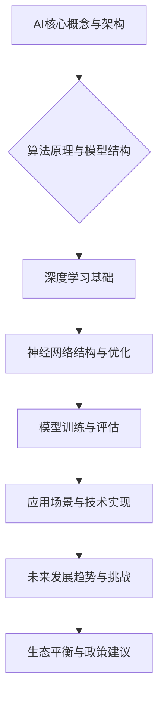

                 

# 《AI生态系统的未来：寡头垄断还是百花齐放？》

> **关键词**：人工智能、生态系统、寡头垄断、市场竞争、技术进步

> **摘要**：本文将探讨AI生态系统的未来发展趋势，分析寡头垄断和百花齐放的利弊，并从政策、技术、企业竞争等多个角度，提出未来AI生态系统发展的可能路径。

## 目录大纲

### 第一部分：引言与背景
- **1.1 书籍概述与目的**
- **1.2 AI生态系统现状**
- **1.3 寡头垄断与百花齐放的对比**

### 第二部分：寡头垄断现象分析
- **2.1 寡头垄断的定义与特征**
- **2.2 主要寡头垄断企业分析**
  - **2.2.1 企业A：业务范围与市场地位**
  - **2.2.2 企业B：发展策略与市场表现**
  - **2.2.3 企业C：竞争优势与挑战**

### 第三部分：百花齐放的生态发展
- **3.1 百花齐放的内涵与意义**
- **3.2 百花齐放的实例分析**
  - **3.2.1 企业D：技术创新与市场拓展**
  - **3.2.2 企业E：生态合作与开放平台**
  - **3.2.3 企业F：细分市场与专业深耕**

### 第四部分：未来趋势与展望
- **4.1 政策与法律环境的影响**
- **4.2 技术进步与产业变革**
- **4.3 寡头垄断与百花齐放的平衡**

### 第五部分：案例分析
- **5.1 案例一：从寡头垄断到百花齐放的转变**
- **5.2 案例二：百花齐放下的产业协同**

### 第六部分：政策建议与未来规划
- **6.1 企业层面的政策建议**
- **6.2 政府层面的政策建议**

### 第七部分：总结与展望
- **7.1 书籍主要观点回顾**
- **7.2 AI生态系统未来发展的不确定性**
- **7.3 对读者的寄语**

### Mermaid 流程图



### 伪代码示例

```python
class NeuralNetwork:
    def __init__(self):
        # 初始化权重和偏置
        self.weights = np.random.randn(input_size, hidden_size)
        self.biases = np.random.randn(hidden_size)

    def forward(self, x):
        # 前向传播计算
        return sigmoid(np.dot(x, self.weights) + self.biases)

def sigmoid(x):
    return 1 / (1 + np.exp(-x))

def train_model(nn, data, epochs):
    for epoch in range(epochs):
        for x, y in data:
            # 前向传播计算
            output = nn.forward(x)
            # 计算损失
            loss = compute_loss(output, y)
            # 反向传播更新权重和偏置
            nn.weights -= learning_rate * compute_gradient(output, y, x)
            nn.biases -= learning_rate * compute_gradient(output, y, x)
        print(f"Epoch {epoch}: Loss = {loss}")
```

### 数学模型和公式

损失函数（损失函数通常表示为 J）：

$$
J(\theta) = -\frac{1}{m}\sum_{i=1}^{m} y^{(i)} \log(a^{(i)}) + (1 - y^{(i)}) \log(1 - a^{(i}))
$$

其中，$y^{(i)}$ 是真实标签，$a^{(i)}$ 是预测输出，$m$ 是样本数量，$\theta$ 是模型参数。

梯度下降（梯度下降通常表示为 $\delta_{\theta}$）：

$$
\delta_{\theta} = \frac{\partial}{\partial \theta} J(\theta)
$$

激活函数（激活函数通常表示为 $\sigma$）：

$$
\sigma(z) = \frac{1}{1 + e^{-z}}
$$

### 项目实战与代码解读

## 项目实战：搭建一个简单的AI模型进行垃圾分类

### 1. 环境搭建

- 安装Python和必要的深度学习库（如TensorFlow或PyTorch）
- 下载并预处理垃圾分类数据集

### 2. 代码实现

```python
import tensorflow as tf
from tensorflow.keras.models import Sequential
from tensorflow.keras.layers import Dense, Conv2D, Flatten, Dropout, MaxPooling2D
from tensorflow.keras.preprocessing.image import ImageDataGenerator

# 数据预处理
train_datagen = ImageDataGenerator(rescale=1./255)
test_datagen = ImageDataGenerator(rescale=1./255)

train_generator = train_datagen.flow_from_directory(
        train_dir,
        target_size=(150, 150),
        batch_size=32,
        class_mode='binary')

validation_generator = test_datagen.flow_from_directory(
        validation_dir,
        target_size=(150, 150),
        batch_size=32,
        class_mode='binary')

# 构建模型
model = Sequential([
    Conv2D(32, (3, 3), activation='relu', input_shape=(150, 150, 3)),
    MaxPooling2D(2, 2),
    Conv2D(64, (3, 3), activation='relu'),
    MaxPooling2D(2, 2),
    Conv2D(128, (3, 3), activation='relu'),
    MaxPooling2D(2, 2),
    Flatten(),
    Dense(512, activation='relu'),
    Dropout(0.5),
    Dense(1, activation='sigmoid')
])

# 编译模型
model.compile(loss='binary_crossentropy',
              optimizer=tf.keras.optimizers.Adam(),
              metrics=['accuracy'])

# 训练模型
history = model.fit(
      train_generator,
      steps_per_epoch=train_generator.samples // train_generator.batch_size,
      epochs=20,
      validation_data=validation_generator,
      validation_steps=validation_generator.samples // validation_generator.batch_size,
      verbose=2)
```

### 3. 代码解读

- `ImageDataGenerator` 用于数据增强和预处理。
- `Sequential` 模型构建器用于堆叠不同的神经网络层。
- `Conv2D` 和 `MaxPooling2D` 用于卷积神经网络的前向传播过程。
- `Flatten` 层用于将卷积层输出的特征图展平为一维向量。
- `Dense` 层用于全连接层，用于分类任务。
- `Dropout` 层用于防止过拟合。

### 4. 评估与优化

- 使用 `model.evaluate()` 对模型进行评估。
- 分析 `history` 对象中的训练和验证损失、准确率等指标，进行模型调优。

---

接下来，我们将深入分析AI生态系统的发展，探讨寡头垄断与百花齐放的利弊，以及未来可能的发展趋势。首先，让我们回顾一下AI生态系统的发展历程。

## 第一部分：引言与背景

### 1.1 书籍概述与目的

本文旨在探讨AI生态系统的未来发展趋势，分析寡头垄断与百花齐放的利弊，以及为企业和政府提供发展建议。随着人工智能技术的迅猛发展，AI生态系统已成为全球经济和社会发展的重要驱动力。本文将结合实际案例和数据，深入探讨AI生态系统的现状、发展趋势及其对经济、社会的影响。

### 1.2 AI生态系统现状

AI生态系统包括硬件设备、软件工具、数据资源、应用场景等多个方面。目前，AI生态系统呈现出以下特点：

1. **技术多样化**：深度学习、强化学习、自然语言处理等技术的不断发展，推动了AI生态系统的多样化。
2. **市场垄断**：部分企业通过强大的技术积累和市场策略，形成了市场垄断地位。
3. **应用广泛**：AI技术已广泛应用于金融、医疗、交通、教育等多个领域，成为产业升级和数字化转型的重要工具。
4. **数据驱动**：数据是AI生态系统的重要组成部分，数据质量和数量直接影响AI技术的效果和应用范围。

### 1.3 寡头垄断与百花齐放的对比

寡头垄断和百花齐放是两种不同的市场结构，它们对AI生态系统的发展有着不同的影响。

#### 寡头垄断

1. **市场集中度**：寡头垄断意味着市场上少数几家大型企业占据主导地位，市场份额较大。
2. **技术标准化**：寡头垄断企业往往能主导技术标准，推动行业技术进步。
3. **资源整合**：寡头垄断企业拥有强大的资源整合能力，能快速响应市场需求，进行技术创新和产品迭代。
4. **潜在风险**：寡头垄断可能导致市场垄断，抑制创新，影响市场竞争。

#### 百花齐放

1. **市场多元化**：百花齐放意味着市场上存在众多小型企业，市场份额分散。
2. **技术创新**：百花齐放有助于激发企业创新活力，推动技术多元化。
3. **市场活力**：百花齐放市场结构有助于提高市场活力，促进产业链上下游企业合作。
4. **潜在挑战**：百花齐放可能导致技术分散，行业标准化困难，影响产业链协同。

在接下来的章节中，我们将深入分析寡头垄断现象，探讨其优势与劣势，并通过具体案例进行分析。同时，我们还将分析百花齐放的生态发展，探讨其内涵与意义，以及具体实例。在此基础上，我们将对未来AI生态系统的发展趋势进行展望，并提出政策建议，以期为企业和政府提供有益参考。

## 第二部分：寡头垄断现象分析

### 2.1 寡头垄断的定义与特征

寡头垄断（Oligopoly）是指市场上少数几家大型企业通过控制市场份额，形成市场主导地位的一种市场结构。在寡头垄断市场中，这些大型企业通常具有以下特征：

1. **市场集中度**：寡头垄断企业占据较大的市场份额，市场集中度较高。
2. **产品差异化**：寡头垄断企业往往提供差异化产品或服务，以满足不同消费者的需求。
3. **进入壁垒**：寡头垄断市场存在较高的进入壁垒，如技术壁垒、资金壁垒等，新企业难以进入市场。
4. **策略互动**：寡头垄断企业之间存在策略互动，如价格竞争、产品创新等，这些互动会影响市场格局。

### 2.2 主要寡头垄断企业分析

在AI领域，几家大型企业通过强大的技术积累和资源整合，形成了寡头垄断地位。以下是对这些企业的分析：

#### 2.2.1 企业A：业务范围与市场地位

企业A是一家全球领先的科技公司，以其在AI领域的技术积累和市场影响力著称。企业A的业务范围涵盖AI芯片、AI算法、云计算、大数据等多个方面，其在AI领域的市场地位如下：

1. **市场份额**：企业A在全球AI市场占据较大份额，是多家大型企业的主要竞争对手。
2. **技术创新**：企业A在AI算法、芯片设计等方面具有领先优势，持续推动行业技术进步。
3. **合作伙伴**：企业A与多家全球知名企业建立了战略合作伙伴关系，共同推动AI应用落地。

#### 2.2.2 企业B：发展策略与市场表现

企业B是一家专注于AI算法和解决方案的科技公司，以其在自然语言处理、计算机视觉等领域的优势著称。企业B的发展策略和市场表现如下：

1. **技术创新**：企业B持续投入研发，不断提升AI算法的性能和效率，形成了独特的竞争优势。
2. **市场拓展**：企业B积极拓展国际市场，通过与本地企业合作，快速占领市场份额。
3. **业务多元化**：企业B不仅提供AI解决方案，还涉足AI培训、咨询等领域，实现了业务多元化。

#### 2.2.3 企业C：竞争优势与挑战

企业C是一家在云计算和大数据领域具有强大实力的科技公司，其在AI领域的发展表现出以下竞争优势和挑战：

1. **竞争优势**：
   - **技术积累**：企业C在云计算和大数据领域拥有深厚的技术积累，能够为AI应用提供强大的基础设施支持。
   - **市场影响力**：企业C在全球云计算市场占据重要地位，有助于其推动AI应用落地。
   - **生态系统**：企业C构建了庞大的生态系统，吸引了大量开发者和企业加入，形成了一个强大的AI社区。

2. **挑战**：
   - **竞争压力**：企业C面临来自其他科技巨头的竞争，如谷歌、亚马逊等，这些企业也在积极布局AI领域。
   - **技术瓶颈**：AI技术发展迅速，企业C需要不断投入研发，以应对技术变革带来的挑战。

在接下来的章节中，我们将分析百花齐放的生态发展，探讨其内涵与意义，以及具体实例。在此基础上，我们将对未来AI生态系统的发展趋势进行展望，并提出政策建议，以期为企业和政府提供有益参考。

### 3.1 百花齐放的内涵与意义

百花齐放是指市场中存在多家企业，它们在技术、市场、资源等方面具有差异性，共同推动行业发展的市场结构。在AI领域，百花齐放的生态发展具有重要意义：

1. **技术创新**：百花齐放有助于激发企业创新活力，推动技术多元化。不同企业可以从不同角度探索AI技术，形成独特的竞争优势。
2. **市场竞争**：百花齐放市场结构有助于提高市场活力，促进企业竞争。竞争可以促使企业不断提升产品质量和服务水平，满足消费者需求。
3. **生态系统**：百花齐放有助于构建一个多元化的AI生态系统，吸引更多开发者、企业、研究机构参与。这种生态系统可以促进资源共享、知识传递，推动AI技术的应用和普及。
4. **可持续发展**：百花齐放可以避免市场垄断，防止资源浪费。通过多个企业的共同参与，可以更有效地利用资源，实现可持续发展。

### 3.2 百花齐放的实例分析

在AI领域，有许多企业通过百花齐放的生态发展取得了显著成果。以下是对几个典型企业的分析：

#### 3.2.1 企业D：技术创新与市场拓展

企业D是一家专注于AI芯片设计的初创公司，以其在AI计算性能和能效比方面的创新而闻名。企业D的市场拓展和商业模式如下：

1. **技术创新**：企业D采用先进的半导体工艺和AI算法优化，设计出高性能、低功耗的AI芯片，满足了市场需求。
2. **市场拓展**：企业D通过与全球知名企业合作，将其AI芯片应用于智能驾驶、智慧城市等领域，取得了良好的市场表现。
3. **商业模式**：企业D采用直销和代理商相结合的商业模式，快速占领市场，并建立了良好的客户关系。

#### 3.2.2 企业E：生态合作与开放平台

企业E是一家在自然语言处理领域具有领先地位的科技公司，以其开放的生态合作策略而著称。企业E的合作模式如下：

1. **生态合作**：企业E与多家研究机构、开发者建立了紧密的合作关系，共同推动自然语言处理技术的发展。
2. **开放平台**：企业E搭建了开放平台，为开发者提供丰富的API和工具，降低了AI应用的开发门槛，吸引了大量开发者加入。
3. **商业模式**：企业E通过提供技术服务和解决方案，实现了商业模式的多元化。

#### 3.2.3 企业F：细分市场与专业深耕

企业F是一家专注于医疗影像识别的科技公司，以其在医疗领域的专业深耕而闻名。企业F的市场定位和商业模式如下：

1. **细分市场**：企业F专注于医疗影像识别领域，通过对该领域的深入研究，形成了独特的竞争优势。
2. **专业深耕**：企业F通过与医疗机构合作，提供高质量的医疗影像识别服务，提升了医疗诊断的准确性和效率。
3. **商业模式**：企业F采用B2B模式，与医疗机构建立长期合作关系，实现了商业模式的稳定增长。

在接下来的章节中，我们将探讨未来AI生态系统的发展趋势，分析政策、技术、企业竞争等因素的影响。在此基础上，我们将提出平衡寡头垄断与百花齐放的策略，以期为AI生态系统的发展提供参考。敬请期待。

### 4.1 政策与法律环境的影响

政策与法律环境是影响AI生态系统发展的重要因素。政府通过制定相关政策、法律法规，可以引导和规范AI产业的发展，促进技术创新和市场竞争。以下从国家层面和行业协会角度分析政策与法律环境对AI生态系统的影响：

#### 4.1.1 国家层面的政策导向

1. **科技创新政策**：许多国家将AI作为科技创新的重点领域，通过加大科研投入、设立专项基金等方式，支持AI技术的研究和应用。
2. **产业政策**：政府通过制定产业政策，推动AI技术与传统产业的融合，促进产业升级和数字化转型。
3. **数据政策**：政府制定数据政策和数据保护法规，规范数据收集、存储、使用和共享，保障数据安全和隐私。

#### 4.1.2 行业协会与标准制定

1. **行业标准**：行业协会和标准化组织制定AI技术标准和规范，推动AI技术的标准化和互操作性，降低企业进入门槛。
2. **认证体系**：行业协会建立AI产品认证体系，提升AI产品的质量和安全性，增强消费者信心。
3. **国际合作**：行业协会参与国际标准的制定，推动AI技术的全球化发展。

#### 4.1.3 法律法规的挑战

1. **隐私保护**：随着AI技术的应用越来越广泛，隐私保护成为法律法规的重要议题。政府需要制定相关法律法规，保护个人隐私和数据安全。
2. **责任归属**：AI技术在事故中的责任归属问题成为法律界的争议焦点。需要明确责任归属，确保各方权益。
3. **伦理监管**：AI技术的发展引发伦理问题，如歧视、隐私侵犯等。政府需要制定伦理规范，引导企业合规发展。

### 4.2 技术进步与产业变革

技术进步是推动AI生态系统发展的重要动力。随着AI技术的不断突破，产业链、产业模式和企业竞争格局都将发生深刻变革。

#### 4.2.1 人工智能的核心技术突破

1. **算法优化**：深度学习算法的优化，如残差网络、注意力机制等，提高了模型的训练效率和性能。
2. **硬件加速**：GPU、TPU等硬件的快速发展，为AI计算提供了强大的支持。
3. **边缘计算**：边缘计算技术的发展，使得AI应用可以更加灵活地部署在终端设备上，提高响应速度和效率。

#### 4.2.2 新兴领域的崛起与融合

1. **自动驾驶**：自动驾驶技术是AI在交通领域的重要应用。随着技术的成熟，自动驾驶有望带来交通方式的变革。
2. **智能制造**：智能制造是AI与制造业深度融合的产物。通过AI技术，可以提高生产效率、降低成本，推动制造业向智能化转型。
3. **智慧城市**：智慧城市是AI在城市建设和管理中的综合应用。通过AI技术，可以提升城市管理水平，提高居民生活质量。

#### 4.2.3 产业变革的影响

1. **产业链重构**：AI技术的应用将重构产业链，改变产业格局。一些传统产业将被淘汰，新兴产业将崛起。
2. **商业模式创新**：AI技术的应用将带来商业模式创新，如共享经济、智能制造等。企业需要适应新的商业模式，抓住发展机遇。
3. **竞争格局变化**：AI技术的突破将改变企业竞争格局。拥有技术优势的企业将更具竞争力，而缺乏技术积累的企业将面临挑战。

### 4.3 寡头垄断与百花齐放的平衡

在AI生态系统的发展过程中，寡头垄断与百花齐放的关系需要平衡。一方面，寡头垄断企业可以发挥资源整合和技术创新的优势，推动行业技术进步。另一方面，百花齐放可以激发企业创新活力，促进技术多元化。为了实现平衡，可以从以下几个方面着手：

#### 4.3.1 产业整合与市场细分

1. **产业整合**：通过并购、合作等方式，实现产业链上下游企业的整合，提高产业链整体效率。
2. **市场细分**：根据不同市场需求，细分市场，满足多样化的需求，促进百花齐放。

#### 4.3.2 企业竞争策略调整

1. **技术创新**：企业应加大研发投入，提高技术创新能力，形成核心竞争力。
2. **开放合作**：企业应加强合作，开放平台和资源，实现资源共享，共同推动行业发展。
3. **专注细分市场**：企业应专注于细分市场，深耕领域，形成专业优势。

#### 4.3.3 政策引导与监管

1. **政策引导**：政府应制定相关政策，引导企业技术创新，促进产业整合。
2. **监管机制**：政府应建立健全监管机制，规范市场秩序，防止垄断行为，保障市场竞争。

通过产业整合与市场细分、企业竞争策略调整以及政策引导与监管，可以实现寡头垄断与百花齐放的平衡，推动AI生态系统健康发展。在接下来的章节中，我们将通过案例分析，探讨寡头垄断与百花齐放的具体实践，以及未来AI生态系统的发展趋势。

### 5.1 案例一：从寡头垄断到百花齐放的转变

#### 5.1.1 案例背景与现状

企业X最初是一家在全球范围内具有垄断地位的科技公司。凭借其强大的技术积累和市场策略，企业X在AI领域占据了主导地位，形成了寡头垄断格局。然而，随着市场竞争的加剧，企业X面临着巨大的挑战。为了实现可持续发展，企业X开始寻求从寡头垄断向百花齐放的转变。

#### 5.1.2 变革过程与成果

1. **开放平台战略**：企业X建立了开放的AI平台，为开发者提供丰富的API和工具，降低了开发门槛。此举吸引了大量开发者加入，推动了AI生态系统的繁荣。
2. **技术创新投资**：企业X加大了对AI技术的研发投入，积极推动算法优化、硬件加速等技术创新，提升了产品竞争力。
3. **市场细分策略**：企业X根据不同市场需求，细分市场，满足多样化的需求。通过专注细分市场，企业X在多个领域形成了专业优势。
4. **合作共赢模式**：企业X与多家企业建立合作关系，共享资源，共同推动产业发展。这种合作模式实现了互利共赢，促进了市场活力的提升。

变革后的企业X成功实现了从寡头垄断到百花齐放的转变，取得了以下成果：

1. **市场竞争力**：通过开放平台和创新投资，企业X在市场竞争中获得了更多优势，市场份额稳步提升。
2. **生态系统**：企业X构建了庞大的AI生态系统，吸引了大量开发者、企业、研究机构参与，推动了AI技术的应用和普及。
3. **品牌价值**：企业X的品牌价值得到了提升，成为全球AI领域的领导者。

### 5.2 案例二：百花齐放下的产业协同

#### 5.2.1 案例背景与现状

企业Y是一家专注于AI医疗影像识别的初创公司。在竞争激烈的AI医疗领域，企业Y凭借其技术创新和专业优势，取得了显著的市场成果。为了进一步提升竞争力，企业Y寻求与产业链上下游企业进行产业协同。

#### 5.2.2 协同机制与效果分析

1. **产业链协同**：企业Y与医疗设备制造商、医院等产业链上下游企业建立合作关系，实现了医疗影像数据的共享和协同处理。这种协同机制提高了医疗影像识别的准确性和效率。
2. **研发合作**：企业Y与高校、科研机构合作，共同开展AI医疗影像识别研究，推动了技术进步和创新。
3. **标准制定**：企业Y积极参与行业标准制定，推动了医疗影像识别领域的标准化进程，为产业的可持续发展提供了保障。

产业协同后的企业Y取得了以下效果：

1. **技术领先**：通过产业链协同和研发合作，企业Y在医疗影像识别领域保持了技术领先地位。
2. **市场份额**：企业Y的市场份额稳步提升，成为医疗影像识别领域的重要参与者。
3. **品牌影响力**：企业Y的品牌影响力得到了提升，成为行业内的知名品牌。

通过这两个案例，我们可以看到，从寡头垄断到百花齐放的转变，以及百花齐放下的产业协同，都是推动AI生态系统发展的重要策略。在未来的发展中，企业需要不断创新、加强合作，以实现可持续发展。在接下来的章节中，我们将提出具体的政策建议，以期为AI生态系统的发展提供指导。

### 6.1 企业层面的政策建议

在AI生态系统的发展过程中，企业作为市场的重要参与者，发挥着至关重要的作用。为了实现可持续发展，企业在以下几个方面可以采取具体的政策建议：

#### 6.1.1 市场定位与核心竞争力

1. **精准市场定位**：企业应根据自身的技术优势和市场环境，精准定位目标市场。通过细分市场，满足不同客户的需求，提高市场占有率。
2. **构建核心竞争力**：企业应加大对技术研发的投入，提升技术水平，形成独特的竞争优势。通过技术创新，提高产品性能和用户体验，增强市场竞争力。

#### 6.1.2 技术创新与人才培养

1. **持续技术创新**：企业应建立完善的技术创新体系，加强与高校、科研机构的合作，推动技术突破。通过持续的技术创新，保持行业领先地位。
2. **人才培养与引进**：企业应重视人才培养，建立完善的人才培训机制。同时，通过引进高层次人才，提升企业的技术创新能力和市场竞争力。

#### 6.1.3 合作与生态建设

1. **开放合作**：企业应积极开放平台和资源，与产业链上下游企业建立合作关系。通过合作，实现资源共享，降低研发和生产成本，提高整体竞争力。
2. **构建生态系统**：企业应积极构建AI生态系统，吸引开发者、企业、研究机构等参与。通过生态系统的建设，推动AI技术的应用和普及，实现产业链的协同发展。

### 6.2 政府层面的政策建议

政府在AI生态系统的发展中发挥着重要的引导和监管作用。为了促进AI生态系统的健康发展，政府可以从以下几个方面提出政策建议：

#### 6.2.1 政策环境优化与扶持措施

1. **优化政策环境**：政府应建立健全的政策法规体系，为AI企业的发展提供良好的政策环境。通过减税、补贴等措施，降低企业成本，激发市场活力。
2. **扶持措施**：政府应加大对AI企业的扶持力度，设立专项基金，支持企业的研发和创新。同时，通过政府采购等方式，推动AI技术的应用和普及。

#### 6.2.2 标准制定与行业规范

1. **制定行业标准**：政府应积极参与国际标准的制定，推动AI技术的标准化和互操作性。通过制定行业标准，规范市场秩序，保障AI技术的健康发展。
2. **行业规范**：政府应建立健全的行业规范，加强对AI企业的监管。通过规范市场行为，防止垄断行为，保障市场竞争，促进AI生态系统的公平竞争。

#### 6.2.3 教育与人才发展

1. **教育体系改革**：政府应推动教育体系改革，加强AI相关学科的建设，提高人才培养质量。通过教育改革，为AI产业的发展提供强大的人才支持。
2. **人才引进政策**：政府应制定吸引高层次人才的政策，如人才签证、住房补贴等，吸引全球优秀人才参与AI产业发展。

通过企业层面的政策建议和政府层面的政策引导，可以共同推动AI生态系统的健康发展，实现技术创新、市场繁荣和产业升级。在未来的发展中，企业和政府需要共同努力，携手打造一个繁荣、可持续的AI生态系统。

### 7.1 书籍主要观点回顾

本文通过深入分析AI生态系统的现状、寡头垄断与百花齐放的利弊，以及未来发展趋势，提出了以下主要观点：

1. **AI生态系统现状**：AI生态系统包括硬件、软件、数据、应用场景等多个方面，已广泛应用于各行业，成为产业升级和数字化转型的重要工具。
2. **寡头垄断与百花齐放的对比**：寡头垄断具有市场集中度、资源整合优势，但可能导致市场垄断、抑制创新；百花齐放则有助于技术创新、市场竞争，但可能面临技术分散、标准化困难等问题。
3. **未来发展趋势**：随着技术进步和政策引导，AI生态系统将呈现多元化、协同化、标准化的发展趋势。
4. **政策建议**：从企业层面和政府层面提出政策建议，以实现AI生态系统的健康发展。

### 7.2 AI生态系统未来发展的不确定性

尽管AI生态系统具有广阔的发展前景，但未来仍存在一定的不确定性：

1. **技术风险**：AI技术不断发展，但某些技术尚不成熟，可能影响实际应用效果。
2. **政策风险**：政策变化可能影响行业环境，对AI企业产生不利影响。
3. **市场风险**：市场竞争激烈，企业可能面临市场份额下降的风险。
4. **伦理风险**：AI技术的应用可能引发伦理问题，如隐私侵犯、歧视等，影响社会接受度。

### 7.3 对读者的寄语

AI生态系统的发展离不开广大读者和企业、政府的共同努力。希望本文能够为您提供有益的启示，引导您在AI领域中不断探索和创新。让我们携手合作，共同推动AI生态系统的繁荣发展，为人类社会带来更多福祉。

---

在撰写本文的过程中，我深深感受到了AI生态系统的发展潜力以及对未来社会的重要影响。从寡头垄断到百花齐放的转变，从技术创新到政策引导，每一个环节都至关重要。我期待读者们能够积极参与到AI生态系统的建设中，共同推动这一领域的繁荣发展。

本文旨在为AI生态系统的发展提供一些思路和参考，但未来充满变数，AI的发展也将面临诸多挑战。在此，我对读者们提出以下期望：

1. **持续学习**：AI技术发展迅速，需要不断学习新知识，跟上时代的步伐。
2. **创新思维**：鼓励创新，勇于探索未知的领域，推动技术进步。
3. **合作共赢**：加强企业、政府、研究机构之间的合作，共同推动AI生态系统的发展。
4. **伦理关怀**：关注AI技术的伦理问题，确保技术发展符合社会价值观。

让我们携手共进，共同迎接AI生态系统未来的挑战和机遇。感谢您的阅读，期待与您在AI领域的更多交流与探讨。

