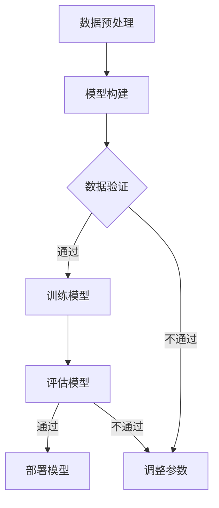

                 

## AI编程语言的人因工程学优化策略

### 关键词：AI编程语言、人因工程学、优化策略、用户体验、性能优化、调试与测试、企业级应用、未来发展趋势

> 摘要：本文旨在探讨人工智能编程语言在开发过程中的优化策略，重点阐述人因工程学在其中的应用。通过分析AI编程语言的基本概念、发展历程、设计原则以及企业级应用，本文提出了具体的人因工程学优化策略，旨在提高AI编程语言的开发效率、降低错误率、提升用户体验。同时，文章还探讨了AI编程语言的性能优化、调试与测试、以及未来发展趋势，为开发者提供实用的指导。

### 第一部分：AI编程语言的人因工程学优化策略基础

#### 第1章：AI编程语言的人因工程学基础

##### 1.1 AI编程语言的定义与特点

AI编程语言是一种专门为人工智能算法开发设计的编程语言，它通过抽象化算法实现过程，提供更高效、更易用的开发工具。AI编程语言的特点主要包括：

- **自动化代码生成**：AI编程语言能够自动生成代码，减少手动编写的工作量。
- **高抽象层次**：AI编程语言允许开发者以更高级别的抽象层次进行编程，提高开发效率。
- **易于理解和维护**：通过简化代码结构和提供清晰的语法，AI编程语言使得代码更容易理解和维护。

##### 1.2 人因工程学在AI编程语言中的重要性

人因工程学（Human-Computer Interaction, HCI）是研究人类与计算机交互的学科，旨在优化用户与系统之间的交互体验。在AI编程语言中，人因工程学的应用至关重要，主要体现在以下几个方面：

- **用户体验设计**：通过优化用户界面和交互设计，提高用户在使用AI编程语言时的舒适度和效率。
- **操作便捷性**：通过简化操作流程和提供直观的操作方式，降低用户的认知负荷和操作错误率。
- **学习曲线**：通过减少学习难度和提高学习效率，降低新用户入门的门槛。

##### 1.3 AI编程语言的发展历程

AI编程语言的发展历程可以分为以下几个阶段：

- **早期**：以神经网络编程语言如BrainScript为代表，主要用于简化神经网络模型的开发。
- **中期**：以生成对抗网络（GAN）编程语言如GANcode为代表，侧重于自动化GAN模型的开发。
- **近期**：以多功能AI编程语言如TensorFlowDSLP为代表，提供了更广泛的AI算法开发支持。

##### 1.4 主流AI编程语言简介

当前主流的AI编程语言主要包括以下几种：

- **TensorFlowDSLP**：由Google开发，适用于数据科学和深度学习的编程语言，提供了丰富的API和工具。
- **PyTorch**：由Facebook开发，提供动态图和静态图两种编程模式，适合快速原型开发和复杂模型设计。
- **Keras**：高级神经网络API，能够快速构建深度学习模型，简化了TensorFlow的使用。

##### 1.5 AI编程语言在企业中的应用前景

AI编程语言在企业中的应用前景广阔，主要体现在以下几个方面：

- **自动化数据处理**：AI编程语言能够自动化数据预处理，提高数据处理效率。
- **提高开发效率**：通过简化开发流程和提供高效的工具，AI编程语言能够显著提高开发效率。
- **加速模型迭代**：AI编程语言支持快速模型开发和迭代，有助于企业快速响应市场需求。

### 第2章：人因工程学在AI编程语言设计中的应用

##### 2.1 人因工程学原理在AI编程语言设计中的应用

人因工程学原理在AI编程语言设计中的应用主要体现在以下几个方面：

- **用户体验设计**：通过优化用户界面和交互设计，提高用户在使用AI编程语言时的舒适度和效率。
- **操作便捷性**：通过简化操作流程和提供直观的操作方式，降低用户的认知负荷和操作错误率。
- **学习曲线**：通过减少学习难度和提高学习效率，降低新用户入门的门槛。

##### 2.2 AI编程语言的用户界面设计

AI编程语言的用户界面设计应遵循以下原则：

- **易用性**：用户界面应简洁直观，操作步骤清晰易懂，减少用户的学习成本。
- **交互性**：提供丰富的交互功能，如代码提示、调试工具、可视化工具等，提高开发效率。
- **个性化**：支持用户自定义界面布局和功能模块，满足不同用户的需求。

##### 2.3 代码生成与自动化

代码生成与自动化是AI编程语言的重要特性，主要体现在以下几个方面：

- **代码生成**：通过抽象化编程模型，自动生成符合特定需求的代码模板，减少手动编写的工作量。
- **自动化**：通过自动化工具，实现数据预处理、模型训练、超参数调优等过程，提高开发效率。

##### 2.4 代码的可读性与可维护性

代码的可读性与可维护性是AI编程语言设计的重要目标，主要体现在以下几个方面：

- **可读性**：通过清晰的代码结构和简明的注释，提高代码的可读性，降低理解难度。
- **可维护性**：通过高质量的代码编写和规范的代码管理，提高代码的维护性，便于后续的修改和优化。

### 第3章：AI编程语言性能优化策略

##### 3.1 AI编程语言性能优化的重要性

AI编程语言性能优化的重要性主要体现在以下几个方面：

- **提高模型运行速度**：通过优化算法和代码，提高模型的运行速度，减少计算时间。
- **降低内存消耗**：通过优化数据结构和算法，降低模型的内存消耗，提高资源利用率。
- **提高资源利用率**：通过合理分配计算资源，提高模型的运行效率，降低资源浪费。

##### 3.2 算法优化策略

算法优化策略主要包括以下几个方面：

- **算法改进**：通过改进现有算法，提高模型的准确性和效率。
- **算法并行化**：通过并行计算，提高模型的运行速度。
- **算法优化工具**：利用现有的算法优化工具，如自动调优工具，提高模型的性能。

##### 3.3 编译器优化

编译器优化是提高AI编程语言性能的重要手段，主要包括以下几个方面：

- **高效代码生成**：通过优化编译器的代码生成过程，生成更高效的机器代码。
- **优化中间表示**：通过优化编译器的中间表示，提高代码的可优化性。
- **代码优化**：通过编译器的代码优化功能，如循环优化、分支优化等，提高代码的运行效率。

##### 3.4 代码压缩与存储优化

代码压缩与存储优化主要包括以下几个方面：

- **代码压缩**：通过压缩算法，减少代码的体积，降低存储需求。
- **存储优化**：通过优化数据存储方式，提高数据访问速度，减少存储开销。

### 第4章：AI编程语言的调试与测试

##### 4.1 调试工具与技巧

调试工具与技巧是确保AI编程语言开发成功的关键，主要包括以下几个方面：

- **调试工具**：使用源代码调试器、交互式调试器和可视化调试工具，提高调试效率和准确性。
- **调试技巧**：通过设置断点、单步执行、打印输出等方式，定位和解决问题。

##### 4.2 单元测试与集成测试

单元测试与集成测试是确保AI编程语言质量的重要环节，主要包括以下几个方面：

- **单元测试**：通过编写测试用例，验证模块的功能和性能，提高代码质量。
- **集成测试**：通过测试模块间的交互和系统整体功能，发现和解决问题。

##### 4.3 自动化测试

自动化测试是提高AI编程语言开发效率的重要手段，主要包括以下几个方面：

- **自动化测试工具**：使用自动化测试工具，如Selenium、JMeter等，提高测试效率。
- **自动化测试脚本**：编写自动化测试脚本，实现自动化测试流程。

### 第5章：AI编程语言的企业级应用

##### 5.1 企业级应用场景

AI编程语言在企业级应用中具有广泛的应用场景，主要包括以下几个方面：

- **数据科学**：通过AI编程语言，进行大数据分析和挖掘，为企业提供数据洞察。
- **机器学习**：利用AI编程语言，构建和部署机器学习模型，实现自动化决策。
- **深度学习**：利用AI编程语言，进行图像识别、语音识别等深度学习任务。

##### 5.2 企业级应用架构

企业级应用架构是确保AI编程语言高效运行的重要基础，主要包括以下几个方面：

- **分布式计算**：通过分布式计算架构，提高模型训练和推理的速度。
- **容器化部署**：通过容器化技术，实现模型的高效部署和管理。
- **微服务架构**：通过微服务架构，提高系统的可扩展性和灵活性。

##### 5.3 企业级应用案例

企业级应用案例展示了AI编程语言在实际业务场景中的应用效果，主要包括以下几个方面：

- **金融风控**：利用AI编程语言，构建风控模型，实现精准风险评估。
- **智能医疗**：利用AI编程语言，进行疾病预测和诊断，提高医疗服务的效率。
- **智能制造**：利用AI编程语言，实现生产过程的智能化控制，提高生产效率。

### 第6章：AI编程语言的未来发展趋势

##### 6.1 人工智能技术的发展趋势

人工智能技术的发展趋势包括以下几个方面：

- **大模型**：通过训练更大规模的模型，提高模型的性能和准确性。
- **自动机器学习**：通过自动化的方法，实现模型的自动化训练和优化。
- **增强学习**：通过增强学习算法，实现模型的自我学习和优化。

##### 6.2 AI编程语言的未来发展方向

AI编程语言的未来发展方向包括以下几个方面：

- **低代码开发**：通过简化开发流程和提供可视化工具，实现低代码开发。
- **跨平台支持**：通过跨平台支持，实现模型在不同平台上的无缝迁移和部署。
- **更好的用户体验**：通过优化用户界面和交互设计，提供更好的用户体验。

##### 6.3 AI编程语言在未来的影响

AI编程语言在未来的影响主要体现在以下几个方面：

- **改变软件开发模式**：通过提供更高效的开发工具，改变传统的软件开发模式。
- **提高开发效率**：通过自动化和优化工具，提高开发效率，降低开发成本。
- **推动人工智能普及**：通过简化开发流程和降低门槛，推动人工智能在各个领域的普及。

### 附录

#### 附录A：AI编程语言开发工具与资源

- **开发工具**：
  - **深度学习框架**：TensorFlow、PyTorch、Keras等。
  - **代码生成工具**：AST解析工具、代码生成器等。
  - **调试工具**：VSCode、PyCharm等集成开发环境。

- **资源**：
  - **开源项目**：GitHub、GitLab等开源平台上的AI编程语言项目。
  - **教程**：在线教程、书籍、博客等。
  - **论坛**：技术社区、讨论论坛等。

---

在本文中，我们系统地介绍了AI编程语言的人因工程学优化策略，包括其基础概念、设计原则、性能优化策略、调试与测试方法、企业级应用以及未来发展趋势。通过人因工程学的应用，AI编程语言能够更好地满足用户需求，提高开发效率，降低错误率。未来，随着人工智能技术的不断发展，AI编程语言将继续在软件开发领域发挥重要作用。希望本文能为广大开发者提供有价值的参考和指导。作者：AI天才研究院/AI Genius Institute & 禅与计算机程序设计艺术 /Zen And The Art of Computer Programming。

---

### 第7章：AI编程语言的核心概念

##### 7.1 数据结构与算法

数据结构和算法是AI编程语言的重要组成部分，它们不仅影响着程序的运行效率，也决定了代码的可读性和可维护性。以下是一些常见的数据结构和算法及其在AI编程语言中的应用。

- **数组（Array）**：数组是一种线性数据结构，用于存储一系列元素。在AI编程中，数组常用于存储数据集、特征矩阵等。
  - **算法**：查找（例如二分查找）、插入和删除（例如动态数组）。

- **列表（List）**：列表是一种动态数组，允许在运行时改变大小。在AI编程中，列表常用于存储和管理数据集或序列。
  - **算法**：插入、删除、查找（例如顺序查找）、排序（例如快速排序）。

- **字典（Dictionary）**：字典是一种关联数组，用于存储键值对。在AI编程中，字典常用于存储特征名称与特征值之间的映射。
  - **算法**：查找、插入、删除（例如哈希表）。

- **队列（Queue）**：队列是一种先进先出（FIFO）的数据结构。在AI编程中，队列常用于模拟等待队列或用于数据处理。
  - **算法**：入队、出队、队首元素获取。

- **栈（Stack）**：栈是一种后进先出（LIFO）的数据结构。在AI编程中，栈常用于实现递归算法、后缀表达式求值等。
  - **算法**：入栈、出栈、栈顶元素获取。

- **树（Tree）**：树是一种层次数据结构，用于表示有层次关系的数据。在AI编程中，树常用于存储分类树、决策树等。
  - **算法**：查找、插入、删除、遍历（例如深度优先搜索、广度优先搜索）。

- **图（Graph）**：图是一种由节点和边组成的数据结构，用于表示复杂关系。在AI编程中，图常用于网络分析、社交网络等。
  - **算法**：查找、路径搜索（例如Dijkstra算法、A*算法）、图遍历。

##### 7.2 机器学习基础

机器学习是AI编程语言的核心应用领域，理解其基本概念和算法对于开发高效的AI模型至关重要。

- **监督学习（Supervised Learning）**：监督学习是一种通过已标记的数据进行训练的学习方法。常见的算法包括：
  - **线性回归（Linear Regression）**
    ```python
    # 伪代码：线性回归
    def linear_regression(X, y):
        # 计算权重
        theta = (X'X)^(-1)X'y
        # 预测
        predictions = X * theta
        return predictions
    ```
  - **决策树（Decision Tree）**
    ```python
    # 伪代码：决策树
    def decision_tree(X, y, features):
        # 判断是否达到终止条件
        if stop_condition_met(X, y):
            return label_for_majority(y)
        # 选择最佳分割特征
        best_feature = select_best_feature(X, y, features)
        # 构建子树
        tree = {best_feature: []}
        for value in unique_values(X[best_feature]):
            subtree = decision_tree(X[X[best_feature] == value], y[X[best_feature] == value], features - {best_feature})
            tree[best_feature].append(subtree)
        return tree
    ```

- **无监督学习（Unsupervised Learning）**：无监督学习是一种在没有标记数据的情况下进行训练的学习方法。常见的算法包括：
  - **聚类（Clustering）**
    ```python
    # 伪代码：K-means聚类
    def k_means(X, k):
        # 初始化中心点
        centroids = initialize_centroids(X, k)
        # 迭代更新中心点
        while not converged(centroids):
            assignments = assign_points_to_clusters(X, centroids)
            new_centroids = update_centroids(X, assignments, k)
            centroids = new_centroids
        return centroids, assignments
    ```

- **强化学习（Reinforcement Learning）**：强化学习是一种通过与环境的交互进行学习的方法。常见的算法包括：
  - **Q学习（Q-Learning）**
    ```python
    # 伪代码：Q学习
    def q_learning(Q, state, action, reward, next_state, done, alpha, gamma):
        # 更新Q值
        Q[state, action] = (1 - alpha) * Q[state, action] + alpha * (reward + gamma * max(Q[next_state]. flatten()))
        if done:
            return Q
        return q_learning(Q, next_state, action, reward, next_state, done, alpha, gamma)
    ```

##### 7.3 深度学习框架

深度学习框架是AI编程语言的重要组成部分，提供了高效且易于使用的工具和库，用于构建和训练深度学习模型。

- **TensorFlow**：由Google开发，支持动态图和静态图两种模式。
  - **特点**：强大的生态系统、广泛的社区支持、灵活的模型构建。
  
- **PyTorch**：由Facebook开发，以动态图为主。
  - **特点**：简洁的API、直观的编程体验、高效的模型构建。

- **Keras**：高级神经网络API，能够快速构建深度学习模型。
  - **特点**：易于使用、模块化设计、可扩展性强。

##### 7.4 代码生成技术

代码生成技术是AI编程语言的重要特性，能够通过自动化的方法生成代码，提高开发效率和代码质量。

- **抽象语法树（Abstract Syntax Tree, AST）**：AST是表示编程语言结构的树状结构，用于代码生成和解析。
  - **应用**：通过AST，可以生成符合特定需求的代码模板，实现代码的自动化生成。

- **模板生成**：通过模板生成，可以快速生成符合特定格式的代码。
  - **应用**：用于生成数据库迁移脚本、报告生成等场景。

### 核心概念原理和架构的 Mermaid 流程图

以下是机器学习模型训练流程的 Mermaid 流程图：



### 核心算法原理讲解及伪代码示例

**深度学习算法：卷积神经网络（CNN）**

卷积神经网络（CNN）是一种专门用于处理图像数据的深度学习模型。以下是一个简单的 CNN 算法原理讲解及其伪代码示例：

```python
# 伪代码：卷积神经网络（CNN）
def convolutional_neural_network(input_data, filters, kernel_size, stride, padding):
    # 卷积层
    conv_output = convolution(input_data, filters, kernel_size, stride, padding)
    # 激活函数（例如ReLU）
    activated_output = activation_function(conv_output)
    # 最大池化层
    pooled_output = max_pooling(activated_output, pool_size, stride)
    return pooled_output
```

**机器学习算法：随机森林（Random Forest）**

随机森林是一种集成学习算法，通过构建多个决策树并投票来提高模型的准确性和鲁棒性。以下是一个简单的随机森林算法原理讲解及其伪代码示例：

```python
# 伪代码：随机森林
def random_forest(X, y, n_estimators, max_depth):
    # 构建多个决策树
    trees = [build_decision_tree(X, y, max_depth) for _ in range(n_estimators)]
    # 预测
    predictions = [tree_predict(tree, X) for tree in trees]
    # 投票
    final_prediction = majority_vote(predictions)
    return final_prediction
```

### 数学模型与公式详解

在AI编程语言中，数学模型和公式是构建和训练模型的基础。以下是一些常用的数学模型和公式及其解释：

**线性代数：奇异值分解（SVD）**

$$
\sigma(X) = \sqrt{V(X)}
$$

- **公式解释**：奇异值分解（SVD）将矩阵X分解为三个矩阵的乘积：$X = U\Sigma V'$，其中$U$和$V'$是正交矩阵，$\Sigma$是对角矩阵，包含了奇异值。

**概率论与统计：贝叶斯定理**

$$
P(A|B) = \frac{P(B|A)P(A)}{P(B)}
$$

- **公式解释**：贝叶斯定理描述了在已知条件$B$下，事件$A$的概率$P(A|B)$如何通过条件概率$P(B|A)$和边缘概率$P(A)$来计算。

### 数学公式在AI编程语言中的应用

**神经网络激活函数：ReLU**

$$
\text{ReLU}(x) =
\begin{cases}
0 & \text{if } x < 0 \\
x & \text{if } x \geq 0
\end{cases}
$$

- **应用**：ReLU函数用于激活神经网络中的隐藏层神经元，可以加速模型的训练过程并提高模型的性能。

**优化算法：Adam**

$$
m_t = \beta_1m_{t-1} + (1 - \beta_1) [g_t] \\
v_t = \beta_2v_{t-1} + (1 - \beta_2) [g_t^2]
$$

$$
\hat{m}_t = \frac{m_t}{1 - \beta_1^t} \\
\hat{v}_t = \frac{v_t}{1 - \beta_2^t}
$$

$$
\theta_{t+1} = \theta_t - \alpha \frac{\hat{m}_t}{\sqrt{\hat{v}_t} + \epsilon}
$$

- **应用**：Adam算法是一种自适应学习率的优化算法，广泛应用于深度学习模型的训练中，能够提高训练效率和模型性能。

### 项目实战：智能推荐系统

**项目实战概述**

本节将介绍一个基于AI编程语言的智能推荐系统项目，该系统旨在通过分析用户历史行为数据，为用户推荐感兴趣的商品或内容。

- **项目背景**：随着互联网的发展，个性化推荐系统已经成为电商平台和媒体平台提高用户粘性和转化率的重要手段。
- **目标**：构建一个高效的推荐系统，能够根据用户历史行为数据预测用户兴趣，并生成个性化的推荐列表。

**开发环境搭建**

1. **Python环境配置**：安装Python 3.8及以上版本，配置Anaconda环境，安装必要的库，如NumPy、Pandas、Scikit-learn等。
2. **深度学习框架**：安装TensorFlow 2.x版本，确保能够正常使用其API。

```shell
pip install tensorflow
```

**源代码实现与解读**

**数据预处理**：

```python
import pandas as pd
from sklearn.model_selection import train_test_split

# 读取数据
data = pd.read_csv('user行为数据.csv')

# 数据清洗
data = data.dropna()

# 数据分割
X = data.drop('目标标签', axis=1)
y = data['目标标签']
X_train, X_test, y_train, y_test = train_test_split(X, y, test_size=0.2, random_state=42)
```

**模型构建**：

```python
from tensorflow.keras.models import Sequential
from tensorflow.keras.layers import Embedding, LSTM, Dense

# 构建模型
model = Sequential()
model.add(Embedding(input_dim=10000, output_dim=16))
model.add(LSTM(units=32, return_sequences=True))
model.add(Dense(1, activation='sigmoid'))

# 编译模型
model.compile(optimizer='adam', loss='binary_crossentropy', metrics=['accuracy'])

# 训练模型
model.fit(X_train, y_train, epochs=10, batch_size=32, validation_split=0.1)
```

**模型评估**：

```python
from sklearn.metrics import accuracy_score

# 预测
predictions = model.predict(X_test)

# 评估
accuracy = accuracy_score(y_test, predictions.round())
print(f'模型准确率：{accuracy:.2f}')
```

**代码解读与分析**：

1. **数据预处理**：首先读取用户行为数据，并进行必要的清洗，如去除缺失值。然后，将数据集分为特征矩阵X和目标标签y，并使用train_test_split函数分割为训练集和测试集。
2. **模型构建**：使用Sequential模型构建一个简单的深度学习模型，包括嵌入层（Embedding）、LSTM层（用于处理序列数据）和输出层（Dense）。嵌入层用于将输入单词映射到固定维度的向量，LSTM层用于学习序列中的长期依赖关系，输出层用于预测用户行为。
3. **模型训练**：编译模型，指定优化器和损失函数，然后使用fit函数进行模型训练。
4. **模型评估**：使用预测结果和实际标签计算模型的准确率，以评估模型性能。

通过这个项目，我们可以看到如何使用AI编程语言构建和训练一个简单的推荐系统，从而实现个性化推荐的目标。

---

### 附录

#### 附录A：AI编程语言开发工具与资源

**开发工具**

- **深度学习框架**：
  - **TensorFlow**：由Google开发，支持动态图和静态图两种模式，具有强大的生态系统。
  - **PyTorch**：由Facebook开发，以动态图为主，易于调试和原型开发。
  - **Keras**：高级神经网络API，能够快速构建深度学习模型，简化了TensorFlow和PyTorch的使用。

- **代码生成工具**：
  - **AST解析工具**：用于解析编程语言的抽象语法树，生成代码模板。
  - **代码生成器**：自动化生成符合特定需求的代码，提高开发效率。

- **调试工具**：
  - **VSCode**：跨平台集成开发环境，提供丰富的调试插件和功能。
  - **PyCharm**：针对Python的集成开发环境，提供强大的代码调试工具。

**资源**

- **开源项目**：
  - **GitHub**：全球最大的代码托管平台，拥有大量AI编程语言相关的开源项目。
  - **GitLab**：企业级的代码托管和协作平台，支持GitLab CI/CD。

- **教程**：
  - **在线教程**：如Coursera、edX等在线课程，提供系统的AI编程语言教程。
  - **书籍**：如《深度学习》（Goodfellow, Bengio, Courville）等经典教材。
  - **博客**：技术博客和论坛，如Medium、Stack Overflow等，提供实际案例和解决方案。

- **论坛**：
  - **技术社区**：如Kaggle、Reddit等，开发者可以交流问题、分享经验。
  - **讨论论坛**：如CSDN、知乎等，国内开发者常用的技术交流平台。

通过这些工具和资源，开发者可以更加高效地使用AI编程语言进行开发，解决实际问题，不断提升自己的技术水平。作者：AI天才研究院/AI Genius Institute & 禅与计算机程序设计艺术 /Zen And The Art of Computer Programming。

