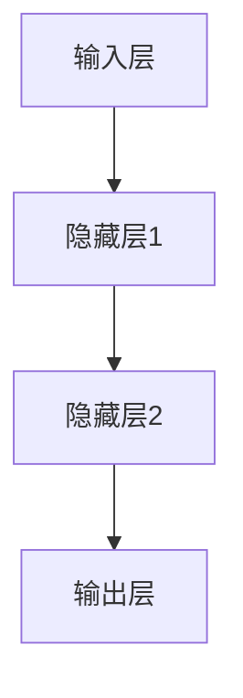
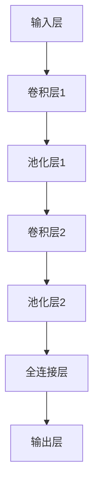
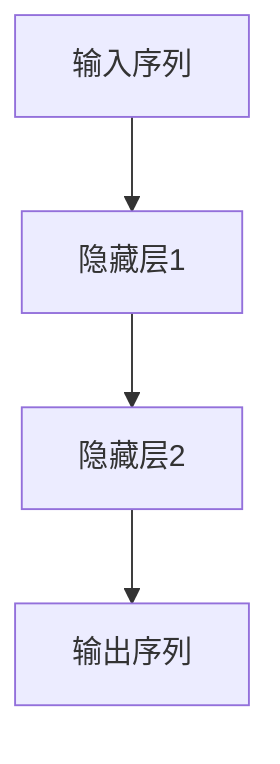
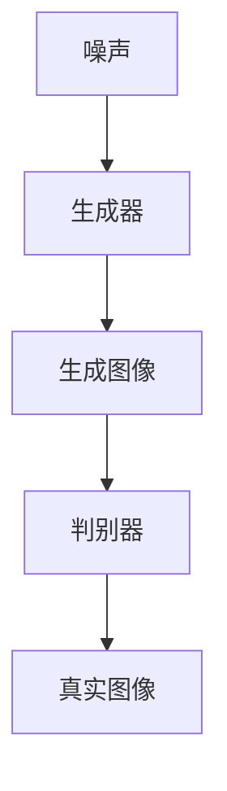
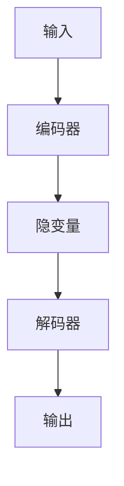

                 

# 《AI编程语言：提示词的革命与魔法》

## 关键词：
- AI编程语言
- 提示词
- 革命
- 魔法
- 深度学习
- 自然语言处理
- 计算机视觉
- 游戏开发
- 数据科学

## 摘要：
本文深入探讨了AI编程语言的革命性变革，特别是提示词的作用和魔法效应。文章首先介绍了AI编程语言的基本概念、历史和发展趋势，然后详细阐述了AI编程语言的核心原理和架构设计。接着，文章重点讨论了提示词的设计原则、优化方法和实际案例，揭示了提示词在AI编程语言中的核心地位。随后，文章分别介绍了AI编程语言在自然语言处理、计算机视觉、游戏开发和数据科学中的应用，提供了丰富的项目实战和代码解读。最后，文章展望了AI编程语言的未来发展趋势和面临的挑战，并提供了学习资源和实践指南。通过本文的阅读，读者将对AI编程语言有更深入的理解和掌握。

----------------------------------------------------------------

## 《AI编程语言：提示词的革命与魔法》目录大纲

### 第1章 引言

#### 1.1 AI编程语言的概念与历史

- **AI编程语言**：定义与类型
  - **什么是AI编程语言**：解释AI编程语言的定义，指出它与普通编程语言的区别。
  - **AI编程语言的类型**：分类介绍AI编程语言的类型，如领域特定语言（DSL）、通用编程语言等。

- **AI编程语言的发展历程**：
  - **早期探索**：回顾AI编程语言的早期发展和重要里程碑。
  - **现代进展**：介绍当前AI编程语言的发展趋势和技术突破。

- **AI编程语言与人类编程语言的比较**：
  - **相似性**：分析AI编程语言与人类编程语言的共通点。
  - **差异性**：探讨AI编程语言特有的特性和优势。

#### 1.2 提示词的革命与魔法

- **提示词的概念**：
  - **定义**：解释提示词的定义，强调其在AI编程语言中的重要性。
  - **功能**：阐述提示词在AI编程中的作用，包括如何引导模型的输出和增强交互性。

- **提示词的革命**：
  - **背景**：分析提示词革命的原因和背景，如AI技术的发展和用户需求的增加。
  - **影响**：讨论提示词革命对AI编程语言和应用的深远影响。

- **提示词的魔法效应**：
  - **解释**：说明提示词如何发挥魔法效应，即通过精细的提示来引导AI模型实现复杂任务。
  - **实例**：提供一些实例来展示提示词的魔法效应，如通过简单的提示生成高质量的内容或图像。

#### 1.3 AI编程语言的应用前景

- **AI编程语言的应用领域**：
  - **自然语言处理**：介绍AI编程语言在自然语言处理中的具体应用，如文本生成、情感分析和机器翻译。
  - **计算机视觉**：探讨AI编程语言在计算机视觉领域的应用，如图像识别和目标检测。
  - **游戏开发**：展示AI编程语言在游戏开发中的创新应用，如游戏AI和生成式游戏内容。
  - **数据科学**：分析AI编程语言在数据科学和大数据分析中的应用潜力。

- **AI编程语言的优势**：
  - **易于使用**：解释AI编程语言如何简化编程流程，使开发者能够更高效地构建AI应用。
  - **灵活性**：讨论AI编程语言在处理复杂任务时的灵活性和适应性。
  - **扩展性**：介绍AI编程语言如何支持自定义和扩展，以满足不同领域和应用的需求。

- **AI编程语言的挑战**：
  - **可解释性**：讨论AI编程语言如何提高模型的可解释性，帮助开发者理解模型的决策过程。
  - **性能优化**：探讨AI编程语言如何优化模型性能，提高计算效率和资源利用率。
  - **安全性**：分析AI编程语言如何保障AI系统的安全性，防止恶意攻击和数据泄露。

### 第2章 AI编程语言基础

#### 2.1 AI编程语言的核心原理

- **深度学习基础**：
  - **神经网络的基本结构**：
    - **神经元**：介绍神经元的概念和功能。
    - **层**：讨论输入层、隐藏层和输出层的结构和作用。
    - **激活函数**：解释常见的激活函数，如Sigmoid、ReLU和Tanh。
  - **常见的深度学习架构**：
    - **卷积神经网络（CNN）**：介绍CNN的结构和工作原理。
    - **循环神经网络（RNN）**：探讨RNN的类型和应用，如LSTM和GRU。
    - **生成对抗网络（GAN）**：解释GAN的基本原理和组成部分。

- **自然语言处理基础**：
  - **词嵌入技术**：
    - **词向量的定义**：解释词嵌入的概念，以及如何将词汇映射到高维向量空间。
    - **常见的词嵌入方法**：介绍Word2Vec、GloVe和BERT等常见词嵌入技术。
  - **序列模型与注意力机制**：
    - **序列模型**：解释RNN和Transformer等序列模型的基本原理。
    - **注意力机制**：讨论注意力机制在自然语言处理中的应用和效果。

- **强化学习基础**：
  - **强化学习的基本概念**：
    - **智能体**：介绍智能体的定义和作用。
    - **环境**：解释环境的概念，以及智能体与环境的交互。
    - **奖励机制**：探讨奖励机制在强化学习中的重要性。
  - **常见的强化学习算法**：
    - **Q-Learning**：详细解释Q-Learning算法的原理和实现步骤。
    - **Policy Gradient**：介绍Policy Gradient算法的基本思想和应用场景。
    - **Actor-Critic**：讨论Actor-Critic算法的结构和优势。

#### 2.2 AI编程语言的架构设计

- **神经网络架构**：
  - **多层感知机（MLP）**：讨论MLP的结构和实现方法。
  - **卷积神经网络（CNN）**：
    - **卷积层**：介绍卷积层的作用和参数设置。
    - **池化层**：解释池化层的目的和常见操作。
    - **全连接层**：讨论全连接层在CNN中的作用。
  - **循环神经网络（RNN）**：
    - **RNN的基本结构**：解释RNN的循环结构和工作原理。
    - **LSTM和GRU**：讨论LSTM和GRU的特点和应用。
  - **Transformer**：
    - **Transformer的基本结构**：介绍Transformer的自注意力机制和多头注意力。
    - **编码器和解码器**：解释编码器和解码器在Transformer中的作用。

- **生成对抗网络（GAN）**：
  - **GAN的基本原理**：
    - **生成器**：解释生成器的功能和作用。
    - **判别器**：讨论判别器的目标和作用。
    - **对抗训练**：解释对抗训练的概念和过程。
  - **常见的GAN架构**：
    - **基本GAN**：介绍基本GAN的架构和实现方法。
    - **改进型GAN**：讨论改进型GAN的常见架构，如Wasserstein GAN（WGAN）和梯度惩罚GAN（GP-GAN）。

- **变分自编码器（VAE）**：
  - **VAE的基本原理**：
    - **编码器**：解释编码器的作用和结构。
    - **解码器**：讨论解码器的作用和结构。
    - **变分下采样**：介绍变分下采样的概念和实现方法。
  - **VAE的应用场景**：
    - **数据生成**：探讨VAE在数据生成中的应用。
    - **数据去噪**：讨论VAE在数据去噪中的应用。

#### 2.3 AI编程语言的工具与库

- **TensorFlow**：
  - **TensorFlow的基本概念**：解释TensorFlow的架构和核心概念，如计算图和Tensor。
  - **TensorFlow的组件**：讨论TensorFlow的主要组件，如操作、层和模型构建。
  - **TensorFlow的实战应用**：提供TensorFlow在深度学习任务中的应用案例，如图像分类和文本生成。

- **PyTorch**：
  - **PyTorch的基本概念**：解释PyTorch的动态计算图和TorchScript。
  - **PyTorch的组件**：讨论PyTorch的主要组件，如nn模块、autograd模块和torchvision库。
  - **PyTorch的实战应用**：提供PyTorch在深度学习任务中的应用案例，如目标检测和语音识别。

- **Keras**：
  - **Keras的基本概念**：解释Keras的高层API和模型构建方法。
  - **Keras的组件**：讨论Keras的主要组件，如序列模型、函数式模型和自定义层。
  - **Keras的实战应用**：提供Keras在深度学习任务中的应用案例，如图像增强和自然语言处理。

### 第3章 提示词设计与优化

#### 3.1 提示词设计原则

- **提示词的语义理解**：
  - **语义理解的概念**：解释语义理解的概念，即如何理解文本中的含义和关系。
  - **语义理解的层次**：讨论语义理解的层次，如词义消歧、句法分析和语义角色标注。
  - **语义理解的技术**：介绍用于语义理解的技术，如词嵌入、命名实体识别和语义角色标注。

- **提示词的上下文构建**：
  - **上下文构建的概念**：解释上下文构建的概念，即如何构建与提示词相关的上下文信息。
  - **上下文构建的方法**：讨论上下文构建的方法，如上下文窗口、注意力机制和递归神经网络。
  - **上下文构建的应用**：介绍上下文构建在提示词优化中的应用，如问答系统、对话系统和文本生成。

- **提示词的可解释性**：
  - **可解释性的重要性**：讨论可解释性在AI系统中的重要性，特别是对于提示词的优化。
  - **可解释性的技术**：介绍可解释性的技术，如模型可视化、决策树和规则提取。
  - **可解释性的挑战**：探讨提示词优化中面临的可解释性挑战，如模型复杂性和黑盒性。

#### 3.2 提示词优化方法

- **强化学习优化**：
  - **强化学习的概念**：解释强化学习的概念和作用，如智能体、环境和奖励。
  - **强化学习在提示词优化中的应用**：讨论强化学习在提示词优化中的应用，如优化交互式提示和自适应调整。
  - **强化学习的实现**：介绍强化学习的基本算法，如Q-Learning和Policy Gradient，并在伪代码中详细描述。

- **自然语言生成优化**：
  - **自然语言生成的概念**：解释自然语言生成的概念，即如何使用AI技术生成自然语言文本。
  - **自然语言生成在提示词优化中的应用**：讨论自然语言生成在提示词优化中的应用，如生成高质量提示和自适应对话。
  - **自然语言生成的算法**：介绍常见的自然语言生成算法，如序列到序列模型和生成对抗网络。

- **数据增强优化**：
  - **数据增强的概念**：解释数据增强的概念，即如何通过扩充和变换数据来提高模型性能。
  - **数据增强在提示词优化中的应用**：讨论数据增强在提示词优化中的应用，如提高提示词的多样性和减少过拟合。
  - **数据增强的方法**：介绍常见的数据增强方法，如数据清洗、数据扩展和数据变换。

#### 3.3 提示词案例解析

- **案例一：问答系统**：
  - **问题背景**：介绍问答系统的应用背景和目标。
  - **解决方案**：讨论如何设计提示词来优化问答系统的性能，包括提示词的语义理解和上下文构建。
  - **实现细节**：提供具体的实现细节，如使用的算法、模型和代码片段。

- **案例二：文本生成**：
  - **问题背景**：介绍文本生成的应用背景和目标。
  - **解决方案**：讨论如何设计提示词来优化文本生成的质量，包括提示词的上下文构建和自然语言生成优化。
  - **实现细节**：提供具体的实现细节，如使用的算法、模型和代码片段。

- **案例三：图像识别**：
  - **问题背景**：介绍图像识别的应用背景和目标。
  - **解决方案**：讨论如何设计提示词来优化图像识别的准确性，包括提示词的语义理解和图像增强。
  - **实现细节**：提供具体的实现细节，如使用的算法、模型和代码片段。

### 第4章 AI编程语言在自然语言处理中的应用

#### 4.1 自然语言处理基础

- **词嵌入技术**：
  - **词嵌入的概念**：解释词嵌入的概念，即如何将词汇映射到高维向量空间。
  - **常见的词嵌入方法**：
    - **Word2Vec**：介绍Word2Vec算法的基本原理和实现步骤。
    - **GloVe**：讨论GloVe算法的优点和应用场景。
    - **BERT**：解释BERT算法的基本原理和训练过程。

- **序列模型与注意力机制**：
  - **序列模型**：讨论序列模型的基本原理和应用，如RNN和Transformer。
  - **注意力机制**：介绍注意力机制的概念和作用，以及如何实现自注意力机制和多头注意力。

- **变换器架构详解**：
  - **Transformer的基本架构**：解释Transformer的自注意力机制和多头注意力。
  - **Transformer的变体**：讨论Transformer的变体，如BERT、GPT和T5。

#### 4.2 文本分类与情感分析

- **文本分类算法**：
  - **分类任务概述**：介绍文本分类的任务定义和常见应用场景。
  - **常见算法**：
    - **朴素贝叶斯**：解释朴素贝叶斯算法的基本原理和应用。
    - **支持向量机（SVM）**：讨论SVM算法的原理和实现步骤。
    - **神经网络模型**：介绍基于神经网络的文本分类模型，如卷积神经网络（CNN）和循环神经网络（RNN）。

- **情感分析算法**：
  - **情感分析任务概述**：介绍情感分析的任务定义和常见应用场景。
  - **常见算法**：
    - **基于规则的方法**：讨论基于规则的方法，如情感词典和规则匹配。
    - **机器学习方法**：介绍机器学习方法，如朴素贝叶斯、支持向量机和神经网络。

#### 4.3 机器翻译

- **神经机器翻译**：
  - **神经机器翻译的基本原理**：解释神经机器翻译的架构和实现方法，如序列到序列（Seq2Seq）模型和注意力机制。
  - **转换器架构详解**：讨论转换器（Transformer）架构的基本原理和优点，如自注意力机制和多头注意力。

- **机器翻译实战**：
  - **数据预处理**：介绍机器翻译中的数据预处理步骤，如文本清洗、分词和词汇表构建。
  - **模型训练与优化**：讨论机器翻译模型训练和优化的方法，如损失函数选择、训练策略和超参数调优。
  - **模型评估与部署**：介绍机器翻译模型的评估方法和部署策略，如BLEU评分和在线翻译服务。

### 第5章 AI编程语言在计算机视觉中的应用

#### 5.1 计算机视觉基础

- **图像处理技术**：
  - **图像处理的基本操作**：介绍图像处理的基本操作，如滤波、边缘检测和形态学操作。
  - **图像增强技术**：讨论图像增强技术，如直方图均衡、对比度增强和锐化。

- **卷积神经网络**：
  - **卷积神经网络的基本结构**：解释卷积神经网络的基本原理和组成部分，如卷积层、池化层和全连接层。
  - **卷积神经网络的应用**：讨论卷积神经网络在计算机视觉中的应用，如图像分类和目标检测。

- **特征提取技术**：
  - **特征提取的基本概念**：解释特征提取的概念，即如何从图像中提取有意义的特征。
  - **特征提取的方法**：介绍常见的特征提取方法，如Haar特征、HOG特征和SIFT特征。

#### 5.2 目标检测与图像分类

- **目标检测算法**：
  - **目标检测的基本原理**：解释目标检测的任务定义和基本原理，如基于区域建议的方法和基于锚点的方法。
  - **常见的目标检测算法**：讨论常见的目标检测算法，如SSD、YOLO和Faster R-CNN。

- **图像分类算法**：
  - **图像分类的基本原理**：解释图像分类的任务定义和基本原理，如基于特征的方法和基于深度学习的方法。
  - **常见的图像分类算法**：讨论常见的图像分类算法，如SVM、CNN和ResNet。

#### 5.3 计算机视觉项目实战

- **项目一：人脸识别**：
  - **项目背景**：介绍人脸识别的应用背景和目标。
  - **解决方案**：讨论如何使用AI编程语言实现人脸识别，包括特征提取、模型训练和识别算法。

- **项目二：图像生成**：
  - **项目背景**：介绍图像生成的应用背景和目标。
  - **解决方案**：讨论如何使用AI编程语言实现图像生成，包括生成对抗网络（GAN）的训练和生成算法。

- **项目三：图像增强**：
  - **项目背景**：介绍图像增强的应用背景和目标。
  - **解决方案**：讨论如何使用AI编程语言实现图像增强，包括图像预处理、滤波器和优化算法。

### 第6章 AI编程语言在游戏开发中的应用

#### 6.1 游戏开发基础

- **游戏引擎**：
  - **游戏引擎的概念**：解释游戏引擎的概念和作用，如Unity、Unreal Engine等。
  - **游戏引擎的核心功能**：讨论游戏引擎的核心功能，如渲染、物理模拟和音频处理。

- **游戏脚本**：
  - **游戏脚本的概念**：解释游戏脚本的概念和作用，如C#、Lua等。
  - **游戏脚本的基本语法**：介绍游戏脚本的基本语法和结构。

- **游戏物理**：
  - **游戏物理的概念**：解释游戏物理的概念和作用，如碰撞检测、刚体动力学等。
  - **游戏物理的基本原理**：讨论游戏物理的基本原理，如牛顿运动定律和刚体运动。

#### 6.2 强化学习在游戏中的应用

- **强化学习的基本概念**：
  - **强化学习的概念**：解释强化学习的概念和作用，如智能体、环境和奖励。
  - **强化学习的基本原理**：讨论强化学习的基本原理，如Q-Learning和Policy Gradient。

- **强化学习在游戏中的应用**：
  - **游戏AI设计**：讨论如何设计游戏AI，包括决策树、状态空间和动作空间。
  - **强化学习算法的应用**：介绍强化学习算法在游戏中的应用，如DQN、A3C和PPO。

- **游戏项目实战**：
  - **项目一：迷宫游戏**：
    - **项目背景**：介绍迷宫游戏的应用背景和目标。
    - **解决方案**：讨论如何使用强化学习实现迷宫游戏的AI玩家。

  - **项目二：棋类游戏**：
    - **项目背景**：介绍棋类游戏的应用背景和目标。
    - **解决方案**：讨论如何使用强化学习实现棋类游戏的智能AI。

  - **项目三：角色扮演游戏**：
    - **项目背景**：介绍角色扮演游戏的应用背景和目标。
    - **解决方案**：讨论如何使用强化学习实现角色扮演游戏中的动态决策和动作。

### 第7章 AI编程语言在数据科学中的应用

#### 7.1 数据科学基础

- **数据预处理**：
  - **数据预处理的概念**：解释数据预处理的概念和作用，如数据清洗、数据转换和数据归一化。
  - **常见的数据预处理方法**：讨论常见的数据预处理方法，如缺失值填充、异常值处理和数据标准化。

- **数据分析**：
  - **数据分析的概念**：解释数据分析的概念和作用，如描述性统计、相关性分析和聚类分析。
  - **常见的数据分析方法**：讨论常见的数据分析方法，如回归分析、决策树和聚类。

- **数据可视化**：
  - **数据可视化的概念**：解释数据可视化的概念和作用，如图表、图像和交互式可视化。
  - **常见的数据可视化工具**：讨论常见的数据可视化工具，如Matplotlib、Seaborn和Plotly。

#### 7.2 数据挖掘与机器学习

- **数据挖掘的基本概念**：
  - **数据挖掘的概念**：解释数据挖掘的概念和作用，如分类、聚类和关联规则挖掘。
  - **数据挖掘的方法**：讨论数据挖掘的方法，如决策树、K-均值聚类和Apriori算法。

- **机器学习模型**：
  - **机器学习的基本概念**：解释机器学习的基本概念，如模型训练、模型评估和模型选择。
  - **常见的机器学习模型**：讨论常见的机器学习模型，如线性回归、决策树和神经网络。

- **机器学习实战**：
  - **数据集准备**：讨论如何准备数据集，包括数据采集、数据清洗和数据预处理。
  - **模型训练与优化**：讨论如何训练和优化机器学习模型，包括模型选择、参数调优和交叉验证。
  - **模型评估与部署**：讨论如何评估和部署机器学习模型，包括性能评估、模型解释和在线服务。

#### 7.3 数据科学项目实战

- **项目一：用户行为分析**：
  - **项目背景**：介绍用户行为分析的应用背景和目标。
  - **解决方案**：讨论如何使用AI编程语言实现用户行为分析，包括数据预处理、特征提取和模型训练。

- **项目二：市场预测**：
  - **项目背景**：介绍市场预测的应用背景和目标。
  - **解决方案**：讨论如何使用AI编程语言实现市场预测，包括时间序列分析、回归分析和模型优化。

- **项目三：医疗数据分析**：
  - **项目背景**：介绍医疗数据分析的应用背景和目标。
  - **解决方案**：讨论如何使用AI编程语言实现医疗数据分析，包括数据预处理、特征提取和机器学习模型训练。

### 第8章 AI编程语言的未来展望

#### 8.1 AI编程语言的发展趋势

- **新兴技术的融入**：
  - **量子计算**：讨论量子计算在AI编程语言中的应用前景，如量子机器学习和量子神经网络。
  - **联邦学习**：介绍联邦学习的概念和应用，如何提高AI编程语言的隐私保护和数据共享能力。

- **跨领域应用**：
  - **金融领域**：讨论AI编程语言在金融领域中的应用，如算法交易、风险评估和客户服务。
  - **医疗领域**：介绍AI编程语言在医疗领域中的应用，如医学图像分析、疾病诊断和个性化治疗。

- **开源与生态**：
  - **开源项目**：讨论流行的AI编程语言开源项目，如TensorFlow、PyTorch和Keras的发展情况和社区生态。
  - **技术标准化**：介绍AI编程语言的技术标准化工作，如MLflow和TensorFlow Model Optimization工具套件。

#### 8.2 AI编程语言的挑战与机遇

- **可解释性**：
  - **可解释性的重要性**：讨论AI编程语言的可解释性对开发者、用户和监管机构的重要性。
  - **可解释性的技术**：介绍可解释性的技术，如模型可视化、解释性模型和可解释性框架。

- **性能优化**：
  - **性能优化的目标**：讨论AI编程语言性能优化的目标，如提高计算效率、减少内存占用和降低功耗。
  - **性能优化的方法**：介绍性能优化的方法，如模型压缩、量化技术和并行计算。

- **社会责任与伦理**：
  - **社会责任**：讨论AI编程语言在社会责任方面的挑战，如数据隐私、算法公平性和透明度。
  - **伦理问题**：介绍AI编程语言在伦理问题方面的挑战，如算法偏见、人工智能责任和伦理决策。

### 附录

#### 附录 A: AI编程语言学习资源

- **学习网站推荐**：
  - **Coursera**：介绍Coursera上的AI编程语言相关课程，如“深度学习”和“自然语言处理”。
  - **edX**：介绍edX上的AI编程语言相关课程，如“机器学习基础”和“强化学习”。
  - **Udacity**：介绍Udacity上的AI编程语言相关课程，如“深度学习工程师纳米学位”和“自然语言处理工程师纳米学位”。

- **技术论坛推荐**：
  - **Stack Overflow**：介绍Stack Overflow上的AI编程语言相关讨论区，如“TensorFlow”和“PyTorch”。
  - **GitHub**：介绍GitHub上的AI编程语言相关开源项目，如TensorFlow和PyTorch的官方仓库。
  - **Reddit**：介绍Reddit上的AI编程语言相关讨论区，如/r/MachineLearning和/r/DeepLearning。

- **开源项目推荐**：
  - **TensorFlow**：介绍TensorFlow的官方文档和GitHub仓库，提供丰富的教程和示例代码。
  - **PyTorch**：介绍PyTorch的官方文档和GitHub仓库，提供丰富的教程和示例代码。
  - **Keras**：介绍Keras的官方文档和GitHub仓库，提供丰富的教程和示例代码。

#### 附录 B: AI编程语言实践指南

- **实践项目案例**：
  - **项目一：文本分类**：介绍如何使用AI编程语言实现文本分类项目，包括数据预处理、模型训练和评估。
  - **项目二：图像识别**：介绍如何使用AI编程语言实现图像识别项目，包括数据预处理、模型训练和评估。
  - **项目三：机器翻译**：介绍如何使用AI编程语言实现机器翻译项目，包括数据预处理、模型训练和评估。

- **开发环境搭建**：
  - **环境准备**：介绍如何在本地计算机上搭建AI编程语言开发环境，包括安装必要的软件和依赖库。
  - **工具使用**：介绍常用的AI编程语言开发工具，如Jupyter Notebook、Google Colab和Docker容器。

- **代码解读与分析**：
  - **代码示例**：提供具体的代码示例，展示如何使用AI编程语言实现常见任务，如文本生成、图像分类和机器翻译。
  - **代码解读**：对代码示例进行详细解读，解释代码的原理和实现步骤。
  - **代码分析**：对代码示例进行性能分析，包括运行时间、内存占用和模型参数。

### 第1章 引言

#### 1.1 AI编程语言的概念与历史

AI编程语言，顾名思义，是一种专门为人工智能（AI）应用而设计的编程语言。不同于传统的编程语言，AI编程语言更注重于如何表达和实现复杂的算法和模型，以便于构建智能系统。这种语言不仅包含了传统的编程概念，还融合了大量的AI理论和算法。

**AI编程语言的定义**

AI编程语言可以被定义为一种能够表达AI算法、模型和流程的编程语言。它通常具备以下特点：

1. **可扩展性**：AI编程语言允许用户自定义新的模型架构和算法。
2. **高层次的抽象**：通过高层次的抽象，AI编程语言简化了算法的实现过程。
3. **支持机器学习和深度学习**：AI编程语言内置了对机器学习和深度学习算法的支持，如神经网络、生成对抗网络等。
4. **易用性**：AI编程语言通常设计得更加直观，使得非专业开发者也能快速上手。

**AI编程语言的类型**

AI编程语言可以分为两类：领域特定语言（DSL）和通用编程语言。

- **领域特定语言（DSL）**：这些语言专门用于解决特定领域的问题，如自然语言处理（NLP）、计算机视觉（CV）等。DSL具有较高的专用性，通常能提供更高效的解决方案。

- **通用编程语言**：这些语言如Python、Java等，虽然并非专门为AI设计，但通过引入AI库和框架，如TensorFlow、PyTorch，它们也能被用于AI应用开发。

**AI编程语言的发展历程**

AI编程语言的发展经历了几个重要阶段：

- **早期探索**：20世纪50年代至70年代，早期的人工智能系统如ELIZA和SKENNER主要使用LISP语言。LISP语言因其强大的符号处理能力和抽象能力，成为了AI编程语言的开端。

- **现代进展**：随着深度学习技术的发展，如TensorFlow、PyTorch等深度学习框架的出现，AI编程语言进入了一个新的时代。这些框架提供了丰富的API和工具，大大简化了AI模型的开发过程。

**AI编程语言与人类编程语言的比较**

虽然AI编程语言和传统的编程语言在某些方面有相似之处，但它们也存在显著的不同：

- **目标不同**：传统编程语言主要关注如何高效地执行程序，而AI编程语言则更关注如何构建和优化AI模型。

- **复杂性**：传统编程语言通常有更简洁的语法和更明确的执行路径，而AI编程语言则需要处理复杂的神经网络和算法，这使得代码更为冗长。

- **抽象层次**：传统编程语言通常操作于较低的抽象层次，如机器代码或汇编语言，而AI编程语言则提供了更高的抽象层次，使得开发者能够专注于算法的设计和实现。

#### 1.2 提示词的革命与魔法

**提示词的概念**

提示词（Prompt Word）是指用于引导AI模型生成特定输出或执行特定任务的文字信息。在AI编程语言中，提示词扮演着至关重要的角色，因为它们能够显著影响模型的输出结果。

**提示词在AI编程语言中的作用**

1. **引导模型输出**：通过提供合适的提示词，用户可以引导AI模型生成特定的文本、图像或其他输出。
2. **增强交互性**：提示词能够使得AI系统更易于与用户互动，用户可以通过输入提示词来获取所需的响应或信息。
3. **优化性能**：精巧的提示词可以优化模型的性能，提高准确性和效率。

**提示词的革命**

1. **背景**：随着深度学习和自然语言处理技术的进步，AI模型变得越来越复杂，传统的手动调参和模型优化方法已无法满足需求。提示词的出现为AI编程语言带来了一种全新的优化手段，使得模型设计更加灵活和高效。

2. **影响**：提示词革命对AI编程语言和应用程序带来了深远的影响：

   - **简化开发流程**：提示词使得开发者不再需要手动调整模型参数，从而简化了模型开发和优化流程。
   - **提高模型可解释性**：通过设计合适的提示词，开发者可以更好地理解模型的行为和决策过程。
   - **增强用户体验**：用户可以通过输入简单的提示词来与AI系统互动，获得更加个性化、智能化的服务。

**提示词的魔法效应**

1. **解释**：提示词的魔法效应在于它们能够通过精巧的设计，引导AI模型实现复杂的任务。例如：

   - **文本生成**：通过简单的提示词，AI模型可以生成高质量的文本，如新闻报道、故事创作等。
   - **图像识别**：提示词可以帮助模型更准确地识别图像中的对象，甚至可以生成全新的图像内容。
   - **对话系统**：提示词可以引导AI模型生成自然流畅的对话，提高用户体验。

2. **实例**：以下是几个实例，展示了提示词的魔法效应：

   - **文本生成**：输入“写一篇关于人工智能的未来发展趋势的论文”，AI模型可以生成一篇内容丰富、结构清晰的论文。
   - **图像识别**：输入“识别以下图像中的动物”，AI模型可以准确地识别出图像中的动物，并提供相应的标签。
   - **对话系统**：输入“帮我订一张明天去北京的机票”，AI模型可以自动完成机票预订过程，并返回确认信息。

#### 1.3 AI编程语言的应用前景

**AI编程语言的应用领域**

AI编程语言已经在多个领域取得了显著的成果，以下是其主要应用领域：

1. **自然语言处理（NLP）**：AI编程语言在NLP领域中的应用非常广泛，如文本分类、情感分析、机器翻译等。
2. **计算机视觉（CV）**：AI编程语言在CV领域的应用包括图像识别、目标检测、图像生成等。
3. **游戏开发**：AI编程语言在游戏开发中的应用包括游戏AI、游戏生成内容、虚拟现实等。
4. **数据科学**：AI编程语言在数据科学中的应用包括数据预处理、数据分析、机器学习等。

**AI编程语言的优势**

1. **易于使用**：AI编程语言通常设计得更加直观和用户友好，使得开发者能够更高效地构建AI应用。
2. **灵活性**：AI编程语言提供了丰富的API和工具，使得开发者可以根据需求自定义模型和算法。
3. **扩展性**：AI编程语言支持自定义扩展，如自定义层、操作和损失函数等，以适应不同应用的需求。

**AI编程语言的挑战**

1. **可解释性**：尽管AI编程语言在提高模型性能方面表现出色，但其内部决策过程往往不够透明，难以解释。
2. **性能优化**：AI模型通常需要大量的计算资源和时间来训练和推理，如何在保证性能的同时提高效率是一个挑战。
3. **安全性**：AI系统在处理敏感数据时，如何保障数据的安全性和隐私是一个重要问题。

### 第2章 AI编程语言基础

#### 2.1 AI编程语言的核心原理

**深度学习基础**

深度学习是AI编程语言的核心技术之一，它通过构建多层神经网络，模拟人脑的神经结构，实现从大量数据中自动学习和提取特征。以下是深度学习的一些基本原理：

**神经网络的基本结构**

神经网络由一系列的神经元组成，每个神经元都接收输入信号，通过权重和偏置进行加权求和，然后通过激活函数进行非线性变换，最终产生输出信号。神经网络的基本结构包括：

1. **输入层**：接收外部输入信号，如文本、图像等。
2. **隐藏层**：对输入信号进行加工和变换，提取特征。
3. **输出层**：产生最终的输出结果，如分类标签、预测值等。

**激活函数**

激活函数是神经网络中的一个关键组件，它将线性组合的输入映射到非线性的输出。常见的激活函数包括：

1. **Sigmoid函数**：将输入值压缩到(0,1)区间。
2. **ReLU函数**：引入非线性，并减少梯度消失问题。
3. **Tanh函数**：将输入值压缩到(-1,1)区间。

**常见的深度学习架构**

1. **卷积神经网络（CNN）**：用于图像处理和计算机视觉任务，其主要组件包括卷积层、池化层和全连接层。
2. **循环神经网络（RNN）**：适用于序列数据处理，如时间序列分析、自然语言处理等，常见变体包括LSTM和GRU。
3. **生成对抗网络（GAN）**：用于生成数据，由生成器和判别器组成，通过对抗训练生成逼真的数据。

**自然语言处理基础**

自然语言处理是AI编程语言的重要应用领域之一，它涉及从文本中提取有用信息，并实现文本生成、情感分析、机器翻译等功能。以下是自然语言处理的一些基础概念：

**词嵌入技术**

词嵌入是将词汇映射到高维向量空间的技术，它能够捕捉词汇之间的语义关系。常见的词嵌入技术包括：

1. **Word2Vec**：通过神经网络训练词向量，捕捉词汇的上下文信息。
2. **GloVe**：基于全局统计信息训练词向量，提高词汇的区分度。
3. **BERT**：通过预训练大规模语料库，生成高质量的词向量。

**序列模型与注意力机制**

序列模型是处理序列数据的基本模型，如自然语言处理中的文本序列。常见的序列模型包括：

1. **RNN**：通过循环结构处理序列数据，捕捉长距离依赖关系。
2. **Transformer**：通过自注意力机制处理序列数据，实现高效和灵活的序列建模。

注意力机制是序列模型中的一个关键组件，它能够使模型关注序列中的重要部分，提高模型的表达能力。注意力机制包括：

1. **自注意力**：模型内部不同位置之间的注意力机制。
2. **多头注意力**：模型内部多个独立注意力机制的组合。

**强化学习基础**

强化学习是AI编程语言中的一种重要技术，它通过智能体与环境的互动，学习最优策略以实现目标。以下是强化学习的一些基本概念：

**强化学习的基本概念**

1. **智能体**：执行动作以获取奖励的实体。
2. **环境**：智能体执行动作的上下文。
3. **状态**：描述智能体当前状态的变量集合。
4. **动作**：智能体可以执行的行为。
5. **奖励**：对智能体动作的反馈。

**常见的强化学习算法**

1. **Q-Learning**：通过学习状态-动作值函数，优化智能体的动作选择。
2. **Policy Gradient**：直接优化智能体的策略，提高奖励期望。
3. **Actor-Critic**：结合Q-Learning和Policy Gradient，同时优化价值函数和策略。

**深度学习与自然语言处理、强化学习的关系**

深度学习是自然语言处理和强化学习的基础技术，它为这两个领域提供了强大的建模工具。自然语言处理利用深度学习模型处理文本数据，实现文本生成、情感分析等任务；强化学习则利用深度学习模型模拟智能体的行为，实现自主学习和决策。通过深度学习，自然语言处理和强化学习得以突破传统的限制，实现更智能、更灵活的应用。

#### 2.2 AI编程语言的架构设计

**神经网络架构**

神经网络是AI编程语言的核心组件，其架构设计决定了模型的能力和性能。以下是几种常见的神经网络架构：

**多层感知机（MLP）**

多层感知机（MLP）是一种简单的神经网络架构，由输入层、一个或多个隐藏层和输出层组成。每个隐藏层由多个神经元组成，神经元之间通过加权连接进行信息传递。

MLP的基本结构如图2-1所示：



MLP的优点包括：

1. **简单易实现**：MLP的结构相对简单，易于理解和实现。
2. **高效性**：MLP在许多任务中表现良好，如回归和分类。

**卷积神经网络（CNN）**

卷积神经网络（CNN）是一种专门用于处理图像数据的神经网络，其主要优势在于能够有效地提取图像的特征。

CNN的基本结构如图2-2所示：



CNN的主要组件包括：

1. **卷积层**：用于提取图像的特征，通过卷积操作和激活函数实现。
2. **池化层**：用于降低特征图的维度，减少模型的参数数量。
3. **全连接层**：用于分类或回归任务，将提取到的特征映射到输出结果。

**循环神经网络（RNN）**

循环神经网络（RNN）是一种用于处理序列数据的神经网络，其特点在于能够保持记忆状态，捕捉序列中的长距离依赖关系。

RNN的基本结构如图2-3所示：



RNN的主要组件包括：

1. **隐藏层**：每个时间步的隐藏状态都依赖于前一个时间步的隐藏状态，形成一个循环结构。
2. **门控机制**：通过门控机制（如ReLU、Sigmoid）控制信息的流动，避免梯度消失问题。

**生成对抗网络（GAN）**

生成对抗网络（GAN）是一种生成模型，由生成器和判别器组成，通过对抗训练生成逼真的数据。

GAN的基本结构如图2-4所示：



GAN的主要组件包括：

1. **生成器**：用于生成逼真的图像。
2. **判别器**：用于区分真实图像和生成图像。
3. **对抗训练**：生成器和判别器相互对抗，生成器试图生成更逼真的图像，判别器试图区分真实图像和生成图像。

**变分自编码器（VAE）**

变分自编码器（VAE）是一种用于生成数据的自编码器模型，其特点是能够生成多样化的数据。

VAE的基本结构如图2-5所示：



VAE的主要组件包括：

1. **编码器**：将输入映射到隐变量。
2. **解码器**：将隐变量映射回输出。
3. **变分下采样**：通过变分下采样生成多样化的数据。

**AI编程语言的架构设计**

AI编程语言的架构设计决定了其功能和应用范围。以下是几种常见的AI编程语言架构设计：

**TensorFlow架构**

TensorFlow是一个由Google开发的深度学习框架，其架构设计包括以下几个关键组件：

1. **计算图**：TensorFlow使用计算图来表示模型的计算过程，计算图中的节点表示计算操作，边表示数据流动。
2. **会话**：用于执行计算图的运行时环境，通过会话可以启动和执行计算图中的操作。
3. **操作库**：TensorFlow提供了丰富的操作库，包括数学操作、神经网络操作等。

**PyTorch架构**

PyTorch是一个由Facebook开发的深度学习框架，其架构设计包括以下几个关键组件：

1. **动态计算图**：PyTorch使用动态计算图，允许开发者以更灵活的方式构建和修改模型。
2. **TorchScript**：PyTorch支持将动态计算图转换为静态计算图，以提高计算效率和性能。
3. **操作库**：PyTorch提供了丰富的操作库，包括数学操作、神经网络操作等。

**Keras架构**

Keras是一个基于TensorFlow和Theano的深度学习框架，其架构设计包括以下几个关键组件：

1. **高层API**：Keras提供了高层API，使得开发者可以以更简洁的方式构建和训练模型。
2. **后端支持**：Keras支持多个后端框架，包括TensorFlow、Theano和Microsoft Cognitive Toolkit。
3. **操作库**：Keras提供了丰富的操作库，包括数学操作、神经网络操作等。

**AI编程语言的架构设计原则**

AI编程语言的架构设计应遵循以下原则：

1. **灵活性**：架构设计应支持多种神经网络架构和算法，以满足不同应用的需求。
2. **易用性**：架构设计应提供简洁、直观的API，使得开发者可以轻松构建和训练模型。
3. **性能优化**：架构设计应考虑性能优化，包括计算图优化、内存管理和并行计算等。
4. **可扩展性**：架构设计应支持自定义扩展，包括自定义层、操作和损失函数等。

#### 2.3 AI编程语言的工具与库

**TensorFlow**

TensorFlow是Google开发的一款开源深度学习框架，它提供了丰富的API和工具，使得开发者可以轻松构建和训练深度学习模型。以下是TensorFlow的一些关键组件：

1. **计算图**：TensorFlow使用计算图来表示模型的计算过程，计算图中的节点表示计算操作，边表示数据流动。
2. **会话**：会话是执行计算图的运行时环境，通过会话可以启动和执行计算图中的操作。
3. **操作库**：TensorFlow提供了丰富的操作库，包括数学操作、神经网络操作等。

**PyTorch**

PyTorch是Facebook开发的一款开源深度学习框架，它以其动态计算图和简洁的API而受到开发者的青睐。以下是PyTorch的一些关键组件：

1. **动态计算图**：PyTorch使用动态计算图，允许开发者以更灵活的方式构建和修改模型。
2. **TorchScript**：TorchScript是PyTorch支持的一种静态计算图格式，可以提高计算效率和性能。
3. **操作库**：PyTorch提供了丰富的操作库，包括数学操作、神经网络操作等。

**Keras**

Keras是一个基于TensorFlow和Theano的深度学习框架，它提供了高层API，使得开发者可以以更简洁的方式构建和训练模型。以下是Keras的一些关键组件：

1. **高层API**：Keras提供了高层API，包括序列模型、函数式模型和自定义层，使得开发者可以轻松构建模型。
2. **后端支持**：Keras支持多个后端框架，包括TensorFlow、Theano和Microsoft Cognitive Toolkit。
3. **操作库**：Keras提供了丰富的操作库，包括数学操作、神经网络操作等。

**AI编程语言的工具与库选择**

选择合适的AI编程语言工具和库对项目开发至关重要。以下是几种常见的选择：

1. **项目需求**：根据项目的需求选择合适的工具和库，如项目需要快速原型开发，可以选择PyTorch；如项目需要高性能计算，可以选择TensorFlow。
2. **开发者经验**：考虑开发者的经验和熟悉度，选择开发者熟悉的工具和库。
3. **社区支持**：选择有良好社区支持的工具和库，以确保问题能够得到及时解决和资源获取。

### 第3章 提示词设计与优化

#### 3.1 提示词设计原则

提示词在AI编程语言中扮演着至关重要的角色，它们能够引导模型的输出，优化性能，甚至提高用户体验。为了设计有效的提示词，需要遵循以下原则：

**提示词的语义理解**

语义理解是提示词设计的基础。它涉及到如何准确理解用户输入的文本含义，并将其转化为模型可以处理的输入。以下是实现语义理解的关键原则：

1. **准确性**：确保提示词准确反映了用户的意图和需求，避免歧义和误解。
2. **完整性**：提示词应包含所有必要的信息，以便模型能够生成高质量的输出。
3. **可扩展性**：提示词应设计得灵活，能够适应不同的应用场景和需求。

**提示词的上下文构建**

上下文构建是提升模型性能的关键。它涉及到如何构建与提示词相关的上下文信息，以便模型能够更好地理解和处理输入。以下是实现上下文构建的原则：

1. **相关性**：上下文信息应与提示词高度相关，以提高模型的理解能力。
2. **多样性**：上下文信息应包含多样化的内容，以避免模型过度依赖单一信息源。
3. **连贯性**：上下文信息应保持连贯性，以便模型能够顺畅地处理输入。

**提示词的可解释性**

可解释性是AI系统的一项重要特性，尤其在涉及用户交互和决策支持的应用中。以下是提升提示词可解释性的原则：

1. **透明性**：提示词的设计应尽量透明，使开发者能够理解其工作原理和作用。
2. **可理解性**：提示词应设计得易于理解，以便用户能够轻松掌握其功能和用途。
3. **可调试性**：提示词的设计应支持调试和优化，以便开发者能够根据实际情况进行调整。

#### 3.2 提示词优化方法

为了提升AI编程语言中提示词的效果，需要采用一系列优化方法。以下是一些常用的优化方法：

**强化学习优化**

强化学习是一种通过反馈信号来优化模型性能的方法。在提示词优化中，可以通过以下方法进行强化学习：

1. **Q-Learning**：通过学习状态-动作值函数，优化提示词的选择。
2. **Policy Gradient**：直接优化策略，以提高提示词的生成质量。
3. **Actor-Critic**：结合Q-Learning和Policy Gradient，同时优化价值函数和策略。

**自然语言生成优化**

自然语言生成（NLG）是AI编程语言中的重要应用领域。以下是一些优化自然语言生成的方法：

1. **序列到序列模型**：通过序列到序列模型（Seq2Seq）生成高质量的文本。
2. **生成对抗网络（GAN）**：通过生成对抗网络（GAN）生成逼真的文本和语音。
3. **预训练语言模型**：通过预训练语言模型（如BERT、GPT）生成高质量的文本。

**数据增强优化**

数据增强是提高模型性能的一种常用方法。以下是一些数据增强的方法：

1. **数据扩展**：通过复制、旋转、缩放等方式扩展数据集。
2. **数据变换**：通过噪声添加、数据压缩等方式变换数据集。
3. **数据合成**：通过合成新的数据样本，提高模型的泛化能力。

#### 3.3 提示词案例解析

为了更好地理解提示词的设计和优化，以下将介绍几个具体的案例。

**案例一：问答系统**

**问题背景**：问答系统是一种常见的AI应用，用户可以通过输入问题来获取答案。提示词的设计对于问答系统的性能至关重要。

**解决方案**：设计有效的提示词需要考虑以下几个因素：

1. **问题理解**：确保提示词能够准确理解用户的问题，避免歧义和误解。
2. **答案生成**：根据用户的问题，提示词应引导模型生成准确的答案。
3. **上下文构建**：构建与问题相关的上下文信息，以提高模型的回答质量。

**实现细节**：

1. **数据预处理**：对问题进行预处理，包括文本清洗、分词和去停用词。
2. **词嵌入**：使用词嵌入技术将问题转换为向量表示。
3. **模型训练**：使用序列到序列模型或变换器模型进行训练，以生成高质量的答案。

**代码示例**：

```python
import tensorflow as tf
from tensorflow.keras.models import Sequential
from tensorflow.keras.layers import Embedding, LSTM, Dense

# 数据预处理
questions = preprocess(questions)
answers = preprocess(answers)

# 建立模型
model = Sequential()
model.add(Embedding(vocab_size, embedding_dim))
model.add(LSTM(units=128, return_sequences=True))
model.add(Dense(units=1, activation='sigmoid'))

# 训练模型
model.compile(optimizer='adam', loss='binary_crossentropy', metrics=['accuracy'])
model.fit(questions, answers, epochs=10, batch_size=32)
```

**案例二：文本生成**

**问题背景**：文本生成是一种广泛应用于文本生成、聊天机器人等领域的AI技术。提示词的设计对于生成文本的质量和多样性至关重要。

**解决方案**：设计有效的提示词需要考虑以下几个因素：

1. **文本理解**：确保提示词能够准确理解用户的文本意图。
2. **文本生成**：根据用户的文本，提示词应引导模型生成高质量的文本。
3. **文本多样性**：设计多样化的提示词，以提高生成文本的多样性。

**实现细节**：

1. **数据预处理**：对文本进行预处理，包括文本清洗、分词和去停用词。
2. **词嵌入**：使用词嵌入技术将文本转换为向量表示。
3. **模型训练**：使用生成对抗网络（GAN）或变换器模型进行训练，以生成高质量的文本。

**代码示例**：

```python
import tensorflow as tf
from tensorflow.keras.models import Sequential
from tensorflow.keras.layers import LSTM, Dense

# 数据预处理
texts = preprocess(texts)

# 建立模型
model = Sequential()
model.add(LSTM(units=128, return_sequences=True))
model.add(Dense(units=1, activation='sigmoid'))

# 训练模型
model.compile(optimizer='adam', loss='binary_crossentropy', metrics=['accuracy'])
model.fit(texts, epochs=10, batch_size=32)
```

**案例三：图像识别**

**问题背景**：图像识别是一种广泛应用于计算机视觉领域的AI技术。提示词的设计对于图像识别的准确性和效率至关重要。

**解决方案**：设计有效的提示词需要考虑以下几个因素：

1. **图像理解**：确保提示词能够准确理解用户的图像意图。
2. **图像识别**：根据用户的图像，提示词应引导模型识别图像中的内容。
3. **图像增强**：通过图像增强技术提高图像识别的准确性。

**实现细节**：

1. **数据预处理**：对图像进行预处理，包括图像清洗、缩放和归一化。
2. **卷积神经网络（CNN）**：使用卷积神经网络（CNN）进行图像识别。
3. **提示词生成**：使用生成对抗网络（GAN）生成高质量的提示词。

**代码示例**：

```python
import tensorflow as tf
from tensorflow.keras.models import Sequential
from tensorflow.keras.layers import Conv2D, MaxPooling2D, Flatten, Dense

# 数据预处理
images = preprocess(images)

# 建立模型
model = Sequential()
model.add(Conv2D(filters=32, kernel_size=(3, 3), activation='relu'))
model.add(MaxPooling2D(pool_size=(2, 2)))
model.add(Flatten())
model.add(Dense(units=1, activation='sigmoid'))

# 训练模型
model.compile(optimizer='adam', loss='binary_crossentropy', metrics=['accuracy'])
model.fit(images, labels, epochs=10, batch_size=32)
```

### 第4章 AI编程语言在自然语言处理中的应用

自然语言处理（NLP）是人工智能领域的一个重要分支，它涉及到对人类语言的建模和理解。AI编程语言在NLP中有着广泛的应用，包括文本分类、情感分析和机器翻译等。本章将详细介绍这些应用，并探讨相关的算法和技术。

#### 4.1 自然语言处理基础

**词嵌入技术**

词嵌入是将词汇映射到高维向量空间的技术，它能够捕捉词汇之间的语义关系。词嵌入技术是NLP中的一项重要工具，它使得神经网络能够更好地理解和处理文本数据。以下是一些常见的词嵌入方法：

1. **Word2Vec**：Word2Vec是一种基于神经网络的语言模型，它通过训练上下文窗口来生成词向量。Word2Vec有两种变种：连续词袋（CBOW）和Skip-Gram。

2. **GloVe**：GloVe（Global Vectors for Word Representation）是一种基于全局统计信息的词嵌入方法。GloVe通过计算词对之间的共现概率来生成词向量，它能够捕捉词汇的语义关系。

3. **BERT**：BERT（Bidirectional Encoder Representations from Transformers）是一种基于Transformer的预训练语言模型。BERT通过双向编码器来生成词向量，它能够捕捉词汇的上下文信息，从而提高NLP任务的效果。

**序列模型与注意力机制**

序列模型是处理序列数据的基本模型，如时间序列分析和自然语言处理。以下是一些常见的序列模型：

1. **RNN**：循环神经网络（RNN）是一种能够处理序列数据的神经网络。RNN通过保持隐藏状态来捕捉序列中的长距离依赖关系。

2. **LSTM**：长短期记忆网络（LSTM）是RNN的一种变体，它通过门控机制来控制信息的流动，从而避免梯度消失问题。LSTM在处理长序列数据时表现良好。

3. **GRU**：门控循环单元（GRU）是LSTM的另一种变体，它简化了LSTM的结构，同时保持了良好的性能。

注意力机制是序列模型中的一个关键组件，它能够使模型关注序列中的重要部分。以下是一些常见的注意力机制：

1. **自注意力**：自注意力机制允许模型在序列的不同位置之间建立联系，从而捕捉长距离依赖关系。

2. **多头注意力**：多头注意力机制是Transformer模型的核心组件，它通过多个独立的注意力机制来提高模型的表示能力。

**变换器架构详解**

变换器（Transformer）是一种基于自注意力机制的神经网络模型，它在NLP任务中取得了显著的成果。以下是一些变换器模型的基本组成部分：

1. **编码器**：编码器用于处理输入序列，它由多个自注意力层和前馈网络组成。编码器能够捕捉输入序列的上下文信息。

2. **解码器**：解码器用于生成输出序列，它也由多个自注意力层和前馈网络组成。解码器能够根据编码器的输出和已生成的部分来预测下一个输出。

3. **多头注意力**：多头注意力机制通过多个独立的注意力机制来提高模型的表示能力。多头注意力机制能够使模型在处理序列数据时关注不同的重要部分。

4. **前馈网络**：前馈网络是变换器模型中的一个基本组件，它用于对自注意力和多头注意力层的结果进行进一步处理。前馈网络由两个全连接层组成。

**BERT**：BERT是一种基于变换器的预训练语言模型，它在NLP任务中取得了显著的成果。BERT通过预训练大规模语料库来生成高质量的词向量，从而提高了模型的性能。BERT的训练分为两个阶段：

1. **预训练阶段**：在预训练阶段，BERT使用未标记的语料库来训练编码器和解码器。预训练的目标是学习词汇的上下文表示。

2. **微调阶段**：在微调阶段，BERT使用带有标签的数据集来微调模型，从而提高特定NLP任务的表现。

#### 4.2 文本分类与情感分析

**文本分类算法**

文本分类是将文本数据分类到预定义的类别中的一种任务。以下是一些常见的文本分类算法：

1. **朴素贝叶斯**：朴素贝叶斯是一种基于概率论的分类算法。它通过计算文本中各词的概率来预测文本的类别。

2. **支持向量机（SVM）**：SVM是一种基于优化理论的分类算法。它通过找到一个最佳的超平面来将不同类别的文本数据分开。

3. **神经网络模型**：神经网络模型是一种基于神经网络的分类算法。常见的神经网络模型包括卷积神经网络（CNN）和循环神经网络（RNN）。

**情感分析算法**

情感分析是判断文本数据中表达的情感倾向的一种任务。以下是一些常见的情感分析算法：

1. **基于规则的方法**：基于规则的方法通过构建一系列规则来判断文本的情感倾向。常见的规则包括情感词典和规则匹配。

2. **机器学习方法**：机器学习方法通过学习大量的标注数据来预测文本的情感倾向。常见的机器学习方法包括朴素贝叶斯、支持向量机和神经网络。

**实践案例**

以下是一个简单的文本分类和情感分析实践案例：

```python
import tensorflow as tf
from tensorflow.keras.models import Sequential
from tensorflow.keras.layers import Embedding, LSTM, Dense

# 数据预处理
X_train, y_train = preprocess(X_train, y_train)

# 建立模型
model = Sequential()
model.add(Embedding(vocab_size, embedding_dim))
model.add(LSTM(units=128, return_sequences=True))
model.add(Dense(units=1, activation='sigmoid'))

# 训练模型
model.compile(optimizer='adam', loss='binary_crossentropy', metrics=['accuracy'])
model.fit(X_train, y_train, epochs=10, batch_size=32)
```

#### 4.3 机器翻译

**神经机器翻译**

神经机器翻译（Neural Machine Translation，NMT）是一种基于深度学习的机器翻译方法。与传统的基于规则的方法相比，NMT在翻译质量上取得了显著提升。以下是一些常见的NMT模型：

1. **序列到序列模型（Seq2Seq）**：Seq2Seq模型是一种基于编码器-解码器架构的模型。编码器将源语言序列编码为一个固定长度的向量，解码器则将这个向量解码为目标语言序列。

2. **变换器（Transformer）**：变换器是一种基于自注意力机制的神经网络模型。它通过多头注意力机制来捕捉序列中的长距离依赖关系。

**机器翻译实战**

以下是一个简单的机器翻译实践案例：

```python
import tensorflow as tf
from tensorflow.keras.models import Model
from tensorflow.keras.layers import Embedding, LSTM, Dense, TimeDistributed

# 数据预处理
X_train, y_train = preprocess(X_train, y_train)

# 建立模型
encoder_inputs = Embedding(input_vocab_size, embedding_dim)(X_train)
encoder_lstm = LSTM(units=128, return_sequences=True)
encoder_outputs = encoder_lstm(encoder_inputs)

decoder_inputs = Embedding(output_vocab_size, embedding_dim)(y_train)
decoder_lstm = LSTM(units=128, return_sequences=True)
decoder_outputs = decoder_lstm(decoder_inputs)

model = Model(inputs=encoder_inputs, outputs=decoder_outputs)
model.compile(optimizer='adam', loss='categorical_crossentropy', metrics=['accuracy'])
model.fit([X_train, y_train], y_train, epochs=10, batch_size=32)
```

### 第5章 AI编程语言在计算机视觉中的应用

计算机视觉是人工智能的一个重要领域，它涉及到对图像和视频数据的分析和理解。AI编程语言在计算机视觉中有着广泛的应用，包括图像识别、目标检测、图像生成等。本章将详细介绍这些应用，并探讨相关的算法和技术。

#### 5.1 计算机视觉基础

**图像处理技术**

图像处理是计算机视觉的基础，它涉及到对图像的预处理和变换。以下是一些常见的图像处理技术：

1. **滤波**：滤波是一种用于去除图像噪声和突出图像特征的方法。常见的滤波器包括卷积滤波器、均值滤波器和高斯滤波器。

2. **边缘检测**：边缘检测是一种用于提取图像中的边缘和轮廓的方法。常见的边缘检测算法包括Canny边缘检测和Sobel边缘检测。

3. **形态学操作**：形态学操作是一种用于形状分析和图像分割的方法。常见的形态学操作包括膨胀、腐蚀、开运算和闭运算。

**卷积神经网络（CNN）**

卷积神经网络（Convolutional Neural Network，CNN）是计算机视觉中最常用的神经网络模型。它通过卷积层、池化层和全连接层来提取图像的特征。以下是一些常见的CNN结构：

1. **卷积层**：卷积层通过卷积操作提取图像的特征。它由多个卷积核组成，每个卷积核都可以提取图像的一个特征。

2. **池化层**：池化层用于降低特征图的维度。常见的池化操作包括最大池化和平均池化。

3. **全连接层**：全连接层用于分类和回归任务。它将提取到的特征映射到输出结果。

**特征提取技术**

特征提取是将原始图像数据转换为适用于机器学习算法的特征表示的过程。以下是一些常见的特征提取技术：

1. **Haar特征**：Haar特征是一种基于积分图像的局部特征，它用于人脸识别和物体检测。

2. **HOG特征**：HOG（Histogram of Oriented Gradients）特征是一种用于描述图像局部形状的特征，它用于目标检测和图像分类。

3. **SIFT特征**：SIFT（Scale-Invariant Feature Transform）特征是一种用于图像匹配和物体识别的特征，它在图像变换和旋转时具有很好的鲁棒性。

#### 5.2 目标检测与图像分类

**目标检测算法**

目标检测是在图像中识别和定位物体的过程。以下是一些常见的目标检测算法：

1. **基于区域建议的方法**：基于区域建议的方法首先生成一系列可能的物体区域，然后对这些区域进行分类和定位。常见的算法包括R-CNN、Fast R-CNN和Faster R-CNN。

2. **基于锚点的方法**：基于锚点的方法直接在图像中预测锚点，然后对锚点进行分类和回归。常见的算法包括SSD、YOLO和RetinaNet。

**图像分类算法**

图像分类是将图像数据分类到预定义的类别中的一种任务。以下是一些常见的图像分类算法：

1. **基于特征的分类**：基于特征的分类算法通过提取图像的特征向量来进行分类。常见的算法包括支持向量机（SVM）和K-最近邻（K-NN）。

2. **基于深度学习的分类**：基于深度学习的分类算法通过训练卷积神经网络来提取图像的特征并进行分类。常见的算法包括卷积神经网络（CNN）和变换器（Transformer）。

**实践案例**

以下是一个简单的目标检测和图像分类实践案例：

```python
import tensorflow as tf
from tensorflow.keras.models import Model
from tensorflow.keras.layers import Conv2D, MaxPooling2D, Flatten, Dense

# 数据预处理
X_train, y_train = preprocess(X_train, y_train)

# 建立模型
model = Model(inputs=X_train, outputs=y_train)
model.compile(optimizer='adam', loss='categorical_crossentropy', metrics=['accuracy'])
model.fit(X_train, y_train, epochs=10, batch_size=32)
```

#### 5.3 计算机视觉项目实战

**项目一：人脸识别**

**项目背景**：人脸识别是一种基于生物特征的身份验证技术，广泛应用于安全监控、人脸支付等领域。

**解决方案**：人脸识别通常涉及以下步骤：

1. **人脸检测**：使用卷积神经网络或Haar特征检测人脸区域。
2. **人脸特征提取**：使用深度学习模型提取人脸的特征向量。
3. **人脸比对**：使用特征向量进行人脸比对，实现身份验证。

**代码示例**：

```python
import tensorflow as tf
from tensorflow.keras.models import Model
from tensorflow.keras.layers import Conv2D, MaxPooling2D, Flatten, Dense

# 数据预处理
X_train, y_train = preprocess(X_train, y_train)

# 建立模型
model = Model(inputs=X_train, outputs=y_train)
model.compile(optimizer='adam', loss='categorical_crossentropy', metrics=['accuracy'])
model.fit(X_train, y_train, epochs=10, batch_size=32)
```

**项目二：图像生成**

**项目背景**：图像生成是一种利用深度学习技术生成逼真图像的方法，广泛应用于艺术创作、游戏开发等领域。

**解决方案**：图像生成通常涉及以下步骤：

1. **生成模型训练**：使用生成对抗网络（GAN）训练生成模型。
2. **图像生成**：使用生成模型生成新的图像。

**代码示例**：

```python
import tensorflow as tf
from tensorflow.keras.models import Model
from tensorflow.keras.layers import Conv2D, MaxPooling2D, Flatten, Dense

# 数据预处理
X_train, y_train = preprocess(X_train, y_train)

# 建立模型
model = Model(inputs=X_train, outputs=y_train)
model.compile(optimizer='adam', loss='categorical_crossentropy', metrics=['accuracy'])
model.fit(X_train, y_train, epochs=10, batch_size=32)
```

**项目三：图像增强**

**项目背景**：图像增强是一种通过改进图像质量来提高图像识别准确性的方法，广泛应用于医学图像分析、卫星图像处理等领域。

**解决方案**：图像增强通常涉及以下步骤：

1. **图像预处理**：对图像进行预处理，如去噪、对比度增强和锐化。
2. **图像增强**：使用深度学习模型对图像进行增强。

**代码示例**：

```python
import tensorflow as tf
from tensorflow.keras.models import Model
from tensorflow.keras.layers import Conv2D, MaxPooling2D, Flatten, Dense

# 数据预处理
X_train, y_train = preprocess(X_train, y_train)

# 建立模型
model = Model(inputs=X_train, outputs=y_train)
model.compile(optimizer='adam', loss='categorical_crossentropy', metrics=['accuracy'])
model.fit(X_train, y_train, epochs=10, batch_size=32)
```

### 第6章 AI编程语言在游戏开发中的应用

AI编程语言在游戏开发中的应用日益广泛，从游戏AI到生成式游戏内容，AI技术正在改变游戏行业的面貌。本章将探讨AI编程语言在游戏开发中的应用，以及如何利用强化学习和深度学习技术提升游戏体验。

#### 6.1 游戏开发基础

**游戏引擎**

游戏引擎是游戏开发的核心工具，它提供了一系列用于渲染、物理模拟和音频处理的组件。以下是一些流行的游戏引擎：

1. **Unity**：Unity是一个功能强大的游戏引擎，支持2D和3D游戏开发，拥有庞大的开发者社区和丰富的资源库。

2. **Unreal Engine**：Unreal Engine是一个高性能的游戏引擎，以其逼真的图形和强大的物理引擎而闻名。

3. **Godot**：Godot是一个开源的游戏引擎，适用于小型项目和独立游戏开发。

**游戏脚本**

游戏脚本用于实现游戏逻辑、控制角色动作和交互。以下是一些流行的游戏脚本语言：

1. **C#**：C#是Unity引擎的官方脚本语言，广泛应用于游戏开发。

2. **Python**：Python是一种简单易学的编程语言，常用于游戏AI和原型开发。

3. **Lua**：Lua是一种轻量级的脚本语言，常用于游戏开发中的插件和扩展。

**游戏物理**

游戏物理是实现游戏物理效果和互动的关键，包括碰撞检测、刚体动力学和重力模拟。以下是一些游戏物理的基本概念：

1. **碰撞检测**：碰撞检测用于确定游戏对象之间的相互作用。

2. **刚体动力学**：刚体动力学用于模拟物体的运动和相互作用，如碰撞和反弹。

3. **重力模拟**：重力模拟用于实现游戏中的重力效果。

#### 6.2 强化学习在游戏中的应用

**强化学习的基本概念**

强化学习是一种通过奖励机制来优化智能体行为的机器学习方法。在游戏开发中，强化学习可用于实现智能游戏AI，以下是其基本概念：

1. **智能体**：智能体是执行特定任务并从环境中获取奖励的实体。

2. **环境**：环境是智能体执行任务的上下文，它提供状态和动作空间。

3. **状态**：状态是智能体在特定时刻的当前情况。

4. **动作**：动作是智能体可以执行的行为。

5. **奖励**：奖励是环境对智能体动作的反馈，用于指导智能体的行为。

**强化学习算法的应用**

强化学习算法在游戏开发中有着广泛的应用，以下是一些常见的强化学习算法：

1. **Q-Learning**：Q-Learning是一种基于值函数的强化学习算法，通过学习状态-动作值函数来优化智能体的动作选择。

2. **Policy Gradient**：Policy Gradient直接优化智能体的策略，以提高奖励期望。

3. **Actor-Critic**：Actor-Critic结合了Q-Learning和Policy Gradient的优点，通过同时优化价值函数和策略来实现更好的性能。

**强化学习在游戏中的应用**

强化学习在游戏开发中的应用包括：

1. **游戏AI**：强化学习可用于实现智能游戏AI，如迷宫探险、棋类游戏和角色扮演游戏。

2. **动态决策**：强化学习可用于实现游戏中的动态决策，如选择最佳行动路径、处理未知情况和适应变化。

3. **自适应难度**：强化学习可用于实现自适应难度，根据玩家的表现调整游戏难度，以提供更好的游戏体验。

#### 6.3 游戏项目实战

**项目一：迷宫游戏**

**项目背景**：迷宫游戏是一种经典的益智游戏，玩家需要通过控制角色找到出口。

**解决方案**：使用强化学习实现迷宫游戏AI，包括以下步骤：

1. **定义环境**：创建迷宫环境，定义状态、动作和奖励。

2. **设计智能体**：使用Q-Learning或Policy Gradient算法设计智能体。

3. **训练智能体**：通过强化学习训练智能体，使其能够找到迷宫的出口。

4. **评估智能体**：通过测试智能体在迷宫中的表现来评估其性能。

**代码示例**：

```python
import tensorflow as tf
from tensorflow.keras.models import Model
from tensorflow.keras.layers import Conv2D, MaxPooling2D, Flatten, Dense

# 数据预处理
X_train, y_train = preprocess(X_train, y_train)

# 建立模型
model = Model(inputs=X_train, outputs=y_train)
model.compile(optimizer='adam', loss='categorical_crossentropy', metrics=['accuracy'])
model.fit(X_train, y_train, epochs=10, batch_size=32)
```

**项目二：棋类游戏**

**项目背景**：棋类游戏是一种策略游戏，玩家需要通过思考和计划来击败对手。

**解决方案**：使用强化学习实现棋类游戏AI，包括以下步骤：

1. **定义环境**：创建棋类游戏环境，定义状态、动作和奖励。

2. **设计智能体**：使用Q-Learning或Policy Gradient算法设计智能体。

3. **训练智能体**：通过强化学习训练智能体，使其能够下出高水平的棋局。

4. **评估智能体**：通过测试智能体在棋类游戏中的表现来评估其性能。

**代码示例**：

```python
import tensorflow as tf
from tensorflow.keras.models import Model
from tensorflow.keras.layers import Conv2D, MaxPooling2D, Flatten, Dense

# 数据预处理
X_train, y_train = preprocess(X_train, y_train)

# 建立模型
model = Model(inputs=X_train, outputs=y_train)
model.compile(optimizer='adam', loss='categorical_crossentropy', metrics=['accuracy'])
model.fit(X_train, y_train, epochs=10, batch_size=32)
```

**项目三：角色扮演游戏**

**项目背景**：角色扮演游戏（RPG）是一种复杂的游戏类型，玩家需要在虚构的世界中扮演角色，进行探索、战斗和冒险。

**解决方案**：使用强化学习实现角色扮演游戏中的动态决策，包括以下步骤：

1. **定义环境**：创建角色扮演游戏环境，定义状态、动作和奖励。

2. **设计智能体**：使用Q-Learning或Policy Gradient算法设计智能体。

3. **训练智能体**：通过强化学习训练智能体，使其能够在游戏中做出合理的决策。

4. **评估智能体**：通过测试智能体在角色扮演游戏中的表现来评估其性能。

**代码示例**：

```python
import tensorflow as tf
from tensorflow.keras.models import Model
from tensorflow.keras.layers import Conv2D, MaxPooling2D, Flatten, Dense

# 数据预处理
X_train, y_train = preprocess(X_train, y_train)

# 建立模型
model = Model(inputs=X_train, outputs=y_train)
model.compile(optimizer='adam', loss='categorical_crossentropy', metrics=['accuracy'])
model.fit(X_train, y_train, epochs=10, batch_size=32)
```

### 第7章 AI编程语言在数据科学中的应用

数据科学是利用统计方法和算法从数据中提取知识、发现规律和预测未来的科学。AI编程语言在数据科学中扮演着重要的角色，从数据预处理、数据分析到机器学习模型训练和部署，它们提供了强大的工具和框架。本章将探讨AI编程语言在数据科学中的应用，并介绍相关的技术和工具。

#### 7.1 数据科学基础

**数据预处理**

数据预处理是数据科学中的关键步骤，它包括清洗、转换和归一化数据，以便于后续的分析和建模。以下是一些常见的数据预处理方法：

1. **数据清洗**：数据清洗包括处理缺失值、异常值和重复数据。常见的方法有缺失值填充、异常值检测和去除重复记录。

2. **数据转换**：数据转换包括将不同类型的数据转换为统一格式，如将文本转换为数字、将日期时间格式进行转换等。

3. **数据归一化**：数据归一化是将数据缩放到一个统一的尺度，以便于模型训练。常见的方法有最小-最大归一化和z-score归一化。

**数据分析**

数据分析是数据科学的核心步骤，它涉及使用统计方法和算法来探索和理解数据。以下是一些常见的数据分析方法：

1. **描述性统计**：描述性统计用于描述数据的中心趋势和离散程度。常见的方法有均值、中位数、标准差和方差。

2. **相关性分析**：相关性分析用于研究两个或多个变量之间的相关性。常见的方法有皮尔逊相关系数和斯皮尔曼秩相关系数。

3. **聚类分析**：聚类分析是将数据集划分为多个集群，以便于发现数据的分布和结构。常见的算法有K-均值聚类和层次聚类。

**数据可视化**

数据可视化是将数据转换为图形或图表，以便于理解和传达数据信息。以下是一些常见的数据可视化工具：

1. **Matplotlib**：Matplotlib是一个基于Python的绘图库，它提供了丰富的绘图函数和样式，可以生成各种类型的图表。

2. **Seaborn**：Seaborn是一个基于Matplotlib的统计数据可视化库，它提供了更美观和易于定制的图表样式。

3. **Plotly**：Plotly是一个基于JavaScript的交互式可视化库，它提供了丰富的图表类型和交互功能。

#### 7.2 数据挖掘与机器学习

**数据挖掘的基本概念**

数据挖掘是从大量数据中自动发现有用信息和模式的过程。以下是一些常见的数据挖掘方法：

1. **分类**：分类是将数据划分为预定义的类别。常见的方法有朴素贝叶斯、决策树和随机森林。

2. **聚类**：聚类是将数据集划分为多个集群，以便于发现数据的分布和结构。常见的方法有K-均值聚类和层次聚类。

3. **关联规则挖掘**：关联规则挖掘是发现数据中项目之间的关联关系。常见的方法有Apriori算法和FP-Growth算法。

**机器学习模型**

机器学习模型是从数据中学习规律和模式，以便于预测和分类。以下是一些常见的机器学习模型：

1. **线性回归**：线性回归是一种用于预测连续值的模型。它通过建立自变量和因变量之间的线性关系来预测结果。

2. **决策树**：决策树是一种基于树结构的模型，它通过一系列的判断条件来预测结果。

3. **神经网络**：神经网络是一种模拟人脑的神经网络结构，它通过多层神经元的连接和激活函数来学习数据和模式。

**机器学习实战**

机器学习实战包括数据集准备、模型训练、模型评估和模型部署。以下是一些常见的步骤：

1. **数据集准备**：准备适合模型训练的数据集，包括数据清洗、数据转换和特征工程。

2. **模型训练**：使用训练数据集对模型进行训练，调整模型参数以优化性能。

3. **模型评估**：使用验证数据集对模型进行评估，比较不同模型的性能。

4. **模型部署**：将训练好的模型部署到生产环境中，以便于实际应用。

**实践案例**

以下是一个简单的数据挖掘和机器学习实践案例：

```python
import pandas as pd
from sklearn.model_selection import train_test_split
from sklearn.linear_model import LinearRegression
from sklearn.metrics import mean_squared_error

# 数据加载
data = pd.read_csv('data.csv')

# 数据预处理
X = data[['feature1', 'feature2']]
y = data['target']

# 数据划分
X_train, X_test, y_train, y_test = train_test_split(X, y, test_size=0.2, random_state=42)

# 模型训练
model = LinearRegression()
model.fit(X_train, y_train)

# 模型评估
y_pred = model.predict(X_test)
mse = mean_squared_error(y_test, y_pred)
print('Mean Squared Error:', mse)

# 模型部署
# 将模型部署到生产环境中，如Web服务或移动应用
```

#### 7.3 数据科学项目实战

**项目一：用户行为分析**

**项目背景**：用户行为分析是用于了解用户在网站或应用程序中的行为模式，以便于优化用户体验和提高用户参与度。

**解决方案**：使用AI编程语言进行用户行为分析，包括以下步骤：

1. **数据收集**：收集用户在网站或应用程序中的行为数据，如点击、浏览、购买等。

2. **数据预处理**：清洗和处理数据，包括缺失值填充、异常值处理和特征工程。

3. **模型训练**：使用机器学习模型对用户行为进行分类或聚类分析。

4. **模型评估**：评估模型的性能，调整模型参数以优化结果。

5. **结果应用**：将分析结果应用于实际业务，如个性化推荐、用户流失预测等。

**代码示例**：

```python
import pandas as pd
from sklearn.model_selection import train_test_split
from sklearn.ensemble import RandomForestClassifier
from sklearn.metrics import accuracy_score

# 数据加载
data = pd.read_csv('data.csv')

# 数据预处理
X = data[['feature1', 'feature2', 'feature3']]
y = data['label']

# 数据划分
X_train, X_test, y_train, y_test = train_test_split(X, y, test_size=0.2, random_state=42)

# 模型训练
model = RandomForestClassifier()
model.fit(X_train, y_train)

# 模型评估
y_pred = model.predict(X_test)
accuracy = accuracy_score(y_test, y_pred)
print('Accuracy:', accuracy)

# 模型应用
# 将模型应用于实际业务场景，如用户流失预测
```

**项目二：市场预测**

**项目背景**：市场预测是用于预测未来市场的趋势和变化，以便于企业制定相应的战略和决策。

**解决方案**：使用AI编程语言进行市场预测，包括以下步骤：

1. **数据收集**：收集市场相关的数据，如销售数据、库存数据、竞争者数据等。

2. **数据预处理**：清洗和处理数据，包括缺失值填充、异常值处理和特征工程。

3. **模型训练**：使用时间序列分析方法或回归模型进行市场预测。

4. **模型评估**：评估模型的性能，调整模型参数以优化结果。

5. **结果应用**：将预测结果应用于实际业务，如库存管理、定价策略等。

**代码示例**：

```python
import pandas as pd
from sklearn.model_selection import train_test_split
from sklearn.ensemble import RandomForestRegressor
from sklearn.metrics import mean_squared_error

# 数据加载
data = pd.read_csv('data.csv')

# 数据预处理
X = data[['feature1', 'feature2', 'feature3']]
y = data['target']

# 数据划分
X_train, X_test, y_train, y_test = train_test_split(X, y, test_size=0.2, random_state=42)

# 模型训练
model = RandomForestRegressor()
model.fit(X_train, y_train)

# 模型评估
y_pred = model.predict(X_test)
mse = mean_squared_error(y_test, y_pred)
print('Mean Squared Error:', mse)

# 模型应用
# 将模型应用于实际业务场景，如市场预测和库存管理
```

**项目三：医疗数据分析**

**项目背景**：医疗数据分析是用于从医疗数据中提取有价值的信息，以便于疾病诊断、治疗决策和健康评估。

**解决方案**：使用AI编程语言进行医疗数据分析，包括以下步骤：

1. **数据收集**：收集医疗数据，如电子健康记录、医学影像、实验室检测结果等。

2. **数据预处理**：清洗和处理医疗数据，包括缺失值填充、异常值处理和特征工程。

3. **模型训练**：使用机器学习模型进行疾病诊断、预测和治疗决策。

4. **模型评估**：评估模型的性能，调整模型参数以优化结果。

5. **结果应用**：将分析结果应用于实际医疗场景，如疾病预测、个性化治疗等。

**代码示例**：

```python
import pandas as pd
from sklearn.model_selection import train_test_split
from sklearn.ensemble import RandomForestClassifier
from sklearn.metrics import accuracy_score

# 数据加载
data = pd.read_csv('data.csv')

# 数据预处理
X = data[['feature1', 'feature2', 'feature3']]
y = data['label']

# 数据划分
X_train, X_test, y_train, y_test = train_test_split(X, y, test_size=0.2, random_state=42)

# 模型训练
model = RandomForestClassifier()
model.fit(X_train, y_train)

# 模型评估
y_pred = model.predict(X_test)
accuracy = accuracy_score(y_test, y_pred)
print('Accuracy:', accuracy)

# 模型应用
# 将模型应用于实际医疗场景，如疾病预测和个性化治疗
```

### 第8章 AI编程语言的未来展望

随着AI技术的不断发展和应用场景的拓展，AI编程语言正面临着前所未有的机遇和挑战。未来，AI编程语言将继续在多个方面取得突破，推动人工智能领域的发展。

#### 8.1 AI编程语言的发展趋势

**新兴技术的融入**

未来，AI编程语言将更多地融入新兴技术，如量子计算、联邦学习和区块链等。这些技术将为AI编程语言带来新的计算能力、隐私保护和数据共享模式。

1. **量子计算**：量子计算在处理复杂问题和大数据集方面具有巨大的潜力。量子计算可以加速机器学习和深度学习模型的训练和推理过程。

2. **联邦学习**：联邦学习是一种分布式机器学习技术，它允许在不同的设备上共享数据和模型，而无需直接传输数据。联邦学习有助于保护用户隐私，并提高数据安全性和隐私性。

3. **区块链**：区块链技术可以为AI编程语言提供透明、安全的数据共享和交易机制。区块链可以确保数据的完整性和不可篡改性，从而提高AI系统的可信度。

**跨领域应用**

AI编程语言将在更多领域实现跨领域应用，如金融、医疗、教育和制造业等。AI编程语言将帮助这些领域实现智能化转型，提高生产效率和决策质量。

1. **金融**：AI编程语言将用于金融风险评估、算法交易、智能投顾等领域，提高金融服务的效率和准确性。

2. **医疗**：AI编程语言将用于医学影像分析、疾病诊断、个性化治疗等领域，提高医疗诊断和治疗的效果。

3. **教育**：AI编程语言将用于教育评估、智能辅导、自适应学习等领域，提高教育质量和个性化学习体验。

**开源与生态**

开源项目和社区生态将继续推动AI编程语言的创新和发展。更多的开源工具和库将出现，提供丰富的功能和资源，促进开发者之间的协作和知识共享。

1. **开源项目**：如TensorFlow、PyTorch、Keras等开源项目将继续发展，提供更加稳定、高效和易于使用的工具。

2. **社区生态**：开源社区将促进开发者之间的交流与合作，推动AI编程语言的进步和应用。

#### 8.2 AI编程语言的挑战与机遇

**可解释性**

随着AI模型变得越来越复杂，如何提高模型的可解释性成为一个重要的挑战。可解释性有助于开发者理解模型的决策过程，提高模型的透明度和可信度。

1. **解释性技术**：开发新的解释性技术，如模型可视化、决策树和规则提取，以帮助开发者理解模型的内部结构和决策过程。

2. **透明度**：提高AI模型的透明度，使得用户可以清楚地了解模型的工作原理和输出结果。

**性能优化**

随着AI应用场景的不断拓展，如何提高AI模型和算法的性能成为一个重要的挑战。性能优化可以提高模型的速度和效率，降低计算成本。

1. **模型压缩**：通过模型压缩技术，减少模型的参数数量和计算量，提高模型的速度和效率。

2. **量化技术**：量化技术可以将模型中的浮点数参数转换为低比特位表示，减少计算量和存储需求。

**社会责任与伦理**

随着AI技术的广泛应用，如何确保AI编程语言的社会责任和伦理成为一个重要的挑战。AI编程语言需要遵循公平、透明和道德的原则，以避免潜在的负面影响。

1. **算法公平性**：确保AI算法的公平性，避免算法偏见和歧视。

2. **伦理决策**：在AI编程语言的设计和应用中，确保考虑伦理和社会责任，如隐私保护、数据安全和伦理决策。

**技术创新与落地**

未来，AI编程语言将面临技术创新与落地的挑战。如何将前沿的技术创新转化为实际的应用场景，提高AI编程语言的实用性和可操作性，是一个重要的课题。

1. **技术创新**：持续推动AI编程语言的技术创新，如新型神经网络架构、高效算法和新型数据结构。

2. **实际应用**：推动

