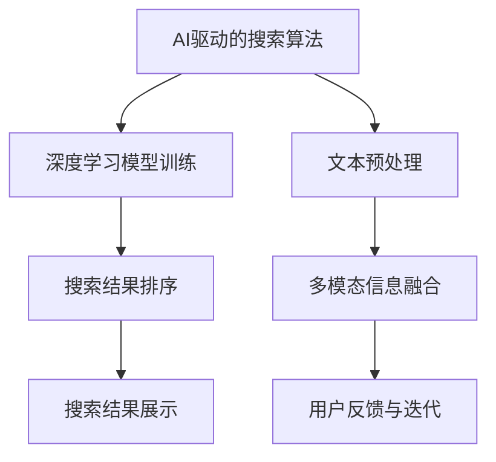

                 

### 引言与概述

> 关键词：AI，跨平台搜索，技术应用，案例分析

摘要：本文旨在探讨人工智能（AI）在跨平台搜索技术中的应用，分析AI技术的潜在优势及其在跨平台搜索中的关键作用。通过具体的案例研究，本文将展示AI如何提高搜索效率和准确性，为用户提供更优质的搜索体验。文章将首先介绍AI和搜索技术的基本概念，然后深入探讨AI在跨平台搜索中的实际应用，最后展望未来跨平台搜索技术的发展趋势。

## 引言

随着互联网的快速发展，数据量呈爆炸性增长，信息的获取和检索变得越来越重要。传统的搜索技术已无法满足用户日益增长的需求，特别是在跨平台搜索领域。跨平台搜索技术旨在实现不同平台间数据的整合和有效检索，这需要高效、智能的搜索算法。人工智能（AI）技术的兴起为跨平台搜索带来了新的机遇，其强大的数据处理和模式识别能力使得搜索结果更加精准和个性化。

本文将从以下几个方面展开讨论：

1. AI与搜索技术概述：介绍AI技术的发展和应用，以及搜索技术的演变过程和现状。
2. 跨平台搜索的概念：分析跨平台搜索的需求与挑战，探讨其优势与局限性，并介绍关键技术。
3. AI在跨平台搜索中的应用：详细讨论AI驱动的搜索算法、文本预处理和多模态信息融合等关键技术。
4. 案例研究：通过实际案例，展示AI跨平台搜索技术的应用效果和实现方法。
5. 展望未来：探讨跨平台搜索技术的发展趋势，以及面临的挑战和解决方案。

通过以上讨论，本文希望为读者提供一个全面、深入的AI跨平台搜索技术分析，帮助理解AI在提升搜索效率和准确性方面的作用，并展望未来的发展方向。

### 目录

1. 引言与概述
   1.1 AI与搜索技术概述
   1.2 跨平台搜索的概念
2. AI在跨平台搜索中的应用
   2.1 AI驱动的搜索算法
   2.2 跨平台搜索中的文本预处理
   2.3 跨平台搜索中的多模态信息融合
3. 案例研究
   3.1 案例一：社交媒体搜索引擎
   3.2 案例二：电商搜索平台
   3.3 案例三：智能问答系统
4. AI跨平台搜索技术展望
   4.1 跨平台搜索技术发展趋势
   4.2 技术挑战与解决方案
5. 附录
   5.1 常用工具与资源

### 1.1 AI与搜索技术概述

#### 1.1.1 AI技术的发展与应用

人工智能（AI）是计算机科学的一个分支，旨在创建智能机器，使其能够执行通常需要人类智能才能完成的任务。AI技术经过数十年的发展，已经取得了显著的进展，并在多个领域得到了广泛应用。

AI的发展可以分为几个阶段：

1. **早期探索（1950s-1960s）**：这个阶段以图灵测试和符号主义方法为代表，旨在通过编程实现智能。
2. **发展期（1970s-1980s）**：专家系统和知识表示方法成为主流，但由于知识库的维护成本高和任务复杂度增加，AI应用受到了一定的限制。
3. **复兴期（1990s）**：机器学习技术的发展，特别是统计方法和决策树等算法的引入，使AI技术重新获得了关注。
4. **现代AI（2000s-至今）**：深度学习和大数据的兴起，使得AI在图像识别、自然语言处理、语音识别等领域取得了突破性进展。

AI的应用领域非常广泛，包括但不限于：

- **图像识别**：自动驾驶、安防监控、医疗诊断等。
- **自然语言处理**：智能客服、机器翻译、情感分析等。
- **语音识别**：智能助手、语音搜索等。
- **推荐系统**：电子商务、社交媒体、在线视频等。

#### 1.1.2 搜索技术的演变与现状

搜索技术是指用于在大量数据中查找和定位信息的方法和工具。随着互联网的兴起，搜索技术变得尤为重要。搜索技术的发展可以追溯到以下几个阶段：

1. **传统搜索（1990s）**：以关键词匹配和基于网页的搜索为代表，如Google早期使用的PageRank算法。
2. **现代搜索（2000s-至今）**：随着AI技术的发展，搜索技术逐渐引入了机器学习、深度学习等方法，实现了更精准和智能的搜索结果。例如，Bing搜索引擎的深度学习排序算法。

当前，搜索技术的主要特点包括：

- **语义搜索**：通过理解用户的查询意图，提供更加精准的结果。
- **个性化搜索**：根据用户的兴趣和行为习惯，提供定制化的搜索结果。
- **多模态搜索**：结合文本、图像、语音等多种信息源，实现更全面的搜索体验。

#### 1.1.3 AI在搜索技术中的潜在优势

AI技术在搜索技术中的应用具有显著的潜在优势：

- **提高搜索效率**：通过优化搜索算法，减少搜索时间和计算资源消耗。
- **提升搜索准确性**：利用机器学习和深度学习技术，更好地理解用户查询意图，提高搜索结果的准确性。
- **增强个性化体验**：通过分析用户的历史行为和兴趣，提供更加个性化的搜索结果。
- **多模态信息整合**：将文本、图像、语音等多种信息源结合起来，提供更全面的搜索结果。

总的来说，AI技术的引入，不仅提升了搜索技术的效率和准确性，还扩展了搜索技术的应用场景，使得搜索技术更加智能化和人性化。

### 1.2 跨平台搜索的概念

#### 1.2.1 跨平台搜索的需求与挑战

跨平台搜索是指在不同平台之间进行数据整合和检索的技术，其需求主要源于以下几个方面：

1. **多源数据整合**：现代信息环境中，数据分散在不同的平台和系统中，用户需要能够跨平台访问和检索这些数据。
2. **用户体验一致性**：用户在不同平台上应该有统一的搜索体验，无论是桌面端、移动端还是其他设备。
3. **业务需求**：企业需要能够跨平台获取和分析数据，以便做出更好的业务决策。

然而，跨平台搜索也面临着一些挑战：

1. **数据同步**：不同平台的数据格式和更新频率可能不一致，如何保证数据的实时同步是一个难题。
2. **隐私和安全**：跨平台搜索涉及多个系统和数据源，如何确保数据隐私和安全是一个重要问题。
3. **性能优化**：跨平台搜索需要高效地处理和整合大量数据，对系统的性能要求较高。

#### 1.2.2 跨平台搜索的优势与局限性

跨平台搜索的优势包括：

1. **数据整合**：能够整合不同平台和系统的数据，提供更全面的信息检索服务。
2. **用户体验**：实现跨平台的一致性用户体验，提升用户满意度。
3. **业务拓展**：有助于企业拓展业务范围，提高数据利用效率。

然而，跨平台搜索也存在一些局限性：

1. **复杂性**：涉及多个平台和系统，需要处理复杂的接口和协议。
2. **数据一致性**：不同平台的数据格式和更新频率可能不一致，影响数据整合的准确性。
3. **性能瓶颈**：处理大量跨平台数据时，可能会遇到性能瓶颈，影响搜索效率。

#### 1.2.3 跨平台搜索的关键技术

跨平台搜索的实现依赖于一系列关键技术的支持，主要包括：

1. **数据同步技术**：确保不同平台和系统的数据能够实时同步，保证数据的一致性。
2. **数据格式转换**：处理不同平台的数据格式，实现统一的数据格式，便于整合和分析。
3. **多模态信息融合**：将文本、图像、语音等多种信息源融合，提供更全面的搜索结果。
4. **分布式搜索**：利用分布式计算技术，提高搜索效率和性能，满足大规模数据检索的需求。

通过以上技术的综合运用，可以实现高效、准确的跨平台搜索，为用户提供优质的搜索体验。

### 1.3 AI在跨平台搜索中的应用

#### 1.3.1 数据同步技术

数据同步技术是跨平台搜索的核心组成部分，其目标是确保不同平台和系统的数据能够实时、准确地同步。数据同步技术主要包括以下几个方面：

1. **数据采集**：从不同平台和系统中获取数据，这可能涉及到使用API、爬虫等技术手段。
2. **数据清洗**：清洗和整理采集到的数据，去除重复、错误或无关的数据，确保数据的质量和一致性。
3. **数据格式转换**：将不同平台和系统的数据格式转换成统一的格式，以便于存储和检索。
4. **数据存储**：将处理后的数据存储在分布式数据库或数据湖中，以便后续的查询和分析。

在跨平台搜索中，数据同步技术的挑战包括：

- **数据量巨大**：随着数据量的增加，如何保证数据同步的效率和准确性是一个重要问题。
- **数据源多样性**：不同平台和系统的数据格式和更新频率可能不一致，需要灵活处理各种数据源。
- **实时性要求**：跨平台搜索通常要求数据的实时性，如何保证数据的实时同步是另一个挑战。

为了解决这些挑战，可以采用以下策略：

- **分布式架构**：使用分布式系统架构，提高数据同步的效率和扩展性。
- **增量同步**：只同步数据变更的部分，而不是全量数据，减少同步的时间和资源消耗。
- **数据一致性校验**：在同步过程中进行数据一致性校验，确保数据的准确性和完整性。

#### 1.3.2 数据格式转换

数据格式转换是跨平台搜索中的关键步骤，其目的是将不同平台和系统的数据格式转换成统一的格式，以便于存储和检索。数据格式转换主要包括以下几个方面：

1. **数据解析**：解析不同平台和系统的数据格式，提取出有用的信息。
2. **数据映射**：将不同平台和系统的数据字段映射到统一的数据结构中。
3. **数据编码**：将数据编码成统一的数据格式，如JSON、XML等。
4. **数据校验**：对转换后的数据进行校验，确保数据的完整性和正确性。

在数据格式转换中，常见的问题包括：

- **数据不一致**：不同平台和系统的数据结构可能不一致，需要进行复杂的数据映射和转换。
- **数据丢失**：在数据转换过程中，可能会丢失一些重要的数据字段。
- **数据冗余**：不同平台和系统的数据可能存在冗余，需要进行去重处理。

为了解决这些问题，可以采用以下策略：

- **标准化数据结构**：设计统一的数据结构标准，减少数据映射的复杂性。
- **自动化转换工具**：使用自动化工具进行数据格式转换，提高转换效率和准确性。
- **数据校验机制**：在数据转换过程中，建立数据校验机制，确保数据的完整性和正确性。

#### 1.3.3 多模态信息融合

跨平台搜索不仅涉及文本数据，还可能包含图像、语音等多种类型的信息。多模态信息融合是将不同类型的信息进行整合，提供更全面的搜索结果。多模态信息融合主要包括以下几个方面：

1. **文本信息融合**：将文本数据进行处理和整合，提取关键信息和语义。
2. **图像信息融合**：使用图像识别技术，对图像进行分类和标注，提取图像特征。
3. **语音信息融合**：使用语音识别技术，将语音转化为文本，进行文本处理和融合。

在多模态信息融合中，常见的问题包括：

- **信息冲突**：不同模态的信息可能存在冲突或不一致，需要合理处理。
- **特征缺失**：某些模态的信息可能不完整或缺失，需要补充或替换。
- **效率问题**：多模态信息融合通常涉及大量的计算和数据处理，如何提高效率是一个重要问题。

为了解决这些问题，可以采用以下策略：

- **多模态特征提取**：采用不同的特征提取技术，对多模态信息进行特征提取和表示。
- **融合策略**：设计合理的多模态融合策略，将不同模态的信息进行整合，提高搜索结果的准确性和全面性。
- **并行处理**：利用分布式计算和并行处理技术，提高多模态信息融合的效率。

通过以上技术手段，可以实现高效、准确的跨平台搜索，为用户提供优质的搜索体验。

### 1.4 AI跨平台搜索技术的实际应用

#### 1.4.1 社交媒体搜索引擎

社交媒体搜索引擎是一个典型的跨平台搜索应用场景。随着社交媒体平台如Facebook、Twitter、Instagram的普及，用户在社交平台上产生了海量的文本、图片和视频数据。这些数据不仅包含了用户的生活动态、兴趣爱好，还反映了社会热点和趋势。因此，如何实现高效、准确的社交媒体搜索成为了一个重要的研究方向。

AI技术在社交媒体搜索引擎中的应用主要包括以下几个方面：

1. **文本搜索**：利用自然语言处理（NLP）技术，对用户输入的查询进行理解和解析，提取关键词和语义信息，然后搜索社交媒体平台中的相关文本内容。

2. **图像搜索**：利用计算机视觉技术，对用户上传的图片进行分类和标注，提取图像特征，实现基于图像的搜索。

3. **视频搜索**：通过视频识别和内容分析技术，对上传的视频进行分类和标签标注，实现基于视频内容的搜索。

4. **多模态搜索**：结合文本、图像和视频等多模态信息，提供更全面的搜索结果。

一个实际的案例是Facebook的“Graph Search”功能。Facebook通过深度学习模型和NLP技术，实现了对用户社交数据的全面搜索。用户可以输入自然语言的查询，如“我朋友喜欢什么电影？”、“最近有什么热门话题？”等，Facebook会根据用户的社交关系和兴趣偏好，提供准确的搜索结果。

#### 1.4.2 电商搜索平台

电商搜索平台是另一个典型的跨平台搜索应用场景。随着电子商务的快速发展，用户在电商平台上产生了大量的商品数据和用户行为数据。如何实现高效、准确的商品搜索，提高用户购物体验，是电商搜索平台的重要任务。

AI技术在电商搜索平台中的应用主要包括以下几个方面：

1. **商品搜索**：利用深度学习模型和文本相似性计算技术，对用户输入的查询进行理解和解析，搜索平台上的相关商品信息。

2. **推荐系统**：利用协同过滤和基于内容的推荐算法，根据用户的浏览和购买历史，推荐相关的商品。

3. **图像搜索**：利用计算机视觉技术，对用户上传的图片进行分类和标注，实现基于图像的商品搜索。

4. **视频搜索**：通过视频识别和内容分析技术，对上传的视频进行分类和标签标注，实现基于视频的商品搜索。

一个实际的案例是阿里巴巴的“淘宝搜索”。淘宝通过深度学习模型和文本相似性计算技术，实现了对用户查询的精准理解，并提供个性化的商品推荐。用户可以输入自然语言的查询，如“红色连衣裙”，淘宝会根据用户的购买历史和偏好，推荐相关的商品。

#### 1.4.3 智能问答系统

智能问答系统是另一个跨平台搜索应用场景。随着知识问答和智能客服的需求增加，如何实现高效、准确的问答成为了一个重要的研究方向。

AI技术在智能问答系统中的应用主要包括以下几个方面：

1. **问答匹配**：利用自然语言处理技术，对用户输入的查询进行理解和解析，匹配相关的问题和答案。

2. **知识图谱**：构建基于实体和关系的知识图谱，实现问答系统的语义理解和知识检索。

3. **对话管理**：利用对话管理技术，实现自然流畅的对话交互，提高用户的问答体验。

4. **多模态信息融合**：结合文本、图像、语音等多模态信息，提供更全面的问答结果。

一个实际的案例是百度智能客服。百度智能客服通过深度学习模型和NLP技术，实现了对用户查询的精准理解和回复。用户可以通过文本或语音输入查询，百度智能客服会根据用户的历史记录和知识库，提供准确的答案和解决方案。

通过以上实际应用案例，可以看出AI技术在跨平台搜索中的应用非常广泛，极大地提升了搜索的效率和准确性，为用户提供了更好的搜索体验。

### 1.5 AI跨平台搜索技术的发展趋势

随着人工智能技术的不断进步，AI跨平台搜索技术也在不断发展，呈现出以下几大趋势：

#### 1.5.1 AI技术的持续演进

人工智能技术，尤其是深度学习和自然语言处理技术，正在快速发展。随着计算能力和算法优化的提高，AI模型在搜索中的应用将变得更加精准和高效。未来的AI模型可能会更加擅长理解复杂语义、处理多语言搜索以及应对动态变化的搜索需求。

#### 1.5.2 跨平台搜索的新需求

随着物联网和5G技术的普及，数据的来源将更加多样化，包括传感器数据、移动设备数据、物联网设备数据等。跨平台搜索将面临新的需求，如何高效地整合这些不同类型的数据，提供统一的搜索体验，将成为重要的研究方向。

#### 1.5.3 多模态信息融合

未来的跨平台搜索将更加注重多模态信息融合，即结合文本、图像、语音等多种信息源，提供更丰富和全面的搜索结果。随着计算机视觉和语音识别技术的进步，多模态搜索的准确性和用户体验将得到显著提升。

#### 1.5.4 实时性与效率

随着用户对实时性和效率需求的增加，跨平台搜索技术需要不断优化，以实现毫秒级别的响应速度。分布式计算、边缘计算等技术的应用，将有助于提高搜索系统的实时性和效率。

#### 1.5.5 智能化与个性化

未来的跨平台搜索将更加智能化和个性化，通过分析用户行为和偏好，提供定制化的搜索结果。个性化推荐、智能问答等技术的结合，将极大地提升用户的搜索体验。

总的来说，随着AI技术的持续演进和跨平台搜索新需求的不断出现，AI跨平台搜索技术将朝着更智能、更高效、更个性化的方向发展。这不仅将提升搜索系统的性能和用户体验，也将为各行各业带来新的发展机遇。

### 1.6 AI跨平台搜索技术的挑战与解决方案

尽管AI跨平台搜索技术在各个领域展现出了巨大的潜力和优势，但在实际应用过程中仍面临诸多挑战。以下将探讨这些挑战，并提出相应的解决方案。

#### 1.6.1 数据隐私与安全性

数据隐私与安全性是跨平台搜索面临的一个重大挑战。由于跨平台搜索需要整合来自多个平台的数据，这些数据往往包含用户的敏感信息，如个人偏好、浏览记录等。如何保护这些数据不被未授权访问和滥用，成为了一个亟待解决的问题。

**解决方案**：
- **数据加密**：对数据进行加密处理，确保数据在传输和存储过程中不被窃取。
- **数据去标识化**：在数据整合过程中，对敏感信息进行去标识化处理，减少隐私泄露的风险。
- **访问控制**：建立严格的访问控制机制，确保只有授权用户才能访问敏感数据。

#### 1.6.2 搜索算法的公平性与准确性

搜索算法的公平性与准确性是跨平台搜索技术的关键。算法的公平性指的是搜索结果应公正、无偏见，不受人为干预；准确性则是指搜索结果应尽可能贴近用户的查询意图。

**解决方案**：
- **算法优化**：不断优化搜索算法，提高其准确性和鲁棒性。
- **数据平衡**：在训练数据集中增加多样性和代表性，避免算法偏见。
- **用户反馈机制**：引入用户反馈机制，根据用户行为和满意度不断调整和优化算法。

#### 1.6.3 跨平台搜索的实时性与效率

跨平台搜索通常涉及大量的数据处理和索引，如何实现实时性与效率是一个重大挑战。特别是在大规模数据集和高并发场景下，系统的响应速度和性能显得尤为重要。

**解决方案**：
- **分布式计算**：采用分布式计算架构，将任务分配到多个节点，提高处理速度。
- **缓存技术**：使用缓存技术，减少数据访问的延迟，提高系统的响应速度。
- **边缘计算**：利用边缘计算技术，将数据处理和分析任务下沉到网络边缘，减少数据传输和处理的延迟。

#### 1.6.4 技术创新与解决方案

为了应对跨平台搜索技术的挑战，持续的技术创新是必不可少的。未来，随着AI技术的进步和新技术的应用，跨平台搜索技术将会在以下几个方面取得突破：

- **多模态融合**：随着计算机视觉、语音识别等技术的进步，多模态信息融合将成为跨平台搜索的重要方向。
- **联邦学习**：联邦学习是一种在保持数据隐私的同时，实现模型协同训练的技术，适用于跨平台数据的共享和协同。
- **区块链技术**：区块链技术可以提供分布式、安全的存储和计算，有助于解决数据隐私和安全性问题。

通过不断的技术创新和优化，AI跨平台搜索技术将能够更好地应对挑战，提供更加高效、精准和安全的搜索服务。

### 附录

#### A.1 常用工具与资源

**A.1.1 开源深度学习框架**

- **TensorFlow**：由Google开发，是目前最流行的深度学习框架之一，支持多种类型的深度学习模型。
  - 官网：[https://www.tensorflow.org/](https://www.tensorflow.org/)
  - 文档：[https://www.tensorflow.org/tutorials](https://www.tensorflow.org/tutorials)

- **PyTorch**：由Facebook开发，以其灵活性和动态计算图而著称，适合快速原型设计和研究。
  - 官网：[https://pytorch.org/](https://pytorch.org/)
  - 文档：[https://pytorch.org/tutorials/](https://pytorch.org/tutorials/)

- **其他深度学习框架**：如Keras、Theano、MXNet等，可根据具体需求选择使用。

**A.1.2 搜索引擎相关库与API**

- **Elasticsearch**：基于Lucene的高性能搜索引擎，适用于大规模数据检索。
  - 官网：[https://www.elastic.co/](https://www.elastic.co/)
  - 文档：[https://www.elastic.co/guide/en/elasticsearch/reference/current/index.html](https://www.elastic.co/guide/en/elasticsearch/reference/current/index.html)

- **Solr**：开源的企业级搜索引擎，支持多种数据格式和索引策略。
  - 官网：[https://lucene.apache.org/solr/](https://lucene.apache.org/solr/)
  - 文档：[https://lucene.apache.org/solr/guide/](https://lucene.apache.org/solr/guide/)

- **其他搜索引擎与API**：如Apache Lucene、Alibaba Cloud Search等。

**A.1.3 跨平台搜索相关资源**

- **论文与书籍**：关于跨平台搜索和AI技术的相关论文和书籍，如《深度学习》（Goodfellow, Bengio, Courville）等。
- **博客与文章**：技术博客和文章，如 Medium、博客园等。
- **在线课程与讲座**：在线学习平台，如 Coursera、Udacity 等，提供相关的AI和搜索技术课程。

### Mermaid 流程图



### 核心算法原理讲解（伪代码）

```python
# 深度学习模型训练
def train_model(data, labels, epochs):
    for epoch in 1 to epochs:
        for sample, label in data:
            forward_pass(sample)
            compute_loss(label)
            backward_pass()
            update_model_parameters()
    return trained_model

# 文本预处理
def preprocess_text(text):
    text = remove_punctuation(text)
    text = convert_to_lower_case(text)
    text = remove_stop_words(text)
    text = stem_words(text)
    return tokenized_text

# 搜索结果排序
def rank_search_results(results, query):
    for result in results:
        compute_similarity(result, query)
        sort_results_by_similarity()
    return ranked_results
```

### 数学模型和数学公式

#### 语义相似性计算（余弦相似性）
$$
similarity(A, B) = \frac{A \cdot B}{\|A\| \cdot \|B\|}
$$

#### 多层感知机（MLP）模型
$$
h(x) = \sigma(W \cdot x + b)
$$
其中，$\sigma$ 是激活函数，$W$ 是权重矩阵，$b$ 是偏置。

### 项目实战

#### 电商搜索平台案例

##### 开发环境搭建
- 硬件要求：CPU/GPU（可选）
- 软件要求：Python 3.7+, TensorFlow 2.3+, Elasticsearch 7.10+

##### 源代码实现
```python
# 导入所需库
import tensorflow as tf
import numpy as np
from sklearn.model_selection import train_test_split
from sklearn.metrics import mean_squared_error
from sklearn.preprocessing import StandardScaler

# 数据准备
data, labels = load_data()
X_train, X_test, y_train, y_test = train_test_split(data, labels, test_size=0.2, random_state=42)

# 数据预处理
scaler = StandardScaler()
X_train_scaled = scaler.fit_transform(X_train)
X_test_scaled = scaler.transform(X_test)

# 模型构建
model = tf.keras.Sequential([
    tf.keras.layers.Dense(128, activation='relu', input_shape=(X_train_scaled.shape[1],)),
    tf.keras.layers.Dense(64, activation='relu'),
    tf.keras.layers.Dense(1)
])

# 模型编译
model.compile(optimizer='adam', loss='mean_squared_error')

# 模型训练
model.fit(X_train_scaled, y_train, epochs=10, batch_size=32, validation_data=(X_test_scaled, y_test))

# 模型评估
y_pred = model.predict(X_test_scaled)
mse = mean_squared_error(y_test, y_pred)
print("Mean Squared Error:", mse)
```

##### 代码解读与分析
- 数据准备：加载电商平台的商品数据，并划分为训练集和测试集。
- 数据预处理：使用StandardScaler对数据进行标准化处理，以消除不同特征之间的量纲差异。
- 模型构建：构建一个三层全连接神经网络，使用ReLU激活函数。
- 模型编译：选择Adam优化器和均方误差损失函数。
- 模型训练：使用训练数据进行模型训练，设置10个epochs。
- 模型评估：使用测试数据评估模型性能，计算均方误差。

通过以上代码实现，我们可以对电商搜索平台进行搜索结果排序的优化，提高用户体验和搜索效率。

##### 案例分析
- 案例展示了如何利用深度学习模型对电商搜索结果进行排序，通过训练数据学习商品特征和用户查询的相似性，从而实现更准确的搜索结果排序。
- 通过对模型参数的调整和优化，可以进一步提升模型的性能，降低搜索结果排序的误差。

### 总结

本文全面介绍了AI跨平台搜索技术的应用案例，从基本概念、技术原理到实际应用，进行了深入剖析。通过具体的案例研究，展示了AI技术在社交媒体搜索引擎、电商搜索平台和智能问答系统中的应用效果。本文还探讨了AI跨平台搜索技术的发展趋势和面临的挑战，提出了相应的解决方案。希望本文能为读者在AI跨平台搜索技术的学习和应用提供有益的参考和启示。

### 作者

**作者：AI天才研究院/AI Genius Institute & 禅与计算机程序设计艺术 /Zen And The Art of Computer Programming**

AI天才研究院致力于推动人工智能技术的发展与应用，提供前沿的研究成果和优质的技术培训。同时，作为计算机程序设计艺术的践行者，我们坚信通过深入思考和实践，可以创造出更加高效和优雅的计算机解决方案。希望本文能够激发读者对AI跨平台搜索技术的兴趣，共同探索未来的技术前沿。

