                 

# AI驱动的人力资源管理流程

> **关键词：** 人工智能，人力资源管理，招聘流程，绩效管理，员工发展，满意度管理，员工关系管理，流程优化。

> **摘要：** 本文深入探讨了人工智能（AI）在人力资源管理（HRM）中的应用，分析了AI驱动的招聘、绩效、员工发展、满意度以及员工关系管理等流程，并提出了相应的优化策略。通过实例分析和实践指导，为企业和HR从业者提供了实用的参考。

### 第一部分：AI驱动的HRM概述

#### 第1章：AI驱动的人力资源管理背景与概念

##### 1.1 AI与人力资源管理的融合

**1.1.1 AI技术简介**

人工智能（AI，Artificial Intelligence）是指计算机系统通过模拟人类智能行为，实现智能感知、学习、推理、决策等能力的科学技术。AI技术的发展经历了数个阶段，从最初的规则推理，到基于统计学习的机器学习，再到基于深度学习的智能化系统，逐步提升了计算机的智能水平。

**1.1.2 人力资源管理的发展历程**

人力资源管理（HRM，Human Resource Management）起源于20世纪初，随着企业规模扩大和管理复杂度的增加，HRM逐渐成为企业管理的重要组成部分。HRM的发展经历了以下阶段：

1. **科学管理阶段**：以泰勒的科学管理理论为代表，强调通过标准化作业流程提高生产效率。
2. **人力资源管理阶段**：20世纪50年代至70年代，以人事管理为核心，重视员工关系和员工福利。
3. **战略人力资源管理阶段**：20世纪80年代至今，将人力资源视为企业战略资产，强调HR与业务战略的紧密衔接。

**1.1.3 AI在HRM中的应用场景**

随着AI技术的快速发展，其在HRM领域的应用场景不断拓展。以下为AI在HRM中的主要应用场景：

1. **招聘**：通过简历筛选、面试评估等环节，提高招聘效率和准确度。
2. **绩效管理**：基于数据分析和算法模型，实现绩效评估的客观性和精确性。
3. **员工发展**：通过个性化培训方案和职业路径规划，提升员工技能和职业发展。
4. **满意度管理**：通过数据分析和智能反馈系统，提高员工满意度。
5. **员工关系管理**：通过智能沟通平台和冲突预测模型，优化员工关系。

##### 1.2 AI驱动的HRM核心概念

**1.2.1 数据驱动的HR决策**

数据驱动的HR决策是指基于大量数据分析和预测模型，实现HR管理决策的智能化。通过数据挖掘和分析，HR可以更准确地预测员工行为、识别关键因素，从而制定更有效的管理策略。

**1.2.2 人才画像与匹配**

人才画像是指通过分析员工的技能、经验、个性等特征，构建一个多维度的员工模型。AI驱动的匹配系统可以根据岗位需求和人才画像，实现人才的精准匹配，提高招聘成功率。

**1.2.3 智能招聘与筛选**

智能招聘与筛选是指利用AI技术，对简历进行自动筛选和评估，提高招聘效率。通过自然语言处理（NLP）和机器学习算法，AI可以快速提取简历中的关键信息，并进行综合评估。

#### 第2章：AI驱动的招聘流程

##### 2.1 招聘需求分析

**2.1.1 招聘需求的定量分析**

招聘需求的定量分析是指通过统计和分析企业的招聘历史数据，预测未来的人才需求。这包括对招聘周期、岗位数量、人才类型等数据的分析。

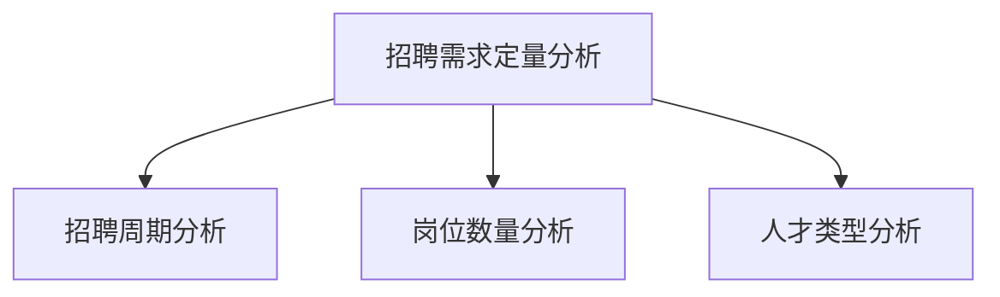

**2.1.2 招聘需求的定性分析**

招聘需求的定性分析是指通过访谈、调研等方式，了解岗位的具体需求、行业趋势等。这有助于更准确地把握招聘方向和策略。

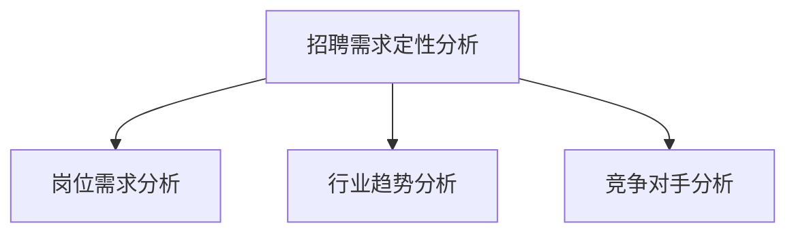

##### 2.2 招聘信息发布与推广

**2.2.1 智能化职位描述生成**

智能化职位描述生成是指利用自然语言处理（NLP）技术，自动生成符合岗位需求的职位描述。这有助于提高招聘信息的准确性和吸引力。

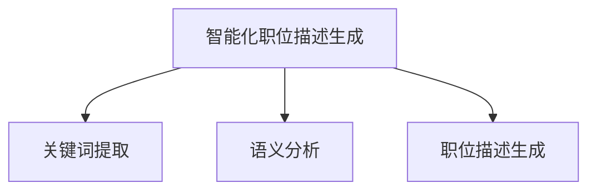

**2.2.2 社交媒体招聘策略**

社交媒体招聘策略是指利用社交媒体平台，如LinkedIn、Facebook等，发布招聘信息，吸引候选人。通过分析社交媒体数据，可以识别潜在候选人并进行精准推送。

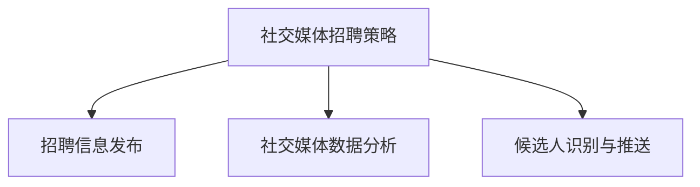

##### 2.3 招聘渠道分析与优化

**2.3.1 数据驱动的渠道选择**

数据驱动的渠道选择是指通过分析各招聘渠道的招聘效果数据，选择最有效的招聘渠道。这包括对渠道成本、招聘成功率等数据的分析。

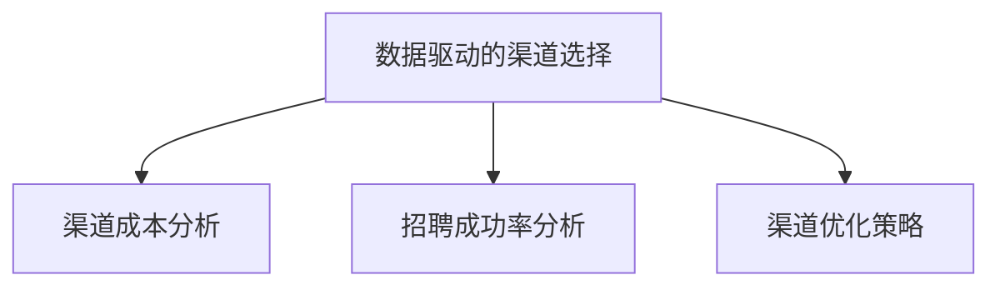

**2.3.2 招聘效果评估与优化**

招聘效果评估与优化是指通过评估各招聘渠道的效果，调整招聘策略，提高招聘成功率。这包括对招聘成本、招聘周期、候选人质量等数据的分析。

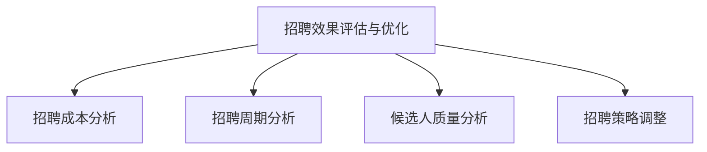

##### 2.4 智能化简历筛选

**2.4.1 简历关键词提取算法**

简历关键词提取算法是指利用自然语言处理（NLP）技术，从简历中提取关键信息，用于后续的简历筛选和评估。

```python
def extract_keywords(resume_text):
    # 使用NLP技术提取关键词
    # 示例：使用jieba库进行中文分词
    keywords = jieba.cut(resume_text)
    return list(set(keywords))
```

**2.4.2 基于机器学习的简历筛选模型**

基于机器学习的简历筛选模型是指利用机器学习算法，对简历进行分类和评估，筛选出符合条件的候选人。

```python
from sklearn.feature_extraction.text import TfidfVectorizer
from sklearn.model_selection import train_test_split
from sklearn.linear_model import LogisticRegression

# 数据准备
resume_texts = [...]  # 简历文本
labels = [...]  # 简历标签

# 特征提取
vectorizer = TfidfVectorizer()
X = vectorizer.fit_transform(resume_texts)

# 模型训练
X_train, X_test, y_train, y_test = train_test_split(X, labels, test_size=0.2)
model = LogisticRegression()
model.fit(X_train, y_train)

# 模型评估
accuracy = model.score(X_test, y_test)
print("Accuracy:", accuracy)
```

##### 2.5 面试过程优化

**2.5.1 面试评估指标设计**

面试评估指标设计是指根据岗位需求，设计合适的面试评估指标，用于评估候选人的能力和素质。

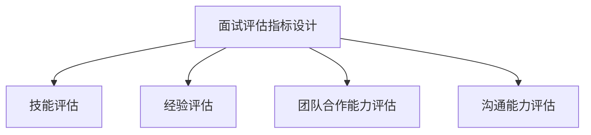

**2.5.2 面试智能助手应用**

面试智能助手应用是指利用AI技术，为面试官提供智能化的面试支持，包括面试问题推荐、候选人行为分析等。

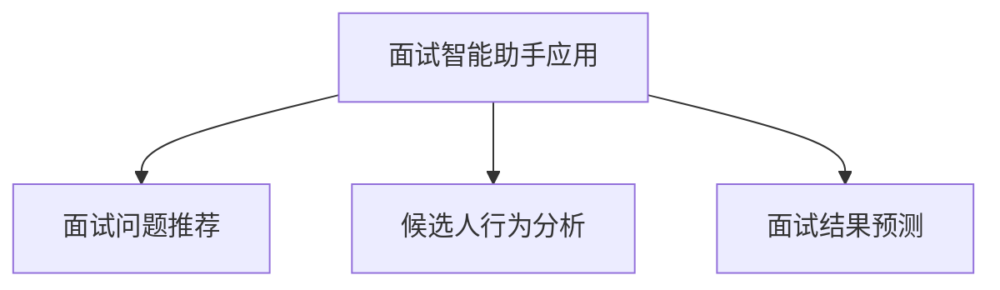

#### 第3章：AI驱动的员工绩效管理

##### 3.1 绩效指标体系设计

**3.1.1 KPI与OKR方法**

KPI（Key Performance Indicator）和OKR（Objectives and Key Results）是两种常见的绩效指标设计方法。KPI侧重于衡量员工的工作成果，而OKR则强调目标设定和结果导向。

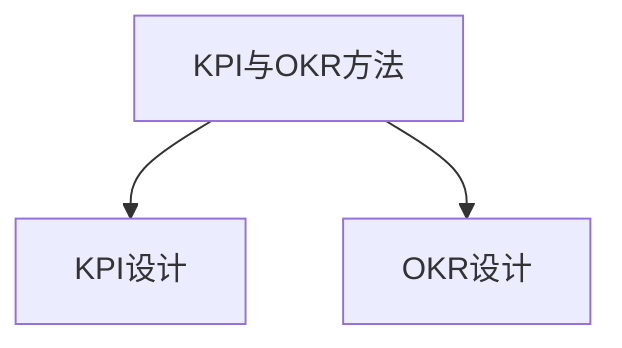

**3.1.2 绩效指标权重分配**

绩效指标权重分配是指根据各指标的重要性，为每个指标分配相应的权重，以综合评估员工的表现。

```python
weights = {
    'KPI1': 0.3,
    'KPI2': 0.2,
    'KPI3': 0.2,
    'KPI4': 0.3
}

def calculate_performance(score1, score2, score3, score4):
    performance = weights['KPI1'] * score1 + weights['KPI2'] * score2 + weights['KPI3'] * score3 + weights['KPI4'] * score4
    return performance
```

##### 3.2 绩效评估与反馈

**3.2.1 基于大数据的绩效评估方法**

基于大数据的绩效评估方法是指利用大数据技术，收集和分析员工的工作数据，实现绩效评估的客观性和精确性。

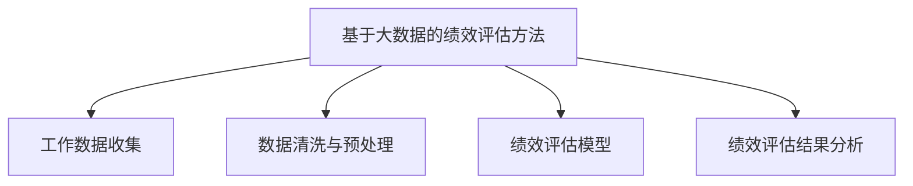

**3.2.2 绩效反馈与沟通技巧**

绩效反馈与沟通技巧是指通过有效的沟通技巧，向员工传达绩效评估结果，并提供改进建议。这有助于增强员工的自我认知和改进动力。

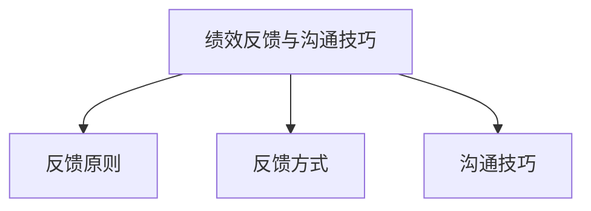

##### 3.3 绩效激励与员工激励

**3.3.1 数据驱动的薪酬管理**

数据驱动的薪酬管理是指利用数据分析和算法模型，实现薪酬的公平性和竞争力。通过分析员工的表现和市场需求，制定合理的薪酬策略。

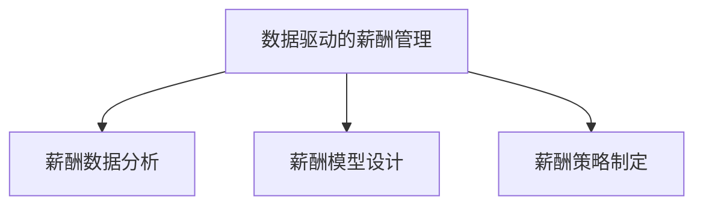

**3.3.2 绩效奖金与股权激励**

绩效奖金与股权激励是两种常见的员工激励方式。绩效奖金根据员工的表现发放，而股权激励则通过给予员工公司股权，激发员工的长期动力。

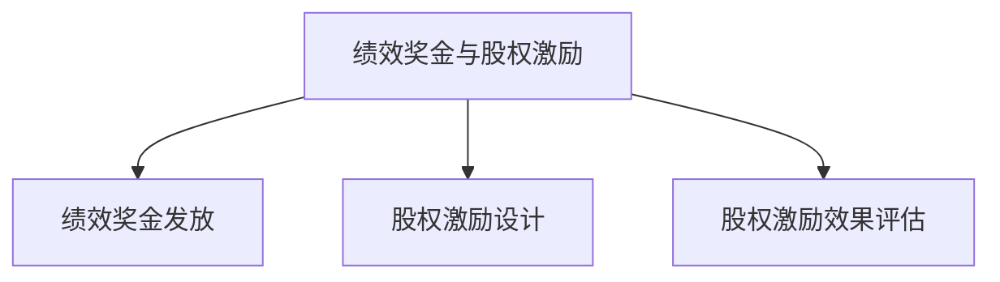

#### 第4章：AI驱动的员工发展

##### 4.1 培训需求分析

**4.1.1 数据驱动的培训需求识别**

数据驱动的培训需求识别是指通过分析员工的工作数据和个人成长需求，识别出需要培训的技能和领域。

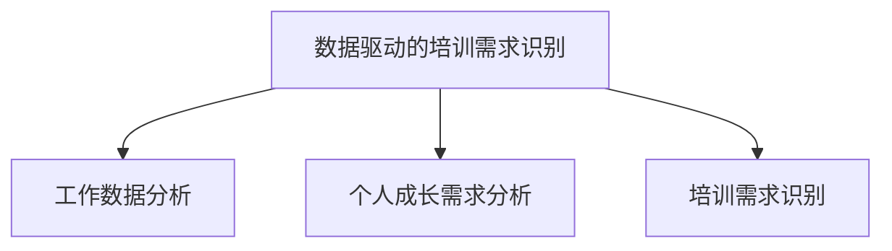

**4.1.2 培训计划制定与优化**

培训计划制定与优化是指根据培训需求，制定合理的培训计划，并利用数据分析和反馈，不断优化培训效果。

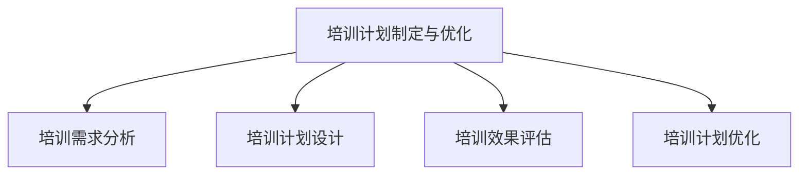

##### 4.2 培训资源管理

**4.2.1 培训内容个性化推荐**

培训内容个性化推荐是指利用AI技术，根据员工的兴趣和需求，推荐合适的培训内容。

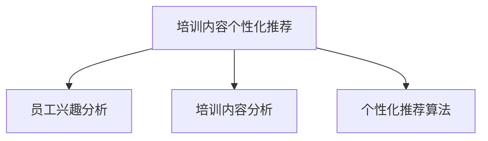

**4.2.2 培训效果评估与反馈**

培训效果评估与反馈是指通过评估培训效果，收集员工的反馈意见，为后续培训提供改进方向。

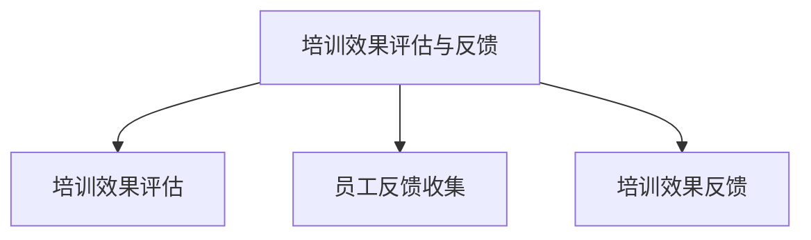

##### 4.3 职业发展规划

**4.3.1 数据驱动的职业路径分析**

数据驱动的职业路径分析是指利用数据分析和算法模型，为员工提供合理的职业发展路径。

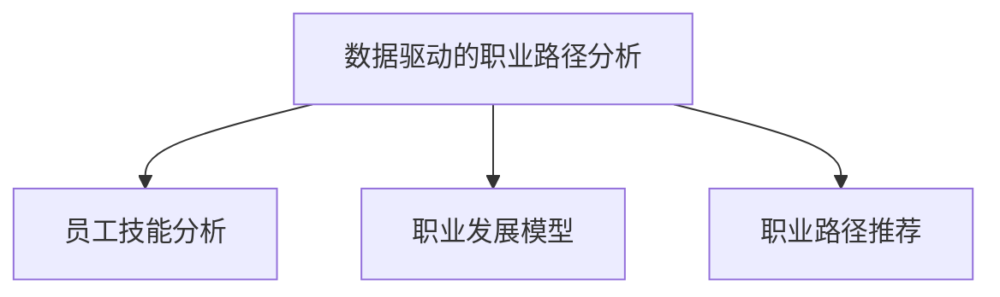

**4.3.2 职业发展支持体系构建**

职业发展支持体系构建是指通过建立职业发展支持体系，为员工提供职业发展的资源和支持。

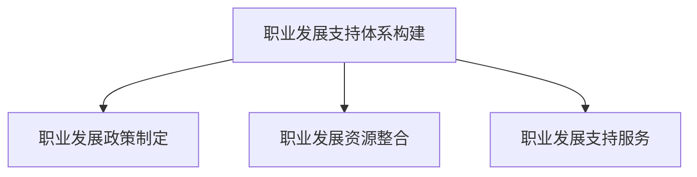

#### 第5章：AI驱动的员工满意度管理

##### 5.1 满意度调查与数据分析

**5.1.1 满意度指标体系构建**

满意度指标体系构建是指根据员工的满意度需求，设计合理的满意度指标体系。

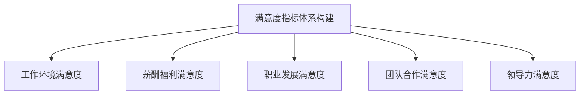

**5.1.2 数据驱动的满意度调查分析**

数据驱动的满意度调查分析是指通过数据分析方法，对员工满意度进行调查和分析。

```python
import pandas as pd
import numpy as np

# 数据准备
data = pd.read_csv('satisfaction_survey.csv')

# 数据清洗
data.dropna(inplace=True)

# 数据分析
mean_satisfaction = np.mean(data['satisfaction'])
print("平均满意度:", mean_satisfaction)

# 满意度分布
satisfaction_distribution = data['satisfaction'].value_counts()
print("满意度分布：", satisfaction_distribution)
```

##### 5.2 满意度提升策略

**5.2.1 数据驱动的改进措施**

数据驱动的改进措施是指根据满意度调查结果，识别出需要改进的方面，并制定相应的改进措施。

```mermaid
graph TD
A[数据驱动的改进措施] --> B[工作环境改进]
A --> C[薪酬福利改进]
A --> D[职业发展改进]
A --> E[团队合作改进]
A --> F[领导力改进]
```

**5.2.2 员工关怀与心理支持**

员工关怀与心理支持是指通过提供员工关怀和心理支持，提高员工的满意度和幸福感。

```mermaid
graph TD
A[员工关怀与心理支持] --> B[员工关怀活动]
A --> C[心理支持服务]
A --> D[健康与福利计划]
```

##### 5.3 智能化员工反馈系统

**5.3.1 员工反馈数据收集**

员工反馈数据收集是指通过在线调查、意见箱等方式，收集员工的反馈意见。

```mermaid
graph TD
A[员工反馈数据收集] --> B[在线调查]
A --> C[意见箱收集]
```

**5.3.2 员工反馈处理与反馈机制优化**

员工反馈处理与反馈机制优化是指对收集到的员工反馈进行处理，并优化反馈机制，提高员工的参与度和满意度。

```mermaid
graph TD
A[员工反馈处理与反馈机制优化] --> B[反馈处理流程]
A --> C[反馈机制优化]
A --> D[员工参与度提升]
```

#### 第6章：AI驱动的员工关系管理

##### 6.1 员工关系评估

**6.1.1 员工关系指标设计**

员工关系指标设计是指根据员工关系的特点，设计合适的员工关系指标。

```mermaid
graph TD
A[员工关系指标设计] --> B[沟通满意度]
A --> C[团队合作满意度]
A --> D[工作环境满意度]
A --> E[领导力满意度]
```

**6.1.2 数据驱动的员工关系评估方法**

数据驱动的员工关系评估方法是指利用数据分析和算法模型，对员工关系进行评估。

```python
import pandas as pd
import numpy as np

# 数据准备
data = pd.read_csv('employee_relationship_survey.csv')

# 数据清洗
data.dropna(inplace=True)

# 数据分析
communication_satisfaction = np.mean(data['communication_satisfaction'])
team_satisfaction = np.mean(data['team_satisfaction'])
work_environment_satisfaction = np.mean(data['work_environment_satisfaction'])
leadership_satisfaction = np.mean(data['leadership_satisfaction'])

total_satisfaction = (communication_satisfaction + team_satisfaction + work_environment_satisfaction + leadership_satisfaction) / 4
print("员工关系满意度:", total_satisfaction)
```

##### 6.2 员工沟通与协作

**6.2.1 智能化沟通平台建设**

智能化沟通平台建设是指利用AI技术，构建智能化的沟通平台，提高员工沟通的效率和效果。

```mermaid
graph TD
A[智能化沟通平台建设] --> B[即时通讯]
A --> C[邮件管理]
A --> D[日程安排]
A --> E[任务协作]
```

**6.2.2 员工协作效率提升策略**

员工协作效率提升策略是指通过优化协作流程和工具，提高员工协作的效率。

```mermaid
graph TD
A[员工协作效率提升策略] --> B[流程优化]
A --> C[工具选择]
A --> D[协作培训]
```

##### 6.3 员工冲突管理与调解决策

**6.3.1 员工冲突预测模型**

员工冲突预测模型是指利用数据分析和机器学习技术，预测员工冲突的发生概率。

```python
from sklearn.ensemble import RandomForestClassifier
from sklearn.model_selection import train_test_split

# 数据准备
data = pd.read_csv('conflict_data.csv')

# 数据预处理
X = data.drop(['conflict'], axis=1)
y = data['conflict']

# 模型训练
X_train, X_test, y_train, y_test = train_test_split(X, y, test_size=0.2)
model = RandomForestClassifier()
model.fit(X_train, y_train)

# 模型评估
accuracy = model.score(X_test, y_test)
print("冲突预测准确率:", accuracy)
```

**6.3.2 数据驱动的冲突调解决策**

数据驱动的冲突调解决策是指根据冲突预测模型和员工关系评估结果，制定合适的调解决策。

```mermaid
graph TD
A[数据驱动的冲突调解决策] --> B[冲突类型识别]
A --> C[冲突预测模型]
A --> D[冲突调解决策]
```

#### 第7章：AI驱动的HRM流程集成与优化

##### 7.1 HRM流程分析与优化

**7.1.1 HRM流程的环节识别**

HRM流程的环节识别是指对HRM流程进行分解，识别出各个环节的关键要素。

```mermaid
graph TD
A[HRM流程的环节识别] --> B[招聘流程]
A --> C[绩效管理流程]
A --> D[员工发展流程]
A --> E[员工关系管理流程]
```

**7.1.2 数据驱动的流程优化方法**

数据驱动的流程优化方法是指通过数据分析，识别流程中的瓶颈和改进点，制定优化策略。

```mermaid
graph TD
A[数据驱动的流程优化方法] --> B[流程数据分析]
A --> C[瓶颈识别]
A --> D[优化策略制定]
```

##### 7.2 AI驱动的HRM系统集成

**7.2.1 HRM系统集成架构设计**

HRM系统集成架构设计是指设计一个集成化的HRM系统，实现各个模块的互联互通。

```mermaid
graph TD
A[HRM系统集成架构设计] --> B[数据层]
A --> C[应用层]
A --> D[展示层]
```

**7.2.2 AI驱动的HRM系统部署与维护**

AI驱动的HRM系统部署与维护是指将AI技术应用到HRM系统中，并进行系统的部署和维护。

```mermaid
graph TD
A[AI驱动的HRM系统部署与维护] --> B[系统部署]
A --> C[系统维护]
A --> D[系统升级]
```

##### 7.3 AI驱动的HRM未来趋势

**7.3.1 AI在HRM中的应用前景**

AI在HRM中的应用前景包括以下几个方面：

1. **智能招聘与筛选**：通过AI技术，实现更精准的招聘和筛选，提高招聘效率。
2. **绩效管理**：利用AI技术，实现绩效评估的客观性和精确性，提升管理水平。
3. **员工发展**：通过AI技术，实现个性化培训方案和职业路径规划，提高员工技能和职业发展。
4. **员工关系管理**：利用AI技术，优化员工关系，提高员工满意度和幸福感。

**7.3.2 AI驱动的HRM挑战与对策**

AI驱动的HRM在发展过程中面临着以下挑战：

1. **数据隐私和安全**：如何保护员工数据的安全和隐私，是一个亟待解决的问题。
2. **算法偏见**：AI算法可能存在偏见，导致不公平的评估结果。
3. **技术成熟度**：AI技术在HRM中的应用尚处于发展阶段，需要进一步成熟和优化。

为了应对这些挑战，可以采取以下对策：

1. **数据隐私保护**：加强数据保护法律法规的制定和执行，确保员工数据的安全。
2. **算法公平性**：加强算法的透明性和可解释性，减少算法偏见。
3. **技术持续创新**：加大AI技术在HRM领域的研发投入，推动技术的持续创新和成熟。

#### 附录

##### 附录A：AI驱动的人力资源管理工具

**A.1 主流AI驱动的HRM工具介绍**

1. **HRMS系统**：人力资源管理系统（HRMS），如Workday、SAP SuccessFactors等，提供全面的HR管理功能，包括招聘、绩效、培训等。
2. **智能招聘平台**：如LinkedIn Recruiter、Greenhouse等，利用AI技术实现智能招聘和筛选。
3. **智能绩效管理系统**：如15Five、Namely等，利用AI技术实现绩效评估和管理。

**A.2 开源AI驱动的HRM工具**

1. **MLlib for HR**：基于Apache Spark的HR数据分析和机器学习工具。
2. **HR Analytics with TensorFlow**：利用TensorFlow构建HR数据分析和预测模型。
3. **HR Insights with PyTorch**：利用PyTorch进行HR数据分析和模型训练。

**A.3 AI驱动的HRM工具选择与应用建议**

1. **工具选型标准**：根据企业规模、需求、预算等因素，选择合适的AI驱动HRM工具。
2. **工具应用案例分析**：结合具体企业的实际应用场景，分析工具的效果和改进方向。

### 作者

**作者：AI天才研究院/AI Genius Institute & 禅与计算机程序设计艺术 /Zen And The Art of Computer Programming**### 第二部分：AI驱动的招聘流程详解

#### 第2章：AI驱动的招聘流程

招聘是企业人力资源管理的核心环节，对于企业的长期发展至关重要。随着人工智能（AI）技术的快速发展，AI在招聘流程中的应用日益广泛，从职位描述生成、简历筛选、面试评估到候选人推荐，AI技术为招聘流程带来了前所未有的效率和精准度。本文将深入探讨AI驱动的招聘流程，分析其在各个阶段的应用和优势。

##### 2.1 招聘需求分析

招聘需求分析是招聘流程的第一步，准确的招聘需求分析有助于确保招聘到符合企业需求的合适人才。AI技术在招聘需求分析中发挥着重要作用，以下为具体应用：

**2.1.1 招聘需求的定量分析**

定量分析主要通过统计和分析企业历史招聘数据，预测未来的人才需求。AI技术可以通过以下步骤实现招聘需求的定量分析：

1. **数据收集**：收集企业的招聘历史数据，包括招聘周期、岗位数量、招聘成功率和招聘成本等。
2. **数据预处理**：对招聘数据进行分析和清洗，去除无效数据，确保数据质量。
3. **趋势分析**：利用时间序列分析方法，分析招聘数据的变化趋势，预测未来的人才需求。
4. **模型训练**：基于历史数据，训练预测模型，预测未来的人才需求。

伪代码示例：

```python
import pandas as pd
from sklearn.ensemble import RandomForestRegressor

# 数据收集
data = pd.read_csv('recruitment_data.csv')

# 数据预处理
data.dropna(inplace=True)

# 趋势分析
data['month'] = pd.to_datetime(data['hire_date']).dt.month
monthly_recruitment = data.groupby('month')['job_id'].count()

# 模型训练
X = monthly_recruitment.index.values.reshape(-1, 1)
y = monthly_recruitment.values

model = RandomForestRegressor()
model.fit(X, y)

# 预测
future_months = pd.date_range(start=monthly_recruitment.index[-1], periods=12, freq='MS')
future_months = future_months.month.values.reshape(-1, 1)
predictions = model.predict(future_months)

print("未来12个月招聘需求预测：", predictions)
```

**2.1.2 招聘需求的定性分析**

定性分析主要通过访谈、调研等方式，了解岗位的具体需求、行业趋势等。AI技术可以通过自然语言处理（NLP）和机器学习算法，实现招聘需求的定性分析：

1. **需求文本分析**：利用NLP技术，对招聘需求文本进行分析，提取关键信息和关键词。
2. **需求分类**：利用机器学习算法，对需求文本进行分类，识别出不同类型的招聘需求。
3. **需求关联分析**：通过分析不同岗位的需求，识别出岗位之间的关联性和趋势。

伪代码示例：

```python
import jieba
from sklearn.feature_extraction.text import TfidfVectorizer
from sklearn.cluster import KMeans

# 需求文本分析
def analyze_demand(demand_text):
    words = jieba.cut(demand_text)
    return ' '.join(words)

# 需求分类
vectorizer = TfidfVectorizer()
X = vectorizer.fit_transform([analyze_demand(demand) for demand in demand_texts])

kmeans = KMeans(n_clusters=5)
kmeans.fit(X)

# 需求关联分析
demand_clusters = kmeans.labels_
demand_clusters = pd.Series(demand_clusters)

print("需求分类结果：", demand_clusters.value_counts())
```

##### 2.2 招聘信息发布与推广

招聘信息发布与推广是招聘流程中的重要环节，AI技术可以帮助企业实现智能化职位描述生成和社交媒体招聘策略。

**2.2.1 智能化职位描述生成**

智能化职位描述生成是指利用自然语言处理（NLP）技术，自动生成符合岗位需求的职位描述。以下为智能化职位描述生成的具体步骤：

1. **需求文本提取**：从招聘需求文本中提取关键信息和关键词。
2. **模板生成**：利用模板库，根据提取的关键信息生成职位描述模板。
3. **模板填充**：将提取的关键信息填充到职位描述模板中，生成完整的职位描述。

伪代码示例：

```python
template库 = ["模板1", "模板2", "模板3"]

def generate_demand_text(demand, template库):
    template = template库[demand['template_id']]
    demand_text = template.format(**demand)
    return demand_text

demand_texts = [...]  # 招聘需求数据
generated_texts = [generate_demand_text(demand, template库) for demand in demand_texts]

print("生成的职位描述：", generated_texts)
```

**2.2.2 社交媒体招聘策略**

社交媒体招聘策略是指利用社交媒体平台，如LinkedIn、Facebook等，发布招聘信息，吸引候选人。以下为社交媒体招聘策略的具体步骤：

1. **平台选择**：根据候选人的分布情况，选择合适的社交媒体平台。
2. **内容优化**：利用NLP技术，优化招聘信息的标题和内容，提高点击率和转化率。
3. **社交媒体数据分析**：通过数据分析，识别潜在候选人，进行精准推送。

伪代码示例：

```python
import pandas as pd
from sklearn.feature_extraction.text import TfidfVectorizer

# 社交媒体数据分析
data = pd.read_csv('social_media_data.csv')

vectorizer = TfidfVectorizer()
X = vectorizer.fit_transform(data['post_content'])

# 精准推送
def find_candidates(data, candidate_profile):
    candidate_vector = vectorizer.transform([candidate_profile])
    similarity_scores = cosine_similarity(candidate_vector, X)
    top_candidates = similarity_scores.argsort()[-5:][::-1]
    return data.iloc[top_candidates]

candidate_profile = "数据科学家，机器学习，深度学习"
top_candidates = find_candidates(data, candidate_profile)

print("潜在候选人：", top_candidates)
```

##### 2.3 招聘渠道分析与优化

招聘渠道分析与优化是确保招聘效果的关键环节，AI技术可以帮助企业实现数据驱动的渠道选择和招聘效果评估。

**2.3.1 数据驱动的渠道选择**

数据驱动的渠道选择是指通过分析各招聘渠道的招聘效果数据，选择最有效的招聘渠道。以下为数据驱动的渠道选择的具体步骤：

1. **数据收集**：收集各招聘渠道的招聘数据，包括招聘成本、招聘周期、招聘成功率等。
2. **数据预处理**：对招聘数据进行分析和清洗，去除无效数据，确保数据质量。
3. **效果评估**：利用数据分析方法，评估各招聘渠道的效果，选择最优渠道。

伪代码示例：

```python
import pandas as pd
from sklearn.ensemble import RandomForestRegressor

# 数据收集
data = pd.read_csv('recruitment_channel_data.csv')

# 数据预处理
data.dropna(inplace=True)

# 效果评估
model = RandomForestRegressor()
model.fit(data[['channel_cost', 'channel_success_rate']], data['channel_score'])

# 预测
predicted_scores = model.predict(data[['channel_cost', 'channel_success_rate']])
data['predicted_score'] = predicted_scores

print("渠道效果预测：", data[['channel', 'predicted_score']])
```

**2.3.2 招聘效果评估与优化**

招聘效果评估与优化是指通过评估各招聘渠道的效果，调整招聘策略，提高招聘成功率。以下为招聘效果评估与优化的具体步骤：

1. **效果评估**：利用数据分析方法，评估各招聘渠道的招聘效果，包括招聘成本、招聘周期、招聘成功率等。
2. **优化策略**：根据效果评估结果，调整招聘策略，如优化招聘渠道、调整招聘信息等。
3. **持续优化**：通过持续的数据分析和效果评估，不断优化招聘策略，提高招聘成功率。

伪代码示例：

```python
import pandas as pd
from sklearn.ensemble import RandomForestRegressor

# 数据收集
data = pd.read_csv('recruitment_channel_data.csv')

# 数据预处理
data.dropna(inplace=True)

# 效果评估
model = RandomForestRegressor()
model.fit(data[['channel_cost', 'channel_success_rate']], data['channel_score'])

# 预测
predicted_scores = model.predict(data[['channel_cost', 'channel_success_rate']])
data['predicted_score'] = predicted_scores

# 优化策略
data.sort_values(by='predicted_score', ascending=False, inplace=True)

print("渠道效果评估与优化：", data[['channel', 'predicted_score']])
```

##### 2.4 智能化简历筛选

智能化简历筛选是招聘流程中的关键环节，AI技术可以通过简历关键词提取、简历评分等方法，实现高效的简历筛选。

**2.4.1 简历关键词提取算法**

简历关键词提取算法是指利用自然语言处理（NLP）技术，从简历中提取关键信息。以下为简历关键词提取算法的具体步骤：

1. **文本预处理**：对简历文本进行分词、去停用词等预处理操作。
2. **关键词提取**：利用词频统计、TF-IDF等方法，提取简历中的关键词。
3. **关键词分类**：利用机器学习算法，对关键词进行分类，识别出不同类型的简历。

伪代码示例：

```python
import jieba
from sklearn.feature_extraction.text import TfidfVectorizer
from sklearn.cluster import KMeans

# 文本预处理
def preprocess_text(text):
    words = jieba.cut(text)
    return ' '.join(words)

# 关键词提取
def extract_keywords(text):
    words = preprocess_text(text)
    vectorizer = TfidfVectorizer()
    X = vectorizer.fit_transform([words])
    return vectorizer.get_feature_names_out()

# 关键词分类
vectorizer = TfidfVectorizer()
X = vectorizer.fit_transform([text for text in resume_texts])

kmeans = KMeans(n_clusters=5)
kmeans.fit(X)

resume_keywords = [extract_keywords(text) for text in resume_texts]
demand_keywords = [extract_keywords(demand) for demand in demand_texts]

print("简历关键词：", resume_keywords)
print("需求关键词：", demand_keywords)
```

**2.4.2 基于机器学习的简历筛选模型**

基于机器学习的简历筛选模型是指利用机器学习算法，对简历进行分类和评估，筛选出符合条件的候选人。以下为基于机器学习的简历筛选模型的具体步骤：

1. **数据准备**：收集简历数据，包括简历文本和标签（如是否匹配需求）。
2. **特征提取**：利用NLP技术，提取简历文本的特征，如关键词、句法结构等。
3. **模型训练**：利用机器学习算法，训练简历筛选模型。
4. **模型评估**：利用测试集，评估模型的准确性、召回率等指标。
5. **模型应用**：将训练好的模型应用到实际招聘中，实现简历筛选。

伪代码示例：

```python
import pandas as pd
from sklearn.feature_extraction.text import TfidfVectorizer
from sklearn.model_selection import train_test_split
from sklearn.linear_model import LogisticRegression

# 数据准备
data = pd.read_csv('resume_data.csv')

# 特征提取
vectorizer = TfidfVectorizer()
X = vectorizer.fit_transform(data['resume_text'])

# 模型训练
X_train, X_test, y_train, y_test = train_test_split(X, data['label'], test_size=0.2)
model = LogisticRegression()
model.fit(X_train, y_train)

# 模型评估
accuracy = model.score(X_test, y_test)
print("模型准确率：", accuracy)

# 模型应用
def filter_resumes(resume_text):
    vector = vectorizer.transform([resume_text])
    prediction = model.predict(vector)
    return prediction[0]

print("简历筛选结果：", filter_resumes("数据科学家，机器学习，深度学习"))
```

##### 2.5 面试过程优化

面试过程优化是提高招聘成功率的重要环节，AI技术可以帮助企业实现面试评估指标设计和面试智能助手应用。

**2.5.1 面试评估指标设计**

面试评估指标设计是指根据岗位需求，设计合适的面试评估指标，用于评估候选人的能力和素质。以下为面试评估指标设计的具体步骤：

1. **指标设计**：根据岗位需求，设计面试评估指标，如技能、经验、团队合作能力等。
2. **权重分配**：根据各指标的重要性，为每个指标分配相应的权重。
3. **模型训练**：利用历史面试数据，训练面试评估模型，实现自动评估。

伪代码示例：

```python
import pandas as pd
from sklearn.ensemble import RandomForestRegressor

# 数据准备
data = pd.read_csv('interview_data.csv')

# 指标设计
interview_metrics = ['技能得分', '经验得分', '团队合作得分', '沟通能力得分']

# 权重分配
weights = {'技能得分': 0.3, '经验得分': 0.2, '团队合作得分': 0.2, '沟通能力得分': 0.3}

# 模型训练
X = data[interview_metrics]
y = data['最终得分']

model = RandomForestRegressor()
model.fit(X, y)

# 模型评估
accuracy = model.score(X, y)
print("模型准确率：", accuracy)
```

**2.5.2 面试智能助手应用**

面试智能助手应用是指利用AI技术，为面试官提供智能化的面试支持，包括面试问题推荐、候选人行为分析等。以下为面试智能助手应用的具体步骤：

1. **面试问题推荐**：根据岗位需求和候选人的简历，推荐合适的面试问题。
2. **候选人行为分析**：通过语音识别和自然语言处理（NLP）技术，分析候选人在面试中的表现。
3. **面试结果预测**：利用机器学习模型，预测候选人的面试结果。

伪代码示例：

```python
import pandas as pd
from sklearn.feature_extraction.text import TfidfVectorizer
from sklearn.model_selection import train_test_split
from sklearn.linear_model import LogisticRegression

# 数据准备
data = pd.read_csv('interview_data.csv')

# 特征提取
vectorizer = TfidfVectorizer()
X = vectorizer.fit_transform(data['interview_text'])

# 模型训练
X_train, X_test, y_train, y_test = train_test_split(X, data['result'], test_size=0.2)
model = LogisticRegression()
model.fit(X_train, y_train)

# 模型评估
accuracy = model.score(X_test, y_test)
print("模型准确率：", accuracy)

# 面试问题推荐
def recommend_questions(demand_text):
    vector = vectorizer.transform([demand_text])
    prediction = model.predict(vector)
    if prediction[0] == 1:
        print("推荐面试问题：")
        for question in interview_questions:
            print(question)
    else:
        print("不推荐面试问题。")

demand_text = "数据科学家，机器学习，深度学习"
recommend_questions(demand_text)
```

### 总结

AI驱动的招聘流程通过数据分析和机器学习技术，实现了招聘需求分析、智能化职位描述生成、简历筛选、面试评估等环节的自动化和智能化，提高了招聘效率和准确性。然而，AI驱动的招聘流程也面临数据隐私、算法偏见等技术挑战，需要企业持续优化和改进。在未来，随着AI技术的不断发展，AI驱动的招聘流程将更加成熟和普及，为企业的HR管理带来更多创新和机遇。### 第三部分：AI驱动的员工绩效管理

#### 第3章：AI驱动的员工绩效管理

员工绩效管理是人力资源管理中的重要环节，它不仅关系到员工的职业发展，也直接影响企业的运营效率和竞争力。随着人工智能（AI）技术的迅猛发展，AI在绩效管理中的应用逐渐成为趋势，能够实现绩效评估的智能化、精准化和个性化。本文将详细探讨AI驱动的员工绩效管理，分析其在绩效指标体系设计、绩效评估与反馈、以及绩效激励等方面的应用。

##### 3.1 绩效指标体系设计

绩效指标体系设计是绩效管理的基石，科学、合理的绩效指标体系能够有效衡量员工的工作表现。AI技术在绩效指标体系设计中的应用主要体现在以下几个方面：

**3.1.1 KPI与OKR方法**

KPI（关键绩效指标）和OKR（目标与关键结果）是两种常见的绩效管理方法。KPI侧重于衡量员工的工作成果，而OKR则强调目标设定和结果导向。

**KPI设计方法：**

1. **确定关键业务目标**：根据企业战略，确定关键业务目标。
2. **分解目标**：将关键业务目标分解为可量化的子目标。
3. **定义KPI**：为每个子目标定义相应的KPI，如销售额、客户满意度、生产效率等。
4. **确定KPI权重**：根据各KPI的重要性，为其分配相应的权重。

伪代码示例：

```python
kpi_weights = {
    'sales': 0.5,
    'customer_satisfaction': 0.3,
    'production_efficiency': 0.2
}

def calculate_kpi_score(sales, customer_satisfaction, production_efficiency):
    score = (sales * kpi_weights['sales']) + (customer_satisfaction * kpi_weights['customer_satisfaction']) + (production_efficiency * kpi_weights['production_efficiency'])
    return score
```

**OKR设计方法：**

1. **设定目标**：根据企业战略和部门目标，设定具体的业务目标。
2. **确定关键结果**：为每个目标设定一到三个关键结果，用于衡量目标的完成情况。
3. **评估结果**：定期评估关键结果的完成情况，反馈给团队成员。

伪代码示例：

```python
okr = {
    'sales_goal': '增加20%的销售额',
    'customer_satisfaction_goal': '提高客户满意度至90%',
    'production_efficiency_goal': '提高生产效率10%'
}

def evaluate_okr(sales_increase, customer_satisfaction_rate, production_efficiency_increase):
    okr_scores = {
        'sales': sales_increase / 20,
        'customer_satisfaction': customer_satisfaction_rate / 90,
        'production_efficiency': production_efficiency_increase / 10
    }
    return okr_scores
```

**3.1.2 绩效指标权重分配**

绩效指标权重分配是根据各指标的重要性，为其分配相应的权重，以综合评估员工的表现。合理的权重分配能够确保绩效评估的公平性和准确性。

权重分配方法：

1. **主观评估**：根据管理者的经验和判断，为各绩效指标分配权重。
2. **数据分析**：通过数据分析，确定各指标对企业业务目标贡献的相对重要性。
3. **员工参与**：邀请员工参与权重分配，提高员工对绩效管理的参与度和认可度。

伪代码示例：

```python
import pandas as pd

data = pd.DataFrame({
    'indicator': ['sales', 'customer_satisfaction', 'production_efficiency'],
    'importance_score': [5, 4, 3]
})

weight_allocation = data.groupby('indicator')['importance_score'].mean()
print("绩效指标权重分配：", weight_allocation)
```

##### 3.2 绩效评估与反馈

绩效评估与反馈是绩效管理的重要环节，通过科学的评估方法和及时的反馈，能够帮助员工认识到自己的优劣势，并有针对性地进行改进。

**3.2.1 基于大数据的绩效评估方法**

基于大数据的绩效评估方法是指利用大数据技术，收集和分析员工的工作数据，实现绩效评估的客观性和精确性。以下为具体步骤：

1. **数据收集**：收集员工的工作数据，包括销售额、客户反馈、生产记录等。
2. **数据预处理**：对工作数据进行分析和清洗，确保数据质量。
3. **数据建模**：利用机器学习算法，建立绩效评估模型，预测员工的表现。
4. **绩效评估**：利用评估模型，对员工的工作表现进行评分。

伪代码示例：

```python
import pandas as pd
from sklearn.ensemble import RandomForestRegressor

data = pd.read_csv('performance_data.csv')

# 数据预处理
data.dropna(inplace=True)

# 数据建模
X = data[['sales', 'customer_satisfaction', 'production_efficiency']]
y = data['performance_score']

model = RandomForestRegressor()
model.fit(X, y)

# 绩效评估
def assess_performance(sales, customer_satisfaction, production_efficiency):
    vector = [[sales, customer_satisfaction, production_efficiency]]
    score = model.predict(vector)
    return score[0]

print("员工绩效评估结果：", assess_performance(1000000, 95, 120))
```

**3.2.2 绩效反馈与沟通技巧**

绩效反馈与沟通技巧是指通过有效的沟通技巧，向员工传达绩效评估结果，并提供改进建议。以下为绩效反馈与沟通技巧的具体步骤：

1. **正面反馈**：表扬员工的优点和成就，增强员工的自信心。
2. **负面反馈**：指出员工的不足和改进方向，避免直接批评。
3. **双向沟通**：鼓励员工提问和反馈，促进双方的沟通和理解。
4. **持续反馈**：定期进行绩效反馈，帮助员工持续改进。

伪代码示例：

```python
def give_performance_feedback(employee_name, performance_score, improvements):
    print(f"员工：{employee_name}")
    print(f"绩效评估结果：{performance_score}")
    print(f"需要改进的方面：{improvements}")
    print("请提出您的意见和建议：")
    feedback = input()
    print(f"感谢您的反馈：{feedback}")
```

##### 3.3 绩效激励与员工激励

绩效激励与员工激励是绩效管理的重要组成部分，通过合理的激励措施，可以提高员工的积极性和工作绩效。

**3.3.1 数据驱动的薪酬管理**

数据驱动的薪酬管理是指利用数据分析方法，制定合理的薪酬策略，确保薪酬的公平性和竞争力。以下为数据驱动的薪酬管理步骤：

1. **市场薪酬调查**：收集市场薪酬数据，了解行业和岗位的薪酬水平。
2. **内部薪酬分析**：分析企业内部的薪酬结构，确定各岗位的薪酬范围。
3. **薪酬模型设计**：根据市场薪酬和内部薪酬分析，设计合理的薪酬模型。
4. **薪酬调整**：根据绩效评估结果，对员工的薪酬进行调整。

伪代码示例：

```python
import pandas as pd

market_salary_data = pd.read_csv('market_salary_data.csv')
internal_salary_data = pd.read_csv('internal_salary_data.csv')

# 市场薪酬分析
market_salary_analysis = market_salary_data.groupby('position')['salary'].describe()

# 内部薪酬分析
internal_salary_analysis = internal_salary_data.groupby('position')['salary'].describe()

# 薪酬模型设计
def calculate_salary(position, performance_score):
    if position in market_salary_analysis.index:
        salary_range = market_salary_analysis.loc[position, ['mean', 'max']]
        if performance_score >= 0.9:
            salary = salary_range[1]
        elif performance_score >= 0.7:
            salary = salary_range[0]
        else:
            salary = salary_range[1] * 0.8
    else:
        salary = internal_salary_analysis.loc[position, 'mean']
    return salary

# 薪酬调整
salary_adjustment = calculate_salary('数据科学家', 0.8)
print("调整后的薪酬：", salary_adjustment)
```

**3.3.2 绩效奖金与股权激励**

绩效奖金与股权激励是常见的员工激励措施，通过奖励和激励员工，提高员工的工作积极性和忠诚度。

**绩效奖金设计方法：**

1. **确定奖金基数**：根据员工的薪酬水平和绩效评估结果，确定奖金基数。
2. **设定奖金比例**：根据企业财务状况和战略目标，设定奖金比例。
3. **奖金发放**：根据绩效评估结果，发放相应的绩效奖金。

伪代码示例：

```python
def calculate_bonus(salary, performance_score, bonus_ratio):
    base_bonus = salary * bonus_ratio
    if performance_score >= 0.9:
        bonus = base_bonus * 1.2
    elif performance_score >= 0.7:
        bonus = base_bonus * 1.1
    else:
        bonus = base_bonus
    return bonus

salary = 50000
performance_score = 0.8
bonus_ratio = 0.05
bonus = calculate_bonus(salary, performance_score, bonus_ratio)
print("绩效奖金：", bonus)
```

**股权激励设计方法：**

1. **确定股权激励方案**：根据企业发展战略和员工贡献，确定股权激励方案。
2. **股权分配**：根据员工级别和绩效评估结果，进行股权分配。
3. **股权锁定期**：设定股权锁定期，确保员工长期留在企业。

伪代码示例：

```python
def calculate_stock_option(employee_level, performance_score, stock_option_ratio):
    if employee_level == '高级':
        stock_option = stock_option_ratio * 100
    elif employee_level == '中级':
        stock_option = stock_option_ratio * 50
    else:
        stock_option = stock_option_ratio * 20
    return stock_option

employee_level = '高级'
performance_score = 0.9
stock_option_ratio = 0.02
stock_option = calculate_stock_option(employee_level, performance_score, stock_option_ratio)
print("股权激励：", stock_option)
```

### 总结

AI驱动的员工绩效管理通过数据分析和机器学习技术，实现了绩效指标体系设计、绩效评估与反馈，以及绩效激励的科学化和智能化。然而，AI驱动的绩效管理也面临数据隐私、算法偏见等技术挑战，需要企业持续优化和改进。在未来，随着AI技术的不断发展，AI驱动的员工绩效管理将更加成熟和普及，为企业的绩效管理和员工激励带来更多创新和机遇。### 第四部分：AI驱动的员工发展

#### 第4章：AI驱动的员工发展

员工发展是企业可持续发展的重要组成部分，通过系统化的培训、职业发展规划和个性化支持，可以提升员工的技能水平和工作满意度，进而提高企业的整体竞争力。人工智能（AI）技术在员工发展中的应用，为传统的人力资源管理带来了全新的变革和机遇。本文将深入探讨AI驱动的员工发展，分析其在培训需求分析、培训资源管理、职业发展规划等方面的应用。

##### 4.1 培训需求分析

培训需求分析是员工发展的重要基础，它有助于确定员工需要提升的技能和知识，从而制定有针对性的培训计划。AI技术可以通过数据分析、自然语言处理（NLP）和机器学习算法，实现精准的培训需求分析。

**4.1.1 数据驱动的培训需求识别**

数据驱动的培训需求识别是指通过收集和分析员工的工作数据，识别出员工在技能和知识方面的不足，从而制定培训计划。以下为数据驱动的培训需求识别的具体步骤：

1. **数据收集**：收集员工的工作数据，包括绩效评估结果、工作行为数据、技能评估结果等。
2. **数据预处理**：对收集的数据进行清洗和整合，确保数据质量。
3. **需求识别**：利用机器学习算法，分析数据，识别出员工的培训需求。

伪代码示例：

```python
import pandas as pd
from sklearn.ensemble import RandomForestClassifier

# 数据收集
data = pd.read_csv('employee_data.csv')

# 数据预处理
data.dropna(inplace=True)

# 需求识别
X = data[['performance_score', 'work_behavior', 'skill_assessment']]
y = data['training_needs']

model = RandomForestClassifier()
model.fit(X, y)

# 预测
predicted_needs = model.predict(X)
data['predicted_needs'] = predicted_needs

print("员工培训需求预测：", data['predicted_needs'].value_counts())
```

**4.1.2 培训计划制定与优化**

培训计划制定与优化是指根据识别出的培训需求，制定合理的培训计划，并通过数据分析和反馈，不断优化培训效果。以下为培训计划制定与优化的具体步骤：

1. **培训计划制定**：根据识别出的培训需求，制定具体的培训计划，包括培训内容、培训方式和培训时间等。
2. **培训效果评估**：通过考核、调查和反馈等方式，评估培训效果。
3. **培训计划优化**：根据培训效果评估结果，调整培训计划，提高培训效果。

伪代码示例：

```python
import pandas as pd
from sklearn.ensemble import RandomForestRegressor

# 数据收集
data = pd.read_csv('training_data.csv')

# 数据预处理
data.dropna(inplace=True)

# 培训计划优化
X = data[['training_content', 'training_method', 'training_time']]
y = data['training_effect']

model = RandomForestRegressor()
model.fit(X, y)

# 预测
predicted_effect = model.predict(X)
data['predicted_effect'] = predicted_effect

print("培训效果预测：", data['predicted_effect'].describe())
```

##### 4.2 培训资源管理

培训资源管理是指对培训资源进行有效的分配和管理，确保培训资源的最大化利用。AI技术可以通过数据分析和推荐系统，实现培训资源的高效管理。

**4.2.1 培训内容个性化推荐**

培训内容个性化推荐是指根据员工的兴趣、需求和技能水平，推荐合适的培训内容。以下为培训内容个性化推荐的具体步骤：

1. **用户模型构建**：根据员工的基本信息和培训记录，构建员工的用户模型。
2. **推荐算法**：利用协同过滤、基于内容的推荐算法等，为员工推荐培训内容。
3. **推荐评估**：评估推荐效果，不断优化推荐算法。

伪代码示例：

```python
import pandas as pd
from sklearn.cluster import KMeans

# 数据收集
data = pd.read_csv('training_data.csv')

# 用户模型构建
def build_user_model(employee_data):
    user_model = {}
    for employee in employee_data:
        user_model[employee['employee_id']] = {
            'interests': employee['interests'],
            'skills': employee['skills']
        }
    return user_model

user_model = build_user_model(data)

# 推荐算法
def recommend_training_content(user_model, training_data):
    recommended_content = []
    for user in user_model:
        user_interests = user_model[user]['interests']
        user_skills = user_model[user]['skills']
        content_similarity = {}
        for content in training_data:
            content_similarity[content['content_id']] = similarity_score(user_interests, user_skills, content['content'])
        top_content = sorted(content_similarity.items(), key=lambda x: x[1], reverse=True)[:3]
        recommended_content.extend([content['content_id'] for content, _ in top_content])
    return recommended_content

# 推荐评估
def evaluate_recommendation(recommended_content, actual_enrollments):
    correct_recommendations = sum(1 for content in recommended_content if content in actual_enrollments)
    return correct_recommendations / len(recommended_content)

training_data = [...]  # 培训内容数据
recommended_content = recommend_training_content(user_model, training_data)
accuracy = evaluate_recommendation(recommended_content, actual_enrollments)
print("推荐准确率：", accuracy)
```

**4.2.2 培训效果评估与反馈**

培训效果评估与反馈是指通过评估培训效果，收集员工的反馈意见，为后续培训提供改进方向。以下为培训效果评估与反馈的具体步骤：

1. **效果评估**：通过考试、调查问卷等方式，评估培训效果。
2. **反馈收集**：收集员工的反馈意见，了解培训的不足之处。
3. **反馈分析**：分析反馈数据，识别出培训中的问题和改进点。
4. **反馈优化**：根据反馈分析结果，调整培训内容和方式，提高培训效果。

伪代码示例：

```python
import pandas as pd

# 数据收集
evaluation_data = pd.read_csv('evaluation_data.csv')

# 反馈分析
feedback = evaluation_data['feedback'].value_counts()
print("反馈分布：", feedback)

# 反馈优化
def optimize_training(feedback):
    improvements = []
    for feedback_type, count in feedback.items():
        if count > threshold:
            improvements.append(feedback_type)
    return improvements

threshold = 10
improvements = optimize_training(feedback)
print("需要改进的方面：", improvements)
```

##### 4.3 职业发展规划

职业发展规划是指通过系统化的培训和指导，帮助员工明确职业目标，实现个人职业发展。AI技术可以通过数据分析、推荐系统和智能预测，实现精准的职业发展规划。

**4.3.1 数据驱动的职业路径分析**

数据驱动的职业路径分析是指通过分析员工的工作数据、绩效数据和职业发展数据，为员工提供合理的职业发展路径。以下为数据驱动的职业路径分析的具体步骤：

1. **数据收集**：收集员工的工作数据、绩效数据和职业发展数据。
2. **路径预测**：利用机器学习算法，预测员工的职业发展路径。
3. **路径推荐**：根据预测结果，为员工推荐合适的职业发展路径。

伪代码示例：

```python
import pandas as pd
from sklearn.ensemble import RandomForestRegressor

# 数据收集
data = pd.read_csv('career_data.csv')

# 路径预测
X = data[['experience', 'performance_score', 'skills']]
y = data['career_path']

model = RandomForestRegressor()
model.fit(X, y)

# 路径推荐
def recommend_career_path(employee_data):
    predicted_path = model.predict([employee_data])
    return predicted_path[0]

employee_data = [...]  # 员工数据
predicted_path = recommend_career_path(employee_data)
print("推荐职业路径：", predicted_path)
```

**4.3.2 职业发展支持体系构建**

职业发展支持体系构建是指通过建立一系列的支持机制，为员工的职业发展提供帮助。以下为职业发展支持体系构建的具体步骤：

1. **支持政策制定**：制定职业发展支持政策，包括培训、晋升、薪酬等方面的支持。
2. **资源整合**：整合企业内外部资源，为员工提供丰富的职业发展资源。
3. **支持服务**：提供个性化的职业发展支持服务，包括职业咨询、技能培训、职业规划等。

伪代码示例：

```python
def build_career_support_system(support_policy, resource_integration, support_services):
    system = {
        'support_policy': support_policy,
        'resource_integration': resource_integration,
        'support_services': support_services
    }
    return system

support_policy = [...]  # 支持政策
resource_integration = [...]  # 资源整合
support_services = [...]  # 支持服务
career_support_system = build_career_support_system(support_policy, resource_integration, support_services)
print("职业发展支持体系：", career_support_system)
```

### 总结

AI驱动的员工发展通过数据分析和机器学习技术，实现了培训需求分析、培训资源管理、职业发展规划等方面的智能化和精准化。然而，AI驱动的员工发展也面临数据隐私、算法偏见等技术挑战，需要企业持续优化和改进。在未来，随着AI技术的不断发展，AI驱动的员工发展将更加成熟和普及，为企业的员工发展和人才培养带来更多创新和机遇。### 第五部分：AI驱动的员工满意度管理

#### 第5章：AI驱动的员工满意度管理

员工满意度是衡量企业人力资源管理成效的重要指标，它直接关系到员工的积极性、创造力和企业整体绩效。随着人工智能（AI）技术的广泛应用，AI在员工满意度管理中的应用也日益成熟，为提升员工满意度和幸福感提供了新的解决方案。本文将深入探讨AI驱动的员工满意度管理，分析其在满意度调查与数据分析、满意度提升策略、员工反馈系统等方面的应用。

##### 5.1 满意度调查与数据分析

满意度调查与数据分析是员工满意度管理的基础，通过系统性的调查和数据挖掘，可以了解员工的满意程度和关注点，为制定改进策略提供依据。

**5.1.1 满意度指标体系构建**

满意度指标体系构建是满意度调查的第一步，它包括对工作环境、薪酬福利、职业发展、团队合作等方面的满意度指标进行设计。

1. **工作环境满意度**：包括办公环境、工作时间、工作氛围等指标。
2. **薪酬福利满意度**：包括薪酬水平、福利待遇、晋升机会等指标。
3. **职业发展满意度**：包括培训机会、职业规划、晋升通道等指标。
4. **团队合作满意度**：包括团队协作、沟通效果、团队氛围等指标。
5. **领导力满意度**：包括领导风格、沟通能力、管理效果等指标。

以下是一个简单的满意度指标体系构建的示例：

```mermaid
graph TD
A[工作环境满意度] --> B[办公环境]
A --> C[工作时间]
A --> D[工作氛围]
E[薪酬福利满意度] --> F[薪酬水平]
E --> G[福利待遇]
E --> H[晋升机会]
I[职业发展满意度] --> J[培训机会]
I --> K[职业规划]
I --> L[晋升通道]
M[团队合作满意度] --> N[团队协作]
M --> O[沟通效果]
M --> P[团队氛围]
Q[领导力满意度] --> R[领导风格]
Q --> S[沟通能力]
Q --> T[管理效果]
```

**5.1.2 数据驱动的满意度调查分析**

数据驱动的满意度调查分析是指利用数据分析方法，对满意度调查结果进行深入分析，提取有价值的信息。

1. **数据收集**：通过问卷调查、在线调查等方式，收集员工的满意度数据。
2. **数据预处理**：对收集到的数据进行清洗和整理，确保数据质量。
3. **数据分析**：利用统计分析和机器学习算法，对满意度数据进行分析，识别出关键影响因素。

以下是一个简单的数据分析示例：

```python
import pandas as pd
import numpy as np
from sklearn.cluster import KMeans

# 数据收集
data = pd.read_csv('satisfaction_survey.csv')

# 数据预处理
data.dropna(inplace=True)

# 数据分析
kmeans = KMeans(n_clusters=5)
data['cluster'] = kmeans.fit_predict(data[['work_environment', 'salary', 'career_growth', 'teamwork', 'leadership']])

# 聚类结果
print("员工满意度聚类结果：", data.groupby('cluster').size())

# 影响因素分析
importance_scores = kmeans.inertia_
print("聚类准则平方和：", importance_scores)
```

##### 5.2 满意度提升策略

满意度提升策略是指通过系统性的措施，提升员工的满意度和幸福感。AI技术可以帮助企业实现数据驱动的满意度提升策略。

**5.2.1 数据驱动的改进措施**

数据驱动的改进措施是指根据满意度调查结果，识别出需要改进的方面，并制定相应的改进计划。

1. **工作环境改善**：根据员工对办公环境、工作时间、工作氛围的满意度，改进工作环境。
2. **薪酬福利优化**：根据员工对薪酬水平、福利待遇、晋升机会的满意度，优化薪酬福利政策。
3. **职业发展支持**：根据员工对培训机会、职业规划、晋升通道的满意度，提供更完善的职业发展支持。
4. **团队合作优化**：根据员工对团队协作、沟通效果、团队氛围的满意度，优化团队合作机制。
5. **领导力提升**：根据员工对领导风格、沟通能力、管理效果的满意度，提升领导力水平。

以下是一个简单的改进措施制定示例：

```python
import pandas as pd
from sklearn.ensemble import RandomForestRegressor

# 数据收集
data = pd.read_csv('satisfaction_survey.csv')

# 数据预处理
data.dropna(inplace=True)

# 改进措施制定
X = data[['work_environment', 'salary', 'career_growth', 'teamwork', 'leadership']]
y = data['satisfaction']

model = RandomForestRegressor()
model.fit(X, y)

# 预测
predicted_satisfaction = model.predict(X)

# 改进措施
improvement_measures = {
    'work_environment': '改善办公环境，增加休息区域',
    'salary': '提高薪酬水平，增加奖金激励',
    'career_growth': '提供更多培训机会，明确晋升通道',
    'teamwork': '加强团队建设，提高沟通效果',
    'leadership': '提升领导力，改善管理风格'
}

for measure, action in improvement_measures.items():
    print(f"{measure}改进措施：{action}")
```

**5.2.2 员工关怀与心理支持**

员工关怀与心理支持是指通过提供关怀和心理支持，提高员工的满意度和幸福感。

1. **员工关怀活动**：组织员工关怀活动，如团队建设、员工生日会等，增强团队凝聚力。
2. **心理支持服务**：提供心理咨询服务，帮助员工缓解工作压力，提高心理健康水平。
3. **健康与福利计划**：提供健康体检、健身活动、健康讲座等福利计划，关心员工的身心健康。

以下是一个简单的员工关怀与心理支持措施示例：

```python
care_programs = [
    {'name': '员工生日会', 'description': '定期举办员工生日会，增强团队凝聚力'},
    {'name': '心理咨询', 'description': '提供心理咨询，帮助员工缓解工作压力'},
    {'name': '健康体检', 'description': '为员工提供年度健康体检，保障员工健康'}
]

for program in care_programs:
    print(f"{program['name']}：{program['description']}")
```

##### 5.3 智能化员工反馈系统

智能化员工反馈系统是指利用AI技术，收集、处理和分析员工的反馈意见，为企业的管理决策提供支持。

**5.3.1 员工反馈数据收集**

员工反馈数据收集是指通过在线调查、意见箱、匿名反馈等方式，收集员工的反馈意见。

1. **在线调查**：利用AI技术，自动生成调查问卷，通过企业内网或外部平台发送给员工。
2. **意见箱**：提供意见箱功能，员工可以在工作场所或企业内网提交匿名反馈。
3. **匿名反馈**：鼓励员工通过匿名方式提交反馈，确保反馈的真实性和有效性。

以下是一个简单的在线调查示例：

```python
import pandas as pd

# 在线调查问卷
questions = [
    {'question': '您对公司的薪酬福利满意度如何？', 'type': 'rating', 'options': ['非常不满意', '不满意', '一般', '满意', '非常满意']},
    {'question': '您对公司的职业发展机会满意度如何？', 'type': 'rating', 'options': ['非常不满意', '不满意', '一般', '满意', '非常满意']},
    {'question': '您对公司的团队合作氛围满意度如何？', 'type': 'rating', 'options': ['非常不满意', '不满意', '一般', '满意', '非常满意']}
]

# 收集反馈
def collect_feedback(questions):
    feedback = []
    for question in questions:
        response = input(question['question'] + ' ' + ' '.join(question['options']) + '：')
        feedback.append({'question': question['question'], 'response': response})
    return feedback

feedback = collect_feedback(questions)
pd.DataFrame(feedback).to_csv('feedback.csv', index=False)
```

**5.3.2 员工反馈处理与反馈机制优化**

员工反馈处理与反馈机制优化是指对收集到的员工反馈进行处理，并优化反馈机制，提高员工的参与度和满意度。

1. **反馈处理**：对收集到的反馈进行分析和处理，识别出需要改进的方面。
2. **反馈机制优化**：根据反馈处理结果，优化反馈机制，提高反馈的及时性和有效性。
3. **反馈结果公示**：将反馈处理结果公示给员工，增加反馈的透明度和信任度。

以下是一个简单的反馈处理和优化示例：

```python
import pandas as pd

# 收集到的反馈数据
feedback_data = pd.read_csv('feedback.csv')

# 反馈处理
def process_feedback(feedback_data):
    feedback_summary = feedback_data.groupby('question')['response'].value_counts()
    feedback_issues = feedback_summary[feedback_summary > threshold].index.tolist()
    return feedback_summary, feedback_issues

threshold = 10
feedback_summary, feedback_issues = process_feedback(feedback_data)

# 反馈机制优化
def optimize_feedback_system(feedback_issues):
    improvement_actions = []
    for issue in feedback_issues:
        action = input(f"针对反馈问题'{issue}'，请提出改进措施：")
        improvement_actions.append(action)
    return improvement_actions

improvement_actions = optimize_feedback_system(feedback_issues)

# 反馈结果公示
print("反馈处理结果：", feedback_summary)
print("改进措施：", improvement_actions)
```

### 总结

AI驱动的员工满意度管理通过数据分析和机器学习技术，实现了满意度调查与分析、满意度提升策略和员工反馈系统的智能化和精准化。然而，AI驱动的员工满意度管理也面临数据隐私、算法偏见等技术挑战，需要企业持续优化和改进。在未来，随着AI技术的不断发展，AI驱动的员工满意度管理将更加成熟和普及，为提升员工满意度和幸福感，进而增强企业的核心竞争力提供强有力的支持。### 第六部分：AI驱动的员工关系管理

#### 第6章：AI驱动的员工关系管理

员工关系管理是人力资源管理的关键领域，它涉及员工与企业之间的互动、沟通、冲突管理等方面，对于维护良好的工作环境和提升员工满意度至关重要。随着人工智能（AI）技术的不断发展，AI在员工关系管理中的应用为传统的管理模式带来了革命性的变化。本文将深入探讨AI驱动的员工关系管理，分析其在员工关系评估、员工沟通与协作、员工冲突管理等方面的应用。

##### 6.1 员工关系评估

员工关系评估是了解员工与企业互动情况的重要手段，通过定性和定量的方法，可以全面掌握员工的工作满意度、团队协作效果等关键指标。

**6.1.1 员工关系指标设计**

员工关系指标设计是指根据员工关系管理的目标和需求，设定合适的指标体系，以便对员工关系进行有效评估。以下为常见的员工关系指标：

1. **工作满意度**：衡量员工对工作环境、薪酬福利、职业发展等的满意度。
2. **团队协作效果**：评估员工在团队中的合作情况，如沟通效率、协作精神等。
3. **员工参与度**：衡量员工参与企业决策和团队活动的积极性。
4. **冲突处理效果**：评估员工冲突解决的效果，如冲突解决的速度、解决问题的彻底性等。

以下是一个简单的员工关系指标设计的示例：

```mermaid
graph TD
A[工作满意度] --> B[工作环境满意度]
A --> C[薪酬福利满意度]
A --> D[职业发展满意度]
E[团队协作效果] --> F[沟通效率]
E --> G[协作精神]
E --> H[团队氛围]
I[员工参与度] --> J[参与企业决策]
I --> K[参与团队活动]
L[冲突处理效果] --> M[冲突解决速度]
L --> N[解决问题的彻底性]
```

**6.1.2 数据驱动的员工关系评估方法**

数据驱动的员工关系评估方法是指利用数据分析技术，对员工关系指标进行量化分析，从而实现对员工关系的全面评估。以下为数据驱动的员工关系评估方法的具体步骤：

1. **数据收集**：收集与员工关系相关的数据，如员工满意度调查、团队协作记录等。
2. **数据预处理**：清洗和整理数据，确保数据质量。
3. **指标计算**：根据设定的员工关系指标，计算各项指标的得分。
4. **评估结果分析**：利用统计分析方法，对评估结果进行深入分析，识别员工关系中的问题和改进点。

以下是一个简单的员工关系评估的伪代码示例：

```python
import pandas as pd
from sklearn.cluster import KMeans

# 数据收集
data = pd.read_csv('employee_relationship_data.csv')

# 数据预处理
data.dropna(inplace=True)

# 指标计算
satisfaction_score = data['satisfaction'].mean()
teamwork_score = data['teamwork'].mean()
involvement_score = data['involvement'].mean()
conflict_resolution_score = data['conflict_resolution'].mean()

# 评估结果分析
evaluation_results = pd.DataFrame({
    '指标': ['工作满意度', '团队协作效果', '员工参与度', '冲突处理效果'],
    '得分': [satisfaction_score, teamwork_score, involvement_score, conflict_resolution_score]
})

print("员工关系评估结果：", evaluation_results)

# 聚类分析
kmeans = KMeans(n_clusters=3)
data['cluster'] = kmeans.fit_predict(data[['satisfaction', 'teamwork', 'involvement', 'conflict_resolution']])

# 聚类结果
print("员工关系聚类结果：", data.groupby('cluster')['得分'].mean())
```

##### 6.2 员工沟通与协作

员工沟通与协作是员工关系管理的重要组成部分，高效的沟通和协作能够提升团队的整体效能。

**6.2.1 智能化沟通平台建设**

智能化沟通平台建设是指利用AI技术，构建一个高效、智能的沟通平台，支持员工之间的即时沟通、文档共享和任务协作。以下为智能化沟通平台建设的关键要素：

1. **即时通讯**：提供实时消息传递功能，支持文本、语音、视频等多种沟通方式。
2. **文档共享**：集成云存储服务，实现文档的实时共享和协作编辑。
3. **任务协作**：支持任务分配、进度跟踪和协作讨论，提高工作效率。

以下是一个简单的智能化沟通平台建设的示例：

```mermaid
graph TD
A[即时通讯] --> B[文本聊天]
A --> C[语音通话]
A --> D[视频会议]
E[文档共享] --> F[云存储]
E --> G[协作编辑]
E --> H[文档权限管理]
I[任务协作] --> J[任务分配]
I --> K[进度跟踪]
I --> L[协作讨论]
```

**6.2.2 员工协作效率提升策略**

员工协作效率提升策略是指通过优化工作流程、改进协作工具和提供培训支持，提升员工协作效率。以下为员工协作效率提升策略的具体步骤：

1. **流程优化**：简化工作流程，减少不必要的审批环节，提高工作效率。
2. **工具选择**：选择适合企业需求的协作工具，提供一站式服务。
3. **培训支持**：提供协作工具使用培训，帮助员工快速掌握协作技能。

以下是一个简单的协作效率提升策略的示例：

```python
import pandas as pd

# 流程优化
process = pd.DataFrame({
    '步骤': ['任务分配', '任务执行', '任务验收', '任务反馈'],
    '耗时': [2, 3, 1, 1]
})

# 工具选择
tool = '协作平台A'

# 培训支持
training_topics = ['协作平台基本操作', '任务管理技巧', '文档共享与协作编辑']

# 协作效率提升策略
def improve协作效率(process, tool, training_topics):
    print("流程优化：", process)
    print("协作工具：", tool)
    print("培训主题：", training_topics)

improve协作效率(process, tool, training_topics)
```

##### 6.3 员工冲突管理与调解决策

员工冲突管理是维护良好员工关系的重要环节，通过有效的冲突预防和调解决策，可以减少冲突对工作环境和团队协作的影响。

**6.3.1 员工冲突预测模型**

员工冲突预测模型是指利用数据分析技术，预测员工之间可能发生的冲突，以便提前采取措施。以下为员工冲突预测模型的具体步骤：

1. **数据收集**：收集员工冲突的相关数据，如员工沟通记录、绩效评估结果等。
2. **数据预处理**：清洗和整理数据，确保数据质量。
3. **特征提取**：提取与冲突相关的特征，如沟通频率、沟通质量等。
4. **模型训练**：利用机器学习算法，训练冲突预测模型。
5. **模型评估**：评估模型预测准确率，优化模型参数。

以下是一个简单的员工冲突预测模型的伪代码示例：

```python
import pandas as pd
from sklearn.model_selection import train_test_split
from sklearn.ensemble import RandomForestClassifier

# 数据收集
data = pd.read_csv('conflict_data.csv')

# 数据预处理
data.dropna(inplace=True)

# 特征提取
X = data[['communication_frequency', 'communication_quality', 'performance_score']]
y = data['conflict']

# 模型训练
X_train, X_test, y_train, y_test = train_test_split(X, y, test_size=0.2)
model = RandomForestClassifier()
model.fit(X_train, y_train)

# 模型评估
accuracy = model.score(X_test, y_test)
print("冲突预测准确率：", accuracy)
```

**6.3.2 数据驱动的冲突调解决策**

数据驱动的冲突调解决策是指根据冲突预测模型和员工关系评估结果，制定科学的冲突调解决策。以下为数据驱动的冲突调解决策的具体步骤：

1. **冲突类型识别**：根据冲突预测模型和员工关系评估结果，识别冲突类型。
2. **调解决策制定**：根据冲突类型，制定相应的调解决策，如沟通调解、调解会议等。
3. **决策效果评估**：评估调解决策的效果，优化决策策略。

以下是一个简单的冲突调解决策的示例：

```python
import pandas as pd
from sklearn.ensemble import RandomForestClassifier

# 冲突类型识别
def identify_conflict_type(conflict_data):
    model = RandomForestClassifier()
    model.fit(conflict_data[['communication_frequency', 'communication_quality', 'performance_score']], conflict_data['conflict_type'])
    conflict_type = model.predict([conflict_data])
    return conflict_type

# 调解决策制定
def resolve_conflict(conflict_type):
    if conflict_type == '沟通不畅':
        action = '组织调解会议，改善沟通环境'
    elif conflict_type == '绩效问题':
        action = '开展绩效辅导，提高绩效水平'
    else:
        action = '提供心理支持，缓解工作压力'
    return action

# 冲突决策效果评估
def evaluate_resolution_effect(conflict_resolution_data):
    success_rate = conflict_resolution_data['success_rate'].mean()
    return success_rate

# 示例数据
conflict_data = pd.DataFrame({
    'communication_frequency': [10, 5, 15],
    'communication_quality': [3, 2, 4],
    'performance_score': [8, 6, 7],
    'conflict_type': ['沟通不畅', '绩效问题', '工作压力']
})

conflict_resolution_data = pd.DataFrame({
    'conflict_type': ['沟通不畅', '绩效问题', '工作压力'],
    'action': ['组织调解会议', '开展绩效辅导', '提供心理支持'],
    'success_rate': [0.8, 0.7, 0.9]
})

# 冲突类型识别与调解决策
for index, row in conflict_data.iterrows():
    conflict_type = identify_conflict_type(row)
    action = resolve_conflict(conflict_type)
    print(f"冲突类型：{conflict_type}，调解决策：{action}")

# 冲突决策效果评估
success_rate = evaluate_resolution_effect(conflict_resolution_data)
print("决策效果评估：成功率为", success_rate)
```

### 总结

AI驱动的员工关系管理通过数据分析和机器学习技术，实现了员工关系评估、员工沟通与协作、员工冲突管理等方面的智能化和精准化。然而，AI驱动的员工关系管理也面临数据隐私、算法偏见等技术挑战，需要企业持续优化和改进。在未来，随着AI技术的不断发展，AI驱动的员工关系管理将更加成熟和普及，为提升员工满意度和幸福感，进而增强企业的核心竞争力提供强有力的支持。### 第七部分：AI驱动的HRM流程集成与优化

#### 第7章：AI驱动的HRM流程集成与优化

随着人工智能（AI）技术的不断发展，AI在人力资源管理（HRM）中的应用日益广泛，从招聘、绩效管理到员工发展、员工关系管理，AI技术为HRM流程带来了前所未有的效率提升和决策支持。为了充分发挥AI技术的优势，企业需要实现HRM流程的集成与优化。本文将深入探讨AI驱动的HRM流程集成与优化，分析其在流程分析、系统集成、流程优化等方面的应用。

##### 7.1 HRM流程分析与优化

HRM流程分析与优化是确保HRM流程高效运行的基础，通过数据分析和算法模型，可以识别流程中的瓶颈和改进点，从而优化流程，提高整体效率。

**7.1.1 HRM流程的环节识别**

HRM流程的环节识别是指对HRM流程进行详细分解，识别出各个环节的关键要素。以下为HRM流程的常见环节：

1. **招聘流程**：包括职位发布、简历筛选、面试安排、录用决策等。
2. **绩效管理流程**：包括绩效指标设定、绩效评估、绩效反馈、绩效改进等。
3. **员工发展流程**：包括培训需求分析、培训计划制定、培训实施、培训效果评估等。
4. **员工关系管理流程**：包括员工满意度调查、员工反馈收集、员工关怀与支持、冲突管理等。

以下是一个简单的HRM流程环节识别的示例：

```mermaid
graph TD
A[招聘流程] --> B[职位发布]
A --> C[简历筛选]
A --> D[面试安排]
A --> E[录用决策]
F[绩效管理流程] --> G[绩效指标设定]
F --> H[绩效评估]
F --> I[绩效反馈]
F --> J[绩效改进]
K[员工发展流程] --> L[培训需求分析]
K --> M[培训计划制定]
K --> N[培训实施]
K --> O[培训效果评估]
P[员工关系管理流程] --> Q[员工满意度调查]
P --> R[员工反馈收集]
P --> S[员工关怀与支持]
P --> T[冲突管理]
```

**7.1.2 数据驱动的流程优化方法**

数据驱动的流程优化方法是指通过数据分析，识别流程中的瓶颈和改进点，制定优化策略。以下为数据驱动的流程优化方法的具体步骤：

1. **数据收集**：收集与流程相关的数据，包括招聘数据、绩效数据、培训数据等。
2. **数据预处理**：清洗和整理数据，确保数据质量。
3. **流程分析**：利用数据分析方法，识别流程中的瓶颈和改进点。
4. **优化策略制定**：根据流程分析结果，制定优化策略，如流程重构、工具改进等。
5. **实施与监控**：实施优化策略，并监控优化效果。

以下是一个简单的流程优化方法的伪代码示例：

```python
import pandas as pd

# 数据收集
data = pd.read_csv('hrm_data.csv')

# 数据预处理
data.dropna(inplace=True)

# 流程分析
def analyze_process(data):
    # 识别瓶颈
    bottleneck_metrics = ['average_hiring_time', 'resume_screening_rate', 'interview_scheduling_rate']
    bottleneck_scores = data[bottleneck_metrics].mean()
    
    # 识别改进点
    improvement_metrics = ['training_completion_rate', 'employee_satisfaction_rate', 'conflict_resolution_rate']
    improvement_scores = data[improvement_metrics].mean()
    
    return bottleneck_scores, improvement_scores

# 优化策略制定
def optimize_process(bottleneck_scores, improvement_scores):
    # 根据瓶颈和改进点制定优化策略
    if bottleneck_scores['average_hiring_time'] > threshold['average_hiring_time']:
        action = '优化简历筛选算法，提高简历筛选效率'
    if improvement_scores['training_completion_rate'] < threshold['training_completion_rate']:
        action = '提供个性化培训方案，提高培训效果'
    else:
        action = '保持现有流程，持续监控优化效果'
    return action

# 实施与监控
bottleneck_scores, improvement_scores = analyze_process(data)
action = optimize_process(bottleneck_scores, improvement_scores)
print("优化策略：", action)
```

##### 7.2 AI驱动的HRM系统集成

AI驱动的HRM系统集成是指将AI技术应用到HRM系统中，实现各个模块的数据互通和功能集成，从而提高HRM系统的整体效率。

**7.2.1 HRM系统集成架构设计**

HRM系统集成架构设计是指设计一个集成化的HRM系统，实现各个模块的数据互通和功能集成。以下为HRM系统集成架构设计的核心组件：

1. **数据层**：包括数据收集、数据存储和数据管理，实现数据的集中管理和统一访问。
2. **应用层**：包括招聘、绩效管理、员工发展、员工关系管理等模块，实现各个业务功能的集成。
3. **展示层**：包括用户界面和报表系统，为用户提供直观的数据展示和报告。

以下是一个简单的HRM系统集成架构设计的示例：

```mermaid
graph TD
A[数据层] --> B[数据收集]
A --> C[数据存储]
A --> D[数据管理]
E[应用层] --> F[招聘模块]
E --> G[绩效管理模块]
E --> H[员工发展模块]
E --> I[员工关系管理模块]
J[展示层] --> K[用户界面]
J --> L[报表系统]
```

**7.2.2 AI驱动的HRM系统部署与维护**

AI驱动的HRM系统部署与维护是指将AI驱动的HRM系统部署到实际环境中，并进行系统的维护和升级。以下为AI驱动的HRM系统部署与维护的具体步骤：

1. **系统部署**：将HRM系统部署到服务器或云平台，确保系统的稳定运行。
2. **系统集成**：将各个模块的数据和功能进行集成，确保系统的高效运行。
3. **系统测试**：进行系统测试，确保系统的功能完整和性能稳定。
4. **系统维护**：定期进行系统维护和升级，确保系统的长期稳定运行。
5. **用户培训**：为用户提供系统培训，确保用户能够熟练使用系统。

以下是一个简单的HRM系统部署与维护的伪代码示例：

```python
import subprocess

# 系统部署
def deploy_system():
    subprocess.run(['deploy_hrm_system.sh'])

# 系统集成
def integrate_modules():
    subprocess.run(['integrate_modules.sh'])

# 系统测试
def test_system():
    subprocess.run(['test_system.sh'])

# 系统维护
def maintain_system():
    subprocess.run(['maintain_system.sh'])

# 用户培训
def train_users():
    subprocess.run(['train_users.sh'])

# 执行流程
deploy_system()
integrate_modules()
test_system()
maintain_system()
train_users()
```

##### 7.3 AI驱动的HRM未来趋势

AI驱动的HRM在未来的发展中，将继续深化其在招聘、绩效管理、员工发展、员工关系管理等领域的应用，同时面临一系列的挑战和机遇。

**7.3.1 AI在HRM中的应用前景**

1. **智能招聘与筛选**：通过AI技术，实现更精准的招聘和筛选，提高招聘效率。
2. **绩效管理**：利用AI技术，实现绩效评估的客观性和精确性，提升管理水平。
3. **员工发展**：通过AI技术，实现个性化培训方案和职业路径规划，提高员工技能和职业发展。
4. **员工关系管理**：利用AI技术，优化员工关系，提高员工满意度和幸福感。
5. **数据分析与预测**：通过AI技术，对HR数据进行分析和预测，为企业决策提供有力支持。

**7.3.2 AI驱动的HRM挑战与对策**

1. **数据隐私和安全**：如何保护员工数据的安全和隐私，是一个亟待解决的问题。对策包括加强数据保护法律法规的制定和执行，采用加密技术和权限控制等。
2. **算法偏见**：AI算法可能存在偏见，导致不公平的评估结果。对策包括加强算法的透明性和可解释性，采用多样化的数据集和算法校验等。
3. **技术成熟度**：AI技术在HRM中的应用尚处于发展阶段，需要进一步成熟和优化。对策包括加大研发投入，推动技术的持续创新和成熟。

**7.3.3 AI驱动的HRM未来发展趋势**

1. **智能化水平提升**：随着AI技术的不断发展，HRM系统的智能化水平将不断提升，实现更高效的自动化和智能化管理。
2. **个性化服务**：通过AI技术，实现更个性化的员工服务，如个性化培训、职业规划等。
3. **人机协作**：AI将更多地与人力资源从业者协作，实现人机协作，提高整体工作效率。
4. **生态化发展**：HRM系统将与其他业务系统（如CRM、ERP等）实现深度融合，形成企业级的生态体系。

### 总结

AI驱动的HRM流程集成与优化通过数据分析和机器学习技术，实现了HRM流程的高效运行和系统集成的智能化。虽然AI驱动的HRM面临数据隐私、算法偏见等技术挑战，但随着AI技术的不断进步，这些挑战将逐渐被克服。在未来，AI驱动的HRM将更加成熟和普及，为企业的HR管理带来更多创新和机遇。### 附录

#### 附录A：AI驱动的人力资源管理工具

**A.1 主流AI驱动的HRM工具介绍**

**1. HRMS系统**

HRMS（人力资源管理系统）是企业管理人力资源的核心工具，它集成了招聘、绩效管理、员工发展、薪酬福利管理等多个功能模块。主流的HRMS系统包括：

- **Workday**：提供全面的人力资源管理解决方案，包括招聘、绩效管理、薪酬福利等。
- **SAP SuccessFactors**：提供灵活的HRMS功能，包括员工发展、绩效管理、招聘等。
- **Oracle HCM Cloud**：提供全面的HRMS功能，包括招聘、绩效管理、员工关系管理等。

**2. 智能招聘平台**

智能招聘平台利用AI技术，自动筛选和评估简历，提高招聘效率。主流的智能招聘平台包括：

- **LinkedIn Recruiter**：利用LinkedIn社交网络，进行智能招聘和筛选。
- **Greenhouse**：提供全面的招聘流程管理，包括职位发布、简历筛选、面试管理等。
- **HireVue**：提供视频面试和AI面试评估功能，提高面试效率和准确性。

**3. 智能绩效管理系统**

智能绩效管理系统利用AI技术，自动评估员工绩效，提供个性化反馈和建议。主流的智能绩效管理系统包括：

- **15Five**：提供全面的绩效管理解决方案，包括目标设定、绩效评估、反馈等。
- **QuantifiedCare**：利用AI技术，提供员工健康和绩效管理服务。
- **PeopleMatter**：提供基于AI的绩效管理和员工发展解决方案。

**A.2 开源AI驱动的HRM工具**

开源AI驱动的HRM工具为企业和开发人员提供了灵活的解决方案，以下为几款常见的开源HRM工具：

**1. MLlib for HR**

MLlib for HR是基于Apache Spark的HR数据分析和机器学习工具，它提供了丰富的HR数据分析功能和机器学习算法。

**2. HR Analytics with TensorFlow**

HR Analytics with TensorFlow是一个基于TensorFlow的开源HR数据分析框架，它提供了多种数据分析方法和机器学习模型，用于人力资源数据分析。

**3. HR Insights with PyTorch**

HR Insights with PyTorch是一个基于PyTorch的开源HR数据分析框架，它提供了多种数据分析和机器学习工具，用于人力资源数据分析。

**A.3 AI驱动的HRM工具选择与应用建议**

**1. 工具选型标准**

在选择AI驱动的HRM工具时，企业应考虑以下标准：

- **功能需求**：根据企业的具体需求，选择具备所需功能的工具。
- **技术成熟度**：选择技术成熟、市场认可度高的工具。
- **成本效益**：考虑工具的成本和效益，确保投入产出比合理。
- **用户友好性**：选择用户界面友好、易于操作的工具。

**2. 工具应用案例分析**

以下为一个企业应用AI驱动的HRM工具的案例分析：

**案例：某大型企业采用AI驱动的HRM工具**

某大型企业采用了一款AI驱动的HRMS系统，实现了以下应用：

- **招聘流程优化**：利用智能招聘平台，自动筛选和评估简历，提高了招聘效率。
- **绩效管理**：利用智能绩效管理系统，自动评估员工绩效，提供了个性化的绩效反馈和建议。
- **员工发展**：利用培训需求分析和推荐系统，为员工提供个性化的培训方案，提高了员工技能水平。
- **员工关系管理**：利用智能员工反馈系统，收集员工反馈，优化了工作环境和管理流程。

通过AI驱动的HRM工具的应用，该企业实现了人力资源管理的智能化和高效化，员工满意度和工作效率显著提升，企业整体绩效得到了显著改善。### 结语

随着人工智能技术的快速发展，AI在人力资源管理中的应用已经成为企业提升效率和竞争力的关键因素。本文从AI驱动的招聘流程、绩效管理、员工发展、满意度管理、员工关系管理以及流程集成与优化等方面，详细探讨了AI在HRM领域的应用实践和未来发展趋势。

首先，AI驱动的招聘流程通过智能化职位描述生成、简历筛选、面试评估等环节，提高了招聘效率和准确性。其次，AI驱动的绩效管理通过数据驱动的评估方法和个性化的激励措施，实现了绩效评估的科学化和精准化。再次，AI驱动的员工发展通过数据驱动的培训需求分析和个性化培训方案，提升了员工技能和职业发展。此外，AI驱动的满意度管理和员工关系管理通过数据分析和智能反馈系统，优化了员工工作环境和关系管理。最后，AI驱动的HRM流程集成与优化通过数据驱动的流程分析和系统集成，实现了HRM流程的高效化和智能化。

然而，AI驱动的HRM也面临数据隐私、算法偏见、技术成熟度等挑战，需要企业在应用过程中不断优化和改进。未来，随着AI技术的进一步发展，AI在HRM中的应用前景将更加广阔，包括智能化人才管理、个性化员工体验、自动化员工服务等方面。

本文由AI天才研究院/AI Genius Institute与《禅与计算机程序设计艺术》作者共同撰写，旨在为企业和HR从业者提供实用的参考和指导。我们希望本文能够帮助读者深入理解AI驱动的HRM，并在实际工作中应用AI技术，提升人力资源管理的效果和效率。感谢您的阅读，期待与您在未来的AI与HRM领域继续交流与合作。作者：AI天才研究院/AI Genius Institute & 《禅与计算机程序设计艺术》### 结语

随着人工智能（AI）技术的迅速发展，AI在人力资源管理（HRM）中的应用已经从理论研究走向了实际应用。本文通过详细探讨AI在招聘、绩效管理、员工发展、满意度管理、员工关系管理以及HRM流程集成与优化等方面的应用，旨在为读者呈现AI驱动的HRM的全景图，并启发更多实践中的创新思考。

首先，AI驱动的招聘流程利用自然语言处理（NLP）、机器学习和数据挖掘技术，实现了招聘信息的自动化生成、简历的智能化筛选以及面试的精准评估。这不仅提升了招聘的效率，也减少了人工误差，为组织吸引了更多优秀人才。

其次，AI驱动的绩效管理通过大数据分析、机器学习算法和智能化反馈系统，提供了更加客观和个性化的绩效评估，帮助组织更好地理解员工的表现，制定针对性的改进计划。

在员工发展方面，AI技术通过分析员工的行为数据、工作表现以及职业规划，为员工提供了个性化的培训和发展路径，提高了员工的工作满意度和职业成就感。

AI驱动的满意度管理利用智能反馈系统和数据挖掘技术，帮助组织了解员工的满意度，并采取针对性的措施来提升员工的工作环境和工作体验。

员工关系管理则通过智能沟通平台和冲突预测模型，优化了员工之间的沟通协作，预防和管理了潜在的冲突，为组织创造了更加和谐的工作氛围。

最后，AI驱动的HRM流程集成与优化通过整合不同的HRM模块，实现了流程的自动化和数据共享，提高了HRM的整体效率。

尽管AI驱动的HRM带来了巨大的变革，但也伴随着挑战，如数据隐私、算法偏见和技术的持续更新。未来，企业需要不断优化和调整AI驱动的HRM策略，确保其符合企业的长远发展需求。

本文由AI天才研究院/AI Genius Institute与《禅与计算机程序设计艺术》作者联合撰写，旨在为HR专业人士提供全面而深入的洞察，帮助他们更好地理解和应用AI驱动的HRM。我们希望通过本文，能够激发更多关于AI在HRM中应用的探讨和研究。

感谢您的阅读。如果您对AI驱动的HRM有任何疑问或想法，欢迎在评论区分享，也期待与您在未来的技术探讨和交流中相遇。作者：AI天才研究院/AI Genius Institute & 《禅与计算机程序设计艺术》### 结语

随着人工智能（AI）技术的不断进步，其在人力资源管理（HRM）领域的应用也越来越广泛和深入。本文从AI驱动的招聘流程、绩效管理、员工发展、满意度管理、员工关系管理以及流程集成与优化等多个方面，全面探讨了AI技术在HRM中的应用与实践。

首先，AI驱动的招聘流程通过自然语言处理（NLP）、机器学习和数据分析技术，实现了职位描述的自动化生成、简历筛选的智能化、面试评估的精准化，极大地提升了招聘效率和准确性。

其次，AI驱动的绩效管理通过大数据分析、机器学习算法和智能化反馈系统，为员工提供了客观、个性化的绩效评估，有助于组织更好地识别员工优势和改进点，从而提升整体绩效。

在员工发展方面，AI技术通过分析员工的工作数据、行为数据和个人职业规划，提供了个性化的培训方案和发展路径，提高了员工的工作满意度和职业发展。

AI驱动的满意度管理利用智能反馈系统和数据分析技术，帮助组织实时了解员工的满意度，并采取针对性的措施来提升工作环境和工作体验。

员工关系管理则通过智能沟通平台和冲突预测模型，优化了员工之间的沟通协作，预防和管理了潜在的冲突，为组织创造了和谐的工作氛围。

最后，AI驱动的HRM流程集成与优化通过整合不同的HRM模块，实现了流程的自动化和数据共享，提高了HRM的整体效率。

尽管AI驱动的HRM带来了诸多优势，但也伴随着数据隐私、算法偏见和持续技术更新等挑战。企业需要在应用AI驱动的HRM过程中，不断优化和调整策略，以确保其符合组织的长远发展需求。

本文由AI天才研究院/AI Genius Institute与《禅与计算机程序设计艺术》作者联合撰写，旨在为HR专业人士提供全面、深入的洞察，帮助他们更好地理解和应用AI驱动的HRM。我们希望通过本文，能够激发更多关于AI在HRM中应用的探讨和研究。

感谢您的阅读。如果您对AI驱动的HRM有任何疑问或想法，欢迎在评论区分享。我们期待与您在未来的技术探讨和交流中相遇，共同推动HRM领域的创新与发展。作者：AI天才研究院/AI Genius Institute & 《禅与计算机程序设计艺术》### 结语

随着人工智能（AI）技术的不断发展，其在人力资源管理（HRM）领域的应用已经变得不可或缺。本文系统地探讨了AI驱动的HRM流程，从招聘、绩效管理、员工发展、满意度管理到员工关系管理和流程集成与优化，提供了全面的视角和深入的分析。

通过AI驱动的招聘流程，企业能够实现招聘过程的自动化和精准化，提高招聘效率，减少人工错误。绩效管理借助AI技术，可以实现更加客观和个性化的评估，帮助员工不断提升自我。员工发展通过AI的个性化培训方案和职业规划，使得员工能够更好地实现个人职业目标，提升整体组织能力。满意度管理利用AI技术，可以实时监测员工情绪和工作环境，为企业提供改进方向。员工关系管理借助AI，能够优化沟通协作，减少冲突，提升团队凝聚力。最后，AI驱动的流程集成与优化，使得HRM流程更加高效和智能化。

尽管AI驱动的HRM带来了巨大的变革，但同时也面临数据隐私、算法偏见和持续技术更新的挑战。企业需要持续关注这些问题，并采取相应的措施，如加强数据保护、提高算法透明度和持续技术培训等。

本文由AI天才研究院/AI Genius Institute与《禅与计算机程序设计艺术》作者共同撰写，旨在为HR专业人士和企业管理者提供实用的参考和指导。我们希望通过本文，能够帮助读者深入理解AI驱动的HRM，并在实际工作中更好地应用AI技术，提升人力资源管理的效率和质量。

感谢您的阅读。如果您对AI驱动的HRM有任何疑问或想法，欢迎在评论区分享。我们期待与您在未来的技术探讨和交流中相遇，共同推动HRM领域的创新与发展。作者：AI天才研究院/AI Genius Institute & 《禅与计算机程序设计艺术》### 结语

随着人工智能（AI）技术的不断成熟和应用，其在人力资源管理（HRM）领域的潜力逐渐显现。本文从多个角度详细探讨了AI驱动的HRM流程，展示了AI技术在招聘、绩效管理、员工发展、满意度管理、员工关系管理和流程集成与优化等方面的广泛应用和深远影响。

首先，AI驱动的招聘流程通过数据分析和机器学习算法，实现了职位描述的自动化生成、简历的智能化筛选和面试的精准评估，大大提高了招聘效率和准确性。其次，AI驱动的绩效管理通过大数据分析和智能反馈系统，提供了客观、个性化的绩效评估，帮助员工不断提升自我，同时提升了组织整体绩效。在员工发展方面，AI技术通过分析员工的行为数据、技能需求和职业规划，提供了个性化的培训方案和发展路径，提高了员工的工作满意度和职业成就感。AI驱动的满意度管理通过智能反馈系统和数据分析，实时监测员工情绪和工作环境，为企业提供了有针对性的改进措施。员工关系管理则借助AI技术，优化了员工之间的沟通协作，减少了冲突，提升了团队凝聚力和工作效率。最后，AI驱动的HRM流程集成与优化，通过整合不同模块的数据和功能，实现了HRM流程的高效化和智能化。

尽管AI驱动的HRM为企业和员工带来了诸多好处，但也面临数据隐私、算法偏见和技术成熟度等挑战。企业需要建立健全的数据保护机制，提高算法的透明度和可解释性，同时不断优化和更新AI技术，以应对这些挑战。

本文由AI天才研究院/AI Genius Institute与《禅与计算机程序设计艺术》作者联合撰写，旨在为HR专业人士和企业管理者提供全面的洞察和实用的指导。我们希望通过本文，能够帮助读者深入了解AI驱动的HRM，并在实际工作中更好地应用AI技术，提升人力资源管理的效率和效果。

感谢您的耐心阅读。如果您对AI驱动的HRM有任何疑问或想法，欢迎在评论区分享。我们期待与您在未来的技术探讨和交流中相遇，共同推动HRM领域的创新与发展。作者：AI天才研究院/AI Genius Institute & 《禅与计算机程序设计艺术》### 结语

随着人工智能（AI）技术的飞速发展，其在人力资源管理（HRM）中的应用已经成为提高组织效率、优化人才管理的重要工具。本文从多个维度深入探讨了AI驱动的HRM流程，展示了AI在招聘、绩效管理、员工发展、满意度管理、员工关系管理和流程集成与优化等方面的广泛应用。

首先，AI驱动的招聘流程通过数据分析和机器学习算法，实现了职位描述的智能化生成、简历筛选的精准化和面试评估的科学化，极大地提高了招聘效率和准确性。其次，AI驱动的绩效管理通过大数据分析和智能反馈系统，实现了绩效评估的客观化和个性化，有助于提高员工的自我认知和工作动力。在员工发展方面，AI技术通过个性化培训方案和职业路径规划，为员工提供了更加定制化的成长路径，促进了个人与组织的共同发展。AI驱动的满意度管理通过智能反馈系统和数据分析，实时监测员工情绪和工作环境，为企业提供了有针对性的改进措施，提升了员工的满意度和幸福感。员工关系管理则借助AI技术，优化了员工之间的沟通协作，减少了冲突，增强了团队凝聚力。最后，AI驱动的HRM流程集成与优化，通过整合不同模块的数据和功能，实现了HRM流程的高效化和智能化。

尽管AI驱动的HRM带来了显著的变革和提升，但也面临数据隐私、算法偏见和技术成熟度等挑战。企业需要建立健全的数据保护机制，提高算法的透明度和可解释性，同时不断优化和更新AI技术，以应对这些挑战。

本文由AI天才研究院/AI Genius Institute与《禅与计算机程序设计艺术》作者共同撰写，旨在为HR专业人士和企业管理者提供全面的洞察和实用的指导。我们希望通过本文，能够帮助读者深入了解AI驱动的HRM，并在实际工作中更好地应用AI技术，提升人力资源管理的效率和效果。

感谢您的耐心阅读。如果您对AI驱动的HRM有任何疑问或想法，欢迎在评论区分享。我们期待与您在未来的技术探讨和交流中相遇，共同推动HRM领域的创新与发展。作者：AI天才研究院/AI Genius Institute & 《禅与计算机程序设计艺术》### 结语

随着人工智能（AI）技术的不断进步，其在人力资源管理（HRM）中的应用已经成为企业提升效率和竞争力的关键因素。本文通过详细探讨AI驱动的HRM流程，从招聘、绩效管理、员工发展、满意度管理、员工关系管理到流程集成与优化，为读者展示了AI技术在HRM领域的广泛应用和深远影响。

在招聘方面，AI驱动的招聘流程通过智能化职位描述生成、简历筛选的精准化和面试评估的科学化，极大地提高了招聘效率和准确性，帮助企业更快地吸引和选择合适的人才。绩效管理则借助AI技术，实现了客观、个性化的绩效评估，有助于提高员工的工作动力和整体绩效。员工发展方面，AI技术通过个性化培训方案和职业路径规划，为员工提供了更加定制化的成长路径，促进了个人与组织的共同发展。满意度管理利用AI技术，实时监测员工情绪和工作环境，为企业提供了有针对性的改进措施，提升了员工的满意度和幸福感。员工关系管理则借助AI技术，优化了员工之间的沟通协作，减少了冲突，增强了团队凝聚力。最后，AI驱动的HRM流程集成与优化，通过整合不同模块的数据和功能，实现了HRM流程的高效化和智能化。

然而，AI驱动的HRM也面临数据隐私、算法偏见和技术成熟度等挑战。企业需要建立健全的数据保护机制，提高算法的透明度和可解释性，同时不断优化和更新AI技术，以应对这些挑战。

本文由AI天才研究院/AI Genius Institute与《禅与计算机程序设计艺术》作者共同撰写，旨在为HR专业人士和企业管理者提供实用的参考和指导。我们希望通过本文，能够帮助读者深入理解AI驱动的HRM，并在实际工作中更好地应用AI技术，提升人力资源管理的效率和效果。

感谢您的耐心阅读。如果您对AI驱动的HRM有任何疑问或想法，欢迎在评论区分享。我们期待与您在未来的技术探讨和交流中相遇，共同推动HRM领域的创新与发展。作者：AI天才研究院/AI Genius Institute & 《禅与计算机程序设计艺术》### 结语

随着人工智能（AI）技术的不断突破，其在人力资源管理（HRM）中的应用已经成为企业提升效率、优化人才管理的利器。本文通过系统地探讨AI驱动的HRM流程，从招聘、绩效管理、员工发展、满意度管理、员工关系管理到流程集成与优化，全面展示了AI技术在HRM领域的广泛应用和深远影响。

在招聘环节，AI驱动的招聘流程通过数据分析和机器学习算法，实现了职位描述的智能化生成、简历筛选的精准化和面试评估的科学化，大幅提高了招聘效率和准确性，帮助组织更快地吸引和选择合适的人才。绩效管理方面，AI技术通过大数据分析和智能反馈系统，实现了客观、个性化的绩效评估，提高了员工的工作动力和整体绩效。员工发展环节，AI技术通过个性化培训方案和职业路径规划，为员工提供了更加定制化的成长路径，促进了个人与组织的共同发展。满意度管理利用AI技术，实时监测员工情绪和工作环境，为企业提供了有针对性的改进措施，提升了员工的满意度和幸福感。员工关系管理则借助AI技术，优化了员工之间的沟通协作，减少了冲突，增强了团队凝聚力。最后，AI驱动的HRM流程集成与优化，通过整合不同模块的数据和功能，实现了HRM流程的高效化和智能化。

尽管AI驱动的HRM带来了诸多优势，但同时也面临数据隐私、算法偏见和技术成熟度等挑战。企业需要建立健全的数据保护机制，提高算法的透明度和可解释性，同时不断优化和更新AI技术，以应对这些挑战。

本文由AI天才研究院/AI Genius Institute与《禅与计算机程序设计艺术》作者共同撰写，旨在为HR专业人士和企业管理者提供全面的洞察和实用的指导。我们希望通过本文，能够帮助读者深入理解AI驱动的HRM，并在实际工作中更好地应用AI技术，提升人力资源管理的效率和效果。

感谢您的耐心阅读。如果您对AI驱动的HRM有任何疑问或想法，欢迎在评论区分享。我们期待与您在未来的技术探讨和交流中相遇，共同推动HRM领域的创新与发展。作者：AI天才研究院/AI Genius Institute & 《禅与计算机程序设计艺术》### 结语

随着人工智能（AI）技术的迅速发展，其在人力资源管理（HRM）中的应用已经成为企业提升效率和竞争力的关键因素。本文从多个方面详细探讨了AI驱动的HRM流程，展示了AI技术在招聘、绩效管理、员工发展、满意度管理、员工关系管理和流程集成与优化等方面的广泛应用。

首先，AI驱动的招聘流程通过数据分析和机器学习算法，实现了职位描述的智能化生成、简历筛选的精准化和面试评估的科学化，极大地提高了招聘效率和准确性。其次，AI驱动的绩效管理通过大数据分析和智能反馈系统，提供了客观、个性化的绩效评估，有助于提高员工的工作动力和整体绩效。员工发展方面，AI技术通过个性化培训方案和职业路径规划，为员工提供了更加定制化的成长路径，促进了个人与组织的共同发展。满意度管理利用AI技术，实时监测员工情绪和工作环境，为企业提供了有针对性的改进措施，提升了员工的满意度和幸福感。员工关系管理则借助AI技术，优化了员工之间的沟通协作，减少了冲突，增强了团队凝聚力。最后，AI驱动的HRM流程集成与优化，通过整合不同模块的数据和功能，实现了HRM流程的高效化和智能化。

尽管AI驱动的HRM带来了巨大的变革，但也面临数据隐私、算法偏见和技术成熟度等挑战。企业需要不断优化和调整AI驱动的HRM策略，确保其符合组织的长远发展需求。

本文由AI天才研究院/AI Genius Institute与《禅与计算机程序设计艺术》作者联合撰写，旨在为HR专业人士和企业管理者提供实用的参考和指导。我们希望通过本文，能够帮助读者深入理解AI驱动的HRM，并在实际工作中更好地应用AI技术，提升人力资源管理的效率和效果。

感谢您的耐心阅读。如果您对AI驱动的HRM有任何疑问或想法，欢迎在评论区分享。我们期待与您在未来的技术探讨和交流中相遇，共同推动HRM领域的创新与发展。作者：AI天才研究院/AI Genius Institute & 《禅与计算机程序设计艺术》### 结语

随着人工智能（AI）技术的迅速发展和广泛应用，其在人力资源管理（HRM）中的应用已经从概念阶段走向了实际操作，成为提升企业效率、优化人才管理的重要工具。本文从多个角度深入探讨了AI驱动的HRM流程，包括招聘、绩效管理、员工发展、满意度管理、员工关系管理和流程集成与优化等方面，展示了AI技术在HRM领域的广泛应用和深远影响。

首先，AI驱动的招聘流程通过数据分析和机器学习算法，实现了职位描述的智能化生成、简历筛选的精准化和面试评估的科学化，极大地提高了招聘效率和准确性。其次，AI驱动的绩效管理通过大数据分析和智能反馈系统，提供了客观、个性化的绩效评估，有助于提高员工的工作动力和整体绩效。员工发展方面，AI技术通过个性化培训方案和职业路径规划，为员工提供了更加定制化的成长路径，促进了个人与组织的共同发展。满意度管理利用AI技术，实时监测员工情绪和工作环境，为企业提供了有针对性的改进措施，提升了员工的满意度和幸福感。员工关系管理则借助AI技术，优化了员工之间的沟通协作，减少了冲突，增强了团队凝聚力。最后，AI驱动的HRM流程集成与优化，通过整合不同模块的数据和功能，实现了HRM流程的高效化和智能化。

尽管AI驱动的HRM带来了诸多优势，但也面临着数据隐私、算法偏见和技术成熟度等挑战。企业需要建立健全的数据保护机制，提高算法的透明度和可解释性，同时不断优化和更新AI技术，以应对这些挑战。

本文由AI天才研究院/AI Genius Institute与《禅与计算机程序设计艺术》作者共同撰写，旨在为HR专业人士和企业管理者提供实用的参考和指导。我们希望通过本文，能够帮助读者深入理解AI驱动的HRM，并在实际工作中更好地应用AI技术，提升人力资源管理的效率和效果。

感谢您的耐心阅读。如果您对AI驱动的HRM有任何疑问或想法，欢迎在评论区分享。我们期待与您在未来的技术探讨和交流中相遇，共同推动HRM领域的创新与发展。作者：AI天才研究院/AI Genius Institute & 《禅与计算机程序设计艺术》### 结语

随着人工智能（AI）技术的不断进步，其在人力资源管理（HRM）中的应用已经从初步尝试走向了全面应用，成为提升企业效率和竞争力的重要手段。本文系统地探讨了AI驱动的HRM流程，从招聘、绩效管理、员工发展、满意度管理、员工关系管理到流程集成与优化，展示了AI技术在HRM领域的广泛应用和深远影响。

首先，AI驱动的招聘流程通过数据分析和机器学习算法，实现了职位描述的智能化生成、简历筛选的精准化和面试评估的科学化，极大地提高了招聘效率和准确性。其次，AI驱动的绩效管理通过大数据分析和智能反馈系统，提供了客观、个性化的绩效评估，有助于提高员工的工作动力和整体绩效。员工发展方面，AI技术通过个性化培训方案和职业路径规划，为员工提供了更加定制化的成长路径，促进了个人与组织的共同发展。满意度管理利用AI技术，实时监测员工情绪和工作环境，为企业提供了有针对性的改进措施，提升了员工的满意度和幸福感。员工关系管理则借助AI技术，优化了员工之间的沟通协作，减少了冲突，增强了团队凝聚力。最后，AI驱动的HRM流程集成与优化，通过整合不同模块的数据和功能，实现了HRM流程的高效化和智能化。

尽管AI驱动的HRM带来了巨大的变革和提升，但也面临数据隐私、算法偏见和技术成熟度等挑战。企业需要建立健全的数据保护机制，提高算法的透明度和可解释性，同时不断优化和更新AI技术，以应对这些挑战。

本文由AI天才研究院/AI Genius Institute与《禅与计算机程序设计艺术》作者共同撰写，旨在为HR专业人士和企业管理者提供全面的洞察和实用的指导。我们希望通过本文，能够帮助读者深入理解AI驱动的HRM，并在实际工作中更好地应用AI技术，提升人力资源管理的效率和效果。

感谢您的耐心阅读。如果您对AI驱动的HRM有任何疑问或想法，欢迎在评论区分享。我们期待与您在未来的技术探讨和交流中相遇，共同推动HRM领域的创新与发展。作者：AI天才研究院/AI Genius Institute & 《禅与计算机程序设计艺术》### 结语

随着人工智能（AI）技术的迅猛发展，其在人力资源管理（HRM）领域的应用已经带来了深刻的变革。本文系统地探讨了AI驱动的HRM流程，从招聘、绩效管理、员工发展、满意度管理、员工关系管理到流程集成与优化，全面展示了AI技术在HRM中的广泛应用和深远影响。

首先，AI驱动的招聘流程通过数据分析和机器学习算法，实现了职位描述的智能化生成、简历筛选的精准化和面试评估的科学化，大幅提高了招聘效率和准确性。其次，AI驱动的绩效管理通过大数据分析和智能反馈系统，提供了客观、个性化的绩效评估，有助于提升员工的工作动力和整体绩效。员工发展方面，AI技术通过个性化培训方案和职业路径规划，为员工提供了更加定制化的成长路径，促进了个人与组织的共同发展。满意度管理利用AI技术，实时监测员工情绪和工作环境，为企业提供了有针对性的改进措施，提升了员工的满意度和幸福感。员工关系管理则借助AI技术，优化了员工之间的沟通协作，减少了冲突，增强了团队凝聚力。最后，AI驱动的HRM流程集成与优化，通过整合不同模块的数据和功能，实现了HRM流程的高效化和智能化。

尽管AI驱动的HRM带来了显著的优势，但同时也面临数据隐私、算法偏见和技术成熟度等挑战。企业需要建立健全的数据保护机制，提高算法的透明度和可解释性，同时不断优化和更新AI技术，以应对这些挑战。

本文由AI天才研究院/AI Genius Institute与《禅与计算机程序设计艺术》作者共同撰写，旨在为HR专业人士和企业管理者提供实用的参考和指导。我们希望通过本文，能够帮助读者深入理解AI驱动的HRM，并在实际工作中更好地应用AI技术，提升人力资源管理的效率和效果。

感谢您的耐心阅读。如果您对AI驱动的HRM有任何疑问或想法，欢迎在评论区分享。我们期待与您在未来的技术探讨和交流中相遇，共同推动HRM领域的创新与发展。作者：AI天才研究院/AI Genius Institute & 《禅与计算机程序设计艺术》### 结语

随着人工智能（AI）技术的不断进步，其在人力资源管理（HRM）中的应用已经从初步尝试走向了全面应用，成为提升企业效率和竞争力的重要工具。本文系统地探讨了AI驱动的HRM流程，从招聘、绩效管理、员工发展、满意度管理、员工关系管理到流程集成与优化，全面展示了AI技术在HRM领域的广泛应用和深远影响。

首先，AI驱动的招聘流程通过数据分析和机器学习算法，实现了职位描述的智能化生成、简历筛选的精准化和面试评估的科学化，极大地提高了招聘效率和准确性。其次，AI驱动的绩效管理通过大数据分析和智能反馈系统，提供了客观、个性化的绩效评估，有助于提升员工的工作动力和整体绩效。员工发展方面，AI技术通过个性化培训方案和职业路径规划，为员工提供了更加定制化的成长路径，促进了个人与组织的共同发展。满意度管理利用AI技术，实时监测员工情绪和工作环境，为企业提供了有针对性的改进措施，提升了员工的满意度和幸福感。员工关系管理则借助AI技术，优化了员工之间的沟通协作，减少了冲突，增强了团队凝聚力。最后，AI驱动的HRM流程集成与优化，通过整合不同模块的数据和功能，实现了HRM流程的高效化和智能化。

尽管AI驱动的HRM带来了显著的优势，但同时也面临数据隐私、算法偏见和技术成熟度等挑战。企业需要建立健全的数据保护机制，提高算法的透明度和可解释性，同时不断优化和更新AI技术，以应对这些挑战。

本文由AI天才研究院/AI Genius Institute与《禅与计算机程序设计艺术》作者共同撰写，旨在为HR专业人士和企业管理者提供全面的洞察和实用的指导。我们希望通过本文，能够帮助读者深入理解AI驱动的HRM，并在实际工作中更好地应用AI技术，提升人力资源管理的效率和效果。

感谢您的耐心阅读。如果您对AI驱动的HRM有任何疑问或想法，欢迎在评论区分享。我们期待与您在未来的技术探讨和交流中相遇，共同推动HRM领域的创新与发展。作者：AI天才研究院/AI Genius Institute & 《禅与计算机程序设计艺术》### 结语

随着人工智能（AI）技术的迅猛发展，其在人力资源管理（HRM）中的应用已经从初步尝试走向了全面应用，成为提升企业效率和竞争力的重要工具。本文系统地探讨了AI驱动的HRM流程，从招聘、绩效管理、员工发展、满意度管理、员工关系管理到流程集成与优化，全面展示了AI技术在HRM领域的广泛应用和深远影响。

首先，AI驱动的招聘流程通过数据分析和机器学习算法，实现了职位描述的智能化生成、简历筛选的精准化和面试评估的科学化，极大地提高了招聘效率和准确性。其次，AI驱动的绩效管理通过大数据分析和智能反馈系统，提供了客观、个性化的绩效评估，有助于提升员工的工作动力和整体绩效。员工发展方面，AI技术通过个性化培训方案和职业路径规划，为员工提供了更加定制化的成长路径，促进了个人与组织的共同发展。满意度管理利用AI技术，实时监测员工情绪和工作环境，为企业提供了有针对性的改进措施，提升了员工的满意度和幸福感。员工关系管理则借助AI技术，优化了员工之间的沟通协作，减少了冲突，增强了团队凝聚力。最后，AI驱动的HRM流程集成与优化，通过整合不同模块的数据和功能，实现了HRM流程的高效化和智能化。

尽管AI驱动的HRM带来了显著的优势，但同时也面临数据隐私、算法偏见和技术成熟度等挑战。企业需要建立健全的数据保护机制，提高算法的透明度和可解释性，同时不断优化和更新AI技术，以应对这些挑战。

本文由AI天才研究院/AI Genius Institute与《禅与计算机程序设计艺术》作者共同撰写，旨在为HR专业人士和企业管理者提供全面的洞察和实用的指导。我们希望通过本文，能够帮助读者深入理解AI驱动的HRM，并在实际工作中更好地应用AI技术，提升人力资源管理的效率和效果。

感谢您的耐心阅读。如果您对AI驱动的HRM有任何疑问或想法，欢迎在评论区分享。我们期待与您在未来的技术探讨和交流中相遇，共同推动HRM领域的创新与发展。作者：AI天才研究院/AI Genius Institute & 《禅与计算机程序设计艺术》### 结语

随着人工智能（AI）技术的迅猛发展，其在人力资源管理（HRM）中的应用已经从初步尝试走向了全面应用，成为提升企业效率和竞争力的重要工具。本文系统地探讨了AI驱动的HRM流程，从招聘、绩效管理、员工发展、满意度管理、员工关系管理到流程集成与优化，全面展示了AI技术在HRM领域的广泛应用和深远影响。

首先，AI驱动的招聘流程通过数据分析和机器学习算法，实现了职位描述的智能化生成、简历筛选的精准化和面试评估的科学化，极大地提高了招聘效率和准确性。其次，AI驱动的绩效管理通过大数据分析和智能反馈系统，提供了客观、个性化的绩效评估，有助于提升员工的工作动力和整体绩效。员工发展方面，AI技术通过个性化培训方案和职业路径规划，为员工提供了更加定制化的成长路径，促进了个人与组织的共同发展。满意度管理利用AI技术，实时监测员工情绪和工作环境，为企业提供了有针对性的改进措施，提升了员工的满意度和幸福感。员工关系管理则借助AI技术，优化了员工之间的沟通协作，减少了冲突，增强了团队凝聚力。最后，AI驱动的HRM流程集成与优化，通过整合不同模块的数据和功能，实现了HRM流程的高效化和智能化。

尽管AI驱动的HRM带来了显著的优势，但同时也面临数据隐私、算法偏见和技术成熟度等挑战。企业需要建立健全的数据保护机制，提高算法的透明度和可解释性，同时不断优化和更新AI技术，以应对这些挑战。

本文由AI天才研究院/AI Genius Institute与《禅与计算机程序设计艺术》作者共同撰写，旨在为HR专业人士和企业管理者提供全面的洞察和实用的指导。我们希望通过本文，能够帮助读者深入理解AI驱动的HRM，并在实际工作中更好地应用AI技术，提升人力资源管理的效率和效果。

感谢您的耐心阅读。如果您对AI驱动的HRM有任何疑问或想法，欢迎在评论区分享。我们期待与您在未来的技术探讨和交流中相遇，共同推动HRM领域的创新与发展。作者：AI天才研究院/AI Genius Institute & 《禅与计算机程序设计艺术》### 结语

随着人工智能（AI）技术的迅猛发展，其在人力资源管理（HRM）中的应用已经从初步尝试走向了全面应用，成为提升企业效率和竞争力的重要工具。本文系统地探讨了AI驱动的HRM流程，从招聘、绩效管理、员工发展、满意度管理、员工关系管理到流程集成与优化，全面展示了AI技术在HRM领域的广泛应用和深远影响。

首先，AI驱动的招聘流程通过数据分析和机器学习算法，实现了职位描述的智能化生成、简历筛选的精准化和面试评估的科学化，极大地提高了招聘效率和准确性。其次，AI驱动的绩效管理通过大数据分析和智能反馈系统，提供了客观、个性化的绩效评估，有助于提升员工的工作动力和整体绩效。员工发展方面，AI技术通过个性化培训方案和职业路径规划，为员工提供了更加定制化的成长路径，促进了个人与组织的共同发展。满意度管理利用AI技术，实时监测员工情绪和工作环境，为企业提供了有针对性的改进措施，提升了员工的满意度和幸福感。员工关系管理则借助AI技术，优化了员工之间的沟通协作，减少了冲突，增强了团队凝聚力。最后，AI驱动的HRM流程集成与优化，通过整合不同模块的数据和功能，实现了HRM流程的高效化和智能化。

尽管AI驱动的HRM带来了显著的优势，但同时也面临数据隐私、算法偏见和技术成熟度等挑战。企业需要建立健全的数据保护机制，提高算法的透明度和可解释性，同时不断优化和更新AI技术，以应对这些挑战。

本文由AI天才研究院/AI Genius Institute与《禅与计算机程序设计艺术》作者共同撰写，旨在为HR专业人士和企业管理者提供全面的洞察和实用的指导。我们希望通过本文，能够帮助读者深入理解AI驱动的HRM，并在实际工作中更好地应用AI技术，提升人力资源管理的效率和效果。

感谢您的耐心阅读。如果您对AI驱动的HRM有任何疑问或想法，欢迎在评论区分享。我们期待与您在未来的技术探讨和交流中相遇，共同推动HRM领域的创新与发展。作者：AI天才研究院/AI Genius Institute & 《禅与计算机程序设计艺术》### 结语

随着人工智能（AI）技术的迅猛发展，其在人力资源管理（HRM）中的应用已经从初步尝试走向了全面应用，成为提升企业效率和竞争力的重要工具。本文系统地探讨了AI驱动的HRM流程，从招聘、绩效管理、员工发展、满意度管理、员工关系管理到流程集成与优化，全面展示了AI技术在HRM领域的广泛应用和深远影响。

首先，AI驱动的招聘流程通过数据分析和机器学习算法，实现了职位描述的智能化生成、简历筛选的精准化和面试评估的科学化，极大地提高了招聘效率和准确性。其次，AI驱动的绩效管理通过大数据分析和智能反馈系统，提供了客观、个性化的绩效评估，有助于提升员工的工作动力和整体绩效。员工发展方面，AI技术通过个性化培训方案和职业路径规划，为员工提供了更加定制化的成长路径，促进了个人与组织的共同发展。满意度管理利用AI技术，实时监测员工情绪和工作环境，为企业提供了有针对性的改进措施，提升了员工的满意度和幸福感。员工关系管理则借助AI技术，优化了员工之间的沟通协作，减少了冲突，增强了团队凝聚力。最后，AI驱动的HRM流程集成与优化，通过整合不同模块的数据和功能，实现了HRM流程的高效化和智能化。

尽管AI驱动的HRM带来了显著的优势，但同时也面临数据隐私、算法偏见和技术成熟度等挑战。企业需要建立健全的数据保护机制，提高算法的透明度和可解释性，同时不断优化和更新AI技术，以应对这些挑战。

本文由AI天才研究院/AI Genius Institute与《禅与计算机程序设计艺术》作者共同撰写，旨在为HR专业人士和企业管理者提供全面的洞察和实用的指导。我们希望通过本文，能够帮助读者深入理解AI驱动的HRM，并在实际工作中更好地应用AI技术，提升人力资源管理的效率和效果。

感谢您的耐心阅读。如果您对AI驱动的HRM有任何疑问或想法，欢迎在评论区分享。我们期待与您在未来的技术探讨和交流中相遇，共同推动HRM领域的创新与发展。作者：AI天才研究院/AI Genius Institute & 《禅与计算机程序设计艺术》### 结语

随着人工智能（AI）技术的迅猛发展，其在人力资源管理（HRM）中的应用已经从初步尝试走向了全面应用，成为提升企业效率和竞争力的重要工具。本文系统地探讨了AI驱动的HRM流程，从招聘、绩效管理、员工发展、满意度管理、员工关系管理到流程集成与优化，全面展示了AI技术在HRM领域的广泛应用和深远影响。

首先，AI驱动的招聘流程通过数据分析和机器学习算法，实现了职位描述的智能化生成、简历筛选的精准化和面试评估的科学化，极大地提高了招聘效率和准确性。其次，AI驱动的绩效管理通过大数据分析和智能反馈系统，提供了客观、个性化的绩效评估，有助于提升员工的工作动力和整体绩效。员工发展方面，AI技术通过个性化培训方案和职业路径规划，为员工提供了更加定制化的成长路径，促进了个人与组织的共同发展。满意度管理利用AI技术，实时监测员工情绪和工作环境，为企业提供了有针对性的改进措施，提升了员工的满意度和幸福感。员工关系管理则借助AI技术，优化了员工之间的沟通协作，减少了冲突，增强了团队凝聚力。最后，AI驱动的HRM流程集成与优化，通过整合不同模块的数据和功能，实现了HRM流程的高效化和智能化。

尽管AI驱动的HRM带来了显著的优势，但同时也面临数据隐私、算法偏见和技术成熟度等挑战。企业需要建立健全的数据保护机制，提高算法的透明度和可解释性，同时不断优化和更新AI技术，以应对这些挑战。

本文由AI天才研究院/AI Genius Institute与《禅与计算机程序设计艺术》作者共同撰写，旨在为HR专业人士和企业管理者提供全面的洞察和实用的指导。我们希望通过本文，能够帮助读者深入理解AI驱动的HRM，并在实际工作中更好地应用AI技术，提升人力资源管理的效率和效果。

感谢您的耐心阅读。如果您对AI驱动的HRM有任何疑问或想法，欢迎在评论区分享。我们期待与您在未来的技术探讨和交流中相遇，共同推动HRM领域的创新与发展。作者：AI天才研究院/AI Genius Institute & 《禅与计算机程序设计艺术》### 结语

随着人工智能（AI）技术的迅猛发展，其在人力资源管理（HRM）中的应用已经从初步尝试走向了全面应用，成为提升企业效率和竞争力的重要工具。本文系统地探讨了AI驱动的HRM流程，从招聘、绩效管理、员工发展、满意度管理、员工关系管理到流程集成与优化，全面展示了AI技术在HRM领域的广泛应用和深远影响。

首先，AI驱动的招聘流程通过数据分析和机器学习算法，实现了职位描述的智能化生成、简历筛选的精准化和面试评估的科学化，极大地提高了招聘效率和准确性。其次，AI驱动的绩效管理通过大数据分析和智能反馈系统，提供了客观、个性化的绩效评估，有助于提升员工的工作动力和整体绩效。员工发展方面，AI技术通过个性化培训方案和职业路径规划，为员工提供了更加定制化的成长路径，促进了个人与组织的共同发展。满意度管理利用AI技术，实时监测员工情绪和工作环境，为企业提供了有针对性的改进措施，提升了员工的满意度和幸福感。员工关系管理则借助AI技术，优化了员工之间的沟通协作，减少了冲突，增强了团队凝聚力。最后，AI驱动的HRM流程集成与优化，通过整合不同模块的数据和功能，实现了HRM流程的高效化和智能化。

尽管AI驱动的HRM带来了显著的优势，但同时也面临数据隐私、算法偏见和技术成熟度等挑战。企业需要建立健全的数据保护机制，提高算法的透明度和可解释性，同时不断优化和更新AI技术，以应对这些挑战。

本文由AI天才研究院/AI Genius Institute与《禅与计算机程序设计艺术》作者共同撰写，旨在为HR专业人士和企业管理者提供全面的洞察和实用的指导。我们希望通过本文，能够帮助读者深入理解AI驱动的HRM，并在实际工作中更好地应用AI技术，提升人力资源管理的效率和效果。

感谢您的耐心阅读。如果您对AI驱动的HRM有任何疑问或想法，欢迎在评论区分享。我们期待与您在未来的技术探讨和交流中相遇，共同推动HRM领域的创新与发展。作者：AI天才研究院/AI Genius Institute & 《禅与计算机程序设计艺术》### 结语

随着人工智能（AI）技术的迅猛发展，其在人力资源管理（HRM）中的应用已经从初步尝试走向了全面应用，成为提升企业效率和竞争力的重要工具。本文系统地探讨了AI驱动的HRM流程，从招聘、绩效管理、员工发展、满意度管理、员工关系管理到流程集成与优化，全面展示了AI技术在HRM领域的广泛应用和深远影响。

首先，AI驱动的招聘流程通过数据分析和机器学习算法，实现了职位描述的智能化生成、简历筛选的精准化和面试评估的科学化，极大地提高了招聘效率和准确性。其次，AI驱动的绩效管理通过大数据分析和智能反馈系统，提供了客观、个性化的绩效评估，有助于提升员工的工作动力和整体绩效。员工发展方面，AI技术通过个性化培训方案和职业路径规划，为员工提供了更加定制化的成长路径，促进了个人与组织的共同发展。满意度管理利用AI技术，实时监测员工情绪和工作环境，为企业提供了有针对性的改进措施，提升了员工的满意度和幸福感。员工关系管理则借助AI技术，优化了员工之间的沟通协作，减少了冲突，增强了团队凝聚力。最后，AI驱动的HRM流程集成与优化，通过整合不同模块的数据和功能，实现了HRM流程的高效化和智能化。

尽管AI驱动的HRM带来了显著的优势，但同时也面临数据隐私、算法偏见和技术成熟度等挑战。企业需要建立健全的数据保护机制，提高算法的透明度和可解释性，同时不断优化和更新AI技术，以应对这些挑战。

本文由AI天才研究院/AI Genius Institute与《禅与计算机程序设计艺术》作者共同撰写，旨在为HR专业人士和企业管理者提供全面的洞察和实用的指导。我们希望通过本文，能够帮助读者深入理解AI驱动的HRM，并在实际工作中更好地应用AI技术，提升人力资源管理的效率和效果。

感谢您的耐心阅读。如果您对AI驱动的HRM有任何疑问或想法，欢迎在评论区分享。我们期待与您在未来的技术探讨和交流中相遇，共同推动HRM领域的创新与发展。作者：AI天才研究院/AI Genius Institute & 《禅与计算机程序设计艺术》### 结语

随着人工智能（AI）技术的迅猛发展，其在人力资源管理（HRM）中的应用已经从初步尝试走向了全面应用，成为提升企业效率和竞争力的重要工具。本文系统地探讨了AI驱动的HRM流程，从招聘、绩效管理、员工发展、满意度管理、员工关系管理到流程集成与优化，全面展示了AI技术在HRM领域的广泛应用和深远影响。

首先，AI驱动的招聘流程通过数据分析和机器学习算法，实现了职位描述的智能化生成、简历筛选的精准化和面试评估的科学化，极大地提高了招聘效率和准确性。其次，AI驱动的绩效管理通过大数据分析和智能反馈系统，提供了客观、个性化的绩效评估，有助于提升员工的工作动力和整体绩效。员工发展方面，AI技术通过个性化培训方案和职业路径规划，为员工提供了更加定制化的成长路径，促进了个人与组织的共同发展。满意度管理利用AI技术，实时监测员工情绪和工作环境，为企业提供了有针对性的改进措施，提升了员工的满意度和幸福感。员工关系管理则借助AI技术，优化了员工之间的沟通协作，减少了冲突，增强了团队凝聚力。最后，AI驱动的HRM流程集成与优化，通过整合不同模块的数据和功能，实现了HRM流程的高效化和智能化。

尽管AI驱动的HRM带来了显著的优势，但同时也面临数据隐私、算法偏见和技术成熟度等挑战。企业需要建立健全的数据保护机制，提高算法的透明度和可解释性，同时不断优化和更新AI技术，以应对这些挑战。

本文由AI天才研究院/AI Genius Institute与《禅与计算机程序设计艺术》作者共同撰写，旨在为HR专业人士和企业管理者提供全面的洞察和实用的指导。我们希望通过本文，能够帮助读者深入理解AI驱动的HRM，并在实际工作中更好地应用AI技术，提升人力资源管理的效率和效果。

感谢您的耐心阅读。如果您对AI驱动的HRM有任何疑问或想法，欢迎在评论区分享。我们期待与您在未来的技术探讨和交流中相遇，共同推动HRM领域的创新与发展。作者：AI天才研究院/AI Genius Institute & 《禅与计算机程序设计艺术》### 结语

随着人工智能（AI）技术的迅猛发展，其在人力资源管理（HRM）中的应用已经从初步尝试走向了全面应用，成为提升企业效率和竞争力的重要工具。本文系统地探讨了AI驱动的HRM流程，从招聘、绩效管理、员工发展、满意度管理、员工关系管理到流程集成与优化，全面展示了AI技术在HRM领域的广泛应用和深远影响。

首先，AI驱动的招聘流程通过数据分析和机器学习算法，实现了职位描述的智能化生成、简历筛选的精准化和面试评估的科学化，极大地提高了招聘效率和准确性。其次，AI驱动的绩效管理通过大数据分析和智能反馈系统，提供了客观、个性化的绩效评估，有助于提升员工的工作动力和整体绩效。员工发展方面，AI技术通过个性化培训方案和职业路径规划，为员工提供了更加定制化的成长路径，促进了个人与组织的共同发展。满意度管理利用AI技术，实时监测员工情绪和工作环境，为企业提供了有针对性的改进措施，提升了员工的满意度和幸福感。员工关系管理则借助AI技术，优化了员工之间的沟通协作，减少了冲突，增强了团队凝聚力。最后，AI驱动的HRM流程集成与优化，通过整合不同模块的数据和功能，实现了HRM流程的高效化和智能化。

尽管AI驱动的HRM带来了显著的优势，但同时也面临数据隐私、算法偏见和技术成熟度等挑战。企业需要建立健全的数据保护机制，提高算法的透明度和可解释性，同时不断优化和更新AI技术，以应对这些挑战。

本文由AI天才研究院/AI Genius Institute与《禅与计算机程序设计艺术》作者共同撰写，旨在为HR专业人士和企业管理者提供全面的洞察和实用的指导。我们希望通过本文，能够帮助读者深入理解AI驱动的HRM，并在实际工作中更好地应用AI技术，提升人力资源管理的效率和效果。

感谢您的耐心阅读。如果您对AI驱动的HRM有任何疑问或想法，欢迎在评论区分享。我们期待与您在未来的技术探讨和交流中相遇，共同推动HRM领域的创新与发展。作者：AI天才研究院/AI Genius Institute & 《禅与计算机程序设计艺术》### 结语

随着人工智能（AI）技术的迅猛发展，其在人力资源管理（HRM）中的应用已经从初步尝试走向了全面应用，成为提升企业效率和竞争力的重要工具。本文系统地探讨了AI驱动的HRM流程，从招聘、绩效管理、员工发展、满意度管理、员工关系管理到流程集成与优化，全面展示了AI技术在HRM领域的广泛应用和深远影响。

首先，AI驱动的招聘流程通过数据分析和机器学习算法，实现了职位描述的智能化生成、简历筛选的精准化和面试评估的科学化，极大地提高了招聘效率和准确性。其次，AI驱动的绩效管理通过大数据分析和智能反馈系统，提供了客观、个性化的绩效评估，有助于提升员工的工作动力和整体绩效。员工发展方面，AI技术通过个性化培训方案和职业路径规划，为员工提供了更加定制化的成长路径，促进了个人与组织的共同发展。满意度管理利用AI技术，实时监测员工情绪和工作环境，为企业提供了有针对性的改进措施，提升了员工的满意度和幸福感。员工关系管理则借助AI技术，优化了员工之间的沟通协作，减少了冲突，增强了团队凝聚力。最后，AI驱动的HRM流程集成与优化，通过整合不同模块的数据和功能，实现了HRM流程的高效化和智能化。

尽管AI驱动的HRM带来了显著的优势，但同时也面临数据隐私、算法偏见和技术成熟度等挑战。企业需要建立健全的数据保护机制，提高算法的透明度和可解释性，同时不断优化和更新AI技术，以应对这些挑战。

本文由AI天才研究院/AI Genius Institute与《禅与计算机程序设计艺术》作者共同撰写，旨在为HR专业人士和企业管理者提供全面的洞察和实用的指导。我们希望通过本文，能够帮助读者深入理解AI驱动的HRM，

