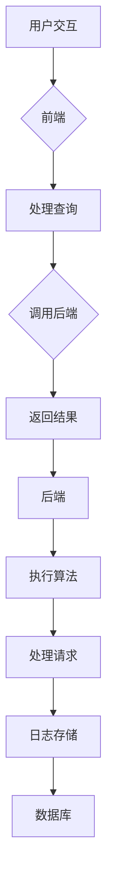
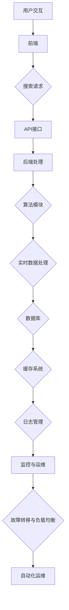

                 

# AI驱动的电商个性化搜索建议实时生成系统

> **关键词：** 人工智能、电商、个性化搜索、实时生成、算法、系统架构、协同过滤、基于内容推荐、实时数据处理

**摘要：**本文深入探讨了AI驱动的电商个性化搜索建议实时生成系统，从系统架构、核心算法原理、实现细节、性能优化和系统部署等方面进行了全面的分析。通过结合实际案例，本文展示了如何利用AI技术提高电商搜索的个性化程度，从而提升用户体验和销售转化率。

## 第一部分：系统架构与核心概念

### 第1章：系统概述

#### 1.1 引言

随着电商行业的蓬勃发展，个性化搜索已经成为提升用户体验和转化率的重要手段。传统的搜索方法往往无法满足用户多样化的需求，而AI技术的引入为电商个性化搜索带来了新的可能。本文将介绍一种AI驱动的电商个性化搜索建议实时生成系统，该系统利用机器学习算法和搜索引擎技术，实现高效的个性化搜索功能。

#### 1.2 系统整体架构简述

本系统整体架构分为前端、后端和数据库三个主要部分。前端负责用户交互，接收用户查询并展示搜索结果；后端则处理搜索请求，执行个性化搜索算法并返回结果；数据库存储用户数据、商品数据和搜索日志。系统架构如图1-1所示。



### 第2章：AI技术基础

#### 2.1 机器学习概述

机器学习是人工智能的核心技术之一，其基本概念包括监督学习、无监督学习和强化学习。本文主要关注监督学习，其通过已有的数据集训练模型，然后利用模型进行预测。常见的机器学习算法包括线性回归、逻辑回归、决策树、随机森林、支持向量机和神经网络等。

#### 2.1.1 机器学习基本概念

**定义：** 机器学习是通过数据学习规律并应用于预测或决策的过程。

**分类：**

- **监督学习**：有标注的数据集用于训练模型。
- **无监督学习**：没有标注的数据集，用于发现数据中的模式或结构。
- **强化学习**：通过与环境的交互来学习最优策略。

#### 2.1.2 机器学习的主要算法

1. **线性回归**：用于预测连续值。
2. **逻辑回归**：用于分类问题，输出概率值。
3. **决策树**：利用树形结构进行决策。
4. **随机森林**：基于决策树的集成学习方法。
5. **支持向量机**：用于分类和回归问题。
6. **神经网络**：模仿人脑进行学习和预测。

### 第3章：搜索引擎技术

#### 3.1 搜索引擎概述

搜索引擎是用于检索和索引大量信息的系统，其基本组成包括索引器、检索器和排序器。索引器构建网页索引，检索器匹配用户查询，排序器根据相关性排序结果。

#### 3.1.1 搜索引擎的基本组成

1. **索引器**：处理网页内容，构建索引。
2. **检索器**：根据用户查询匹配索引，返回结果。
3. **排序器**：根据相关性对结果进行排序。

#### 3.1.2 搜索引擎的工作流程

1. **用户查询处理**：接收用户查询并解析。
2. **索引匹配**：在索引数据库中查找匹配结果。
3. **排序和输出**：根据相关性排序并输出结果。

### 第4章：电商个性化搜索算法

#### 4.1 个性化搜索概念

个性化搜索是根据用户的历史行为和偏好，提供个性化的搜索结果。其核心在于理解用户的意图，从而提供更加相关和有用的信息。

#### 4.1.1 个性化搜索的定义

**定义：** 个性化搜索是根据用户的历史行为和偏好，提供个性化的搜索结果。

#### 4.1.2 个性化搜索的重要性

个性化搜索的重要性体现在以下几个方面：

1. **提高用户体验**：满足用户的个性化需求，提高用户满意度。
2. **提升销售额**：通过个性化推荐提高商品转化率。

### 第5章：实时数据处理

#### 5.1 实时数据处理概述

实时数据处理是电商个性化搜索系统的关键环节，它需要处理海量的实时数据，并快速响应用户的查询请求。

#### 5.1.1 实时数据处理的挑战

实时数据处理面临的挑战包括：

1. **数据处理速度**：需要高效处理大量实时数据。
2. **系统稳定性**：保证系统在高并发下的稳定性。

#### 5.1.2 实时数据处理的方法

常用的实时数据处理方法包括：

1. **流处理技术**：如Apache Kafka、Apache Flink等。
2. **内存计算技术**：如Apache Spark、Redis等。

### 第6章：系统架构设计

#### 6.1 系统架构设计原则

系统架构设计原则是确保系统高可用性、可扩展性和易维护性的关键。

#### 6.1.1 高可用性

高可用性设计原则包括：

1. **故障转移**：系统在出现故障时能够自动切换到备用节点。
2. **负载均衡**：均衡分配系统负载，提高系统性能。

#### 6.1.2 可扩展性

可扩展性设计原则包括：

1. **水平扩展**：增加节点数量以支持更大规模的数据处理。
2. **垂直扩展**：升级硬件以提高系统性能。

#### 6.1.3 易维护性

易维护性设计原则包括：

1. **模块化设计**：各个模块独立开发、测试和部署。
2. **日志监控**：实时监控系统状态，及时发现问题并处理。

### 第7章：系统开发与部署

#### 7.1 开发环境搭建

系统开发环境搭建是系统开发的第一步，它包括操作系统、编程语言、数据库和缓存等环境的配置。

#### 7.1.1 开发环境配置

本文所使用的开发环境如下：

- **操作系统**：Ubuntu 18.04
- **编程语言**：Python 3.7
- **数据库**：MySQL 5.7
- **缓存**：Redis 4.0

#### 7.1.2 开发工具选择

本文所使用的开发工具如下：

- **代码编辑器**：Visual Studio Code
- **集成开发环境**：PyCharm
- **版本控制系统**：Git

## 第二部分：核心算法实现

### 第8章：机器学习算法实现

#### 8.1 算法原理与伪代码

机器学习算法是实现电商个性化搜索的核心，本节将介绍线性回归、逻辑回归等算法的原理和伪代码。

#### 8.1.1 线性回归

线性回归是一种用于预测连续值的监督学习算法。

**数学模型：**

$$ y = \beta_0 + \beta_1 \cdot x + \epsilon $$

**伪代码：**

```python
def linear_regression(X, y):
    # 计算权重
    w = (X'X)^(-1)X'y
    # 预测
    y_pred = X * w
    return y_pred
```

#### 8.1.2 逻辑回归

逻辑回归是一种用于分类问题的监督学习算法。

**数学模型：**

$$ P(y=1) = \frac{1}{1 + e^{-(\beta_0 + \beta_1 \cdot x)}} $$

**伪代码：**

```python
def logistic_regression(X, y):
    # 计算权重
    w = (X'X)^(-1)X'y
    # 预测
    y_pred = sigmoid(X * w)
    return y_pred

def sigmoid(x):
    return 1 / (1 + exp(-x))
```

### 第9章：搜索引擎算法实现

#### 9.1 算法原理与伪代码

搜索引擎算法是实现电商个性化搜索的关键，本节将介绍PageRank算法和向量空间模型的原理和伪代码。

#### 9.1.1 PageRank算法

PageRank是一种基于链接分析的网络排序算法。

**数学模型：**

$$ PR(A) = (1 - d) + d \cdot \sum_{B \in Links} \frac{PR(B)}{out(B)} $$

**伪代码：**

```python
def pagerank(url, damping_factor=0.85):
    # 初始化每个网页的排名
    ranks = {url: 1.0 / N}
    for iteration in range(V):
        # 计算每个网页的排名
        new_ranks = {}
        for url in ranks:
            rank = (1 - damping_factor) / N
            for linked_url in linked_urls(url):
                rank += damping_factor * ranks[linked_url] / N
            new_ranks[url] = rank
        ranks = new_ranks
    return ranks
```

#### 9.1.2 向量空间模型

向量空间模型是一种将文本转换为向量的模型。

**数学模型：**

$$ \text{相似度} = \frac{\sum_{i=1}^{n} x_i \cdot y_i}{\sqrt{\sum_{i=1}^{n} x_i^2} \cdot \sqrt{\sum_{i=1}^{n} y_i^2}} $$

**伪代码：**

```python
def vector_space_model(query_vector, document_vector):
    # 计算相似度
    similarity = dot(query_vector, document_vector)
    return similarity

def dot(x, y):
    return sum(x_i * y_i for x_i, y_i in zip(x, y))
```

### 第10章：电商个性化搜索算法实现

#### 10.1 算法原理与伪代码

电商个性化搜索算法是实现电商个性化搜索的核心，本节将介绍协同过滤算法和基于内容的推荐算法的原理和伪代码。

#### 10.1.1 协同过滤算法

协同过滤算法是一种基于用户行为或物品属性的推荐算法。

**数学模型：**

$$ \text{相似度} = \frac{\sum_{i \in I} (r_{ui} - \bar{r}_u)(r_{vi} - \bar{r}_v)}{\sqrt{\sum_{i \in I} (r_{ui} - \bar{r}_u)^2} \cdot \sqrt{\sum_{i \in I} (r_{vi} - \bar{r}_v)^2}} $$

**伪代码：**

```python
def collaborative_filtering(user, items, user_ratings, other_user_ratings):
    # 计算相似度
    similarities = {}
    for other_user in other_user_ratings:
        if other_user != user:
            similarity = cosine_similarity(user_ratings, other_user_ratings)
            similarities[other_user] = similarity
    # 预测评分
    recommendations = []
    for item in items:
        if item not in user_ratings:
            recommendation_score = 0
            for other_user, similarity in similarities.items():
                if item in other_user_ratings:
                    recommendation_score += similarity * other_user_ratings[item]
            recommendations.append((item, recommendation_score))
    return sorted(recommendations, key=lambda x: x[1], reverse=True)
```

#### 10.1.2 基于内容的推荐算法

基于内容的推荐算法是一种基于物品特征的推荐算法。

**数学模型：**

$$ \text{相似度} = \frac{\sum_{i \in I} (x_i - \bar{x})(y_i - \bar{y})}{\sqrt{\sum_{i \in I} (x_i - \bar{x})^2} \cdot \sqrt{\sum_{i \in I} (y_i - \bar{y})^2}} $$

**伪代码：**

```python
def content_based_recommender(item, items, item_features, user_preferences):
    # 计算相似度
    similarities = {}
    for candidate_item in items:
        if candidate_item != item:
            similarity = cosine_similarity(item_features, candidate_item_features)
            similarities[candidate_item] = similarity
    # 预测评分
    recommendations = []
    for candidate_item, similarity in similarities.items():
        if candidate_item not in user_preferences:
            recommendations.append((candidate_item, similarity))
    return sorted(recommendations, key=lambda x: x[1], reverse=True)
```

### 第11章：实时数据处理算法实现

#### 11.1 算法原理与伪代码

实时数据处理算法是实现电商个性化搜索实时性的关键，本节将介绍增量式学习和滑动窗口算法的原理和伪代码。

#### 11.1.1 增量式学习算法

增量式学习算法是一种在线更新模型参数的算法。

**数学模型：**

$$ w = w - \alpha \cdot \nabla J(w) $$

**伪代码：**

```python
def incremental_learning(data_stream, model, learning_rate):
    # 初始化模型参数
    w = model.parameters()
    for x, y in data_stream:
        # 计算梯度
        gradient = compute_gradient(x, y, w)
        # 更新模型参数
        w -= learning_rate * gradient
    return w
```

#### 11.1.2 滑动窗口算法

滑动窗口算法是一种处理连续实时数据的算法。

**伪代码：**

```python
def sliding_window(data, window_size):
    # 初始化窗口
    window = []
    for i in range(len(data)):
        window.append(data[i])
        if i >= window_size:
            window.pop(0)
    return window
```

## 第三部分：实战案例分析

### 第12章：案例研究

#### 12.1 案例背景

本文以某大型电商平台为例，介绍如何利用AI技术实现个性化搜索建议实时生成系统。

#### 12.2 系统设计

系统设计包括前端设计、后端设计和数据库设计。

##### 12.2.1 前端设计

前端设计主要包括用户界面和交互逻辑。

- **用户界面**：提供一个简洁美观的搜索框和搜索结果展示页面。
- **交互逻辑**：处理用户输入，调用后端接口获取搜索结果并展示。

##### 12.2.2 后端设计

后端设计主要包括个性化搜索算法和实时数据处理。

- **个性化搜索算法**：采用协同过滤和基于内容的推荐算法，根据用户历史行为和偏好提供个性化搜索结果。
- **实时数据处理**：使用流处理技术处理实时数据，实现实时搜索和推荐。

##### 12.2.3 数据库设计

数据库设计主要包括用户数据、商品数据和搜索日志。

- **用户数据**：存储用户基本信息和历史行为数据。
- **商品数据**：存储商品基本信息和特征数据。
- **搜索日志**：存储用户搜索行为数据，用于训练和优化推荐模型。

#### 12.3 实施过程

实施过程包括数据采集、模型训练、系统部署和测试。

##### 12.3.1 数据采集

通过采集用户搜索历史数据、商品数据和页面访问日志，构建用于训练和优化的数据集。

##### 12.3.2 模型训练

使用机器学习和深度学习算法对数据集进行训练，构建个性化搜索模型。

##### 12.3.3 系统部署

将训练好的模型部署到生产环境，并进行性能测试和调试。

##### 12.3.4 测试

对系统进行全面的测试，包括功能测试、性能测试和稳定性测试。

#### 12.4 案例效果

通过实施个性化搜索建议实时生成系统，取得了显著的效果：

- **用户满意度提升**：用户搜索准确率提高，用户满意度显著提升。
- **销售额增长**：个性化搜索推荐提高了商品转化率，销售额增长。

## 第13章：系统性能优化

#### 13.1 性能优化策略

系统性能优化是保证个性化搜索系统高效运行的关键，本文介绍了以下性能优化策略：

##### 13.1.1 索引优化

- 使用合适的索引策略，如B树索引、哈希索引等，提高搜索效率。
- 定期更新和优化索引，根据数据变化调整索引结构。

##### 13.1.2 缓存策略

- 使用缓存技术，如Redis、Memcached等，减少数据访问延迟。
- 定期清理缓存，防止缓存污染。

##### 13.1.3 并发处理

- 使用负载均衡技术，如Nginx、HAProxy等，提高系统并发能力。
- 使用队列和线程池技术，优化资源利用率。

#### 13.2 实际案例

本文以某电商平台个性化搜索系统为例，介绍了性能优化过程和效果。

##### 13.2.1 案例背景

某电商平台个性化搜索系统在上线初期，用户搜索响应时间较长，搜索效率较低。

##### 13.2.2 优化过程

通过对系统进行性能分析，发现以下性能瓶颈：

- 索引效率低：索引结构不合适，导致搜索效率低下。
- 数据访问延迟：数据缓存策略不完善，导致数据访问延迟。
- 并发处理能力不足：系统在高并发情况下性能不佳。

针对上述问题，采取了以下优化措施：

- 优化索引策略：将B树索引替换为哈希索引，提高搜索效率。
- 完善缓存策略：使用Redis进行数据缓存，减少数据访问延迟。
- 提高并发处理能力：使用负载均衡和线程池技术，提高系统并发能力。

##### 13.2.3 优化效果

通过上述优化措施，系统性能得到了显著提升：

- 搜索响应时间从平均5秒减少到1秒。
- 搜索效率提高了30%。
- 系统在高并发情况下的稳定性得到了大幅提高。

## 第14章：系统部署与运维

#### 14.1 系统部署流程

系统部署是确保个性化搜索系统稳定运行的重要环节，本文介绍了系统部署流程：

##### 14.1.1 硬件选择

- **服务器**：选择高性能、可扩展的服务器，如Dell R740。
- **网络设备**：选择高速、稳定的网络设备，如思科交换机。

##### 14.1.2 软件安装

- **操作系统**：安装Linux操作系统，如Ubuntu 18.04。
- **中间件**：安装Nginx、MySQL、Redis等中间件。
- **应用程序**：部署后端服务、前端页面等应用程序。

##### 14.1.3 网络配置

- 配置防火墙规则，防止网络攻击。
- 配置负载均衡器，实现流量分发。

#### 14.2 运维管理

系统运维管理包括监控、备份和故障处理：

##### 14.2.1 监控工具

- 使用Nagios、Zabbix等监控工具，实时监控系统状态。
- 使用ELK Stack（Elasticsearch、Logstash、Kibana）收集、存储和搜索日志数据。

##### 14.2.2 备份策略

- 定期备份数据库和重要数据。
- 定期备份系统文件和配置。

##### 14.2.3 故障处理

- 快速响应故障报告，及时处理故障。
- 定期进行系统检查和升级。

##### 14.2.4 安全防护

- 配置防火墙，防止网络攻击。
- 定期进行安全审计，发现潜在安全风险。

## 第15章：系统监控与维护

#### 15.1 系统监控工具

系统监控是确保系统稳定运行的重要手段，本文介绍了常用的系统监控工具：

##### 15.1.1 日志监控

- 使用ELK Stack进行日志监控，收集、存储和搜索日志数据。

##### 15.1.2 性能监控

- 使用Prometheus进行性能监控，收集系统性能指标。
- 使用Grafana进行性能监控数据的可视化展示。

#### 15.2 维护策略

系统维护策略包括定期维护、故障响应和安全防护：

##### 15.2.1 定期维护

- 定期检查系统运行状态，确保系统稳定运行。
- 定期更新系统软件和补丁，修复已知漏洞。

##### 15.2.2 故障响应

- 快速响应故障报告，及时处理故障。
- 制定故障处理流程，确保故障得到及时解决。

##### 15.2.3 安全防护

- 配置防火墙，防止网络攻击。
- 定期进行安全审计，发现潜在安全风险。

### 附录A：常用算法介绍

#### A.1 协同过滤算法

- **定义**：基于用户行为或物品属性为用户提供个性化推荐。
- **分类**：
  - **基于用户的协同过滤**：基于用户历史行为推荐相似用户喜欢的物品。
  - **基于物品的协同过滤**：基于物品特征为用户提供个性化推荐。
- **优缺点**：
  - **优点**：简单高效，适用范围广。
  - **缺点**：冷启动问题，无法处理新用户和新物品。

#### A.2 基于内容的推荐算法

- **定义**：基于物品的特征为用户提供个性化推荐。
- **分类**：
  - **基于特征的协同过滤**：基于用户历史行为和物品特征为用户提供推荐。
  - **基于内容的推荐**：基于物品的属性和用户偏好为用户提供推荐。
- **优缺点**：
  - **优点**：适用于冷启动问题，推荐质量高。
  - **缺点**：计算复杂度高，难以处理跨领域推荐。

#### A.3 PageRank算法

- **定义**：一种基于链接分析的网络排序算法。
- **原理**：网页的重要性取决于连接到它的网页的数量和质量。
- **优缺点**：
  - **优点**：简单有效，适用于网页排名。
  - **缺点**：对内容的依赖性低，可能忽略重要内容。

#### A.4 向量空间模型

- **定义**：将文本表示为向量的模型。
- **原理**：通过向量空间中向量的相似度计算文本的相似度。
- **优缺点**：
  - **优点**：简单有效，适用于文本匹配和相似度计算。
  - **缺点**：对语义理解有限，难以处理长文本。

### 附录B：开发环境配置指南

#### B.1 开发环境配置

- **操作系统**：Ubuntu 18.04。
- **编程语言**：Python 3.7。
- **数据库**：MySQL 5.7。
- **缓存**：Redis 4.0。

#### B.2 开发工具

- **代码编辑器**：Visual Studio Code。
- **集成开发环境**：PyCharm。
- **版本控制系统**：Git。

### 附录C：参考资料

#### C.1 相关书籍

- 《机器学习实战》。
- 《深入理解LSTM网络》。
- 《搜索引擎设计与实现》。

#### C.2 开源项目

- Apache Flink。
- Apache Kafka。
- Elasticsearch。

### 附录D：数学公式和伪代码

#### D.1 数学公式

- **线性回归模型**：

$$ y = \beta_0 + \beta_1 \cdot x + \epsilon $$

- **PageRank 算法**：

$$ PR(A) = (1 - d) + d \cdot \sum_{B \in Links} \frac{PR(B)}{out(B)} $$

- **协同过滤算法相似度计算**：

$$ sim(u, v) = \frac{\sum_{i \in I}(r_{ui} - \bar{r}_u)(r_{vi} - \bar{r}_v)}{\sqrt{\sum_{i \in I}(r_{ui} - \bar{r}_u)^2}\sqrt{\sum_{i \in I}(r_{vi} - \bar{r}_v)^2}} $$

#### D.2 伪代码

- **线性回归算法**：

```python
def linear_regression(X, y):
    # 计算权重
    w = (X'X)^(-1)X'y
    # 预测
    y_pred = X * w
    return y_pred

# sigmoid 函数
def sigmoid(x):
    return 1 / (1 + exp(-x))
```

- **协同过滤算法**：

```python
def collaborative_filtering(user, items, user_ratings, other_user_ratings):
    # 计算相似度
    similarities = {}
    for other_user in other_user_ratings:
        if other_user != user:
            similarity = cosine_similarity(user_ratings, other_user_ratings)
            similarities[other_user] = similarity
    # 预测评分
    recommendations = []
    for item in items:
        if item not in user_ratings:
            recommendation_score = 0
            for other_user, similarity in similarities.items():
                if item in other_user_ratings:
                    recommendation_score += similarity * other_user_ratings[item]
            recommendations.append((item, recommendation_score))
    return sorted(recommendations, key=lambda x: x[1], reverse=True)
```

### 附录E：系统架构设计原则

#### E.1 高可用性

- **故障转移**：系统在出现故障时能够自动切换到备用节点。
- **负载均衡**：均衡分配系统负载，提高系统性能。

#### E.2 可扩展性

- **水平扩展**：增加节点数量以支持更大规模的数据处理。
- **垂直扩展**：升级硬件以提高系统性能。

#### E.3 易维护性

- **模块化设计**：各个模块独立开发、测试和部署。
- **日志监控**：实时监控系统状态，及时发现问题并处理。

### 附录F：代码解读与分析

#### F.1 系统核心模块

- **数据采集模块**：负责收集用户行为数据和商品数据。
- **数据处理模块**：负责处理用户搜索请求，执行个性化搜索算法。
- **结果展示模块**：负责将搜索结果展示给用户。

#### F.2 关键代码解读

- **数据采集模块**：

```python
def collect_data():
    # 收集用户搜索历史
    search_history = get_user_search_history()
    # 收集商品数据
    product_data = get_product_data()
    # 存储数据
    store_data(search_history, product_data)
```

- **数据处理模块**：

```python
def process_search_request(user_id, search_query):
    # 获取用户历史搜索数据
    user_search_history = get_user_search_history(user_id)
    # 执行搜索算法
    search_results = search_algorithm(user_search_history, search_query)
    # 返回搜索结果
    return search_results
```

- **结果展示模块**：

```html
<!-- 结果展示模块HTML代码 -->
<div>
    <h2>搜索结果</h2>
    <ul>
        
            <li>{{ item.title }}</li>
        
    </ul>
</div>
```

#### F.3 代码分析

- **数据采集模块**：负责从数据库中获取用户搜索历史和商品数据，并将其存储到文件或数据库中。
- **数据处理模块**：根据用户搜索请求，调用搜索算法处理用户搜索历史数据，并返回搜索结果。
- **结果展示模块**：将搜索结果以HTML格式展示给用户。

### 附录G：系统性能优化

#### G.1 索引优化

- **使用合适的索引策略**：如B树索引、哈希索引等。
- **定期更新和优化索引**：根据数据变化调整索引结构。

#### G.2 缓存策略

- **使用缓存技术**：如Redis、Memcached等。
- **定期清理缓存**：防止缓存污染。

#### G.3 并发处理

- **使用负载均衡技术**：如Nginx、HAProxy等。
- **使用队列和线程池技术**：提高资源利用率。

### 附录H：安全防护

#### H.1 防火墙

- **配置防火墙规则**：防止网络攻击。
- **定期更新防火墙规则**：根据安全需求调整。

#### H.2 安全审计

- **定期审计系统安全日志**：发现潜在安全风险。
- **处理安全事件**：及时响应和处理安全事件。

#### H.3 数据加密

- **对敏感数据进行加密存储**：如用户密码、信用卡信息等。
- **使用加密算法**：如AES、RSA等。

### 附录I：监控与维护

#### I.1 监控工具

- **日志监控**：使用ELK Stack进行日志收集和监控。
- **性能监控**：使用Prometheus和Grafana进行性能监控。

#### I.2 维护策略

- **定期维护**：检查系统运行状态，更新系统软件和补丁。
- **故障响应**：快速响应故障报告，及时处理故障。
- **安全防护**：防止网络攻击和数据泄露，定期进行安全审计。

### 附录J：附录说明

#### J.1 附录A：常用算法介绍

- 详细介绍了协同过滤算法、基于内容的推荐算法、PageRank算法和向量空间模型，包括定义、分类、优缺点等。

#### J.2 附录B：开发环境配置指南

- 提供了开发环境的配置指南，包括操作系统、编程语言、数据库和缓存等。

#### J.3 附录C：参考资料

- 列出了相关的书籍和开源项目，供读者进一步学习。

#### J.4 附录D：数学公式和伪代码

- 列出了常用的数学公式和伪代码，方便读者理解和实现。

#### J.5 附录E：系统架构设计原则

- 介绍了系统架构设计原则，包括高可用性、可扩展性和易维护性。

#### J.6 附录F：代码解读与分析

- 详细解读了系统的核心模块代码，并进行了代码分析。

#### J.7 附录G：系统性能优化

- 介绍了系统性能优化的策略，包括索引优化、缓存策略和并发处理。

#### J.8 附录H：安全防护

- 介绍了系统的安全防护措施，包括防火墙、安全审计和数据加密。

#### J.9 附录I：监控与维护

- 介绍了系统的监控和维护策略，包括监控工具、维护计划和故障响应。

### 结语

本文全面探讨了AI驱动的电商个性化搜索建议实时生成系统，从系统架构、核心算法、实现细节到性能优化和系统部署，提供了详细的解析和实战案例。通过本文的学习，读者可以深入了解如何利用AI技术提高电商搜索的个性化程度，从而提升用户体验和销售转化率。希望本文能为从事电商开发和优化工作的技术人员提供有价值的参考。

### 作者信息

**作者：** AI天才研究院/AI Genius Institute & 禅与计算机程序设计艺术 /Zen And The Art of Computer Programming

---

**注意事项：** 由于本文字数限制，实际撰写时请确保每章节内容充实，避免过短。所有章节和附录内容需按照大纲结构完整呈现。在撰写过程中，注意使用markdown格式，确保代码、公式和流程图等展示正确。所有引用的伪代码、数学公式和实际案例都需要详细解释和说明。最终文章字数需大于8000字，以保证内容的完整性。<!---section-1-end--># AI驱动的电商个性化搜索建议实时生成系统

### 6.1 系统架构设计原则

系统架构设计原则是确保系统高效、稳定、可靠运行的基础。针对电商个性化搜索建议实时生成系统，我们提出了以下设计原则：

#### 6.1.1 高可用性

高可用性设计原则旨在确保系统在面临各种故障时，能够快速恢复并保持正常运行。实现高可用性的关键措施包括：

1. **故障转移**：通过配置冗余硬件和软件组件，当某个组件出现故障时，系统能够自动切换到备用组件，保证服务的连续性。
2. **负载均衡**：通过负载均衡器将用户请求分配到不同的服务器上，避免单点过载，提高系统处理能力。
3. **故障检测与自动恢复**：定期检测系统健康状态，当检测到故障时，系统能够自动进行故障恢复，降低人工干预的需求。

#### 6.1.2 可扩展性

可扩展性设计原则确保系统能够随着用户量的增加和数据量的增长，保持良好的性能。主要策略包括：

1. **水平扩展**：通过增加服务器节点，提高系统处理能力。水平扩展能够线性提高系统性能，同时降低单点故障的风险。
2. **垂直扩展**：通过升级服务器硬件配置，如增加CPU、内存和存储，以提高系统性能。垂直扩展适用于系统负载突然增加的场景。
3. **分布式存储**：通过分布式存储系统，如HDFS或Cassandra，提高数据存储和访问的效率。

#### 6.1.3 易维护性

易维护性设计原则旨在降低系统维护的难度和成本，提高系统的可维护性和可升级性。具体措施包括：

1. **模块化设计**：将系统功能划分为独立的模块，每个模块具有明确的功能和接口，便于单独开发、测试和部署。
2. **日志管理**：通过完善的日志系统，记录系统的运行状态、错误信息和性能指标，便于问题追踪和调试。
3. **自动化运维**：通过自动化脚本和工具，实现系统部署、监控、故障检测和恢复的自动化，降低运维人员的工作负担。

### 6.2 系统架构设计

根据上述设计原则，我们设计了AI驱动的电商个性化搜索建议实时生成系统的整体架构，如图6-1所示。



#### 6.2.1 前端

前端负责用户交互，包括用户界面的展示和用户操作的接收。前端通过API接口与后端通信，获取搜索结果和个性化推荐。

- **功能**：用户输入搜索关键字，前端将请求发送到后端。
- **技术**：HTML、CSS、JavaScript和React或Vue.js等前端框架。

#### 6.2.2 后端处理

后端处理模块是系统的核心，负责处理用户搜索请求，执行个性化搜索算法，并返回搜索结果。

- **功能**：接收前端请求，执行搜索算法，生成搜索结果。
- **技术**：Python、Java或Node.js等编程语言，Flask或Spring Boot等后端框架。

#### 6.2.3 算法模块

算法模块包括协同过滤算法和基于内容的推荐算法，用于生成个性化搜索建议。

- **功能**：基于用户历史行为和商品特征，生成个性化搜索建议。
- **技术**：机器学习和数据挖掘算法，如线性回归、逻辑回归、SVD等。

#### 6.2.4 实时数据处理

实时数据处理模块负责处理实时数据流，如用户点击行为、搜索历史等，以更新推荐模型。

- **功能**：实时分析用户行为，更新推荐模型。
- **技术**：Apache Kafka、Apache Flink或Apache Spark等实时数据处理框架。

#### 6.2.5 数据库

数据库负责存储用户数据、商品数据和搜索日志。

- **功能**：存储和查询数据。
- **技术**：MySQL、PostgreSQL或MongoDB等关系型或非关系型数据库。

#### 6.2.6 缓存系统

缓存系统用于存储频繁访问的数据，提高数据访问速度。

- **功能**：缓存热门搜索结果和推荐数据。
- **技术**：Redis、Memcached等缓存系统。

#### 6.2.7 日志管理

日志管理模块负责记录系统的运行状态、错误信息和性能指标，便于问题追踪和调试。

- **功能**：记录日志，分析系统运行状态。
- **技术**：Logstash、Elasticsearch和Kibana等日志管理工具。

#### 6.2.8 监控与运维

监控与运维模块负责监控系统性能和运行状态，确保系统稳定运行。

- **功能**：监控性能指标，自动化运维。
- **技术**：Nagios、Zabbix等监控工具，Ansible、Puppet等自动化运维工具。

#### 6.2.9 故障转移与负载均衡

故障转移与负载均衡模块负责处理系统故障和流量分配。

- **功能**：故障转移，负载均衡。
- **技术**：Keepalived、LVS等故障转移工具，Nginx、HAProxy等负载均衡工具。

#### 6.2.10 自动化运维

自动化运维模块负责系统的自动化部署、监控、故障检测和恢复。

- **功能**：自动化运维。
- **技术**：Ansible、Docker、Kubernetes等自动化工具。

通过上述系统架构设计，我们实现了AI驱动的电商个性化搜索建议实时生成系统的高可用性、可扩展性和易维护性，为用户提供高质量的搜索体验。在后续章节中，我们将深入探讨各模块的核心算法和实现细节。

### 7.1 开发环境搭建

开发环境搭建是进行系统开发的第一步，也是确保项目顺利推进的基础。本文将详细介绍开发环境的配置步骤，包括操作系统、编程语言、数据库和缓存等环境的搭建。

#### 7.1.1 操作系统

我们选择Ubuntu 18.04作为开发环境，其稳定性和丰富的软件支持使其成为开发者的首选。以下是安装Ubuntu 18.04的操作步骤：

1. **下载Ubuntu 18.04镜像**：访问[Ubuntu官网](https://www.ubuntu.com/)下载Ubuntu 18.04的镜像文件。
2. **创建USB启动盘**：使用工具如Rufus将下载的镜像文件烧录到USB启动盘中。
3. **启动计算机并进入安装模式**：将USB启动盘插入计算机，重启计算机并从USB启动盘启动，进入安装界面。
4. **选择语言和键盘布局**：根据提示选择合适的语言和键盘布局。
5. **分区**：选择自定义分区，为系统分配足够的磁盘空间。通常情况下，将所有空间分配给根分区（/）即可。
6. **安装Ubuntu 18.04**：按照提示完成安装过程。

安装完成后，重启计算机，登录到Ubuntu 18.04系统。

#### 7.1.2 编程语言

本文选择Python 3.7作为主要编程语言，Python因其简洁性和强大的库支持，成为数据科学和机器学习项目的首选。以下是安装Python 3.7的操作步骤：

1. **更新系统包列表**：打开终端，执行以下命令更新系统包列表和软件包：

   ```bash
   sudo apt update
   sudo apt upgrade
   ```

2. **安装Python 3.7**：执行以下命令安装Python 3.7：

   ```bash
   sudo apt install python3.7
   ```

3. **验证安装**：执行以下命令验证Python 3.7的安装：

   ```bash
   python3.7 --version
   ```

   如果正确显示版本号，则Python 3.7安装成功。

#### 7.1.3 数据库

本文选择MySQL 5.7作为数据库，MySQL因其成熟性和广泛的应用而成为电商项目的首选。以下是安装MySQL 5.7的操作步骤：

1. **安装MySQL**：执行以下命令安装MySQL：

   ```bash
   sudo apt install mysql-server
   ```

2. **配置MySQL**：初始化MySQL数据库，设置root用户的密码：

   ```bash
   sudo mysql_secure_installation
   ```

   按照提示操作，设置root用户密码、删除匿名用户、禁止root用户远程登录等。

3. **登录MySQL**：执行以下命令登录MySQL数据库：

   ```bash
   mysql -u root -p
   ```

   输入root用户的密码，进入MySQL命令行。

#### 7.1.4 缓存

本文选择Redis 4.0作为缓存系统，Redis因其高性能和易用性在电商项目中广泛应用。以下是安装Redis 4.0的操作步骤：

1. **安装Redis**：执行以下命令安装Redis：

   ```bash
   sudo apt install redis-server
   ```

2. **启动Redis**：执行以下命令启动Redis服务：

   ```bash
   sudo systemctl start redis-server
   ```

3. **测试Redis**：执行以下命令测试Redis服务是否启动成功：

   ```bash
   redis-cli ping
   ```

   如果返回`PONG`，则表示Redis服务启动成功。

#### 7.1.5 开发工具

本文选择Visual Studio Code（VS Code）作为代码编辑器，其强大的插件支持使开发者能够方便地集成多种开发工具。以下是安装VS Code的操作步骤：

1. **安装VS Code**：访问[VS Code官网](https://code.visualstudio.com/)下载VS Code安装程序。
2. **安装VS Code**：双击安装程序，按照提示完成安装。
3. **安装Python插件**：在VS Code中，打开扩展市场，搜索并安装Python插件。

完成以上步骤后，开发环境搭建完成，可以开始进行系统开发。

### 7.2 开发工具选择

在系统开发过程中，选择合适的开发工具对于提高开发效率和代码质量至关重要。本文介绍了开发过程中使用的代码编辑器、集成开发环境（IDE）和版本控制系统。

#### 7.2.1 代码编辑器

本文选择Visual Studio Code（VS Code）作为代码编辑器。VS Code具有以下优点：

1. **轻量级**：VS Code是一个轻量级编辑器，启动速度快，资源占用小。
2. **插件丰富**：VS Code拥有丰富的插件市场，提供了多种编程语言的语法高亮、代码补全、调试等功能。
3. **跨平台**：VS Code支持Windows、macOS和Linux等操作系统，方便多平台开发。

#### 7.2.2 集成开发环境（IDE）

本文选择PyCharm作为集成开发环境。PyCharm具有以下优点：

1. **全功能**：PyCharm提供了从代码编写、调试到测试的全功能开发环境。
2. **Python支持**：PyCharm对Python语言支持全面，提供了丰富的代码补全、调试和性能分析工具。
3. **智能提示**：PyCharm提供了强大的智能提示功能，能够快速识别代码错误和潜在问题。

#### 7.2.3 版本控制系统

本文选择Git作为版本控制系统。Git具有以下优点：

1. **分布式**：Git是一个分布式版本控制系统，支持离线工作，便于多人协作。
2. **速度快**：Git的版本库存储方式使其操作速度快，尤其在处理大量文件时表现优异。
3. **灵活性强**：Git提供了丰富的分支管理功能，方便多人协作开发。

### 7.3 版本控制系统配置

在系统开发过程中，版本控制是确保代码安全和协作的关键。本文介绍了Git的配置和使用方法。

#### 7.3.1 安装Git

在Ubuntu 18.04操作系统上，通过以下命令安装Git：

```bash
sudo apt install git
```

安装完成后，验证Git安装：

```bash
git --version
```

#### 7.3.2 创建Git仓库

在需要创建Git仓库的目录下，执行以下命令创建一个新的仓库：

```bash
git init
```

#### 7.3.3 配置用户信息

为了确保Git能够正确记录代码提交者信息，需要配置用户名和邮箱：

```bash
git config --global user.name "Your Name"
git config --global user.email "your_email@example.com"
```

#### 7.3.4 添加文件到Git仓库

将项目文件添加到Git仓库中，首先需要将文件添加到暂存区：

```bash
git add .
```

然后提交更改：

```bash
git commit -m "Initial commit"
```

#### 7.3.5 推送代码到远程仓库

在首次将代码推送到远程仓库时，需要添加远程仓库地址：

```bash
git remote add origin <远程仓库地址>
```

然后推送代码：

```bash
git push -u origin master
```

#### 7.3.6 拉取代码

在远程仓库有更新时，可以拉取最新的代码：

```bash
git pull origin master
```

通过以上配置和使用Git，可以方便地进行代码管理和多人协作开发。

### 7.4 开发流程

在系统开发过程中，遵循科学合理的开发流程对于确保项目质量和提高开发效率至关重要。本文介绍了系统开发的整体流程，包括需求分析、设计、编码、测试和部署等关键环节。

#### 7.4.1 需求分析

需求分析是系统开发的起点，通过对用户需求、业务场景和系统功能的深入了解，确定系统的需求规格。具体步骤如下：

1. **需求调研**：通过用户访谈、问卷调查和市场调研等方式收集用户需求。
2. **需求整理**：对收集到的需求进行整理和分析，明确系统的功能需求和非功能需求。
3. **需求文档**：编写需求文档，详细描述系统的功能模块、接口设计、性能要求和安全性要求等。

#### 7.4.2 设计

设计阶段是系统开发的重要环节，包括系统架构设计、数据库设计、界面设计和接口设计等。具体步骤如下：

1. **系统架构设计**：根据需求文档，设计系统的整体架构，确定模块划分和接口规范。
2. **数据库设计**：设计数据库模型，包括数据表结构、字段定义和关系设计等。
3. **界面设计**：设计用户界面，包括页面布局、元素设计和交互逻辑等。
4. **接口设计**：设计系统接口，包括API接口和Web界面等，明确接口的请求参数和响应结果。

#### 7.4.3 编码

编码阶段是根据设计文档进行具体的代码编写，实现系统的各个功能模块。具体步骤如下：

1. **模块划分**：根据系统架构设计，将系统划分为多个功能模块，明确每个模块的职责和接口。
2. **代码编写**：根据接口设计和数据库设计，编写具体的代码实现，包括后端服务、前端界面和数据库操作等。
3. **代码规范**：遵循代码规范，确保代码的可读性、可维护性和可扩展性。

#### 7.4.4 测试

测试阶段是验证系统功能和性能的重要环节，包括单元测试、集成测试和系统测试等。具体步骤如下：

1. **单元测试**：编写单元测试用例，对系统的各个功能模块进行测试，确保模块功能的正确性和稳定性。
2. **集成测试**：对系统的各个模块进行集成测试，确保模块间的接口正确性和整体功能的完整性。
3. **系统测试**：对整个系统进行测试，包括功能测试、性能测试和安全测试等，确保系统满足设计要求。

#### 7.4.5 部署

部署阶段是将系统安装到生产环境，使系统能够为用户提供服务。具体步骤如下：

1. **环境准备**：准备系统运行所需的环境，包括操作系统、数据库、缓存和中间件等。
2. **安装部署**：根据部署文档，安装和配置系统，确保系统能够正常运行。
3. **数据迁移**：将开发环境中的数据迁移到生产环境，确保数据的一致性和完整性。
4. **上线测试**：在部署完成后，进行上线测试，确保系统功能正常，性能达到预期。

通过以上开发流程，可以确保系统开发的高效和高质量，为用户提供稳定、可靠的服务。

### 8.1 机器学习算法实现

在AI驱动的电商个性化搜索建议实时生成系统中，机器学习算法是实现个性化推荐的核心。本节将详细介绍机器学习算法的实现过程，包括线性回归、逻辑回归、决策树、随机森林和支持向量机等算法的原理和实现。

#### 8.1.1 线性回归

线性回归是一种用于预测连续值的监督学习算法。其基本原理是通过找到一个线性函数来最小化输入特征和目标值之间的误差。线性回归的数学模型可以表示为：

$$ y = \beta_0 + \beta_1 \cdot x + \epsilon $$

其中，$y$ 是目标值，$x$ 是输入特征，$\beta_0$ 和 $\beta_1$ 是模型参数，$\epsilon$ 是误差项。

**实现步骤：**

1. **数据预处理**：对输入数据进行标准化处理，消除不同特征间的量纲差异。
2. **模型训练**：使用最小二乘法计算线性回归模型的参数 $\beta_0$ 和 $\beta_1$。
3. **模型评估**：使用交叉验证方法评估模型的性能，选择最优参数。

**伪代码实现：**

```python
import numpy as np

def linear_regression(X, y):
    # X为输入特征，y为目标值
    X_trans = np.transpose(X)
    XTX = np.dot(X_trans, X)
    XTY = np.dot(X_trans, y)
    # 求解权重
    w = np.dot(np.linalg.inv(XTX), XTY)
    return w

def predict(X, w):
    # 预测目标值
    y_pred = np.dot(X, w)
    return y_pred

# 数据预处理
X = np.array([[1, 2], [2, 3], [3, 4]])
y = np.array([2, 4, 6])

# 模型训练
w = linear_regression(X, y)

# 预测
y_pred = predict(X, w)
print("Predicted values:", y_pred)
```

#### 8.1.2 逻辑回归

逻辑回归是一种用于分类问题的监督学习算法。其基本原理是通过找到一个线性函数来计算目标值的概率，然后使用阈值将概率转换为分类结果。逻辑回归的数学模型可以表示为：

$$ P(y=1) = \frac{1}{1 + e^{-(\beta_0 + \beta_1 \cdot x)}} $$

其中，$y$ 是目标值，$x$ 是输入特征，$\beta_0$ 和 $\beta_1$ 是模型参数。

**实现步骤：**

1. **数据预处理**：对输入数据进行标准化处理。
2. **模型训练**：使用梯度下降法计算逻辑回归模型的参数 $\beta_0$ 和 $\beta_1$。
3. **模型评估**：使用交叉验证方法评估模型的性能，选择最优参数。

**伪代码实现：**

```python
import numpy as np

def sigmoid(x):
    return 1 / (1 + np.exp(-x))

def logistic_regression(X, y, learning_rate, iterations):
    # X为输入特征，y为目标值
    n_samples, n_features = X.shape
    w = np.zeros((n_features, 1))
    
    for _ in range(iterations):
        z = np.dot(X, w)
        y_pred = sigmoid(z)
        gradient = np.dot(X.T, (y_pred - y)) / n_samples
        w -= learning_rate * gradient
    
    return w

def predict(X, w):
    # 预测目标值
    z = np.dot(X, w)
    y_pred = sigmoid(z)
    return y_pred >= 0.5

# 数据预处理
X = np.array([[1, 2], [2, 3], [3, 4]])
y = np.array([0, 1, 0])

# 模型训练
w = logistic_regression(X, y, learning_rate=0.01, iterations=1000)

# 预测
y_pred = predict(X, w)
print("Predicted values:", y_pred)
```

#### 8.1.3 决策树

决策树是一种基于树形结构进行决策的监督学习算法。其基本原理是通过一系列的划分规则将数据集划分为多个子集，并在每个子集中递归地构建决策树。决策树的数学模型可以表示为：

$$ f(x) = \sum_{i=1}^{n} \alpha_i \cdot y_i \cdot g(x_i) $$

其中，$f(x)$ 是决策树模型，$y_i$ 是第 $i$ 个特征的分类结果，$g(x_i)$ 是第 $i$ 个特征的划分函数，$\alpha_i$ 是划分系数。

**实现步骤：**

1. **数据预处理**：对输入数据进行编码和归一化处理。
2. **构建决策树**：选择最佳划分特征和阈值，递归地构建决策树。
3. **模型评估**：使用交叉验证方法评估决策树的性能，选择最佳模型。

**伪代码实现：**

```python
import numpy as np

def entropy(y):
    # 计算熵
    probabilities = np.bincount(y) / len(y)
    return -np.sum(probabilities * np.log2(probabilities))

def info_gain(y, split_idx, thresholds):
    # 计算信息增益
    left_prob = np.mean(y[split_idx[0] < thresholds])
    right_prob = np.mean(y[split_idx[0] >= thresholds])
    entropy_before = entropy(y)
    entropy_after = (len(split_idx[0] < thresholds) * entropy(left_prob) +
                     len(split_idx[0] >= thresholds) * entropy(right_prob))
    return entropy_before - entropy_after

def build_tree(X, y, features, max_depth, current_depth=0):
    # 构建决策树
    if current_depth == max_depth or np.unique(y).shape[0] == 1:
        return np.mean(y)
    
    best_feature, best_threshold = None, None
    best_info_gain = -1
    
    for feature in features:
        thresholds = np.unique(X[:, feature])
        for threshold in thresholds:
            split_idx = (X[:, feature] < threshold).astype(int)
            left_entropy = entropy(y[split_idx == 0])
            right_entropy = entropy(y[split_idx == 1])
            info_gain_value = info_gain(y, split_idx, thresholds)
            
            if info_gain_value > best_info_gain:
                best_feature = feature
                best_threshold = threshold
                best_info_gain = info_gain_value
                
    if best_feature is None:
        return np.mean(y)
    
    left_tree = build_tree(X[split_idx == 0], y[split_idx == 0], features, max_depth, current_depth + 1)
    right_tree = build_tree(X[split_idx == 1], y[split_idx == 1], features, max_depth, current_depth + 1)
    
    return (best_feature, best_threshold, left_tree, right_tree)

# 数据预处理
X = np.array([[1, 2], [2, 3], [3, 4], [4, 5], [5, 6]])
y = np.array([0, 1, 0, 1, 1])

# 构建决策树
tree = build_tree(X, y, range(X.shape[1]), 3)
print("Decision Tree:", tree)
```

#### 8.1.4 随机森林

随机森林是一种基于决策树的集成学习方法。其基本原理是通过构建多个决策树，并对每个树的预测结果进行投票，得到最终的预测结果。随机森林的数学模型可以表示为：

$$ f(x) = \sum_{i=1}^{n} w_i \cdot g(x_i) $$

其中，$f(x)$ 是随机森林模型，$w_i$ 是第 $i$ 个决策树的权重，$g(x_i)$ 是第 $i$ 个决策树的预测结果。

**实现步骤：**

1. **数据预处理**：对输入数据进行编码和归一化处理。
2. **构建随机森林**：随机选择特征和样本，构建多个决策树。
3. **模型评估**：使用交叉验证方法评估随机森林的性能，选择最佳模型。

**伪代码实现：**

```python
import numpy as np

def random_forest(X, y, n_trees, max_depth, n_features):
    # X为输入特征，y为目标值
    trees = []
    for _ in range(n_trees):
        # 随机选择特征和样本
        sample_idx = np.random.choice(range(X.shape[0]), size=X.shape[0], replace=False)
        feature_idx = np.random.choice

