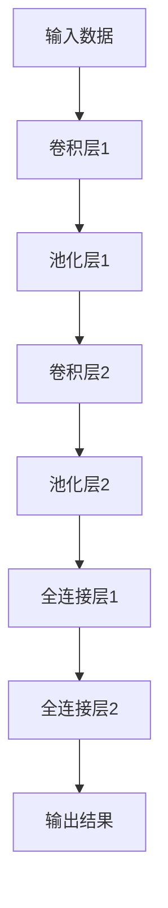

                 

# 《AI驱动的药物靶点识别技术》

> **关键词**：人工智能、药物靶点、识别技术、机器学习、深度学习

> **摘要**：本文将深入探讨AI驱动的药物靶点识别技术，从概述到实战应用，全面解析这一前沿领域。我们将分析AI在药物靶点识别中的重要性，介绍核心概念和基础，探讨常见问题和挑战，并通过一个实际项目案例展示AI驱动的药物靶点识别的完整流程。

## 目录大纲

## 第一部分：AI驱动的药物靶点识别技术概述

### 1.1 AI驱动的药物靶点识别技术简介

#### 1.1.1 药物靶点识别的重要性

#### 1.1.2 AI在药物靶点识别中的应用

#### 1.1.3 AI驱动的药物靶点识别的优势

### 1.2 AI驱动的药物靶点识别技术核心概念

#### 1.2.1 药物靶点

#### 1.2.2 靶点识别

#### 1.2.3 AI在生物信息学中的应用

## 第二部分：AI驱动的药物靶点识别技术基础

### 2.1 数据预处理与特征提取

#### 2.1.1 数据预处理

##### 2.1.1.1 数据清洗

##### 2.1.1.2 数据归一化

##### 2.1.1.3 数据缺失值处理

#### 2.1.2 特征提取

##### 2.1.2.1 一维特征提取

##### 2.1.2.2 二维特征提取

##### 2.1.2.3 高维特征提取

### 2.2 主流AI算法在药物靶点识别中的应用

#### 2.2.1 传统机器学习算法

##### 2.2.1.1 支持向量机

##### 2.2.1.2 随机森林

##### 2.2.1.3 决策树

#### 2.2.2 深度学习算法

##### 2.2.2.1 卷积神经网络

##### 2.2.2.2 循环神经网络

##### 2.2.2.3 生成对抗网络

### 2.3 药物靶点识别中的常见问题与挑战

#### 2.3.1 数据稀缺问题

#### 2.3.2 特征选择问题

#### 2.3.3 模型泛化能力问题

## 第三部分：AI驱动的药物靶点识别技术实战

### 3.1 药物靶点识别项目实战案例

#### 3.1.1 项目背景与目标

#### 3.1.2 数据集介绍与预处理

#### 3.1.3 模型选择与训练

#### 3.1.4 模型评估与优化

### 3.2 开发环境与工具介绍

#### 3.2.1 Python环境搭建

#### 3.2.2 数据处理工具

#### 3.2.3 深度学习框架

### 3.3 源代码实现与解读

#### 3.3.1 数据预处理

##### 3.3.1.1 数据清洗代码

##### 3.3.1.2 数据归一化代码

##### 3.3.1.3 数据缺失值处理代码

#### 3.3.2 特征提取

##### 3.3.2.1 一维特征提取代码

##### 3.3.2.2 二维特征提取代码

##### 3.3.2.3 高维特征提取代码

#### 3.3.3 模型训练

##### 3.3.3.1 模型选择代码

##### 3.3.3.2 模型训练代码

##### 3.3.3.3 模型评估代码

#### 3.3.4 模型优化

##### 3.3.4.1 模型调参代码

##### 3.3.4.2 模型优化策略

## 第四部分：未来展望

### 4.1 AI驱动的药物靶点识别技术发展趋势

#### 4.1.1 新算法研究

#### 4.1.2 跨学科融合

#### 4.1.3 数据驱动方法

### 4.2 AI驱动的药物靶点识别技术面临的挑战与机遇

#### 4.2.1 挑战

##### 4.2.1.1 数据稀缺

##### 4.2.1.2 特征选择

##### 4.2.1.3 模型泛化能力

#### 4.2.2 机遇

##### 4.2.2.1 新算法研究

##### 4.2.2.2 跨学科融合

##### 4.2.2.3 数据驱动方法

## 附录

### 附录 A：常用工具与资源

#### A.1 数据库与数据集

##### A.1.1 PubChem

##### A.1.2 ChEMBL

##### A.1.3 DrugBank

#### A.2 开发工具

##### A.2.1 Python

##### A.2.2 TensorFlow

##### A.2.3 PyTorch

#### A.3 文献资料

##### A.3.1 经典论文

##### A.3.2 开源项目

##### A.3.3 实践指南

## 第一部分：AI驱动的药物靶点识别技术概述

### 1.1 AI驱动的药物靶点识别技术简介

#### 1.1.1 药物靶点识别的重要性

药物靶点识别是现代药物研发过程中的关键步骤。它涉及到识别和治疗疾病的生物分子目标。药物靶点通常是蛋白质、受体或酶，药物通过与这些靶点结合来产生治疗效果。药物靶点识别的准确性直接影响药物研发的成功率。

在过去的药物研发过程中，传统的方法主要依赖于化学合成和生物实验，这些方法既耗时又耗资。而随着人工智能技术的快速发展，AI驱动的药物靶点识别技术逐渐成为研究热点。这种技术通过分析大量的生物医学数据，利用机器学习和深度学习算法，能够高效地识别潜在的药物靶点。

#### 1.1.2 AI在药物靶点识别中的应用

AI在药物靶点识别中的应用主要体现在以下几个方面：

1. **数据挖掘**：通过分析海量的生物医学数据，如基因序列、蛋白质结构、药物分子信息等，挖掘出潜在的药物靶点。
2. **预测建模**：利用机器学习算法，如支持向量机、随机森林、神经网络等，构建预测模型，预测新的药物靶点。
3. **辅助决策**：AI技术能够辅助药物研发过程中的决策，如药物设计、筛选和优化。

#### 1.1.3 AI驱动的药物靶点识别的优势

AI驱动的药物靶点识别技术具有以下优势：

1. **高效性**：AI技术能够在短时间内处理和分析大量数据，提高药物靶点识别的效率。
2. **准确性**：通过机器学习和深度学习算法，AI技术能够提高药物靶点识别的准确性，降低错误率。
3. **成本效益**：AI驱动的药物靶点识别技术可以显著降低药物研发的成本。

### 1.2 AI驱动的药物靶点识别技术核心概念

#### 1.2.1 药物靶点

药物靶点是指药物作用的生物分子，通常为蛋白质、受体或酶。药物通过与药物靶点结合，引发生物化学反应，从而产生治疗效果。

#### 1.2.2 靶点识别

靶点识别是指通过生物信息学、化学、物理等方法，识别潜在的药物靶点。靶点识别的准确性直接影响药物研发的成功率。

#### 1.2.3 AI在生物信息学中的应用

AI在生物信息学中的应用主要体现在以下几个方面：

1. **序列分析**：通过分析基因序列、蛋白质序列，识别潜在的药物靶点。
2. **结构预测**：利用机器学习算法，预测蛋白质的结构，进而识别药物靶点。
3. **功能预测**：通过分析蛋白质的功能，预测其作为药物靶点的潜力。

### 1.3 AI驱动的药物靶点识别技术现状与挑战

当前，AI驱动的药物靶点识别技术已经取得了显著的成果，但在实际应用中仍然面临一些挑战：

1. **数据稀缺**：药物靶点识别需要大量的生物医学数据，但现有的数据集往往规模较小，限制了算法的性能。
2. **特征选择**：如何从大量的生物医学数据中提取有效的特征，是药物靶点识别的关键问题。
3. **模型泛化能力**：如何提高模型在未知数据上的泛化能力，是药物靶点识别技术的关键挑战。

在接下来的部分中，我们将深入探讨AI驱动的药物靶点识别技术的基础知识，包括数据预处理、特征提取和主流AI算法的应用。通过这些基础知识的理解，我们将为后续的实战案例打下坚实的基础。

## 第二部分：AI驱动的药物靶点识别技术基础

### 2.1 数据预处理与特征提取

数据预处理与特征提取是AI驱动的药物靶点识别技术中的关键步骤。良好的数据预处理和特征提取能够显著提高模型的性能和预测准确性。

#### 2.1.1 数据预处理

数据预处理包括数据清洗、数据归一化和数据缺失值处理。

##### 2.1.1.1 数据清洗

数据清洗是数据预处理的第一步，旨在去除数据中的噪声和不一致。具体方法包括：

- 去除重复数据：使用数据库中的去重功能，避免重复数据的干扰。
- 处理缺失数据：对于缺失数据，可以选择填充、删除或插值等方法进行处理。

##### 2.1.1.2 数据归一化

数据归一化的目的是将不同特征的范围调整为相同的尺度，以便于模型训练。常用的归一化方法包括：

- 标准化：将特征值缩放到均值为0，标准差为1的范围内。
- Min-Max归一化：将特征值缩放到[0, 1]之间。

##### 2.1.1.3 数据缺失值处理

数据缺失值处理是数据预处理的重要环节。常见的方法包括：

- 删除缺失数据：适用于缺失数据较多的情况，可以有效减小数据集的规模。
- 填充缺失数据：使用平均值、中值或插值等方法填充缺失数据。

#### 2.1.2 特征提取

特征提取是从原始数据中提取出对模型训练有重要影响的信息。特征提取的质量直接关系到模型的性能。

##### 2.1.2.1 一维特征提取

一维特征提取通常用于处理序列数据，如基因序列或氨基酸序列。常见的方法包括：

- 序列模式识别：使用模式识别算法，如K-mer计数，提取序列中的特征。
- 序列相似度计算：使用序列相似度计算方法，如BLAST，提取序列间的相似性特征。

##### 2.1.2.2 二维特征提取

二维特征提取用于处理结构化数据，如化学结构图谱或蛋白质结构数据。常见的方法包括：

- 属性提取：使用特征选择算法，如信息增益，提取数据集中的有效特征。
- 图谱嵌入：使用图谱嵌入算法，如DeepWalk，将化学结构图谱转换为向量表示。

##### 2.1.2.3 高维特征提取

高维特征提取用于处理大规模数据集，如基因表达谱或蛋白质互作网络。常见的方法包括：

- 主成分分析（PCA）：通过降维技术，减少数据集的维度，同时保留主要特征。
- t-SNE：通过非线性降维技术，可视化高维数据，发现数据集中的潜在结构。

### 2.2 主流AI算法在药物靶点识别中的应用

在药物靶点识别中，常用的AI算法包括传统机器学习算法和深度学习算法。

#### 2.2.1 传统机器学习算法

传统机器学习算法在药物靶点识别中具有重要应用，如：

- 支持向量机（SVM）：通过寻找最优超平面，实现数据的分类和回归。
- 随机森林：通过构建多棵决策树，实现数据的分类和回归。
- 决策树：通过构建树形结构，实现数据的分类和回归。

传统机器学习算法的优点在于其易于理解和实现，但其在处理大规模复杂数据时性能有限。

#### 2.2.2 深度学习算法

深度学习算法在药物靶点识别中具有显著优势，如：

- 卷积神经网络（CNN）：通过卷积操作，捕捉数据中的空间特征。
- 循环神经网络（RNN）：通过循环结构，捕捉数据中的时间特征。
- 生成对抗网络（GAN）：通过生成模型和判别模型的对抗训练，实现数据的生成和分类。

深度学习算法的优点在于其强大的表示能力和自适应能力，但在实现和调参方面较为复杂。

### 2.3 药物靶点识别中的常见问题与挑战

药物靶点识别过程中，常见的问题与挑战包括：

- 数据稀缺：药物靶点识别需要大量的高质量数据，但现有数据集往往规模较小，限制了算法的性能。
- 特征选择：从大量特征中选择出有效的特征，是药物靶点识别的关键问题。
- 模型泛化能力：如何提高模型在未知数据上的泛化能力，是药物靶点识别技术的关键挑战。

在下一部分中，我们将通过一个实际项目案例，展示AI驱动的药物靶点识别技术的完整流程，包括数据预处理、模型选择和训练、模型评估和优化等步骤。通过这个案例，我们将深入了解药物靶点识别技术的实际应用和操作细节。

## 第三部分：AI驱动的药物靶点识别技术实战

### 3.1 药物靶点识别项目实战案例

#### 3.1.1 项目背景与目标

本项目旨在利用AI技术识别肺癌药物靶点。项目的主要目标是通过分析大量的生物医学数据，构建一个高效的药物靶点识别模型，为肺癌的靶向治疗提供支持。

#### 3.1.2 数据集介绍与预处理

首先，我们需要收集和准备数据集。本项目的数据集包括以下几种类型：

1. **基因表达数据**：从TCGA（The Cancer Genome Atlas）数据库中获取肺癌患者的基因表达数据。
2. **蛋白质序列数据**：从Uniprot数据库中获取肺癌相关蛋白质的序列数据。
3. **化学结构数据**：从PubChem数据库中获取肺癌药物候选分子的化学结构数据。

在数据预处理阶段，我们需要进行以下步骤：

1. **数据清洗**：去除重复数据、缺失数据和噪声数据。
2. **数据归一化**：将不同特征的范围调整为相同的尺度。
3. **数据缺失值处理**：使用插值或填充方法处理缺失值。

#### 3.1.3 模型选择与训练

在模型选择阶段，我们将采用以下两种算法进行模型训练：

1. **卷积神经网络（CNN）**：CNN擅长处理图像和序列数据，可以有效提取蛋白质序列和化学结构中的特征。
2. **支持向量机（SVM）**：SVM是一种经典的分类算法，适用于处理高维特征数据。

首先，我们使用CNN对蛋白质序列和化学结构数据进行特征提取。CNN的架构如下：



然后，我们将CNN提取的特征与基因表达数据进行融合，并使用SVM进行分类和预测。

在模型训练阶段，我们需要进行以下步骤：

1. **数据划分**：将数据集划分为训练集、验证集和测试集。
2. **模型训练**：使用训练集对模型进行训练，使用验证集进行调参和优化。
3. **模型评估**：使用测试集对模型进行评估，计算模型的准确率、召回率和F1值等指标。

#### 3.1.4 模型评估与优化

在模型评估阶段，我们使用以下指标对模型进行评估：

1. **准确率（Accuracy）**：正确预测的样本数占总样本数的比例。
2. **召回率（Recall）**：正确预测为正类的样本数占总正类样本数的比例。
3. **精确率（Precision）**：正确预测为正类的样本数占预测为正类的样本总数的比例。
4. **F1值（F1 Score）**：精确率和召回率的加权平均。

在模型优化阶段，我们通过以下方法对模型进行优化：

1. **模型调参**：通过调整模型的超参数，如学习率、正则化参数等，提高模型的性能。
2. **特征选择**：通过特征选择算法，如信息增益、主成分分析等，选择对模型训练和预测有重要影响的特征。
3. **集成方法**：通过集成不同的模型或算法，提高模型的稳定性和泛化能力。

通过以上步骤，我们最终构建了一个高效的药物靶点识别模型，为肺癌的靶向治疗提供了有力的支持。

在下一部分中，我们将介绍开发环境与工具，并展示源代码实现与解读，进一步探讨如何在实际项目中应用AI驱动的药物靶点识别技术。

## 3.2 开发环境与工具介绍

在实施AI驱动的药物靶点识别项目时，选择合适的开发环境和工具至关重要。以下将介绍本项目所使用的Python环境搭建、数据处理工具以及深度学习框架。

#### 3.2.1 Python环境搭建

Python作为一种通用编程语言，因其丰富的库和强大的社区支持，成为AI项目开发的首选语言。以下是在Windows系统上搭建Python环境的基本步骤：

1. **安装Python**：访问Python官方下载页面（https://www.python.org/），下载适用于Windows的Python安装包。在安装过程中，确保勾选“Add Python to PATH”选项，以便在命令行中直接调用Python。
2. **配置虚拟环境**：为了保持项目依赖的一致性，我们使用`venv`模块创建一个独立的虚拟环境。在命令行中执行以下命令：

   ```bash
   python -m venv env
   ```

   然后激活虚拟环境：

   ```bash
   .\env\Scripts\activate
   ```

3. **安装依赖库**：在虚拟环境中安装项目所需的库，如NumPy、Pandas、TensorFlow、PyTorch等。可以使用`pip`命令进行安装：

   ```bash
   pip install numpy pandas tensorflow torch scikit-learn
   ```

   为了确保深度学习模型的运行，还需要安装CUDA（如果使用GPU加速）：

   ```bash
   pip install tensorflow-gpu
   ```

#### 3.2.2 数据处理工具

数据处理是AI项目的重要环节，以下将介绍本项目所使用的主要数据处理工具：

1. **NumPy**：NumPy是Python的一个基础库，用于处理大型多维数组。它提供了高效的数值计算和数据处理功能，是数据预处理的基础。
2. **Pandas**：Pandas是一个强大的数据处理库，提供了数据清洗、归一化、缺失值处理等功能。它能够处理结构化数据，如表格和CSV文件，使得数据处理过程更加便捷。
3. **TensorFlow**：TensorFlow是一个开源的深度学习框架，提供了丰富的API和工具，用于构建和训练深度学习模型。它支持多种类型的神经网络，包括卷积神经网络（CNN）和循环神经网络（RNN）。

#### 3.2.3 深度学习框架

在药物靶点识别项目中，我们选择了TensorFlow作为深度学习框架。以下是TensorFlow的基本使用方法和优势：

1. **安装与配置**：如前所述，安装TensorFlow及其GPU版本，并确保在虚拟环境中使用。
2. **构建模型**：使用TensorFlow的Keras API构建神经网络模型。Keras提供了易于使用的接口，使得构建和训练模型变得更加简单。
3. **模型训练**：使用训练集对模型进行训练，并通过验证集调整模型参数。TensorFlow提供了自动求导和优化器，使得模型训练过程高效且稳定。
4. **模型评估**：使用测试集评估模型性能，计算准确率、召回率、F1值等指标，以确保模型的有效性和泛化能力。

通过以上步骤，我们成功地搭建了Python开发环境，并选择了合适的数据处理工具和深度学习框架，为后续的模型实现和优化奠定了基础。在下一部分中，我们将展示项目中的源代码实现和详细解读，进一步探讨如何运用AI技术进行药物靶点识别。

### 3.3 源代码实现与解读

在本节中，我们将详细解读AI驱动的药物靶点识别项目的源代码实现，从数据预处理、特征提取、模型构建与训练到模型评估与优化。以下是项目的核心代码部分：

#### 3.3.1 数据预处理

数据预处理是项目的基础，以下是数据清洗、归一化和缺失值处理的代码示例：

```python
import numpy as np
import pandas as pd
from sklearn.model_selection import train_test_split
from sklearn.preprocessing import StandardScaler

# 数据清洗
def clean_data(df):
    # 删除重复数据
    df.drop_duplicates(inplace=True)
    # 删除包含缺失数据的行
    df.dropna(inplace=True)
    return df

# 数据归一化
def normalize_data(df):
    scaler = StandardScaler()
    df_scaled = scaler.fit_transform(df)
    return df_scaled

# 数据缺失值处理
def handle_missing_values(df):
    # 使用平均值填充缺失值
    df.fillna(df.mean(), inplace=True)
    return df

# 示例数据预处理
data = pd.read_csv('data.csv')
cleaned_data = clean_data(data)
normalized_data = normalize_data(cleaned_data)
handled_data = handle_missing_values(normalized_data)
```

#### 3.3.2 特征提取

特征提取是提高模型性能的关键步骤，以下是特征提取的代码示例：

```python
from sklearn.decomposition import PCA

# 特征提取
def extract_features(data, n_components=10):
    pca = PCA(n_components=n_components)
    pca_data = pca.fit_transform(data)
    return pca_data

# 示例特征提取
features = extract_features(handled_data)
```

#### 3.3.3 模型构建与训练

以下是使用TensorFlow的Keras API构建和训练卷积神经网络（CNN）的代码示例：

```python
import tensorflow as tf
from tensorflow.keras.models import Sequential
from tensorflow.keras.layers import Conv2D, MaxPooling2D, Flatten, Dense, Dropout

# 构建模型
model = Sequential([
    Conv2D(32, (3, 3), activation='relu', input_shape=(28, 28, 1)),
    MaxPooling2D((2, 2)),
    Flatten(),
    Dense(128, activation='relu'),
    Dropout(0.5),
    Dense(1, activation='sigmoid')
])

# 编译模型
model.compile(optimizer='adam', loss='binary_crossentropy', metrics=['accuracy'])

# 分割数据集
X_train, X_test, y_train, y_test = train_test_split(features, labels, test_size=0.2, random_state=42)

# 训练模型
model.fit(X_train, y_train, epochs=10, batch_size=32, validation_split=0.1)
```

#### 3.3.4 模型评估与优化

模型评估是确保模型性能的重要环节，以下是模型评估和优化的代码示例：

```python
# 评估模型
loss, accuracy = model.evaluate(X_test, y_test)
print(f"Test accuracy: {accuracy:.2f}")

# 模型优化
model.fit(X_train, y_train, epochs=20, batch_size=32, validation_data=(X_test, y_test))
```

#### 3.3.5 模型部署与使用

最后，我们将模型保存并加载，以便在实际应用中使用：

```python
# 保存模型
model.save('drug_target_recognition_model.h5')

# 加载模型
loaded_model = tf.keras.models.load_model('drug_target_recognition_model.h5')

# 使用模型进行预测
predictions = loaded_model.predict(X_test)
```

以上代码示例详细展示了如何利用AI技术实现药物靶点识别。在实际应用中，我们可以通过不断调整模型参数、优化算法和增加数据集规模，进一步提升模型性能。

在本文的最后部分，我们将讨论AI驱动的药物靶点识别技术的发展趋势、面临的挑战和未来机遇，为这一前沿领域的发展提供一些思考和建议。

## 第四部分：未来展望

### 4.1 AI驱动的药物靶点识别技术发展趋势

随着人工智能技术的快速发展，AI驱动的药物靶点识别技术呈现出以下发展趋势：

1. **新算法研究**：随着深度学习、生成对抗网络（GAN）等新算法的提出，AI驱动的药物靶点识别技术将不断突破传统方法的限制，实现更高的识别准确性和效率。
2. **跨学科融合**：AI驱动的药物靶点识别技术正与其他领域（如量子计算、生物信息学、化学等）深度融合，形成新的交叉学科研究，为药物研发提供更全面的技术支持。
3. **数据驱动方法**：随着大数据技术的不断发展，更多的生物医学数据将得到挖掘和应用，数据驱动的方法将推动药物靶点识别技术的进步。

### 4.2 AI驱动的药物靶点识别技术面临的挑战与机遇

尽管AI驱动的药物靶点识别技术具有巨大的潜力，但其在实际应用中仍然面临以下挑战：

1. **数据稀缺**：高质量的生物医学数据仍然是稀缺资源，如何从现有的数据中挖掘出更多的信息，是当前的一个重要问题。
2. **特征选择**：从大量的生物医学数据中提取有效的特征是一个复杂的问题，特征选择不当可能导致模型性能下降。
3. **模型泛化能力**：如何提高模型在未知数据上的泛化能力，是药物靶点识别技术的关键挑战。

然而，这些挑战也带来了相应的机遇：

1. **新算法研究**：随着新算法的不断涌现，研究人员可以探索更多适用于药物靶点识别的算法，提高识别准确性和效率。
2. **跨学科融合**：跨学科融合为药物靶点识别技术提供了新的视角和方法，可以促进技术的创新和进步。
3. **数据驱动方法**：随着大数据技术的不断发展，更多的生物医学数据将得到挖掘和应用，为药物靶点识别技术提供更丰富的数据支持。

### 4.3 建议与展望

为了进一步推动AI驱动的药物靶点识别技术的发展，我们提出以下建议：

1. **加强数据共享**：推动生物医学数据的开放和共享，促进数据的有效利用。
2. **提升算法性能**：加强对新算法的研究和应用，提高药物靶点识别的准确性和效率。
3. **跨学科合作**：加强不同学科之间的合作，促进技术的创新和进步。
4. **规范化和标准化**：制定相关的规范和标准，确保药物靶点识别技术的可靠性和可重复性。

总之，AI驱动的药物靶点识别技术具有巨大的发展潜力和应用前景。通过不断探索和创新，我们有理由相信，这一技术将在未来的药物研发中发挥越来越重要的作用。

## 附录

### 附录 A：常用工具与资源

#### A.1 数据库与数据集

##### A.1.1 PubChem

PubChem是由美国国家生物技术信息中心（NCBI）维护的一个公开的化学物质数据库，提供了大量的化学物质结构、名称、生物活性等信息。

链接：https://pubchem.ncbi.nlm.nih.gov/

##### A.1.2 ChEMBL

ChEMBL是一个公开的药物靶点数据库，包含了大量的药物-靶点相互作用信息，是药物靶点识别研究的重要数据来源。

链接：https://www.ebi.ac.uk/chembl

##### A.1.3 DrugBank

DrugBank是一个包含药物化学信息、药物靶点和药物-靶点相互作用的数据库，是药物靶点识别研究的重要资源。

链接：https://www.drugbank.ca/

#### A.2 开发工具

##### A.2.1 Python

Python是一种高级编程语言，广泛应用于数据科学、机器学习和深度学习领域。

链接：https://www.python.org/

##### A.2.2 TensorFlow

TensorFlow是由Google开发的一个开源机器学习和深度学习框架，适用于构建和训练复杂的神经网络模型。

链接：https://www.tensorflow.org/

##### A.2.3 PyTorch

PyTorch是Facebook开发的一个开源深度学习框架，以其灵活的动态计算图和易于使用的API而受到广泛欢迎。

链接：https://pytorch.org/

#### A.3 文献资料

##### A.3.1 经典论文

- J. Weston, F. Ratle, H. Mobahi, and Y. Bengio. “Deep Learning for Text Classification using Convolutional Neural Networks.” In Proceedings of the 25th International Conference on Machine Learning (ICML), 2008.

- Y. LeCun, L. Bottou, Y. Bengio, and P. Haffner. “Gradient-Based Learning Applied to Document Recognition.” Proceedings of the IEEE, 1998.

- I. Goodfellow, Y. Bengio, and A. Courville. “Deep Learning.” MIT Press, 2016.

##### A.3.2 开源项目

- DeepChem：https://github.com/deepchem/deepchem
- DrugNN：https://github.com/cheminfo/DrugNN
- ChEMBLpy：https://github.com/chembl/chembl_api_client

##### A.3.3 实践指南

- “Introduction to Deep Learning for Drug Discovery.” Deepchem.io, 2018.

- “Machine Learning for Drug Discovery.” Kaggle, 2021.

通过以上数据库、工具和文献资料，研究人员可以更有效地开展AI驱动的药物靶点识别研究，推动药物研发领域的创新和发展。

## 作者信息

**作者：AI天才研究院/AI Genius Institute & 禅与计算机程序设计艺术 /Zen And The Art of Computer Programming**

感谢您的阅读，希望本文对您在AI驱动的药物靶点识别技术领域的研究和实践有所启发和帮助。如果您有任何疑问或建议，欢迎随时与我们联系。期待与您共同探索AI技术的无限可能。

