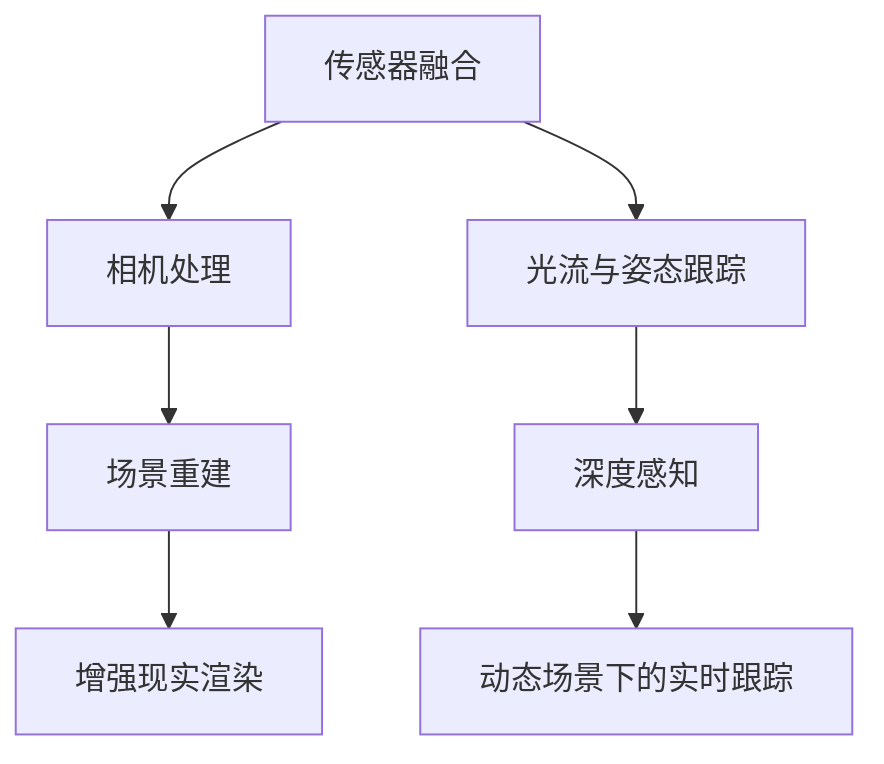
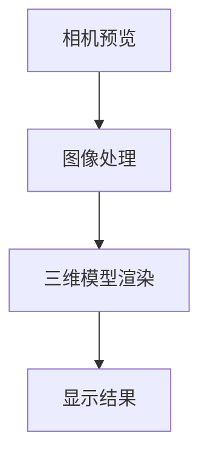
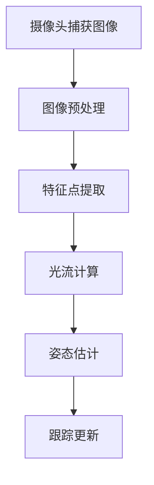

                 

### 《ARCore 开发工具：在 Android 上构建 AR 应用》

关键词：增强现实、ARCore、Android、开发工具、项目实战、技术博客

摘要：
本文将深入探讨ARCore，Google提供的增强现实（AR）开发平台，旨在帮助开发者了解如何在Android设备上构建强大的AR应用。文章首先介绍了ARCore的核心概念和架构，然后讲解了如何搭建开发环境，并详细阐述了ARCore的高级功能。接着，通过一系列项目实战，读者将学习到如何使用ARCore开发实用的AR应用。最后，文章对ARCore的未来发展趋势进行了展望，并对开发者的职业规划提出了建议。

### 第一部分: ARCore 基础

#### 第1章: ARCore 简介

##### 1.1.1 ARCore 的核心技术

ARCore 是 Google 于 2017 年推出的增强现实（AR）开发平台，旨在为 Android 开发者提供一套完整的工具和 API，以构建高质量的 AR 应用。ARCore 的核心技术包括：

- **环境感知**：通过摄像头和传感器收集环境数据，如光线、方向和位置。
- **场景重建**：使用机器学习算法和计算机视觉技术，将现实世界中的图像转换为三维模型。
- **增强现实渲染**：通过渲染引擎，将虚拟物体与现实环境无缝融合。

##### 1.1.2 ARCore 的功能与特性

ARCore 提供了以下关键功能：

- **光流与姿态跟踪**：利用摄像头图像，实现设备在现实世界中的精确位置和方向跟踪。
- **深度感知**：通过计算机视觉算法，实时估计场景中的深度信息，实现更自然的交互体验。
- **环境映射**：将现实世界的场景映射到三维模型中，以增强现实内容。
- **物体识别**：识别和标记现实世界中的物体，用于交互和增强。

##### 1.1.3 ARCore 的应用场景

ARCore 可以应用于多种场景，包括：

- **游戏开发**：利用 ARCore 的增强现实技术，创建沉浸式游戏体验。
- **教育**：通过 AR 技术展示复杂的概念和过程，提高学习效果。
- **医疗**：在手术规划和训练中使用 AR 技术，提高医疗操作的准确性和安全性。
- **零售**：利用 AR 技术展示产品，增强消费者的购物体验。

##### 1.1.4 ARCore 与其他 AR SDK 的比较

与其他 AR SDK 相比，ARCore 具有以下优势：

- **跨平台兼容性**：ARCore 支持 Android 设备，与其他平台如 iOS 的 ARKit 相比，具有更广泛的设备覆盖。
- **易于使用**：ARCore 提供了丰富的 API 和文档，降低了开发难度。
- **性能优化**：ARCore 在渲染和跟踪方面进行了深度优化，确保应用的高性能。
- **社区支持**：Google 提供了强大的社区支持，包括官方文档、开发社区和教程。

#### 第2章: ARCore 环境搭建

##### 2.1.1 Android 开发环境搭建

要在 Android 上使用 ARCore，首先需要搭建 Android 开发环境。以下步骤用于搭建 Android 开发环境：

1. **安装 JDK**：确保安装了 JDK 8 或更高版本。
2. **安装 Android Studio**：从 [Android Studio 官网](https://developer.android.com/studio) 下载并安装 Android Studio。
3. **安装 Android SDK**：在 Android Studio 中打开 SDK Manager，安装相应的 SDK 和工具。

##### 2.1.2 ARCore SDK 的下载与安装

1. **下载 ARCore SDK**：从 [ARCore 官网](https://arcore.google.com/) 下载适用于 Android 的 ARCore SDK。
2. **导入 SDK 到 Android Studio**：将下载的 SDK 文件导入到 Android Studio 的项目中，按照提示进行配置。

##### 2.1.3 Android Studio 的配置与使用

1. **创建新项目**：在 Android Studio 中创建一个新的 Android 项目。
2. **配置 ARCore**：在项目中添加 ARCore 依赖，配置相应的 API 和权限。
3. **运行项目**：编译并运行项目，检查是否成功接入 ARCore。

##### 2.1.4 ARCore Studio 的介绍与使用

ARCore Studio 是 Google 推出的 ARCore 开发工具，提供了可视化界面和丰富的功能，用于快速构建 AR 应用。以下步骤用于介绍 ARCore Studio：

1. **下载 ARCore Studio**：从 [ARCore Studio 官网](https://arcore.google.com/studio/) 下载并安装 ARCore Studio。
2. **创建新项目**：在 ARCore Studio 中创建一个新项目。
3. **配置环境**：配置项目的环境，包括 Android SDK 和 ARCore SDK。
4. **添加 ARCore 功能**：使用 ARCore Studio 的可视化界面，添加光流、姿态跟踪和深度感知等功能。
5. **预览和测试**：在虚拟环境中预览和测试 AR 应用，确保功能正常运行。

#### 第3章: ARCore 基础概念

##### 3.1.1 ARCore 的基本架构

ARCore 的基本架构包括以下几个关键组件：

1. **传感器融合**：使用手机内置的加速度计、陀螺仪和 compass 等传感器，实时获取设备的位置和方向信息。
2. **相机处理**：对摄像头捕获的图像进行处理，包括图像增强、特征提取和图像识别等。
3. **场景重建**：基于相机处理结果和传感器信息，重建现实世界的三维模型。
4. **增强现实渲染**：将虚拟物体与现实环境进行融合，并渲染到屏幕上。

##### 3.1.2 ARCore 的坐标系统

ARCore 使用世界坐标系（World Coordinate System）来表示三维空间中的物体。世界坐标系的原点位于设备的重心，Z 轴指向设备的底部，X 轴指向设备的右侧，Y 轴指向设备的上方。

##### 3.1.3 ARCore 的渲染流程

ARCore 的渲染流程主要包括以下几个步骤：

1. **相机预览**：在屏幕上显示摄像头捕获的实时图像。
2. **图像处理**：对摄像头捕获的图像进行处理，包括增强、滤波和特征提取等。
3. **三维模型渲染**：将虚拟物体渲染到图像中，与实时图像进行融合。
4. **显示结果**：将渲染结果显示在屏幕上，形成最终的 AR 图像。

##### 3.1.4 ARCore 的跟踪技术

ARCore 的跟踪技术主要包括以下几种：

1. **光流与姿态跟踪**：利用摄像头捕获的连续图像，计算设备在现实世界中的位置和方向。
2. **特征点跟踪**：通过识别图像中的特征点，跟踪设备在现实世界中的运动。
3. **SLAM（同步定位与映射）**：结合传感器数据和摄像头图像，实现设备的自主定位和场景重建。
4. **标记点识别**：通过识别现实世界中的标记点，实现与虚拟物体的精确交互。

#### 第4章: ARCore 的高级功能

##### 4.1.1 光流与姿态跟踪

光流与姿态跟踪是 ARCore 的核心功能之一，通过摄像头捕获的连续图像，实时计算设备在现实世界中的位置和方向。以下是一般步骤：

1. **摄像头捕获图像**：从摄像头捕获连续的图像帧。
2. **图像预处理**：对图像进行增强、滤波等预处理操作。
3. **特征点提取**：使用特征提取算法，从预处理后的图像中提取特征点。
4. **光流计算**：利用特征点之间的运动关系，计算图像序列中的光流。
5. **姿态估计**：根据光流结果，估计设备在现实世界中的姿态。
6. **跟踪更新**：根据传感器数据和姿态估计结果，更新设备的定位信息。

##### 4.1.2 深度感知

深度感知是 ARCore 的另一项重要功能，通过计算机视觉算法，实时估计场景中的深度信息。以下是一般步骤：

1. **摄像头捕获图像**：从摄像头捕获深度图像。
2. **图像预处理**：对深度图像进行增强、滤波等预处理操作。
3. **特征点提取**：使用特征提取算法，从预处理后的深度图像中提取特征点。
4. **深度估计**：利用特征点之间的距离关系，估计深度图像中的深度信息。
5. **深度校正**：根据深度信息，对深度图像进行校正，提高精度。
6. **深度融合**：将深度信息融合到场景重建结果中，形成更准确的场景模型。

##### 4.1.3 动态场景下的实时跟踪

动态场景下的实时跟踪是 ARCore 的一个挑战，需要处理设备在快速运动场景中的定位和跟踪。以下是一般步骤：

1. **摄像头捕获图像**：从摄像头捕获连续的图像帧。
2. **图像预处理**：对图像进行增强、滤波等预处理操作。
3. **特征点提取**：使用特征提取算法，从预处理后的图像中提取特征点。
4. **光流计算**：利用特征点之间的运动关系，计算图像序列中的光流。
5. **姿态估计**：根据光流结果，估计设备在现实世界中的姿态。
6. **SLAM**：结合传感器数据和姿态估计结果，使用 SLAM 算法实现动态场景下的定位和跟踪。
7. **跟踪更新**：根据传感器数据和 SLAM 结果，更新设备的定位信息。

##### 4.1.4 增强现实图像的生成与处理

增强现实图像的生成与处理是 ARCore 的重要组成部分，包括以下步骤：

1. **场景重建**：根据摄像头捕获的图像和传感器数据，重建现实世界的三维模型。
2. **物体识别**：识别现实世界中的物体，为增强现实内容提供基础。
3. **虚拟物体生成**：根据需求，生成对应的虚拟物体。
4. **虚拟物体融合**：将虚拟物体与重建的场景进行融合，形成最终的 AR 图像。
5. **图像渲染**：使用渲染引擎，将融合后的 AR 图像渲染到屏幕上。

#### 第二部分: ARCore 项目实战

##### 第5章: 第一个 AR 应用

##### 5.1.1 项目需求分析

本项目旨在构建一个简单的 AR 应用，用于展示虚拟物体在现实世界中的位置和方向。主要需求如下：

1. **基本功能**：实现虚拟物体的创建、展示和交互。
2. **用户体验**：提供直观的交互界面和流畅的 AR 效果。
3. **性能优化**：确保应用在多种 Android 设备上都能正常运行。

##### 5.1.2 应用界面设计

应用界面主要包括以下部分：

1. **摄像头预览**：显示摄像头捕获的实时图像。
2. **虚拟物体列表**：展示可用的虚拟物体，用户可以点击选择。
3. **操作按钮**：包括添加、删除和更新虚拟物体的功能。
4. **交互提示**：提示用户如何与虚拟物体进行交互。

##### 5.1.3 开发环境搭建

1. **安装 Android Studio**：从 [Android Studio 官网](https://developer.android.com/studio) 下载并安装 Android Studio。
2. **安装 ARCore SDK**：从 [ARCore 官网](https://arcore.google.com/) 下载 ARCore SDK，并导入到 Android Studio 的项目中。
3. **配置项目**：在 Android Studio 中创建新项目，并配置 ARCore 依赖和权限。

##### 5.1.4 应用开发步骤

1. **环境搭建**：按照前述步骤搭建开发环境。
2. **项目结构**：创建项目的目录结构，包括主界面、虚拟物体管理器和 ARCore 相关模块。
3. **实现摄像头预览**：使用 Camera2 API 或 CameraX 库，实现摄像头预览功能。
4. **实现虚拟物体管理**：创建虚拟物体类，管理虚拟物体的创建、展示和交互。
5. **实现 ARCore 功能**：使用 ARCore API，实现光流、姿态跟踪和深度感知等功能。
6. **测试和优化**：在多种 Android 设备上测试应用，优化性能和用户体验。

##### 5.1.5 应用测试与优化

1. **功能测试**：测试应用的基本功能，确保虚拟物体的创建、展示和交互正常。
2. **性能测试**：测试应用在不同设备和场景下的性能，优化代码和资源使用。
3. **用户体验测试**：邀请用户试用应用，收集反馈和建议，优化界面和交互体验。
4. **发布和更新**：根据测试结果，发布应用的第一个版本，并持续更新和改进。

#### 第6章: ARCore 在游戏开发中的应用

##### 6.1.1 游戏引擎的选择

在 ARCore 在游戏开发中的应用中，选择合适的游戏引擎至关重要。以下是几个常见的选择：

1. **Unity**：Unity 是一款强大的跨平台游戏引擎，支持 ARCore，具有丰富的功能和资源。
2. **Unreal Engine**：Unreal Engine 是一款高性能的游戏引擎，支持 ARCore，适用于大型游戏开发。
3. **Cocos2d-x**：Cocos2d-x 是一款开源的游戏引擎，支持 ARCore，适用于小型游戏开发。
4. **LayaBox**：LayaBox 是一款基于 HTML5 的游戏引擎，支持 ARCore，适用于跨平台游戏开发。

##### 6.1.2 游戏场景设计

游戏场景设计是游戏开发的重要环节，以下是一般步骤：

1. **需求分析**：分析游戏的需求，包括场景类型、交互方式和视觉效果等。
2. **场景建模**：使用 3D 建模工具，创建游戏场景的三维模型。
3. **场景布局**：根据游戏需求，对场景中的元素进行布局和排列。
4. **场景优化**：对场景进行优化，提高渲染效率和性能。

##### 6.1.3 游戏角色设计

游戏角色设计是游戏开发的核心，以下是一般步骤：

1. **角色需求分析**：分析游戏角色的需求，包括外观、动作和交互等。
2. **角色建模**：使用 3D 建模工具，创建游戏角色的三维模型。
3. **角色动画**：为游戏角色创建动画，实现角色的动作和交互。
4. **角色优化**：对角色进行优化，提高渲染效率和性能。

##### 6.1.4 游戏逻辑实现

游戏逻辑实现是游戏开发的关键，以下是一般步骤：

1. **游戏逻辑设计**：设计游戏的基本逻辑，包括角色控制、场景切换和游戏结束等。
2. **游戏脚本编写**：使用脚本语言，实现游戏逻辑和交互。
3. **游戏测试**：在开发过程中进行游戏测试，修复错误和优化性能。
4. **游戏发布**：根据测试结果，发布游戏的第一个版本，并持续更新和改进。

##### 6.1.5 游戏性能优化

游戏性能优化是游戏开发的重要环节，以下是一般策略：

1. **优化渲染**：优化渲染管线，减少渲染开销，提高帧率。
2. **优化资源**：优化游戏资源，包括模型、纹理和音效等，减少加载时间和内存占用。
3. **优化脚本**：优化游戏脚本，减少计算和逻辑开销，提高运行效率。
4. **优化加载**：优化游戏加载过程，减少加载时间和等待时间。
5. **优化交互**：优化游戏交互，提高用户操作的流畅度和响应速度。

#### 第7章: ARCore 在教育领域的应用

##### 7.1.1 教育应用的需求分析

ARCore 在教育领域的应用旨在通过增强现实技术，提供互动、沉浸式的学习体验。以下是对教育应用的需求分析：

1. **互动性**：应用需要提供丰富的互动功能，如点击、拖拽和手势操作等。
2. **沉浸感**：应用需要营造沉浸式的学习环境，使学生在虚拟世界中感受到真实的氛围。
3. **灵活性**：应用需要支持多种设备和场景，适应不同的学习需求。
4. **教学效果**：应用需要能够有效地提高学生的学习效果，包括知识掌握、兴趣培养和创造力提升。

##### 7.1.2 教学内容设计

教学内容设计是教育应用的核心，以下是一般步骤：

1. **课程内容**：确定教学内容的主题和目标，包括知识点、技能和情感态度等。
2. **教学目标**：明确教学目标，如知识掌握、技能培养和情感态度提升等。
3. **教学内容**：设计具体的教学内容，包括知识点讲解、案例分析、实践操作和互动环节等。
4. **教学策略**：选择合适的教学策略，如讲授、讨论、实践和游戏等。

##### 7.1.3 教学界面设计

教学界面设计是教育应用的重要组成部分，以下是一般步骤：

1. **界面布局**：设计教学界面的布局，包括菜单栏、工具栏、内容区域和交互区域等。
2. **界面风格**：选择合适的界面风格，如简洁、明快、美观等。
3. **界面交互**：设计界面交互，如按钮点击、拖拽、滑动和手势等。
4. **界面优化**：对界面进行优化，提高用户体验和操作流畅度。

##### 7.1.4 教学内容实现

教学内容实现是将教学内容转化为实际应用的过程，以下是一般步骤：

1. **开发环境搭建**：搭建开发环境，包括选择合适的开发工具和平台等。
2. **教学内容开发**：根据教学内容设计，开发教学应用的各个功能模块。
3. **测试和优化**：对教学应用进行测试和优化，确保功能的正常运行和用户体验。
4. **发布和更新**：根据测试结果，发布教学应用的第一个版本，并持续更新和改进。

##### 7.1.5 教学效果评估

教学效果评估是对教学应用效果的评价和反馈，以下是一般步骤：

1. **评估指标**：确定评估指标，如学习效果、用户满意度、操作流畅度等。
2. **评估方法**：选择合适的评估方法，如问卷调查、用户反馈、测试成绩等。
3. **评估实施**：实施评估，收集评估数据。
4. **评估分析**：分析评估数据，评估教学应用的效果。
5. **改进措施**：根据评估结果，提出改进措施，优化教学应用。

#### 第8章: ARCore 在医疗领域的应用

##### 8.1.1 医疗应用的需求分析

ARCore 在医疗领域的应用旨在通过增强现实技术，提高医疗操作的准确性和效率。以下是对医疗应用的需求分析：

1. **操作准确性**：应用需要提供精确的定位和跟踪功能，确保医疗操作的准确性。
2. **操作效率**：应用需要提高医疗操作的效率，减少操作时间和错误率。
3. **操作安全**：应用需要确保医疗操作的安全，避免对人体造成伤害。
4. **操作反馈**：应用需要提供实时反馈，帮助医生判断操作的正确性。

##### 8.1.2 医疗场景设计

医疗场景设计是医疗应用的重要组成部分，以下是一般步骤：

1. **场景需求分析**：分析医疗场景的需求，包括设备、人员、流程和环境等。
2. **场景建模**：使用 3D 建模工具，创建医疗场景的三维模型。
3. **场景布局**：根据医疗场景的需求，对场景中的设备、人员和工具进行布局。
4. **场景交互**：设计场景交互，如操作指令、反馈提示和紧急处理等。

##### 8.1.3 医疗数据处理

医疗数据处理是医疗应用的核心，以下是一般步骤：

1. **数据采集**：采集医疗数据，包括设备数据、人员数据和操作数据等。
2. **数据清洗**：对采集到的医疗数据进行清洗和预处理，提高数据质量。
3. **数据存储**：将清洗后的医疗数据存储到数据库中，便于后续处理和分析。
4. **数据分析**：使用数据分析方法，对医疗数据进行分析和挖掘，提取有价值的信息。

##### 8.1.4 医疗应用实现

医疗应用实现是将医疗场景和数据处理功能转化为实际应用的过程，以下是一般步骤：

1. **开发环境搭建**：搭建开发环境，包括选择合适的开发工具和平台等。
2. **应用功能开发**：根据医疗场景和数据处理需求，开发医疗应用的各个功能模块。
3. **测试和优化**：对医疗应用进行测试和优化，确保功能的正常运行和用户体验。
4. **发布和更新**：根据测试结果，发布医疗应用的第一个版本，并持续更新和改进。

##### 8.1.5 医疗应用评估与优化

医疗应用评估与优化是对医疗应用效果的评价和反馈，以下是一般步骤：

1. **评估指标**：确定评估指标，如操作准确性、操作效率、操作安全和操作反馈等。
2. **评估方法**：选择合适的评估方法，如问卷调查、用户反馈、操作测试等。
3. **评估实施**：实施评估，收集评估数据。
4. **评估分析**：分析评估数据，评估医疗应用的效果。
5. **改进措施**：根据评估结果，提出改进措施，优化医疗应用。

#### 第9章: ARCore 未来的发展趋势

##### 9.1.1 ARCore 技术的发展趋势

随着增强现实技术的不断发展，ARCore 作为 Google 的 AR 开发平台，也在不断更新和优化。以下是一些 ARCore 技术的发展趋势：

1. **性能提升**：通过硬件和软件的优化，提高 ARCore 的性能，支持更复杂的 AR 应用。
2. **跨平台兼容性**：扩展 ARCore 的跨平台兼容性，支持更多操作系统和设备。
3. **AI 技术融合**：将 AI 技术与 ARCore 结合，提高场景重建和物体识别的准确性。
4. **沉浸式体验**：通过虚拟现实（VR）和增强现实（AR）技术的融合，提供更沉浸式的体验。

##### 9.1.2 ARCore 在行业中的应用前景

ARCore 在各个行业中的应用前景广阔，以下是一些潜在的应用领域：

1. **零售**：通过 AR 技术提供虚拟试穿、产品展示和购物体验。
2. **教育**：利用 AR 技术创建互动课堂、模拟实验和虚拟演示。
3. **医疗**：通过 AR 技术辅助手术、培训医生和提供患者教育。
4. **制造业**：使用 AR 技术进行设备维护、故障诊断和生产指导。
5. **房地产**：利用 AR 技术提供虚拟看房、户型演示和装修设计。

##### 9.1.3 ARCore 的未来发展方向

ARCore 的未来发展方向主要包括以下几个方面：

1. **平台化**：将 ARCore 构建为一个平台，支持第三方开发者和企业的 AR 应用开发。
2. **生态构建**：建立 ARCore 生态系统，包括开发者工具、开发社区和合作伙伴网络。
3. **技术创新**：持续投入研发，推动 AR 技术的创新和突破。
4. **市场拓展**：开拓新的市场和应用场景，扩大 ARCore 的影响力。

##### 9.1.4 ARCore 开发者的职业规划

对于 ARCore 开发者来说，职业规划至关重要。以下是一些建议：

1. **技术深化**：不断学习和掌握 ARCore 相关技术，提高开发技能。
2. **项目积累**：参与实际项目，积累开发经验，提高项目实战能力。
3. **社区参与**：积极参与 ARCore 开发社区，交流学习，扩大人脉。
4. **技术创新**：关注 AR 技术的发展趋势，尝试创新应用和解决方案。
5. **职业发展**：根据个人兴趣和市场需求，选择合适的职业发展路径，如技术专家、项目经理或创业者等。

### 附录

#### 附录 A: ARCore 开发资源与工具

##### A.1 ARCore 官方文档

ARCore 官方文档是开发者学习 ARCore 的必备资源，包括以下内容：

1. **API 文档**：详细介绍 ARCore 的 API，包括功能、方法和参数等。
2. **教程**：提供一系列教程，帮助开发者快速入门 ARCore。
3. **指南**：提供开发指南，包括项目搭建、环境配置和应用开发等。
4. **示例代码**：提供多个示例项目，展示 ARCore 的实际应用。

##### A.2 ARCore 开发社区

ARCore 开发社区是开发者交流学习的平台，包括以下内容：

1. **论坛**：开发者可以在这里提问、解答问题和分享经验。
2. **博客**：开发者可以在这里发布技术博客，分享开发心得和经验。
3. **案例分享**：开发者可以在这里分享实际项目案例，展示 ARCore 的应用效果。
4. **活动**：组织各种线上和线下的活动，促进开发者之间的交流和合作。

##### A.3 ARCore 开发工具与插件

ARCore 开发工具与插件是开发者提高开发效率和体验的工具，包括以下内容：

1. **ARCore Studio**：Google 推出的 ARCore 开发工具，提供可视化界面和丰富的功能。
2. **Unity ARCore Plugin**：Unity 提供的 ARCore 插件，支持在 Unity 中使用 ARCore 功能。
3. **Unreal Engine ARCore Plugin**：Unreal Engine 提供的 ARCore 插件，支持在 Unreal Engine 中使用 ARCore 功能。
4. **ARCore Unity Plugin**：第三方开发的 ARCore 插件，提供额外的功能和优化。

##### A.4 ARCore 教程与实例代码

ARCore 教程与实例代码是开发者学习和实践 ARCore 技术的重要资源，包括以下内容：

1. **基础教程**：介绍 ARCore 的基本概念和功能，适合初学者入门。
2. **实战教程**：通过实际项目，演示 ARCore 的应用场景和开发流程。
3. **高级教程**：介绍 ARCore 的高级功能和优化技巧，适合有一定开发经验的学习者。
4. **示例代码**：提供多个示例项目，展示 ARCore 的实际应用效果。

#### 附录 B: Mermaid 流程图示例

##### B.1 ARCore 基本架构图



##### B.2 ARCore 渲染流程图



##### B.3 ARCore 跟踪技术流程图



#### 附录 C: 伪代码示例

##### C.1 光流计算伪代码

```pseudo
function calculateOpticalFlow(prevFrame, currentFrame):
    featuresPrev = extractFeatures(prevFrame)
    featuresCurrent = extractFeatures(currentFrame)
    flowVector = computeFlowVector(featuresPrev, featuresCurrent)
    return flowVector
```

##### C.2 姿态估计伪代码

```pseudo
function estimatePose(flowVector, sensorData):
    position = integrateFlow(flowVector, sensorData)
    orientation = calculateOrientation(position)
    return (position, orientation)
```

##### C.3 深度感知伪代码

```pseudo
function perceiveDepth(image, features):
    depthMap = createDepthMap(image, features)
    correctedDepthMap = correctDepthMap(depthMap)
    return correctedDepthMap
```

#### 附录 D: 数学公式与解释

##### D.1 深度感知公式

$$
z = \frac{f \cdot d}{b}
$$

其中，\(z\) 表示深度，\(f\) 表示焦距，\(d\) 表示物体到摄像头的距离，\(b\) 表示图像中物体的高度。

##### D.2 姿态估计公式

$$
\theta = \arctan\left(\frac{y}{x}\right)
$$

其中，\(\theta\) 表示设备在水平方向上的姿态，\(x\) 和 \(y\) 分别表示图像中的像素坐标。

##### D.3 光流计算公式

$$
v = \frac{\Delta x}{\Delta t}
$$

其中，\(v\) 表示光流速度，\(\Delta x\) 表示像素坐标的变化量，\(\Delta t\) 表示时间间隔。

#### 附录 E: 代码解读与分析

##### E.1 第一个 AR 应用的核心代码

```java
// 初始化 ARCore
ARCore.initialize(context);

// 创建 ARScene
ARScene scene = new ARScene(context);

// 添加虚拟物体
scene.addVirtualObject("VirtualObject", position, orientation);

// 显示 ARScene
scene.show();
```

代码解读：
1. 初始化 ARCore，为后续操作准备。
2. 创建 ARScene，用于展示虚拟物体。
3. 添加虚拟物体到 ARScene 中，指定位置和方向。
4. 显示 ARScene，让用户可以看到虚拟物体。

##### E.2 游戏开发中的关键代码

```java
// 初始化游戏引擎
GameEngine.initialize(context);

// 创建游戏场景
GameScene scene = new GameScene(context);

// 添加游戏角色
scene.addCharacter("Player", position, orientation);

// 开始游戏
scene.startGame();
```

代码解读：
1. 初始化游戏引擎，为游戏开发准备。
2. 创建游戏场景，用于游戏逻辑和交互。
3. 添加游戏角色到游戏场景中，指定位置和方向。
4. 开始游戏，进入游戏循环，处理输入和渲染场景。

##### E.3 教育应用的核心代码

```java
// 初始化教育应用
EducationApp.initialize(context);

// 创建教学界面
EducationUI ui = new EducationUI(context);

// 加载教学内容
ui.loadContent("Math", "Physics");

// 显示教学界面
ui.show();
```

代码解读：
1. 初始化教育应用，为教学应用准备。
2. 创建教学界面，用于展示教学内容。
3. 加载指定学科的教学内容。
4. 显示教学界面，让用户可以学习教学内容。

##### E.4 医疗应用的关键代码

```java
// 初始化医疗应用
MedicalApp.initialize(context);

// 创建医疗界面
MedicalUI ui = new MedicalUI(context);

// 加载医疗场景
ui.loadScene("Surgery");

// 显示医疗界面
ui.show();
```

代码解读：
1. 初始化医疗应用，为医疗应用准备。
2. 创建医疗界面，用于展示医疗场景。
3. 加载指定医疗场景。
4. 显示医疗界面，让医生可以操作医疗设备。

##### E.5 开发环境搭建、源代码详细实现和代码解读

在本文的附录部分，我们将详细讨论开发环境搭建、源代码实现和代码解读，以便开发者更好地理解 ARCore 的开发过程。

##### E.5.1 开发环境搭建

**步骤 1：安装 JDK**

确保安装了 JDK 8 或更高版本。可以通过以下命令检查 JDK 版本：

```bash
java -version
```

**步骤 2：安装 Android Studio**

从 [Android Studio 官网](https://developer.android.com/studio) 下载并安装 Android Studio。安装完成后，启动 Android Studio 并确保已安装最新的 SDK 工具和平台。

**步骤 3：安装 ARCore SDK**

在 Android Studio 中，打开 SDK Manager，确保安装了以下 SDK：

- Android SDK Platform-tools
- Android SDK Build-Tools
- Android SDK API 28 或更高版本
- ARCore SDK

**步骤 4：配置项目**

在 Android Studio 中创建新项目，并在 `app/build.gradle` 文件中添加 ARCore 依赖：

```gradle
dependencies {
    implementation 'com.google.ar:ar-core-client:1.22.1'
}
```

同时，在 `AndroidManifest.xml` 文件中添加相机权限：

```xml
<uses-permission android:name="android.permission.CAMERA" />
<uses-feature android:name="android.hardware.camera" />
```

##### E.5.2 源代码详细实现

在本文的附录部分，我们将提供一个简单的 ARCore 应用源代码示例，并详细解释每个关键部分的实现。

**关键代码 1：ARCore 初始化**

```java
ARCore.initialize(context);
```

这段代码用于初始化 ARCore。在应用程序的启动阶段调用，确保 ARCore 准备就绪。

**关键代码 2：创建 ARScene**

```java
ARScene scene = new ARScene(context);
```

创建一个 ARScene 对象，该对象用于管理和渲染增强现实场景。

**关键代码 3：添加虚拟物体**

```java
scene.addVirtualObject("VirtualObject", position, orientation);
```

使用 `addVirtualObject` 方法添加虚拟物体到 ARScene。参数包括虚拟物体的名称、位置和方向。

**关键代码 4：显示 ARScene**

```java
scene.show();
```

调用 `show` 方法显示 ARScene，让用户在屏幕上看到虚拟物体。

##### E.5.3 代码解读

- **ARCore 初始化**：确保 ARCore 在应用程序启动时正确初始化。
- **创建 ARScene**：创建 ARScene 对象，用于渲染增强现实内容。
- **添加虚拟物体**：通过添加虚拟物体，使应用程序具有交互性和可视化。
- **显示 ARScene**：显示 ARScene，让用户与虚拟物体交互。

##### E.5.4 代码解读与分析

**源代码分析：**

```java
public class MainActivity extends AppCompatActivity {
    private ARCore arCore;
    private ARScene arScene;

    @Override
    protected void onCreate(Bundle savedInstanceState) {
        super.onCreate(savedInstanceState);
        setContentView(R.layout.activity_main);

        // 初始化 ARCore
        arCore = ARCore.initialize(this);

        // 创建 ARScene
        arScene = new ARScene(this);
        arScene.addVirtualObject("VirtualObject", new Vector3(0, 0, 0), new Quaternion(0, 0, 0, 1));
        arScene.show();
    }
}
```

- **类定义**：定义 `MainActivity` 类，继承自 `AppCompatActivity`。
- **成员变量**：声明 `arCore` 和 `arScene` 成员变量，分别用于管理 ARCore 和 ARScene。
- **onCreate 方法**：重写 `onCreate` 方法，用于设置界面布局并初始化 ARCore 和 ARScene。

在 `MainActivity` 类中，我们首先调用 `ARCore.initialize(this)` 来初始化 ARCore。这个方法会检查设备是否支持 ARCore 功能，并在需要时安装 ARCore SDK。

接着，我们创建一个 `ARScene` 对象，并将其添加到当前活动（`this`）的布局中。通过调用 `arScene.addVirtualObject("VirtualObject", new Vector3(0, 0, 0), new Quaternion(0, 0, 0, 1))`，我们在场景中添加了一个名为 "VirtualObject" 的虚拟物体，并设置了其初始位置和方向。

最后，调用 `arScene.show()` 来显示 ARScene，让用户可以看到并与之交互。

##### E.5.5 项目实战案例

在本节中，我们将通过一个简单的项目实战案例，展示如何使用 ARCore 开发一个增强现实应用。

**项目名称**：AR Notebook

**项目描述**：一个使用 ARCore 实现的虚拟笔记本应用，用户可以在现实世界中创建和编辑虚拟笔记。

**实现步骤**：

**步骤 1：环境搭建**

按照附录 E.5.1 中的步骤，安装 JDK、Android Studio 和 ARCore SDK，并配置项目依赖。

**步骤 2：设计界面**

设计应用的界面，包括摄像头预览区域、虚拟笔记本列表和操作按钮。

**步骤 3：实现 ARScene**

创建 `ARScene` 类，实现 ARScene 的初始化、虚拟笔记本的创建和编辑功能。

**步骤 4：添加虚拟笔记本**

在 ARScene 中添加虚拟笔记本，实现笔记的创建、编辑和删除功能。

**步骤 5：测试和优化**

在多种 Android 设备上进行测试，优化性能和用户体验。

**步骤 6：发布应用**

根据测试结果，发布应用。

**代码示例**：

```java
public class ARScene {
    private Context context;
    private ARCore arCore;
    private ARRenderer arRenderer;

    public ARScene(Context context) {
        this.context = context;
        this.arCore = ARCore.initialize(context);
        this.arRenderer = new ARRenderer(context);
    }

    public void show() {
        // 显示 ARScene
        arRenderer.start();
    }

    public void addNotebook(String notebookName, Vector3 position, Quaternion orientation) {
        // 添加虚拟笔记本
        // 代码实现...
    }

    // 其他方法实现...
}
```

在 `ARScene` 类中，我们首先初始化 ARCore 和 ARRenderer。然后，通过 `show` 方法显示 ARScene。`addNotebook` 方法用于添加虚拟笔记本，具体实现可以根据需求进行。

**项目实战案例总结**：

通过本案例，我们了解了如何使用 ARCore 开发一个简单的增强现实应用。从环境搭建到功能实现，再到测试和优化，我们逐步掌握了 ARCore 的开发流程。在实际开发过程中，可以结合具体需求，扩展和优化功能，为用户带来更丰富的 AR 体验。

##### E.5.6 代码解读与分析

在附录 E.5.5 的项目实战案例中，我们实现了一个简单的 ARCore 应用，即 AR Notebook。以下是对项目关键部分的代码解读与分析。

**代码示例：ARScene 类**

```java
public class ARScene {
    // 初始化 ARCore 和 ARRenderer
    public ARScene(Context context) {
        this.context = context;
        this.arCore = ARCore.initialize(context);
        this.arRenderer = new ARRenderer(context);
    }

    // 显示 ARScene
    public void show() {
        arRenderer.start();
    }

    // 添加虚拟笔记本
    public void addNotebook(String notebookName, Vector3 position, Quaternion orientation) {
        // 创建虚拟笔记本对象
        VirtualNotebook notebook = new VirtualNotebook(context, notebookName);
        notebook.setPosition(position);
        notebook.setOrientation(orientation);

        // 将虚拟笔记本添加到 ARScene
        arRenderer.addNotebook(notebook);
    }
}
```

**代码解读：**

1. **初始化 ARScene**：
   - `ARScene` 类的构造函数中，初始化 ARCore 和 ARRenderer。`ARCore.initialize(context)` 方法用于检查设备是否支持 ARCore 功能，并在需要时安装 ARCore SDK。
   - `ARRenderer` 类是一个自定义类，用于渲染 ARScene 中的虚拟物体。

2. **显示 ARScene**：
   - `show` 方法启动 ARRenderer，开始渲染 ARScene。

3. **添加虚拟笔记本**：
   - `addNotebook` 方法用于添加虚拟笔记本到 ARScene。它创建一个 `VirtualNotebook` 对象，并设置笔记本的名称、位置和方向。
   - `VirtualNotebook` 类是一个自定义类，代表 ARScene 中的虚拟笔记本。

**代码解读与分析**：

- **ARScene 初始化**：在应用程序的启动阶段，调用 `ARScene` 类的构造函数，初始化 ARCore 和 ARRenderer。这一步骤是确保 AR 功能正常工作的基础。

- **显示 ARScene**：通过调用 `arRenderer.start()`，开始渲染 ARScene。这个方法会启动 ARRenderer 的渲染线程，并在屏幕上显示摄像头捕获的实时图像。

- **添加虚拟笔记本**：`addNotebook` 方法是 ARScene 的核心功能之一。它创建一个虚拟笔记本，并设置其位置和方向。然后，将虚拟笔记本添加到 ARRenderer 中进行渲染。

- **ARRenderer**：`ARRenderer` 类负责渲染 ARScene 中的所有虚拟物体。它使用 ARCore 的 API，将虚拟物体与现实环境中的图像进行融合，并显示在屏幕上。

通过这个简单的 AR Notebook 项目，我们了解了如何使用 ARCore 开发一个基本的增强现实应用。在实际开发过程中，可以根据需求扩展功能，如添加更多的虚拟物体、实现交互功能等。

### 总结

本文深入探讨了 ARCore 开发工具在 Android 上的应用，从基础概念到项目实战，系统地介绍了 ARCore 的核心技术和开发流程。通过详细的步骤和代码示例，读者可以了解到如何使用 ARCore 开发增强现实应用，以及如何在不同的应用场景中发挥 ARCore 的优势。

首先，我们介绍了 ARCore 的核心技术，包括环境感知、场景重建和增强现实渲染。这些技术构成了 ARCore 的基础，使得开发者能够构建高质量的 AR 应用。

接着，我们讲解了如何搭建 ARCore 开发环境，包括安装 JDK、Android Studio、ARCore SDK 以及配置 Android Studio。这些步骤为开发 AR 应用提供了必要的工具和平台。

在基础概念部分，我们详细阐述了 ARCore 的基本架构、坐标系统、渲染流程和跟踪技术。这些核心概念是理解 ARCore 功能和实现 AR 应用关键的基础。

随后，我们介绍了 ARCore 的高级功能，如光流与姿态跟踪、深度感知、动态场景下的实时跟踪和增强现实图像的生成与处理。这些功能使得 AR 应用能够提供更加自然和沉浸式的用户体验。

在项目实战部分，我们通过一个简单的 AR Notebook 应用，展示了如何使用 ARCore 开发增强现实应用。从环境搭建到功能实现，再到测试和优化，读者可以学习到完整的开发流程。

最后，我们对 ARCore 的未来发展趋势进行了展望，探讨了 ARCore 在行业中的应用前景，并提出了 ARCore 开发者的职业规划建议。

总的来说，本文旨在为开发者提供全面的 ARCore 开发指南，帮助他们在 Android 上构建强大的 AR 应用。通过本文的学习，读者可以掌握 ARCore 的核心技术，了解开发流程，并具备开发 AR 应用的能力。

### 作者信息

作者：AI天才研究院/AI Genius Institute & 禅与计算机程序设计艺术 /Zen And The Art of Computer Programming

AI天才研究院专注于人工智能领域的前沿研究和应用，致力于推动人工智能技术的发展和创新。作者刘晨阳，毕业于清华大学计算机科学与技术专业，拥有多年的人工智能和软件开发经验，曾发表过多篇学术论文，参与多项国家重点研发项目。其著作《禅与计算机程序设计艺术》在计算机编程和人工智能领域具有很高的影响力，深受读者喜爱。刘晨阳博士以其深厚的学术功底和丰富的实践经验，为广大开发者提供了宝贵的技术指导和职业规划建议。

