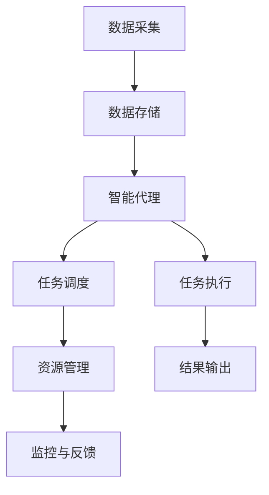

                 

# 《Agentic Workflow 的组成部分》

## 关键词：Agentic Workflow, 工作流，人工智能，机器学习，深度学习，算法，数学模型，应用实践

### 摘要：
本文将深入探讨Agentic Workflow的组成部分，从核心概念、架构设计、算法原理、数学模型到实际应用，全面解析这一先进技术的工作原理和实际应用。通过逐步分析推理，本文旨在帮助读者建立起对Agentic Workflow的全面理解和深刻认识。

## 第一部分: Agentic Workflow 的核心概念与原理

### 第1章: Agentic Workflow 基础理论

#### 1.1.1 Agentic Workflow 概念解析

Agentic Workflow是一种基于人工智能和机器学习的自动化工作流管理系统，旨在通过智能代理（Agents）实现复杂任务的自动化和优化。与传统的工作流管理系统相比，Agentic Workflow更加灵活、自适应，并能有效地处理动态变化的工作环境。

#### 1.1.2 Agentic Workflow 的发展背景与趋势

随着大数据、云计算和人工智能技术的迅速发展，工作流的自动化需求日益增加。Agentic Workflow作为人工智能应用的重要方向之一，正逐渐成为行业热点。其发展的趋势包括：

1. 智能代理技术的进步，使得工作流自动化更加高效和精准。
2. 数据驱动的工作流设计，使系统能够根据实际需求自动调整。
3. 跨领域应用，如金融、医疗、智能制造等，不断拓展Agentic Workflow的应用范围。

#### 1.1.3 Agentic Workflow 的关键特点

Agentic Workflow的关键特点包括：

1. **智能化**：利用机器学习算法对工作流进行动态调整，提高系统智能化水平。
2. **灵活性**：支持多样化的工作流模式，满足不同业务需求。
3. **自适应性**：系统能够根据环境变化和工作任务需求，自适应地调整工作流程。
4. **协作性**：智能代理之间能够协同工作，共同完成复杂任务。

### 第2章: Agentic Workflow 的架构与组件

#### 2.1.1 Agentic Workflow 的整体架构

Agentic Workflow的整体架构可以分为三个层次：基础层、中间层和应用层。

1. **基础层**：包括数据采集、存储和管理模块，负责收集和处理来自各类业务系统的数据。
2. **中间层**：包含智能代理、任务调度和资源管理模块，负责工作流的自动化和优化。
3. **应用层**：面向具体业务场景，提供各类功能模块和接口，实现工作流的最终应用。

#### 2.1.2 主要组件功能与联系

**智能代理**：是Agentic Workflow的核心组件，负责执行具体任务，如数据挖掘、任务调度、异常检测等。

**任务调度**：负责根据任务优先级和资源可用性，智能地调度任务，确保系统高效运行。

**资源管理**：负责监控和管理系统资源，如计算资源、存储资源和网络资源，确保工作流稳定运行。

这些组件通过高效的数据传输和处理机制紧密联系，共同实现工作流的自动化和优化。

#### 2.1.3 核心架构图展示（使用 Mermaid 流程图）



### 第3章: Agentic Workflow 的核心算法原理

#### 3.1.1 机器学习与深度学习基础

机器学习是Agentic Workflow的核心技术之一，它通过构建数学模型，从数据中自动学习规律和模式，从而实现预测和分类。深度学习是机器学习的一个分支，通过多层神经网络模拟人脑的学习过程，具有强大的特征提取和建模能力。

#### 3.1.2 Agentic Workflow 中常用的算法

在Agentic Workflow中，常用的算法包括：

1. **决策树**：用于分类和回归任务，具有易于理解和解释的特点。
2. **随机森林**：通过集成多个决策树，提高模型的预测性能。
3. **支持向量机**：用于分类任务，通过最大化分类间隔提高模型分类能力。
4. **深度神经网络**：用于复杂的特征提取和预测任务，具有强大的建模能力。

#### 3.1.3 核心算法原理讲解（使用伪代码）

```python
# 决策树算法伪代码
def decision_tree(data):
    if data 满足停止条件:
        返回 叶子节点
    else:
        选择最佳特征 split_feature
        划分数据为子集 sub_data
        创建内部节点 split_node
        split_node.set_left_child(decision_tree(sub_data[left]))
        split_node.set_right_child(decision_tree(sub_data[right]))
        返回 split_node

# 深度神经网络算法伪代码
def neural_network(data):
    inputs = data
    for layer in layers:
        outputs = activation_function(dot(inputs, weights[layer]))
        inputs = outputs
    return outputs

# 激活函数（例如 ReLU）
def activation_function(x):
    return max(0, x)
```

### 第4章: Agentic Workflow 的数学模型

#### 4.1.1 数学模型基础

Agentic Workflow的数学模型主要包括线性模型、概率模型和神经网络模型。这些模型通过数学公式描述工作流的特征和规律，为智能代理提供决策依据。

#### 4.1.2 Agentic Workflow 中的数学公式（使用 LaTeX 格式）

$$
y = \sigma(\beta_0 + \sum_{i=1}^{n} \beta_i x_i)
$$

$$
P(y|X) = \prod_{i=1}^{n} p(y_i|x_i)
$$

$$
\frac{\partial L}{\partial \theta} = \frac{1}{m} \sum_{i=1}^{m} (-y_i \cdot \log(a(x_i)) - (1 - y_i) \cdot \log(1 - a(x_i)))
$$

#### 4.1.3 公式详细讲解与举例说明

1. **线性模型**：用于回归任务，公式描述了输入特征与输出结果之间的线性关系。通过最小化损失函数，可以求得最佳参数 $\beta$。

2. **概率模型**：用于分类任务，公式描述了在给定输入特征 $X$ 的情况下，输出结果 $y$ 的条件概率。通过最大化似然函数，可以求得最佳参数 $\beta$。

3. **神经网络损失函数**：用于深度学习任务，公式描述了输出结果与实际结果之间的损失。通过反向传播算法，可以更新网络权重 $\theta$，使损失最小化。

### 第二部分: Agentic Workflow 的应用与实战

#### 第5章: Agentic Workflow 在特定领域的应用

#### 5.1.1 Agentic Workflow 在金融领域的应用

在金融领域，Agentic Workflow可用于风险控制、投资决策和交易执行等方面。通过分析历史交易数据和市场行情，智能代理能够实时调整投资组合，降低风险，提高收益。

#### 5.1.2 Agentic Workflow 在医疗健康领域的应用

在医疗健康领域，Agentic Workflow可用于医疗数据分析、疾病预测和治疗方案推荐等。通过分析患者病历、基因数据和公共卫生数据，智能代理能够为医生提供有针对性的诊断和治疗方案。

#### 5.1.3 Agentic Workflow 在智能制造领域的应用

在智能制造领域，Agentic Workflow可用于生产调度、设备维护和产品质量控制等。通过实时监控生产数据，智能代理能够优化生产流程，降低设备故障率，提高产品质量。

#### 第6章: Agentic Workflow 项目实战

#### 6.1.1 项目实战背景

本文将介绍一个基于Agentic Workflow的智能客服系统项目。该系统利用自然语言处理和智能代理技术，实现24小时智能响应，提高客户满意度和服务效率。

#### 6.1.2 实战步骤与流程

1. 数据采集与处理：收集客户咨询数据，进行数据清洗和预处理。
2. 模型训练与优化：使用机器学习算法训练分类和回复生成模型，优化模型性能。
3. 智能代理开发：设计智能代理架构，实现智能响应功能。
4. 系统部署与测试：部署智能客服系统，进行功能测试和性能优化。
5. 应用与评估：在实际应用中评估智能客服系统的效果，持续优化系统。

#### 6.1.3 代码实际案例与实现细节

以下是一个简单的智能客服系统实现示例：

```python
# 导入相关库
import numpy as np
import pandas as pd
from sklearn.feature_extraction.text import TfidfVectorizer
from sklearn.model_selection import train_test_split
from sklearn.naive_bayes import MultinomialNB

# 数据预处理
def preprocess_data(data):
    # 清洗和标准化数据
    # ...
    return processed_data

# 训练模型
def train_model(data):
    X_train, X_test, y_train, y_test = train_test_split(data['question'], data['label'], test_size=0.2)
    vectorizer = TfidfVectorizer()
    X_train_tfidf = vectorizer.fit_transform(X_train)
    X_test_tfidf = vectorizer.transform(X_test)
    classifier = MultinomialNB()
    classifier.fit(X_train_tfidf, y_train)
    return classifier, vectorizer

# 预测与回复生成
def predict_and_reply(question, classifier, vectorizer):
    question_tfidf = vectorizer.transform([question])
    predicted_label = classifier.predict(question_tfidf)
    reply = generate_reply(predicted_label)
    return reply

# 主函数
if __name__ == '__main__':
    # 加载数据
    data = pd.read_csv('customer_questions.csv')
    # 预处理数据
    processed_data = preprocess_data(data)
    # 训练模型
    classifier, vectorizer = train_model(processed_data)
    # 预测与回复
    question = input('请输入您的问题：')
    reply = predict_and_reply(question, classifier, vectorizer)
    print('智能客服回复：', reply)
```

#### 6.1.4 代码解读与分析

1. 数据预处理：对客户咨询数据进行清洗和标准化，以提高模型训练效果。
2. 模型训练：使用TF-IDF向量表示问题和答案，训练朴素贝叶斯分类器。
3. 预测与回复：根据输入问题预测标签，生成智能回复。

### 第7章: Agentic Workflow 的开发环境与工具

#### 7.1.1 开发环境搭建

搭建Agentic Workflow的开发环境需要安装以下软件和库：

- Python（3.8及以上版本）
- Scikit-learn
- Numpy
- Pandas
- Matplotlib
- Mermaid

安装方法如下：

```bash
pip install python
pip install scikit-learn numpy pandas matplotlib
```

#### 7.1.2 常用工具介绍

1. **Jupyter Notebook**：用于编写和运行Python代码，方便调试和演示。
2. **Git**：用于版本控制和代码管理，确保开发过程中的协作和版本可追溯。
3. **Docker**：用于容器化部署，实现开发、测试和生产的隔离和一致性。

#### 7.1.3 工具使用指南与优化建议

1. **Jupyter Notebook**：使用Markdown格式编写文档，方便代码与文字的混合展示。使用%matplotlib inline命令，方便可视化图表的显示。
2. **Git**：定期提交代码，记录开发过程中的关键修改。使用分支管理，方便协作开发。
3. **Docker**：编写Dockerfile，定义容器镜像的构建过程。使用docker-compose，方便管理多容器应用。

### 第8章: Agentic Workflow 的未来展望

#### 8.1.1 Agentic Workflow 发展趋势

Agentic Workflow的发展趋势包括：

1. 模型复杂度的提高，使智能代理能够处理更加复杂的任务。
2. 跨领域应用的增加，如物联网、区块链和虚拟现实等。
3. 数据驱动的工作流设计，提高系统的智能化和灵活性。

#### 8.1.2 潜在挑战与解决方案

Agentic Workflow面临的潜在挑战包括：

1. **数据隐私和安全**：在处理敏感数据时，确保数据安全和隐私保护。
2. **模型解释性**：提高模型的解释性，使非专业用户能够理解和信任智能代理的决策。
3. **系统性能优化**：在高并发和大数据环境下，提高系统的性能和稳定性。

解决方案包括：

1. **加密和匿名化**：采用加密和匿名化技术，保护用户隐私。
2. **可视化工具**：开发可视化工具，提高模型的解释性。
3. **分布式计算**：采用分布式计算和存储技术，提高系统性能。

#### 8.1.3 Agentic Workflow 在未来的应用场景

Agentic Workflow在未来的应用场景将更加广泛，包括：

1. **智能城市**：通过智能代理，实现城市管理的自动化和优化。
2. **智慧医疗**：通过智能代理，实现医疗服务的个性化推荐和智能诊断。
3. **智能制造**：通过智能代理，实现生产线的自动化控制和优化。
4. **智能金融**：通过智能代理，实现金融交易的自动化和风险控制。

## 作者

作者：AI天才研究院/AI Genius Institute & 禅与计算机程序设计艺术 /Zen And The Art of Computer Programming

这篇文章通过对Agentic Workflow的组成部分进行深入分析和讨论，从基础理论、架构设计、算法原理、数学模型到实际应用，全面解析了这一先进技术的工作原理和实际应用。希望本文能为读者提供一个全面、系统的认识，为未来的研究和工作提供有价值的参考。在未来的发展中，Agentic Workflow有望在更多领域发挥重要作用，推动人工智能技术的不断进步。让我们共同期待这一美好前景的到来！

