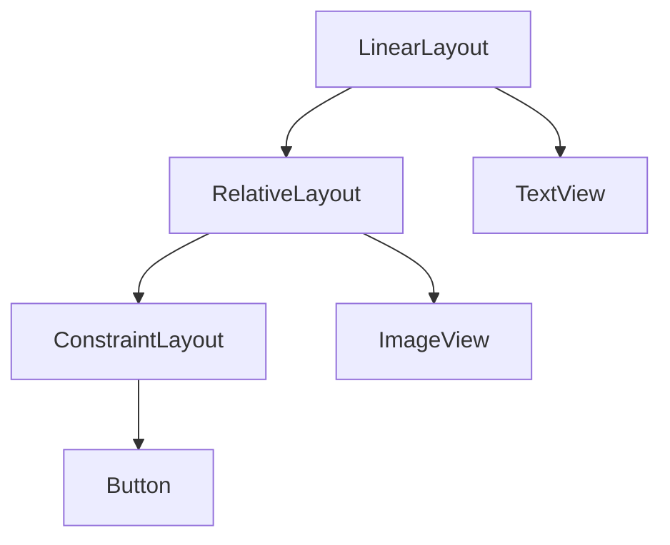
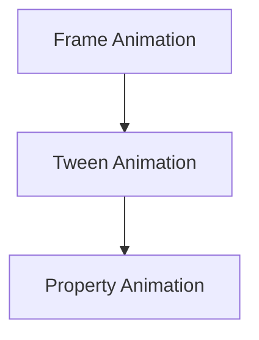
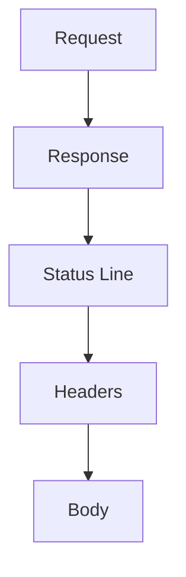
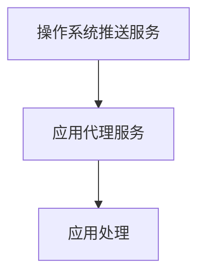

                 

# 《Android开发者的福音：2024字节跳动面试题解答》

## 摘要

随着移动互联网的快速发展，Android应用开发已成为开发者们的重要技能之一。字节跳动作为国内领先的新媒体公司，其面试题往往成为开发者们关注的焦点。本文旨在为广大Android开发者提供2024年字节跳动面试题的详细解答，帮助大家应对面试挑战，提升技能水平。本文将分为三大部分：Android基础篇、Android高级篇以及Android面试题解析，内容涵盖了从Android系统架构到高级性能优化，再到面试题的全方位解析，旨在帮助读者全面掌握Android开发的核心知识。

## 文章关键词

- Android开发
- 字节跳动面试题
- 面试题解析
- 性能优化
- 数据结构与算法

### 第一部分：Android基础篇

#### 第1章：Android平台概述

Android系统作为一个开源的操作系统，已经成为全球最流行的移动操作系统之一。本章节将对Android系统的架构、版本演进以及开发环境搭建进行详细讲解。

##### 1.1 Android系统架构

Android系统架构可以分为四个主要层次：Linux内核层、Android运行时层、应用程序框架层以及应用程序层。下面通过Mermaid流程图来展示这些层次的联系。

```mermaid
graph TD
    A[Linux内核] --> B[Android Runtime(ART)]
    B --> C[Native应用层]
    D[应用层] --> E[Activity] --> F[Service] --> G[BroadcastReceiver] --> H[ContentProvider]
    E --> D
    F --> D
    G --> D
    H --> D
```

##### 1.2 Android版本演进

Android系统自2008年首次发布以来，已经经历了多个版本的演进。每个版本都带来了新的特性和改进。以下是部分Android版本的简要介绍：

| 版本号 | 发布时间 | 主要特性 |
|--------|----------|----------|
| 1.0    | 2008年9月 |           |
| 1.5    | 2009年3月 |           |
| 1.6    | 2009年9月 |           |
| 2.0/2.1| 2010年1月 |           |
| 2.2    | 2010年5月 |           |
| 2.3    | 2010年12月|           |
| 3.0/3.1| 2011年2月 |           |
| 3.2    | 2011年7月 |           |
| 4.0    | 2011年11月|           |
| 4.1/4.2| 2012年7月 |           |
| 4.3    | 2013年6月 |           |
| 4.4    | 2014年3月 |           |
| 5.0    | 2015年11月|           |
| 5.1    | 2015年12月|           |
| 6.0    | 2015年10月|           |
| 7.0    | 2016年8月 |           |
| 7.1    | 2016年12月|           |
| 8.0    | 2017年8月 |           |
| 8.1    | 2018年10月|           |
| 9.0    | 2018年8月 |           |
| 10.0   | 2019年9月 |           |

##### 1.3 Android开发环境搭建

要进行Android开发，首先需要搭建开发环境。以下是搭建Android开发环境的基本步骤：

1. **安装Java Development Kit (JDK)**  
   Android开发需要使用JDK，可以从Oracle官网下载最新版本的JDK，并确保将其添加到系统环境变量中。

2. **下载并安装Android Studio**  
   Android Studio是Google官方推出的Android集成开发环境，提供了丰富的工具和插件，可以极大提高开发效率。可以从Android Studio官网下载并安装。

3. **配置Android SDK**  
   在Android Studio中，需要配置Android SDK，包括SDK Platform和Android SDK Build-Tools。可以通过Android Studio的SDK Manager来下载和管理SDK。

4. **创建新项目**  
   打开Android Studio后，选择“Start a new Android Studio project”，按照向导提示完成项目创建。

### 第2章：Android UI开发基础

Android UI开发是Android应用开发中至关重要的一部分。本章将介绍Android UI的基础知识，包括布局与组件、事件处理与响应以及Android动画。

##### 2.1 Android布局与组件

Android布局定义了应用界面中的视图和组件的排列方式。常见的布局有线性布局（LinearLayout）、相对布局（RelativeLayout）、约束布局（ConstraintLayout）等。



- **LinearLayout**：线性布局将组件按照一行或一列排列。
- **RelativeLayout**：相对布局允许组件相对于其他组件的位置进行布局。
- **ConstraintLayout**：约束布局提供了更加灵活和强大的布局方式，可以定义组件之间的相对位置关系。

##### 2.2 事件处理与响应

在Android应用中，事件处理与响应是用户交互的核心。通过为组件设置监听器，可以实现对用户动作的响应。

```java
// 设置按钮点击事件监听器
Button button = findViewById(R.id.button);
button.setOnClickListener(new View.OnClickListener() {
    @Override
    public void onClick(View v) {
        // 点击按钮时的处理逻辑
    }
});
```

##### 2.3 Android动画

Android动画提供了丰富的动画效果，可以让应用界面更加生动。常见的动画类型有帧动画（Frame Animation）、补间动画（Tween Animation）以及属性动画（Property Animation）。



- **Frame Animation**：通过逐帧展示图片来实现动画效果。
- **Tween Animation**：通过改变组件的属性值来实现动画效果，如透明度、位置、大小等。
- **Property Animation**：通过操作对象的属性来实现动画效果，支持更复杂的动画效果。

### 第3章：Android数据存储

Android应用中的数据存储是保证应用数据持久化和可恢复性的关键。本章将介绍Android中常用的数据存储方式，包括文件存储、SQLite数据库以及SharedPreference。

##### 3.1 文件存储

Android文件存储提供了对文件的读写操作，可以用于存储应用配置文件、用户数据等。

```java
// 存储文件
File file = new File(getFilesDir(), "config.txt");
try {
    FileWriter writer = new FileWriter(file);
    writer.write("config data");
    writer.close();
} catch (IOException e) {
    e.printStackTrace();
}

// 读取文件
try {
    FileReader reader = new FileReader(file);
    BufferedReader bufferedReader = new BufferedReader(reader);
    String line;
    while ((line = bufferedReader.readLine()) != null) {
        // 读取文件内容
    }
    reader.close();
} catch (IOException e) {
    e.printStackTrace();
}
```

##### 3.2 SQLite数据库

SQLite是Android应用中常用的关系型数据库，可以用于存储和管理大量结构化数据。

```java
// 创建SQLite数据库
SQLiteDatabase db = SQLiteDatabase.openOrCreateDatabase(getFilesDir() + "/mydatabase.db", null);

// 创建表
String createTableQuery = "CREATE TABLE IF NOT EXISTS users (id INTEGER PRIMARY KEY AUTOINCREMENT, name TEXT, age INTEGER)";
db.execSQL(createTableQuery);

// 插入数据
ContentValues values = new ContentValues();
values.put("name", "Alice");
values.put("age", 30);
long newRowId = db.insert("users", null, values);

// 查询数据
Cursor cursor = db.query("users", new String[]{"id", "name", "age"}, null, null, null, null, null);
while (cursor.moveToNext()) {
    int id = cursor.getInt(cursor.getColumnIndex("id"));
    String name = cursor.getString(cursor.getColumnIndex("name"));
    int age = cursor.getInt(cursor.getColumnIndex("age"));
    // 处理查询结果
}
cursor.close();

// 更新数据
String updateQuery = "UPDATE users SET age = ? WHERE id = ?";
db.execSQL(updateQuery, new String[]{"35", "1"});

// 删除数据
String deleteQuery = "DELETE FROM users WHERE id = ?";
db.execSQL(deleteQuery, new String[]{"1"});
```

##### 3.3 SharedPreference

SharedPreference是Android提供的一个轻量级存储方式，用于存储简单的键值对数据。

```java
// 存储SharedPreference
SharedPreferences sharedPreferences = getSharedPreferences("my_preferences", Context.MODE_PRIVATE);
SharedPreferences.Editor editor = sharedPreferences.edit();
editor.putString("username", "alice");
editor.putInt("age", 30);
editor.apply();

// 读取SharedPreference
SharedPreferences sharedPreferences = getSharedPreferences("my_preferences", Context.MODE_PRIVATE);
String username = sharedPreferences.getString("username", "");
int age = sharedPreferences.getInt("age", 0);
```

### 第4章：Android网络编程

Android网络编程是开发网络应用的基础。本章将介绍Android中的网络编程基础、Retrofit的使用以及Volley库的详解。

##### 4.1 HTTP协议基础

HTTP（HyperText Transfer Protocol）是一种应用层协议，用于在Web浏览器和服务器之间传输数据。HTTP协议的基本架构包括请求（Request）和响应（Response）两部分。



- **Status Line**：包括HTTP版本、状态码和状态描述。
- **Headers**：包括请求或响应的元数据，如请求类型、内容类型等。
- **Body**：包括请求或响应的正文内容。

##### 4.2 Retrofit使用详解

Retrofit是Square公司开发的一个类型安全的HTTP客户端，可以简化Android中的网络编程。

```java
// Retrofit接口定义
public interface ApiService {
    @GET("users")
    Call<List<User>> getUsers();
}

// Retrofit配置
Retrofit retrofit = new Retrofit.Builder()
        .baseUrl("https://api.example.com/")
        .addConverterFactory(GsonConverterFactory.create())
        .build();

// 创建接口实例
ApiService apiService = retrofit.create(ApiService.class);

// 发起网络请求
Call<List<User>> call = apiService.getUsers();
call.enqueue(new Callback<List<User>>() {
    @Override
    public void onResponse(Call<List<User>> call, Response<List<User>> response) {
        if (response.isSuccessful()) {
            List<User> users = response.body();
            // 处理成功响应
        }
    }

    @Override
    public void onFailure(Call<List<User>> call, Throwable t) {
        // 处理失败响应
    }
});
```

##### 4.3 Volley库详解

Volley是Google开发的一个Android HTTP客户端，可以高效地执行网络请求。

```java
// Volley请求
RequestQueue requestQueue = Volley.newRequestQueue(context);
StringRequest stringRequest = new StringRequest(Request.Method.GET, "https://api.example.com/users",
        new Response.Listener<String>() {
            @Override
            public void onResponse(String response) {
                // 处理成功响应
            }
        }, new Response.ErrorListener() {
    @Override
    public void onErrorResponse(VolleyError error) {
        // 处理失败响应
    }
});

requestQueue.add(stringRequest);
```

### 第二部分：Android高级篇

#### 第5章：Android多线程与性能优化

在Android开发中，多线程编程和性能优化是提高应用响应速度和稳定性的关键。本章将介绍Android多线程机制、线程池与线程安全以及性能优化技巧。

##### 5.1 Android多线程机制

Android多线程机制允许在应用中同时执行多个任务，从而提高应用性能。Android中多线程的实现主要包括以下几种方式：

1. **AsyncTask**：AsyncTask是一个轻量级的异步任务执行类，可以简化异步任务的编写。
2. **Thread**：通过继承Thread类或实现Runnable接口，可以创建自定义的线程。
3. **Handler和Looper**：Handler用于在主线程和其他线程之间传递消息和数据处理。

```java
// AsyncTask示例
public class MyAsyncTask extends AsyncTask<Void, Void, Void> {
    @Override
    protected Void doInBackground(Void... params) {
        // 异步执行的任务
        return null;
    }

    @Override
    protected void onPostExecute(Void result) {
        // 任务执行完成后的处理
    }
}

// Thread示例
public class MyThread extends Thread {
    @Override
    public void run() {
        // 线程执行的代码
    }
}

// Handler示例
public class MyHandler extends Handler {
    @Override
    public void handleMessage(Message msg) {
        // 处理消息
    }
}
```

##### 5.2 线程池与线程安全

线程池是一种线程管理机制，可以重复利用线程，减少线程创建和销毁的开销。Android中的线程池主要包括：

1. **ThreadPoolExecutor**：Java提供的线程池实现，可以通过配置核心线程数、最大线程数、保持时间等参数来控制线程行为。
2. **Executor**：Android提供的一个线程池接口，可以通过实现该接口来创建自定义的线程池。

线程安全是指多线程环境下的数据访问一致性。为了确保线程安全，可以采用以下几种方式：

1. **同步方法**：使用synchronized关键字修饰方法，确保同一时刻只有一个线程可以访问该方法。
2. **ReentrantLock**：Java提供的可重入锁，可以更灵活地控制线程同步。
3. **原子类**：如AtomicInteger、AtomicLong等，提供线程安全的基本类型操作。

```java
// ThreadPoolExecutor示例
ExecutorService executorService = Executors.newFixedThreadPool(10);

// 同步方法示例
public synchronized void synchronizedMethod() {
    // 同步代码
}

// ReentrantLock示例
ReentrantLock lock = new ReentrantLock();
lock.lock();
// 线程安全代码
lock.unlock();

// 原子类示例
AtomicInteger atomicInteger = new AtomicInteger(0);
int value = atomicInteger.getAndIncrement();
```

##### 5.3 性能优化技巧

性能优化是Android开发中的重要环节，可以提高应用的流畅度和用户体验。以下是一些常见的性能优化技巧：

1. **避免主线程阻塞**：尽量避免在主线程中进行耗时的操作，可以使用异步任务、线程池等方式来提高主线程的响应速度。
2. **优化布局性能**：避免使用过多的嵌套布局，减少布局的视图层级，可以提高布局的绘制效率。
3. **使用图片缓存**：使用图片缓存可以避免重复加载图片，减少内存消耗和加载时间。
4. **内存泄漏检测**：使用Android Studio的内存分析工具来检测内存泄漏，及时修复内存泄漏问题。

```java
// 避免主线程阻塞示例
new AsyncTask<Void, Void, Void>() {
    @Override
    protected Void doInBackground(Void... params) {
        // 异步执行的任务
        return null;
    }

    @Override
    protected void onPostExecute(Void result) {
        // 更新UI
    }
}.execute();

// 优化布局性能示例
<LinearLayout
    android:layout_width="match_parent"
    android:layout_height="wrap_content"
    android:orientation="vertical">

    <TextView
        android:layout_width="wrap_content"
        android:layout_height="wrap_content"
        android:text="Hello World!" />

    <ImageView
        android:layout_width="wrap_content"
        android:layout_height="wrap_content"
        android:src="@drawable/icon" />

</LinearLayout>

// 使用图片缓存示例
LruCache<String, Bitmap> cache = new LruCache<>(maxSize);
Bitmap bitmap = cache.get(imageUrl);
if (bitmap == null) {
    bitmap = BitmapFactory.decodeResource(getResources(), R.drawable.icon);
    cache.put(imageUrl, bitmap);
}

// 内存泄漏检测示例
RunalyzeManager analyzeManager = new RunalyzeManager();
// 在适当的时候释放资源
analyzeManager.release();
```

### 第6章：Android权限管理与位置服务

Android权限管理是保障用户隐私和数据安全的重要机制。位置服务则是许多Android应用的核心功能之一。本章将介绍Android权限管理基础、运行时权限管理以及位置服务的实现。

##### 6.1 权限管理基础

Android权限管理分为声明权限和运行时权限两种方式。声明权限是在AndroidManifest.xml文件中声明的权限，而运行时权限是在应用运行时请求的权限。

```xml
<!-- 声明权限 -->
<uses-permission android:name="android.permission.INTERNET" />
<uses-permission android:name="android.permission.READ_EXTERNAL_STORAGE" />
<uses-permission android:name="android.permission.WRITE_EXTERNAL_STORAGE" />
```

运行时权限需要在代码中动态请求，并在用户授权后才能访问相应的功能。

```java
// 请求运行时权限
if (ContextCompat.checkSelfPermission(this, Manifest.permission.INTERNET) != PackageManager.PERMISSION_GRANTED) {
    ActivityCompat.requestPermissions(this, new String[]{Manifest.permission.INTERNET}, requestCode);
}
```

##### 6.2 运行时权限管理

运行时权限管理是Android 6.0（API级别23）引入的一个重要特性。开发者需要在使用敏感权限时，通过运行时权限请求来获取用户授权。

```java
// 请求运行时权限
if (ContextCompat.checkSelfPermission(this, Manifest.permission.READ_EXTERNAL_STORAGE) != PackageManager.PERMISSION_GRANTED) {
    ActivityCompat.requestPermissions(this, new String[]{Manifest.permission.READ_EXTERNAL_STORAGE}, requestCode);
}

// 处理权限请求结果
@Override
public void onRequestPermissionsResult(int requestCode, @NonNull String[] permissions, @NonNull int[] grantResults) {
    if (requestCode == requestCode) {
        if (grantResults.length > 0 && grantResults[0] == PackageManager.PERMISSION_GRANTED) {
            // 权限授权成功，执行相关操作
        } else {
            // 权限授权失败，提示用户或提供解释
        }
    }
}
```

##### 6.3 位置服务实现

Android位置服务（Location Services）提供了访问设备位置的API，可以用于实现地图导航、位置共享等功能。

```java
// 初始化LocationManager
LocationManager locationManager = (LocationManager) getSystemService(Context.LOCATION_SERVICE);

// 注册位置监听器
LocationListener locationListener = new LocationListener() {
    @Override
    public void onLocationChanged(Location location) {
        // 更新位置信息
    }

    @Override
    public void onStatusChanged(String provider, int status, Bundle extras) {
        // 处理位置状态变化
    }

    @Override
    public void onProviderEnabled(String provider) {
        // 处理位置提供者启用
    }

    @Override
    public void onProviderDisabled(String provider) {
        // 处理位置提供者禁用
    }
};

locationManager.requestLocationUpdates(LocationManager.GPS_PROVIDER, 0, 0, locationListener);
```

### 第7章：Android推送通知与消息处理

推送通知是Android应用与用户保持实时联系的重要方式。本章将介绍推送通知的原理、Firebase推送通知以及自定义推送通知。

##### 7.1 推送通知原理

推送通知是操作系统层提供的一种消息传递机制，可以实现在后台运行的应用中接收消息。推送通知的原理包括以下几个方面：

1. **推送服务**：操作系统提供的推送服务，负责将消息发送到设备。
2. **应用代理**：应用的代理服务，负责接收推送消息并将消息传递给应用。
3. **应用处理**：应用处理推送消息，并响应用户操作。



##### 7.2 Firebase推送通知

Firebase推送通知是一种基于云的推送通知服务，可以轻松地实现推送通知功能。

```java
// 初始化FirebaseMessaging
FirebaseMessaging.getInstance().subscribeToTopic("myTopic");

// 发送推送通知
FirebaseMessaging.getInstance().sendRemoteMessage(new RemoteMessage.Builder("https://mydomain.com/notifications")
        .setMessageId("message_id")
        .addData("title", "Notification Title")
        .addData("body", "Notification Body")
        .build());
```

##### 7.3 自定义推送通知

自定义推送通知可以通过实现自己的推送服务来实现。以下是一个简单的推送通知实现示例：

```java
// 初始化推送服务
PushService pushService = new PushService("my_app_id");

// 注册设备令牌
pushService.registerToken(deviceToken);

// 发送推送通知
pushService.sendNotification("Notification Title", "Notification Body", "my_topic");
```

### 第三部分：Android面试题解析

#### 第8章：数据结构与算法面试题

数据结构与算法是Android面试中常见的高频考点。本章将介绍常见的数据结构、算法以及算法面试题的解析。

##### 8.1 常见数据结构

Android开发中常用的数据结构包括线性表、树、图等。

- **线性表**：线性表是最基本的数据结构，包括数组、链表等。以下是一个链表的实现示例：

  ```java
  public class LinkedList {
      private Node head;

      private static class Node {
          int value;
          Node next;

          Node(int value, Node next) {
              this.value = value;
              this.next = next;
          }
      }

      public void add(int value) {
          Node newNode = new Node(value, head);
          head = newNode;
      }

      public int get(int index) {
          Node current = head;
          int count = 0;

          while (current != null) {
              if (count == index) {
                  return current.value;
              }
              count++;
              current = current.next;
          }

          return -1;
      }
  }
  ```

- **树**：树是一种层次结构，包括二叉树、堆等。以下是一个二叉树的实现示例：

  ```java
  public class BinaryTree {
      private Node root;

      private static class Node {
          int value;
          Node left;
          Node right;

          Node(int value) {
              this.value = value;
          }
      }

      public void insert(int value) {
          root = insert(root, value);
      }

      private Node insert(Node node, int value) {
          if (node == null) {
              return new Node(value);
          }

          if (value < node.value) {
              node.left = insert(node.left, value);
          } else if (value > node.value) {
              node.right = insert(node.right, value);
          }

          return node;
      }
  }
  ```

- **图**：图是一种由节点和边组成的数据结构，包括邻接矩阵和邻接表等。以下是一个邻接矩阵的实现示例：

  ```java
  public class Graph {
      private int[][] matrix;

      public Graph(int size) {
          matrix = new int[size][size];
      }

      public void addEdge(int from, int to) {
          matrix[from][to] = 1;
          matrix[to][from] = 1;
      }

      public boolean isEdge(int from, int to) {
          return matrix[from][to] == 1;
      }
  }
  ```

##### 8.2 常见算法

Android面试中常见的算法包括排序、查找、动态规划等。

- **排序算法**：排序算法用于对数据进行排序，常见的排序算法有冒泡排序、选择排序、插入排序等。以下是一个冒泡排序的实现示例：

  ```java
  public class BubbleSort {
      public static void sort(int[] arr) {
          int n = arr.length;
          for (int i = 0; i < n - 1; i++) {
              for (int j = 0; j < n - i - 1; j++) {
                  if (arr[j] > arr[j + 1]) {
                      int temp = arr[j];
                      arr[j] = arr[j + 1];
                      arr[j + 1] = temp;
                  }
              }
          }
      }
  }
  ```

- **查找算法**：查找算法用于在数据结构中查找特定的元素，常见的查找算法有二分查找、线性查找等。以下是一个二分查找的实现示例：

  ```java
  public class BinarySearch {
      public static int search(int[] arr, int target) {
          int left = 0;
          int right = arr.length - 1;

          while (left <= right) {
              int mid = left + (right - left) / 2;

              if (arr[mid] == target) {
                  return mid;
              } else if (arr[mid] < target) {
                  left = mid + 1;
              } else {
                  right = mid - 1;
              }
          }

          return -1;
      }
  }
  ```

- **动态规划**：动态规划是一种优化递归算法的方法，通过将子问题的解存储在数组中，避免重复计算。以下是一个经典的最长递增子序列的实现示例：

  ```java
  public class LongestIncreasingSubsequence {
      public static int length(int[] arr) {
          int[] dp = new int[arr.length];
          int length = 0;

          for (int i = 0; i < arr.length; i++) {
              dp[i] = 1;

              for (int j = 0; j < i; j++) {
                  if (arr[j] < arr[i]) {
                      dp[i] = Math.max(dp[i], dp[j] + 1);
                      length = Math.max(length, dp[i]);
                  }
              }
          }

          return length;
      }
  }
  ```

##### 8.3 算法面试题解析

算法面试题是Android面试中的重要组成部分，以下是一些常见的算法面试题及其解析：

- **题目1**：实现一个函数，计算两个数字的和，不使用加法运算符。

  **解析**：可以使用位运算来实现加法运算。具体方法如下：

  ```java
  public int add(int a, int b) {
      while (b != 0) {
          int carry = a & b;
          a = a ^ b;
          b = carry << 1;
      }
      return a;
  }
  ```

- **题目2**：实现一个函数，判断一个整数是否是回文数。

  **解析**：可以将整数反转，然后与原整数比较。具体方法如下：

  ```java
  public boolean isPalindrome(int x) {
      if (x < 0 || (x % 10 == 0 && x != 0)) {
          return false;
      }

      int reversed = 0;
      while (x > reversed) {
          reversed = reversed * 10 + x % 10;
          x = x / 10;
      }

      return x == reversed || x == reversed / 10;
  }
  ```

- **题目3**：实现一个函数，找出数组中的下一个更大的元素。

  **解析**：可以使用栈来实现。具体方法如下：

  ```java
  public int nextGreaterElement(int[] nums1, int[] nums2) {
      Stack<Integer> stack = new Stack<>();
      Map<Integer, Integer> map = new HashMap<>();

      for (int num : nums2) {
          while (!stack.isEmpty() && stack.peek() < num) {
              map.put(stack.pop(), num);
          }
          stack.push(num);
      }

      for (int i = 0; i < nums1.length; i++) {
          nums1[i] = map.getOrDefault(nums1[i], -1);
      }

      return 0;
  }
  ```

### 第9章：Android基础面试题

Android基础面试题是Android面试中的核心内容。本章将介绍Android系统启动过程、Activity生命周期以及Android基础面试题的解析。

##### 9.1 Android系统启动过程

Android系统启动过程主要包括以下几个步骤：

1. **Bootloader启动**：Bootloader是加载Android操作系统的第一个软件，主要负责硬件初始化和引导操作系统的启动。
2. **内核启动**：内核负责管理硬件资源，包括内存管理、进程管理、文件系统等。
3. **系统启动**：系统启动过程中，会初始化各种系统服务，如设备管理器、输入管理器、图形显示管理器等。
4. **Launcher启动**：Launcher是Android系统的主屏幕应用，负责显示桌面图标和应用菜单。

##### 9.2 Activity生命周期

Activity是Android应用中的主要界面组件，其生命周期包括以下几个状态：

1. ** onCreate()**：Activity创建时调用，初始化界面和组件。
2. ** onStart()**：Activity开始可见时调用。
3. ** onRestart()**：Activity重新启动时调用。
4. ** onResume()**：Activity成为前台可见时调用。
5. ** onPause()**：Activity即将失去焦点时调用。
6. ** onStop()**：Activity不可见时调用。
7. ** onDestroy()**：Activity销毁时调用，释放资源。

```java
public class MainActivity extends AppCompatActivity {
    @Override
    protected void onCreate(Bundle savedInstanceState) {
        super.onCreate(savedInstanceState);
        setContentView(R.layout.activity_main);
        // 初始化界面和组件
    }

    @Override
    protected void onStart() {
        super.onStart();
        // Activity开始可见
    }

    @Override
    protected void onRestart() {
        super.onRestart();
        // Activity重新启动
    }

    @Override
    protected void onResume() {
        super.onResume();
        // Activity成为前台可见
    }

    @Override
    protected void onPause() {
        super.onPause();
        // Activity即将失去焦点
    }

    @Override
    protected void onStop() {
        super.onStop();
        // Activity不可见
    }

    @Override
    protected void onDestroy() {
        super.onDestroy();
        // Activity销毁
    }
}
```

##### 9.3 Android基础面试题解析

以下是一些常见的Android基础面试题及其解析：

- **题目1**：请简要描述Activity的生命周期。

  **解析**：Activity的生命周期包括 onCreate()、onStart()、onRestart()、onResume()、onPause()、onStop()和onDestroy()七个状态。每个状态都有相应的回调方法，用于处理Activity的生命周期事件。

- **题目2**：什么是Intent？请简要描述Intent的作用和用法。

  **解析**：Intent是一个用于描述应用间交互的意图的类。Intent的作用是启动组件、传递数据和请求操作。Intent的用法包括：

  ```java
  // 启动Activity
  Intent intent = new Intent(this, SecondActivity.class);
  startActivity(intent);

  // 发送广播
  Intent broadcastIntent = new Intent("my_custom_action");
  sendBroadcast(broadcastIntent);

  // 启动服务
  Intent serviceIntent = new Intent(this, MyService.class);
  startService(serviceIntent);
  ```

- **题目3**：请简要描述Android中的布局参数。

  **解析**：Android中的布局参数包括宽高、对齐方式、边距等。布局参数可以通过布局文件中的属性来设置，例如：

  ```xml
  <TextView
      android:layout_width="wrap_content"
      android:layout_height="wrap_content"
      android:layout_margin="16dp"
      android:gravity="center"
      android:text="Hello World!" />
  ```

### 第10章：Android性能优化面试题

Android性能优化是面试中的重要考点。本章将介绍性能优化的原理、常见性能问题的分析以及性能优化面试题的解析。

##### 10.1 性能优化原理

Android性能优化主要包括以下几个方面：

1. **CPU优化**：包括减少CPU密集型操作、优化代码结构等。
2. **内存优化**：包括减少内存分配、释放内存、优化数据结构等。
3. **I/O优化**：包括减少I/O操作、优化文件读写等。
4. **网络优化**：包括优化网络请求、减少数据传输等。
5. **界面优化**：包括优化布局结构、减少界面绘制等。

##### 10.2 常见性能问题分析

常见的Android性能问题包括：

1. **内存泄漏**：内存泄漏是指内存中的对象无法被垃圾回收器回收，导致内存占用不断增加。
2. **内存溢出**：内存溢出是指程序在运行过程中消耗的内存超过系统分配的最大内存，导致程序崩溃。
3. **CPU占用过高**：CPU占用过高是指程序在运行过程中消耗过多的CPU资源，导致系统响应速度变慢。
4. **I/O阻塞**：I/O阻塞是指程序在执行I/O操作时长时间等待，导致程序响应变慢。

##### 10.3 性能优化面试题解析

以下是一些常见的Android性能优化面试题及其解析：

- **题目1**：请简要描述内存泄漏的原因和解决方法。

  **解析**：内存泄漏的原因包括：

  1. 长生命周期对象持有短生命周期对象。
  2. 使用静态变量持有对象。
  3. 线程没有正确地停止。

  解决方法包括：

  1. 避免长生命周期对象持有短生命周期对象。
  2. 使用弱引用或软引用来持有对象。
  3. 正确地停止线程。

- **题目2**：请简要描述内存溢出的原因和解决方法。

  **解析**：内存溢出的原因包括：

  1. 过多的对象实例化。
  2. 大对象占用过多内存。
  3. 内存泄露。

  解决方法包括：

  1. 优化对象实例化，避免创建大量临时对象。
  2. 使用内存缓存，避免大对象占用过多内存。
  3. 优化代码，避免内存泄漏。

- **题目3**：请简要描述CPU优化的方法。

  **解析**：CPU优化的方法包括：

  1. 避免在主线程中进行耗时的操作。
  2. 优化代码结构，减少循环和递归。
  3. 使用多线程和异步操作。
  4. 使用高效的算法和数据结构。

### 附录：Android开发资源与工具推荐

为了帮助Android开发者更好地进行开发和学习，本章将推荐一些Android开发资源与工具。

##### 附录 A：Android开发资源推荐

1. **官方文档**：Android官方文档提供了丰富的开发指南和API文档，是Android开发的权威资料。
2. **GitHub**：GitHub是Android开发的重要资源库，可以找到各种开源项目、代码示例和技术文档。
3. **Android开发者社区**：Android开发者社区是Android开发者交流和学习的平台，可以获取最新的开发动态和技术分享。

##### 附录 B：Android开发工具推荐

1. **Android Studio**：Android Studio是Google推出的官方Android开发工具，提供了丰富的功能和插件，是Android开发的必备工具。
2. **Android Debug Bridge (ADB)**：ADB是Android平台的命令行工具，用于与模拟器和设备进行交互，进行调试和测试。
3. **Android模拟器**：Android模拟器可以用于测试和运行Android应用，常用的模拟器包括Genymotion、Android Emulator等。

##### 附录 C：常用第三方库与框架

1. **Retrofit**：Retrofit是一个类型安全的HTTP客户端，用于简化网络编程。
2. **OkHttp**：OkHttp是一个高效的HTTP客户端库，提供了丰富的功能，如请求缓存、网络连接等。
3. **Gson**：Gson是Google开发的一个JSON解析库，用于将JSON数据转换为Java对象，或将Java对象转换为JSON字符串。

### 作者信息

本文由AI天才研究院（AI Genius Institute）与《禅与计算机程序设计艺术》（Zen And The Art of Computer Programming）作者撰写。AI天才研究院致力于推动人工智能技术的发展和应用，而《禅与计算机程序设计艺术》则是一部经典的技术著作，深入探讨了计算机编程的艺术和哲学。

本文旨在帮助Android开发者应对2024年字节跳动面试挑战，全面提升开发技能。通过本文的详细解析，开发者可以更好地掌握Android开发的核心知识，为未来的职业发展奠定坚实基础。希望本文对读者有所帮助，祝大家面试顺利，技术精进！


