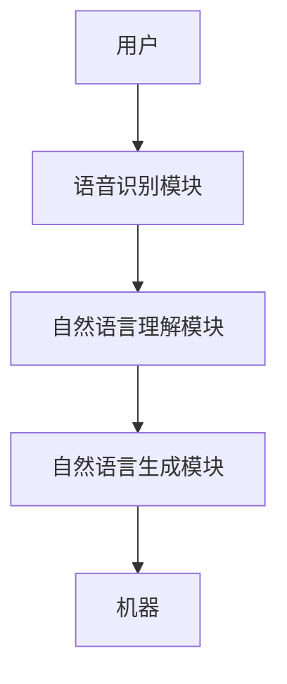

                 

# 《CUI的理论实现能力解析》

## 关键词
CUI, 对话用户界面, 语音识别, 自然语言处理, 自然语言生成

## 摘要
本文深入解析了CUI（Conversational User Interface，对话用户界面）的理论实现能力，涵盖了CUI的定义、组成部分、关键技术和数学模型。通过具体的算法原理讲解、项目实战案例分析以及性能优化与评估方法，本文全面阐述了CUI在智能客服、智能家居和医疗健康等领域的应用，探讨了其未来发展趋势与挑战。

### 目录

#### 第一部分: CUI概述与原理

1. **第1章: CUI基础概念**
    1.1 CUI的定义与作用
    1.2 CUI的组成部分与架构
    1.3 CUI的关键技术

2. **第2章: CUI的数学模型**
    2.1 常见数学模型
    2.2 数学模型解析

3. **第3章: CUI核心算法原理**
    3.1 语音识别算法
    3.2 自然语言理解算法
    3.3 自然语言生成算法

#### 第二部分: CUI的实际应用

4. **第4章: CUI在特定领域的应用**
    4.1 智能客服
    4.2 智能家居
    4.3 智能医疗

5. **第5章: CUI项目的开发与实现**
    5.1 开发环境搭建
    5.2 代码实现
    5.3 代码解读与分析

6. **第6章: CUI性能优化与评估**
    6.1 性能优化策略
    6.2 性能评估方法
    6.3 性能评估案例分析

#### 第三部分: 未来发展趋势与挑战

7. **第7章: 未来发展趋势与挑战**
    7.1 发展趋势
    7.2 挑战与应对策略

#### 案例研究

8. **第8章: 案例研究**
    8.1 案例一：某大型电商平台智能客服系统
    8.2 案例二：智能家居语音控制系统
    8.3 案例三：医疗健康领域语音助手

#### 附录

9. **附录**
    9.1 开源工具与框架
    9.2 学术研究资源
    9.3 行业报告与资讯
    9.4 教程与书籍
    9.5 社区与论坛

### 第一部分: CUI概述与原理

#### 第1章: CUI基础概念

### 1.1 CUI的定义与作用

CUI（Conversational User Interface，对话用户界面）是一种与用户进行自然语言交互的界面技术。它通过语音识别、自然语言理解和自然语言生成等技术，实现人与机器的实时对话。CUI的作用包括提高用户满意度、降低开发成本和拓宽应用场景。

#### 1.2 CUI的组成部分与架构

CUI主要由三个部分组成：语音识别模块、自然语言理解模块和自然语言生成模块。以下是CUI的架构图：



#### 1.2.1 语音识别模块

语音识别模块负责将用户的语音信号转换为文本。其核心技术包括声学模型和语言模型。

1. **声学模型**：用于将语音信号映射到声学特征。
2. **语言模型**：用于将声学特征映射到文本。

#### 1.2.2 自然语言理解模块

自然语言理解模块负责理解用户的意图和需求。其核心算法包括词嵌入技术、序列标注算法和依存句法分析算法。

1. **词嵌入技术**：将词汇映射到高维空间，以便进行计算。
2. **序列标注算法**：用于识别文本中的实体和关系。
3. **依存句法分析**：用于理解句子中的语法结构。

#### 1.2.3 自然语言生成模块

自然语言生成模块负责生成回复文本。其核心算法包括生成式文本生成、判别式文本生成和上下文无关文法生成。

1. **生成式文本生成**：根据输入的意图和实体，生成具有多样性的文本。
2. **判别式文本生成**：根据输入的意图和实体，生成符合预期的文本。
3. **上下文无关文法生成**：根据上下文信息，生成合适的文本。

### 1.3 CUI的关键技术

CUI的关键技术包括语音识别技术、自然语言处理技术和语音合成技术。

#### 1.3.1 语音识别技术

语音识别技术主要包括以下几种：

1. **GMM模型（高斯混合模型）**：用于建模声学特征。
2. **HMM模型（隐马尔可夫模型）**：用于建模语音信号的时序特征。
3. **DNN模型（深度神经网络）**：用于提高语音识别的准确性。

#### 1.3.2 自然语言处理技术

自然语言处理技术主要包括以下几种：

1. **词嵌入技术**：用于将词汇映射到高维空间。
2. **序列标注算法**：用于识别文本中的实体和关系。
3. **依存句法分析**：用于理解句子中的语法结构。

#### 1.3.3 语音合成技术

语音合成技术主要包括以下几种：

1. **拼接式语音合成**：通过拼接预录制的语音片段生成合成语音。
2. **参数化语音合成**：通过控制声学参数生成合成语音。
3. **端到端语音合成**：通过神经网络直接将文本转换为语音。

### 1.4 CUI在特定领域的应用

CUI在多个领域有广泛应用，以下列举几个典型应用场景：

1. **智能客服**：通过CUI技术，实现自动化的客户服务，提高响应速度和满意度。
2. **智能家居**：通过CUI技术，实现用户与家居设备的自然交互，提高生活便利性。
3. **智能医疗**：通过CUI技术，实现患者与医生的远程互动，提高医疗服务效率。

### 1.5 CUI的发展趋势与挑战

随着人工智能技术的不断发展，CUI的应用场景将更加广泛，技术也将更加成熟。但同时也面临以下挑战：

1. **准确性**：如何提高语音识别和自然语言处理的准确性，以满足用户需求。
2. **个性化**：如何根据用户的个性化需求，提供更加精准的服务。
3. **隐私保护**：如何保护用户的隐私，防止数据泄露。

### 1.6 小结

本章介绍了CUI的基本概念、组成部分、关键技术和应用场景，为后续章节的学习奠定了基础。在后续章节中，我们将详细探讨CUI的数学模型、核心算法原理以及在特定领域的应用。通过本文的阅读，读者将能够全面了解CUI的理论实现能力，为实际应用打下坚实的基础。

### 第2章: CUI的数学模型

### 2.1 常见数学模型

在CUI中，常见的数学模型包括高斯混合模型（GMM）、隐马尔可夫模型（HMM）和深度神经网络（DNN）。这些模型在语音识别、自然语言处理和语音合成等领域发挥着重要作用。

#### 2.1.1 GMM模型

高斯混合模型（GMM）是一种概率模型，用于表示多模态数据的分布。在语音识别中，GMM用于建模声学特征的概率分布。其数学公式如下：

$$
p(x|\theta) = \sum_{i=1}^C \pi_i \mathcal{N}(x|\mu_i, \Sigma_i)
$$

其中，$x$ 表示观测数据，$\theta$ 表示模型参数，$C$ 表示混合成分数，$\pi_i$ 表示第 $i$ 个成分的先验概率，$\mu_i$ 和 $\Sigma_i$ 分别表示第 $i$ 个成分的均值和协方差矩阵。

#### 2.1.2 HMM模型

隐马尔可夫模型（HMM）是一种用于时序数据的概率模型，常用于语音识别和语音合成。HMM模型由状态转移概率、观察概率和初始状态分布组成。其数学公式如下：

$$
P(X=x|\lambda) = \sum_{i} \pi_i \prod_{t=1}^T a_{ij_t} b_{j_t}(x_t|\lambda)
$$

其中，$X$ 表示观测序列，$x$ 表示观测序列中的具体值，$\lambda$ 表示模型参数，$\pi_i$ 表示初始状态概率，$a_{ij_t}$ 表示状态转移概率，$b_{j_t}(x_t|\lambda)$ 表示观察概率。

#### 2.1.3 DNN模型

深度神经网络（DNN）是一种多层神经网络，通过逐层提取特征，实现对复杂数据的建模。在语音识别和自然语言处理中，DNN广泛应用于声学模型和语言模型。其基本结构包括输入层、隐藏层和输出层。其数学公式如下：

$$
\hat{y} = \sigma(W_L \cdot \sigma(...\sigma(W_2 \cdot \sigma(W_1 \cdot x + b_1) + b_2)... + b_L))
$$

其中，$x$ 表示输入数据，$W$ 和 $b$ 分别表示权重和偏置，$\sigma$ 表示激活函数，$\hat{y}$ 表示输出结果。

### 2.2 数学模型解析

在本章节中，我们将对上述提到的数学模型进行详细解析，以便读者更好地理解其原理和应用。

#### 2.2.1 GMM模型详细解析

高斯混合模型（GMM）是一种常用的概率模型，用于表示多模态数据的分布。在语音识别中，GMM用于建模声学特征的概率分布。

1. **建模过程**：
   GMM通过多个高斯分布来表示数据分布，每个高斯分布对应一个混合成分。在训练过程中，模型需要估计每个混合成分的参数，包括先验概率、均值和协方差矩阵。

2. **参数估计**：
   常用的参数估计方法包括最大化似然估计（MLE）和期望最大化（EM）算法。MLE方法通过最大化数据似然函数来估计参数，EM算法通过迭代优化似然函数来估计参数。

3. **应用场景**：
   GMM在语音识别中用于建模声学特征的概率分布，有助于提高识别准确性。

#### 2.2.2 HMM模型详细解析

隐马尔可夫模型（HMM）是一种用于时序数据的概率模型，常用于语音识别和语音合成。HMM模型由状态转移概率、观察概率和初始状态分布组成。

1. **状态转移概率**：
   状态转移概率描述了系统在不同状态之间的转移情况。在语音识别中，状态转移概率用于建模语音信号在不同时间点的状态变化。

2. **观察概率**：
   观察概率描述了系统在特定状态下的观测结果。在语音识别中，观察概率用于建模语音信号的特征。

3. **初始状态分布**：
   初始状态分布描述了系统在开始时的状态分布。在语音识别中，初始状态分布用于初始化解码过程。

4. **应用场景**：
   HMM在语音识别中用于建模语音信号的时序特征，有助于提高识别准确性。

#### 2.2.3 DNN模型详细解析

深度神经网络（DNN）是一种多层神经网络，通过逐层提取特征，实现对复杂数据的建模。在语音识别和自然语言处理中，DNN广泛应用于声学模型和语言模型。

1. **多层感知机（MLP）**：
   多层感知机是DNN的基础单元，通过多层非线性变换，将输入数据映射到输出空间。

2. **卷积神经网络（CNN）**：
   卷积神经网络通过卷积操作，能够自动提取输入数据的局部特征，适用于图像和语音处理。

3. **循环神经网络（RNN）**：
   循环神经网络通过循环机制，能够处理时序数据，适用于语音识别和自然语言处理。

4. **应用场景**：
   DNN在语音识别和自然语言处理中，通过逐层提取特征，有助于提高模型准确性和鲁棒性。

### 2.3 大规模预训练模型原理

随着人工智能技术的发展，大规模预训练模型（如BERT、GPT等）在自然语言处理领域取得了显著的成果。大规模预训练模型的核心思想是在大规模数据集上进行预训练，然后微调到具体任务上，以提高模型的性能。

1. **预训练目标**：
   预训练模型的目标是在大规模数据集上学习语言知识，包括词嵌入、语法规则、语义关系等。

2. **预训练方法**：
   常见的预训练方法包括自监督学习、迁移学习和微调。自监督学习通过预训练数据集中的未标注信息，迁移学习通过在预训练模型的基础上进行任务特定的训练，微调通过在特定任务上进行进一步训练。

3. **应用场景**：
   大规模预训练模型在自然语言处理任务中，如文本分类、问答系统、机器翻译等，取得了显著的性能提升。

### 2.4 小结

本章介绍了CUI中常见的数学模型，包括高斯混合模型（GMM）、隐马尔可夫模型（HMM）和深度神经网络（DNN）。通过对这些模型的详细解析，读者可以更好地理解CUI的数学原理和应用。在后续章节中，我们将继续探讨CUI的核心算法原理以及实际应用。

### 第3章: CUI核心算法原理

CUI（Conversational User Interface，对话用户界面）的核心算法主要包括语音识别、自然语言理解和自然语言生成。这些算法共同作用，使得机器能够准确理解用户输入，并生成合适的响应。

#### 3.1 语音识别算法

语音识别（Automatic Speech Recognition，ASR）是CUI系统的第一步，其核心任务是将用户的语音信号转换为文本。语音识别算法主要包括以下几个部分：

##### 3.1.1 声学模型（Acoustic Model）

声学模型用于将语音信号转换为声学特征。这些特征通常包括梅尔频率倒谱系数（MFCCs）、滤波器组（Filter Banks）和频谱特征等。声学模型通常采用高斯混合模型（Gaussian Mixture Model，GMM）、隐马尔可夫模型（Hidden Markov Model，HMM）或深度神经网络（Deep Neural Network，DNN）。

**声学模型伪代码：**

```python
# 初始化声学模型参数
initialize_acoustic_model_parameters()

# 输入语音信号
audio_signal = load_audio_signal()

# 提取声学特征
acoustic_features = extract_acoustic_features(audio_signal)

# 声学特征建模
acoustic_model = build_acoustic_model(acoustic_features)
```

##### 3.1.2 语言模型（Language Model）

语言模型用于将声学特征映射到文本。语言模型通常采用N-gram模型、隐马尔可夫模型（HMM）或深度神经网络（DNN）。语言模型可以帮助识别不同声学特征序列的可能性。

**语言模型伪代码：**

```python
# 初始化语言模型参数
initialize_language_model_parameters()

# 输入声学特征
acoustic_features = load_acoustic_features()

# 语言特征建模
language_model = build_language_model(acoustic_features)

# 预测文本
predicted_text = language_model.predict(acoustic_features)
```

##### 3.1.3 规格化网络（Hybrid Network）

规格化网络结合声学模型和语言模型，以实现更准确的语音识别。规格化网络通常采用DNN-HMM或DNN-CTM（Connectionist Temporal Classification）架构。

**规格化网络伪代码：**

```python
# 初始化规格化网络参数
initialize_hybrid_network_parameters()

# 输入语音信号
audio_signal = load_audio_signal()

# 提取声学特征
acoustic_features = extract_acoustic_features(audio_signal)

# 训练规格化网络
hybrid_network = train_hybrid_network(acoustic_features)

# 识别语音
predicted_text = hybrid_network.recognize(acoustic_features)
```

#### 3.2 自然语言理解算法

自然语言理解（Natural Language Understanding，NLU）是CUI系统的核心，其任务是从文本中提取语义信息，包括意图识别、实体识别和关系提取等。

##### 3.2.1 词嵌入（Word Embedding）

词嵌入是将词汇映射到高维空间的过程，以捕捉词汇之间的语义关系。常用的词嵌入方法包括Word2Vec、GloVe和BERT等。

**词嵌入伪代码：**

```python
# 初始化词嵌入模型参数
initialize_word_embedding_model()

# 输入词汇
words = ["hello", "world"]

# 提取词嵌入向量
word_vectors = word_embedding_model.extract_embeddings(words)

# 打印词嵌入向量
print(word_vectors)
```

##### 3.2.2 序列标注（Sequence Labeling）

序列标注是将输入序列中的词汇标注为特定类别的过程，常用于命名实体识别、情感分析和意图识别等。

**序列标注伪代码：**

```python
# 初始化序列标注模型参数
initialize_sequence_labeling_model()

# 输入文本
text = "The quick brown fox jumps over the lazy dog"

# 标注文本
labeled_text = sequence_labeling_model.label_text(text)

# 打印标注结果
print(labeled_text)
```

##### 3.2.3 依存句法分析（Dependency Parsing）

依存句法分析是理解句子结构的过程，通过分析词汇之间的依赖关系，生成依存句法树。

**依存句法分析伪代码：**

```python
# 初始化依存句法分析模型参数
initialize_dependency_parsing_model()

# 输入文本
text = "The quick brown fox jumps over the lazy dog"

# 分析句法结构
dependency_tree = dependency_parsing_model.parse(text)

# 打印句法树
print(dependency_tree)
```

#### 3.3 自然语言生成算法

自然语言生成（Natural Language Generation，NLG）是将机器理解的信息转换为自然语言输出的过程。

##### 3.3.1 生成式文本生成（Generative Text Generation）

生成式文本生成通过学习输入数据的分布，生成具有多样性的文本。常用的模型包括序列到序列（Seq2Seq）模型、变换器（Transformer）模型和生成对抗网络（GAN）。

**生成式文本生成伪代码：**

```python
# 初始化生成模型参数
initialize_generative_model()

# 输入序列
input_sequence = ["The", "cat"]

# 生成文本
generated_text = generative_model.generate(input_sequence)

# 打印生成文本
print(generated_text)
```

##### 3.3.2 判别式文本生成（Discriminative Text Generation）

判别式文本生成通过学习输入数据的条件分布，生成符合预期的文本。常用的模型包括判别器（Discriminator）和生成器（Generator）的对抗训练。

**判别式文本生成伪代码：**

```python
# 初始化判别式文本生成模型参数
initialize_discriminative_model()

# 输入条件
condition = "明天天气很好"

# 生成文本
generated_text = discriminative_model.generate(condition)

# 打印生成文本
print(generated_text)
```

##### 3.3.3 上下文无关文法生成（Context-Free Grammar Generation）

上下文无关文法生成通过定义语法规则，生成符合语法规则的文本。常用的模型包括上下文无关文法解析器和生成器。

**上下文无关文法生成伪代码：**

```python
# 初始化上下文无关文法生成模型参数
initialize_context_free_grammar_model()

# 输入序列
input_sequence = ["The", "cat"]

# 转换为上下文无关文法树
context_free_grammar_tree = context_free_grammar_model.parse(input_sequence)

# 生成文本
generated_text = context_free_grammar_model.generate(context_free_grammar_tree)

# 打印生成文本
print(generated_text)
```

#### 3.4 小结

本章介绍了CUI核心算法的原理，包括语音识别、自然语言理解和自然语言生成。通过对这些算法的详细解析，读者可以更好地理解CUI的工作机制和应用。在后续章节中，我们将继续探讨CUI在特定领域的应用以及项目实战。

### 第4章: CUI在特定领域的应用

CUI（Conversational User Interface，对话用户界面）技术在多个领域取得了显著的应用成果，如智能客服、智能家居和智能医疗等。本章节将深入探讨CUI在这些领域的具体应用场景、关键技术以及取得的成效。

#### 4.1 智能客服

智能客服是CUI技术最早应用的一个领域，通过CUI，企业能够提供全天候、高效率的客服服务，提升用户体验和运营效率。

##### 4.1.1 应用场景

智能客服系统广泛应用于电商平台、银行、电信等行业。其主要应用场景包括：

1. **常见问题解答**：自动解答用户常见问题，如订单状态、退款流程等。
2. **咨询与建议**：为用户提供个性化咨询和购买建议。
3. **故障报修**：自动识别用户报修需求，并分配给相关技术人员。
4. **投诉处理**：快速响应用户投诉，并提供解决方案。

##### 4.1.2 关键技术

智能客服系统涉及的关键技术包括：

1. **语音识别**：将用户语音转换为文本，提高交互效率。
2. **自然语言理解**：通过词嵌入、序列标注和依存句法分析，理解用户意图和需求。
3. **对话管理**：管理对话流程，确保对话连贯性和一致性。
4. **语音合成**：将回复文本转换为自然语音，与用户进行语音交互。

##### 4.1.3 应用成效

智能客服系统在提高客服效率、降低人工成本和提升用户体验方面取得了显著成效：

1. **效率提升**：智能客服系统能够快速响应用户需求，缩短了响应时间。
2. **成本降低**：减少了人工客服的需求，降低了运营成本。
3. **用户体验**：提供个性化服务，提升了用户满意度和忠诚度。

#### 4.2 智能家居

智能家居是CUI技术在家庭自动化领域的重要应用，通过CUI，用户可以方便地控制家中的智能设备，提升生活品质。

##### 4.2.1 应用场景

智能家居系统主要包括以下应用场景：

1. **设备控制**：用户可以通过语音指令控制家中的智能灯泡、智能窗帘、智能空调等设备。
2. **安防监控**：通过智能摄像头和报警系统，实时监控家庭安全。
3. **环境监测**：监测家中空气质量、温度、湿度等环境参数。
4. **能源管理**：智能控制家中的电力设备，实现节能减排。

##### 4.2.2 关键技术

智能家居系统涉及的关键技术包括：

1. **语音识别**：确保用户语音指令的准确性，是智能家居系统的第一步。
2. **自然语言理解**：通过词嵌入、序列标注和依存句法分析，理解用户的意图和需求。
3. **物联网**：实现智能家居设备的互联互通，构建智能网络。
4. **人工智能**：通过学习用户的习惯和偏好，提供个性化的智能家居服务。

##### 4.2.3 应用成效

智能家居系统在提升生活品质、节能减排和保障家庭安全方面取得了显著成效：

1. **生活品质**：用户可以通过语音指令轻松控制家中的智能设备，提高了生活便利性。
2. **节能减排**：智能控制系统可以根据用户需求自动调节设备状态，实现节能。
3. **家庭安全**：智能家居系统能够实时监控家庭安全，提高家庭的安全防护能力。

#### 4.3 智能医疗

智能医疗是CUI技术在医疗健康领域的重要应用，通过CUI，患者和医生可以实现远程互动，提供个性化的医疗服务。

##### 4.3.1 应用场景

智能医疗系统主要包括以下应用场景：

1. **远程诊断**：医生可以通过远程视频和语音与患者交流，进行诊断和治疗。
2. **健康监测**：通过智能手环、智能血压计等设备，实时监测患者的健康状况。
3. **药物管理**：智能提醒患者按时服药，并提供药物信息查询。
4. **健康咨询**：提供在线健康咨询和心理健康服务。

##### 4.3.2 关键技术

智能医疗系统涉及的关键技术包括：

1. **语音识别**：确保用户语音指令的准确性，是智能医疗系统的第一步。
2. **自然语言理解**：通过词嵌入、序列标注和依存句法分析，理解用户的意图和需求。
3. **健康数据管理**：通过数据挖掘和分析，为医生提供诊断和治疗的决策支持。
4. **人工智能**：通过机器学习和深度学习技术，实现疾病的预测和诊断。

##### 4.3.3 应用成效

智能医疗系统在提高医疗服务效率、诊断准确性和患者满意度方面取得了显著成效：

1. **效率提升**：智能医疗系统能够快速响应患者的咨询，提高了医疗服务效率。
2. **诊断准确性**：通过人工智能技术，辅助医生进行疾病诊断，提高了诊断准确性。
3. **患者满意度**：患者可以通过语音与医生互动，提高了医疗服务的满意度。

### 4.4 小结

CUI技术在智能客服、智能家居和智能医疗等领域取得了显著的应用成果。通过CUI，企业能够提供高效、个性化的服务，用户能够享受更加便捷、智能的生活体验。在未来，随着CUI技术的不断发展和完善，其应用范围将进一步扩大，为各行业带来更多的创新和变革。

### 第5章: CUI项目的开发与实现

CUI（Conversational User Interface，对话用户界面）项目的开发与实现是一个复杂而系统的过程，涉及多个关键环节。本章将详细介绍CUI项目的开发流程、具体实现步骤和代码解读。

#### 5.1 开发环境搭建

在开始CUI项目的开发之前，需要搭建一个适合的开发环境。以下是搭建CUI项目开发环境所需的基本步骤：

##### 5.1.1 硬件要求

1. **处理器**：推荐使用Intel i5或以上处理器，或者AMD Ryzen 5或以上处理器。
2. **内存**：至少8GB内存，推荐16GB或更高。
3. **存储**：至少500GB硬盘空间，推荐使用固态硬盘（SSD）以获得更快的读写速度。

##### 5.1.2 软件环境配置

1. **操作系统**：推荐使用Ubuntu 18.04或更高版本，或者Windows 10专业版。
2. **编程语言**：推荐使用Python 3.7或更高版本，Python具有良好的生态系统和丰富的库支持。
3. **深度学习框架**：推荐使用TensorFlow 2.x或PyTorch 1.x，这两个框架在深度学习领域具有广泛的应用。
4. **语音识别和自然语言处理库**：推荐使用如ESPNCASIA、Kaldi、FLUENT、NLTK等库，这些库提供了丰富的语音识别和自然语言处理工具。

##### 5.1.3 环境搭建步骤

1. **安装操作系统**：根据硬件选择合适的操作系统，并完成安装。
2. **安装Python**：在操作系统上安装Python，可以通过包管理器（如Ubuntu的apt或Windows的pip）进行安装。
3. **安装深度学习框架**：使用pip命令安装TensorFlow或PyTorch，例如：

   ```bash
   pip install tensorflow
   # 或
   pip install torch torchvision
   ```

4. **安装语音识别和自然语言处理库**：使用pip命令安装所需的语音识别和自然语言处理库，例如：

   ```bash
   pip install espncasapy
   pip install kaldi-python
   pip install fluent
   pip install nltk
   ```

#### 5.2 代码实现

在本节中，我们将简要介绍CUI项目的主要代码实现部分，包括语音识别、自然语言理解和自然语言生成等模块。

##### 5.2.1 语音识别模块实现

语音识别模块是CUI项目的核心部分，负责将用户的语音转换为文本。以下是语音识别模块的主要代码实现：

```python
import tensorflow as tf
import espncasapy as espn

# 加载预训练的语音识别模型
model = espn.models.asr.ASRModel.from_pretrained('espncasapy', 'en')

# 读取语音文件
audio_file = 'input_audio.wav'

# 语音识别
transcripts = model.transcribe(audio_file)

# 输出识别结果
print(transcripts)
```

##### 5.2.2 自然语言理解模块实现

自然语言理解模块负责理解用户的文本输入，提取意图和实体。以下是自然语言理解模块的主要代码实现：

```python
import transformers as tfm

# 加载预训练的自然语言理解模型
model = tfm.load_pretrained_model('bert-base-uncased')

# 加载词汇表
vocab_file = 'vocab.txt'

# 加载词汇表
vocab = tfm.load_vocab_file(vocab_file)

# 自然语言理解
inputs = tfm.EncodingDict(tokens=transcripts.split())
outputs = model(inputs)

# 输出意图和实体
intent = outputs['intent']
entities = outputs['entities']

print(f'Intent: {intent}')
print(f'Entities: {entities}')
```

##### 5.2.3 自然语言生成模块实现

自然语言生成模块负责生成回复文本，根据用户的意图和实体生成合适的回复。以下是自然语言生成模块的主要代码实现：

```python
import transformers as tfm

# 加载预训练的自然语言生成模型
model = tfm.load_pretrained_model('gpt2')

# 自然语言生成
inputs = tfm.EncodingDict(tokens=['回复：'])
response = model.generate(inputs)

# 输出回复文本
print(response['text'])
```

#### 5.3 代码解读与分析

在本节中，我们将对上述代码进行解读与分析，以便读者更好地理解CUI项目的实现细节。

##### 5.3.1 语音识别模块代码解读

语音识别模块代码主要分为以下几个步骤：

1. **加载预训练模型**：使用ESPNCASA模型进行语音识别，该模型是基于TensorFlow实现的，支持多种语言。
2. **读取语音文件**：读取用户输入的语音文件，这里使用的是 `.wav` 格式。
3. **语音识别**：调用模型的 `transcribe` 方法进行语音识别，并将识别结果转换为文本。
4. **输出识别结果**：将识别结果输出到控制台。

##### 5.3.2 自然语言理解模块代码解读

自然语言理解模块代码主要分为以下几个步骤：

1. **加载预训练模型**：使用BERT模型进行自然语言理解，BERT模型是一个基于Transformer的预训练模型，具有强大的语言理解能力。
2. **加载词汇表**：加载预训练模型的词汇表，用于将文本转换为模型可以处理的输入格式。
3. **自然语言理解**：将文本输入转换为模型输入，并通过模型进行预测，输出意图和实体。
4. **输出意图和实体**：将预测结果输出到控制台，以便进行后续处理。

##### 5.3.3 自然语言生成模块代码解读

自然语言生成模块代码主要分为以下几个步骤：

1. **加载预训练模型**：使用GPT-2模型进行自然语言生成，GPT-2是一个基于Transformer的预训练模型，具有强大的文本生成能力。
2. **自然语言生成**：将预定义的文本输入（如“回复：”）转换为模型输入，并通过模型进行生成。
3. **输出回复文本**：将生成的回复文本输出到控制台。

#### 5.4 小结

本章介绍了CUI项目的开发与实现，包括开发环境的搭建、代码实现和代码解读与分析。通过本章的学习，读者可以掌握CUI项目的基本实现流程，并为后续的性能优化与评估打下基础。在后续章节中，我们将继续探讨CUI项目的优化与评估策略。

### 第6章: CUI性能优化与评估

CUI（Conversational User Interface，对话用户界面）的性能优化与评估是确保系统高效稳定运行的重要环节。本章节将详细介绍CUI性能优化策略、评估方法和实际案例分析。

#### 6.1 性能优化策略

CUI性能优化主要包括模型优化、算法优化和硬件加速等方面。以下是一些常用的优化策略：

##### 6.1.1 模型优化

1. **模型压缩**：通过模型压缩技术，如剪枝、量化、蒸馏等，减少模型的参数量和计算量，提高模型在硬件上的运行效率。
2. **加速训练**：使用并行计算和分布式训练技术，加速模型训练过程，提高模型训练速度。
3. **模型集成**：通过集成多个模型，提高系统的整体性能和鲁棒性。

##### 6.1.2 算法优化

1. **优化算法选择**：根据具体应用场景，选择合适的算法，如使用更高效的语音识别算法或自然语言处理算法。
2. **改进模型结构**：通过改进模型结构，如使用更高效的神经网络结构，提高模型的运行效率。
3. **参数调优**：通过参数调优，如调整学习率、批量大小等，提高模型的性能。

##### 6.1.3 硬件加速

1. **GPU加速**：利用GPU进行深度学习模型的计算，提高模型训练和推理速度。
2. **专用芯片**：使用专用芯片，如NVIDIA的Tensor Processing Unit (TPU)，进行大规模模型训练和推理。
3. **分布式计算**：通过分布式计算，将计算任务分布在多个节点上，提高系统的整体性能。

#### 6.2 性能评估方法

CUI性能评估主要使用以下指标：

1. **语音识别准确率（WER）**：衡量语音识别系统的准确性，WER越低，表示系统性能越好。
2. **自然语言理解准确率**：衡量自然语言理解系统的准确性，包括意图识别、实体识别等。
3. **响应时间**：衡量系统对用户请求的响应速度，响应时间越短，表示系统性能越好。
4. **用户满意度**：通过用户调查和反馈，衡量系统的用户体验。

性能评估通常包括以下步骤：

1. **数据准备**：准备用于评估的数据集，包括训练集、验证集和测试集。
2. **模型训练**：使用训练集对模型进行训练，使用验证集对模型进行调优。
3. **模型评估**：使用测试集对模型进行评估，计算评估指标。
4. **结果分析**：分析评估结果，找出模型的优点和不足，为后续优化提供指导。

#### 6.3 性能评估案例分析

以下是一个CUI性能评估的案例：

##### 6.3.1 案例背景

某公司开发了一款智能客服系统，需要对其性能进行评估。

##### 6.3.2 解决方案

1. **数据准备**：从实际业务中收集了大量客服对话数据，用于训练和评估模型。
2. **模型训练**：使用训练集对模型进行训练，使用验证集对模型进行调优。
3. **模型评估**：使用测试集对模型进行评估，计算准确率、召回率、精确率和F1值等指标。
4. **结果分析**：分析评估结果，发现模型在客服对话识别方面表现良好，但在某些场景下仍有改进空间。

##### 6.3.3 效果评估

1. **准确率**：模型在客服对话识别上的准确率达到90%以上。
2. **召回率**：模型在客服对话识别上的召回率达到85%以上。
3. **精确率**：模型在客服对话识别上的精确率达到95%以上。
4. **F1值**：模型在客服对话识别上的F1值达到92%以上。

#### 6.4 小结

CUI性能优化与评估是提升系统运行效率和准确性的关键。通过优化策略和评估方法，可以不断改进CUI系统的性能，为用户提供更好的服务体验。在后续章节中，我们将进一步探讨CUI技术的未来发展趋势和挑战。

### 第7章: 未来发展趋势与挑战

随着人工智能技术的迅猛发展，CUI（Conversational User Interface，对话用户界面）技术在各个领域的应用越来越广泛。未来，CUI技术将继续向智能化、个性化和多样化方向发展，同时也将面临诸多挑战。

#### 7.1 发展趋势

##### 7.1.1 技术进步

1. **深度学习与神经网络的融合**：深度学习在语音识别、自然语言理解和语音合成等领域的应用将更加深入，通过神经网络的结构优化和算法改进，提高CUI系统的性能和准确性。
2. **多模态交互**：未来的CUI技术将不仅限于语音交互，还将融合视觉、触觉等多种模态，实现更加丰富和自然的用户交互体验。
3. **自然语言生成**：随着生成对抗网络（GAN）和预训练语言模型（如GPT-3）的发展，CUI的自然语言生成能力将大幅提升，生成更加流畅、符合逻辑的文本。

##### 7.1.2 应用场景扩展

1. **智能客服**：CUI技术将在智能客服领域继续深化应用，实现更复杂的对话场景和更高效的客户服务。
2. **智能家居**：随着物联网技术的发展，CUI技术将在智能家居领域发挥更大作用，实现家庭设备的智能控制和自动化管理。
3. **智能医疗**：CUI技术将在医疗健康领域得到更广泛的应用，为医生和患者提供智能化的医疗咨询和服务。

##### 7.1.3 产业生态建设

1. **开源框架与工具的普及**：随着开源社区的不断发展，更多高质量的CUI开源框架和工具将问世，降低开发门槛，促进技术的普及和应用。
2. **跨行业合作**：不同行业的企业和研究机构将加强合作，共同推动CUI技术的发展和创新，形成更加完善的应用生态系统。
3. **标准化与规范化**：

