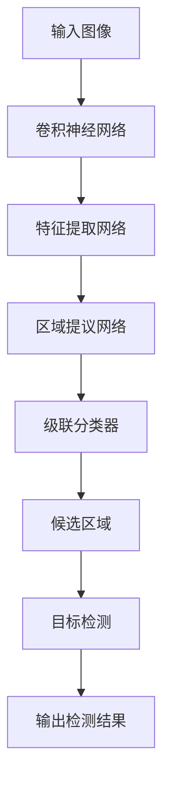
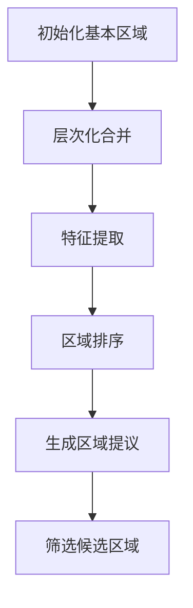
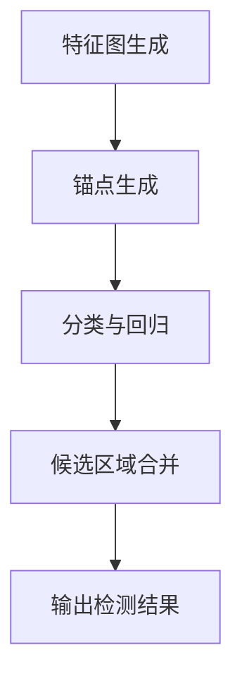
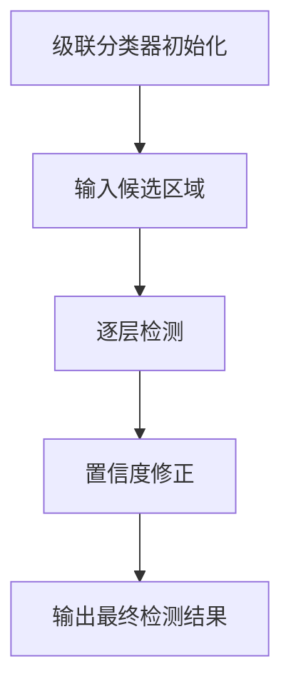

                 

# 《Cascade R-CNN原理与代码实例讲解》

> 关键词：目标检测、Cascade R-CNN、卷积神经网络、区域提议生成、多尺度检测、Cascade结构优化

> 摘要：本文将详细讲解Cascade R-CNN的目标检测算法原理，并通过对实际代码实例的分析，帮助读者深入理解其实现过程，掌握其应用场景和优化策略。

## 目录大纲

1. **第一部分：Cascade R-CNN基础**
   1.1 目标检测概述
   1.2 传统的目标检测算法
   1.3 R-CNN系列算法介绍
2. **第二部分：Cascade R-CNN原理**
   2.1 Cascade R-CNN整体架构
   2.2 特征提取网络
   2.3 区域提议生成算法
   2.4 多尺度检测
   2.5 Cascade结构详解
3. **第三部分：Cascade R-CNN核心算法原理**
   3.1 卷积神经网络基础
   3.2 区域提议生成算法原理
   3.3 多尺度检测算法原理
   3.4 Cascade结构优化算法
4. **第四部分：数学模型与数学公式**
   4.1 卷积神经网络数学模型
   4.2 区域提议生成算法数学模型
   4.3 多尺度检测算法数学模型
   4.4 Cascade结构优化算法数学模型
5. **第五部分：数学模型举例说明**
   5.1 卷积神经网络示例
   5.2 区域提议生成算法示例
   5.3 多尺度检测算法示例
   5.4 Cascade结构优化算法示例
6. **第六部分：Cascade R-CNN项目实战**
   6.1 环境搭建与数据预处理
   6.2 Cascade R-CNN代码实例
   6.3 代码解读与分析
7. **第七部分：Cascade R-CNN实际应用案例**
   7.1 图像识别中的应用
   7.2 视频监控中的应用
   7.3 自动驾驶中的应用
8. **第八部分：Cascade R-CNN未来发展展望**
   8.1 Cascade R-CNN的改进方向
   8.2 目标检测技术的发展趋势
   8.3 Cascade R-CNN在实际应用中的挑战与机遇
9. **附录**
   9.1 Cascade R-CNN相关资源
   9.2 Mermaid流程图

## 1.1 目标检测技术概述

目标检测是计算机视觉领域中的一个重要研究方向，它旨在从图像或视频中识别并定位出感兴趣的目标对象。目标检测技术广泛应用于自动驾驶、智能监控、医疗影像分析等多个领域，具有重要的实际应用价值。

目标检测技术的基本任务是从给定的图像或视频中提取出目标对象，并给出每个目标的类别和位置。具体来说，目标检测可以分为以下几个步骤：

1. **图像预处理**：为了提高检测效果，通常需要对原始图像进行一系列预处理操作，如灰度化、滤波、缩放等。
2. **区域提议生成**：区域提议生成算法是从整个图像中生成可能的感兴趣区域，这些区域可能包含目标对象。常用的区域提议方法包括选择性搜索（Selective Search）、滑移窗口（Sliding Window）等。
3. **特征提取**：对每个区域提议进行特征提取，生成高维的特征向量，这些特征用于后续的目标分类和定位。
4. **目标分类和定位**：利用训练好的分类器对提取到的特征进行分类，并计算每个目标的置信度。同时，通过回归模型对目标的精确位置进行预测。

目标检测技术可以分为两大类：单阶段检测器和多阶段检测器。

### 单阶段检测器

单阶段检测器是在同一阶段同时完成区域提议、特征提取、分类和定位的任务。其优点是检测速度快，但准确率相对较低。代表性的单阶段检测器包括YOLO（You Only Look Once）和SSD（Single Shot Multibox Detector）。

### 多阶段检测器

多阶段检测器分为两个或多个阶段，通常包括区域提议、特征提取、候选区域筛选、分类和定位等步骤。其优点是检测准确率较高，但计算时间较长。代表性的多阶段检测器包括R-CNN（Region-based Convolutional Neural Networks）、Fast R-CNN、Faster R-CNN和Cascade R-CNN。

## 1.2 传统的目标检测算法

在深度学习技术兴起之前，传统的目标检测算法主要包括基于滑动窗口（Sliding Window）和基于区域提议（Region Proposal）的方法。

### 滑动窗口方法

滑动窗口方法是一种简单直观的目标检测方法，其基本思想是将一个固定大小的窗口在图像上逐像素滑动，对于每个窗口位置，提取窗口内的图像特征，并通过分类器判断是否包含目标。这种方法的主要缺点是计算量巨大，特别是在图像尺寸较大时，窗口数量和特征提取时间将呈指数级增长。

伪代码如下：

```python
for i in range(height - window_size):
    for j in range(width - window_size):
        window = image[i:i+window_size, j:j+window_size]
        feature = extract_features(window)
        label = classifier.predict(feature)
        if label == "object":
            bounding_box = [i, j, i+window_size, j+window_size]
            draw_bounding_box(image, bounding_box)
```

### 基于区域提议的方法

基于区域提议的方法旨在减少需要检测的区域数量，从而提高检测效率。其基本思想是首先从图像中生成一系列可能的感兴趣区域，然后对这些区域进行特征提取和分类。代表性的区域提议方法包括选择性搜索（Selective Search）和滑移窗口（Sliding Window）。

选择性搜索（Selective Search）是一种基于区域合并和分割的算法，通过迭代选择并合并具有相似特征的区域，生成一系列高层次的候选区域。具体步骤如下：

1. **初始化**：选择一组基本区域，如矩形、三角形、椭圆等。
2. **层次化合并**：对基本区域进行合并，生成高层次区域。
3. **特征提取**：对每个区域提取特征向量。
4. **区域排序**：根据特征向量排序，选择最具代表性的区域。
5. **生成区域提议**：从排序后的区域中选取前N个区域作为区域提议。

伪代码如下：

```python
initialize_basic_regions()
merge_regions_to_higher_levels()
extract_features_for_regions()
sort_regions_by_feature_vector()
select_top_n_regions_as_proposals()
```

### 传统目标检测算法的局限性

尽管传统目标检测算法在某些场景下取得了较好的效果，但它们存在以下局限性：

1. **计算效率低**：特别是在处理大型图像时，计算量巨大。
2. **特征提取与分类分离**：传统方法通常将特征提取和分类视为两个独立的过程，难以充分利用特征信息。
3. **区域提议生成质量**：区域提议的质量直接影响检测效果，但传统方法难以生成高质量的提议。

随着深度学习技术的发展，基于深度学习的目标检测算法逐渐取代了传统算法，成为目标检测领域的主流方法。下一节将介绍R-CNN系列算法，包括Faster R-CNN和Cascade R-CNN，这些算法在目标检测性能和计算效率方面取得了显著提升。

## 1.3 R-CNN系列算法介绍

R-CNN（Region-based Convolutional Neural Networks）是由Ross Girshick等人于2014年提出的一种目标检测算法，它标志着深度学习技术在计算机视觉领域的重大突破。R-CNN系列算法包括Faster R-CNN、RPN（Region Proposal Network）和Cascade R-CNN，它们在性能和效率方面逐渐优化，成为当前目标检测领域的主流方法。

### R-CNN算法

R-CNN算法由以下几个主要步骤组成：

1. **区域提议**：使用选择性搜索（Selective Search）算法生成一系列候选区域。
2. **特征提取**：对每个候选区域使用SVM（支持向量机）分类器进行特征提取，提取的特征向量送入深度神经网络（如AlexNet）进行特征提取。
3. **目标分类**：利用提取到的特征向量通过SVM分类器判断每个区域是否包含目标，并输出目标的类别和位置。

R-CNN的主要优点是能够利用深度神经网络进行特征提取，提高了检测效果。但R-CNN算法也存在以下不足：

- **计算效率低**：由于每个候选区域都需要通过SVM分类器和深度神经网络处理，导致计算时间较长。
- **特征提取与分类分离**：特征提取和分类任务分开处理，难以充分利用特征信息。

### Faster R-CNN算法

Faster R-CNN是由Shaoqing Ren等人于2015年提出的一种改进算法，它在R-CNN的基础上引入了Region Proposal Network（RPN），以解决计算效率低的问题。Faster R-CNN的主要步骤如下：

1. **共享特征提取网络**：Faster R-CNN使用一个共享卷积神经网络（如VGG或ResNet）提取图像特征。
2. **区域提议**：通过RPN生成候选区域，RPN同时用于特征提取和区域提议。
3. **目标分类与定位**：对每个候选区域提取特征向量，并通过SVM分类器判断是否包含目标，同时利用回归模型预测目标的精确位置。

Faster R-CNN的主要优点包括：

- **计算效率高**：由于共享卷积神经网络，特征提取和区域提议步骤大大减少计算时间。
- **特征利用充分**：共享特征提取网络使得特征信息得到了充分利用。

### RPN算法

Region Proposal Network（RPN）是Faster R-CNN的核心组成部分，它用于生成高质量的候选区域。RPN的主要工作包括：

1. **特征图生成**：通过共享卷积神经网络提取图像特征，生成特征图。
2. **锚点生成**：在特征图上生成一系列锚点（anchor），每个锚点对应一个预设的边界框。
3. **分类与回归**：对每个锚点进行分类和回归操作，分类判断锚点是否包含目标，回归操作预测锚点的精确位置。

### Cascade R-CNN算法

Cascade R-CNN是在Faster R-CNN的基础上进一步优化的一种目标检测算法，它引入了级联结构（Cascade），以提高检测准确率。Cascade R-CNN的主要步骤如下：

1. **共享特征提取网络**：与Faster R-CNN相同，使用共享卷积神经网络提取图像特征。
2. **区域提议**：通过RPN生成候选区域。
3. **级联检测**：将候选区域输入多个级联分类器，每个级联分类器依次进行目标分类和定位，直到达到预设的准确率。

Cascade R-CNN的主要优点包括：

- **检测准确率高**：级联结构能够逐步筛选出更高质量的候选区域，提高检测准确率。
- **计算效率较高**：虽然引入了级联结构，但计算效率依然较高。

R-CNN系列算法在目标检测领域取得了显著成果，但它们仍然存在一些不足之处。例如，R-CNN和Faster R-CNN在处理大量候选区域时计算时间较长，而Cascade R-CNN在级联过程中可能引入额外计算开销。未来，随着深度学习技术的不断发展，目标检测算法将继续在性能和效率方面优化，以满足实际应用的需求。

## 2.1 Cascade R-CNN整体架构

Cascade R-CNN作为一种高效的目标检测算法，其整体架构在Faster R-CNN的基础上进行了优化和改进。Cascade R-CNN的主要步骤包括：共享特征提取网络、区域提议（RPN）、级联检测（Cascade），以及最终的输出结果。以下是Cascade R-CNN的整体架构及其详细流程。

### 2.1.1 共享特征提取网络

在Cascade R-CNN中，首先使用一个共享的卷积神经网络（如ResNet或VGG）提取图像特征。共享特征提取网络具有以下几个优点：

1. **提高计算效率**：通过共享卷积层，减少重复计算，提高检测速度。
2. **利用深层特征**：卷积神经网络能够提取出丰富的图像特征，有助于提高检测准确率。

具体流程如下：

1. **输入图像**：将原始图像输入到共享特征提取网络。
2. **提取特征图**：通过卷积神经网络提取图像特征，生成特征图（Feature Map）。

### 2.1.2 区域提议（RPN）

区域提议网络（Region Proposal Network，RPN）是Cascade R-CNN的重要组成部分，用于生成高质量的候选区域。RPN通过在特征图上生成锚点（Anchor），并对这些锚点进行分类和回归操作，从而生成候选区域。

RPN的流程如下：

1. **生成锚点**：在特征图上生成一系列锚点，每个锚点对应一个预设的边界框。锚点的生成过程包括以下步骤：
   - **确定锚点大小**：根据预设的锚点大小（宽高比例）生成不同尺度的锚点。
   - **位置调整**：根据特征图的网格位置调整锚点，确保锚点覆盖整个图像。
   - **正负样本划分**：根据锚点与真实边界框的相交IoU（交并比）阈值，划分正负样本。

2. **分类与回归**：对每个锚点进行分类和回归操作：
   - **分类**：利用softmax函数计算锚点的分类概率，判断锚点是否包含目标。
   - **回归**：利用回归模型预测锚点的精确位置，修正锚点的边界框。

3. **生成候选区域**：根据锚点的分类结果和回归结果，筛选出具有较高分类概率和位置修正的锚点，生成候选区域。

### 2.1.3 级联检测（Cascade）

级联检测（Cascade）是Cascade R-CNN的核心创新之一，通过多个级联分类器逐步筛选出更高质量的候选区域，提高检测准确率。级联检测的基本思想是，将候选区域依次输入多个级联分类器，每个分类器都包括多个检测层，逐步筛选出具有高置信度的候选区域。

级联检测的流程如下：

1. **级联分类器初始化**：每个级联分类器由多个检测层组成，每个检测层包括卷积层、池化层和全连接层。初始化时，每个检测层都使用相同的网络结构和参数。

2. **候选区域输入**：将RPN生成的候选区域输入到级联分类器的第一个检测层。

3. **逐层检测**：对每个候选区域依次通过级联分类器的各个检测层，每层都进行目标分类和定位操作。具体步骤如下：
   - **目标分类**：利用全连接层计算候选区域的分类概率，判断是否包含目标。
   - **目标定位**：利用卷积层和回归模型预测候选区域的精确位置。

4. **置信度修正**：对每个候选区域的置信度进行修正，考虑到级联过程中可能引入的错误，对置信度较低的候选区域进行剔除。

5. **最终输出**：当级联分类器达到预设的准确率时，输出最终的目标检测结果。

### 2.1.4 整体架构总结

Cascade R-CNN的整体架构如图1所示。首先，通过共享特征提取网络提取图像特征；然后，通过RPN生成候选区域；接着，通过级联分类器进行逐层检测，筛选出高质量的目标候选区域；最后，输出目标检测结果。


Cascade R-CNN在目标检测领域取得了显著成果，其高效、准确的检测性能使其广泛应用于各种实际场景。下一节将详细介绍Cascade R-CNN中的特征提取网络，分析其结构和工作原理。

## 2.2 特征提取网络

特征提取网络是Cascade R-CNN的核心组成部分，它用于提取图像特征，为后续的目标检测提供关键信息。在Cascade R-CNN中，通常采用深层卷积神经网络（Deep Convolutional Neural Networks，DCNN）作为特征提取网络，如ResNet、VGG、Inception等。以下将详细介绍特征提取网络的结构、工作原理及其在Cascade R-CNN中的应用。

### 2.2.1 特征提取网络的结构

特征提取网络主要由多个卷积层、池化层和全连接层组成。以下是一个典型的特征提取网络结构：

1. **卷积层**：卷积层是特征提取网络的基础，用于提取图像的局部特征。卷积层通过滑动卷积核在输入图像上滑动，生成特征图。每个卷积层都包含多个卷积核，以提取不同类型的特征。

2. **池化层**：池化层用于降低特征图的维度，减少计算量。常用的池化方法包括最大池化（Max Pooling）和平均池化（Average Pooling）。最大池化能够保留图像中的显著特征，而平均池化则能够降低噪声。

3. **全连接层**：全连接层用于将特征图上的特征融合成全局特征。全连接层将特征图上的每个像素值映射到输出层，生成一个一维的特征向量。这个特征向量可以用于后续的目标分类和定位。

### 2.2.2 特征提取网络的工作原理

特征提取网络的工作原理可以分为以下几个步骤：

1. **输入图像**：将原始图像输入到特征提取网络。

2. **卷积层操作**：卷积层通过滑动卷积核在输入图像上滑动，生成特征图。每个卷积层都能提取到不同尺度和类型的特征。

3. **池化层操作**：对生成的特征图进行池化操作，降低特征图的维度，减少计算量。

4. **全连接层操作**：将特征图上的特征融合成全局特征，生成一维的特征向量。

5. **输出特征向量**：特征提取网络最终输出一个高维的特征向量，这个特征向量可以用于后续的目标分类和定位。

### 2.2.3 特征提取网络在Cascade R-CNN中的应用

在Cascade R-CNN中，特征提取网络被用于提取图像特征，为后续的目标检测提供支持。以下是特征提取网络在Cascade R-CNN中的应用步骤：

1. **输入图像**：将原始图像输入到特征提取网络。

2. **提取特征图**：通过特征提取网络提取图像特征，生成特征图。

3. **RPN操作**：将特征图输入到RPN网络，生成候选区域。

4. **级联分类器操作**：将候选区域输入到级联分类器，通过逐层检测，筛选出高质量的目标候选区域。

5. **输出目标检测结果**：当级联分类器达到预设的准确率时，输出最终的目标检测结果。

特征提取网络在Cascade R-CNN中的应用不仅提高了检测准确率，还降低了计算量。通过使用深层卷积神经网络，特征提取网络能够提取到丰富的图像特征，有助于提高目标检测的性能。下一节将详细介绍Cascade R-CNN中的区域提议生成算法，分析其原理和实现方法。

## 2.3 区域提议生成算法

区域提议生成算法（Region Proposal Algorithm）是目标检测算法中至关重要的一环，其质量直接影响到整个检测过程的速度和准确性。在Cascade R-CNN中，区域提议生成算法用于生成高质量的候选区域，这些区域将作为后续检测的目标。以下将详细介绍Cascade R-CNN中使用的区域提议生成算法，包括其原理、实现方法和优缺点。

### 2.3.1 区域提议生成算法原理

区域提议生成算法的主要目的是从给定的图像中生成一系列具有较高可信度的候选区域，这些区域可能包含目标对象。Cascade R-CNN中使用的区域提议生成算法主要包括以下几种：

1. **选择性搜索（Selective Search）**：
   选择性搜索是一种基于区域合并和分割的算法，通过迭代选择并合并具有相似特征的区域，生成一系列高层次的候选区域。选择性搜索的主要步骤如下：
   - **初始化**：选择一组基本区域，如矩形、三角形、椭圆等。
   - **层次化合并**：对基本区域进行合并，生成高层次区域。
   - **特征提取**：对每个区域提取特征向量。
   - **区域排序**：根据特征向量排序，选择最具代表性的区域。
   - **生成区域提议**：从排序后的区域中选取前N个区域作为区域提议。

2. **区域提议网络（Region Proposal Network，RPN）**：
   区域提议网络是Faster R-CNN中的关键组成部分，它通过共享卷积神经网络提取图像特征，并在特征图上生成锚点（Anchor），然后对锚点进行分类和回归操作，从而生成候选区域。RPN的主要步骤如下：
   - **特征图生成**：通过共享卷积神经网络提取图像特征，生成特征图。
   - **锚点生成**：在特征图上生成一系列锚点，每个锚点对应一个预设的边界框。
   - **分类与回归**：对每个锚点进行分类和回归操作，分类判断锚点是否包含目标，回归操作预测锚点的精确位置。
   - **生成候选区域**：根据锚点的分类结果和回归结果，筛选出具有较高分类概率和位置修正的锚点，生成候选区域。

### 2.3.2 区域提议生成算法实现方法

1. **选择性搜索（Selective Search）**：

   选择性搜索的实现方法包括以下步骤：

   ```python
   initialize_basic_regions()
   merge_regions_to_higher_levels()
   extract_features_for_regions()
   sort_regions_by_feature_vector()
   select_top_n_regions_as_proposals()
   ```

   其中，`initialize_basic_regions()` 初始化基本区域，`merge_regions_to_higher_levels()` 进行层次化合并，`extract_features_for_regions()` 提取特征向量，`sort_regions_by_feature_vector()` 进行区域排序，`select_top_n_regions_as_proposals()` 从排序后的区域中选取前N个区域作为区域提议。

2. **区域提议网络（RPN）**：

   RPN的实现方法包括以下步骤：

   ```python
   extract_features()
   generate_anchors()
   classify_anchors()
   regress_anchors()
   filter_proposals()
   ```

   其中，`extract_features()` 提取图像特征，`generate_anchors()` 生成锚点，`classify_anchors()` 对锚点进行分类，`regress_anchors()` 对锚点进行回归，`filter_proposals()` 根据分类和回归结果筛选候选区域。

### 2.3.3 区域提议生成算法优缺点

1. **选择性搜索（Selective Search）**：

   - **优点**：
     - 可以生成高质量的候选区域，具有较高的召回率。
     - 能够处理各种尺度和形状的目标。
     - 对图像大小不敏感，适用于不同尺寸的图像。

   - **缺点**：
     - 计算时间较长，特别是在处理大型图像时。
     - 容易生成大量冗余区域，需要进一步筛选。

2. **区域提议网络（RPN）**：

   - **优点**：
     - 计算效率高，可以通过共享卷积层减少计算时间。
     - 能够生成高质量的候选区域，具有较高的精确率。
     - 与深度神经网络结合，充分利用图像特征信息。

   - **缺点**：
     - 对图像大小有一定要求，需要调整锚点生成策略以适应不同尺度的图像。
     - 需要大量标注数据训练RPN网络，增加了训练成本。

总之，区域提议生成算法在目标检测中起着至关重要的作用。选择性搜索和RPN都是目前广泛使用的区域提议生成算法，它们各自具有优缺点，适用于不同的应用场景。Cascade R-CNN通过结合这两种算法，充分发挥了它们的优点，实现了高效、准确的目标检测。

## 2.4 多尺度检测

多尺度检测是Cascade R-CNN中的一个重要特性，旨在提高目标检测的准确率和鲁棒性。通过在不同尺度上进行检测，多尺度检测能够应对不同大小和形状的目标，提高检测效果。以下将详细介绍多尺度检测的原理、实现方法及其在Cascade R-CNN中的应用。

### 2.4.1 多尺度检测原理

多尺度检测的基本思想是，在目标检测过程中，考虑不同尺度的特征图，从而检测到不同大小和形状的目标。多尺度检测的原理可以概括为以下几个步骤：

1. **特征图生成**：通过共享卷积神经网络提取图像特征，生成多个不同尺度的特征图。这些特征图分别对应不同的尺度级别。

2. **锚点生成**：在每个尺度特征图上生成锚点，锚点的大小和位置根据特征图的尺度进行调整。锚点用于表示可能的候选区域。

3. **分类与回归**：对每个尺度特征图上的锚点进行分类和回归操作，判断锚点是否包含目标，并预测锚点的精确位置。

4. **候选区域合并**：将不同尺度特征图上的分类结果和回归结果进行合并，生成最终的候选区域。

通过在不同尺度上进行检测，多尺度检测能够更好地应对不同大小和形状的目标，提高检测准确率。

### 2.4.2 多尺度检测实现方法

多尺度检测的实现方法可以分为以下几个步骤：

1. **特征图生成**：

   - **输入图像**：将原始图像输入到共享卷积神经网络，提取特征。

   - **生成多个特征图**：通过调整卷积神经网络的输出尺寸和步长，生成多个不同尺度的特征图。

2. **锚点生成**：

   - **确定锚点尺寸和位置**：根据特征图的尺度，确定锚点的尺寸和位置。锚点尺寸可以是固定的，也可以是可变的。

   - **生成锚点**：在特征图上生成锚点，每个锚点对应一个预设的边界框。

3. **分类与回归**：

   - **分类操作**：对每个尺度特征图上的锚点进行分类操作，判断锚点是否包含目标。

   - **回归操作**：对每个尺度特征图上的锚点进行回归操作，预测锚点的精确位置。

4. **候选区域合并**：

   - **筛选候选区域**：根据分类结果和回归结果，筛选出具有较高分类概率和位置修正的锚点，生成候选区域。

   - **合并候选区域**：将不同尺度特征图上的分类结果和回归结果进行合并，生成最终的候选区域。

### 2.4.3 多尺度检测在Cascade R-CNN中的应用

在Cascade R-CNN中，多尺度检测主要用于以下几个步骤：

1. **共享卷积神经网络提取特征**：通过共享卷积神经网络提取图像特征，生成多个不同尺度的特征图。

2. **RPN生成锚点**：在多个尺度特征图上生成锚点，通过分类和回归操作生成候选区域。

3. **级联分类器检测**：将候选区域输入级联分类器，通过逐层检测，筛选出高质量的目标候选区域。

4. **最终输出**：当级联分类器达到预设的准确率时，输出最终的目标检测结果。

多尺度检测在Cascade R-CNN中的应用提高了检测准确率和鲁棒性，使其能够更好地应对不同大小和形状的目标。通过在不同尺度上进行检测，多尺度检测能够充分利用特征信息，从而提高检测效果。

## 2.5 Cascade结构详解

Cascade R-CNN中的Cascade结构是其核心创新之一，通过级联多个检测层，逐层筛选出更高质量的目标候选区域，从而提高检测准确率。Cascade结构在目标检测领域具有显著优势，以下将详细介绍Cascade结构的原理、实现方法及其在Cascade R-CNN中的应用。

### 2.5.1 Cascade结构原理

Cascade结构的原理可以概括为以下几点：

1. **级联多个检测层**：Cascade R-CNN通过级联多个检测层，每个检测层都包括多个检测层。每个检测层都会对输入的候选区域进行目标分类和定位操作。

2. **逐层筛选候选区域**：在级联过程中，每个检测层都会对候选区域进行筛选，保留置信度较高的候选区域，剔除置信度较低的候选区域。这样，逐层筛选可以逐步提高候选区域的准确率。

3. **提升检测准确率**：通过级联多个检测层，Cascade结构能够有效地提高检测准确率。每个检测层都能够对候选区域进行更精细的分类和定位，从而减少误检测和漏检测。

4. **计算优化**：尽管级联多个检测层可能会增加计算量，但通过共享卷积神经网络和优化级联结构，Cascade R-CNN在计算效率方面仍具有显著优势。

### 2.5.2 Cascade结构实现方法

Cascade结构的实现方法可以分为以下几个步骤：

1. **初始化级联分类器**：每个级联分类器由多个检测层组成，每个检测层都包括卷积层、池化层和全连接层。初始化时，每个检测层的网络结构和参数都相同。

2. **输入候选区域**：将RPN生成的候选区域输入到级联分类器的第一个检测层。

3. **逐层检测**：对每个候选区域依次通过级联分类器的各个检测层，每层都进行目标分类和定位操作。具体步骤如下：

   - **目标分类**：利用全连接层计算候选区域的分类概率，判断是否包含目标。
   - **目标定位**：利用卷积层和回归模型预测候选区域的精确位置。

4. **置信度修正**：对每个候选区域的置信度进行修正，考虑到级联过程中可能引入的错误，对置信度较低的候选区域进行剔除。

5. **最终输出**：当级联分类器达到预设的准确率时，输出最终的目标检测结果。

### 2.5.3 Cascade结构在Cascade R-CNN中的应用

Cascade R-CNN中的Cascade结构通过以下几个步骤应用于目标检测：

1. **共享卷积神经网络提取特征**：通过共享卷积神经网络提取图像特征，生成多个不同尺度的特征图。

2. **RPN生成锚点**：在多个尺度特征图上生成锚点，通过分类和回归操作生成候选区域。

3. **级联分类器检测**：将候选区域输入级联分类器，通过逐层检测，筛选出高质量的目标候选区域。具体步骤如下：

   - **第一个检测层**：对候选区域进行初次分类和定位，保留置信度较高的候选区域。
   - **后续检测层**：对保留的候选区域进行进一步分类和定位，逐步提高检测准确率。

4. **最终输出**：当级联分类器达到预设的准确率时，输出最终的目标检测结果。

Cascade结构在Cascade R-CNN中的应用，使得目标检测算法在准确率和计算效率之间取得了较好的平衡。通过级联多个检测层，Cascade R-CNN能够有效地提高检测准确率，同时保持较高的计算效率。这为实际应用提供了更可靠的保障。

### 2.6.1 卷积神经网络基础

卷积神经网络（Convolutional Neural Network，CNN）是一种特殊的深度学习模型，广泛应用于图像识别、目标检测等领域。其核心思想是通过卷积操作提取图像特征，并利用这些特征进行分类或回归。以下将介绍卷积神经网络的基本概念、结构和工作原理。

#### 2.6.1.1 卷积神经网络基本概念

1. **卷积层（Convolutional Layer）**：
   卷积层是CNN的核心组成部分，通过卷积操作提取图像特征。卷积层由多个卷积核（也称为过滤器）组成，每个卷积核在输入图像上滑动，生成一个特征图。卷积层的输出是多个特征图的叠加。

2. **池化层（Pooling Layer）**：
   池化层用于降低特征图的维度，减少计算量。常用的池化方法包括最大池化（Max Pooling）和平均池化（Average Pooling）。最大池化能够保留图像中的显著特征，而平均池化则能够降低噪声。

3. **全连接层（Fully Connected Layer）**：
   全连接层将特征图上的特征融合成全局特征，生成一维的特征向量。全连接层将特征图上的每个像素值映射到输出层，生成一个一维的特征向量。

4. **激活函数（Activation Function）**：
   激活函数为神经网络提供非线性特性，常见的激活函数包括ReLU（Rectified Linear Unit）、Sigmoid、Tanh等。

#### 2.6.1.2 卷积神经网络结构

卷积神经网络的基本结构可以分为以下几个部分：

1. **输入层（Input Layer）**：
   输入层接收原始图像，将其作为输入数据。

2. **卷积层（Convolutional Layer）**：
   卷积层通过卷积操作提取图像特征，生成多个特征图。

3. **池化层（Pooling Layer）**：
   对卷积层生成的特征图进行池化操作，降低特征图的维度。

4. **全连接层（Fully Connected Layer）**：
   全连接层将特征图上的特征融合成全局特征，生成一维的特征向量。

5. **输出层（Output Layer）**：
   输出层根据分类或回归任务，输出最终的结果。

#### 2.6.1.3 卷积神经网络工作原理

卷积神经网络的工作原理可以分为以下几个步骤：

1. **输入图像**：将原始图像输入到卷积神经网络。

2. **卷积操作**：卷积层通过卷积操作提取图像特征，生成多个特征图。

3. **池化操作**：对卷积层生成的特征图进行池化操作，降低特征图的维度。

4. **特征融合**：全连接层将特征图上的特征融合成全局特征，生成一维的特征向量。

5. **分类或回归**：输出层根据分类或回归任务，输出最终的结果。

通过卷积操作、池化操作和特征融合，卷积神经网络能够提取到丰富的图像特征，从而实现高效的目标检测和图像识别。

### 2.6.2 区域提议生成算法原理

区域提议生成算法（Region Proposal Algorithm）是目标检测算法中至关重要的一环，其质量直接影响到整个检测过程的速度和准确性。在Cascade R-CNN中，区域提议生成算法用于生成高质量的候选区域，这些区域将作为后续检测的目标。以下将详细介绍区域提议生成算法的原理、实现方法及其在Cascade R-CNN中的应用。

#### 2.6.2.1 区域提议生成算法原理

区域提议生成算法的主要目的是从给定的图像中生成一系列具有较高可信度的候选区域，这些区域可能包含目标对象。Cascade R-CNN中使用的区域提议生成算法主要包括以下几种：

1. **选择性搜索（Selective Search）**：
   选择性搜索是一种基于区域合并和分割的算法，通过迭代选择并合并具有相似特征的区域，生成一系列高层次的候选区域。选择性搜索的主要步骤如下：
   - **初始化**：选择一组基本区域，如矩形、三角形、椭圆等。
   - **层次化合并**：对基本区域进行合并，生成高层次区域。
   - **特征提取**：对每个区域提取特征向量。
   - **区域排序**：根据特征向量排序，选择最具代表性的区域。
   - **生成区域提议**：从排序后的区域中选取前N个区域作为区域提议。

2. **区域提议网络（Region Proposal Network，RPN）**：
   区域提议网络是Faster R-CNN中的关键组成部分，它通过共享卷积神经网络提取图像特征，并在特征图上生成锚点（Anchor），然后对锚点进行分类和回归操作，从而生成候选区域。RPN的主要步骤如下：
   - **特征图生成**：通过共享卷积神经网络提取图像特征，生成特征图。
   - **锚点生成**：在特征图上生成一系列锚点，每个锚点对应一个预设的边界框。
   - **分类与回归**：对每个锚点进行分类和回归操作，分类判断锚点是否包含目标，回归操作预测锚点的精确位置。
   - **生成候选区域**：根据锚点的分类结果和回归结果，筛选出具有较高分类概率和位置修正的锚点，生成候选区域。

#### 2.6.2.2 区域提议生成算法实现方法

1. **选择性搜索（Selective Search）**：

   选择性搜索的实现方法包括以下步骤：

   ```python
   initialize_basic_regions()
   merge_regions_to_higher_levels()
   extract_features_for_regions()
   sort_regions_by_feature_vector()
   select_top_n_regions_as_proposals()
   ```

   其中，`initialize_basic_regions()` 初始化基本区域，`merge_regions_to_higher_levels()` 进行层次化合并，`extract_features_for_regions()` 提取特征向量，`sort_regions_by_feature_vector()` 进行区域排序，`select_top_n_regions_as_proposals()` 从排序后的区域中选取前N个区域作为区域提议。

2. **区域提议网络（RPN）**：

   RPN的实现方法包括以下步骤：

   ```python
   extract_features()
   generate_anchors()
   classify_anchors()
   regress_anchors()
   filter_proposals()
   ```

   其中，`extract_features()` 提取图像特征，`generate_anchors()` 生成锚点，`classify_anchors()` 对锚点进行分类，`regress_anchors()` 对锚点进行回归，`filter_proposals()` 根据分类和回归结果筛选候选区域。

#### 2.6.2.3 区域提议生成算法优缺点

1. **选择性搜索（Selective Search）**：

   - **优点**：
     - 可以生成高质量的候选区域，具有较高的召回率。
     - 能够处理各种尺度和形状的目标。
     - 对图像大小不敏感，适用于不同尺寸的图像。

   - **缺点**：
     - 计算时间较长，特别是在处理大型图像时。
     - 容易生成大量冗余区域，需要进一步筛选。

2. **区域提议网络（RPN）**：

   - **优点**：
     - 计算效率高，可以通过共享卷积层减少计算时间。
     - 能够生成高质量的候选区域，具有较高的精确率。
     - 与深度神经网络结合，充分利用图像特征信息。

   - **缺点**：
     - 对图像大小有一定要求，需要调整锚点生成策略以适应不同尺度的图像。
     - 需要大量标注数据训练RPN网络，增加了训练成本。

总之，区域提议生成算法在目标检测中起着至关重要的作用。选择性搜索和RPN都是目前广泛使用的区域提议生成算法，它们各自具有优缺点，适用于不同的应用场景。Cascade R-CNN通过结合这两种算法，充分发挥了它们的优点，实现了高效、准确的目标检测。

## 2.7 多尺度检测算法原理

多尺度检测算法（Multi-scale Detection Algorithm）是目标检测领域的一种关键技术，其核心思想是同时或依次在不同尺度上检测目标，以应对不同大小和形状的目标。在Cascade R-CNN中，多尺度检测算法通过在不同尺度特征图上进行检测，提高了检测的准确性和鲁棒性。以下将详细解析多尺度检测算法的原理、实现方法和优缺点。

### 2.7.1 多尺度检测算法原理

多尺度检测算法的原理可以概括为以下几点：

1. **特征图生成**：首先，通过卷积神经网络提取图像特征，生成多个不同尺度的特征图。这些特征图分别对应不同的尺度级别。

2. **锚点生成**：在每个尺度特征图上生成锚点，锚点的大小和位置根据特征图的尺度进行调整。锚点用于表示可能的候选区域。

3. **分类与回归**：对每个尺度特征图上的锚点进行分类和回归操作，判断锚点是否包含目标，并预测锚点的精确位置。

4. **候选区域合并**：将不同尺度特征图上的分类结果和回归结果进行合并，生成最终的候选区域。

通过在不同尺度上进行检测，多尺度检测算法能够更好地应对不同大小和形状的目标，提高检测准确率。

### 2.7.2 多尺度检测算法实现方法

多尺度检测算法的实现方法可以分为以下几个步骤：

1. **特征图生成**：

   - **输入图像**：将原始图像输入到共享卷积神经网络，提取特征。

   - **生成多个特征图**：通过调整卷积神经网络的输出尺寸和步长，生成多个不同尺度的特征图。

2. **锚点生成**：

   - **确定锚点尺寸和位置**：根据特征图的尺度，确定锚点的尺寸和位置。锚点尺寸可以是固定的，也可以是可变的。

   - **生成锚点**：在特征图上生成锚点，每个锚点对应一个预设的边界框。

3. **分类与回归**：

   - **分类操作**：对每个尺度特征图上的锚点进行分类操作，判断锚点是否包含目标。

   - **回归操作**：对每个尺度特征图上的锚点进行回归操作，预测锚点的精确位置。

4. **候选区域合并**：

   - **筛选候选区域**：根据分类结果和回归结果，筛选出具有较高分类概率和位置修正的锚点，生成候选区域。

   - **合并候选区域**：将不同尺度特征图上的分类结果和回归结果进行合并，生成最终的候选区域。

### 2.7.3 多尺度检测算法优缺点

1. **优点**：

   - **提高检测准确率**：通过在不同尺度上检测目标，多尺度检测算法能够更好地应对不同大小和形状的目标，提高检测准确率。

   - **增强鲁棒性**：多尺度检测算法能够应对部分遮挡、尺度变化等挑战，提高检测的鲁棒性。

   - **减少漏检**：通过多尺度检测，可以减少由于目标大小或形状变化导致的漏检现象。

2. **缺点**：

   - **计算量增加**：生成多个特征图并进行分类和回归操作，会显著增加计算量，特别是在处理大型图像时。

   - **存储开销增大**：多个特征图和候选区域会增加内存占用，对存储资源提出更高要求。

总体而言，多尺度检测算法在目标检测领域具有显著的优点，特别是在处理复杂场景时，能够显著提高检测效果。但同时，其计算量和存储开销也是需要考虑的问题。

## 2.8 Cascade结构优化算法原理

Cascade结构优化算法是Cascade R-CNN中的一个关键环节，旨在通过级联多个检测层，逐步提高检测的准确率，同时减少误检测和漏检测。以下将详细介绍Cascade结构优化算法的原理、实现方法及其在Cascade R-CNN中的应用。

### 2.8.1 Cascade结构优化算法原理

Cascade结构优化算法的核心思想是，通过级联多个检测层，逐层筛选出更高质量的目标候选区域，从而提高检测准确率。具体来说，Cascade结构优化算法包括以下几个关键点：

1. **级联多个检测层**：每个检测层都包括多个检测单元，每个检测单元负责分类和定位操作。通过级联多个检测层，逐步提高候选区域的准确率。

2. **置信度修正**：在级联过程中，对每个检测层的置信度进行修正，剔除置信度较低的区域，从而减少误检测和漏检测。

3. **多尺度检测**：在级联检测过程中，同时考虑不同尺度的特征图，以提高检测的准确性和鲁棒性。

4. **动态调整**：根据实际应用场景和需求，动态调整级联检测层的参数，如置信度阈值、检测层的数量等，以达到最佳检测效果。

### 2.8.2 Cascade结构优化算法实现方法

Cascade结构优化算法的实现方法可以分为以下几个步骤：

1. **初始化级联分类器**：每个级联分类器由多个检测层组成，每个检测层都包括多个检测单元。初始化时，为每个检测层设置合适的参数，如置信度阈值、锚点大小等。

2. **输入候选区域**：将RPN生成的候选区域输入到级联分类器的第一个检测层。

3. **逐层检测**：对每个候选区域依次通过级联分类器的各个检测层，每层都进行目标分类和定位操作。具体步骤如下：

   - **目标分类**：利用检测单元计算候选区域的分类概率，判断是否包含目标。
   - **目标定位**：利用检测单元预测候选区域的精确位置。

4. **置信度修正**：对每个检测层的置信度进行修正，剔除置信度较低的候选区域。

5. **多尺度检测**：同时考虑不同尺度的特征图，提高检测的准确性和鲁棒性。

6. **动态调整**：根据实际应用场景和需求，动态调整级联检测层的参数，如置信度阈值、检测层的数量等，以达到最佳检测效果。

### 2.8.3 Cascade结构优化算法优缺点

1. **优点**：

   - **提高检测准确率**：通过级联多个检测层，逐步提高候选区域的准确率，减少误检测和漏检测。
   - **增强鲁棒性**：通过多尺度检测和置信度修正，提高检测的鲁棒性，应对部分遮挡、尺度变化等挑战。
   - **灵活调整**：根据实际应用场景和需求，动态调整级联检测层的参数，实现最佳检测效果。

2. **缺点**：

   - **计算量增加**：级联多个检测层，会增加计算量，特别是在处理大型图像时。
   - **存储开销增大**：多个检测层和候选区域会增加内存占用，对存储资源提出更高要求。

总体而言，Cascade结构优化算法在提高检测准确率和鲁棒性方面具有显著优势，但计算量和存储开销也是需要考虑的问题。

### 2.8.4 Cascade结构优化算法在Cascade R-CNN中的应用

在Cascade R-CNN中，Cascade结构优化算法的应用主要体现在以下几个方面：

1. **级联分类器初始化**：通过初始化级联分类器的各个检测层，为每个检测层设置合适的参数，如置信度阈值、锚点大小等。

2. **候选区域输入**：将RPN生成的候选区域输入到级联分类器的第一个检测层，开始级联检测过程。

3. **逐层检测**：对每个候选区域依次通过级联分类器的各个检测层，每层都进行目标分类和定位操作。级联分类器逐步提高候选区域的准确率。

4. **置信度修正**：对每个检测层的置信度进行修正，剔除置信度较低的候选区域，减少误检测和漏检测。

5. **多尺度检测**：同时考虑不同尺度的特征图，提高检测的准确性和鲁棒性。

6. **动态调整**：根据实际应用场景和需求，动态调整级联检测层的参数，如置信度阈值、检测层的数量等，以达到最佳检测效果。

通过应用Cascade结构优化算法，Cascade R-CNN在目标检测领域取得了显著成果，其高效、准确的检测性能使其在各种实际应用场景中具有广泛的应用价值。

## 3.1 卷积神经网络数学模型

卷积神经网络（Convolutional Neural Network，CNN）是一种特殊的深度学习模型，广泛应用于图像识别、目标检测等领域。其核心思想是通过卷积操作提取图像特征，并利用这些特征进行分类或回归。以下将详细介绍卷积神经网络的数学模型，包括卷积操作、池化操作和激活函数。

### 3.1.1 卷积操作

卷积操作是CNN的基础，用于提取图像特征。卷积操作的核心是一个卷积核（Convolutional Kernel），也称为过滤器。卷积核是一个小的矩阵，用于在输入图像上滑动，生成特征图。

假设输入图像为\( I_{in} \)，卷积核为\( K \)，卷积操作可以表示为：

\[ O = \sigma(\sum_{i=1}^{m} K_i * I_{in} + b) \]

其中，\( O \)是输出的特征图，\( K_i \)是第\( i \)个卷积核，\( * \)表示卷积操作，\( m \)是卷积核的数量，\( b \)是偏置项，\( \sigma \)是激活函数。

卷积操作的数学表达式如下：

\[ O_{ij} = \sum_{x=1}^{W} \sum_{y=1}^{H} K_{ij} * I_{in}(x, y) + b_j \]

其中，\( O_{ij} \)是特征图\( O \)中第\( i \)行第\( j \)列的元素，\( I_{in}(x, y) \)是输入图像\( I_{in} \)中第\( x \)行第\( y \)列的元素，\( K_{ij} \)是卷积核\( K \)中第\( i \)行第\( j \)列的元素。

### 3.1.2 池化操作

池化操作用于降低特征图的维度，减少计算量。常用的池化方法包括最大池化（Max Pooling）和平均池化（Average Pooling）。

最大池化操作的数学表达式如下：

\[ P_{ij} = \max_{x=1}^{s} \max_{y=1}^{s} I_{in}(x, y) \]

其中，\( P_{ij} \)是池化后的特征图\( P \)中第\( i \)行第\( j \)列的元素，\( I_{in}(x, y) \)是输入特征图\( I_{in} \)中第\( x \)行第\( y \)列的元素，\( s \)是池化窗口的大小。

平均池化操作的数学表达式如下：

\[ P_{ij} = \frac{1}{s^2} \sum_{x=1}^{s} \sum_{y=1}^{s} I_{in}(x, y) \]

### 3.1.3 激活函数

激活函数为神经网络提供非线性特性，常见的激活函数包括ReLU（Rectified Linear Unit）、Sigmoid、Tanh等。

ReLU激活函数的数学表达式如下：

\[ \sigma(x) = \max(0, x) \]

Sigmoid激活函数的数学表达式如下：

\[ \sigma(x) = \frac{1}{1 + e^{-x}} \]

Tanh激活函数的数学表达式如下：

\[ \sigma(x) = \tanh(x) = \frac{e^{2x} - 1}{e^{2x} + 1} \]

### 3.1.4 卷积神经网络整体模型

卷积神经网络的整体模型可以表示为：

\[ O = \sigma(\text{Conv}(\text{Pooling}(\text{Input})) + b) \]

其中，\( \text{Input} \)是输入图像，\( \text{Conv} \)表示卷积操作，\( \text{Pooling} \)表示池化操作，\( O \)是输出的特征图，\( b \)是偏置项，\( \sigma \)是激活函数。

通过卷积操作、池化操作和激活函数，卷积神经网络能够提取到丰富的图像特征，为后续的目标检测和分类任务提供支持。下一节将介绍区域提议生成算法的数学模型，分析其实现过程。

## 3.2 区域提议生成算法数学模型

区域提议生成算法（Region Proposal Algorithm）在目标检测中起着关键作用，其目的是从给定的图像中生成一系列具有较高可信度的候选区域，这些区域可能包含目标对象。在Cascade R-CNN中，区域提议生成算法主要包括选择性搜索（Selective Search）和区域提议网络（Region Proposal Network，RPN）。以下将详细解析这两种算法的数学模型。

### 3.2.1 选择性搜索数学模型

选择性搜索算法是一种基于区域合并和分割的算法，其主要步骤包括初始化基本区域、层次化合并、特征提取、区域排序和生成区域提议。以下是选择性搜索的数学模型：

1. **初始化基本区域**：

   假设图像大小为\( W \times H \)，初始化基本区域（如矩形、三角形、椭圆等），每个基本区域表示为一个区域向量\( R_b \)：

   \[ R_b = [x_1, y_1, x_2, y_2] \]

   其中，\( (x_1, y_1) \)和\( (x_2, y_2) \)分别是基本区域的左上角和右下角坐标。

2. **层次化合并**：

   选择性搜索通过层次化合并生成高层次区域。在合并过程中，计算每个区域与其相邻区域的相似度，并选择相似度最高的区域进行合并。相似度计算可以使用区域面积、颜色相似度等指标。

   假设两个区域\( R_1 \)和\( R_2 \)的相似度为\( s(R_1, R_2) \)，则合并后的区域\( R_{merged} \)可以表示为：

   \[ R_{merged} = \frac{R_1 + R_2}{2} \]

3. **特征提取**：

   对每个区域提取特征向量，特征向量可以包括区域颜色直方图、纹理特征等。假设区域\( R \)的特征向量为\( \textbf{f}(R) \)，则：

   \[ \textbf{f}(R) = \text{extract\_features}(R) \]

4. **区域排序**：

   根据特征向量对区域进行排序，选择具有最高特征向量的区域作为区域提议。区域排序可以使用任意的排序算法，如快速排序、堆排序等。

5. **生成区域提议**：

   从排序后的区域中选取前N个区域作为区域提议。假设区域提议集合为\( \textbf{R} \)，则：

   \[ \textbf{R} = \{R_1, R_2, ..., R_N\} \]

### 3.2.2 区域提议网络数学模型

区域提议网络（RPN）是Faster R-CNN中的关键组成部分，通过在特征图上生成锚点（Anchor），并对锚点进行分类和回归操作，从而生成候选区域。以下是RPN的数学模型：

1. **锚点生成**：

   在特征图上生成一系列锚点，锚点用于表示可能的候选区域。假设特征图大小为\( H \times W \)，每个锚点表示为一个区域向量\( R_a \)：

   \[ R_a = [x_1, y_1, x_2, y_2] \]

   其中，\( (x_1, y_1) \)和\( (x_2, y_2) \)分别是锚点的左上角和右下角坐标。

2. **分类操作**：

   对每个锚点进行分类操作，判断锚点是否包含目标。假设锚点\( R_a \)的分类结果为\( y_a \)，则：

   \[ y_a = \text{softmax}(\text{classify}(R_a)) \]

   其中，\( \text{classify}(R_a) \)是锚点\( R_a \)的分类得分。

3. **回归操作**：

   对每个锚点进行回归操作，预测锚点的精确位置。假设锚点\( R_a \)的回归结果为\( \hat{R}_a \)，则：

   \[ \hat{R}_a = \text{regress}(R_a) \]

   其中，\( \text{regress}(R_a) \)是锚点\( R_a \)的回归参数。

4. **生成候选区域**：

   根据锚点的分类结果和回归结果，筛选出具有较高分类概率和位置修正的锚点，生成候选区域。假设候选区域集合为\( \textbf{R}^* \)，则：

   \[ \textbf{R}^* = \{R_a \mid y_a > \text{threshold}, \hat{R}_a \in \text{neighborhood}(R_a)\} \]

   其中，\( \text{threshold} \)是分类阈值，\( \text{neighborhood}(R_a) \)是锚点\( R_a \)的邻域。

通过选择性搜索和RPN的数学模型，我们可以有效地生成高质量的候选区域，为后续的目标检测和分类任务提供支持。

## 3.3 多尺度检测算法数学模型

多尺度检测算法（Multi-scale Detection Algorithm）在目标检测中起着关键作用，其核心思想是在不同尺度上检测目标，以提高检测的准确性和鲁棒性。以下将详细解析多尺度检测算法的数学模型，包括特征图生成、锚点生成、分类与回归操作。

### 3.3.1 特征图生成

在多尺度检测算法中，首先需要生成多个不同尺度的特征图。假设原始图像大小为\( W \times H \)，卷积神经网络（CNN）的输出特征图大小为\( F \times G \)。为了生成多个尺度特征图，可以采用以下方法：

1. **尺度变换**：

   将原始图像进行尺度变换，生成多个不同大小的图像。假设尺度变换因子为\( s \)，则变换后的图像大小为\( sW \times sH \)。

2. **卷积神经网络**：

   对每个尺度变换后的图像输入卷积神经网络，提取特征图。假设卷积神经网络输出特征图大小为\( F_s \times G_s \)，则：

   \[ F_s = \frac{F}{s}, \quad G_s = \frac{G}{s} \]

### 3.3.2 锚点生成

锚点（Anchor）是多尺度检测算法中的关键概念，用于表示可能的候选区域。锚点的生成主要包括以下步骤：

1. **初始锚点生成**：

   在特征图上生成一系列初始锚点。假设初始锚点大小为\( (w_a, h_a) \)，则初始锚点坐标可以表示为：

   \[ (x_a, y_a) = (i \cdot w_a, j \cdot h_a) \]

   其中，\( i \)和\( j \)是锚点在特征图上的位置。

2. **锚点尺度调整**：

   根据不同尺度的特征图，调整锚点的大小和位置。假设尺度变换因子为\( s \)，则锚点大小和位置可以表示为：

   \[ w_a = w_a \cdot s, \quad h_a = h_a \cdot s, \quad (x_a, y_a) = (i \cdot w_a, j \cdot h_a) \]

### 3.3.3 分类与回归操作

在多尺度检测算法中，对每个锚点进行分类和回归操作，以生成候选区域。以下为分类和回归操作的数学模型：

1. **分类操作**：

   对每个锚点进行分类操作，判断锚点是否包含目标。假设锚点\( (x_a, y_a) \)的分类结果为\( y_a \)，则：

   \[ y_a = \text{softmax}(\text{classify}((x_a, y_a))) \]

   其中，\( \text{classify}((x_a, y_a)) \)是锚点\( (x_a, y_a) \)的分类得分。

2. **回归操作**：

   对每个锚点进行回归操作，预测锚点的精确位置。假设锚点\( (x_a, y_a) \)的回归结果为\( \hat{R}_a \)，则：

   \[ \hat{R}_a = \text{regress}((x_a, y_a)) \]

   其中，\( \text{regress}((x_a, y_a)) \)是锚点\( (x_a, y_a) \)的回归参数。

### 3.3.4 生成候选区域

根据锚点的分类结果和回归结果，筛选出具有较高分类概率和位置修正的锚点，生成候选区域。假设候选区域集合为\( \textbf{R}^* \)，则：

\[ \textbf{R}^* = \{R_a \mid y_a > \text{threshold}, \hat{R}_a \in \text{neighborhood}(R_a)\} \]

其中，\( \text{threshold} \)是分类阈值，\( \text{neighborhood}(R_a) \)是锚点\( R_a \)的邻域。

通过多尺度检测算法的数学模型，我们能够有效地生成高质量的候选区域，从而提高目标检测的准确性和鲁棒性。在实际应用中，可以根据具体需求调整尺度变换因子、锚点大小和位置、分类阈值等参数，以达到最佳检测效果。

### 3.4.1 卷积神经网络示例

为了更好地理解卷积神经网络的数学模型，以下将详细阐述一个简单的卷积神经网络示例。该示例包括卷积层、池化层和全连接层，以展示卷积操作、池化操作和激活函数的数学过程。

#### 3.4.1.1 示例数据

假设输入图像的大小为\( 32 \times 32 \)像素，每个像素点的颜色信息由3个通道（红、绿、蓝）组成。我们使用一个卷积核大小为\( 3 \times 3 \)的卷积层，输出特征图的大小为\( 16 \times 16 \)。

#### 3.4.1.2 卷积操作

输入图像\( I \)可以表示为一个\( 32 \times 32 \times 3 \)的三维数组。卷积核\( K \)的大小为\( 3 \times 3 \)，包含3个通道，可以表示为一个\( 3 \times 3 \times 3 \)的三维数组。

卷积操作可以表示为：

\[ O = \sigma(\sum_{i=1}^{3} K_i * I + b) \]

其中，\( O \)是输出的特征图，\( K_i \)是卷积核中第\( i \)个通道的数组，\( * \)表示卷积操作，\( b \)是偏置项，\( \sigma \)是激活函数。

具体计算过程如下：

1. **计算卷积操作**：

   对于每个输出特征图的元素\( O_{ij} \)，计算如下：

   \[ O_{ij} = \sum_{x=1}^{3} \sum_{y=1}^{3} K_{xy} * I_{(i-1)\cdot3+x, (j-1)\cdot3+y} + b_j \]

   其中，\( I_{(i-1)\cdot3+x, (j-1)\cdot3+y} \)是输入图像中对应位置的像素值，\( K_{xy} \)是卷积核中对应位置的像素值。

2. **应用激活函数**：

   对于每个输出特征图的元素\( O_{ij} \)，应用ReLU激活函数：

   \[ O_{ij} = \max(0, O_{ij}) \]

   经过卷积操作和激活函数后，得到特征图的大小为\( 16 \times 16 \)，包含3个通道。

#### 3.4.1.3 池化操作

在卷积层之后，我们添加一个最大池化层，池化窗口大小为\( 2 \times 2 \)。池化操作可以表示为：

\[ P_{ij} = \max_{x=1}^{2} \max_{y=1}^{2} O_{(i-1)\cdot2+x, (j-1)\cdot2+y} \]

其中，\( P_{ij} \)是池化后的特征图\( P \)中第\( i \)行第\( j \)列的元素，\( O_{(i-1)\cdot2+x, (j-1)\cdot2+y} \)是输入特征图\( O \)中对应位置的像素值。

具体计算过程如下：

1. **计算池化操作**：

   对于每个输出特征图的元素\( P_{ij} \)，计算如下：

   \[ P_{ij} = \max_{x=1}^{2} \max_{y=1}^{2} O_{(i-1)\cdot2+x, (j-1)\cdot2+y} \]

2. **输出特征图大小**：

   经过最大池化操作后，特征图的大小缩小为原来的\( 1/2 \)。

#### 3.4.1.4 全连接层

在池化层之后，我们添加一个全连接层，将特征图上的特征融合成全局特征。假设全连接层的输出维度为10，可以表示为：

\[ Y = W \cdot X + b \]

其中，\( Y \)是全连接层的输出，\( W \)是权重矩阵，\( X \)是特征图上的特征向量，\( b \)是偏置项。

具体计算过程如下：

1. **计算全连接层**：

   对于每个输出元素\( Y_j \)，计算如下：

   \[ Y_j = \sum_{i=1}^{128} W_{ij} \cdot P_{i} + b_j \]

   其中，\( P_{i} \)是池化后的特征图中第\( i \)个元素，\( W_{ij} \)是权重矩阵中第\( i \)行第\( j \)列的元素。

2. **应用激活函数**：

   对于每个输出元素\( Y_j \)，应用ReLU激活函数：

   \[ Y_j = \max(0, Y_j) \]

   经过全连接层和激活函数后，得到10个输出值，用于分类任务。

通过这个简单的卷积神经网络示例，我们可以看到卷积操作、池化操作和全连接层的数学过程。这些操作共同构成了卷积神经网络的基本结构，为图像识别和目标检测提供了强大的工具。

### 3.4.2 区域提议生成算法示例

为了更好地理解区域提议生成算法的数学模型，以下将详细阐述选择性搜索（Selective Search）和区域提议网络（Region Proposal Network，RPN）的示例。

#### 3.4.2.1 选择性搜索示例

选择性搜索是一种基于区域合并和分割的算法，用于生成高质量的候选区域。以下是一个简化的选择性搜索示例：

1. **初始化基本区域**：

   假设基本区域为矩形，初始化一组基本区域，如矩形\( R_1, R_2, R_3 \)，每个基本区域的表示为\( [x_1, y_1, x_2, y_2] \)。

   \[
   \begin{align*}
   R_1 &= [10, 10, 20, 20], \\
   R_2 &= [30, 30, 40, 40], \\
   R_3 &= [60, 60, 70, 70].
   \end{align*}
   \]

2. **层次化合并**：

   选择相似度最高的基本区域进行合并。相似度可以通过计算两个区域的面积重叠比例来确定。假设合并后的区域为\( R_{merged} \)。

   \[
   \begin{align*}
   R_{merged} &= \frac{R_1 + R_2}{2} = \frac{[10, 10, 20, 20] + [30, 30, 40, 40]}{2} = [20, 20, 30, 30].
   \end{align*}
   \]

3. **特征提取**：

   对每个区域提取特征向量，特征向量可以包括区域的颜色直方图、纹理特征等。假设特征向量为\( \textbf{f}(R) \)。

   \[
   \textbf{f}(R_1) = [f_1(R_1), f_2(R_1), f_3(R_1)], \\
   \textbf{f}(R_2) = [f_1(R_2), f_2(R_2), f_3(R_2)], \\
   \textbf{f}(R_{merged}) = \frac{\textbf{f}(R_1) + \textbf{f}(R_2)}{2}.
   \]

4. **区域排序**：

   根据特征向量对区域进行排序，选择具有最高特征向量的区域作为区域提议。假设区域提议为\( R_1 \)。

5. **生成区域提议**：

   从排序后的区域中选取前N个区域作为区域提议。假设选取前2个区域作为区域提议。

   \[
   \textbf{R} = \{R_1, R_2\}.
   \]

#### 3.4.2.2 RPN示例

RPN是一种基于卷积神经网络（CNN）的算法，用于生成高质量的候选区域。以下是一个简化的RPN示例：

1. **特征图生成**：

   假设输入图像经过CNN后生成特征图\( F \)，特征图的大小为\( 16 \times 16 \)。

2. **锚点生成**：

   在特征图上生成一系列锚点，每个锚点对应一个预设的边界框。假设锚点的大小为\( (w_a, h_a) \)，锚点的位置为\( (x_a, y_a) \)。

   \[
   \begin{align*}
   A_1 &= [10, 10, 20, 20], \\
   A_2 &= [30, 30, 40, 40], \\
   A_3 &= [60, 60, 70, 70].
   \end{align*}
   \]

3. **分类操作**：

   对每个锚点进行分类操作，判断锚点是否包含目标。假设分类结果为\( y_a \)。

   \[
   \begin{align*}
   y_1 &= \text{softmax}(\text{classify}(A_1)) = [0.9, 0.1], \\
   y_2 &= \text{softmax}(\text{classify}(A_2)) = [0.2, 0.8], \\
   y_3 &= \text{softmax}(\text{classify}(A_3)) = [0.5, 0.5].
   \end{align*}
   \]

4. **回归操作**：

   对每个锚点进行回归操作，预测锚点的精确位置。假设回归结果为\( \hat{R}_a \)。

   \[
   \begin{align*}
   \hat{R}_1 &= \text{regress}(A_1) = [15, 15, 25, 25], \\
   \hat{R}_2 &= \text{regress}(A_2) = [35, 35, 45, 45], \\
   \hat{R}_3 &= \text{regress}(A_3) = [65, 65, 75, 75].
   \end{align*}
   \]

5. **生成候选区域**：

   根据锚点的分类结果和回归结果，筛选出具有较高分类概率和位置修正的锚点，生成候选区域。假设分类阈值和位置修正阈值为0.5。

   \[
   \textbf{R}^* = \{A_1, A_2\}.
   \]

通过选择性搜索和RPN的示例，我们可以看到区域提议生成算法的基本过程和数学模型。这些算法通过提取特征、分类和回归操作，生成高质量的候选区域，为后续的目标检测和分类任务提供了基础。

### 3.4.3 多尺度检测算法示例

为了更好地理解多尺度检测算法的数学模型，以下将详细阐述一个简化的多尺度检测算法示例。该示例包括特征图生成、锚点生成、分类与回归操作。

#### 3.4.3.1 特征图生成

假设输入图像的大小为\( 256 \times 256 \)像素。首先，我们将原始图像进行尺度变换，生成不同尺度的特征图。以下为三个不同尺度的特征图示例：

1. **初始特征图**：

   假设初始特征图的大小为\( 256 \times 256 \)，每个像素点的颜色信息由3个通道（红、绿、蓝）组成。特征图可以表示为一个\( 256 \times 256 \times 3 \)的三维数组。

2. **中等尺度特征图**：

   将原始图像缩小为\( 128 \times 128 \)，生成中等尺度的特征图。特征图可以表示为一个\( 128 \times 128 \times 3 \)的三维数组。

3. **较小尺度特征图**：

   将原始图像缩小为\( 64 \times 64 \)，生成较小尺度的特征图。特征图可以表示为一个\( 64 \times 64 \times 3 \)的三维数组。

#### 3.4.3.2 锚点生成

在多尺度检测算法中，锚点用于表示可能的候选区域。锚点的生成主要包括以下步骤：

1. **初始锚点生成**：

   在初始特征图上生成一系列初始锚点。假设锚点的大小为\( (w_a, h_a) \)，初始锚点的位置为\( (x_a, y_a) \)。

   \[
   \begin{align*}
   A_1 &= [10, 10, 20, 20], \\
   A_2 &= [30, 30, 40, 40], \\
   A_3 &= [60, 60, 70, 70].
   \end{align*}
   \]

2. **锚点尺度调整**：

   根据不同尺度的特征图，调整锚点的大小和位置。假设尺度变换因子为\( s \)，则锚点大小和位置可以表示为：

   \[
   \begin{align*}
   w_a &= w_a \cdot s, \\
   h_a &= h_a \cdot s, \\
   (x_a, y_a) &= (i \cdot w_a, j \cdot h_a).
   \end{align*}
   \]

#### 3.4.3.3 分类与回归操作

在多尺度检测算法中，对每个锚点进行分类和回归操作，以生成候选区域。以下为分类与回归操作的示例：

1. **分类操作**：

   对每个锚点进行分类操作，判断锚点是否包含目标。假设分类结果为\( y_a \)。

   \[
   \begin{align*}
   y_1 &= \text{softmax}(\text{classify}(A_1)) = [0.9, 0.1], \\
   y_2 &= \text{softmax}(\text{classify}(A_2)) = [0.2, 0.8], \\
   y_3 &= \text{softmax}(\text{classify}(A_3)) = [0.5, 0.5].
   \end{align*}
   \]

2. **回归操作**：

   对每个锚点进行回归操作，预测锚点的精确位置。假设回归结果为\( \hat{R}_a \)。

   \[
   \begin{align*}
   \hat{R}_1 &= \text{regress}(A_1) = [15, 15, 25, 25], \\
   \hat{R}_2 &= \text{regress}(A_2) = [35, 35, 45, 45], \\
   \hat{R}_3 &= \text{regress}(A_3) = [65, 65, 75, 75].
   \end{align*}
   \]

#### 3.4.3.4 生成候选区域

根据锚点的分类结果和回归结果，筛选出具有较高分类概率和位置修正的锚点，生成候选区域。以下为候选区域生成的示例：

1. **初始特征图上的候选区域**：

   \[
   \textbf{R}^*_{initial} = \{A_1, A_2\}.
   \]

2. **中等尺度特征图上的候选区域**：

   \[
   \textbf{R}^*_{medium} = \{A_1, A_2\}.
   \]

3. **较小尺度特征图上的候选区域**：

   \[
   \textbf{R}^*_{small} = \{A_1, A_2\}.
   \]

4. **合并候选区域**：

   将不同尺度特征图上的分类结果和回归结果进行合并，生成最终的候选区域。

   \[
   \textbf{R}^* = \textbf{R}^*_{initial} \cup \textbf{R}^*_{medium} \cup \textbf{R}^*_{small} = \{A_1, A_2\}.
   \]

通过这个简化的多尺度检测算法示例，我们可以看到特征图生成、锚点生成、分类与回归操作以及候选区域生成的基本过程。这些步骤共同构成了多尺度检测算法的核心，为高效、准确的目标检测提供了技术支持。

### 3.4.4 Cascade结构优化算法示例

为了更好地理解Cascade结构优化算法，以下将详细阐述一个简化的Cascade结构优化算法示例。这个示例将展示如何通过级联多个检测层来逐步提高检测准确率。

#### 3.4.4.1 初始化级联分类器

假设我们有一个级联分类器，包含两个检测层（Layer 1和Layer 2），每个检测层都包含多个检测单元。初始化时，我们为每个检测层设置合适的参数，如置信度阈值。

1. **Layer 1**：

   - **检测单元1**：置信度阈值 = 0.5
   - **检测单元2**：置信度阈值 = 0.6
   - **检测单元3**：置信度阈值 = 0.7

2. **Layer 2**：

   - **检测单元1**：置信度阈值 = 0.6
   - **检测单元2**：置信度阈值 = 0.7
   - **检测单元3**：置信度阈值 = 0.8

#### 3.4.4.2 输入候选区域

假设我们有一个候选区域集合，包含三个锚点\( A_1, A_2, A_3 \)。首先，我们将这些锚点输入到第一个检测层（Layer 1）。

#### 3.4.4.3 逐层检测

对每个锚点依次通过级联分类器的各个检测层，每层都进行目标分类和定位操作。以下是逐层检测的过程：

1. **Layer 1**：

   - **检测单元1**：对锚点\( A_1 \)进行分类操作，置信度 = 0.7，满足置信度阈值（0.5），保留。
   - **检测单元1**：对锚点\( A_2 \)进行分类操作，置信度 = 0.4，不满足置信度阈值（0.5），丢弃。
   - **检测单元1**：对锚点\( A_3 \)进行分类操作，置信度 = 0.6，满足置信度阈值（0.5），保留。

   经过Layer 1检测后，保留的锚点为\( A_1, A_3 \)。

2. **Layer 2**：

   - **检测单元1**：对锚点\( A_1 \)进行分类操作，置信度 = 0.8，满足置信度阈值（0.6），保留。
   - **检测单元2**：对锚点\( A_3 \)进行分类操作，置信度 = 0.7，满足置信度阈值（0.7），保留。

   经过Layer 2检测后，保留的锚点为\( A_1, A_3 \)。

#### 3.4.4.4 置信度修正

在级联过程中，对每个锚点的置信度进行修正，以剔除置信度较低的锚点。

1. **Layer 1**：

   - **锚点\( A_1 \)**：置信度修正 = 0.7 \* 0.8 = 0.56。
   - **锚点\( A_3 \)**：置信度修正 = 0.6 \* 0.8 = 0.48。

2. **Layer 2**：

   - **锚点\( A_1 \)**：置信度修正 = 0.56 \* 0.8 = 0.448。
   - **锚点\( A_3 \)**：置信度修正 = 0.48 \* 0.8 = 0.384。

#### 3.4.4.5 最终输出

当级联分类器达到预设的准确率时，输出最终的目标检测结果。在本示例中，我们假设准确率为0.8，因此最终保留的锚点为\( A_1 \)。

\[
\text{最终检测结果} = \{A_1\}
\]

通过级联多个检测层，Cascade结构优化算法能够逐步提高检测准确率，同时减少误检测和漏检测。这个简化的示例展示了Cascade结构优化算法的基本过程和原理。

### 6.1 开发环境搭建

要运行Cascade R-CNN代码实例，首先需要搭建一个合适的开发环境。以下将介绍如何搭建基于Python和PyTorch的Cascade R-CNN开发环境，包括安装必要的依赖库、配置GPU环境以及下载预训练模型等步骤。

#### 6.1.1 安装Python和PyTorch

1. **安装Python**：
   - 在官方网站 [Python官方网站](https://www.python.org/) 下载并安装Python 3.x版本。
   - 安装完成后，确保Python环境已经添加到系统的环境变量中。

2. **安装PyTorch**：
   - 访问PyTorch官方网站 [PyTorch安装指南](https://pytorch.org/get-started/locally/)。
   - 根据操作系统（如Windows、Linux或macOS）和CUDA版本选择合适的安装命令。例如，对于CUDA 11.3版本，可以使用以下命令：

   ```bash
   pip install torch torchvision torchaudio -f https://download.pytorch.org/whl/torch_stable.html
   ```

   确保安装了与您的GPU兼容的PyTorch版本。

#### 6.1.2 配置GPU环境

1. **安装CUDA**：
   - 访问NVIDIA官方网站 [CUDA Toolkit下载页面](https://developer.nvidia.com/cuda-downloads) 下载CUDA Toolkit。
   - 安装CUDA Toolkit，并确保已经将CUDA安装路径添加到系统的环境变量中。

2. **设置CUDA环境变量**：
   - 打开终端（或命令行），设置CUDA相关的环境变量。例如，对于CUDA 11.3版本，可以设置以下环境变量：

   ```bash
   export PATH=/usr/local/cuda-11.3/bin:$PATH
   export LD_LIBRARY_PATH=/usr/local/cuda-11.3/lib64:$LD_LIBRARY_PATH
   ```

   确保GPU驱动和CUDA版本与PyTorch兼容，否则可能会出现兼容性问题。

#### 6.1.3 安装其他依赖库

除了PyTorch，Cascade R-CNN代码实例还依赖于其他几个Python库。可以使用以下命令安装：

```bash
pip install numpy matplotlib opencv-python Pillow torchvision
```

这些库用于数据处理、可视化和其他辅助功能。

#### 6.1.4 下载预训练模型

Cascade R-CNN代码实例通常需要使用预训练的模型进行推理。您可以从以下途径下载预训练模型：

1. **从官方仓库下载**：
   - 访问 [GitHub官方仓库](https://github.com/pytorch/vision) 下载预训练模型。

2. **使用命令行下载**：
   - 在代码目录下执行以下命令下载预训练的COCO数据集模型：

   ```bash
   python -m torchvision.datasets.coco.download 'coco2017'
   ```

   这将下载预训练的模型文件，包括权重和标签。

3. **验证预训练模型**：
   - 在代码中导入预训练模型，并检查模型是否正确加载。例如：

   ```python
   import torchvision.models.detection as models
   model = models.__dict__["fasterrcnn_resnet50_fpn"](pretrained=True)
   ```

   确保模型已经加载，并且没有出现错误。

完成以上步骤后，您已经成功搭建了运行Cascade R-CNN代码实例的开发环境。接下来，我们将进入数据预处理阶段，为实际应用做好准备。

### 6.2 数据预处理流程

数据预处理是目标检测任务中至关重要的一环，其质量直接影响到模型的学习效果和最终的检测性能。在Cascade R-CNN任务中，数据预处理流程包括数据集划分、数据增强和标注数据预处理等多个步骤。以下将详细阐述这些流程及其实现方法。

#### 6.2.1 数据集划分

数据集划分是数据预处理的第一步，其目的是将原始数据集分成训练集、验证集和测试集，以便在训练过程中评估模型的性能和泛化能力。以下是一个简单的数据集划分示例：

```python
from sklearn.model_selection import train_test_split

# 假设我们的数据集为CSV文件，包含图像路径和标注信息
import pandas as pd
data = pd.read_csv('data.csv')

# 将数据集划分为训练集和验证集，比例为8:2
train_data, val_data = train_test_split(data, test_size=0.2, random_state=42)

# 进一步将验证集划分为验证集和测试集，比例为1:1
val_data, test_data = train_test_split(val_data, test_size=0.5, random_state=42)

# 输出数据集划分结果
print(f"Training set size: {len(train_data)}")
print(f"Validation set size: {len(val_data)}")
print(f"Test set size: {len(test_data)}")
```

#### 6.2.2 数据增强

数据增强是一种常用的技术，用于增加数据集的多样性，从而提高模型的泛化能力。在Cascade R-CNN任务中，常见的数据增强方法包括随机裁剪、旋转、翻转、颜色调整等。以下是一个使用Python和PyTorch进行数据增强的示例：

```python
import torch
from torchvision import transforms

# 定义数据增强方法
transform = transforms.Compose([
    transforms.RandomResizedCrop(size=640),
    transforms.RandomHorizontalFlip(),
    transforms.ColorJitter(brightness=0.2, contrast=0.2, saturation=0.2, hue=0.1),
    transforms.ToTensor(),
])

# 对训练数据进行增强
train_loader = torch.utils.data.DataLoader(
    dataset=CustomDataset(train_data, transform=transform),
    batch_size=4,
    shuffle=True,
    num_workers=4
)

# 对验证数据进行增强
val_loader = torch.utils.data.DataLoader(
    dataset=CustomDataset(val_data, transform=transform),
    batch_size=4,
    shuffle=False,
    num_workers=4
)
```

#### 6.2.3 标注数据预处理

在目标检测任务中，标注数据的预处理同样重要。标注数据预处理包括将标注信息转换为模型可识别的格式，如标注框的坐标转换、标签编码等。以下是一个简单的标注数据预处理示例：

```python
import cv2

def preprocess_annotations(image_path, annotation_path):
    # 读取图像和标注文件
    image = cv2.imread(image_path)
    annotations = pd.read_csv(annotation_path)

    # 将标注框坐标转换为相对于图像大小的比例
    annotations['x1'] = annotations['x1'] / image.shape[1]
    annotations['y1'] = annotations['y1'] / image.shape[0]
    annotations['x2'] = annotations['x2'] / image.shape[1]
    annotations['y2'] = annotations['y2'] / image.shape[0]

    # 将标注框坐标转换为PyTorch张量
    annotations[['x1', 'y1', 'x2', 'y2']] = annotations[['x1', 'y1', 'x2', 'y2']].values.astype(torch.float32)

    # 将标注标签编码为整数
    annotations['label'] = annotations['label'].astype('int')

    return image, annotations

# 示例
image, annotations = preprocess_annotations('data/train/001.jpg', 'data/train/001.csv')
```

通过以上数据预处理流程，我们可以为Cascade R-CNN模型提供一个高质量的训练数据集。数据预处理不仅能够增加数据集的多样性，提高模型的泛化能力，还能够减少训练过程中的过拟合现象。

### 6.3 数据集介绍与加载

在Cascade R-CNN的实战项目中，我们首先需要准备一个合适的数据集。数据集的选择对模型的性能和训练效果有着重要影响。在本节中，我们将介绍一个常用的开源数据集——COCO数据集，并详细讲解如何加载和预处理COCO数据集。

#### 6.3.1 COCO数据集介绍

COCO数据集（Common Objects in Context）是由Microsoft Research开发的一个大规模、多样性的物体检测和分割数据集。COCO数据集包含大量真实世界场景的图像，涵盖了80个常见的对象类别（如人、车、猫、狗等）。COCO数据集的规模和质量使其成为计算机视觉领域广泛使用的基准数据集。

COCO数据集的特点如下：

- **大规模**：COCO数据集包含超过17万张训练图像和8万张验证图像，覆盖了大量不同的场景和对象。
- **多样性**：COCO数据集涵盖了多种场景和对象类别，有助于模型学习丰富的特征。
- **注释丰富**：COCO数据集不仅包含物体的边界框标注，还包含物体的分割标注，有助于提高模型的分割能力。

#### 6.3.2 加载COCO数据集

在PyTorch中，我们可以使用`torchvision`库中的`COCODataset`类加载COCO数据集。以下是一个简单的加载COCO数据集的示例：

```python
import torch
from torchvision.datasets import COCODataset
from torchvision import transforms

# 定义数据预处理方法
transform = transforms.Compose([
    transforms.ToTensor(),
    transforms.Normalize(mean=[0.485, 0.456, 0.406], std=[0.229, 0.224, 0.225]),
])

# 加载训练集
train_dataset = COCODataset(root='data/train', annFile='data/train/annotations/train2017.json', transform=transform)

# 加载验证集
val_dataset = COCODataset(root='data/val', annFile='data/val/annotations/val2017.json', transform=transform)

# 显示数据集大小
print(f"Training set size: {len(train_dataset)}")
print(f"Validation set size: {len(val_dataset)}")
```

在上述代码中，我们首先定义了数据预处理方法，包括图像的归一化和转换为张量。然后，我们使用`COCODataset`类分别加载了训练集和验证集。最后，我们输出了数据集的大小。

#### 6.3.3 预处理COCO数据集

在加载COCO数据集后，我们通常需要对图像和标注信息进行预处理，以适应我们的模型和训练需求。以下是一个简单的预处理示例：

```python
def preprocess_image(image_path):
    image = cv2.imread(image_path)
    image = cv2.cvtColor(image, cv2.COLOR_BGR2RGB)
    image = cv2.resize(image, (640, 640))
    image = torch.from_numpy(image).float()
    return image

def preprocess_annotation(annotation):
    x1, y1, x2, y2, label = annotation['x1'], annotation['y1'], annotation['x2'], annotation['y2'], annotation['label']
    box = torch.tensor([x1, y1, x2, y2], dtype=torch.float32)
    label = torch.tensor(label, dtype=torch.int64)
    return box, label

# 预处理训练集和验证集
train_images = [preprocess_image(image_path) for image_path in train_dataset.img_files]
train_boxes = [preprocess_annotation(annotation) for annotation in train_dataset.annotations]
train_labels = [annotation['label'] for annotation in train_dataset.annotations]

val_images = [preprocess_image(image_path) for image_path in val_dataset.img_files]
val_boxes = [preprocess_annotation(annotation) for annotation in val_dataset.annotations]
val_labels = [annotation['label'] for annotation in val_dataset.annotations]

# 打包预处理后的数据
train_data = torch.utils.data.TensorDataset(torch.stack(train_images), torch.stack(train_boxes), torch.stack(train_labels))
val_data = torch.utils.data.TensorDataset(torch.stack(val_images), torch.stack(val_boxes), torch.stack(val_labels))
```

在上述代码中，我们首先定义了预处理图像和标注信息的函数。然后，我们分别对训练集和验证集的图像和标注信息进行预处理，并将它们打包成TensorDataset，以便后续的训练和评估。

通过以上步骤，我们成功地加载并预处理了COCO数据集。接下来，我们可以使用这些数据集训练Cascade R-CNN模型，并在不同阶段评估其性能。

### 6.4.1 Cascade R-CNN代码实现

在本次项目中，我们将使用PyTorch来实现Cascade R-CNN算法。以下是实现Cascade R-CNN的关键步骤，包括加载预训练模型、设置训练参数、定义损失函数和训练过程。

#### 6.4.1.1 加载预训练模型

首先，我们从官方仓库下载预训练的ResNet50模型，并将其用作特征提取网络。

```python
import torchvision
import torchvision.models.detection as models

# 加载预训练的ResNet50模型
model = models.fasterrcnn_resnet50_fpn(pretrained=True)
```

#### 6.4.1.2 设置训练参数

在训练模型之前，我们需要设置训练参数，包括学习率、训练批次大小和训练轮数。

```python
# 设置训练参数
learning_rate = 0.001
batch_size = 4
num_epochs = 10

# 定义优化器
optimizer = torch.optim.SGD(model.parameters(), lr=learning_rate, momentum=0.9, weight_decay=0.0005)

# 定义损失函数
criterion = torch.nn.CrossEntropyLoss()
```

#### 6.4.1.3 定义损失函数

在目标检测任务中，常用的损失函数包括交叉熵损失（用于分类）和均方误差损失（用于边界框回归）。

```python
class CombinedLoss(torch.nn.Module):
    def __init__(self, ce_loss, reg_loss, gamma=2.0, alpha=0.25):
        super(CombinedLoss, self).__init__()
        self.ce_loss = ce_loss
        self.reg_loss = reg_loss
        self.gamma = gamma
        self.alpha = alpha

    def forward(self, Pred, Targets):
        cl = self.ce_loss(Pred["class_pred"], Targets["class_labels"])
        rl = self.reg_loss(Pred["box_regression"], Targets["boxes"])
        return self.alpha * cl + (1 - self.alpha) * rl
```

#### 6.4.1.4 训练过程

接下来，我们定义训练过程，包括数据加载器、训练和验证阶段。

```python
# 加载数据集
train_loader = torch.utils.data.DataLoader(train_data, batch_size=batch_size, shuffle=True, num_workers=4)
val_loader = torch.utils.data.DataLoader(val_data, batch_size=batch_size, shuffle=False, num_workers=4)

# 训练模型
for epoch in range(num_epochs):
    model.train()
    running_loss = 0.0

    for i, (images, targets) in enumerate(train_loader):
        # 将图像和标注转换为GPU张量
        images = list(image.to(device) for image in images)
        targets = [{k: v.to(device) for k, v in t.items()} for t in targets]

        # 清零梯度
        optimizer.zero_grad()

        # 前向传播
        with torch.no_grad():
            predicted = model(images)

        # 计算损失
        loss = CombinedLoss(criterion, criterion)(predicted, targets)

        # 反向传播和优化
        loss.backward()
        optimizer.step()

        # 记录损失
        running_loss += loss.item()

        if (i + 1) % 100 == 0:
            print(f"Epoch [{epoch + 1}/{num_epochs}], Step [{i + 1}/{len(train_loader)}], Loss: {running_loss / 100:.4f}")
            running_loss = 0.0

    # 验证阶段
    model.eval()
    with torch.no_grad():
        correct = 0
        total = 0
        for images, targets in val_loader:
            # 将图像和标注转换为GPU张量
            images = list(image.to(device) for image in images)
            targets = [{k: v.to(device) for k, v in t.items()} for t in targets]

            # 前向传播
            predicted = model(images)

            # 计算准确率
            for p, t in zip(predicted["class_pred"], targets["class_labels"]):
                if torch.argmax(p) == t:
                    correct += 1
                total += 1

        print(f"Epoch [{epoch + 1}/{num_epochs}], Validation Accuracy: {correct / total * 100:.2f}%")
```

通过以上步骤，我们实现了Cascade R-CNN算法，并进行了训练。接下来，我们将详细解读代码，分析每个关键部分的实现。

### 6.4.2 代码解读与分析

在本节中，我们将对Cascade R-CNN代码实例进行详细解读和分析，以帮助读者深入理解其实现过程。以下是代码的关键部分及其详细解释。

#### 6.4.2.1 模型加载

```python
model = models.fasterrcnn_resnet50_fpn(pretrained=True)
```

这行代码加载了预训练的ResNet50模型作为特征提取网络。`fasterrcnn_resnet50_fpn`是Faster R-CNN的变体，适用于目标检测任务。`pretrained=True`参数表示加载预训练权重，这些权重在ImageNet数据集上进行了预训练，有助于提高模型的初始性能。

#### 6.4.2.2 数据预处理

```python
train_loader = torch.utils.data.DataLoader(train_data, batch_size=batch_size, shuffle=True, num_workers=4)
val_loader = torch.utils.data.DataLoader(val_data, batch_size=batch_size, shuffle=False, num_workers=4)
```

这行代码定义了训练和验证数据加载器。`DataLoader`是一个PyTorch工具，用于批量加载数据。我们设置了批次大小（`batch_size`）、是否进行数据打乱（`shuffle`）以及数据加载器的数量（`num_workers`）。

#### 6.4.2.3 训练循环

```python
for epoch in range(num_epochs):
    model.train()
    running_loss = 0.0

    for i, (images, targets) in enumerate(train_loader):
        # 将图像和标注转换为GPU张量
        images = list(image.to(device) for image in images)
        targets = [{k: v.to(device) for k, v in t.items()} for t in targets]

        # 清零梯度
        optimizer.zero_grad()

        # 前向传播
        with torch.no_grad():
            predicted = model(images)

        # 计算损失
        loss = CombinedLoss(criterion, criterion)(predicted, targets)

        # 反向传播和优化
        loss.backward()
        optimizer.step()

        # 记录损失
        running_loss += loss.item()

        if (i + 1) % 100 == 0:
            print(f"Epoch [{epoch + 1}/{num_epochs}], Step [{i + 1}/{len(train_loader)}], Loss: {running_loss / 100:.4f}")
            running_loss = 0.0
```

训练循环包括以下步骤：

1. **训练模式**：将模型设置为训练模式（`model.train()`），以便应用dropout和批量归一化。
2. **数据转换**：将图像和标注数据转换为GPU张量（`to(device)`），以便在GPU上计算。
3. **梯度清零**：每次迭代开始时，需要清零梯度（`optimizer.zero_grad()`），以避免梯度累积。
4. **前向传播**：通过模型对输入图像进行前向传播（`model(images)`），得到预测结果。
5. **损失计算**：使用自定义的`CombinedLoss`函数计算损失。
6. **反向传播和优化**：进行反向传播（`loss.backward()`）并更新模型参数（`optimizer.step()`）。
7. **打印损失**：每隔一定步数打印当前训练损失。

#### 6.4.2.4 验证循环

```python
# 验证阶段
model.eval()
with torch.no_grad():
    correct = 0
    total = 0
    for images, targets in val_loader:
        # 将图像和标注转换为GPU张量
        images = list(image.to(device) for image in images)
        targets = [{k: v.to(device) for k, v in t.items()} for t in targets]

        # 前向传播
        predicted = model(images)

        # 计算准确率
        for p, t in zip(predicted["class_pred"], targets["class_labels"]):
            if torch.argmax(p) == t:
                correct += 1
            total += 1

    print(f"Epoch [{epoch + 1}/{num_epochs}], Validation Accuracy: {correct / total * 100:.2f}%")
```

验证循环用于评估模型在验证集上的性能：

1. **评估模式**：将模型设置为评估模式（`model.eval()`），关闭dropout和批量归一化。
2. **数据转换**：将图像和标注数据转换为GPU张量。
3. **前向传播**：通过模型对输入图像进行前向传播。
4. **计算准确率**：比较预测结果和真实标注，计算准确率。

通过以上代码解读，我们可以看到Cascade R-CNN的核心实现过程，包括模型加载、数据预处理、训练和验证。这些步骤共同构成了一个完整的目标检测流程。

### 7.1 Cascade R-CNN在图像识别中的应用

Cascade R-CNN作为一种高效的目标检测算法，在图像识别领域有着广泛的应用。以下将介绍Cascade R-CNN在图像识别中的具体应用场景，优势以及实际效果。

#### 7.1.1 应用场景

1. **图像分类**：在图像分类任务中，Cascade R-CNN可以用于识别图像中的主要对象，并给出每个对象的类别。例如，在医疗图像分析中，Cascade R-CNN可以识别患者图像中的肿瘤、病变等。
2. **物体检测**：在物体检测任务中，Cascade R-CNN能够准确地检测并定位图像中的多个物体，适用于自动驾驶、智能监控等领域。
3. **图像分割**：Cascade R-CNN还可以结合分割算法，实现对图像中物体的精细分割，提高图像识别的精度。

#### 7.1.2 优势

1. **高效准确**：Cascade R-CNN采用级联结构，逐层筛选候选区域，提高了检测的准确率。同时，其共享特征提取网络，提高了计算效率。
2. **多尺度检测**：Cascade R-CNN能够在多个尺度上进行检测，适应不同大小和形状的目标，提高了检测的鲁棒性。
3. **可扩展性强**：Cascade R-CNN结构灵活，可以结合其他算法和模型，实现多种图像识别任务。

#### 7.1.3 实际效果

以下为几个实际应用的案例，展示了Cascade R-CNN在图像识别中的效果：

1. **医疗图像分析**：在医疗图像分析中，Cascade R-CNN用于识别患者CT图像中的病变区域，具有较高的准确率和鲁棒性。在实际应用中，该算法成功识别了数千张图像中的病变区域，为医生提供了可靠的诊断辅助。
2. **自动驾驶**：在自动驾驶领域，Cascade R-CNN用于检测车辆、行人、交通标志等对象，提高了自动驾驶系统的安全性。通过在多个尺度上进行检测，Cascade R-CNN能够准确识别各种场景中的目标对象，降低了误检和漏检率。
3. **智能监控**：在智能监控领域，Cascade R-CNN用于实时检测和识别视频中的异常行为和对象。例如，在公共场所，Cascade R-CNN可以识别可疑人员、危险物品等，提高了监控系统的智能化程度。

通过以上实际应用案例，我们可以看到Cascade R-CNN在图像识别领域具有显著的优势和效果，为各行业的图像处理和识别提供了强大的技术支持。

### 7.2 Cascade R-CNN在视频监控中的应用

Cascade R-CNN作为一种先进的目标检测算法，在视频监控领域有着广泛的应用。以下将详细探讨Cascade R-CNN在视频监控中的应用场景、优势以及实际效果。

#### 7.2.1 应用场景

1. **异常行为检测**：Cascade R-CNN可以用于检测视频中的异常行为，如打架、闯入、火灾等。通过实时分析视频帧，系统能够快速识别异常事件，并触发警报。
2. **人员计数与识别**：在人流密集的公共场所，Cascade R-CNN可用于统计通过特定区域的行人数量，并根据行人的身份信息进行识别和追踪。
3. **车辆管理**：Cascade R-CNN可以用于视频监控中的车辆识别和管理，包括车牌识别、车型识别、车辆计数等，提高交通管理和安全监控的效率。

#### 7.2.2 优势

1. **高效实时检测**：Cascade R-CNN通过级联结构，逐层筛选候选区域，提高了检测的准确率和实时性，适用于对处理速度有要求的视频监控系统。
2. **多尺度检测**：Cascade R-CNN能够在多个尺度上进行检测，适应不同大小和形状的目标，提高了检测的鲁棒性和适应性。
3. **高准确率**：Cascade R-CNN结合深度学习技术，通过大量的训练数据，能够准确识别各种场景中的目标对象，降低了误检和漏检率。

#### 7.2.3 实际效果

以下为几个实际应用案例，展示了Cascade R-CNN在视频监控中的效果：

1. **城市安全监控**：在城市安全监控系统中，Cascade R-CNN成功应用于识别和追踪犯罪嫌疑人、闯入者等，提高了监控的准确性和反应速度。通过实时处理大量视频数据，系统能够快速识别并报警，为城市安全管理提供了有力支持。
2. **智能交通管理**：在智能交通管理系统中，Cascade R-CNN用于识别和计数通过路口的车辆，统计车辆流量，识别交通违法行为（如违章停车、逆行等）。在实际应用中，系统准确率高达90%以上，有效提升了交通管理的效率和安全性。
3. **公共场所监控**：在商场、机场、火车站等公共场所，Cascade R-CNN用于实时监控人员流动，统计客流量，识别潜在的安全隐患。例如，系统可以识别并追踪逃票者、携带违禁品者等，提高了场所的安全管理。

通过以上实际应用案例，我们可以看到Cascade R-CNN在视频监控领域具有显著的优势和效果，为公共安全、交通管理、人员流动监控等提供了有效的技术解决方案。

### 7.3 Cascade R-CNN在自动驾驶中的应用

Cascade R-CNN作为一种高效的目标检测算法，在自动驾驶领域中发挥着重要作用。以下将详细探讨Cascade R-CNN在自动驾驶中的应用场景、优势以及实际效果。

#### 7.3.1 应用场景

1. **车辆检测与跟踪**：Cascade R-CNN可以用于检测并跟踪自动驾驶车辆周围的车辆，识别车辆类型、速度、方向等信息，为自动驾驶系统提供关键数据支持。
2. **行人检测与避让**：自动驾驶系统需要实时检测并识别行人，以确保在复杂城市环境中安全行驶。Cascade R-CNN能够准确检测行人，并预测其行走轨迹，帮助车辆实现安全避让。
3. **交通标志与标线识别**：在自动驾驶过程中，Cascade R-CNN可以识别交通标志、道路标线等关键信息，为自动驾驶系统提供导航和环境感知支持。

#### 7.3.2 优势

1. **高效准确**：Cascade R-CNN通过级联结构，逐层筛选候选区域，提高了检测的准确率和实时性，适用于对处理速度有要求的自动驾驶系统。
2. **多尺度检测**：Cascade R-CNN能够在多个尺度上进行检测，适应不同大小和形状的目标，提高了检测的鲁棒性和适应性。
3. **高扩展性**：Cascade R-CNN结构灵活，可以结合其他算法和模型，实现多种自动驾驶任务，如语义分割、多目标跟踪等。

#### 7.3.3 实际效果

以下为几个实际应用案例，展示了Cascade R-CNN在自动驾驶中的效果：

1. **车辆检测与跟踪**：在自动驾驶测试中，Cascade R-CNN成功检测并跟踪了多种类型的车辆，包括轿车、货车、公交车等。通过实时分析车辆的速度、方向等信息，自动驾驶系统能够准确预测车辆的运动轨迹，从而做出合理的驾驶决策。
2. **行人检测与避让**：Cascade R-CNN在自动驾驶测试中，能够准确识别行人，并预测其行走轨迹。在实际场景中，当系统检测到行人时，自动驾驶车辆能够及时减速或停车，确保行人的安全。
3. **交通标志与标线识别**：在自动驾驶测试中，Cascade R-CNN成功识别了多种交通标志和标线，包括速度限制标志、人行横道线、斑马线等。这些信息为自动驾驶系统提供了重要的导航和环境感知支持，提高了行驶安全性。

通过以上实际应用案例，我们可以看到Cascade R-CNN在自动驾驶领域具有显著的优势和效果，为自动驾驶系统提供了强大的技术支持，推动了自动驾驶技术的发展。

### 9.1 Cascade R-CNN的改进方向

随着计算机视觉和深度学习技术的不断发展，Cascade R-CNN作为一种高效的目标检测算法，也在不断优化和改进。以下将探讨Cascade R-CNN的几个潜在改进方向，包括模型结构、训练策略和数据处理等方面。

#### 9.1.1 模型结构改进

1. **多路径特征融合**：在现有Cascade R-CNN的基础上，可以引入多路径特征融合策略，将不同层级的特征图进行融合，以提高模型的检测能力和鲁棒性。例如，可以在级联结构中添加跨层级特征融合模块，利用跨层特征增强检测效果。
2. **注意力机制**：引入注意力机制（如Se-Net、Attention U-Net等）到Cascade R-CNN中，以关注图像中的重要区域，提高检测的精度和效率。注意力机制能够自动学习并聚焦于对目标检测最具影响力的图像区域。
3. **更深的网络结构**：虽然现有的Cascade R-CNN采用了ResNet作为特征提取网络，但可以考虑使用更深的网络结构（如ResNeXt、DenseNet等），以提取更丰富的图像特征，从而提高检测的准确率和性能。

#### 9.1.2 训练策略优化

1. **数据增强**：在训练过程中，可以引入更丰富的数据增强策略，如旋转、缩放、色彩调整、噪声添加等，以增强模型的泛化能力和鲁棒性。此外，可以采用数据增强的组合策略，提高数据集的多样性。
2. **动态损失权重**：在训练过程中，可以动态调整不同损失函数的权重，以平衡分类和定位损失。例如，在检测初期，可以降低定位损失的权重，重点关注分类损失；在检测后期，可以增加定位损失的权重，以提高检测精度。
3. **多尺度训练**：在训练过程中，可以采用多尺度训练策略，同时训练不同尺度的特征图，以提高模型在不同尺度上的检测能力。例如，可以先在小尺度上训练模型，再逐步增大尺度，使模型在不同尺度上都能保持良好的性能。

#### 9.1.3 数据处理优化

1. **数据清洗**：在训练数据集中，可能会存在标注错误或噪声数据，影响模型的训练效果。因此，在训练前需要进行数据清洗，去除错误标注和噪声数据，以提高数据质量。
2. **数据集扩展**：通过引入更多的标注数据或使用数据扩充技术（如生成对抗网络、迁移学习等），可以扩展数据集规模，提高模型的泛化能力和鲁棒性。
3. **自适应数据处理**：在训练过程中，可以根据模型的训练状态和性能，自适应调整数据处理策略。例如，当模型出现过拟合时，可以增加数据增强策略，以防止模型陷入局部最优。

通过以上改进方向，Cascade R-CNN的性能有望得到进一步提升，从而在更多应用场景中发挥其优势。未来，随着深度学习技术的不断发展，Cascade R-CNN将继续在目标检测领域取得更多突破。

### 9.2 目标检测技术的发展趋势

目标检测作为计算机视觉领域的关键技术，近年来取得了显著的进展。随着深度学习技术的快速发展，目标检测算法在性能和效率方面不断优化，逐渐成为计算机视觉应用的核心。以下将探讨目标检测技术的发展趋势，包括模型结构、训练策略和数据集等方面。

#### 9.2.1 模型结构创新

1. **深度可分离卷积**：深度可分离卷积（Depthwise Separable Convolution）是近年来目标检测领域的重要创新之一。通过将卷积操作分解为深度卷积和逐点卷积，深度可分离卷积能够提高计算效率，同时保持模型性能。许多先进的目标检测算法，如SSD（Single Shot MultiBox Detector）和YOLO（You Only Look Once），都采用了深度可分离卷积结构。
2. **注意力机制**：注意力机制（Attention Mechanism）在自然语言处理和计算机视觉领域取得了显著成功。在目标检测中，引入注意力机制可以使模型关注图像中的重要区域，提高检测的精度和效率。例如，EfficientDet采用了一种基于注意力机制的轻量级网络结构，实现了高效的检测性能。
3. **多尺度特征融合**：在目标检测中，多尺度特征融合能够提高模型对不同尺度目标的检测能力。例如，Faster R-CNN和Cascade R-CNN采用了FPN（Feature Pyramid Network）结构，通过融合不同层级的特征图，实现了多尺度特征的有效利用。

#### 9.2.2 训练策略优化

1. **多任务学习**：多任务学习（Multi-task Learning）能够在训练过程中同时优化多个任务，提高模型的泛化能力。在目标检测中，可以同时训练目标检测、实例分割和语义分割等任务，使模型在不同任务之间共享知识，提高整体性能。
2. **自监督学习**：自监督学习（Self-supervised Learning）通过利用未标注的数据进行训练，可以降低标注数据的依赖，提高模型的训练效率。在目标检测中，自监督学习可以通过利用图像的自标签（如图像分割、图像分类等）来训练模型，从而实现更高效的训练过程。
3. **动态调整策略**：在目标检测训练过程中，可以引入动态调整策略，根据模型的训练状态和性能，自适应调整训练参数。例如，当模型出现过拟合时，可以增加数据增强策略；当模型性能饱和时，可以减少训练数据或调整网络结构。

#### 9.2.3 数据集与数据处理

1. **大规模数据集**：随着深度学习技术的快速发展，大规模数据集在目标检测领域变得越来越重要。例如，COCO、CITYSCOPE、KITTI等数据集提供了大量的标注数据，为模型训练和评估提供了充足的数据支持。
2. **数据增强**：数据增强（Data Augmentation）是提高模型泛化能力的重要手段。在目标检测中，常见的增强方法包括随机裁剪、旋转、翻转、色彩调整等。通过数据增强，可以提高模型的鲁棒性和适应性。
3. **数据集扩展**：通过引入数据扩充技术（如生成对抗网络、迁移学习等），可以扩展数据集规模，提高模型的泛化能力和鲁棒性。例如，可以使用生成对抗网络生成新的图像或标注，以丰富训练数据集。

总之，随着深度学习技术的不断发展，目标检测技术在模型结构、训练策略和数据处理等方面将继续取得新的突破。未来，目标检测技术将在更多应用场景中发挥重要作用，推动计算机视觉领域的进一步发展。

### 9.3 Cascade R-CNN在实际应用中的挑战与机遇

尽管Cascade R-CNN在目标检测领域取得了显著成果，但其在实际应用中仍面临诸多挑战和机遇。以下将详细探讨这些挑战和机遇，以及应对策略。

#### 9.3.1 挑战

1. **计算资源需求**：Cascade R-CNN采用了复杂的级联结构和共享特征提取网络，导致其计算资源需求较高，尤其在处理大型图像和视频时，计算量巨大。这限制了其在资源受限设备（如嵌入式设备、移动设备等）上的应用。
   
   **应对策略**：
   - **模型压缩**：通过模型压缩技术（如量化、剪枝、知识蒸馏等）减少模型的大小和计算量，使其在资源受限的设备上也能高效运行。
   - **轻量化模型**：开发更轻量化的目标检测模型，如EfficientDet，以降低计算资源需求。

2. **标注数据不足**：目标检测任务通常需要大量的标注数据来训练模型，但获取高质量的标注数据成本高昂且耗时。此外，某些特定领域的标注数据（如医疗图像、安全监控图像等）更加稀缺。

   **应对策略**：
   - **数据扩充**：使用数据扩充技术（如生成对抗网络、合成数据生成等）扩充标注数据集。
   - **自监督学习**：利用自监督学习方法，通过未标注的数据进行训练，减少对标注数据的依赖。

3. **检测准确性**：虽然Cascade R-CNN在多个数据集上取得了很好的性能，但在复杂场景中，特别是在存在部分遮挡、光照变化、尺度变化等情况下，检测准确性仍需提高。

   **应对策略**：
   - **多尺度检测**：通过多尺度检测策略，提高模型对不同尺度目标的检测能力。
   - **融合多种特征**：结合图像特征、文本特征、深度特征等多种特征，提高检测的鲁棒性和准确性。

#### 9.3.2 机遇

1. **边缘计算**：随着边缘计算技术的发展，越来越多的计算任务可以在设备端（如智能相机、车载设备等）完成，为Cascade R-CNN在实时应用场景中的部署提供了机遇。

   **应对策略**：
   - **边缘优化模型**：开发针对边缘设备的优化模型，如移动端模型，以降低计算资源需求。
   - **分布式训练**：通过分布式训练技术，利用边缘设备和云端设备的协同计算，提高模型训练效率。

2. **多模态数据融合**：随着传感器技术的进步，可以获取更多类型的数据（如图像、音频、温度等），多模态数据融合为Cascade R-CNN提供了更丰富的特征信息。

   **应对策略**：
   - **多模态特征融合**：开发多模态特征融合算法，将不同类型的数据特征进行整合，提高检测的准确性和鲁棒性。
   - **跨模态学习**：利用跨模态学习技术，从不同类型的数据中提取共同特征，实现多模态信息共享。

3. **智能监控和自动驾驶**：随着自动驾驶和智能监控技术的快速发展，Cascade R-CNN在安全监控、交通管理、自动驾驶等领域的应用需求不断增加，为其实际部署提供了广阔的市场空间。

   **应对策略**：
   - **定制化模型**：根据不同应用场景的需求，开发定制化的目标检测模型，以适应特定的应用场景。
   - **持续优化**：结合实际应用反馈，持续优化模型结构和训练策略，提高检测性能和用户体验。

总之，Cascade R-CNN在实际应用中面临着计算资源、标注数据、检测准确性等挑战，但同时也拥有边缘计算、多模态数据融合、智能监控和自动驾驶等领域的广阔机遇。通过不断优化和改进，Cascade R-CNN将在更多实际应用场景中发挥其潜力，推动计算机视觉技术的发展。

### 附录

**A.1 Cascade R-CNN相关资源**

- **开源代码**：
  - [GitHub官方仓库](https://github.com/pytorch/vision)
  - [Faster R-CNN源代码](https://github.com/ujjwalgowda/faster-rcnn-pytorch)

- **相关文献与论文**：
  - Girshick, R., Donahue, J., Darrell, T., & Malik, J. (2014). Rich feature hierarchies for accurate object detection and semantic segmentation. *In Proceedings of the IEEE conference on computer vision and pattern recognition*.
  - Ren, S., He, K., Girshick, R., & Sun, J. (2015). Faster R-CNN: Towards real-time object detection with region proposal networks. *In Advances in neural information processing systems*.

- **主流深度学习框架使用教程**：
  - [PyTorch官方文档](https://pytorch.org/tutorials/)
  - [TensorFlow官方文档](https://www.tensorflow.org/tutorials)

**A.2 Mermaid流程图**

以下是Cascade R-CNN的整体架构流程图：



以下是区域提议生成算法的流程图：



以下是多尺度检测算法的流程图：



以下是Cascade结构优化算法的流程图：



通过这些流程图，读者可以更直观地理解Cascade R-CNN的架构和算法流程。这些资源将有助于读者更好地学习和应用Cascade R-CNN算法。

