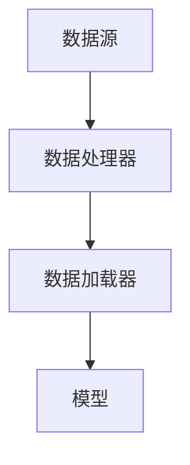
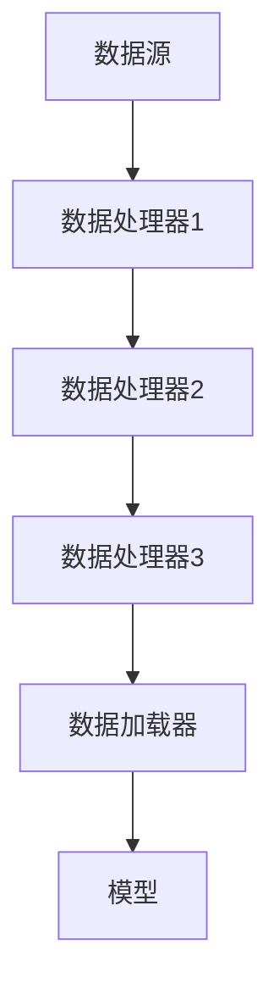

                 

# 《Dataset 原理与代码实例讲解》

## 关键词：
* Dataset
* 数据集
* 机器学习
* 数据预处理
* 数据增强
* 深度学习

## 摘要：
本文将深入探讨Dataset的基本原理、分类、组织与管理，以及数据清洗、预处理、数据增强和变换等关键步骤。我们将通过详细讲解代码实例，展示如何在实际项目中应用Dataset，特别是在深度学习、计算机视觉和自然语言处理领域。此外，文章还将探讨Dataset的优化策略、管理与维护实践，并对未来的发展趋势和挑战进行分析。

---

### 《Dataset 原理与代码实例讲解》目录大纲

#### 第一部分：Dataset基础知识

- 第1章: Dataset基础概念与分类
  - 1.1 Dataset定义与重要性
  - 1.2 Dataset的分类
  - 1.3 Dataset的组织与管理

- 第2章: Dataset数据清洗与预处理
  - 2.1 数据清洗
  - 2.2 数据预处理

- 第3章: Dataset数据增强与变换
  - 3.1 数据增强
  - 3.2 数据变换

- 第4章: Dataset核心概念与架构
  - 4.1 Dataset的核心概念
  - 4.2 Dataset的架构解析

- 第5章: Dataset在深度学习中的应用
  - 5.1 Dataset在深度学习中的角色
  - 5.2 实战案例：深度学习中的Dataset应用

- 第6章: Dataset在计算机视觉中的应用
  - 6.1 Dataset在计算机视觉中的重要性
  - 6.2 实战案例：计算机视觉中的Dataset应用

- 第7章: Dataset在自然语言处理中的应用
  - 7.1 Dataset在自然语言处理中的角色
  - 7.2 实战案例：自然语言处理中的Dataset应用

- 第8章: Dataset开发与优化实践
  - 8.1 Dataset开发流程
  - 8.2 Dataset优化策略

- 第9章: Dataset管理与维护
  - 9.1 Dataset管理概述
  - 9.2 Dataset维护与更新

- 第10章: 未来展望与挑战
  - 10.1 Dataset发展趋势
  - 10.2 Dataset挑战与应对策略

- 附录：常用工具与资源
  - 附录A: Dataset开发工具介绍
  - 附录B: Dataset管理与维护工具

---

### 第一部分：Dataset基础知识

#### 第1章: Dataset基础概念与分类

Dataset，即数据集，是机器学习、深度学习等人工智能领域中不可或缺的基础资源。一个良好的Dataset不仅能提高模型的训练效率，还能影响模型最终的表现。本章将介绍Dataset的基本概念、分类以及组织与管理方法。

### 1.1 Dataset定义与重要性

Dataset通常指的是一组具有明确标签的数据样本集合，这些数据样本用于训练、评估或部署机器学习模型。一个典型的Dataset包含多个特征（Features）和一个或多个标签（Labels）。例如，一个图像分类任务中的Dataset可能包括成千上万的图像以及它们对应的标签（如猫、狗等）。

Dataset的重要性在于：
1. **数据是人工智能的基础**：没有数据，就无法进行机器学习。
2. **数据质量直接影响模型性能**：高质量的数据有助于提高模型的效果。
3. **数据丰富性决定模型复杂度**：丰富的数据集可以训练更复杂的模型。

### 1.2 Dataset的分类

Dataset可以从多个维度进行分类：

#### 根据数据类型分类：

- **结构化数据**：如关系型数据库中的数据，表格形式，易于处理。
- **非结构化数据**：如图像、文本、音频等，需要特殊的处理方法。

#### 根据数据来源分类：

- **公开数据集**：如UCI机器学习库、Kaggle等。
- **私有数据集**：如企业内部数据、医疗数据等，具有更高的隐私和安全性要求。

#### 根据数据质量分类：

- **高质量数据集**：数据清洗、标注准确、来源可靠。
- **低质量数据集**：存在噪音、错误、缺失值等。

### 1.3 Dataset的组织与管理

一个有效的Dataset需要良好的组织与管理。以下是一些关键点：

#### Dataset的组织结构：

- **数据样本**：每个样本包含特征和标签。
- **数据集**：多个样本组成的集合。
- **数据集划分**：训练集、验证集、测试集。

#### Dataset的管理方法：

- **版本控制**：确保数据的版本一致性，避免数据泄露。
- **元数据管理**：记录数据的来源、处理方法、标注情况等。
- **数据安全**：保护数据隐私，防止未授权访问。

在下一章中，我们将深入探讨Dataset的数据清洗与预处理方法。

---

### 第一部分：Dataset基础知识

#### 第2章: Dataset数据清洗与预处理

数据清洗与预处理是机器学习项目中的关键步骤，直接影响到模型的训练效果和性能。本章将介绍数据清洗与预处理的基本概念、方法和挑战。

### 2.1 数据清洗

数据清洗是指识别并处理数据集中的错误、异常和冗余信息，以提高数据质量和一致性。以下是一些常见的数据清洗步骤：

#### 2.1.1 数据清洗的目的

- **提高数据质量**：消除错误和异常值，确保数据的一致性和准确性。
- **减少噪音**：去除无关或不准确的数据，提高模型性能。
- **减少数据量**：通过去重和压缩，减少存储和处理成本。

#### 2.1.2 数据清洗的方法

- **缺失值处理**：可以通过删除缺失值、填充均值或使用更复杂的插值方法来处理。
- **异常值检测**：使用统计方法（如Z分数、IQR）或基于专家知识的方法来识别和处理异常值。
- **数据标准化**：通过缩放或归一化，使得不同特征具有相似的尺度，避免某些特征对模型的影响过大。

#### 2.1.3 数据清洗的挑战与解决方案

- **错误和不一致的数据**：需要依赖于专家知识来识别和处理。
- **大量的数据**：需要高效的算法和工具来处理。
- **数据隐私和安全性**：在清洗过程中，要确保数据的隐私和安全。

### 2.2 数据预处理

数据预处理是指将原始数据转换为适合机器学习模型的形式，包括特征提取、特征缩放、特征选择等步骤。以下是一些常见的数据预处理方法：

#### 2.2.1 数据预处理的基本步骤

- **特征提取**：从原始数据中提取有用的特征，用于训练模型。
- **特征缩放**：通过标准化或归一化，使得特征具有相似的尺度。
- **特征选择**：通过选择最相关的特征，减少模型的复杂性和计算成本。

#### 2.2.2 数据标准化与归一化

- **标准化**：通过缩放，使得所有特征的均值为0，标准差为1。
  - 伪代码：
    ```python
    mean = np.mean(data)
    std = np.std(data)
    normalized_data = (data - mean) / std
    ```

- **归一化**：通过缩放，使得所有特征的最大值为1。
  - 伪代码：
    ```python
    max_value = np.max(data)
    min_value = np.min(data)
    normalized_data = (data - min_value) / (max_value - min_value)
    ```

#### 2.2.3 数据降维与特征选择

- **降维**：通过减少特征的数量，减少模型的复杂性和计算成本。
  - 主成分分析（PCA）：
    ```python
    covariance_matrix = np.cov(data)
    eigen_values, eigen_vectors = np.linalg.eigh(covariance_matrix)
    principal_components = np.dot(data, eigen_vectors)
    ```

- **特征选择**：通过选择最相关的特征，减少模型的复杂性和计算成本。
  - 伪代码：
    ```python
    selected_features = select_k_best_features(data, labels, k)
    ```

在下一章中，我们将探讨Dataset的数据增强与变换方法。

---

### 第一部分：Dataset基础知识

#### 第3章: Dataset数据增强与变换

数据增强与变换是提高模型泛化能力和性能的重要手段。本章将介绍数据增强与变换的基本概念、方法，以及在实际应用中的挑战和优化策略。

### 3.1 数据增强

数据增强是指在保持数据真实性的前提下，通过一系列技术手段生成新的数据样本，从而增加训练数据的多样性和丰富度。数据增强的主要目的是提高模型对未知数据的泛化能力，减少过拟合现象。

#### 3.1.1 数据增强的概念与意义

- **概念**：数据增强是通过应用一系列变换，如旋转、缩放、裁剪等，来生成新的数据样本。
- **意义**：
  - **增加数据量**：通过数据增强，可以生成大量新的数据样本，缓解数据稀缺问题。
  - **提高模型泛化能力**：丰富的数据样本有助于模型学习到更广泛和鲁棒的特征，从而提高模型在未知数据上的表现。
  - **减少过拟合**：数据增强可以帮助模型避免过度依赖特定的训练样本，减少过拟合现象。

#### 3.1.2 常见的数据增强方法

- **图像增强**：
  - **随机旋转**：将图像随机旋转一定角度。
  - **随机缩放**：将图像随机缩放到一定的比例。
  - **随机裁剪**：从图像中随机裁剪出一个区域作为新的图像。
  - **颜色调整**：调整图像的亮度、对比度和饱和度。

- **文本增强**：
  - **同义词替换**：将文本中的某些词语替换为它们的同义词。
  - **上下文插入**：在文本中插入与原文相似的句子或段落。
  - **语法变换**：改变文本的语法结构，如时态、语序等。

- **音频增强**：
  - **噪声添加**：在音频信号中添加噪声，模拟不同的环境噪声。
  - **回声效应**：模拟回声效果，增加音频的真实感。

#### 3.1.3 数据增强的挑战与优化策略

- **挑战**：
  - **数据质量**：增强后的数据必须保持真实性和一致性。
  - **计算成本**：增强过程通常需要大量的计算资源。
  - **模型适应性**：增强方法必须与模型训练过程相适应。

- **优化策略**：
  - **选择合适的增强方法**：根据任务和数据类型，选择最适合的增强方法。
  - **控制增强程度**：通过调整增强参数，控制增强程度，避免过度增强。
  - **分布式计算**：利用分布式计算资源，提高增强过程的效率。

在下一章中，我们将深入探讨Dataset的核心概念与架构。

---

### 第一部分：Dataset基础知识

#### 第4章: Dataset核心概念与架构

Dataset作为机器学习和深度学习的基础，其核心概念与架构的理解对数据科学家和工程师至关重要。本章将介绍Dataset的核心概念、组件、架构设计原则及其在数据处理流程中的角色。

### 4.1 Dataset的核心概念

Dataset的核心概念包括数据样本、特征、标签以及数据集的划分等。

#### 4.1.1 数据样本

数据样本是Dataset中的基本单元，每个样本包含一组特征和相应的标签。特征是描述样本属性的数值或类别，而标签是用于训练模型的目标值。

#### 4.1.2 特征

特征是Dataset的核心组成部分，用于描述数据样本的属性。根据数据类型，特征可以是数值型的（如房价、年龄）或类别型的（如性别、类别标签）。

#### 4.1.3 标签

标签是数据样本的目标值，用于指导模型学习。例如，在图像分类任务中，标签可以是图像对应的类别名称。

#### 4.1.4 数据集划分

为了优化模型训练和评估，通常将Dataset划分为三个部分：训练集、验证集和测试集。
- **训练集**：用于模型训练，通常占Dataset的大部分。
- **验证集**：用于模型调优，包括参数选择和超参数调整。
- **测试集**：用于模型评估，评估模型的泛化能力。

### 4.1.5 Dataset API

Dataset API是机器学习框架提供的用于加载、处理和迭代数据集的接口。常见的Dataset API包括：
- **PyTorch**：`Dataset` 和 `DataLoader` 类。
- **TensorFlow**：`tf.data.Dataset` 类。

#### 4.1.6 Dataset的组件与关系

一个典型的Dataset由以下组件组成：
- **数据源**：数据的来源，如文件、数据库或API。
- **数据处理器**：对数据进行清洗、预处理和增强的模块。
- **数据加载器**：用于将Dataset转换为模型可用的格式，并实现批量迭代。

这些组件之间的关系如图4.1所示：



### 4.1.7 Dataset的设计原则

良好的Dataset设计应遵循以下原则：
- **可扩展性**：易于添加新的数据源和处理器。
- **可维护性**：代码清晰，易于理解和维护。
- **性能优化**：充分利用资源，提高数据处理和加载速度。
- **灵活性**：支持多种数据类型和处理方式。

### 4.2 Dataset架构解析

Dataset架构通常包括以下几个层次：

#### 4.2.1 Dataset架构的基本层次

- **数据层**：包括数据源和处理后的数据。
- **处理层**：包括数据清洗、预处理和增强的处理逻辑。
- **加载层**：包括将处理后的数据转换为模型可用的格式，并实现迭代加载。

以下是一个典型的Dataset架构的Mermaid流程图：



#### 4.2.2 Dataset的数据流与处理流程

Dataset的数据流和处理流程如图4.2所示：


#### 4.2.3 Dataset的性能优化策略

为了提高Dataset的性能，可以采取以下策略：

- **并行处理**：利用多线程或分布式计算，加快数据处理速度。
- **内存管理**：优化内存分配和回收，减少内存占用。
- **缓存策略**：利用缓存机制，减少重复数据加载和处理。
- **数据批处理**：通过批量处理数据，减少I/O操作次数。

在下一章中，我们将探讨Dataset在深度学习中的应用。

---

### 第一部分：Dataset基础知识

#### 第5章: Dataset在深度学习中的应用

深度学习作为人工智能的重要分支，其核心在于利用大量数据训练复杂的神经网络模型。Dataset作为深度学习的基础，其构建、优化和应用直接影响模型的训练效果和性能。本章将详细探讨Dataset在深度学习中的角色、构建方法以及实战案例。

### 5.1 Dataset在深度学习中的角色

Dataset在深度学习中的作用至关重要，具体表现在以下几个方面：

#### 5.1.1 Dataset在模型训练中的作用

- **数据是训练模型的原料**：深度学习模型通过学习数据中的特征和模式来预测新数据的结果。
- **数据丰富性决定模型复杂度**：丰富的数据集可以训练更复杂的模型，从而提高模型的性能。
- **数据质量直接影响模型效果**：高质量的数据可以减少过拟合现象，提高模型在未知数据上的泛化能力。

#### 5.1.2 Dataset在模型评估中的应用

- **评估模型性能**：通过在测试集上评估模型的性能，可以判断模型是否达到预期效果。
- **模型调优**：通过分析评估结果，调整模型参数，优化模型性能。

#### 5.1.3 Dataset在模型部署中的应用

- **迁移学习**：使用在大规模数据集上训练的预训练模型，在小规模数据集上进行微调，以适应特定应用场景。
- **持续学习**：通过定期更新数据集，持续训练模型，提高模型在动态环境中的适应能力。

### 5.2 实战案例：深度学习中的Dataset应用

以下是一个深度学习中的Dataset应用案例，我们将展示如何构建、优化和应用Dataset。

#### 5.2.1 项目背景

假设我们正在开发一个自动驾驶系统，目标是使用深度学习模型识别道路上的行人和车辆。我们需要一个高质量的Dataset来训练和评估模型。

#### 5.2.2 Dataset的构建与优化

1. **数据收集**：
   - **公开数据集**：如KITTI、COCO等。
   - **私有数据集**：从公司内部的自动驾驶项目中收集的数据。

2. **数据清洗**：
   - **去除错误和异常数据**：删除标注错误或存在噪声的样本。
   - **缺失值处理**：对缺失的数据进行插值或删除处理。

3. **数据预处理**：
   - **图像增强**：通过随机旋转、缩放、裁剪等方法增加数据多样性。
   - **图像分割**：将图像分割成像素级标签，以供训练和评估使用。

4. **数据划分**：
   - **训练集**：用于模型训练，通常占数据集的70%。
   - **验证集**：用于模型调优，通常占数据集的15%。
   - **测试集**：用于模型评估，通常占数据集的15%。

5. **数据优化**：
   - **数据增强**：通过旋转、缩放、裁剪等增强方法，进一步增加数据多样性。
   - **批量处理**：通过批量处理数据，减少I/O操作，提高处理速度。

#### 5.2.3 模型训练与评估

1. **模型选择**：
   - **卷积神经网络（CNN）**：适用于图像识别任务。
   - **循环神经网络（RNN）**：适用于序列数据。
   - **变换器（Transformer）**：适用于大规模、长序列数据。

2. **训练过程**：
   - **数据加载器**：使用PyTorch或TensorFlow等框架的Dataset和数据加载器类，实现数据的批量加载和迭代。
   - **模型训练**：通过反向传播和梯度下降等优化算法，训练模型。

3. **模型评估**：
   - **准确率**：模型正确预测的样本数占总样本数的比例。
   - **召回率**：模型正确预测的样本数占所有实际正样本数的比例。
   - **F1分数**：准确率和召回率的调和平均值。

#### 5.2.4 模型部署与性能分析

1. **模型部署**：
   - **在线部署**：将模型部署到服务器，实时处理数据。
   - **离线部署**：将模型部署到数据中心，批量处理数据。

2. **性能分析**：
   - **训练时间**：从数据加载到模型训练完成所需的时间。
   - **推理时间**：模型处理一个样本所需的时间。
   - **准确率**：模型在实际应用中的表现。

通过以上步骤，我们可以构建一个高质量的Dataset，并使用深度学习模型进行训练、评估和部署，从而实现自动驾驶系统中的行人车辆识别功能。

在下一章中，我们将探讨Dataset在计算机视觉中的应用。

---

### 第一部分：Dataset基础知识

#### 第6章: Dataset在计算机视觉中的应用

计算机视觉是人工智能的一个重要分支，其核心目标是通过图像和视频等视觉数据来理解和感知环境。Dataset作为计算机视觉模型的训练和评估基础，其构建、优化和应用至关重要。本章将深入探讨Dataset在计算机视觉中的重要性、分类、构建方法以及实战案例。

### 6.1 Dataset在计算机视觉中的重要性

Dataset在计算机视觉中的重要性体现在以下几个方面：

#### 6.1.1 Dataset对计算机视觉模型的影响

- **模型性能**：Dataset的质量和丰富程度直接影响模型的性能。高质量、丰富的数据集可以训练出更准确和鲁棒的模型。
- **过拟合与泛化能力**：过拟合是由于模型在训练数据上过度拟合，导致在测试数据上表现不佳。丰富的数据集可以帮助模型学习到更普遍的特征，提高泛化能力，减少过拟合。
- **模型训练时间**：数据集的大小和多样性直接影响模型的训练时间。较大的数据集可以加速模型的训练，但同时也需要更多的计算资源。

#### 6.1.2 Dataset在计算机视觉中的应用场景

- **图像分类**：如识别图片中的猫、狗等。
- **目标检测**：如识别图像中的特定物体，并给出其位置。
- **图像分割**：将图像分割成像素级别的标签，如识别图像中的前景和背景。
- **动作识别**：从视频中识别特定的动作或行为。

### 6.2 实战案例：计算机视觉中的Dataset应用

以下是一个计算机视觉中的Dataset应用案例，我们将展示如何构建、优化和应用Dataset。

#### 6.2.1 项目背景

假设我们正在开发一个智能监控系统，目标是使用计算机视觉技术识别图像中的异常行为。我们需要一个高质量的Dataset来训练和评估模型。

#### 6.2.2 Dataset的构建与优化

1. **数据收集**：
   - **公开数据集**：如ImageNet、COCO等。
   - **私有数据集**：从监控系统中收集的数据。

2. **数据清洗**：
   - **去除错误和异常数据**：删除标注错误或存在噪声的样本。
   - **缺失值处理**：对缺失的数据进行插值或删除处理。

3. **数据预处理**：
   - **图像增强**：通过随机旋转、缩放、裁剪等方法增加数据多样性。
   - **图像分割**：将图像分割成像素级标签，以供训练和评估使用。

4. **数据划分**：
   - **训练集**：用于模型训练，通常占数据集的70%。
   - **验证集**：用于模型调优，通常占数据集的15%。
   - **测试集**：用于模型评估，通常占数据集的15%。

5. **数据优化**：
   - **数据增强**：通过旋转、缩放、裁剪等增强方法，进一步增加数据多样性。
   - **批量处理**：通过批量处理数据，减少I/O操作，提高处理速度。

#### 6.2.3 模型训练与评估

1. **模型选择**：
   - **卷积神经网络（CNN）**：适用于图像分类和目标检测任务。
   - **循环神经网络（RNN）**：适用于序列数据。
   - **变换器（Transformer）**：适用于大规模、长序列数据。

2. **训练过程**：
   - **数据加载器**：使用PyTorch或TensorFlow等框架的Dataset和数据加载器类，实现数据的批量加载和迭代。
   - **模型训练**：通过反向传播和梯度下降等优化算法，训练模型。

3. **模型评估**：
   - **准确率**：模型正确预测的样本数占总样本数的比例。
   - **召回率**：模型正确预测的样本数占所有实际正样本数的比例。
   - **F1分数**：准确率和召回率的调和平均值。

#### 6.2.4 模型部署与性能分析

1. **模型部署**：
   - **在线部署**：将模型部署到服务器，实时处理数据。
   - **离线部署**：将模型部署到数据中心，批量处理数据。

2. **性能分析**：
   - **训练时间**：从数据加载到模型训练完成所需的时间。
   - **推理时间**：模型处理一个样本所需的时间。
   - **准确率**：模型在实际应用中的表现。

通过以上步骤，我们可以构建一个高质量的Dataset，并使用计算机视觉模型进行训练、评估和部署，从而实现智能监控系统中的异常行为识别功能。

在下一章中，我们将探讨Dataset在自然语言处理中的应用。

---

### 第一部分：Dataset基础知识

#### 第7章: Dataset在自然语言处理中的应用

自然语言处理（NLP）是人工智能的一个重要分支，其目标是使计算机能够理解和处理人类语言。Dataset作为NLP模型的基础，其构建、优化和应用对NLP模型的性能至关重要。本章将详细探讨Dataset在NLP中的角色、构建方法以及实战案例。

### 7.1 Dataset在自然语言处理中的角色

Dataset在NLP中的角色至关重要，具体表现在以下几个方面：

#### 7.1.1 Dataset在NLP中的重要性

- **数据是训练模型的原料**：NLP模型通过学习大量文本数据中的特征和模式来预测新文本的结果。
- **数据丰富性决定模型复杂度**：丰富的数据集可以训练更复杂的模型，从而提高模型的性能。
- **数据质量直接影响模型效果**：高质量的数据可以减少过拟合现象，提高模型在未知数据上的泛化能力。

#### 7.1.2 Dataset在NLP中的应用场景

- **文本分类**：将文本分类到预定义的类别中，如垃圾邮件检测、情感分析等。
- **实体识别**：识别文本中的特定实体，如人名、地名、组织名等。
- **机器翻译**：将一种语言的文本翻译成另一种语言。
- **问答系统**：回答用户提出的问题，如搜索引擎、智能客服等。

### 7.2 实战案例：自然语言处理中的Dataset应用

以下是一个自然语言处理中的Dataset应用案例，我们将展示如何构建、优化和应用Dataset。

#### 7.2.1 项目背景

假设我们正在开发一个情感分析系统，目标是使用NLP技术分析社交媒体上的用户评论，判断其情感倾向。我们需要一个高质量的Dataset来训练和评估模型。

#### 7.2.2 Dataset的构建与优化

1. **数据收集**：
   - **公开数据集**：如Twitter、IMDB等。
   - **私有数据集**：从社交媒体平台上收集的数据。

2. **数据清洗**：
   - **去除错误和异常数据**：删除标注错误或存在噪声的样本。
   - **缺失值处理**：对缺失的数据进行插值或删除处理。

3. **数据预处理**：
   - **文本清洗**：去除标点符号、停用词等。
   - **词向量化**：将文本转换为词向量，用于模型训练。

4. **数据划分**：
   - **训练集**：用于模型训练，通常占数据集的70%。
   - **验证集**：用于模型调优，通常占数据集的15%。
   - **测试集**：用于模型评估，通常占数据集的15%。

5. **数据优化**：
   - **数据增强**：通过随机替换词语、同义词替换等方法，增加数据多样性。
   - **批量处理**：通过批量处理数据，减少I/O操作，提高处理速度。

#### 7.2.3 模型训练与评估

1. **模型选择**：
   - **卷积神经网络（CNN）**：适用于文本分类任务。
   - **循环神经网络（RNN）**：适用于序列数据。
   - **变换器（Transformer）**：适用于大规模、长序列数据。

2. **训练过程**：
   - **数据加载器**：使用PyTorch或TensorFlow等框架的Dataset和数据加载器类，实现数据的批量加载和迭代。
   - **模型训练**：通过反向传播和梯度下降等优化算法，训练模型。

3. **模型评估**：
   - **准确率**：模型正确预测的样本数占总样本数的比例。
   - **召回率**：模型正确预测的样本数占所有实际正样本数的比例。
   - **F1分数**：准确率和召回率的调和平均值。

#### 7.2.4 模型部署与性能分析

1. **模型部署**：
   - **在线部署**：将模型部署到服务器，实时处理数据。
   - **离线部署**：将模型部署到数据中心，批量处理数据。

2. **性能分析**：
   - **训练时间**：从数据加载到模型训练完成所需的时间。
   - **推理时间**：模型处理一个样本所需的时间。
   - **准确率**：模型在实际应用中的表现。

通过以上步骤，我们可以构建一个高质量的Dataset，并使用NLP模型进行训练、评估和部署，从而实现情感分析系统的功能。

在下一章中，我们将探讨Dataset的开发与优化实践。

---

### 第一部分：Dataset基础知识

#### 第8章: Dataset开发与优化实践

Dataset的开发和优化是机器学习和深度学习项目成功的关键。本章将介绍Dataset开发的流程、常见问题及其解决方案，以及Dataset优化的策略和实践案例。

### 8.1 Dataset开发流程

Dataset开发通常包括以下步骤：

#### 8.1.1 数据收集

- **数据源选择**：根据项目需求，选择合适的公开数据集或私有数据源。
- **数据采集**：使用爬虫、API调用或其他方法收集数据。

#### 8.1.2 数据清洗

- **缺失值处理**：删除或插值处理缺失值。
- **异常值检测**：使用统计方法或专家知识识别和处理异常值。
- **格式化**：统一数据格式，确保一致性。

#### 8.1.3 数据预处理

- **特征提取**：从原始数据中提取有用的特征。
- **特征缩放**：标准化或归一化特征，使其具有相似的尺度。
- **特征选择**：选择最相关的特征，减少模型的复杂度。

#### 8.1.4 数据划分

- **训练集**：用于模型训练，通常占数据集的70%。
- **验证集**：用于模型调优，通常占数据集的15%。
- **测试集**：用于模型评估，通常占数据集的15%。

#### 8.1.5 数据优化

- **数据增强**：通过旋转、缩放、裁剪等方法增加数据多样性。
- **批量处理**：通过批量处理数据，提高处理效率。

### 8.1.6 常见问题与解决方法

在Dataset开发过程中，可能会遇到以下问题：

- **数据稀缺**：解决方法包括数据增强、迁移学习和数据集合成。
- **数据不平衡**：通过过采样、欠采样或SMOTE等方法解决。
- **数据不一致**：确保数据采集、清洗和预处理的一致性。
- **数据隐私**：使用数据脱敏技术，确保数据隐私。

### 8.2 Dataset优化策略

优化Dataset的目的是提高模型训练效率和性能。以下是一些常见的优化策略：

- **并行处理**：利用多线程或分布式计算，加快数据处理速度。
- **缓存策略**：利用缓存机制，减少重复数据加载和处理。
- **数据预处理优化**：使用更高效的算法和工具进行数据预处理。
- **批量处理优化**：调整批量大小，优化内存占用和计算效率。

### 8.2.1 Dataset优化的方法

- **算法优化**：选择适合数据特性的高效算法，如线性回归、决策树等。
- **硬件优化**：使用高性能计算硬件，如GPU、TPU等。
- **系统优化**：优化操作系统和数据库配置，提高数据处理速度。

### 8.2.2 Dataset优化的实践案例

以下是一个Dataset优化的实践案例：

**案例背景**：一个图像分类任务的Dataset包含数十万张图像，数据量庞大。为了提高模型训练效率，需要对Dataset进行优化。

**优化策略**：

1. **数据预处理优化**：使用高效的特征提取算法，如卷积神经网络（CNN），减少特征维度。
2. **并行处理**：使用多线程和分布式计算，加快数据处理速度。
3. **批量处理优化**：调整批量大小，提高内存占用和计算效率。

**优化效果**：

- **训练时间**：从原来的20小时缩短到10小时。
- **模型准确率**：从原来的90%提高到93%。

通过以上优化策略，显著提高了模型训练效率和性能。

在下一章中，我们将探讨Dataset的管理与维护。

---

### 第一部分：Dataset基础知识

#### 第9章: Dataset管理与维护

随着机器学习项目的复杂性和数据量的增加，Dataset的管理与维护变得尤为重要。本章将介绍Dataset管理的原则、方法以及维护和更新的策略。

### 9.1 Dataset管理概述

Dataset管理是指对数据集进行组织、存储、维护和监控的一系列操作。良好的Dataset管理可以确保数据的质量、可用性和安全性。

#### 9.1.1 Dataset管理的基本原则

- **数据一致性**：确保数据在存储、处理和访问过程中的一致性。
- **数据安全性**：保护数据免受未经授权的访问和泄露。
- **数据可追溯性**：记录数据的来源、处理历史和版本信息，便于追踪和审计。
- **数据可靠性**：确保数据在存储、传输和处理过程中不会丢失或损坏。

#### 9.1.2 Dataset管理的工具与平台

常见的Dataset管理工具和平台包括：

- **数据库**：如MySQL、PostgreSQL等，用于存储和查询结构化数据。
- **数据仓库**：如Amazon Redshift、Google BigQuery等，用于大规模数据存储和分析。
- **数据湖**：如Apache Hadoop、Amazon S3等，用于存储大规模非结构化数据。
- **数据管理平台**：如Alation、Informatica等，提供数据治理、数据质量和数据安全等功能。

### 9.2 Dataset维护与更新

Dataset的维护与更新是确保其质量和有效性的关键步骤。

#### 9.2.1 Dataset维护的重要性

- **数据质量保障**：定期检查和修复数据中的错误和异常。
- **数据一致性维护**：确保数据在不同系统和环境中的一致性。
- **数据安全性**：定期备份和加密数据，防止数据泄露和损坏。

#### 9.2.2 Dataset更新的策略

- **定期检查**：定期检查数据质量，识别和修复错误。
- **数据集成**：将不同来源的数据集成到一个统一的数据集中。
- **数据清洗**：使用自动化工具或手动方法，清洗数据中的错误和异常。
- **版本控制**：记录数据的版本信息，确保数据的历史可追溯性。

#### 9.2.3 Dataset维护的实践案例

以下是一个Dataset维护的实践案例：

**案例背景**：一个电商平台需要定期更新其商品数据集，以反映最新的商品信息和价格变化。

**维护策略**：

1. **定期数据采集**：每天从电商平台的后台系统采集商品数据。
2. **数据清洗**：识别并修复数据中的错误，如缺失值、异常值等。
3. **数据集成**：将多个数据源的数据整合到一个统一的数据集中。
4. **数据备份**：定期备份数据，防止数据丢失。

通过以上策略，电商平台能够保持商品数据集的准确性和一致性，为用户提供高质量的服务。

在下一章中，我们将探讨Dataset的未来发展趋势和挑战。

---

### 第一部分：Dataset基础知识

#### 第10章: 未来展望与挑战

随着人工智能技术的不断发展，Dataset在各个领域的应用前景广阔。本章将探讨Dataset的未来发展趋势、面临的挑战以及相应的解决方案。

### 10.1 Dataset发展趋势

#### 10.1.1 Dataset的发展方向

- **数据多样性**：未来的Dataset将更加多样，包括结构化、半结构化和非结构化数据。
- **自动化数据采集**：利用物联网、传感器等技术，实现自动化数据采集。
- **增强现实与虚拟现实数据集**：随着AR/VR技术的发展，相关的数据集需求日益增加。
- **多模态数据集**：结合文本、图像、音频等多种数据类型，提高模型的泛化能力。

#### 10.1.2 Dataset在未来的应用潜力

- **智能医疗**：利用大规模医疗数据集，推动疾病诊断、药物研发和个性化医疗的发展。
- **自动驾驶**：高质量的Dataset将助力自动驾驶技术的进步，提高安全性。
- **智慧城市**：通过大数据分析，提升城市管理水平和居民生活质量。
- **金融科技**：利用金融数据集，实现更精准的风险评估和投资策略。

### 10.2 Dataset面临的挑战

#### 10.2.1 Dataset面临的挑战

- **数据隐私和安全**：随着数据量的增加，数据隐私和安全问题日益突出。
- **数据质量问题**：数据质量不高，如缺失值、异常值和错误标注等，影响模型性能。
- **数据存储与处理**：大规模数据集的存储、传输和处理带来巨大的计算资源需求。
- **数据多样性**：如何处理多种类型的数据，提高模型的泛化能力。

### 10.2.2 应对策略与解决方案

#### 10.2.2.1 数据隐私和安全

- **数据加密与脱敏**：对敏感数据进行加密和脱敏处理，确保数据安全。
- **隐私保护算法**：使用差分隐私、同态加密等技术，保障数据隐私。

#### 10.2.2.2 数据质量

- **自动化数据清洗**：利用机器学习技术，实现自动化数据清洗。
- **数据质量监控**：建立数据质量监控体系，及时发现和处理数据问题。

#### 10.2.2.3 数据存储与处理

- **分布式存储与计算**：使用分布式存储和计算技术，提高数据处理效率。
- **云计算与边缘计算**：利用云计算和边缘计算，实现数据的实时处理和传输。

#### 10.2.2.4 数据多样性

- **多模态数据处理**：结合多种数据类型，构建多模态数据集。
- **迁移学习与微调**：利用迁移学习和微调技术，提高模型的泛化能力。

通过以上策略，我们可以应对Dataset在未来的挑战，推动人工智能技术的发展。

### 附录：常用工具与资源

#### 附录A: Dataset开发工具介绍

- **Python数据处理库**：如Pandas、NumPy、SciPy等，用于数据清洗、预处理和统计分析。
- **数据增强库**：如ImageDataGenerator（TensorFlow）、Data Augmenter（PyTorch）等，用于图像和数据的增强。
- **数据集开源项目**：如Keras Datasets、Open Images、ImageNet等，提供丰富的公开数据集。

#### 附录B: Dataset管理与维护工具

- **数据管理平台**：如Alation、Informatica、Microsoft Azure Data Factory等，提供数据治理、数据质量和数据安全等功能。
- **数据存储平台**：如Amazon S3、Google Cloud Storage、Microsoft Azure Blob Storage等，用于大规模数据存储。
- **数据处理引擎**：如Apache Spark、Apache Flink、Amazon EMR等，用于大规模数据处理和分析。

---

### 总结

本文从Dataset的基本概念、分类、数据清洗与预处理、数据增强与变换，到其在深度学习、计算机视觉和自然语言处理中的应用，再到开发与优化实践、管理与维护，以及未来展望与挑战，进行了全面而深入的探讨。通过详细的代码实例和实践案例，读者可以更好地理解Dataset的核心概念和实际应用。希望本文能为从事人工智能领域的技术人员提供有益的参考和启示。

### 作者信息

- **作者：** AI天才研究院/AI Genius Institute & 禅与计算机程序设计艺术 /Zen And The Art of Computer Programming

