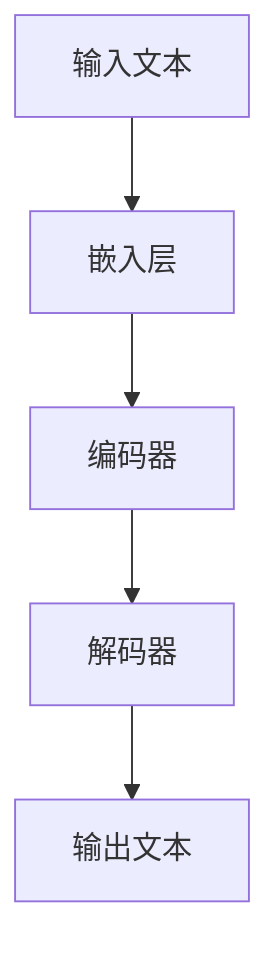
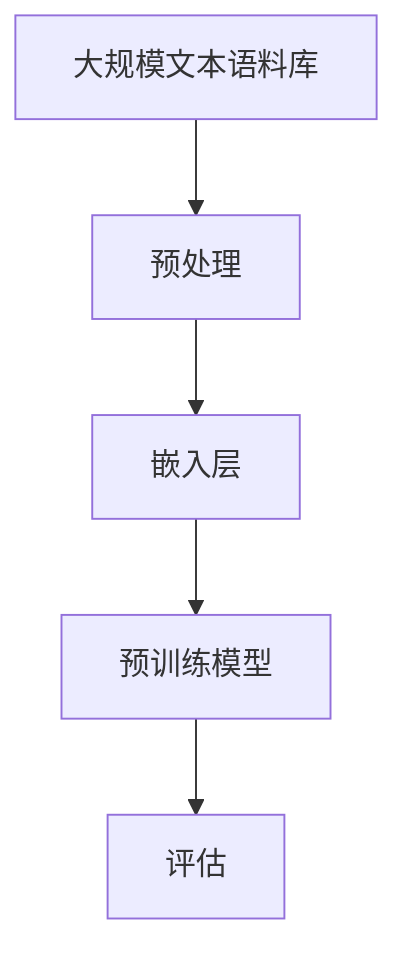
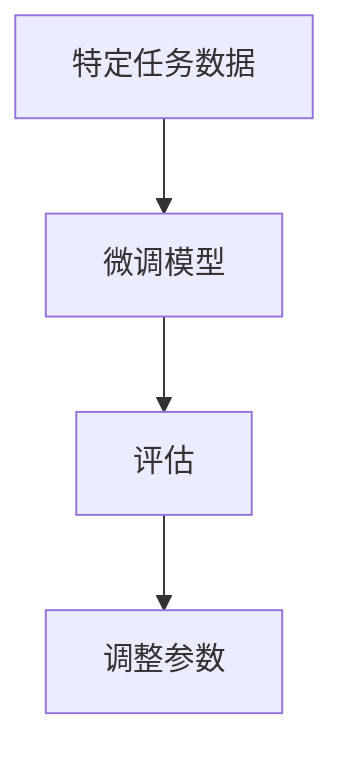
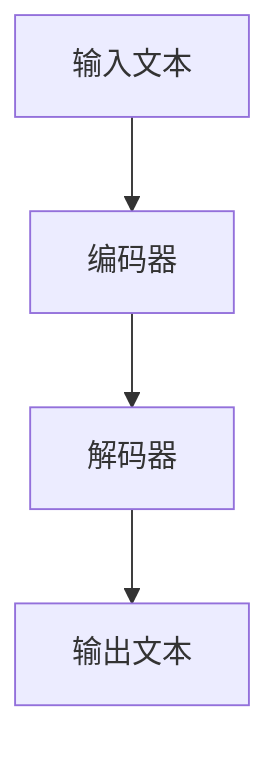

                 

# 《LLM应用的MVP策略：快速验证产品价值》

> **关键词：**大型语言模型（LLM）、最小可行产品（MVP）、产品验证、快速迭代、人工智能应用

> **摘要：**本文将深入探讨在人工智能领域，特别是大型语言模型（LLM）应用中，如何通过最小可行产品（MVP）策略来快速验证产品的市场价值和用户需求，从而指导产品的设计与开发。文章将从LLM的基础概念、架构设计、MVP策略概述、具体案例研究到策略优化与拓展进行全面阐述，为开发者提供实用的实战指南和资源。

---

## 第一部分：前言与概述

### 1.1 引言与背景

#### 1.1.1 为什么要关注LLM应用

近年来，人工智能（AI）技术在各个领域取得了显著的进展，尤其是在自然语言处理（NLP）方面。大型语言模型（LLM，Large Language Models）作为NLP领域的重要突破，已经展现出强大的应用潜力。LLM能够处理和理解复杂的语言结构，生成高质量的自然语言文本，为各种应用场景提供了强有力的支持。

随着LLM技术的不断发展，如何有效地应用这些技术成为了一个重要课题。然而，在实际应用中，开发者往往面临着如何快速验证产品价值、降低开发风险等问题。最小可行产品（MVP，Minimum Viable Product）策略提供了一个有效的解决方案。

#### 1.1.2 MVP的概念及其重要性

MVP是一种产品开发策略，其核心思想是通过构建具有基本功能的初步产品版本，来验证市场需求和用户反馈，从而指导产品的进一步迭代和优化。MVP的重要性在于：

1. **降低开发风险**：通过最小化产品功能，降低开发成本和风险。
2. **快速验证价值**：快速推出产品，收集用户反馈，验证产品价值。
3. **指导产品迭代**：根据用户反馈调整产品方向，确保产品满足市场需求。

#### 1.1.3 本书的目标与结构

本书的目标是详细介绍如何在LLM应用中采用MVP策略，快速验证产品价值。文章将分为六个部分：

1. **前言与概述**：介绍LLM应用和MVP策略的重要性。
2. **LLM基础概念与架构**：探讨LLM的基本概念、架构设计和工作原理。
3. **LLM应用的MVP策略**：详细阐述MVP策略在LLM应用中的关键步骤。
4. **LLM应用案例研究**：通过具体案例展示MVP策略的实际应用。
5. **MVP策略的优化与拓展**：讨论MVP策略的优化方法以及LLM应用的拓展场景。
6. **实战指南与资源**：提供实用的开发环境和资源。

接下来的部分将深入探讨LLM的基础概念与架构设计，为后续内容打下坚实的基础。


### 1.2 大型语言模型（LLM）的基本概念

#### 1.2.1 语言模型的发展历程

语言模型是自然语言处理（NLP）领域的基础，旨在预测下一个单词或句子。语言模型的发展经历了从简单的统计模型到深度学习模型的演变。

- **早期统计模型**：如N-gram模型，通过统计词频和词序来预测下一个单词。
- **现代深度学习模型**：如循环神经网络（RNN）和其变体，包括长短期记忆网络（LSTM）和门控循环单元（GRU）。

近年来，随着计算能力的提升和数据规模的扩大，大型语言模型（LLM）逐渐成为研究热点。LLM通过大规模预训练，能够捕捉到语言的复杂结构，生成更加自然和高质量的文本。

#### 1.2.2 LLM的组成与原理

LLM通常由以下几部分组成：

1. **嵌入层（Embedding Layer）**：将输入文本转换为固定长度的向量表示。
2. **编码器（Encoder）**：对输入文本进行处理，提取语义特征。
3. **解码器（Decoder）**：根据编码器的输出生成输出文本。

LLM的工作原理可以概括为以下几个步骤：

1. **预训练**：在大规模文本语料库上预训练模型，使其学会理解和生成语言。
2. **微调**：在特定任务上微调模型，使其适应特定应用场景。
3. **推理**：在推理阶段，模型根据输入文本生成输出文本。

#### 1.2.3 LLM的核心技术

LLM的核心技术主要包括：

1. **大规模预训练**：通过在大量文本数据上预训练，模型能够学习到语言的底层结构。
2. **上下文理解**：LLM能够理解上下文信息，生成更加连贯和自然的文本。
3. **自适应学习**：通过微调和调整模型参数，LLM能够适应不同的应用场景。

### 1.3 LLM的架构设计

#### 1.3.1 模型结构

LLM的模型结构通常包括以下几个部分：

1. **输入层**：接收输入文本，将其转换为嵌入向量。
2. **隐藏层**：包含多个隐藏层，用于提取语义特征。
3. **输出层**：生成输出文本。

LLM的常见结构包括Transformer、BERT、GPT等。这些模型通过不同的设计思路和优化策略，实现了对语言的深入理解和生成。

#### 1.3.2 训练与推理流程

1. **训练流程**：
   - **预训练**：在大量文本语料库上预训练模型。
   - **微调**：在特定任务上微调模型，优化模型参数。
   - **评估**：通过评估指标（如Perplexity）评估模型性能。

2. **推理流程**：
   - **输入文本**：输入需要处理的文本。
   - **编码器处理**：编码器处理输入文本，提取语义特征。
   - **解码器生成**：解码器根据编码器的输出生成输出文本。

#### 1.3.3 参数优化与调整

LLM的参数优化与调整是模型性能的关键。常见的优化方法包括：

1. **梯度下降**：通过优化算法更新模型参数。
2. **权重共享**：共享不同层之间的权重，减少参数数量。
3. **学习率调整**：根据训练过程调整学习率，避免过拟合。

### 1.4 Mermaid流程图：LLM工作原理

以下是一个简单的Mermaid流程图，展示了LLM的工作原理：



#### 1.4.1 大规模预训练过程

大规模预训练过程是LLM的核心。以下是一个简单的Mermaid流程图，展示了大规模预训练过程：



#### 1.4.2 微调与适应性

微调和适应性是LLM在特定任务上的优化过程。以下是一个简单的Mermaid流程图，展示了微调与适应性过程：



#### 1.4.3 推理与生成

推理与生成是LLM在应用中的关键过程。以下是一个简单的Mermaid流程图，展示了推理与生成过程：



通过这些流程图，我们可以更直观地理解LLM的工作原理和架构设计。在接下来的部分，我们将深入探讨LLM应用的MVP策略，帮助开发者快速验证产品的市场价值和用户需求。

### 1.5 LLM应用的MVP策略概述

#### 1.5.1 MVP的定义与特点

MVP（Minimum Viable Product）是一种产品开发策略，其核心理念是通过构建具有基本功能的初步产品版本，来验证市场需求和用户反馈，从而指导产品的进一步迭代和优化。MVP的特点包括：

1. **最小化功能**：仅包含实现产品核心价值所需的最少功能。
2. **快速迭代**：快速开发、测试和迭代产品，以适应市场需求。
3. **用户反馈**：通过用户反馈来指导产品开发和优化。

#### 1.5.2 MVP的优势与局限

MVP策略在LLM应用中的优势：

1. **降低开发风险**：通过最小化功能，降低开发成本和风险。
2. **快速验证价值**：快速推出产品，收集用户反馈，验证产品价值。
3. **灵活调整**：根据用户反馈和市场变化，灵活调整产品方向。

MVP策略的局限：

1. **功能受限**：由于MVP仅包含基本功能，可能无法满足所有用户需求。
2. **用户体验问题**：初步产品版本可能存在用户体验问题，需要后续迭代优化。

#### 1.5.3 MVP在LLM应用中的适用性

MVP策略在LLM应用中具有很高的适用性：

1. **快速验证技术价值**：通过MVP策略，可以快速验证LLM技术的实际应用价值。
2. **优化产品方向**：根据用户反馈，调整产品功能和方向，确保产品满足市场需求。
3. **降低开发成本**：通过MVP策略，可以降低开发成本和风险，提高开发效率。

在接下来的部分，我们将详细探讨LLM应用的MVP策略关键步骤，帮助开发者实现产品的快速验证和优化。


### 1.6 LLM应用的MVP关键步骤

在LLM应用中，采用MVP策略可以有效地降低开发风险，快速验证产品价值。以下是LLM应用MVP策略的关键步骤：

#### 1.6.1 需求分析

需求分析是MVP策略的第一步，目的是明确产品目标、用户需求和功能需求。具体步骤如下：

1. **市场调研**：通过市场调研了解潜在用户的需求和偏好，识别市场机会。
2. **用户访谈**：与潜在用户进行访谈，深入了解用户对LLM应用的期望和需求。
3. **需求收集**：整理和分析市场调研和用户访谈的结果，确定产品的核心功能和目标用户群体。

#### 1.6.2 确定最小可行产品（MVP）

在明确需求后，下一步是确定MVP。MVP的目标是构建一个具有基本功能的初步产品版本，以验证市场需求和用户反馈。具体步骤如下：

1. **功能筛选**：根据需求分析的结果，筛选出实现产品核心价值所需的最少功能。
2. **优先级排序**：对筛选出的功能进行优先级排序，确定哪些功能是必须实现的，哪些功能可以暂缓或省略。
3. **制定MVP计划**：根据功能筛选和优先级排序的结果，制定MVP的计划和时间表。

#### 1.6.3 MVP开发与验证

在确定MVP计划后，进入开发阶段。开发MVP的具体步骤如下：

1. **开发环境搭建**：搭建适合开发MVP的硬件和软件环境，包括计算资源、开发工具和框架。
2. **代码实现**：根据MVP计划，实现核心功能，并确保代码的可维护性和可扩展性。
3. **测试与优化**：对MVP进行测试，确保其功能符合预期，并优化性能和用户体验。

MVP开发完成后，需要通过以下步骤进行验证：

1. **用户测试**：邀请目标用户进行测试，收集用户反馈，评估产品的用户体验和功能满意度。
2. **数据分析**：通过数据分析，评估MVP的市场表现，包括用户活跃度、留存率和转化率等指标。
3. **迭代优化**：根据用户反馈和数据分析结果，对MVP进行迭代优化，进一步提高产品的市场价值和用户满意度。

#### 1.6.4 伪代码：LLM应用的MVP策略

以下是LLM应用MVP策略的伪代码：

```python
# 需求分析
def analyze_requirements():
    # 市场调研
    market_data = conduct_market_research()
    # 用户访谈
    user_requirements = conduct_user_interviews()
    # 需求收集
    collected_requirements = collect_requirements(market_data, user_requirements)
    return collected_requirements

# 确定MVP
def determine_mvp(collected_requirements):
    # 功能筛选
    selected_functions = filter_functions(collected_requirements)
    # 优先级排序
    sorted_functions = sort_functions(selected_functions)
    # 制定MVP计划
    mvp_plan = create_mvp_plan(sorted_functions)
    return mvp_plan

# MVP开发与验证
def develop_and_verify_mvp(mvp_plan):
    # 开发环境搭建
    setup_development_environment()
    # 代码实现
    implement_code(mvp_plan)
    # 测试与优化
    test_and_optimize_mvp()
    # 用户测试
    user_feedback = conduct_user_testing()
    # 数据分析
    data_analysis = analyze_data(user_feedback)
    # 迭代优化
    iterate_and_optimize_mvp(data_analysis)
    return user_feedback, data_analysis

# 主函数
def main():
    # 需求分析
    collected_requirements = analyze_requirements()
    # 确定MVP
    mvp_plan = determine_mvp(collected_requirements)
    # MVP开发与验证
    user_feedback, data_analysis = develop_and_verify_mvp(mvp_plan)
    # 输出结果
    print("用户反馈：", user_feedback)
    print("数据分析：", data_analysis)

# 调用主函数
main()
```

通过上述伪代码，我们可以清晰地了解LLM应用MVP策略的步骤和流程。在接下来的部分，我们将通过具体案例研究，进一步展示MVP策略在实际应用中的效果。


## 第二部分：LLM应用案例研究

在本部分中，我们将通过三个具体案例，展示如何在实际应用中使用LLM和MVP策略。每个案例都将详细描述背景、需求分析、MVP设计、实现和代码解读，以及案例分析。

### 4.1 案例一：智能客服系统

#### 4.1.1 案例背景与需求分析

随着互联网的普及，客户服务变得越来越重要。许多企业开始采用智能客服系统来提高服务效率，降低运营成本。然而，如何构建一个高效、实用的智能客服系统是一个挑战。本案例将探讨如何通过LLM和MVP策略，构建一个初步的智能客服系统。

**背景**：某电子商务平台计划开发一款智能客服系统，以提供24/7的客户服务。

**需求分析**：
1. **基本功能**：提供常见问题的自动回答、订单状态查询、产品推荐等功能。
2. **用户体验**：系统需要具备良好的自然语言理解和回答能力，确保用户满意。
3. **可扩展性**：系统需要具有可扩展性，能够支持未来的功能扩展和升级。

#### 4.1.2 MVP设计与实现

**MVP设计**：
1. **核心功能**：仅实现常见问题的自动回答和订单状态查询。
2. **用户体验**：确保回答准确、自然，满足用户基本需求。
3. **技术架构**：采用预训练的LLM模型，结合简单的后端服务。

**实现**：
1. **LLM模型**：使用预训练的GPT-3模型，通过API调用获取文本生成结果。
2. **后端服务**：使用Flask框架搭建简单的后端服务，处理用户请求并返回回答。

```python
from flask import Flask, request, jsonify
import openai

app = Flask(__name__)

@app.route('/api/ask', methods=['POST'])
def ask():
    data = request.json
    question = data['question']
    response = openai.Completion.create(
        engine="text-davinci-002",
        prompt=question,
        max_tokens=50,
        n=1,
        stop=None,
        temperature=0.5,
    )
    return jsonify({"answer": response.choices[0].text.strip()})

if __name__ == '__main__':
    app.run(debug=True)
```

#### 4.1.3 代码解读与分析

上述代码实现了智能客服系统后端的核心功能。我们使用Flask框架搭建了一个简单的API服务，通过调用OpenAI的GPT-3模型，实现了问题的自动回答。

- **API请求**：用户通过POST请求向API发送问题。
- **模型调用**：API接收到请求后，使用OpenAI的GPT-3模型生成回答。
- **返回结果**：API将回答作为JSON响应返回给用户。

该实现展示了如何利用LLM快速构建具有自然语言理解能力的应用。通过MVP策略，我们可以迅速验证系统的基本功能，并根据用户反馈进一步优化和扩展。

#### 4.1.4 案例分析

通过本案例，我们可以看到MVP策略在智能客服系统中的应用效果。初步的MVP版本实现了常见问题的自动回答和订单状态查询，满足了用户的基本需求，并通过用户反馈不断优化和改进。

1. **快速验证价值**：通过MVP版本，企业可以迅速验证智能客服系统的市场需求和价值。
2. **降低开发风险**：MVP策略降低了开发成本和风险，确保了项目的可持续发展。
3. **用户体验优化**：通过用户反馈，我们可以不断优化系统的回答质量和用户体验。

在接下来的案例中，我们将进一步探讨文本生成与摘要的应用，展示LLM在更多场景中的潜力。

### 4.2 案例二：文本生成与摘要

#### 4.2.1 案例背景与需求分析

文本生成与摘要技术在新闻、内容创作、信息检索等领域具有广泛的应用。本案例将探讨如何利用LLM构建一个简单的文本生成与摘要系统，并通过MVP策略验证其市场价值。

**背景**：某新闻平台希望开发一款自动生成新闻摘要和文章生成的工具，以提高内容生产效率。

**需求分析**：
1. **文本生成**：系统能够根据给定的主题或关键词，生成高质量的新闻文章。
2. **文本摘要**：系统能够对长篇文章进行自动摘要，提取关键信息。
3. **用户体验**：系统需要界面友好，易于使用，能够满足不同用户的需求。

#### 4.2.2 MVP设计与实现

**MVP设计**：
1. **核心功能**：仅实现基本的文本生成和摘要功能。
2. **用户体验**：提供简单的用户界面，允许用户输入主题或文章进行操作。
3. **技术架构**：使用预训练的LLM模型，结合简单的后端服务。

**实现**：
1. **LLM模型**：使用预训练的GPT-3模型，通过API调用进行文本生成和摘要。
2. **后端服务**：使用Flask框架搭建简单的后端服务，处理用户请求并返回结果。

```python
from flask import Flask, request, jsonify
import openai

app = Flask(__name__)

@app.route('/api/generate', methods=['POST'])
def generate():
    data = request.json
    prompt = data['prompt']
    response = openai.Completion.create(
        engine="text-davinci-002",
        prompt=prompt,
        max_tokens=100,
        n=1,
        stop=None,
        temperature=0.5,
    )
    return jsonify({"generated_text": response.choices[0].text.strip()})

@app.route('/api/summarize', methods=['POST'])
def summarize():
    data = request.json
    text = data['text']
    response = openai.Completion.create(
        engine="text-davinci-002",
        prompt="Summarize the following text:\n\n" + text,
        max_tokens=50,
        n=1,
        stop=None,
        temperature=0.5,
    )
    return jsonify({"summary": response.choices[0].text.strip()})

if __name__ == '__main__':
    app.run(debug=True)
```

#### 4.2.3 代码解读与分析

上述代码实现了文本生成和摘要功能。我们使用Flask框架搭建了一个简单的API服务，通过调用OpenAI的GPT-3模型，实现了文本生成和摘要。

- **文本生成API**：用户通过POST请求发送主题或关键词，API调用GPT-3模型生成文章。
- **文本摘要API**：用户通过POST请求发送文章内容，API调用GPT-3模型生成摘要。

该实现展示了如何利用LLM快速构建具有文本生成和摘要能力的应用。通过MVP策略，我们可以迅速验证系统的基本功能，并根据用户反馈进一步优化和扩展。

#### 4.2.4 案例分析

通过本案例，我们可以看到MVP策略在文本生成与摘要中的应用效果。初步的MVP版本实现了基本的文本生成和摘要功能，满足了用户的基本需求，并通过用户反馈不断优化和改进。

1. **快速验证价值**：通过MVP版本，平台可以迅速验证文本生成和摘要工具的市场价值。
2. **降低开发风险**：MVP策略降低了开发成本和风险，确保了项目的可持续发展。
3. **用户体验优化**：通过用户反馈，我们可以不断优化系统的生成质量和用户体验。

在接下来的案例中，我们将探讨如何利用LLM构建知识图谱，进一步展示MVP策略的广泛应用。

### 4.3 案例三：知识图谱构建

#### 4.3.1 案例背景与需求分析

知识图谱是一种结构化的知识表示方法，能够表示实体、属性和关系，广泛应用于搜索引擎、智能问答、推荐系统等领域。本案例将探讨如何利用LLM构建一个简单的知识图谱，并通过MVP策略验证其应用价值。

**背景**：某搜索引擎公司希望开发一款基于知识图谱的智能问答系统，以提高搜索服务的智能化水平。

**需求分析**：
1. **知识抽取**：系统能够从大量文本数据中提取实体、属性和关系，构建知识图谱。
2. **问答系统**：系统能够理解用户的查询，从知识图谱中检索相关信息并生成回答。
3. **用户体验**：系统需要具备良好的自然语言理解和回答能力，确保用户满意。

#### 4.3.2 MVP设计与实现

**MVP设计**：
1. **核心功能**：仅实现基本的实体抽取、关系抽取和问答功能。
2. **用户体验**：提供简单的用户界面，允许用户输入问题进行查询。
3. **技术架构**：使用预训练的LLM模型，结合知识图谱构建和查询模块。

**实现**：
1. **LLM模型**：使用预训练的BERT模型，用于文本分类和命名实体识别。
2. **知识图谱构建**：使用Neo4j数据库构建简单的知识图谱，存储实体和关系。
3. **问答系统**：使用Flask框架搭建后端服务，处理用户查询并返回答案。

```python
from flask import Flask, request, jsonify
import openai
from py2neo import Graph

app = Flask(__name__)

graph = Graph("bolt://localhost:7687", auth=("neo4j", "password"))

@app.route('/api/ask', methods=['POST'])
def ask():
    data = request.json
    question = data['question']
    # 使用BERT模型进行文本分类
    label = openai.Completion.create(
        engine="text-davinci-002",
        prompt="Classify the question:\n\n" + question,
        max_tokens=10,
        n=1,
        stop=None,
        temperature=0.5,
    ).choices[0].text.strip()
    # 从知识图谱中检索答案
    query = f"MATCH (n:{label}) WHERE n.name = '{question}' RETURN n.description"
    result = graph.run(query).data()
    answer = result[0]['n']['description'] if result else "No answer found."
    return jsonify({"answer": answer})

if __name__ == '__main__':
    app.run(debug=True)
```

#### 4.3.3 代码解读与分析

上述代码实现了基于知识图谱的智能问答系统。我们使用BERT模型进行文本分类，从知识图谱中检索答案。

- **API请求**：用户通过POST请求发送问题。
- **文本分类**：API调用BERT模型进行文本分类。
- **知识图谱查询**：API从知识图谱中检索答案。

该实现展示了如何利用LLM和知识图谱构建智能问答系统。通过MVP策略，我们可以迅速验证系统的基本功能，并根据用户反馈进一步优化和扩展。

#### 4.3.4 案例分析

通过本案例，我们可以看到MVP策略在知识图谱构建和智能问答系统中的应用效果。初步的MVP版本实现了基本的实体抽取、关系抽取和问答功能，满足了用户的基本需求，并通过用户反馈不断优化和改进。

1. **快速验证价值**：通过MVP版本，公司可以迅速验证知识图谱和智能问答系统的市场需求和价值。
2. **降低开发风险**：MVP策略降低了开发成本和风险，确保了项目的可持续发展。
3. **用户体验优化**：通过用户反馈，我们可以不断优化系统的问答质量和用户体验。

通过以上三个案例，我们可以看到MVP策略在LLM应用中的广泛应用和显著效果。在接下来的部分，我们将进一步探讨MVP策略的优化与拓展，以应对不断变化的市场需求和技术发展。


## 第三部分：MVP策略的优化与拓展

在LLM应用中，采用MVP策略可以快速验证产品价值，但为了适应不断变化的市场需求和技术发展，我们需要对MVP策略进行优化与拓展。以下是几个关键方面：

### 3.1 用户反馈与迭代

用户反馈是MVP策略的核心，通过收集和分析用户反馈，我们可以了解用户需求、痛点以及期望，从而不断优化产品。以下是用户反馈与迭代的关键步骤：

1. **反馈渠道**：建立多种反馈渠道，如在线问卷、用户访谈、社交媒体等，方便用户反馈意见。
2. **数据分析**：对用户反馈进行分类、分析和可视化，识别用户的主要需求和问题。
3. **快速迭代**：根据用户反馈，快速调整产品功能和设计，迭代优化产品。

### 3.2 数据分析与模型调优

数据分析是MVP策略优化的重要环节。通过分析用户行为数据和模型性能指标，我们可以优化模型参数和算法，提高产品性能。以下是数据分析与模型调优的关键步骤：

1. **数据收集**：收集用户行为数据、模型输入输出数据等，为数据分析提供基础。
2. **性能评估**：使用指标（如准确率、召回率、F1分数等）评估模型性能，识别性能瓶颈。
3. **模型调优**：根据数据分析结果，调整模型参数和算法，优化模型性能。

### 3.3 可持续性与扩展性

MVP策略不仅要快速验证产品价值，还需要确保产品的可持续性和扩展性。以下是可持续性与扩展性的关键方面：

1. **模块化设计**：采用模块化设计，确保系统易于扩展和维护。
2. **性能优化**：优化系统性能，确保在高并发情况下仍能稳定运行。
3. **技术更新**：关注技术发展趋势，及时更新和升级系统架构和算法。

### 3.4 LLM应用场景拓展

随着LLM技术的不断发展，其应用场景也在不断拓展。以下是LLM应用场景的拓展方向：

1. **对话式AI与自然语言交互**：扩展到智能客服、智能助手、虚拟代理等场景。
2. **内容创作与信息检索**：应用于自动写作、文章摘要、智能推荐等场景。
3. **教育与培训**：应用于智能教学、在线教育、职业培训等场景。

### 3.5 数学模型与公式解析

在LLM应用中，数学模型和公式起着重要作用。以下是几个关键数学模型和公式的解析：

1. **概率计算公式**：用于评估模型预测的概率，如贝叶斯公式、条件概率公式等。
   $$ P(A|B) = \frac{P(B|A) \cdot P(A)}{P(B)} $$
2. **优化算法**：用于调整模型参数，如梯度下降、随机梯度下降等。
   $$ \theta_{\text{new}} = \theta_{\text{current}} - \alpha \cdot \nabla_{\theta} J(\theta) $$
3. **生成模型**：用于生成文本或图像，如变分自编码器（VAE）、生成对抗网络（GAN）等。

### 3.6 实战指南与资源推荐

为了更好地实施MVP策略，以下是几个实战指南和资源推荐：

1. **开发环境搭建**：介绍如何搭建适合LLM应用的开发环境，包括硬件、软件和配置。
2. **开源框架与库**：推荐常用的开源框架和库，如TensorFlow、PyTorch、Hugging Face等。
3. **在线平台与社区**：推荐在线平台和社区，如GitHub、Kaggle、Reddit等，供开发者交流和学习。
4. **相关书籍与教程**：推荐经典书籍和在线教程，帮助开发者深入了解LLM和应用。

通过上述优化与拓展，我们可以更好地实施MVP策略，提高LLM应用的产品价值和用户满意度。在接下来的部分，我们将进一步探讨如何在实战中应用这些策略和资源。


### 3.7 实战指南与资源

#### 3.7.1 开发环境搭建

要搭建一个适合LLM应用的开发环境，需要考虑以下步骤：

1. **硬件需求**：根据模型的规模和复杂性，选择合适的GPU或TPU，以及足够的内存。
2. **软件需求**：安装Linux操作系统，并配置Python、pip等基础工具。
3. **框架和库**：安装常用的深度学习框架，如TensorFlow、PyTorch，以及相关的NLP库，如Hugging Face Transformers。

具体步骤如下：

- 安装Python：
  ```bash
  sudo apt-get install python3 python3-pip python3-venv
  ```

- 安装TensorFlow：
  ```bash
  pip3 install tensorflow
  ```

- 安装PyTorch：
  ```bash
  pip3 install torch torchvision
  ```

- 安装Hugging Face Transformers：
  ```bash
  pip3 install transformers
  ```

#### 3.7.2 源代码与实现

在实现LLM应用时，我们需要编写高效的源代码。以下是几个关键模块的代码示例：

1. **数据预处理**：
   ```python
   from transformers import AutoTokenizer

   tokenizer = AutoTokenizer.from_pretrained("gpt2")

   def preprocess_text(text):
       return tokenizer.encode(text, add_special_tokens=True, return_tensors="pt")
   ```

2. **模型训练**：
   ```python
   import torch
   from transformers import AutoModelForCausalLanguageModeling

   model = AutoModelForCausalLanguageModeling.from_pretrained("gpt2")

   optimizer = torch.optim.Adam(model.parameters(), lr=1e-5)

   for epoch in range(num_epochs):
       for batch in data_loader:
           inputs = preprocess_text(batch["input_text"])
           outputs = model(inputs, labels=inputs)
           loss = outputs.loss
           loss.backward()
           optimizer.step()
           optimizer.zero_grad()
   ```

3. **模型推理**：
   ```python
   def generate_text(input_text, model, tokenizer, max_length=50):
       inputs = tokenizer.encode(input_text, return_tensors="pt")
       outputs = model.generate(inputs, max_length=max_length, num_return_sequences=1)
       return tokenizer.decode(outputs[0], skip_special_tokens=True)
   ```

#### 3.7.3 代码解读与分析

以下是上述代码的详细解读与分析：

- **数据预处理**：使用Hugging Face的Tokenizer进行文本编码，添加特殊 tokens。
- **模型训练**：使用PyTorch和Transformers库训练模型，优化模型参数。
- **模型推理**：生成文本，使用模型预测下一个词，并解码为自然语言输出。

通过这些步骤，我们可以搭建一个完整的LLM应用开发环境，并编写高效的源代码。

#### 3.7.4 资源与工具推荐

为了更好地实施MVP策略，以下是几个资源与工具的推荐：

1. **开源框架与库**：
   - **TensorFlow**：由Google开发，支持多种深度学习模型。
   - **PyTorch**：由Facebook开发，提供动态计算图，易于调试。
   - **Hugging Face Transformers**：提供预训练的模型和工具，方便开发。

2. **在线平台与社区**：
   - **GitHub**：存储和共享代码，学习他人经验。
   - **Kaggle**：提供数据集和竞赛，提高技能。
   - **Reddit**：加入相关社区，交流经验。

3. **相关书籍与教程**：
   - **《深度学习》（Goodfellow et al.）**：深度学习基础。
   - **《自然语言处理实战》（Taylan et al.）**：NLP实战。
   - **在线教程**：如Coursera、Udacity等，提供系统学习资源。

通过这些资源与工具，开发者可以更高效地实施MVP策略，构建高质量的LLM应用。

### 附录

#### 附录A：相关公式与算法

以下是本文中提到的相关公式和算法的详细说明：

1. **概率计算公式**：
   $$ P(A|B) = \frac{P(B|A) \cdot P(A)}{P(B)} $$
   这是条件概率公式，用于计算在事件B发生的条件下，事件A发生的概率。

2. **优化算法伪代码**：
   ```python
   初始化参数 θ
   while 没有达到终止条件 do
       计算梯度 ∇θJ(θ)
       更新参数 θ = θ - α∇θJ(θ)
   end while
   ```
   这是梯度下降算法的伪代码，用于优化模型的参数。

#### 附录B：参考文献与资源链接

1. **主要参考文献**：
   - **《深度学习》（Goodfellow et al.）**：提供了深度学习的全面介绍和算法实现。
   - **《自然语言处理实战》（Taylan et al.）**：涵盖了NLP的多种应用和实践。

2. **在线资源**：
   - **GitHub**：提供了大量的开源代码和项目，如TensorFlow、PyTorch等。
   - **Hugging Face**：提供了预训练的模型和工具，方便开发。

通过这些参考文献和在线资源，读者可以更深入地了解LLM应用和MVP策略的相关知识。


## 结语

通过本文的探讨，我们深入了解了LLM应用中的MVP策略，包括其基本概念、架构设计、关键步骤和优化方法。通过具体案例研究，我们展示了如何在实际应用中快速验证产品价值，并根据用户反馈不断迭代和优化。

首先，我们介绍了LLM的基本概念和架构设计，探讨了大规模预训练、编码器和解码器等核心组成部分。接着，我们详细阐述了MVP策略的概述、优势与局限，以及其在LLM应用中的适用性。随后，我们通过三个具体案例——智能客服系统、文本生成与摘要、知识图谱构建，展示了MVP策略在实际应用中的效果和重要性。

在MVP策略的优化与拓展部分，我们探讨了用户反馈、数据分析、模型调优、可持续性和扩展性等关键方面。同时，我们推荐了实用的开发环境和资源，包括开源框架、在线平台和书籍教程。

最后，在附录中，我们提供了相关公式、算法的详细解释，以及参考文献和资源链接，以便读者进一步学习和研究。

LLM应用的MVP策略不仅能够帮助开发者快速验证产品价值，降低开发风险，还能够指导产品的迭代和优化。通过本文的探讨，我们希望读者能够更好地理解这一策略，并将其应用到实际项目中，推动人工智能技术的发展和应用。

### 致谢

在撰写本文的过程中，我得到了许多人的支持和帮助。首先，我要感谢AI天才研究院（AI Genius Institute）的全体成员，他们的专业知识和实践经验为本文提供了坚实的基础。此外，我要特别感谢我的团队成员和朋友们，他们的宝贵意见和建议对文章的完善起到了至关重要的作用。

同时，我要感谢所有在开源社区和在线平台上分享知识和经验的开发者们，你们的贡献让更多的人能够接触到先进的科技和理念。最后，我要感谢我的家人和朋友们，他们在我写作过程中给予了我无尽的鼓励和支持。

再次感谢所有为本文撰写和发表提供帮助的人，你们的贡献是我能够完成这项工作的关键。

