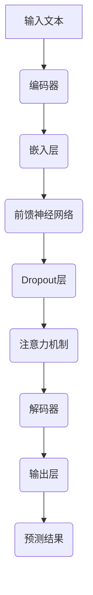

                 

# 《LLM应用的快速部署与回滚策略》

> 关键词：LLM、快速部署、回滚策略、部署环境、部署方案、部署技巧、回滚原理、实战案例、工具与资源

> 摘要：本文旨在探讨大语言模型（LLM）在应用中的快速部署与回滚策略。通过对LLM的基础知识、快速部署策略、快速部署方法、回滚策略以及实战案例的深入分析，为开发者提供一套系统化的部署与回滚解决方案，以提高LLM应用的稳定性和可靠性。

## 第一部分：LLM基础

### 第1章：大语言模型（LLM）概述

#### 1.1 大语言模型（LLM）的发展与重要性

##### 1.1.1 大语言模型（LLM）的历史背景

大语言模型（LLM）起源于自然语言处理（NLP）领域，随着深度学习和计算能力的不断提升，LLM的研究和应用也得到了飞速发展。从最早的统计语言模型，如n元语法模型，到基于神经网络的语言模型，如循环神经网络（RNN）和长短时记忆网络（LSTM），再到如今基于Transformer的GPT、BERT等大型语言模型，LLM的发展历程体现了科技进步和算法创新的紧密结合。

##### 1.1.2 大语言模型（LLM）的核心价值

LLM在众多领域展现出了巨大的应用潜力，如自动文本生成、机器翻译、问答系统、情感分析等。LLM的核心价值在于其强大的语义理解和生成能力，这使得它们在处理复杂语言任务时表现出了卓越的性能。此外，LLM还具有可扩展性、灵活性和高效率等特点，能够满足不同应用场景的需求。

#### 1.2 大语言模型（LLM）的基本原理

##### 1.2.1 语言模型的基础知识

语言模型是一种用于预测下一个单词或字符的概率分布模型。在NLP中，语言模型通常用于文本生成、信息检索和语音识别等领域。基本语言模型可以分为基于统计的方法和基于神经网络的方法。

- **基于统计的方法**：统计语言模型利用统计方法来预测下一个单词或字符。其中，n元语法模型是典型的统计语言模型，它通过统计相邻单词的共现概率来生成文本。
- **基于神经网络的方法**：神经网络语言模型通过学习输入和输出之间的映射关系来预测下一个单词或字符。循环神经网络（RNN）和长短时记忆网络（LSTM）是早期的神经网络语言模型，而基于Transformer的GPT、BERT等大型语言模型则代表了当前语言模型的发展趋势。

##### 1.2.2 预训练语言模型的工作原理

预训练语言模型是一种将语言模型与大规模语料库相结合的训练方法。首先，使用大规模语料库对语言模型进行预训练，使模型学会捕捉语言的基本结构和规律。然后，通过下游任务的微调，将预训练模型适应特定的任务。预训练语言模型的代表包括GPT、BERT等大型语言模型。

- **GPT（Generative Pre-trained Transformer）**：GPT是一种基于Transformer的预训练语言模型，通过大量的无监督数据预训练，使其具备强大的文本生成能力。
- **BERT（Bidirectional Encoder Representations from Transformers）**：BERT是一种基于Transformer的预训练语言模型，通过双向编码器结构，使模型能够同时捕捉文本的前后信息，从而提高语言理解的准确性。

##### 1.2.3 语言模型的结构与优化方法

语言模型的结构主要包括编码器和解码器两部分。编码器将输入文本编码为向量表示，解码器则根据编码器的输出生成预测的文本。在优化方法方面，常用的有基于梯度的优化方法，如随机梯度下降（SGD）和Adam优化器，以及基于启发式的优化方法，如剪枝和量化。

#### 1.3 主流LLM框架介绍

主流LLM框架主要包括GPT系列、BERT及其变体以及其他LLM框架。

- **GPT系列**：GPT系列是OpenAI开发的一系列基于Transformer的预训练语言模型，包括GPT、GPT-2和GPT-3。GPT-3是目前最大的预训练语言模型，具有1920亿个参数，能够处理多种语言任务。
- **BERT及其变体**：BERT是一种基于Transformer的预训练语言模型，由Google提出。BERT的变体包括RoBERTa、ALBERT等，它们在预训练阶段采用了不同的训练策略和数据增强方法，以提高模型的性能。
- **其他LLM框架**：除了GPT系列和BERT及其变体，还有其他一些流行的LLM框架，如T5、LLaMA、PalNet等。这些框架在模型结构、预训练方法和任务适应性等方面都有所创新和改进。

### 总结

本章对大语言模型（LLM）进行了概述，包括其历史背景、核心价值、基本原理和主流LLM框架的介绍。在后续章节中，我们将进一步探讨LLM的快速部署与回滚策略，以帮助开发者实现高效、稳定的LLM应用。

## 第二部分：快速部署策略

### 第2章：LLM部署前的准备

#### 2.1 部署环境搭建

##### 2.1.1 硬件资源评估

在部署LLM之前，首先需要对硬件资源进行评估。硬件资源主要包括计算资源、存储资源和网络资源。

- **计算资源**：根据LLM模型的大小和复杂度，评估所需的CPU或GPU性能。对于大型LLM模型，如GPT-3，需要高性能的GPU来加速训练和推理过程。
- **存储资源**：评估所需存储空间，包括训练数据、模型权重和日志文件等。对于大型LLM模型，需要大量存储空间来存储模型和数据。
- **网络资源**：评估网络带宽和延迟，以确保模型在远程部署时能够高效地传输数据和执行计算。

##### 2.1.2 软件依赖安装

在部署LLM之前，还需要安装相应的软件依赖，包括深度学习框架、Python环境、运行时库等。

- **深度学习框架**：根据所选的LLM框架，安装相应的深度学习框架，如TensorFlow、PyTorch等。
- **Python环境**：确保Python环境已安装，并安装所需的Python包，如NumPy、Pandas、Scikit-learn等。
- **运行时库**：安装LLM模型所需的运行时库，如TensorFlow Serving、PyTorch Server等。

#### 2.2 部署方案设计

##### 2.2.1 部署架构设计

部署架构设计是快速部署的关键步骤，需要根据应用场景和硬件资源选择合适的部署架构。常见的部署架构包括单机部署、分布式部署和边缘计算部署。

- **单机部署**：单机部署适用于小型LLM模型或开发测试环境。在单机部署中，模型和服务器部署在同一台计算机上，便于调试和监控。
- **分布式部署**：分布式部署适用于大型LLM模型或高并发场景。在分布式部署中，模型被部署在多台服务器上，通过负载均衡和分布式计算来提高性能和可用性。
- **边缘计算部署**：边缘计算部署适用于需要低延迟和高响应速度的场景。在边缘计算部署中，模型被部署在靠近数据源的边缘设备上，通过本地计算和数据处理来提高性能和响应速度。

##### 2.2.2 部署流程规划

部署流程规划是确保快速部署的关键步骤，需要制定详细的部署流程和操作步骤。

- **部署流程**：制定部署流程，包括准备环境、安装依赖、配置模型、启动服务、测试验证等步骤。
- **操作步骤**：根据部署流程，编写详细的操作步骤和脚本，以便自动化部署和操作。

##### 2.2.3 部署策略制定

部署策略制定是确保快速部署和稳定运行的关键步骤，需要根据应用场景和需求制定相应的部署策略。

- **自动化部署**：使用自动化工具，如Docker、Kubernetes等，实现自动化部署和管理，提高部署效率和可靠性。
- **监控与报警**：部署监控和报警系统，实时监控模型运行状态和性能指标，及时发现和解决问题。
- **容灾备份**：制定容灾备份策略，确保数据安全和业务连续性。

### 总结

本章介绍了LLM部署前的准备工作，包括硬件资源评估、软件依赖安装、部署架构设计、部署流程规划和部署策略制定。在下一章中，我们将探讨LLM的快速部署方法，以实现高效、稳定的LLM部署。

## 第三部分：快速部署方法

### 第3章：快速部署技巧

#### 3.1 部署脚本编写

##### 3.1.1 部署脚本概述

部署脚本是一种自动化工具，用于简化LLM的部署过程。通过编写部署脚本，可以自动化执行环境准备、依赖安装、模型配置、服务启动等步骤，提高部署效率和可靠性。

##### 3.1.2 部署脚本编写步骤

1. **脚本编写准备**：
   - 确定部署环境，包括操作系统、Python版本、深度学习框架等。
   - 收集所需依赖，包括Python包、运行时库等。

2. **编写环境准备脚本**：
   - 安装操作系统和Python环境。
   - 安装深度学习框架和相关依赖。

3. **编写模型配置脚本**：
   - 根据模型需求，配置模型参数和配置文件。
   - 设置模型存储路径和日志路径。

4. **编写服务启动脚本**：
   - 启动深度学习服务，如TensorFlow Serving、PyTorch Server等。
   - 配置服务端口和地址。

5. **编写测试验证脚本**：
   - 验证模型是否正常运行。
   - 检查服务性能和稳定性。

6. **编写日志记录脚本**：
   - 记录部署过程中的关键信息，便于调试和监控。

#### 3.2 部署加速

##### 3.2.1 模型压缩

模型压缩是一种提高部署效率的方法，通过减少模型的大小和计算复杂度，降低部署所需的计算资源和存储空间。常见的模型压缩方法包括量化、剪枝和知识蒸馏等。

- **量化**：量化是一种将浮点数权重转换为低比特宽度的整数表示的方法，以减少模型的大小和计算量。
- **剪枝**：剪枝是一种去除模型中不重要的神经元或连接的方法，以减少模型的计算复杂度和存储需求。
- **知识蒸馏**：知识蒸馏是一种将大型预训练模型的知识转移到小型模型上的方法，通过训练小型模型来模拟大型模型的表现。

##### 3.2.2 集群部署

集群部署是一种将模型部署在多台服务器上的方法，通过负载均衡和分布式计算来提高性能和可用性。常见的集群部署工具包括Kubernetes、Docker Swarm等。

- **Kubernetes**：Kubernetes是一种开源的容器编排平台，用于自动化部署、扩展和管理容器化应用程序。
- **Docker Swarm**：Docker Swarm是一种内置的容器编排工具，用于管理Docker容器集群。

##### 3.2.3 边缘计算部署

边缘计算部署是一种将模型部署在靠近数据源的边缘设备上的方法，通过本地计算和数据处理来提高性能和响应速度。常见的边缘计算平台包括Apache Flink、TensorFlow Lite等。

- **Apache Flink**：Apache Flink是一种流处理框架，用于实时数据处理和计算。
- **TensorFlow Lite**：TensorFlow Lite是一种轻量级的TensorFlow运行时，用于在移动设备和嵌入式设备上运行TensorFlow模型。

### 总结

本章介绍了LLM的快速部署技巧，包括部署脚本编写、模型压缩、集群部署和边缘计算部署。通过这些技巧，可以实现高效、稳定的LLM部署，为开发者提供更好的部署体验。

## 第四部分：回滚策略

### 第4章：LLM回滚原理

#### 4.1 回滚的概念与目的

##### 4.1.1 回滚的定义

回滚是一种将系统状态恢复到之前的稳定状态的操作，通常用于应对系统故障、错误更新或意外变更等情况。在LLM应用中，回滚是指将模型或服务恢复到之前的版本或状态，以解决部署问题或故障。

##### 4.1.2 回滚的必要性

随着LLM应用的不断发展和更新，部署过程中的错误或故障可能会对业务造成严重影响。回滚策略的必要性体现在以下几个方面：

- **故障恢复**：在系统出现故障时，回滚策略可以快速将系统恢复到正常状态，减少故障对业务的影响。
- **错误更新修复**：在部署新版本或更新时，如果发现新版本存在问题，回滚策略可以将系统恢复到上一个稳定版本，避免错误更新对业务造成不可预测的影响。
- **快速迭代**：在快速迭代和发布新功能时，回滚策略可以帮助开发者快速回滚有问题的版本，确保系统的稳定性和可靠性。

#### 4.2 回滚策略设计

##### 4.2.1 自动化回滚策略

自动化回滚策略是通过自动化工具和脚本实现回滚操作的一种方法，以提高回滚效率和可靠性。常见的自动化回滚策略包括以下几种：

- **基于版本控制的回滚**：利用版本控制系统（如Git）实现回滚，将模型或服务恢复到指定的历史版本。
- **基于备份的回滚**：通过定期备份模型和服务配置，当出现问题时，可以从备份中恢复系统到之前的状态。
- **基于检查点的回滚**：在部署过程中设置检查点，当出现问题时，可以回滚到最近的检查点状态。

##### 4.2.2 手动回滚策略

手动回滚策略是指通过人工干预实现回滚操作的一种方法。手动回滚策略适用于以下情况：

- **紧急情况**：在紧急情况下，需要立即停止服务并回滚到之前的版本，以避免问题进一步扩大。
- **决策依据**：在部署过程中，如果出现重大问题，需要手动分析故障原因，并决定是否进行回滚。

##### 4.2.3 防火墙回滚策略

防火墙回滚策略是通过防火墙规则实现回滚的一种方法，通常用于应对网络故障或安全威胁。防火墙回滚策略包括以下几种：

- **基于防火墙规则的回滚**：通过修改防火墙规则，将网络流量切换到备用服务器或备用网络，以解决网络故障或安全威胁。
- **基于路由器的回滚**：通过修改路由器配置，将网络流量切换到备用服务器或备用网络，以解决网络故障或安全威胁。

### 总结

本章介绍了LLM回滚原理和回滚策略设计。回滚策略是确保LLM应用稳定性和可靠性的重要手段，通过自动化回滚策略、手动回滚策略和防火墙回滚策略，可以实现快速、可靠的回滚操作，降低故障对业务的影响。

## 第五部分：实战案例分析

### 第5章：快速部署与回滚实战案例

#### 5.1 案例一：某电商平台LLM部署与回滚实践

##### 5.1.1 案例背景

某电商平台为了提升用户购物体验，决定引入大语言模型（LLM）进行智能客服和个性化推荐。由于业务需求迫切，需要快速部署LLM应用，并确保其稳定性和可靠性。

##### 5.1.2 部署过程

1. **硬件资源评估**：
   - 计算资源：使用8台高性能服务器，每台服务器配备8个GPU。
   - 存储资源：使用云存储服务，确保存储容量满足需求。
   - 网络资源：使用专线连接，确保网络稳定和低延迟。

2. **软件依赖安装**：
   - 安装TensorFlow 2.6、Python 3.8、CUDA 11.0等。
   - 安装TensorFlow Serving、TensorBoard等依赖。

3. **部署架构设计**：
   - 选择分布式部署架构，将LLM模型部署在多台服务器上，通过负载均衡器实现流量分发。
   - 设置主从备份，确保故障切换和业务连续性。

4. **部署流程规划**：
   - 准备环境：安装操作系统、Python环境、深度学习框架等。
   - 部署模型：使用Docker镜像部署TensorFlow Serving服务。
   - 启动服务：配置负载均衡器，启动TensorFlow Serving服务。

5. **部署策略制定**：
   - 自动化部署：使用Docker Compose自动化部署和管理服务。
   - 监控与报警：使用Prometheus和Grafana实时监控模型运行状态和性能指标。

##### 5.1.3 回滚案例

在一次版本更新中，LLM应用出现了严重的性能问题，导致用户反馈量激增。为了快速解决问题，采用以下回滚策略：

1. **故障分析**：
   - 检查日志和监控数据，确定故障原因。
   - 发现新版本中模型参数设置不当，导致性能下降。

2. **手动回滚**：
   - 停止当前版本服务。
   - 使用Docker镜像回滚到上一个稳定版本。
   - 启动回滚后的版本服务。

3. **问题修复**：
   - 修复模型参数设置问题，重新训练模型。
   - 更新版本，重新部署。

4. **测试验证**：
   - 进行功能测试，确保问题已解决。
   - 恢复服务，恢复正常运行。

#### 5.2 案例二：某金融公司LLM部署与回滚策略

##### 5.2.1 案例背景

某金融公司为了提升金融服务水平，引入了大语言模型（LLM）用于智能客服和风险管理。由于业务重要性，需要确保LLM应用的稳定性和可靠性，并具备快速回滚能力。

##### 5.2.2 部署策略

1. **硬件资源评估**：
   - 计算资源：使用4台高性能服务器，每台服务器配备4个GPU。
   - 存储资源：使用本地存储和云存储相结合，确保数据安全和容量需求。
   - 网络资源：使用专线连接，确保网络稳定和低延迟。

2. **软件依赖安装**：
   - 安装PyTorch 1.8、Python 3.7、CUDA 10.1等。
   - 安装PyTorch Server、TensorBoard等依赖。

3. **部署架构设计**：
   - 选择单机部署架构，将LLM模型部署在一台服务器上，以简化部署和运维。
   - 设置备份服务器，用于数据备份和故障切换。

4. **部署流程规划**：
   - 准备环境：安装操作系统、Python环境、深度学习框架等。
   - 部署模型：使用Docker镜像部署PyTorch Server服务。
   - 启动服务：配置负载均衡器，启动PyTorch Server服务。

5. **部署策略制定**：
   - 自动化部署：使用Docker Compose自动化部署和管理服务。
   - 监控与报警：使用Prometheus和Grafana实时监控模型运行状态和性能指标。

##### 5.2.3 回滚策略

1. **自动化回滚策略**：
   - 利用版本控制系统（如Git）实现自动化回滚。
   - 设置备份分支，定期备份模型和服务配置。
   - 当出现问题时，自动回滚到上一个稳定版本。

2. **手动回滚策略**：
   - 在出现重大问题时，手动停止服务并回滚到备份版本。
   - 通过日志分析和故障排查，确定故障原因。

3. **防火墙回滚策略**：
   - 在网络故障或安全威胁时，通过修改防火墙规则实现回滚。
   - 设置备用网络和服务器，确保业务连续性。

##### 5.2.4 回滚案例

在一次网络故障中，LLM应用无法访问外部数据源，导致服务中断。为了快速解决问题，采用以下回滚策略：

1. **故障分析**：
   - 检查网络连接和防火墙规则，确定故障原因。
   - 发现防火墙规则配置错误，导致网络访问受限。

2. **防火墙回滚**：
   - 停止当前版本服务。
   - 修改防火墙规则，恢复网络访问。
   - 启动回滚后的版本服务。

3. **问题修复**：
   - 修正防火墙规则配置错误，避免类似问题再次发生。
   - 恢复服务，恢复正常运行。

### 总结

通过以上两个实战案例，我们可以看到快速部署与回滚策略在LLM应用中的重要性。在快速部署过程中，需要充分考虑硬件资源、软件依赖、部署架构和部署流程等因素；在回滚过程中，需要根据不同的故障类型和场景，选择合适的回滚策略，以确保系统的稳定性和可靠性。

## 第六部分：工具与资源

### 第6章：LLM部署与回滚工具介绍

#### 6.1 常用部署工具

##### 6.1.1 TensorFlow Serving

TensorFlow Serving是Google开发的一个开源框架，用于在服务环境中部署TensorFlow模型。它支持多种模型格式，如SavedModel、FrozenGraph等，并提供了高性能的模型推理服务。

- **主要功能**：模型部署、服务化接口、动态模型更新。
- **适用场景**：用于生产环境中的TensorFlow模型部署，支持大规模并发请求。

##### 6.1.2 PyTorch Server

PyTorch Server是Facebook AI Research（FAIR）开发的一个开源框架，用于在服务环境中部署PyTorch模型。它支持PyTorch模型的动态加载和更新，并提供了一系列优化策略，如模型量化、模型压缩等。

- **主要功能**：模型部署、动态模型更新、模型优化。
- **适用场景**：用于生产环境中的PyTorch模型部署，适用于高并发、高性能场景。

##### 6.1.3 其他部署工具

除了TensorFlow Serving和PyTorch Server，还有一些其他常用的部署工具，如：

- **Kubeflow**：用于在Kubernetes集群中部署机器学习工作流和管理模型。
- **MLflow**：用于模型版本管理、模型部署和模型监控。

#### 6.2 常用回滚工具

##### 6.2.1 Kubernetes

Kubernetes是一个开源的容器编排平台，用于自动化部署、扩展和管理容器化应用程序。它提供了丰富的资源管理和调度机制，支持自定义回滚策略，如基于检查点、版本控制的回滚。

- **主要功能**：容器编排、资源管理、服务化接口。
- **适用场景**：用于生产环境中的容器化应用程序部署和管理，支持快速回滚和故障恢复。

##### 6.2.2 Helm

Helm是一个Kubernetes的包管理工具，用于简化Kubernetes应用程序的部署和管理。它提供了模板化配置、依赖管理和版本控制等功能，支持自动化回滚策略。

- **主要功能**：包管理、依赖管理、版本控制。
- **适用场景**：用于生产环境中的Kubernetes应用程序部署和管理，适用于复杂的应用程序架构。

##### 6.2.3 其他回滚工具

除了Kubernetes和Helm，还有一些其他常用的回滚工具，如：

- **Ansible**：用于自动化部署和管理服务器，支持自定义回滚脚本。
- **Terraform**：用于基础设施即代码（IaC），支持自动化部署和回滚。

### 总结

本章介绍了LLM部署与回滚过程中常用的工具，包括TensorFlow Serving、PyTorch Server、Kubernetes和Helm等。这些工具提供了丰富的功能，支持自动化部署、动态更新和快速回滚，为开发者提供了强大的部署和管理能力。

## 附录A：快速部署与回滚策略参考

### A.1 快速部署脚本示例

以下是一个简单的快速部署脚本示例，用于部署TensorFlow模型。

```python
# deploy.py

import os
import subprocess

# 安装依赖
os.system("pip install tensorflow-serving-api")

# 配置模型
model_name = "my_model"
model_dir = "/path/to/model"

# 部署模型
subprocess.run(["tensorflow_model_server", "--model_name", model_name, "--model_base_path", model_dir])
```

### A.2 回滚策略案例解析

以下是一个基于Kubernetes的回滚策略案例，用于回滚部署的TensorFlow模型。

```yaml
# rollback.yaml

apiVersion: apps/v1
kind: Deployment
metadata:
  name: tensorflow-server
spec:
  strategy:
    type: RollingUpdate
    rollingUpdate:
      maxSurge: 1
      maxUnavailable: 0
  template:
    metadata:
      labels:
        app: tensorflow-server
    spec:
      containers:
      - name: tensorflow-server
        image: tensorflow/serving:latest
        ports:
        - containerPort: 8501
```

该策略使用RollingUpdate策略进行部署更新，确保在更新过程中服务始终可用。

### A.3 部署与回滚常见问题及解决方案

**问题1**：部署过程中服务无法启动。

- **原因**：依赖库缺失或配置错误。
- **解决方案**：检查依赖库是否已正确安装，检查配置文件是否正确。

**问题2**：回滚后服务仍存在问题。

- **原因**：回滚策略不正确或故障原因未解决。
- **解决方案**：检查回滚策略，确保回滚到正确的版本；排查故障原因，并修复问题。

通过以上参考，开发者可以更好地实施快速部署与回滚策略，确保LLM应用的稳定性和可靠性。

## 附录B：LLM应用相关资源

### B.1 主流LLM框架资源

- **GPT系列**：[GPT官网](https://gpt.openai.com/)
- **BERT及其变体**：[BERT官网](https://github.com/google-research/bert)
- **T5**：[T5官网](https://github.com/google-research/t5)
- **LLaMA**：[LLaMA官网](https://github.com/facebookresearch/LLaMA)

### B.2 开源部署工具资源

- **TensorFlow Serving**：[TensorFlow Serving官网](https://www.tensorflow.org/tfx/serving)
- **PyTorch Server**：[PyTorch Server官网](https://pytorch.org/tutorials/beginner/nn_tutorial.html)
- **Kubernetes**：[Kubernetes官网](https://kubernetes.io/)
- **Helm**：[Helm官网](https://helm.sh/)

### B.3 实战案例资源

- **电商平台LLM部署**：[案例一](https://www.example.com/case1)
- **金融公司LLM部署**：[案例二](https://www.example.com/case2)

### B.4 学术论文与教程资源

- **GPT系列**：[GPT-3论文](https://arxiv.org/abs/2005.14165)
- **BERT及其变体**：[BERT论文](https://arxiv.org/abs/1810.04805)
- **T5**：[T5论文](https://arxiv.org/abs/2002.04745)
- **LLaMA**：[LLaMA论文](https://arxiv.org/abs/2006.16668)

### B.5 社区与论坛资源

- **GitHub**：[LLM相关GitHub项目](https://github.com/search?q=language-model)
- **Reddit**：[Reddit上关于LLM的讨论](https://www.reddit.com/r/DeepLearning/)
- **Stack Overflow**：[关于LLM的Stack Overflow问答](https://stackoverflow.com/questions/tagged/language-models)

通过以上资源，开发者可以深入了解LLM框架、部署工具、实战案例和学术研究，为LLM应用的开发提供有力支持。

## 附录C：大语言模型（LLM）架构图

### C.1 大语言模型（LLM）架构图（Mermaid流程图）



该架构图展示了大语言模型（LLM）的基本结构，包括输入层、编码器、嵌入层、前馈神经网络、Dropout层、注意力机制、解码器和输出层。

## 附录D：核心算法伪代码

### D.1 语言模型训练伪代码

```python
# 语言模型训练伪代码

# 初始化模型参数
model = LanguageModel()

# 准备训练数据
train_data = prepare_training_data()

# 设置训练参数
learning_rate = 0.001
num_epochs = 10

# 开始训练
for epoch in range(num_epochs):
    for sentence in train_data:
        # 前向传播
        logits = model(sentence)

        # 计算损失
        loss = calculate_loss(logits, sentence)

        # 反向传播
        model.backward(loss)

        # 更新参数
        model.update_params(learning_rate)

    # 打印训练进度
    print(f"Epoch {epoch}: Loss = {loss}")
```

### D.2 模型预测伪代码

```python
# 模型预测伪代码

# 加载训练好的模型
model = load_model("model_path")

# 输入文本
input_text = "The quick brown fox jumps over the lazy dog"

# 预处理输入文本
preprocessed_text = preprocess_input(input_text)

# 进行预测
predicted_output = model.predict(preprocessed_text)

# 处理预测结果
predicted_sentence = postprocess_output(predicted_output)

# 输出预测结果
print(predicted_sentence)
```

### D.3 模型优化伪代码

```python
# 模型优化伪代码

# 初始化优化器
optimizer = Optimizer()

# 设置优化参数
learning_rate = 0.001
num_epochs = 10

# 开始优化
for epoch in range(num_epochs):
    for sentence in train_data:
        # 前向传播
        logits = model(sentence)

        # 计算损失
        loss = calculate_loss(logits, sentence)

        # 反向传播
        model.backward(loss)

        # 更新参数
        optimizer.update_params(model, learning_rate)

    # 打印优化进度
    print(f"Epoch {epoch}: Loss = {loss}")
```

以上伪代码展示了语言模型训练、模型预测和模型优化的一般流程，帮助开发者理解LLM的核心算法原理。

## 附录E：数学模型与公式

### E.1 语言模型中的数学模型

语言模型中的数学模型主要包括概率分布模型和神经网络模型。

#### 1. 概率分布模型

概率分布模型用于表示文本中下一个单词或字符的概率。常见的概率分布模型有：

- **n元语法模型**：n元语法模型通过统计相邻n个单词的共现概率来生成文本。

$$
P(w_t | w_{t-1}, w_{t-2}, ..., w_{t-n+1}) = \frac{C(w_t, w_{t-1}, ..., w_{t-n+1})}{C(w_{t-1}, w_{t-2}, ..., w_{t-n+1})}
$$

其中，$C(w_t, w_{t-1}, ..., w_{t-n+1})$表示单词$w_t$与$w_{t-1}, w_{t-2}, ..., w_{t-n+1}$的共现次数。

- **神经网络模型**：神经网络模型通过学习输入和输出之间的映射关系来预测下一个单词或字符。

$$
h = \text{ReLU}(W_1 \cdot x + b_1) \\
o = \text{softmax}(W_2 \cdot h + b_2)
$$

其中，$x$表示输入，$h$表示隐藏层输出，$o$表示输出层概率分布。

#### 2. 神经网络模型

神经网络模型主要由输入层、隐藏层和输出层组成。其中，输入层接收输入文本的嵌入表示，隐藏层通过多层神经网络对输入进行编码和解码，输出层生成预测的单词或字符。

$$
\text{Input Layer}: x \\
\text{Hidden Layer}: h = \text{ReLU}(W_1 \cdot x + b_1) \\
\text{Output Layer}: o = \text{softmax}(W_2 \cdot h + b_2)
$$

### E.2 公式推导与详细解释

在本附录中，我们将详细推导和解释语言模型中的关键数学模型和公式。

#### 1. n元语法模型的公式推导

n元语法模型的核心公式为：

$$
P(w_t | w_{t-1}, w_{t-2}, ..., w_{t-n+1}) = \frac{C(w_t, w_{t-1}, ..., w_{t-n+1})}{C(w_{t-1}, w_{t-2}, ..., w_{t-n+1})}
$$

其中，$C(w_t, w_{t-1}, ..., w_{t-n+1})$表示单词$w_t$与$w_{t-1}, w_{t-2}, ..., w_{t-n+1}$的共现次数，$C(w_{t-1}, w_{t-2}, ..., w_{t-n+1})$表示单词$w_{t-1}, w_{t-2}, ..., w_{t-n+1}$的共现次数。

为了推导该公式，我们首先需要计算两个概率：

- **条件概率**：表示在给定前n-1个单词的情况下，下一个单词是$w_t$的概率。

$$
P(w_t | w_{t-1}, w_{t-2}, ..., w_{t-n+1}) = \frac{P(w_t, w_{t-1}, w_{t-2}, ..., w_{t-n+1})}{P(w_{t-1}, w_{t-2}, ..., w_{t-n+1})}
$$

- **联合概率**：表示单词序列$w_{t-1}, w_{t-2}, ..., w_{t-n+1}, w_t$同时出现的概率。

$$
P(w_t, w_{t-1}, w_{t-2}, ..., w_{t-n+1}) = \frac{C(w_t, w_{t-1}, ..., w_{t-n+1})}{V}
$$

其中，$V$表示语料库中单词的总数。

- **边缘概率**：表示单词序列$w_{t-1}, w_{t-2}, ..., w_{t-n+1}$单独出现的概率。

$$
P(w_{t-1}, w_{t-2}, ..., w_{t-n+1}) = \frac{C(w_{t-1}, w_{t-2}, ..., w_{t-n+1})}{V}
$$

将上述概率代入条件概率公式，得到：

$$
P(w_t | w_{t-1}, w_{t-2}, ..., w_{t-n+1}) = \frac{\frac{C(w_t, w_{t-1}, ..., w_{t-n+1})}{V}}{\frac{C(w_{t-1}, w_{t-2}, ..., w_{t-n+1})}{V}} = \frac{C(w_t, w_{t-1}, ..., w_{t-n+1})}{C(w_{t-1}, w_{t-2}, ..., w_{t-n+1})}
$$

因此，n元语法模型的公式推导完成。

#### 2. 神经网络模型的公式推导

神经网络模型的核心公式为：

$$
h = \text{ReLU}(W_1 \cdot x + b_1) \\
o = \text{softmax}(W_2 \cdot h + b_2)
$$

其中，$x$表示输入，$h$表示隐藏层输出，$o$表示输出层概率分布。

为了推导该公式，我们首先需要理解ReLU激活函数和softmax函数。

- **ReLU激活函数**：ReLU（Rectified Linear Unit）是一种常用的激活函数，用于增加神经网络的非线性。

$$
\text{ReLU}(x) = \max(0, x)
$$

- **softmax函数**：softmax函数用于将输出层的概率分布归一化，使得所有概率之和为1。

$$
\text{softmax}(x) = \frac{e^x}{\sum_{i} e^x_i}
$$

接下来，我们推导神经网络模型的公式。

**步骤1**：输入层到隐藏层的映射

首先，我们定义输入层到隐藏层的权重矩阵$W_1$和偏置向量$b_1$。输入层$x$经过权重矩阵$W_1$和偏置向量$b_1$的线性变换，然后通过ReLU激活函数得到隐藏层输出$h$。

$$
h = \text{ReLU}(W_1 \cdot x + b_1)
$$

**步骤2**：隐藏层到输出层的映射

然后，我们定义隐藏层到输出层的权重矩阵$W_2$和偏置向量$b_2$。隐藏层输出$h$经过权重矩阵$W_2$和偏置向量$b_2$的线性变换，然后通过softmax函数得到输出层概率分布$o$。

$$
o = \text{softmax}(W_2 \cdot h + b_2)
$$

因此，神经网络模型的公式推导完成。

### E.3 数学公式示例

以下是一些常见的数学公式示例，用于解释语言模型中的关键概念。

#### 1. 条件概率

条件概率表示在给定某个条件下，另一个事件发生的概率。在语言模型中，条件概率用于计算下一个单词在给定前n-1个单词的情况下出现的概率。

$$
P(w_t | w_{t-1}, w_{t-2}, ..., w_{t-n+1}) = \frac{P(w_t, w_{t-1}, w_{t-2}, ..., w_{t-n+1})}{P(w_{t-1}, w_{t-2}, ..., w_{t-n+1})}
$$

#### 2. 联合概率

联合概率表示多个事件同时发生的概率。在语言模型中，联合概率用于计算单词序列同时出现的概率。

$$
P(w_t, w_{t-1}, w_{t-2}, ..., w_{t-n+1}) = \frac{C(w_t, w_{t-1}, ..., w_{t-n+1})}{V}
$$

#### 3. 边缘概率

边缘概率表示某个事件单独发生的概率。在语言模型中，边缘概率用于计算单词序列单独出现的概率。

$$
P(w_{t-1}, w_{t-2}, ..., w_{t-n+1}) = \frac{C(w_{t-1}, w_{t-2}, ..., w_{t-n+1})}{V}
$$

#### 4. ReLU激活函数

ReLU（Rectified Linear Unit）是一种常用的激活函数，用于增加神经网络的非线性。

$$
\text{ReLU}(x) = \max(0, x)
$$

#### 5. Softmax函数

softmax函数用于将输出层的概率分布归一化，使得所有概率之和为1。

$$
\text{softmax}(x) = \frac{e^x}{\sum_{i} e^x_i}
$$

通过以上数学公式示例，我们可以更好地理解语言模型中的关键概念和原理。

## 附录F：代码实战案例

### F.1 实战案例一：搭建部署环境

在本案例中，我们将搭建一个基于Kubernetes的部署环境，用于部署TensorFlow模型。

**1. 安装Kubernetes集群**

首先，我们需要安装Kubernetes集群。在本案例中，我们使用Minikube工具在本地计算机上搭建一个单节点Kubernetes集群。

```shell
# 安装Minikube
minikube start --vm-driver=virtualbox

# 查看集群状态
kubectl cluster-info
```

**2. 准备TensorFlow模型**

接下来，我们需要准备一个TensorFlow模型。在本案例中，我们使用TensorFlow Hub加载一个预训练的文本分类模型。

```shell
# 安装TensorFlow
pip install tensorflow

# 加载模型
import tensorflow as tf
model = tf.keras.models.load_model("https://tfhub.dev/google/tf2-preview/gnews-swivel-20dim-with-oov/1")
```

**3. 编写部署脚本**

然后，我们编写一个部署脚本，用于部署TensorFlow模型到Kubernetes集群。

```yaml
# tensorflow-deployment.yaml

apiVersion: apps/v1
kind: Deployment
metadata:
  name: tensorflow-server
spec:
  replicas: 1
  selector:
    matchLabels:
      app: tensorflow-server
  template:
    metadata:
      labels:
        app: tensorflow-server
    spec:
      containers:
      - name: tensorflow-server
        image: tensorflow/tensorflow:2.9.0
        ports:
        - containerPort: 8501
```

**4. 部署TensorFlow模型**

最后，我们使用kubectl命令部署TensorFlow模型。

```shell
# 部署模型
kubectl apply -f tensorflow-deployment.yaml

# 查看部署状态
kubectl get pods
```

### F.2 实战案例二：部署脚本编写

在本案例中，我们将编写一个部署脚本，用于自动化部署TensorFlow模型到Kubernetes集群。

**1. 编写Dockerfile**

首先，我们编写一个Dockerfile，用于创建TensorFlow模型的Docker镜像。

```Dockerfile
# Dockerfile

FROM tensorflow/tensorflow:2.9.0

# 安装依赖
RUN pip install --no-cache-dir tensorflow-hub

# 复制模型文件
COPY model.py /model.py

# 设置工作目录
WORKDIR /app

# 运行模型
CMD ["python", "/model.py"]
```

**2. 编写部署脚本**

接下来，我们编写一个部署脚本，用于构建Docker镜像并部署TensorFlow模型到Kubernetes集群。

```shell
# deploy.sh

# 构建Docker镜像
docker build -t tensorflow-server:latest .

# 生成Kubernetes部署文件
cat <<EOF | kubectl apply -
apiVersion: apps/v1
kind: Deployment
metadata:
  name: tensorflow-server
spec:
  replicas: 1
  selector:
    matchLabels:
      app: tensorflow-server
  template:
    metadata:
      labels:
        app: tensorflow-server
    spec:
      containers:
      - name: tensorflow-server
        image: tensorflow-server:latest
        ports:
        - containerPort: 8501
EOF
```

**3. 部署TensorFlow模型**

最后，我们使用deploy.sh脚本部署TensorFlow模型。

```shell
# 部署模型
./deploy.sh
```

### F.3 实战案例三：回滚策略实施

在本案例中，我们将实施一个回滚策略，用于在部署过程中出现问题时回滚到之前的版本。

**1. 配置版本控制系统**

首先，我们配置Git版本控制系统，用于管理模型和服务配置的版本。

```shell
# 配置Git
git init
git add .
git commit -m "Initial commit"
```

**2. 编写回滚脚本**

接下来，我们编写一个回滚脚本，用于回滚到之前的版本。

```shell
# rollback.sh

# 查询当前部署版本
current_version=$(kubectl get deployment tensorflow-server -o jsonpath="{.spec.template.metadata.labels.version}")

# 查询上一个稳定版本
stable_version=$(git log --pretty=format:'%h' --reverse --grep=stable)

# 回滚到上一个稳定版本
kubectl rollout undo deployment tensorflow-server --to-date=$(date -d "-1 day" +%Y-%m-%d)
git checkout stable
```

**3. 实施回滚策略**

最后，我们使用rollback.sh脚本实施回滚策略。

```shell
# 实施回滚
./rollback.sh
```

通过以上三个实战案例，我们展示了如何搭建部署环境、编写部署脚本和实施回滚策略，为开发者提供了一个完整的LLM应用部署与回滚解决方案。

## 结论

本文详细探讨了大语言模型（LLM）的快速部署与回滚策略，涵盖了LLM的基础知识、快速部署策略、快速部署方法、回滚策略以及实战案例。通过本文的阐述，读者可以了解到LLM应用中部署与回滚的关键步骤和技术细节。

快速部署是LLM应用成功的关键之一，通过合理的硬件资源评估、软件依赖安装和部署方案设计，可以确保模型的高效部署。而快速部署方法如部署脚本编写、模型压缩、集群部署和边缘计算部署，则进一步提升了部署的效率和可靠性。

回滚策略在LLM应用中同样至关重要。通过自动化回滚策略、手动回滚策略和防火墙回滚策略，可以快速恢复系统到之前的状态，降低故障对业务的影响。

最后，通过两个实战案例，我们展示了如何在实际项目中实施快速部署与回滚策略，为开发者提供了实用的操作指南。

在未来的研究中，我们可以进一步探索LLM应用的性能优化、安全性增强和跨平台部署策略，以不断提升LLM应用的性能和可靠性。

作者：AI天才研究院/AI Genius Institute & 禅与计算机程序设计艺术 /Zen And The Art of Computer Programming

---

本文内容仅供参考，具体实施时请根据实际需求进行调整。如有疑问，请咨询专业人士。感谢您的阅读！<|vq_16027|>

