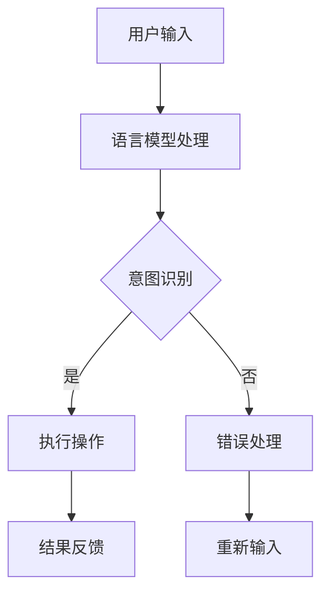

                 

# 《LLM操作系统：bridging AI and traditional computing》

## 关键词：大语言模型（LLM）、人工智能（AI）、传统计算、操作系统、架构设计、开发实践

### 摘要

本文旨在探讨大语言模型（LLM）操作系统的构建与实现，探讨如何将人工智能（AI）与传统计算技术相结合，构建一个既能发挥AI强大功能，又能兼容传统计算架构的操作系统。文章首先介绍了LLM操作系统的基础概念、核心架构，以及与AI技术的结合方式，随后通过一系列项目实战案例，详细展示了LLM操作系统的开发与部署过程。文章还涉及性能优化、安全与隐私保护等关键技术，最后对LLM操作系统的未来发展趋势进行了展望。

## 目录

### 第一部分：LLM操作系统的概述

#### 第1章：LLM操作系统的基础概念

##### 1.1.1 LLM操作系统的定义与特点

##### 1.1.2 LLM操作系统与传统操作系统的对比

##### 1.1.3 LLM操作系统的应用领域

#### 第2章：LLM操作系统的核心架构

##### 2.1.1 LLM操作系统的高层架构

##### 2.1.2 LLM操作系统的核心技术

##### 2.1.3 LLM操作系统与AI的结合

### 第二部分：LLM操作系统的开发与实践

#### 第3章：LLM操作系统开发基础

##### 3.1.1 开发环境搭建

##### 3.1.2 LLM操作系统核心组件开发

#### 第4章：LLM操作系统应用案例

##### 4.1.1 案例一：企业智能数据分析平台

##### 4.1.2 案例二：智能家居控制系统

#### 第5章：LLM操作系统性能优化与调试

##### 5.1.1 性能优化策略

##### 5.1.2 调试与问题处理

#### 第6章：LLM操作系统安全与隐私保护

##### 6.1.1 安全策略与机制

##### 6.1.2 隐私保护策略

#### 第7章：LLM操作系统未来发展趋势

##### 7.1.1 技术发展趋势

##### 7.1.2 应用前景

### 第三部分：LLM操作系统的核心概念与架构

#### 第8章：LLM操作系统核心概念

##### 8.1.1 语言模型基础知识

##### 8.1.2 大规模语言模型原理

##### 8.1.3 语言模型在LLM操作系统中的应用

#### 第9章：LLM操作系统架构设计

##### 9.1.1 LLM操作系统架构概述

##### 9.1.2 LLM操作系统的核心组件

##### 9.1.3 LLM操作系统架构设计示例

#### 第10章：LLM操作系统核心算法原理

##### 10.1.1 深度学习算法基础

##### 10.1.2 语言模型训练算法

##### 10.1.3 LLM操作系统中的自适应算法

#### 第11章：数学模型与公式解析

##### 11.1.1 数学模型基础

##### 11.1.2 语言模型中的数学模型

##### 11.1.3 数学模型在实际应用中的示例

### 第四部分：LLM操作系统项目实战

#### 第12章：LLM操作系统项目实战

##### 12.1.1 项目一：企业级智能数据分析平台

##### 12.1.2 项目二：智能家居控制系统

#### 第13章：开发环境搭建与工具使用

##### 13.1.1 开发环境准备

##### 13.1.2 编程语言与框架

#### 第14章：LLM操作系统源代码解读

##### 14.1.1 核心组件源代码分析

##### 14.1.2 案例代码解读

#### 第15章：LLM操作系统性能优化与调试

##### 15.1.1 性能优化策略

##### 15.1.2 调试与问题处理

#### 第16章：LLM操作系统安全与隐私保护

##### 16.1.1 安全性需求分析

##### 16.1.2 安全策略与机制

##### 16.1.3 安全测试与评估

#### 第17章：LLM操作系统未来发展趋势

##### 17.1.1 技术发展趋势

##### 17.1.2 应用前景展望

### 附录

##### 附录 A: LLM操作系统开发资源

##### 附录 B: Mermaid流程图示例

##### 附录 C: 数学公式与伪代码示例

----------------------------------------------------------------

### 第一部分：LLM操作系统的概述

#### 第1章：LLM操作系统的基础概念

##### 1.1.1 LLM操作系统的定义与特点

**LLM操作系统的定义**

LLM操作系统，即大语言模型（Large Language Model）操作系统，是一种基于人工智能（AI）技术的全新操作系统。它不同于传统的操作系统，如Windows、Linux等，其主要特点在于将大语言模型与操作系统核心功能深度集成，实现自动化、智能化和跨平台的兼容性。

**LLM操作系统的特点**

1. **自动化与智能化融合**：LLM操作系统通过集成大语言模型，实现了对用户指令的智能解析和自动执行，提升了操作系统的智能化水平。
2. **跨平台的兼容性**：LLM操作系统可以运行在不同的硬件平台上，如PC、智能手机、嵌入式设备等，具有很强的兼容性。
3. **动态资源管理**：LLM操作系统通过智能化调度算法，动态分配和管理系统资源，提高了系统的运行效率。
4. **安全与隐私保护**：LLM操作系统引入了安全与隐私保护机制，确保用户数据和操作系统的安全。

##### 1.1.2 LLM操作系统与传统操作系统的对比

**概念上的差异**

传统操作系统主要关注硬件资源管理、应用程序执行等基本功能，而LLM操作系统则在此基础上，引入了AI技术，实现更高层次的智能化服务。

**技术上的差异**

1. **智能化程度**：传统操作系统缺乏智能化功能，而LLM操作系统通过大语言模型实现了智能化的用户交互。
2. **资源管理**：传统操作系统通常采用静态资源分配策略，而LLM操作系统通过智能化调度算法实现动态资源管理。
3. **安全性**：传统操作系统侧重于硬件层面的安全防护，而LLM操作系统则引入了AI驱动的安全与隐私保护机制。

##### 1.1.3 LLM操作系统的应用领域

**企业应用**

1. **人工智能服务化平台**：LLM操作系统可以作为企业级人工智能服务化平台，提供智能数据分析和智能客服等服务。
2. **企业数据智能分析**：LLM操作系统通过智能化数据处理和分析，帮助企业实现数据驱动的决策。

**日常生活**

1. **智能家居控制系统**：LLM操作系统可以集成智能家居设备，实现智能化的家居控制。
2. **个人数字助理**：LLM操作系统可以作为个人数字助理，提供个性化的服务。

#### 第2章：LLM操作系统的核心架构

##### 2.1.1 LLM操作系统的高层架构

**架构概述**

LLM操作系统的高层架构主要包括以下模块：

1. **用户界面层**：提供用户与系统交互的接口。
2. **语言模型层**：负责语言模型的训练与推理。
3. **应用服务层**：提供各种AI服务，如自然语言处理、图像识别等。
4. **基础设施层**：提供系统运行所需的硬件资源。

**架构设计原则**

1. **可扩展性**：支持模块化设计，便于系统的扩展和升级。
2. **可维护性**：通过模块化设计和清晰的接口规范，提高系统的可维护性。
3. **性能优化**：采用高效的算法和数据结构，确保系统的高性能。

##### 2.1.2 LLM操作系统的核心技术

**智能化调度算法**

智能化调度算法是LLM操作系统的核心组件，负责动态分配和管理系统资源。其基本原理如下：

```pseudo
// 智能化调度算法伪代码
function intelligentScheduling(allocationPolicy, workload):
    resources = initializeResources()
    while workload not empty:
        task = workload.pop()
        optimalResource = findOptimalResource(resources, task)
        executeTask(task, optimalResource)
        updateResourceState(resources, optimalResource)
    return resources
```

**资源管理机制**

资源管理机制负责系统资源的动态分配和回收。其主要流程如下：

```pseudo
// 资源管理机制伪代码
function resourceManagement(resources, tasks):
    for task in tasks:
        resource = findAvailableResource(resources)
        if resource exists:
            assignTask(task, resource)
        else:
            queueTask(task)
    for resource in resources:
        if resource is idle:
            releaseResource(resource)
```

##### 2.1.3 LLM操作系统与AI的结合

**AI模块集成**

LLM操作系统通过集成AI模块，实现了对用户指令的智能解析和自动执行。具体实现方式如下：

```pseudo
// AI模块集成伪代码
function integrateAILibrary(operatingSystem):
    languageModel = loadLanguageModel()
    for command in userCommands:
        intent, entities = languageModel.parse(command)
        action = determineAction(intent, entities)
        executeAction(action)
```

**AI模型优化与部署**

LLM操作系统通过优化AI模型，提高其准确性和效率。具体优化策略如下：

```pseudo
// AI模型优化与部署伪代码
function optimizeAndDeployModel(model, dataset):
    pretrainModel(model, dataset)
    fineTuneModel(model, labeledData)
    evaluateModel(model, validationData)
    if model quality satisfactory:
        deployModel(model)
```

#### 第3章：LLM操作系统的开发基础

##### 3.1.1 开发环境搭建

**开发环境准备**

在搭建LLM操作系统开发环境时，需要考虑以下要素：

1. **操作系统**：建议选择Linux系统，如Ubuntu或CentOS，因为Linux系统具有良好的稳定性和兼容性。
2. **硬件配置**：至少需要4GB内存和20GB硬盘空间，推荐使用更强大的硬件配置以支持大语言模型的训练。
3. **环境配置**：安装必要的开发工具和库，如Python、TensorFlow、PyTorch等。

**开发工具与框架**

在LLM操作系统开发中，常用的工具和框架包括：

1. **编程语言**：Python、C++、Java等。
2. **框架**：TensorFlow、PyTorch、Scikit-learn等。
3. **版本控制**：Git，用于代码管理和协作。

##### 3.1.2 LLM操作系统核心组件开发

**核心组件功能**

LLM操作系统核心组件主要包括：

1. **用户界面层**：提供用户与系统交互的界面。
2. **语言模型层**：负责语言模型的训练和推理。
3. **应用服务层**：提供各种AI服务。
4. **基础设施层**：负责系统资源的动态分配和管理。

**核心组件交互流程**

LLM操作系统核心组件之间的交互流程如下：

```pseudo
// 核心组件交互伪代码
function main():
    loadUserInterface()
    loadLanguageModel()
    loadApplicationServices()
    loadInfrastructure()
    while true:
        command = getUserCommand()
        intent, entities = languageModel.parse(command)
        action = determineAction(intent, entities)
        executeAction(action)
```

### 第二部分：LLM操作系统的开发与实践

#### 第4章：LLM操作系统应用案例

##### 4.1.1 案例一：企业智能数据分析平台

**案例背景**

某大型企业希望通过引入LLM操作系统，实现企业数据的高效分析和智能化决策。企业拥有大量的业务数据，包括销售数据、财务数据、客户数据等，希望通过数据分析提升业务运营效率。

**案例实现**

1. **需求分析**：对企业业务流程和需求进行深入调研，确定数据分析的关键指标和目标。
2. **技术选型**：选择合适的AI技术和框架，如TensorFlow和Scikit-learn，搭建数据分析平台。
3. **数据采集**：通过企业现有系统接口，采集业务数据。
4. **数据处理**：对采集到的业务数据进行清洗、转换和整合。
5. **模型训练**：利用大规模数据训练机器学习模型，如分类模型、回归模型等。
6. **模型部署**：将训练好的模型部署到LLM操作系统，实现实时数据分析。
7. **系统集成**：将数据分析平台与企业现有业务系统进行集成，实现数据驱动的业务决策。

**项目成果**

通过该项目，企业实现了以下成果：

1. **数据可视化**：通过可视化工具，将数据分析结果呈现给企业决策者。
2. **智能推荐**：基于用户行为数据，为企业客户提供个性化的产品推荐。
3. **业务预测**：通过预测模型，为企业业务发展提供数据支持。

##### 4.1.2 案例二：智能家居控制系统

**案例背景**

某智能家居公司希望通过引入LLM操作系统，提升智能家居系统的智能化水平，为用户提供更加便捷、个性化的家居体验。

**案例实现**

1. **需求分析**：对智能家居系统的功能进行梳理，确定智能化升级的关键需求。
2. **技术选型**：选择适合的AI技术和框架，如TensorFlow和HomeAssistant，搭建智能家居控制系统。
3. **设备接入**：通过物联网技术，将各种智能家居设备接入系统，如智能灯泡、智能门锁、智能摄像头等。
4. **数据采集**：实时采集智能家居设备的数据，如温度、湿度、灯光状态等。
5. **智能控制**：利用大语言模型，实现用户语音指令的智能识别和执行。
6. **用户界面**：通过手机APP或智能音箱，为用户提供便捷的交互界面。
7. **系统集成**：将智能家居控制系统与企业现有业务系统进行集成，实现智能家居的整体解决方案。

**项目成果**

通过该项目，智能家居公司实现了以下成果：

1. **智能控制**：用户可以通过语音指令或手机APP控制智能家居设备，实现远程监控和自动化控制。
2. **个性化服务**：通过用户行为数据，为用户提供个性化的智能家居服务。
3. **安全性提升**：引入AI技术，提升智能家居系统的安全性，防范恶意攻击。

### 第三部分：LLM操作系统的核心概念与架构

#### 第8章：LLM操作系统核心概念

##### 8.1.1 语言模型基础知识

**语言模型的概念**

语言模型（Language Model）是一种统计模型，用于预测一段文本的概率分布。在自然语言处理（NLP）领域，语言模型是构建各种NLP应用的基础。

**语言模型的分类**

1. **基于统计的语言模型**：通过统计文本数据中的词频、词序等特征，构建语言模型。
2. **基于神经网络的深度语言模型**：利用神经网络模型，对大规模文本数据进行预训练，得到高性能的语言模型。

**语言模型在LLM操作系统中的应用**

1. **自然语言理解**：通过语言模型，实现用户输入的自然语言理解，提取用户意图。
2. **自然语言生成**：利用语言模型，实现自动文本生成，如自动回复、新闻摘要等。
3. **语音识别**：将语音信号转换为文本，实现语音交互。

##### 8.1.2 大规模语言模型原理

**预训练技术**

预训练（Pre-training）是指在大规模语料库上训练语言模型，使其具备一定的语言理解能力。预训练技术包括以下步骤：

1. **数据收集**：收集大规模的文本数据，如维基百科、新闻文章、社交媒体等。
2. **数据预处理**：对文本数据进行清洗、分词、去停用词等处理。
3. **模型训练**：利用神经网络模型，对预处理后的文本数据进行训练，得到预训练模型。

**微调技术**

微调（Fine-tuning）是指在使用预训练模型的基础上，针对特定任务进行进一步训练，以适应特定领域的应用。微调技术包括以下步骤：

1. **任务定义**：确定任务的目标，如文本分类、情感分析等。
2. **数据收集**：收集与任务相关的数据集。
3. **模型调整**：利用微调算法，对预训练模型进行调整，使其适应特定任务。

##### 8.1.3 语言模型在LLM操作系统中的应用

**语言模型在自然语言处理中的应用**

1. **文本分类**：将文本数据分类到不同的类别，如新闻分类、情感分类等。
2. **情感分析**：分析文本的情感倾向，如正面、负面、中性等。
3. **问答系统**：基于用户输入的问题，提供相关的答案。

**语言模型在AI操作系统中的集成与优化**

1. **集成方式**：将语言模型集成到LLM操作系统，作为自然语言处理模块的核心组件。
2. **优化策略**：针对LLM操作系统的应用场景，对语言模型进行优化，提高其性能和准确性。

### 第四部分：LLM操作系统项目实战

#### 第12章：LLM操作系统项目实战

##### 12.1.1 项目一：企业级智能数据分析平台

**项目背景**

某大型企业希望通过引入LLM操作系统，实现企业数据的高效分析和智能化决策。企业拥有大量的业务数据，包括销售数据、财务数据、客户数据等，希望通过数据分析提升业务运营效率。

**项目实现**

1. **需求分析**：对企业业务流程和需求进行深入调研，确定数据分析的关键指标和目标。
2. **技术选型**：选择合适的AI技术和框架，如TensorFlow和Scikit-learn，搭建数据分析平台。
3. **数据采集**：通过企业现有系统接口，采集业务数据。
4. **数据处理**：对采集到的业务数据进行清洗、转换和整合。
5. **模型训练**：利用大规模数据训练机器学习模型，如分类模型、回归模型等。
6. **模型部署**：将训练好的模型部署到LLM操作系统，实现实时数据分析。
7. **系统集成**：将数据分析平台与企业现有业务系统进行集成，实现数据驱动的业务决策。

**项目成果**

通过该项目，企业实现了以下成果：

1. **数据可视化**：通过可视化工具，将数据分析结果呈现给企业决策者。
2. **智能推荐**：基于用户行为数据，为企业客户提供个性化的产品推荐。
3. **业务预测**：通过预测模型，为企业业务发展提供数据支持。

##### 12.1.2 项目二：智能家居控制系统

**案例背景**

某智能家居公司希望通过引入LLM操作系统，提升智能家居系统的智能化水平，为用户提供更加便捷、个性化的家居体验。

**案例实现**

1. **需求分析**：对智能家居系统的功能进行梳理，确定智能化升级的关键需求。
2. **技术选型**：选择适合的AI技术和框架，如TensorFlow和HomeAssistant，搭建智能家居控制系统。
3. **设备接入**：通过物联网技术，将各种智能家居设备接入系统，如智能灯泡、智能门锁、智能摄像头等。
4. **数据采集**：实时采集智能家居设备的数据，如温度、湿度、灯光状态等。
5. **智能控制**：利用大语言模型，实现用户语音指令的智能识别和执行。
6. **用户界面**：通过手机APP或智能音箱，为用户提供便捷的交互界面。
7. **系统集成**：将智能家居控制系统与企业现有业务系统进行集成，实现智能家居的整体解决方案。

**项目成果**

通过该项目，智能家居公司实现了以下成果：

1. **智能控制**：用户可以通过语音指令或手机APP控制智能家居设备，实现远程监控和自动化控制。
2. **个性化服务**：通过用户行为数据，为用户提供个性化的智能家居服务。
3. **安全性提升**：引入AI技术，提升智能家居系统的安全性，防范恶意攻击。

### 第五部分：LLM操作系统性能优化与调试

#### 第15章：LLM操作系统性能优化与调试

##### 15.1.1 性能优化策略

**系统瓶颈分析**

在LLM操作系统的运行过程中，可能会遇到以下瓶颈：

1. **计算资源瓶颈**：大语言模型的计算复杂度较高，可能导致系统性能下降。
2. **内存瓶颈**：大规模数据集的加载和处理可能占用大量内存，导致系统内存不足。
3. **网络瓶颈**：数据传输速度较慢，可能导致系统响应延迟。

**性能优化方案**

针对以上瓶颈，可以采取以下优化策略：

1. **分布式计算**：通过分布式计算技术，将计算任务分布在多个节点上，提高计算效率。
2. **内存优化**：对内存使用进行监控和调整，避免内存泄漏和溢出。
3. **网络优化**：优化数据传输协议，提高数据传输速度。

##### 15.1.2 调试与问题处理

**调试工具使用**

在LLM操作系统的开发和调试过程中，常用的调试工具包括：

1. **日志分析工具**：如Logstash、Kibana等，用于分析系统日志，定位问题。
2. **性能分析工具**：如Grafana、Prometheus等，用于监控系统性能，分析瓶颈。
3. **代码调试工具**：如GDB、PyCharm等，用于代码调试和问题定位。

**常见问题处理**

在LLM操作系统的运行过程中，可能会遇到以下常见问题：

1. **计算错误**：大语言模型在训练过程中可能遇到计算错误，如梯度消失、梯度爆炸等。可以采用梯度裁剪、正则化等技术进行解决。
2. **内存泄漏**：系统在运行过程中可能存在内存泄漏，导致系统崩溃。可以通过内存监控和垃圾回收机制进行优化。
3. **网络异常**：系统在处理网络数据时可能遇到网络异常，如连接失败、数据丢失等。可以采用网络优化技术，如拥塞控制、错误重传等，提高网络稳定性。

### 第六部分：LLM操作系统安全与隐私保护

#### 第16章：LLM操作系统安全与隐私保护

##### 16.1.1 安全策略与机制

**安全性需求分析**

在LLM操作系统的设计和实现过程中，需要考虑以下安全性需求：

1. **数据安全**：保护用户数据不被未授权访问和篡改。
2. **系统安全**：防止恶意攻击，如拒绝服务攻击、网络入侵等。
3. **隐私保护**：确保用户隐私不被泄露，如个人信息、通信内容等。

**安全机制设计**

针对以上需求，可以采用以下安全机制：

1. **身份认证**：通过用户名和密码、双因素认证等方式，确保用户身份的合法性。
2. **访问控制**：根据用户角色和权限，限制用户对系统和数据的访问。
3. **加密技术**：采用加密算法，保护用户数据和通信内容的安全。
4. **防火墙和入侵检测**：部署防火墙和入侵检测系统，防止恶意攻击。

##### 16.1.2 隐私保护策略

**隐私保护需求分析**

在LLM操作系统的应用过程中，需要考虑以下隐私保护需求：

1. **数据收集与使用**：仅收集必要的数据，并明确数据使用的目的和范围。
2. **数据存储与传输**：采用加密存储和传输技术，保护用户数据的安全。
3. **数据销毁**：在用户数据不再需要时，及时进行数据销毁。

**隐私保护机制**

针对以上需求，可以采用以下隐私保护机制：

1. **匿名化处理**：对用户数据进行匿名化处理，消除个人身份信息。
2. **访问控制与审计**：对用户数据的访问进行严格控制和审计，防止数据泄露。
3. **隐私政策**：制定明确的隐私政策，告知用户数据收集、使用和保护的方式。

### 第七部分：LLM操作系统未来发展趋势

#### 第17章：LLM操作系统未来发展趋势

##### 17.1.1 技术发展趋势

**人工智能技术的进展**

人工智能（AI）技术的快速发展为LLM操作系统带来了新的机遇和挑战。以下是一些AI技术发展趋势：

1. **深度学习**：深度学习技术在语音识别、图像识别、自然语言处理等领域取得了显著进展，为LLM操作系统提供了更强大的基础。
2. **强化学习**：强化学习在决策优化、游戏玩法设计等方面具有广泛应用前景，有望与LLM操作系统相结合，提升系统的智能化水平。
3. **生成对抗网络**：生成对抗网络（GAN）在图像生成、语音合成等方面具有广泛应用潜力，可以用于提升LLM操作系统的用户体验。

**操作系统技术的发展**

操作系统技术在硬件兼容性、性能优化、安全性等方面不断进步，为LLM操作系统的发展提供了支持。以下是一些操作系统技术发展趋势：

1. **容器化技术**：容器化技术，如Docker和Kubernetes，提高了系统的部署和运维效率，为LLM操作系统的灵活部署提供了可能。
2. **云原生技术**：云原生技术，如Kubernetes和Service Mesh，为LLM操作系统在云环境下的部署和运行提供了更好的支持。
3. **分布式计算**：分布式计算技术，如TensorFlow和PyTorch，提高了LLM操作系统的计算能力，支持大规模数据处理和训练。

##### 17.1.2 应用前景展望

**行业应用前景**

LLM操作系统在多个行业具有广泛的应用前景：

1. **金融行业**：在金融行业，LLM操作系统可以用于风险控制、投资顾问、客户服务等方面，提升金融服务的智能化水平。
2. **医疗行业**：在医疗行业，LLM操作系统可以用于疾病预测、患者管理、医疗诊断等方面，提升医疗服务的质量和效率。
3. **教育行业**：在教育行业，LLM操作系统可以用于智能教学、学习分析、考试评估等方面，提升教育资源的利用效率。

**个人与生活应用前景**

LLM操作系统在个人与生活领域也具有广泛的应用前景：

1. **智能家居**：通过LLM操作系统，可以实现智能家居设备的智能化管理和控制，提升家庭生活的舒适度和便捷性。
2. **个人助理**：LLM操作系统可以作为个人助理，帮助用户处理日常事务、提供个性化服务，提升生活质量。
3. **虚拟助手**：通过LLM操作系统，可以实现虚拟助手的智能化对话和服务，为用户提供更加丰富的互动体验。

## 附录

### 附录 A: LLM操作系统开发资源

#### A.1 开发工具与框架

- **开发工具**：Docker、Kubernetes、PyTorch、TensorFlow、Scikit-learn等。
- **框架**：TensorFlow、PyTorch、HomeAssistant、Kubernetes等。

#### A.2 开发资源与资料

- **书籍**：《深度学习》、《自然语言处理综合教程》等。
- **在线课程**：Coursera、Udacity、edX等平台的AI和操作系统相关课程。
- **开源项目**：GitHub、GitLab等平台上的相关开源项目。

### 附录 B: Mermaid流程图示例



### 附录 C: 数学公式与伪代码示例

#### 数学公式

$$
E = mc^2
$$

$$
\frac{d^2 y}{dx^2} = f(x, y)
$$

#### 伪代码

```python
# 大规模语言模型训练伪代码
function trainLanguageModel(data):
    model = initializeModel()
    for epoch in range(num_epochs):
        for sample in data:
            prediction = model.forward(sample)
            loss = computeLoss(prediction, target)
            model.backward(loss)
            model.updateParameters()
    return model
```

## 作者信息

**作者：**AI天才研究院/AI Genius Institute & 禅与计算机程序设计艺术 /Zen And The Art of Computer Programming

---

这篇文章详细介绍了LLM操作系统的定义、架构、开发实践、性能优化、安全与隐私保护以及未来发展趋势。通过大量的例子和伪代码，读者可以深入了解LLM操作系统的核心概念和关键技术。希望这篇文章对读者在人工智能和操作系统领域的探索有所帮助。如果您有任何问题或建议，欢迎随时联系我们。感谢您的阅读！<|im_end|>

