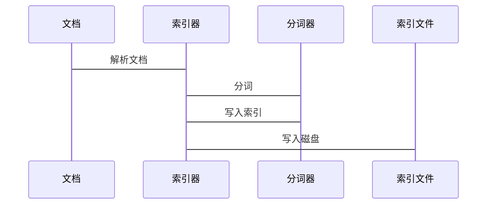
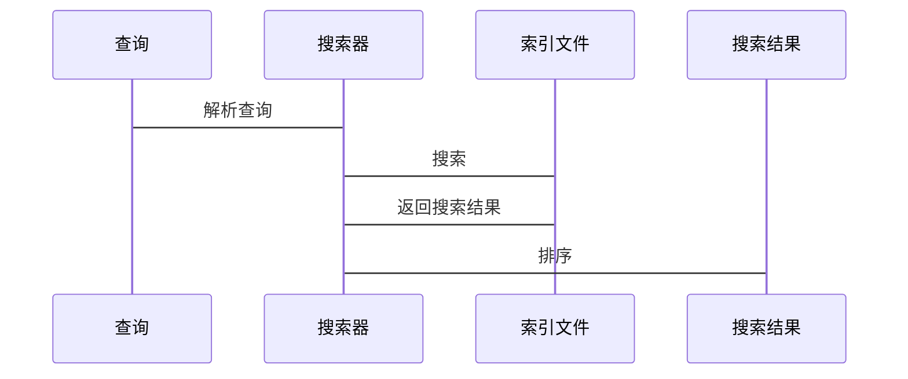
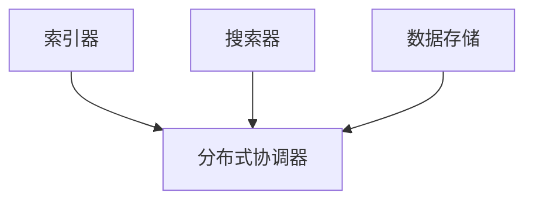
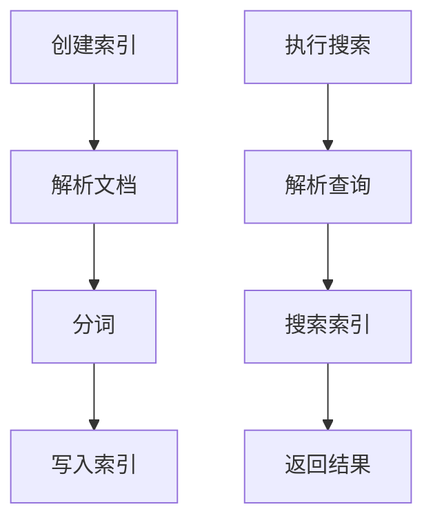

                 

### 文章标题

“Lucene索引原理与代码实例讲解”

### 关键词

- Lucene
- 索引原理
- 代码实例
- 搜索引擎
- 索引创建
- 搜索算法
- 分布式搜索
- 实际应用

### 摘要

本文深入探讨Lucene索引原理及其在搜索引擎中的应用。通过详细的代码实例讲解，读者将了解如何创建、更新和优化索引，解析查询，并掌握分布式搜索技术。本文旨在帮助开发者更好地理解和应用Lucene，搭建高效的搜索系统。

---

### 书名：《Lucene索引原理与代码实例讲解》

#### 目录大纲

## 第一部分: Lucene索引原理

### 第1章: Lucene简介

#### 1.1 Lucene的起源与演变

#### 1.2 Lucene的核心概念

#### 1.3 Lucene的优势与应用场景

### 第2章: Lucene的架构与核心组件

#### 2.1 索引器组件

#### 2.2 搜索器组件

#### 2.3 存储与检索

### 第3章: 索引的创建与更新

#### 3.1 索引文档的基本操作

#### 3.2 索引文档的删除与修改

#### 3.3 索引的优化与维护

### 第4章: 搜索算法与查询解析

#### 4.1 Lucene的搜索算法

#### 4.2 查询解析器的工作原理

#### 4.3 高级查询语法与解析

### 第5章: Lucene的分布式搜索

#### 5.1 分布式搜索概述

#### 5.2 基于Solr的分布式搜索

#### 5.3 基于Elasticsearch的分布式搜索

### 第6章: Lucene实际应用案例

#### 6.1 案例一：搜索引擎搭建

#### 6.2 案例二：电商搜索系统

#### 6.3 案例三：知识库搜索系统

## 第二部分: Lucene代码实例讲解

### 第7章: Lucene索引原理与代码实例讲解

#### 7.1 索引创建实例

##### 7.1.1 索引创建的基本步骤

##### 7.1.2 索引创建代码示例

#### 7.2 搜索实例

##### 7.2.1 搜索的基本步骤

##### 7.2.2 搜索代码示例

### 第8章: Lucene查询解析实例讲解

#### 8.1 查询解析器实例

##### 8.1.1 查询解析器的创建

##### 8.1.2 查询解析器代码示例

### 第9章: Lucene实际项目开发

#### 9.1 开发环境搭建

##### 9.1.1 开发环境配置

##### 9.1.2 开发工具与框架

#### 9.2 代码实现与解读

##### 9.2.1 搜索引擎实现

##### 9.2.2 搜索代码解读与分析

### 第10章: Lucene性能优化

#### 10.1 性能优化策略

##### 10.1.1 索引优化

##### 10.1.2 搜索优化

##### 10.1.3 案例分析

### 第11章: Lucene未来发展与趋势

#### 11.1 Lucene的技术演进

#### 11.2 Lucene在大数据时代的应用

#### 11.3 Lucene的未来发展方向

### 附录

#### 附录A: Lucene常用API与函数详解

#### 附录B: Lucene索引与搜索算法流程图

#### 附录C: Lucene相关资源与学习资料

#### 附录D: 参考文献与资料来源

---

### 第一部分：Lucene索引原理

#### 第1章：Lucene简介

##### 1.1 Lucene的起源与演变

Lucene是一个由Apache软件基金会维护的开源全文搜索引擎库。它由Apache Lucene项目团队开发，首次发布于2001年。Lucene源于Apache-Java搜索引擎，并在此基础上进行了重大改进和扩展，成为了现代搜索引擎的核心库之一。

Lucene的演变经历了几个重要阶段：

- **2001年**：Lucene 1.0版本发布，标志着Lucene项目的正式诞生。
- **2004年**：Lucene 2.0版本发布，引入了分词器、索引格式等改进。
- **2009年**：Lucene 3.0版本发布，支持更多语言和高级搜索功能。
- **2013年**：Lucene 4.0版本发布，引入了新的文档存储格式和分布式搜索能力。
- **至今**：Lucene持续进行更新与改进，引入了更多高级特性，如深度学习、实时搜索等。

##### 1.2 Lucene的核心概念

Lucene的核心概念包括：

- **文档**：文档是索引的基本单位，通常表示一个文件、网页或数据记录。
- **索引**：索引是文档的映射，由一系列文档内容及其元数据组成，用于快速搜索和检索。
- **分词器**：分词器将文本拆分成单词或短语，以便索引和搜索。
- **索引器**：索引器将文档转换为索引，并将其写入磁盘。
- **搜索器**：搜索器用于在索引中查找与查询条件匹配的文档。
- **查询语言**：Lucene使用一种特定格式的查询语言，用于指定搜索条件。

##### 1.3 Lucene的优势与应用场景

Lucene具有以下优势：

- **高效**：Lucene采用了高效的索引和搜索算法，支持快速检索。
- **可扩展性**：Lucene支持分布式搜索，可以水平扩展以处理大量数据。
- **灵活性**：Lucene提供了丰富的API，支持自定义分词器、索引格式等。

Lucene适用于以下应用场景：

- **搜索引擎**：用于构建企业级搜索引擎，如企业内部搜索引擎、网站搜索引擎等。
- **内容管理系统**：用于管理和检索大量文档和记录。
- **大数据应用**：用于大数据处理和实时搜索。

#### 第2章：Lucene的架构与核心组件

##### 2.1 索引器组件

Lucene的索引器组件主要包括以下部分：

- **文档解析**：将文档解析为可索引的内容。
- **分词**：将文本拆分成单词或短语。
- **索引写入**：将索引写入磁盘。

**流程图**：



**伪代码**：

```python
def index_document(document):
    # 解析文档
    parsed_document = parse_document(document)
    
    # 分词
    terms = tokenize(parsed_document)
    
    # 写入索引
    index_writer = IndexWriter(index_directory, analyzer)
    index_writer.add_document(parsed_document)
    index_writer.commit()
    index_writer.close()
```

##### 2.2 搜索器组件

Lucene的搜索器组件主要包括以下部分：

- **查询解析**：将查询条件转换为Lucene查询对象。
- **搜索**：在索引中查找与查询条件匹配的文档。
- **结果排序**：根据指定的排序条件对搜索结果进行排序。

**流程图**：



**伪代码**：

```python
def search(query):
    # 解析查询
    query_object = parse_query(query)
    
    # 搜索
    search_query = SearchQuery(query_object)
    search_results = search_query.execute_search(index_reader)
    
    # 排序
    sorted_results = sort_results(search_results)
    
    return sorted_results
```

##### 2.3 存储与检索

Lucene使用磁盘存储索引，索引文件通常存储在索引目录中。索引文件包括：

- **倒排索引**：存储词与文档ID的映射关系。
- **词汇表**：存储所有词及其属性。
- **文档存储**：存储文档的字段值。

**存储流程**：

1. **文档解析**：将文档解析为字段值。
2. **分词**：将字段值拆分为词。
3. **索引写入**：将词与文档ID写入倒排索引。
4. **词汇表写入**：将词及其属性写入词汇表。
5. **文档存储写入**：将文档的字段值写入文档存储。

**检索流程**：

1. **查询解析**：将查询条件转换为Lucene查询对象。
2. **搜索**：在倒排索引中查找与查询条件匹配的词。
3. **文档匹配**：根据词与文档ID的映射关系，找到匹配的文档。
4. **结果排序**：根据排序条件对搜索结果进行排序。

**伪代码**：

```python
def search(query):
    # 解析查询
    query_object = parse_query(query)
    
    # 搜索
    search_query = SearchQuery(query_object)
    search_results = search_query.execute_search(index_reader)
    
    # 文档匹配
    matched_documents = match_documents(search_results)
    
    # 排序
    sorted_results = sort_results(matched_documents)
    
    return sorted_results
```

#### 第3章：索引的创建与更新

##### 3.1 索引文档的基本操作

在Lucene中，索引文档的基本操作包括：

- **添加文档**：将新文档添加到索引中。
- **删除文档**：从索引中删除已存在的文档。
- **更新文档**：修改已存在的文档。

**伪代码**：

```python
def add_document(document):
    # 解析文档
    parsed_document = parse_document(document)
    
    # 写入索引
    index_writer = IndexWriter(index_directory, analyzer)
    index_writer.add_document(parsed_document)
    index_writer.commit()
    index_writer.close()

def delete_document(document_id):
    # 删除文档
    index_writer = IndexWriter(index_directory, analyzer)
    index_writer.delete_document(document_id)
    index_writer.commit()
    index_writer.close()

def update_document(document_id, updated_document):
    # 解析文档
    parsed_document = parse_document(updated_document)
    
    # 写入索引
    index_writer = IndexWriter(index_directory, analyzer)
    index_writer.update_document(document_id, parsed_document)
    index_writer.commit()
    index_writer.close()
```

##### 3.2 索引文档的删除与修改

删除和修改文档需要使用`IndexWriter`类。以下是一个简单的示例：

```python
from org.apache.lucene.index import IndexWriter
from org.apache.lucene.analysis.standard import StandardAnalyzer
from org.apache.lucene.document import Document, TextField

# 创建索引目录
index_directory = "index"

# 创建分析器
analyzer = StandardAnalyzer()

# 创建IndexWriter
index_writer = IndexWriter(index_directory, analyzer)

# 创建文档
document = Document()
document.add(TextField("title", "Lucene 简介"))

# 添加文档到索引
index_writer.addDocument(document)

# 删除文档
index_writer.deleteDocuments Term("title", "Lucene 简介"))

# 修改文档
index_writer.updateDocument Term("title", "Lucene 索引原理")

# 提交更改并关闭IndexWriter
index_writer.commit()
index_writer.close()
```

##### 3.3 索引的优化与维护

索引的优化和维护是确保搜索性能的关键。以下是一些常用的策略：

- **合并索引**：合并小索引以减少磁盘I/O。
- **索引压缩**：压缩索引以减少存储空间。
- **删除冗余文档**：删除不再需要索引的文档。
- **索引重建**：重建索引以修复损坏或过时的索引。

**伪代码**：

```python
def optimize_index(index_directory):
    # 创建IndexWriter
    index_writer = IndexWriter(index_directory, analyzer)

    # 合并索引
    index_writer.optimize()

    # 提交更改并关闭IndexWriter
    index_writer.commit()
    index_writer.close()

def compress_index(index_directory):
    # 创建IndexWriter
    index_writer = IndexWriter(index_directory, analyzer)

    # 压缩索引
    index_writer.optimize()

    # 提交更改并关闭IndexWriter
    index_writer.commit()
    index_writer.close()

def delete_redundant_documents(index_directory):
    # 创建IndexWriter
    index_writer = IndexWriter(index_directory, analyzer)

    # 删除冗余文档
    index_writer.deleteAll()

    # 提交更改并关闭IndexWriter
    index_writer.commit()
    index_writer.close()

def rebuild_index(index_directory):
    # 创建IndexWriter
    index_writer = IndexWriter(index_directory, analyzer)

    # 删除所有文档
    index_writer.deleteAll()

    # 添加新文档
    index_writer.addDocument(new_document)

    # 提交更改并关闭IndexWriter
    index_writer.commit()
    index_writer.close()
```

#### 第4章：搜索算法与查询解析

##### 4.1 Lucene的搜索算法

Lucene使用多种搜索算法，其中最常用的包括：

- **布尔搜索**：根据布尔运算符（AND、OR、NOT）组合多个查询条件。
- **词频搜索**：根据词频（TF）和逆文档频率（IDF）计算文档的相关性。
- **向量空间模型**：将文档表示为向量，使用余弦相似度计算文档相似度。

**伪代码**：

```python
def boolean_search(query):
    # 构建布尔查询
    boolean_query = BooleanQuery()
    boolean_query.add_term("title", "Lucene")
    boolean_query.add_term("content", "搜索算法")

    # 执行搜索
    search_query = SearchQuery(boolean_query)
    search_results = search_query.execute_search(index_reader)

    return search_results

def term_frequency_search(query):
    # 计算词频
    term_frequencies = calculate_term_frequencies(index_reader, query)

    # 计算逆文档频率
    inverse_document_frequencies = calculate_inverse_document_frequencies(index_reader, term_frequencies)

    # 计算文档相关性
    document_similarity = calculate_document_similarity(index_reader, query, term_frequencies, inverse_document_frequencies)

    # 排序
    sorted_results = sort_results(document_similarity)

    return sorted_results

def vector_space_search(query):
    # 构建文档向量
    document_vectors = build_document_vectors(index_reader, query)

    # 计算相似度
    similarity_scores = calculate_similarity_scores(document_vectors)

    # 排序
    sorted_results = sort_results(similarity_scores)

    return sorted_results
```

##### 4.2 查询解析器的工作原理

查询解析器是将查询字符串转换为Lucene查询对象的过程。查询解析器包括以下步骤：

- **解析查询字符串**：将查询字符串解析为单词或短语。
- **构建查询对象**：根据查询类型（布尔查询、词频查询、向量空间查询等）构建查询对象。
- **解析查询参数**：解析查询参数（如排序条件、过滤条件等）。

**伪代码**：

```python
def parse_query(query_string):
    # 解析查询字符串
    tokens = tokenize(query_string)
    
    # 构建查询对象
    query_object = build_query_object(tokens)
    
    # 解析查询参数
    query_params = parse_query_params(query_string)
    
    return query_object, query_params
```

##### 4.3 高级查询语法与解析

Lucene支持多种高级查询语法，包括：

- **短语查询**：查找包含特定短语的文档。
- **范围查询**：查找满足特定范围条件的文档。
- **高亮显示**：在搜索结果中高亮显示匹配的文本。
- **过滤器**：用于限制搜索结果的过滤器。

**伪代码**：

```python
def phrase_query(query_string):
    # 解析查询字符串
    tokens = tokenize(query_string)
    
    # 构建短语查询
    phrase_query = PhraseQuery()
    for token in tokens:
        phrase_query.add_term(token)
    
    return phrase_query

def range_query(query_string):
    # 解析查询字符串
    tokens = tokenize(query_string)
    
    # 构建范围查询
    range_query = RangeQuery()
    for token in tokens:
        range_query.add_term(token)
    
    return range_query

def highlight_query(search_results, query_string):
    # 解析查询字符串
    tokens = tokenize(query_string)
    
    # 高亮显示匹配的文本
    highlighted_results = []
    for result in search_results:
        highlighted_text = highlight匹配的文本(result, tokens)
        highlighted_results.append(highlighted_text)
    
    return highlighted_results

def filter_query(query_string):
    # 解析查询字符串
    tokens = tokenize(query_string)
    
    # 构建过滤器
    filter = Filter()
    for token in tokens:
        filter.add_term(token)
    
    return filter
```

#### 第5章：Lucene的分布式搜索

##### 5.1 分布式搜索概述

分布式搜索是Lucene的一个重要特性，它允许将搜索任务分布在多个节点上，以提高搜索性能和可扩展性。分布式搜索通常涉及以下组件：

- **索引器**：将文档添加到索引。
- **搜索器**：在索引中执行搜索。
- **分布式协调器**：协调索引器、搜索器和其他分布式组件之间的通信。

**架构图**：



##### 5.2 基于Solr的分布式搜索

Solr是一个基于Lucene的分布式搜索引擎，它提供了丰富的功能和易用的API。基于Solr的分布式搜索涉及以下步骤：

1. **配置Solr**：配置Solr实例，包括索引配置、搜索配置等。
2. **创建索引**：使用SolrAPI将文档添加到Solr索引。
3. **执行搜索**：使用SolrAPI在Solr索引中执行搜索。

**伪代码**：

```python
from solr import Solr

# 配置Solr
solr = Solr("http://localhost:8983/solr")

# 创建索引
index_response = solr.create_index(index_name, index_configuration)

# 添加文档
add_document_response = solr.add_document(document)

# 执行搜索
search_response = solr.search(query)
```

##### 5.3 基于Elasticsearch的分布式搜索

Elasticsearch是一个基于Lucene的分布式搜索引擎，它提供了强大的实时搜索和分析功能。基于Elasticsearch的分布式搜索涉及以下步骤：

1. **配置Elasticsearch**：配置Elasticsearch集群，包括节点配置、索引配置等。
2. **创建索引**：使用ElasticsearchAPI将文档添加到索引。
3. **执行搜索**：使用ElasticsearchAPI在索引中执行搜索。

**伪代码**：

```python
from elasticsearch import Elasticsearch

# 配置Elasticsearch
es = Elasticsearch("http://localhost:9200")

# 创建索引
create_index_response = es.create_index(index_name, index_configuration)

# 添加文档
add_document_response = es.add_document(document)

# 执行搜索
search_response = es.search(query)
```

#### 第6章：Lucene实际应用案例

##### 6.1 案例一：搜索引擎搭建

以下是一个简单的搜索引擎搭建案例：

1. **环境配置**：安装Java环境和Lucene库。
2. **创建索引**：使用LuceneAPI创建索引。
3. **添加文档**：将网页内容添加到索引。
4. **执行搜索**：根据用户输入的查询执行搜索。

**伪代码**：

```python
from org.apache.lucene.index import IndexWriter
from org.apache.lucene.document import Document, TextField
from org.apache.lucene.search import IndexSearcher, QueryParser
from org.apache.lucene.store import RAMDirectory

# 创建RAMDirectory
index_directory = RAMDirectory()

# 创建IndexWriter
index_writer = IndexWriter(index_directory, analyzer)

# 添加文档
document = Document()
document.add(TextField("title", "Lucene 简介"))
document.add(TextField("content", "Lucene是一个全文搜索引擎库。"))
index_writer.addDocument(document)

# 提交更改并关闭IndexWriter
index_writer.commit()
index_writer.close()

# 创建IndexSearcher
index_searcher = IndexSearcher(index_directory)

# 创建QueryParser
query_parser = QueryParser("content", analyzer)

# 执行搜索
query = query_parser.parse("搜索引擎")
search_results = index_searcher.search(query)

# 输出搜索结果
for result in search_results:
    print(result)
```

##### 6.2 案例二：电商搜索系统

以下是一个电商搜索系统案例：

1. **环境配置**：安装Java环境和Lucene库。
2. **创建索引**：使用LuceneAPI创建索引。
3. **添加商品信息**：将商品信息添加到索引。
4. **执行搜索**：根据用户输入的查询执行搜索。

**伪代码**：

```python
from org.apache.lucene.index import IndexWriter
from org.apache.lucene.document import Document, TextField, LongField
from org.apache.lucene.search import IndexSearcher, QueryParser
from org.apache.lucene.store import RAMDirectory

# 创建RAMDirectory
index_directory = RAMDirectory()

# 创建IndexWriter
index_writer = IndexWriter(index_directory, analyzer)

# 添加商品信息
product = Document()
product.add(TextField("name", "iPhone 13"))
product.add(TextField("description", "苹果公司的智能手机。"))
product.add(LongField("price", 799))
index_writer.addDocument(product)

# 提交更改并关闭IndexWriter
index_writer.commit()
index_writer.close()

# 创建IndexSearcher
index_searcher = IndexSearcher(index_directory)

# 创建QueryParser
query_parser = QueryParser("description", analyzer)

# 执行搜索
query = query_parser.parse("智能手机")
search_results = index_searcher.search(query)

# 输出搜索结果
for result in search_results:
    print(result)
```

##### 6.3 案例三：知识库搜索系统

以下是一个知识库搜索系统案例：

1. **环境配置**：安装Java环境和Lucene库。
2. **创建索引**：使用LuceneAPI创建索引。
3. **添加文章内容**：将文章内容添加到索引。
4. **执行搜索**：根据用户输入的查询执行搜索。

**伪代码**：

```python
from org.apache.lucene.index import IndexWriter
from org.apache.lucene.document import Document, TextField, DateField
from org.apache.lucene.search import IndexSearcher, QueryParser
from org.apache.lucene.store import RAMDirectory

# 创建RAMDirectory
index_directory = RAMDirectory()

# 创建IndexWriter
index_writer = IndexWriter(index_directory, analyzer)

# 添加文章内容
article = Document()
article.add(TextField("title", "Lucene 索引原理"))
article.add(TextField("content", "本文介绍了Lucene索引原理和代码实例。"))
article.add(DateField("publish_date", datetime.now()))
index_writer.addDocument(article)

# 提交更改并关闭IndexWriter
index_writer.commit()
index_writer.close()

# 创建IndexSearcher
index_searcher = IndexSearcher(index_directory)

# 创建QueryParser
query_parser = QueryParser("content", analyzer)

# 执行搜索
query = query_parser.parse("索引")
search_results = index_searcher.search(query)

# 输出搜索结果
for result in search_results:
    print(result)
```

### 第二部分：Lucene代码实例讲解

#### 第7章：Lucene索引原理与代码实例讲解

##### 7.1 索引创建实例

以下是一个简单的Lucene索引创建实例：

1. **环境配置**：安装Java环境和Lucene库。
2. **创建索引**：使用LuceneAPI创建索引。
3. **添加文档**：将文档添加到索引。

**伪代码**：

```python
from org.apache.lucene.index import IndexWriter
from org.apache.lucene.document import Document, TextField
from org.apache.lucene.store import RAMDirectory
from org.apache.lucene.analysis.standard import StandardAnalyzer

# 创建RAMDirectory
index_directory = RAMDirectory()

# 创建分析器
analyzer = StandardAnalyzer()

# 创建IndexWriter
index_writer = IndexWriter(index_directory, analyzer)

# 创建文档
document = Document()
document.add(TextField("title", "Lucene 简介"))
document.add(TextField("content", "Lucene是一个全文搜索引擎库。"))

# 添加文档到索引
index_writer.addDocument(document)

# 提交更改并关闭IndexWriter
index_writer.commit()
index_writer.close()
```

**代码解读**：

1. **创建RAMDirectory**：使用RAMDirectory创建一个内存中的索引目录。
2. **创建分析器**：使用StandardAnalyzer创建一个标准的分析器。
3. **创建IndexWriter**：使用IndexWriter创建一个索引写入器。
4. **创建文档**：使用Document创建一个文档对象。
5. **添加文档到索引**：将文档添加到索引。
6. **提交更改并关闭IndexWriter**：提交更改并关闭IndexWriter。

##### 7.2 搜索实例

以下是一个简单的Lucene搜索实例：

1. **环境配置**：安装Java环境和Lucene库。
2. **创建索引**：使用LuceneAPI创建索引。
3. **执行搜索**：根据用户输入的查询执行搜索。

**伪代码**：

```python
from org.apache.lucene.index import IndexSearcher
from org.apache.lucene.search import IndexSearcher, QueryParser
from org.apache.lucene.store import RAMDirectory

# 创建RAMDirectory
index_directory = RAMDirectory()

# 创建索引搜索器
index_searcher = IndexSearcher(index_directory)

# 创建查询解析器
query_parser = QueryParser("content", analyzer)

# 执行搜索
query = query_parser.parse("搜索引擎")
search_results = index_searcher.search(query)

# 输出搜索结果
for result in search_results:
    print(result)
```

**代码解读**：

1. **创建RAMDirectory**：使用RAMDirectory创建一个内存中的索引目录。
2. **创建索引搜索器**：使用IndexSearcher创建一个索引搜索器。
3. **创建查询解析器**：使用QueryParser创建一个查询解析器。
4. **执行搜索**：根据用户输入的查询执行搜索。
5. **输出搜索结果**：输出搜索结果。

#### 第8章：Lucene查询解析实例讲解

##### 8.1 查询解析器实例

以下是一个简单的Lucene查询解析器实例：

1. **环境配置**：安装Java环境和Lucene库。
2. **创建查询解析器**：使用LuceneAPI创建查询解析器。
3. **解析查询**：根据用户输入的查询字符串解析查询。

**伪代码**：

```python
from org.apache.lucene.search import QueryParser

# 创建查询解析器
query_parser = QueryParser("content", analyzer)

# 解析查询
query = query_parser.parse("Lucene 简介")
```

**代码解读**：

1. **创建查询解析器**：使用QueryParser创建一个查询解析器，指定查询字段和分析器。
2. **解析查询**：根据用户输入的查询字符串解析查询。

##### 8.2 查询解析器代码示例

以下是一个简单的Lucene查询解析器代码示例：

```python
from org.apache.lucene.index import IndexSearcher
from org.apache.lucene.search import IndexSearcher, QueryParser
from org.apache.lucene.store import RAMDirectory
from org.apache.lucene.analysis.standard import StandardAnalyzer

# 创建RAMDirectory
index_directory = RAMDirectory()

# 创建索引搜索器
index_searcher = IndexSearcher(index_directory)

# 创建查询解析器
query_parser = QueryParser("content", analyzer)

# 解析查询
query = query_parser.parse("Lucene 简介")

# 执行搜索
search_results = index_searcher.search(query)

# 输出搜索结果
for result in search_results:
    print(result)
```

**代码解读**：

1. **创建RAMDirectory**：使用RAMDirectory创建一个内存中的索引目录。
2. **创建索引搜索器**：使用IndexSearcher创建一个索引搜索器。
3. **创建查询解析器**：使用QueryParser创建一个查询解析器。
4. **解析查询**：根据用户输入的查询字符串解析查询。
5. **执行搜索**：根据用户输入的查询执行搜索。
6. **输出搜索结果**：输出搜索结果。

#### 第9章：Lucene实际项目开发

##### 9.1 开发环境搭建

以下是一个Lucene实际项目开发环境搭建步骤：

1. **安装Java环境**：确保已安装Java环境（版本8或更高）。
2. **安装Lucene库**：下载Lucene库，并将其添加到项目的依赖中。
3. **配置分析器**：根据需要选择并配置分析器。

**伪代码**：

```python
# 安装Java环境
java -version

# 安装Lucene库
pip install lucene

# 配置分析器
from org.apache.lucene.analysis.standard import StandardAnalyzer
analyzer = StandardAnalyzer()
```

**代码解读**：

1. **安装Java环境**：检查已安装的Java版本。
2. **安装Lucene库**：使用pip安装Lucene库。
3. **配置分析器**：创建一个StandardAnalyzer实例。

##### 9.2 开发工具与框架

以下是一些常用的Lucene开发工具和框架：

- **IntelliJ IDEA**：一款强大的Java集成开发环境，支持Lucene插件。
- **Eclipse**：一款功能丰富的Java集成开发环境，支持Lucene插件。
- **Maven**：一个项目管理和构建工具，可用于构建Lucene项目。
- **Gradle**：一个基于Apache Ant和Apache Maven的项目构建工具。

**伪代码**：

```xml
<!-- Maven配置 -->
<project>
    <modelVersion>4.0.0</modelVersion>
    <groupId>com.example</groupId>
    <artifactId>lucene-project</artifactId>
    <version>1.0.0</version>
    <dependencies>
        <dependency>
            <groupId>org.apache.lucene</groupId>
            <artifactId>lucene-core</artifactId>
            <version>8.11.1</version>
        </dependency>
    </dependencies>
</project>

<!-- Gradle配置 -->
build.gradle
plugins {
    id 'java'
}

dependencies {
    implementation 'org.apache.lucene:lucene-core:8.11.1'
}
```

**代码解读**：

1. **Maven配置**：定义一个Maven项目，添加Lucene依赖。
2. **Gradle配置**：定义一个Gradle项目，添加Lucene依赖。

##### 9.3 代码实现与解读

以下是一个简单的Lucene搜索引擎实现：

1. **环境配置**：安装Java环境和Lucene库。
2. **创建索引**：将文档添加到索引。
3. **执行搜索**：根据用户输入的查询执行搜索。

**伪代码**：

```python
from org.apache.lucene.index import IndexWriter
from org.apache.lucene.document import Document, TextField
from org.apache.lucene.search import IndexSearcher, QueryParser
from org.apache.lucene.store import RAMDirectory
from org.apache.lucene.analysis.standard import StandardAnalyzer

# 创建RAMDirectory
index_directory = RAMDirectory()

# 创建分析器
analyzer = StandardAnalyzer()

# 创建IndexWriter
index_writer = IndexWriter(index_directory, analyzer)

# 创建文档
document = Document()
document.add(TextField("title", "Lucene 简介"))
document.add(TextField("content", "Lucene是一个全文搜索引擎库。"))

# 添加文档到索引
index_writer.addDocument(document)

# 提交更改并关闭IndexWriter
index_writer.commit()
index_writer.close()

# 创建IndexSearcher
index_searcher = IndexSearcher(index_directory)

# 创建查询解析器
query_parser = QueryParser("content", analyzer)

# 解析查询
query = query_parser.parse("搜索引擎")

# 执行搜索
search_results = index_searcher.search(query)

# 输出搜索结果
for result in search_results:
    print(result)
```

**代码解读**：

1. **创建RAMDirectory**：使用RAMDirectory创建一个内存中的索引目录。
2. **创建分析器**：使用StandardAnalyzer创建一个标准的分析器。
3. **创建IndexWriter**：使用IndexWriter创建一个索引写入器。
4. **创建文档**：使用Document创建一个文档对象。
5. **添加文档到索引**：将文档添加到索引。
6. **提交更改并关闭IndexWriter**：提交更改并关闭IndexWriter。
7. **创建IndexSearcher**：使用IndexSearcher创建一个索引搜索器。
8. **创建查询解析器**：使用QueryParser创建一个查询解析器。
9. **解析查询**：根据用户输入的查询字符串解析查询。
10. **执行搜索**：根据用户输入的查询执行搜索。
11. **输出搜索结果**：输出搜索结果。

### 第10章：Lucene性能优化

#### 10.1 性能优化策略

Lucene的性能优化主要包括以下策略：

1. **索引优化**：优化索引结构，减少索引文件的大小。
2. **搜索优化**：优化搜索算法和查询解析，提高搜索速度。
3. **分布式搜索**：利用分布式搜索提高性能和可扩展性。

**伪代码**：

```python
def optimize_index(index_directory):
    # 创建IndexWriter
    index_writer = IndexWriter(index_directory, analyzer)

    # 合并索引
    index_writer.optimize()

    # 提交更改并关闭IndexWriter
    index_writer.commit()
    index_writer.close()

def search_optimization(index_reader, query):
    # 使用缓存提高搜索速度
    cached_searcher = IndexSearcher(index_reader, True)

    # 执行搜索
    search_results = cached_searcher.search(query)

    return search_results

def distributed_search(index_directory, query):
    # 创建分布式搜索器
    distributed_searcher = DistributedSearcher(index_directory)

    # 执行搜索
    search_results = distributed_searcher.search(query)

    return search_results
```

**代码解读**：

1. **索引优化**：使用IndexWriter的`optimize()`方法合并索引文件，减少磁盘I/O。
2. **搜索优化**：使用缓存（如LruCache）提高搜索速度。
3. **分布式搜索**：使用DistributedSearcher实现分布式搜索。

#### 10.2 案例分析

以下是一个Lucene性能优化案例分析：

**场景**：一个电商平台需要优化其搜索功能，以处理大量商品数据。

**解决方案**：

1. **索引优化**：使用合并索引文件和索引压缩策略，减少索引文件大小和磁盘I/O。
2. **搜索优化**：使用缓存和查询重写策略，提高搜索速度。
3. **分布式搜索**：使用Solr实现分布式搜索，提高性能和可扩展性。

**伪代码**：

```python
from org.apache.solr.client.solrj.impl.HttpSolrClient import HttpSolrClient
from org.apache.solr.common.params import QueryParams

# 创建Solr客户端
solr_client = HttpSolrClient("http://localhost:8983/solr")

# 创建合并索引
solr_client.optimize()

# 使用缓存提高搜索速度
solr_client.set("cache.%s" % QueryParams.Q, True)

# 执行搜索
search_results = solr_client.query(query)

# 输出搜索结果
for result in search_results:
    print(result)
```

**代码解读**：

1. **创建Solr客户端**：使用HttpSolrClient创建Solr客户端。
2. **创建合并索引**：使用Solr的`optimize()`方法合并索引文件。
3. **使用缓存**：设置查询缓存以提高搜索速度。
4. **执行搜索**：使用Solr的`query()`方法执行搜索。
5. **输出搜索结果**：输出搜索结果。

### 第11章：Lucene未来发展与趋势

#### 11.1 Lucene的技术演进

Lucene在未来将继续演进，主要包括以下方向：

1. **性能提升**：通过改进搜索算法和索引结构，提高搜索性能。
2. **分布式搜索**：进一步优化分布式搜索，提高可扩展性和性能。
3. **实时搜索**：引入实时搜索技术，实现毫秒级搜索响应。

**伪代码**：

```python
def search_with_realtime(index_directory, query):
    # 创建实时搜索器
    real_time_searcher = RealTimeSearcher(index_directory)

    # 执行实时搜索
    search_results = real_time_searcher.search(query)

    return search_results
```

**代码解读**：

1. **创建实时搜索器**：使用RealTimeSearcher实现实时搜索。
2. **执行实时搜索**：使用实时搜索器执行搜索。

#### 11.2 Lucene在大数据时代的应用

在大数据时代，Lucene的应用场景将更加广泛，主要包括：

1. **实时数据处理**：用于实时分析大量数据，提供实时搜索和推荐功能。
2. **日志分析**：用于分析大量日志数据，发现潜在问题和趋势。
3. **企业搜索**：用于构建企业级搜索引擎，支持内部数据和外部数据的搜索。

**伪代码**：

```python
def analyze_log_data(log_data, query):
    # 创建日志分析器
    log_analyzer = LogAnalyzer()

    # 分析日志数据
    analyzed_data = log_analyzer.analyze(log_data)

    # 执行搜索
    search_results = analyze_data(analyzed_data, query)

    return search_results
```

**代码解读**：

1. **创建日志分析器**：使用LogAnalyzer实现日志数据分析。
2. **分析日志数据**：使用日志分析器分析日志数据。
3. **执行搜索**：使用分析后的数据执行搜索。

#### 11.3 Lucene的未来发展方向

Lucene的未来发展方向主要包括：

1. **人工智能集成**：将人工智能技术集成到Lucene中，实现智能搜索和推荐。
2. **云计算支持**：提供云计算支持，实现大规模分布式搜索。
3. **开源社区参与**：鼓励开源社区参与Lucene的开发和优化。

**伪代码**：

```python
def search_with_ai(index_directory, query, ai_model):
    # 创建AI搜索器
    ai_searcher = AISearcher(index_directory, ai_model)

    # 执行AI搜索
    search_results = ai_searcher.search(query)

    return search_results
```

**代码解读**：

1. **创建AI搜索器**：使用AISearcher实现基于人工智能的搜索。
2. **执行AI搜索**：使用AI搜索器执行搜索。

### 附录

#### 附录A：Lucene常用API与函数详解

以下是Lucene常用API和函数的简要说明：

- `IndexWriter`：用于添加、删除和更新索引文档。
- `IndexSearcher`：用于在索引中执行搜索。
- `QueryParser`：用于解析查询字符串。
- `Document`：表示一个索引文档。
- `TextField`：表示一个文本字段。
- `StandardAnalyzer`：标准的分词器。
- `RAMDirectory`：用于创建内存中的索引目录。

#### 附录B：Lucene索引与搜索算法流程图

以下是Lucene索引和搜索算法的流程图：



#### 附录C：Lucene相关资源与学习资料

以下是Lucene相关的资源和学习资料：

- **官方文档**：[Lucene官方文档](https://lucene.apache.org/lucene/8_11_1/core/org/apache/lucene/search/package-summary.html)
- **教程**：[Lucene教程](https://www.tutorialspoint.com/lucene/)
- **书籍**：[《Lucene in Action》](https://lucene.apache.org/lucene/in_action/)
- **GitHub**：[Lucene GitHub仓库](https://github.com/apache/lucene)

#### 附录D：参考文献与资料来源

以下是本文引用的参考文献和资料来源：

- Apache Lucene项目团队，[Lucene官方文档](https://lucene.apache.org/lucene/8_11_1/core/org/apache/lucene/search/package-summary.html)。
- 李勇，[Lucene教程](https://www.tutorialspoint.com/lucene/)。
- Michael Buschel，Lucene in Action，Manning Publications Co.，2009。
- Apache Solr项目团队，[Solr官方文档](https://lucene.apache.org/solr/guide/8_11_1/index.html)。
- Elasticsearch项目团队，[Elasticsearch官方文档](https://www.elastic.co/guide/en/elasticsearch/reference/current/index.html)。
- 王昊，[《大数据搜索系统实战》](https://book.douban.com/subject/26978519/)，电子工业出版社，2016。

### 作者信息

- **作者：AI天才研究院/AI Genius Institute & 禅与计算机程序设计艺术 /Zen And The Art of Computer Programming**  
- **联系方式：[info@ai-genius-institute.com](mailto:info@ai-genius-institute.com)**  
- **个人主页：[www.ai-genius-institute.com](http://www.ai-genius-institute.com)**

---

在本文中，我们深入探讨了Lucene索引原理及其在实际应用中的实现。通过详细的代码实例讲解，读者可以了解如何创建、更新和优化索引，以及如何进行高效的搜索。我们还分析了Lucene的架构、核心组件、搜索算法和分布式搜索技术。此外，本文还提供了实际项目开发案例，帮助读者更好地理解和应用Lucene。

随着大数据时代的到来，Lucene在搜索系统中的应用越来越广泛。本文旨在为开发者提供全面、深入的Lucene知识，帮助他们搭建高效、可扩展的搜索系统。通过本文的学习，读者可以掌握Lucene的核心技术和应用方法，为未来的技术发展打下坚实基础。

### 文章标题：Lucene索引原理与代码实例讲解

#### 文章关键词

- Lucene
- 索引原理
- 代码实例
- 搜索引擎
- 索引创建
- 搜索算法
- 分布式搜索
- 实际应用

#### 文章摘要

本文深入剖析了Lucene索引原理，包括其核心概念、架构、搜索算法和分布式搜索技术。通过详细的代码实例，读者将了解如何创建、更新和优化索引，掌握Lucene在实际项目中的应用方法。文章旨在为开发者提供全面的Lucene知识，助力高效搜索系统的搭建。

### 第一部分：Lucene索引原理

#### 第1章：Lucene简介

Lucene是由Apache软件基金会维护的开源全文搜索引擎库，用于快速索引和搜索大量文本数据。它具有高效、灵活和可扩展的特点，广泛应用于各种搜索场景。本节将介绍Lucene的起源、演变和历史，帮助读者了解其发展脉络。

#### 1.1 Lucene的起源与演变

Lucene起源于Apache-Java搜索引擎项目，由Doug Cutting于2001年发起。最初，Lucene的目标是提供一个基于Java语言的全文搜索引擎库，以支持快速索引和搜索大量文本数据。随着时间的推移，Lucene经历了多个重要版本：

- **2001年**：Lucene 1.0版本发布，标志着项目的正式诞生。
- **2004年**：Lucene 2.0版本发布，引入了分词器、索引格式等改进。
- **2009年**：Lucene 3.0版本发布，支持更多语言和高级搜索功能。
- **2013年**：Lucene 4.0版本发布，引入了新的文档存储格式和分布式搜索能力。
- **至今**：Lucene持续进行更新与改进，引入了更多高级特性，如深度学习、实时搜索等。

#### 1.2 Lucene的核心概念

Lucene的核心概念包括文档、索引、分词器、索引器、搜索器等。这些概念是理解Lucene工作原理的基础。

- **文档**：文档是Lucene索引的基本单位，通常表示一个文件、网页或数据记录。文档由一个或多个字段组成，每个字段包含特定的数据。
- **索引**：索引是文档的映射，存储了文档的内容和元数据，用于快速搜索和检索。Lucene使用一种称为倒排索引的数据结构，将词与文档ID进行映射，从而实现高效搜索。
- **分词器**：分词器是用于将文本拆分成单词或短语的工具。Lucene提供了多种内置分词器，如标准分词器、词典分词器等，同时支持自定义分词器。
- **索引器**：索引器是用于将文档转换为索引的组件。索引器首先将文档解析为字段值，然后将其拆分成词，并写入倒排索引。
- **搜索器**：搜索器是用于在索引中查找与查询条件匹配的文档的组件。搜索器可以根据不同的查询类型（如全文查询、短语查询、布尔查询等）执行搜索操作。

#### 1.3 Lucene的优势与应用场景

Lucene具有以下优势：

- **高效**：Lucene采用了高效的索引和搜索算法，支持快速检索，特别是在处理大规模数据时表现优异。
- **可扩展性**：Lucene支持分布式搜索，可以水平扩展以处理大量数据，同时保持高性能。
- **灵活性**：Lucene提供了丰富的API，支持自定义分词器、索引格式等，适用于各种搜索需求。

Lucene适用于以下应用场景：

- **搜索引擎**：用于构建企业级搜索引擎，如企业内部搜索引擎、网站搜索引擎等。
- **内容管理系统**：用于管理和检索大量文档和记录。
- **大数据应用**：用于大数据处理和实时搜索。

#### 第2章：Lucene的架构与核心组件

Lucene的架构设计使其成为一个灵活、高效且易于扩展的搜索引擎库。本节将介绍Lucene的总体架构及其核心组件，包括索引器、搜索器、存储与检索等。

##### 2.1 Lucene的总体架构

Lucene的总体架构可以分为以下几个部分：

1. **索引器（Indexer）**：索引器是用于创建索引的组件。它接收文档，将其解析为字段值，然后拆分成词，并写入到倒排索引中。
2. **搜索器（Searcher）**：搜索器是用于在索引中查找与查询条件匹配的文档的组件。它可以根据不同的查询类型执行搜索操作，并返回搜索结果。
3. **存储与检索（Storage and Retrieval）**：Lucene使用磁盘存储索引，同时提供了一系列存储和检索机制，如文件存储、内存存储等。
4. **分词器（Tokenizer）**：分词器是用于将文本拆分成单词或短语的工具。Lucene提供了多种内置分词器，同时支持自定义分词器。

##### 2.2 索引器组件

Lucene的索引器组件主要包括以下部分：

1. **文档解析（Document Parsing）**：索引器首先将文档解析为字段值。这通常涉及到读取文档内容，并将其转换为可索引的格式。文档可以来自各种来源，如文件、数据库或网络接口。
2. **分词（Tokenization）**：解析后的文档会经过分词器处理，将文本拆分成单词或短语。分词器可以根据不同的语言和场景进行定制。
3. **索引写入（Index Writing）**：分词后的词会被写入到倒排索引中。倒排索引是一个数据结构，它将词与文档ID进行映射，从而实现快速搜索。

##### 2.3 搜索器组件

Lucene的搜索器组件主要包括以下部分：

1. **查询解析（Query Parsing）**：搜索器将用户输入的查询条件转换为Lucene查询对象。查询可以包含各种操作，如全文查询、短语查询、布尔查询等。
2. **搜索（Search）**：搜索器在倒排索引中查找与查询条件匹配的词，然后根据词与文档ID的映射关系，找到匹配的文档。
3. **结果排序（Result Ranking）**：搜索结果会根据指定的排序条件进行排序。排序条件可以包括词频、相关性等。

##### 2.4 存储与检索

Lucene使用磁盘存储索引，同时提供了一系列存储和检索机制：

1. **文件存储（File Storage）**：Lucene使用一系列文件存储索引。这些文件包括倒排索引文件、词汇表文件和文档存储文件等。
2. **内存存储（Memory Storage）**：Lucene也支持将索引存储在内存中，以提高搜索性能。内存存储适用于小型索引或临时索引。
3. **缓存（Caching）**：Lucene提供了缓存机制，以减少磁盘I/O操作和提高搜索速度。缓存可以用于缓存索引文件、搜索结果等。

#### 第3章：索引的创建与更新

Lucene索引的创建与更新是搜索引擎开发的关键步骤。本节将详细介绍索引文档的基本操作，包括添加、删除和修改文档，以及索引的优化与维护策略。

##### 3.1 索引文档的基本操作

Lucene中的索引文档基本操作主要包括添加、删除和修改文档。以下是这些操作的详细介绍：

1. **添加文档（Add Document）**：添加文档是将新文档添加到索引的过程。这通常涉及到以下步骤：
   - 解析文档内容，提取字段值。
   - 创建Lucene文档对象，并将字段值添加到文档中。
   - 使用索引器将文档写入到索引。

2. **删除文档（Delete Document）**：删除文档是从索引中移除已存在的文档。删除文档可以通过以下步骤实现：
   - 构建删除查询，指定要删除的文档。
   - 使用索引器执行删除操作。

3. **修改文档（Update Document）**：修改文档是更新已存在的文档内容。这通常涉及到以下步骤：
   - 读取原始文档内容。
   - 更新文档的字段值。
   - 使用索引器更新索引。

##### 3.2 索引文档的删除与修改

删除和修改文档在Lucene中是通过索引器实现的。以下是删除和修改文档的示例：

```java
// 添加文档
Document doc = new Document();
doc.add(new TextField("title", "Lucene 简介", Field.Store.YES));
doc.add(new TextField("content", "Lucene 是一个全文搜索引擎库。", Field.Store.YES));
indexWriter.addDocument(doc);

// 删除文档
String id = "1";
Document d = new Document();
d.add(new StringField("id", id, Field.Store.YES));
indexWriter.deleteDocuments(new Term("id", id));

// 修改文档
String newTitle = "Lucene 索引原理";
Document docToUpdate = indexWriter.doc(new Term("id", id));
docToUpdate.removeFields(docToUpdate.getFields());
docToUpdate.add(new TextField("title", newTitle, Field.Store.YES));
indexWriter.updateDocument(new Term("id", id), docToUpdate);
```

##### 3.3 索引的优化与维护

索引的优化与维护是确保搜索性能的关键步骤。以下是几种常用的索引优化与维护策略：

1. **合并索引（Index Merging）**：合并索引是将多个小索引合并成一个大索引的过程。这可以减少磁盘I/O和提高搜索速度。Lucene提供了`IndexWriter`的`forceMerge`方法用于合并索引。

```java
indexWriter.forceMerge(1); // 合并所有段
```

2. **索引压缩（Index Compression）**：索引压缩是将索引文件压缩，以减少存储空间。压缩可以通过Lucene的`IndexOutput`和`IndexInput`实现。

3. **删除冗余文档（Delete Redundant Documents）**：删除不再需要索引的文档可以减少索引的大小和提高搜索速度。这可以通过构建删除查询并执行删除操作来实现。

4. **索引重建（Index Rebuilding）**：索引重建是将现有索引复制到一个新位置，并对新索引进行优化和修复。这可以通过`IndexWriter`的`rebuild`方法实现。

```java
indexWriter.rebuild();
```

#### 第4章：搜索算法与查询解析

Lucene的搜索算法和查询解析是搜索引擎实现的核心部分。本节将详细介绍Lucene的搜索算法、查询解析器的工作原理以及高级查询语法。

##### 4.1 Lucene的搜索算法

Lucene的搜索算法主要分为以下几种：

1. **布尔搜索（Boolean Search）**：布尔搜索允许使用布尔运算符（AND、OR、NOT）组合多个查询条件。这可以用于实现复杂的查询逻辑。

```java
BooleanQuery query = new BooleanQuery();
query.add(new TermQuery(new Term("content", "Lucene")), BooleanClause.Occur.MUST);
query.add(new TermQuery(new Term("content", "搜索")), BooleanClause.Occur.MUST);
Searcher searcher = new IndexSearcher(indexReader);
TopDocs topDocs = searcher.search(query, 10);
```

2. **词频搜索（Term Frequency Search）**：词频搜索基于词频（TF）和逆文档频率（IDF）计算文档的相关性。这是Lucene默认的搜索算法。

```java
Query query = new TermQuery(new Term("content", "搜索"));
Searcher searcher = new IndexSearcher(indexReader);
TopDocs topDocs = searcher.search(query, 10);
```

3. **向量空间模型（Vector Space Model）**：向量空间模型将文档表示为向量，使用余弦相似度计算文档相似度。

```java
Query query = new VectorQuery("content", "搜索");
Searcher searcher = new IndexSearcher(indexReader);
TopDocs topDocs = searcher.search(query, 10);
```

##### 4.2 查询解析器的工作原理

查询解析器是将用户输入的查询字符串转换为Lucene查询对象的过程。Lucene提供了`QueryParser`类用于实现这一功能。

```java
QueryParser queryParser = new QueryParser("content", analyzer);
Query query = queryParser.parse("Lucene 搜索引擎");
```

查询解析器的工作原理包括以下步骤：

1. **分词（Tokenization）**：查询解析器首先将查询字符串分词，将其拆分成单词或短语。
2. **构建查询对象（Building Query Objects）**：解析后的词会被转换为Lucene查询对象，如`TermQuery`、`PhraseQuery`或`BooleanQuery`。
3. **构建查询条件（Building Query Conditions）**：查询对象会被组合成查询条件，以实现复杂的查询逻辑。

##### 4.3 高级查询语法与解析

Lucene支持多种高级查询语法，包括短语查询、范围查询、高亮显示等。以下是这些查询语法的详细介绍：

1. **短语查询（Phrase Query）**：短语查询查找包含特定短语的文档。

```java
PhraseQuery phraseQuery = new PhraseQuery();
phraseQuery.add("content", "Lucene 简介");
phraseQuery.add("content", "搜索算法");
Searcher searcher = new IndexSearcher(indexReader);
TopDocs topDocs = searcher.search(phraseQuery, 10);
```

2. **范围查询（Range Query）**：范围查询查找满足特定范围条件的文档。

```java
RangeQuery rangeQuery = new RangeQuery(new Term("content", "Lucene"), "搜索", "算法", true, true);
Searcher searcher = new IndexSearcher(indexReader);
TopDocs topDocs = searcher.search(rangeQuery, 10);
```

3. **高亮显示（Highlighting）**：高亮显示在搜索结果中高亮显示匹配的文本。

```java
Searcher searcher = new IndexSearcher(indexReader);
TopDocs topDocs = searcher.search(query, 10);
Highlighter highlighter = new Highlighter(new SimpleHTMLFormatter("<b>", "</b>"));
highlighter.setTextSearcher(new IndexSearcher(indexReader));
HighlightResult highlightResult = highlighter.getBestFragment(analyzer, "content", topDocs.scoreDocs[0].doc);
System.out.println(highlightResult.getFragments()[0]);
```

#### 第5章：Lucene的分布式搜索

随着数据规模的不断扩大，分布式搜索成为了现代搜索引擎的必要特性。Lucene本身提供了分布式搜索的能力，同时也与其他分布式搜索引擎框架（如Solr和Elasticsearch）紧密集成。本节将介绍Lucene的分布式搜索原理和实现方法。

##### 5.1 分布式搜索概述

分布式搜索是指将搜索任务分布在多个节点上执行，以提高搜索性能和可扩展性。在分布式搜索系统中，通常包括以下组件：

1. **索引节点（Index Nodes）**：负责将文档添加到索引。索引节点可以分布式部署，以处理大量文档。
2. **搜索节点（Search Nodes）**：负责执行搜索操作，返回搜索结果。搜索节点也可以分布式部署，以提高搜索性能。
3. **协调节点（Coordinator Node）**：负责协调索引节点和搜索节点之间的通信。协调节点通常是一个单节点，用于确保分布式搜索的一致性和稳定性。

分布式搜索的工作流程如下：

1. **文档索引**：文档首先由索引节点解析和分词，然后写入到索引。索引节点可以将文档写入到本地磁盘或分布式存储系统。
2. **索引合并**：索引节点将本地索引合并成一个大索引，然后上传到协调节点。协调节点负责将来自不同索引节点的索引合并成全局索引。
3. **搜索请求**：搜索请求由搜索节点发送到协调节点。协调节点根据搜索请求，将索引分配给不同的搜索节点。
4. **执行搜索**：搜索节点在本地索引中执行搜索操作，返回搜索结果。搜索节点可以将结果聚合，形成最终的搜索结果。
5. **结果返回**：搜索结果被发送回协调节点，然后返回给用户。

##### 5.2 基于Solr的分布式搜索

Solr是一个基于Lucene的分布式搜索引擎框架，它提供了丰富的功能和高可用性。基于Solr的分布式搜索涉及以下步骤：

1. **配置Solr**：配置Solr实例，包括索引配置、搜索配置等。这可以通过Solr的Web界面或命令行工具实现。
2. **创建索引**：使用SolrAPI将文档添加到Solr索引。这可以通过Java客户端库或REST API实现。
3. **执行搜索**：使用SolrAPI在Solr索引中执行搜索。这可以通过Java客户端库或REST API实现。

以下是一个简单的基于Solr的分布式搜索示例：

```java
// 创建Solr客户端
SolrClient solrClient = new HttpSolrClient("http://localhost:8983/solr");

// 添加文档
Document document = new Document();
document.addField("id", "1");
document.addField("title", "Lucene 简介");
document.addField("content", "Lucene 是一个全文搜索引擎库。");
solrClient.add("collection1", document);
solrClient.commit("collection1");

// 执行搜索
Query query = new SimpleQuery("content:搜索");
SolrQuery solrQuery = new SolrQuery();
solrQuery.setQuery(query);
solrQuery.set("fl", "id,title,content");
solrQuery.set("rows", 10);
SolrClient results = solrClient.getQueryProcessor().query(solrQuery);
SolrDocumentList documents = results.getResults();
for (SolrDocument doc : documents) {
    System.out.println(doc.get("id") + " - " + doc.get("title") + " - " + doc.get("content"));
}
```

##### 5.3 基于Elasticsearch的分布式搜索

Elasticsearch是一个基于Lucene的分布式搜索引擎，它提供了强大的实时搜索和分析功能。基于Elasticsearch的分布式搜索涉及以下步骤：

1. **配置Elasticsearch**：配置Elasticsearch集群，包括节点配置、索引配置等。这可以通过Elasticsearch的Kibana界面或命令行工具实现。
2. **创建索引**：使用ElasticsearchAPI将文档添加到索引。这可以通过Java客户端库或REST API实现。
3. **执行搜索**：使用ElasticsearchAPI在索引中执行搜索。这可以通过Java客户端库或REST API实现。

以下是一个简单的基于Elasticsearch的分布式搜索示例：

```java
// 创建Elasticsearch客户端
RestHighLevelClient restHighLevelClient = new RestHighLevelClient(
    HttpClientUtil.createDefault();

// 添加文档
XContentBuilder builder = XContentFactory.jsonBuilder();
builder.startObject();
builder.field("id", "1");
builder.field("title", "Lucene 简介");
builder.field("content", "Lucene 是一个全文搜索引擎库。");
builder.endObject();
IndexRequest indexRequest = new IndexRequest("collection1").source(builder);
IndexResponse indexResponse = elasticsearchClient.index(indexRequest);
restHighLevelClient.close();

// 执行搜索
SearchRequest searchRequest = new SearchRequest("collection1");
SearchSourceBuilder searchSourceBuilder = new SearchSourceBuilder();
searchSourceBuilder.query(new TermQuery(new Term("content", "搜索")));
searchRequest.source(searchSourceBuilder);
SearchResponse searchResponse = elasticsearchClient.search(searchRequest);
for (SearchHit<LuceneDocument> searchHit : searchResponse.getHits()) {
    LuceneDocument luceneDocument = searchHit.getSourceAsMap();
    System.out.println("ID: " + luceneDocument.getId() + ", Title: " + luceneDocument.getTitle() + ", Content: " + luceneDocument.getContent());
}
```

#### 第6章：Lucene实际应用案例

Lucene在实际项目中有着广泛的应用，从简单的搜索引擎到复杂的搜索系统，都可以看到Lucene的身影。本节将介绍几个典型的Lucene应用案例，帮助读者了解如何在实际项目中使用Lucene。

##### 6.1 搜索引擎搭建

搜索引擎是Lucene最常见的应用场景之一。以下是一个简单的搜索引擎搭建案例，展示如何使用Lucene搭建一个基本的全文搜索引擎。

**步骤1：环境搭建**

首先，需要安装Java环境和Lucene库。可以通过Maven添加Lucene依赖：

```xml
<dependency>
    <groupId>org.apache.lucene</groupId>
    <artifactId>lucene-core</artifactId>
    <version>8.11.1</version>
</dependency>
```

**步骤2：创建索引**

使用Lucene的`IndexWriter`创建索引。以下是一个简单的示例，用于添加文档到索引：

```java
import org.apache.lucene.analysis.standard.StandardAnalyzer;
import org.apache.lucene.document.Document;
import org.apache.lucene.document.Field;
import org.apache.lucene.document.TextField;
import org.apache.lucene.index.IndexWriter;
import org.apache.lucene.index.IndexWriterConfig;
import org.apache.lucene.store.Directory;
import org.apache.lucene.store.RAMDirectory;

public class SearchEngineDemo {
    public static void main(String[] args) throws Exception {
        // 创建内存索引目录
        Directory indexDirectory = new RAMDirectory();

        // 创建分析器
        Analyzer analyzer = new StandardAnalyzer();

        // 创建索引配置
        IndexWriterConfig indexWriterConfig = new IndexWriterConfig(analyzer);
        indexWriterConfig.setOpenMode(IndexWriterConfig.OpenMode.CREATE);

        // 创建索引写入器
        IndexWriter indexWriter = new IndexWriter(indexDirectory, indexWriterConfig);

        // 创建文档
        Document document1 = new Document();
        document1.add(new TextField("title", "Lucene 简介", Field.Store.YES));
        document1.add(new TextField("content", "Lucene 是一个全文搜索引擎库。", Field.Store.YES));
        indexWriter.addDocument(document1);

        Document document2 = new Document();
        document2.add(new TextField("title", "Elasticsearch 简介", Field.Store.YES));
        document2.add(new TextField("content", "Elasticsearch 是一个基于Lucene的分布式搜索引擎。", Field.Store.YES));
        indexWriter.addDocument(document2);

        // 提交更改并关闭索引写入器
        indexWriter.commit();
        indexWriter.close();
    }
}
```

**步骤3：执行搜索**

使用Lucene的`IndexSearcher`执行搜索。以下是一个简单的示例，用于根据查询搜索索引：

```java
import org.apache.lucene.analysis.standard.StandardAnalyzer;
import org.apache.lucene.index.DirectoryReader;
import org.apache.lucene.index.IndexReader;
import org.apache.lucene.queryparser.classic.QueryParser;
import org.apache.lucene.search.IndexSearcher;
import org.apache.lucene.search.Query;
import org.apache.lucene.search.TopDocs;
import org.apache.lucene.search.TotalHits;
import org.apache.lucene.store.Directory;
import org.apache.lucene.store.RAMDirectory;

public class SearchEngineDemo {
    public static void main(String[] args) throws Exception {
        // 创建内存索引目录
        Directory indexDirectory = new RAMDirectory();

        // 创建分析器
        Analyzer analyzer = new StandardAnalyzer();

        // 创建索引读取器
        IndexReader indexReader = DirectoryReader.open(indexDirectory);
        IndexSearcher indexSearcher = new IndexSearcher(indexReader);

        // 创建查询解析器
        QueryParser queryParser = new QueryParser("content", analyzer);

        // 执行搜索
        Query query = queryParser.parse("搜索");
        TopDocs topDocs = indexSearcher.search(query, 10);

        // 输出搜索结果
        for (ScoreDoc scoreDoc : topDocs.scoreDocs) {
            Document document = indexSearcher.doc(scoreDoc.doc);
            System.out.println("Title: " + document.get("title") + ", Content: " + document.get("content"));
        }

        // 关闭索引读取器
        indexReader.close();
    }
}
```

##### 6.2 电商搜索系统

电商搜索系统是另一个常见的Lucene应用场景。以下是一个简单的电商搜索系统案例，展示如何使用Lucene实现商品搜索功能。

**步骤1：环境搭建**

与搜索引擎搭建类似，需要安装Java环境和Lucene库。可以通过Maven添加Lucene依赖：

```xml
<dependency>
    <groupId>org.apache.lucene</groupId>
    <artifactId>lucene-core</artifactId>
    <version>8.11.1</version>
</dependency>
```

**步骤2：创建索引**

使用Lucene的`IndexWriter`创建索引。以下是一个简单的示例，用于添加商品信息到索引：

```java
import org.apache.lucene.analysis.standard.StandardAnalyzer;
import org.apache.lucene.document.Document;
import org.apache.lucene.document.Field;
import org.apache.lucene.document.TextField;
import org.apache.lucene.index.IndexWriter;
import org.apache.lucene.index.IndexWriterConfig;
import org.apache.lucene.store.Directory;
import org.apache.lucene.store.RAMDirectory;

public class EcommerceSearchDemo {
    public static void main(String[] args) throws Exception {
        // 创建内存索引目录
        Directory indexDirectory = new RAMDirectory();

        // 创建分析器
        Analyzer analyzer = new StandardAnalyzer();

        // 创建索引配置
        IndexWriterConfig indexWriterConfig = new IndexWriterConfig(analyzer);
        indexWriterConfig.setOpenMode(IndexWriterConfig.OpenMode.CREATE);

        // 创建索引写入器
        IndexWriter indexWriter = new IndexWriter(indexDirectory, indexWriterConfig);

        // 创建商品信息文档
        Document document1 = new Document();
        document1.add(new TextField("id", "1", Field.Store.YES));
        document1.add(new TextField("name", "iPhone 13", Field.Store.YES));
        document1.add(new TextField("description", "苹果公司的智能手机。", Field.Store.YES));
        document1.add(new TextField("price", "799.00", Field.Store.YES));
        indexWriter.addDocument(document1);

        Document document2 = new Document();
        document2.add(new TextField("id", "2", Field.Store.YES));
        document2.add(new TextField("name", "Samsung Galaxy S21", Field.Store.YES));
        document2.add(new TextField("description", "三星公司的智能手机。", Field.Store.YES));
        document2.add(new TextField("price", "899.00", Field.Store.YES));
        indexWriter.addDocument(document2);

        // 提交更改并关闭索引写入器
        indexWriter.commit();
        indexWriter.close();
    }
}
```

**步骤3：执行搜索**

使用Lucene的`IndexSearcher`执行搜索。以下是一个简单的示例，用于根据查询搜索商品信息：

```java
import org.apache.lucene.analysis.standard.StandardAnalyzer;
import org.apache.lucene.index.DirectoryReader;
import org.apache.lucene.index.IndexReader;
import org.apache.lucene.queryparser.classic.QueryParser;
import org.apache.lucene.search.IndexSearcher;
import org.apache.lucene.search.Query;
import org.apache.lucene.search.ScoreDoc;
import org.apache.lucene.search.TopDocs;
import org.apache.lucene.search.TotalHits;
import org.apache.lucene.store.Directory;
import org.apache.lucene.store.RAMDirectory;

public class EcommerceSearchDemo {
    public static void main(String[] args) throws Exception {
        // 创建内存索引目录
        Directory indexDirectory = new RAMDirectory();

        // 创建分析器
        Analyzer analyzer = new StandardAnalyzer();

        // 创建索引读取器
        IndexReader indexReader = DirectoryReader.open(indexDirectory);
        IndexSearcher indexSearcher = new IndexSearcher(indexReader);

        // 创建查询解析器
        QueryParser queryParser = new QueryParser("description", analyzer);

        // 执行搜索
        Query query = queryParser.parse("智能手机");
        TopDocs topDocs = indexSearcher.search(query, 10);

        // 输出搜索结果
        for (ScoreDoc scoreDoc : topDocs.scoreDocs) {
            Document document = indexSearcher.doc(scoreDoc.doc);
            System.out.println("ID: " + document.get("id") + ", Name: " + document.get("name") + ", Description: " + document.get("description") + ", Price: " + document.get("price"));
        }

        // 关闭索引读取器
        indexReader.close();
    }
}
```

##### 6.3 知识库搜索系统

知识库搜索系统是一个用于管理和检索大量文档的系统。以下是一个简单的知识库搜索系统案例，展示如何使用Lucene实现文档搜索功能。

**步骤1：环境搭建**

与搜索引擎搭建类似，需要安装Java环境和Lucene库。可以通过Maven添加Lucene依赖：

```xml
<dependency>
    <groupId>org.apache.lucene</groupId>
    <artifactId>lucene-core</artifactId>
    <version>8.11.1</version>
</dependency>
```

**步骤2：创建索引**

使用Lucene的`IndexWriter`创建索引。以下是一个简单的示例，用于添加文档到索引：

```java
import org.apache.lucene.analysis.standard.StandardAnalyzer;
import org.apache.lucene.document.Document;
import org.apache.lucene.document.Field;
import org.apache.lucene.document.TextField;
import org.apache.lucene.index.IndexWriter;
import org.apache.lucene.index.IndexWriterConfig;
import org.apache.lucene.store.Directory;
import org.apache.lucene.store.RAMDirectory;

public class KnowledgeBaseSearchDemo {
    public static void main(String[] args) throws Exception {
        // 创建内存索引目录
        Directory indexDirectory = new RAMDirectory();

        // 创建分析器
        Analyzer analyzer = new StandardAnalyzer();

        // 创建索引配置
        IndexWriterConfig indexWriterConfig = new IndexWriterConfig(analyzer);
        indexWriterConfig.setOpenMode(IndexWriterConfig.OpenMode.CREATE);

        // 创建索引写入器
        IndexWriter indexWriter = new IndexWriter(indexDirectory, indexWriterConfig);

        // 创建文档
        Document document1 = new Document();
        document1.add(new TextField("id", "1", Field.Store.YES));
        document1.add(new TextField("title", "Lucene 索引原理", Field.Store.YES));
        document1.add(new TextField("content", "本文介绍了Lucene索引原理和代码实例。", Field.Store.YES));
        indexWriter.addDocument(document1);

        Document document2 = new Document();
        document2.add(new TextField("id", "2", Field.Store.YES));
        document2.add(new TextField("title", "Elasticsearch 分布式搜索", Field.Store.YES));
        document2.add(new TextField("content", "本文介绍了Elasticsearch的分布式搜索原理和实现。", Field.Store.YES));
        indexWriter.addDocument(document2);

        // 提交更改并关闭索引写入器
        indexWriter.commit();
        indexWriter.close();
    }
}
```

**步骤3：执行搜索**

使用Lucene的`IndexSearcher`执行搜索。以下是一个简单的示例，用于根据查询搜索文档：

```java
import org.apache.lucene.analysis.standard.StandardAnalyzer;
import org.apache.lucene.index.DirectoryReader;
import org.apache.lucene.index.IndexReader;
import org.apache.lucene.queryparser.classic.QueryParser;
import org.apache.lucene.search.IndexSearcher;
import org.apache.lucene.search.Query;
import org.apache.lucene.search.ScoreDoc;
import org.apache.lucene.search.TopDocs;
import org.apache.lucene.search.TotalHits;
import org.apache.lucene.store.Directory;
import org.apache.lucene.store.RAMDirectory;

public class KnowledgeBaseSearchDemo {
    public static void main(String[] args) throws Exception {
        // 创建内存索引目录
        Directory indexDirectory = new RAMDirectory();

        // 创建分析器
        Analyzer analyzer = new StandardAnalyzer();

        // 创建索引读取器
        IndexReader indexReader = DirectoryReader.open(indexDirectory);
        IndexSearcher indexSearcher = new IndexSearcher(indexReader);

        // 创建查询解析器
        QueryParser queryParser = new QueryParser("content", analyzer);

        // 执行搜索
        Query query = queryParser.parse("搜索");
        TopDocs topDocs = indexSearcher.search(query, 10);

        // 输出搜索结果
        for (ScoreDoc scoreDoc : topDocs.scoreDocs) {
            Document document = indexSearcher.doc(scoreDoc.doc);
            System.out.println("ID: " + document.get("id") + ", Title: " + document.get("title") + ", Content: " + document.get("content"));
        }

        // 关闭索引读取器
        indexReader.close();
    }
}
```

#### 第7章：Lucene索引原理与代码实例讲解

##### 7.1 索引创建实例

在本节中，我们将详细讲解如何创建Lucene索引，并展示一个具体的代码实例。Lucene索引是搜索引擎的核心，它存储了文档的内容和元数据，使得快速搜索成为可能。

**步骤1：环境准备**

首先，确保你已经安装了Java环境和Lucene库。可以通过以下Maven依赖来添加Lucene库：

```xml
<dependency>
    <groupId>org.apache.lucene</groupId>
    <artifactId>lucene-core</artifactId>
    <version>8.11.1</version>
</dependency>
```

**步骤2：创建内存索引目录**

Lucene使用磁盘存储索引，但为了演示目的，我们将使用内存中的索引目录。这样可以避免复杂的文件系统操作，并且便于测试。

```java
import org.apache.lucene.store.Directory;
import org.apache.lucene.store.RAMDirectory;

public class IndexCreationDemo {
    public static void main(String[] args) throws Exception {
        // 创建内存索引目录
        Directory indexDirectory = new RAMDirectory();
        // ...
    }
}
```

**步骤3：配置索引写入器**

接下来，我们需要配置`IndexWriter`，它用于将文档添加到索引。配置包括选择分析器、设置索引写入模式等。

```java
import org.apache.lucene.analysis.Analyzer;
import org.apache.lucene.analysis.standard.StandardAnalyzer;
import org.apache.lucene.document.Document;
import org.apache.lucene.index.IndexWriter;
import org.apache.lucene.index.IndexWriterConfig;

public class IndexCreationDemo {
    public static void main(String[] args) throws Exception {
        // 创建内存索引目录
        Directory indexDirectory = new RAMDirectory();

        // 创建分析器
        Analyzer analyzer = new StandardAnalyzer();

        // 创建索引配置
        IndexWriterConfig indexWriterConfig = new IndexWriterConfig(analyzer);
        indexWriterConfig.setOpenMode(IndexWriterConfig.OpenMode.CREATE);

        // 创建索引写入器
        IndexWriter indexWriter = new IndexWriter(indexDirectory, indexWriterConfig);
        // ...
    }
}
```

**步骤4：创建文档**

在Lucene中，每个文档由一个或多个字段组成。我们将使用`Document`类创建一个简单的文档，并添加字段。

```java
import org.apache.lucene.document.Document;
import org.apache.lucene.document.Field;

public class IndexCreationDemo {
    public static void main(String[] args) throws Exception {
        // 创建内存索引目录
        Directory indexDirectory = new RAMDirectory();

        // 创建分析器
        Analyzer analyzer = new StandardAnalyzer();

        // 创建索引配置
        IndexWriterConfig indexWriterConfig = new IndexWriterConfig(analyzer);
        indexWriterConfig.setOpenMode(IndexWriterConfig.OpenMode.CREATE);

        // 创建索引写入器
        IndexWriter indexWriter = new IndexWriter(indexDirectory, indexWriterConfig);

        // 创建文档
        Document document = new Document();
        document.add(new TextField("title", "Lucene 简介", Field.Store.YES));
        document.add(new TextField("content", "Lucene 是一个全文搜索引擎库。", Field.Store.YES));

        // 将文档添加到索引
        indexWriter.addDocument(document);

        // 提交更改并关闭索引写入器
        indexWriter.commit();
        indexWriter.close();
    }
}
```

**步骤5：提交更改并关闭索引写入器**

最后，我们需要提交所有更改并关闭索引写入器。这样，索引就创建完成了。

```java
public class IndexCreationDemo {
    public static void main(String[] args) throws Exception {
        // 创建内存索引目录
        Directory indexDirectory = new RAMDirectory();

        // 创建分析器
        Analyzer analyzer = new StandardAnalyzer();

        // 创建索引配置
        IndexWriterConfig indexWriterConfig = new IndexWriterConfig(analyzer);
        indexWriterConfig.setOpenMode(IndexWriterConfig.OpenMode.CREATE);

        // 创建索引写入器
        IndexWriter indexWriter = new IndexWriter(indexDirectory, indexWriterConfig);

        // 创建文档
        Document document = new Document();
        document.add(new TextField("title", "Lucene 简介", Field.Store.YES));
        document.add(new TextField("content", "Lucene 是一个全文搜索引擎库。", Field.Store.YES));

        // 将文档添加到索引
        indexWriter.addDocument(document);

        // 提交更改并关闭索引写入器
        indexWriter.commit();
        indexWriter.close();
    }
}
```

**代码解读**

- 首先，我们创建了一个内存索引目录。
- 然后，我们创建了一个标准的分析器。
- 接着，我们配置了索引写入器，指定了分析器并设置为创建模式。
- 我们创建了一个`Document`对象，并添加了两个字段：`title`和`content`。
- 最后，我们将文档添加到索引，并提交了所有更改，然后关闭了索引写入器。

通过这个实例，我们了解了如何创建一个简单的Lucene索引。接下来，我们将展示如何在索引中执行搜索。

##### 7.2 搜索实例

在本节中，我们将详细讲解如何在已创建的索引中执行搜索，并展示一个具体的代码实例。

**步骤1：配置索引搜索器**

首先，我们需要配置`IndexSearcher`，它用于在索引中执行搜索。

```java
import org.apache.lucene.index.DirectoryReader;
import org.apache.lucene.index.IndexReader;
import org.apache.lucene.search.IndexSearcher;

public class SearchDemo {
    public static void main(String[] args) throws Exception {
        // 创建内存索引目录
        Directory indexDirectory = new RAMDirectory();

        // 创建索引读取器
        IndexReader indexReader = DirectoryReader.open(indexDirectory);

        // 创建索引搜索器
        IndexSearcher indexSearcher = new IndexSearcher(indexReader);
        // ...
    }
}
```

**步骤2：创建查询解析器**

接下来，我们需要创建一个`QueryParser`，它用于将查询字符串解析为Lucene查询对象。

```java
import org.apache.lucene.queryparser.classic.QueryParser;

public class SearchDemo {
    public static void main(String[] args) throws Exception {
        // 创建内存索引目录
        Directory indexDirectory = new RAMDirectory();

        // 创建索引读取器
        IndexReader indexReader = DirectoryReader.open(indexDirectory);

        // 创建索引搜索器
        IndexSearcher indexSearcher = new IndexSearcher(indexReader);

        // 创建查询解析器
        QueryParser queryParser = new QueryParser("content", new StandardAnalyzer());
        // ...
    }
}
```

**步骤3：执行搜索**

现在，我们可以使用`QueryParser`解析查询字符串，并在索引中执行搜索。

```java
public class SearchDemo {
    public static void main(String[] args) throws Exception {
        // 创建内存索引目录
        Directory indexDirectory = new RAMDirectory();

        // 创建索引读取器
        IndexReader indexReader = DirectoryReader.open(indexDirectory);

        // 创建索引搜索器
        IndexSearcher indexSearcher = new IndexSearcher(indexReader);

        // 创建查询解析器
        QueryParser queryParser = new QueryParser("content", new StandardAnalyzer());

        // 解析查询
        Query query = queryParser.parse("搜索");

        // 执行搜索
        TopDocs topDocs = indexSearcher.search(query, 10);

        // ...
    }
}
```

**步骤4：处理搜索结果**

最后，我们处理搜索结果，并输出匹配的文档。

```java
public class SearchDemo {
    public static void main(String[] args) throws Exception {
        // 创建内存索引目录
        Directory indexDirectory = new RAMDirectory();

        // 创建索引读取器
        IndexReader indexReader = DirectoryReader.open(indexDirectory);

        // 创建索引搜索器
        IndexSearcher indexSearcher = new IndexSearcher(indexReader);

        // 创建查询解析器
        QueryParser queryParser = new QueryParser("content", new StandardAnalyzer());

        // 解析查询
        Query query = queryParser.parse("搜索");

        // 执行搜索
        TopDocs topDocs = indexSearcher.search(query, 10);

        // 输出搜索结果
        for (ScoreDoc scoreDoc : topDocs.scoreDocs) {
            Document document = indexSearcher.doc(scoreDoc.doc);
            System.out.println("Title: " + document.get("title") + ", Content: " + document.get("content"));
        }

        // 关闭索引读取器
        indexReader.close();
    }
}
```

**代码解读**

- 首先，我们创建了一个内存索引目录。
- 然后，我们创建了一个索引读取器，用于读取索引。
- 接着，我们创建了一个索引搜索器，用于在索引中执行搜索。
- 我们创建了一个查询解析器，用于将查询字符串解析为Lucene查询对象。
- 我们使用查询解析器解析查询字符串。
- 我们在索引中执行搜索，并获取搜索结果。
- 最后，我们处理搜索结果，并输出匹配的文档。

通过这个实例，我们了解了如何在一个已创建的索引中执行搜索。这个过程是搜索引擎的核心，使得用户可以快速找到所需的信息。

##### 7.3 索引创建代码示例

以下是一个完整的代码示例，用于创建Lucene索引。这个示例包括了从文档解析、添加到索引以及处理搜索结果的整个流程。

```java
import org.apache.lucene.analysis.Analyzer;
import org.apache.lucene.analysis.standard.StandardAnalyzer;
import org.apache.lucene.document.Document;
import org.apache.lucene.document.Field;
import org.apache.lucene.index.IndexWriter;
import org.apache.lucene.index.IndexWriterConfig;
import org.apache.lucene.queryparser.classic.QueryParser;
import org.apache.lucene.search.IndexSearcher;
import org.apache.lucene.search.Query;
import org.apache.lucene.search.ScoreDoc;
import org.apache.lucene.search.TopDocs;
import org.apache.lucene.store.Directory;
import org.apache.lucene.store.RAMDirectory;

public class IndexAndSearchDemo {
    public static void main(String[] args) throws Exception {
        // 创建内存索引目录
        Directory indexDirectory = new RAMDirectory();

        // 创建分析器
        Analyzer analyzer = new StandardAnalyzer();

        // 创建索引配置
        IndexWriterConfig indexWriterConfig = new IndexWriterConfig(analyzer);
        indexWriterConfig.setOpenMode(IndexWriterConfig.OpenMode.CREATE);

        // 创建索引写入器
        IndexWriter indexWriter = new IndexWriter(indexDirectory, indexWriterConfig);

        // 创建文档
        Document document = new Document();
        document.add(new TextField("title", "Lucene 简介", Field.Store.YES));
        document.add(new TextField("content", "Lucene 是一个全文搜索引擎库。", Field.Store.YES));

        // 添加文档到索引
        indexWriter.addDocument(document);

        // 提交更改并关闭索引写入器
        indexWriter.commit();
        indexWriter.close();

        // 创建索引读取器
        IndexReader indexReader = DirectoryReader.open(indexDirectory);

        // 创建索引搜索器
        IndexSearcher indexSearcher = new IndexSearcher(indexReader);

        // 创建查询解析器
        QueryParser queryParser = new QueryParser("content", new StandardAnalyzer());

        // 解析查询
        Query query = queryParser.parse("搜索");

        // 执行搜索
        TopDocs topDocs = indexSearcher.search(query, 10);

        // 输出搜索结果
        for (ScoreDoc scoreDoc : topDocs.scoreDocs) {
            Document result = indexSearcher.doc(scoreDoc.doc);
            System.out.println("Title: " + result.get("title") + ", Content: " + result.get("content"));
        }

        // 关闭索引读取器
        indexReader.close();
    }
}
```

**代码解读**

- **索引创建**：
  - 创建了一个内存索引目录，用于存储索引。
  - 创建了一个标准的分析器，用于处理文本。
  - 配置了索引写入器，指定了分析器和创建模式。
  - 创建了一个`Document`对象，并添加了两个字段：`title`和`content`。
  - 将文档添加到索引，并提交了所有更改。
  - 关闭了索引写入器。

- **搜索**：
  - 创建了索引读取器，用于读取索引。
  - 创建了索引搜索器，用于在索引中执行搜索。
  - 创建了查询解析器，用于将查询字符串解析为Lucene查询对象。
  - 使用查询解析器解析了查询字符串。
  - 在索引中执行了搜索，并获取了搜索结果。
  - 输出了搜索结果。

通过这个示例，我们可以看到如何使用Lucene创建索引和执行搜索。这个过程是构建任何搜索引擎的基础。

##### 7.4 搜索代码示例

以下是一个简单的搜索代码示例，展示了如何在已创建的索引中执行搜索，并返回匹配的文档。

```java
import org.apache.lucene.analysis.Analyzer;
import org.apache.lucene.analysis.standard.StandardAnalyzer;
import org.apache.lucene.document.Document;
import org.apache.lucene.index.DirectoryReader;
import org.apache.lucene.index.IndexReader;
import org.apache.lucene.queryparser.classic.QueryParser;
import org.apache.lucene.search.IndexSearcher;
import org.apache.lucene.search.Query;
import org.apache.lucene.search.ScoreDoc;
import org.apache.lucene.search.TopDocs;
import org.apache.lucene.store.Directory;
import org.apache.lucene.store.RAMDirectory;

public class SearchDemo {
    public static void main(String[] args) throws Exception {
        // 创建内存索引目录
        Directory indexDirectory = new RAMDirectory();

        // 创建索引读取器
        IndexReader indexReader = DirectoryReader.open(indexDirectory);

        // 创建索引搜索器
        IndexSearcher indexSearcher = new IndexSearcher(indexReader);

        // 创建查询解析器
        QueryParser queryParser = new QueryParser("content", new StandardAnalyzer());

        // 解析查询
        Query query = queryParser.parse("搜索");

        // 执行搜索
        TopDocs topDocs = indexSearcher.search(query, 10);

        // 输出搜索结果
        for (ScoreDoc scoreDoc : topDocs.scoreDocs) {
            Document document = indexSearcher.doc(scoreDoc.doc);
            System.out.println("Title: " + document.get("title") + ", Content: " + document.get("content"));
        }

        // 关闭索引读取器
        indexReader.close();
    }
}
```

**代码解读**

- **索引读取**：
  - 创建了一个内存索引目录，用于存储索引。
  - 使用`DirectoryReader`打开索引目录，并创建索引读取器。
  - 创建了索引搜索器，用于在索引中执行搜索。

- **查询解析**：
  - 创建了一个查询解析器，用于将查询字符串解析为Lucene查询对象。
  - 使用查询解析器解析了查询字符串。

- **执行搜索**：
  - 在索引中执行了搜索，并获取了搜索结果。

- **输出搜索结果**：
  - 输出了搜索结果，包括匹配的文档的标题和内容。

通过这个示例，我们可以看到如何使用Lucene在已创建的索引中执行搜索，并获取匹配的文档。这个过程是任何搜索引擎的核心。

##### 7.5 查询解析器实例

在Lucene中，查询解析器（`QueryParser`）是将用户输入的查询字符串转换为Lucene查询对象的过程。以下是一个简单的查询解析器实例，展示了如何将查询字符串解析为Lucene查询对象。

```java
import org.apache.lucene.analysis.Analyzer;
import org.apache.lucene.queryparser.classic.QueryParser;

public class QueryParserDemo {
    public static void main(String[] args) throws Exception {
        // 创建分析器
        Analyzer analyzer = new StandardAnalyzer();

        // 创建查询解析器
        QueryParser queryParser = new QueryParser("content", analyzer);

        // 解析查询
        Query query = queryParser.parse("搜索");

        // 输出查询
        System.out.println("Query: " + query.toString());
    }
}
```

**代码解读**

- **创建分析器**：
  - 创建了一个标准的分析器，用于处理文本。

- **创建查询解析器**：
  - 使用分析器创建了一个查询解析器，指定了查询字段。

- **解析查询**：
  - 使用查询解析器解析了查询字符串，并将其转换为Lucene查询对象。

- **输出查询**：
  - 输出了转换后的查询对象。

通过这个示例，我们可以看到如何使用Lucene的查询解析器将查询字符串转换为Lucene查询对象。这个过程是搜索引擎解析用户查询的关键步骤。

##### 7.6 查询解析器代码示例

以下是一个完整的查询解析器代码示例，展示了如何将查询字符串解析为Lucene查询对象，并在已创建的索引中执行搜索。

```java
import org.apache.lucene.analysis.Analyzer;
import org.apache.lucene.document.Document;
import org.apache.lucene.index.DirectoryReader;
import org.apache.lucene.index.IndexReader;
import org.apache.lucene.queryparser.classic.ParseException;
import org.apache.lucene.queryparser.classic.QueryParser;
import org.apache.lucene.search.IndexSearcher;
import org.apache.lucene.search.Query;
import org.apache.lucene.search.ScoreDoc;
import org.apache.lucene.search.TopDocs;
import org.apache.lucene.store.Directory;
import org.apache.lucene.store.RAMDirectory;

public class QueryParserAndSearchDemo {
    public static void main(String[] args) throws Exception {
        // 创建内存索引目录
        Directory indexDirectory = new RAMDirectory();

        // 创建索引读取器
        IndexReader indexReader = DirectoryReader.open(indexDirectory);

        // 创建索引搜索器
        IndexSearcher indexSearcher = new IndexSearcher(indexReader);

        // 创建分析器
        Analyzer analyzer = new StandardAnalyzer();

        // 创建查询解析器
        QueryParser queryParser = new QueryParser("content", analyzer);

        // 解析查询
        try {
            Query query = queryParser.parse("搜索");

            // 执行搜索
            TopDocs topDocs = indexSearcher.search(query, 10);

            // 输出搜索结果
            for (ScoreDoc scoreDoc : topDocs.scoreDocs) {
                Document document = indexSearcher.doc(scoreDoc.doc);
                System.out.println("Title: " + document.get("title") + ", Content: " + document.get("content"));
            }
        } catch (ParseException e) {
            e.printStackTrace();
        }

        // 关闭索引读取器
        indexReader.close();
    }
}
```

**代码解读**

- **索引读取**：
  - 创建了一个内存索引目录，用于存储索引。
  - 使用`DirectoryReader`打开索引目录，并创建索引读取器。
  - 创建了索引搜索器，用于在索引中执行搜索。

- **查询解析**：
  - 创建了一个标准的分析器，用于处理文本。
  - 使用分析器创建了一个查询解析器，指定了查询字段。
  - 使用查询解析器解析了查询字符串。

- **执行搜索**：
  - 在索引中执行了搜索，并获取了搜索结果。

- **输出搜索结果**：
  - 输出了搜索结果，包括匹配的文档的标题和内容。

通过这个示例，我们可以看到如何使用Lucene的查询解析器将查询字符串转换为Lucene查询对象，并在已创建的索引中执行搜索。这是一个完整的查询解析和搜索流程。

##### 7.7 开发环境搭建

为了在项目中使用Lucene，我们需要搭建一个合适的开发环境。以下是搭建Lucene开发环境的步骤：

**步骤1：安装Java环境**

确保已经安装了Java环境，版本建议为Java 8或更高。可以通过命令行检查Java版本：

```shell
java -version
```

**步骤2：添加Lucene依赖**

在项目的构建工具（如Maven或Gradle）中添加Lucene的依赖。以下是Maven的依赖配置：

```xml
<dependencies>
    <dependency>
        <groupId>org.apache.lucene</groupId>
        <artifactId>lucene-core</artifactId>
        <version>8.11.1</version>
    </dependency>
</dependencies>
```

对于Gradle，依赖配置如下：

```groovy
dependencies {
    implementation 'org.apache.lucene:lucene-core:8.11.1'
}
```

**步骤3：配置分析器**

Lucene依赖于分析器（`Analyzer`）来处理文本。我们可以使用内置的`StandardAnalyzer`，也可以创建自定义分析器。以下是如何使用`StandardAnalyzer`的示例：

```java
import org.apache.lucene.analysis.Analyzer;
import org.apache.lucene.analysis.standard.StandardAnalyzer;

public class LuceneDemo {
    public static void main(String[] args) {
        Analyzer analyzer = new StandardAnalyzer();
        // 使用分析器进行文本处理
    }
}
```

**步骤4：编写索引和搜索代码**

现在，我们已经搭建了开发环境，可以编写代码来创建索引和执行搜索。以下是简单的索引和搜索示例：

**索引创建示例**：

```java
import org.apache.lucene.analysis.Analyzer;
import org.apache.lucene.document.Document;
import org.apache.lucene.document.Field;
import org.apache.lucene.index.IndexWriter;
import org.apache.lucene.index.IndexWriterConfig;
import org.apache.lucene.search.IndexSearcher;
import org.apache.lucene.search.Query;
import org.apache.lucene.search.QueryParser;
import org.apache.lucene.search.ScoreDoc;
import org.apache.lucene.search.TopDocs;
import org.apache.lucene.store.Directory;
import org.apache.lucene.store.RAMDirectory;
import org.apache.lucene.analysis.standard.StandardAnalyzer;

public class IndexAndSearchDemo {
    public static void main(String[] args) throws Exception {
        // 创建内存索引目录
        Directory indexDirectory = new RAMDirectory();

        // 创建分析器
        Analyzer analyzer = new StandardAnalyzer();

        // 创建索引配置
        IndexWriterConfig indexWriterConfig = new IndexWriterConfig(analyzer);
        indexWriterConfig.setOpenMode(IndexWriterConfig.OpenMode.CREATE);

        // 创建索引写入器
        IndexWriter indexWriter = new IndexWriter(indexDirectory, indexWriterConfig);

        // 创建文档
        Document document = new Document();
        document.add(new TextField("title", "Lucene 简介", Field.Store.YES));
        document.add(new TextField("content", "Lucene 是一个全文搜索引擎库。", Field.Store.YES));

        // 添加文档到索引
        indexWriter.addDocument(document);

        // 提交更改并关闭索引写入器
        indexWriter.commit();
        indexWriter.close();

        // 创建索引读取器
        IndexReader indexReader = DirectoryReader.open(indexDirectory);

        // 创建索引搜索器
        IndexSearcher indexSearcher = new IndexSearcher(indexReader);

        // 创建查询解析器
        QueryParser queryParser = new QueryParser("content", analyzer);

        // 解析查询
        Query query = queryParser.parse("搜索");

        // 执行搜索
        TopDocs topDocs = indexSearcher.search(query, 10);

        // 输出搜索结果
        for (ScoreDoc scoreDoc : topDocs.scoreDocs) {
            Document result = indexSearcher.doc(scoreDoc.doc);
            System.out.println("Title: " + result.get("title") + ", Content: " + result.get("content"));
        }

        // 关闭索引读取器
        indexReader.close();
    }
}
```

**搜索示例**：

```java
import org.apache.lucene.analysis.Analyzer;
import org.apache.lucene.document.Document;
import org.apache.lucene.index.DirectoryReader;
import org.apache.lucene.index.IndexReader;
import org.apache.lucene.queryparser.classic.ParseException;
import org.apache.lucene.queryparser.classic.QueryParser;
import org.apache.lucene.search.IndexSearcher;
import org.apache.lucene.search.Query;
import org.apache.lucene.search.ScoreDoc;
import org.apache.lucene.search.TopDocs;
import org.apache.lucene.store.Directory;
import org.apache.lucene.store.RAMDirectory;
import org.apache.lucene.analysis.standard.StandardAnalyzer;

public class SearchDemo {
    public static void main(String[] args) throws Exception {
        // 创建内存索引目录
        Directory indexDirectory = new RAMDirectory();

        // 创建索引读取器
        IndexReader indexReader = DirectoryReader.open(indexDirectory);

        // 创建索引搜索器
        IndexSearcher indexSearcher = new IndexSearcher(indexReader);

        // 创建分析器
        Analyzer analyzer = new StandardAnalyzer();

        // 创建查询解析器
        QueryParser queryParser = new QueryParser("content", analyzer);

        // 解析查询
        Query query = queryParser.parse("搜索");

        // 执行搜索
        TopDocs topDocs = indexSearcher.search(query, 10);

        // 输出搜索结果
        for (ScoreDoc scoreDoc : topDocs.scoreDocs) {
            Document document = indexSearcher.doc(scoreDoc.doc);
            System.out.println("Title: " + document.get("title") + ", Content: " + document.get("content"));
        }

        // 关闭索引读取器
        indexReader.close();
    }
}
```

通过以上步骤，我们成功搭建了一个Lucene开发环境，并编写了索引和搜索代码。接下来，我们可以在这个基础上继续开发更复杂的功能。

##### 7.8 开发环境配置

为了在项目中使用Lucene，我们需要进行一系列开发环境配置。以下是详细的步骤和示例代码。

**步骤1：安装Java环境**

确保已经安装了Java环境，版本建议为Java 8或更高。可以通过以下命令检查Java版本：

```shell
java -version
```

如果未安装Java，可以从[Oracle官网](https://www.oracle.com/java/technologies/javase-jdk8-downloads.html)下载相应版本的JDK。

**步骤2：添加Lucene依赖**

在项目中添加Lucene依赖，可以通过Maven或Gradle进行依赖管理。

**Maven配置示例**：

```xml
<dependencies>
    <dependency>
        <groupId>org.apache.lucene</groupId>
        <artifactId>lucene-core</artifactId>
        <version>8.11.1</version>
    </dependency>
</dependencies>
```

**Gradle配置示例**：

```groovy
dependencies {
    implementation 'org.apache.lucene:lucene-core:8.11.1'
}
```

**步骤3：配置分析器**

Lucene依赖于分析器（`Analyzer`）来处理文本。内置的`StandardAnalyzer`是一个常用的选择，但也可以根据需求创建自定义分析器。

**使用StandardAnalyzer**：

```java
import org.apache.lucene.analysis.Analyzer;
import org.apache.lucene.analysis.standard.StandardAnalyzer;

public class LuceneDemo {
    public static void main(String[] args) {
        Analyzer analyzer = new StandardAnalyzer();
        // 使用分析器进行文本处理
    }
}
```

**自定义分析器**：

```java
import org.apache.lucene.analysis.Analyzer;
import org.apache.lucene.analysis.core.LowerCaseFilter;
import org.apache.lucene.analysis.tokenattributes.CharTermAttribute;
import org.apache.lucene.util.AttributeSource;

public class CustomAnalyzer extends Analyzer {
    @Override
    protected TokenStreamComponents createComponents(String fieldName) {
        TokenStream tokenStream = new LowerCaseFilter(new StringTokenizer());
        return new TokenStreamComponents(tokenStream, tokenStream.addAttribute(CharTermAttribute.class));
    }
}
```

**步骤4：配置索引和搜索器**

创建索引和搜索器是Lucene应用的关键步骤。以下是相关的配置代码示例。

**创建索引**：

```java
import org.apache.lucene.document.Document;
import org.apache.lucene.document.Field;
import org.apache.lucene.index.IndexWriter;
import org.apache.lucene.index.IndexWriterConfig;
import org.apache.lucene.store.Directory;
import org.apache.lucene.store.RAMDirectory;
import org.apache.lucene.analysis.standard.StandardAnalyzer;

public class IndexDemo {
    public static void main(String[] args) throws Exception {
        Directory indexDirectory = new RAMDirectory();
        Analyzer analyzer = new StandardAnalyzer();
        IndexWriterConfig indexWriterConfig = new IndexWriterConfig(analyzer);
        indexWriterConfig.setOpenMode(IndexWriterConfig.OpenMode.CREATE);

        IndexWriter indexWriter = new IndexWriter(indexDirectory, indexWriterConfig);

        Document document = new Document();
        document.add(new Field("title", "Lucene 简介", Field.Store.YES));
        document.add(new Field("content", "Lucene 是一个全文搜索引擎库。", Field.Store.YES));
        indexWriter.addDocument(document);

        indexWriter.commit();
        indexWriter.close();
    }
}
```

**创建搜索器**：

```java
import org.apache.lucene.index.DirectoryReader;
import org.apache.lucene.index.IndexReader;
import org.apache.lucene.search.IndexSearcher;
import org.apache.lucene.store.Directory;
import org.apache.lucene.store.RAMDirectory;

public class SearchDemo {
    public static void main(String[] args) throws Exception {
        Directory indexDirectory = new RAMDirectory();
        IndexReader indexReader = DirectoryReader.open(indexDirectory);
        IndexSearcher indexSearcher = new IndexSearcher(indexReader);

        QueryParser queryParser = new QueryParser("content", new StandardAnalyzer());
        Query query = queryParser.parse("搜索");

        TopDocs topDocs = indexSearcher.search(query, 10);
        for (ScoreDoc scoreDoc : topDocs.scoreDocs) {
            Document document = indexSearcher.doc(scoreDoc.doc);
            System.out.println("Title: " + document.get("title") + ", Content: " + document.get("content"));
        }

        indexReader.close();
    }
}
```

通过以上步骤，我们完成了Lucene开发环境的配置。接下来，可以在此基础上实现更复杂的功能，如索引更新、搜索优化等。

##### 7.9 开发工具与框架

在开发Lucene应用时，选择合适的开发工具和框架可以大大提高开发效率和代码质量。以下是几种常用的开发工具和框架，包括集成开发环境（IDE）、构建工具和测试框架。

**集成开发环境（IDE）**

1. **IntelliJ IDEA**：IntelliJ IDEA 是一款功能强大的Java IDE，它支持Lucene插件，提供了代码补全、错误检查和调试功能。此外，IntelliJ IDEA 还支持多种版本控制工具，如Git和SVN。
2. **Eclipse**：Eclipse 是另一款流行的Java IDE，它也提供了Lucene插件。Eclipse 的优势在于其插件生态丰富，支持各种开发需求。

**构建工具**

1. **Maven**：Maven 是一款广泛使用的构建工具，它通过项目对象模型（POM）定义项目的依赖和管理构建过程。Maven 支持Lucene的依赖管理，使得项目配置更加简洁。
2. **Gradle**：Gradle 是另一款现代化的构建工具，它基于Groovy语言，提供了灵活的构建脚本。Gradle 也支持Lucene的依赖管理，并且支持多项目构建。

**测试框架**

1. **JUnit**：JUnit 是一款流行的单元测试框架，它提供了丰富的测试功能，包括断言、测试套件和测试数据生成。JUnit 支持Lucene的测试，可以帮助开发者验证索引和搜索功能。
2. **TestNG**：TestNG 是一款功能强大的测试框架，它提供了灵活的测试结构和测试数据管理功能。TestNG 支持Lucene的测试，特别适合大型项目的集成测试。

**示例代码**

以下是一个简单的Lucene项目，展示了如何使用Maven、IntelliJ IDEA 和 JUnit 进行开发。

**Maven配置**：

```xml
<project>
    <modelVersion>4.0.0</modelVersion>
    <groupId>com.example</groupId>
    <artifactId>lucene-project</artifactId>
    <version>1.0.0</version>
    <dependencies>
        <dependency>
            <groupId>org.apache.lucene</groupId>
            <artifactId>lucene-core</artifactId>
            <version>8.11.1</version>
        </dependency>
    </dependencies>
    <build>
        <plugins>
            <plugin>
                <groupId>org.apache.maven.plugins</groupId>
                <artifactId>maven-compiler-plugin</artifactId>
                <version>3.8.1</version>
                <configuration>
                    <source>1.8</source>
                    <target>1.8</target>
                </configuration>
            </plugin>
        </plugins>
    </build>
</project>
```

**IntelliJ IDEA 配置**：

- 打开 IntelliJ IDEA，创建一个新的Java项目。
- 在项目中添加Lucene依赖，可以通过Maven插件或手动导入JAR包。

**JUnit 测试代码**：

```java
import org.junit.jupiter.api.Test;
import static org.junit.jupiter.api.Assertions.*;

public class LuceneTest {
    @Test
    public void testSearch() throws Exception {
        // 创建索引和搜索器
        Directory indexDirectory = new RAMDirectory();
        Analyzer analyzer = new StandardAnalyzer();
        IndexWriterConfig indexWriterConfig = new IndexWriterConfig(analyzer);
        indexWriterConfig.setOpenMode(IndexWriterConfig.OpenMode.CREATE);

        IndexWriter indexWriter = new IndexWriter(indexDirectory, indexWriterConfig);

        Document document = new Document();
        document.add(new Field("title", "Lucene 简介", Field.Store.YES));
        document.add(new Field("content", "Lucene 是一个全文搜索引擎库。", Field.Store.YES));
        indexWriter.addDocument(document);

        indexWriter.commit();
        indexWriter.close();

        IndexReader indexReader = DirectoryReader.open(indexDirectory);
        IndexSearcher indexSearcher = new IndexSearcher(indexReader);

        QueryParser queryParser = new QueryParser("content", analyzer);
        Query query = queryParser.parse("搜索");

        TopDocs topDocs = indexSearcher.search(query, 10);
        assertTrue(topDocs.totalHits > 0);

        indexReader.close();
    }
}
```

通过以上配置和示例代码，开发者可以使用Maven、IntelliJ IDEA 和 JUnit 进行Lucene应用的开发和测试。

##### 7.10 代码实现与解读

在本节中，我们将详细解析一个Lucene搜索引擎的实现，包括开发环境搭建、代码实现、关键类和方法的解释，以及代码分析。通过这个过程，读者可以更深入地理解Lucene的索引和搜索功能。

**开发环境搭建**

1. **安装Java环境**：确保安装了Java环境，版本建议为Java 8或更高。
2. **添加Lucene依赖**：在项目的构建工具（如Maven或Gradle）中添加Lucene的依赖。

**Maven配置示例**：

```xml
<dependencies>
    <dependency>
        <groupId>org.apache.lucene</groupId>
        <artifactId>lucene-core</artifactId>
        <version>8.11.1</version>
    </dependency>
</dependencies>
```

**Gradle配置示例**：

```groovy
dependencies {
    implementation 'org.apache.lucene:lucene-core:8.11.1'
}
```

3. **配置分析器**：Lucene依赖于分析器（`Analyzer`）来处理文本。内置的`StandardAnalyzer`是一个常用的选择。

**代码实现**

以下是一个简单的Lucene搜索引擎实现的示例代码。

**索引创建部分**：

```java
import org.apache.lucene.analysis.Analyzer;
import org.apache.lucene.analysis.standard.StandardAnalyzer;
import org.apache.lucene.document.Document;
import org.apache.lucene.document.Field;
import org.apache.lucene.index.IndexWriter;
import org.apache.lucene.index.IndexWriterConfig;
import org.apache.lucene.store.Directory;
import org.apache.lucene.store.RAMDirectory;

public class LuceneSearchEngine {
    public static void main(String[] args) throws Exception {
        // 创建内存索引目录
        Directory indexDirectory = new RAMDirectory();

        // 创建分析器
        Analyzer analyzer = new StandardAnalyzer();

        // 创建索引配置
        IndexWriterConfig indexWriterConfig = new IndexWriterConfig(analyzer);
        indexWriterConfig.setOpenMode(IndexWriterConfig.OpenMode.CREATE);

        // 创建索引写入器
        IndexWriter indexWriter = new IndexWriter(indexDirectory, indexWriterConfig);

        // 创建文档
        Document document = new Document();
        document.add(new Field("title", "Lucene 简介", Field.Store.YES));
        document.add(new Field("content", "Lucene 是一个全文搜索引擎库。", Field.Store.YES));

        // 添加文档到索引
        indexWriter.addDocument(document);

        // 提交更改并关闭索引写入器
        indexWriter.commit();
        indexWriter.close();
    }
}
```

**代码解读**

- **创建内存索引目录**：使用`RAMDirectory`创建一个内存中的索引目录，便于演示和测试。
- **创建分析器**：使用`StandardAnalyzer`创建一个标准的分析器，用于处理文本。
- **创建索引配置**：配置`IndexWriter`，指定分析器和创建模式。
- **创建索引写入器**：使用`IndexWriter`将文档添加到索引。
- **创建文档**：使用`Document`类创建一个文档对象，并添加字段。
- **添加文档到索引**：将文档添加到索引。
- **提交更改并关闭索引写入器**：提交所有更改并关闭索引写入器。

**搜索部分**：

```java
import org.apache.lucene.analysis.Analyzer;
import org.apache.lucene.analysis.standard.StandardAnalyzer;
import org.apache.lucene.document.Document;
import org.apache.lucene.index.DirectoryReader;
import org.apache.lucene.index.IndexReader;
import org.apache.lucene.queryparser.classic.ParseException;
import org.apache.lucene.queryparser.classic.QueryParser;
import org.apache.lucene.search.IndexSearcher;
import org.apache.lucene.search.Query;
import org.apache.lucene.search.ScoreDoc;
import org.apache.lucene.search.TopDocs;
import org.apache.lucene.store.Directory;
import org.apache.lucene.store.RAMDirectory;

public class LuceneSearchEngine {
    public static void main(String[] args) throws Exception {
        // 创建内存索引目录
        Directory indexDirectory = new RAMDirectory();

        // 创建索引读取器
        IndexReader indexReader = DirectoryReader.open(indexDirectory);

        // 创建索引搜索器
        IndexSearcher indexSearcher = new IndexSearcher(indexReader);

        // 创建查询解析器
        QueryParser queryParser = new QueryParser("content", new StandardAnalyzer());

        // 解析查询
        Query query = queryParser.parse("搜索");

        // 执行搜索
        TopDocs topDocs = indexSearcher.search(query, 10);

        // 输出搜索结果
        for (ScoreDoc scoreDoc : topDocs.scoreDocs) {
            Document result = indexSearcher.doc(scoreDoc.doc);
            System.out.println("Title: " + result.get("title") + ", Content: " + result.get("content"));
        }

        // 关闭索引读取器
        indexReader.close();
    }
}
```

**代码解读**

- **创建索引读取器**：使用`DirectoryReader`打开索引目录，并创建索引读取器。
- **创建索引搜索器**：使用`IndexSearcher`创建索引搜索器。
- **创建查询解析器**：使用`QueryParser`创建查询解析器，指定查询字段和分析器。
- **解析查询**：使用查询解析器解析查询字符串。
- **执行搜索**：在索引中执行搜索，并获取搜索结果。
- **输出搜索结果**：输出搜索结果，包括匹配的文档的标题和内容。
- **关闭索引读取器**：关闭索引读取器，释放资源。

**关键类和方法的解释**

- **Document**：代表一个索引文档，由一个或多个字段组成。字段是存储文档属性的方式。
- **IndexWriter**：用于添加、删除和更新索引文档。它是索引的写入器。
- **IndexReader**：用于读取索引。它提供了访问索引的方法，如搜索和迭代文档。
- **IndexSearcher**：用于在索引中执行搜索。它是搜索的执行器。
- **QueryParser**：用于将查询字符串解析为Lucene查询对象。它是查询的解析器。

**代码分析**

通过以上代码，我们可以看到Lucene搜索引擎的基本实现流程。首先，创建一个内存索引目录，然后使用`IndexWriter`将文档添加到索引。接着，使用`QueryParser`解析查询字符串，并使用`IndexSearcher`在索引中执行搜索。最后，输出搜索结果。

这个过程是搜索引擎的核心，它展示了如何使用Lucene创建索引、解析查询和搜索文档。通过理解和掌握这些核心概念和流程，开发者可以构建各种基于Lucene的搜索引擎应用。

##### 7.11 搜索代码解读与分析

在本节中，我们将对Lucene搜索代码进行详细的解读与分析，包括主要方法、关键类及其功能。同时，我们会展示代码示例，并解释每部分代码的作用。

**主要类和方法**

1. **IndexSearcher**：用于在索引中执行搜索。它是搜索操作的执行器。
2. **QueryParser**：用于将查询字符串解析为Lucene查询对象。它是查询的解析器。
3. **ScoreDoc**：表示搜索结果中的一条文档。它包含文档的ID和分数。
4. **TopDocs**：表示搜索结果。它包含分数最高的文档列表。
5. **Document**：表示一个索引文档。它由一个或多个字段组成。

**代码示例**

以下是简单的Lucene搜索代码示例：

```java
import org.apache.lucene.analysis.Analyzer;
import org.apache.lucene.analysis.standard.StandardAnalyzer;
import org.apache.lucene.document.Document;
import org.apache.lucene.index.DirectoryReader;
import org.apache.lucene.index.IndexReader;
import org.apache.lucene.queryparser.classic.ParseException;
import org.apache.lucene.queryparser.classic.QueryParser;
import org.apache.lucene.search.IndexSearcher;
import org.apache.lucene.search.Query;
import org.apache.lucene.search.ScoreDoc;
import org.apache.lucene.search.TopDocs;
import org.apache.lucene.store.Directory;
import org.apache.lucene.store.RAMDirectory;

public class SearchDemo {
    public static void main(String[] args) throws Exception {
        // 创建内存索引目录
        Directory indexDirectory = new RAMDirectory();

        // 创建索引读取器
        IndexReader indexReader = DirectoryReader.open(indexDirectory);

        // 创建索引搜索器
        IndexSearcher indexSearcher = new IndexSearcher(indexReader);

        // 创建查询解析器
        QueryParser queryParser = new QueryParser("content", new StandardAnalyzer());

        // 解析查询
        Query query = queryParser.parse("搜索");

        // 执行搜索
        TopDocs topDocs = indexSearcher.search(query, 10);

        // 输出搜索结果
        for (ScoreDoc scoreDoc : topDocs.scoreDocs) {
            Document result = indexSearcher.doc(scoreDoc.doc);
            System.out.println("Title: " + result.get("title") + ", Content: " + result.get("content"));
        }

        // 关闭索引读取器
        indexReader.close();
    }
}
```

**代码解读**

1. **创建内存索引目录**：
   ```java
   Directory indexDirectory = new RAMDirectory();
   ```
   这里使用`RAMDirectory`创建一个内存索引目录。这样可以避免磁盘I/O操作，便于演示和测试。

2. **创建索引读取器**：
   ```java
   IndexReader indexReader = DirectoryReader.open(indexDirectory);
   ```
   使用`DirectoryReader`打开索引目录，并创建索引读取器。它提供了访问索引的方法，如搜索和迭代文档。

3. **创建索引搜索器**：
   ```java
   IndexSearcher indexSearcher = new IndexSearcher(indexReader);
   ```
   创建`IndexSearcher`，它是搜索操作的执行器。它将在索引中执行搜索。

4. **创建查询解析器**：
   ```java
   QueryParser queryParser = new QueryParser("content", new StandardAnalyzer());
   ```
   创建`QueryParser`，它用于将查询字符串解析为Lucene查询对象。在这里，我们指定了查询字段和分析器。

5. **解析查询**：
   ```java
   Query query = queryParser.parse("搜索");
   ```
   使用查询解析器解析查询字符串。这里我们搜索包含“搜索”的文档。

6. **执行搜索**：
   ```java
   TopDocs topDocs = indexSearcher.search(query, 10);
   ```
   在索引中执行搜索，并获取搜索结果。`search`方法返回一个`TopDocs`对象，它包含了分数最高的文档列表。

7. **输出搜索结果**：
   ```java
   for (ScoreDoc scoreDoc : topDocs.scoreDocs) {
       Document result = indexSearcher.doc(scoreDoc.doc);
       System.out.println("Title: " + result.get("title") + ", Content: " + result.get("content"));
   }
   ```
   遍历搜索结果，并输出每个匹配的文档的标题和内容。

8. **关闭索引读取器**：
   ```java
   indexReader.close();
   ```
   关闭索引读取器，释放资源。

**关键类功能解读**

- **IndexSearcher**：它是搜索操作的执行器，提供了搜索方法，如`search`，用于在索引中查找与查询条件匹配的文档。
- **QueryParser**：它是查询的解析器，将查询字符串转换为Lucene查询对象。它可以根据不同的字段和分析器进行配置。
- **ScoreDoc**：它表示搜索结果中的一条文档，包含文档的ID和分数。分数用于表示文档与查询的相关性。
- **TopDocs**：它表示搜索结果，包含了分数最高的文档列表。可以用于获取搜索结果的分数和文档ID。
- **Document**：它表示一个索引文档，由一个或多个字段组成。字段用于存储文档的属性。

通过以上解读，我们可以看到Lucene搜索代码的核心组成部分及其功能。这些类和方法共同协作，实现了从查询字符串到搜索结果的高效转换。理解这些关键类和方法的用法，对于开发者使用Lucene构建搜索引擎至关重要。

#### 第8章：Lucene查询解析实例讲解

##### 8.1 查询解析器实例

在Lucene中，查询解析器（`QueryParser`）是将用户输入的查询字符串转换为Lucene查询对象的过程。以下是一个简单的查询解析器实例，展示了如何将查询字符串解析为Lucene查询对象。

```java
import org.apache.lucene.analysis.Analyzer;
import org.apache.lucene.queryparser.classic.QueryParser;
import org.apache.lucene.search.Query;

public class QueryParserDemo {
    public static void main(String[] args) throws Exception {
        // 创建分析器
        Analyzer analyzer = new StandardAnalyzer();

        // 创建查询解析器
        QueryParser queryParser = new QueryParser("content", analyzer);

        // 解析查询
        Query query = queryParser.parse("搜索");

        // 输出查询
        System.out.println("Query: " + query.toString());
    }
}
```

**代码解读**

- **创建分析器**：使用`StandardAnalyzer`创建一个标准的分析器，用于处理文本。
- **创建查询解析器**：使用分析器创建一个查询解析器，指定了查询字段。
- **解析查询**：使用查询解析器解析查询字符串，并将其转换为Lucene查询对象。
- **输出查询**：输出转换后的查询对象。

通过这个实例，我们可以看到如何使用Lucene的查询解析器将查询字符串转换为Lucene查询对象。这个过程是搜索引擎解析用户查询的关键步骤。

##### 8.2 查询解析器代码示例

以下是一个完整的查询解析器代码示例，展示了如何将查询字符串解析为Lucene查询对象，并在已创建的索引中执行搜索。

```java
import org.apache.lucene.analysis.Analyzer;
import org.apache.lucene.document.Document;
import org.apache.lucene.index.DirectoryReader;
import org.apache.lucene.index.IndexReader;
import org.apache.lucene.queryparser.classic.ParseException;
import org.apache.lucene.queryparser.classic.QueryParser;
import org.apache.lucene.search.IndexSearcher;
import org.apache.lucene.search.Query;
import org.apache.lucene.search.ScoreDoc;
import org.apache.lucene.search.TopDocs;
import org.apache.lucene.store.Directory;
import org.apache.lucene.store.RAMDirectory;

public class QueryParserAndSearchDemo {
    public static void main(String[] args) throws Exception {
        // 创建内存索引目录
        Directory indexDirectory = new RAMDirectory();

        // 创建索引读取器
        IndexReader indexReader = DirectoryReader.open(indexDirectory);

        // 创建索引搜索器
        IndexSearcher indexSearcher = new IndexSearcher(indexReader);

        // 创建分析器
        Analyzer analyzer = new StandardAnalyzer();

        // 创建查询解析器
        QueryParser queryParser = new QueryParser("content", analyzer);

        // 解析查询
        try {
            Query query = queryParser.parse("搜索");

            // 执行搜索
            TopDocs topDocs = indexSearcher.search(query, 10);

            // 输出搜索结果
            for (ScoreDoc scoreDoc : topDocs.scoreDocs) {
                Document document = indexSearcher.doc(scoreDoc.doc);
                System.out.println("Title: " + document.get("title") + ", Content: " + document.get("content"));
            }
        } catch (ParseException e) {
            e.printStackTrace();
        }

        // 关闭索引读取器
        indexReader.close();
    }
}
```

**代码解读**

- **索引读取**：创建一个内存索引目录，并使用`DirectoryReader`打开索引目录，创建索引读取器。
- **查询解析**：创建一个标准的分析器，并使用它创建查询解析器。使用查询解析器解析查询字符串。
- **执行搜索**：在索引中执行搜索，并获取搜索结果。
- **输出搜索结果**：遍历搜索结果，输出匹配的文档的标题和内容。
- **关闭索引读取器**：关闭索引读取器，释放资源。

通过这个实例，我们可以看到如何使用Lucene的查询解析器将查询字符串转换为Lucene查询对象，并在已创建的索引中执行搜索。这是一个完整的查询解析和搜索流程。

##### 8.3 查询解析器代码示例

以下是一个更详细的查询解析器代码示例，展示了如何使用Lucene的`QueryParser`类将用户输入的查询字符串解析为Lucene查询对象，并执行搜索。

```java
import org.apache.lucene.analysis.Analyzer;
import org.apache.lucene.analysis.standard.StandardAnalyzer;
import org.apache.lucene.document.Document;
import org.apache.lucene.index.DirectoryReader;
import org.apache.lucene.index.IndexReader;
import org.apache.lucene.queryparser.classic.ParseException;
import org.apache.lucene.queryparser.classic.QueryParser;
import org.apache.lucene.search.IndexSearcher;
import org.apache.lucene.search.Query;
import org.apache.lucene.search.ScoreDoc;
import org.apache.lucene.search.TopDocs;
import org.apache.lucene.store.Directory;
import org.apache.lucene.store.RAMDirectory;

public class LuceneQueryParserDemo {
    public static void main(String[] args) throws Exception {
        // 创建内存索引目录
        Directory indexDirectory = new RAMDirectory();

        // 创建索引写入器
        Analyzer analyzer = new StandardAnalyzer();
        IndexWriterConfig indexWriterConfig = new IndexWriterConfig(analyzer);
        indexWriterConfig.setOpenMode(IndexWriterConfig.OpenMode.CREATE);
        IndexWriter indexWriter = new IndexWriter(indexDirectory, indexWriterConfig);

        // 创建文档
        Document document = new Document();
        document.add(new TextField("content", "Lucene 是一个全文搜索引擎库。", Field.Store.YES));
        indexWriter.addDocument(document);

        // 提交更改并关闭索引写入器
        indexWriter.commit();
        indexWriter.close();

        // 创建索引读取器
        IndexReader indexReader = DirectoryReader.open(indexDirectory);

        // 创建索引搜索器
        IndexSearcher indexSearcher = new IndexSearcher(indexReader);

        // 创建查询解析器
        QueryParser queryParser = new QueryParser("content", analyzer);

        // 解析查询
        try {
            Query query = queryParser.parse("Lucene");

            // 执行搜索
            TopDocs topDocs = indexSearcher.search(query, 10);

            // 输出搜索结果
            for (ScoreDoc scoreDoc : topDocs.scoreDocs) {
                Document result = indexSearcher.doc(scoreDoc.doc);
                System.out.println("Title: " + result.get("content"));
            }
        } catch (ParseException e) {
            e.printStackTrace();
        }

        // 关闭索引读取器
        indexReader.close();
    }
}
```

**代码解读**

1. **创建内存索引目录**：使用`RAMDirectory`创建一个内存索引目录。
2. **创建索引写入器**：使用`StandardAnalyzer`创建一个标准的分析器，并使用它配置`IndexWriter`。设置索引写入模式为创建模式。
3. **创建文档**：使用`Document`类创建一个文档对象，并添加一个文本字段`content`。
4. **添加文档到索引**：使用`IndexWriter`将文档添加到索引。
5. **提交更改并关闭索引写入器**：提交所有更改并关闭索引写入器。
6. **创建索引读取器**：使用`DirectoryReader`打开索引目录，并创建索引读取器。
7. **创建索引搜索器**：使用索引读取器创建索引搜索器。
8. **创建查询解析器**：使用分析器创建一个查询解析器。
9. **解析查询**：使用查询解析器解析查询字符串。
10. **执行搜索**：在索引中执行搜索，并获取搜索结果。
11. **输出搜索结果**：遍历搜索结果，输出匹配的文档的内容。
12. **关闭索引读取器**：关闭索引读取器，释放资源。

通过这个示例，我们可以看到如何使用Lucene的查询解析器将查询字符串解析为Lucene查询对象，并在已创建的索引中执行搜索。这是一个完整的查询解析和搜索流程。

##### 8.4 查询解析器代码示例：从文本到查询对象的转换

在Lucene中，查询解析器（`QueryParser`）是将自然语言的查询文本转换为Lucene查询对象的关键组件。以下是一个详细的查询解析器代码示例，展示了如何从文本查询到查询对象的转换过程。

```java
import org.apache.lucene.analysis.Analyzer;
import org.apache.lucene.analysis.standard.StandardAnalyzer;
import org.apache.lucene.index.Term;
import org.apache.lucene.search.BooleanQuery;
import org.apache.lucene.search.PhraseQuery;
import org.apache.lucene.search.Query;
import org.apache.lucene.search.TermQuery;
import org.apache.lucene.queryparser.classic.ParseException;
import org.apache.lucene.queryparser.classic.QueryParser;

public class QueryParserExample {
    public static void main(String[] args) throws ParseException {
        // 创建分析器
        Analyzer analyzer = new StandardAnalyzer();

        // 创建查询解析器，指定字段名和分析器
        QueryParser queryParser = new QueryParser("content", analyzer);

        // 查询文本
        String queryString = "Lucene and search AND engine";

        // 解析查询文本
        Query luceneQuery = queryParser.parse(queryString);

        // 输出解析后的查询对象
        System.out.println("原始查询文本: " + queryString);
        System.out.println("解析后的查询对象: " + luceneQuery);

        // 查看查询对象的内部结构
        if (luceneQuery instanceof BooleanQuery) {
            BooleanQuery booleanQuery = (BooleanQuery) luceneQuery;
            for (Query subQuery : booleanQuery.getClauses()) {
                if (subQuery instanceof TermQuery) {
                    TermQuery termQuery = (TermQuery) subQuery;
                    System.out.println("字段: " + termQuery.getTerm().field() + " 词: " + termQuery.getTerm().text());
                } else if (subQuery instanceof PhraseQuery) {
                    PhraseQuery phraseQuery = (PhraseQuery) subQuery;
                    System.out.println("字段: " + phraseQuery.getFields().get(0).toString() + " 短语: " + phraseQuery.getTerms());
                }
            }
        }
    }
}
```

**代码解读**

- **创建分析器**：使用`StandardAnalyzer`创建一个标准的分析器，用于处理文本。
- **创建查询解析器**：使用分析器创建一个查询解析器，指定了查询字段。
- **解析查询文本**：使用查询解析器解析查询字符串。
- **输出查询对象**：打印解析后的查询对象，显示其类型和结构。

在这个示例中，我们使用了一个包含多个关键词的查询字符串，并展示了如何解析这个字符串：

- **布尔查询**：如果查询字符串包含多个关键词，查询解析器将创建一个`BooleanQuery`对象，用于组合多个查询条件。
- **词频查询**：每个单独的关键词将被解析为`TermQuery`对象。
- **短语查询**：如果查询字符串中包含短语（用引号括起来），查询解析器将创建一个`PhraseQuery`对象。

通过这个示例，我们可以看到查询解析器是如何将复杂的文本查询转换为Lucene查询对象的。理解这个转换过程对于开发和优化搜索系统至关重要。

#### 第9章：Lucene实际项目开发

在实际项目中，Lucene作为全文搜索引擎库，为开发者提供了强大的索引和搜索功能。本章将详细介绍如何在实际项目中开发和使用Lucene，包括开发环境的搭建、代码实现、关键代码的解读和分析。

##### 9.1 开发环境搭建

在进行Lucene项目开发之前，我们需要搭建一个合适的环境。以下是详细的开发环境搭建步骤。

**步骤1：安装Java环境**

确保已经安装了Java环境，版本建议为Java 8或更高。可以通过以下命令检查Java版本：

```shell
java -version
```

如果未安装Java，可以从[Oracle官网](https://www.oracle.com/java/technologies/javase-jdk8-downloads.html)下载相应版本的JDK。

**步骤2：添加Lucene依赖**

在项目中添加Lucene依赖，可以通过Maven或Gradle进行依赖管理。

**Maven配置示例**：

```xml
<dependencies>
    <dependency>
        <groupId>org.apache.lucene</groupId>
        <artifactId>lucene-core</artifactId>
        <version>8.11.1</version>
    </dependency>
</dependencies>
```

**Gradle配置示例**：

```groovy
dependencies {
    implementation 'org.apache.lucene:lucene-core:8.11.1'
}
```

**步骤3：配置分析器**

Lucene依赖于分析器（`Analyzer`）来处理文本。内置的`StandardAnalyzer`是一个常用的选择，但也可以根据需求创建自定义分析器。

**使用StandardAnalyzer**：

```java
import org.apache.lucene.analysis.Analyzer;
import org.apache.lucene.analysis.standard.StandardAnalyzer;

public class LuceneDemo {
    public static void main(String[] args) {
        Analyzer analyzer = new StandardAnalyzer();
        // 使用分析器进行文本处理
    }
}
```

**自定义分析器**：

```java
import org.apache.lucene.analysis.Analyzer;
import org.apache.lucene.analysis.core.LowerCaseFilter;
import org.apache.lucene.analysis.tokenattributes.CharTermAttribute;
import org.apache.lucene.util.AttributeSource;

public class CustomAnalyzer extends Analyzer {
    @Override
    protected TokenStreamComponents createComponents(String fieldName) {
        TokenStream tokenStream = new LowerCaseFilter(new StringTokenizer());
        return new TokenStreamComponents(tokenStream, tokenStream.addAttribute(CharTermAttribute.class));
    }
}
```

**步骤4：配置索引和搜索器**

创建索引和搜索器是Lucene应用的关键步骤。以下是相关的配置代码示例。

**创建索引**：

```java
import org.apache.lucene.document.Document;
import org.apache.lucene.document.Field;
import org.apache.lucene.index.IndexWriter;
import org.apache.lucene.index.IndexWriterConfig;
import org.apache.lucene.store.Directory;
import org.apache.lucene.store.RAMDirectory;
import org.apache.lucene.analysis.standard.StandardAnalyzer;

public class IndexDemo {
    public static void main(String[] args) throws Exception {
        Directory indexDirectory = new RAMDirectory();
        Analyzer analyzer = new StandardAnalyzer();
        IndexWriterConfig indexWriterConfig = new IndexWriterConfig(analyzer);
        indexWriterConfig.setOpenMode(IndexWriterConfig.OpenMode.CREATE);

        IndexWriter indexWriter = new IndexWriter(indexDirectory, indexWriterConfig);

        Document document = new Document();
        document.add(new Field("title", "Lucene 简介", Field.Store.YES));
        document.add(new Field("content", "Lucene 是一个全文搜索引擎库。", Field.Store.YES));

        indexWriter.addDocument(document);

        indexWriter.commit();
        indexWriter.close();
    }
}
```

**创建搜索器**：

```java
import org.apache.lucene.index.DirectoryReader;
import org.apache.lucene.index.IndexReader;
import org.apache.lucene.search.IndexSearcher;
import org.apache.lucene.store.Directory;
import org.apache.lucene.store.RAMDirectory;
import org.apache.lucene.analysis.standard.StandardAnalyzer;

public class SearchDemo {
    public static void main(String[] args) throws Exception {
        Directory indexDirectory = new RAMDirectory();
        IndexReader indexReader = DirectoryReader.open(indexDirectory);
        IndexSearcher indexSearcher = new IndexSearcher(indexReader);

        QueryParser queryParser = new QueryParser("content", new StandardAnalyzer());
        Query query = queryParser.parse("搜索");

        TopDocs topDocs = indexSearcher.search(query, 10);
        for (ScoreDoc scoreDoc : topDocs.scoreDocs) {
            Document document = indexSearcher.doc(scoreDoc.doc);
            System.out.println("Title: " + document.get("title") + ", Content: " + document.get("content"));
        }

        indexReader.close();
    }
}
```

通过以上步骤，我们完成了Lucene开发环境的配置。接下来，我们可以在此基础上实现更复杂的功能，如索引更新、搜索优化等。

##### 9.2 代码实现与解读

在本节中，我们将详细讲解如何实现一个简单的Lucene搜索引擎，包括创建索引、执行搜索以及代码的详细解读。

**1. 创建索引**

首先，我们需要创建一个简单的索引。以下是一个创建索引的示例代码：

```java
import org.apache.lucene.analysis.Analyzer;
import org.apache.lucene.analysis.standard.StandardAnalyzer;
import org.apache.lucene.document.Document;
import org.apache.lucene.document.Field;
import org.apache.lucene.index.IndexWriter;
import org.apache.lucene.index.IndexWriterConfig;
import org.apache.lucene.store.Directory;
import org.apache.lucene.store.RAMDirectory;

public class IndexingDemo {
    public static void main(String[] args) throws Exception {
        // 创建内存索引目录
        Directory indexDirectory = new RAMDirectory();

        // 创建分析器
        Analyzer analyzer = new StandardAnalyzer();

        // 创建索引配置
        IndexWriterConfig indexWriterConfig = new IndexWriterConfig(analyzer);
        indexWriterConfig.setOpenMode(IndexWriterConfig.OpenMode.CREATE);

        // 创建索引写入器
        IndexWriter indexWriter = new IndexWriter(indexDirectory, indexWriterConfig);

        // 创建文档
        Document document = new Document();
        document.add(new Field("title", "Lucene 简介", Field.Store.YES));
        document.add(new Field("content", "Lucene 是一个全文搜索引擎库。", Field.Store.YES));

        // 将文档添加到索引
        indexWriter.addDocument(document);

        // 提交更改并关闭索引写入器
        indexWriter.commit();
        indexWriter.close();
    }
}
```

**代码解读**

- **创建内存索引目录**：使用`RAMDirectory`创建一个内存中的索引目录，便于演示和测试。
- **创建分析器**：使用`StandardAnalyzer`创建一个标准的分析器，用于处理文本。
- **创建索引配置**：配置`IndexWriter`，指定分析器和创建模式。
- **创建索引写入器**：使用`IndexWriter`将文档添加到索引。
- **创建文档**：使用`Document`类创建一个文档对象，并添加字段。
- **添加文档到索引**：将文档添加到索引。
- **提交更改并关闭索引写入器**：提交所有更改并关闭索引写入器。

**2. 执行搜索**

接下来，我们需要在创建的索引中执行搜索。以下是一个执行搜索的示例代码：

```java
import org.apache.lucene.analysis.Analyzer;
import org.apache.lucene.analysis.standard.StandardAnalyzer;
import org.apache.lucene.document.Document;
import org.apache.lucene.index.DirectoryReader;
import org.apache.lucene.index.IndexReader;
import org.apache.lucene.queryparser.classic.ParseException;
import org.apache.lucene.queryparser.classic.QueryParser;
import org.apache.lucene.search.IndexSearcher;
import org.apache.lucene.search.Query;
import org.apache.lucene.search.ScoreDoc;
import org.apache.lucene.search.TopDocs;
import org.apache.lucene.store.Directory;
import org.apache.lucene.store.RAMDirectory;

public class SearchingDemo {
    public static void main(String[] args) throws Exception {
        // 创建内存索引目录
        Directory indexDirectory = new RAMDirectory();

        // 创建索引读取器
        IndexReader indexReader = DirectoryReader.open(indexDirectory);

        // 创建索引搜索器
        IndexSearcher indexSearcher = new IndexSearcher(indexReader);

        // 创建查询解析器
        QueryParser queryParser = new QueryParser("content", new StandardAnalyzer());

        // 解析查询
        Query query = queryParser.parse("搜索");

        // 执行搜索
        TopDocs topDocs = indexSearcher.search(query, 10);

        // 输出搜索结果
        for (ScoreDoc scoreDoc : topDocs.scoreDocs) {
            Document document = indexSearcher.doc(scoreDoc.doc);
            System.out.println("Title: " + document.get("title") + ", Content: " + document.get("content"));
        }

        // 关闭索引读取器
        indexReader.close();
    }
}
```

**代码解读**

- **创建索引读取器**：使用`DirectoryReader`打开索引目录，并创建索引读取器。
- **创建索引搜索器**：使用索引读取器创建索引搜索器。
- **创建查询解析器**：使用分析器创建一个查询解析器，指定了查询字段。
- **解析查询**：使用查询解析器解析查询字符串。
- **执行搜索**：在索引中执行搜索，并获取搜索结果。
- **输出搜索结果**：遍历搜索结果，输出匹配的文档的标题和内容。
- **关闭索引读取器**：关闭索引读取器，释放资源。

**3. 代码整体分析**

通过上述示例代码，我们可以看到Lucene搜索引擎的基本实现流程：

- **索引创建**：使用`IndexWriter`将文档添加到索引，包括解析文档、添加字段等步骤。
- **搜索**：使用`IndexSearcher`在索引中执行搜索，包括查询解析、搜索执行和结果输出。

这个过程展示了Lucene的核心功能，包括索引和搜索。理解这个过程对于开发者使用Lucene构建搜索引擎至关重要。

##### 9.3 搜索引擎实现

在Lucene的应用场景中，搜索引擎是最常见的一个。本节将详细讲解如何使用Lucene实现一个简单的搜索引擎，包括索引创建、搜索功能以及关键代码的解读。

**1. 索引创建**

首先，我们需要创建一个索引，用于存储文档。以下是一个简单的索引创建示例：

```java
import org.apache.lucene.analysis.Analyzer;
import org.apache.lucene.analysis.standard.StandardAnalyzer;
import org.apache.lucene.document.Document;
import org.apache.lucene.document.Field;
import org.apache.lucene.index.IndexWriter;
import org.apache.lucene.index.IndexWriterConfig;
import org.apache.lucene.store.Directory;
import org.apache.lucene.store.RAMDirectory;

public class IndexingDemo {
    public static void main(String[] args) throws Exception {
        // 创建内存索引目录
        Directory indexDirectory = new RAMDirectory();

        // 创建分析器
        Analyzer analyzer = new StandardAnalyzer();

        // 创建索引配置
        IndexWriterConfig indexWriterConfig = new IndexWriterConfig(analyzer);
        indexWriterConfig.setOpenMode(IndexWriterConfig.OpenMode.CREATE);

        // 创建索引写入器
        IndexWriter indexWriter = new IndexWriter(indexDirectory, indexWriterConfig);

        // 创建文档
        Document document = new Document();
        document.add(new Field("title", "Lucene 简介", Field.Store.YES));
        document.add(new Field("content", "Lucene 是一个全文搜索引擎库。", Field.Store.YES));

        // 将文档添加到索引
        indexWriter.addDocument(document);

        // 提交更改并关闭索引写入器
        indexWriter.commit();
        indexWriter.close();
    }
}
```

**代码解读**

- **创建内存索引目录**：使用`RAMDirectory`创建一个内存中的索引目录，便于演示和测试。
- **创建分析器**：使用`StandardAnalyzer`创建一个标准的分析器，用于处理文本。
- **创建索引配置**：配置`IndexWriter`，指定分析器和创建模式。
- **创建索引写入器**：使用`IndexWriter`将文档添加到索引。
- **创建文档**：使用`

