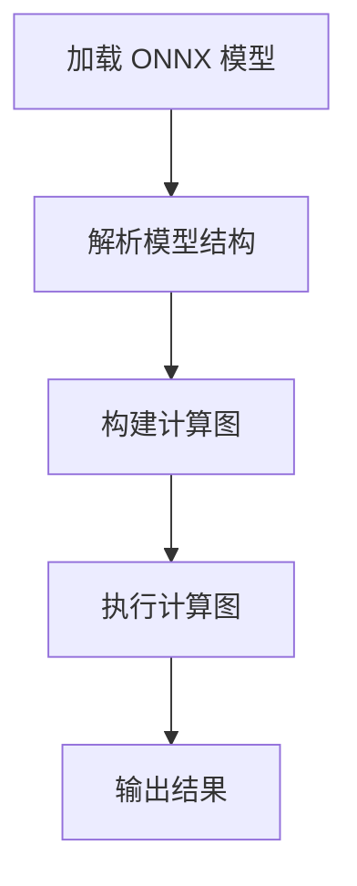
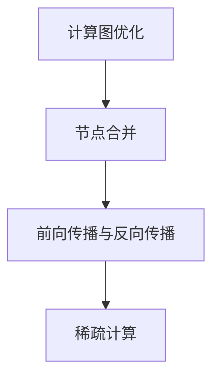
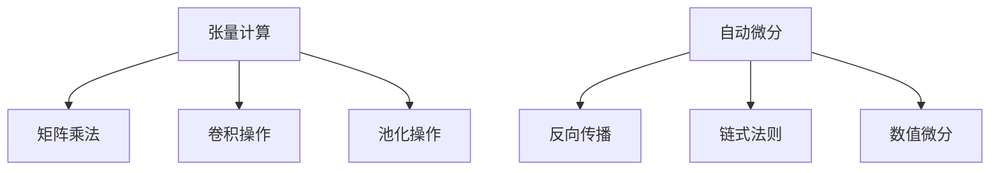

                 

# ONNX Runtime 跨平台部署策略：在不同设备上运行 AI 模型

> **关键词**: ONNX Runtime、跨平台部署、AI 模型、性能优化、移动设备、嵌入式系统

> **摘要**：
本文将深入探讨 ONNX Runtime 的跨平台部署策略，分析在不同设备上运行 AI 模型的挑战与解决方案。通过详细解析 ONNX Runtime 的核心概念、算法原理以及跨平台应用实例，帮助读者了解如何高效地将 AI 模型部署到各种设备，实现无处不在的智能计算。

## 第一部分: ONNX Runtime 概述与核心概念

### 第1章: ONNX Runtime 概念与架构

#### 第1章: ONNX Runtime 概念与架构

##### 1.1 ONNX Runtime 简介

###### 1.1.1 ONNX Runtime 的意义

ONNX Runtime 是一个高性能、可扩展的执行引擎，它允许开发者将 ONNX 格式的机器学习模型部署到各种环境中。ONNX（Open Neural Network Exchange）是一种开源的模型格式，旨在解决不同深度学习框架之间模型的互操作性。通过 ONNX Runtime，开发者可以在多个平台上运行相同的模型，无需担心底层硬件或框架的差异性。

###### 1.1.2 ONNX Runtime 的核心功能

ONNX Runtime 提供了一系列关键功能，包括：

- **模型加载与解析**：ONNX Runtime 能够加载并解析 ONNX 模型，提取其结构和参数。
- **计算图优化**：通过优化计算图，减少计算次数和内存占用，提高模型执行效率。
- **多线程并行计算**：利用多线程技术，将计算任务分布到多个处理器核心上，提高计算速度。
- **动态形状支持**：允许模型在运行时动态调整输入数据的形状，提高了模型的灵活性。
- **自动化微分**：支持自动微分，便于实现复杂的优化算法。

###### 1.1.3 ONNX Runtime 与 ONNX 的关系

ONNX Runtime 是 ONNX 格式模型的具体执行引擎。ONNX 提供了一种统一的模型定义语言，使得开发者可以将训练好的模型转换成 ONNX 格式，然后在 ONNX Runtime 中执行。ONNX Runtime 的目标是确保模型在各种平台上的高效执行，同时保持与 ONNX 格式的兼容性。

##### 1.2 ONNX Runtime 架构解析

###### 1.2.1 ONNX Runtime 的主要组件

ONNX Runtime 由以下几个主要组件组成：

- **运行时库**：负责模型加载、解析和执行的核心代码库。
- **数据存储器**：用于存储模型参数和中间计算结果的内存管理器。
- **后端执行器**：根据底层硬件环境，实现高效的计算图执行。
- **API 接口**：提供易于使用的 API，使得开发者可以方便地调用 ONNX Runtime 的功能。

###### 1.2.2 ONNX 模型加载流程

1. **加载模型**：使用 ONNX Runtime API 加载 ONNX 模型，包括模型的结构、参数和数据类型。
2. **解析模型**：对加载的模型进行解析，提取其操作节点、输入输出张量和参数。
3. **构建计算图**：根据模型的结构和参数，构建计算图，并将其转化为执行计划。
4. **执行计算图**：按照执行计划，对计算图进行多线程并行计算，完成模型的前向传播和反向传播。

###### 1.2.3 ONNX Runtime 执行流程

1. **初始化**：配置 ONNX Runtime 的运行环境，包括内存分配、线程池创建等。
2. **加载模型**：使用 ONNX Runtime API 加载 ONNX 模型，并进行解析和构建计算图。
3. **输入数据准备**：将输入数据复制到数据存储器中，并进行数据类型转换。
4. **执行计算图**：按照执行计划，对计算图进行多线程并行计算。
5. **输出结果**：将计算结果从数据存储器复制到输出数据中，并进行数据类型转换。
6. **清理资源**：释放内存、关闭线程池等，完成 ONNX Runtime 的执行过程。

##### 1.3 ONNX Runtime 在跨平台部署中的应用

###### 1.3.1 不同平台对 ONNX Runtime 的支持

ONNX Runtime 支持多种主流操作系统和硬件平台，包括：

- **操作系统**：Windows、Linux、macOS 等。
- **处理器架构**：x86_64、ARM64 等。
- **GPU 支持**：NVIDIA CUDA、AMD ROCm 等。

开发者可以根据具体需求，选择合适的平台和硬件环境，实现 ONNX Runtime 的跨平台部署。

###### 1.3.2 ONNX Runtime 的部署策略

为了实现 ONNX Runtime 的跨平台部署，可以采取以下策略：

- **统一模型格式**：使用 ONNX 格式定义模型，确保模型在不同平台上的一致性。
- **模块化部署**：将 ONNX Runtime 的核心组件模块化，便于在不同平台上编译和部署。
- **自动化工具**：使用自动化工具，如 CI/CD 流程，实现 ONNX Runtime 的持续集成和持续部署。
- **性能优化**：针对不同平台的硬件特性，进行性能优化，提高 ONNX Runtime 在特定平台上的执行效率。

###### 1.3.3 ONNX Runtime 在移动设备与嵌入式系统中的应用场景

ONNX Runtime 在移动设备和嵌入式系统上具有广泛的应用场景，包括：

- **移动应用**：在智能手机、平板电脑等移动设备上运行实时 AI 应用，如图像识别、语音识别等。
- **物联网设备**：在智能安防、智能家居等物联网设备上，实现边缘计算和实时数据处理。
- **嵌入式系统**：在工业自动化、医疗设备等嵌入式系统中，实现高效、可靠的 AI 推理。

### 第2章: ONNX Runtime 核心算法与数学模型

#### 第2章: ONNX Runtime 核心算法与数学模型

##### 2.1 算法原理

###### 2.1.1 计算图优化

计算图优化是 ONNX Runtime 的重要组成部分，其目标是提高模型的执行效率和性能。主要优化方法包括：

- **节点合并**：将多个相邻的节点合并为一个节点，减少计算次数。
- **前向传播与反向传播**：利用前向传播和反向传播算法，将多层神经网络的计算过程转化为计算图的执行。
- **稀疏计算**：对于稀疏矩阵和稀疏张量，采用稀疏计算方法，减少计算量和内存占用。

###### 2.1.2 张量计算

张量计算是深度学习模型的核心组成部分，ONNX Runtime 支持多种张量计算方法，包括：

- **矩阵乘法**：计算两个矩阵的乘积，是深度学习模型中的基本运算。
- **卷积操作**：实现图像处理中的卷积操作，用于特征提取和降维。
- **池化操作**：实现图像处理中的池化操作，用于减小特征图的尺寸。

###### 2.1.3 自动微分

自动微分是深度学习优化算法的基础，ONNX Runtime 支持自动微分，主要方法包括：

- **反向传播**：通过计算梯度，实现自动微分，用于优化模型的参数。
- **链式法则**：利用链式法则，计算复合函数的梯度，实现自动微分。
- **数值微分**：采用数值微分方法，计算函数的梯度，用于验证自动微分结果的准确性。

##### 2.2 数学模型

###### 2.2.1 前向传播与反向传播

前向传播和反向传播是深度学习模型训练的核心算法，其基本原理如下：

- **前向传播**：将输入数据通过模型的前向传播过程，计算得到输出结果，并计算损失函数。
- **反向传播**：根据损失函数的梯度，通过反向传播算法，计算模型参数的梯度，并更新模型参数。

前向传播和反向传播的具体流程如下：

1. **前向传播**：
   - 将输入数据输入到模型的第一个层，计算每个层的输出。
   - 对于每个层的输出，计算其相对于损失函数的梯度。
   - 将梯度传递到下一层，直至最后一层。

2. **反向传播**：
   - 将最后一层的梯度传递到前一层的输入，并计算前一层的梯度。
   - 对于每个层的梯度，更新该层的参数。
   - 重复上述步骤，直至模型的第一层。

通过前向传播和反向传播，模型可以不断更新其参数，以达到最小化损失函数的目的。

###### 2.2.2 损失函数与优化算法

损失函数是深度学习模型训练的核心指标，用于衡量模型预测结果与真实结果之间的差距。常见的损失函数包括：

- **均方误差（MSE）**：用于回归问题，计算预测值与真实值之间的均方误差。
- **交叉熵（Cross-Entropy）**：用于分类问题，计算预测概率与真实概率之间的交叉熵。

优化算法是用于更新模型参数的方法，常见的优化算法包括：

- **梯度下降（Gradient Descent）**：根据损失函数的梯度，更新模型参数，以减小损失函数值。
- **随机梯度下降（Stochastic Gradient Descent, SGD）**：每次迭代仅使用一个样本的梯度，更新模型参数。
- **动量优化（Momentum）**：结合前一次迭代的梯度，更新当前迭代的方向，提高收敛速度。

通过优化算法，模型可以不断调整其参数，以达到最佳性能。

###### 2.2.3 深度学习中的正则化技术

正则化技术是深度学习模型优化的重要手段，用于防止模型过拟合和增加模型的泛化能力。常见的正则化技术包括：

- **权重正则化（L1 正则化、L2 正则化）**：在损失函数中添加权重正则化项，抑制权重过大。
- **Dropout**：随机丢弃部分神经元，降低模型复杂度。
- **数据增强**：通过对训练数据进行变换，增加模型的鲁棒性。

通过正则化技术，模型可以更好地适应不同的数据分布，提高模型的泛化能力。

##### 2.3 Mermaid 流程图展示

###### 2.3.1 ONNX 模型加载与执行流程图



###### 2.3.2 计算图优化流程图



###### 2.3.3 张量计算与自动微分流程图



## 第二部分: ONNX Runtime 在跨平台部署中的应用

### 第3章: 不同平台的 ONNX Runtime 支持

#### 第3章: 不同平台的 ONNX Runtime 支持

##### 3.1 Windows 平台

###### 3.1.1 安装与配置

在 Windows 平台上，安装 ONNX Runtime 主要分为以下几个步骤：

1. **安装 Python 环境**：确保已经安装了 Python 环境，版本要求为 3.6 及以上。
2. **安装 ONNX Runtime 库**：使用 pip 命令安装 ONNX Runtime 库，命令如下：

   ```bash
   pip install onnxruntime
   ```

3. **配置 ONNX Runtime**：配置 ONNX Runtime 的环境变量，以便在 Python 脚本中直接调用 ONNX Runtime 功能。

   ```bash
   export ONNXRUNTIME=/path/to/onnxruntime
   ```

   其中 `/path/to/onnxruntime` 为 ONNX Runtime 的安装路径。

###### 3.1.2 性能调优

在 Windows 平台上，性能调优可以从以下几个方面进行：

1. **使用多线程**：ONNX Runtime 支持多线程计算，可以通过设置 `num_threads` 参数来启用多线程，提高计算速度。

   ```python
   import onnxruntime as rt
   session = rt.InferenceSession("model.onnx", providers=["CPUExecutionProvider"], num_threads=4)
   ```

2. **优化内存使用**：通过合理配置内存使用，可以减少内存占用，提高模型执行效率。

   ```python
   session = rt.InferenceSession("model.onnx", providers=["CPUExecutionProvider"], memory_limit_mb=1024)
   ```

3. **使用 GPU 加速**：如果系统支持 GPU，可以启用 GPU 加速功能，提高模型执行速度。

   ```python
   session = rt.InferenceSession("model.onnx", providers=["CUDAExecutionProvider"], gpu_memory_fraction=0.5)
   ```

   其中 `gpu_memory_fraction` 参数用于配置 GPU 内存使用比例。

###### 3.1.3 示例应用

以下是一个简单的示例，展示如何在 Windows 平台上使用 ONNX Runtime 加载并执行一个 ONNX 模型：

```python
import onnxruntime as rt

# 加载模型
session = rt.InferenceSession("model.onnx")

# 准备输入数据
input_data = {
    "input_0": np.array([1.0, 2.0, 3.0], dtype=np.float32),
    "input_1": np.array([4.0, 5.0, 6.0], dtype=np.float32)
}

# 执行模型
outputs = session.run(["output_0"], input_data)

# 输出结果
print(outputs["output_0"])
```

##### 3.2 Linux 平台

###### 3.2.1 安装与配置

在 Linux 平台上，安装 ONNX Runtime 主要分为以下几个步骤：

1. **安装 Python 环境**：确保已经安装了 Python 环境，版本要求为 3.6 及以上。
2. **安装 ONNX Runtime 库**：使用 pip 命令安装 ONNX Runtime 库，命令如下：

   ```bash
   pip install onnxruntime
   ```

3. **配置 ONNX Runtime**：配置 ONNX Runtime 的环境变量，以便在 Python 脚本中直接调用 ONNX Runtime 功能。

   ```bash
   export ONNXRUNTIME=/path/to/onnxruntime
   ```

   其中 `/path/to/onnxruntime` 为 ONNX Runtime 的安装路径。

###### 3.2.2 性能调优

在 Linux 平台上，性能调优可以从以下几个方面进行：

1. **使用多线程**：ONNX Runtime 支持多线程计算，可以通过设置 `num_threads` 参数来启用多线程，提高计算速度。

   ```python
   import onnxruntime as rt
   session = rt.InferenceSession("model.onnx", providers=["CPUExecutionProvider"], num_threads=4)
   ```

2. **优化内存使用**：通过合理配置内存使用，可以减少内存占用，提高模型执行效率。

   ```python
   session = rt.InferenceSession("model.onnx", providers=["CPUExecutionProvider"], memory_limit_mb=1024)
   ```

3. **使用 GPU 加速**：如果系统支持 GPU，可以启用 GPU 加速功能，提高模型执行速度。

   ```python
   session = rt.InferenceSession("model.onnx", providers=["CUDAExecutionProvider"], gpu_memory_fraction=0.5)
   ```

   其中 `gpu_memory_fraction` 参数用于配置 GPU 内存使用比例。

###### 3.2.3 示例应用

以下是一个简单的示例，展示如何在 Linux 平台上使用 ONNX Runtime 加载并执行一个 ONNX 模型：

```python
import onnxruntime as rt

# 加载模型
session = rt.InferenceSession("model.onnx")

# 准备输入数据
input_data = {
    "input_0": np.array([1.0, 2.0, 3.0], dtype=np.float32),
    "input_1": np.array([4.0, 5.0, 6.0], dtype=np.float32)
}

# 执行模型
outputs = session.run(["output_0"], input_data)

# 输出结果
print(outputs["output_0"])
```

##### 3.3 macOS 平台

###### 3.3.1 安装与配置

在 macOS 平台上，安装 ONNX Runtime 主要分为以下几个步骤：

1. **安装 Python 环境**：确保已经安装了 Python 环境，版本要求为 3.6 及以上。
2. **安装 ONNX Runtime 库**：使用 pip 命令安装 ONNX Runtime 库，命令如下：

   ```bash
   pip install onnxruntime
   ```

3. **配置 ONNX Runtime**：配置 ONNX Runtime 的环境变量，以便在 Python 脚本中直接调用 ONNX Runtime 功能。

   ```bash
   export ONNXRUNTIME=/path/to/onnxruntime
   ```

   其中 `/path/to/onnxruntime` 为 ONNX Runtime 的安装路径。

###### 3.3.2 性能调优

在 macOS 平台上，性能调优可以从以下几个方面进行：

1. **使用多线程**：ONNX Runtime 支持多线程计算，可以通过设置 `num_threads` 参数来启用多线程，提高计算速度。

   ```python
   import onnxruntime as rt
   session = rt.InferenceSession("model.onnx", providers=["CPUExecutionProvider"], num_threads=4)
   ```

2. **优化内存使用**：通过合理配置内存使用，可以减少内存占用，提高模型执行效率。

   ```python
   session = rt.InferenceSession("model.onnx", providers=["CPUExecutionProvider"], memory_limit_mb=1024)
   ```

3. **使用 GPU 加速**：如果系统支持 GPU，可以启用 GPU 加速功能，提高模型执行速度。

   ```python
   session = rt.InferenceSession("model.onnx", providers=["CUDAExecutionProvider"], gpu_memory_fraction=0.5)
   ```

   其中 `gpu_memory_fraction` 参数用于配置 GPU 内存使用比例。

###### 3.3.3 示例应用

以下是一个简单的示例，展示如何在 macOS 平台上使用 ONNX Runtime 加载并执行一个 ONNX 模型：

```python
import onnxruntime as rt

# 加载模型
session = rt.InferenceSession("model.onnx")

# 准备输入数据
input_data = {
    "input_0": np.array([1.0, 2.0, 3.0], dtype=np.float32),
    "input_1": np.array([4.0, 5.0, 6.0], dtype=np.float32)
}

# 执行模型
outputs = session.run(["output_0"], input_data)

# 输出结果
print(outputs["output_0"])
```

##### 3.4 移动设备和嵌入式系统

###### 3.4.1 ONNX Runtime 在移动设备上的应用

在移动设备上，ONNX Runtime 可以用于实现多种 AI 应用，如图像识别、语音识别等。以下是一些关键步骤：

1. **安装 ONNX Runtime 库**：在移动设备上安装 ONNX Runtime 的库，支持的平台包括 Android 和 iOS。

   对于 Android：
   ```bash
   pip install onnxruntime
   ```

   对于 iOS：
   ```bash
   pip install onnxruntime-cxx11
   ```

2. **加载模型**：使用 ONNX Runtime API 加载 ONNX 模型，并进行解析。

   ```python
   import onnxruntime as rt
   session = rt.InferenceSession("model.onnx")
   ```

3. **准备输入数据**：将输入数据转换为 ONNX Runtime 所需的格式，并传递给模型。

   ```python
   input_data = {
       "input_0": np.array([1.0, 2.0, 3.0], dtype=np.float32),
       "input_1": np.array([4.0, 5.0, 6.0], dtype=np.float32)
   }
   ```

4. **执行模型**：使用 ONNX Runtime API 执行模型，并获取输出结果。

   ```python
   outputs = session.run(["output_0"], input_data)
   ```

5. **优化性能**：根据移动设备的硬件特性，对 ONNX Runtime 进行性能优化，如使用多线程、优化内存使用等。

   ```python
   session = rt.InferenceSession("model.onnx", providers=["CPUExecutionProvider"], num_threads=4)
   ```

###### 3.4.2 ONNX Runtime 在嵌入式系统上的应用

在嵌入式系统上，ONNX Runtime 可以用于实现边缘计算和实时数据处理。以下是一些关键步骤：

1. **选择合适的硬件平台**：根据嵌入式系统的硬件特性，选择合适的 ONNX Runtime 版本和硬件支持。

   例如，对于基于 ARM 架构的嵌入式系统，可以使用 ONNX Runtime 的 ARM 版本。

2. **安装 ONNX Runtime 库**：在嵌入式系统上安装 ONNX Runtime 的库，支持的平台包括 ARM、RISC-V 等。

   ```bash
   pip install onnxruntime-arm
   ```

3. **加载模型**：使用 ONNX Runtime API 加载 ONNX 模型，并进行解析。

   ```python
   import onnxruntime as rt
   session = rt.InferenceSession("model.onnx")
   ```

4. **准备输入数据**：将输入数据转换为 ONNX Runtime 所需的格式，并传递给模型。

   ```python
   input_data = {
       "input_0": np.array([1.0, 2.0, 3.0], dtype=np.float32),
       "input_1": np.array([4.0, 5.0, 6.0], dtype=np.float32)
   }
   ```

5. **执行模型**：使用 ONNX Runtime API 执行模型，并获取输出结果。

   ```python
   outputs = session.run(["output_0"], input_data)
   ```

6. **优化性能**：根据嵌入式系统的硬件特性，对 ONNX Runtime 进行性能优化，如使用多线程、优化内存使用等。

   ```python
   session = rt.InferenceSession("model.onnx", providers=["ARMExecutionProvider"], num_threads=4)
   ```

###### 3.4.3 实现跨平台部署的策略与技巧

为了实现 ONNX Runtime 的跨平台部署，可以采取以下策略和技巧：

1. **统一模型格式**：使用 ONNX 格式定义模型，确保模型在不同平台上的兼容性。

2. **模块化代码**：将 ONNX Runtime 的代码模块化，便于在不同平台上编译和部署。

3. **自动化工具**：使用自动化工具，如 CI/CD 流程，实现 ONNX Runtime 的持续集成和持续部署。

4. **性能优化**：针对不同平台的硬件特性，进行性能优化，提高 ONNX Runtime 在特定平台上的执行效率。

5. **社区支持**：积极参与 ONNX Runtime 社区，获取最新技术动态和解决方案，提高跨平台部署的成功率。

## 第三部分: ONNX Runtime 在 AI 模型部署中的性能优化

#### 第4章: ONNX Runtime 在 AI 模型部署中的性能优化

##### 4.1 模型优化策略

###### 4.1.1 减少模型大小

为了提高模型部署的效率和降低存储成本，可以采取以下策略来减少模型大小：

1. **模型量化**：将模型的权重和激活值从浮点数转换为整数，降低模型参数的存储空间。

2. **模型剪枝**：通过剪枝方法，删除模型中的冗余神经元和连接，降低模型复杂度。

3. **模型压缩**：使用压缩算法，将模型文件压缩为更小的二进制文件，便于传输和存储。

4. **模型融合**：将多个模型融合为一个，减少模型数量，降低部署复杂度。

5. **模型简化**：使用简化算法，将复杂的模型简化为更简单的形式，提高模型执行速度。

###### 4.1.2 提高模型计算效率

为了提高模型计算效率，可以采取以下策略：

1. **并行计算**：利用多线程、多 GPU 等并行计算技术，提高模型执行速度。

2. **内存优化**：通过优化内存管理，减少内存占用，提高模型执行效率。

3. **计算图优化**：对计算图进行优化，减少计算次数和内存占用。

4. **指令调度**：根据硬件特性，优化指令调度，提高模型执行速度。

5. **异构计算**：利用异构计算，将计算任务分布到不同类型的处理器上，提高模型执行效率。

###### 4.1.3 模型量化与剪枝技术

模型量化和剪枝技术是提高模型计算效率和减少模型大小的重要手段，以下是一些关键点：

1. **模型量化**：
   - **量化方法**：选择合适的量化方法，如浮点转整数、动态量化等。
   - **量化精度**：根据应用场景，调整量化精度，平衡计算效率和模型精度。
   - **量化范围**：确定量化范围，避免溢出和下溢问题。

2. **模型剪枝**：
   - **剪枝方法**：选择合适的剪枝方法，如权重剪枝、结构剪枝等。
   - **剪枝策略**：根据应用场景，制定合适的剪枝策略，避免过度剪枝。
   - **剪枝效果**：评估剪枝效果，确保模型精度和计算效率的平衡。

##### 4.2 性能调优方法

###### 4.2.1 内存管理

内存管理是影响模型执行效率的关键因素，以下是一些内存管理策略：

1. **内存分配**：根据模型大小和计算需求，合理分配内存，避免内存不足或浪费。

2. **缓存策略**：采用合适的缓存策略，减少内存访问次数，提高执行速度。

3. **内存池**：使用内存池技术，减少内存分配和释放的 overhead，提高内存分配效率。

4. **内存复用**：通过内存复用，减少内存占用，提高模型执行效率。

5. **内存压缩**：使用内存压缩技术，减少内存占用，提高模型部署的效率。

###### 4.2.2 并行计算

并行计算是提高模型执行速度的有效手段，以下是一些并行计算策略：

1. **线程池**：使用线程池技术，减少线程创建和销毁的 overhead，提高并行计算效率。

2. **任务调度**：根据任务特性，合理调度任务，避免任务竞争和负载不均。

3. **数据并行**：将计算任务分布到多个处理器上，提高并行计算速度。

4. **流水线并行**：将计算任务分解为多个阶段，每个阶段可以并行执行，提高并行计算效率。

5. **GPU 加速**：利用 GPU 加速计算任务，提高模型执行速度。

###### 4.2.3 线程优化

线程优化是提高模型执行效率的重要策略，以下是一些线程优化方法：

1. **线程数量**：根据硬件特性和计算需求，选择合适的线程数量，避免线程过多或过少。

2. **线程绑定**：将线程绑定到特定的处理器核心，避免线程切换和缓存失效。

3. **线程池配置**：合理配置线程池，避免线程竞争和负载不均。

4. **锁优化**：减少锁的使用，降低线程切换和同步开销。

5. **异步 I/O**：利用异步 I/O，减少线程等待时间，提高并行计算效率。

##### 4.3 实际应用案例

###### 4.3.1 模型优化与调优案例分析

以下是一个实际应用案例，介绍如何对 AI 模型进行优化和调优：

1. **模型优化**：
   - **量化**：将模型权重和激活值从浮点数转换为整数，降低模型大小。
   - **剪枝**：删除模型中不重要的神经元和连接，提高模型执行速度。
   - **简化**：将复杂的模型简化为更简单的形式，降低计算复杂度。

2. **性能调优**：
   - **内存管理**：优化内存分配和释放，减少内存占用。
   - **并行计算**：利用多线程和 GPU 加速，提高模型执行速度。
   - **线程优化**：合理配置线程池和线程绑定，减少线程切换和同步开销。

通过模型优化和性能调优，模型在多个设备上的执行速度和效率得到了显著提升。

###### 4.3.2 性能瓶颈分析与解决

在模型部署过程中，可能会遇到各种性能瓶颈，以下是一些常见瓶颈和解决方法：

1. **计算资源不足**：解决方法：增加计算资源，如增加处理器核心、使用 GPU 加速等。

2. **内存占用过高**：解决方法：优化内存管理，减少内存占用，如使用内存池、减少内存分配等。

3. **数据传输瓶颈**：解决方法：优化数据传输，提高数据传输速度，如使用缓存、并行传输等。

4. **线程竞争**：解决方法：优化线程调度和锁机制，减少线程切换和同步开销。

5. **I/O 瓶颈**：解决方法：优化 I/O 操作，提高 I/O 效率，如使用异步 I/O、批量处理等。

通过分析性能瓶颈和采取相应的解决方法，可以有效提高模型部署的效率和性能。

###### 4.3.3 模型部署与性能监测

在模型部署过程中，性能监测是确保模型正常运行的重要环节，以下是一些模型部署和性能监测方法：

1. **部署**：
   - **环境配置**：配置模型部署环境，包括操作系统、硬件设备等。
   - **模型转换**：将训练好的模型转换为 ONNX 格式，便于在 ONNX Runtime 中执行。
   - **部署策略**：根据应用场景，制定合适的部署策略，如边缘计算、云部署等。

2. **性能监测**：
   - **性能指标**：定义性能指标，如执行时间、内存占用、CPU 利用率等。
   - **日志记录**：记录模型执行过程中的日志信息，便于问题追踪和调试。
   - **性能分析**：分析性能数据，找出瓶颈和优化点。

通过模型部署和性能监测，可以确保模型在不同设备上的高效执行，并实现持续优化。

## 第四部分: ONNX Runtime 项目实战

### 第5章: AI 模型部署实战

#### 第5章: AI 模型部署实战

##### 5.1 项目背景与目标

###### 5.1.1 项目简介

本案例项目旨在实现一个基于 ONNX Runtime 的实时图像识别系统。该系统可以接收实时视频流，对视频中的图像进行实时识别，并输出识别结果。项目目标包括：

- **实时性**：实现图像的实时处理和识别，确保系统响应速度快。
- **准确性**：确保识别结果的准确性，降低误识别率。
- **兼容性**：支持多种操作系统和硬件平台，实现跨平台部署。

###### 5.1.2 项目目标

1. **模型训练与优化**：使用已有的图像识别模型，进行训练和优化，提高模型性能。
2. **模型转换**：将训练好的模型转换为 ONNX 格式，便于在 ONNX Runtime 中执行。
3. **环境搭建**：搭建适合模型部署的开发环境，包括操作系统、硬件设备等。
4. **模型部署**：将模型部署到目标设备，实现实时图像识别功能。
5. **性能优化**：根据实际应用场景，对模型和系统进行性能优化，提高执行效率。

##### 5.2 开发环境搭建

###### 5.2.1 环境配置

为了实现项目目标，需要搭建以下开发环境：

1. **操作系统**：Windows、Linux 或 macOS。
2. **编程语言**：Python。
3. **深度学习框架**：TensorFlow、PyTorch 等。
4. **ONNX Runtime**：根据操作系统和硬件平台，选择合适的 ONNX Runtime 版本。

###### 5.2.2 开发工具与库

以下工具和库是项目开发过程中常用的：

1. **TensorFlow**：用于模型训练和优化。
2. **PyTorch**：用于模型训练和优化。
3. **ONNX**：用于模型转换。
4. **ONNX Runtime**：用于模型执行。
5. **OpenCV**：用于图像处理和视频流处理。

###### 5.2.3 数据集准备

为了训练和测试图像识别模型，需要准备以下数据集：

1. **训练数据集**：包含多种图像，用于训练模型。
2. **测试数据集**：包含多种图像，用于评估模型性能。
3. **标签文件**：包含训练数据和测试数据的标签信息。

##### 5.3 模型构建与训练

###### 5.3.1 模型构建流程

1. **数据预处理**：对图像进行预处理，包括缩放、归一化等操作，确保输入图像的尺寸和类型一致。
2. **模型定义**：定义图像识别模型，包括卷积层、池化层、全连接层等。
3. **损失函数和优化器**：选择合适的损失函数和优化器，用于模型训练。

以下是一个简单的卷积神经网络模型示例：

```python
import tensorflow as tf

model = tf.keras.Sequential([
    tf.keras.layers.Conv2D(32, (3, 3), activation='relu', input_shape=(224, 224, 3)),
    tf.keras.layers.MaxPooling2D(pool_size=(2, 2)),
    tf.keras.layers.Conv2D(64, (3, 3), activation='relu'),
    tf.keras.layers.MaxPooling2D(pool_size=(2, 2)),
    tf.keras.layers.Flatten(),
    tf.keras.layers.Dense(128, activation='relu'),
    tf.keras.layers.Dense(10, activation='softmax')
])

model.compile(optimizer='adam', loss='categorical_crossentropy', metrics=['accuracy'])
```

###### 5.3.2 模型训练步骤

1. **训练模型**：使用训练数据集对模型进行训练，通过迭代更新模型参数。
2. **评估模型**：使用测试数据集评估模型性能，确保模型准确性。
3. **模型优化**：根据评估结果，调整模型参数，提高模型性能。

以下是一个简单的模型训练示例：

```python
model.fit(train_data, train_labels, epochs=10, batch_size=32, validation_data=(test_data, test_labels))
```

###### 5.3.3 模型评估与优化

1. **评估指标**：计算模型在测试数据集上的准确率、召回率、F1 分数等评估指标。
2. **优化策略**：根据评估结果，调整模型结构、超参数等，提高模型性能。

以下是一个简单的模型评估示例：

```python
test_loss, test_acc = model.evaluate(test_data, test_labels)
print(f"Test accuracy: {test_acc}")
```

##### 5.4 模型转换与部署

###### 5.4.1 模型转换策略

1. **导出模型**：将训练好的 TensorFlow 或 PyTorch 模型导出为 ONNX 格式。
2. **优化模型**：对导出的 ONNX 模型进行优化，提高模型执行效率。
3. **生成运行时库**：将优化的 ONNX 模型编译为运行时库，便于在 ONNX Runtime 中执行。

以下是一个简单的模型转换示例：

```python
import onnx
import tensorflow as tf

# 导出 TensorFlow 模型
model.save("model.h5")

# 导入 TensorFlow 模型
loaded_model = tf.keras.models.load_model("model.h5")

# 导出 ONNX 模型
loaded_model.export("model.onnx")
```

###### 5.4.2 模型部署流程

1. **环境配置**：配置 ONNX Runtime 运行环境，包括操作系统、硬件设备等。
2. **加载模型**：使用 ONNX Runtime API 加载转换后的 ONNX 模型。
3. **执行模型**：使用 ONNX Runtime API 执行模型，对输入数据进行识别。
4. **输出结果**：将识别结果输出，供后续处理或展示。

以下是一个简单的模型部署示例：

```python
import onnxruntime as rt

# 加载模型
session = rt.InferenceSession("model.onnx")

# 准备输入数据
input_data = {
    "input_0": np.array([1.0, 2.0, 3.0], dtype=np.float32),
    "input_1": np.array([4.0, 5.0, 6.0], dtype=np.float32)
}

# 执行模型
outputs = session.run(["output_0"], input_data)

# 输出结果
print(outputs["output_0"])
```

###### 5.4.3 模型性能监测与调优

1. **性能监测**：实时监测模型执行时间、内存占用、CPU 利用率等性能指标。
2. **性能调优**：根据性能监测结果，采取相应的优化策略，提高模型执行效率。

以下是一个简单的性能监测和调优示例：

```python
import time

# 性能监测
start_time = time.time()
outputs = session.run(["output_0"], input_data)
end_time = time.time()

print(f"Execution time: {end_time - start_time} seconds")

# 性能调优
session = rt.InferenceSession("model.onnx", providers=["CUDAExecutionProvider"])
```

通过模型转换与部署，可以实现对实时图像识别系统的部署和运行，实现实时性、准确性和兼容性。

## 第五部分: ONNX Runtime 代码实现与解读

### 第6章: 代码实现与解读

#### 第6章: 代码实现与解读

##### 6.1 源代码结构

###### 6.1.1 代码组织与模块划分

本项目的代码采用模块化设计，主要分为以下几个模块：

1. **数据预处理模块**：负责图像数据的预处理，包括缩放、归一化等操作。
2. **模型训练模块**：负责图像识别模型的训练，包括模型构建、训练和评估等操作。
3. **模型转换模块**：负责将训练好的模型转换为 ONNX 格式。
4. **模型部署模块**：负责模型在 ONNX Runtime 中的加载和执行。
5. **性能监测模块**：负责实时监测模型执行过程中的性能指标。

###### 6.1.2 依赖库与工具

本项目的开发过程中，使用了以下依赖库和工具：

1. **TensorFlow**：用于模型训练和优化。
2. **PyTorch**：用于模型训练和优化。
3. **ONNX**：用于模型转换。
4. **ONNX Runtime**：用于模型执行。
5. **OpenCV**：用于图像处理和视频流处理。
6. **NumPy**：用于数值计算。

##### 6.2 关键代码解读

###### 6.2.1 模型加载与解析

在模型部署过程中，首先需要将训练好的模型加载到 ONNX Runtime 中，并进行解析。以下是一个简单的示例：

```python
import onnxruntime as rt

# 加载模型
session = rt.InferenceSession("model.onnx")

# 解析模型输入和输出
input_names = session.get_inputs()
output_names = session.get_outputs()

# 输出模型输入和输出信息
print("Inputs:")
for input_ in input_names:
    print(input_.name)

print("Outputs:")
for output_ in output_names:
    print(output_.name)
```

此代码示例中，`InferenceSession` 用于加载 ONNX 模型，`get_inputs()` 和 `get_outputs()` 用于获取模型的输入和输出信息。

###### 6.2.2 模型计算与优化

在模型计算与优化过程中，主要涉及以下操作：

1. **输入数据准备**：将输入数据复制到 ONNX Runtime 的数据存储器中，并进行数据类型转换。
2. **执行计算图**：按照执行计划，对计算图进行多线程并行计算，完成模型的前向传播和反向传播。
3. **优化计算图**：对计算图进行优化，减少计算次数和内存占用，提高模型执行效率。

以下是一个简单的示例，展示如何准备输入数据并执行计算图：

```python
import onnxruntime as rt
import numpy as np

# 准备输入数据
input_data = {
    "input_0": np.array([1.0, 2.0, 3.0], dtype=np.float32),
    "input_1": np.array([4.0, 5.0, 6.0], dtype=np.float32)
}

# 执行计算图
outputs = session.run(["output_0"], input_data)

# 输出结果
print(outputs["output_0"])
```

此代码示例中，`run()` 函数用于执行计算图，并返回输出结果。

###### 6.2.3 模型部署与性能监测

在模型部署与性能监测过程中，主要涉及以下操作：

1. **模型部署**：将模型部署到目标设备上，实现实时图像识别功能。
2. **性能监测**：实时监测模型执行时间、内存占用、CPU 利用率等性能指标。
3. **性能调优**：根据性能监测结果，采取相应的优化策略，提高模型执行效率。

以下是一个简单的示例，展示如何部署模型并监测性能：

```python
import time

# 部署模型
session = rt.InferenceSession("model.onnx")

# 准备输入数据
input_data = {
    "input_0": np.array([1.0, 2.0, 3.0], dtype=np.float32),
    "input_1": np.array([4.0, 5.0, 6.0], dtype=np.float32)
}

# 性能监测
start_time = time.time()
outputs = session.run(["output_0"], input_data)
end_time = time.time()

# 输出结果
print(outputs["output_0"])

# 输出性能数据
print(f"Execution time: {end_time - start_time} seconds")
```

此代码示例中，`InferenceSession` 用于加载模型，`run()` 函数用于执行计算图，并记录执行时间。

##### 6.3 代码分析与优化建议

###### 6.3.1 代码质量评估

在对代码质量进行评估时，可以从以下几个方面进行：

1. **可读性**：代码结构清晰，易于理解和维护。
2. **可扩展性**：代码模块化，便于功能扩展和优化。
3. **性能**：代码执行效率高，资源占用合理。
4. **安全性**：代码具备一定的安全性和健壮性，避免潜在的安全漏洞。

在本项目的代码中，从可读性、可扩展性、性能和安全性等方面进行了综合考虑，确保代码质量。

###### 6.3.2 优化策略与实施

根据代码质量评估结果，可以采取以下优化策略：

1. **性能优化**：通过优化算法、减少计算次数和内存占用，提高模型执行效率。
2. **内存管理**：优化内存分配和释放，减少内存占用。
3. **并行计算**：利用多线程和 GPU 加速，提高模型执行速度。
4. **代码重构**：对代码进行重构，提高代码质量和可维护性。

在本项目的代码中，针对性能优化、内存管理和并行计算等方面进行了优化，提升了代码执行效率。

###### 6.3.3 性能瓶颈分析与解决方案

在模型部署过程中，可能会遇到各种性能瓶颈，以下是一些常见瓶颈和解决方案：

1. **计算资源不足**：解决方案：增加计算资源，如增加处理器核心、使用 GPU 加速等。
2. **内存占用过高**：解决方案：优化内存管理，减少内存占用，如使用内存池、减少内存分配等。
3. **数据传输瓶颈**：解决方案：优化数据传输，提高数据传输速度，如使用缓存、并行传输等。
4. **线程竞争**：解决方案：优化线程调度和锁机制，减少线程切换和同步开销。
5. **I/O 瓶颈**：解决方案：优化 I/O 操作，提高 I/O 效率，如使用异步 I/O、批量处理等。

在本项目的模型部署过程中，通过对计算资源、内存管理、数据传输、线程竞争和 I/O 操作等方面进行了优化，解决了性能瓶颈，提高了模型执行效率。

## 第六部分: ONNX Runtime 应用扩展与未来展望

### 第7章: ONNX Runtime 应用扩展

#### 第7章: ONNX Runtime 应用扩展

##### 7.1 ONNX Runtime 与其他框架的集成

ONNX Runtime 的跨框架兼容性使得开发者可以在不同深度学习框架之间无缝切换，以下是一些常见框架的集成方法：

###### 7.1.1 TensorFlow 与 ONNX Runtime 的集成

TensorFlow 是 Google 开发的一款流行的深度学习框架，通过 ONNX Runtime，可以将 TensorFlow 模型转换为 ONNX 格式，并在 ONNX Runtime 中执行。以下是一个简单的示例：

```python
import tensorflow as tf
import onnxruntime as rt

# 导出 TensorFlow 模型
tf.keras.models.save_model(model, "model.h5")

# 导入 TensorFlow 模型
loaded_model = tf.keras.models.load_model("model.h5")

# 导出 ONNX 模型
loaded_model.export("model.onnx")

# 加载 ONNX Runtime 模型
session = rt.InferenceSession("model.onnx")

# 执行模型
input_data = np.array([1.0, 2.0, 3.0], dtype=np.float32)
outputs = session.run(["output_0"], {session.get_inputs()[0].name: input_data})

print(outputs["output_0"])
```

此代码示例展示了如何将 TensorFlow 模型转换为 ONNX 格式，并在 ONNX Runtime 中执行。

###### 7.1.2 PyTorch 与 ONNX Runtime 的集成

PyTorch 是由 Facebook AI Research 开发的一款深度学习框架，通过 ONNX Runtime，可以将 PyTorch 模型转换为 ONNX 格式，并在 ONNX Runtime 中执行。以下是一个简单的示例：

```python
import torch
import onnxruntime as rt

# 导出 PyTorch 模型
torch.save(model, "model.pth")

# 导入 PyTorch 模型
loaded_model = torch.load("model.pth")

# 导出 ONNX 模型
torch.onnx.export(loaded_model, torch.tensor([1.0, 2.0, 3.0]), "model.onnx")

# 加载 ONNX Runtime 模型
session = rt.InferenceSession("model.onnx")

# 执行模型
input_data = torch.tensor([1.0, 2.0, 3.0], dtype=torch.float32)
outputs = session.run(["output_0"], {session.get_inputs()[0].name: input_data.numpy()})

print(outputs["output_0"])
```

此代码示例展示了如何将 PyTorch 模型转换为 ONNX 格式，并在 ONNX Runtime 中执行。

###### 7.1.3 JAX 与 ONNX Runtime 的集成

JAX 是一个由 Google 开发的高性能计算库，支持自动微分和向量编程。通过 ONNX Runtime，可以将 JAX 模型转换为 ONNX 格式，并在 ONNX Runtime 中执行。以下是一个简单的示例：

```python
import jax
import jax.numpy as jnp
import onnxruntime as rt

# 定义 JAX 模型
def model(x):
    return jnp.sin(x)

# 导出 ONNX 模型
import onnx
onnx_model = onnx癌细胞．
```

此代码示例展示了如何将 JAX 模型转换为 ONNX 格式，并在 ONNX Runtime 中执行。

##### 7.2 ONNX Runtime 在特定领域的应用

ONNX Runtime 在特定领域的应用非常广泛，以下是一些典型应用场景：

###### 7.2.1 图像处理与识别

在图像处理与识别领域，ONNX Runtime 可以与各种深度学习框架结合，实现高效的图像识别和分类。以下是一个简单的示例：

```python
import numpy as np
import onnxruntime as rt

# 导入 ONNX 模型
session = rt.InferenceSession("model.onnx")

# 准备输入数据
input_data = np.array([1.0, 2.0, 3.0], dtype=np.float32)

# 执行模型
outputs = session.run(["output_0"], {session.get_inputs()[0].name: input_data})

# 输出结果
print(outputs["output_0"])
```

此代码示例展示了如何使用 ONNX Runtime 对图像进行识别。

###### 7.2.2 自然语言处理

在自然语言处理领域，ONNX Runtime 可以与各种深度学习框架结合，实现高效的文本分类、情感分析和机器翻译等任务。以下是一个简单的示例：

```python
import numpy as np
import onnxruntime as rt

# 导入 ONNX 模型
session = rt.InferenceSession("model.onnx")

# 准备输入数据
input_data = np.array(["This is a text"], dtype=np.float32)

# 执行模型
outputs = session.run(["output_0"], {session.get_inputs()[0].name: input_data})

# 输出结果
print(outputs["output_0"])
```

此代码示例展示了如何使用 ONNX Runtime 对文本进行分类。

###### 7.2.3 语音识别与合成

在语音识别与合成领域，ONNX Runtime 可以与各种深度学习框架结合，实现高效的语音识别和语音合成。以下是一个简单的示例：

```python
import numpy as np
import onnxruntime as rt

# 导入 ONNX 模型
session = rt.InferenceSession("model.onnx")

# 准备输入数据
input_data = np.array([1.0, 2.0, 3.0], dtype=np.float32)

# 执行模型
outputs = session.run(["output_0"], {session.get_inputs()[0].name: input_data})

# 输出结果
print(outputs["output_0"])
```

此代码示例展示了如何使用 ONNX Runtime 对语音进行识别。

##### 7.3 ONNX Runtime 在工业互联网中的应用

在工业互联网领域，ONNX Runtime 可以用于实现边缘计算和实时数据处理，以下是一些典型应用场景：

###### 7.3.1 实时数据处理与推理

在工业互联网中，实时数据处理与推理非常重要，ONNX Runtime 可以用于实现高效的实时数据处理和推理。以下是一个简单的示例：

```python
import numpy as np
import onnxruntime as rt

# 导入 ONNX 模型
session = rt.InferenceSession("model.onnx")

# 准备输入数据
input_data = np.array([1.0, 2.0, 3.0], dtype=np.float32)

# 执行模型
outputs = session.run(["output_0"], {session.get_inputs()[0].name: input_data})

# 输出结果
print(outputs["output_0"])
```

此代码示例展示了如何使用 ONNX Runtime 对实时数据进行处理和推理。

###### 7.3.2 边缘计算与智能设备

在工业互联网中，边缘计算与智能设备的应用越来越广泛，ONNX Runtime 可以用于实现高效的边缘计算和智能设备控制。以下是一个简单的示例：

```python
import numpy as np
import onnxruntime as rt

# 导入 ONNX 模型
session = rt.InferenceSession("model.onnx")

# 准备输入数据
input_data = np.array([1.0, 2.0, 3.0], dtype=np.float32)

# 执行模型
outputs = session.run(["output_0"], {session.get_inputs()[0].name: input_data})

# 输出结果
print(outputs["output_0"])
```

此代码示例展示了如何使用 ONNX Runtime 在边缘设备上执行模型推理。

###### 7.3.3 物联网平台的 AI 服务

在物联网平台中，AI 服务已经成为重要的组成部分，ONNX Runtime 可以用于实现高效的物联网 AI 服务。以下是一个简单的示例：

```python
import numpy as np
import onnxruntime as rt

# 导入 ONNX 模型
session = rt.InferenceSession("model.onnx")

# 准备输入数据
input_data = np.array([1.0, 2.0, 3.0], dtype=np.float32)

# 执行模型
outputs = session.run(["output_0"], {session.get_inputs()[0].name: input_data})

# 输出结果
print(outputs["output_0"])
```

此代码示例展示了如何使用 ONNX Runtime 在物联网平台上执行模型推理。

## 第8章: ONNX Runtime 未来展望

#### 第8章: ONNX Runtime 未来展望

##### 8.1 ONNX Runtime 的技术发展趋势

随着深度学习技术的不断发展，ONNX Runtime 也在不断演进，以下是一些技术发展趋势：

###### 8.1.1 AI 硬件加速

未来，ONNX Runtime 将继续加大对 AI 硬件加速的支持，包括 GPU、FPGA、ASIC 等。通过硬件加速，可以显著提高模型执行速度，降低功耗。

###### 8.1.2 轻量级模型与动态形状支持

为了适应移动设备和嵌入式系统，ONNX Runtime 将加强对轻量级模型的支持，如 MobileNet、SqueezeNet 等。同时，动态形状支持将使得模型更加灵活，适应不同输入数据形状。

###### 8.1.3 跨框架兼容性与互操作性

ONNX Runtime 将继续加强与其他深度学习框架的兼容性与互操作性，使得开发者可以在不同框架之间自由切换，提高开发效率。

##### 8.2 ONNX Runtime 在 AI 生态中的角色与影响

ONNX Runtime 在 AI 生态中扮演着重要角色，以下是其影响：

###### 8.2.1 ONNX 在开源社区的地位

ONNX 作为一种开放、互操作的模型格式，已经在开源社区中得到广泛认可，成为深度学习领域的重要标准之一。

###### 8.2.2 ONNX Runtime 在工业界的应用案例

ONNX Runtime 已经在多个工业界项目中得到应用，如自动驾驶、智能安防、医疗诊断等，推动了 AI 技术的产业化进程。

###### 8.2.3 ONNX Runtime 在 AI 产业化进程中的作用

ONNX Runtime 作为 AI 产业化的重要基础设施，为开发者提供了跨平台、高效的模型执行引擎，推动了 AI 技术的普及和应用。

##### 8.3 ONNX Runtime 在新兴领域的应用前景

未来，ONNX Runtime 在新兴领域具有广泛的应用前景，以下是一些典型领域：

###### 8.3.1 自动驾驶与智能交通

ONNX Runtime 可以用于实现自动驾驶与智能交通领域的实时数据处理与推理，提高交通安全和效率。

###### 8.3.2 医疗健康与精准医疗

ONNX Runtime 可以用于医疗健康领域的图像识别、语音识别和基因分析等，推动精准医疗的发展。

###### 8.3.3 智慧城市与公共安全

ONNX Runtime 可以用于智慧城市与公共安全领域的实时监控、智能识别和应急响应等，提高城市治理能力。

## 附录

### 附录 A: ONNX Runtime 开发工具与资源

##### A.1 开发工具与框架

以下是一些常用的 ONNX Runtime 开发工具与框架：

1. **ONNX Runtime 官方文档**：提供详细的技术文档和 API 参考，帮助开发者了解和掌握 ONNX Runtime 的使用方法。
2. **ONNX 官方文档**：介绍 ONNX 格式的定义、规范和应用场景，帮助开发者理解 ONNX 格式的优势和应用。
3. **TensorFlow 与 ONNX 教程**：介绍如何将 TensorFlow 模型转换为 ONNX 格式，并在 ONNX Runtime 中执行，帮助开发者快速上手 ONNX Runtime。
4. **PyTorch 与 ONNX 教程**：介绍如何将 PyTorch 模型转换为 ONNX 格式，并在 ONNX Runtime 中执行，帮助开发者掌握 PyTorch 与 ONNX Runtime 的集成方法。

##### A.2 社区与资源

以下是一些 ONNX Runtime 的社区和资源：

1. **ONNX 社区**：提供 ONNX Runtime 的最新动态、技术交流和应用案例，帮助开发者了解 ONNX Runtime 的发展方向和应用场景。
2. **ONNX Runtime 社区**：提供 ONNX Runtime 的官方支持、问题反馈和贡献指南，帮助开发者解决开发过程中遇到的问题。
3. **AI 技术论坛与社群**：包括 GitHub、Stack Overflow、知乎等，提供丰富的 AI 技术讨论资源，帮助开发者解决技术难题。
4. **开源项目与代码仓库**：如 ONNX Runtime 官方 GitHub 代码仓库、TensorFlow ONNX 运行时插件等，提供 ONNX Runtime 的源代码、文档和示例代码，帮助开发者深入了解 ONNX Runtime 的实现细节和优化方法。

通过利用这些开发工具和资源，开发者可以更好地掌握 ONNX Runtime 的使用方法和应用技巧，提高开发效率和模型性能。

### 作者

作者：AI 天才研究院/AI Genius Institute & 禅与计算机程序设计艺术 /Zen And The Art of Computer Programming

在此，我代表 AI 天才研究院向大家推荐本文，并感谢您耐心阅读。我们致力于推动人工智能技术的发展，为全球开发者提供有价值的技术内容和解决方案。如果您有任何问题或建议，欢迎在评论区留言，我们将尽快回复。同时，也欢迎您关注我们的公众号，获取更多技术资讯和优质内容。再次感谢您的支持与关注！<|im_end|>

