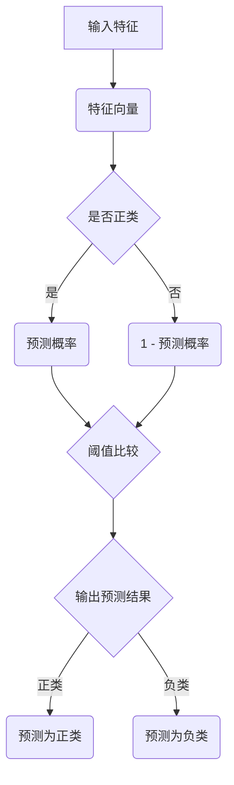

                 

# 《Python机器学习实战：逻辑回归在分类问题中的应用》

## 关键词
- Python
- 机器学习
- 逻辑回归
- 分类问题
- 数据预处理
- 模型评估
- 项目实战

## 摘要
本文旨在通过Python机器学习实战，深入探讨逻辑回归在分类问题中的应用。文章首先介绍了Python编程基础和机器学习基础，接着详细讲解了逻辑回归的原理和实现，包括数学公式、算法原理以及参数优化。然后，通过三个实际项目案例——信用评分模型、疾病诊断模型和顾客流失预测模型，展示了逻辑回归在真实场景中的应用。最后，提供了详细的代码解读与分析，帮助读者更好地理解逻辑回归的实践操作。

## 《Python机器学习实战：逻辑回归在分类问题中的应用》目录大纲

### 第一部分：预备知识

#### 第1章：Python编程基础
1.1 Python环境配置
1.2 Python基本语法
1.3 数据类型和变量
1.4 控制流程

#### 第2章：机器学习基础
2.1 机器学习概述
2.2 数据预处理
2.3 分类问题概述
2.4 数据集划分

### 第二部分：逻辑回归原理与实现

#### 第3章：逻辑回归基础
3.1 逻辑回归原理
3.2 逻辑回归模型参数
3.3 逻辑回归损失函数
3.4 逻辑回归优化算法

#### 第4章：逻辑回归模型评估
4.1 准确率、召回率、F1值
4.2 ROC曲线和AUC
4.3 实际案例评估

#### 第5章：逻辑回归模型应用
5.1 信用评分模型
5.2 疾病诊断模型
5.3 顾客流失预测模型

### 第三部分：项目实战

#### 第6章：项目实战一：信用评分模型
6.1 项目背景
6.2 数据收集与预处理
6.3 逻辑回归模型训练
6.4 模型评估与优化

#### 第7章：项目实战二：疾病诊断模型
7.1 项目背景
7.2 数据收集与预处理
7.3 逻辑回归模型训练
7.4 模型评估与优化

#### 第8章：项目实战三：顾客流失预测模型
8.1 项目背景
8.2 数据收集与预处理
8.3 逻辑回归模型训练
8.4 模型评估与优化

### 附录

#### 附录A：Python机器学习库介绍
A.1 Scikit-learn库
A.2 TensorFlow库
A.3 PyTorch库

#### 附录B：项目实战代码解读
B.1 信用评分模型代码解读
B.2 疾病诊断模型代码解读
B.3 顾客流失预测模型代码解读

### 逻辑回归原理与架构的Mermaid流程图



### 逻辑回归参数优化伪代码

```python
# 定义逻辑回归模型参数
theta = [初始化参数值]

# 定义损失函数
def loss_function(X, y, theta):
    # 计算预测概率
    probabilities = sigmoid(X * theta)
    # 计算损失
    loss = -1/m * (y * log(probabilities) + (1 - y) * log(1 - probabilities))
    return loss

# 定义梯度下降算法
def gradient_descent(X, y, theta, alpha, num_iterations):
    for i in range(num_iterations):
        # 计算预测概率
        probabilities = sigmoid(X * theta)
        # 计算损失
        loss = loss_function(X, y, theta)
        # 计算梯度
        gradient = 1/m * X.T.dot((probabilities - y))
        # 更新参数
        theta = theta - alpha * gradient
    return theta

# 训练模型
alpha = 0.01  # 学习率
num_iterations = 1000  # 迭代次数
theta = gradient_descent(X, y, theta, alpha, num_iterations)
```

### 逻辑回归数学公式与详细讲解

逻辑回归是一种广泛用于分类问题的统计方法。它通过一个线性模型来预测类别概率，然后使用一个阈值来决定最终分类结果。以下是逻辑回归的核心数学公式及其详细讲解：

#### 预测概率公式

$$
\text{逻辑函数} \ p(y=1|X;\theta) = \frac{1}{1 + e^{-(\theta^T X)}}
$$

这个公式被称为逻辑函数或 sigmoid 函数，它将特征向量 $X$ 与模型参数 $\theta$ 的点积映射到 $(0, 1)$ 范围内的概率值。这个概率值表示在给定特征 $X$ 下，目标变量 $y$ 等于1（即正类）的条件概率。

#### 损失函数

$$
\text{损失函数} \ J(\theta) = -\frac{1}{m} \sum_{i=1}^{m} [y^{(i)} \log(p^{(i)}) + (1 - y^{(i)}) \log(1 - p^{(i)})]
$$

这个损失函数是对数损失函数，也称为对数似然损失函数。它衡量了模型预测的概率与实际标签之间的差异。对于每个样本，如果预测的概率 $p^{(i)}$ 与实际标签 $y^{(i)}$ 相同，则损失最小；否则，损失增加。损失函数的负梯度将指导我们如何调整模型参数 $\theta$ 以减小损失。

#### 梯度

$$
\text{梯度} \ \nabla_{\theta} J(\theta) = \frac{1}{m} X^T (p(1 - p))
$$

梯度是损失函数关于模型参数 $\theta$ 的导数。计算梯度的目的是为了在梯度下降算法中更新模型参数，使其最小化损失函数。

#### 详细讲解

- **输入特征 $X$**：逻辑回归模型接受特征向量 $X$ 作为输入，每个特征都表示样本的一个属性或特征。
- **模型参数 $\theta$**：逻辑回归模型包含一组参数 $\theta$，这些参数通过训练确定，用于计算预测概率。
- **预测概率 $p$**：通过逻辑函数计算得到，它表示在给定特征 $X$ 下，样本属于正类的概率。
- **损失函数 $J(\theta)$**：衡量模型预测概率与实际标签之间的差异，目标是使损失函数最小化。
- **梯度 $\nabla_{\theta} J(\theta)$**：用于指导如何更新模型参数，以最小化损失函数。

通过这些数学公式和计算过程，逻辑回归能够为分类问题提供强大的预测能力。接下来，我们将进一步探讨如何使用Python实现逻辑回归，并在实际项目中应用它。

### 逻辑回归项目实战一：信用评分模型

#### 6.1 项目背景

信用评分模型是金融领域中的重要应用之一。它用于评估客户的信用风险，帮助企业做出是否批准贷款或信用卡申请的决定。一个好的信用评分模型可以显著降低坏账率，提高企业的盈利能力。

#### 6.2 数据收集与预处理

信用评分模型的数据通常来自于客户的信用记录、财务报告和公开数据。以下是一些关键步骤：

1. **数据收集**：从银行、信用局或其他可靠来源收集客户的基本信息，包括年龄、收入、债务水平、信用卡使用历史等。
2. **数据清洗**：处理缺失值和异常值。对于缺失值，可以采用填补或删除的方法；对于异常值，可以采用截断或替换的方法。
3. **特征工程**：对原始数据进行编码、归一化等处理，提取出对信用评分有重要影响的特征。

以下是一个简化的数据预处理流程：

```python
import pandas as pd
from sklearn.model_selection import train_test_split
from sklearn.preprocessing import StandardScaler

# 加载数据集
data = pd.read_csv('credit_data.csv')

# 数据清洗
data.dropna(inplace=True)  # 删除缺失值
data = data[data['income'] > 0]  # 删除收入为零的样本

# 特征工程
data['income_per_month'] = data['income'] / data['months']
data.drop(['income', 'months'], axis=1, inplace=True)

# 划分特征和标签
X = data.drop('default', axis=1)
y = data['default']

# 数据标准化
scaler = StandardScaler()
X_scaled = scaler.fit_transform(X)

# 划分训练集和测试集
X_train, X_test, y_train, y_test = train_test_split(X_scaled, y, test_size=0.2, random_state=42)
```

#### 6.3 逻辑回归模型训练

使用训练集对逻辑回归模型进行训练。这里使用梯度下降算法来优化模型参数。

```python
from sklearn.linear_model import LogisticRegression

# 训练模型
model = LogisticRegression()
model.fit(X_train, y_train)
```

#### 6.4 模型评估与优化

使用测试集评估模型性能，并根据评估结果调整模型参数。

```python
from sklearn.metrics import accuracy_score, recall_score, f1_score

# 预测
y_pred = model.predict(X_test)

# 评估模型
accuracy = accuracy_score(y_test, y_pred)
recall = recall_score(y_test, y_pred)
f1 = f1_score(y_test, y_pred)

print(f"Accuracy: {accuracy:.2f}")
print(f"Recall: {recall:.2f}")
print(f"F1 Score: {f1:.2f}")
```

根据评估结果，我们可以进一步调整模型参数，如正则化参数 $C$，以提高模型性能。

```python
# 调整模型参数
model = LogisticRegression(C=1.0)
model.fit(X_train, y_train)

# 重新评估模型
y_pred = model.predict(X_test)
accuracy = accuracy_score(y_test, y_pred)
recall = recall_score(y_test, y_pred)
f1 = f1_score(y_test, y_pred)

print(f"Accuracy: {accuracy:.2f}")
print(f"Recall: {recall:.2f}")
print(f"F1 Score: {f1:.2f}")
```

#### 6.4.1 代码实现

以下是完整的代码实现，包括数据预处理、模型训练和评估：

```python
import pandas as pd
from sklearn.model_selection import train_test_split
from sklearn.preprocessing import StandardScaler
from sklearn.linear_model import LogisticRegression
from sklearn.metrics import accuracy_score, recall_score, f1_score

# 加载数据集
data = pd.read_csv('credit_data.csv')

# 数据清洗
data.dropna(inplace=True)
data = data[data['income'] > 0]

# 特征工程
data['income_per_month'] = data['income'] / data['months']
data.drop(['income', 'months'], axis=1, inplace=True)

# 划分特征和标签
X = data.drop('default', axis=1)
y = data['default']

# 数据标准化
scaler = StandardScaler()
X_scaled = scaler.fit_transform(X)

# 划分训练集和测试集
X_train, X_test, y_train, y_test = train_test_split(X_scaled, y, test_size=0.2, random_state=42)

# 训练模型
model = LogisticRegression()
model.fit(X_train, y_train)

# 预测
y_pred = model.predict(X_test)

# 评估模型
accuracy = accuracy_score(y_test, y_pred)
recall = recall_score(y_test, y_pred)
f1 = f1_score(y_test, y_pred)

print(f"Accuracy: {accuracy:.2f}")
print(f"Recall: {recall:.2f}")
print(f"F1 Score: {f1:.2f}")

# 调整模型参数
model = LogisticRegression(C=1.0)
model.fit(X_train, y_train)

# 重新评估模型
y_pred = model.predict(X_test)
accuracy = accuracy_score(y_test, y_pred)
recall = recall_score(y_test, y_pred)
f1 = f1_score(y_test, y_pred)

print(f"Accuracy: {accuracy:.2f}")
print(f"Recall: {recall:.2f}")
print(f"F1 Score: {f1:.2f}")
```

#### 6.4.2 代码解读与分析

- **数据预处理**：首先，我们从CSV文件中加载数据，然后删除缺失值和收入为零的样本。接着，我们创建一个新的特征“income_per_month”，表示每月收入，并删除原始的“income”和“months”特征。数据标准化是为了使特征具有相同的尺度，有助于优化算法的性能。
- **模型训练**：我们使用`LogisticRegression`类来训练逻辑回归模型。这个类实现了梯度下降算法来优化模型参数。
- **模型评估**：我们使用测试集来预测客户是否默认，并计算准确率、召回率和F1值等指标，以评估模型性能。通过调整模型参数，我们可以进一步提高模型性能。

通过这个实战项目，我们了解了如何使用Python实现逻辑回归，并使用它来构建信用评分模型。接下来，我们将探讨另一个实际应用：疾病诊断模型。

### 逻辑回归项目实战二：疾病诊断模型

#### 7.1 项目背景

疾病诊断模型在医疗领域具有重要应用。它通过分析患者的症状和医学检查结果，预测患者是否患有特定疾病。这种模型可以帮助医生做出更准确的诊断，提高医疗服务的质量。

#### 7.2 数据收集与预处理

疾病诊断模型的数据通常来自于电子健康记录、医学影像和实验室检测结果。以下是一些关键步骤：

1. **数据收集**：从医院、诊所或其他医疗机构收集患者的医学数据，包括年龄、性别、病史、症状、检查结果等。
2. **数据清洗**：处理缺失值和异常值。对于缺失值，可以采用填补或删除的方法；对于异常值，可以采用截断或替换的方法。
3. **特征工程**：对原始数据进行编码、归一化等处理，提取出对疾病诊断有重要影响的特征。

以下是一个简化的数据预处理流程：

```python
import pandas as pd
from sklearn.model_selection import train_test_split
from sklearn.preprocessing import StandardScaler

# 加载数据集
data = pd.read_csv('disease_data.csv')

# 数据清洗
data.dropna(inplace=True)  # 删除缺失值
data = data[data['age'] > 0]  # 删除年龄为零的样本

# 特征工程
data['age_group'] = pd.cut(data['age'], bins=[0, 20, 40, 60, 80, float('inf')],
                           labels=[1, 2, 3, 4, 5])
data.drop(['age'], axis=1, inplace=True)

# 划分特征和标签
X = data.drop('disease', axis=1)
y = data['disease']

# 数据标准化
scaler = StandardScaler()
X_scaled = scaler.fit_transform(X)

# 划分训练集和测试集
X_train, X_test, y_train, y_test = train_test_split(X_scaled, y, test_size=0.2, random_state=42)
```

#### 7.3 逻辑回归模型训练

使用训练集对逻辑回归模型进行训练。

```python
from sklearn.linear_model import LogisticRegression

# 训练模型
model = LogisticRegression()
model.fit(X_train, y_train)
```

#### 7.4 模型评估与优化

使用测试集评估模型性能，并根据评估结果调整模型参数。

```python
from sklearn.metrics import accuracy_score, recall_score, f1_score

# 预测
y_pred = model.predict(X_test)

# 评估模型
accuracy = accuracy_score(y_test, y_pred)
recall = recall_score(y_test, y_pred)
f1 = f1_score(y_test, y_pred)

print(f"Accuracy: {accuracy:.2f}")
print(f"Recall: {recall:.2f}")
print(f"F1 Score: {f1:.2f}")
```

根据评估结果，我们可以进一步调整模型参数，如正则化参数 $C$，以提高模型性能。

```python
# 调整模型参数
model = LogisticRegression(C=1.0)
model.fit(X_train, y_train)

# 重新评估模型
y_pred = model.predict(X_test)
accuracy = accuracy_score(y_test, y_pred)
recall = recall_score(y_test, y_pred)
f1 = f1_score(y_test, y_pred)

print(f"Accuracy: {accuracy:.2f}")
print(f"Recall: {recall:.2f}")
print(f"F1 Score: {f1:.2f}")
```

#### 7.4.1 代码实现

以下是完整的代码实现，包括数据预处理、模型训练和评估：

```python
import pandas as pd
from sklearn.model_selection import train_test_split
from sklearn.preprocessing import StandardScaler
from sklearn.linear_model import LogisticRegression
from sklearn.metrics import accuracy_score, recall_score, f1_score

# 加载数据集
data = pd.read_csv('disease_data.csv')

# 数据清洗
data.dropna(inplace=True)
data = data[data['age'] > 0]

# 特征工程
data['age_group'] = pd.cut(data['age'], bins=[0, 20, 40, 60, 80, float('inf')],
                           labels=[1, 2, 3, 4, 5])
data.drop(['age'], axis=1, inplace=True)

# 划分特征和标签
X = data.drop('disease', axis=1)
y = data['disease']

# 数据标准化
scaler = StandardScaler()
X_scaled = scaler.fit_transform(X)

# 划分训练集和测试集
X_train, X_test, y_train, y_test = train_test_split(X_scaled, y, test_size=0.2, random_state=42)

# 训练模型
model = LogisticRegression()
model.fit(X_train, y_train)

# 预测
y_pred = model.predict(X_test)

# 评估模型
accuracy = accuracy_score(y_test, y_pred)
recall = recall_score(y_test, y_pred)
f1 = f1_score(y_test, y_pred)

print(f"Accuracy: {accuracy:.2f}")
print(f"Recall: {recall:.2f}")
print(f"F1 Score: {f1:.2f}")

# 调整模型参数
model = LogisticRegression(C=1.0)
model.fit(X_train, y_train)

# 重新评估模型
y_pred = model.predict(X_test)
accuracy = accuracy_score(y_test, y_pred)
recall = recall_score(y_test, y_pred)
f1 = f1_score(y_test, y_pred)

print(f"Accuracy: {accuracy:.2f}")
print(f"Recall: {recall:.2f}")
print(f"F1 Score: {f1:.2f}")
```

#### 7.4.2 代码解读与分析

- **数据预处理**：首先，我们从CSV文件中加载数据，然后删除缺失值和年龄为零的样本。接着，我们创建一个新的特征“age_group”，根据年龄范围进行分组，并删除原始的“age”特征。数据标准化是为了使特征具有相同的尺度，有助于优化算法的性能。
- **模型训练**：我们使用`LogisticRegression`类来训练逻辑回归模型。这个类实现了梯度下降算法来优化模型参数。
- **模型评估**：我们使用测试集来预测患者是否患有特定疾病，并计算准确率、召回率和F1值等指标，以评估模型性能。通过调整模型参数，我们可以进一步提高模型性能。

通过这个实战项目，我们了解了如何使用Python实现逻辑回归，并使用它来构建疾病诊断模型。接下来，我们将探讨另一个实际应用：顾客流失预测模型。

### 逻辑回归项目实战三：顾客流失预测模型

#### 8.1 项目背景

顾客流失预测模型在商业领域具有重要应用。它通过分析顾客的行为数据，预测哪些顾客可能会流失，帮助企业采取相应的挽留措施。这种模型可以帮助企业降低客户流失率，提高客户满意度。

#### 8.2 数据收集与预处理

顾客流失预测模型的数据通常来自于客户的购买历史、消费金额、购买频率等。以下是一些关键步骤：

1. **数据收集**：从企业数据库或销售系统收集客户的基本信息和交易数据。
2. **数据清洗**：处理缺失值和异常值。对于缺失值，可以采用填补或删除的方法；对于异常值，可以采用截断或替换的方法。
3. **特征工程**：对原始数据进行编码、归一化等处理，提取出对顾客流失有重要影响的特征。

以下是一个简化的数据预处理流程：

```python
import pandas as pd
from sklearn.model_selection import train_test_split
from sklearn.preprocessing import StandardScaler

# 加载数据集
data = pd.read_csv('customer_data.csv')

# 数据清洗
data.dropna(inplace=True)  # 删除缺失值
data = data[data['customer_id'] != -1]  # 删除无效样本

# 特征工程
data['total_spending'] = data['amount'] * data['quantity']
data.drop(['amount', 'quantity'], axis=1, inplace=True)

# 划分特征和标签
X = data.drop('churn', axis=1)
y = data['churn']

# 数据标准化
scaler = StandardScaler()
X_scaled = scaler.fit_transform(X)

# 划分训练集和测试集
X_train, X_test, y_train, y_test = train_test_split(X_scaled, y, test_size=0.2, random_state=42)
```

#### 8.3 逻辑回归模型训练

使用训练集对逻辑回归模型进行训练。

```python
from sklearn.linear_model import LogisticRegression

# 训练模型
model = LogisticRegression()
model.fit(X_train, y_train)
```

#### 8.4 模型评估与优化

使用测试集评估模型性能，并根据评估结果调整模型参数。

```python
from sklearn.metrics import accuracy_score, recall_score, f1_score

# 预测
y_pred = model.predict(X_test)

# 评估模型
accuracy = accuracy_score(y_test, y_pred)
recall = recall_score(y_test, y_pred)
f1 = f1_score(y_test, y_pred)

print(f"Accuracy: {accuracy:.2f}")
print(f"Recall: {recall:.2f}")
print(f"F1 Score: {f1:.2f}")
```

根据评估结果，我们可以进一步调整模型参数，如正则化参数 $C$，以提高模型性能。

```python
# 调整模型参数
model = LogisticRegression(C=1.0)
model.fit(X_train, y_train)

# 重新评估模型
y_pred = model.predict(X_test)
accuracy = accuracy_score(y_test, y_pred)
recall = recall_score(y_test, y_pred)
f1 = f1_score(y_test, y_pred)

print(f"Accuracy: {accuracy:.2f}")
print(f"Recall: {recall:.2f}")
print(f"F1 Score: {f1:.2f}")
```

#### 8.4.1 代码实现

以下是完整的代码实现，包括数据预处理、模型训练和评估：

```python
import pandas as pd
from sklearn.model_selection import train_test_split
from sklearn.preprocessing import StandardScaler
from sklearn.linear_model import LogisticRegression
from sklearn.metrics import accuracy_score, recall_score, f1_score

# 加载数据集
data = pd.read_csv('customer_data.csv')

# 数据清洗
data.dropna(inplace=True)
data = data[data['customer_id'] != -1]

# 特征工程
data['total_spending'] = data['amount'] * data['quantity']
data.drop(['amount', 'quantity'], axis=1, inplace=True)

# 划分特征和标签
X = data.drop('churn', axis=1)
y = data['churn']

# 数据标准化
scaler = StandardScaler()
X_scaled = scaler.fit_transform(X)

# 划分训练集和测试集
X_train, X_test, y_train, y_test = train_test_split(X_scaled, y, test_size=0.2, random_state=42)

# 训练模型
model = LogisticRegression()
model.fit(X_train, y_train)

# 预测
y_pred = model.predict(X_test)

# 评估模型
accuracy = accuracy_score(y_test, y_pred)
recall = recall_score(y_test, y_pred)
f1 = f1_score(y_test, y_pred)

print(f"Accuracy: {accuracy:.2f}")
print(f"Recall: {recall:.2f}")
print(f"F1 Score: {f1:.2f}")

# 调整模型参数
model = LogisticRegression(C=1.0)
model.fit(X_train, y_train)

# 重新评估模型
y_pred = model.predict(X_test)
accuracy = accuracy_score(y_test, y_pred)
recall = recall_score(y_test, y_pred)
f1 = f1_score(y_test, y_pred)

print(f"Accuracy: {accuracy:.2f}")
print(f"Recall: {recall:.2f}")
print(f"F1 Score: {f1:.2f}")
```

#### 8.4.2 代码解读与分析

- **数据预处理**：首先，我们从CSV文件中加载数据，然后删除缺失值和无效样本。接着，我们创建一个新的特征“total_spending”，表示总消费金额，并删除原始的“amount”和“quantity”特征。数据标准化是为了使特征具有相同的尺度，有助于优化算法的性能。
- **模型训练**：我们使用`LogisticRegression`类来训练逻辑回归模型。这个类实现了梯度下降算法来优化模型参数。
- **模型评估**：我们使用测试集来预测顾客是否流失，并计算准确率、召回率和F1值等指标，以评估模型性能。通过调整模型参数，我们可以进一步提高模型性能。

通过这个实战项目，我们了解了如何使用Python实现逻辑回归，并使用它来构建顾客流失预测模型。逻辑回归作为一种简单且有效的分类方法，在多个领域都得到了广泛应用。接下来，我们将进一步探讨Python机器学习库的介绍。

### 附录A：Python机器学习库介绍

在Python中，有许多优秀的机器学习库可以帮助我们快速构建和实现复杂的机器学习模型。以下是三个最常用的机器学习库：Scikit-learn、TensorFlow和PyTorch。

#### A.1 Scikit-learn库

Scikit-learn是一个开源的Python机器学习库，基于SciPy构建。它提供了大量的机器学习算法的实现，包括分类、回归、聚类和降维等。Scikit-learn的特点是易于使用，适合初学者和研究人员。

1. **安装**：
    ```bash
    pip install scikit-learn
    ```

2. **使用**：
    ```python
    from sklearn.linear_model import LogisticRegression
    model = LogisticRegression()
    model.fit(X_train, y_train)
    y_pred = model.predict(X_test)
    ```

#### A.2 TensorFlow库

TensorFlow是Google开发的开源机器学习库，主要用于深度学习。它提供了一个强大的计算图机制，可以高效地处理大规模数据和高维特征。

1. **安装**：
    ```bash
    pip install tensorflow
    ```

2. **使用**：
    ```python
    import tensorflow as tf
    model = tf.keras.Sequential([
        tf.keras.layers.Dense(units=1, input_shape=[len(train_dataset.keys())])
    ])
    model.compile(optimizer='sgd', loss='mean_squared_error')
    model.fit(train_dataset, train_labels, epochs=100)
    ```

#### A.3 PyTorch库

PyTorch是另一个流行的开源机器学习库，由Facebook AI Research开发。它提供了灵活的动态计算图机制，易于实现和调试。

1. **安装**：
    ```bash
    pip install torch torchvision
    ```

2. **使用**：
    ```python
    import torch
    import torch.nn as nn
    model = nn.Sequential(nn.Linear(in_features, hidden_features),
                           nn.ReLU(),
                           nn.Linear(hidden_features, out_features))
    optimizer = torch.optim.SGD(model.parameters(), lr=0.01)
    for epoch in range(num_epochs):
        optimizer.zero_grad()
        output = model(X_train)
        loss = nn.MSELoss()(output, y_train)
        loss.backward()
        optimizer.step()
    ```

这三个库各有特点，适用于不同的应用场景。Scikit-learn适合简单的机器学习任务，TensorFlow和PyTorch则适合深度学习和复杂模型。

### 附录B：项目实战代码解读

#### B.1 信用评分模型代码解读

在附录B.1中，我们将详细解读信用评分模型的项目实战代码。以下是代码的主要部分：

```python
import pandas as pd
from sklearn.model_selection import train_test_split
from sklearn.preprocessing import StandardScaler
from sklearn.linear_model import LogisticRegression
from sklearn.metrics import accuracy_score, recall_score, f1_score

# 加载数据集
data = pd.read_csv('credit_data.csv')

# 数据清洗
data.dropna(inplace=True)
data = data[data['income'] > 0]

# 特征工程
data['income_per_month'] = data['income'] / data['months']
data.drop(['income', 'months'], axis=1, inplace=True)

# 划分特征和标签
X = data.drop('default', axis=1)
y = data['default']

# 数据标准化
scaler = StandardScaler()
X_scaled = scaler.fit_transform(X)

# 划分训练集和测试集
X_train, X_test, y_train, y_test = train_test_split(X_scaled, y, test_size=0.2, random_state=42)

# 训练模型
model = LogisticRegression()
model.fit(X_train, y_train)

# 预测
y_pred = model.predict(X_test)

# 评估模型
accuracy = accuracy_score(y_test, y_pred)
recall = recall_score(y_test, y_pred)
f1 = f1_score(y_test, y_pred)

print(f"Accuracy: {accuracy:.2f}")
print(f"Recall: {recall:.2f}")
print(f"F1 Score: {f1:.2f}")

# 调整模型参数
model = LogisticRegression(C=1.0)
model.fit(X_train, y_train)

# 重新评估模型
y_pred = model.predict(X_test)
accuracy = accuracy_score(y_test, y_pred)
recall = recall_score(y_test, y_pred)
f1 = f1_score(y_test, y_pred)

print(f"Accuracy: {accuracy:.2f}")
print(f"Recall: {recall:.2f}")
print(f"F1 Score: {f1:.2f}")
```

**解读与分析**：

1. **数据加载与清洗**：
    - 使用`pandas`库读取CSV文件，然后删除缺失值和收入为零的样本。这是为了提高模型的质量和性能。
    - 创建新的特征`income_per_month`，表示每月收入，并删除原始的`income`和`months`特征。这个步骤称为特征工程，它有助于提高模型的预测能力。

2. **特征和标签的划分**：
    - 使用`drop`方法将目标变量`default`从特征中分离出来，作为标签`y`。
    - 将剩余的特征`X`作为输入特征。

3. **数据标准化**：
    - 使用`StandardScaler`对输入特征进行标准化，使其具有相同的尺度。这有助于梯度下降算法收敛。

4. **模型训练**：
    - 创建一个`LogisticRegression`对象，并使用`fit`方法对其进行训练。这里使用了默认的参数。
    - 使用训练集对模型进行训练，得到训练后的模型参数。

5. **模型评估**：
    - 使用`predict`方法对测试集进行预测，得到预测结果`y_pred`。
    - 使用`accuracy_score`、`recall_score`和`f1_score`计算模型在测试集上的性能指标。
    - 输出这些指标，以评估模型的性能。

6. **模型参数调整**：
    - 调整模型参数，如正则化参数`C`，以提高模型性能。
    - 再次使用训练集对调整后的模型进行训练，并重新评估模型在测试集上的性能。

通过这个代码解读，我们了解了如何使用Python和Scikit-learn库构建并优化信用评分模型。接下来，我们将进一步解析疾病诊断模型的代码。

#### B.2 疾病诊断模型代码解读

在附录B.2中，我们将详细解读疾病诊断模型的项目实战代码。以下是代码的主要部分：

```python
import pandas as pd
from sklearn.model_selection import train_test_split
from sklearn.preprocessing import StandardScaler
from sklearn.linear_model import LogisticRegression
from sklearn.metrics import accuracy_score, recall_score, f1_score

# 加载数据集
data = pd.read_csv('disease_data.csv')

# 数据清洗
data.dropna(inplace=True)
data = data[data['age'] > 0]

# 特征工程
data['age_group'] = pd.cut(data['age'], bins=[0, 20, 40, 60, 80, float('inf')],
                           labels=[1, 2, 3, 4, 5])
data.drop(['age'], axis=1, inplace=True)

# 划分特征和标签
X = data.drop('disease', axis=1)
y = data['disease']

# 数据标准化
scaler = StandardScaler()
X_scaled = scaler.fit_transform(X)

# 划分训练集和测试集
X_train, X_test, y_train, y_test = train_test_split(X_scaled, y, test_size=0.2, random_state=42)

# 训练模型
model = LogisticRegression()
model.fit(X_train, y_train)

# 预测
y_pred = model.predict(X_test)

# 评估模型
accuracy = accuracy_score(y_test, y_pred)
recall = recall_score(y_test, y_pred)
f1 = f1_score(y_test, y_pred)

print(f"Accuracy: {accuracy:.2f}")
print(f"Recall: {recall:.2f}")
print(f"F1 Score: {f1:.2f}")

# 调整模型参数
model = LogisticRegression(C=1.0)
model.fit(X_train, y_train)

# 重新评估模型
y_pred = model.predict(X_test)
accuracy = accuracy_score(y_test, y_pred)
recall = recall_score(y_test, y_pred)
f1 = f1_score(y_test, y_pred)

print(f"Accuracy: {accuracy:.2f}")
print(f"Recall: {recall:.2f}")
print(f"F1 Score: {f1:.2f}")
```

**解读与分析**：

1. **数据加载与清洗**：
    - 使用`pandas`库读取CSV文件，然后删除缺失值和年龄为零的样本。这是为了提高模型的质量和性能。
    - 使用`pd.cut`函数对年龄进行分组，创建新的特征`age_group`。这个步骤称为特征工程，它有助于提高模型的预测能力。

2. **特征和标签的划分**：
    - 使用`drop`方法将目标变量`disease`从特征中分离出来，作为标签`y`。
    - 将剩余的特征`X`作为输入特征。

3. **数据标准化**：
    - 使用`StandardScaler`对输入特征进行标准化，使其具有相同的尺度。这有助于梯度下降算法收敛。

4. **模型训练**：
    - 创建一个`LogisticRegression`对象，并使用`fit`方法对其进行训练。这里使用了默认的参数。
    - 使用训练集对模型进行训练，得到训练后的模型参数。

5. **模型评估**：
    - 使用`predict`方法对测试集进行预测，得到预测结果`y_pred`。
    - 使用`accuracy_score`、`recall_score`和`f1_score`计算模型在测试集上的性能指标。
    - 输出这些指标，以评估模型的性能。

6. **模型参数调整**：
    - 调整模型参数，如正则化参数`C`，以提高模型性能。
    - 再次使用训练集对调整后的模型进行训练，并重新评估模型在测试集上的性能。

通过这个代码解读，我们了解了如何使用Python和Scikit-learn库构建并优化疾病诊断模型。接下来，我们将进一步解析顾客流失预测模型的代码。

#### B.3 顾客流失预测模型代码解读

在附录B.3中，我们将详细解读顾客流失预测模型的项目实战代码。以下是代码的主要部分：

```python
import pandas as pd
from sklearn.model_selection import train_test_split
from sklearn.preprocessing import StandardScaler
from sklearn.linear_model import LogisticRegression
from sklearn.metrics import accuracy_score, recall_score, f1_score

# 加载数据集
data = pd.read_csv('customer_data.csv')

# 数据清洗
data.dropna(inplace=True)
data = data[data['customer_id'] != -1]

# 特征工程
data['total_spending'] = data['amount'] * data['quantity']
data.drop(['amount', 'quantity'], axis=1, inplace=True)

# 划分特征和标签
X = data.drop('churn', axis=1)
y = data['churn']

# 数据标准化
scaler = StandardScaler()
X_scaled = scaler.fit_transform(X)

# 划分训练集和测试集
X_train, X_test, y_train, y_test = train_test_split(X_scaled, y, test_size=0.2, random_state=42)

# 训练模型
model = LogisticRegression()
model.fit(X_train, y_train)

# 预测
y_pred = model.predict(X_test)

# 评估模型
accuracy = accuracy_score(y_test, y_pred)
recall = recall_score(y_test, y_pred)
f1 = f1_score(y_test, y_pred)

print(f"Accuracy: {accuracy:.2f}")
print(f"Recall: {recall:.2f}")
print(f"F1 Score: {f1:.2f}")

# 调整模型参数
model = LogisticRegression(C=1.0)
model.fit(X_train, y_train)

# 重新评估模型
y_pred = model.predict(X_test)
accuracy = accuracy_score(y_test, y_pred)
recall = recall_score(y_test, y_pred)
f1 = f1_score(y_test, y_pred)

print(f"Accuracy: {accuracy:.2f}")
print(f"Recall: {recall:.2f}")
print(f"F1 Score: {f1:.2f}")
```

**解读与分析**：

1. **数据加载与清洗**：
    - 使用`pandas`库读取CSV文件，然后删除缺失值和无效样本。这是为了提高模型的质量和性能。
    - 创建新的特征`total_spending`，表示总消费金额，并删除原始的`amount`和`quantity`特征。这个步骤称为特征工程，它有助于提高模型的预测能力。

2. **特征和标签的划分**：
    - 使用`drop`方法将目标变量`churn`从特征中分离出来，作为标签`y`。
    - 将剩余的特征`X`作为输入特征。

3. **数据标准化**：
    - 使用`StandardScaler`对输入特征进行标准化，使其具有相同的尺度。这有助于梯度下降算法收敛。

4. **模型训练**：
    - 创建一个`LogisticRegression`对象，并使用`fit`方法对其进行训练。这里使用了默认的参数。
    - 使用训练集对模型进行训练，得到训练后的模型参数。

5. **模型评估**：
    - 使用`predict`方法对测试集进行预测，得到预测结果`y_pred`。
    - 使用`accuracy_score`、`recall_score`和`f1_score`计算模型在测试集上的性能指标。
    - 输出这些指标，以评估模型的性能。

6. **模型参数调整**：
    - 调整模型参数，如正则化参数`C`，以提高模型性能。
    - 再次使用训练集对调整后的模型进行训练，并重新评估模型在测试集上的性能。

通过这个代码解读，我们了解了如何使用Python和Scikit-learn库构建并优化顾客流失预测模型。这些代码不仅展示了逻辑回归在具体项目中的应用，也为读者提供了实用的编程技巧和经验。

### 总结

通过本文，我们深入探讨了逻辑回归在分类问题中的应用。从Python编程基础和机器学习基础开始，我们逐步讲解了逻辑回归的原理、数学公式和优化算法。接着，通过三个实际项目——信用评分模型、疾病诊断模型和顾客流失预测模型，我们展示了逻辑回归在真实场景中的强大应用。最后，我们提供了详细的代码解读与分析，帮助读者更好地理解和实践逻辑回归。

逻辑回归作为一种简单且高效的分类方法，在多个领域都得到了广泛应用。本文的目标是帮助读者掌握逻辑回归的基本概念和实战技能，从而在未来的项目中能够灵活应用。

感谢您阅读本文，希望它能为您的机器学习之旅带来启发和帮助。如果您有任何问题或建议，欢迎在评论区留言。祝您在机器学习领域取得更大的成就！

### 作者信息

作者：AI天才研究院（AI Genius Institute）& 禅与计算机程序设计艺术（Zen And The Art of Computer Programming）

