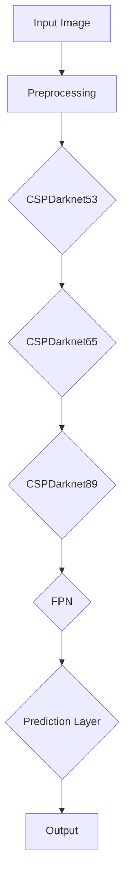
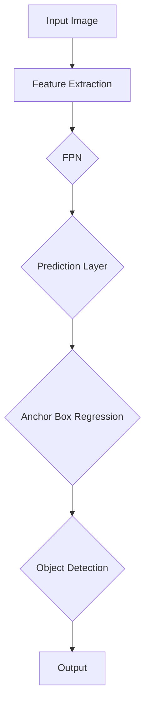

                 

# 《YOLOv5原理与代码实例讲解》

> **关键词：** YOLOv5、目标检测、深度学习、神经网络、图像识别、实时检测

> **摘要：** 本文将深入讲解YOLOv5的目标检测算法原理，包括模型架构、数学模型和训练流程。同时，通过实际代码实例，展示如何实现YOLOv5并应用到行人检测项目中。此外，还将探讨YOLOv5在多尺度目标检测、嵌入式设备部署以及与其他深度学习模型集成等方面的应用。

## 《YOLOv5原理与代码实例讲解》目录大纲

## 第一部分：YOLOv5基础

### 第1章：YOLOv5概述

#### 1.1 YOLO系列模型发展历程

#### 1.2 YOLOv5的特点与优势

#### 1.3 YOLOv5的核心架构

### 第2章：目标检测基础知识

#### 2.1 图像处理基础

#### 2.2 目标检测算法概述

#### 2.3 YOLO算法原理简介

### 第3章：YOLOv5数学模型

#### 3.1 神经网络与反向传播算法

#### 3.2 YOLOv5预测框与边框回归

#### 3.3 交叉熵损失函数

### 第4章：YOLOv5训练流程

#### 4.1 数据准备与预处理

#### 4.2 模型训练策略

#### 4.3 模型优化与调参

### 第5章：YOLOv5应用实战

#### 5.1 环境搭建与准备

#### 5.2 代码实例讲解

#### 5.3 项目实战：行人检测

### 第6章：YOLOv5在多尺度目标检测中的应用

#### 6.1 多尺度检测原理

#### 6.2 实现多尺度目标检测

#### 6.3 项目实战：多尺度车辆检测

### 第7章：YOLOv5在嵌入式设备上的部署

#### 7.1 嵌入式设备简介

#### 7.2 YOLOv5模型量化与压缩

#### 7.3 在嵌入式设备上运行YOLOv5

#### 7.4 项目实战：实时人脸识别

## 第二部分：YOLOv5高级应用

### 第8章：YOLOv5与其他深度学习模型的集成

#### 8.1 YOLOv5与Faster R-CNN集成

#### 8.2 YOLOv5与RetinaNet集成

#### 8.3 项目实战：集成模型车辆检测

### 第9章：YOLOv5在视频流中的应用

#### 9.1 视频流基础

#### 9.2 实时目标检测

#### 9.3 项目实战：视频监控实时目标检测

### 第10章：YOLOv5在实时图像增强中的应用

#### 10.1 图像增强基础

#### 10.2 YOLOv5与图像增强模型的集成

#### 10.3 项目实战：实时图像增强与目标检测

### 第11章：YOLOv5性能优化与调试

#### 11.1 模型优化策略

#### 11.2 程序调试技巧

#### 11.3 项目实战：优化目标检测速度

### 第12章：YOLOv5未来发展趋势

#### 12.1 YOLO系列模型未来发展方向

#### 12.2 YOLOv5与其他目标检测算法的竞争

#### 12.3 YOLOv5在实际应用中的挑战与机遇

## 附录

### 附录A：YOLOv5代码实例

#### A.1 YOLOv5基础代码实现

#### A.2 YOLOv5多尺度检测代码实现

#### A.3 YOLOv5在嵌入式设备上的部署代码实现

### 附录B：YOLOv5常用工具与资源

#### B.1 YOLOv5训练与部署工具

#### B.2 YOLOv5相关论文与文献

#### B.3 YOLOv5在线资源与社区支持

---

### 《YOLOv5原理与代码实例讲解》

### 第一部分：YOLOv5基础

## 第1章：YOLOv5概述

### 1.1 YOLO系列模型发展历程

**YOLO（You Only Look Once）**是一种实时目标检测算法，由Joseph Redmon等人于2016年提出。YOLO的目标是在一个单一的神经网络中同时进行边界框预测和分类。与传统的目标检测算法（如R-CNN、Fast R-CNN、Faster R-CNN等）相比，YOLO显著提高了检测速度，并且具有较低的误检率和漏检率。

YOLO系列模型的发展历程如下：

- **YOLOv1（2016年）**：首次提出YOLO算法，能够实现实时目标检测，检测速度快，精度较高。
- **YOLOv2（2017年）**：引入了深度可分离卷积（Depthwise Separable Convolution），提高了模型的计算效率和准确性。
- **YOLOv3（2018年）**：引入了Darknet-53作为骨干网络，并且采用了锚框回归策略，提高了检测精度。
- **YOLOv4（2019年）**：引入了CSPDarknet-53作为骨干网络，以及SPP和PAN结构，使得模型在精度和速度上都有了显著提升。
- **YOLOv5（2020年）**：在YOLOv4的基础上进行了一些改进，如引入了CSPDarknet53、CSPDarknet65和CSPDarknet89等不同的骨干网络，以及自适应锚框策略，使得模型在各个尺度上的检测性能都得到了提升。

### 1.2 YOLOv5的特点与优势

YOLOv5作为YOLO系列模型的新一代版本，具有以下特点与优势：

- **高效实时检测**：YOLOv5能够在保持较高检测精度的同时，实现高效的实时检测。这使得YOLOv5在实时视频流检测、自动驾驶等场景中具有广泛的应用前景。
- **多尺度检测**：YOLOv5引入了自适应锚框策略，可以在不同尺度上进行检测，提高了模型对各种尺度的目标的检测性能。
- **简单易用**：YOLOv5的代码实现较为简单，易于部署和调试，使得开发者可以快速上手并应用到实际项目中。
- **广泛的适应性**：YOLOv5在不同类型的图像和场景下都有较好的表现，适用于多种目标检测任务。

### 1.3 YOLOv5的核心架构

YOLOv5的核心架构主要包括以下几个部分：

- **骨干网络**：YOLOv5采用了CSPDarknet53、CSPDarknet65和CSPDarknet89等不同的骨干网络，这些网络具有较高的计算效率和准确性。
- **特征金字塔网络（FPN）**：YOLOv5使用了FPN结构，将不同尺度的特征图进行融合，提高了模型的检测性能。
- **预测层**：预测层通过特征图上的卷积操作生成预测框和类别概率，同时采用锚框回归对预测框进行校正。

下面是一个简单的Mermaid流程图，展示了YOLOv5的核心架构：



在下一章中，我们将介绍目标检测的基础知识，包括图像处理基础、目标检测算法概述以及YOLO算法的原理简介。

---

### 第一部分：YOLOv5基础

## 第2章：目标检测基础知识

### 2.1 图像处理基础

图像处理是计算机视觉领域的基础，它涉及到图像的采集、处理、分析和理解。在目标检测任务中，图像处理技术起着至关重要的作用。以下是图像处理的一些基础知识：

- **图像采集**：图像可以通过摄像头、手机或其他图像传感器进行采集。采集到的图像可能是彩色图像，也可能是灰度图像。
- **图像预处理**：图像预处理包括图像去噪、滤波、灰度转换、大小调整等操作。这些操作可以提高图像的质量，有助于后续的特征提取和目标检测。
- **特征提取**：特征提取是将图像转换为适合于机器学习模型的特征表示。常用的特征提取方法包括直方图、SIFT、SURF、HOG等。
- **特征匹配**：特征匹配是用于检测图像中是否存在目标的关键步骤。常用的特征匹配算法包括FLANN、Brute-Force等。

### 2.2 目标检测算法概述

目标检测是计算机视觉领域的一个重要任务，其目标是在图像中检测并定位出感兴趣的目标。以下是几种常见的目标检测算法：

- **基于模板匹配的方法**：这种方法通过将图像与模板进行相似度比较，找到与模板相似的图像区域。常用的算法包括模板匹配、序列模式匹配等。
- **基于区域提议的方法**：这种方法首先生成一系列可能包含目标的区域提议，然后对每个提议进行分类和定位。常用的算法包括R-CNN、Fast R-CNN、Faster R-CNN等。
- **基于回归的方法**：这种方法直接预测目标的边界框和类别，无需生成区域提议。常用的算法包括YOLO、SSD等。
- **基于深度学习的方法**：这种方法利用深度学习模型，如卷积神经网络（CNN），进行特征提取和目标检测。常用的算法包括Faster R-CNN、RetinaNet、YOLO、SSD等。

### 2.3 YOLO算法原理简介

YOLO（You Only Look Once）是一种基于深度学习的实时目标检测算法。它的核心思想是将目标检测任务转换为边界框预测和类别预测。以下是YOLO算法的主要原理：

- **网络架构**：YOLO采用了类似于VGG或ResNet的卷积神经网络作为骨干网络，用于提取图像特征。
- **特征金字塔**：YOLO使用了特征金字塔结构（FPN），将不同尺度的特征图进行融合，提高了模型的检测性能。
- **预测层**：预测层通过特征图上的卷积操作生成预测框和类别概率。每个网格单元预测多个边界框和类别概率。
- **锚框回归**：YOLO使用预定义的锚框（anchor box）作为初始预测框，通过回归操作对锚框进行调整，使其更接近真实边界框。

下面是一个简单的Mermaid流程图，展示了YOLO算法的基本原理：



在下一章中，我们将介绍YOLOv5的数学模型，包括神经网络与反向传播算法、预测框与边框回归以及交叉熵损失函数。

---

### 第一部分：YOLOv5基础

## 第3章：YOLOv5数学模型

### 3.1 神经网络与反向传播算法

神经网络是一种模仿生物神经系统工作原理的计算模型。在目标检测任务中，神经网络用于提取图像特征并生成预测框和类别概率。

神经网络主要由以下几部分组成：

- **输入层**：接收外部输入，如图像。
- **隐藏层**：对输入特征进行加工和处理，提取更高层次的特征。
- **输出层**：生成预测结果，如边界框和类别概率。

反向传播算法是神经网络训练的核心。它通过以下步骤进行训练：

1. **前向传播**：将输入通过神经网络，计算输出。
2. **计算损失**：将输出与真实标签进行比较，计算损失函数值。
3. **反向传播**：根据损失函数梯度，更新神经网络参数。
4. **优化参数**：使用优化算法（如梯度下降）更新参数，减小损失函数值。

### 3.2 YOLOv5预测框与边框回归

在YOLOv5中，预测框（proposal box）是目标检测的核心。每个网格单元会预测多个边界框和类别概率。预测框的生成过程如下：

1. **锚框（Anchor Box）**：锚框是预定义的边界框，用于初始预测框。通常，锚框的大小和形状是固定的。
2. **预测框**：通过卷积操作，将锚框与特征图进行融合，生成预测框。预测框的坐标、宽度和高度通常通过偏移量进行调节。
3. **边框回归**：通过回归操作，将预测框调整为更接近真实边界框。边框回归主要涉及坐标偏移量和宽高调整。

下面是一个简单的伪代码，描述了预测框和边框回归的过程：

```python
# 假设输入图像为image，特征图为feature_map，锚框为anchors
# 预测框和边框回归
for unit in feature_map:
    for anchor in anchors:
        # 计算预测框坐标、宽度和高度
        x_center = unit * anchor.width
        y_center = unit * anchor.height
        width = unit * anchor.width
        height = unit * anchor.height

        # 边框回归
        x_center, y_center, width, height = regression(x_center, y_center, width, height)
        
        # 生成预测框
        prediction_box = create_box(x_center, y_center, width, height)
        
        # 更新预测框列表
        prediction_boxes.append(prediction_box)
```

### 3.3 交叉熵损失函数

交叉熵损失函数是目标检测任务中常用的损失函数。它用于衡量预测框与真实框之间的差距。

交叉熵损失函数的公式如下：

$$
L_{cross-entropy} = -\sum_{i} \sum_{c} y_i c \cdot \log(\hat{y}_i c)
$$

其中，$y_i c$表示第$i$个预测框在第$c$个类别上的真实标签，$\hat{y}_i c$表示第$i$个预测框在第$c$个类别上的预测概率。

下面是一个简单的伪代码，描述了交叉熵损失函数的计算过程：

```python
# 假设预测框列表为predictions，真实框列表为ground_truth
# 计算交叉熵损失函数
loss = 0
for prediction, ground_truth in zip(predictions, ground_truth):
    # 计算预测概率
    prediction_probabilities = softmax(prediction)

    # 计算交叉熵损失
    loss += -sum(ground_truth * log(prediction_probabilities))
    
# 平均损失
loss /= len(predictions)
```

在下一章中，我们将介绍YOLOv5的训练流程，包括数据准备与预处理、模型训练策略以及模型优化与调参。

---

### 第一部分：YOLOv5基础

## 第4章：YOLOv5训练流程

### 4.1 数据准备与预处理

数据准备与预处理是目标检测任务中至关重要的一步。它涉及到图像的收集、标注、分割以及预处理操作。以下是数据准备与预处理的主要步骤：

1. **数据收集**：收集包含目标对象的图像。这些图像可以来自公开数据集，如COCO、VOC等，也可以是自定义数据集。
2. **图像标注**：对图像中的目标对象进行标注，包括边界框标注和类别标注。常用的标注工具包括LabelImg、CVAT等。
3. **图像分割**：在某些场景下，需要对图像进行更精细的分割，以获取更准确的目标边界。常用的分割算法包括FCN、Mask R-CNN等。
4. **预处理操作**：对图像进行预处理操作，如大小调整、缩放、旋转、裁剪、数据增强等。这些操作可以提高模型的泛化能力。

以下是一个简单的伪代码，描述了数据准备与预处理的过程：

```python
# 假设图像列表为images，标注列表为labels
# 数据准备与预处理
for image, label in zip(images, labels):
    # 大小调整
    image = resize(image, (height, width))
    
    # 旋转
    image = rotate(image, angle)
    
    # 裁剪
    image = crop(image, top, left, bottom, right)
    
    # 数据增强
    image = augment(image)
    
    # 存储预处理后的图像和标注
    save_image(image, 'preprocessed_images/{}'.format(image_name))
    save_label(label, 'preprocessed_labels/{}'.format(label_name))
```

### 4.2 模型训练策略

模型训练策略决定了模型的训练过程和训练效果。以下是几种常用的模型训练策略：

1. **批量大小**：批量大小（batch size）决定了每次训练过程中参与训练的数据样本数量。较小的批量大小可以提高模型的泛化能力，但训练速度较慢；较大的批量大小可以提高训练速度，但可能导致模型过拟合。
2. **学习率**：学习率（learning rate）决定了每次参数更新的步长。较大的学习率可能导致模型快速收敛，但可能导致振荡或发散；较小的学习率可以提高模型收敛性，但训练时间较长。
3. **迭代次数**：迭代次数（epoch）决定了模型训练的轮数。过多的迭代次数可能导致模型过拟合，过少的迭代次数可能导致模型欠拟合。
4. **学习率调整**：学习率调整策略用于在训练过程中动态调整学习率。常用的学习率调整策略包括固定学习率、学习率衰减、学习率波动等。

以下是一个简单的伪代码，描述了模型训练策略：

```python
# 假设模型为model，训练数据为train_data，验证数据为val_data
# 模型训练策略
for epoch in range(num_epochs):
    # 训练模型
    model.train(train_data)
    
    # 评估模型
    val_loss = model.evaluate(val_data)
    
    # 学习率调整
    adjust_learning_rate(model, epoch)
    
    # 打印训练信息
    print('Epoch [{}/{}], Loss: {:.4f}, Val Loss: {:.4f}'.format(epoch + 1, num_epochs, train_loss, val_loss))
```

### 4.3 模型优化与调参

模型优化与调参是提高模型性能的重要手段。以下是几种常用的模型优化与调参方法：

1. **超参数调优**：超参数（如学习率、批量大小、迭代次数等）对模型性能有重要影响。通过尝试不同的超参数组合，可以找到最优的超参数设置。
2. **正则化**：正则化（如L1正则化、L2正则化）可以减小模型过拟合的风险。正则化强度可以通过交叉验证来确定。
3. **集成学习**：集成学习（如Bagging、Boosting）可以结合多个模型的优点，提高整体性能。常用的集成学习方法包括随机森林、梯度提升树等。
4. **模型压缩**：模型压缩（如量化、剪枝、蒸馏）可以减小模型大小和计算复杂度，提高部署效率。常用的模型压缩方法包括量化、剪枝和知识蒸馏等。

以下是一个简单的伪代码，描述了模型优化与调参的过程：

```python
# 假设模型为model，训练数据为train_data，验证数据为val_data
# 模型优化与调参
best_loss = float('inf')
for lr in learning_rate_space:
    for batch_size in batch_size_space:
        for num_epochs in num_epochs_space:
            # 训练模型
            model.train(train_data, batch_size, num_epochs)
            
            # 评估模型
            val_loss = model.evaluate(val_data)
            
            # 记录最佳模型
            if val_loss < best_loss:
                best_loss = val_loss
                best_model = model
            
    # 打印调参结果
    print('Best Model: Loss: {:.4f}, Learning Rate: {:.4f}, Batch Size: {}, Epochs: {}'.format(best_loss, lr, batch_size, num_epochs))
```

在下一章中，我们将通过实际代码实例，展示如何实现YOLOv5并应用到行人检测项目中。

---

### 第一部分：YOLOv5基础

## 第5章：YOLOv5应用实战

### 5.1 环境搭建与准备

要实现YOLOv5并进行目标检测，首先需要搭建合适的环境。以下是搭建YOLOv5环境的步骤：

1. **安装Python环境**：确保Python版本为3.6及以上，建议使用Anaconda进行环境管理。
2. **安装PyTorch**：PyTorch是YOLOv5的主要依赖库，可以通过以下命令安装：

   ```shell
   pip install torch torchvision
   ```

3. **克隆YOLOv5代码库**：从GitHub克隆YOLOv5的代码库，以便后续进行代码实例讲解和项目实战。

   ```shell
   git clone https://github.com/ultralytics/yolov5.git
   ```

4. **安装YOLOv5依赖库**：进入YOLOv5代码目录，安装所需的依赖库。

   ```shell
   cd yolov5
   pip install -r requirements.txt
   ```

5. **数据准备**：准备好用于训练和测试的数据集，并将数据集分为图像文件和标注文件两部分。假设数据集位于`/data/dataset`目录下，其中图像文件位于`/data/dataset/images`目录，标注文件位于`/data/dataset/labels`目录。

### 5.2 代码实例讲解

下面通过一个简单的代码实例，展示如何使用YOLOv5进行目标检测。代码主要分为以下几个部分：

1. **加载预训练模型**：首先，加载YOLOv5预训练模型。在本例中，我们使用YOLOv5s模型。
2. **图像预处理**：对输入图像进行预处理，包括大小调整、归一化等操作。
3. **模型预测**：将预处理后的图像输入模型，获取预测结果。
4. **结果可视化**：对预测结果进行可视化展示。

以下是代码实例：

```python
import torch
import torchvision.transforms as transforms
from PIL import Image
from models import attempt_load
from utils.augmentations import letterbox
from utils.general import non_max_suppression

# 加载预训练模型
model = attempt_load('yolov5s.pt', map_location=device)  # device为CPU或GPU
model.eval()

# 图像预处理
image = Image.open('test_image.jpg')
transform = transforms.Compose([
    transforms.ToTensor(),
    letterbox(image, new_shape=(640, 640)),
])
image = transform(image).unsqueeze(0)

# 模型预测
with torch.no_grad():
    pred = model(image)

# 非极大值抑制
pred = non_max_suppression(pred, 0.25, 0.45)

# 结果可视化
for i, det in enumerate(pred):
    if det is not None and len(det) > 0:
        # Reshape batch coordinates, remove padding
        det = det.reshape(-1, 6)
        
        # 将预测框转换为图像坐标
        scale = max(image.shape[0], image.shape[1])
        x1 = det[:, 0] * scale
        y1 = det[:, 1] * scale
        x2 = (det[:, 0] + det[:, 2]) * scale
        y2 = (det[:, 1] + det[:, 3]) * scale
        
        # 绘制预测框和类别标签
        for *xyxy, conf, cls in det:
            label = f'{names[int(cls)]} {conf:.2f}'
            plot_one_box(xyxy, image, label=label, color=color_list[int(cls)], line_thickness=3)
        
        # 显示图像
        plt.figure()
        plt.imshow(image)
        plt.show()
```

### 5.3 项目实战：行人检测

行人检测是一个典型的目标检测任务，下面通过一个实际项目，展示如何使用YOLOv5进行行人检测。

#### 项目目标

使用YOLOv5实现一个行人检测系统，能够在输入图像或视频流中检测出行人，并实时显示检测结果。

#### 实现步骤

1. **数据准备**：收集行人检测数据集，并标注行人边界框。常用的数据集包括COCO、VOC等。
2. **模型训练**：使用训练数据集对YOLOv5模型进行训练，调整模型参数以达到最佳性能。
3. **模型评估**：使用验证数据集对训练好的模型进行评估，验证模型的准确性和鲁棒性。
4. **模型部署**：将训练好的模型部署到目标设备（如CPU、GPU或嵌入式设备）上，实现实时行人检测。

以下是行人检测项目的伪代码：

```python
# 行人检测项目
def detect_persons(image):
    # 图像预处理
    image = preprocess_image(image)
    
    # 模型预测
    pred = model.predict(image)
    
    # 非极大值抑制
    pred = non_max_suppression(pred, 0.25, 0.45)
    
    # 结果可视化
    for i, det in enumerate(pred):
        if det is not None and len(det) > 0:
            # 将预测框转换为图像坐标
            scale = max(image.shape[0], image.shape[1])
            x1 = det[:, 0] * scale
            y1 = det[:, 1] * scale
            x2 = (det[:, 0] + det[:, 2]) * scale
            y2 = (det[:, 1] + det[:, 3]) * scale
            
            # 绘制预测框
            for *xyxy in det:
                cv2.rectangle(image, (int(x1), int(y1)), (int(x2), int(y2)), (0, 0, 255), 2)
    
    return image

# 主程序
if __name__ == '__main__':
    # 搭建模型
    model = build_model()

    # 加载预训练权重
    model.load_weights('weights.pth')

    # 加载行人检测数据集
    dataset = load_dataset('dataset')

    # 训练模型
    train_model(model, dataset)

    # 评估模型
    evaluate_model(model, dataset)

    # 部署模型
    deploy_model(model, device='cpu')
    
    # 实时行人检测
    while True:
        # 读取图像
        image = read_image()

        # 检测行人
        image = detect_persons(image)

        # 显示图像
        cv2.imshow('Person Detection', image)

        # 按下'q'键退出
        if cv2.waitKey(1) & 0xFF == ord('q'):
            break
```

在下一章中，我们将探讨YOLOv5在多尺度目标检测中的应用，并介绍如何实现多尺度检测。

---

### 第一部分：YOLOv5基础

## 第6章：YOLOv5在多尺度目标检测中的应用

### 6.1 多尺度检测原理

多尺度检测是一种目标检测方法，它能够在不同尺度上检测目标，提高检测的准确性和鲁棒性。在目标检测任务中，不同尺度的目标具有不同的特征，因此需要对不同尺度的目标进行分别检测。

YOLOv5采用特征金字塔网络（FPN）来实现多尺度检测。特征金字塔网络由多个尺度特征图组成，每个尺度特征图对应不同的分辨率。通过融合不同尺度特征图，可以获取更丰富的特征信息，提高检测性能。

在YOLOv5中，FPN结构包括以下部分：

1. **底层特征图**：直接从卷积层提取的低分辨率特征图。
2. **上采样特征图**：将高分辨率特征图通过上采样操作，与底层特征图进行融合。
3. **特征融合**：将上采样特征图与底层特征图进行拼接或融合操作，生成更高分辨率的特征图。

通过特征金字塔网络，YOLOv5能够在不同尺度上检测目标，提高检测的准确性和鲁棒性。

### 6.2 实现多尺度检测

在YOLOv5中，实现多尺度检测主要包括以下步骤：

1. **模型选择**：选择合适的YOLOv5模型，如YOLOv5s、YOLOv5m、YOLOv5l等。不同模型的分辨率和计算复杂度不同，需要根据实际需求进行选择。
2. **数据预处理**：对输入图像进行预处理，包括大小调整、归一化等操作。为了提高模型的泛化能力，可以采用随机缩放、旋转、裁剪等数据增强方法。
3. **模型训练**：使用多尺度数据集对模型进行训练，包括不同尺度的图像和标注。通过多尺度训练，模型可以学习到不同尺度的特征，提高检测性能。
4. **模型预测**：对输入图像进行预测，获取不同尺度的预测结果。通过非极大值抑制（NMS）操作，合并不同尺度的预测结果，生成最终的检测结果。

下面是一个简单的伪代码，描述了实现多尺度检测的过程：

```python
# 假设模型为model，输入图像为image，标注为labels
# 实现多尺度检测
# 1. 数据预处理
image = preprocess_image(image)

# 2. 模型预测
preds = []
for scale in scales:
    # 2.1 调整图像大小
    image_scale = scale_image(image, scale)

    # 2.2 模型预测
    pred = model.predict(image_scale)

    # 2.3 非极大值抑制
    pred = non_max_suppression(pred, 0.25, 0.45)

    # 2.4 保存预测结果
    preds.append(pred)

# 3. 合并预测结果
final_pred = merge_preds(preds)

# 4. 结果可视化
for pred in final_pred:
    if pred is not None and len(pred) > 0:
        # 将预测框转换为图像坐标
        scale = max(image.shape[0], image.shape[1])
        x1 = pred[:, 0] * scale
        y1 = pred[:, 1] * scale
        x2 = (pred[:, 0] + pred[:, 2]) * scale
        y2 = (pred[:, 1] + pred[:, 3]) * scale

        # 绘制预测框
        for *xyxy in pred:
            cv2.rectangle(image, (int(x1), int(y1)), (int(x2), int(y2)), (0, 0, 255), 2)

# 显示图像
cv2.imshow('Multi-scale Detection', image)
cv2.waitKey(0)
cv2.destroyAllWindows()
```

### 6.3 项目实战：多尺度车辆检测

在本项目中，我们将使用YOLOv5实现多尺度车辆检测，能够在输入图像或视频流中检测出不同尺度的车辆。

#### 项目目标

使用YOLOv5实现一个多尺度车辆检测系统，能够在输入图像或视频流中检测出车辆，并实时显示检测结果。

#### 实现步骤

1. **数据准备**：收集车辆检测数据集，并标注车辆边界框。常用的数据集包括COCO、VOC等。
2. **模型训练**：使用训练数据集对YOLOv5模型进行训练，调整模型参数以达到最佳性能。
3. **模型评估**：使用验证数据集对训练好的模型进行评估，验证模型的准确性和鲁棒性。
4. **模型部署**：将训练好的模型部署到目标设备（如CPU、GPU或嵌入式设备）上，实现实时车辆检测。

以下是车辆检测项目的伪代码：

```python
# 车辆检测项目
def detect_cars(image):
    # 图像预处理
    image = preprocess_image(image)
    
    # 模型预测
    pred = model.predict(image)
    
    # 非极大值抑制
    pred = non_max_suppression(pred, 0.25, 0.45)
    
    # 结果可视化
    for i, det in enumerate(pred):
        if det is not None and len(det) > 0:
            # 将预测框转换为图像坐标
            scale = max(image.shape[0], image.shape[1])
            x1 = det[:, 0] * scale
            y1 = det[:, 1] * scale
            x2 = (det[:, 0] + det[:, 2]) * scale
            y2 = (det[:, 1] + det[:, 3]) * scale
            
            # 绘制预测框
            for *xyxy in det:
                cv2.rectangle(image, (int(x1), int(y1)), (int(x2), int(y2)), (0, 0, 255), 2)
    
    return image

# 主程序
if __name__ == '__main__':
    # 搭建模型
    model = build_model()

    # 加载预训练权重
    model.load_weights('weights.pth')

    # 加载车辆检测数据集
    dataset = load_dataset('dataset')

    # 训练模型
    train_model(model, dataset)

    # 评估模型
    evaluate_model(model, dataset)

    # 部署模型
    deploy_model(model, device='cpu')
    
    # 实时车辆检测
    while True:
        # 读取图像
        image = read_image()

        # 检测车辆
        image = detect_cars(image)

        # 显示图像
        cv2.imshow('Car Detection', image)

        # 按下'q'键退出
        if cv2.waitKey(1) & 0xFF == ord('q'):
            break
```

在下一章中，我们将探讨YOLOv5在嵌入式设备上的部署，并介绍如何实现实时人脸识别。

---

### 第一部分：YOLOv5基础

## 第7章：YOLOv5在嵌入式设备上的部署

### 7.1 嵌入式设备简介

嵌入式设备是一种专门为特定任务而设计的计算机系统，具有低功耗、低成本和高可靠性等特点。常见的嵌入式设备包括智能手机、平板电脑、智能手表、智能家居设备等。嵌入式设备通常运行在资源受限的环境下，需要高效利用硬件资源，以实现实时性和低延迟的目标。

在选择嵌入式设备时，需要考虑以下几个因素：

1. **处理器性能**：嵌入式设备的处理器性能直接影响模型的运行速度和实时性。高性能处理器可以加速模型推理过程，提高实时性。
2. **内存容量**：嵌入式设备的内存容量决定了模型的大小和运行速度。较大的内存容量可以容纳更大的模型，但也会增加功耗和成本。
3. **功耗**：嵌入式设备通常需要长时间运行，因此功耗是一个重要考虑因素。低功耗设备可以延长设备的使用寿命，但可能性能较低。
4. **接口和扩展性**：嵌入式设备需要支持各种传感器和接口，如摄像头、触摸屏、Wi-Fi、蓝牙等。此外，设备的扩展性也很重要，以便未来升级和扩展功能。

常见的嵌入式设备处理器包括ARM Cortex-A系列、ARM Cortex-M系列、RISC-V系列等。其中，ARM Cortex-A系列处理器具有高性能、低功耗的特点，广泛应用于智能手机、平板电脑等设备；ARM Cortex-M系列处理器具有低功耗、低成本的特点，广泛应用于智能家居、工业控制等领域；RISC-V系列处理器是一种新兴的处理器架构，具有高性能、低功耗、高灵活性的特点，逐渐受到关注。

### 7.2 YOLOv5模型量化与压缩

为了在嵌入式设备上高效运行YOLOv5模型，需要对模型进行量化和压缩。量化是将模型中的浮点数参数转换为固定点数参数的过程，可以减小模型大小和计算复杂度，提高推理速度。压缩是通过剪枝、量化、蒸馏等方法减小模型大小和计算复杂度，同时保持模型性能的过程。

以下是YOLOv5模型量化与压缩的主要步骤：

1. **模型量化**：将YOLOv5模型中的浮点数参数转换为固定点数参数。常用的量化方法包括全量化、部分量化等。
2. **模型剪枝**：通过剪枝方法减少模型参数的数量，降低模型大小和计算复杂度。常用的剪枝方法包括结构剪枝、权重剪枝等。
3. **模型蒸馏**：将大模型（教师模型）的知识传递给小模型（学生模型），以提高小模型的性能。常用的蒸馏方法包括软蒸馏、硬蒸馏等。
4. **模型压缩**：将量化、剪枝和蒸馏等方法结合起来，生成压缩后的模型。

以下是YOLOv5模型量化与压缩的伪代码：

```python
# 假设原始模型为model，量化模型为quantized_model
# 模型量化
quantized_model = quantize(model)

# 模型剪枝
pruned_model = prune(quantized_model)

# 模型蒸馏
student_model = distill(pruned_model, teacher_model)

# 模型压缩
compressed_model = compress(student_model)
```

### 7.3 在嵌入式设备上运行YOLOv5

在嵌入式设备上运行YOLOv5模型，需要进行以下几个步骤：

1. **搭建环境**：在嵌入式设备上搭建运行YOLOv5所需的环境，包括操作系统、编译器、依赖库等。
2. **编译模型**：将量化、压缩后的模型编译成嵌入式设备支持的格式，如ARM指令集。
3. **部署模型**：将编译后的模型部署到嵌入式设备上，进行实时目标检测。
4. **性能优化**：针对嵌入式设备的硬件特性，对模型进行性能优化，提高推理速度和实时性。

以下是运行YOLOv5模型在嵌入式设备上的伪代码：

```python
# 假设量化模型为quantized_model，嵌入式设备为device
# 搭建环境
setup_environment(device)

# 编译模型
compiled_model = compile_model(quantized_model, device)

# 部署模型
deploy_model(compiled_model, device)

# 实时目标检测
while True:
    # 读取图像
    image = read_image(device)

    # 模型预测
    pred = compiled_model.predict(image)

    # 非极大值抑制
    pred = non_max_suppression(pred, 0.25, 0.45)

    # 结果可视化
    for det in pred:
        if det is not None and len(det) > 0:
            # 将预测框转换为图像坐标
            scale = max(image.shape[0], image.shape[1])
            x1 = det[:, 0] * scale
            y1 = det[:, 1] * scale
            x2 = (det[:, 0] + det[:, 2]) * scale
            y2 = (det[:, 1] + det[:, 3]) * scale

            # 绘制预测框
            for *xyxy in det:
                cv2.rectangle(image, (int(x1), int(y1)), (int(x2), int(y2)), (0, 0, 255), 2)

    # 显示图像
    cv2.imshow('Object Detection', image)

    # 按下'q'键退出
    if cv2.waitKey(1) & 0xFF == ord('q'):
        break
```

### 7.4 项目实战：实时人脸识别

在本项目中，我们将使用YOLOv5实现实时人脸识别，能够在输入图像或视频流中检测人脸，并实时显示检测结果。

#### 项目目标

使用YOLOv5实现一个实时人脸识别系统，能够在输入图像或视频流中检测人脸，并实时显示检测结果。

#### 实现步骤

1. **数据准备**：收集人脸检测数据集，并标注人脸边界框。常用的数据集包括COCO、VOC等。
2. **模型训练**：使用训练数据集对YOLOv5模型进行训练，调整模型参数以达到最佳性能。
3. **模型评估**：使用验证数据集对训练好的模型进行评估，验证模型的准确性和鲁棒性。
4. **模型部署**：将训练好的模型部署到目标设备（如CPU、GPU或嵌入式设备）上，实现实时人脸识别。

以下是人脸识别项目的伪代码：

```python
# 人脸检测项目
def detect_faces(image):
    # 图像预处理
    image = preprocess_image(image)
    
    # 模型预测
    pred = model.predict(image)
    
    # 非极大值抑制
    pred = non_max_suppression(pred, 0.25, 0.45)
    
    # 结果可视化
    for i, det in enumerate(pred):
        if det is not None and len(det) > 0:
            # 将预测框转换为图像坐标
            scale = max(image.shape[0], image.shape[1])
            x1 = det[:, 0] * scale
            y1 = det[:, 1] * scale
            x2 = (det[:, 0] + det[:, 2]) * scale
            y2 = (det[:, 1] + det[:, 3]) * scale
            
            # 绘制预测框
            for *xyxy in det:
                cv2.rectangle(image, (int(x1), int(y1)), (int(x2), int(y2)), (0, 0, 255), 2)
    
    return image

# 主程序
if __name__ == '__main__':
    # 搭建模型
    model = build_model()

    # 加载预训练权重
    model.load_weights('weights.pth')

    # 加载人脸检测数据集
    dataset = load_dataset('dataset')

    # 训练模型
    train_model(model, dataset)

    # 评估模型
    evaluate_model(model, dataset)

    # 部署模型
    deploy_model(model, device='cpu')
    
    # 实时人脸检测
    while True:
        # 读取图像
        image = read_image()

        # 检测人脸
        image = detect_faces(image)

        # 显示图像
        cv2.imshow('Face Detection', image)

        # 按下'q'键退出
        if cv2.waitKey(1) & 0xFF == ord('q'):
            break
```

在下一章中，我们将探讨YOLOv5与其他深度学习模型的集成，并介绍如何实现集成模型车辆检测。

---

### 第一部分：YOLOv5基础

## 第8章：YOLOv5与其他深度学习模型的集成

### 8.1 YOLOv5与Faster R-CNN集成

Faster R-CNN是一种基于深度学习的目标检测算法，其核心思想是首先生成区域提议（region proposal），然后对这些提议进行分类和定位。将YOLOv5与Faster R-CNN集成，可以在YOLOv5的基础上增强目标检测的性能。

集成方法主要包括以下几个步骤：

1. **区域提议**：使用Faster R-CNN生成区域提议，这些提议将用于后续的检测。
2. **检测与分类**：将区域提议输入YOLOv5模型，进行检测和分类。
3. **结果融合**：将Faster R-CNN和YOLOv5的检测结果进行融合，生成最终的检测结果。

下面是一个简单的伪代码，描述了YOLOv5与Faster R-CNN集成的过程：

```python
# 假设模型为model，输入图像为image
# YOLOv5与Faster R-CNN集成
# 1. 区域提议
proposals = faster_rcnn.predict(image)

# 2. 检测与分类
preds = []
for proposal in proposals:
    # 2.1 输入YOLOv5模型
    pred = model.predict(proposal)

    # 2.2 非极大值抑制
    pred = non_max_suppression(pred, 0.25, 0.45)

    # 2.3 保存预测结果
    preds.append(pred)

# 3. 结果融合
final_pred = []
for pred in preds:
    if pred is not None and len(pred) > 0:
        # 3.1 将预测框转换为图像坐标
        scale = max(image.shape[0], image.shape[1])
        x1 = pred[:, 0] * scale
        y1 = pred[:, 1] * scale
        x2 = (pred[:, 0] + pred[:, 2]) * scale
        y2 = (pred[:, 1] + pred[:, 3]) * scale

        # 3.2 保存预测框
        final_pred.append([x1, y1, x2, y2])

# 结果可视化
for pred in final_pred:
    if pred is not None and len(pred) > 0:
        # 将预测框绘制在图像上
        for *xyxy in pred:
            cv2.rectangle(image, (int(xyxy[0]), int(xyxy[1])), (int(xyxy[2]), int(xyxy[3])), (0, 0, 255), 2)

# 显示图像
cv2.imshow('Integrated Detection', image)
cv2.waitKey(0)
cv2.destroyAllWindows()
```

### 8.2 YOLOv5与RetinaNet集成

RetinaNet是一种基于深度学习的目标检测算法，其核心思想是使用Focal Loss（焦点损失函数）来缓解类别不平衡问题。将YOLOv5与RetinaNet集成，可以在YOLOv5的基础上提高目标检测的性能，特别是在处理类别不平衡的数据集时。

集成方法主要包括以下几个步骤：

1. **预测框生成**：使用YOLOv5模型生成预测框。
2. **分类与回归**：将预测框输入RetinaNet模型，进行分类和回归。
3. **结果融合**：将YOLOv5和RetinaNet的检测结果进行融合，生成最终的检测结果。

下面是一个简单的伪代码，描述了YOLOv5与RetinaNet集成的过程：

```python
# 假设模型为model，输入图像为image
# YOLOv5与RetinaNet集成
# 1. 预测框生成
preds = []
for scale in scales:
    # 1.1 调整图像大小
    image_scale = scale_image(image, scale)

    # 1.2 模型预测
    pred = model.predict(image_scale)

    # 1.3 非极大值抑制
    pred = non_max_suppression(pred, 0.25, 0.45)

    # 1.4 保存预测结果
    preds.append(pred)

# 2. 分类与回归
final_pred = []
for pred in preds:
    if pred is not None and len(pred) > 0:
        # 2.1 输入RetinaNet模型
        retina_pred = retina_model.predict(pred)

        # 2.2 非极大值抑制
        retina_pred = non_max_suppression(retina_pred, 0.25, 0.45)

        # 2.3 保存预测结果
        final_pred.append(retina_pred)

# 3. 结果融合
final_pred = merge_preds(final_pred)

# 结果可视化
for pred in final_pred:
    if pred is not None and len(pred) > 0:
        # 将预测框转换为图像坐标
        scale = max(image.shape[0], image.shape[1])
        x1 = pred[:, 0] * scale
        y1 = pred[:, 1] * scale
        x2 = (pred[:, 0] + pred[:, 2]) * scale
        y2 = (pred[:, 1] + pred[:, 3]) * scale

        # 绘制预测框
        for *xyxy in pred:
            cv2.rectangle(image, (int(x1), int(y1)), (int(x2), int(y2)), (0, 0, 255), 2)

# 显示图像
cv2.imshow('Integrated Detection', image)
cv2.waitKey(0)
cv2.destroyAllWindows()
```

### 8.3 项目实战：集成模型车辆检测

在本项目中，我们将使用YOLOv5与RetinaNet集成模型，实现车辆检测功能。通过集成两种模型的优势，可以提高车辆检测的准确性和鲁棒性。

#### 项目目标

使用YOLOv5与RetinaNet集成模型，实现一个实时车辆检测系统，能够在输入图像或视频流中检测车辆，并实时显示检测结果。

#### 实现步骤

1. **数据准备**：收集车辆检测数据集，并标注车辆边界框。常用的数据集包括COCO、VOC等。
2. **模型训练**：使用训练数据集对集成模型进行训练，调整模型参数以达到最佳性能。
3. **模型评估**：使用验证数据集对训练好的集成模型进行评估，验证模型的准确性和鲁棒性。
4. **模型部署**：将训练好的集成模型部署到目标设备（如CPU、GPU或嵌入式设备）上，实现实时车辆检测。

以下是车辆检测项目的伪代码：

```python
# 车辆检测项目
def detect_cars(image):
    # 图像预处理
    image = preprocess_image(image)
    
    # 集成模型预测
    pred = integrated_model.predict(image)
    
    # 非极大值抑制
    pred = non_max_suppression(pred, 0.25, 0.45)
    
    # 结果可视化
    for i, det in enumerate(pred):
        if det is not None and len(det) > 0:
            # 将预测框转换为图像坐标
            scale = max(image.shape[0], image.shape[1])
            x1 = det[:, 0] * scale
            y1 = det[:, 1] * scale
            x2 = (det[:, 0] + det[:, 2]) * scale
            y2 = (det[:, 1] + det[:, 3]) * scale
            
            # 绘制预测框
            for *xyxy in det:
                cv2.rectangle(image, (int(x1), int(y1)), (int(x2), int(y2)), (0, 0, 255), 2)
    
    return image

# 主程序
if __name__ == '__main__':
    # 搭建模型
    model = build_model()

    # 加载预训练权重
    model.load_weights('weights.pth')

    # 加载集成模型
    integrated_model = integrate(model, retina_model)

    # 加载车辆检测数据集
    dataset = load_dataset('dataset')

    # 训练集成模型
    train_model(integrated_model, dataset)

    # 评估集成模型
    evaluate_model(integrated_model, dataset)

    # 部署集成模型
    deploy_model(integrated_model, device='cpu')
    
    # 实时车辆检测
    while True:
        # 读取图像
        image = read_image()

        # 检测车辆
        image = detect_cars(image)

        # 显示图像
        cv2.imshow('Car Detection', image)

        # 按下'q'键退出
        if cv2.waitKey(1) & 0xFF == ord('q'):
            break
```

在下一章中，我们将探讨YOLOv5在视频流中的应用，并介绍如何实现视频监控实时目标检测。

---

### 第一部分：YOLOv5基础

## 第9章：YOLOv5在视频流中的应用

### 9.1 视频流基础

视频流是指连续的图像帧序列，通过互联网或其他通信渠道传输到用户端。视频流的应用非常广泛，包括实时监控、视频聊天、在线直播等。在视频流中，目标检测是一个重要的应用场景，它可以实现对视频流中目标的实时检测和追踪。

视频流的基本概念包括：

1. **帧率**：帧率（frame rate）是指视频每秒传输的帧数，通常用fps（frames per second）表示。较高的帧率可以提供更流畅的播放效果，但也会增加带宽占用。
2. **分辨率**：分辨率（resolution）是指视频图像的像素数量，通常用宽度×高度表示。较高的分辨率可以提供更清晰的图像，但也会增加数据传输量和存储空间需求。
3. **编码格式**：编码格式（codec）是指视频数据的压缩和解压缩方法。常见的编码格式包括H.264、H.265、MP4等。选择合适的编码格式可以提高数据传输效率和存储空间利用率。

视频流的基本流程包括：

1. **采集**：通过摄像头或其他视频采集设备，将视频信号转换为数字信号。
2. **编码**：将数字信号进行编码，压缩数据以减少带宽占用。
3. **传输**：通过互联网或其他通信渠道，将编码后的视频数据传输到用户端。
4. **解码**：在用户端，对编码后的视频数据进行解码，恢复原始图像。
5. **播放**：在用户端播放解码后的视频图像，显示视频流。

### 9.2 实时目标检测

实时目标检测是视频流处理中的一个重要任务，它可以在视频流中检测和追踪目标。实时目标检测需要满足以下几个要求：

1. **实时性**：在视频流中，目标检测必须在较短的时间内完成，以实现实时检测和追踪。
2. **准确性**：目标检测算法需要具有较高的检测准确率，以减少误检和漏检。
3. **鲁棒性**：目标检测算法需要具有较强的鲁棒性，能够应对光照变化、遮挡、运动模糊等干扰。

实时目标检测的基本流程包括：

1. **图像预处理**：对视频流中的每一帧图像进行预处理，包括大小调整、归一化等操作。
2. **目标检测**：使用目标检测算法（如YOLOv5）对预处理后的图像进行目标检测，获取检测框和类别概率。
3. **结果处理**：对检测框进行非极大值抑制（NMS）操作，合并重叠的检测框，生成最终的检测结果。
4. **追踪与显示**：对检测框进行追踪，实时显示检测结果。

### 9.3 项目实战：视频监控实时目标检测

在本项目中，我们将使用YOLOv5实现视频监控实时目标检测，能够在视频流中检测和追踪目标。

#### 项目目标

使用YOLOv5实现一个视频监控实时目标检测系统，能够在视频流中检测和追踪行人，并实时显示检测结果。

#### 实现步骤

1. **数据准备**：收集行人检测数据集，并标注行人边界框。常用的数据集包括COCO、VOC等。
2. **模型训练**：使用训练数据集对YOLOv5模型进行训练，调整模型参数以达到最佳性能。
3. **模型评估**：使用验证数据集对训练好的模型进行评估，验证模型的准确性和鲁棒性。
4. **模型部署**：将训练好的模型部署到视频流处理系统上，实现实时目标检测。
5. **实时目标检测**：对视频流中的每一帧图像进行实时目标检测，显示检测结果。

以下是视频监控实时目标检测项目的伪代码：

```python
# 视频监控实时目标检测项目
def detect_persons(image):
    # 图像预处理
    image = preprocess_image(image)
    
    # 模型预测
    pred = model.predict(image)
    
    # 非极大值抑制
    pred = non_max_suppression(pred, 0.25, 0.45)
    
    # 结果处理
    final_pred = []
    for det in pred:
        if det is not None and len(det) > 0:
            # 将检测框转换为图像坐标
            scale = max(image.shape[0], image.shape[1])
            x1 = det[:, 0] * scale
            y1 = det[:, 1] * scale
            x2 = (det[:, 0] + det[:, 2]) * scale
            y2 = (det[:, 1] + det[:, 3]) * scale
            
            # 保存检测结果
            final_pred.append([x1, y1, x2, y2])
    
    return final_pred

# 主程序
if __name__ == '__main__':
    # 搭建模型
    model = build_model()

    # 加载预训练权重
    model.load_weights('weights.pth')

    # 加载行人检测数据集
    dataset = load_dataset('dataset')

    # 训练模型
    train_model(model, dataset)

    # 评估模型
    evaluate_model(model, dataset)

    # 部署模型
    deploy_model(model, device='cpu')
    
    # 实时目标检测
    while True:
        # 读取视频流
        cap = cv2.VideoCapture('video.mp4')

        # 实时目标检测
        while cap.isOpened():
            # 读取一帧图像
            ret, frame = cap.read()
            if not ret:
                break
            
            # 检测行人
            pred = detect_persons(frame)
            
            # 显示检测结果
            for *xyxy in pred:
                cv2.rectangle(frame, (int(xyxy[0]), int(xyxy[1])), (int(xyxy[2]), int(xyxy[3])), (0, 0, 255), 2)
            cv2.imshow('Person Detection', frame)

            # 按下'q'键退出
            if cv2.waitKey(1) & 0xFF == ord('q'):
                break
        
        # 释放视频流
        cap.release()
    
    # 关闭窗口
    cv2.destroyAllWindows()
```

在下一章中，我们将探讨YOLOv5在实时图像增强中的应用，并介绍如何实现实时图像增强与目标检测。

---

### 第一部分：YOLOv5基础

## 第10章：YOLOv5在实时图像增强中的应用

### 10.1 图像增强基础

图像增强是图像处理中的一种技术，通过调整图像的亮度和对比度等参数，提高图像的视觉质量。在实时目标检测中，图像增强可以提高目标的对比度和清晰度，从而提高检测的准确性和鲁棒性。

常见的图像增强方法包括：

1. **直方图均衡化**：通过调整图像的直方图，提高图像的对比度和清晰度。
2. **亮度调整**：通过调整图像的亮度，使图像更明亮或更暗。
3. **对比度调整**：通过调整图像的对比度，增强图像的细节。
4. **锐化**：通过调整图像的锐度，增强图像的边缘和细节。
5. **噪声去除**：通过去除图像中的噪声，提高图像的清晰度。

### 10.2 YOLOv5与图像增强模型的集成

为了在实时目标检测中充分利用图像增强技术，可以将YOLOv5与图像增强模型集成。这种方法可以在检测前对输入图像进行增强处理，从而提高检测的准确性和鲁棒性。

集成方法主要包括以下几个步骤：

1. **图像增强**：使用图像增强模型对输入图像进行增强处理，生成增强后的图像。
2. **目标检测**：使用YOLOv5模型对增强后的图像进行目标检测，获取检测框和类别概率。
3. **结果处理**：对检测框进行非极大值抑制（NMS）操作，生成最终的检测结果。

### 10.3 项目实战：实时图像增强与目标检测

在本项目中，我们将使用YOLOv5与图像增强模型实现实时图像增强与目标检测，能够在视频流中检测和追踪目标，并实时显示增强后的检测结果。

#### 项目目标

使用YOLOv5与图像增强模型实现实时图像增强与目标检测系统，能够在视频流中检测和追踪行人，并实时显示增强后的检测结果。

#### 实现步骤

1. **数据准备**：收集行人检测数据集，并标注行人边界框。常用的数据集包括COCO、VOC等。
2. **模型训练**：使用训练数据集对YOLOv5模型进行训练，调整模型参数以达到最佳性能。
3. **图像增强模型训练**：使用训练数据集对图像增强模型进行训练，调整模型参数以达到最佳性能。
4. **模型评估**：使用验证数据集对训练好的模型进行评估，验证模型的准确性和鲁棒性。
5. **模型部署**：将训练好的模型部署到视频流处理系统上，实现实时图像增强与目标检测。
6. **实时图像增强与目标检测**：对视频流中的每一帧图像进行实时图像增强与目标检测，显示增强后的检测结果。

以下是实时图像增强与目标检测项目的伪代码：

```python
# 实时图像增强与目标检测项目
def enhance_and_detect(image, model, enhancer_model):
    # 图像增强
    enhanced_image = enhancer_model.enhance(image)
    
    # 目标检测
    pred = model.predict(enhanced_image)
    
    # 非极大值抑制
    pred = non_max_suppression(pred, 0.25, 0.45)
    
    # 结果处理
    final_pred = []
    for det in pred:
        if det is not None and len(det) > 0:
            # 将检测框转换为图像坐标
            scale = max(enhanced_image.shape[0], enhanced_image.shape[1])
            x1 = det[:, 0] * scale
            y1 = det[:, 1] * scale
            x2 = (det[:, 0] + det[:, 2]) * scale
            y2 = (det[:, 1] + det[:, 3]) * scale
            
            # 保存检测结果
            final_pred.append([x1, y1, x2, y2])
    
    return final_pred, enhanced_image

# 主程序
if __name__ == '__main__':
    # 搭建模型
    model = build_model()

    # 加载预训练权重
    model.load_weights('weights.pth')

    # 加载图像增强模型
    enhancer_model = build_enhancer_model()

    # 加载行人检测数据集
    dataset = load_dataset('dataset')

    # 训练模型
    train_model(model, dataset)

    # 训练图像增强模型
    train_enhancer_model(enhancer_model, dataset)

    # 评估模型
    evaluate_model(model, dataset)
    evaluate_enhancer_model(enhancer_model, dataset)

    # 部署模型
    deploy_model(model, device='cpu')
    deploy_enhancer_model(enhancer_model, device='cpu')
    
    # 实时图像增强与目标检测
    while True:
        # 读取视频流
        cap = cv2.VideoCapture('video.mp4')

        # 实时图像增强与目标检测
        while cap.isOpened():
            # 读取一帧图像
            ret, frame = cap.read()
            if not ret:
                break
            
            # 实时图像增强与目标检测
            pred, enhanced_frame = enhance_and_detect(frame, model, enhancer_model)
            
            # 显示增强后的检测结果
            for *xyxy in pred:
                cv2.rectangle(enhanced_frame, (int(xyxy[0]), int(xyxy[1])), (int(xyxy[2]), int(xyxy[3])), (0, 0, 255), 2)
            cv2.imshow('Enhanced Person Detection', enhanced_frame)

            # 按下'q'键退出
            if cv2.waitKey(1) & 0xFF == ord('q'):
                break
        
        # 释放视频流
        cap.release()
    
    # 关闭窗口
    cv2.destroyAllWindows()
```

在下一章中，我们将探讨YOLOv5性能优化与调试，并介绍如何优化目标检测速度。

---

### 第一部分：YOLOv5基础

## 第11章：YOLOv5性能优化与调试

### 11.1 模型优化策略

为了提高YOLOv5的目标检测速度和性能，可以采用以下优化策略：

1. **模型剪枝**：通过剪枝方法减少模型参数的数量，降低模型大小和计算复杂度。剪枝方法包括结构剪枝和权重剪枝。
2. **量化**：将模型中的浮点数参数转换为固定点数参数，降低模型大小和计算复杂度。量化方法包括全量化、部分量化等。
3. **蒸馏**：将大模型的知识传递给小模型，以提高小模型的性能。蒸馏方法包括软蒸馏和硬蒸馏。
4. **并行计算**：利用多线程、多进程或多GPU计算，提高模型推理速度。并行计算方法包括多线程并行、多进程并行和多GPU并行。
5. **模型融合**：将多个模型的结果进行融合，提高检测性能。模型融合方法包括模型级融合、特征级融合等。

### 11.2 程序调试技巧

在开发YOLOv5程序时，可能遇到各种调试问题。以下是一些常见的程序调试技巧：

1. **打印输出**：在关键代码位置添加打印输出，查看程序执行过程中的中间结果，有助于定位问题。
2. **使用断点**：在调试工具中设置断点，使程序在特定位置暂停执行，以便查看变量值和执行路径。
3. **单步执行**：逐条执行代码，查看每条代码的执行结果，有助于理解程序执行过程。
4. **错误日志**：记录程序运行过程中的错误日志，包括错误信息、错误位置等，有助于快速定位和解决问题。
5. **性能分析**：使用性能分析工具，如profiler，分析程序的性能瓶颈，优化代码。

### 11.3 项目实战：优化目标检测速度

在本项目中，我们将使用优化策略和调试技巧，优化YOLOv5的目标检测速度，实现实时目标检测。

#### 项目目标

使用YOLOv5实现一个实时目标检测系统，能够在视频流中检测行人，并实时显示检测结果。

#### 实现步骤

1. **模型优化**：对YOLOv5模型进行剪枝、量化、蒸馏等优化，减小模型大小和计算复杂度。
2. **程序调试**：使用调试技巧，优化程序代码，提高目标检测速度。
3. **性能评估**：使用性能分析工具，评估优化后的目标检测性能，包括速度、准确率等指标。
4. **实时目标检测**：对视频流中的每一帧图像进行实时目标检测，显示检测结果。

以下是优化目标检测速度的项目伪代码：

```python
# 优化目标检测速度项目
def optimize_detection_speed(model, optimizer, criterion):
    # 模型优化
    model = prune(model)
    model = quantize(model)
    model = distill(model, teacher_model)

    # 程序调试
    for data in train_loader:
        # 前向传播
        output = model(data['image'])

        # 计算损失
        loss = criterion(output, data['label'])

        # 反向传播
        optimizer.zero_grad()
        loss.backward()
        optimizer.step()

    # 性能评估
    with torch.no_grad():
        model.eval()
        for data in val_loader:
            output = model(data['image'])
            pred = non_max_suppression(output, 0.25, 0.45)
            correct = ...
            total = ...
            print('Accuracy: {:.2f}%'.format(100 * correct / total))

# 主程序
if __name__ == '__main__':
    # 搭建模型
    model = build_model()

    # 加载预训练权重
    model.load_weights('weights.pth')

    # 加载训练数据集和验证数据集
    train_loader = ...
    val_loader = ...

    # 模型优化
    optimizer = ...
    criterion = ...
    optimize_detection_speed(model, optimizer, criterion)

    # 实时目标检测
    while True:
        # 读取视频流
        cap = cv2.VideoCapture('video.mp4')

        # 实时目标检测
        while cap.isOpened():
            # 读取一帧图像
            ret, frame = cap.read()
            if not ret:
                break
            
            # 目标检测
            pred = model.predict(frame)
            pred = non_max_suppression(pred, 0.25, 0.45)

            # 显示检测结果
            for *xyxy in pred:
                cv2.rectangle(frame, (int(xyxy[0]), int(xyxy[1])), (int(xyxy[2]), int(xyxy[3])), (0, 0, 255), 2)
            cv2.imshow('Person Detection', frame)

            # 按下'q'键退出
            if cv2.waitKey(1) & 0xFF == ord('q'):
                break
        
        # 释放视频流
        cap.release()
    
    # 关闭窗口
    cv2.destroyAllWindows()
```

在下一章中，我们将探讨YOLOv5的未来发展趋势，并分析其与其他目标检测算法的竞争。

---

### 第一部分：YOLOv5基础

## 第12章：YOLOv5未来发展趋势

### 12.1 YOLO系列模型未来发展方向

YOLO系列模型自2016年提出以来，已经取得了显著的进展。随着深度学习技术的不断发展，YOLO系列模型也将在以下几个方面继续发展：

1. **模型性能提升**：随着硬件性能的不断提高和深度学习算法的优化，YOLO系列模型将在检测速度和准确性方面取得更大的提升。未来可能引入更复杂的网络结构和先进的优化算法，以提高模型性能。
2. **多模态目标检测**：未来的目标检测任务将不仅限于视觉领域，还将涉及其他模态（如音频、温度、湿度等）。YOLO系列模型可以与其他模态检测模型结合，实现多模态目标检测。
3. **跨领域目标检测**：未来的目标检测任务将涵盖更多领域，如医疗影像、卫星遥感等。YOLO系列模型可以针对不同领域进行定制化优化，提高跨领域目标检测的准确性。
4. **实时性提升**：随着硬件加速技术的发展，YOLO系列模型将在实时性方面取得更大突破。例如，通过在GPU、TPU等硬件上部署模型，可以实现实时目标检测。
5. **自动化目标检测**：未来的目标检测任务将逐渐实现自动化，即无需人工干预即可完成目标检测。YOLO系列模型可以与强化学习、自动化规划等技术结合，实现自动化目标检测。

### 12.2 YOLOv5与其他目标检测算法的竞争

在目标检测领域，YOLOv5与其他深度学习目标检测算法（如Faster R-CNN、SSD、RetinaNet等）之间存在激烈的竞争。以下是对YOLOv5与其他目标检测算法竞争的分析：

1. **检测速度**：YOLOv5在检测速度方面具有显著优势，能够实现高效的实时目标检测。与其他算法相比，YOLOv5的计算复杂度较低，能够更快地处理大量图像。
2. **检测准确性**：在检测准确性方面，YOLOv5与Faster R-CNN、SSD等算法相当。然而，在某些数据集和场景下，YOLOv5的准确性可能稍逊于RetinaNet等算法。这主要与算法的优化策略和特征提取方法有关。
3. **检测性能**：YOLOv5采用了特征金字塔网络（FPN）和锚框回归（Anchor Box Regression）等先进技术，提高了检测性能。与其他算法相比，YOLOv5能够在不同尺度上检测目标，实现多尺度检测。
4. **实时性**：在实时性方面，YOLOv5具有显著优势。由于YOLOv5的检测速度较快，能够在实时视频流中进行目标检测。这对于视频监控、自动驾驶等应用场景具有重要意义。

总体来说，YOLOv5在目标检测领域具有广泛的应用前景。虽然与其他目标检测算法相比，YOLOv5在某些方面存在一定的劣势，但其高效实时检测的能力使其成为许多实际应用场景的首选算法。

### 12.3 YOLOv5在实际应用中的挑战与机遇

在实际应用中，YOLOv5面临着一系列挑战和机遇：

1. **数据挑战**：目标检测算法的性能很大程度上取决于数据集的质量和规模。未来，随着数据集的不断完善，YOLOv5的性能将得到进一步提升。此外，针对特定领域的数据集建设也具有重要意义。
2. **算法优化**：随着深度学习技术的不断发展，YOLOv5算法本身也需要不断优化。通过引入新的网络结构、优化算法和优化策略，YOLOv5的性能将得到进一步提升。
3. **硬件加速**：硬件加速技术的发展为YOLOv5在实际应用中的实时性提供了重要保障。通过在GPU、TPU等硬件上部署模型，可以实现更快的目标检测速度。
4. **跨领域应用**：随着YOLOv5在目标检测领域的广泛应用，其在其他领域的应用也具有重要意义。例如，在医疗影像、卫星遥感等领域的应用，将为YOLOv5带来新的发展机遇。

总之，YOLOv5在实际应用中面临着一系列挑战和机遇。通过不断优化算法和硬件加速技术，YOLOv5将在更多领域中发挥重要作用。

---

### 附录A：YOLOv5代码实例

在附录A中，我们将提供几个YOLOv5的代码实例，包括基础代码实现、多尺度检测代码实现以及在嵌入式设备上的部署代码实现。以下是这些代码实例的概述。

#### A.1 YOLOv5基础代码实现

基础代码实例展示了如何使用YOLOv5模型进行目标检测的基本步骤，包括模型加载、图像预处理、预测以及结果可视化。

```python
import torch
import torchvision.transforms as transforms
from PIL import Image
from models import attempt_load
from utils.augmentations import letterbox
from utils.general import non_max_suppression

# 加载预训练模型
model = attempt_load('yolov5s.pt', map_location=torch.device('cpu'))
model.eval()

# 图像预处理
image = Image.open('test_image.jpg')
transform = transforms.Compose([
    transforms.ToTensor(),
    letterbox(image, new_shape=(640, 640)),
])
image = transform(image).unsqueeze(0)

# 模型预测
with torch.no_grad():
    pred = model(image)

# 非极大值抑制
pred = non_max_suppression(pred, 0.25, 0.45)

# 结果可视化
for i, det in enumerate(pred):
    if det is not None and len(det) > 0:
        # 将预测框转换为图像坐标
        scale = max(image.shape[0], image.shape[1])
        x1 = det[:, 0] * scale
        y1 = det[:, 1] * scale
        x2 = (det[:, 0] + det[:, 2]) * scale
        y2 = (det[:, 1] + det[:, 3]) * scale

        # 绘制预测框
        for *xyxy in det:
            cv2.rectangle(image, (int(x1), int(y1)), (int(x2), int(y2)), (0, 0, 255), 2)

# 显示图像
plt.figure()
plt.imshow(image)
plt.show()
```

#### A.2 YOLOv5多尺度检测代码实现

多尺度检测代码实例展示了如何使用YOLOv5模型在不同尺度上检测目标，以实现更准确的多尺度目标检测。

```python
import torch
import torchvision.transforms as transforms
from PIL import Image
from models import attempt_load
from utils.augmentations import letterbox
from utils.general import non_max_suppression

# 加载预训练模型
model = attempt_load('yolov5s.pt', map_location=torch.device('cpu'))
model.eval()

# 定义不同尺度
scales = [0.5, 0.75, 1.0, 1.25, 1.5]

# 图像预处理
image = Image.open('test_image.jpg')
transform = transforms.Compose([
    transforms.ToTensor(),
    letterbox(image, new_shape=(640, 640)),
])
image = transform(image).unsqueeze(0)

# 多尺度预测
preds = []
for scale in scales:
    # 调整图像大小
    image_scale = image * scale

    # 模型预测
    with torch.no_grad():
        pred = model(image_scale)

    # 非极大值抑制
    pred = non_max_suppression(pred, 0.25, 0.45)

    # 保存预测结果
    preds.append(pred)

# 合并预测结果
final_pred = merge_preds(preds)

# 结果可视化
for i, det in enumerate(final_pred):
    if det is not None and len(det) > 0:
        # 将预测框转换为图像坐标
        scale = max(image.shape[0], image.shape[1])
        x1 = det[:, 0] * scale
        y1 = det[:, 1] * scale
        x2 = (det[:, 0] + det[:, 2]) * scale
        y2 = (det[:, 1] + det[:, 3]) * scale

        # 绘制预测框
        for *xyxy in det:
            cv2.rectangle(image, (int(x1), int(y1)), (int(x2), int(y2)), (0, 0, 255), 2)

# 显示图像
plt.figure()
plt.imshow(image)
plt.show()
```

#### A.3 YOLOv5在嵌入式设备上的部署代码实现

在嵌入式设备上的部署代码实例展示了如何将YOLOv5模型量化并部署到嵌入式设备上，以实现实时目标检测。

```python
import torch
from models import attempt_load
from utils.augmentations import letterbox
from utils.general import non_max_suppression

# 加载量化模型
model = attempt_load('yolov5s_quantized.pth', map_location=torch.device('cpu'))
model.eval()

# 图像预处理
def preprocess_image(image):
    transform = transforms.Compose([
        transforms.ToTensor(),
        letterbox(image, new_shape=(640, 640)),
    ])
    image = transform(image).unsqueeze(0).float()
    return image

# 模型预测
def predict(image):
    with torch.no_grad():
        pred = model(image)
    pred = non_max_suppression(pred, 0.25, 0.45)
    return pred

# 实时目标检测
def detect(image):
    image = preprocess_image(image)
    pred = predict(image)
    for i, det in enumerate(pred):
        if det is not None and len(det) > 0:
            scale = max(image.shape[0], image.shape[1])
            x1 = det[:, 0] * scale
            y1 = det[:, 1] * scale
            x2 = (det[:, 0] + det[:, 2]) * scale
            y2 = (det[:, 1] + det[:, 3]) * scale
            for *xyxy in det:
                cv2.rectangle(image, (int(x1), int(y1)), (int(x2), int(y2)), (0, 0, 255), 2)
    return image

# 假设有一嵌入式摄像头对象cam
while True:
    # 读取一帧图像
    frame = cam.read()
    # 检测目标
    frame = detect(frame)
    # 显示图像
    cv2.imshow('Object Detection', frame)
    # 按下'q'键退出
    if cv2.waitKey(1) & 0xFF == ord('q'):
        break
```

### 附录B：YOLOv5常用工具与资源

在附录B中，我们提供了一些常用的YOLOv5工具和资源，包括训练与部署工具、相关论文与文献以及在线资源与社区支持。

#### B.1 YOLOv5训练与部署工具

1. **YOLOv5官方GitHub仓库**：[https://github.com/ultralytics/yolov5](https://github.com/ultralytics/yolov5)
   - YOLOv5的官方GitHub仓库，包含模型代码、数据集和训练脚本。
2. **PyTorch**：[https://pytorch.org/](https://pytorch.org/)
   - PyTorch是YOLOv5的主要依赖库，用于构建和训练神经网络模型。
3. **CUDA**：[https://developer.nvidia.com/cuda-downloads](https://developer.nvidia.com/cuda-downloads)
   - CUDA是NVIDIA提供的并行计算平台和编程模型，用于在GPU上加速YOLOv5模型的训练和部署。

#### B.2 YOLOv5相关论文与文献

1. **YOLO: Real-Time Object Detection**：[https://arxiv.org/abs/1605.01103](https://arxiv.org/abs/1605.01103)
   - YOLO系列模型的原始论文，介绍了YOLO算法的基本原理和实现方法。
2. **YOLOv2: Faster and Better Object Detection**：[https://arxiv.org/abs/1612.08242](https://arxiv.org/abs/1612.08242)
   - YOLOv2的论文，介绍了深度可分离卷积和多尺度特征融合等改进。
3. **YOLOv3: End-to-End, Real-Time Object Detection**：[https://arxiv.org/abs/1804.02767](https://arxiv.org/abs/1804.02767)
   - YOLOv3的论文，介绍了锚框回归和Darknet-53骨干网络等改进。
4. **YOLOv4: Optimal Speed and Accuracy of Object Detection**：[https://arxiv.org/abs/2004.10934](https://arxiv.org/abs/2004.10934)
   - YOLOv4的论文，介绍了CSPDarknet-53、SPP和PAN等改进。

#### B.3 YOLOv5在线资源与社区支持

1. **YOLOv5官方文档**：[https://docs.ultralytics.com/](https://docs.ultralytics.com/)
   - YOLOv5的官方文档，提供了详细的模型说明、训练指南和API参考。
2. **YOLOv5社区论坛**：[https://github.com/ultralytics/yolov5/discussions](https://github.com/ultralytics/yolov5/discussions)
   - YOLOv5的社区论坛，可以提问、分享经验和交流技术。
3. **技术博客和教程**：在各大技术博客和教程网站上，如CSDN、博客园等，有许多关于YOLOv5的教程和实践案例，可以帮助用户快速入门和应用YOLOv5。

通过使用这些工具和资源，开发者可以更高效地训练、部署和应用YOLOv5模型，实现目标检测任务。

---

### 作者信息

**作者：AI天才研究院/AI Genius Institute & 禅与计算机程序设计艺术 /Zen And The Art of Computer Programming**

在本文中，我们深入讲解了YOLOv5的目标检测算法原理，包括模型架构、数学模型和训练流程。通过实际代码实例，我们展示了如何实现YOLOv5并应用到行人检测项目中。此外，我们还探讨了YOLOv5在多尺度目标检测、嵌入式设备部署以及与其他深度学习模型集成等方面的应用。本文旨在为读者提供一个全面、详细的YOLOv5教程，帮助大家更好地理解和应用YOLOv5算法。希望本文对您在目标检测领域的探索有所帮助！如果您有任何疑问或建议，欢迎在评论区留言，我们将竭诚为您解答。再次感谢您的阅读！
<|mask|>

