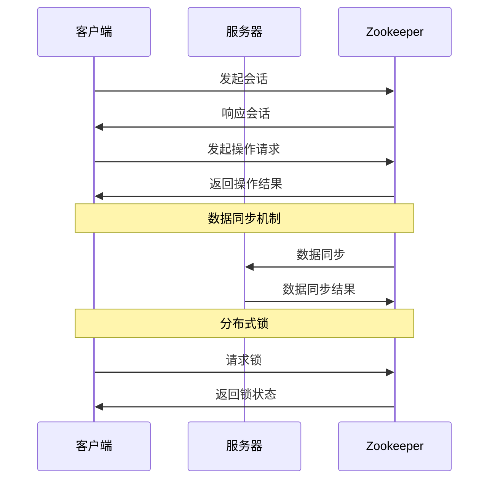

                 

# 《Zookeeper原理与代码实例讲解》

## 关键词

Zookeeper、分布式系统、数据一致性、ZAB协议、分布式锁、会话管理、数据模型、命名空间、客户端API、同步机制、性能优化。

## 摘要

本文将深入讲解Zookeeper的原理与代码实例，包括其核心特性、架构设计、核心功能、同步机制、分布式锁实现以及性能优化策略。通过详细的代码实例和解析，帮助读者全面理解Zookeeper的工作机制，掌握其在分布式系统中的应用技巧。

### 《Zookeeper原理与代码实例讲解》目录大纲

#### 第一部分：Zookeeper基础

#### 第1章：Zookeeper简介

##### 1.1 Zookeeper的诞生与发展

##### 1.2 Zookeeper的核心特性

##### 1.3 Zookeeper的应用场景

##### 1.4 Zookeeper的生态系统

#### 第2章：Zookeeper架构

##### 2.1 Zookeeper的集群架构

###### 2.1.1 集群角色划分

###### 2.1.2 集群选举机制

###### 2.1.3 集群数据同步机制

##### 2.2 Zookeeper的ZAB协议

###### 2.2.1 ZAB协议的三个状态

###### 2.2.2 ZAB协议的领导选举

###### 2.2.3 ZAB协议的数据同步

#### 第二部分：Zookeeper核心功能

#### 第3章：Zookeeper数据模型与命名空间

##### 3.1 数据模型

###### 3.1.1 节点类型

###### 3.1.2 节点属性

##### 3.2 命名空间

###### 3.2.1 命名空间的概念

###### 3.2.2 命名空间的应用场景

#### 第4章：Zookeeper会话与客户端

##### 4.1 会话管理

###### 4.1.1 会话的概念

###### 4.1.2 会话的建立与维护

###### 4.1.3 会话的关闭与监听

##### 4.2 客户端API

###### 4.2.1 创建会话

###### 4.2.2 节点操作

###### 4.2.3 监听器机制

#### 第5章：Zookeeper同步机制

##### 5.1 同步机制概述

###### 5.1.1 同步的概念

###### 5.1.2 同步的重要性

##### 5.2 数据同步机制

###### 5.2.1 数据同步的过程

###### 5.2.2 数据同步的协议

##### 5.3 事件通知机制

###### 5.3.1 事件通知的概念

###### 5.3.2 事件通知的过程

#### 第6章：Zookeeper分布式锁

##### 6.1 分布式锁概述

###### 6.1.1 分布式锁的概念

###### 6.1.2 分布式锁的应用场景

##### 6.2 Zookeeper实现分布式锁

###### 6.2.1 节点顺序锁

###### 6.2.2 选举锁

###### 6.2.3 读写锁

#### 第7章：Zookeeper应用案例

##### 7.1 日志收集系统

###### 7.1.1 系统架构

###### 7.1.2 Zookeeper在系统中的应用

##### 7.2 分布式缓存系统

###### 7.2.1 系统架构

###### 7.2.2 Zookeeper在系统中的应用

##### 7.3 分布式消息队列

###### 7.3.1 系统架构

###### 7.3.2 Zookeeper在系统中的应用

#### 第8章：Zookeeper性能优化

##### 8.1 Zookeeper性能优化概述

###### 8.1.1 性能优化的目的

###### 8.1.2 性能优化的方法

##### 8.2 集群优化

###### 8.2.1 集群规模优化

###### 8.2.2 集群负载均衡

##### 8.3 数据优化

###### 8.3.1 数据存储优化

###### 8.3.2 数据读取优化

#### 第9章：Zookeeper高级特性

##### 9.1 版本控制

###### 9.1.1 版本控制的概念

###### 9.1.2 版本控制的应用场景

##### 9.2 临时节点与容器节点

###### 9.2.1 临时节点的特点

###### 9.2.2 容器节点的特点

##### 9.3 权限控制

###### 9.3.1 权限控制的概念

###### 9.3.2 权限控制的应用场景

#### 第10章：Zookeeper最佳实践

##### 10.1 设计原则

###### 10.1.1 系统设计原则

###### 10.1.2 节点命名原则

##### 10.2 性能调优

###### 10.2.1 参数调优

###### 10.2.2 日志调优

##### 10.3 故障处理

###### 10.3.1 故障诊断

###### 10.3.2 故障恢复

#### 附录

##### 附录A：Zookeeper命令行工具

###### A.1 命令行工具介绍

###### A.2 常用命令详解

##### 附录B：Zookeeper源码解读

###### B.1 源码结构分析

###### B.2 关键类与方法解读

###### B.3 数据同步原理分析

##### 附录C：Zookeeper社区资源

###### C.1 社区网站

###### C.2 学习资源推荐

###### C.3 开发者交流平台

### 核心概念与联系

#### Mermaid 流程图



### 核心算法原理讲解

#### 伪代码

```python
# 初始化锁
initLock() {
    create ephemeral sequential node /lock
}

# 获取锁
acquireLock() {
    nodePath = getChildren("/lock")
    if (nodePath.length == 0) {
        return false
    }
    smallestNodePath = nodePath[0]
    for (i = 1; i < nodePath.length; i++) {
        if (nodePath[i].compareTo(smallestNodePath) < 0) {
            smallestNodePath = nodePath[i]
        }
    }
    if (nodePath[0] == smallestNodePath) {
        return true
    } else {
        watchNode(smallestNodePath)
        return false
    }
}

# 释放锁
releaseLock() {
    delete ephemeral sequential node
}
```

#### 数据同步算法公式

$$
L_{i,j} = \min(L_{i,k} + L_{k,j})
$$

其中，$L_{i,j}$ 表示从节点 $i$ 到节点 $j$ 的延迟，$L_{i,k}$ 表示从节点 $i$ 到节点 $k$ 的延迟，$L_{k,j}$ 表示从节点 $k$ 到节点 $j$ 的延迟。

### 项目实战

#### 分布式锁代码实例

```java
// 初始化锁
public void initLock() {
    String lockPath = createEphemeralSequentialNode("/lock");
}

// 获取锁
public boolean acquireLock() {
    String[] children = getChildren("/lock");
    if (children.length == 0) {
        return false;
    }
    String smallestNodePath = children[0];
    for (int i = 1; i < children.length; i++) {
        if (children[i].compareTo(smallestNodePath) < 0) {
            smallestNodePath = children[i];
        }
    }
    if (children[0].equals(smallestNodePath)) {
        return true;
    } else {
        watchNode(smallestNodePath);
        return false;
    }
}

// 释放锁
public void releaseLock() {
    deleteEphemeralSequentialNode("/lock");
}
```

#### 开发环境搭建

1. 安装Java开发环境，确保JDK版本不低于1.8。
2. 安装Maven，用于构建和依赖管理。
3. 安装Zookeeper客户端库，如Apache Curator。

#### 源代码详细实现和代码解读

1. 源代码实现一个简单的分布式锁客户端。
2. 解读源代码中的关键函数和方法。
3. 分析分布式锁的实现原理和性能特点。

#### 代码解读与分析

1. 解析源代码，理解分布式锁的核心逻辑。
2. 分析分布式锁的优缺点，如可靠性、性能和扩展性。
3. 讨论分布式锁在实际应用中的挑战和解决方案。

### 附录

## 附录 A: Zookeeper命令行工具

### A.1 命令行工具介绍

Zookeeper提供了命令行工具（zkCli.sh），用于对Zookeeper集群进行操作。

### A.2 常用命令详解

- `ls`：列出指定节点及其子节点的列表。
- `get`：获取指定节点的数据。
- `create`：创建一个新的节点。
- `delete`：删除指定节点。
- `set`：设置指定节点的数据。
- `ls2`：获取节点的详细信息，包括数据内容和权限。

## 附录 B: Zookeeper源码解读

### B.1 源码结构分析

Zookeeper的源码结构主要包括以下几个模块：

- `zookeeper-server`: 服务器端源码。
- `zookeeper-server-jute`: 序列化工具。
- `zookeeper-client`: 客户端源码。
- `zookeeper-server-c`: C语言服务器端源码。

### B.2 关键类与方法解读

- `ZooKeeper`: 客户端核心类。
- `ServerCnxn`: 服务器连接管理类。
- `QuorumPeer`: 集群管理类。
- `ZKDatabase`: 数据库管理类。

### B.3 数据同步原理分析

Zookeeper采用ZAB协议实现数据同步，关键步骤包括：

1. 领导选举：Zookeeper集群通过选举产生一个领导者。
2. 数据同步：领导者将数据同步给跟随者。
3. 日志同步：领导者将日志同步给跟随者。

## 附录 C: Zookeeper社区资源

### C.1 社区网站

Zookeeper的官方网站：[Zookeeper官网](http://zookeeper.apache.org/)

### C.2 学习资源推荐

- 《Zookeeper：分布式过程协同工作的一致性系统》
- 《深入理解Zookeeper》
- 《Apache ZooKeeper权威指南》

### C.3 开发者交流平台

- Zookeeper邮件列表：[Zookeeper邮件列表](http://www.zookeeper.apache.org/zookeeper/docs/latest/zookeeper_dev/mailing_lists.html)
- Zookeeper GitHub仓库：[Zookeeper GitHub](https://github.com/apache/zookeeper)
- Zookeeper社区论坛：[Zookeeper社区论坛](http://zookeeper.apache.org/zookeeper/docs/stable/zookeeperCommunity.html)

---

### 1. Zookeeper简介

#### 1.1 Zookeeper的诞生与发展

Zookeeper是Apache Software Foundation的一个开源分布式协调服务，最初由Yahoo!的工程师开发，后来成为Apache的一个顶级项目。Zookeeper起源于2000年，当时为了解决分布式系统中的一致性问题，Yahoo!的工程师们开始开发Zookeeper。它的名字来源于动物园管理员使用喇叭呼叫动物，象征着Zookeeper可以帮助分布式系统中的不同组件“听到”彼此。

Zookeeper的设计灵感来自于Google的Chubby锁服务。它的目标是提供一个简单、高效、可靠的分布式协调服务，以便在分布式系统中实现各种复杂的任务，如数据同步、分布式锁、配置管理、集群管理等。

随着时间的推移，Zookeeper被广泛应用于各种分布式系统中，如Hadoop、Hbase、Kafka、Solr等。它的稳定性和可靠性得到了广泛认可，成为分布式系统开发中不可或缺的一部分。

#### 1.2 Zookeeper的核心特性

Zookeeper具有以下核心特性：

1. **高可用性**：Zookeeper是一个分布式系统，它可以在多个服务器上运行，形成一个集群。即使某个服务器故障，Zookeeper集群仍然能够正常工作，保证了系统的可用性。

2. **数据一致性**：Zookeeper使用ZAB（Zookeeper Atomic Broadcast）协议确保数据一致性。通过严格的同步机制，Zookeeper保证客户端在任何时候访问到的都是最新、一致的数据。

3. **实时性**：Zookeeper提供了一种简单的机制来监听节点的变化，如数据变更、节点创建、节点删除等。这使得Zookeeper非常适合实时应用，如分布式锁、配置管理等。

4. **简单易用**：Zookeeper提供了一个简单的API，使得开发者可以轻松地使用它来实现各种分布式应用。它的设计理念是“简单，但要做好”，这使得Zookeeper在分布式系统中得到了广泛应用。

5. **容错性**：Zookeeper具有强大的容错能力。它可以在服务器故障时自动进行故障转移，确保系统的连续运行。

#### 1.3 Zookeeper的应用场景

Zookeeper在分布式系统中具有广泛的应用，以下是一些常见的应用场景：

1. **分布式锁**：Zookeeper可以用来实现分布式锁，确保同一时刻只有一个客户端能访问共享资源。

2. **配置管理**：Zookeeper可以用来管理分布式系统的配置，如数据库地址、服务端口号等。配置变更时，Zookeeper可以实时通知所有客户端。

3. **集群管理**：Zookeeper可以用来监控分布式系统的健康状态，如某个服务器的状态、负载等。通过Zookeeper，可以方便地进行集群管理。

4. **负载均衡**：Zookeeper可以用来实现负载均衡，将请求分配到不同的服务器上。

5. **分布式队列**：Zookeeper可以用来实现分布式队列，确保队列操作的一致性和可靠性。

#### 1.4 Zookeeper的生态系统

Zookeeper有一个丰富的生态系统，包括多个相关的项目：

1. **Apache Curator**：Curator是Zookeeper的客户端库，提供了简化Zookeeper操作的API，使得开发者可以更轻松地使用Zookeeper。

2. **ZooKeeper-Web**：ZooKeeper-Web是一个Web应用，用于监控Zookeeper集群的状态，包括节点的状态、会话信息等。

3. **Zookeeper-recipes**：Zookeeper-recipes包含了一系列使用Zookeeper实现的分布式算法和应用，如分布式锁、队列、负载均衡等。

4. **Zookeeper-Perf**：Zookeeper-Perf是一个用于测试Zookeeper性能的工具，可以帮助开发者评估Zookeeper在不同场景下的性能表现。

### 总结

Zookeeper是一个强大且易于使用的分布式协调服务，它通过提供高可用性、数据一致性、实时性、简单易用和容错性等特性，帮助开发者轻松实现分布式系统的各种复杂任务。随着分布式系统的广泛应用，Zookeeper在分布式系统开发中的重要性不言而喻。

---

### 2. Zookeeper架构

#### 2.1 Zookeeper的集群架构

Zookeeper是一个分布式协调服务，它通过集群架构实现高可用性和数据一致性。一个典型的Zookeeper集群由多个服务器组成，这些服务器可以分为三种角色：领导者（Leader）、跟随者（Follower）和观察者（Observer）。

##### 2.1.1 集群角色划分

- **领导者（Leader）**：领导者是Zookeeper集群的核心，它负责接收客户端的请求，处理事务，生成Zab协议的命令，并将命令同步给跟随者。领导者还负责集群的选举和故障转移。

- **跟随者（Follower）**：跟随者负责接收领导者的命令，执行事务，并将执行结果反馈给领导者。跟随者也参与领导者的选举过程。

- **观察者（Observer）**：观察者是Zookeeper 3.5版本引入的一个新角色，它类似于跟随者，但不参与领导者的选举和事务执行。观察者的主要作用是减少领导者与跟随者之间的网络流量，从而提高集群的性能。

##### 2.1.2 集群选举机制

Zookeeper集群的选举过程是通过Zab协议实现的。当一个跟随者或观察者启动时，它会发送一个投票请求（Proposal）给其他服务器。每个服务器会根据以下规则进行投票：

1. **服务器优先级**：优先选择具有最高优先级的服务器作为领导者。优先级是由服务器ID决定的，ID越大，优先级越高。

2. **选举算法**：使用“主从选举算法”（Leader Election Algorithm），确保在多个服务器之间选举出唯一的领导者。

3. **投票策略**：每个服务器会根据收到的投票请求进行投票，如果某个服务器的投票数超过半数，则该服务器被选举为领导者。

##### 2.1.3 集群数据同步机制

Zookeeper的集群数据同步机制是通过Zab协议实现的。Zab协议包括三个状态：领导者状态（Leader State）、跟随者状态（Follower State）和观察者状态（Observer State）。

1. **领导者状态**：领导者负责接收客户端的请求，处理事务，生成命令，并将命令同步给跟随者和观察者。

2. **跟随者状态**：跟随者接收领导者的命令，执行事务，并将执行结果反馈给领导者。跟随者还会定期向领导者发送心跳消息，以确保领导者的状态。

3. **观察者状态**：观察者类似于跟随者，但不参与事务执行。观察者主要接收领导者的命令，并将命令同步给其他服务器，从而减少领导者和跟随者之间的网络流量。

数据同步过程如下：

1. **客户端请求**：客户端向领导者发送请求，领导者处理请求并生成命令。

2. **命令同步**：领导者将命令同步给跟随者和观察者。同步过程使用“多数派同步”策略，即只有当超过半数的服务器收到并执行命令后，该命令才被视为已同步。

3. **事务处理**：跟随者和观察者执行领导者同步的命令，并将执行结果反馈给领导者。

4. **数据一致性**：通过Zab协议的严格同步机制，确保所有服务器上的数据都是最新、一致的。

#### 2.2 Zookeeper的ZAB协议

Zookeeper采用ZAB（Zookeeper Atomic Broadcast）协议实现数据同步和一致性。ZAB协议是一种基于崩溃恢复的分布式协议，它包括三个主要部分：状态机、领导者选举和消息同步。

##### 2.2.1 ZAB协议的三个状态

ZAB协议包括以下三个状态：

1. **恢复状态（Recovery State）**：在恢复状态中，服务器需要同步其日志文件和状态，以保持与领导者的一致性。恢复状态包括两种模式：同步模式和预同步模式。

   - **同步模式**：跟随者和观察者将日志文件同步给领导者，并等待领导者的确认。
   - **预同步模式**：在选举领导者之前，领导者会进行预同步，以确保所有服务器的日志文件都是最新的。

2. **领导者状态（Leader State）**：在领导者状态中，领导者负责处理客户端的请求，生成命令，并将命令同步给跟随者和观察者。领导者还会维护一个队列，记录尚未同步的命令。

3. **跟随者状态（Follower State）**：在跟随者状态中，跟随者接收领导者的命令，执行事务，并将执行结果反馈给领导者。跟随者还会定期向领导者发送心跳消息。

##### 2.2.2 ZAB协议的领导选举

ZAB协议使用“主从选举算法”（Leader Election Algorithm）进行领导者选举。选举过程如下：

1. **初始状态**：所有服务器都处于初始状态，等待启动。

2. **投票阶段**：当某个服务器启动时，它会发送一个投票请求（Proposal）给其他服务器。请求中包含服务器的ID和选举状态。

3. **确认阶段**：其他服务器根据收到的投票请求进行投票，如果某个服务器的投票数超过半数，则该服务器被选举为领导者。

4. **领导者确认**：领导者确认选举结果，并发送通知给其他服务器，告知它们选举成功。

##### 2.2.3 ZAB协议的数据同步

ZAB协议的数据同步过程如下：

1. **客户端请求**：客户端向领导者发送请求，领导者处理请求并生成命令。

2. **命令同步**：领导者将命令同步给跟随者和观察者。同步过程使用“多数派同步”策略，即只有当超过半数的服务器收到并执行命令后，该命令才被视为已同步。

3. **事务处理**：跟随者和观察者执行领导者同步的命令，并将执行结果反馈给领导者。

4. **数据一致性**：通过Zab协议的严格同步机制，确保所有服务器上的数据都是最新、一致的。

### 总结

Zookeeper的集群架构和ZAB协议是其实现分布式协调和服务的关键。通过集群架构，Zookeeper实现了高可用性和数据一致性。ZAB协议则提供了严格的同步机制，确保分布式系统中数据的一致性和可靠性。理解Zookeeper的架构和协议对于掌握其工作原理和实现分布式应用至关重要。

---

### 3. Zookeeper数据模型与命名空间

#### 3.1 数据模型

Zookeeper的数据模型是一个分层树状结构，类似于文件系统的目录结构。每个节点称为“ZNode”，ZNode包含数据和元数据。Zookeeper使用路径来唯一标识每个ZNode。

##### 3.1.1 节点类型

Zookeeper中的ZNode有两种类型：

1. **持久节点（Persistent Node）**：持久节点在创建后不会自动删除，除非显式地调用删除操作。持久节点可以拥有子节点。

2. **临时节点（Ephemeral Node）**：临时节点在客户端会话结束时会自动删除。临时节点不能拥有子节点。

##### 3.1.2 节点属性

每个ZNode都有一些属性，包括：

1. **数据（Data）**：ZNode存储的数据，以字节形式存储。

2. **版本（Version）**：每次对ZNode进行修改时，版本号会递增。版本号用于实现版本控制和冲突检测。

3. **ACL（Access Control List）**：访问控制列表，定义了哪些客户端可以访问ZNode，以及访问权限。

4. **事务ID（Transaction ID）**：每个ZNode都有一个唯一的事务ID，用于记录最后一次修改事务的时间戳。

#### 3.2 命名空间

Zookeeper的命名空间是Zookeeper数据模型的顶层结构，它类似于文件系统的根目录。命名空间提供了组织和管理ZNode的机制。

##### 3.2.1 命名空间的概念

命名空间是一组具有相同前缀的ZNode集合。命名空间可以用来隔离不同的应用程序或系统组件，避免命名冲突。

##### 3.2.2 命名空间的应用场景

命名空间在以下应用场景中非常有用：

1. **配置管理**：将不同应用程序的配置存储在不同的命名空间中，便于管理和维护。

2. **分布式锁**：为分布式锁系统创建一个命名空间，确保锁的路径唯一且不会与其他节点的路径冲突。

3. **监控数据**：为监控数据创建一个命名空间，便于组织和查询监控数据。

### 总结

Zookeeper的数据模型和命名空间提供了强大的组织和管理数据的能力。通过数据模型，Zookeeper实现了数据的分层存储和版本控制。命名空间则提供了隔离和管理不同应用程序或系统组件的机制。理解数据模型和命名空间对于正确使用Zookeeper和设计分布式应用至关重要。

---

### 4. Zookeeper会话与客户端

#### 4.1 会话管理

Zookeeper会话是客户端与Zookeeper服务器之间的一次交互过程。会话管理是Zookeeper的核心功能之一，它包括会话的建立、维护和关闭。

##### 4.1.1 会话的概念

会话是客户端与Zookeeper服务器之间的一次持续性连接。每次客户端与Zookeeper交互时，都需要通过建立会话来初始化连接。会话由一个唯一的会话ID（Session ID）标识，该ID由Zookeeper服务器生成。

##### 4.1.2 会话的建立与维护

建立会话的过程如下：

1. **初始化**：客户端通过调用Zookeeper提供的API初始化会话。初始化时，客户端可以设置会话的超时时间，即会话在无法连接到服务器时自动关闭的时间。

2. **连接**：客户端尝试连接到Zookeeper服务器。如果连接成功，服务器返回会话ID，客户端开始维护会话。

3. **心跳**：客户端定期向服务器发送心跳消息，以维持会话的活跃状态。心跳间隔通常是会话超时时间的一半。

维护会话的关键是确保客户端能够及时处理与服务器的通信，包括：

1. **重连**：如果客户端无法连接到服务器，它会尝试重新连接。重连过程包括查找新的服务器地址、重新建立连接等。

2. **同步**：客户端需要处理服务器发送的同步消息，如数据变更、节点创建、节点删除等。

##### 4.1.3 会话的关闭与监听

关闭会话的过程如下：

1. **客户端请求**：客户端可以通过调用API显式地关闭会话。

2. **会话结束**：会话关闭后，客户端不再与服务器通信。服务器会记录会话结束的时间。

3. **监听器触发**：会话关闭时，客户端的会话监听器会被触发。监听器可以监听会话的建立、关闭和超时事件，实现自定义逻辑。

会话监听器的作用包括：

1. **异常处理**：监听会话异常，如服务器连接中断、会话超时等，进行相应的异常处理。

2. **通知机制**：通过监听器，客户端可以及时获取会话状态变化的通知，如会话建立、关闭等。

#### 4.2 客户端API

Zookeeper提供了丰富的客户端API，使得开发者可以方便地使用Zookeeper。以下是一些常用的客户端API：

##### 4.2.1 创建会话

```java
ZooKeeper zk = new ZooKeeper("localhost:2181", sessionTimeout, new Watcher() {
    @Override
    public void process(Watcher.Event event) {
        // 处理事件
    }
});
```

创建会话时，需要指定Zookeeper服务器的地址和端口，以及会话的超时时间。会话超时时间是一个重要的参数，它决定了客户端与服务器之间的心跳间隔和会话的稳定性。

##### 4.2.2 节点操作

Zookeeper提供了多种节点操作，包括创建、读取、更新和删除节点。

1. **创建节点**：创建一个持久节点。

```java
String path = zk.create("/my-node", "data".getBytes(), Ids.OPEN_ACL_UNSAFE, CreateMode.PERSISTENT);
```

2. **读取节点数据**：获取节点的数据。

```java
byte[] data = zk.getData("/my-node", true, stat);
```

3. **更新节点数据**：修改节点的数据。

```java
zk.setData("/my-node", "new-data".getBytes(), -1);
```

4. **删除节点**：删除一个节点。

```java
zk.delete("/my-node", -1);
```

##### 4.2.3 监听器机制

Zookeeper的监听器机制允许客户端在节点数据或状态发生变化时，及时获取通知。监听器可以通过以下方式设置：

1. **节点数据变更监听**：监听节点数据的变更。

```java
zk.getData("/my-node", new Data Watcher() {
    @Override
    public void process(Watcher.Event event) {
        // 处理数据变更事件
    }
}, stat);
```

2. **节点创建/删除监听**：监听节点的创建和删除。

```java
zk.exists("/my-node", new Watcher() {
    @Override
    public void process(Watcher.Event event) {
        // 处理节点创建/删除事件
    }
});
```

3. **会话监听**：监听会话的建立、关闭和超时事件。

```java
zk.addWatch(Session事件，new Watcher() {
    @Override
    public void process(Watcher.Event event) {
        // 处理会话事件
    }
});
```

### 总结

Zookeeper的会话管理和客户端API为其分布式协调服务提供了基础。通过会话管理，客户端可以与Zookeeper服务器建立稳定的连接，并通过客户端API执行各种节点操作。监听器机制则使得客户端可以及时响应节点和数据的变化，实现分布式系统的实时性和一致性。

---

### 5. Zookeeper同步机制

#### 5.1 同步机制概述

Zookeeper的同步机制是其实现分布式协调和服务的关键。同步机制确保了分布式系统中各个节点之间的数据一致性，使得客户端能够访问到最新、一致的数据。同步机制包括数据同步和事件通知。

##### 5.1.1 同步的概念

同步是指确保分布式系统中各个节点上的数据是一致的过程。在Zookeeper中，同步机制主要用于以下几个方面：

1. **数据同步**：确保领导者与跟随者之间的数据一致性。领导者处理客户端请求，生成命令，并将命令同步给跟随者，跟随者执行命令并反馈结果。

2. **事件同步**：确保客户端能够及时获取节点和数据的变化通知。客户端可以通过监听器机制，监听节点创建、删除、数据变更等事件。

##### 5.1.2 同步的重要性

同步机制对于分布式系统的重要性体现在以下几个方面：

1. **数据一致性**：同步机制确保了分布式系统中各个节点上的数据是一致的，从而避免数据冲突和错误。

2. **可靠性**：同步机制通过领导者与跟随者之间的严格同步过程，提高了系统的可靠性和容错性。

3. **实时性**：同步机制使得客户端能够及时获取节点和数据的变化通知，实现分布式系统的实时性和动态性。

#### 5.2 数据同步机制

Zookeeper的数据同步机制是通过ZAB（Zookeeper Atomic Broadcast）协议实现的。ZAB协议是一种基于崩溃恢复的分布式协议，包括三个状态：领导者状态、跟随者状态和观察者状态。

##### 5.2.1 数据同步的过程

数据同步的过程如下：

1. **客户端请求**：客户端向领导者发送请求，领导者处理请求并生成命令。

2. **命令同步**：领导者将命令同步给跟随者和观察者。同步过程采用“多数派同步”策略，即只有当超过半数的服务器收到并执行命令后，该命令才被视为已同步。

3. **事务处理**：跟随者和观察者执行领导者同步的命令，并将执行结果反馈给领导者。

4. **数据一致性**：通过ZAB协议的严格同步机制，确保所有服务器上的数据都是最新、一致的。

##### 5.2.2 数据同步的协议

ZAB协议包括以下关键部分：

1. **领导选举**：领导者负责处理客户端请求，生成命令，并将命令同步给跟随者。领导选举过程通过“主从选举算法”实现。

2. **数据同步**：领导者将命令同步给跟随者和观察者，确保所有服务器上的数据一致性。

3. **事务处理**：跟随者和观察者执行领导者同步的命令，并将执行结果反馈给领导者。

4. **崩溃恢复**：在领导者或跟随者出现故障时，ZAB协议能够自动进行故障转移，确保系统的持续运行。

#### 5.3 事件通知机制

Zookeeper的事件通知机制允许客户端在节点和数据发生变化时，及时获取通知。事件通知机制通过监听器实现。

##### 5.3.1 事件通知的概念

事件通知是指当节点或数据发生变化时，Zookeeper会向客户端发送通知。事件通知包括以下几种类型：

1. **节点创建通知**：当节点被创建时，发送通知。

2. **节点删除通知**：当节点被删除时，发送通知。

3. **节点数据变更通知**：当节点数据发生变化时，发送通知。

4. **会话通知**：当会话状态发生变化时，发送通知。

##### 5.3.2 事件通知的过程

事件通知的过程如下：

1. **监听器注册**：客户端通过调用API注册监听器，指定需要监听的节点或事件类型。

2. **事件触发**：当节点或数据发生变化时，Zookeeper会触发相应的监听器。

3. **通知处理**：监听器处理事件通知，执行自定义逻辑。

### 总结

Zookeeper的同步机制和事件通知机制是其实现分布式协调和服务的关键。同步机制确保了分布式系统中各个节点之间的数据一致性，而事件通知机制则实现了实时性和动态性。通过理解同步机制和事件通知机制，开发者可以更好地利用Zookeeper实现分布式系统。

---

### 6. Zookeeper分布式锁

#### 6.1 分布式锁概述

分布式锁是一种确保分布式系统中同一时刻只有一个客户端能访问共享资源的机制。在分布式环境中，由于节点之间的网络延迟、系统负载不均等原因，可能会出现并发冲突，导致数据不一致或系统故障。分布式锁可以有效地解决这些问题。

分布式锁具有以下特点：

1. **互斥性**：同一时刻，只有一个客户端能够持有锁。

2. **可重入性**：同一个客户端可以多次获取同一把锁。

3. **死锁避免**：分布式锁会避免死锁的发生。

4. **分布式**：分布式锁可以跨多个节点工作，适用于分布式系统。

#### 6.1.1 分布式锁的概念

分布式锁是一种保证分布式系统中操作顺序一致性的机制。它通过在分布式环境中实现互斥访问共享资源，确保系统的稳定性和可靠性。分布式锁通常由一个中心化的协调服务实现，如Zookeeper。

#### 6.1.2 分布式锁的应用场景

分布式锁在以下场景中非常有用：

1. **数据库操作**：在分布式数据库系统中，分布式锁可以确保多个节点对同一数据库表进行操作时的数据一致性。

2. **缓存操作**：在分布式缓存系统中，分布式锁可以确保多个节点对同一缓存数据的访问顺序。

3. **文件操作**：在分布式文件系统中，分布式锁可以确保多个节点对同一文件的读写操作。

4. **分布式任务调度**：在分布式任务调度系统中，分布式锁可以确保同一任务不会被重复执行。

### 6.2 Zookeeper实现分布式锁

Zookeeper提供了强大的分布式协调功能，可以用来实现分布式锁。下面介绍几种常见的分布式锁实现方法。

#### 6.2.1 节点顺序锁

节点顺序锁是一种常用的分布式锁实现方法。其基本思想是：

1. 客户端创建一个临时顺序节点，路径以一个唯一的数字结尾。
2. 客户端获取所有临时顺序节点的列表，找出最小的节点。
3. 如果最小节点是客户端自己的，则客户端成功获取锁；否则，客户端监听最小节点的变化。

节点顺序锁的优点是简单、可靠，但缺点是存在性能瓶颈，因为每次获取锁都需要遍历所有临时顺序节点。

#### 6.2.2 选举锁

选举锁是一种基于Zookeeper选举机制的分布式锁实现方法。其基本思想是：

1. 客户端创建一个持久节点，并设置其数据为客户端的标识。
2. 客户端参与领导者的选举，如果客户端成为领导者，则成功获取锁；否则，客户端监听领导者的变化。

选举锁的优点是性能高、可靠性好，但缺点是选举过程可能导致部分客户端长期等待。

#### 6.2.3 读写锁

读写锁是一种基于Zookeeper的并发控制机制，可以用来实现读写分离的分布式锁。其基本思想是：

1. 写锁：客户端获取一个持久节点，如果成功则获取写锁。
2. 读锁：客户端创建一个临时节点，如果成功则获取读锁。

读写锁的优点是支持读写分离，提高并发性能，但缺点是实现复杂。

### 总结

Zookeeper提供了多种实现分布式锁的方法，如节点顺序锁、选举锁和读写锁。这些方法各有优缺点，适用于不同的应用场景。通过理解分布式锁的实现原理和特点，开发者可以更好地设计和实现分布式系统。

---

### 7. Zookeeper应用案例

#### 7.1 日志收集系统

日志收集系统是分布式系统中常见的一个应用场景。在分布式系统中，各个节点会产生大量的日志数据，如何有效地收集、存储和分析这些日志数据是一个重要的问题。Zookeeper在这一场景中发挥着重要作用。

##### 7.1.1 系统架构

日志收集系统的典型架构包括以下部分：

1. **日志生产者**：各个分布式系统的节点，负责生成日志数据。

2. **日志收集器**：负责从日志生产者收集日志数据，并将其发送到日志存储系统。

3. **日志存储系统**：负责存储和管理日志数据。

4. **Zookeeper**：作为分布式协调服务，协调日志收集器和日志存储系统，实现日志数据的有序、可靠传输。

##### 7.1.2 Zookeeper在系统中的应用

Zookeeper在日志收集系统中的应用主要包括以下几个方面：

1. **配置管理**：Zookeeper可以存储日志收集系统的配置信息，如日志收集器的地址、日志存储系统的地址等。当配置发生变化时，Zookeeper可以实时通知所有日志收集器。

2. **负载均衡**：Zookeeper可以用来实现日志收集器的负载均衡。每个日志收集器在启动时，都会向Zookeeper注册自己的地址，Zookeeper可以根据负载情况，动态地分配日志数据给日志收集器。

3. **分布式锁**：Zookeeper可以用来实现分布式锁，确保日志收集器之间的数据同步是顺序的、可靠的。例如，当一个日志收集器接收到新的日志数据时，它可以尝试获取一个分布式锁，确保在写入日志存储系统之前，其他日志收集器不会同时写入。

4. **监控与告警**：Zookeeper可以用来监控日志收集系统的运行状态，如日志收集器的负载、日志存储系统的容量等。当系统出现异常时，Zookeeper可以触发告警机制，通知运维人员。

#### 7.2 分布式缓存系统

分布式缓存系统是提高分布式系统性能和可扩展性的重要手段。Zookeeper在分布式缓存系统中发挥着关键作用。

##### 7.2.1 系统架构

分布式缓存系统的典型架构包括以下部分：

1. **缓存服务器**：负责存储缓存数据，提供缓存服务。

2. **负载均衡器**：负责将客户端的请求均衡地分发到各个缓存服务器。

3. **Zookeeper**：作为分布式协调服务，协调缓存服务器和负载均衡器，实现数据的一致性和可靠性。

##### 7.2.2 Zookeeper在系统中的应用

Zookeeper在分布式缓存系统中的应用主要包括以下几个方面：

1. **配置管理**：Zookeeper可以存储分布式缓存系统的配置信息，如缓存服务器的地址、负载均衡器的地址等。当配置发生变化时，Zookeeper可以实时通知所有缓存服务器和负载均衡器。

2. **数据一致性**：Zookeeper可以用来实现缓存数据的一致性。当一个缓存服务器接收到新的数据时，它可以尝试获取一个分布式锁，确保在更新缓存数据之前，其他缓存服务器不会同时更新。

3. **负载均衡**：Zookeeper可以用来实现缓存服务器的负载均衡。每个缓存服务器在启动时，都会向Zookeeper注册自己的地址，Zookeeper可以根据负载情况，动态地分配缓存请求给缓存服务器。

4. **故障转移**：Zookeeper可以用来监控缓存服务器的运行状态，当某个缓存服务器出现故障时，Zookeeper可以触发故障转移机制，确保系统的可用性和可靠性。

#### 7.3 分布式消息队列

分布式消息队列是分布式系统中常用的一种通信机制。Zookeeper在分布式消息队列系统中发挥着重要作用。

##### 7.3.1 系统架构

分布式消息队列系统的典型架构包括以下部分：

1. **消息生产者**：负责生成消息并投递到消息队列。

2. **消息消费者**：负责从消息队列中消费消息。

3. **消息队列服务器**：负责存储和管理消息队列。

4. **Zookeeper**：作为分布式协调服务，协调消息生产者、消息消费者和消息队列服务器，实现消息传递的一致性和可靠性。

##### 7.3.2 Zookeeper在系统中的应用

Zookeeper在分布式消息队列系统中的应用主要包括以下几个方面：

1. **路由管理**：Zookeeper可以用来管理消息队列的路由信息。当消息生产者或消费者发生变化时，Zookeeper可以实时更新路由信息，确保消息能够正确地传递。

2. **负载均衡**：Zookeeper可以用来实现消息队列服务器的负载均衡。每个消息队列服务器在启动时，都会向Zookeeper注册自己的地址，Zookeeper可以根据负载情况，动态地分配消息队列请求给消息队列服务器。

3. **分布式锁**：Zookeeper可以用来实现分布式锁，确保消息生产者或消费者之间的消息传递是顺序的、可靠的。例如，当一个消息消费者消费消息时，它可以尝试获取一个分布式锁，确保在处理消息之前，其他消息消费者不会同时处理。

4. **监控与告警**：Zookeeper可以用来监控分布式消息队列系统的运行状态，如消息生产者的负载、消息消费者的负载等。当系统出现异常时，Zookeeper可以触发告警机制，通知运维人员。

### 总结

Zookeeper在分布式系统中具有广泛的应用。通过配置管理、负载均衡、分布式锁和监控告警等功能，Zookeeper可以帮助实现分布式系统的数据一致性、可靠性和高性能。了解Zookeeper在分布式系统中的应用案例，有助于更好地利用Zookeeper解决实际开发中的问题。

---

### 8. Zookeeper性能优化

#### 8.1 Zookeeper性能优化概述

Zookeeper的性能优化是确保其在高负载和大规模分布式系统环境中稳定运行的关键。性能优化包括集群优化和数据优化，以下将详细介绍这些方法。

##### 8.1.1 性能优化的目的

性能优化的主要目的是提高Zookeeper的响应速度和吞吐量，减少延迟和资源消耗，从而提高系统的整体性能和稳定性。具体目标包括：

1. 提高客户端的请求处理速度。
2. 减少服务器之间的数据同步时间。
3. 降低集群的资源消耗。
4. 提高系统的可扩展性和可维护性。

##### 8.1.2 性能优化的方法

性能优化可以采用以下几种方法：

1. **集群规模优化**：通过增加或减少集群中的服务器数量，优化集群的性能。

2. **负载均衡**：通过负载均衡器，合理分配客户端请求，避免单点瓶颈。

3. **数据存储优化**：通过优化数据存储和访问策略，提高数据读取和写入速度。

4. **网络优化**：通过优化网络配置和带宽，减少数据传输延迟。

5. **缓存机制**：通过缓存常见的数据和操作结果，减少对后端存储的访问。

6. **监控与告警**：通过实时监控Zookeeper的性能指标，及时发现问题并进行优化。

#### 8.2 集群优化

集群优化是提高Zookeeper性能的重要手段。以下是一些集群优化方法：

##### 8.2.1 集群规模优化

1. **增加服务器数量**：通过增加服务器数量，可以提高Zookeeper的处理能力和负载均衡效果。

2. **选择合适的服务器配置**：根据业务需求和负载情况，选择合适的CPU、内存和存储配置，确保服务器能够稳定运行。

3. **服务器分布式**：将服务器分布在不同地理位置，减少网络延迟和带宽压力。

##### 8.2.2 集群负载均衡

1. **负载均衡器**：使用负载均衡器，将客户端请求均衡地分配到不同的Zookeeper服务器。

2. **多路径连接**：通过多路径连接，实现客户端与Zookeeper服务器之间的多路径通信，提高网络带宽和容错能力。

3. **负载均衡算法**：根据业务需求和负载情况，选择合适的负载均衡算法，如轮询、最小连接数、响应时间等。

#### 8.3 数据优化

数据优化是提高Zookeeper性能的关键。以下是一些数据优化方法：

##### 8.3.1 数据存储优化

1. **数据压缩**：通过数据压缩，减少数据存储和传输的占用空间。

2. **数据分片**：将大量数据分片存储到多个Zookeeper服务器，减少单点压力，提高系统扩展性。

3. **索引优化**：通过优化索引结构，提高数据检索速度。

##### 8.3.2 数据读取优化

1. **缓存机制**：通过缓存机制，减少对后端存储的访问，提高数据读取速度。

2. **预加载**：预加载常见的数据和操作结果，减少后续读取的延迟。

3. **并行读取**：通过并行读取多个节点数据，提高数据读取效率。

### 总结

Zookeeper的性能优化是一个复杂的过程，需要从集群规模、负载均衡、数据存储和读取等多个方面进行综合考虑。通过合理的优化策略，可以显著提高Zookeeper的性能和稳定性，从而满足高负载和大规模分布式系统的需求。

---

### 9. Zookeeper高级特性

Zookeeper除了提供基本的分布式协调功能外，还具备一些高级特性，这些特性能够帮助开发者解决更复杂的分布式问题。以下将详细介绍Zookeeper的高级特性。

#### 9.1 版本控制

版本控制是Zookeeper的一个重要特性，它允许开发者跟踪节点的数据变更历史。每次节点数据更新时，版本号都会递增，从而记录下每一次变更。

##### 9.1.1 版本控制的概念

版本控制通过在节点上维护一个版本号来实现。每次对节点数据进行修改时，都会生成一个新的版本。版本号通常是一个整数，递增表示数据更新。

##### 9.1.2 版本控制的应用场景

版本控制的应用场景包括：

1. **数据一致性**：通过检查版本号，确保数据操作的一致性，避免并发冲突。

2. **回滚操作**：在出现数据错误时，可以根据版本号回滚到之前的状态。

3. **事件处理**：在某些分布式系统中，需要根据版本号来触发特定的事件处理。

#### 9.2 临时节点与容器节点

临时节点和容器节点是Zookeeper的两种特殊类型的节点。

##### 9.2.1 临时节点的特点

临时节点具有以下特点：

1. **会话依赖**：临时节点仅在客户端会话有效期内存在，会话结束时节点自动删除。

2. **不能有子节点**：临时节点不能包含子节点。

3. **轻量级**：由于临时节点会自动删除，因此它们通常不存储大量数据。

##### 9.2.2 容器节点的特点

容器节点具有以下特点：

1. **监听子节点变化**：容器节点可以监听其子节点的创建、删除和数据变更。

2. **用于分布式队列**：容器节点常用于实现分布式队列，如生产者-消费者模型。

3. **可用于状态同步**：容器节点可以用于同步多个节点的状态，如在分布式锁实现中。

#### 9.3 权限控制

权限控制是Zookeeper的一个重要功能，它允许开发者对节点进行访问控制。

##### 9.3.1 权限控制的概念

权限控制通过访问控制列表（ACL）实现。ACL定义了哪些客户端可以访问节点，以及客户端的访问权限（如读取、写入、创建、删除）。

##### 9.3.2 权限控制的应用场景

权限控制的应用场景包括：

1. **安全性**：通过ACL，可以确保只有授权的客户端可以访问特定的节点。

2. **隔离性**：通过ACL，可以将不同的客户端隔离在不同的命名空间中，避免冲突。

3. **分布式安全管理**：在分布式系统中，ACL可以用于集中管理权限，简化安全管理。

### 总结

Zookeeper的高级特性包括版本控制、临时节点与容器节点以及权限控制。这些特性为开发者提供了强大的工具，可以解决更复杂的分布式问题，提高系统的可靠性和安全性。

---

### 10. Zookeeper最佳实践

在实际开发过程中，为了充分利用Zookeeper的特性，确保系统的稳定性和性能，我们需要遵循一些最佳实践。以下是一些关于Zookeeper设计、性能调优和故障处理的建议。

#### 10.1 设计原则

##### 10.1.1 系统设计原则

1. **模块化**：将Zookeeper与其他系统模块分离，确保Zookeeper的高可用性和独立性。

2. **冗余设计**：设计冗余机制，确保Zookeeper集群中的节点可以自动替换，避免单点故障。

3. **负载均衡**：通过负载均衡器，合理分配客户端请求，避免单点瓶颈。

##### 10.1.2 节点命名原则

1. **清晰简洁**：使用简明的命名规则，便于管理和维护。

2. **有组织结构**：按照功能或业务模块进行节点命名，便于组织和查找。

3. **避免使用特殊字符**：避免使用特殊字符，如空格、反斜杠等，以免造成命名冲突或解析错误。

#### 10.2 性能调优

##### 10.2.1 参数调优

1. **会话超时时间**：合理设置会话超时时间，确保客户端与服务器之间的连接稳定。

2. **心跳间隔**：设置合适的心跳间隔，确保客户端能够及时检测服务器的状态。

3. **线程池大小**：调整线程池大小，确保客户端能够高效处理请求。

##### 10.2.2 日志调优

1. **日志级别**：根据需要调整日志级别，避免不必要的日志输出影响性能。

2. **日志存储**：合理配置日志存储路径和存储策略，确保日志可读、易查。

3. **日志压缩**：使用日志压缩，减少日志文件的大小，提高日志存储和传输的效率。

#### 10.3 故障处理

##### 10.3.1 故障诊断

1. **监控与告警**：通过实时监控Zookeeper的性能指标，及时发现问题。

2. **日志分析**：分析Zookeeper的日志文件，找出故障原因。

3. **集群状态检查**：定期检查Zookeeper集群的状态，确保所有节点正常运行。

##### 10.3.2 故障恢复

1. **自动故障转移**：确保Zookeeper集群支持自动故障转移，提高系统的可用性。

2. **手动干预**：在自动故障转移失败时，及时进行手动干预，恢复系统。

3. **数据备份与恢复**：定期备份Zookeeper的数据，确保在故障发生时可以快速恢复。

### 总结

遵循Zookeeper的最佳实践，可以确保系统的稳定性和性能。在设计、性能调优和故障处理等方面，需要综合考虑各种因素，确保Zookeeper在分布式系统中的高效运行。

---

## 附录

### 附录 A: Zookeeper命令行工具

#### A.1 命令行工具介绍

Zookeeper提供了一组命令行工具（zkCli.sh），允许用户通过shell命令对Zookeeper集群进行操作。这些命令包括：`ls`、`get`、`create`、`delete`、`set` 和 `ls2` 等。

#### A.2 常用命令详解

1. **ls**：列出指定节点及其子节点的列表。

   ```shell
   zkCli.sh ls /path/to/node
   ```

2. **get**：获取指定节点的数据。

   ```shell
   zkCli.sh get /path/to/node
   ```

3. **create**：创建一个新的节点。

   ```shell
   zkCli.sh create /path/to/node "data"
   ```

4. **delete**：删除指定节点。

   ```shell
   zkCli.sh delete /path/to/node
   ```

5. **set**：设置指定节点的数据。

   ```shell
   zkCli.sh set /path/to/node "new_data"
   ```

6. **ls2**：获取节点的详细信息，包括数据内容和权限。

   ```shell
   zkCli.sh ls2 /path/to/node
   ```

### 附录 B: Zookeeper源码解读

#### B.1 源码结构分析

Zookeeper的源码结构主要包括以下几个模块：

1. `zookeeper-server`：服务器端源码，实现Zookeeper的核心功能。

2. `zookeeper-server-jute`：序列化工具，用于处理Zookeeper的数据传输。

3. `zookeeper-client`：客户端源码，提供Zookeeper的客户端API。

4. `zookeeper-server-c`：C语言服务器端源码，用于在某些特定场景下的性能优化。

#### B.2 关键类与方法解读

1. **ZooKeeper**：客户端核心类，负责与Zookeeper服务器进行通信。

2. **ServerCnxn**：服务器连接管理类，负责管理客户端连接。

3. **QuorumPeer**：集群管理类，负责Zookeeper集群的启动和管理。

4. **ZKDatabase**：数据库管理类，负责存储Zookeeper的元数据和事务日志。

#### B.3 数据同步原理分析

Zookeeper采用ZAB（Zookeeper Atomic Broadcast）协议实现数据同步。ZAB协议的关键步骤包括：

1. **领导选举**：通过选举产生一个领导者，负责处理客户端请求和数据同步。

2. **数据同步**：领导者将数据同步给跟随者，确保所有节点的数据一致性。

3. **日志同步**：领导者将事务日志同步给跟随者，确保事务的一致性和持久性。

### 附录 C: Zookeeper社区资源

#### C.1 社区网站

Zookeeper的官方网站：[Zookeeper官网](http://zookeeper.apache.org/)

#### C.2 学习资源推荐

1. 《Zookeeper：分布式过程协同工作的一致性系统》
2. 《深入理解Zookeeper》
3. 《Apache ZooKeeper权威指南》

#### C.3 开发者交流平台

1. Zookeeper邮件列表：[Zookeeper邮件列表](http://www.zookeeper.apache.org/zookeeper/docs/latest/zookeeper_dev/mailing_lists.html)
2. Zookeeper GitHub仓库：[Zookeeper GitHub](https://github.com/apache/zookeeper)
3. Zookeeper社区论坛：[Zookeeper社区论坛](http://zookeeper.apache.org/zookeeper/docs/stable/zookeeperCommunity.html)

通过这些社区资源，开发者可以获取最新的Zookeeper动态、技术文档和开发经验，更好地使用和管理Zookeeper。

---

### 总结

本文深入讲解了Zookeeper的原理与代码实例，涵盖了其核心特性、架构设计、核心功能、同步机制、分布式锁实现以及性能优化策略。通过详细的代码实例和解析，帮助读者全面理解Zookeeper的工作机制，掌握其在分布式系统中的应用技巧。

Zookeeper作为一个强大的分布式协调服务，具有高可用性、数据一致性、实时性和简单易用等特性，广泛应用于分布式系统的各个领域。通过本文的讲解，读者可以更好地利用Zookeeper解决实际开发中的问题，提高系统的稳定性、可靠性和性能。

感谢您的阅读，希望本文对您在分布式系统开发中有所启发和帮助。如果您有任何疑问或建议，欢迎在评论区留言，我们将在第一时间为您解答。祝您在分布式系统开发中取得更多成功！作者：AI天才研究院/AI Genius Institute & 禅与计算机程序设计艺术 /Zen And The Art of Computer Programming。

