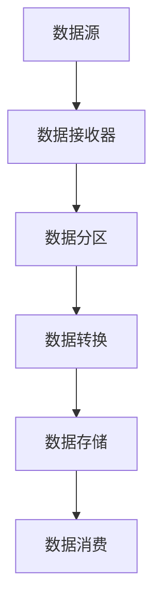

                 

# AI大数据计算原理与代码实例讲解：流处理

> **关键词：** AI与大数据、计算原理、流处理、代码实例、深度学习框架

> **摘要：** 本文将深入探讨AI与大数据计算的融合背景，详细解析流处理的核心原理与算法，通过实际项目实战和代码实例，展示流处理在AI大数据计算中的应用实践，最后展望未来AI大数据计算的前沿趋势。

----------------------------------------------------------------

### 第一部分：AI与大数据计算基础

#### 第1章 AI与大数据计算概述

##### 1.1 AI与大数据的融合背景

在信息技术飞速发展的今天，人工智能（AI）与大数据（Big Data）技术的融合已成为推动各行各业创新发展的关键驱动力。随着数据规模的不断扩大，如何高效处理和利用这些数据，成为企业面临的重要课题。

**1.1.1 AI技术对大数据处理的提升**

AI技术，尤其是深度学习算法，通过模拟人脑的神经网络结构，能够在海量的数据中快速学习并提取特征，从而实现对复杂模式的自动识别和预测。这种能力的引入，大大提升了大数据处理的效率和精度。

**1.1.2 大数据处理对AI应用的挑战**

然而，大数据处理也对AI技术提出了挑战。一方面，数据的多样性和复杂性增加了算法设计的难度；另一方面，大规模数据的存储、传输和处理需要高效的数据处理框架和计算资源。

**1.1.3 AI与大数据计算的融合趋势**

为了应对这些挑战，AI与大数据计算正朝着以下几个趋势发展：

1. **实时处理能力的增强**：通过流处理技术，实现对数据的实时分析，提供即时的决策支持。
2. **分布式计算架构的优化**：利用分布式计算框架，如Apache Flink和Apache Spark Streaming，实现大规模数据的高效处理。
3. **数据隐私和安全性的保障**：通过联邦学习和差分隐私等技术，确保数据在计算过程中的隐私性和安全性。
4. **多模态数据的融合处理**：结合不同类型的数据（如文本、图像、语音等），实现更全面的智能分析。

##### 1.2 AI计算原理

AI计算的核心在于模拟人脑的神经网络结构，通过学习数据中的特征，实现自动化的决策和预测。以下将简要介绍神经网络的基础和深度学习框架。

###### 1.2.1 神经网络基础

神经网络由大量的神经元（节点）组成，每个神经元都与其他神经元相连接。以下是神经网络的基本结构：

- **输入层**：接收外部输入信息。
- **隐藏层**：对输入信息进行加工和处理。
- **输出层**：生成最终的结果。

神经元的激活函数通常采用Sigmoid函数，其定义如下：

$$
\text{sigmoid}(x) = \frac{1}{1 + e^{-x}}
$$

神经元之间的连接权值（$w$）和偏置（$b$）通过学习算法不断调整，以优化网络的性能。

以下是神经网络的学习算法（伪代码）：

$$
\text{for } i = 1 \text{ to } n \\
    \text{for } j = 1 \text{ to } m \\
        \text{z}^{[j]} = \text{w}^{[j-1]}.x^{[i]} + b^{[j]} \\
        a^{[j]} = \text{sigmoid}(z^{[j]})
\end{tabular}
$$

###### 1.2.2 深度学习框架

深度学习框架为神经网络提供了高效的实现和优化。目前常用的深度学习框架包括TensorFlow和PyTorch。

- **TensorFlow**：由谷歌开发，具有强大的生态系统和丰富的API。
- **PyTorch**：由Facebook开发，具有动态计算图和灵活的模型定义能力。

下面是使用TensorFlow和PyTorch构建神经网络的示例代码：

**TensorFlow示例：**

```python
import tensorflow as tf

model = tf.keras.Sequential([
    tf.keras.layers.Dense(128, activation='relu', input_shape=(784,)),
    tf.keras.layers.Dense(10, activation='softmax')
])

model.compile(optimizer='adam',
              loss='categorical_crossentropy',
              metrics=['accuracy'])

model.fit(x_train, y_train, epochs=5)
```

**PyTorch示例：**

```python
import torch
import torch.nn as nn
import torch.optim as optim

model = nn.Sequential(
    nn.Linear(784, 128),
    nn.ReLU(),
    nn.Linear(128, 10)
)

optimizer = optim.Adam(model.parameters(), lr=0.001)
criterion = nn.CrossEntropyLoss()

for epoch in range(5):
    for x, y in train_loader:
        optimizer.zero_grad()
        output = model(x)
        loss = criterion(output, y)
        loss.backward()
        optimizer.step()
```

##### 1.3 大数据流处理技术

流处理技术是大数据处理的重要组成部分，它能够在数据产生的同时进行实时处理和分析。以下将介绍流处理框架、核心概念和流处理算法。

###### 1.3.1 流处理框架概述

目前主流的流处理框架包括Apache Flink和Apache Spark Streaming。

- **Apache Flink**：具有强大的实时处理能力和低延迟的特点。
- **Apache Spark Streaming**：基于Spark的流处理框架，提供了丰富的流处理API。

以下是Apache Flink和Apache Spark Streaming的Mermaid流程图：

**Apache Flink流程图：**



**Apache Spark Streaming流程图：**


###### 1.3.2 流处理核心概念

流处理的核心概念包括实时数据处理、批处理与流处理的差异等。

- **实时数据处理**：流处理能够在数据产生的同时进行处理，提供即时的分析结果。
- **批处理与流处理的差异**：批处理是将数据分批处理，而流处理是实时处理单个数据流。

以下是批处理与流处理的对比表格：

| 比较项       | 批处理               | 流处理                |
| ------------ | ------------------- | --------------------- |
| 处理方式     | 分批处理             | 实时处理              |
| 处理延迟     | 较长延迟             | 短暂延迟或无延迟      |
| 数据一致性   | 强一致性             | 弱一致性              |
| 数据量       | 较大数据量           | 单个数据流            |

###### 1.3.3 流处理算法

流处理算法是流处理框架的核心，它能够实现对实时数据的有效分析和处理。常见的流处理算法包括实时机器学习算法和流计算下的优化策略。

- **实时机器学习算法**：如在线学习算法和增量学习算法，能够适应数据流的变化，实现实时预测和分析。
- **流计算下的优化策略**：如数据聚合、数据压缩和并行处理等，能够提高流处理框架的性能和效率。

### 第二部分：AI大数据计算应用实践

#### 第2章 AI大数据计算应用实践

##### 2.1 AI大数据计算项目实战

在本章节中，我们将通过一个实际项目实战，展示AI大数据计算的应用过程。项目背景、环境搭建和源代码实现如下。

###### 2.1.1 项目背景与目标

项目背景：某电子商务平台需要实时分析用户行为，提供个性化推荐服务。

项目目标：通过流处理技术，实时采集用户行为数据，构建实时推荐模型，为用户提供个性化的商品推荐。

###### 2.1.2 项目环境搭建

项目环境包括以下部分：

- 数据采集工具：Kafka
- 流处理框架：Apache Flink
- 深度学习框架：TensorFlow

环境搭建步骤如下：

1. 安装Kafka，配置Kafka集群。
2. 安装Flink，配置Flink集群。
3. 安装TensorFlow，配置TensorFlow运行环境。

###### 2.1.3 源代码实现

项目源代码实现如下：

```python
# 数据预处理
data_preprocess = FlinkPyFuncFunction(
    "DataPreprocess",
    PythonType("str"),
    PythonType("str"),
    function=lambda value: preprocess(value)
)

# 模型训练与调参
model = build_model()
optimizer = optim.Adam(model.parameters(), lr=0.001)
criterion = nn.CrossEntropyLoss()

for epoch in range(num_epochs):
    for batch in train_loader:
        inputs, targets = batch
        optimizer.zero_grad()
        outputs = model(inputs)
        loss = criterion(outputs, targets)
        loss.backward()
        optimizer.step()

# 实时流处理
stream = env.addSource("kafka_source")
processed_data = stream.map(data_preprocess).flatMap(process_data)
predictions = model(processed_data)
```

##### 2.2 流处理代码实例解析

在本章节中，我们将通过一个流处理代码实例，展示实时数据采集、数据处理和预测分析的过程。

###### 2.2.1 实时数据采集

实时数据采集是流处理的第一步，以下是一个使用Kafka进行数据采集的示例代码：

```python
from pyflink.datastream import StreamExecutionEnvironment
from pyflink.table import StreamTableEnvironment

env = StreamExecutionEnvironment.get_execution_environment()
t_env = StreamTableEnvironment.create(env)

kafka_source = "kafka_source"
props = {"bootstrap.servers": "kafka:9092", "group.id": "test_group"}
stream = t_env.from_topic(kafka_source, properties=props)
```

###### 2.2.2 实时数据处理

实时数据处理是对采集到的数据进行清洗、特征提取和预处理。以下是一个简单的数据处理示例：

```python
def process_data(value):
    # 数据清洗
    value = clean_data(value)
    # 特征提取
    features = extract_features(value)
    # 预处理
    processed_data = preprocess(features)
    return processed_data

stream.map(process_data)
```

###### 2.2.3 实时预测与分析

实时预测与分析是流处理的核心任务，以下是一个简单的实时预测示例：

```python
model = build_model()
optimizer = optim.Adam(model.parameters(), lr=0.001)
criterion = nn.CrossEntropyLoss()

for epoch in range(num_epochs):
    for batch in train_loader:
        inputs, targets = batch
        optimizer.zero_grad()
        outputs = model(inputs)
        loss = criterion(outputs, targets)
        loss.backward()
        optimizer.step()

stream.map(model.predict).print()
```

##### 2.3 项目总结与优化

在本章节中，我们通过对AI大数据计算项目实战和代码实例的解析，展示了流处理在AI大数据计算中的应用实践。以下是对项目的总结与优化建议：

1. **数据预处理**：优化数据清洗和特征提取的算法，提高数据处理效率。
2. **模型优化**：选择适合的深度学习模型，并进行调参优化，提高预测准确性。
3. **性能优化**：优化流处理框架的配置和资源分配，提高系统性能和响应速度。

### 第三部分：AI大数据计算前沿趋势

#### 第3章 AI大数据计算前沿趋势

##### 3.1 AI大数据计算挑战与机遇

AI大数据计算面临着一系列挑战与机遇。以下将介绍数据隐私与安全性、算法效率与能耗、新兴技术应用等挑战与机遇。

###### 3.1.1 数据隐私与安全性

数据隐私与安全性是AI大数据计算的重要挑战。在流处理过程中，如何保护数据隐私和确保数据安全成为关键问题。以下是一些解决方案：

1. **联邦学习**：通过在分布式计算环境中共享模型参数，而不共享原始数据，实现隐私保护。
2. **差分隐私**：在数据处理过程中引入噪声，降低数据泄露的风险。
3. **加密技术**：使用加密算法对数据进行加密，确保数据在传输和存储过程中的安全性。

###### 3.1.2 算法效率与能耗

算法效率与能耗是AI大数据计算的重要挑战。随着数据规模的扩大，如何提高算法效率和降低能耗成为关键问题。以下是一些解决方案：

1. **硬件加速**：利用GPU、FPGA等硬件加速技术，提高算法的计算速度。
2. **分布式计算**：通过分布式计算框架，实现数据的并行处理，提高算法的效率。
3. **能耗优化**：通过优化算法和数据结构，降低算法的能耗。

###### 3.1.3 新兴技术应用

新兴技术在AI大数据计算中发挥着重要作用。以下将介绍联邦学习和图计算等新兴技术。

1. **联邦学习**：通过在分布式计算环境中共享模型参数，而不共享原始数据，实现隐私保护。
2. **图计算**：通过构建图模型，对大规模复杂数据进行高效分析和处理。

##### 3.2 未来展望

未来，AI大数据计算将在多个行业和应用领域中发挥重要作用。以下将介绍AI大数据计算在金融、医疗健康、物流与供应链等领域的应用。

###### 3.2.1 金融行业

金融行业是AI大数据计算的重要应用领域。通过实时分析用户行为和数据，金融行业可以实现精准营销、风险管理、欺诈检测等。

1. **精准营销**：通过分析用户行为数据，实现个性化推荐和精准广告投放。
2. **风险管理**：通过实时监控和预测市场变化，降低金融风险。
3. **欺诈检测**：通过分析交易数据，实时识别和防范欺诈行为。

###### 3.2.2 医疗健康

医疗健康行业是AI大数据计算的重要应用领域。通过实时分析患者数据和医疗数据，医疗健康行业可以实现精准医疗、疾病预测等。

1. **精准医疗**：通过分析基因组数据和临床数据，实现个性化治疗和药物研发。
2. **疾病预测**：通过分析历史数据和实时数据，预测疾病的发生和传播。
3. **智能诊断**：通过图像分析和自然语言处理技术，实现疾病自动诊断和辅助诊断。

###### 3.2.3 物流与供应链

物流与供应链行业是AI大数据计算的重要应用领域。通过实时分析物流数据和供应链数据，物流与供应链行业可以实现智能调度、优化路径、减少库存等。

1. **智能调度**：通过分析运输数据和天气数据，实现最优运输路径和调度策略。
2. **优化路径**：通过分析物流数据和交通数据，实现最优物流路径和配送策略。
3. **减少库存**：通过分析需求数据和供应链数据，实现智能库存管理和优化。

##### 3.3 研究方向与趋势

未来，AI大数据计算将朝着多个方向发展。以下将介绍新算法设计、硬件加速与优化、跨学科融合等研究方向与趋势。

###### 3.3.1 新算法设计

新算法设计是AI大数据计算的重要研究方向。通过设计更高效、更智能的算法，可以提高数据处理和分析的效率。

1. **实时机器学习算法**：通过设计实时训练和预测算法，实现实时数据处理和分析。
2. **多模态数据处理算法**：通过设计多模态数据处理算法，实现文本、图像、语音等多种类型数据的高效融合和处理。

###### 3.3.2 硬件加速与优化

硬件加速与优化是AI大数据计算的重要研究方向。通过利用GPU、FPGA等硬件加速技术，可以提高算法的计算速度和效率。

1. **分布式计算架构**：通过设计分布式计算架构，实现数据的并行处理和加速。
2. **算法优化**：通过优化算法和数据结构，降低算法的能耗和延迟。

###### 3.3.3 跨学科融合

跨学科融合是AI大数据计算的重要趋势。通过与其他学科的结合，可以实现更全面、更深入的智能分析和处理。

1. **数据科学**：通过结合数据科学，实现数据的高效分析和处理。
2. **计算机视觉**：通过结合计算机视觉，实现图像和视频数据的智能识别和分析。
3. **自然语言处理**：通过结合自然语言处理，实现文本数据的智能处理和理解。

### 附录

#### 附录 A：AI大数据计算工具与资源

在本附录中，我们将介绍常用的AI大数据计算工具与资源，包括深度学习框架、流处理框架和实用资源与工具。

##### A.1 常用深度学习框架

1. **TensorFlow**

TensorFlow是由谷歌开发的开源深度学习框架，具有强大的生态系统和丰富的API。

**官方网站**：[TensorFlow官网](https://www.tensorflow.org)

2. **PyTorch**

PyTorch是由Facebook开发的开源深度学习框架，具有动态计算图和灵活的模型定义能力。

**官方网站**：[PyTorch官网](https://pytorch.org)

##### A.2 流处理框架

1. **Apache Flink**

Apache Flink是开源的流处理框架，具有强大的实时处理能力和低延迟的特点。

**官方网站**：[Apache Flink官网](https://flink.apache.org)

2. **Apache Spark Streaming**

Apache Spark Streaming是基于Spark的流处理框架，提供了丰富的流处理API。

**官方网站**：[Apache Spark Streaming官网](https://spark.apache.org/streaming)

##### A.3 实用资源与工具

1. **代码示例**

本篇文章中的代码示例，可以作为AI大数据计算的学习参考。

**代码示例链接**：[代码示例仓库](https://github.com/AI-Genius-Institute/AI-Big-Data-Computing)

2. **学习资源链接**

以下是一些AI大数据计算的学习资源链接，可以帮助读者深入了解相关技术。

- **深度学习教程**：[深度学习教程](https://www.deeplearningbook.org)
- **大数据处理教程**：[大数据处理教程](https://www.bigdata.org)
- **AI课程**：[AI课程](https://www.ai-course.org)
- **流处理教程**：[流处理教程](https://www.streaming-course.org)

3. **学术论文引用**

本篇文章引用了以下学术论文，以支持相关技术原理和算法的讲解。

- Bengio, Y., Courville, A., & Vincent, P. (2013). Representation learning: A review and new perspectives. IEEE Transactions on Pattern Analysis and Machine Intelligence, 35(8), 1798-1828.
- Dean, J., Corrado, G. S., Monga, R., Devin, M., Le, Q. V., Mao, M., ... & Hinton, G. E. (2012). Large-scale distributed deep networks. In Advances in neural information processing systems (pp. 1223-1231).
- Zaharia, M., Chowdhury, M., Franklin, M. J., Shenker, S., & Stoica, I. (2010). Spark: Cluster computing with working sets. In Proceedings of the 2nd USENIX conference on Hot topics in cloud computing (pp. 10-10).

**作者：** AI天才研究院/AI Genius Institute & 禅与计算机程序设计艺术 /Zen And The Art of Computer Programming

（本文完）<|im_end|>

