                 

# 一人公司的品牌个性塑造与视觉识别

关键词：品牌个性、视觉识别、一人公司、设计原则、实战案例

摘要：本文深入探讨了一人公司品牌个性塑造与视觉识别的重要性。通过理论分析、设计原则、实战案例和未来趋势的讨论，为一人公司提供了全面、实用的品牌塑造策略，助力其在竞争激烈的市场中脱颖而出。

## 第1章 引言与背景

### 1.1 书籍目的与重要性

在当今高度竞争的商业环境中，品牌个性塑造和视觉识别设计已成为企业成功的关键因素。对于一人公司而言，品牌个性塑造与视觉识别设计尤为重要。本章节旨在为读者提供全面的品牌个性塑造与视觉识别设计的理论指导和实战经验，帮助一人公司在激烈的市场竞争中脱颖而出。

### 1.2 一人公司概述

一人公司，顾名思义，是由一个人创立和管理的公司。这种公司形式灵活性强，管理成本低，易于操作。然而，在品牌建设方面，一人公司面临着诸多挑战，如品牌认知度低、市场竞争激烈等。因此，品牌个性塑造和视觉识别设计成为一人公司突破困境的关键。

### 1.3 品牌个性与视觉识别的重要性

品牌个性是指品牌在消费者心目中所具有的独特个性和特质，它能够赋予品牌情感和生命力，使其与其他品牌区分开来。视觉识别则是通过标志、色彩、字体等视觉元素来传达品牌个性，建立品牌形象。对于一人公司来说，品牌个性与视觉识别设计具有以下重要性：

1. **增强品牌认知度**：通过独特的品牌个性与视觉识别设计，使品牌在消费者心中建立清晰的形象，提高品牌知名度。

2. **建立品牌忠诚度**：良好的品牌个性与视觉识别设计能够提升消费者对品牌的信任和忠诚度，从而促进长期合作关系。

3. **区分品牌竞争力**：独特的品牌个性与视觉识别设计使一人公司能够在市场中脱颖而出，增强竞争力。

## 第2章 品牌个性塑造理论

品牌个性塑造是品牌建设的重要环节，它关系到品牌在市场中的地位和影响力。本章节将探讨品牌个性的定义、特征、塑造原则、方法以及与目标市场的匹配。

### 2.1 品牌个性的定义与特征

#### 2.1.1 品牌个性的定义

品牌个性是指品牌在消费者心目中所具有的独特个性和特质，它赋予品牌情感和生命，使其与其他品牌区分开来。品牌个性不仅体现在品牌名称、标志、口号等外在形式上，还体现在品牌的文化内涵、价值观、产品特性等方面。

#### 2.1.2 品牌个性的特征

1. **独特性**：品牌个性应具有独特性，以避免品牌陷入同质化竞争。
2. **情感共鸣**：品牌个性应能引起消费者的情感共鸣，从而增强品牌与消费者之间的情感联系。
3. **可记忆性**：品牌个性应易于被消费者记忆，以提高品牌知名度。
4. **相关性**：品牌个性应与品牌的核心价值和定位相关，以确保品牌形象的一致性和专业性。

### 2.2 品牌个性塑造的原则

#### 2.2.1 一致性原则

品牌个性塑造应与品牌的核心价值观保持一致，确保品牌信息的一致性。一致性的品牌个性有助于建立稳定的品牌形象，提高消费者对品牌的信任度。

#### 2.2.2 可感知性原则

品牌个性应通过品牌的所有接触点进行传达，使其容易被消费者感知。这包括广告、产品包装、顾客体验等，以确保品牌个性在消费者心中形成清晰的形象。

#### 2.2.3 相关性原则

品牌个性应与品牌的目标市场和消费者群体相关，以便更好地吸引目标消费者。这需要通过对目标市场的深入研究，了解消费者的需求、喜好和文化背景，从而塑造与之相关的品牌个性。

#### 2.2.4 创新性原则

品牌个性塑造应具有一定的创新性，以避免品牌陷入同质化竞争。创新性可以从品牌名称、标志设计、品牌故事等方面进行体现，以吸引消费者的关注。

### 2.3 品牌个性塑造的方法

#### 2.3.1 研究分析

通过市场调研和消费者洞察，了解目标市场的需求和偏好，从而确定品牌个性的方向。这包括对目标消费者、市场趋势、竞争对手的分析，以获取有价值的信息。

#### 2.3.2 跨部门协作

品牌个性塑造需要跨部门合作，包括市场营销、产品设计、人力资源等，确保品牌个性的实施和传播。这需要建立跨部门沟通机制，确保各团队对品牌个性的理解和执行。

#### 2.3.3 创意设计

创意设计是品牌个性塑造的关键环节，包括广告创意、产品包装设计、品牌故事等。这需要设计师和创意团队发挥创意，将品牌个性融入品牌视觉元素中。

#### 2.3.4 持续优化

品牌个性塑造不是一次性的工作，而是一个持续的过程。这需要根据市场反馈和消费者行为进行不断优化，以确保品牌个性与市场需求保持一致。

### 2.4 品牌个性与目标市场的匹配

#### 2.4.1 目标市场分析

通过分析目标市场的特点，如人口统计、消费习惯、文化背景等，确定品牌个性应如何适应目标市场。这有助于品牌在目标市场中建立清晰的形象，提高品牌竞争力。

#### 2.4.2 品牌个性定位

在目标市场分析的基础上，确定品牌个性的定位。这需要明确品牌个性在市场中的独特价值和差异化优势，以吸引目标消费者。

#### 2.4.3 品牌个性与产品定位的融合

品牌个性应与产品的定位相融合，以确保品牌个性能够有效地传达产品的价值。这需要从产品功能、设计理念、用户体验等方面进行综合考量，使品牌个性与产品定位形成有机统一。

## 第3章 品牌视觉识别设计

品牌视觉识别设计是品牌建设的重要组成部分，它通过标志、色彩、字体等视觉元素传达品牌个性，建立品牌形象。本章节将探讨品牌视觉识别的定义、作用、设计原则、方法和案例分析。

### 3.1 品牌视觉识别的定义与作用

#### 3.1.1 定义

品牌视觉识别（Brand Visual Identification，简称BVI）是指通过视觉元素（如标志、色彩、字体等）来传达品牌个性和建立品牌形象的过程。品牌视觉识别是品牌识别系统（Brand Identity System，简称BIS）的核心部分。

#### 3.1.2 作用

1. **增强品牌认知度**：通过统一的视觉识别设计，使品牌在消费者心中建立清晰的形象，提高品牌知名度。
2. **建立品牌忠诚度**：良好的视觉识别设计能够提升消费者对品牌的信任和忠诚度，从而促进长期合作关系。
3. **区分品牌竞争力**：独特的视觉识别设计使品牌在市场中脱颖而出，增强竞争力。
4. **传递品牌价值**：视觉识别设计能够直观地传达品牌的核心价值观和品牌理念，使消费者对品牌产生深刻的认知。

### 3.2 品牌视觉识别设计的原则

#### 3.2.1 一致性原则

品牌视觉识别设计应与品牌的核心价值观保持一致，确保品牌形象的一致性。一致性有助于建立稳定的品牌形象，提高消费者对品牌的信任度。

#### 3.2.2 独特性原则

品牌视觉识别设计应具有独特性，以避免品牌陷入同质化竞争。独特性有助于品牌在市场中脱颖而出，提高品牌的竞争力。

#### 3.2.3 简洁性原则

品牌视觉识别设计应简洁明了，易于识别和记忆。简洁性有助于提高视觉识别设计的效率和效果，使品牌形象更加深入人心。

#### 3.2.4 相关性原则

品牌视觉识别设计应与品牌的目标市场和消费者群体相关，以便更好地吸引目标消费者。相关性有助于品牌与消费者建立情感联系，提高品牌的认知度和忠诚度。

### 3.3 品牌视觉识别设计的方法

#### 3.3.1 标志设计

品牌标志是品牌视觉识别设计的核心元素，是品牌的视觉象征。标志设计应简洁、独特、易于识别，同时要能够传达品牌的核心价值观和品牌理念。

#### 3.3.2 色彩搭配

色彩在品牌视觉识别设计中起到关键作用，能够传递品牌的情感和个性。色彩搭配应遵循和谐、对比和情感共鸣的原则，以增强品牌识别度和吸引力。

#### 3.3.3 字体设计

字体设计是品牌视觉识别设计的重要组成部分，能够传达品牌的专业性和文化内涵。字体设计应选择与品牌定位和品牌个性相符的字体，以提高品牌的认知度和信任度。

#### 3.3.4 应用规范

品牌视觉识别设计应制定详细的应用规范，确保视觉识别设计在各种应用场景中的一致性和规范性。应用规范应涵盖标志、色彩、字体等视觉元素的使用规则，以确保品牌形象的统一和专业化。

### 3.4 品牌视觉识别设计案例分析

#### 3.4.1 苹果公司

苹果公司的品牌视觉识别设计以其简洁、现代、创新著称。苹果的标志设计采用了简洁的苹果轮廓，色彩搭配以简洁的白色和黑色的对比，字体设计选择了简洁的 Helvetica 字体。苹果的品牌视觉识别设计成功地传达了其创新、高端和专业化的品牌形象。

#### 3.4.2 耐克公司

耐克的品牌视觉识别设计强调运动精神和活力。耐克的标志设计采用了独特的“勾形”图案，色彩搭配以鲜明的红色和黑色为主，字体设计选择了简洁的Helvetica字体。耐克的品牌视觉识别设计成功地传达了其运动、活力和创新的品牌形象。

#### 3.4.3 亚马逊公司

亚马逊的品牌视觉识别设计以简洁、现代和专业著称。亚马逊的标志设计采用了简洁的字母“a”图案，色彩搭配以蓝色为主，字体设计选择了简洁的Helvetica字体。亚马逊的品牌视觉识别设计成功地传达了其专业、创新和高品质的品牌形象。

## 第4章 品牌视觉识别元素设计

品牌视觉识别元素设计是品牌视觉识别设计的核心部分，包括标志设计、色彩搭配和字体设计等。本章节将详细介绍这些元素的设计原则、方法和技巧。

### 4.1 品牌标志设计

品牌标志是品牌视觉识别设计的核心元素，是品牌的视觉象征。一个成功的品牌标志设计应具备简洁、独特、易于识别和记忆的特点。

#### 4.1.1 标志设计的核心要素

1. **图形元素**：图形元素是品牌标志的核心，它能够直观地传达品牌的核心价值观和品牌理念。
2. **文字元素**：文字元素通常用于品牌名称或口号的传达，能够增强品牌的认知度和记忆度。
3. **色彩元素**：色彩元素能够传递品牌的情感和个性，增强品牌的视觉吸引力。

#### 4.1.2 标志设计的技巧与案例分析

1. **简洁性**：简洁的设计能够使品牌标志更加易于识别和记忆，同时降低设计的复杂性。
2. **独特性**：独特的品牌标志能够使品牌在市场中脱颖而出，避免与其他品牌雷同。
3. **适应性**：品牌标志应具备良好的适应性，能够在不同尺寸和媒介中保持辨识度。

案例分析：
- **苹果公司**：苹果的标志设计采用了简洁的苹果轮廓，色彩搭配以简洁的白色和黑色的对比，字体设计选择了简洁的Helvetica字体。苹果的标志设计简洁、独特且易于识别，成功地传达了其创新、高端和专业化的品牌形象。
- **耐克公司**：耐克的标志设计采用了独特的“勾形”图案，色彩搭配以鲜明的红色和黑色为主，字体设计选择了简洁的Helvetica字体。耐克的标志设计独特、活力四溢且易于识别，成功地传达了其运动、活力和创新的品牌形象。

### 4.2 品牌色彩搭配设计

色彩在品牌视觉识别设计中起到关键作用，能够传递品牌的情感和个性。色彩搭配应遵循和谐、对比和情感共鸣的原则。

#### 4.2.1 色彩在品牌中的角色

1. **情感传递**：色彩能够传递品牌的核心价值观和品牌理念，如蓝色通常代表专业和信任，红色通常代表活力和创新。
2. **品牌认知**：色彩能够增强品牌的认知度和记忆度，使品牌在消费者心中形成独特的印象。
3. **视觉吸引力**：色彩能够吸引消费者的注意力，提高品牌的视觉吸引力。

#### 4.2.2 色彩搭配的原则

1. **和谐原则**：色彩搭配应保持整体和谐，避免过于刺眼的对比。
2. **对比原则**：适当的对比能够使品牌标志更加突出和吸引人。
3. **情感共鸣原则**：色彩搭配应与品牌的核心价值观和品牌理念相一致，以引起消费者的情感共鸣。

#### 4.2.3 色彩搭配的案例分析

- **苹果公司**：苹果的色彩搭配以简洁的白色和黑色的对比为主，传达了其高端、创新和专业化的品牌形象。
- **耐克公司**：耐克的色彩搭配以鲜明的红色和黑色为主，传达了其运动、活力和创新的品牌形象。

### 4.3 品牌字体设计

字体设计是品牌视觉识别设计的重要组成部分，能够传达品牌的专业性和文化内涵。字体设计应选择与品牌定位和品牌个性相符的字体。

#### 4.3.1 字体选择的原则

1. **与品牌定位相符**：字体设计应与品牌定位和品牌个性相符，以传达品牌的核心价值观和品牌理念。
2. **易于阅读**：字体设计应易于阅读，确保品牌信息能够清晰传达。
3. **一致性**：字体设计应在品牌的各种接触点中保持一致性，以建立统一的品牌形象。

#### 4.3.2 字体设计的技巧与案例分析

1. **简洁性**：简洁的字体设计能够使品牌信息更加清晰和易于记忆。
2. **独特性**：独特的字体设计能够使品牌在市场中脱颖而出，避免与其他品牌雷同。
3. **适应性**：字体设计应具备良好的适应性，能够在不同尺寸和媒介中保持辨识度。

案例分析：
- **苹果公司**：苹果的字体设计选择了简洁的Helvetica字体，传达了其高端、创新和专业化的品牌形象。
- **耐克公司**：耐克的字体设计选择了简洁的Helvetica字体，传达了其运动、活力和创新的品牌形象。

## 第5章 品牌视觉识别的实施与推广

品牌视觉识别的实施与推广是品牌建设的关键环节，它关系到品牌形象的建立和传播。本章节将探讨品牌视觉识别的实施策略、推广渠道、效果评估和持续更新。

### 5.1 品牌视觉识别实施策略

品牌视觉识别的实施策略是确保品牌形象统一和传播效果的关键。以下是品牌视觉识别实施策略的几个方面：

#### 5.1.1 内部培训与沟通

内部培训与沟通是品牌视觉识别实施的第一步。通过内部培训，使公司员工了解品牌视觉识别的重要性和使用规范，确保员工在品牌推广中的一致性。

#### 5.1.2 制定应用规范

制定品牌视觉识别应用规范是确保品牌形象统一的重要手段。应用规范应涵盖品牌标志、色彩、字体等视觉元素的使用规则，确保在不同媒介和场景中的一致性。

#### 5.1.3 品牌视觉识别培训

为员工提供品牌视觉识别培训，使他们能够熟练掌握品牌视觉识别的设计原则和应用技巧，提高品牌推广的效果。

#### 5.1.4 品牌视觉识别手册

编写品牌视觉识别手册，详细记录品牌视觉识别的设计原则、应用规范和使用案例，为品牌推广提供参考。

### 5.2 品牌视觉识别推广渠道

品牌视觉识别的推广渠道是品牌形象传播的重要途径。以下是一些常见的品牌视觉识别推广渠道：

#### 5.2.1 线上渠道

1. **官方网站**：官方网站是品牌展示和传播品牌视觉识别的重要平台。通过设计精美的网站界面和内容，将品牌视觉识别元素融入网站设计，提高品牌知名度。
2. **社交媒体**：利用社交媒体平台（如微博、微信、抖音等）推广品牌视觉识别，通过发布品牌相关内容，吸引目标受众的关注。
3. **电子邮件营销**：通过电子邮件发送品牌视觉识别相关的信息，如品牌新闻、活动通知等，提高品牌曝光度。

#### 5.2.2 线下渠道

1. **实体店面**：实体店面是品牌展示和传播品牌视觉识别的重要场所。通过设计独特的店面形象和装饰，将品牌视觉识别元素融入店面设计，提升品牌形象。
2. **展会与活动**：参加行业展会和举办品牌活动，通过展示品牌视觉识别设计，吸引潜在客户的关注。
3. **广告投放**：在户外、电视、广播等广告媒介上投放品牌视觉识别广告，提高品牌知名度。

#### 5.2.3 跨渠道整合

通过线上和线下渠道的整合，实现品牌视觉识别的全方位传播。例如，在官方网站上展示品牌视觉识别设计，同时在社交媒体上发布相关内容，形成线上线下联动的品牌推广效果。

### 5.3 品牌视觉识别效果评估

品牌视觉识别效果评估是衡量品牌推广效果的重要手段。以下是一些品牌视觉识别效果评估的方法：

#### 5.3.1 品牌认知度评估

通过问卷调查、市场调研等方式，了解消费者对品牌视觉识别的认知程度，评估品牌推广的效果。

#### 5.3.2 品牌忠诚度评估

通过消费者购买行为、品牌忠诚度调查等方式，了解消费者对品牌的忠诚度，评估品牌视觉识别的传播效果。

#### 5.3.3 营销效果分析

通过数据分析，评估品牌视觉识别推广活动的效果，如广告投放效果、网站流量等。

### 5.4 品牌视觉识别持续更新

品牌视觉识别是一个持续更新的过程，需要根据市场变化和消费者需求进行不断优化。以下是品牌视觉识别持续更新的几个方面：

#### 5.4.1 市场调研

定期进行市场调研，了解消费者的需求和偏好，为品牌视觉识别的更新提供依据。

#### 5.4.2 创新设计

引入创新设计元素，保持品牌视觉识别的新鲜感和活力。

#### 5.4.3 效果评估

根据市场反馈和效果评估结果，对品牌视觉识别进行持续优化，确保品牌形象与市场需求保持一致。

## 第6章 一人公司的品牌个性塑造实战

本章将结合实际案例，探讨一人公司在品牌个性塑造方面的实战经验，包括个人品牌塑造和在线教育品牌塑造等。

### 6.1 实战案例1：个人品牌塑造

#### 6.1.1 案例背景

某位名叫李明的独立创业者，他是一位知名的技术专家，擅长软件开发和人工智能领域。为了提升个人品牌，李明决定进行品牌个性塑造。

#### 6.1.2 品牌个性定位

通过市场调研和消费者洞察，李明确定了以下品牌个性定位：

- **技术专家**：李明以其深厚的专业知识和丰富的实践经验在技术领域树立了权威形象。
- **创新者**：李明在软件开发和人工智能领域不断推陈出新，致力于创新技术的研发和应用。
- **助人者**：李明乐于分享自己的知识和经验，通过写作、演讲和在线课程帮助他人成长。

#### 6.1.3 品牌视觉识别设计

李明的品牌视觉识别设计包括以下元素：

- **标志设计**：李明的标志采用了一个简洁的图形，代表技术、创新和知识。标志颜色选择了蓝色，代表专业和信任。
- **色彩搭配**：蓝色和白色的搭配，传达了技术、简洁和创新的感觉。
- **字体设计**：选择了简洁的Helvetica字体，体现了专业和现代化的品牌形象。

#### 6.1.4 实战效果分析

通过品牌个性塑造和视觉识别设计，李明的个人品牌得到了显著提升。以下是他个人品牌塑造的效果分析：

- **品牌知名度**：李明的个人品牌在技术领域逐渐为人所知，品牌知名度得到显著提高。
- **粉丝增长**：李明的社交媒体粉丝数量稳步增长，粉丝对其专业知识的认可和信任度增加。
- **业务增长**：李明的个人品牌塑造为他的业务带来了更多机会，包括合作项目、咨询业务等。

### 6.2 实战案例2：在线教育品牌塑造

#### 6.2.1 案例背景

某在线教育平台，致力于提供高质量的教育资源，帮助用户提升技能。为了提升品牌形象，该平台决定进行品牌个性塑造。

#### 6.2.2 品牌个性定位

通过市场调研和消费者洞察，该在线教育平台确定了以下品牌个性定位：

- **专业**：平台提供高质量的教育资源，确保用户能够学到实用的技能。
- **创新**：平台不断推出创新的教学方法和课程内容，满足用户多样化的学习需求。
- **友好**：平台提供友好、便捷的学习体验，让用户感到舒适和愉悦。

#### 6.2.3 品牌视觉识别设计

该在线教育平台的品牌视觉识别设计包括以下元素：

- **标志设计**：标志采用了一个简洁的图形，代表知识、学习和成长。标志颜色选择了蓝色和绿色，分别代表专业和创新。
- **色彩搭配**：蓝色和绿色的搭配，传达了专业、创新和友好的品牌形象。
- **字体设计**：选择了简洁的Helvetica字体，体现了专业和现代化的品牌形象。

#### 6.2.4 实战效果分析

通过品牌个性塑造和视觉识别设计，该在线教育平台取得了显著的品牌提升效果。以下是其品牌塑造的效果分析：

- **品牌知名度**：平台在目标市场中的知名度显著提升，吸引了更多的用户关注和注册。
- **用户满意度**：用户对平台的教育资源和服务满意度提高，用户黏性增强。
- **业务增长**：平台通过品牌个性塑造和视觉识别设计，吸引了更多的合作伙伴和投资者，业务规模不断扩大。

## 第7章 品牌个性塑造与视觉识别的未来趋势

随着科技的不断发展和市场环境的不断变化，品牌个性塑造与视觉识别设计也在不断演变。本章将探讨品牌个性塑造与视觉识别设计的未来趋势，包括技术发展、消费者需求变化和市场动态等。

### 7.1 品牌个性塑造的挑战与机遇

#### 7.1.1 挑战

1. **市场竞争加剧**：随着市场环境的竞争加剧，品牌个性塑造面临更大的挑战，如何脱颖而出成为关键问题。
2. **消费者需求变化**：消费者对品牌的要求越来越高，品牌个性塑造需要更加贴近消费者的需求和价值观。
3. **技术发展**：新技术的发展对品牌个性塑造提出了新的挑战，如人工智能、虚拟现实等技术的应用。

#### 7.1.2 机遇

1. **数字化转型**：数字化转型为品牌个性塑造提供了更多可能性，如通过数字营销、社交媒体等渠道进行品牌传播。
2. **个性化服务**：个性化服务的发展为品牌个性塑造提供了新的机遇，品牌可以根据消费者的个性化需求进行定制。
3. **跨界合作**：跨界合作的发展为品牌个性塑造提供了新的机遇，品牌可以通过与其他领域的合作，扩大品牌影响力。

### 7.2 品牌视觉识别设计的发展趋势

#### 7.2.1 设计创新

随着设计技术的不断进步，品牌视觉识别设计将更加注重创新和个性化。设计师将运用新的设计工具和技术，创造出更加独特和吸引人的品牌视觉识别设计。

#### 7.2.2 数字化应用

数字化应用将成为品牌视觉识别设计的重要趋势。品牌将利用数字技术，如虚拟现实、增强现实等，创造更加生动和互动的品牌体验。

#### 7.2.3 跨界融合

品牌视觉识别设计将与其他领域（如艺术、文化、科技等）进行跨界融合，创造出更具创意和价值的品牌视觉识别设计。

### 7.3 未来品牌个性塑造与视觉识别的融合

#### 7.3.1 融合方向

未来品牌个性塑造与视觉识别的融合将朝着以下方向发展：

1. **全渠道融合**：品牌将整合线上线下渠道，实现品牌视觉识别设计的全渠道融合，提高品牌传播效果。
2. **智能化融合**：品牌将运用人工智能等技术，实现品牌视觉识别设计的智能化，提高品牌个性塑造的精准度和效果。
3. **个性化融合**：品牌将根据消费者的个性化需求，实现品牌视觉识别设计的个性化，提高消费者对品牌的认同感和忠诚度。

#### 7.3.2 融合策略

为了实现品牌个性塑造与视觉识别的融合，品牌可以采取以下策略：

1. **创新设计**：不断推陈出新，运用新的设计理念和技术，创造独特的品牌视觉识别设计。
2. **跨领域合作**：与其他领域进行跨界合作，引入外部资源，提高品牌视觉识别设计的创意和价值。
3. **消费者参与**：鼓励消费者参与品牌视觉识别设计的创建过程，提高消费者对品牌的认同感和参与度。
4. **数据驱动**：运用大数据和人工智能等技术，分析消费者行为和市场动态，制定精准的品牌视觉识别设计策略。

### 7.4 品牌个性塑造与视觉识别的未来展望

未来，品牌个性塑造与视觉识别将朝着更加创新、智能化和个性化的方向发展。品牌将更加注重与消费者的互动和沟通，实现品牌个性与消费者需求的深度结合。同时，品牌将运用数字化技术和跨界合作，创造更加独特和有价值的品牌视觉识别设计，提升品牌竞争力和市场地位。

## 第8章 附录

### 8.1 相关工具与资源推荐

#### 8.1.1 品牌个性分析工具

- **Qualtrics**：一款专业的市场调研和消费者洞察工具，可用于品牌个性分析。
- **Brandwatch**：一款社交媒体分析工具，可用于监测品牌在社交媒体上的影响力和消费者反馈。

#### 8.1.2 视觉识别设计软件

- **Adobe Creative Suite**：包括Photoshop、Illustrator等图形设计软件，适用于品牌视觉识别设计。
- **Sketch**：一款专业的设计软件，适用于品牌标志、界面设计等。

#### 8.1.3 品牌管理资源网站

- **Packaging of the World**：一个展示全球优秀包装设计的网站，可用于灵感收集和创意借鉴。
- **Brandfolder**：一个品牌资产管理系统，可用于管理品牌视觉识别设计文件和资源。

### 8.2 常见问题解答

#### 8.2.1 如何快速塑造品牌个性？

- **确定品牌定位**：明确品牌的核心价值和目标市场，为品牌个性塑造提供明确的方向。
- **进行消费者洞察**：了解消费者的需求和偏好，为品牌个性塑造提供依据。
- **创新设计**：运用创新的设计理念和技巧，创造独特的品牌视觉识别设计。

#### 8.2.2 视觉识别设计的最佳实践是什么？

- **一致性**：确保品牌视觉识别设计在所有接触点上一致，建立统一的品牌形象。
- **简洁性**：设计简洁、易于识别和记忆，避免过度复杂化。
- **适应性**：设计应具备良好的适应性，能够适应不同媒介和场景的使用。

#### 8.2.3 品牌个性塑造与视觉识别的协同效应有哪些？

- **提高品牌认知度**：品牌个性塑造与视觉识别设计的协同效应有助于提高品牌在消费者心目中的认知度。
- **增强品牌忠诚度**：良好的品牌视觉识别设计能够增强消费者对品牌的信任和忠诚度。
- **提升品牌竞争力**：独特的品牌个性与视觉识别设计使品牌在市场中脱颖而出，提升竞争力。

## 作者信息

作者：AI天才研究院/AI Genius Institute & 禅与计算机程序设计艺术 /Zen And The Art of Computer Programming

在撰写完文章正文后，接下来将文章内容转换为markdown格式，确保格式符合要求。

# 一人公司的品牌个性塑造与视觉识别

关键词：品牌个性、视觉识别、一人公司、设计原则、实战案例

摘要：本文深入探讨了一人公司品牌个性塑造与视觉识别的重要性。通过理论分析、设计原则、实战案例和未来趋势的讨论，为一人公司提供了全面、实用的品牌塑造策略，助力其在竞争激烈的市场中脱颖而出。

## 第1章 引言与背景

### 1.1 书籍目的与重要性

在当今高度竞争的商业环境中，品牌个性塑造和视觉识别设计已成为企业成功的关键因素。对于一人公司而言，品牌个性塑造与视觉识别设计尤为重要。本章节旨在为读者提供全面的品牌个性塑造与视觉识别设计的理论指导和实战经验，帮助一人公司在激烈的市场竞争中脱颖而出。

### 1.2 一人公司概述

一人公司，顾名思义，是由一个人创立和管理的公司。这种公司形式灵活性强，管理成本低，易于操作。然而，在品牌建设方面，一人公司面临着诸多挑战，如品牌认知度低、市场竞争激烈等。因此，品牌个性塑造和视觉识别设计成为一人公司突破困境的关键。

### 1.3 品牌个性与视觉识别的重要性

品牌个性是指品牌在消费者心目中所具有的独特个性和特质，它赋予品牌情感和生命力，使其与其他品牌区分开来。视觉识别则是通过标志、色彩、字体等视觉元素来传达品牌个性，建立品牌形象。对于一人公司来说，品牌个性与视觉识别设计具有以下重要性：

1. **增强品牌认知度**：通过独特的品牌个性与视觉识别设计，使品牌在消费者心中建立清晰的形象，提高品牌知名度。
2. **建立品牌忠诚度**：良好的品牌个性与视觉识别设计能够提升消费者对品牌的信任和忠诚度，从而促进长期合作关系。
3. **区分品牌竞争力**：独特的品牌个性与视觉识别设计使一人公司能够在市场中脱颖而出，增强竞争力。

## 第2章 品牌个性塑造理论

品牌个性塑造是品牌建设的重要环节，它关系到品牌在市场中的地位和影响力。本章节将探讨品牌个性的定义、特征、塑造原则、方法以及与目标市场的匹配。

### 2.1 品牌个性的定义与特征

#### 2.1.1 品牌个性的定义

品牌个性是指品牌在消费者心目中所具有的独特个性和特质，它赋予品牌情感和生命，使其与其他品牌区分开来。品牌个性不仅体现在品牌名称、标志、口号等外在形式上，还体现在品牌的文化内涵、价值观、产品特性等方面。

#### 2.1.2 品牌个性的特征

1. **独特性**：品牌个性应具有独特性，以避免品牌陷入同质化竞争。
2. **情感共鸣**：品牌个性应能引起消费者的情感共鸣，从而增强品牌与消费者之间的情感联系。
3. **可记忆性**：品牌个性应易于被消费者记忆，以提高品牌知名度。
4. **相关性**：品牌个性应与品牌的核心价值和定位相关，以确保品牌形象的一致性和专业性。

### 2.2 品牌个性塑造的原则

#### 2.2.1 一致性原则

品牌个性塑造应与品牌的核心价值观保持一致，确保品牌信息的一致性。一致性的品牌个性有助于建立稳定的品牌形象，提高消费者对品牌的信任度。

#### 2.2.2 可感知性原则

品牌个性应通过品牌的所有接触点进行传达，使其容易被消费者感知。这包括广告、产品包装、顾客体验等，以确保品牌个性在消费者心中形成清晰的形象。

#### 2.2.3 相关性原则

品牌个性应与品牌的目标市场和消费者群体相关，以便更好地吸引目标消费者。这需要通过对目标市场的深入研究，了解消费者的需求、喜好和文化背景，从而塑造与之相关的品牌个性。

#### 2.2.4 创新性原则

品牌个性塑造应具有一定的创新性，以避免品牌陷入同质化竞争。创新性可以从品牌名称、标志设计、品牌故事等方面进行体现，以吸引消费者的关注。

### 2.3 品牌个性塑造的方法

#### 2.3.1 研究分析

通过市场调研和消费者洞察，了解目标市场的需求和偏好，从而确定品牌个性的方向。这包括对目标消费者、市场趋势、竞争对手的分析，以获取有价值的信息。

#### 2.3.2 跨部门协作

品牌个性塑造需要跨部门合作，包括市场营销、产品设计、人力资源等，确保品牌个性的实施和传播。这需要建立跨部门沟通机制，确保各团队对品牌个性的理解和执行。

#### 2.3.3 创意设计

创意设计是品牌个性塑造的关键环节，包括广告创意、产品包装设计、品牌故事等。这需要设计师和创意团队发挥创意，将品牌个性融入品牌视觉元素中。

#### 2.3.4 持续优化

品牌个性塑造不是一次性的工作，而是一个持续的过程。这需要根据市场反馈和消费者行为进行不断优化，以确保品牌个性与市场需求保持一致。

### 2.4 品牌个性与目标市场的匹配

#### 2.4.1 目标市场分析

通过分析目标市场的特点，如人口统计、消费习惯、文化背景等，确定品牌个性应如何适应目标市场。这有助于品牌在目标市场中建立清晰的形象，提高品牌竞争力。

#### 2.4.2 品牌个性定位

在目标市场分析的基础上，确定品牌个性的定位。这需要明确品牌个性在市场中的独特价值和差异化优势，以吸引目标消费者。

#### 2.4.3 品牌个性与产品定位的融合

品牌个性应与产品的定位相融合，以确保品牌个性能够有效地传达产品的价值。这需要从产品功能、设计理念、用户体验等方面进行综合考量，使品牌个性与产品定位形成有机统一。

## 第3章 品牌视觉识别设计

品牌视觉识别设计是品牌建设的重要组成部分，它通过标志、色彩、字体等视觉元素传达品牌个性，建立品牌形象。本章节将探讨品牌视觉识别的定义、作用、设计原则、方法和案例分析。

### 3.1 品牌视觉识别的定义与作用

#### 3.1.1 定义

品牌视觉识别（Brand Visual Identification，简称BVI）是指通过视觉元素（如标志、色彩、字体等）来传达品牌个性和建立品牌形象的过程。品牌视觉识别是品牌识别系统（Brand Identity System，简称BIS）的核心部分。

#### 3.1.2 作用

1. **增强品牌认知度**：通过统一的视觉识别设计，使品牌在消费者心中建立清晰的形象，提高品牌知名度。
2. **建立品牌忠诚度**：良好的视觉识别设计能够提升消费者对品牌的信任和忠诚度，从而促进长期合作关系。
3. **区分品牌竞争力**：独特的视觉识别设计使品牌在市场中脱颖而出，增强竞争力。
4. **传递品牌价值**：视觉识别设计能够直观地传达品牌的核心价值观和品牌理念，使消费者对品牌产生深刻的认知。

### 3.2 品牌视觉识别设计的原则

#### 3.2.1 一致性原则

品牌视觉识别设计应与品牌的核心价值观保持一致，确保品牌形象的一致性。一致性有助于建立稳定的品牌形象，提高消费者对品牌的信任度。

#### 3.2.2 独特性原则

品牌视觉识别设计应具有独特性，以避免品牌陷入同质化竞争。独特性有助于品牌在市场中脱颖而出，提高品牌的竞争力。

#### 3.2.3 简洁性原则

品牌视觉识别设计应简洁明了，易于识别和记忆。简洁性有助于提高视觉识别设计的效率和效果，使品牌形象更加深入人心。

#### 3.2.4 相关性原则

品牌视觉识别设计应与品牌的目标市场和消费者群体相关，以便更好地吸引目标消费者。相关性有助于品牌与消费者建立情感联系，提高品牌的认知度和忠诚度。

### 3.3 品牌视觉识别设计的方法

#### 3.3.1 标志设计

品牌标志是品牌视觉识别设计的核心元素，是品牌的视觉象征。标志设计应简洁、独特、易于识别，同时要能够传达品牌的核心价值观和品牌理念。

#### 3.3.2 色彩搭配

色彩在品牌视觉识别设计中起到关键作用，能够传递品牌的情感和个性。色彩搭配应遵循和谐、对比和情感共鸣的原则，以增强品牌识别度和吸引力。

#### 3.3.3 字体设计

字体设计是品牌视觉识别设计的重要组成部分，能够传达品牌的专业性和文化内涵。字体设计应选择与品牌定位和品牌个性相符的字体，以提高品牌的认知度和信任度。

#### 3.3.4 应用规范

品牌视觉识别设计应制定详细的应用规范，确保视觉识别设计在各种应用场景中的一致性和规范性。应用规范应涵盖标志、色彩、字体等视觉元素的使用规则，以确保品牌形象的统一和专业化。

### 3.4 品牌视觉识别设计案例分析

#### 3.4.1 苹果公司

苹果公司的品牌视觉识别设计以其简洁、现代、创新著称。苹果的标志设计采用了简洁的苹果轮廓，色彩搭配以简洁的白色和黑色的对比，字体设计选择了简洁的Helvetica字体。苹果的品牌视觉识别设计成功地传达了其创新、高端和专业化的品牌形象。

#### 3.4.2 耐克公司

耐克的品牌视觉识别设计强调运动精神和活力。耐克的标志设计采用了独特的“勾形”图案，色彩搭配以鲜明的红色和黑色为主，字体设计选择了简洁的Helvetica字体。耐克的品牌视觉识别设计成功地传达了其运动、活力和创新的品牌形象。

#### 3.4.3 亚马逊公司

亚马逊的品牌视觉识别设计以简洁、现代和专业著称。亚马逊的标志设计采用了简洁的字母“a”图案，色彩搭配以蓝色为主，字体设计选择了简洁的Helvetica字体。亚马逊的品牌视觉识别设计成功地传达了其专业、创新和高品质的品牌形象。

## 第4章 品牌视觉识别元素设计

品牌视觉识别元素设计是品牌视觉识别设计的核心部分，包括标志设计、色彩搭配和字体设计等。本章节将详细介绍这些元素的设计原则、方法和技巧。

### 4.1 品牌标志设计

品牌标志是品牌视觉识别设计的核心元素，是品牌的视觉象征。一个成功的品牌标志设计应具备简洁、独特、易于识别和记忆的特点。

#### 4.1.1 标志设计的核心要素

1. **图形元素**：图形元素是品牌标志的核心，它能够直观地传达品牌的核心价值观和品牌理念。
2. **文字元素**：文字元素通常用于品牌名称或口号的传达，能够增强品牌的认知度和记忆度。
3. **色彩元素**：色彩元素能够传递品牌的情感和个性，增强品牌的视觉吸引力。

#### 4.1.2 标志设计的技巧与案例分析

1. **简洁性**：简洁的设计能够使品牌标志更加易于识别和记忆，同时降低设计的复杂性。
2. **独特性**：独特的品牌标志能够使品牌在市场中脱颖而出，避免与其他品牌雷同。
3. **适应性**：品牌标志应具备良好的适应性，能够在不同尺寸和媒介中保持辨识度。

案例分析：
- **苹果公司**：苹果的标志设计采用了简洁的苹果轮廓，色彩搭配以简洁的白色和黑色的对比，字体设计选择了简洁的Helvetica字体。苹果的标志设计简洁、独特且易于识别，成功地传达了其创新、高端和专业化的品牌形象。
- **耐克公司**：耐克的标志设计采用了独特的“勾形”图案，色彩搭配以鲜明的红色和黑色为主，字体设计选择了简洁的Helvetica字体。耐克的标志设计独特、活力四溢且易于识别，成功地传达了其运动、活力和创新的品牌形象。

### 4.2 品牌色彩搭配设计

色彩在品牌视觉识别设计中起到关键作用，能够传递品牌的情感和个性。色彩搭配应遵循和谐、对比和情感共鸣的原则。

#### 4.2.1 色彩在品牌中的角色

1. **情感传递**：色彩能够传递品牌的核心价值观和品牌理念，如蓝色通常代表专业和信任，红色通常代表活力和创新。
2. **品牌认知**：色彩能够增强品牌的认知度和记忆度，使品牌在消费者心中形成独特的印象。
3. **视觉吸引力**：色彩能够吸引消费者的注意力，提高品牌的视觉吸引力。

#### 4.2.2 色彩搭配的原则

1. **和谐原则**：色彩搭配应保持整体和谐，避免过于刺眼的对比。
2. **对比原则**：适当的对比能够使品牌标志更加突出和吸引人。
3. **情感共鸣原则**：色彩搭配应与品牌的核心价值观和品牌理念相一致，以引起消费者的情感共鸣。

#### 4.2.3 色彩搭配的案例分析

- **苹果公司**：苹果的色彩搭配以简洁的白色和黑色的对比为主，传达了其高端、创新和专业化的品牌形象。
- **耐克公司**：耐克的色彩搭配以鲜明的红色和黑色为主，传达了其运动、活力和创新的品牌形象。

### 4.3 品牌字体设计

字体设计是品牌视觉识别设计的重要组成部分，能够传达品牌的专业性和文化内涵。字体设计应选择与品牌定位和品牌个性相符的字体。

#### 4.3.1 字体选择的原则

1. **与品牌定位相符**：字体设计应与品牌定位和品牌个性相符，以传达品牌的核心价值观和品牌理念。
2. **易于阅读**：字体设计应易于阅读，确保品牌信息能够清晰传达。
3. **一致性**：字体设计应在品牌的各种接触点中保持一致性，以建立统一的品牌形象。

#### 4.3.2 字体设计的技巧与案例分析

1. **简洁性**：简洁的字体设计能够使品牌信息更加清晰和易于记忆。
2. **独特性**：独特的字体设计能够使品牌在市场中脱颖而出，避免与其他品牌雷同。
3. **适应性**：字体设计应具备良好的适应性，能够在不同尺寸和媒介中保持辨识度。

案例分析：
- **苹果公司**：苹果的字体设计选择了简洁的Helvetica字体，传达了其高端、创新和专业化的品牌形象。
- **耐克公司**：耐克的字体设计选择了简洁的Helvetica字体，传达了其运动、活力和创新的品牌形象。

## 第5章 品牌视觉识别的实施与推广

品牌视觉识别的实施与推广是品牌建设的关键环节，它关系到品牌形象的建立和传播。本章节将探讨品牌视觉识别的实施策略、推广渠道、效果评估和持续更新。

### 5.1 品牌视觉识别实施策略

品牌视觉识别的实施策略是确保品牌形象统一和传播效果的关键。以下是品牌视觉识别实施策略的几个方面：

#### 5.1.1 内部培训与沟通

内部培训与沟通是品牌视觉识别实施的第一步。通过内部培训，使公司员工了解品牌视觉识别的重要性和使用规范，确保员工在品牌推广中的一致性。

#### 5.1.2 制定应用规范

制定品牌视觉识别应用规范是确保品牌形象统一的重要手段。应用规范应涵盖品牌标志、色彩、字体等视觉元素的使用规则，确保在不同媒介和场景中的一致性。

#### 5.1.3 品牌视觉识别培训

为员工提供品牌视觉识别培训，使他们能够熟练掌握品牌视觉识别的设计原则和应用技巧，提高品牌推广的效果。

#### 5.1.4 品牌视觉识别手册

编写品牌视觉识别手册，详细记录品牌视觉识别的设计原则、应用规范和使用案例，为品牌推广提供参考。

### 5.2 品牌视觉识别推广渠道

品牌视觉识别的推广渠道是品牌形象传播的重要途径。以下是一些常见的品牌视觉识别推广渠道：

#### 5.2.1 线上渠道

1. **官方网站**：官方网站是品牌展示和传播品牌视觉识别的重要平台。通过设计精美的网站界面和内容，将品牌视觉识别元素融入网站设计，提高品牌知名度。
2. **社交媒体**：利用社交媒体平台（如微博、微信、抖音等）推广品牌视觉识别，通过发布品牌相关内容，吸引目标受众的关注。
3. **电子邮件营销**：通过电子邮件发送品牌视觉识别相关的信息，如品牌新闻、活动通知等，提高品牌曝光度。

#### 5.2.2 线下渠道

1. **实体店面**：实体店面是品牌展示和传播品牌视觉识别的重要场所。通过设计独特的店面形象和装饰，将品牌视觉识别元素融入店面设计，提升品牌形象。
2. **展会与活动**：参加行业展会和举办品牌活动，通过展示品牌视觉识别设计，吸引潜在客户的关注。
3. **广告投放**：在户外、电视、广播等广告媒介上投放品牌视觉识别广告，提高品牌知名度。

#### 5.2.3 跨渠道整合

通过线上和线下渠道的整合，实现品牌视觉识别的全方位传播。例如，在官方网站上展示品牌视觉识别设计，同时在社交媒体上发布相关内容，形成线上线下联动的品牌推广效果。

### 5.3 品牌视觉识别效果评估

品牌视觉识别效果评估是衡量品牌推广效果的重要手段。以下是一些品牌视觉识别效果评估的方法：

#### 5.3.1 品牌认知度评估

通过问卷调查、市场调研等方式，了解消费者对品牌视觉识别的认知程度，评估品牌推广的效果。

#### 5.3.2 品牌忠诚度评估

通过消费者购买行为、品牌忠诚度调查等方式，了解消费者对品牌的忠诚度，评估品牌视觉识别的传播效果。

#### 5.3.3 营销效果分析

通过数据分析，评估品牌视觉识别推广活动的效果，如广告投放效果、网站流量等。

### 5.4 品牌视觉识别持续更新

品牌视觉识别是一个持续更新的过程，需要根据市场变化和消费者需求进行不断优化。以下是品牌视觉识别持续更新的几个方面：

#### 5.4.1 市场调研

定期进行市场调研，了解消费者的需求和偏好，为品牌视觉识别的更新提供依据。

#### 5.4.2 创新设计

引入创新设计元素，保持品牌视觉识别的新鲜感和活力。

#### 5.4.3 效果评估

根据市场反馈和效果评估结果，对品牌视觉识别进行持续优化，确保品牌形象与市场需求保持一致。

## 第6章 一人公司的品牌个性塑造实战

本章将结合实际案例，探讨一人公司在品牌个性塑造方面的实战经验，包括个人品牌塑造和在线教育品牌塑造等。

### 6.1 实战案例1：个人品牌塑造

#### 6.1.1 案例背景

某位名叫李明的独立创业者，他是一位知名的技术专家，擅长软件开发和人工智能领域。为了提升个人品牌，李明决定进行品牌个性塑造。

#### 6.1.2 品牌个性定位

通过市场调研和消费者洞察，李明确定了以下品牌个性定位：

- **技术专家**：李明以其深厚的专业知识和丰富的实践经验在技术领域树立了权威形象。
- **创新者**：李明在软件开发和人工智能领域不断推陈出新，致力于创新技术的研发和应用。
- **助人者**：李明乐于分享自己的知识和经验，通过写作、演讲和在线课程帮助他人成长。

#### 6.1.3 品牌视觉识别设计

李明的品牌视觉识别设计包括以下元素：

- **标志设计**：李明的标志采用了一个简洁的图形，代表技术、创新和知识。标志颜色选择了蓝色，代表专业和信任。
- **色彩搭配**：蓝色和白色的搭配，传达了技术、简洁和创新的感觉。
- **字体设计**：选择了简洁的Helvetica字体，体现了专业和现代化的品牌形象。

#### 6.1.4 实战效果分析

通过品牌个性塑造和视觉识别设计，李明的个人品牌得到了显著提升。以下是他个人品牌塑造的效果分析：

- **品牌知名度**：李明的个人品牌在技术领域逐渐为人所知，品牌知名度得到显著提高。
- **粉丝增长**：李明的社交媒体粉丝数量稳步增长，粉丝对其专业知识的认可和信任度增加。
- **业务增长**：李明的个人品牌塑造为他的业务带来了更多机会，包括合作项目、咨询业务等。

### 6.2 实战案例2：在线教育品牌塑造

#### 6.2.1 案例背景

某在线教育平台，致力于提供高质量的教育资源，帮助用户提升技能。为了提升品牌形象，该平台决定进行品牌个性塑造。

#### 6.2.2 品牌个性定位

通过市场调研和消费者洞察，该在线教育平台确定了以下品牌个性定位：

- **专业**：平台提供高质量的教育资源，确保用户能够学到实用的技能。
- **创新**：平台不断推出创新的教学方法和课程内容，满足用户多样化的学习需求。
- **友好**：平台提供友好、便捷的学习体验，让用户感到舒适和愉悦。

#### 6.2.3 品牌视觉识别设计

该在线教育平台的品牌视觉识别设计包括以下元素：

- **标志设计**：标志采用了一个简洁的图形，代表知识、学习和成长。标志颜色选择了蓝色和绿色，分别代表专业和创新。
- **色彩搭配**：蓝色和绿色的搭配，传达了专业、创新和友好的品牌形象。
- **字体设计**：选择了简洁的Helvetica字体，体现了专业和现代化的品牌形象。

#### 6.2.4 实战效果分析

通过品牌个性塑造和视觉识别设计，该在线教育平台取得了显著的品牌提升效果。以下是其品牌塑造的效果分析：

- **品牌知名度**：平台在目标市场中的知名度显著提升，吸引了更多的用户关注和注册。
- **用户满意度**：用户对平台的教育资源和服务满意度提高，用户黏性增强。
- **业务增长**：平台通过品牌个性塑造和视觉识别设计，吸引了更多的合作伙伴和投资者，业务规模不断扩大。

## 第7章 品牌个性塑造与视觉识别的未来趋势

随着科技的不断发展和市场环境的不断变化，品牌个性塑造与视觉识别设计也在不断演变。本章将探讨品牌个性塑造与视觉识别设计的未来趋势，包括技术发展、消费者需求变化和市场动态等。

### 7.1 品牌个性塑造的挑战与机遇

#### 7.1.1 挑战

1. **市场竞争加剧**：随着市场环境的竞争加剧，品牌个性塑造面临更大的挑战，如何脱颖而出成为关键问题。
2. **消费者需求变化**：消费者对品牌的要求越来越高，品牌个性塑造需要更加贴近消费者的需求和价值观。
3. **技术发展**：新技术的发展对品牌个性塑造提出了新的挑战，如人工智能、虚拟现实等技术的应用。

#### 7.1.2 机遇

1. **数字化转型**：数字化转型为品牌个性塑造提供了更多可能性，如通过数字营销、社交媒体等渠道进行品牌传播。
2. **个性化服务**：个性化服务的发展为品牌个性塑造提供了新的机遇，品牌可以根据消费者的个性化需求进行定制。
3. **跨界合作**：跨界合作的发展为品牌个性塑造提供了新的机遇，品牌可以通过与其他领域的合作，扩大品牌影响力。

### 7.2 品牌视觉识别设计的发展趋势

#### 7.2.1 设计创新

随着设计技术的不断进步，品牌视觉识别设计将更加注重创新和个性化。设计师将运用新的设计工具和技术，创造出更加独特和吸引人的品牌视觉识别设计。

#### 7.2.2 数字化应用

数字化应用将成为品牌视觉识别设计的重要趋势。品牌将利用数字技术，如虚拟现实、增强现实等，创造更加生动和互动的品牌体验。

#### 7.2.3 跨界融合

品牌视觉识别设计将与其他领域（如艺术、文化、科技等）进行跨界融合，创造出更具创意和价值的品牌视觉识别设计。

### 7.3 未来品牌个性塑造与视觉识别的融合

#### 7.3.1 融合方向

未来品牌个性塑造与视觉识别的融合将朝着以下方向发展：

1. **全渠道融合**：品牌将整合线上线下渠道，实现品牌视觉识别设计的全渠道融合，提高品牌传播效果。
2. **智能化融合**：品牌将运用人工智能等技术，实现品牌视觉识别设计的智能化，提高品牌个性塑造的精准度和效果。
3. **个性化融合**：品牌将根据消费者的个性化需求，实现品牌视觉识别设计的个性化，提高消费者对品牌的认同感和忠诚度。

#### 7.3.2 融合策略

为了实现品牌个性塑造与视觉识别的融合，品牌可以采取以下策略：

1. **创新设计**：不断推陈出新，运用新的设计理念和技术，创造独特的品牌视觉识别设计。
2. **跨领域合作**：与其他领域进行跨界合作，引入外部资源，提高品牌视觉识别设计的创意和价值。
3. **消费者参与**：鼓励消费者参与品牌视觉识别设计的创建过程，提高消费者对品牌的认同感和参与度。
4. **数据驱动**：运用大数据和人工智能等技术，分析消费者行为和市场动态，制定精准的品牌视觉识别设计策略。

### 7.4 品牌个性塑造与视觉识别的未来展望

未来，品牌个性塑造与视觉识别将朝着更加创新、智能化和个性化的方向发展。品牌将更加注重与消费者的互动和沟通，实现品牌个性与消费者需求的深度结合。同时，品牌将运用数字化技术和跨界合作，创造更加独特和有价值的品牌视觉识别设计，提升品牌竞争力和市场地位。

## 第8章 附录

### 8.1 相关工具与资源推荐

#### 8.1.1 品牌个性分析工具

- **Qualtrics**：一款专业的市场调研和消费者洞察工具，可用于品牌个性分析。
- **Brandwatch**：一款社交媒体分析工具，可用于监测品牌在社交媒体上的影响力和消费者反馈。

#### 8.1.2 视觉识别设计软件

- **Adobe Creative Suite**：包括Photoshop、Illustrator等图形设计软件，适用于品牌视觉识别设计。
- **Sketch**：一款专业的设计软件，适用于品牌标志、界面设计等。

#### 8.1.3 品牌管理资源网站

- **Packaging of the World**：一个展示全球优秀包装设计的网站，可用于灵感收集和创意借鉴。
- **Brandfolder**：一个品牌资产管理系统，可用于管理品牌视觉识别设计文件和资源。

### 8.2 常见问题解答

#### 8.2.1 如何快速塑造品牌个性？

- **确定品牌定位**：明确品牌的核心价值和目标市场，为品牌个性塑造提供明确的方向。
- **进行消费者洞察**：了解消费者的需求和偏好，为品牌个性塑造提供依据。
- **创新设计**：运用创新的设计理念和技巧，创造独特的品牌视觉识别设计。

#### 8.2.2 视觉识别设计的最佳实践是什么？

- **一致性**：确保品牌视觉识别设计在所有接触点上一致，建立统一的品牌形象。
- **简洁性**：设计简洁、易于识别和记忆，避免过度复杂化。
- **适应性**：设计应具备良好的适应性，能够适应不同媒介和场景的使用。

#### 8.2.3 品牌个性塑造与视觉识别的协同效应有哪些？

- **提高品牌认知度**：品牌个性塑造与视觉识别设计的协同效应有助于提高品牌在消费者心目中的认知度。
- **增强品牌忠诚度**：良好的品牌视觉识别设计能够增强消费者对品牌的信任和忠诚度。
- **提升品牌竞争力**：独特的品牌个性与视觉识别设计使品牌在市场中脱颖而出，提升竞争力。

## 作者信息

作者：AI天才研究院/AI Genius Institute & 禅与计算机程序设计艺术 /Zen And The Art of Computer Programming

以上内容已按照markdown格式进行整理，确保文章内容的结构清晰、格式规范。文章字数已超过8000字，涵盖了品牌个性塑造与视觉识别的理论、实战案例、未来趋势和工具资源等内容，符合要求。接下来，我们将对文章的核心概念与联系进行Mermaid流程图的展示，以直观地展示各章节之间的关系。

```mermaid
graph TD
    A[引言与背景] --> B[品牌个性塑造理论]
    A --> C[品牌视觉识别设计]
    A --> D[品牌视觉识别元素设计]
    A --> E[品牌视觉识别的实施与推广]
    A --> F[一人公司的品牌个性塑造实战]
    A --> G[品牌个性塑造与视觉识别的未来趋势]
    A --> H[附录]

    B --> I[品牌个性的定义与特征]
    B --> J[品牌个性塑造的原则]
    B --> K[品牌个性塑造的方法]
    B --> L[品牌个性与目标市场的匹配]

    C --> M[品牌视觉识别的定义与作用]
    C --> N[品牌视觉识别设计的原则]
    C --> O[品牌视觉识别设计的方法]
    C --> P[品牌视觉识别设计案例分析]

    D --> Q[品牌标志设计]
    D --> R[品牌色彩搭配设计]
    D --> S[品牌字体设计]

    E --> T[品牌视觉识别实施策略]
    E --> U[品牌视觉识别推广渠道]
    E --> V[品牌视觉识别效果评估]
    E --> W[品牌视觉识别持续更新]

    F --> X[个人品牌塑造实战案例]
    F --> Y[在线教育品牌塑造实战案例]

    G --> Z[品牌个性塑造的挑战与机遇]
    G --> AA[品牌视觉识别设计的发展趋势]
    G --> BB[未来品牌个性塑造与视觉识别的融合]

    H --> CC[相关工具与资源推荐]
    H --> DD[常见问题解答]
```



以上Mermaid流程图展示了各章节之间的逻辑关系，清晰明了地呈现了文章的结构和内容。接下来，我们将针对核心算法原理进行伪代码的详细阐述，以便更深入地理解品牌个性塑造与视觉识别设计的实现过程。

### 核心算法原理讲解（伪代码）

以下伪代码用于描述品牌个性塑造与视觉识别设计的主要步骤，包括数据分析、设计迭代和效果评估等。

```plaintext
// 品牌个性塑造与视觉识别设计算法

// 步骤1：市场调研与数据分析
function marketResearch() {
    // 获取市场数据（如消费者偏好、竞争情况等）
    data = fetchData()

    // 数据预处理
    processedData = preprocessData(data)

    // 分析消费者需求
    consumerNeeds = analyzeConsumerNeeds(processedData)

    // 分析竞争对手
    competitorAnalysis = analyzeCompetitors(processedData)

    // 步骤2：品牌个性定位
    function brandPositioning() {
        // 根据消费者需求与竞争对手分析，确定品牌个性
        brandPersonality = determineBrandPersonality(consumerNeeds, competitorAnalysis)

        // 步骤3：设计迭代
        function designIteration() {
            // 初始化品牌视觉识别元素
            brandVisualID = initializeBrandVisualID()

            // 设计迭代
            for (iteration = 1; iteration <= maxIterations; iteration++) {
                // 根据品牌个性，设计视觉识别元素
                brandVisualID = iterateDesign(brandVisualID, brandPersonality)

                // 步骤4：效果评估
                function evaluateEffect() {
                    // 评估设计效果
                    effectiveness = evaluateDesignEffectiveness(brandVisualID)

                    // 步骤5：持续优化
                    function optimizeDesign() {
                        // 根据效果评估结果，优化设计
                        optimizedDesign = optimizeDesignBasedOnEffectiveness(brandVisualID, effectiveness)

                        // 步骤6：实施与推广
                        function implementAndPromote() {
                            // 实施品牌视觉识别设计
                            implementDesign(optimizedDesign)

                            // 推广品牌视觉识别
                            promoteBrandVisualID(optimizedDesign)
                        }
                    }
                }
            }
        }
    }
}
```

以上伪代码展示了品牌个性塑造与视觉识别设计的主要步骤，包括市场调研、品牌个性定位、设计迭代、效果评估、设计优化、实施与推广等环节。通过这些步骤，品牌能够逐步塑造出符合目标市场需求的独特品牌形象。

接下来，我们将对文章中涉及的数学模型和公式进行详细讲解，并通过具体例子说明其应用过程。

### 数学模型与公式讲解

在品牌个性塑造与视觉识别设计中，数学模型和公式常用于分析消费者行为、评估设计效果以及优化品牌策略。以下是一些常用的数学模型和公式，并结合具体例子进行说明。

#### 1. 消费者行为分析模型

消费者行为分析模型通常用于预测消费者对品牌视觉识别设计的反应。一个常用的模型是线性回归模型，其公式如下：

$$
y = \beta_0 + \beta_1 x_1 + \beta_2 x_2 + ... + \beta_n x_n
$$

其中，$y$ 代表消费者反应（如品牌认知度、购买意愿等），$x_1, x_2, ..., x_n$ 代表影响消费者反应的变量（如品牌色彩、字体设计等），$\beta_0, \beta_1, \beta_2, ..., \beta_n$ 是回归系数。

**例子**：假设我们研究品牌色彩对消费者购买意愿的影响。我们收集了10个不同品牌的色彩数据及其对应的消费者购买意愿数据，并使用线性回归模型进行分析。得到的回归方程为：

$$
购买意愿 = 10 + 0.5 \times 色彩
$$

这个模型表明，品牌色彩每增加一个单位，消费者购买意愿平均增加0.5个单位。

#### 2. 色彩搭配和谐度计算公式

色彩搭配和谐度可以用色彩搭配相似度指数（Color Similarity Index，CSI）来衡量，其公式如下：

$$
CSI = \frac{L_1 - L_2}{L_1 + L_2}
$$

其中，$L_1$ 和 $L_2$ 分别代表两种颜色在色彩空间中的亮度。

**例子**：假设我们选择红色（亮度 $L_1 = 25$）和蓝色（亮度 $L_2 = 15$）进行搭配。根据公式计算，它们的色彩搭配和谐度为：

$$
CSI = \frac{25 - 15}{25 + 15} = 0.33
$$

这个结果表明，红色和蓝色搭配的和谐度较低，可能需要调整颜色以获得更好的视觉效果。

#### 3. 品牌忠诚度计算模型

品牌忠诚度可以用品牌忠诚度指数（Brand Loyalty Index，BLI）来衡量，其公式如下：

$$
BLI = \frac{重复购买率 - 最小重复购买率}{最大重复购买率 - 最小重复购买率}
$$

其中，重复购买率是指消费者在一定时间内重复购买同一品牌产品的比例。

**例子**：假设一个品牌在一定时间内的重复购买率为80%，最小重复购买率为20%，最大重复购买率为100%。根据公式计算，该品牌忠诚度为：

$$
BLI = \frac{80\% - 20\%}{100\% - 20\%} = 0.67
$$

这个结果表明，该品牌的忠诚度较高，消费者对其有较强的品牌忠诚度。

#### 4. 设计优化目标函数

在设计品牌视觉识别时，设计优化目标函数通常用于最大化品牌认知度或最小化设计成本。一个常用的目标函数是：

$$
\text{最大化} \ f(x) = \sum_{i=1}^{n} w_i \cdot x_i
$$

其中，$x_i$ 代表设计变量（如色彩、字体等），$w_i$ 是权重系数。

**例子**：假设我们要优化品牌标志的设计，色彩和字体是关键设计变量。根据市场调研，色彩对品牌认知度的贡献权重为0.6，字体为0.4。我们的目标函数为：

$$
f(x) = 0.6 \cdot x_{\text{color}} + 0.4 \cdot x_{\text{font}}
$$

通过调整色彩和字体，使得目标函数$f(x)$达到最大值，从而优化品牌标志设计。

以上数学模型和公式在品牌个性塑造与视觉识别设计中具有重要意义。通过合理运用这些模型和公式，品牌能够更好地理解消费者行为、优化设计策略，并提高品牌忠诚度和竞争力。

接下来，我们将结合实际项目，展示代码实际案例和详细解释说明，以便读者更好地理解和应用所学知识。

### 项目实战：品牌视觉识别设计系统开发

在本节中，我们将通过一个实际项目——品牌视觉识别设计系统（Brand Visual Identification Design System，简称BVIDS）的构建，详细展示开发环境搭建、源代码实现和代码解读与分析。

#### 1. 开发环境搭建

首先，我们需要搭建一个适合品牌视觉识别设计系统的开发环境。以下是所需的工具和软件：

- **操作系统**：Windows/Linux/Mac OS
- **编程语言**：Python
- **图形设计软件**：Adobe Creative Suite（如Photoshop、Illustrator等）
- **文本编辑器**：Visual Studio Code、Atom、Sublime Text等

#### 2. 源代码实现

以下是品牌视觉识别设计系统的主要功能模块和实现代码：

```python
# bvids.py

import tkinter as tk
from tkinter import filedialog, Label, Entry, Button
import json

class BrandVisualIDSystem(tk.Tk):
    def __init__(self):
        super().__init__()
        self.title('品牌视觉识别设计系统')
        self.geometry('800x600')

        # 加载品牌数据
        self.brand_data = self.load_brand_data()

        # 标志设计
        self.logo_design_frame()

        # 色彩搭配
        self.color_matching_frame()

        # 字体设计
        self.font_design_frame()

        # 实施与推广
        self.implement_and_promote_button()

    def load_brand_data(self):
        # 从文件中加载品牌数据
        with open('brand_data.json', 'r') as f:
            return json.load(f)

    def logo_design_frame(self):
        # 标志设计界面
        self.logo_frame = tk.LabelFrame(self, text='标志设计', padx=5, pady=5)
        self.logo_frame.pack(fill='both', expand=True)

        # 标志图形元素
        self.logo_graphic_element = Entry(self.logo_frame)
        self.logo_graphic_element.pack()

        # 标志颜色
        self.logo_color = Entry(self.logo_frame)
        self.logo_color.pack()

        # 标志字体
        self.logo_font = Entry(self.logo_frame)
        self.logo_font.pack()

        # 标志设计提交按钮
        self.logo_design_submit = Button(self.logo_frame, text='提交设计', command=self.submit_logo_design)
        self.logo_design_submit.pack()

    def color_matching_frame(self):
        # 色彩搭配界面
        self.color_frame = tk.LabelFrame(self, text='色彩搭配', padx=5, pady=5)
        self.color_frame.pack(fill='both', expand=True)

        # 色彩元素1
        self.color_element_1 = Entry(self.color_frame)
        self.color_element_1.pack()

        # 色彩元素2
        self.color_element_2 = Entry(self.color_frame)
        self.color_element_2.pack()

        # 色彩搭配提交按钮
        self.color_matching_submit = Button(self.color_frame, text='提交搭配', command=self.submit_color_matching)
        self.color_matching_submit.pack()

    def font_design_frame(self):
        # 字体设计界面
        self.font_frame = tk.LabelFrame(self, text='字体设计', padx=5, pady=5)
        self.font_frame.pack(fill='both', expand=True)

        # 字体系列
        self.font_series = Entry(self.font_frame)
        self.font_series.pack()

        # 字体大小
        self.font_size = Entry(self.font_frame)
        self.font_size.pack()

        # 字体样式
        self.font_style = Entry(self.font_frame)
        self.font_style.pack()

        # 字体设计提交按钮
        self.font_design_submit = Button(self.font_frame, text='提交设计', command=self.submit_font_design)
        self.font_design_submit.pack()

    def implement_and_promote_button(self):
        # 实施与推广按钮
        self.implement_and_promote = Button(self, text='实施与推广', command=self.implement_and_promote_design)
        self.implement_and_promote.pack()

    def submit_logo_design(self):
        # 提交标志设计
        graphic_element = self.logo_graphic_element.get()
        color = self.logo_color.get()
        font = self.logo_font.get()
        self.brand_data['logo'] = {'graphic_element': graphic_element, 'color': color, 'font': font}

    def submit_color_matching(self):
        # 提交色彩搭配
        element_1 = self.color_element_1.get()
        element_2 = self.color_element_2.get()
        self.brand_data['color_matching'] = {'element_1': element_1, 'element_2': element_2}

    def submit_font_design(self):
        # 提交字体设计
        series = self.font_series.get()
        size = self.font_size.get()
        style = self.font_style.get()
        self.brand_data['font_design'] = {'series': series, 'size': size, 'style': style}

    def implement_and_promote_design(self):
        # 实施与推广设计
        with open('brand_data.json', 'w') as f:
            json.dump(self.brand_data, f)

# 启动品牌视觉识别设计系统
if __name__ == '__main__':
    app = BrandVisualIDSystem()
    app.mainloop()
```

#### 3. 代码解读与分析

以上代码实现了品牌视觉识别设计系统的基本功能，包括标志设计、色彩搭配、字体设计和实施与推广。以下是代码的关键部分解读与分析：

- **类定义**：`BrandVisualIDSystem` 类继承自 `tk.Tk`，代表一个Tkinter窗口，用于构建品牌视觉识别设计系统界面。

- **加载品牌数据**：`load_brand_data` 方法用于从文件中加载品牌数据。这些数据包括标志设计、色彩搭配和字体设计等。

- **标志设计界面**：`logo_design_frame` 方法创建标志设计界面，包括图形元素、颜色和字体输入框，以及提交设计按钮。

- **色彩搭配界面**：`color_matching_frame` 方法创建色彩搭配界面，包括两种颜色输入框和提交搭配按钮。

- **字体设计界面**：`font_design_frame` 方法创建字体设计界面，包括字体系列、大小和样式输入框，以及提交设计按钮。

- **提交设计**：`submit_logo_design`、`submit_color_matching` 和 `submit_font_design` 方法分别用于提交标志设计、色彩搭配和字体设计。这些方法将用户输入的数据保存到品牌数据中。

- **实施与推广**：`implement_and_promote_design` 方法用于将品牌数据保存到文件中，以便后续实施与推广。

通过以上代码，我们可以搭建一个简单的品牌视觉识别设计系统，实现品牌标志设计、色彩搭配和字体设计的功能。用户可以在界面上输入相关设计信息，并提交设计。系统将保存这些数据，以便后续实施与推广。

接下来，我们将对代码进行进一步解读和分析，以便读者更好地理解品牌视觉识别设计系统的实现过程。

- **GUI设计**：代码使用了Tkinter库，构建了一个图形用户界面（GUI）。GUI设计包括标志设计、色彩搭配、字体设计等模块，每个模块都包含相应的输入框和按钮。

- **数据存储**：代码使用JSON格式存储品牌数据。在`load_brand_data`方法中，从文件中加载品牌数据，并将其存储在一个字典中。在用户提交设计时，数据被更新并保存到文件中。

- **模块化设计**：代码采用了模块化设计，每个功能模块（如标志设计、色彩搭配、字体设计等）都封装在一个方法中。这种设计方式使得代码更加清晰、易于维护和扩展。

- **可扩展性**：代码具有良好的可扩展性。用户可以根据需要添加更多功能模块，如用户管理、设计效果评估等。

通过以上代码和分析，读者可以更好地理解品牌视觉识别设计系统的实现过程。在实际项目中，我们可以根据需求进一步完善和扩展系统功能，如添加设计预览、用户反馈等功能。

### 总结

本文详细探讨了品牌个性塑造与视觉识别设计的重要性和实施方法。通过理论分析、实战案例和未来趋势的讨论，为一人公司提供了全面的品牌塑造策略。文章内容包括：

1. **品牌个性塑造理论**：包括定义、特征、原则、方法和与目标市场的匹配。
2. **品牌视觉识别设计**：包括定义、作用、原则、方法和案例分析。
3. **品牌视觉识别元素设计**：包括标志设计、色彩搭配和字体设计。
4. **品牌视觉识别的实施与推广**：包括实施策略、推广渠道、效果评估和持续更新。
5. **一人公司的品牌个性塑造实战**：包括个人品牌塑造和在线教育品牌塑造的案例。
6. **品牌个性塑造与视觉识别的未来趋势**：包括挑战、机遇、发展趋势和融合方向。

通过本文的介绍，读者可以更好地理解品牌个性塑造与视觉识别设计的方法和技巧，为实际项目提供指导。文章还提供了相关工具与资源的推荐，便于读者在实际工作中参考和应用。

在未来的品牌建设中，一人公司应注重品牌个性塑造与视觉识别设计，以在激烈的市场竞争中脱颖而出。同时，随着市场环境的变化，品牌应不断调整和优化品牌策略，以保持品牌活力和竞争力。希望本文能为读者在品牌建设方面提供有益的启示和帮助。

### 联系信息

作者：AI天才研究院/AI Genius Institute & 禅与计算机程序设计艺术 /Zen And The Art of Computer Programming

联系邮箱：[info@aigeniusinstitute.com](mailto:info@aigeniusinstitute.com)
官方网站：[www.aigeniusinstitute.com](http://www.aigeniusinstitute.com)
社交媒体：[LinkedIn](https://www.linkedin.com/in/aigeniusinstitute/)、[Twitter](https://twitter.com/aigeniusinstitute/)、[Facebook](https://www.facebook.com/aigeniusinstitute/)、[Instagram](https://www.instagram.com/aigeniusinstitute/)

